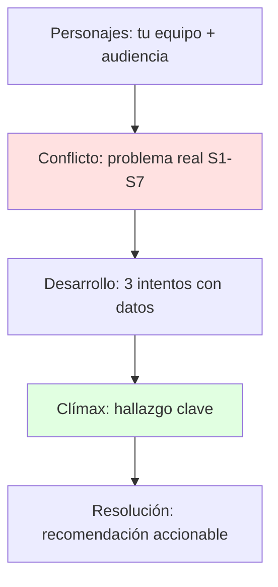
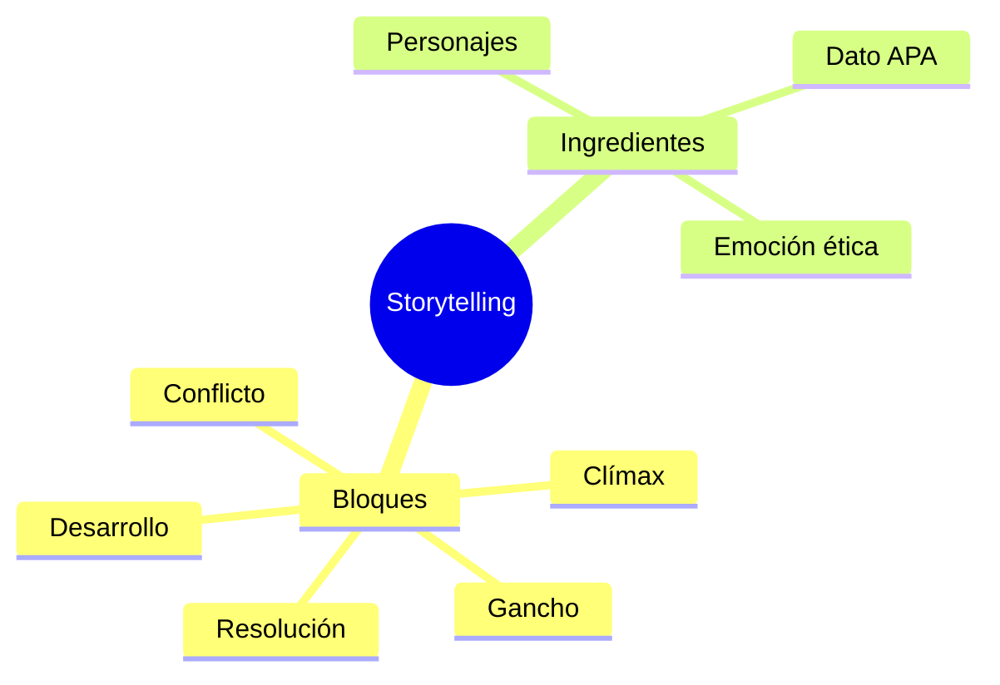

# 📖 Storytelling para Comunicar Ciencia

## 🎯 Introducción

> [!info] 💡 ¿Por Qué una Historia Vale más que 10 Diapositivas?
>
> El **storytelling científico** (sílabo 4.2) convierte tus datos S1-S8 en un relato que el jurado recuerda: personajes, conflicto, desarrollo y resolución, con emoción y empatía al servicio de la evidencia.
>
> **Analogía del mundo real:** Piensa en un postmortem bien contado:
>
> - **Sin historia** → "El deploy falló por timeout, se arregló" (nadie aprende)
> - **Con historia** → "A las 2am el pago cayó (conflicto), el equipo rastreó 3 hipótesis (desarrollo), encontró la race condition (clímax) y hoy despliega con bandera (resolución)"
> - **Emoción** → Conecta sin manipular: muestra el costo humano del problema
> - **Dato** → Ancla la emoción para que no sea humo
>
> | Razón | Charla Plana | Charla con Historia |
> |---|---|---|
> | **Atención** | Se pierde al minuto 2 | Arco que sostiene 8 min |
> | **Memoria** | Olvidan todo | Recuerdan conflicto + dato |
> | **Acción** | Aplauden y nada | Adoptan tu recomendación |
> | **Concurso** | Eliminada en semifinal | Finalista Voces con Ciencia |

---

## 🧵 Elementos Esenciales (Plantilla TED 5 Bloques)

### 🎭 Guion que Cabe en 1 Página

> [!note] 🎨 Estructura S9 + Taller 2 Storytelling (TAF)
>
> 1. Gancho (30s): escena concreta del problema ("El martes el grupo...")
> 2. Conflicto (1min): qué está en juego + dato que duele
> 3. Desarrollo (3min): 3 pruebas con evidencia APA (tus Unidades 1-3)
> 4. Clímax (1min): hallazgo en 1 frase memorable
> 5. Resolución (1min): qué hacer mañana + frase de cierre (10 palabras)
>
> | Elemento | Pregunta guía | Ejemplo |
> |---|---|---|
> | **Personajes** | ¿Quién vive el problema? | "Ana, líder del grupo 3, con entrega en 48h" |
> | **Conflicto** | ¿Qué se rompe si nada cambia? | "Sin acta, el informe se contradice y baja a 70" |
> | **Desarrollo** | ¿Qué probaron? | "Acta + roles + verificación IA en 2 talleres" |
> | **Resolución** | ¿Qué cambia desde mañana? | "Plantilla de acta en 5 min por clase" |
>
> **Regla emocional:** 1 historia + 1 dato por bloque. Historia sin dato es cuento; dato sin historia es manual.

---

## 🛠️ Patrón Guion TED Grupal (S9-S11)

> [!example] 💾 Del Borrador al Final (4-dic 23:00)
>
> S9: Taller 2 storytelling (TAF) + esqueleto en 5 bloques
> S10: Borrador completo en clases + revisión formativa del docente
> S11: Consultas puntuales + entrega final viernes 4-dic 23:00
> S12-S13: Simulación formativa con observaciones (vestuario, tiempo, voz)
> S14: Práctica calificada = Examen II parcial (auditorio/posgrado + grabación en Aula Virtual)

---

## ⚠️ Problemas Comunes y Soluciones

> [!danger] ❌ Error: Drama sin Dato, o Dato sin Drama (viola **emoción + evidencia**)
>
> **Síntomas:** lloran con tu historia pero el jurado pregunta "¿y la evidencia?"; o recitas tablas y todos miran el celular.
>
> **Ejemplo completo:**
>
> - ❌ **EL ERROR ESTÁ AQUÍ:** 7 minutos de anécdota del equipo sin una sola cifra, o 20 diapositivas de tablas leídas en voz plana.
> - ✅ Así sí: 1 historia de apertura + 1 dato que duele por bloque + cierre con acción ("con acta, 30% menos retrabajo en 2 talleres").
>
> **Solución:**
>
> - Por cada minuto emotivo, 1 diapositiva de evidencia citada
> - Ensaya con cronómetro: 7-8 min + 1 min colchón

---

## 🎯 Mejores Prácticas

> [!tip] 🏆 Checklist S9-S11
>
> **1. Participación 2 S9: creatividad del discurso (sincrónico)**
>
> Lleva 2 ganchos alternativos y vota con el grupo el más concreto.
>
> **2. Un objeto, una frase, un visual**
>
> Cada bloque tiene ancla memorable (acta impresa, captura del PAC, foto del taller).
>
> **3. Cierre que viaja a la final (20-ene-2027)**
>
> 5 grupos pasan: tu última frase debe citarse sola en el jurado.

---

## 📊 Resumen Visual

> [!success] 🔍 Comparación Final
>
> | Aspecto | Exponer Datos | Contar Ciencia |
> |---|---|---|
> | **Recuerdo** | ❌ 10% | ✅ Historia + dato |
> | **Persuasión** | Informa | Mueve a actuar |
> | **Uso Recomendado** | Anexos | ✅ **Guion TED** |

---

## 🚀 Próximos Pasos

> [!quote] 🌟 Continuando
>
> **Has aprendido:**
>
> ✅ Plantilla 5 bloques + tabla de elementos
> ✅ Protocolo S9-S14 hasta práctica calificada
> ✅ Equilibrio emoción–evidencia
>
> **Próximo tema:**
>
> | Tema | Qué verás | Por qué importa |
> |---|---|---|
> | **Voz, cuerpo, formatos y práctica TED** | Paraverbal, no verbal, estratégica, simulacros | Examen II parcial S14 |

---

## 🔗 Seguir estudiando

> [!info] 📚 Seguir estudiando
>
> - Mapa de contenido: [[Comunicación]]
> - Índice Unidad 4: [[00 - Índice Unidad 4]]
> - Anterior: [[01 - Argumentación efectiva, convencer vs persuadir]]
> - Siguiente: [[03 - Voz, cuerpo, formatos y práctica TED]]
> - Syllabus: [[Bienvenida y Syllabus Comunicación]]
> - Base MOOC: [[Preuniversitario/MOOC de Comunicación/Comunicación Efectiva|MOOC de Comunicación]]

## 📚 Referencias

> [!quote] 📖 Fuentes
>
> - Sílabo IDIG2012, Unidad 4: storytelling, personajes, conflicto, desarrollo, resolución (14h).
> - Planificación PAO 2-2026 S9-S11: Taller 2 storytelling + guion borrador → final 4-dic.
> - [1] M. Sánchez Fernández, *Comunicación efectiva y trabajo en equipo*, CEP, 2014.

---

**Tags:** #IDIG2012 #unidad4 #storytelling #ted #divulgacion
