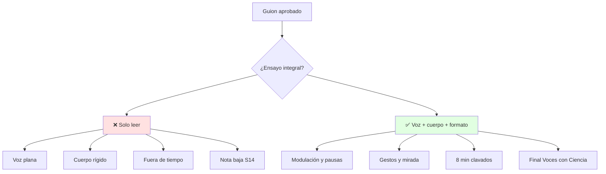
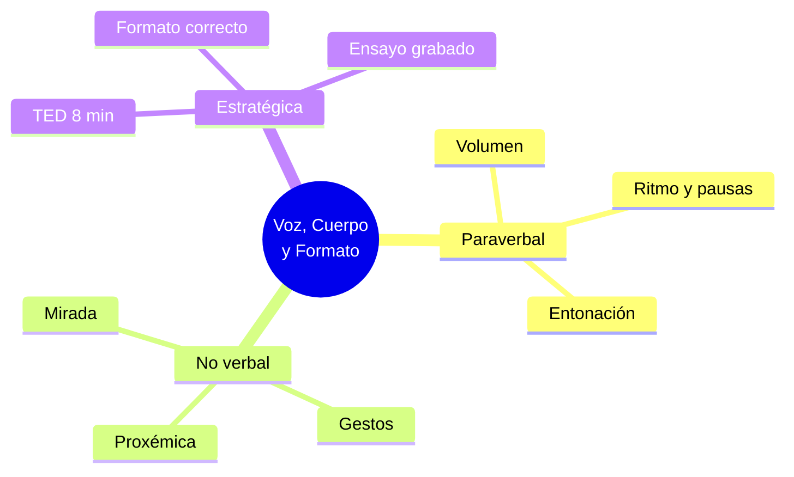

# 🎤 Voz, Cuerpo, Formatos y Práctica TED

## 🎯 Introducción

> [!info] 💡 ¿Por Qué la Mejor Idea Pierde con Mala Entrega?
>
> La **comunicación verbal/paraverbal/no verbal y estratégica** (sílabo 4.3-4.5) es el 50% práctico de tu nota: guion 50 + simulación 50. Un gran guion susurrado, sin mirada y pasado de tiempo reprueba el Examen II parcial (S14).
>
> **Analogía del mundo real:** Piensa en una demo de producto:
>
> - **Verbal** → Qué dices (guion, vocabulario, tesis)
> - **Paraverbal** → Cómo suenas (volumen, ritmo, pausas, entonación)
> - **No verbal** → Qué muestras (postura, gestos, contacto visual, proxémica)
> - **Estratégica** → Dónde y en qué formato (TED 8 min vs podcast 20 min vs debate)
>
> | Canal | Peso Percibido | Falla Típica S12-S13 |
> |---|---|---|
> | **Verbal** | Contenido recordado | Leer diapositivas |
> | **Paraverbal** | Credibilidad y energía | Monotonía + muletillas |
> | **No verbal** | Confianza inmediata | Sin contacto visual, manos en bolsillos |
> | **Estratégica** | Formato correcto | TED de 14 min (fuera de tiempo) |



---

## 🧵 Voz (Paraverbal) y Cuerpo (No Verbal)

### 🎭 Checklist de Ensayo S11-S13

> [!note] 🎨 Lo que el Jurado Califica sin Decirlo
>
> **Paraverbal (4.3): modulación, vocalización, dicción, entonación, volumen, velocidad + formal/informal.**
>
> | Variable | Estándar TED 8 min | Ejercicio 5 min |
> |---|---|---|
> | **Volumen** | Última fila oye sin micrófono forzado | Lee un párrafo al fondo del aula |
> | **Velocidad** | ~130 palabras/min, pausas tras dato | Graba 1 min y cuenta muletillas ("eh", "o sea") |
> | **Entonación** | Sube en pregunta, baja en cierre | Marca 3 picos en tu guion |
> | **Dicción** | Trabalenguas previo 2 min | "Tres tristes tigres" antes de salir |
> | **Registro** | Formal con audiencia mixta | Cero jerga interna sin explicar |
>
> **No verbal (4.4): gestos, posturas, contacto visual, proxémica, imagen y marca personal.**
>
> ```mermaid
> graph LR
>     O[Orador] --> G[Gestos abiertos]
>     O --> M[Mirada 3 puntos]
>     O --> P[Postura base]
>     O --> E[Espacio / proxémica]
>     style M fill:#e1f5ff
> ```
>
> | Señal | Haz | Evita |
> |---|---|---|
> | **Manos** | Enmarcan ideas, muestran 1-2-3 | Bolsillos, brazos cruzados |
> | **Mirada** | Triángulo: izquierda–centro–derecha | Solo al docente o al piso |
> | **Postura** | Pies base, peso repartido | Balanceo o paseo nervioso |
> | **Espacio** | 1-2 m del jurado, te acercas en clímax | Invadir o huir al atril |
> | **Imagen** | Formal acorde a TED ESPOL | Gorra, chanclas, celular en mano |

---

## 🛡️ Comunicación Estratégica y Formatos (4.5)

> [!success] 🏆 Elegir Formato es Decidir la Mitad
>
> **Planificar y adaptar el mensaje al formato y audiencia es la comunicación estratégica.**
>
> | Formato | Duración típica | Cuándo usarlo en tu carrera |
> |---|---|---|
> | **Charla TED** | 7-8 min | Examen II parcial S14, final 20-ene-2027 |
> | **Videocast/Podcast** | 5-20 min | Divulgar tu proyecto a no técnicos |
> | **Debate/Foro** | 30-60 min | Defender postura con refutación |
> | **Conferencia/Congreso** | 15-20 min | Ponencia con Q&A |
> | **Webinar/Simposio** | 45-90 min | Taller con interacción |
>
> Regla S14: el formato manda. Un TED no es un informe leído: es historia + dato + acción en 8 min.

---

## 🎨 Patrones S12-S14: de Simulación a Calificada

### 📥 Patrón: Simulación Formativa (S12-S13)

> [!example] 💾 Ensayo con Observaciones
>
> 1. Visten como el día final y llevan guion impreso + USB + PDF
> 2. Graban con celular en trípode (plano medio, audio al frente)
> 3. Rúbrica en vivo: voz (20) + cuerpo (20) + contenido (30) + tiempo (15) + visual (15)
> 4. 3 observaciones accionables por persona, no 20 vagas
> 5. Re-ensayan solo el bloque fallido 2 veces seguidas

### 📤 Patrón: Práctica Calificada = Examen II Parcial (S14)

> [!example] 💿 Día D en Auditorio/Posgrado
>
> 1. Llegan 30 min antes: prueban mic, clicker y video
> 2. Guion final ya entregado (requisito): sin guion no hay práctica
> 3. Exponen 7-8 min + asisten a la de compañeros (Participación 3)
> 4. Suben grabación a Aula Virtual antes del límite de calificaciones
> 5. Top 5 grupos → final Voces con Ciencia 20-ene-2027 10:30

---

## ⚠️ Problemas Comunes y Soluciones

> [!danger] ❌ Error: Leer Diapositivas de Espaldas (viola **hablarle al público, no a la pantalla**)
>
> **Síntomas:** jurado lee tu espalda, voz cae, tiempo se va a 12 min.
>
> **Ejemplo completo:**
>
> - ❌ **EL ERROR ESTÁ AQUÍ:** lees cada bullet de espaldas 12 minutos; el jurado lee más rápido que tú y deja de escucharte al minuto 2.
> - ✅ Así sí: diapositiva con 1 imagen + 5 palabras, tú dices el dato mirando al jurado, marcas [PAUSA] [MIRA] cada 60 segundos.
>
> **Solución:**
>
> - Diapositiva = 1 imagen + 5 palabras; el dato lo dices tú
> - Marca en el guion: [PAUSA] [MIRA] [GESTO 3] cada 60 segundos
> - Si te pierdes: vuelve a tu frase ancla del clímax, no reinicies

---

## 🎯 Mejores Prácticas

> [!tip] 🏆 Checklist Final S14
>
> **1. Evaluación 3 S11: paraverbal/no verbal (TAP asincrónica)**
>
> Repasa con tu video de simulación: 3 aciertos + 2 a corregir por miembro.
>
> **2. Sin guion aprobado no hay práctica**
>
> Entrega final 4-dic 23:00. Sin eso, no rindes el examen aunque ensayes.
>
> **3. Asistencia a compañeros (Participación 3)**
>
> Evalúas con rúbrica: eso también es nota y entrenamiento de jurado.

---

## 📊 Resumen Visual



> [!success] 🔍 Comparación Final
>
> | Aspecto | Improvisado | Ensayado TED |
> |---|---|---|
> | **Voz** | ❌ Plana | ✅ Modulada |
> | **Cuerpo** | Rígido | Abierto y móvil |
> | **Tiempo** | 14 min | 8 min clavados |
> | **Uso Recomendado** | Nunca en S14 | ✅ **Nota 50/50 práctica** |

---

## 🚀 Cierre de Unidad 4 y de la Materia (por ahora)

> [!quote] 🌟 Lo Logrado
>
> **Has aprendido:**
>
> ✅ Argumentación con esquema aprobado S8
> ✅ Storytelling con guion S9-S11
> ✅ Voz, cuerpo, formatos y práctica S12-S14
>
> **Mapa de la materia:**
>
> | Unidad | Estado | Evidencia |
> |---|---|---|
> | U1 Comunicación efectiva | ✅ 2 notas | Escucha + grupal |
> | U2 Pensamiento crítico | ✅ 2 notas | Complejo + prosumidor |
> | U3 Redacción | ✅ 3 notas | Expositivo + informes + IA |
> | U4 Comportamiento | ✅ 3 notas | Argumento + historia + TED |
>
> **Siguiente cuando llegue material:** rúbrica TED, lecturas nuevas, correcciones del docente y grabación final.

---

## 🔗 Seguir estudiando

> [!info] 📚 Seguir estudiando
>
> - Mapa de contenido: [[Comunicación]]
> - Índice Unidad 4: [[00 - Índice Unidad 4]]
> - Anterior: [[02 - Storytelling para comunicar ciencia]]
> - Syllabus: [[Bienvenida y Syllabus Comunicación]]
> - Base MOOC: [[Preuniversitario/MOOC de Comunicación/Comunicación Efectiva|MOOC de Comunicación]]

## 📚 Referencias

> [!quote] 📖 Fuentes
>
> - Sílabo IDIG2012, Unidad 4.3-4.5: paraverbal, no verbal, estratégica y formatos (14h).
> - Planificación PAO 2-2026 S11-S14: Evaluación 3 + simulaciones + práctica calificada + final 20-ene-2027.
> - [1] M. Sánchez Fernández, *Comunicación efectiva y trabajo en equipo*, CEP, 2014.
> - [2] F. Poyatos, *La comunicación no verbal como asignatura*, 2013 — https://revistas.ucm.es/index.php/DIDA/article/view/42244

---

**Tags:** #IDIG2012 #unidad4 #paraverbal #no-verbal #ted #practica
