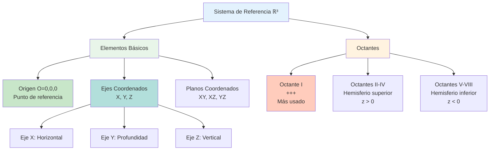

# 📐 Sistema de Referencia Espacial en ℝ³

## 🎯 Fundamentos del Espacio Tridimensional

> [!info]- 💡 Introducción al Espacio ℝ³ El **espacio euclidiano tridimensional** ℝ³ es la extensión natural del plano cartesiano ℝ² a tres dimensiones. Representa el espacio físico en el que vivimos y es fundamental para la geometría analítica, física, ingeniería y computación gráfica.
> 
> **Analogías útiles:**
> 
> - **Geográfico:** Latitud, longitud y altitud
> - **Arquitectura:** Ancho, largo y alto de un edificio
> - **Videojuegos:** Coordenadas X, Y, Z de un personaje
> 
> **Importancia histórica:**
> 
> - **René Descartes (1637):** Sistema de coordenadas cartesianas
> - **Pierre de Fermat (1636):** Geometría analítica independiente
> - **Leonard Euler (1748):** Formalización del espacio tridimensional
> - **Hermann Grassmann (1844):** Álgebra de espacios vectoriales

### 📊 Definición de ℝ³

> [!note]- 🌟 El Conjunto ℝ³ **Definición formal:**
> 
> ℝ³ = {(x, y, z) | x, y, z ∈ ℝ}
> 
> Es el **producto cartesiano** ℝ × ℝ × ℝ, el conjunto de todas las ternas ordenadas de números reales.
> 
> **Componentes del sistema:**
> 
> 1. **Origen:** Punto O = (0, 0, 0)
> 2. **Ejes coordenados:**
>     - **Eje X:** Horizontal (derecha positiva)
>     - **Eje Y:** Horizontal (hacia atrás positiva)
>     - **Eje Z:** Vertical (arriba positiva)
> 3. **Planos coordenados:**
>     - **Plano XY:** z = 0
>     - **Plano XZ:** y = 0
>     - **Plano YZ:** x = 0
> 
> **Propiedades:**
> 
> - Es un **espacio vectorial** de dimensión 3
> - Tiene **métrica euclidiana** (permite medir distancias)
> - Es **completo** (toda sucesión de Cauchy converge)

## 📍 Puntos en el Espacio

### 🔢 Coordenadas Cartesianas

> [!example]- 🎯 Representación de Puntos **Notación estándar:**
> 
> Un punto P en ℝ³ se denota: **P = (x, y, z)**
> 
> Donde:
> 
> - **x:** coordenada en el eje X (abscisa)
> - **y:** coordenada en el eje Y (ordenada)
> - **z:** coordenada en el eje Z (cota o altitud)
> 
> **Interpretación geométrica:**
> 
> - Cada coordenada representa la **distancia con signo** desde el origen hasta la proyección del punto sobre cada eje
> - El punto se localiza en la intersección de tres planos perpendiculares a los ejes
> 
> **Ejemplos básicos:**
> 
> 1. **Origen:** O = (0, 0, 0)
> 2. **Sobre ejes:**
>     - A = (5, 0, 0) → sobre el eje X
>     - B = (0, -3, 0) → sobre el eje Y
>     - C = (0, 0, 7) → sobre el eje Z
> 3. **En planos coordenados:**
>     - D = (2, 4, 0) → en el plano XY
>     - E = (1, 0, 3) → en el plano XZ
>     - F = (0, 2, -5) → en el plano YZ
> 4. **Generales:**
>     - G = (3, -2, 4)
>     - H = (-1, 5, -2)

### 🎨 Visualización de Puntos

> [!tip]- 👁️ Cómo Ubicar Puntos en ℝ³ **Proceso paso a paso para P = (x, y, z):**
> 
> 1. **Desde el origen O:**
>     - Moverse x unidades en dirección del eje X
>     - Moverse y unidades en dirección del eje Y
>     - Moverse z unidades en dirección del eje Z
> 2. **Método de proyecciones:**
>     - Proyectar sobre el plano XY → (x, y, 0)
>     - Desde allí, subir z unidades verticalmente
> 
> **Ejemplo detallado:**
> 
> Ubicar P = (3, 2, 4)
> 
> - Avanzar 3 unidades en X (hacia la derecha)
> - Avanzar 2 unidades en Y (hacia atrás)
> - Subir 4 unidades en Z (hacia arriba)

## 🎲 Octantes del Espacio

### 📦 Definición de Octantes

> [!warning]- 🔷 División del Espacio en Octantes Los tres planos coordenados dividen el espacio ℝ³ en **ocho regiones** llamadas **octantes**, análogas a los cuadrantes del plano.
> 
> **Octante I (Primer Octante):**
> 
> - **Signos:** (+, +, +)
> - **Condición:** x > 0, y > 0, z > 0
> - **Ejemplo:** (2, 3, 5)
> 
> **Octante II:**
> 
> - **Signos:** (−, +, +)
> - **Condición:** x < 0, y > 0, z > 0
> - **Ejemplo:** (−1, 4, 2)
> 
> **Octante III:**
> 
> - **Signos:** (−, −, +)
> - **Condición:** x < 0, y < 0, z > 0
> - **Ejemplo:** (−3, −2, 6)
> 
> **Octante IV:**
> 
> - **Signos:** (+, −, +)
> - **Condición:** x > 0, y < 0, z > 0
> - **Ejemplo:** (5, −1, 3)
> 
> **Octante V:**
> 
> - **Signos:** (+, +, −)
> - **Condición:** x > 0, y > 0, z < 0
> - **Ejemplo:** (2, 3, −4)
> 
> **Octante VI:**
> 
> - **Signos:** (−, +, −)
> - **Condición:** x < 0, y > 0, z < 0
> - **Ejemplo:** (−1, 2, −5)
> 
> **Octante VII:**
> 
> - **Signos:** (−, −, −)
> - **Condición:** x < 0, y < 0, z < 0
> - **Ejemplo:** (−2, −3, −1)
> 
> **Octante VIII:**
> 
> - **Signos:** (+, −, −)
> - **Condición:** x > 0, y < 0, z < 0
> - **Ejemplo:** (4, −2, −3)

### 📋 Tabla Resumen de Octantes

> [!example]- 📊 Clasificación Completa
> 
> |Octante|Signo X|Signo Y|Signo Z|Condiciones|Ejemplo|
> |---|---|---|---|---|---|
> |**I**|+|+|+|x>0, y>0, z>0|(2,3,4)|
> |**II**|−|+|+|x<0, y>0, z>0|(−1,2,5)|
> |**III**|−|−|+|x<0, y<0, z>0|(−3,−1,2)|
> |**IV**|+|−|+|x>0, y<0, z>0|(4,−2,3)|
> |**V**|+|+|−|x>0, y>0, z<0|(1,3,−2)|
> |**VI**|−|+|−|x<0, y>0, z<0|(−2,1,−4)|
> |**VII**|−|−|−|x<0, y<0, z<0|(−1,−3,−5)|
> |**VIII**|+|−|−|x>0, y<0, z<0|(3,−1,−2)|
> 
> **Nota importante:**
> 
> - El octante I es el más usado en aplicaciones prácticas
> - Puntos sobre planos o ejes no pertenecen a ningún octante
> - La numeración puede variar según la convención usada

## 🎨 Diagrama del Sistema de Referencia

## 🧪 Ejercicios de Aplicación

> [!example]- 💪 Práctica con el Sistema de Referencia
> 
> **Nivel 1 - Identificación:** 🟢
> 
> 1. Identificar en qué octante se encuentra cada punto:
>     - A = (3, 5, 2) → **Octante I**
>     - B = (−2, 4, −1) → **Octante VI**
>     - C = (1, −3, 6) → **Octante IV**
>     - D = (−4, −5, −2) → **Octante VII**
> 2. ¿Cuáles puntos están sobre planos coordenados?
>     - E = (2, 0, 5) → **Plano XZ**
>     - F = (0, −3, 4) → **Plano YZ**
>     - G = (1, 2, 0) → **Plano XY**
> 
> **Nivel 2 - Clasificación:** 🟡
> 
> 3. Determinar las condiciones que debe cumplir un punto para estar:
>     - **En el octante III:** x < 0, y < 0, z > 0
>     - **Sobre el eje Y positivo:** x = 0, z = 0, y > 0
>     - **En el plano XZ con z < 0:** y = 0, z < 0
> 4. Encontrar tres puntos que estén:
>     - **En el primer octante:** (1,2,3), (5,1,4), (2,2,2)
>     - **En el plano XY:** (3,4,0), (−1,2,0), (0,0,0)
> 
> **Nivel 3 - Análisis:** 🔴
> 
> 5. Un punto P está en el segundo octante y equidista de los planos YZ y XY. Si su coordenada y es 4, encuentra las restricciones sobre x y z.
>     - **Segundo octante:** x < 0, y > 0, z > 0
>     - **Equidista de YZ y XY:** |x| = |z|
>     - **Dado y = 4:** Como x < 0 y z > 0, entonces x = −z
>     - **Solución:** P = (−a, 4, a) donde a > 0
> 6. Describe la región del espacio donde x² + y² < 4 y z > 0.
>     - **Análisis:** Cilindro circular de radio 2 centrado en el eje Z, solo la parte sobre el plano XY
>     - **Octantes incluidos:** Partes de los octantes I, II, III y IV

## 🔗 Conceptos Relacionados

> [!tip]- 🌐 Sistemas de Coordenadas Alternativos
> 
> Además del sistema cartesiano, existen otros sistemas de coordenadas en ℝ³:
> 
> **1. Coordenadas cilíndricas (ρ, φ, z):**
> 
> - **ρ:** distancia radial desde el eje Z
> - **φ:** ángulo en el plano XY
> - **z:** altura
> - **Conversión:** x = ρcos(φ), y = ρsin(φ), z = z
> 
> **2. Coordenadas esféricas (r, θ, φ):**
> 
> - **r:** distancia desde el origen
> - **θ:** ángulo polar (desde eje Z)
> - **φ:** ángulo azimutal (en plano XY)
> - **Conversión:** x = rsin(θ)cos(φ), y = rsin(θ)sin(φ), z = rcos(θ)
> 
> **Aplicaciones:**
> 
> - **Cilíndricas:** Problemas con simetría cilíndrica (tuberías, campos magnéticos)
> - **Esféricas:** Problemas con simetría esférica (gravedad, electromagnetismo)

## 🔗 Conexiones con Temas Siguientes

> [!quote]- 🌟 Progresión del Curso
> 
> **Base para:**
> 
> - [[01.2 Vectores en ℝ³]] - Operaciones con magnitudes dirigidas
> - [[01.3 Distancia en el Espacio]] - Métrica euclidiana
> - [[01.4 Rectas en ℝ³]] - Objetos lineales unidimensionales
> - [[01.5 Planos en ℝ³]] - Objetos lineales bidimensionales
> 
> **Conceptos relacionados:**
> 
> - [[Álgebra Lineal]] - Espacios vectoriales
> - [[Cálculo Vectorial]] - Funciones de varias variables
> - [[Geometría Diferencial]] - Curvas y superficies
> 
> **Aplicaciones avanzadas:**
> 
> - [[Transformaciones Lineales]] - Cambios de base
> - [[Producto Vectorial]] - Operaciones en ℝ³
> - [[Ecuaciones Paramétricas]] - Curvas en el espacio

## 💡 Consejos de Estudio

> [!tip]- 🧠 Estrategias de Aprendizaje
> 
> **Para visualizar el espacio:**
> 
> 1. **Usar modelos físicos:** Construir ejes con palillos o alambre
> 2. **Software 3D:** GeoGebra, Desmos 3D, Mathematica
> 3. **Dibujar constantemente:** Practicar perspectiva isométrica
> 
> **Para memorizar octantes:**
> 
> - **Nemotecnia:** "Primer octante = Todo Positivo"
> - **Patrón:** Los octantes I-IV tienen z > 0, V-VIII tienen z < 0
> - **Práctica:** Ubicar objetos cotidianos en un sistema imaginario
> 
> **Errores comunes a evitar:**
> 
> - Confundir el orden de las coordenadas (x, y, z)
> - No considerar signos negativos al ubicar puntos
> - Olvidar que puntos sobre planos/ejes no están en octantes

---

**Tags:** #geometría-analítica #R3 #coordenadas-cartesianas #sistema-referencia #octantes #espacio-tridimensional #puntos-espacio #ejes-coordenados #planos-coordenados #matemáticas #geometría-espacial #university #cálculo-vectorial