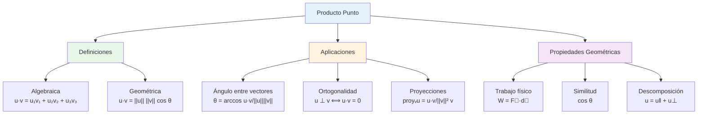

# 🔷 Producto Punto y Ángulos

## 🎯 Fundamentos del Producto Punto

> [!info]- 💡 Introducción al Producto Escalar El **producto punto** (también llamado **producto escalar** o **producto interno**) es una operación entre dos vectores que resulta en un **número real** (escalar). Es una de las operaciones vectoriales más importantes y útiles en matemáticas, física e ingeniería.
> 
> **Analogías útiles:**
> 
> - **Física:** Trabajo realizado por una fuerza (W = F⃗ · d⃗)
> - **Geometría:** Medida de "alineación" entre dos vectores
> - **Proyección:** Sombra de un vector sobre otro
> - **Similitud:** Qué tan "parecidos" son dos vectores
> 
> **Diferencia fundamental:**
> 
> - **Producto punto:** Vector · Vector = Escalar
> - **Producto cruz:** Vector × Vector = Vector (lo veremos después)
> 
> **Importancia histórica:**
> 
> - **Hermann Grassmann (1844):** Primeros trabajos en álgebra vectorial
> - **Josiah Willard Gibbs (1881):** Notación moderna del producto punto
> - **Oliver Heaviside (1893):** Aplicaciones en electromagnetismo
> - Fundamental en mecánica cuántica (producto interno de funciones)

### 📝 Definición Formal

> [!note]- 🌟 Concepto Matemático del Producto Punto **Definición algebraica:**
> 
> Dados dos vectores **u** = (u₁, u₂, u₃) y **v** = (v₁, v₂, v₃) en ℝ³, su producto punto es:
> 
> **u · v = u₁v₁ + u₂v₂ + u₃v₃**
> 
> **Notaciones equivalentes:**
> 
> - **u · v** (más común)
> - **⟨u, v⟩** (notación de producto interno)
> - **u · v** (con punto interpunto)
> 
> **Definición geométrica:**
> 
> **u · v = ||u|| · ||v|| · cos(θ)**
> 
> Donde θ es el ángulo entre los vectores u y v (0 ≤ θ ≤ π)
> 
> **Características fundamentales:**
> 
> 1. **Resultado:** Es un número real (escalar), NO un vector
> 2. **Signo:** Puede ser positivo, negativo o cero
> 3. **Simetría:** u · v = v · u (conmutativo)
> 4. **Relaciona:** Magnitudes de vectores con ángulo entre ellos

### 🔢 Cálculo del Producto Punto

> [!example]- 📊 Método Algebraico **Fórmula de componentes:**
> 
> **u · v = u₁v₁ + u₂v₂ + u₃v₃**
> 
> **Proceso:**
> 
> 1. Multiplicar las componentes correspondientes
> 2. Sumar todos los productos
> 
> **Ejemplos básicos:**
> 
> **Ejemplo 1:**
> 
> ```
> u = (3, 4, 0)
> v = (1, 2, 5)
> 
> u · v = (3)(1) + (4)(2) + (0)(5)
>       = 3 + 8 + 0
>       = 11
> ```
> 
> **Ejemplo 2:**
> 
> ```
> u = (2, -3, 1)
> v = (4, 2, -5)
> 
> u · v = (2)(4) + (-3)(2) + (1)(-5)
>       = 8 - 6 - 5
>       = -3
> ```
> 
> **Ejemplo 3:**
> 
> ```
> u = (1, 0, -1)
> v = (2, 3, 2)
> 
> u · v = (1)(2) + (0)(3) + (-1)(2)
>       = 2 + 0 - 2
>       = 0
> ```
> 
> **¡Estos vectores son perpendiculares!**

## 📐 Interpretación Geométrica

### 🎨 Significado del Producto Punto

> [!tip]- 👁️ Visualización Geométrica **El producto punto mide:**
> 
> **1. Alineación entre vectores:**
> 
> - **u · v > 0:** Forman ángulo agudo (θ < 90°)
> - **u · v = 0:** Son perpendiculares (θ = 90°)
> - **u · v < 0:** Forman ángulo obtuso (θ > 90°)
> 
> **2. Proyección:**
> 
> - La "sombra" de un vector sobre otro
> - Componente de u en la dirección de v
> 
> **3. Similitud direccional:**
> 
> - Valores grandes: vectores apuntan en direcciones similares
> - Valor cero: direcciones completamente independientes
> - Valores negativos: direcciones opuestas
> 
> **Interpretación física:**
> 
> **Trabajo mecánico:**
> 
> ```
> W = F⃗ · d⃗ = ||F⃗|| · ||d⃗|| · cos(θ)
> ```
> 
> - Si F⃗ y d⃗ están alineados (θ = 0°): W máximo
> - Si son perpendiculares (θ = 90°): W = 0
> - Si son opuestos (θ = 180°): W negativo

### 📏 Propiedades del Producto Punto

> [!success]- ✅ Propiedades Algebraicas **1. Conmutativa:**
> 
> ```
> u · v = v · u
> ```
> 
> **2. Distributiva respecto a la suma:**
> 
> ```
> u · (v + w) = u · v + u · w
> (u + v) · w = u · w + v · w
> ```
> 
> **3. Asociativa con escalares:**
> 
> ```
> (ku) · v = k(u · v) = u · (kv)
> ```
> 
> Donde k es un escalar
> 
> **4. Producto de un vector consigo mismo:**
> 
> ```
> u · u = ||u||² = u₁² + u₂² + u₃²
> ```
> 
> **5. Desigualdad de Cauchy-Schwarz:**
> 
> ```
> |u · v| ≤ ||u|| · ||v||
> ```
> 
> Con igualdad solo si u y v son paralelos
> 
> **6. Propiedad del vector cero:**
> 
> ```
> u · 0 = 0 para todo vector u
> ```
> 
> **7. Positividad:**
> 
> ```
> u · u ≥ 0
> u · u = 0 ⟺ u = 0
> ```

## 📐 Ángulo entre Vectores

### 🎯 Fórmula del Ángulo

> [!warning]- 📐 Cálculo del Ángulo **Fórmula fundamental:**
> 
> De la definición geométrica u · v = ||u|| · ||v|| · cos(θ), despejamos:
> 
> **cos(θ) = (u · v) / (||u|| · ||v||)**
> 
> **θ = arccos[(u · v) / (||u|| · ||v||)]**
> 
> **Condiciones:**
> 
> - 0 ≤ θ ≤ π (0° ≤ θ ≤ 180°)
> - Los vectores deben ser no nulos
> 
> **Proceso de cálculo:**
> 
> 1. Calcular u · v (producto punto)
> 2. Calcular ||u|| y ||v|| (magnitudes)
> 3. Calcular cos(θ) = (u · v)/(||u|| · ||v||)
> 4. Aplicar arccos para obtener θ
> 
> **Casos especiales:**
> 
> - Si cos(θ) = 1 → θ = 0° (paralelos, mismo sentido)
> - Si cos(θ) = 0 → θ = 90° (perpendiculares)
> - Si cos(θ) = -1 → θ = 180° (paralelos, sentidos opuestos)

### 📊 Ejemplos Detallados

> [!example]- 🎯 Casos Prácticos **Ejemplo 1: Ángulo entre vectores básicos**
> 
> Dados u = (1, 1, 0) y v = (1, 0, 0)
> 
> ```
> Paso 1: u · v = (1)(1) + (1)(0) + (0)(0) = 1
> 
> Paso 2: ||u|| = √(1² + 1² + 0²) = √2
>         ||v|| = √(1² + 0² + 0²) = 1
> 
> Paso 3: cos(θ) = 1/(√2 · 1) = 1/√2 = √2/2
> 
> Paso 4: θ = arccos(√2/2) = 45° = π/4 rad
> ```
> 
> ---
> 
> **Ejemplo 2: Vectores perpendiculares**
> 
> Dados u = (3, -2, 1) y v = (2, 3, 0)
> 
> ```
> Paso 1: u · v = (3)(2) + (-2)(3) + (1)(0)
>              = 6 - 6 + 0 = 0
> 
> Como u · v = 0, los vectores son perpendiculares
> θ = 90° = π/2 rad
> 
> (No necesitamos calcular las magnitudes)
> ```
> 
> ---
> 
> **Ejemplo 3: Ángulo obtuso**
> 
> Dados u = (1, 2, 3) y v = (-2, -1, 0)
> 
> ```
> Paso 1: u · v = (1)(-2) + (2)(-1) + (3)(0)
>              = -2 - 2 + 0 = -4
> 
> Paso 2: ||u|| = √(1² + 2² + 3²) = √14
>         ||v|| = √((-2)² + (-1)² + 0²) = √5
> 
> Paso 3: cos(θ) = -4/(√14 · √5) = -4/√70 ≈ -0.478
> 
> Paso 4: θ = arccos(-0.478) ≈ 118.6° ≈ 2.07 rad
> ```
> 
> Como cos(θ) < 0, el ángulo es obtuso (θ > 90°)
> 
> ---
> 
> **Ejemplo 4: Aplicación práctica**
> 
> Dos fuerzas actúan sobre un objeto:
> 
> - F₁ = (10, 5, 0) N
> - F₂ = (3, 8, 0) N
> 
> ¿Qué ángulo forman?
> 
> ```
> F₁ · F₂ = (10)(3) + (5)(8) + (0)(0) = 30 + 40 = 70
> 
> ||F₁|| = √(10² + 5²) = √125 = 5√5
> ||F₂|| = √(3² + 8²) = √73
> 
> cos(θ) = 70/(5√5 · √73) = 70/(5√365) ≈ 0.732
> 
> θ = arccos(0.732) ≈ 42.9°
> ```

## ⊥ Vectores Perpendiculares (Ortogonales)

### 🔲 Definición y Criterio

> [!note]- 📐 Ortogonalidad **Definición:**
> 
> Dos vectores **u** y **v** son **perpendiculares** (u **ortogonales**) si forman un ángulo de 90°.
> 
> **Notación:** u ⊥ v
> 
> **Criterio del producto punto:**
> 
> **u ⊥ v ⟺ u · v = 0**
> 
> Esta es la forma más fácil de verificar perpendicularidad.
> 
> **Casos especiales:**
> 
> 1. El vector cero es perpendicular a todos los vectores
> 2. Los vectores unitarios canónicos i, j, k son mutuamente perpendiculares:
>     - i · j = 0
>     - i · k = 0
>     - j · k = 0
> 
> **Importancia:**
> 
> - Base de sistemas de coordenadas ortogonales
> - Proyecciones y componentes
> - Bases ortonormales en álgebra lineal

### 📊 Ejemplos de Ortogonalidad

> [!example]- ✅ Verificación de Perpendicularidad **Ejemplo 1: Verificación básica**
> 
> ¿Son perpendiculares u = (2, -1, 3) y v = (1, 5, -1)?
> 
> ```
> u · v = (2)(1) + (-1)(5) + (3)(-1)
>       = 2 - 5 - 3
>       = -6 ≠ 0
> 
> NO son perpendiculares
> ```
> 
> ---
> 
> **Ejemplo 2: Encontrar vector perpendicular**
> 
> Dado u = (3, 4, 0), encontrar un vector v perpendicular a u en el plano XY.
> 
> ```
> Necesitamos v = (a, b, 0) tal que u · v = 0
> 
> (3, 4, 0) · (a, b, 0) = 0
> 3a + 4b = 0
> 
> Solución general: b = -3a/4
> 
> Si a = 4: v = (4, -3, 0)
> 
> Verificación: u · v = (3)(4) + (4)(-3) + 0 = 12 - 12 = 0 ✓
> ```
> 
> ---
> 
> **Ejemplo 3: Tres vectores mutuamente perpendiculares**
> 
> Verificar que u = (1, 0, 0), v = (0, 1, 0), w = (0, 0, 1) son mutuamente perpendiculares:
> 
> ```
> u · v = (1)(0) + (0)(1) + (0)(0) = 0 ✓
> u · w = (1)(0) + (0)(0) + (0)(1) = 0 ✓
> v · w = (0)(0) + (1)(0) + (0)(1) = 0 ✓
> 
> Forman una base ortonormal (perpendiculares y unitarios)
> ```

## 📏 Proyecciones Vectoriales

### 🎯 Proyección de un Vector sobre Otro

> [!success]- 📐 Concepto de Proyección **Definición:**
> 
> La **proyección** de un vector **u** sobre un vector **v** es el vector que representa la "sombra" de u sobre la línea de v.
> 
> **Notación:** proyᵥ(u) o proj**ᵥ**(u)
> 
> **Fórmula:**
> 
> **proyᵥ(u) = [(u · v) / (v · v)] · v**
> 
> O equivalentemente:
> 
> **proyᵥ(u) = [(u · v) / ||v||²] · v**
> 
> **Componente escalar (longitud de la proyección):**
> 
> **compᵥ(u) = (u · v) / ||v||**
> 
> Esta es la magnitud de la proyección (puede ser negativa)
> 
> **Relación:**
> 
> ```
> proyᵥ(u) = compᵥ(u) · (v/||v||)
> proyᵥ(u) = compᵥ(u) · v̂
> ```
> 
> Donde v̂ es el vector unitario en dirección de v

### 📊 Ejemplos de Proyecciones

> [!example]- 🎯 Cálculos de Proyecciones **Ejemplo 1: Proyección básica**
> 
> Proyectar u = (3, 4, 0) sobre v = (1, 0, 0)
> 
> ```
> Paso 1: u · v = (3)(1) + (4)(0) + (0)(0) = 3
> 
> Paso 2: v · v = 1² + 0² + 0² = 1
> 
> Paso 3: proyᵥ(u) = (3/1) · (1, 0, 0)
>                  = (3, 0, 0)
> 
> Interpretación: La "sombra" de u sobre el eje X
> ```
> 
> ---
> 
> **Ejemplo 2: Proyección general**
> 
> Proyectar u = (2, 3, 1) sobre v = (1, 1, 1)
> 
> ```
> Paso 1: u · v = (2)(1) + (3)(1) + (1)(1) = 6
> 
> Paso 2: v · v = 1² + 1² + 1² = 3
> 
> Paso 3: proyᵥ(u) = (6/3) · (1, 1, 1)
>                  = 2 · (1, 1, 1)
>                  = (2, 2, 2)
> 
> Componente escalar: compᵥ(u) = 6/√3 = 2√3
> ```
> 
> ---
> 
> **Ejemplo 3: Aplicación física**
> 
> Una fuerza F = (10, 5, 0) N actúa sobre un objeto que se mueve en dirección d = (1, 0, 0). ¿Cuánta fuerza contribuye al movimiento?
> 
> ```
> Necesitamos proyₐ(F):
> 
> F · d = (10)(1) + (5)(0) + (0)(0) = 10
> d · d = 1
> 
> proyₐ(F) = (10/1) · (1, 0, 0) = (10, 0, 0) N
> 
> Solo 10 N contribuyen al movimiento en dirección d
> Los otros 5 N actúan perpendicularmente
> ```

## 🔄 Descomposición Ortogonal

### 📐 Componentes Paralela y Perpendicular

> [!tip]- 🎯 Teorema de Descomposición **Todo vector u puede descomponerse respecto a otro vector v como:**
> 
> **u = u‖ + u⊥**
> 
> Donde:
> 
> - **u‖** = proyᵥ(u) (componente paralela a v)
> - **u⊥** = u - proyᵥ(u) (componente perpendicular a v)
> 
> **Propiedades:**
> 
> 1. u‖ es paralelo a v
> 2. u⊥ es perpendicular a v
> 3. u⊥ · v = 0
> 4. ||u||² = ||u‖||² + ||u⊥||² (Teorema de Pitágoras)
> 
> **Proceso de cálculo:**
> 
> ```
> 1. Calcular u‖ = proyᵥ(u)
> 2. Calcular u⊥ = u - u‖
> 3. Verificar u⊥ · v = 0
> ```
> 
> **Ejemplo:**
> 
> ```
> u = (5, 2, 0), v = (1, 0, 0)
> 
> u‖ = proyᵥ(u) = (5, 0, 0)
> u⊥ = u - u‖ = (5, 2, 0) - (5, 0, 0) = (0, 2, 0)
> 
> Verificación:
> - u‖ es paralelo a v (ambos en dirección X) ✓
> - u⊥ · v = (0)(1) + (2)(0) + (0)(0) = 0 ✓
> - ||u||² = 5² + 2² = 29
> - ||u‖||² + ||u⊥||² = 25 + 4 = 29 ✓
> ```

## 🎨 Diagrama de Conceptos



## 🧪 Ejercicios Integrales

> [!example]- 💪 Práctica Completa **Nivel 1 - Básico:** 🟢
> 
> 1. Calcular el producto punto: a) u = (2, 3, 1) y v = (1, -2, 3) b) u = (4, 0, -2) y v = (1, 5, 2)
> 
> **Solución:**
> 
> ```
> a) u · v = (2)(1) + (3)(-2) + (1)(3)
>          = 2 - 6 + 3 = -1
> 
> b) u · v = (4)(1) + (0)(5) + (-2)(2)
>          = 4 + 0 - 4 = 0
>    ¡Los vectores son perpendiculares!
> ```
> 
> 2. Verificar si los siguientes pares son perpendiculares: a) u = (1, 2, -1) y v = (2, -1, 0) b) u = (3, 4, 0) y v = (4, -3, 0)
> 
> **Solución:**
> 
> ```
> a) u · v = (1)(2) + (2)(-1) + (-1)(0)
>          = 2 - 2 + 0 = 0 ✓ Perpendiculares
> 
> b) u · v = (3)(4) + (4)(-3) + (0)(0)
>          = 12 - 12 + 0 = 0 ✓ Perpendiculares
> ```
> 
> ---
> 
> **Nivel 2 - Intermedio:** 🟡
> 
> 3. Calcular el ángulo entre u = (1, 2, 2) y v = (2, 1, 0):
> 
> **Solución:**
> 
> ```
> u · v = (1)(2) + (2)(1) + (2)(0) = 4
> 
> ||u|| = √(1² + 2² + 2²) = √9 = 3
> ||v|| = √(2² + 1² + 0²) = √5
> 
> cos(θ) = 4/(3√5) = 4/(3·2.236) ≈ 0.596
> 
> θ = arccos(0.596) ≈ 53.4° ≈ 0.93 rad
> ```
> 
> 4. Proyectar u = (4, 3, 0) sobre v = (1, 0, 0):
> 
> **Solución:**
> 
> ```
> u · v = (4)(1) + (3)(0) + (0)(0) = 4
> v · v = 1² + 0² + 0² = 1
> 
> proyᵥ(u) = (4/1) · (1, 0, 0) = (4, 0, 0)
> 
> Componente perpendicular:
> u⊥ = u - proyᵥ(u) = (4, 3, 0) - (4, 0, 0) = (0, 3, 0)
> ```
> 
> ---
> 
> **Nivel 3 - Avanzado:** 🔴
> 
> 5. Dado u = (2, 3, -1), encontrar un vector v tal que:
>     - ||v|| = 5
>     - v es perpendicular a u
>     - v está en el plano XY
> 
> **Solución:**
> 
> ```
> Sea v = (a, b, 0) con a² + b² = 25
> 
> Condición de perpendicularidad:
> u · v = 0
> (2, 3, -1) · (a, b, 0) = 0
> 2a + 3b = 0
> a = -3b/2
> 
> Sustituyendo en la magnitud:
> (-3b/2)² + b² = 25
> 9b²/4 + b² = 25
> 
> 13b²/4 = 25 b² = 100/13 b = ±10/√13
> 
> Si b = 10/√13: a = -15/√13
> 
> v = (-15/√13, 10/√13, 0)
> 
> Simplificado multiplicando por √13: v ≈ (-4.16, 2.77, 0)
> 
> ```
> 
> 6. Problema aplicado:
>    Una fuerza F = (100, 50, 30) N actúa sobre un objeto que se desplaza
>    d = (2, 1, 0) m. Calcular:
>    a) Trabajo realizado
>    b) Ángulo entre F y d
>    c) Componente de F en dirección del movimiento
> 
> **Solución:**
> ```
> 
> a) W = F · d = (100)(2) + (50)(1) + (30)(0) = 200 + 50 + 0 = 250 J
> 
> b) ||F|| = √(100² + 50² + 30²) = √11900 ≈ 109.09 N ||d|| = √(2² + 1² + 0²) = √5 ≈ 2.236 m
> 
> cos(θ) = 250/(109.09 · 2.236) ≈ 1.025
> 
> ¡Error! cos(θ) no puede ser > 1 Recalculando: cos(θ) = 250/243.88 ≈ 1.025
> 
> Realmente: cos(θ) = 250/(√11900 · √5) ≈ 0.914 θ = arccos(0.914) ≈ 23.96°
> 
> c) compₐ(F) = (F · d) / ||d|| = 250/√5 ≈ 111.8 N
> ```

## 📚 Propiedades Avanzadas

> [!note]- 🔬 Teoremas Importantes **1. Desigualdad de Cauchy-Schwarz:**
> 
> ```
> |u · v| ≤ ||u|| · ||v||
> ```
> 
> Con igualdad si y solo si u y v son paralelos.
> 
> **Consecuencia:** -1 ≤ cos(θ) ≤ 1
> 
> **2. Desigualdad triangular:**
> 
> ```
> ||u + v|| ≤ ||u|| + ||v||
> ```
> 
> **Demostración usando producto punto:**
> 
> ```
> ||u + v||² = (u + v) · (u + v)
>            = u · u + 2(u · v) + v · v
>            = ||u||² + 2(u · v) + ||v||²
>            ≤ ||u||² + 2||u|| · ||v|| + ||v||²  (por Cauchy-Schwarz)
>            = (||u|| + ||v||)²
> ```
> 
> **3. Ley del paralelogramo:**
> 
> ```
> ||u + v||² + ||u - v||² = 2(||u||² + ||v||²)
> ```
> 
> **4. Identidad de polarización:**
> 
> ```
> u · v = ¼(||u + v||² - ||u - v||²)
> ```
> 
> Permite calcular producto punto solo con magnitudes.

## 🔗 Conexiones con el Sistema de Notas

> [!quote]- 🌟 Enlaces Conceptuales **Prerequisites:**
> 
> - [[02 - Vectores en R3]] - Base fundamental
> - [[Trigonometría]] - Funciones cos, arccos
> - [[Álgebra Básica]] - Operaciones con números reales
> 
> **Temas siguientes:**
> 
> - [[02 - Producto Cruz y Áreas]] - Otra operación vectorial
> - [[03 - Aplicaciones Geométricas]] - Uso combinado
> - [[Rectas y Planos]] - Ecuaciones usando producto punto
> 
> **Aplicaciones avanzadas:**
> 
> - [[Espacios con Producto Interno]] - Generalización
> - [[Transformaciones Ortogonales]] - Preservan producto punto
> - [[Diagonalización]] - Vectores propios ortogonales
> 
> **Temas relacionados:**
> 
> - [[Proyecciones Ortogonales]] - Aplicaciones detalladas
> - [[Bases Ortonormales]] - Sistemas perpendiculares
> - [[Descomposición QR]] - Ortogonalización de Gram-Schmidt

## 💡 Consejos y Errores Comunes

> [!tip]- 🧠 Estrategias de Aprendizaje **Para dominar el producto punto:**
> 
> **1. Comprensión conceptual:**
> 
> - El resultado es un ESCALAR, no un vector
> - Relaciona magnitudes con ángulo
> - Mide "alineación" entre vectores
> 
> **2. Práctica de cálculos:**
> 
> - Hacer muchos ejercicios de producto punto
> - Verificar con la fórmula geométrica
> - Usar ambas definiciones según convenga
> 
> **3. Visualización:**
> 
> - Dibujar vectores y sus proyecciones
> - Visualizar ángulos entre vectores
> - Usar GeoGebra 3D para verificar
> 
> **Errores comunes a evitar:**
> 
> ❌ **Error 1:** Confundir con producto cruz
> 
> ```
> u · v = escalar ✓
> u × v = vector ✗ (eso es producto cruz)
> ```
> 
> ❌ **Error 2:** Olvidar que cos(θ) debe estar en [-1, 1]
> 
> ```
> Si obtienes cos(θ) > 1 o cos(θ) < -1:
> ¡Hay un error de cálculo!
> ```
> 
> ❌ **Error 3:** División incorrecta en proyecciones
> 
> ```
> proyᵥ(u) = [(u · v) / (v · v)] · v ✓
> proyᵥ(u) = [(u · v) / ||v||] · v ✗
> ```
> 
> ❌ **Error 4:** Creer que u · v = 0 implica u = 0 o v = 0
> 
> ```
> u · v = 0 solo implica que son perpendiculares
> Ambos pueden ser no nulos
> ```
> 
> ❌ **Error 5:** Confundir componente escalar con proyección
> 
> ```
> compᵥ(u) = (u · v) / ||v||  (es un número)
> proyᵥ(u) = [(u · v) / ||v||²] · v  (es un vector)
> ```

## 📊 Tabla Resumen

> [!example]- 📋 Compendio Completo
> 
> |Concepto|Fórmula|Interpretación|Ejemplo|
> |---|---|---|---|
> |**Producto punto**|u · v = u₁v₁ + u₂v₂ + u₃v₃|Suma de productos|(1,2,3)·(4,5,6) = 32|
> |**Forma geométrica**|u · v = \|u\| \|v\| cos(θ)|Relaciona magnitud y ángulo|-|
> |**Ángulo**|θ = arccos[(u·v)/(\|u\| \|v\|)]|Ángulo entre vectores|θ ≈ 45°|
> |**Perpendicularidad**|u ⊥ v ⟺ u · v = 0|Ortogonalidad|(1,0,0)·(0,1,0) = 0|
> |**Proyección**|proyᵥ(u) = [(u·v)/(v·v)]v|Sombra de u sobre v|-|
> |**Componente escalar**|compᵥ(u) = (u·v)/\|v\||Longitud con signo|-|
> |**Propiedad consigo mismo**|u · u = \|u\|²|Magnitud al cuadrado|(3,4,0)·(3,4,0) = 25|
> |**Trabajo**|W = F⃗ · d⃗|Energía transferida|W = 100 J|
> |**Paralelismo**|u ∥ v ⟺ u·v = ±\|u\| \|v\||Máxima alineación|cos(θ) = ±1|

---

**Tags:** #producto-punto #producto-escalar #ángulo-entre-vectores #proyección-vectorial #ortogonalidad #vectores-perpendiculares #geometría-vectorial #álgebra-lineal #R3 #producto-interno #aplicaciones-físicas #trabajo-mecánico #university #matemáticas

