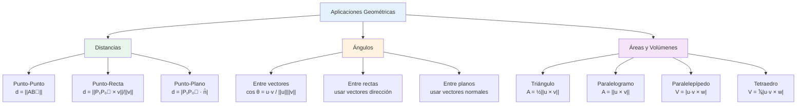

# 📐 Aplicaciones Geométricas Básicas

## 🎯 Introducción a las Aplicaciones Geométricas

> [!info]- 💡 Puente entre Álgebra y Geometría Las **aplicaciones geométricas** de vectores nos permiten resolver problemas del espacio tridimensional usando herramientas algebraicas. Combinando las operaciones vectoriales básicas con el producto punto y producto cruz, podemos:
> 
> **Problemas que podemos resolver:**
> 
> - Calcular distancias entre puntos, rectas y planos
> - Determinar ángulos entre vectores, rectas y planos
> - Encontrar áreas y volúmenes de figuras geométricas
> - Determinar proyecciones y componentes vectoriales
> - Verificar perpendicularidad y paralelismo
> 
> **Herramientas fundamentales:**
> 
> 1. **Magnitud de vectores:** ||**v**|| = √(v₁² + v₂² + v₃²)
> 2. **Producto punto:** **u** · **v** = u₁v₁ + u₂v₂ + u₃v₃
> 3. **Producto cruz:** **u** × **v** = vector perpendicular
> 4. **Combinaciones:** Usamos estas operaciones juntas
> 
> **Aplicaciones prácticas:**
> 
> - **Ingeniería:** Calcular fuerzas, torques y momentos
> - **Física:** Trabajo mecánico, campos magnéticos
> - **Computación gráfica:** Iluminación, colisiones, normales
> - **Arquitectura:** Áreas de superficies, volúmenes de construcciones
> - **Navegación:** Distancias mínimas, rutas óptimas

## 📏 Distancia entre Dos Puntos

### 📍 Fórmula de Distancia

> [!warning]- 🎯 Teorema Fundamental de Distancia **Dados dos puntos A = (x₁, y₁, z₁) y B = (x₂, y₂, z₂):**
> 
> La **distancia** entre A y B es:
> 
> **d(A, B) = ||AB⃗|| = √[(x₂ - x₁)² + (y₂ - y₁)² + (z₂ - z₁)²]**
> 
> **Interpretación:**
> 
> - Es la longitud del vector AB⃗
> - Es el "camino más corto" entre A y B
> - Generalización del Teorema de Pitágoras a 3D
> 
> **Propiedades:**
> 
> 1. **Simetría:** d(A, B) = d(B, A)
> 2. **No negatividad:** d(A, B) ≥ 0
> 3. **Identidad:** d(A, B) = 0 ⟺ A = B
> 4. **Desigualdad triangular:** d(A, C) ≤ d(A, B) + d(B, C)
> 
> **Proceso de cálculo:**
> 
> 1. Formar el vector AB⃗ = B - A
> 2. Calcular la magnitud ||AB⃗||
> 3. El resultado es la distancia

### 📊 Ejemplos de Distancia

> [!example]- 🎯 Casos Resueltos **Ejemplo 1: Distancia básica**
> 
> Calcular la distancia entre A = (1, 2, 3) y B = (4, 6, 8)
> 
> ```
> Método 1 - Directo:
> d(A, B) = √[(4-1)² + (6-2)² + (8-3)²]
>         = √[3² + 4² + 5²]
>         = √[9 + 16 + 25]
>         = √50 = 5√2 ≈ 7.07 unidades
> 
> Método 2 - Vectorial:
> AB⃗ = (4-1, 6-2, 8-3) = (3, 4, 5)
> d(A, B) = ||AB⃗|| = √(9 + 16 + 25) = √50
> ```
> 
> ---
> 
> **Ejemplo 2: Distancia con coordenadas negativas**
> 
> Sean P = (-2, 3, -1) y Q = (4, -1, 5)
> 
> ```
> d(P, Q) = √[(4-(-2))² + (-1-3)² + (5-(-1))²]
>         = √[6² + (-4)² + 6²]
>         = √[36 + 16 + 36]
>         = √88 = 2√22 ≈ 9.38 unidades
> ```
> 
> ---
> 
> **Ejemplo 3: Verificación de distancia al origen**
> 
> Distancia desde el origen O = (0, 0, 0) hasta P = (3, 4, 12)
> 
> ```
> d(O, P) = √[(3-0)² + (4-0)² + (12-0)²]
>         = √[9 + 16 + 144]
>         = √169 = 13 unidades
> 
> Nota: Esto es simplemente ||OP⃗|| = ||(3, 4, 12)||
> ```
> 
> ---
> 
> **Ejemplo 4: Aplicación práctica**
> 
> Un dron en posición A = (100, 50, 30) metros debe llegar a B = (250, 200, 80) metros. ¿Qué distancia debe recorrer en línea recta?
> 
> ```
> d(A, B) = √[(250-100)² + (200-50)² + (80-30)²]
>         = √[150² + 150² + 50²]
>         = √[22500 + 22500 + 2500]
>         = √47500 = 50√19 ≈ 217.94 metros
> ```

## 📐 Ángulos entre Vectores

### 🔺 Fórmula del Ángulo

> [!success]- 🎯 Cálculo de Ángulos usando Producto Punto **Dados dos vectores u y v no nulos:**
> 
> El **ángulo θ** entre ellos (0° ≤ θ ≤ 180°) se calcula mediante:
> 
> **cos(θ) = (u · v)/(||u|| · ||v||)**
> 
> Por lo tanto:
> 
> **θ = arccos[(u · v)/(||u|| · ||v||)]**
> 
> **Interpretación geométrica:**
> 
> - θ = 0° → Vectores paralelos (mismo sentido)
> - θ = 90° → Vectores perpendiculares
> - θ = 180° → Vectores paralelos (sentidos opuestos)
> - 0° < θ < 90° → Ángulo agudo
> - 90° < θ < 180° → Ángulo obtuso
> 
> **Casos especiales:**
> 
> - Si **u** · **v** > 0 → ángulo agudo (< 90°)
> - Si **u** · **v** = 0 → ángulo recto (= 90°)
> - Si **u** · **v** < 0 → ángulo obtuso (> 90°)
> 
> **Proceso de cálculo:**
> 
> 1. Calcular el producto punto: **u** · **v**
> 2. Calcular las magnitudes: ||**u**|| y ||**v**||
> 3. Aplicar la fórmula del coseno
> 4. Obtener el ángulo con arccos

### 📊 Ejemplos de Ángulos

> [!example]- 🎯 Cálculos Detallados **Ejemplo 1: Ángulo entre vectores básicos**
> 
> Calcular el ángulo entre **u** = (1, 2, 2) y **v** = (2, 1, -2)
> 
> ```
> Paso 1 - Producto punto:
> u · v = (1)(2) + (2)(1) + (2)(-2)
>       = 2 + 2 - 4 = 0
> 
> Paso 2 - Magnitudes:
> ||u|| = √(1² + 2² + 2²) = √9 = 3
> ||v|| = √(2² + 1² + (-2)²) = √9 = 3
> 
> Paso 3 - Ángulo:
> cos(θ) = 0/(3 · 3) = 0
> θ = arccos(0) = 90°
> 
> Conclusión: Los vectores son perpendiculares ⟂
> ```
> 
> ---
> 
> **Ejemplo 2: Ángulo agudo**
> 
> Sean **a** = (3, 0, 4) y **b** = (4, 3, 0)
> 
> ```
> Paso 1 - Producto punto:
> a · b = (3)(4) + (0)(3) + (4)(0) = 12
> 
> Paso 2 - Magnitudes:
> ||a|| = √(9 + 0 + 16) = √25 = 5
> ||b|| = √(16 + 9 + 0) = √25 = 5
> 
> Paso 3 - Ángulo:
> cos(θ) = 12/(5 · 5) = 12/25 = 0.48
> θ = arccos(0.48) ≈ 61.3°
> 
> Conclusión: Ángulo agudo (< 90°)
> ```
> 
> ---
> 
> **Ejemplo 3: Ángulo con vectores entre puntos**
> 
> Dados A = (1, 0, 0), B = (0, 1, 0), C = (0, 0, 1), calcular el ángulo ∠BAC
> 
> ```
> Vectores desde A:
> AB⃗ = B - A = (-1, 1, 0)
> AC⃗ = C - A = (-1, 0, 1)
> 
> Producto punto:
> AB⃗ · AC⃗ = (-1)(-1) + (1)(0) + (0)(1) = 1
> 
> Magnitudes:
> ||AB⃗|| = √(1 + 1 + 0) = √2
> ||AC⃗|| = √(1 + 0 + 1) = √2
> 
> Ángulo:
> cos(θ) = 1/(√2 · √2) = 1/2
> θ = arccos(1/2) = 60°
> ```
> 
> ---
> 
> **Ejemplo 4: Verificación de perpendicularidad**
> 
> Verificar si **u** = (1, -1, 2) y **v** = (3, 5, 1) son perpendiculares
> 
> ```
> u · v = (1)(3) + (-1)(5) + (2)(1)
>       = 3 - 5 + 2 = 0
> 
> Como u · v = 0, los vectores SON perpendiculares ✓
> 
> No necesitamos calcular el ángulo explícitamente
> ```

## 🔄 Proyección Vectorial

### 📍 Proyección Escalar

> [!note]- 📏 Componente de un Vector sobre Otro **Definición:**
> 
> La **proyección escalar** de **v** sobre **u** es la "longitud" de **v** en la dirección de **u** (puede ser negativa):
> 
> **proj_u(v) = (v · u)/||u||**
> 
> También escrito como: **comp_u(v)**
> 
> **Interpretación geométrica:**
> 
> - Si > 0: **v** apunta en la misma dirección general que **u**
> - Si = 0: **v** es perpendicular a **u**
> - Si < 0: **v** apunta en dirección opuesta a **u**
> 
> **Fórmula alternativa usando ángulo:**
> 
> **proj_u(v) = ||v|| · cos(θ)**
> 
> Donde θ es el ángulo entre **u** y **v**
> 
> **Aplicaciones:**
> 
> - Cálculo de trabajo mecánico: W = F · d
> - Componente de velocidad en una dirección
> - Descomposición de fuerzas

### 🎯 Proyección Vectorial

> [!warning]- ➡️ Vector Proyectado **Definición:**
> 
> La **proyección vectorial** de **v** sobre **u** es un vector en la dirección de **u**:
> 
> **proy_u(v) = [(v · u)/(u · u)] · u**
> 
> **Fórmula simplificada:**
> 
> **proy_u(v) = [(v · u)/||u||²] · u**
> 
> **O usando vector unitario û = u/||u||:**
> 
> **proy_u(v) = (v · û) · û**
> 
> **Propiedades:**
> 
> 1. **proy_u(v)** es paralelo a **u**
> 2. ||**proy_u(v)**|| = |proj_u(v)| (magnitud = valor absoluto de proyección escalar)
> 3. Si **v** ⟂ **u**, entonces **proy_u(v) = 0**
> 4. **proy_u(v) + proy_u⊥(v) = v** (descomposición ortogonal)
> 
> **Componente perpendicular:**
> 
> **proy_u⊥(v) = v - proy_u(v)**
> 
> Este es el vector perpendicular a **u** que sumado a la proyección da **v**

### 📊 Ejemplos de Proyecciones

> [!example]- 🎯 Casos Prácticos **Ejemplo 1: Proyección básica**
> 
> Proyectar **v** = (3, 4, 0) sobre **u** = (1, 0, 0)
> 
> ```
> Proyección escalar:
> proj_u(v) = (v · u)/||u||
>           = [(3)(1) + (4)(0) + (0)(0)]/√1
>           = 3/1 = 3
> 
> Proyección vectorial:
> proy_u(v) = [(v · u)/||u||²] · u
>           = [3/1] · (1, 0, 0)
>           = (3, 0, 0)
> 
> Interpretación: La componente de v en dirección X es 3
> 
> Componente perpendicular:
> proy_u⊥(v) = v - proy_u(v)
>            = (3, 4, 0) - (3, 0, 0)
>            = (0, 4, 0)
> 
> Verificación: (3, 0, 0) + (0, 4, 0) = (3, 4, 0) = v ✓
> ```
> 
> ---
> 
> **Ejemplo 2: Proyección general**
> 
> Proyectar **v** = (2, 3, 1) sobre **u** = (1, 2, 2)
> 
> ```
> Paso 1 - Producto punto:
> v · u = (2)(1) + (3)(2) + (1)(2)
>       = 2 + 6 + 2 = 10
> 
> Paso 2 - Magnitud al cuadrado:
> ||u||² = 1² + 2² + 2² = 1 + 4 + 4 = 9
> 
> Paso 3 - Proyección vectorial:
> proy_u(v) = (10/9) · (1, 2, 2)
>           = (10/9, 20/9, 20/9)
> 
> Paso 4 - Proyección escalar:
> proj_u(v) = ||proy_u(v)||
>           = √[(10/9)² + (20/9)² + (20/9)²]
>           = √[900/81] = 30/9 = 10/3 ≈ 3.33
> 
> O directamente: proj_u(v) = 10/√9 = 10/3
> ```
> 
> ---
> 
> **Ejemplo 3: Aplicación física - Trabajo mecánico**
> 
> Una fuerza **F** = (10, 5, 3) N se aplica a un objeto que se desplaza **d** = (4, 0, 0) m. Calcular el trabajo realizado.
> 
> ```
> El trabajo es la proyección escalar de F sobre d:
> 
> W = F · d = (10)(4) + (5)(0) + (3)(0)
>           = 40 J (joules)
> 
> Alternativamente:
> W = proj_d(F) · ||d||
>   = [(F · d)/||d||] · ||d||
>   = F · d = 40 J
> 
> Interpretación: Solo la componente de la fuerza 
> en dirección del desplazamiento realiza trabajo
> ```
> 
> ---
> 
> **Ejemplo 4: Descomposición de vector**
> 
> Descomponer **v** = (6, 3, 2) en componentes paralela y perpendicular a **u** = (1, 1, 0)
> 
> ```
> Componente paralela:
> v · u = 6 + 3 + 0 = 9
> ||u||² = 1 + 1 + 0 = 2
> 
> v_paralela = (9/2)(1, 1, 0) = (4.5, 4.5, 0)
> 
> Componente perpendicular:
> v_perp = v - v_paralela
>        = (6, 3, 2) - (4.5, 4.5, 0)
>        = (1.5, -1.5, 2)
> 
> Verificación de perpendicularidad:
> v_perp · u = (1.5)(1) + (-1.5)(1) + (2)(0)
>            = 1.5 - 1.5 + 0 = 0 ✓
> 
> Verificación de suma:
> v_paralela + v_perp = (4.5, 4.5, 0) + (1.5, -1.5, 2)
>                     = (6, 3, 2) = v ✓
> ```

## 📐 Área de Triángulos y Paralelogramos

### 🔷 Área mediante Producto Cruz

> [!success]- 📐 Cálculo de Áreas con Vectores **Para un paralelogramo formado por vectores u y v:**
> 
> **A_paralelogramo = ||u × v||**
> 
> **Para un triángulo formado por vectores u y v:**
> 
> **A_triángulo = (1/2)||u × v||**
> 
> **Interpretación geométrica:**
> 
> - El producto cruz **u** × **v** da un vector perpendicular
> - La magnitud de ese vector es el área del paralelogramo
> - El triángulo tiene la mitad del área del paralelogramo
> 
> **Área de triángulo con tres puntos:**
> 
> Dados A, B, C, el área del triángulo ABC es:
> 
> **A = (1/2)||AB⃗ × AC⃗||**
> 
> **Fórmula en componentes:**
> 
> Si **u** = (u₁, u₂, u₃) y **v** = (v₁, v₂, v₃), entonces:
> 
> ```
> u × v = |  i    j    k  |
>         | u₁   u₂   u₃ |
>         | v₁   v₂   v₃ |
> 
> A = ||(u₂v₃-u₃v₂, u₃v₁-u₁v₃, u₁v₂-u₂v₁)||
> ```

### 📊 Ejemplos de Áreas

> [!example]- 🎯 Cálculo de Áreas **Ejemplo 1: Área de paralelogramo**
> 
> Calcular el área del paralelogramo formado por **u** = (2, 0, 0) y **v** = (1, 3, 0)
> 
> ```
> Producto cruz:
> u × v = | i  j  k |
>         | 2  0  0 |
>         | 1  3  0 |
> 
> = i(0·0 - 0·3) - j(2·0 - 0·1) + k(2·3 - 0·1)
> = i(0) - j(0) + k(6)
> = (0, 0, 6)
> 
> Área del paralelogramo:
> A = ||u × v|| = ||(0, 0, 6)|| = 6 unidades²
> ```
> 
> ---
> 
> **Ejemplo 2: Área de triángulo con tres puntos**
> 
> Calcular el área del triángulo con vértices: A = (1, 0, 0), B = (0, 1, 0), C = (0, 0, 1)
> 
> ```
> Vectores desde A:
> AB⃗ = (-1, 1, 0)
> AC⃗ = (-1, 0, 1)
> 
> Producto cruz:
> AB⃗ × AC⃗ = | i   j   k  |
>             | -1  1   0  |
>             | -1  0   1  |
> 
> = i(1·1 - 0·0) - j((-1)·1 - 0·(-1)) + k((-1)·0 - 1·(-1))
> = i(1) - j(-1) + k(1)
> = (1, 1, 1)
> 
> Magnitud:
> ||AB⃗ × AC⃗|| = √(1² + 1² + 1²) = √3
> 
> Área del triángulo:
> A = (1/2)√3 ≈ 0.866 unidades²
> ```
> 
> ---
> 
> **Ejemplo 3: Área de triángulo en el espacio**
> 
> Triángulo con vértices P = (2, 1, 3), Q = (5, 2, 1), R = (3, 4, 2)
> 
> ```
> Vectores desde P:
> PQ⃗ = (3, 1, -2)
> PR⃗ = (1, 3, -1)
> 
> Producto cruz:
> PQ⃗ × PR⃗ = | i   j   k  |
>             | 3   1  -2  |
>             | 1   3  -1  |
> 
> = i[1·(-1) - (-2)·3] - j[3·(-1) - (-2)·1] + k[3·3 - 1·1]
> = i[-1 + 6] - j[-3 + 2] + k[9 - 1]
> = i(5) - j(-1) + k(8)
> = (5, 1, 8)
> 
> Magnitud:
> ||(5, 1, 8)|| = √(25 + 1 + 64) = √90 = 3√10
> 
> Área:
> A = (1/2) · 3√10 = (3√10)/2 ≈ 4.74 unidades²
> ```
> 
> ---
> 
> **Ejemplo 4: Verificación con paralelogramo**
> 
> Verificar que un paralelogramo tiene el doble de área que el triángulo formado por dos de sus lados.
> 
> ```
> Dados u = (4, 0, 0) y v = (0, 3, 0):
> 
> u × v = | i  j  k |
>         | 4  0  0 |
>         | 0  3  0 |
>       = (0, 0, 12)
> 
> Área paralelogramo = ||(0, 0, 12)|| = 12 unidades²
> Área triángulo = 12/2 = 6 unidades²
> 
> Verificación: 2 × 6 = 12 ✓
> ```

## 📦 Volumen de Paralelepípedos

### 🎲 Triple Producto Escalar

> [!warning]- 📦 Volumen mediante Producto Triple **Definición:**
> 
> El **producto triple escalar** de tres vectores **u**, **v**, **w** es:
> 
> **u · (v × w)**
> 
> **Interpretación geométrica:**
> 
> El **volumen** del paralelepípedo formado por **u**, **v**, **w** es:
> 
> **V = |u · (v × w)|**
> 
> (Valor absoluto porque el volumen siempre es positivo)
> 
> **Cálculo mediante determinante:**
> 
> ```
> V = |u · (v × w)| = |det| u₁  u₂  u₃ ||
>                         | v₁  v₂  v₃ ||
>                         | w₁  w₂  w₃ ||
> ```
> 
> **Propiedades importantes:**
> 
> 1. **Permutación cíclica:** u · (v × w) = v · (w × u) = w · (u × v)
> 2. **Anticonmutatividad:** u · (v × w) = -u · (w × v)
> 3. **Si resultado = 0:** Los vectores son coplanares
> 4. **Volumen de tetraedro:** V_tetraedro = (1/6)|u · (v × w)|
> 
> **Interpretación física:**
> 
> - Si |u · (v × w)| = 0, los tres vectores están en el mismo plano
> - El signo indica orientación (regla de la mano derecha)

### 📊 Ejemplos de Volúmenes

> [!example]- 🎯 Cálculos de Volumen **Ejemplo 1: Volumen básico de paralelepípedo**
> 
> Calcular el volumen del paralelepípedo formado por: **u** = (2, 0, 0), **v** = (0, 3, 0), **w** = (0, 0, 4)
> 
> ```
> Método 1 - Producto triple:
> v × w = | i  j  k |  = (12, 0, 0)
>         | 0  3  0 |
>         | 0  0  4 |
> 
> u · (v × w) = (2, 0, 0) · (12, 0, 0) = 24
> 
> V = |24| = 24 unidades³
> 
> Método 2 - Determinante:
> V = |det| 2  0  0 || = |2(12 - 0)| = |24| = 24 unidades³
>         | 0  3  0 ||
>         | 0  0  4 ||
> 
> Verificación geométrica: V = largo × ancho × alto
>                             = 2 × 3 × 4 = 24 ✓
> ```
> 
> ---
> 
> **Ejemplo 2: Volumen general**
> 
> Calcular el volumen formado por: **u** = (1, 2, 0), **v** = (2, 1, 3), **w** = (0, 1, 1)
> 
> ```
> Método determinante:
> V = |det| 1  2  0 ||
>         | 2  1  3 ||
>         | 0  1  1 ||
> 
> Expandiendo por la primera fila:
> = |1·det| 1  3 | - 2·det| 2  3 | + 0·det| 2  1 ||
>         | 1  1 |        | 0  1 |        | 0  1 ||
> 
> = 1(1·1 - 3·1) - 2(2·1 - 3·0) + 0
> = 1(-2) - 2(2)
> = -2 - 4 = -6
> 
> V = |-6| = 6 unidades³
> ```
> 
> ---
> 
> **Ejemplo 3: Verificación de coplanaridad**
> 
> ¿Son coplanares los vectores **a** = (1, 2, 3), **b** = (2, 4, 6), **c** = (1, 0, 1)?
> 
> ```
> Calculamos el producto triple:
> 
> det| 1  2  3 |
>    | 2  4  6 |
>    | 1  0  1 |
> 
> Expandiendo:
> = 1(4·1 - 6·0) - 2(2·1 - 6·1) + 3(2·0 - 4·1)
> = 1(4) - 2(2 - 6) + 3(-4)
> = 4 - 2(-4) + (-12)
> = 4 + 8 - 12 = 0
> 
> Como el resultado es 0, los vectores SON coplanares
> 
> Nota: b = 2a (segundo vector es múltiplo del primero)
> ```
> 
> ---
> 
> **Ejemplo 4: Volumen de tetraedro**
> 
> Calcular el volumen del tetraedro con vértices: O= (0, 0, 0), A = (2, 0, 0), B = (0, 3, 0), C = (0, 0, 4)
> ```
> Vectores desde O:
> OA⃗ = (2, 0, 0)
> OB⃗ = (0, 3, 0)
> OC⃗ = (0, 0, 4)
> 
> Volumen del paralelepípedo:
> V_paralep = |det| 2  0  0 || = |24| = 24
>                 | 0  3  0 ||
>                 | 0  0  4 ||
> 
> Volumen del tetraedro:
> V_tetraedro = V_paralep/6 = 24/6 = 4 unidades³
> 
> Fórmula general: V_tetraedro = (1/6)|OA⃗ · (OB⃗ × OC⃗)|
> ```

## 🔍 Aplicaciones Especiales

### 🎯 Distancia de Punto a Recta

> [!tip]- 📏 Distancia Punto-Recta en ℝ³ **Problema:** Encontrar la distancia de un punto P₀ a una recta L que pasa por P₁ con dirección **v**.
> 
> **Fórmula:**
> 
> **d = ||P₀P₁⃗ × v||/||v||**
> 
> **Procedimiento:**
> 
> 1. Formar el vector P₁P₀⃗ = P₀ - P₁
> 2. Calcular el producto cruz: P₁P₀⃗ × **v**
> 3. Calcular su magnitud: ||P₁P₀⃗ × **v**||
> 4. Dividir entre ||**v**||
> 
> **Interpretación geométrica:**
> 
> - El producto cruz da un vector perpendicular a ambos
> - Su magnitud es el área del paralelogramo
> - Dividir entre ||**v**|| da la altura (distancia)
> 
> **Ejemplo:**
> 
> Distancia del punto P₀ = (1, 2, 3) a la recta que pasa por P₁ = (0, 0, 0) con dirección **v** = (1, 0, 0)
> 
> ```
> P₁P₀⃗ = (1, 2, 3)
> 
> P₁P₀⃗ × v = | i  j  k |
>             | 1  2  3 |
>             | 1  0  0 |
>           = (0, 3, -2)
> 
> ||P₁P₀⃗ × v|| = √(0 + 9 + 4) = √13
> ||v|| = 1
> 
> d = √13/1 = √13 ≈ 3.61 unidades
> ```

### 🎯 Distancia de Punto a Plano

> [!note]- 📏 Distancia Punto-Plano **Problema:** Encontrar la distancia de un punto P₀ a un plano.
> 
> **Si el plano tiene ecuación:** ax + by + cz = d
> 
> **Fórmula:**
> 
> **d = |ax₀ + by₀ + cz₀ - d|/√(a² + b² + c²)**
> 
> Donde P₀ = (x₀, y₀, z₀)
> 
> **Si el plano pasa por P₁ con vector normal n:**
> 
> **d = |P₁P₀⃗ · n̂|**
> 
> Donde n̂ = **n**/||**n**|| es el vector normal unitario
> 
> **O equivalentemente:**
> 
> **d = |P₁P₀⃗ · n|/||n||**
> 
> **Ejemplo:**
> 
> Distancia del punto P₀ = (2, 3, 4) al plano 2x + y - 2z = 5
> 
> ```
> a = 2, b = 1, c = -2, d = 5
> P₀ = (2, 3, 4)
> 
> Numerador: |2(2) + 1(3) + (-2)(4) - 5|
>          = |4 + 3 - 8 - 5|
>          = |-6| = 6
> 
> Denominador: √(4 + 1 + 4) = √9 = 3
> 
> d = 6/3 = 2 unidades
> ```

### 🎯 Ángulo entre Rectas

> [!success]- 📐 Ángulo entre Dos Rectas **Problema:** Encontrar el ángulo entre dos rectas con vectores directores **u** y **v**.
> 
> **Fórmula:**
> 
> **cos(θ) = |u · v|/(||u|| · ||v||)**
> 
> **Nota:** Usamos valor absoluto porque el ángulo entre rectas se mide como el menor ángulo (0° ≤ θ ≤ 90°)
> 
> **Casos especiales:**
> 
> - **Paralelas:** **u** = k**v** para algún escalar k
> - **Perpendiculares:** **u** · **v** = 0
> 
> **Ejemplo:**
> 
> Ángulo entre rectas con direcciones **u** = (1, 2, 1) y **v** = (2, -1, 0)
> 
> ```
> u · v = (1)(2) + (2)(-1) + (1)(0) = 2 - 2 = 0
> 
> Como u · v = 0, las rectas son perpendiculares
> θ = 90°
> ```

### 🎯 Ángulo entre Planos

> [!info]- 📐 Ángulo entre Dos Planos **Problema:** Encontrar el ángulo entre dos planos con vectores normales **n₁** y **n₂**.
> 
> **Fórmula:**
> 
> **cos(θ) = |n₁ · n₂|/(||n₁|| · ||n₂||)**
> 
> **Interpretación:**
> 
> - El ángulo entre planos es igual al ángulo entre sus normales
> - Tomamos valor absoluto para obtener el ángulo agudo
> 
> **Casos especiales:**
> 
> - **Paralelos:** **n₁** = k**n₂**
> - **Perpendiculares:** **n₁** · **n₂** = 0
> 
> **Ejemplo:**
> 
> Ángulo entre planos:
> 
> - Plano 1: x + 2y + z = 5 → **n₁** = (1, 2, 1)
> - Plano 2: 2x - y + 2z = 3 → **n₂** = (2, -1, 2)
> 
> ```
> n₁ · n₂ = (1)(2) + (2)(-1) + (1)(2)
>         = 2 - 2 + 2 = 2
> 
> ||n₁|| = √(1 + 4 + 1) = √6
> ||n₂|| = √(4 + 1 + 4) = √9 = 3
> 
> cos(θ) = |2|/(√6 · 3) = 2/(3√6)
> θ = arccos(2/(3√6)) ≈ 76.37°
> ```

## 🎨 Diagrama de Aplicaciones Geométricas



## 📋 Tabla Resumen de Fórmulas

> [!example]- 📊 Compendio de Fórmulas Principales
> 
> |Aplicación|Fórmula|Nota|
> |---|---|---|
> |**Distancia punto-punto**|d(A,B) = \|AB⃗\||Magnitud del vector|
> |**Ángulo entre vectores**|cos(θ) = (u·v)/(\|u\|v\|)|0° ≤ θ ≤ 180°|
> |**Proyección escalar**|proj_u(v) = (v·u)/\|u\||Puede ser negativa|
> |**Proyección vectorial**|proy_u(v) = [(v·u)/\|u\|²]u|Vector paralelo a u|
> |**Área paralelogramo**|A = \|u × v\||Producto cruz|
> |**Área triángulo**|A = ½\|u × v\||Mitad del paralelogramo|
> |**Volumen paralelepípedo**|V = \|u·(v × w)\||Producto triple|
> |**Volumen tetraedro**|V = ⅙\|u·(v × w)\||Sexta parte|
> |**Distancia punto-recta**|d = \|P₁P₀⃗ × v\|/\|v\||v = dirección recta|
> |**Distancia punto-plano**|d = \|P₁P₀⃗ · n\|/\|n\||n = normal plano|
> |**Perpendicularidad**|u ⊥ v ⟺ u·v = 0|Producto punto cero|
> |**Paralelismo**|u ∥ v ⟺ u = kv|Múltiplo escalar|

## 🧪 Ejercicios Integrales

> [!example]- 💪 Práctica Completa
> 
> **Nivel 1 - Básico:** 🟢
> 
> **1. Distancias básicas**
> 
> a) Calcular la distancia entre A = (1, 2, 3) y B = (4, 6, 8)
> 
> ```
> Solución:
> d(A, B) = √[(4-1)² + (6-2)² + (8-3)²]
>         = √[9 + 16 + 25]
>         = √50 = 5√2 ≈ 7.07 unidades
> ```
> 
> b) Distancia del origen a P = (3, 4, 12)
> 
> ```
> Solución:
> d(O, P) = √(3² + 4² + 12²)
>         = √(9 + 16 + 144)
>         = √169 = 13 unidades
> ```
> 
> **2. Ángulos básicos**
> 
> Calcular el ángulo entre **u** = (1, 0, 0) y **v** = (1, 1, 0)
> 
> ```
> Solución:
> u · v = (1)(1) + (0)(1) + (0)(0) = 1
> ||u|| = 1
> ||v|| = √2
> 
> cos(θ) = 1/(1·√2) = 1/√2
> θ = 45°
> ```
> 
> ---
> 
> **Nivel 2 - Intermedio:** 🟡
> 
> **3. Proyección**
> 
> Proyectar **v** = (4, 3, 0) sobre **u** = (1, 0, 0)
> 
> ```
> Solución:
> v · u = 4
> ||u||² = 1
> 
> proy_u(v) = (4/1)(1, 0, 0) = (4, 0, 0)
> 
> Componente perpendicular:
> proy_u⊥(v) = (4, 3, 0) - (4, 0, 0) = (0, 3, 0)
> ```
> 
> **4. Área de triángulo**
> 
> Calcular el área del triángulo con vértices: A = (0, 0, 0), B = (3, 0, 0), C = (0, 4, 0)
> 
> ```
> Solución:
> AB⃗ = (3, 0, 0)
> AC⃗ = (0, 4, 0)
> 
> AB⃗ × AC⃗ = | i  j  k |
>             | 3  0  0 |
>             | 0  4  0 |
>           = (0, 0, 12)
> 
> ||AB⃗ × AC⃗|| = 12
> 
> Área = 12/2 = 6 unidades²
> 
> Verificación: A = ½(base × altura) = ½(3 × 4) = 6 ✓
> ```
> 
> ---
> 
> **Nivel 3 - Avanzado:** 🔴
> 
> **5. Problema integrado**
> 
> Dados los puntos A = (1, 0, 0), B = (0, 2, 0), C = (0, 0, 3):
> 
> a) Calcular el área del triángulo ABC b) Calcular el volumen del tetraedro OABC (con O en el origen) c) Encontrar la altura del tetraedro desde O hasta el plano ABC
> 
> ```
> Solución:
> 
> a) Área del triángulo:
> AB⃗ = (-1, 2, 0)
> AC⃗ = (-1, 0, 3)
> 
> AB⃗ × AC⃗ = | i   j   k  |
>             | -1  2   0  |
>             | -1  0   3  |
>           = (6, 3, 2)
> 
> ||AB⃗ × AC⃗|| = √(36 + 9 + 4) = √49 = 7
> Área = 7/2 = 3.5 unidades²
> 
> b) Volumen del tetraedro:
> OA⃗ = (1, 0, 0)
> OB⃗ = (0, 2, 0)
> OC⃗ = (0, 0, 3)
> 
> V = (1/6)|det| 1  0  0 ||
>              | 0  2  0 ||
>              | 0  0  3 ||
>   = (1/6)|6| = 1 unidad³
> 
> c) Altura del tetraedro:
> V = (1/3) × Área_base × altura
> 1 = (1/3) × 3.5 × h
> h = 3/3.5 = 6/7 ≈ 0.857 unidades
> ```
> 
> **6. Problema aplicado**
> 
> Un cable se extiende desde el punto A = (0, 0, 10) m hasta B = (6, 8, 0) m. Una fuerza de **F** = (100, 0, -50) N actúa en A.
> 
> a) Calcular la componente de la fuerza en la dirección del cable b) Calcular el trabajo realizado si el cable se mueve 2 metros en su dirección
> 
> ```
> Solución:
> 
> a) Dirección del cable:
> AB⃗ = (6, 8, -10)
> ||AB⃗|| = √(36 + 64 + 100) = √200 = 10√2
> 
> Vector unitario:
> û = AB⃗/||AB⃗|| = (6, 8, -10)/(10√2)
>   = (3/(5√2), 4/(5√2), -1/√2)
> 
> Componente de F en dirección del cable:
> F_cable = F · û
>         = (100, 0, -50) · (3/(5√2), 4/(5√2), -1/√2)
>         = 300/(5√2) + 0 + 50/√2
>         = 60/√2 + 50/√2
>         = 110/√2 ≈ 77.78 N
> 
> b) Trabajo:
> W = F_cable × distancia
>   = 77.78 × 2 ≈ 155.56 J
> ```

## 💡 Consejos de Estudio

> [!tip]- 🧠 Estrategias de Aprendizaje
> 
> **Para dominar aplicaciones geométricas:**
> 
> **1. Visualización 3D:**
> 
> - Dibujar siempre la situación geométrica
> - Usar software: GeoGebra 3D, Desmos 3D
> - Construir modelos físicos cuando sea posible
> - Imaginar rotando la figura en el espacio
> 
> **2. Elección de fórmulas:**
> 
> - Identificar qué se pide: distancia, ángulo, área, volumen
> - Determinar qué información se tiene
> - Seleccionar la fórmula apropiada
> - Verificar que las unidades sean consistentes
> 
> **3. Verificación de resultados:**
> 
> - Los ángulos deben estar entre 0° y 180°
> - Las distancias siempre son positivas
> - Las áreas y volúmenes son siempre positivos
> - Verificar con casos especiales conocidos
> 
> **4. Conexión entre conceptos:**
> 
> - Producto punto → ángulos y proyecciones
> - Producto cruz → áreas y perpendicularidad
> - Producto triple → volúmenes y coplanaridad
> - Magnitud → distancias
> 
> **Errores comunes a evitar:**
> 
> ❌ **Error 1:** Olvidar valor absoluto en volúmenes
> 
> - V = |u·(v × w)| ✓
> - V = u·(v × w) ❌
> 
> ❌ **Error 2:** Confundir área de triángulo y paralelogramo
> 
> - A_triángulo = ½||u × v|| ✓
> - A_triángulo = ||u × v|| ❌
> 
> ❌ **Error 3:** Usar ángulo sin valor absoluto en rectas
> 
> - Para rectas: cos(θ) = |u·v|/(||u||||v||) ✓
> - Para vectores: cos(θ) = (u·v)/(||u||||v||) ✓
> 
> ❌ **Error 4:** Olvidar normalizar en proyecciones
> 
> - proy_u(v) = [(v·u)/||u||²]u ✓
> - proy_u(v) = (v·u)u ❌
> 
> ❌ **Error 5:** Confundir proyección escalar y vectorial
> 
> - Escalar: número (puede ser negativo)
> - Vectorial: vector (en dirección de u)

## 🔗 Conexiones con el Sistema de Notas

> [!quote]- 🌟 Enlaces Conceptuales
> 
> **Prerequisites (Prerrequisitos):**
> 
> - [[02 - Vectores en R3]] - Operaciones básicas con vectores
> - [[Producto Punto]] - Ángulos y proyecciones
> - [[Producto Cruz]] - Áreas y perpendicularidad
> - [[Triple Producto Escalar]] - Volúmenes
> 
> **Temas relacionados:**
> 
> - [[01.3 Distancia en el Espacio]] - Métrica en ℝ³
> - [[01.4 Rectas en ℝ³]] - Ecuaciones y propiedades
> - [[01.5 Planos en ℝ³]] - Ecuaciones de planos
> - [[Ecuaciones Paramétricas]] - Representación de curvas
> 
> **Aplicaciones avanzadas:**
> 
> - [[Geometría Analítica 3D]] - Estudio completo
> - [[Cinemática Vectorial]] - Movimiento en el espacio
> - [[Cálculo Vectorial]] - Derivadas e integrales
> - [[Análisis Tensorial]] - Generalización
> 
> **Temas siguientes:**
> 
> - [[Superficies en ℝ³]] - Estudio de superficies
> - [[Curvas en el Espacio]] - Geometría diferencial
> - [[Transformaciones Lineales]] - Cambios de base
> - [[Coordenadas Cilíndricas y Esféricas]] - Sistemas alternativos

---

**Tags:** #geometría-vectorial #aplicaciones-geométricas #distancias #ángulos #áreas #volúmenes #proyecciones #producto-punto #producto-cruz #triple-producto #R3 #geometría-analítica #matemáticas #university #cálculo-vectorial