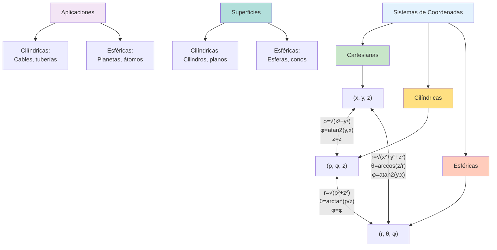

# 📐 Transformaciones entre Coordenadas

## 🎯 Sistemas de Coordenadas Alternativos

> [!info]- 💡 Introducción a los Sistemas de Coordenadas Además del **sistema cartesiano** (x, y, z), existen otros sistemas de coordenadas que simplifican la descripción de ciertos problemas geométricos y físicos. Los más importantes son:
> 
> **Sistemas principales:**
> 
> - **Cartesianas (rectangulares):** (x, y, z)
> - **Cilíndricas:** (ρ, φ, z)
> - **Esféricas:** (r, θ, φ)
> 
> **¿Por qué usar diferentes sistemas?**
> 
> **Analogías útiles:**
> 
> - **Cartesianas:** Como las calles de una ciudad en cuadrícula (Manhattan)
> - **Cilíndricas:** Como describir la posición en un edificio cilíndrico (distancia al centro, ángulo, altura)
> - **Esféricas:** Como la ubicación en la Tierra (latitud, longitud, altitud)
> 
> **Ventajas según simetría:**
> 
> - **Cilíndricas:** Problemas con simetría cilíndrica (cables, tuberías, campos magnéticos)
> - **Esféricas:** Problemas con simetría esférica (planetas, átomos, ondas radiales)
> 
> **Aplicaciones históricas:**
> 
> - **Leonhard Euler (1707-1783):** Desarrollo de coordenadas polares
> - **Gaspard Monge (1746-1818):** Geometría descriptiva
> - **Carl Friedrich Gauss (1777-1855):** Teoría de superficies
> - Navegación marítima y astronomía desde el siglo XVII

## 🔵 Coordenadas Cilíndricas

### 📏 Definición del Sistema

> [!note]- 🌟 Sistema de Coordenadas Cilíndricas **Definición:**
> 
> Las **coordenadas cilíndricas** (ρ, φ, z) de un punto P en el espacio se definen como:
> 
> **1. Radio cilíndrico (ρ):**
> 
> - Distancia desde el punto P al eje Z
> - Proyección del punto sobre el plano XY
> - **Rango:** ρ ≥ 0
> - Pronunciación: "ro" (letra griega rho)
> 
> **2. Ángulo azimutal (φ):**
> 
> - Ángulo medido desde el eje X positivo en el plano XY
> - Sentido: antihorario (visto desde arriba)
> - **Rango:** 0 ≤ φ < 2π (o -π < φ ≤ π)
> - Pronunciación: "fi" (letra griega phi)
> 
> **3. Altura (z):**
> 
> - Misma coordenada z del sistema cartesiano
> - Distancia al plano XY (con signo)
> - **Rango:** -∞ < z < ∞
> 
> **Interpretación geométrica:**
> 
> - ρ: "¿Qué tan lejos del eje central?"
> - φ: "¿En qué dirección angular?"
> - z: "¿A qué altura?"
> 
> **Visualización:**
> 
> ```
> Imagina un cilindro vertical:
> - ρ es el radio desde el eje del cilindro
> - φ es el ángulo de rotación alrededor del eje
> - z es la altura en el cilindro
> ```

### 🔄 Transformaciones Cartesianas ↔ Cilíndricas

> [!warning]- 🔷 Fórmulas de Conversión#### **De Cilíndricas a Cartesianas**
> **Dadas coordenadas cilíndricas (ρ, φ, z):**
> 
> ```
> x = ρ cos(φ)
> y = ρ sen(φ)
> z = z
> ```
> 
> **Justificación:**
> 
> - En el plano XY, (x, y) forman un círculo de radio ρ
> - El ángulo φ determina la posición en ese círculo
> - z permanece igual (altura vertical)#### **De Cartesianas a Cilíndricas**
> **Dadas coordenadas cartesianas (x, y, z):**
> 
> ```
> ρ = √(x² + y²)
> φ = arctan(y/x)  [con ajustes de cuadrante]
> z = z
> ```
> 
> **Observaciones importantes:**
> 
> **1. Cálculo de ρ:**
> 
> - Es la distancia del punto al eje Z
> - Usa el teorema de Pitágoras en el plano XY
> - Siempre positivo: ρ ≥ 0
> 
> **2. Cálculo de φ (ángulo):**
> 
> El ángulo φ requiere atención al cuadrante:
> 
> |Cuadrante|Condición|Fórmula correcta|
> |---|---|---|
> |**I**|x > 0, y > 0|φ = arctan(y/x)|
> |**II**|x < 0, y > 0|φ = π + arctan(y/x)|
> |**III**|x < 0, y < 0|φ = π + arctan(y/x)|
> |**IV**|x > 0, y < 0|φ = 2π + arctan(y/x)|
> 
> **Función recomendada:**
> 
> ```
> φ = atan2(y, x)
> ```
> 
> Esta función maneja automáticamente todos los cuadrantes
> 
> **3. Casos especiales:**
> 
> - Si x = 0, y > 0: φ = π/2
> - Si x = 0, y < 0: φ = 3π/2
> - Si x = 0, y = 0: φ indeterminado (origen)

### 📊 Ejemplos de Transformación Cilíndrica

> [!example]- 🎯 Conversiones Paso a Paso
> 
> #### **Ejemplo 1: Cartesianas → Cilíndricas**
> **Dado:** P = (3, 4, 5) en coordenadas cartesianas
> 
> **Encontrar:** Coordenadas cilíndricas (ρ, φ, z)
> 
> ```
> Paso 1: Calcular ρ
> ρ = √(x² + y²)
> ρ = √(3² + 4²)
> ρ = √(9 + 16)
> ρ = √25 = 5
> 
> Paso 2: Calcular φ
> Como x = 3 > 0 y y = 4 > 0 → Cuadrante I
> φ = arctan(y/x)
> φ = arctan(4/3)
> φ ≈ 0.927 radianes (o 53.13°)
> 
> Paso 3: z permanece igual
> z = 5
> ```
> 
> **Respuesta:** P = (5, 0.927, 5) en coordenadas cilíndricas#### 
> 
> **Ejemplo 2: Cilíndricas → Cartesianas**
> 
> **Dado:** Q = (6, π/3, -2) en coordenadas cilíndricas
> 
> **Encontrar:** Coordenadas cartesianas (x, y, z)
> 
> ```
> Paso 1: Calcular x
> x = ρ cos(φ)
> x = 6 cos(π/3)
> x = 6 · (1/2)
> x = 3
> 
> Paso 2: Calcular y
> y = ρ sen(φ)
> y = 6 sen(π/3)
> y = 6 · (√3/2)
> y = 3√3 ≈ 5.196
> 
> Paso 3: z permanece igual
> z = -2
> ```
> 
> **Respuesta:** Q = (3, 3√3, -2) ≈ (3, 5.196, -2) en coordenadas cartesianas
> 
> #### **Ejemplo 3: Punto en Cuadrante II**
> 
> **Dado:** R = (-2, 3, 1) en coordenadas cartesianas
> 
> **Encontrar:** Coordenadas cilíndricas
> 
> ```
> Paso 1: ρ
> ρ = √((-2)² + 3²) = √(4 + 9) = √13 ≈ 3.606
> 
> Paso 2: φ (Cuadrante II: x < 0, y > 0)
> arctan(3/-2) = arctan(-1.5) ≈ -0.983 rad
> Como está en Cuadrante II:
> φ = π + arctan(y/x)
> φ = π - 0.983
> φ ≈ 2.159 radianes (o 123.69°)
> 
> Alternativa con atan2:
> φ = atan2(3, -2) ≈ 2.159 rad
> 
> Paso 3: z = 1
> ```
> 
> **Respuesta:** R = (√13, 2.159, 1) ≈ (3.606, 2.159, 1)

## 🔴 Coordenadas Esféricas

### 📏 Definición del Sistema

> [!note]- 🌟 Sistema de Coordenadas Esféricas **Definición:**
> 
> Las **coordenadas esféricas** (r, θ, φ) de un punto P en el espacio se definen como:
> 
> **1. Radio esférico (r):**
> 
> - Distancia desde el origen O hasta el punto P
> - Longitud del vector posición
> - **Rango:** r ≥ 0
> - Es la distancia euclidiana directa
> 
> **2. Ángulo polar (θ):**
> 
> - Ángulo desde el eje Z positivo hasta el vector OP
> - También llamado "colatitud" o "ángulo cenital"
> - **Rango:** 0 ≤ θ ≤ π
> - Pronunciación: "theta" (letra griega theta)
> - θ = 0: polo norte (eje Z+)
> - θ = π/2: ecuador (plano XY)
> - θ = π: polo sur (eje Z-)
> 
> **3. Ángulo azimutal (φ):**
> 
> - Mismo ángulo que en coordenadas cilíndricas
> - Ángulo desde el eje X en el plano XY
> - **Rango:** 0 ≤ φ < 2π
> - Pronunciación: "fi" (letra griega phi)
> 
> **Interpretación geométrica:**
> 
> - r: "¿Qué tan lejos del origen?"
> - θ: "¿Qué tan inclinado desde el eje vertical?"
> - φ: "¿En qué dirección horizontal?"
> 
> **Analogía geográfica:**
> 
> ```
> Tierra como esfera:
> - r: altitud desde el centro
> - θ: colatitud (0° en Polo Norte, 90° en Ecuador, 180° en Polo Sur)
> - φ: longitud (0° en Greenwich)
> 
> Nota: En geografía se usa latitud (90° - θ)
> ```

### 🔄 Transformaciones Cartesianas ↔ Esféricas

> [!warning]- 🔷 Fórmulas de Conversión
> 
> #### **De Esféricas a Cartesianas**
> 
> **Dadas coordenadas esféricas (r, θ, φ):**
> 
> ```
> x = r sen(θ) cos(φ)
> y = r sen(θ) sen(φ)
> z = r cos(θ)
> ```
> 
> **Justificación geométrica:**
> 
> ```
> 1. La proyección en el plano XY tiene longitud: r sen(θ)
> 2. Esta proyección se descompone en:
>    - Componente x: (r sen(θ)) cos(φ)
>    - Componente y: (r sen(θ)) sen(φ)
> 3. La componente z es: r cos(θ)
> ```
> 
> **Memoria visual:**
> 
> ```
> z está "arriba" → usa cos(θ) directamente
> x, y están en el plano → usan sen(θ) primero
> ```#### **De Cartesianas a Esféricas**
> **Dadas coordenadas cartesianas (x, y, z):**
> 
> ```
> r = √(x² + y² + z²)
> θ = arccos(z/r)  [para r ≠ 0]
> φ = arctan(y/x)  [con ajustes de cuadrante]
> ```
> 
> **Detalles importantes:**
> 
> **1. Cálculo de r:**
> 
> - Es la magnitud del vector posición
> - Distancia euclidiana en 3D
> - Siempre positivo: r ≥ 0
> 
> **2. Cálculo de θ (ángulo polar):**
> 
> ```
> θ = arccos(z/r)
> 
> Fórmula alternativa:
> θ = arctan(√(x² + y²)/z)  [si z ≠ 0]
> ```
> 
> **Rango automático:**
> 
> - arccos devuelve valores en [0, π] ✓
> - No requiere ajustes de cuadrante
> 
> **Casos especiales:**
> 
> - Si z = r: θ = 0 (eje Z+)
> - Si z = 0: θ = π/2 (plano XY)
> - Si z = -r: θ = π (eje Z-)
> 
> **3. Cálculo de φ (ángulo azimutal):**
> 
> - Mismo procedimiento que en cilíndricas
> - Usar atan2(y, x) para manejo automático de cuadrantes

### 📊 Ejemplos de Transformación Esférica

> [!example]- 🎯 Conversiones Completas
> #### **Ejemplo 1: Cartesianas → Esféricas**
> **Dado:** P = (3, 4, 12) en coordenadas cartesianas
> 
> **Encontrar:** Coordenadas esféricas (r, θ, φ)
> 
> ```
> Paso 1: Calcular r
> r = √(x² + y² + z²)
> r = √(3² + 4² + 12²)
> r = √(9 + 16 + 144)
> r = √169 = 13
> 
> Paso 2: Calcular θ
> θ = arccos(z/r)
> θ = arccos(12/13)
> θ ≈ 0.3948 radianes (o 22.62°)
> 
> Paso 3: Calcular φ
> Cuadrante I (x > 0, y > 0)
> φ = arctan(y/x)
> φ = arctan(4/3)
> φ ≈ 0.927 radianes (o 53.13°)
> ```
> 
> **Respuesta:** P = (13, 0.3948, 0.927) en coordenadas esféricas
> 
> **Verificación:**
> 
> ```
> x = 13 sen(0.3948) cos(0.927) ≈ 3 ✓
> y = 13 sen(0.3948) sen(0.927) ≈ 4 ✓
> z = 13 cos(0.3948) ≈ 12 ✓
> ```
> 
> #### **Ejemplo 2: Esféricas → Cartesianas**
> 
> **Dado:** Q = (10, π/4, π/6) en coordenadas esféricas
> 
> **Encontrar:** Coordenadas cartesianas (x, y, z)
> 
> ```
> Paso 1: Calcular x
> x = r sen(θ) cos(φ)
> x = 10 sen(π/4) cos(π/6)
> x = 10 · (√2/2) · (√3/2)
> x = 10 · √6/4
> x = 5√6/2 ≈ 6.124
> 
> Paso 2: Calcular y
> y = r sen(θ) sen(φ)
> y = 10 sen(π/4) sen(π/6)
> y = 10 · (√2/2) · (1/2)
> y = 10 · √2/4
> y = 5√2/2 ≈ 3.536
> 
> Paso 3: Calcular z
> z = r cos(θ)
> z = 10 cos(π/4)
> z = 10 · (√2/2)
> z = 5√2 ≈ 7.071
> ```
> 
> **Respuesta:** Q ≈ (6.124, 3.536, 7.071) en coordenadas cartesianas
> 
> #### **Ejemplo 3: Punto en el Polo Norte**
> 
> **Dado:** Polo Norte a distancia 5 del origen
> 
> **En cartesianas:** R = (0, 0, 5)
> 
> **Transformar a esféricas:**
> 
> ```
> r = √(0² + 0² + 5²) = 5
> θ = arccos(5/5) = arccos(1) = 0
> φ = indeterminado (no hay proyección en XY)
> ```
> 
> **Respuesta:** R = (5, 0, φ) donde φ puede ser cualquier valor
> 
> **Nota:** En el eje Z, φ es indeterminado porque no hay dirección horizontal definida

## 🔄 Transformaciones Cilíndricas ↔ Esféricas

### 🔀 Conversión Directa

> [!tip]- 🟢 Sin Pasar por Cartesianas
> 
> #### **De Cilíndricas a Esféricas**
> **Dadas coordenadas cilíndricas (ρ, φ, z):**
> 
> ```
> r = √(ρ² + z²)
> θ = arctan(ρ/z)  [si z ≠ 0]
> φ = φ  (mismo ángulo)
> ```
> 
> **Justificación:**
> 
> - r es la hipotenusa del triángulo rectángulo formado por ρ y z
> - θ es el ángulo desde el eje Z
> - φ permanece igual (mismo ángulo horizontal)
> 
> #### **De Esféricas a Cilíndricas**
> **Dadas coordenadas esféricas (r, θ, φ):**
> 
> ```
> ρ = r sen(θ)
> φ = φ  (mismo ángulo)
> z = r cos(θ)
> ```
> 
> **Interpretación:**
> 
> - ρ es la proyección de r en el plano XY
> - z es la componente vertical de r

### 📊 Ejemplo Integrado

> [!example]- 🎯 Conversión Múltiple
> 
> **Problema:** Convertir el punto P entre los tres sistemas
> 
> **Inicio en Cartesianas:** P = (2, 2, √6)
> 
> ---
> 
> **Paso 1: Cartesianas → Cilíndricas**
> 
> ```
> ρ = √(2² + 2²) = √8 = 2√2
> φ = arctan(2/2) = arctan(1) = π/4
> z = √6
> ```
> 
> **Cilíndricas:** P = (2√2, π/4, √6)
> 
> ---
> 
> **Paso 2: Cilíndricas → Esféricas**
> 
> ```
> r = √((2√2)² + (√6)²) = √(8 + 6) = √14
> θ = arctan(2√2/√6) = arctan(√(4/3)) ≈ 0.9553 rad
> φ = π/4  (permanece igual)
> ```
> 
> **Esféricas:** P = (√14, 0.9553, π/4)
> 
> ---
> 
> **Verificación: Esféricas → Cartesianas directamente**
> 
> ```
> x = √14 sen(0.9553) cos(π/4)
>   = √14 · (2√2/√14) · (√2/2)
>   = 2 ✓
> 
> y = √14 sen(0.9553) sen(π/4)
>   = 2 ✓
> 
> z = √14 cos(0.9553)
>   = √14 · (√6/√14)
>   = √6 ✓
> ```

## 📐 Tabla Resumen de Transformaciones

> [!example]- 📋 Fórmulas Completas
> 
> ### **Cartesianas (x, y, z) ↔ Cilíndricas (ρ, φ, z)**
> 
> |Dirección|Fórmulas|
> |---|---|
> |**→ Cilíndricas**|ρ = √(x² + y²)<br>φ = atan2(y, x)<br>z = z|
> |**→ Cartesianas**|x = ρ cos(φ)<br>y = ρ sen(φ)<br>z = z|
> 
> ---
> 
> ### **Cartesianas (x, y, z) ↔ Esféricas (r, θ, φ)**
> 
> |Dirección|Fórmulas|
> |---|---|
> |**→ Esféricas**|r = √(x² + y² + z²)<br>θ = arccos(z/r)<br>φ = atan2(y, x)|
> |**→ Cartesianas**|x = r sen(θ) cos(φ)<br>y = r sen(θ) sen(φ)<br>z = r cos(θ)|
> 
> ---
> 
> ### **Cilíndricas (ρ, φ, z) ↔ Esféricas (r, θ, φ)**
> 
> |Dirección|Fórmulas|
> |---|---|
> |**→ Esféricas**|r = √(ρ² + z²)<br>θ = arctan(ρ/z)<br>φ = φ|
> |**→ Cilíndricas**|ρ = r sen(θ)<br>φ = φ<br>z = r cos(θ)|

## 🎨 Representación Gráfica

### 🖼️ Visualización de Coordenadas Cilíndricas

> [!tip]- 🔵 Interpretación Geométrica Cilíndrica
> 
> **Superficies coordenadas cilíndricas:**
> 
> **1. Superficies ρ = constante:**
> 
> - Son **cilindros circulares** con eje en Z
> - Radio constante desde el eje Z
> - Ejemplo: ρ = 5 es un cilindro de radio 5
> 
> ```
> Ecuación: x² + y² = ρ²
> Visualización: Tubo vertical infinito
> ```
> 
> **2. Superficies φ = constante:**
> 
> - Son **semiplanos verticales** desde el eje Z
> - Ángulo fijo desde el eje X
> - Ejemplo: φ = π/4 es un semiplano a 45°
> 
> ```
> Ecuación: y = x tan(φ) para x ≥ 0 si 0 ≤ φ < π/2
> Visualización: Lámina vertical que gira desde eje Z
> ```
> 
> **3. Superficies z = constante:**
> 
> - Son **planos horizontales**
> - Paralelos al plano XY
> - Ejemplo: z = 3 es un plano a altura 3
> 
> ```
> Ecuación: z = k
> Visualización: Plano que corta todos los cilindros
> ```
> 
> **Elemento de volumen cilíndrico:**
> 
> ```
> dV = ρ dρ dφ dz
> ```
> 
> **Visualización ASCII:**
> 
> ```
>        Z
>        ↑
>        |     P(ρ,φ,z)
>        |    /
>        |   / |
>        |  /  |z
>        | /   |
>        |/____|________→ Y
>       /   φ  
>      /  ρ    
>     X         
> 
> Proyección en XY:
>     Y
>     ↑
>     |  P'(ρ,φ)
>     | /
>     |/___φ___→ X
>     ρ
> ```

### 🖼️ Visualización de Coordenadas Esféricas

> [!tip]- 🔴 Interpretación Geométrica Esférica
> 
> **Superficies coordenadas esféricas:**
> 
> **1. Superficies r = constante:**
> 
> - Son **esferas** centradas en el origen
> - Radio constante desde el origen
> - Ejemplo: r = 10 es una esfera de radio 10
> 
> ```
> Ecuación: x² + y² + z² = r²
> Visualización: Pompa de jabón esférica
> ```
> 
> **2. Superficies θ = constante:**
> 
> - Son **conos** con vértice en el origen y eje en Z
> - Ángulo fijo desde el eje Z
> - Ejemplo: θ = π/4 es un cono de 45°
> 
> ```
> Casos especiales:
> - θ = 0: eje Z positivo (línea)
> - θ = π/2: plano XY
> - θ = π: eje Z negativo (línea)
> 
> Visualización: Cono de helado invertido
> ```
> 
> **3. Superficies φ = constante:**
> 
> - Son **semiplanos verticales** desde el eje Z
> - Igual que en cilíndricas
> - Ejemplo: φ = 0 es el semiplano XZ con x ≥ 0
> 
> ```
> Ecuación: y = x tan(φ)
> Visualización: Gajos de naranja
> ```
> 
> **Elemento de volumen esférico:**
> 
> ```
> dV = r² sen(θ) dr dθ dφ
> ```
> 
> **Visualización ASCII:**
> 
> ```
>        Z
>        ↑
>        |    P(r,θ,φ)
>        |   /
>        |  /
>        | /θ
>        |/________→ Y
>       /    φ
>      /  r
>     X
> 
> Vista lateral (plano XZ):
>     Z
>     ↑
>     |\ P
>     | \
>     |  \r
>     | θ \
>     |____\___→ X
> ```

### 🎯 Líneas y Curvas Coordenadas

> [!note]- 📏 Trayectorias en Diferentes Sistemas
> 
> **Líneas coordenadas cilíndricas:**
> 
> ```
> 1. Línea radial (φ, z fijos):
>    - Dirección: hacia/desde el eje Z
>    - Vector tangente: êρ
> 
> 2. Línea circular (ρ, z fijos):
>    - Dirección: alrededor del eje Z
>    - Vector tangente: êφ
> 
> 3. Línea vertical (ρ, φ fijos):
>    - Dirección: paralela al eje Z
>    - Vector tangente: êz
> ```
> 
> **Líneas coordenadas esféricas:**
> 
> ```
> 4. Línea radial (θ, φ fijos):
>    - Dirección: hacia/desde el origen
>    - Vector tangente: êr
> 
> 5. Línea meridional (r, φ fijos):
>    - Dirección: norte-sur (cambia θ)
>    - Vector tangente: êθ
> 
> 6. Línea paralela (r, θ fijos):
>    - Dirección: este-oeste (cambia φ)
>    - Vector tangente: êφ
> ```

## 🧮 Ejercicios Integrales

> [!example]- 💪 Práctica Completa### **Nivel 1 - Básico:** 🟢
> **Ejercicio 1:** Convertir de cartesianas a cilíndricas
> 
> a) P = (1, √3, 5)
> 
> ```
> Solución:
> ρ = √(1² + (√3)²) = √(1 + 3) = 2
> φ = arctan(√3/1) = π/3 (60°)
> z = 5
> 
> Respuesta: (2, π/3, 5)
> ```
> 
> b) Q = (0, -4, 2)
> 
> ```
> Solución:
> ρ = √(0² + (-4)²) = 4
> φ = 3π/2  (eje Y negativo)
> z = 2
> 
> Respuesta: (4, 3π/2, 2)
> ```
> **Ejercicio 2:** Convertir de cilíndricas a cartesianas
> 
> a) R = (5, π/2, 3)
> 
> ```
> Solución:
> x = 5 cos(π/2) = 0
> y = 5 sen(π/2) = 5
> z = 3
> 
> Respuesta: (0, 5, 3)
> ```
> 
> ### **Nivel 2 - Intermedio:** 🟡
> 
> **Ejercicio 3:** Convertir de cartesianas a esféricas
> 
> a) P = (1, 1, √2)
> 
> ```
> Solución:
> r = √(1² + 1² + (√2)²) = √(1 + 1 + 2) = 2
> θ = arccos(√2/2) = π/4
> φ = arctan(1/1) = π/4
> 
> Respuesta: (2, π/4, π/4)
> ```
> 
> b) Q = (0, 3, 4)
> 
> ```
> Solución:
> r = √(0² + 3² + 4²) = √25 = 5
> θ = arccos(4/5) ≈ 0.6435 rad (36.87°)
> φ = π/2  (eje Y positivo)
> 
> Respuesta: (5, 0.6435, π/2)
> ```
> 
> **Ejercicio 4:** Convertir entre cilíndricas y esféricas
> 
> Dado en cilíndricas: S = (3, π/6, 4) Convertir a esféricas:
> 
> ```
> Solución:
> r = √(3² + 4²) = √25 = 5
> θ = arctan(3/4) ≈ 0.6435 rad
> φ = π/6  (permanece igual)
> 
> Respuesta: (5, 0.6435, π/6)
> ```
> 
> ### **Nivel 3 - Avanzado:** 🔴
> 
> **Ejercicio 5:** Problema de conversión múltiple
> 
> Un punto tiene coordenadas cilíndricas (4, 2π/3, -3). a) Convertir a cartesianas b) Convertir a esféricas c) Verificar la distancia al origen
> 
> ```
> Solución:
> 
> a) Cilíndricas → Cartesianas:
> x = 4 cos(2π/3) = 4(-1/2) = -2
> y = 4 sen(2π/3) = 4(√3/2) = 2√3
> z = -3
> 
> Respuesta: (-2, 2√3, -3)
> 
> b) Cilíndricas → Esféricas:
> r = √(4² + (-3)²) = √25 = 5
> θ = arctan(4/-3) + π ≈ 2.214 rad
> (o θ = π - arctan(4/3))
> φ = 2π/3
> 
> Respuesta: (5, 2.214, 2π/3)
> 
> c) Verificación distancia:
> d = √((-2)² + (2√3)² + (-3)²)
> d = √(4 + 12 + 9) = √25 = 5 ✓
> Coincide con r = 5
> ```
> 
> **Ejercicio 6:** Aplicación práctica
> 
> Un satélite está a 200 km de altura sobre un punto de latitud 30°N y longitud 45°E. Si el radio terrestre es 6371 km:
> 
> a) Expresar la posición en coordenadas esféricas (desde el centro) b) Convertir a coordenadas cartesianas
> 
> ```
> Solución:
> 
> Conversión de datos geográficos:
> - Latitud 30°N → θ = 90° - 30° = 60° = π/3
> - Longitud 45°E → φ = 45° = π/4
> - Distancia al centro: r = 6371 + 200 = 6571 km
> 
> a) Esféricas: (6571, π/3, π/4)
> 
> b) Cartesianas:
> x = 6571 sen(π/3) cos(π/4)
> x = 6571 · (√3/2) · (√2/2)
> x ≈ 4020.5 km
> 
> y = 6571 sen(π/3) sen(π/4)
> y ≈ 4020.5 km
> 
> z = 6571 cos(π/3)
> z = 6571 · (1/2)
> z = 3285.5 km
> 
> Respuesta: (4020.5, 4020.5, 3285.5) km
> ```

## 🎨 Diagrama Conceptual



## 💡 Consejos y Errores Comunes

> [!tip]- 🧠 Estrategias de Aprendizaje
> 
> **Para dominar las transformaciones:**
> 
> **1. Visualización espacial:**
> 
> - Dibujar los tres sistemas superpuestos
> - Usar software: GeoGebra 3D, MATLAB
> - Construir modelos físicos
> 
> **2. Memorización de fórmulas:**
> 
> - Entender la geometría detrás de cada fórmula
> - Practicar derivaciones desde principios básicos
> - Crear tarjetas de memoria (flashcards)
> 
> **3. Reconocimiento de patrones:**
> 
> - Identificar simetrías en problemas
> - Elegir el sistema más simple para cada caso
> - Practicar conversiones en ambas direcciones
> 
> **Errores comunes a evitar:**
> 
> ❌ **Error 1:** Confundir θ en esféricas con φ
> 
> - θ es polar (desde eje Z): 0 ≤ θ ≤ π
> - φ es azimutal (en plano XY): 0 ≤ φ < 2π
> 
> ❌ **Error 2:** Olvidar el cuadrante en φ
> 
> - No usar arctan(y/x) directamente
> - Usar siempre atan2(y, x) en computadoras
> - Verificar signos de x e y manualmente
> 
> ❌ **Error 3:** Confundir fórmulas cilíndricas con esféricas
> 
> - Cilíndricas: x = ρ cos(φ), y = ρ sen(φ)
> - Esféricas: x = r sen(θ) cos(φ), y = r sen(θ) sen(φ)
> - ¡sen(θ) aparece en esféricas!
> 
> ❌ **Error 4:** Usar grados en lugar de radianes
> 
> - Funciones trigonométricas usan radianes
> - Convertir: grados × (π/180) = radianes
> 
> ❌ **Error 5:** No verificar resultados
> 
> - Siempre convertir de vuelta al sistema original
> - Verificar que la distancia al origen sea correcta
> - Comprobar que las componentes tengan sentido geométrico

## 🔗 Conexiones con el Sistema de Notas

> [!quote]- 🌟 Enlaces Conceptuales
> 
> **Prerrequisitos:**
> 
> - [[01.1 Sistema de Referencia Espacial]] - Base de coordenadas cartesianas
> - [[02 - Vectores en R3]] - Magnitudes y operaciones
> - [[Trigonometría]] - Funciones seno, coseno, arctan
> 
> **Temas relacionados:**
> 
> - [[01.3 Distancia en el Espacio]] - Fórmulas en diferentes sistemas
> - [[Integrales Múltiples]] - dV en diferentes coordenadas
> - [[Campos Vectoriales]] - Representación en distintos sistemas
> 
> **Aplicaciones:**
> 
> - [[Electromagnetismo]] - Coordenadas cilíndricas y esféricas
> - [[Mecánica Celeste]] - Órbitas planetarias (esféricas)
> - [[Ecuaciones Diferenciales]] - Problemas con simetría
> 
> **Temas avanzados:**
> 
> - [[Factores de Escala]] - Métricas en coordenadas curvilíneas
> - [[Operadores Diferenciales]] - ∇, ∇², en diferentes sistemas
> - [[Coordenadas Generalizadas]] - Mecánica lagrangiana

---

**Tags:** #coordenadas #transformaciones #cilíndricas #esféricas #geometría-analítica #sistemas-coordenados #conversión #R3 #trigonometría #visualización #university #matemáticas #física