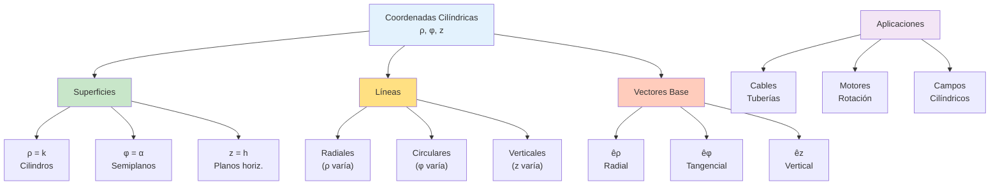
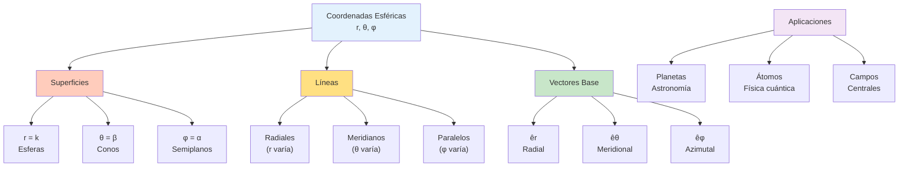

# 🎨 Representación Gráfica de Coordenadas Cilíndricas y Esféricas

## 🎯 Introducción a la Visualización

> [!info]- 💡 Importancia de la Representación Gráfica La **visualización geométrica** de los sistemas de coordenadas cilíndricas y esféricas es fundamental para:
> 
> **Objetivos de aprendizaje:**
> 
> - Comprender la geometría tridimensional de cada sistema
> - Identificar superficies coordenadas características
> - Interpretar ecuaciones en diferentes sistemas
> - Resolver problemas con intuición geométrica
> 
> **Analogías útiles:**
> 
> - **Cilíndricas:** Como los niveles de un edificio circular (altura) con direcciones radiales
> - **Esféricas:** Como las capas de una cebolla (radio) con líneas de latitud y longitud
> 
> **Aplicaciones prácticas:**
> 
> - **Ingeniería:** Diseño de antenas, tuberías, tanques
> - **Física:** Campos eléctricos, ondas electromagnéticas
> - **Astronomía:** Sistemas planetarios, coordenadas celestes
> - **Computación gráfica:** Modelado 3D, iluminación
> 
> **Importancia histórica:**
> 
> - **Leonhard Euler (1707-1783):** Desarrollo sistemático de coordenadas polares
> - **Joseph-Louis Lagrange (1736-1813):** Mecánica en coordenadas generalizadas
> - **Carl Friedrich Gauss (1777-1855):** Geometría diferencial y coordenadas curvilíneas
> - Aplicaciones en navegación marítima desde el siglo XVIII

## 🔵 Coordenadas Cilíndricas - Elementos Básicos

### 📐 Componentes del Sistema Cilíndrico

> [!note]- 🌟 Anatomía de las Coordenadas Cilíndricas **Los tres parámetros (ρ, φ, z):**
> 
> **1. Radio cilíndrico (ρ):**
> 
> - **Definición:** Distancia perpendicular al eje Z
> - **Interpretación física:** "¿Qué tan lejos del eje central?"
> - **Rango:** ρ ≥ 0
> - **Geometría:** Proyección en el plano XY
> 
> ```
> Visualización en plano XY:
>      Y
>      ↑
>      |    • P'
>      |   /
>      |  /ρ
>      | /
>      |/__________→ X
>      O
> 
> ρ = distancia de O a P' en el plano XY
> ```
> 
> **2. Ángulo azimutal (φ):**
> 
> - **Definición:** Ángulo desde el eje X positivo
> - **Interpretación física:** "¿En qué dirección horizontal?"
> - **Rango:** 0 ≤ φ < 2π (o -π < φ ≤ π)
> - **Sentido:** Antihorario visto desde arriba
> 
> ```
> Vista superior (plano XY):
>      Y
>      ↑
>      |    P'
>      |   /
>      |  / φ
>      | /___
>      |/    →→ X
>      O
> 
> φ = 0°:    eje X+
> φ = 90°:   eje Y+
> φ = 180°:  eje X-
> φ = 270°:  eje Y-
> ```
> 
> **3. Altura (z):**
> 
> - **Definición:** Coordenada vertical (igual que en cartesianas)
> - **Interpretación física:** "¿A qué altura?"
> - **Rango:** -∞ < z < ∞
> - **Geometría:** Distancia al plano XY con signo
> 
> ```
> Vista lateral:
>      Z
>      ↑
>      |  z > 0
>      |____→
>      |    ρ
>      |  z < 0
>      ↓
> ```
> 
> **Punto completo en cilíndricas:**
> 
> ```
> P(ρ, φ, z) se construye así:
> 1. Desde el origen O, moverse ρ unidades en el plano XY
>    en la dirección del ángulo φ (llegar a P')
> 2. Desde P', moverse z unidades verticalmente (llegar a P)
> ```

### 🎨 Superficies Coordenadas Cilíndricas

> [!warning]- 📊 Familias de Superficies Las **superficies coordenadas** se obtienen fijando una de las tres coordenadas:
> 
> #### **1. Superficies ρ = constante**
> **Ecuación:** ρ = k (k > 0)
> 
> **Geometría:** Cilindros circulares rectos con eje en Z
> 
> ```
> Visualización 3D:
>        Z
>        ↑
>        |    ╱‾‾‾╲
>        |   │     │  ← Cilindro de radio k
>        |   │     │
>        |   │     │
>        |    ╲___╱
>        |________→ Y
>       ╱
>      X
> 
> Ecuación cartesiana: x² + y² = k²
> Características:
> - Radio constante k desde el eje Z
> - Se extiende infinitamente en dirección Z
> - Paralelo al eje Z
> ```
> 
> **Ejemplos:**
> 
> - ρ = 2: Cilindro de radio 2
> - ρ = 5: Cilindro de radio 5
> - ρ = 0: El eje Z mismo (degenerado)
> 
> **Aplicaciones:**
> 
> - Cables y alambres conductores
> - Tuberías y ductos
> - Campos magnéticos de conductores rectilíneos
> 
> #### **2. Superficies φ = constante**
> **Ecuación:** φ = α (0 ≤ α < 2π)
> 
> **Geometría:** Semiplanos verticales que parten del eje Z
> 
> ```
> Visualización 3D:
>        Z
>        ↑
>        |      ╱
>        |     ╱  ← Semiplano a ángulo α
>        |    ╱
>        |   ╱
>        |  ╱
>        | ╱________→ Y
>       O╱
>      ╱
>     X
> 
> Vista superior (plano XY):
>      Y
>      ↑
>      |    ╱
>      |   ╱ α
>      |  ╱___
>      | ╱    →→ X
>      O
> 
> Ecuación cartesiana: y = x tan(α) [con restricciones de cuadrante]
> Características:
> - Contiene al eje Z
> - Ángulo fijo α desde el eje X
> - Se extiende infinitamente en todas direcciones desde Z
> ```
> 
> **Ejemplos:**
> 
> - φ = 0: Semiplano XZ (x ≥ 0)
> - φ = π/2: Semiplano YZ (y ≥ 0)
> - φ = π: Semiplano XZ (x ≤ 0)
> - φ = 3π/2: Semiplano YZ (y ≤ 0)
> 
> **Aplicaciones:**
> 
> - Cortes meridionales de estructuras cilíndricas
> - Análisis de simetría radial
> - Sectores angulares en diseño
> 
> #### **3. Superficies z = constante**
> 
> **Ecuación:** z = h
> 
> **Geometría:** Planos horizontales paralelos al plano XY
> 
> ```
> Visualización 3D:
>        Z
>        ↑
>        |__________ ← Plano a altura h
>        |
>        |__________ ← Plano a altura 0 (XY)
>        |
>        |__________ ← Plano a altura -h
>        |________→ Y
>       ╱
>      X
> 
> Vista lateral:
>      Z
>      ↑
>      |──────────  z = h₂
>      |
>      |──────────  z = h₁
>      |
>      |──────────  z = 0
>      |________→ X/Y
> 
> Ecuación cartesiana: z = h
> Características:
> - Paralelo al plano XY
> - Altura constante h
> - Independiente de ρ y φ
> ```
> 
> **Ejemplos:**
> 
> - z = 0: El plano XY
> - z = 5: Plano a 5 unidades arriba de XY
> - z = -3: Plano a 3 unidades debajo de XY
> 
> **Aplicaciones:**
> 
> - Pisos de edificios
> - Capas horizontales en análisis
> - Niveles de presión o temperatura

### 📏 Líneas Coordenadas Cilíndricas

> [!tip]- 🔗 Curvas de Intersección Las **líneas coordenadas** son las intersecciones de dos superficies coordenadas:
> 
> #### **1. Líneas radiales (ρ variable, φ y z fijos)
> **
> **Ecuación:** φ = α, z = h (ρ varía)
> 
> **Geometría:** Rayos horizontales desde el eje Z
> 
> ```
> Visualización:
>      Z
>      |
>      |     • P (ρ,α,h)
>      |    ╱
>      |   ╱← Línea radial
>      |  ╱
>      | •─────→ (ρ aumenta)
>      |_____→ Y
>     ╱
>    X
> 
> Características:
> - Dirección: hacia/desde el eje Z
> - Perpendicular al eje Z
> - A altura constante h
> - En dirección angular α
> ```
> 
> **Vector tangente unitario:** êρ
> 
> **Interpretación:** Moverse alejándose o acercándose al eje Z
> 
> #### **2. Líneas circulares (φ variable, ρ y z fijos)**
> 
> **Ecuación:** ρ = k, z = h (φ varía)
> 
> **Geometría:** Círculos horizontales centrados en el eje Z
> 
> ```
> Visualización:
>      Z
>      |
>      |      ___
>      |    ╱     ╲
>      |   (   •   ) ← Círculo a altura h
>      |    ╲_____╱    de radio k
>      |
>      |_____→ Y
>     ╱
>    X
> 
> Vista superior:
>      Y
>      ↑
>      |    _•_
>      |  ╱  |  ╲
>      | (   k   ) ← Círculo de radio k
>      |  ╲__|__╱
>      |_____|____→ X
>          O
> 
> Características:
> - Dirección: alrededor del eje Z
> - Radio constante k
> - Altura constante h
> - Sentido antihorario (visto desde arriba)
> ```
> 
> **Vector tangente unitario:** êφ
> 
> **Interpretación:** Moverse en círculo alrededor del eje Z
>
>#### **3. Líneas verticales (z variable, ρ y φ fijos)**
>
> **Ecuación:** ρ = k, φ = α (z varía)
> 
> **Geometría:** Rectas verticales paralelas al eje Z
> 
> ```
> Visualización:
>      Z
>      ↑
>      |
>      |   ↕ (z varía)
>      |   |
>      |   • P (k,α,z)
>      |   |
>      |   ↕
>      |_____→ Y
>     ╱
>    X
> 
> Vista superior:
>      Y
>      ↑
>      |     •←P'(k,α)
>      |    ╱
>      |   ╱ α
>      |  ╱___
>      | ╱    k
>      O─────→ X
> 
> Características:
> - Dirección: paralela al eje Z
> - Distancia constante k al eje Z
> - Ángulo constante α
> - Se extiende verticalmente
> ```
> 
> **Vector tangente unitario:** êz
> 
> **Interpretación:** Moverse verticalmente (arriba o abajo)

### 🎯 Vectores Unitarios en Cilíndricas

> [!success]- ➡️ Base Ortonormal Local En coordenadas cilíndricas, la base ortonormal **varía con la posición**:
> 
> **1. Vector radial unitario (êρ):**
> 
> ```
> êρ = (cos φ, sen φ, 0)
> 
> Propiedades:
> - Apunta en dirección de ρ creciente
> - Perpendicular al eje Z
> - Horizontal (componente z = 0)
> - Depende del ángulo φ
> ```
> 
> **2. Vector azimutal unitario (êφ):**
> 
> ```
> êφ = (-sen φ, cos φ, 0)
> 
> Propiedades:
> - Apunta en dirección de φ creciente
> - Tangente al círculo de radio ρ
> - Perpendicular a êρ
> - Horizontal (componente z = 0)
> ```
> 
> **3. Vector vertical unitario (êz):**
> 
> ```
> êz = (0, 0, 1)
> 
> Propiedades:
> - Apunta en dirección de z creciente
> - Paralelo al eje Z
> - Igual que k en cartesianas
> - NO depende de la posición
> ```
> 
> **Propiedades de la base:**
> 
> ```
> Ortogonalidad:
> êρ · êφ = 0
> êρ · êz = 0
> êφ · êz = 0
> 
> Normalización:
> |êρ| = |êφ| = |êz| = 1
> 
> Sistema diestro:
> êρ × êφ = êz
> êφ × êz = êρ
> êz × êρ = êφ
> ```
> 
> **Visualización de la base:**
> 
> ```
>        Z  êz
>        ↑
>        |
>        |    êφ
>        |    ↗
>        |   • ──→ êρ
>        |
>        |_____→ Y
>       ╱
>      X
> 
> En el punto •:
> - êρ apunta radialmente hacia afuera
> - êφ apunta tangencialmente (sentido antihorario)
> - êz apunta verticalmente hacia arriba
> ```

## 🔴 Coordenadas Esféricas - Elementos Básicos

### 📐 Componentes del Sistema Esférico

> [!note]- 🌟 Anatomía de las Coordenadas Esféricas **Los tres parámetros (r, θ, φ):**
> 
> **1. Radio esférico (r):**
> 
> - **Definición:** Distancia desde el origen al punto
> - **Interpretación física:** "¿Qué tan lejos del origen?"
> - **Rango:** r ≥ 0
> - **Geometría:** Magnitud del vector posición
> 
> ```
> Visualización:
>        Z
>        ↑
>        |    • P
>        |   ╱
>        |  ╱ r
>        | ╱
>        |╱________→ Y
>       O
>      ╱
>     X
> 
> r = |OP| = distancia euclidiana desde O hasta P
> r = √(x² + y² + z²)
> ```
> 
> **2. Ángulo polar/cenital (θ):**
> 
> - **Definición:** Ángulo desde el eje Z positivo
> - **Interpretación física:** "¿Qué tan inclinado desde el polo norte?"
> - **Rango:** 0 ≤ θ ≤ π
> - **Nombres alternativos:** Colatitud, ángulo cenital
> 
> ```
> Vista lateral:
>        Z
>        ↑
>        |╲ • P
>        | ╲╱
>        |  ╲ r
>        | θ ╲
>        |____╲__→ Y
>       O      
> 
> θ = 0:     Polo norte (eje Z+)
> θ = π/2:   Ecuador (plano XY)
> θ = π:     Polo sur (eje Z-)
> 
> Relación geográfica:
> Latitud = 90° - θ
> ```
> 
> **3. Ángulo azimutal (φ):**
> 
> - **Definición:** Ángulo desde el eje X en el plano XY
> - **Interpretación física:** "¿En qué dirección horizontal?"
> - **Rango:** 0 ≤ φ < 2π
> - **Igual que en cilíndricas**
> 
> ```
> Vista superior (plano XY):
>      Y
>      ↑
>      |    • P' (proyección)
>      |   ╱
>      |  ╱ φ
>      | ╱___
>      |╱    →→ X
>      O
> 
> φ = 0:     Semiplano XZ (x ≥ 0)
> φ = π/2:   Semiplano YZ (y ≥ 0)
> φ = π:     Semiplano XZ (x ≤ 0)
> φ = 3π/2:  Semiplano YZ (y ≤ 0)
> ```
> 
> **Construcción del punto P(r, θ, φ):**
> 
> ```
> 1. Desde O, moverse r unidades en la dirección dada por θ y φ
> 2. Primero: descender θ desde el eje Z
> 3. Segundo: rotar φ alrededor del eje Z
> 
> Equivalentemente:
> 4. En el plano XY, moverse r·sen(θ) en dirección φ
> 5. Luego subir z = r·cos(θ)
> ```

### 🎨 Superficies Coordenadas Esféricas

> [!warning]- 📊 Familias de Superficies Esféricas
>
>#### **1. Superficies r = constante**
v
> **Ecuación:** r = k (k > 0)
> 
> **Geometría:** Esferas centradas en el origen
> 
> ```
> Visualización 3D:
>        Z
>        ↑
>        |    ___
>        |  ╱     ╲
>        | │   •   │ ← Esfera de radio k
>        |  ╲_____╱    centrada en O
>        |
>        |_____→ Y
>       ╱
>      X
> 
> Cortes:
> - Plano XY: Círculo x² + y² = k²
> - Plano XZ: Círculo x² + z² = k²
> - Plano YZ: Círculo y² + z² = k²
> 
> Ecuación cartesiana: x² + y² + z² = k²
> Características:
> - Distancia constante k al origen
> - Simétrica respecto al origen
> - Superficie cerrada
> ```
> 
> **Ejemplos:**
> 
> - r = 1: Esfera unitaria
> - r = R: Esfera de radio R
> - r = 0: El origen (degenerado)
> 
> **Aplicaciones:**
> 
> - Planetas y estrellas
> - Niveles de potencial en campos centrales
> - Órbitas satelitales (aproximación)
> - Ondas esféricas
>
>#### **2. Superficies θ = constante**
>
> **Ecuación:** θ = β (0 < β < π)
> 
> **Geometría:** Conos circulares con vértice en O y eje en Z
> 
> ```
> Visualización 3D:
>        Z
>        ↑
>       ╱│╲
>      ╱ │ ╲
>     ╱  │  ╲  ← Cono de ángulo β
>    ╱   │   ╲
>   ╱____│____╲→ Y
>  O     
> ╱
> X
> 
> Casos especiales:
> θ = 0:    Eje Z+ (línea)
> θ = π/4:  Cono de 45°
> θ = π/2:  Plano XY
> θ = 3π/4: Cono invertido de 45°
> θ = π:    Eje Z- (línea)
> 
> Vista lateral (plano XZ):
>      Z
>      ↑  
>      |╲  ╱
>      | ╲╱ β
>      |  O____→ X
>      | ╱╲
>      |╱  ╲
> 
> Ecuación cartesiana: z = ±√(x² + y²) cot(β)
> Características:
> - Vértice en el origen
> - Eje de simetría en Z
> - Ángulo constante β con el eje Z
> - Superficie abierta (se extiende al infinito)
> ```
> 
> **Ejemplos:**
> 
> - θ = π/6: Cono de 30° (estrecho)
> - θ = π/4: Cono de 45°
> - θ = π/3: Cono de 60° (ancho)
> 
> **Aplicaciones:**
> 
> - Haces de luz cónicos
> - Antenas direccionales
> - Volcanes (aproximación)
> - Campos de radiación angular
>
>#### **3. Superficies φ = constante**
>
> **Ecuación:** φ = α (0 ≤ α < 2π)
> 
> **Geometría:** Semiplanos verticales desde el eje Z (igual que en cilíndricas)
> 
> ```
> Visualización 3D:
>        Z
>        ↑
>        |      ╱
>        |     ╱
>        |    ╱  ← Semiplano a ángulo α
>        |   ╱     (contiene al eje Z)
>        |  ╱
>        | ╱________→ Y
>       O╱
>      ╱
>     X
> 
> Vista superior:
>      Y
>      ↑
>      |    ╱
>      |   ╱ α
>      |  ╱___
>      | ╱    →→ X
>      O
> 
> Ecuación cartesiana: y = x tan(α) [con restricciones]
> Características:
> - Contiene al eje Z
> - Ángulo constante α desde el eje X
> - Se extiende infinitamente
> - Divide el espacio en dos mitades
> ```
> 
> **Ejemplos:**
> 
> - φ = 0: Semiplano XZ (x ≥ 0) - "meridiano de Greenwich"
> - φ = π/2: Semiplano YZ (y ≥ 0) - "meridiano 90°E"
> - φ = π: Semiplano XZ (x ≤ 0) - "línea de cambio de fecha"
> 
> **Aplicaciones:**
> 
> - Líneas de longitud en geografía
> - Meridianos celestes en astronomía
> - Secciones angulares en análisis

### 📏 Líneas Coordenadas Esféricas

> [!tip]- 🔗 Curvas de Intersección Esféricas
>
>#### **1. Líneas radiales (r variable, θ y φ fijos)**
>
> **Ecuación:** θ = β, φ = α (r varía)
> 
> **Geometría:** Rayos desde el origen en dirección fija
> 
> ```
> Visualización:
>      Z
>      ↑
>      |    • P(r,β,α)
>      |   ╱
>      |  ╱← Rayo radial
>      | ╱    (r aumenta)
>      |╱
>      O────→ Y
>     ╱
>    X
> 
> Características:
> - Dirección: hacia/desde el origen
> - Recta que pasa por O
> - Ángulos θ y φ fijos
> - Toda la línea definida por dos ángulos
> ```
> 
> **Vector tangente unitario:** êr
> 
> **Interpretación:** Moverse radialmente (alejándose o acercándose al origen)
>
>#### **2. Líneas meridionales (θ variable, r y φ fijos)**
>
> **Ecuación:** r = k, φ = α (θ varía)
> 
> **Geometría:** Semicírculos verticales (meridianos) sobre la esfera
> 
> ```
> Visualización (vista lateral en plano φ=α):
>      Z
>      ↑
>      |    _•_
>      |  ╱  |  ╲
>      | (   k   ) ← Semicírculo de radio k
>      |  ╲__|__╱    (meridiano)
>      |     O
>      |____→ (dirección φ=α)
> 
> Vista 3D:
>        Z
>        ↑    •
>        |   ╱│╲
>        |  ╱ │ ╲
>        | (  │  ) ← Meridiano
>        |  ╲_│_╱
>        |____│__→ Y
>       ╱     
>      X
> 
> Características:
> - Dirección: norte-sur en la esfera
> - Semicírculo que pasa por los polos
> - Radio constante k (sobre la esfera)
> - Longitud φ constante
> - θ varía de 0 a π
> ```
> 
> **Vector tangente unitario:** êθ
> 
> **Interpretación:** Moverse sobre la esfera en dirección norte-sur
> 
> **Analogía geográfica:** Como los meridianos en la Tierra
>
>#### **3. Líneas paralelas (φ variable, r y θ fijos)**
>
> **Ecuación:** r = k, θ = β (φ varía)
> 
> **Geometría:** Círculos horizontales (paralelos) sobre la esfera
> 
> ```
> Visualización:
>        Z
>        ↑
>        |
>        |    ___
>        |  ╱     ╲  ← Paralelo a latitud θ=β
>        | (       )   (círculo horizontal)
>        |  ╲_____╱
>        |
>        |____→ Y
>       ╱
>      X
> 
> Vista superior del paralelo:
>      Y
>      ↑
>      |    ___
>      |  ╱     ╲
>      | (   •   ) ← Círculo de radio r·sen(β)
>      |  ╲_____╱
>      |_____→ X
> 
> Radio del círculo: ρ = r sen(θ)
> 
> Casos especiales:
> θ = 0:   Polo norte (punto)
> θ = π/2: Ecuador (círculo máximo)
> θ = π:   Polo sur (punto)
> 
> Características:
> - Dirección: este-oeste en la esfera
> - Círculo paralelo al plano XY
> - Radio r constante (sobre la esfera)
> - Colatitud θ constante
> - φ varía de 0 a 2π
> ```
> 
> **Vector tangente unitario:** êφ
> 
> **Interpretación:** Moverse sobre la esfera en dirección este-oeste
> 
> **Analogía geográfica:** Como los paralelos o líneas de latitud en la Tierra

### 🎯 Vectores Unitarios en Esféricas

> [!success]- ➡️ Base Ortonormal Local Esférica En coordenadas esféricas, la base ortonormal **varía con la posición**:
> 
> **1. Vector radial unitario (êr):**
> 
> ```
> êr = (sen θ cos φ, sen θ sen φ, cos θ)
> 
> Propiedades:
> - Apunta en dirección de r creciente
> - Desde el origen hacia el punto
> - Perpendicular a la esfera
> - Depende de θ y φ
> ```
> 
> **2. Vector meridional unitario (êθ):**
> 
> ```
> êθ = (cos θ cos φ, cos θ sen φ, -sen θ)
> 
> Propiedades:
> - Apunta en dirección de θ creciente
> - Tangente al meridiano (dirección sur)
> - Perpendicular a êr
> - Depende de θ y φ
> ```
> 
> **3. Vector azimutal unitario (êφ):**
> 
> ```
> êφ = (-sen φ, cos φ, 0)
> 
> Propiedades:
> - Apunta en dirección de φ creciente
> - Tangente al paralelo (dirección este)
> - Horizontal (componente z = 0)
> - Solo depende de φ (igual que en cilíndricas)
> ```
> 
> **Propiedades de la base:**
> 
> ```
> Ortogonalidad:
> êr · êθ = 0
> êr · êφ = 0
> êθ · êφ = 0
> 
> Normalización:
> |êr| = |êθ| = |êφ| = 1
> 
> > Sistema diestro: êr × êθ = êφ êθ × êφ = êr êφ × êr = êθ
> 
> ```
> 
> **Visualización de la base:**
> 
> 
> ```
>    Z  
>    ↑  êr
>    | ↗
>    |╱ • ──→ êφ
>    |  ↓
>    |  êθ
>    |____→ Y
>   ╱
>  X
> ```
> 
> En el punto •:
> 
> - êr apunta radialmente hacia afuera (desde O)
> - êθ apunta tangencialmente hacia el sur
> - êφ apunta tangencialmente hacia el este
> 
> 
> **Comparación con geografía:**
> 
> 
> En la superficie terrestre:
> 
> - êr: apunta hacia el cielo (radial)
> - êθ: apunta hacia el polo sur (meridional)
> - êφ: apunta hacia el este (azimutal)

## 📊 Comparación Visual de Sistemas

### 🔀 Tabla Comparativa

> [!example]- 📋 Resumen de Superficies y Líneas
> 
> |Característica|Cartesianas|Cilíndricas|Esféricas|
> |---|---|---|---|
> |**Coordenadas**|(x, y, z)|(ρ, φ, z)|(r, θ, φ)|
> |**Rangos**|-∞ < x,y,z < ∞|ρ≥0, 0≤φ<2π, -∞<z<∞|r≥0, 0≤θ≤π, 0≤φ<2π|
> |**Superficie 1**|Plano x=k|Cilindro ρ=k|Esfera r=k|
> |**Superficie 2**|Plano y=k|Semiplano φ=α|Cono θ=β|
> |**Superficie 3**|Plano z=k|Plano z=h|Semiplano φ=α|
> |**Línea 1**|Recta ∥ eje X|Rayo radial|Rayo desde O|
> |**Línea 2**|Recta ∥ eje Y|Círculo horizontal|Semicírculo vertical|
> |**Línea 3**|Recta ∥ eje Z|Recta vertical|Círculo horizontal|
> |**Vectores base**|î, ĵ, k̂ (fijos)|êρ, êφ, êz (varían)|êr, êθ, êφ (varían)|
> |**Elemento volumen**|dx dy dz|ρ dρ dφ dz|r² sen(θ) dr dθ dφ|
> |**Mejor para**|Geometría rectangular|Simetría cilíndrica|Simetría esférica|

### 🎨 Visualización Comparativa

> [!note]- 🖼️ Esquemas de los Tres Sistemas
> 
> **Sistema Cartesiano:**
> 
> ```
>      Z
>      ↑
>      |______ Planos perpendiculares
>      |  |  |
>      | _|__|__ Y
>      |/  |
>     O────→
>    X
> 
> Características:
> - Tres ejes perpendiculares
> - Superficies: planos
> - Base fija en todo el espacio
> ```
> 
> **Sistema Cilíndrico:**
> 
> ```
>      Z
>      ↑
>      |  ╱‾‾‾╲    Cilindros concéntricos
>      | │     │   + Semiplanos radiales
>      | │  •  │   + Planos horizontales
>      |  ╲___╱
>      |____→ Y
>     ╱
>    X
> 
> Características:
> - Eje Z central
> - Superficies: cilindros, semiplanos, planos
> - Base varía con φ
> ```
> 
> **Sistema Esférico:**
> 
> ```
>      Z
>      ↑
>      |   ___      Esferas concéntricas
>      | ╱     ╲   + Conos
>      |(   •   )  + Semiplanos
>      | ╲_____╱
>      |____→ Y
>     ╱
>    X
> 
> Características:
> - Origen central
> - Superficies: esferas, conos, semiplanos
> - Base varía con θ y φ
> ```

## 🎯 Regiones Comunes en Diferentes Sistemas

### 📦 Descripción de Regiones Geométricas

> [!warning]- 🔷 Regiones Típicas
>
>#### **1. Cilindro Sólido**
>
> **Descripción:** Cilindro de radio R y altura H
> 
> ```
> En Cartesianas:
> x² + y² ≤ R²
> 0 ≤ z ≤ H
> 
> En Cilíndricas (MEJOR):
> 0 ≤ ρ ≤ R
> 0 ≤ φ < 2π
> 0 ≤ z ≤ H
> 
> En Esféricas (complicado):
> 0 ≤ r ≤ R/sen(θ)  [para 0 < θ ≤ π/2]
> ...
> 
> Visualización:
>      Z
>      ↑ H
>      |  ╱‾‾‾╲
>      | │     │
>      | │  R  │
>      | │     │
>      |  ╲___╱
>      O____→ Y
>     ╱
>    X
> ```
> 
> **Conclusión:** Las cilíndricas son óptimas para esta región
>
>#### **2. Esfera Sólida**
>
> **Descripción:** Esfera de radio R centrada en el origen
> 
> ```
> En Cartesianas:
> x² + y² + z² ≤ R²
> 
> En Cilíndricas:
> 0 ≤ ρ ≤ √(R² - z²)
> 0 ≤ φ < 2π
> -R ≤ z ≤ R
> 
> En Esféricas (MEJOR):
> 0 ≤ r ≤ R
> 0 ≤ θ ≤ π
> 0 ≤ φ < 2π
> 
> Visualización:
>      Z
>      ↑
>      |   ___
>      | ╱     ╲
>      |(   R   )
>      | ╲_____╱
>      O____→ Y
>     ╱
>    X
> ```
> 
> **Conclusión:** Las esféricas son óptimas para esta región
>
>#### **3. Cono**
>
> **Descripción:** Cono con vértice en O, eje en Z, ángulo de apertura α
> 
> ```
> En Cartesianas:
> z ≥ √(x² + y²) tan(α)
> 0 ≤ z ≤ H
> 
> En Cilíndricas:
> 0 ≤ ρ ≤ z/tan(α)
> 0 ≤ φ < 2π
> 0 ≤ z ≤ H
> 
> En Esféricas (MEJOR para ángulo):
> 0 ≤ r ≤ R
> 0 ≤ θ ≤ α
> 0 ≤ φ < 2π
> 
> Visualización:
>      Z  H
>      ↑  •
>      | ╱│╲
>      |╱ │ ╲ α
>      │  │  ╲
>     O───│───╲→ Y
>    ╱    
>   X
> ```
> 
> **Conclusión:** Las esféricas simplifican el ángulo de apertura
>
>#### **4. Anillo (Toro parcial)**
>
> **Descripción:** Región entre dos cilindros concéntricos
> 
> ```
> En Cartesianas:
> R₁² ≤ x² + y² ≤ R₂²
> 0 ≤ z ≤ H
> 
> En Cilíndricas (MEJOR):
> R₁ ≤ ρ ≤ R₂
> 0 ≤ φ < 2π
> 0 ≤ z ≤ H
> 
> Visualización (vista superior):
>      Y
>      ↑
>      |   ___
>      | ╱ ___ ╲
>      |(       )  R₂
>      | ╲(•)╱    R₁
>      |   ‾‾‾
>      O────→ X
> ```
>
>#### **5. Casquete Esférico**
>
> **Descripción:** Porción de esfera entre dos ángulos polares
> 
> ```
> En Esféricas (MEJOR):
> 0 ≤ r ≤ R
> θ₁ ≤ θ ≤ θ₂
> 0 ≤ φ < 2π
> 
> Visualización:
>      Z
>      ↑  ___
>      | ╱   ╲  θ₁
>      |( - - ) ← Casquete
>      | ╲___╱  θ₂
>      O____→ Y
>     ╱
>    X
> ```

## 🧮 Ejercicios de Visualización

> [!example]- 💪 Práctica de Representación
>
>### **Nivel 1 - Identificación:** 🟢
>
> **Ejercicio 1:** Describir las siguientes superficies
> 
> a) En cilíndricas: ρ = 3
> 
> ```
> Respuesta:
> Cilindro circular recto de radio 3 con eje en Z
> Se extiende infinitamente en dirección Z
> 
> Ecuación cartesiana: x² + y² = 9
> ```
> 
> b) En esféricas: r = 5
> 
> ```
> Respuesta:
> Esfera de radio 5 centrada en el origen
> 
> Ecuación cartesiana: x² + y² + z² = 25
> ```
> 
> c) En esféricas: θ = π/3
> 
> ```
> Respuesta:
> Cono circular con vértice en O, eje en Z
> Ángulo de apertura 60° desde el eje Z
> Se abre hacia arriba y hacia abajo
> ```
>
>
>### **Nivel 2 - Conversión:** 🟡
>
> **Ejercicio 2:** Expresar la región en el sistema más apropiado
> 
> a) Región dentro del cilindro x² + y² = 4, entre z = 0 y z = 5
> 
> ```
> Sistema apropiado: Cilíndricas
> 
> Descripción:
> 0 ≤ ρ ≤ 2
> 0 ≤ φ < 2π
> 0 ≤ z ≤ 5
> 
> Razón: La simetría cilíndrica hace que las
> coordenadas cilíndricas sean naturales
> ```
> 
> b) Región dentro de la esfera x² + y² + z² = 9, en el primer octante
> 
> ```
> Sistema apropiado: Esféricas
> 
> Descripción:
> 0 ≤ r ≤ 3
> 0 ≤ θ ≤ π/2
> 0 ≤ φ ≤ π/2
> 
> Razón: La simetría esférica simplifica los límites
> ```
>
>### **Nivel 3 - Análisis:** 🔴
>
> **Ejercicio 3:** Identificar la curva de intersección
> 
> a) Intersección del cilindro ρ = 2 con el plano z = 3
> 
> ```
> Respuesta:
> Círculo de radio 2 a altura 3
> 
> En cilíndricas: ρ = 2, z = 3, 0 ≤ φ < 2π
> En cartesianas: x² + y² = 4, z = 3
> 
> Visualización:
>      Z
>      |
>    3 |___ ___
>      | ╱     ╲  ← Círculo
>      |(   •   )
>      | ╲_____╱
>      O____→ Y
>     ╱
>    X
> ```
> 
> b) Intersección de la esfera r = 4 con el cono θ = π/4
> 
> ```
> Respuesta:
> Círculo sobre la esfera a colatitud 45°
> 
> En esféricas: r = 4, θ = π/4, 0 ≤ φ < 2π
> Radio del círculo: 4 sen(π/4) = 2√2
> Altura del plano: z = 4 cos(π/4) = 2√2
> 
> Visualización:
>      Z
>      ↑
>      |  ___
>      |╱  •  ╲
>      (───────) ← Círculo de intersección
>      | ╲___╱
>      O____→ Y
> ```
>
> **Ejercicio 4:** Describir región compleja
> 
> Región entre dos esferas concéntricas de radios 2 y 3, y dentro del cono θ ≤ π/3
> 
> ```
> En esféricas (óptimo):
> 2 ≤ r ≤ 3
> 0 ≤ θ ≤ π/3
> 0 ≤ φ < 2π
> 
> Descripción:
> Casquete esférico hueco (anillo esférico)
> limitado por un cono de 60°
> 
> Visualización:
>      Z
>      ↑  ___
>      | ╱   ╲
>      |( ═══ ) ← Región sombreada
>      | ╲___╱    (casquete hueco)
>      O____→ Y
>     ╱
>    X
> 
> Volumen (usando esféricas):
> V = ∫∫∫ r² sen(θ) dr dθ dφ
> ```

## 🎨 Diagramas Completos de Sistemas

### 🔵 Diagrama Detallado - Cilíndricas



### 🔴 Diagrama Detallado - Esféricas



## 💡 Consejos para Visualización

> [!tip]- 🧠 Estrategias de Visualización Efectiva
> 
> **Técnicas de dibujo:**
> 
> **1. Perspectiva 3D:**
> 
> - Usar ejes con ángulos de 120° entre sí
> - Dibujar el eje Z vertical
> - Ejes X e Y inclinados 30° desde la horizontal
> 
> **2. Proyecciones múltiples:**
> 
> - Vista superior (plano XY)
> - Vista frontal (plano XZ)
> - Vista lateral (plano YZ)
> 
> **3. Secciones transversales:**
> 
> - Cortar con planos coordenados
> - Identificar curvas de intersección
> - Analizar simetría
> 
> **Errores comunes de visualización:**
> 
> ❌ **Error 1:** Confundir cilindros con conos
> 
> - Cilindro: ρ = k (radio constante)
> - Cono: θ = k (ángulo constante)
> 
> ❌ **Error 2:** No distinguir semiplanos de planos completos
> 
> - φ = α es un semiplano (desde el eje Z)
> - No es un plano completo
> 
> ❌ **Error 3:** Olvidar rangos de ángulos
> 
> - φ: 0 ≤ φ < 2π (azimutal)
> - θ: 0 ≤ θ ≤ π (polar, solo hemisferio superior y inferior)
> 
> ❌ **Error 4:** No visualizar bases locales
> 
> - Los vectores unitarios cambian con la posición
> - Dibujarlos en varios puntos para entender variación
> 
> **Herramientas recomendadas:**
> 
> - GeoGebra 3D (gratuito)
> - MATLAB/Python con matplotlib
> - Wolfram Alpha
> - Desmos 3D Calculator

## 🔗 Conexiones Conceptuales

> [!quote]- 🌟 Enlaces con Otros Temas
> 
> **Prerrequisitos:**
> 
> - [[01.1 Sistema de Referencia Espacial]] - Coordenadas cartesianas base
> - [[02 - Vectores en R3]] - Vectores y operaciones
> - [[02 - Transformaciones entre coordenadas]] - Fórmulas de conversión
> 
> **Temas relacionados:**
> 
> - [[Cálculo Vectorial]] - Gradiente, divergencia, rotacional
> - [[Integrales Triples]] - Cambios de variable
> - [[Ecuaciones Diferenciales]] - Laplaciano en diferentes coordenadas
> 
> **Aplicaciones:**
> 
> - [[Electromagnetismo]] - Ley de Gauss, campos
> - [[Mecánica Clásica]] - Problemas con simetría
> - [[Física Cuántica]] - Átomo de hidrógeno
> - [[Computación Gráfica]] - Modelado 3D
> 
> **Temas avanzados:**
> 
> - [[Geometría Diferencial]] - Métricas y curvaturas
> - [[Teoría de Campos]] - Representación de campos vectoriales
> - [[Análisis Tensorial]] - Tensores en coordenadas curvilíneas

---

**Tags:** #visualización #coordenadas #cilíndricas #esféricas #superficies-coordenadas #geometría-3D #representación-gráfica #sistemas-coordenados #vectores-unitarios #R3 #university #matemáticas #física