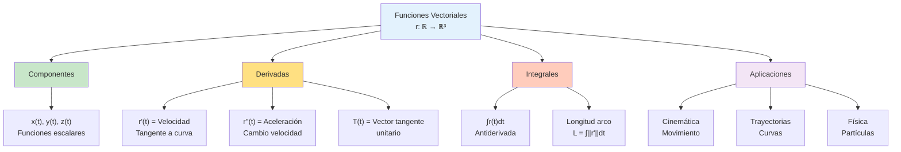

# 🎯 Funciones Vectoriales

## 🌟 Introducción a las Funciones Vectoriales

> [!info]- 💡 Concepto Fundamental Una **función vectorial** es una función que asigna a cada número real (o a números en un intervalo) un vector en el espacio.
> 
> **Definición intuitiva:**
> 
> - **Entrada:** Un número real t (parámetro)
> - **Salida:** Un vector **r**(t) en ℝ² o ℝ³
> 
> **Analogías útiles:**
> 
> - **Física:** Posición de una partícula en movimiento en función del tiempo
> - **Animación:** Trayectoria de un objeto en una escena 3D
> - **Navegación:** Ruta de un vehículo parametrizada por el tiempo
> - **Biología:** Movimiento de un organismo rastreado en el espacio
> 
> **Diferencia clave:**
> 
> - **Función escalar:** f(t) = número (como f(t) = t²)
> - **Función vectorial:** **r**(t) = vector (como **r**(t) = (t², 2t, 3))
> 
> **Visualización:**
> 
> ```
> Dominio (ℝ)          Codominio (ℝ³)
>                      Z
>    t₁ ───────────→  ↑
>                      |  • P₁ = r(t₁)
>    t₂ ───────────→  | /
>                      |/  • P₂ = r(t₂)
>    t₃ ───────────→  •─────→ Y
>                     /P₃
>                    X
> 
> Cada valor t produce un punto en el espacio
> ```
> 
> **Importancia histórica:**
> 
> - **Isaac Newton (1643-1727):** Cinemática y cálculo vectorial
> - **Gottfried Leibniz (1646-1716):** Notación diferencial
> - **Joseph-Louis Lagrange (1736-1813):** Mecánica analítica
> - **William Rowan Hamilton (1805-1865):** Álgebra vectorial
> - Aplicaciones en mecánica celeste desde el siglo XVII

## 📐 Definición Formal

### 🔍 Función Vectorial en ℝ³

> [!note]- 🌟 Definición Matemática **Definición:**
> 
> Una **función vectorial** es una función de la forma:
> 
> **r**: I ⊆ ℝ → ℝ³
> 
> donde I es un intervalo y:
> 
> **r**(t) = (x(t), y(t), z(t)) = x(t)**i** + y(t)**j** + z(t)**k**
> 
> **Componentes:**
> 
> - **x(t):** Función componente en dirección X
> - **y(t):** Función componente en dirección Y
> - **z(t):** Función componente en dirección Z
> 
> Cada componente x(t), y(t), z(t) es una **función escalar** de variable real.
> 
> **Notaciones equivalentes:**
> 
> ```
> r(t) = (x(t), y(t), z(t))
> r(t) = ⟨x(t), y(t), z(t)⟩
> r(t) = x(t)i + y(t)j + z(t)k
> r(t) = [x(t)]
>        [y(t)]
>        [z(t)]
> ```
> 
> **Dominio:**
> 
> - El **dominio** de **r**(t) es la intersección de los dominios de x(t), y(t), z(t)
> - Típicamente: Dom(**r**) = {t ∈ ℝ : todas las componentes están definidas}
> 
> **Rango o imagen:**
> 
> - El **rango** es el conjunto de todos los vectores **r**(t) cuando t varía en el dominio
> - Geométricamente: es una **curva** en el espacio ℝ³

### 📊 Ejemplos Básicos

> [!example]- 🎯 Funciones Vectoriales Fundamentales
>
>#### **Ejemplo 1: Línea recta**
>
> **Función:** **r**(t) = (1 + 2t, 3 - t, 4 + 3t)
> 
> ```
> Descomposición:
> x(t) = 1 + 2t
> y(t) = 3 - t
> z(t) = 4 + 3t
> 
> Dominio: t ∈ ℝ (todos los reales)
> 
> Interpretación geométrica:
> - Cuando t = 0: r(0) = (1, 3, 4) [punto inicial]
> - Cuando t = 1: r(1) = (3, 2, 7)
> - Cuando t = 2: r(2) = (5, 1, 10)
> 
> Es una recta que pasa por (1, 3, 4) 
> con dirección v = (2, -1, 3)
> 
> Visualización:
>      Z
>      ↑
>      |     •──→ Dirección (2,-1,3)
>      |    /
>      |   • (1,3,4)
>      |  /
>      | /
>      O────→ Y
>     /
>    X
> ```
>
>#### **Ejemplo 2: Hélice circular**
>
> **Función:** **r**(t) = (cos t, sen t, t)
> 
> ```
> Descomposición:
> x(t) = cos t
> y(t) = sen t
> z(t) = t
> 
> Dominio: t ∈ ℝ
> 
> Análisis:
> - En el plano XY: x² + y² = cos²t + sen²t = 1
>   → Círculo unitario
> - Componente z = t crece linealmente
> → Espiral ascendente (hélice)
> 
> Valores específicos:
> t = 0:    r(0) = (1, 0, 0)
> t = π/2:  r(π/2) = (0, 1, π/2)
> t = π:    r(π) = (-1, 0, π)
> t = 2π:   r(2π) = (1, 0, 2π)
> 
> Visualización:
>      Z
>      ↑
>    2π|    ╱•
>      |   ╱ 
>    π |  •
>      | ╱
>  π/2|•
>      |╲____→ Y
>     ╱ •
>    X
> 
> La curva "enrolla" alrededor del eje Z
> ```
>
>#### **Ejemplo 3: Parábola en el espacio**
>
> **Función:** **r**(t) = (t, t², 2t)
> 
> ```
> Descomposición:
> x(t) = t
> y(t) = t²
> z(t) = 2t
> 
> Dominio: t ∈ ℝ
> 
> Relaciones:
> - De x = t: t = x
> - Entonces: y = x²
> - Y: z = 2x
> 
> → La curva está en la intersección de:
>   Cilindro parabólico: y = x²
>   Plano: z = 2x
> 
> Visualización:
>      Z
>      ↑
>      |      •
>      |    /
>      |   •
>      |  /
>      | •
>      |/
>      O────→ Y
>     /•
>    X
> ```
>
>#### **Ejemplo 4: Círculo en el plano XY**
>
> **Función:** **r**(t) = (R cos t, R sen t, 0)
> 
> ```
> Descomposición:
> x(t) = R cos t
> y(t) = R sen t
> z(t) = 0
> 
> Dominio típico: 0 ≤ t ≤ 2π (una vuelta completa)
> 
> Verificación:
> x² + y² = R²cos²t + R²sen²t = R²
> z = 0
> 
> → Círculo de radio R en el plano XY
> 
> Vista superior (plano XY):
>      Y
>      ↑
>      |   ___
>      | ╱     ╲
>      |(   •   ) Radio R
>      | ╲_____╱
>      O────→ X
> ```

## 🎨 Interpretación Geométrica

### 🛤️ Curvas Parametrizadas

> [!warning]- 📍 La Función Vectorial como Curva **Concepto fundamental:**
> 
> Una función vectorial **r**(t) define una **curva parametrizada** en el espacio.
> 
> **Elementos geométricos:**
> 
> **1. Curva (Traza):**
> 
> - Es el conjunto C = {**r**(t) : t ∈ Dom(**r**)}
> - La "trayectoria" o "camino" en el espacio
> - Conjunto de todos los puntos alcanzados
> 
> **2. Parametrización:**
> 
> - El parámetro t asigna un "orden" o "tiempo" a los puntos
> - Diferentes parametrizaciones pueden generar la misma curva
> - t no necesariamente representa tiempo físico
> 
> **3. Orientación:**
> 
> - La dirección en que se recorre la curva al aumentar t
> - **r**(t) con t creciente da la orientación positiva
> - Se indica con flechas en la curva
> 
> **Visualización completa:**
> 
> ```
>      Z
>      ↑
>      |        • r(t₃)
>      |       ↗
>      |      • r(t₂)
>      |     ↗
>      |    • r(t₁)
>      |   ↗
>      |  • r(t₀) [punto inicial]
>      O────→ Y
>     /
>    X
> 
> La flecha → indica orientación (t creciente)
> ```
> 
> **Ejemplo ilustrativo:**
> 
> ```
> r(t) = (cos t, sen t, t/π)  para 0 ≤ t ≤ 2π
> 
> Puntos específicos:
> t = 0:     (1, 0, 0)        [inicio]
> t = π/2:   (0, 1, 1/2)
> t = π:     (-1, 0, 1)
> t = 3π/2:  (0, -1, 3/2)
> t = 2π:    (1, 0, 2)        [fin]
> 
> La curva es una hélice que da una vuelta completa
> mientras sube de z=0 a z=2
> ```

### 🔄 Reparametrización

> [!tip]- 🔀 Diferentes Parámetros para la Misma Curva **Concepto:**
> 
> Dos funciones vectoriales diferentes pueden representar la **misma curva** con diferente parametrización.
> 
> **Definición formal:**
> 
> Sean **r₁**(t) y **r₂**(s) dos funciones vectoriales. Son **reparametrizaciones** de la misma curva si existe una función biyectiva s = φ(t) tal que:
> 
> **r₂**(s) = **r₁**(φ⁻¹(s))
> 
> **Ejemplo práctico:**
> 
> ```
> Curva: Círculo unitario en el plano XY
> 
> Parametrización 1:
> r₁(t) = (cos t, sen t, 0)    con 0 ≤ t ≤ 2π
> 
> Parametrización 2:
> r₂(s) = (cos 2s, sen 2s, 0)  con 0 ≤ s ≤ π
> 
> Relación: s = t/2, o equivalentemente t = 2s
> 
> Diferencia:
> - r₁ recorre el círculo en tiempo [0, 2π]
> - r₂ recorre el círculo en tiempo [0, π] (más rápido)
> - Ambas describen el MISMO círculo geométrico
> ```
> 
> **Cambio de orientación:**
> 
> ```
> r₁(t) = (cos t, sen t, 0)     [antihorario]
> r₂(t) = (cos(-t), sen(-t), 0) [horario]
>       = (cos t, -sen t, 0)
> 
> Misma curva, orientaciones opuestas
> ```

### 📏 Límites y Continuidad

> [!success]- ➡️ Análisis de Funciones Vectoriales **Límite de una función vectorial:**
> 
> **Definición:**
> 
> lim[t→a] **r**(t) = **L** si y solo si:
> 
> lim[t→a] x(t) = Lₓ lim[t→a] y(t) = Lᵧ lim[t→a] z(t) = Lᵤ
> 
> donde **L** = (Lₓ, Lᵧ, Lᵤ)
> 
> **Regla práctica:**
> 
> ```
> El límite de un vector es el vector de los límites
> de sus componentes
> ```
> 
> **Ejemplo:**
> 
> ```
> Calcular: lim[t→0] r(t) donde r(t) = (sen t/t, t², e^t)
> 
> Solución:
> lim[t→0] x(t) = lim[t→0] sen t/t = 1
> lim[t→0] y(t) = lim[t→0] t² = 0
> lim[t→0] z(t) = lim[t→0] e^t = 1
> 
> Por lo tanto: lim[t→0] r(t) = (1, 0, 1)
> ```
> 
> **Continuidad:**
> 
> **Definición:**
> 
> **r**(t) es **continua** en t = a si:
> 
> 1. **r**(a) está definida
> 2. lim[t→a] **r**(t) existe
> 3. lim[t→a] **r**(t) = **r**(a)
> 
> **Equivalentemente:**
> 
> **r**(t) es continua en t = a ⟺ x(t), y(t), z(t) son continuas en t = a
> 
> **Ejemplo:**
> 
> ```
> r(t) = (t², sen t, ln t)
> 
> - x(t) = t² continua en ℝ
> - y(t) = sen t continua en ℝ
> - z(t) = ln t continua en (0, ∞)
> 
> → r(t) es continua en (0, ∞)
> ```
> 
> **Interpretación geométrica:**
> 
> ```
> r(t) continua ⟺ La curva no tiene "saltos" o "rupturas"
>                ⟺ Se puede dibujar sin levantar el lápiz
> ```

## 📐 Derivadas de Funciones Vectoriales

### 🔍 Definición de Derivada

> [!note]- 🌟 Vector Tangente y Derivada **Definición:**
> 
> La **derivada** de **r**(t) es:
> 
> **r'**(t) = d**r**/dt = lim[h→0] [**r**(t+h) - **r**(t)]/h
> 
> **Cálculo por componentes:**
> 
> Si **r**(t) = (x(t), y(t), z(t)), entonces:
> 
> **r'**(t) = (x'(t), y'(t), z'(t)) = dx/dt **i** + dy/dt **j** + dz/dt **k**
> 
> **Regla práctica:**
> 
> ```
> La derivada de un vector es el vector de las derivadas
> de sus componentes
> ```
> 
> **Notaciones equivalentes:**
> 
> ```
> r'(t)
> dr/dt
> ṙ(t)  [notación de Newton]
> r⃗'(t)
> ```
> 
> **Interpretación geométrica:**
> 
> **1. Vector tangente:**
> 
> - **r'**(t) es tangente a la curva en el punto **r**(t)
> - Apunta en la dirección de t creciente
> - Su magnitud indica "qué tan rápido" cambia la posición
> 
> **2. Vector velocidad:**
> 
> - Si t representa tiempo, **r'**(t) es el vector **velocidad**
> - Dirección: hacia donde se mueve la partícula
> - Magnitud: rapidez del movimiento
> 
> ```
> Visualización:
>      Z
>      ↑
>      |      r'(t) →
>      |     ↗
>      |    • r(t)
>      |   ↗ curva
>      |  •
>      | /
>      O────→ Y
>     /
>    X
> 
> r'(t) es tangente a la curva en r(t)
> ```

### 📊 Ejemplos de Derivadas

> [!example]- 🎯 Cálculo de Derivadas
>
>#### **Ejemplo 1: Derivada de una línea recta**
>
> **Función:** **r**(t) = (1 + 2t, 3 - t, 4 + 3t)
> 
> ```
> Derivación componente a componente:
> 
> x(t) = 1 + 2t  →  x'(t) = 2
> y(t) = 3 - t   →  y'(t) = -1
> z(t) = 4 + 3t  →  z'(t) = 3
> 
> Por lo tanto:
> r'(t) = (2, -1, 3)
> 
> Interpretación:
> - Vector tangente constante (línea recta)
> - Dirección de la recta
> - Independiente de t
> ```
>
>#### **Ejemplo 2: Derivada de una hélice**
>
> **Función:** **r**(t) = (cos t, sen t, t)
> 
> ```
> Derivación:
> 
> x(t) = cos t  →  x'(t) = -sen t
> y(t) = sen t  →  y'(t) = cos t
> z(t) = t      →  z'(t) = 1
> 
> Por lo tanto:
> r'(t) = (-sen t, cos t, 1)
> 
> Verificaciones:
> 
> En t = 0:
> r(0) = (1, 0, 0)
> r'(0) = (0, 1, 1)  [tangente en ese punto]
> 
> En t = π/2:
> r(π/2) = (0, 1, π/2)
> r'(π/2) = (-1, 0, 1)
> 
> Propiedad importante:
> r(t) · r'(t) = cos t(-sen t) + sen t(cos t) + t(1)
>               = -sen t cos t + sen t cos t + t
>               = t
> ```
>
>#### **Ejemplo 3: Círculo con velocidad variable**
>
> **Función:** **r**(t) = (R cos(t²), R sen(t²), 0)
> 
> ```
> Usando regla de la cadena:
> 
> x(t) = R cos(t²)  →  x'(t) = -R sen(t²) · 2t
> y(t) = R sen(t²)  →  y'(t) = R cos(t²) · 2t
> z(t) = 0          →  z'(t) = 0
> 
> Por lo tanto:
> r'(t) = (-2Rt sen(t²), 2Rt cos(t²), 0)
> 
> Magnitud (rapidez):
> |r'(t)| = √[4R²t²sen²(t²) + 4R²t²cos²(t²)]
>         = √[4R²t²(sen²(t²) + cos²(t²))]
>         = √[4R²t²]
>         = 2R|t|
> 
> Interpretación:
> - La rapidez aumenta con |t|
> - En t = 0: rapidez cero
> - En t = 1: rapidez 2R
> ```

### 🎯 Vector Tangente Unitario

> [!warning]- 📍 Normalización del Vector Tangente **Definición:**
> 
> El **vector tangente unitario** es:
> 
> **T**(t) = **r'**(t) / ||**r'**(t)||
> 
> siempre que **r'**(t) ≠ **0**
> 
> **Propiedades:**
> 
> - ||**T**(t)|| = 1 (magnitud unitaria)
> - **T**(t) es tangente a la curva
> - Apunta en la dirección de t creciente
> - Indica la dirección pura del movimiento
> 
> **Ejemplo:**
> 
> ```
> r(t) = (cos t, sen t, t)
> r'(t) = (-sen t, cos t, 1)
> 
> Magnitud:
> ||r'(t)|| = √(sen²t + cos²t + 1)
>           = √2
> 
> Vector tangente unitario:
> T(t) = r'(t)/√2
>      = (-sen t/√2, cos t/√2, 1/√2)
> 
> Verificación:
> ||T(t)|| = √[(sen²t + cos²t + 1)/2]
>          = √[2/2]
>          = 1 ✓
> ```

### 📐 Reglas de Derivación

> [!success]- 🧮 Propiedades de la Derivada Vectorial Sean **r**(t) y **s**(t) funciones vectoriales, f(t) función escalar, y c constante:
> 
> **1. Derivada de suma:**
> 
> ```
> d/dt[r(t) + s(t)] = r'(t) + s'(t)
> ```
> 
> **2. Derivada de múltiplo escalar:**
> 
> ```
> d/dt[c·r(t)] = c·r'(t)
> 
> d/dt[f(t)·r(t)] = f'(t)·r(t) + f(t)·r'(t)
> ```
> 
> **3. Derivada de producto punto:**
> 
> ```
> d/dt[r(t) · s(t)] = r'(t) · s(t) + r(t) · s'(t)
> ```
> 
> **4. Derivada de producto cruz:**
> 
> ```
> d/dt[r(t) × s(t)] = r'(t) × s(t) + r(t) × s'(t)
> ```
> 
> **Nota:** El orden importa en el producto cruz
> 
> **5. Regla de la cadena:**
> 
> ```
> Si r(t) = s(f(t)), entonces:
> r'(t) = s'(f(t)) · f'(t)
> ```
> 
> **Ejemplos de aplicación:**
> 
> ```
> Ejemplo 1: Producto punto
> r(t) = (t, t², t³)
> s(t) = (1, 2t, 3t²)
> 
> r(t) · s(t) = t + 2t³ + 3t⁵
> 
> Por la regla del producto:
> d/dt[r · s] = r' · s + r · s'
>             = (1, 2t, 3t²) · (1, 2t, 3t²) +
>               (t, t², t³) · (0, 2, 6t)
>             = (1 + 4t² + 9t⁴) + (2t² + 6t⁴)
>             = 1 + 6t² + 15t⁴
> 
> Verificación directa:
> d/dt[t + 2t³ + 3t⁵] = 1 + 6t² + 15t⁴ ✓
> ```

## 🧮 Integrales de Funciones Vectoriales

### 🔍 Definición de Integral

> [!note]- 🌟 Integral Vectorial **Definición:**
> 
> La **integral indefinida** de **r**(t) es:
> 
> ∫ **r**(t) dt = (∫ x(t) dt, ∫ y(t) dt, ∫ z(t) dt) + **C**
> 
> donde **C** = (C₁, C₂, C₃) es un vector constante arbitrario
> 
> **La integral definida** de **r**(t) de a a b es:
> 
> ∫ₐᵇ **r**(t) dt = (∫ₐᵇ x(t) dt, ∫ₐᵇ y(t) dt, ∫ₐᵇ z(t) dt)
> 
> **Regla práctica:**
> 
> ```
> La integral de un vector es el vector de las integrales
> de sus componentes
> ```
> 
> **Teorema Fundamental del Cálculo (versión vectorial):**
> 
> Si **r**(t) es continua en [a, b] y **R**(t) es una antiderivada de **r**(t), entonces:
> 
> ∫ₐᵇ **r**(t) dt = **R**(b) - **R**(a)
> 
> **Interpretación física:**
> 
> - Si **r'**(t) = **v**(t) es velocidad, entonces ∫**v**(t)dt da el cambio de posición

### 📊 Ejemplos de Integrales

> [!example]- 🎯 Cálculo de Integrales Vectoriales
>
>#### **Ejemplo 1: Integral indefinida simple**
>
> **Calcular:** ∫ (2t, 3t², sen t) dt
> 
> ```
> Integración componente a componente:
> 
> ∫ 2t dt = t² + C₁
> ∫ 3t² dt = t³ + C₂
> ∫ sen t dt = -cos t + C₃
> 
> Resultado:
> ∫ r(t) dt = (t², t³, -cos t) + C
> 
> donde C = (C₁, C₂, C₃) es vector constante
> ```
>
>#### **Ejemplo 2: Integral definida**
>
> **Calcular:** ∫₀^π (cos t, sen t, t) dt
> 
> ```
> Componente x:
> ∫₀^π cos t dt = [sen t]₀^π = sen π - sen 0 = 0
> 
> Componente y:
> ∫₀^π sen t dt = [-cos t]₀^π = -cos π - (-cos 0)
>                              = -(-1) - (-1) = 2
> 
> Componente z:
> ∫₀^π t dt = [t²/2]₀^π = π²/2
> 
> Resultado:
> ∫₀^π r(t) dt = (0, 2, π²/2)
> ```
>
>#### **Ejemplo 3: Problema de valor inicial**
>
> **Problema:** Encontrar **r**(t) si **r'**(t) = (6t, 3t², 2) y **r**(0) = (1, -1, 3)
> 
> ```
> Paso 1: Integrar r'(t)
> 
> r(t) = ∫ (6t, 3t², 2) dt
>      = (3t², t³, 2t) + C
> 
> Paso 2: Aplicar condición inicial r(0) = (1, -1, 3)
> 
> (0, 0, 0) + C = (1, -1, 3)
> C = (1, -1, 3)
> 
> Solución:
> r(t) = (3t² + 1, t³ - 1, 2t + 3)
> 
> Verificación:
> r(0) = (1, -1, 3) ✓
> r'(t) = (6t, 3t², 2) ✓
> ```

## 🎯 Aplicaciones en Cinemática

### 🚀 Movimiento en el Espacio

> [!warning]- 📍 Posición, Velocidad y Aceleración **Interpretación física:**
> 
> Si **r**(t) representa la posición de una partícula en el tiempo t:
> 
> **1. Vector posición:**
> 
> ```
> r(t) = (x(t), y(t), z(t))
> 
> Da la ubicación de la partícula en cada instante
> ```
> 
> **2. Vector velocidad:**
> 
> ```
> v(t) = r'(t) = (x'(t), y'(t), z'(t))
> 
> Propiedades:
> - Dirección: tangente a la trayectoria
> - Magnitud: rapidez v = ||v(t)||
> ```
> 
> **3. Vector aceleración:**
> 
> ```
> a(t) = v'(t) = r''(t) = (x''(t), y''(t), z''(t))
> 
> Indica cómo cambia la velocidad
> ```
> 
> **4. Rapidez:**
> ```
> 
> v(t) = ||v(t)|| = ||r'(t)|| = √[(dx/dt)² + (dy/dt)² + (dz/dt)²]
> 
> ```
> 
> **Relación fundamental:**
> ```
> Segunda Ley de Newton (vectorial): F(t) = m·a(t)
> 
> donde m es la masa y F la fuerza resultante
> ```

### 📊 Ejemplos de Movimiento

> [!example]- 🎯 Análisis Cinemático Completo
>
>#### **Ejemplo 1: Movimiento rectilíneo uniforme**
>
> **Posición:** **r**(t) = (2 + 3t, 1 - 2t, 4 + t)
> 
> ```
> Velocidad:
> v(t) = r'(t) = (3, -2, 1)
> 
> Aceleración:
> a(t) = v'(t) = (0, 0, 0)
> 
> Rapidez:
> ||v|| = √(9 + 4 + 1) = √14 ≈ 3.74 unidades/tiempo
> 
> Interpretación:
> - Velocidad constante (MRU)
> - Sin aceleración
> - Trayectoria: línea recta
> - Rapidez constante
> ```
>
>#### **Ejemplo 2: Movimiento circular uniforme**
>
> **Posición:** **r**(t) = (R cos(ωt), R sen(ωt), 0)
> 
> donde R es el radio y ω es la velocidad angular
> 
> ```
> Velocidad:
> v(t) = (-Rω sen(ωt), Rω cos(ωt), 0)
> 
> Rapidez:
> ||v|| = √[R²ω²sen²(ωt) + R²ω²cos²(ωt)]
>       = Rω (constante)
> 
> Aceleración:
> a(t) = (-Rω² cos(ωt), -Rω² sen(ωt), 0)
>      = -ω²·r(t)
> 
> Magnitud aceleración:
> ||a|| = Rω² = v²/R (aceleración centrípeta)
> 
> Propiedades:
> 1. v(t) ⊥ r(t):  v·r = 0 (tangente al círculo)
> 2. a(t) ∥ -r(t): acelera hacia el centro
> 3. a(t) ⊥ v(t):  a·v = 0 (perpendicular)
> 
> Visualización:
>      Y
>      ↑
>      |   v→  (tangente)
>      | ╱ ___
>      |( •    ) R
>      | ╲_↓__╱
>      |   a (hacia centro)
>      O────→ X
> ```
>
>#### **Ejemplo 3: Tiro parabólico**
>
> **Posición:** **r**(t) = (v₀ₓt, v₀ᵧt - ½gt², 0)
> 
> donde v₀ₓ, v₀ᵧ son velocidades iniciales y g es la gravedad
> 
> ```
> Velocidad:
> v(t) = (v₀ₓ, v₀ᵧ - gt, 0)
> 
> Aceleración:
> a(t) = (0, -g, 0)
> 
> Análisis:
> 
> Componente x: MRU (sin aceleración)
> Componente y: MRUA (aceleración constante -g)
> 
> Altura máxima (cuando vᵧ = 0):
> t_max = v₀ᵧ/g
> h_max = v₀ᵧ²/(2g)
> 
> Alcance horizontal (cuando y = 0):
> t_vuelo = 2v₀ᵧ/g
> R = v₀ₓ · t_vuelo = 2v₀ₓv₀ᵧ/g
> ```
>
>#### **Ejemplo 4: Movimiento helicoidal**
>
> **Posición:** **r**(t) = (a cos t, a sen t, bt)
> 
> ```
> Velocidad:
> v(t) = (-a sen t, a cos t, b)
> 
> Rapidez:
> ||v|| = √(a² + b²) (constante)
> 
> Aceleración:
> a(t) = (-a cos t, -a sen t, 0)
>      = -(a/a²)·(componente horizontal de r)
> 
> Magnitud aceleración:
> ||a|| = a (constante)
> 
> Interpretación:
> - Movimiento uniforme vertical (componente z)
> - Movimiento circular horizontal (componentes x, y)
> - Rapidez constante pero velocidad variable
> - Aceleración puramente centrípeta en plano XY
> ```

## 📏 Longitud de Arco

### 🔍 Definición y Cálculo

> [!success]- 📐 Longitud de una Curva **Definición:**
> 
> La **longitud de arco** de una curva **r**(t) desde t = a hasta t = b es:
> 
> L = ∫ₐᵇ ||**r'**(t)|| dt = ∫ₐᵇ √[(dx/dt)² + (dy/dt)² + (dz/dt)²] dt
> 
> **Interpretación:**
> 
> - ||**r'**(t)|| es la rapidez instantánea
> - dt es un elemento de tiempo infinitesimal
> - ||**r'**(t)|| dt es la distancia recorrida en dt
> - La integral suma todas estas distancias infinitesimales
> 
> **Elemento diferencial de longitud:**
> 
> ```
> ds = ||r'(t)|| dt = √[(dx)² + (dy)² + (dz)²]
> ```
> 
> **Función longitud de arco:**
> 
> s(t) = ∫ₐᵗ ||**r'**(u)|| du
> 
> Esta función mide la distancia recorrida desde t = a hasta cualquier t

### 📊 Ejemplos de Longitud de Arco

> [!example]- 🎯 Cálculo de Longitudes
>
>#### **Ejemplo 1: Longitud de un segmento de recta**
>
> **Curva:** **r**(t) = (1 + 2t, 3 - t, 4 + 3t) para 0 ≤ t ≤ 2
> 
> ```
> Paso 1: Calcular r'(t)
> r'(t) = (2, -1, 3)
> 
> Paso 2: Calcular ||r'(t)||
> ||r'(t)|| = √(4 + 1 + 9) = √14
> 
> Paso 3: Integrar
> L = ∫₀² √14 dt
>   = √14 · t|₀²
>   = 2√14
>   ≈ 7.48 unidades
> 
> Verificación geométrica:
> r(0) = (1, 3, 4)
> r(2) = (5, 1, 10)
> 
> Distancia euclidiana:
> ||r(2) - r(0)|| = ||(4, -2, 6)||
>                  = √(16 + 4 + 36)
>                  = √56 = 2√14 ✓
> ```
>
>#### **Ejemplo 2: Longitud de una hélice**
>
> **Curva:** **r**(t) = (cos t, sen t, t) para 0 ≤ t ≤ 2π
> 
> ```
> Paso 1: Calcular r'(t)
> r'(t) = (-sen t, cos t, 1)
> 
> Paso 2: Calcular ||r'(t)||
> ||r'(t)|| = √(sen²t + cos²t + 1)
>           = √2
> 
> Paso 3: Integrar
> L = ∫₀^(2π) √2 dt
>   = √2 · t|₀^(2π)
>   = 2π√2
>   ≈ 8.89 unidades
> 
> Interpretación:
> La hélice da una vuelta completa mientras sube 2π unidades
> ```
>
>#### **Ejemplo 3: Círculo completo**
>
> **Curva:** **r**(t) = (R cos t, R sen t, 0) para 0 ≤ t ≤ 2π
> 
> ```
> Paso 1: Calcular r'(t)
> r'(t) = (-R sen t, R cos t, 0)
> 
> Paso 2: Calcular ||r'(t)||
> ||r'(t)|| = √(R²sen²t + R²cos²t)
>           = R
> 
> Paso 3: Integrar
> L = ∫₀^(2π) R dt
>   = R · t|₀^(2π)
>   = 2πR
> 
> Resultado: Perímetro del círculo ✓
> ```

## 🎨 Diagrama Conceptual



## 💡 Consejos y Errores Comunes

> [!tip]- 🧠 Estrategias de Aprendizaje
> 
> **Para dominar funciones vectoriales:**
> 
> **1. Visualización:**
> 
> - Siempre graficar la curva en 3D
> - Dibujar vectores tangentes en varios puntos
> - Usar software: GeoGebra, MATLAB, Python
> 
> **2. Componentes:**
> 
> - Trabajar cada componente separadamente
> - Verificar dominios de cada función
> - Simplificar antes de derivar/integrar
> 
> **3. Interpretación física:**
> 
> - Pensar en r(t) como posición de partícula
> - r'(t) como velocidad
> - r''(t) como aceleración
> 
> **Errores comunes a evitar:**
> 
> ❌ **Error 1:** Olvidar que r(t) es un vector
> 
> - r(t) ≠ número, es un vector (3 componentes)
> - No se puede "despejar" r como en ecuaciones escalares
> 
> ❌ **Error 2:** Confundir ||r(t)|| con ||r'(t)||
> 
> - ||r(t)|| = distancia al origen
> - ||r'(t)|| = rapidez (velocidad)
> 
> ❌ **Error 3:** Orden en producto cruz
> 
> - r'(t) × s(t) ≠ s(t) × r'(t)
> - El producto cruz NO es conmutativo
> 
> ❌ **Error 4:** Olvidar constante de integración vectorial
> 
> - ∫r(t)dt = R(t) + **C** donde **C** es vector constante
> - **C** = (C₁, C₂, C₃), no un solo número
> 
> ❌ **Error 5:** Dominio incorrecto
> 
> - Verificar dominios de ln, √, 1/x en cada componente
> - Dom(r) = intersección de dominios de componentes

## 🔗 Conexiones Conceptuales

> [!quote]- 🌟 Enlaces con Otros Temas
> 
> **Prerrequisitos:**
> 
> - [[02 - Vectores en R3]] - Operaciones vectoriales
> - [[Cálculo Diferencial]] - Derivadas y límites
> - [[Cálculo Integral]] - Integrales
> - [[Trigonometría]] - Funciones trigonométricas
> 
> **Temas relacionados:**
> 
> - [[Curvas Parametrizadas]] - Representación de curvas
> - [[Cinemática]] - Movimiento de partículas
> - [[Geometría Diferencial]] - Curvatura y torsión
> 
> **Aplicaciones:**
> 
> - [[Mecánica Clásica]] - Trayectorias y fuerzas
> - [[Electromagnetismo]] - Campos vectoriales
> - [[Animación 3D]] - Interpolación de movimientos
> - [[Robótica]] - Planificación de trayectorias
> 
> **Temas avanzados:**
> 
> - [[Curvatura y Torsión]] - Propiedades geométricas
> - [[Marco de Frenet]] - Base ortonormal móvil
> - [[Campos Vectoriales]] - Funciones r(x,y,z)
> - [[Integrales de Línea]] - Integración sobre curvas

---

**Tags:** #funciones-vectoriales #curvas-parametrizadas #derivadas-vectoriales #integrales-vectoriales #cinemática #velocidad #aceleración #longitud-arco #trayectorias #cálculo-vectorial #R3 #university #matemáticas #física