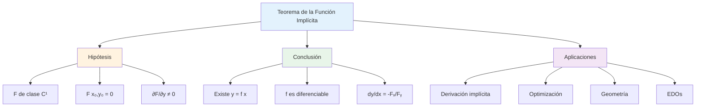

# 📐 Teorema de la Función Implícita

## 🎯 Introducción y Motivación

> [!info]- 💡 ¿Por qué necesitamos este teorema?
> En matemáticas frecuentemente encontramos relaciones entre variables que no están expresadas explícitamente como y = f(x), sino de forma implícita como F(x,y) = 0.
> 
> **Ejemplos cotidianos:**
> - **Círculo:** x² + y² = 25 (no está despejada y)
> - **Elipse:** x²/9 + y²/4 = 1
> - **Relación económica:** precio·demanda - costo = 0
> 
> **La pregunta fundamental:**
> ¿Cuándo podemos garantizar que una ecuación F(x,y) = 0 define implícitamente a y como función de x cerca de un punto?
> 
> **Importancia histórica:**
> - **Augustin-Louis Cauchy (1840s):** Primeras versiones del teorema
> - **Ulisse Dini (1878):** Formulación rigurosa moderna
> - **Fundamental en:** Cálculo multivariable, ecuaciones diferenciales, optimización

## 📚 Conceptos Preliminares

### 🔍 Función Implícita vs Explícita

> [!note]- 📊 Diferencias Fundamentales
> **Función Explícita:**
> - Forma: y = f(x)
> - y está despejada en términos de x
> - Ejemplo: y = √(25 - x²)
> 
> **Función Implícita:**
> - Forma: F(x,y) = 0
> - y NO está despejada
> - Ejemplo: x² + y² - 25 = 0
> 
> **Relación:**
> ```
> Función Implícita: F(x,y) = 0
>                      ↓ (bajo ciertas condiciones)
> Función Explícita: y = f(x)
> ```
> 
> **Ejemplo ilustrativo:**
> ```
> Implícita: x² + y² = 25
> 
> Podemos despejar:
> y² = 25 - x²
> y = ±√(25 - x²)
> 
> Dos funciones explícitas:
> y₁ = √(25 - x²)   (semicírculo superior)
> y₂ = -√(25 - x²)  (semicírculo inferior)
> ```

### 🧮 Derivadas Parciales

> [!warning]- ∂ Notación y Significado
> Para una función F(x,y):
> 
> **Derivada parcial respecto a x:**
> ```
> ∂F/∂x = Fₓ(x,y)
> ```
> Se deriva tratando y como constante
> 
> **Derivada parcial respecto a y:**
> ```
> ∂F/∂y = Fᵧ(x,y)
> ```
> Se deriva tratando x como constante
> 
> **Ejemplo:**
> ```
> F(x,y) = x² + y² - 25
> 
> ∂F/∂x = 2x
> ∂F/∂y = 2y
> ```
> 
> **Interpretación geométrica:**
> - Fₓ: tasa de cambio de F en dirección x
> - Fᵧ: tasa de cambio de F en dirección y

### 🎯 Condiciones de Regularidad

> [!success]- ✅ Requisitos para el Teorema
> Para aplicar el Teorema de la Función Implícita necesitamos:
> 
> **1. Continuidad:**
> - F debe ser continua en un entorno del punto
> 
> **2. Diferenciabilidad:**
> - F debe tener derivadas parciales continuas (clase C¹)
> 
> **3. Condición crucial:**
> - **∂F/∂y ≠ 0** en el punto considerado
> 
> **Por qué ∂F/∂y ≠ 0 es importante:**
> - Garantiza que podemos "despejar" y localmente
> - Si ∂F/∂y = 0, la relación podría no definir y como función de x
> 
> **Analogía:**
> Es como verificar que el denominador no sea cero antes de dividir

## 📘 Enunciado del Teorema

### 🔶 Versión Básica (Dos Variables)

> [!warning]- 🎓 Teorema de la Función Implícita (2D)
> **Sea F: ℝ² → ℝ una función de clase C¹ (derivadas parciales continuas).**
> 
> **Supongamos que:**
> 1. F(x₀, y₀) = 0 (el punto está en la curva de nivel)
> 2. ∂F/∂y (x₀, y₀) ≠ 0 (derivada parcial no nula)
> 
> **Entonces existe:**
> - Un entorno I de x₀
> - Un entorno J de y₀
> - Una única función continua y = f(x) definida en I
> 
> **Tal que:**
> 1. f(x₀) = y₀
> 2. F(x, f(x)) = 0 para todo x ∈ I
> 3. f es diferenciable y su derivada es:
> 
> ```
> dy/dx = f'(x) = -[∂F/∂x]/[∂F/∂y]
> ```
> 
> **En palabras simples:**
> Si la derivada parcial respecto a y no es cero en un punto de la curva F(x,y) = 0, entonces cerca de ese punto podemos expresar y como función diferenciable de x.

### 🔷 Interpretación Geométrica

> [!example]- 🎨 Visualización del Teorema
> **Situación geométrica:**
> 
> ```
> Curva F(x,y) = 0 en el plano
>        ↓
>    Localmente "parece" el gráfico de una función
>        ↓
>    Podemos escribir y = f(x) cerca del punto
> ```
> 
> **¿Cuándo falla?**
> 
> Si ∂F/∂y = 0 en (x₀, y₀):
> - La curva puede tener tangente vertical
> - O múltiples valores de y para un mismo x
> - No se puede expresar y = f(x) localmente
> 
> **Ejemplo: Círculo x² + y² = 25**
> 
> En el punto (3, 4):
> ```
> F(x,y) = x² + y² - 25
> ∂F/∂y = 2y = 2(4) = 8 ≠ 0 ✓
> 
> Podemos despejar y cerca de este punto:
> y = √(25 - x²) localmente
> ```
> 
> En el punto (5, 0):
> ```
> ∂F/∂y = 2y = 2(0) = 0 ✗
> 
> No podemos despejar y como función de x
> (tangente vertical en este punto)
> ```

## 🧮 Fórmula de la Derivada Implícita

### 📐 Derivación de la Fórmula

> [!tip]- 🔍 ¿De dónde sale dy/dx = -Fₓ/Fᵧ?
> **Método: Diferenciación implícita**
> 
> Si F(x, y(x)) = 0 para todo x, entonces derivando ambos lados:
> 
> ```
> d/dx[F(x, y(x))] = d/dx[0]
> ```
> 
> Aplicando la regla de la cadena:
> ```
> ∂F/∂x · dx/dx + ∂F/∂y · dy/dx = 0
> 
> ∂F/∂x · 1 + ∂F/∂y · dy/dx = 0
> 
> ∂F/∂y · dy/dx = -∂F/∂x
> 
> dy/dx = -∂F/∂x / ∂F/∂y
> ```
> 
> **Notación compacta:**
> ```
> dy/dx = -Fₓ/Fᵧ
> ```
> 
> **Condición necesaria:** Fᵧ ≠ 0

### 📊 Ejemplos Detallados

> [!example]- 🎯 Aplicaciones Paso a Paso
> **Ejemplo 1: Círculo**
> 
> Dada la ecuación: x² + y² = 25
> Encontrar dy/dx en el punto (3, 4)
> 
> **Solución:**
> ```
> Paso 1: Identificar F(x,y)
> F(x,y) = x² + y² - 25
> 
> Paso 2: Calcular derivadas parciales
> ∂F/∂x = 2x
> ∂F/∂y = 2y
> 
> Paso 3: Verificar condición del teorema
> En (3,4): ∂F/∂y = 2(4) = 8 ≠ 0 ✓
> 
> Paso 4: Aplicar fórmula
> dy/dx = -Fₓ/Fᵧ = -2x/2y = -x/y
> 
> Paso 5: Evaluar en el punto
> dy/dx|(3,4) = -3/4
> ```
> 
> **Interpretación:** La pendiente de la tangente al círculo en (3,4) es -3/4
> 
> ---
> 
> **Ejemplo 2: Elipse**
> 
> Dada: x²/9 + y²/4 = 1
> Encontrar dy/dx en cualquier punto (x,y)
> 
> **Solución:**
> ```
> F(x,y) = x²/9 + y²/4 - 1
> 
> ∂F/∂x = 2x/9
> ∂F/∂y = 2y/4 = y/2
> 
> dy/dx = -(2x/9)/(y/2) = -(2x/9)·(2/y) = -4x/9y
> ```
> 
> ---
> 
> **Ejemplo 3: Ecuación más compleja**
> 
> Dada: x³ + y³ = 6xy
> Encontrar dy/dx
> 
> **Solución:**
> ```
> F(x,y) = x³ + y³ - 6xy
> 
> ∂F/∂x = 3x² - 6y
> ∂F/∂y = 3y² - 6x
> 
> dy/dx = -(3x² - 6y)/(3y² - 6x)
>       = -(3(x² - 2y))/(3(y² - 2x))
>       = -(x² - 2y)/(y² - 2x)
> ```
> 
> **Condición:** y² - 2x ≠ 0

## 🔢 Derivadas de Orden Superior

### 📈 Segunda Derivada Implícita

> [!note]- 📊 Cálculo de d²y/dx²
> Para encontrar la segunda derivada cuando F(x,y) = 0:
> 
> **Método:**
> 1. Calcular dy/dx = -Fₓ/Fᵧ
> 2. Derivar esta expresión respecto a x
> 3. Recordar que y es función de x
> 
> **Fórmula general:**
> ```
> d²y/dx² = d/dx[-Fₓ/Fᵧ]
> ```
> 
> Aplicando regla del cociente:
> ```
> d²y/dx² = -[Fᵧ·(d/dx(Fₓ)) - Fₓ·(d/dx(Fᵧ))]/Fᵧ²
> ```
> 
> Donde:
> ```
> d/dx(Fₓ) = Fₓₓ + Fₓᵧ·(dy/dx)
> d/dx(Fᵧ) = Fᵧₓ + Fᵧᵧ·(dy/dx)
> ```

### 🎯 Ejemplo de Segunda Derivada

> [!example]- 🔍 Caso Práctico
> **Para el círculo x² + y² = 25**
> 
> Ya sabemos: dy/dx = -x/y
> 
> Calcular d²y/dx²:
> 
> **Solución:**
> ```
> Paso 1: Derivar dy/dx = -x/y
> 
> d²y/dx² = d/dx[-x/y]
> 
> Paso 2: Aplicar regla del cociente
> d²y/dx² = -[y·(1) - x·(dy/dx)]/y²
> 
> Paso 3: Sustituir dy/dx = -x/y
> d²y/dx² = -[y - x·(-x/y)]/y²
>         = -[y + x²/y]/y²
>         = -[y² + x²]/y³
> 
> Paso 4: Simplificar usando x² + y² = 25
> d²y/dx² = -25/y³
> ```
> 
> **En el punto (3,4):**
> ```
> d²y/dx²|(3,4) = -25/4³ = -25/64
> ```

## 🌟 Versión para Tres Variables

### 🔶 Teorema en ℝ³

> [!warning]- 🎓 Generalización a 3D
> **Sea F: ℝ³ → ℝ una función de clase C¹**
> 
> **Supongamos que:**
> 1. F(x₀, y₀, z₀) = 0
> 2. ∂F/∂z (x₀, y₀, z₀) ≠ 0
> 
> **Entonces existe una función z = f(x,y) tal que:**
> 1. f(x₀, y₀) = z₀
> 2. F(x, y, f(x,y)) = 0 localmente
> 3. Las derivadas parciales son:
> 
> ```
> ∂z/∂x = -[∂F/∂x]/[∂F/∂z]
> 
> ∂z/∂y = -[∂F/∂y]/[∂F/∂z]
> ```
> 
> **Interpretación:**
> Una superficie F(x,y,z) = 0 define localmente a z como función de x e y si ∂F/∂z ≠ 0

### 📊 Ejemplos en Tres Variables

> [!example]- 🎯 Aplicaciones 3D
> **Ejemplo 1: Esfera**
> 
> Dada: x² + y² + z² = 25
> Encontrar ∂z/∂x y ∂z/∂y
> 
> **Solución:**
> ```
> F(x,y,z) = x² + y² + z² - 25
> 
> ∂F/∂x = 2x
> ∂F/∂y = 2y
> ∂F/∂z = 2z
> 
> ∂z/∂x = -2x/2z = -x/z
> 
> ∂z/∂y = -2y/2z = -y/z
> ```
> 
> **Condición:** z ≠ 0 (no en el ecuador)
> 
> ---
> 
> **Ejemplo 2: Elipsoide**
> 
> Dada: x²/9 + y²/4 + z²/16 = 1
> 
> **Solución:**
> ```
> F(x,y,z) = x²/9 + y²/4 + z²/16 - 1
> 
> ∂F/∂x = 2x/9
> ∂F/∂y = 2y/4 = y/2
> ∂F/∂z = 2z/16 = z/8
> 
> ∂z/∂x = -(2x/9)/(z/8) = -16x/9z
> 
> ∂z/∂y = -(y/2)/(z/8) = -4y/z
> ```

## 🧩 Sistemas de Ecuaciones Implícitas

### 🔷 Teorema para Sistemas

> [!note]- 🔢 Múltiples Ecuaciones
> **Consideremos el sistema:**
> ```
> F(x, y, u, v) = 0
> G(x, y, u, v) = 0
> ```
> 
> **Queremos despejar u y v como funciones de x e y**
> 
> **Condición necesaria:**
> El **Jacobiano** debe ser no nulo:
> 
> ```
> J = |∂F/∂u  ∂F/∂v|
>     |∂G/∂u  ∂G/∂v| ≠ 0
> ```
> 
> **Si J ≠ 0, entonces existen funciones:**
> ```
> u = u(x,y)
> v = v(x,y)
> ```
> 
> **Y las derivadas se calculan mediante:**
> ```
> ∂u/∂x = -[∂(F,G)/∂(x,v)]/[∂(F,G)/∂(u,v)]
> ```
> 
> Usando determinantes de Jacobiano

### 🎯 Ejemplo de Sistema

> [!example]- 🔍 Caso Práctico
> **Sistema:**
> ```
> F: x² + u² + v² = 1
> G: y² + u² - v² = 0
> ```
> 
> Despejar u, v como funciones de x, y
> 
> **Solución:**
> ```
> Paso 1: Calcular derivadas parciales
> ∂F/∂u = 2u,  ∂F/∂v = 2v
> ∂G/∂u = 2u,  ∂G/∂v = -2v
> 
> Paso 2: Calcular Jacobiano
> J = |2u   2v |
>     |2u  -2v |
>   
>   = (2u)(-2v) - (2v)(2u)
>   = -4uv - 4uv
>   = -8uv
> 
> Paso 3: Condición
> J ≠ 0 si uv ≠ 0
> 
> Entonces el teorema aplica cuando u ≠ 0 y v ≠ 0
> ```

## 💡 Aplicaciones del Teorema

### 🔬 En Optimización

> [!success]- 📈 Optimización con Restricciones
> **Problema:** Optimizar f(x,y) sujeto a g(x,y) = 0
> 
> **Método de sustitución:**
> 1. Usar TFI para expresar y = h(x) de g(x,y) = 0
> 2. Sustituir en f: F(x) = f(x, h(x))
> 3. Optimizar F(x) normalmente
> 
> **Ejemplo:**
> Maximizar f(x,y) = xy sujeto a x² + y² = 1
> 
> ```
> De x² + y² = 1: y = √(1-x²) (hemisferio superior)
> 
> F(x) = x·√(1-x²)
> 
> F'(x) = √(1-x²) + x·(-x/√(1-x²))
>       = (1-x² - x²)/√(1-x²)
>       = (1-2x²)/√(1-x²)
> 
> F'(x) = 0 cuando 1-2x² = 0
> x = ±1/√2
> ```

### ⚙️ En Ecuaciones Diferenciales

> [!info]- 🔄 EDOs Implícitas
> Muchas EDOs se presentan implícitamente:
> ```
> F(x, y, y') = 0
> ```
> 
> El TFI garantiza cuándo podemos despejar y':
> ```
> y' = f(x, y)
> ```
> 
> **Ejemplo:**
> ```
> y'² + xy' - y = 0
> 
> F(x,y,p) = p² + xp - y  donde p = y'
> 
> ∂F/∂p = 2p + x
> 
> Si 2p + x ≠ 0, podemos despejar:
> p = y' = (-x ± √(x² + 4y))/2
> ```

### 🌐 En Geometría Diferencial

> [!tip]- 📐 Superficies y Curvas
> **Superficies de nivel:**
> F(x,y,z) = c define una superficie
> 
> **Vector normal:**
> El gradiente ∇F = (Fₓ, Fᵧ, Fᵧ) es perpendicular a la superficie
> 
> **Plano tangente en (x₀,y₀,z₀):**
> ```
> Fₓ(x₀,y₀,z₀)(x-x₀) + Fᵧ(x₀,y₀,z₀)(y-y₀) + Fᵧ(x₀,y₀,z₀)(z-z₀) = 0
> ```
> 
> El TFI garantiza cuándo la superficie define z = f(x,y) localmente

## ⚠️ Condiciones y Limitaciones

### 🚫 Cuándo NO aplica el teorema

> [!warning]- ❌ Casos de Falla
> **1. Derivada parcial nula:**
> 
> Si ∂F/∂y = 0 en el punto, el teorema no garantiza nada
> 
> **Ejemplo: x² + y² = 1 en (1,0)**
> ```
> ∂F/∂y = 2y = 0 en (1,0)
> 
> Tangente vertical: no podemos expresar y = f(x) localmente
> ```
> 
> **2. Punto singular:**
> 
> Donde múltiples ramas de la curva se cruzan
> 
> **Ejemplo: y² = x² en (0,0)**
> ```
> Dos rectas y = x y y = -x se cruzan
> No hay función única y = f(x) cerca del origen
> ```
> 
> **3. Falta de diferenciabilidad:**
> 
> Si F no es C¹, el teorema no aplica
> 
> **4. Solo validez local:**
> 
> El teorema garantiza existencia LOCAL, no global

### ✅ Verificación de Hipótesis

> [!tip]- 🔍 Lista de Verificación
> Antes de aplicar el TFI, verificar:
> 
> **□ 1. F es de clase C¹**
> - Derivadas parciales existen y son continuas
> 
> **□ 2. El punto está en la curva/superficie**
> - F(x₀, y₀) = 0 (o F(x₀, y₀, z₀) = 0)
> 
> **□ 3. Derivada parcial no nula**
> - ∂F/∂y (x₀, y₀) ≠ 0 (o ∂F/∂z (x₀, y₀, z₀) ≠ 0)
> 
> **□ 4. Entender la validez local**
> - Solo garantiza existencia en un entorno pequeño

## 🎨 Diagrama Conceptual



## 🧪 Ejercicios Resueltos

> [!example]- 💪 Práctica Completa
> **Nivel 1 - Básico:** 🟢
> 
> **Ejercicio 1:**
> Dada x² + y² = 16, encontrar dy/dx en (2√2, 2√2)
> 
> **Solución:**
> ```
> F(x,y) = x² + y² - 16
> 
> ∂F/∂x = 2x = 4√2 en el punto
> ∂F/∂y = 2y = 4√2 en el punto ≠ 0 ✓
> 
> dy/dx = -Fₓ/Fᵧ = -2x/2y = -x/y
> 
> dy/dx|(2√2,2√2) = -(2√2)/(2√2) = -1
> ```
> 
> ---
> 
> **Ejercicio 2:**
> Para xy = 1, encontrar dy/dx en (2, 1/2)
> 
> **Solución:**
> ```
> F(x,y) = xy - 1
> 
> ∂F/∂x = y
> ∂F/∂y = x = 2 ≠ 0 ✓
> 
> dy/dx = -y/x
> 
> dy/dx|(2,1/2) = -(1/2)/2 = -1/4
> ```
> 
> ---
> 
> **Nivel 2 - Intermedio:** 🟡
> 
> **Ejercicio 3:**
> Dada x³ + y³ = 6xy, encontrar dy/dx
> 
> **Solución:**
> ```
> F(x,y) = x³ + y³ - 6xy
> 
> ∂F/∂x = 3x² - 6y
> ∂F/∂y = 3y² - 6x
> 
> dy/dx = -(3x² - 6y)/(3y² - 6x)
>       = -(x² - 2y)/(y² - 2x)
> 
> Válido cuando y² ≠ 2x
> ```
> 
> ---
> 
> **Ejercicio 4:**
> Para x² + y² + z² = 25, encontrar ∂z/∂x y ∂z/∂y en (3,4,0)
> 
> **Solución:**
> ```
> F(x,y,z) = x² + y² + z² - 25
> 
> ∂F/∂x = 2x = 6
> ∂F/∂y = 2y = 8
> ∂F/∂z = 2z = 0 ✗
> 
> ¡El teorema NO aplica en (3,4,0)!
> z = 0 es punto crítico (ecuador de la esfera)
> ```
> 
> ---
> 
> **Nivel 3 - Avanzado:** 🔴
> 
> **Ejercicio 5:**
> Demostrar que si F(x,y) = 0 define y = f(x), entonces:
> ```
> d²y/dx² = -[Fₓₓ·Fᵧ² - 2Fₓᵧ·Fₓ·Fᵧ + Fᵧᵧ·Fₓ²]/Fᵧ³
> ```
> 
> **Solución:**
> ```
> Sabemos: dy/dx = -Fₓ/Fᵧ
> 
> Derivando:
> d²y/dx² = d/dx[-Fₓ/Fᵧ]
>         = -[Fᵧ·(dFₓ/dx) - Fₓ·(dFᵧ/dx)]/Fᵧ²
> 
> Ahora:
> dFₓ/dx = Fₓₓ + Fₓᵧ·(dy/dx)
> dFᵧ/dx = Fᵧₓ + Fᵧᵧ·(dy/dx)
> 
> Sustituyendo dy/dx = -Fₓ/Fᵧ:
> 
> dFₓ/dx = Fₓₓ - Fₓᵧ·Fₓ/Fᵧ
> dFᵧ/dx = Fᵧₓ - Fᵧᵧ·Fₓ/Fᵧ
> 
> [Continuando la sustitución y simplificación...]
> 
> d²y/dx² = -[Fₓₓ·Fᵧ² - 2Fₓᵧ·Fₓ·Fᵧ + Fᵧᵧ·Fₓ²]/Fᵧ³
> ```

## 📊 Tabla Resumen

> [!example]- 📋 Compendio del Teorema
> 
> |Aspecto|Descripción|Fórmula/Condición|
> |---|---|---|
> |**Hipótesis 1**|F de clase C¹|Derivadas continuas|
> |**Hipótesis 2**|Punto en curva|F(x₀,y₀) = 0|
> |**Hipótesis 3**|Derivada no nula|∂F/∂y (x₀,y₀) ≠ 0|
> |**Conclusión**|Existe función|y = f(x) localmente|
> |**Derivada 1ª**|dy/dx|-Fₓ/Fᵧ|
> |**Derivada 2ª**|d²y/dx²|-(Fₓₓ·Fᵧ² - 2Fₓᵧ·Fₓ·Fᵧ + Fᵧᵧ·Fₓ²)/Fᵧ³|
> |**3 Variables**|∂z/∂x|-Fₓ/Fᵧ|
> |**3 Variables**|∂z/∂y|-Fᵧ/Fᵧ|
> |**Sistema**|Condición|J = det(∂F/∂u) ≠ 0|
> |**Validez**|Local|En entorno del punto|

## 🔗 Conexiones Conceptuales

> [!quote]- 🌟 Enlaces con Otros Temas
> 
> **Prerequisites:**
> - [[Derivadas Parciales]] - Base del cálculo multivariable
> - [[Continuidad y Diferenciabilidad]] - Condiciones de regularidad
> - [[Funciones de Varias Variables]] - Dominio del teorema
> 
> **Temas relacionados:**
> - [[Regla de la Cadena Multivariable]] - Derivación de fórmulas
> - [[Jacobiano]] - Generalización a sistemas
> - [[Gradiente]] - Vector de derivadas parciales
> 
> **Aplicaciones:**
> - [[Multiplicadores de Lagrange]] - Optimización con restricciones
> - [[Ecuaciones Diferenciales Implícitas]] - Existencia de soluciones
> - [[Geometría Diferencial]] - Superficies y curvas de nivel
> - [[Análisis de Sensibilidad]] - Economía y optimización
> 
> **Generalizaciones:**
> - [[Teorema de la Función Inversa]] - Caso especial
> - [[Teorema del Rango]] - Álgebra lineal
> - [[Variedades Diferenciables]] - Geometría avanzada

## 💡 Errores Comunes y Consejos

> [!tip]- 🧠 Guía de Estudio
> **Errores frecuentes:**
> 
> ❌ **Error 1:** Olvidar verificar ∂F/∂y ≠ 0
> - Siempre verificar la condición crucial
> - Sin esto, el teorema no garantiza nada
> 
> ❌ **Error 2:** Confundir signo en dy/dx = -Fₓ/Fᵧ
> - Es MENOS Fₓ sobre Fᵧ
> - El signo negativo es fundamental
> 
> ❌ **Error 3:** Olvidar que y depende de x al derivar
> - En d²y/dx², aplicar regla de la cadena
> - y = y(x), no es constante
> 
> ❌ **Error 4:** Pensar que el teorema es global
> - Solo garantiza existencia LOCAL
> - En un entorno pequeño del punto
> 
> ❌ **Error 5:** No identificar correctamente F(x,y)
> - Debe ser F(x,y) = 0
> - Llevar todos los términos a un lado
> 
> **Consejos de estudio:**
> 
> ✅ **Visualizar geométricamente**
> - Dibujar la curva F(x,y) = 0
> - Identificar donde ∂F/∂y = 0 (tangentes verticales)
> 
> ✅ **Practicar la fórmula**
> - Calcular dy/dx en muchos ejemplos
> - Verificar con derivación implícita directa
> 
> ✅ **Entender las condiciones**
> - Cada hipótesis tiene un propósito
> - Comprender por qué son necesarias
> 
> ✅ **Generalizar a 3D**
> - Extender conceptos a funciones de tres variables
> - Practicar con superficies

---

**Tags:** #cálculo-multivariable #función-implícita #derivadas-parciales #teoremas-fundamentales #geometría-diferencial #optimización #análisis-matemático #university #matemáticas-avanzadas