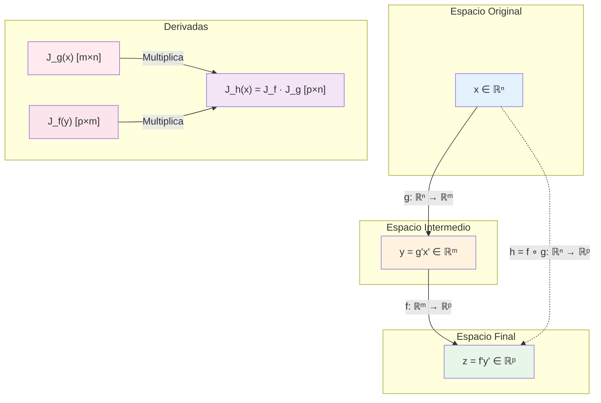

# 🔗 Derivadas de Funciones Compuestas en Notación Matricial

## 🎯 Fundamentos de la Composición y Diferenciación

> [!info]- 💡 Introducción a la Derivación de Funciones Compuestas Las **derivadas de funciones compuestas** en notación matricial extienden la regla de la cadena del cálculo univariado al contexto multivariable. Son fundamentales para entender cómo se propagan los cambios a través de transformaciones sucesivas.
> 
> **Analogías útiles:**
> 
> - **Cadena de producción:** Cambios en materia prima → cambios en producto intermedio → cambios en producto final
> - **Redes neuronales:** Propagación hacia adelante de información a través de capas
> - **Sistemas físicos:** Temperatura → presión → volumen (relaciones dependientes)
> 
> **Diferencia fundamental:**
> 
> - **Caso univariado:** Multiplicación simple de derivadas
> - **Caso multivariable:** Multiplicación de matrices jacobianas
> 
> **Importancia histórica:**
> 
> - **Leonhard Euler (1748):** Primeros trabajos en cálculo multivariable
> - **Carl Gustav Jacobi (1841):** Matriz jacobiana y determinantes
> - **Henri Cartan (1945):** Formalización moderna de la diferencial
> - **Vladimir Arnold (1960s):** Geometría de las transformaciones diferenciables

### 📐 Definición Formal de Composición

> [!note]- 🌟 Concepto Matemático de Composición de Funciones **Definición:**
> 
> Dadas dos funciones diferenciables:
> 
> - **g: ℝⁿ → ℝᵐ** con g(x) = (g₁(x), g₂(x), ..., gₘ(x))
> - **f: ℝᵐ → ℝᵖ** con f(y) = (f₁(y), f₂(y), ..., fₚ(y))
> 
> La **composición** f ∘ g (leído "f compuesto con g") es:
> 
> **(f ∘ g)(x) = f(g(x)): ℝⁿ → ℝᵖ**
> 
> **Diagrama de composición:**
> 
> ```
> x ∈ ℝⁿ  --(g)-->  y ∈ ℝᵐ  --(f)-->  z ∈ ℝᵖ
>        \                              /
>         \---------(f ∘ g)---------->/
> ```
> 
> **Notación alternativa:**
> 
> - h(x) = f(g(x)) donde h = f ∘ g
> - z = f(y) donde y = g(x)
> 
> **Orden de aplicación:** ⚠️ **IMPORTANTE:** Se aplica primero g, luego f (de derecha a izquierda)
> 
> **Ejemplo básico:**
> 
> ```
> g(x₁, x₂) = (x₁ + x₂, x₁x₂)         [ℝ² → ℝ²]
> f(y₁, y₂) = y₁² + y₂                [ℝ² → ℝ]
> 
> (f ∘ g)(x₁, x₂) = f(x₁ + x₂, x₁x₂)
>                  = (x₁ + x₂)² + x₁x₂
> ```

## 🔄 La Regla de la Cadena Multivariable

### 📊 Enunciado General

> [!warning]- 📢 Teorema Fundamental de la Composición **Teorema (Regla de la Cadena):**
> 
> Si g: ℝⁿ → ℝᵐ es diferenciable en **x₀** y f: ℝᵐ → ℝᵖ es diferenciable en **y₀ = g(x₀)**, entonces la composición h = f ∘ g es diferenciable en **x₀** y:
> 
> **Dh(x₀) = Df(y₀) · Dg(x₀)**
> 
> En notación matricial (matrices jacobianas):
> 
> **J_h(x₀) = J_f(y₀) · J_g(x₀)**
> 
> **Dimensiones de las matrices:**
> 
> ```
> J_h: [p × n] = J_f: [p × m] · J_g: [m × n]
> ```
> 
> **Interpretación geométrica:**
> 
> - La derivada de la composición es el producto de las derivadas individuales
> - Las matrices se multiplican en el mismo orden que las funciones se componen
> - Cada matriz jacobiana representa una transformación lineal local
> 
> **Condiciones necesarias:**
> 
> 1. g debe ser diferenciable en x₀
> 2. f debe ser diferenciable en g(x₀)
> 3. Las dimensiones deben ser compatibles (m aparece en ambas)

### 🧮 Forma Explícita con Componentes

> [!example]- 📝 Expresión Detallada de la Regla de la Cadena **Caso general:**
> 
> Sea h(x) = f(g(x)) donde:
> 
> - x = (x₁, x₂, ..., xₙ)
> - y = g(x) = (g₁(x), g₂(x), ..., gₘ(x))
> - z = f(y) = (f₁(y), f₂(y), ..., fₚ(y))
> 
> **La derivada de h_i respecto a x_j es:**
> 
> **∂h_i/∂x_j = Σ(k=1 hasta m) [∂f_i/∂y_k · ∂g_k/∂x_j]**
> 
> **En forma matricial:**
> 
> ```
> [∂h₁/∂x₁  ∂h₁/∂x₂  ...  ∂h₁/∂xₙ]     [∂f₁/∂y₁  ...  ∂f₁/∂yₘ]   [∂g₁/∂x₁  ...  ∂g₁/∂xₙ]
> [∂h₂/∂x₁  ∂h₂/∂x₂  ...  ∂h₂/∂xₙ]  =  [∂f₂/∂y₁  ...  ∂f₂/∂yₘ] · [∂g₂/∂x₁  ...  ∂g₂/∂xₙ]
> [   ⋮        ⋮      ⋱      ⋮   ]     [   ⋮      ⋱      ⋮   ]   [   ⋮      ⋱      ⋮   ]
> [∂hₚ/∂x₁  ∂hₚ/∂x₂  ...  ∂hₚ/∂xₙ]     [∂fₚ/∂y₁  ...  ∂fₚ/∂yₘ]   [∂gₘ/∂x₁  ...  ∂gₘ/∂xₙ]
> 
>         J_h(x) [p×n]          =           J_f(y) [p×m]       ·       J_g(x) [m×n]
> ```
> 
> **Mnemotecnia:**
> 
> - "La derivada de fuera por la derivada de dentro"
> - Multiplicación de matrices respeta el orden de composición

## 📚 Casos Especiales Importantes

### 🔵 Caso 1: Función Escalar de Función Vectorial (ℝⁿ → ℝ)

> [!success]- 🎯 Composición que Resulta en Escalar **Configuración:**
> 
> ```
> g: ℝⁿ → ℝᵐ    (función vectorial)
> f: ℝᵐ → ℝ     (función escalar)
> h = f ∘ g: ℝⁿ → ℝ
> ```
> 
> **Forma del gradiente:**
> 
> **∇h(x) = J_f(g(x)) · J_g(x)**
> 
> Donde:
> 
> - J_g(x) es matriz m × n (jacobiana de g)
> - J_f(y) es matriz 1 × m (gradiente transpuesto de f)
> - ∇h(x) es vector 1 × n (gradiente de h)
> 
> **En componentes:**
> 
> **∂h/∂x_j = Σ(k=1 hasta m) [∂f/∂y_k · ∂g_k/∂x_j]**
> 
> **Ejemplo concreto:**
> 
> ```
> g(x₁, x₂) = (x₁² + x₂, x₁x₂)        [ℝ² → ℝ²]
> f(y₁, y₂) = y₁² + 3y₂                [ℝ² → ℝ]
> h(x₁, x₂) = f(g(x₁, x₂))            [ℝ² → ℝ]
> 
> Paso 1: Calcular J_g(x)
> J_g = [2x₁   1 ]
>       [x₂    x₁]
> 
> Paso 2: Calcular ∇f(y)
> ∇f = [2y₁, 3]
> 
> Paso 3: Evaluar en y = g(x)
> y₁ = x₁² + x₂
> y₂ = x₁x₂
> ∇f(g(x)) = [2(x₁² + x₂), 3]
> 
> Paso 4: Multiplicar
> ∇h = [2(x₁² + x₂), 3] · [2x₁   1 ]
>                          [x₂    x₁]
> 
> ∇h = [2(x₁² + x₂)·2x₁ + 3x₂,  2(x₁² + x₂) + 3x₁]
>    = [4x₁³ + 4x₁x₂ + 3x₂,  2x₁² + 2x₂ + 3x₁]
> ```

### 🟢 Caso 2: Función Vectorial de Función Vectorial (ℝⁿ → ℝᵖ)

> [!tip]- 🔗 Composición General Vectorial **Configuración:**
> 
> ```
> g: ℝⁿ → ℝᵐ    (función vectorial)
> f: ℝᵐ → ℝᵖ    (función vectorial)
> h = f ∘ g: ℝⁿ → ℝᵖ
> ```
> 
> **Matriz jacobiana completa:**
> 
> **J_h(x) = J_f(g(x)) · J_g(x)**
> 
> Dimensiones: [p × n] = [p × m] · [m × n]
> 
> **Cada entrada:**
> 
> **[J_h]ᵢⱼ = ∂h_i/∂x_j = Σ(k=1 hasta m) [∂f_i/∂y_k · ∂g_k/∂x_j]**
> 
> **Ejemplo completo:**
> 
> ```
> g: ℝ² → ℝ²
> g(x₁, x₂) = (x₁ + x₂, x₁ - x₂)
> 
> f: ℝ² → ℝ³
> f(y₁, y₂) = (y₁², y₁y₂, y₂²)
> 
> h = f ∘ g: ℝ² → ℝ³
> 
> Solución:
> 
> J_g = [1   1]
>       [1  -1]
> 
> J_f = [2y₁   0  ]
>       [y₂    y₁ ]
>       [0     2y₂]
> 
> En y = g(x):
> y₁ = x₁ + x₂
> y₂ = x₁ - x₂
> 
> J_f(g(x)) = [2(x₁+x₂)        0        ]
>             [x₁-x₂      x₁+x₂        ]
>             [0          2(x₁-x₂)      ]
> 
> J_h = J_f · J_g = [2(x₁+x₂)        0        ] · [1   1]
>                   [x₁-x₂      x₁+x₂        ]   [1  -1]
>                   [0          2(x₁-x₂)      ]
> 
> J_h = [2(x₁+x₂)           2(x₁+x₂)        ]
>       [2x₁               -2x₂             ]
>       [2(x₁-x₂)          -2(x₁-x₂)        ]
> ```

### 🟡 Caso 3: Cadena de Tres o Más Funciones

> [!warning]- ⛓️ Composiciones Múltiples **Configuración:**
> 
> ```
> g: ℝⁿ → ℝᵐ
> f: ℝᵐ → ℝᵖ
> k: ℝᵖ → ℝᵍ
> 
> h = k ∘ f ∘ g: ℝⁿ → ℝᵍ
> ```
> 
> **Regla de la cadena extendida:**
> 
> **J_h(x) = J_k(f(g(x))) · J_f(g(x)) · J_g(x)**
> 
> Dimensiones: [q × n] = [q × p] · [p × m] · [m × n]
> 
> **Propiedad asociativa:**
> 
> - Puede calcularse de izquierda a derecha o derecha a izquierda
> - El resultado es el mismo
> 
> **Ejemplo con tres funciones:**
> 
> ```
> g(x) = x²              [ℝ → ℝ]
> f(y) = (y, y²)         [ℝ → ℝ²]
> k(z₁, z₂) = z₁ + z₂    [ℝ² → ℝ]
> 
> h(x) = (k ∘ f ∘ g)(x) = k(f(g(x)))
>      = k(f(x²))
>      = k(x², x⁴)
>      = x² + x⁴
> 
> Verificación por regla de la cadena:
> 
> g'(x) = 2x
> J_f(y) = [1  ]
>          [2y ]
> k'(z₁, z₂) = [1, 1]
> 
> h'(x) = k'(f(g(x))) · J_f(g(x)) · g'(x)
>       = [1, 1] · [1   ] · 2x
>                  [2x² ]
>       = [1, 1] · [2x  ]
>                  [4x³ ]
>       = 2x + 4x³  ✓
> ```

## 🎨 Representación Gráfica del Flujo de Derivadas



## 🔬 Derivadas Parciales en Composiciones

### 📐 Notación de Leibniz

> [!note]- ✍️ Forma Clásica de las Derivadas **Para h(x₁, ..., xₙ) = f(g₁(x), ..., gₘ(x)):**
> 
> **La derivada parcial de h respecto a x_j:**
> 
> **∂h/∂x_j = Σ(k=1 hasta m) [(∂f/∂y_k) · (∂y_k/∂x_j)]**
> 
> donde y_k = g_k(x₁, ..., xₙ)
> 
> **Notación alternativa:**
> 
> **∂h/∂x_j = Σ_k [(∂f/∂y_k)(y) · (∂g_k/∂x_j)(x)]**
> 
> **Interpretación:**
> 
> - Cada variable intermedia y_k contribuye al cambio de h
> - La contribución es: (sensibilidad de f a y_k) × (sensibilidad de y_k a x_j)
> - Se suman todas las "rutas" de x_j a h a través de las y_k
> 
> **Diagrama de dependencia:**
> 
> ```
>            ∂f/∂y₁        ∂f/∂y₂             ∂f/∂yₘ
>          ↗        ↖    ↗       ↖         ↗        ↖
>       y₁           y₂          ...             yₘ
>          ↖        ↗    ↖       ↗         ↖        ↗
>         ∂y₁/∂xⱼ      ∂y₂/∂xⱼ            ∂yₘ/∂xⱼ
>                         ↓
>                        xⱼ
> ```

### 🌲 Diagrama de Árbol de Dependencias

> [!example]- 🌳 Visualización de Variables Dependientes **Ejemplo: z = f(x, y) donde x = g(t), y = h(t)**
> 
> ```
>                     z
>                   /   \
>           ∂z/∂x /     \ ∂z/∂y
>                /       \
>               x         y
>                \       /
>         ∂x/∂t   \     / ∂y/∂t
>                  \   /
>                    t
> ```
> 
> **Regla de la cadena:**
> 
> **dz/dt = (∂z/∂x)(dx/dt) + (∂z/∂y)(dy/dt)**
> 
> **Ejemplo numérico:**
> 
> ```
> z = x² + xy + y²
> x = cos(t)
> y = sin(t)
> 
> Calcular dz/dt:
> 
> ∂z/∂x = 2x + y
> ∂z/∂y = x + 2y
> dx/dt = -sin(t)
> dy/dt = cos(t)
> 
> dz/dt = (2x + y)(-sin(t)) + (x + 2y)(cos(t))
>       = (2cos(t) + sin(t))(-sin(t)) + (cos(t) + 2sin(t))(cos(t))
>       = -2cos(t)sin(t) - sin²(t) + cos²(t) + 2sin(t)cos(t)
>       = cos²(t) - sin²(t)
>       = cos(2t)  ✓
> ```

### 🔀 Variables Independientes vs Dependientes

> [!warning]- ⚠️ Cuidado con la Notación Ambigua **Problema común:**
> 
> La notación ∂f/∂x puede significar cosas diferentes según el contexto.
> 
> **Caso 1: Variables explícitas**
> 
> ```
> f(x, y, z) definida explícitamente
> ∂f/∂x significa derivar respecto a x, tratando y, z como constantes
> ```
> 
> **Caso 2: Variables dependientes**
> 
> ```
> Si f = f(x, y) pero y = y(x), entonces:
> - ∂f/∂x: derivada parcial (y constante)
> - df/dx: derivada total (y varía con x)
> 
> df/dx = ∂f/∂x + (∂f/∂y)(dy/dx)
> ```
> 
> **Ejemplo ilustrativo:**
> 
> ```
> f(x, y) = x² + y²
> y = 2x
> 
> Derivada parcial:
> ∂f/∂x = 2x    (y constante)
> 
> Derivada total:
> df/dx = ∂f/∂x + (∂f/∂y)(dy/dx)
>       = 2x + (2y)(2)
>       = 2x + 4y
>       = 2x + 4(2x)
>       = 10x     (considerando y = 2x)
> ```
> 
> **Regla práctica:**
> 
> - ∂ (parcial): congela otras variables
> - d (total): permite que todas varíen según sus dependencias

## 🧮 Ejemplos Detallados Paso a Paso

> [!example]- 📖 Ejercicios Completamente Resueltos
> 
> ### **Ejemplo 1: Composición ℝ² → ℝ² → ℝ**
> 
> ```
> Dadas:
> g(x₁, x₂) = (x₁², x₁ + x₂)                    [ℝ² → ℝ²]
> f(y₁, y₂) = y₁y₂                               [ℝ² → ℝ]
> 
> Calcular ∇h donde h = f ∘ g
> 
> Solución:
> 
> Paso 1: Identificar la composición
> h(x₁, x₂) = f(g(x₁, x₂))
>           = f(x₁², x₁ + x₂)
>           = x₁²(x₁ + x₂)
>           = x₁³ + x₁²x₂
> 
> Paso 2: Calcular J_g(x)
> g₁(x₁, x₂) = x₁²
> g₂(x₁, x₂) = x₁ + x₂
> 
> J_g = [∂g₁/∂x₁  ∂g₁/∂x₂]   [2x₁  0]
>       [∂g₂/∂x₁  ∂g₂/∂x₂] = [1    1]
> 
> Paso 3: Calcular ∇f(y)
> f(y₁, y₂) = y₁y₂
> 
> ∇f = [∂f/∂y₁, ∂f/∂y₂] = [y₂, y₁]
> 
> Paso 4: Evaluar ∇f en y = g(x)
> y₁ = x₁²
> y₂ = x₁ + x₂
> 
> ∇f(g(x)) = [x₁ + x₂, x₁²]
> 
> Paso 5: Aplicar regla de la cadena
> ∇h = ∇f(g(x)) · J_g(x)
>    = [x₁ + x₂, x₁²] · [2x₁  0]
>                        [1    1]
> 
> ∇h = [(x₁+x₂)(2x₁) + x₁²(1), (x₁+x₂)(0) + x₁²(1)]
>    = [2x₁² + 2x₁x₂ + x₁², x₁²]
>    = [3x₁² + 2x₁x₂, x₁²]
> 
> Verificación directa:
> h(x₁, x₂) = x₁³ + x₁²x₂
> ∂h/∂x₁ = 3x₁² + 2x₁x₂  ✓
> ∂h/∂x₂ = x₁²           ✓
> ```
> 
> ---
> 
> ### **Ejemplo 2: Composición ℝ³ → ℝ² → ℝ²**
> 
> ```
> Dadas:
> g(x₁, x₂, x₃) = (x₁x₂, x₂ + x₃)               [ℝ³ → ℝ²]
> f(y₁, y₂) = (y₁ + y₂, y₁²)                    [ℝ² → ℝ²]
> 
> Calcular J_h donde h = f ∘ g
> 
> Solución:
> 
> Paso 1: Dimensiones
> J_h: [2 × 3] = J_f: [2 × 2] · J_g: [2 × 3]
> 
> Paso 2: Calcular J_g(x)
> J_g = [∂g₁/∂x₁  ∂g₁/∂x₂  ∂g₁/∂x₃]   [x₂  x₁  0]
>       [∂g₂/∂x₁  ∂g₂/∂x₂  ∂g₂/∂x₃] = [0   1   1]
> 
> Paso 3: Calcular J_f(y)
> f₁(y₁, y₂) = y₁ + y₂
> f₂(y₁, y₂) = y₁²
> 
> J_f = [∂f₁/∂y₁  ∂f₁/∂y₂]   [1    1 ]
>       [∂f₂/∂y₁  ∂f₂/∂y₂] = [2y₁  0 ]
> 
> Paso 4: Evaluar J_f en y = g(x)
> y₁ = x₁x₂
> y₂ = x₂ + x₃
> 
> J_f(g(x)) = [1       1   ]
>             [2x₁x₂   0   ]
> 
> Paso 5: Multiplicar matrices
> J_h = J_f · J_g
> 
> J_h = [1       1   ] · [x₂  x₁  0]
>       [2x₁x₂   0   ]   [0   1   1]
> 
> Fila 1 de J_h:
> [1·x₂ + 1·0,  1·x₁ + 1·1,  1·0 + 1·1] = [x₂, x₁+1, 1]
> 
> Fila 2 de J_h:
> [2x₁x₂·x₂ + 0·0,  2x₁x₂·x₁ + 0·1,  2x₁x₂·0 + 0·1] = [2x₁x₂², 2x₁²x₂, 0]
> 
> J_h = [x₂      x₁+1    1    ]
>       [2x₁x₂²  2x₁²x₂  0    ]
> 
> Verificación (componente h₁):
> h₁(x₁,x₂,x₃) = f₁(g(x))
>              = (x₁x₂) + (x₂+x₃)
>              = x₁x₂ + x₂ + x₃
> 
> ∂h₁/∂x₁ = x₂       ✓
> ∂h₁/∂x₂ = x₁ + 1   ✓
> ∂h₁/∂x₃ = 1        ✓
> ```
> 
> ---
> 
> ### **Ejemplo 3: Cadena de tres funciones**
>
>
>🔗 **Composición Triple: ℝ → ℝ → ℝ² → ℝ**
> 
> **Dadas:**
> 
> ```
> g(t) = t²                                      [ℝ → ℝ]
> f(x) = (x, x³)                                 [ℝ → ℝ²]
> k(y₁, y₂) = y₁² + y₂                           [ℝ² → ℝ]
> ```
> 
> **Calcular (k ∘ f ∘ g)'(t)**
> 
> ---
> 
> **📋 Solución Método 1: Composición directa**
> 
> **Paso 1:** Sustituir paso a paso
> 
> ```
> (k ∘ f ∘ g)(t) = k(f(g(t)))
>                 = k(f(t²))
>                 = k(t², (t²)³)
>                 = k(t², t⁶)
>                 = (t²)² + t⁶
>                 = t⁴ + t⁶
> ```
> 
> **Paso 2:** Derivar directamente
> 
> ```
> d/dt[t⁴ + t⁶] = 4t³ + 6t⁵
> ```
> 
> ---
> 
> **📊 Solución Método 2: Regla de la cadena matricial**
> 
> **Paso 1:** Calcular g'(t)
> 
> ```
> g(t) = t²
> g'(t) = 2t                           [1×1]
> ```
> 
> **Paso 2:** Calcular J_f(x)
> 
> ```
> f(x) = (x, x³)
> 
> J_f(x) = [∂f₁/∂x]   [1  ]           [2×1]
>          [∂f₂/∂x] = [3x²]
> ```
> 
> **Paso 3:** Calcular ∇k(y₁, y₂)
> 
> ```
> k(y₁, y₂) = y₁² + y₂
> 
> ∇k = [∂k/∂y₁, ∂k/∂y₂] = [2y₁, 1]   [1×2]
> ```
> 
> **Paso 4:** Evaluar en las composiciones intermedias
> 
> ```
> x = g(t) = t²
> 
> J_f(g(t)) = [1   ]
>             [3t⁴ ]
> 
> (y₁, y₂) = f(g(t)) = (t², t⁶)
> 
> ∇k(f(g(t))) = [2t², 1]
> ```
> 
> **Paso 5:** Aplicar regla de la cadena: multiplicar de izquierda a derecha
> 
> ```
> (k ∘ f ∘ g)'(t) = ∇k · J_f · g'
>                 = [2t², 1] · [1   ] · 2t
>                              [3t⁴ ]
> ```
> 
> **Paso 6:** Primer producto: ∇k · J_f
> 
> ```
> [2t², 1] · [1   ] = [2t²·1 + 1·3t⁴]
>            [3t⁴ ]   = [2t² + 3t⁴]    [1×1]
> ```
> 
> **Paso 7:** Segundo producto: resultado · g'
> 
> ```
> [2t² + 3t⁴] · 2t = (2t² + 3t⁴)(2t)
>                   = 4t³ + 6t⁵  ✓
> ```
> 
> **✅ Verificación:** Ambos métodos dan el mismo resultado
>
>### **Ejemplo 4: Composición con coordenadas polares**
>
> 🔄 **Cambio de Coordenadas: Cartesianas → Polares**
> 
> **Problema:**
> 
> Dada f(x, y) = x² + 3xy donde:
> 
> ```
> x = r cos(θ)
> y = r sin(θ)
> ```
> 
> Calcular ∂f/∂r y ∂f/∂θ usando la regla de la cadena.
> 
> ---
> 
> **📐 Solución:**
> 
> **Paso 1:** Identificar la composición
> 
> ```
> g: ℝ² → ℝ²         (cambio de coordenadas)
> g(r, θ) = (r cos(θ), r sin(θ))
> 
> f: ℝ² → ℝ          (función original)
> f(x, y) = x² + 3xy
> 
> h = f ∘ g: ℝ² → ℝ
> h(r, θ) = f(g(r, θ))
> ```
> 
> **Paso 2:** Calcular la jacobiana de g
> 
> ```
> g₁(r, θ) = r cos(θ)
> g₂(r, θ) = r sin(θ)
> 
> J_g = [∂g₁/∂r   ∂g₁/∂θ  ]   [cos(θ)   -r sin(θ)]
>       [∂g₂/∂r   ∂g₂/∂θ  ] = [sin(θ)    r cos(θ)]
> ```
> 
> **Paso 3:** Calcular el gradiente de f
> 
> ```
> f(x, y) = x² + 3xy
> 
> ∂f/∂x = 2x + 3y
> ∂f/∂y = 3x
> 
> ∇f = [2x + 3y, 3x]                    [1×2]
> ```
> 
> **Paso 4:** Evaluar ∇f en (x, y) = g(r, θ)
> 
> ```
> x = r cos(θ)
> y = r sin(θ)
> 
> ∇f(g(r,θ)) = [2r cos(θ) + 3r sin(θ), 3r cos(θ)]
>            = [r(2cos(θ) + 3sin(θ)), 3r cos(θ)]
> ```
> 
> **Paso 5:** Aplicar regla de la cadena: ∇h = ∇f · J_g
> 
> ```
> ∇h = [r(2cos(θ) + 3sin(θ)), 3r cos(θ)] · [cos(θ)   -r sin(θ)]
>                                            [sin(θ)    r cos(θ)]
> ```
> 
> **Paso 6:** Calcular ∂h/∂r (primera componente)
> 
> ```
> ∂h/∂r = r(2cos(θ) + 3sin(θ))·cos(θ) + 3r cos(θ)·sin(θ)
>       = r(2cos²(θ) + 3sin(θ)cos(θ)) + 3r sin(θ)cos(θ)
>       = r(2cos²(θ) + 6sin(θ)cos(θ))
>       = 2r cos²(θ) + 6r sin(θ)cos(θ)
> ```
> 
> **Paso 7:** Calcular ∂h/∂θ (segunda componente)
> 
> ```
> ∂h/∂θ = r(2cos(θ) + 3sin(θ))·(-r sin(θ)) + 3r cos(θ)·r cos(θ)
>       = -r²(2cos(θ)sin(θ) + 3sin²(θ)) + 3r²cos²(θ)
>       = -2r²cos(θ)sin(θ) - 3r²sin²(θ) + 3r²cos²(θ)
>       = -2r²cos(θ)sin(θ) + 3r²(cos²(θ) - sin²(θ))
>       = -2r²cos(θ)sin(θ) + 3r²cos(2θ)
> ```
> 
> **✅ Verificación directa:**
> 
> Sustituir x = r cos(θ), y = r sin(θ) en f:
>  
>  ```
>  h(r, θ) = (r cos(θ))² + 3(r cos(θ))(r sin(θ))
>         = r²cos²(θ) + 3r²cos(θ)sin(θ)
> 
> ∂h/∂r = 2r cos²(θ) + 6r cos(θ)sin(θ)  ✓
> 
> ∂h/∂θ = -2r²cos(θ)sin(θ) + 3r²(cos²(θ) - sin²(θ))
>       = -2r²cos(θ)sin(θ) + 3r²cos(2θ)  ✓
> ```
>
>### **Ejemplo 5: Composición vectorial completa**
>
> **Caso General: ℝ³ → ℝ² → ℝ²**
> 
> **Dadas:**
> 
> ```
> g(x₁, x₂, x₃) = (x₁x₂, x₂ + x₃)               [ℝ³ → ℝ²]
> f(y₁, y₂) = (y₁ + y₂, y₁²)                    [ℝ² → ℝ²]
> ```
> 
> **Calcular J_h donde h = f ∘ g**
> 
> ---
> 
> **📊 Solución:**
> 
> **Paso 1:** Identificar dimensiones
> 
> ```
> J_h: [2 × 3] = J_f: [2 × 2] · J_g: [2 × 3]
> 
> Verificación: [2×2] · [2×3] = [2×3] ✓
> ```
> 
> **Paso 2:** Calcular J_g(x)
> 
> ```
> g₁(x₁, x₂, x₃) = x₁x₂
> g₂(x₁, x₂, x₃) = x₂ + x₃
> 
> J_g = [∂g₁/∂x₁  ∂g₁/∂x₂  ∂g₁/∂x₃]   [x₂  x₁  0]
>       [∂g₂/∂x₁  ∂g₂/∂x₂  ∂g₂/∂x₃] = [0   1   1]
> ```
> 
> **Paso 3:** Calcular J_f(y)
> 
> ```
> f₁(y₁, y₂) = y₁ + y₂
> f₂(y₁, y₂) = y₁²
> 
> J_f = [∂f₁/∂y₁  ∂f₁/∂y₂]   [1    1 ]
>       [∂f₂/∂y₁  ∂f₂/∂y₂] = [2y₁  0 ]
> ```
> 
> **Paso 4:** Evaluar J_f en y = g(x)
> 
> ```
> y₁ = g₁(x) = x₁x₂
> y₂ = g₂(x) = x₂ + x₃
> 
> J_f(g(x)) = [1       1   ]
>             [2x₁x₂   0   ]
> ```
> 
> **Paso 5:** Multiplicar J_f(g(x)) · J_g(x)
> 
> ```
> J_h = [1       1   ] · [x₂  x₁  0]
>       [2x₁x₂   0   ]   [0   1   1]
> ```
> 
> **Paso 6:** Calcular fila 1 de J_h
> 
> **Entrada [1,1]:** ∂h₁/∂x₁
> 
> ```
> 1·x₂ + 1·0 = x₂
> ```
> 
> **Entrada [1,2]:** ∂h₁/∂x₂
> 
> ```
> 1·x₁ + 1·1 = x₁ + 1
> ```
> 
> **Entrada [1,3]:** ∂h₁/∂x₃
> 
> ```
> 1·0 + 1·1 = 1
> ```
> 
> **Paso 7:** Calcular fila 2 de J_h
> 
> **Entrada [2,1]:** ∂h₂/∂x₁
> 
> ```
> 2x₁x₂·x₂ + 0·0 = 2x₁x₂²
> ```
> 
> **Entrada [2,2]:** ∂h₂/∂x₂
> 
> ```
> 2x₁x₂·x₁ + 0·1 = 2x₁²x₂
> ```
> 
> **Entrada [2,3]:** ∂h₂/∂x₃
> 
> ```
> 2x₁x₂·0 + 0·1 = 0
> ```
> 
> **Paso 8:** Matriz jacobiana final
> 
> ```
> J_h = [x₂      x₁+1    1    ]
>       [2x₁x₂²  2x₁²x₂  0    ]
> ```
> 
> ---
> 
> **✅ Verificación (componente h₁):**
> 
> Calcular h₁ explícitamente:
> 
> ```
> h₁(x₁,x₂,x₃) = f₁(g(x))
>              = f₁(x₁x₂, x₂+x₃)
>              = (x₁x₂) + (x₂+x₃)
>              = x₁x₂ + x₂ + x₃
> 
> ∂h₁/∂x₁ = x₂       ✓
> ∂h₁/∂x₂ = x₁ + 1   ✓
> ∂h₁/∂x₃ = 1        ✓
> ```
> 
> **✅ Verificación (componente h₂):**
> 
> ```
> h₂(x₁,x₂,x₃) = f₂(g(x))
>              = f₂(x₁x₂, x₂+x₃)
>              = (x₁x₂)²
>              = x₁²x₂²
> 
> ∂h₂/∂x₁ = 2x₁x₂²   ✓
> ∂h₂/∂x₂ = 2x₁²x₂   ✓
> ∂h₂/∂x₃ = 0        ✓
> ```

---

### 📐 Cambio de Coordenadas

> [!note]- 🔄 Transformaciones entre Sistemas de Coordenadas **Aplicación fundamental:** Expresar funciones y derivadas en diferentes sistemas coordenados.
> 
> ---
> 
> **🔵 Coordenadas Polares → Cartesianas**
> 
> **Transformación:**
> 
> ```
> x = r cos(θ)
> y = r sin(θ)
> ```
> 
> **Si f = f(x, y), queremos ∂f/∂r y ∂f/∂θ**
> 
> **Jacobiana:**
> 
> ```
> J = [∂x/∂r   ∂x/∂θ ]   [cos(θ)   -r sin(θ)]
>     [∂y/∂r   ∂y/∂θ ] = [sin(θ)    r cos(θ)]
> ```
> 
> **Regla de la cadena:**
> 
> ```
> [∂f/∂r ]   [cos(θ)    sin(θ)   ] [∂f/∂x]
> [∂f/∂θ] = [-r sin(θ)  r cos(θ)] [∂f/∂y]
> ```
> 
> **Explícitamente:**
> 
> ```
> ∂f/∂r = (∂f/∂x)cos(θ) + (∂f/∂y)sin(θ)
> ∂f/∂θ = -(∂f/∂x)r sin(θ) + (∂f/∂y)r cos(θ)
> ```
> 
> **Ejemplo:** f(x, y) = x² + y²
> 
> **Método directo:**
> 
> ```
> f = r²cos²(θ) + r²sin²(θ) = r²
> 
> ∂f/∂r = 2r
> ∂f/∂θ = 0
> ```
> 
> **Método con regla de la cadena:**
> 
> ```
> ∂f/∂x = 2x = 2r cos(θ)
> ∂f/∂y = 2y = 2r sin(θ)
> 
> ∂f/∂r = 2r cos(θ)·cos(θ) + 2r sin(θ)·sin(θ)
>       = 2r(cos²(θ) + sin²(θ))
>       = 2r  ✓
> 
> ∂f/∂θ = -2r cos(θ)·r sin(θ) + 2r sin(θ)·r cos(θ)
>       = -2r²cos(θ)sin(θ) + 2r²sin(θ)cos(θ)
>       = 0  ✓
> ```
> 
> ---
> 
> **🟢 Coordenadas Cilíndricas → Cartesianas**
> 
> **Transformación:**
> 
> ```
> x = r cos(θ)
> y = r sin(θ)
> z = z
> ```
> 
> **Jacobiana:**
> 
> ```
> J = [cos(θ)   -r sin(θ)   0]
>     [sin(θ)    r cos(θ)   0]
>     [0         0          1]
> ```
> 
> **Determinante (para integrales):**
> 
> ```
> det(J) = r
> 
> dx dy dz = r dr dθ dz
> ```
> 
> ---
> 
> **🔴 Coordenadas Esféricas → Cartesianas**
> 
> **Transformación:**
> 
> ```
> x = ρ sin(φ) cos(θ)
> y = ρ sin(φ) sin(θ)
> z = ρ cos(φ)
> ```
> 
> donde:
> 
> - ρ: distancia al origen
> - φ: ángulo con eje z (0 ≤ φ ≤ π)
> - θ: ángulo azimutal (0 ≤ θ ≤ 2π)
> 
> **Jacobiana:**
> 
> ```
> J = [∂x/∂ρ  ∂x/∂φ        ∂x/∂θ      ]
>     [∂y/∂ρ  ∂y/∂φ        ∂y/∂θ      ]
>     [∂z/∂ρ  ∂z/∂φ        ∂z/∂θ      ]
> 
>   = [sin(φ)cos(θ)  ρcos(φ)cos(θ)  -ρsin(φ)sin(θ)]
>     [sin(φ)sin(θ)  ρcos(φ)sin(θ)   ρsin(φ)cos(θ)]
>     [cos(φ)       -ρsin(φ)         0             ]
> ```
> 
> **Determinante:**
> 
> ```
> det(J) = ρ²sin(φ)
> 
> dx dy dz = ρ²sin(φ) dρ dφ dθ
> ```
> 
> **Ejemplo:** f(x, y, z) = x² + y² + z²
> 
> En esféricas:
> 
> ```
> f = ρ²sin²(φ)cos²(θ) + ρ²sin²(φ)sin²(θ) + ρ²cos²(φ)
>   = ρ²sin²(φ)[cos²(θ) + sin²(θ)] + ρ²cos²(φ)
>   = ρ²sin²(φ) + ρ²cos²(φ)
>   = ρ²[sin²(φ) + cos²(φ)]
>   = ρ²
> 
> ∂f/∂ρ = 2ρ
> ∂f/∂φ = 0
> ∂f/∂θ = 0
> ```
> 
> **Significado:** La distancia al origen no depende de los ángulos ✓

## 🔍 Propiedades Avanzadas

### 📊 Linealidad de la Derivada de Composición

> [!success]- ➕ Propiedades Algebraicas de la Regla de la Cadena
> 
> **🔵 Propiedad 1: Aditividad**
> 
> Si h₁ = f ∘ g₁ y h₂ = f ∘ g₂, entonces:
> 
> **D(f ∘ (g₁ + g₂)) = Df(g₁ + g₂) · D(g₁ + g₂)** **= Df(g₁ + g₂) · (Dg₁ + Dg₂)**
> 
> **Interpretación:**
> 
> La derivada de la composición con una suma es la derivada de f evaluada en la suma, multiplicada por la suma de las derivadas.
> 
> **Ejemplo:**
> 
> ```
> g₁(x) = x²
> g₂(x) = x³
> f(y) = sin(y)
> 
> h(x) = f(g₁(x) + g₂(x)) = sin(x² + x³)
> 
> Método directo:
> h'(x) = cos(x² + x³)·(2x + 3x²)
> 
> Método por propiedad:
> g₁'(x) = 2x
> g₂'(x) = 3x²
> f'(y) = cos(y)
> 
> h'(x) = f'(g₁ + g₂)·(g₁' + g₂')
>       = cos(x² + x³)·(2x + 3x²)  ✓
> ```
> 
> ---
> 
> **🟢 Propiedad 2: Homogeneidad**
> 
> Para k constante:
> 
> **D(f ∘ (kg)) = Df(kg) · D(kg)** **= Df(kg) · k · Dg**
> 
> **Interpretación:**
> 
> Escalar la función intermedia escala el resultado final por el mismo factor (aplicado apropiadamente).
> 
> **Ejemplo:**
> 
> ```
> g(x) = x²
> f(y) = e^y
> k = 3
> 
> h(x) = f(3g(x)) = e^(3x²)
> 
> h'(x) = e^(3x²) · 3 · 2x = 6x e^(3x²)
> 
> Verificación:
> g'(x) = 2x
> f'(y) = e^y
> h'(x) = f'(3x²) · 3 · g'(x)
>       = e^(3x²) · 3 · 2x
>       = 6x e^(3x²)  ✓
> ```
> 
> ---
> 
> **🟡 Propiedad 3: Linealidad completa**
> 
> Para constantes α, β:
> 
> **D(f ∘ (αg₁ + βg₂)) = Df(αg₁ + βg₂) · (αDg₁ + βDg₂)**
> 
> **Ejemplo combinado:**
> 
> ```
> g₁(x) = x²
> g₂(x) = x
> f(y) = y³
> 
> h(x) = f(2x² + 3x) = (2x² + 3x)³
> 
> h'(x) = 3(2x² + 3x)² · (4x + 3)
> 
> Usando la propiedad:
> h'(x) = f'(2g₁ + 3g₂) · (2g₁' + 3g₂')
>       = 3(2x² + 3x)² · (2·2x + 3·1)
>       = 3(2x² + 3x)² · (4x + 3)  ✓
> ```

### 🔄 Composición Asociativa

> [!warning]- 📐 Orden de Composición y Multiplicación de Jacobianas
> 
> **🎯 Propiedad fundamental:**
> 
> La composición de funciones es **asociativa**:
> 
> **(k ∘ f) ∘ g = k ∘ (f ∘ g)**
> 
> **Consecuencia para derivadas:**
> 
> **J_(k∘f∘g) = J_k · J_f · J_g**
> 
> Puede calcularse como:
> 
> - **(J_k · J_f) · J_g** ← evaluar primero k ∘ f
> - **J_k · (J_f · J_g)** ← evaluar primero f ∘ g
> 
> Ambos dan el mismo resultado porque el producto de matrices es asociativo.
> 
> ---
> 
> **💡 Ventaja computacional:**
> 
> Podemos elegir el orden que minimiza el número de operaciones.
> 
> **Ejemplo de dimensiones:**
> 
> ```
> J_k: [2 × 100]
> J_f: [100 × 50]
> J_g: [50 × 3]
> ```
> 
> **Opción 1:** (J_k · J_f) · J_g
> 
> ```
> Paso 1: J_k · J_f
>   [2×100] · [100×50] = [2×50]
>   Operaciones: 2 × 100 × 50 = 10,000
> 
> Paso 2: [2×50] · [50×3]
>   Operaciones: 2 × 50 × 3 = 300
> 
> Total: 10,300 operaciones
> ```
> 
> **Opción 2:** J_k · (J_f · J_g)
> 
> ```
> Paso 1: J_f · J_g
>   [100×50] · [50×3] = [100×3]
>   Operaciones: 100 × 50 × 3 = 15,000
> 
> Paso 2: [2×100] · [100×3]
>   Operaciones: 2 × 100 × 3 = 600
> 
> Total: 15,600 operaciones
> ```
> 
> **Conclusión:** La Opción 1 es ~50% más eficiente
> 
> ---
> 
> **📝 Ejemplo práctico:**
> 
> ```
> g(x) = x²              [ℝ → ℝ]
> f(y) = (y, 2y, 3y)     [ℝ → ℝ³]
> k(z₁, z₂, z₃) = z₁ + z₂ + z₃  [ℝ³ → ℝ]
> 
> Calcular (k ∘ f ∘ g)'(x)
> ```
> 
> **Método 1:** Primero k ∘ f
> 
> ```
> (k ∘ f)(y) = y + 2y + 3y = 6y
> ((k ∘ f) ∘ g)(x) = 6x²
> 
> Derivada: 12x
> ```
> 
> **Método 2:** Primero f ∘ g
> 
> ```
> (f ∘ g)(x) = (x², 2x², 3x²)
> (k ∘ (f ∘ g))(x) = x² + 2x² + 3x² = 6x²
> 
> Derivada: 12x
> ```
> 
> **Método 3:** Regla de la cadena completa
> 
> ```
> g'(x) = 2x
> J_f(y) = [1]  (matriz 3×1)
>          [2]
>          [3]
> ∇k = [1, 1, 1]  (matriz 1×3)
> 
> (k ∘ f ∘ g)'(x) = ∇k · J_f · g'
>                 = [1,1,1] · [1] · 2x
>                              [2]
>                              [3]
>                 = 6 · 2x = 12x  ✓
> ```

### 🎯 Teorema de la Función Inversa

> [!tip]- 🔃 Derivada de la Función Inversa mediante Regla de la Cadena
> 
> **📜 Teorema:**
> 
> Si g: ℝⁿ → ℝⁿ es diferenciable en **x₀** y su jacobiana J_g(x₀) es **invertible** (det(J_g(x₀)) ≠ 0), entonces:
> 
> **J_(g⁻¹)(y₀) = [J_g(x₀)]⁻¹**
> 
> donde y₀ = g(x₀)
> 
> ---
> 
> **🔍 Demostración usando regla de la cadena:**
> 
> Si x = g⁻¹(y), entonces y = g(x), por lo que:
> 
> ```
> g(g⁻¹(y)) = y    (identidad)
> ```
> 
> Derivando ambos lados respecto a y:
> 
> ```
> J_g(g⁻¹(y)) · J_(g⁻¹)(y) = I    (matriz identidad)
> ```
> 
> Por lo tanto:
> 
> ```
> J_(g⁻¹)(y) = [J_g(g⁻¹(y))]⁻¹
> ```
> 
> En el punto y₀ = g(x₀):
> 
> ```
> J_(g⁻¹)(y₀) = [J_g(x₀)]⁻¹  ✓
> ```
> 
> ---
> 
> **📐 En una dimensión:**
> 
> Si y = g(x) y x = g⁻¹(y):
> 
> ```
> dx/dy = 1/(dy/dx)
> ```
> 
> **Ejemplo:**
> 
> ```
> y = g(x) = x³
> 
> dy/dx = 3x²
> 
> Función inversa:
> x = g⁻¹(y) = y^(1/3)
> 
> dx/dy = (1/3)y^(-2/3)
> 
> Verificación:
> 1/(dy/dx) = 1/(3x²) = 1/(3(y^(1/3))²) = (1/3)y^(-2/3)  ✓
> ```
> 
> ---
> 
> **🧮 Ejemplo en ℝ²:**
> 
> ```
> g(x, y) = (x + y, x - y)
> 
> Jacobiana:
> J_g = [1   1]
>       [1  -1]
> 
> det(J_g) = -2 ≠ 0  ✓ (invertible)
> 
> J_g⁻¹ = (1/-2)[−1  -1] = [ 1/2   1/2]
>                 [-1   1]   [ 1/2  -1/2]
> ```
> 
> **Función inversa explícita:**
> 
> ```
> Si (u, v) = g(x, y) = (x+y, x-y)
> 
> Entonces:
> x = (u + v)/2
> y = (u - v)/2
> ```
> 
> **Verificación de la jacobiana:**
> 
> ```
> J_(g⁻¹) = [∂x/∂u  ∂x/∂v ]   [ 1/2   1/2]
>           [∂y/∂u  ∂y/∂v ] = [ 1/2  -1/2]  ✓
> ```
> 
> ---
> 
> **⚠️ Condición necesaria:**
> 
> El teorema requiere que det(J_g) ≠ 0.
> 
> **Contraejemplo cuando det = 0:**
> 
> ```
> g(x, y) = (x + y, 2x + 2y)
> 
> J_g = [1  1]
>       [2  2]
> 
> det(J_g) = 2 - 2 = 0  ✗
> ```
> 
> Esta función NO es invertible porque:
> 
> ```
> g(1, 0) = (1, 2)
> g(0, 1) = (1, 2)
> ```
> 
> Múltiples entradas dan la misma salida.

## 💡 Estrategias de Cálculo

> [!example]- 🧠 Métodos Efectivos para Resolver Problemas
> 
> ### **Método 1: Sustitución Directa + Derivación**
> 
>⚡ Para Composiciones Simples
> 
> **📌 Cuándo usar:**
> 
> - Composiciones de 2-3 funciones simples
> - Resultado es función escalar
> - Las sustituciones son fáciles de simplificar
> 
> **📋 Pasos:**
> 
> 1. Sustituir explícitamente: h(x) = f(g(x))
> 2. Simplificar algebraicamente si es posible
> 3. Derivar directamente respecto a las variables originales
> 4. (Opcional) Verificar con regla de la cadena
> 
> **✅ Ventajas:**
> 
> - Más rápido para casos simples
> - Menos álgebra matricial
> - Resultado final más simple
> 
> **❌ Desventajas:**
> 
> - No escalable a dimensiones altas
> - Puede volverse complicado algebraicamente
> - No sistemático
> 
> **📝 Ejemplo:**
> 
> ```
> g(t) = t² + 1
> f(x) = √x
> 
> h(t) = f(g(t)) = √(t² + 1)
> 
> h'(t) = 1/(2√(t² + 1)) · 2t = t/√(t² + 1)
> ```
> 
> ---
> 
> ### **Método 2: Regla de la Cadena Matricial**
> 
> 📊 Para Composiciones Vectoriales
> 
> **📌 Cuándo usar:**
> 
> - Composiciones vectoriales (ℝⁿ → ℝᵐ → ℝᵖ)
> - Dimensiones medianas/altas
> - Se necesita sistematicidad
> - Múltiples derivadas parciales
> 
> **📋 Pasos:**
> 
> 1. Calcular J_g(x) [matriz m × n]
> 2. Calcular J_f(y) [matriz p × m]
> 3. Evaluar J_f en y = g(x)
> 4. Multiplicar: J_h = J_f(g(x)) · J_g(x)
> 
> **✅ Ventajas:**
> 
> - Sistemático y generalizable
> - Funciona en cualquier dimensión
> - Fácil de programar
> - Relacionado con algoritmos de backpropagation
> 
> **❌ Desventajas:**
> 
> - Más cálculos para casos simples
> - Requiere multiplicación de matrices
> - Puede generar expresiones largas
> 
> **📝 Ejemplo:**
> 
> ```
> g(x₁, x₂) = (x₁², x₁x₂)
> f(y₁, y₂) = y₁ + y₂²
> 
> J_g = [2x₁  0 ]
>       [x₂   x₁]
> 
> ∇f = [1, 2y₂]
> 
> ∇f(g(x)) = [1, 2x₁x₂]
> 
> ∇h = [1, 2x₁x₂] · [2x₁  0 ]
>                    [x₂   x₁]
>    = [2x₁ + 2x₁x₂², 2x₁²x₂]
> ```
> 
> ---
> 
> ### **Método 3: Diagrama de Árbol**
> 
>🌳 Para Múltiples Rutas de Dependencia
> 
> **📌 Cuándo usar:**
> 
> - Variables tienen dependencias complejas
> - Múltiples variables intermedias
> - Necesitas visualizar las relaciones
> - Casos con derivadas totales vs parciales
> 
> **📋 Pasos:**
> 
> 1. Dibujar árbol de dependencias
> 2. Identificar todas las rutas de xᵢ a z
> 3. Para cada ruta, multiplicar las derivadas a lo largo de ella
> 4. Sumar las contribuciones de todas las rutas
> 
> **✅ Ventajas:**
> 
> - Visual e intuitivo
> - Previene errores de olvidar rutas
> - Bueno para enseñanza
> - Identifica derivadas parciales vs totales
> 
> **❌ Desventajas:**
> 
> - Tedioso para muchas variables
> - No se programa fácilmente
> - Requiere dibujar
> 
> **📝 Ejemplo:**
> 
> ```
> z = f(x, y) donde x = g(t), y = h(t)
> 
> Árbol:
>          z
>        /   \
> ∂z/∂x /     \ ∂z/∂y
>      /       \
>     x         y
>      \       /
> dx/dt \     / dy/dt
>        \   /
>          t
> 
> dz/dt = (∂z/∂x)(dx/dt) + (∂z/∂y)(dy/dt)
> ```
> 
> **Ejemplo numérico:**
> 
> ```
> z = x² + xy
> x = cos(t)
> y = sin(t)
> 
> ∂z/∂x = 2x + y
> ∂z/∂y = x
> dx/dt = -sin(t)
> dy/dt = cos(t)
> 
> dz/dt = (2x + y)(-sin(t)) + x·cos(t)
>       = (2cos(t) + sin(t))(-sin(t)) + cos²(t)
>       = -2cos(t)sin(t) - sin²(t) + cos²(t)
>       = -sin(2t) + cos(2t)
> ```
> 
> ---
> 
> ### **Método 4: Diferencial Total**
> 
> 📐 Para Relaciones Implícitas
> 
> **📌 Cuándo usar:**
> 
> - Funciones definidas implícitamente
> - Ecuaciones que relacionan variables
> - Cuando despejar es difícil o imposible
> - Problemas de termodinámica
> 
> **📋 Pasos:**
> 
> 1. Escribir la diferencial total de cada función
> 2. Expresar las diferenciales de variables dependientes
> 3. Sustituir en la expresión original
> 4. Igualar coeficientes para obtener derivadas
> 
> **✅ Ventajas:**
> 
> - Maneja ecuaciones implícitas naturalmente
> - No requiere despejar variables
> - Útil en física y termodinámica
> - Relacionado con formas diferenciales
> 
> **❌ Desventajas:**
> 
> - Requiere álgebra cuidadosa
> - Puede ser confuso al principio
> - No siempre más simple que otros métodos
> 
> **📝 Ejemplo:**
> 
> ```
> Ecuación implícita: x² + y² + z² = 1
> 
> Diferencial total:
> 2x dx + 2y dy + 2z dz = 0
> 
> Si z = z(x, y):
> dz = (∂z/∂x)dx + (∂z/∂y)dy
> 
> Sustituyendo:
> 2x dx + 2y dy + 2z[(∂z/∂x)dx + (∂z/∂y)dy] = 0
> 
> Agrupando:
> [2x + 2z(∂z/∂x)]dx + [2y + 2z(∂z/∂y)]dy = 0
> 
> Para que esto sea 0 para todo dx, dy:
> 2x + 2z(∂z/∂x) = 0  →  ∂z/∂x = -x/z
> 2y + 2z(∂z/∂y) = 0  →  ∂z/∂y = -y/z
> ```
> 
> ---
> 
> ### **🎯 Guía de Selección de Método**
> 
> 🗺️ Árbol de Decisión
> 
> ```
> ¿La composición es simple (2-3 funciones escalares)?
>   SÍ → Método 1: Sustitución Directa
>   NO ↓
> 
> ¿Hay funciones vectoriales o muchas variables?
>   SÍ → Método 2: Regla de Cadena Matricial
>   NO ↓
> 
> ¿Hay múltiples rutas de dependencia?
>   SÍ → Método 3: Diagrama de Árbol
>   NO ↓
> 
> ¿Es una relación implícita?
> SÍ → Método 4: Diferencial Total
> ```

> [!warning] ## 🚨 Errores Comunes y Cómo Evitarlos
> 
> 
> ### ❌ **Error 1: Orden incorrecto en multiplicación de matrices**
> 
> > [!danger]- 🔴 El Error Más Común
> > 
> > **❌ INCORRECTO:**
> > 
> > ```
> > J_h = J_g · J_f
> > ```
> > 
> > **✅ CORRECTO:**
> > 
> > ```
> > J_h = J_f · J_g
> > ```
> > 
> > **🧠 Mnemotecnia:**
> > 
> > "Las matrices se multiplican en el mismo orden que se aplican las funciones"
> > 
> > ```
> > x → g → y → f → z
> > 
> > J_h = J_f · J_g
> >       ↑     ↑
> >     segundo primero
> > ```
> > 
> > **📝 Ejemplo del error:**
> > 
> > ```
> > g: ℝ² → ℝ³
> > f: ℝ³ → ℝ
> > 
> > J_g es [3×2]
> > J_f es [1×3]
> > 
> > ❌ J_g · J_f  →  [3×2] · [1×3]  → ¡IMPOSIBLE!
> > ✅ J_f · J_g  →  [1×3] · [3×2]  → [1×2] ✓
> > ```
> 
> ---
> 
> ### ❌ **Error 2: Dimensiones incompatibles**
> 
> > [!danger]- 🔴 Verificar la Compatibilidad
> > 
> > **Problema:**
> > 
> > Intentar componer funciones con dimensiones incompatibles.
> > 
> > **Ejemplo del error:**
> > 
> > ```
> > g: ℝ² → ℝ³  (salida es ℝ³)
> > f: ℝ² → ℝ   (entrada debe ser ℝ²)
> > 
> > ❌ f ∘ g NO está definida
> > ```
> > 
> > El codominio de g (ℝ³) no coincide con el dominio de f (ℝ²)
> > 
> > **✅ Regla de oro:**
> > 
> > Para que f ∘ g esté definida:
> > 
> > ```
> > g: ℝⁿ → ℝᵐ
> > f: ℝᵐ → ℝᵖ
> >        ↑
> >    debe coincidir
> > ```
> > 
> > **📊 Verificación de dimensiones:**
> > 
> > ```
> > Si h = f ∘ g:
> > 
> > J_h: [p × n] = J_f: [p × m] · J_g: [m × n]
> >                     ↑ ↑     ↑ ↑
> >                     └─┴─────┴─┘
> >                   deben coincidir
> > ```
> 
> ---
> 
> ### ❌ **Error 3: Olvidar evaluar en el punto correcto**
> 
> > [!danger]- 🔴 Evaluación en la Composición
> > 
> > **❌ INCORRECTO:**
> > 
> > ```
> > J_h(x) = J_f(x) · J_g(x)
> > ```
> > 
> > **✅ CORRECTO:**
> > 
> > ```
> > J_h(x) = J_f(g(x)) · J_g(x)
> > ```
> > 
> > **🎯 Regla:**
> > 
> > J_f debe evaluarse en y = g(x), NO en x
> > 
> > **📝 Ejemplo del error:**
> > 
> > ```
> > g(x) = x²
> > f(y) = sin(y)
> > 
> > g'(x) = 2x
> > f'(y) = cos(y)
> > 
> > ❌ h'(x) = f'(x) · g'(x) = cos(x) · 2x
> > 
> > ✅ h'(x) = f'(g(x)) · g'(x) = cos(x²) · 2x
> > ```
> > 
> > **Verificación directa:**
> > 
> > ```
> > h(x) = sin(x²)
> > h'(x) = cos(x²) · 2x  ✓
> > ```
> 
> ---
> 
> ### ❌ **Error 4: Confundir derivada parcial con total**
> 
> > [!danger]- 🔴 Distinguir ∂ de d
> > 
> > **Contexto:** Si y = y(x), entonces f = f(x, y(x))
> > 
> > **Derivada parcial ∂f/∂x:**
> > 
> > Derivar respecto a x **manteniendo y constante**
> > 
> > ```
> > ∂f/∂x  (y no varía)
> > ```
> > 
> > **Derivada total df/dx:**
> > 
> > Derivar considerando que y **también depende** de x
> > 
> > ```
> > df/dx = ∂f/∂x + (∂f/∂y)(dy/dx)
> > ```
> > 
> > **📝 Ejemplo del error:**
> > 
> > ```
> > f(x, y) = x² + y²
> > y = 2x
> > 
> > ❌ "Derivada" respecto a x:
> > ∂f/∂x = 2x    (tratando y como constante)
> > 
> > ✅ Derivada total respecto a x:
> > df/dx = ∂f/∂x + (∂f/∂y)(dy/dx)
> >       = 2x + (2y)(2)
> >       = 2x + 4y
> >       = 2x + 4(2x)    (sustituyendo y = 2x)
> >       = 10x
> > 
> > Verificación directa:
> > f(x) = x² + (2x)² = x² + 4x² = 5x²
> > df/dx = 10x  ✓
> > ```
> > 
> > **⚠️ Cuándo usar cada una:**
> > 
> > - **Derivada parcial ∂f/∂x:** Cuando las variables son independientes
> > - **Derivada total df/dx:** Cuando hay dependencias entre variables
> 
> ---
> 
> ### ❌ **Error 5: No simplificar antes de derivar**
> 
> > [!danger]- 🔴 Simplificar es más Eficiente
> > 
> > **❌ Método ineficiente:**
> > 
> > Aplicar regla de la cadena directamente a expresiones complicadas
> > 
> > **✅ Método eficiente:**
> > 
> > Simplificar algebraicamente primero, luego derivar
> > 
> > **📝 Ejemplo:**
> > 
> > ```
> > h(x) = sin(x²)cos(x²)
> > ```
> > 
> > **❌ Método ineficiente:**
> > 
> > ```
> > h'(x) = [regla del producto]
> >       = cos(x²)·2x·cos(x²) + sin(x²)·(-sin(x²))·2x
> >       = 2x cos²(x²) - 2x sin²(x²)
> >       = 2x[cos²(x²) - sin²(x²)]
> >       = 2x cos(2x²)
> > ```
> > 
> > **✅ Método eficiente:**
> > 
> > ```
> > Primero simplificar usando identidad: sin(θ)cos(θ) = (1/2)sin(2θ)
> > 
> > h(x) = (1/2)sin(2x²)
> > 
> > h'(x) = (1/2)cos(2x²)·4x = 2x cos(2x²)  ✓
> > 
> > ¡Mucho más simple!
> > ```
> > 
> > **💡 Otras simplificaciones útiles:**
> > 
> > - Identidades trigonométricas
> > - Propiedades de logaritmos: ln(ab) = ln(a) + ln(b)
> > - Propiedades de exponenciales: e^(a+b) = e^a · e^b
> > - Factorización algebraica
> 
> ---
> 
> ### ❌ **Error 6: Olvidar la regla del producto dentro de la cadena**
> 
> > [!danger]- 🔴 Combinar Reglas Correctamente
> > 
> > **Contexto:** Cuando hay productos dentro de composiciones
> > 
> > **📝 Ejemplo:**
> > 
> > ```
> > h(x) = (x² + 1)^5 · sin(x)
> > ```
> > 
> > **❌ Error común:**
> > 
> > ```
> > h'(x) = 5(x² + 1)^4 · 2x · cos(x)  ❌
> > ```
> > 
> > **✅ Correcto:**
> > 
> > ```
> > Usar regla del producto: (uv)' = u'v + uv'
> > 
> > u = (x² + 1)^5  →  u' = 5(x² + 1)^4 · 2x
> > v = sin(x)      →  v' = cos(x)
> > 
> > h'(x) = [5(x² + 1)^4 · 2x]·sin(x) + (x² + 1)^5·cos(x)
> >       = 10x(x² + 1)^4·sin(x) + (x² + 1)^5·cos(x)  ✓
> > ```
> 
> ---
> 
> ### ❌ **Error 7: Signos incorrectos**
> 
> > [!danger]- 🔴 Cuidado con los Signos
> > 
> > **Errores comunes:**
> > 
> > 1. Olvidar el signo negativo en derivadas
> > 2. Errores al distribuir signos negativos
> > 3. Confundir signos en restas
> > 
> > **📝 Ejemplo 1:**
> > 
> > ```
> > f(x) = 1/(x² + 1)
> > 
> > ❌ f'(x) = 2x/(x² + 1)²
> > ✅ f'(x) = -2x/(x² + 1)²  (no olvidar el menos)
> > ```
> > 
> > **📝 Ejemplo 2:**
> > 
> > ```
> > g(x) = e^(-x²)
> > 
> > ❌ g'(x) = e^(-x²) · 2x
> > ✅ g'(x) = e^(-x²) · (-2x) = -2x e^(-x²)
> > ```
> > 
> > **💡 Consejo:**
> > 
> > Siempre escribir explícitamente el signo de cada término
> 

> [!example] 💪 Práctica Completa con Soluciones Detalladas
> ### **Nivel 1 - Básico:** 🟢
> 
> > [!success]- **Ejercicio 1:** Composición simple univariada
> > 
> > **Problema:**
> > 
> > Dadas g(t) = t³ - 2t y f(x) = 2x + 5, calcular (f ∘ g)'(t)
> > 
> > ---
> > 
> > **💡 Solución:**
> > 
> > **Método 1: Sustitución directa**
> > 
> > ```
> > h(t) = f(g(t))
> >      = f(t³ - 2t)
> >      = 2(t³ - 2t) + 5
> >      = 2t³ - 4t + 5
> > 
> > h'(t) = 6t² - 4
> > ```
> > 
> > **Método 2: Regla de la cadena**
> > 
> > ```
> > g'(t) = 3t² - 2
> > f'(x) = 2
> > 
> > h'(t) = f'(g(t)) · g'(t)
> >       = 2 · (3t² - 2)
> >       = 6t² - 4  ✓
> > ```
> 
> ---
> 
> > [!success]- **Ejercicio 2:** Vector a escalar
> > 
> > **Problema:**
> > 
> > Sean g(x, y) = (x², y²) y f(u, v) = u + v. Calcular ∇h donde h = f ∘ g.
> > 
> > ---
> > 
> > **💡 Solución:**
> > 
> > **Paso 1: Composición directa**
> > 
> > ```
> > h(x, y) = f(x², y²) = x² + y²
> > ```
> > 
> > **Paso 2: Gradiente directo**
> > 
> > ```
> > ∇h = [∂h/∂x, ∂h/∂y] = [2x, 2y]
> > ```
> > 
> > **Verificación con regla de la cadena:**
> > 
> > ```
> > J_g = [2x  0 ]
> >       [0   2y]
> > 
> > ∇f = [1, 1]
> > 
> > ∇h = ∇f · J_g
> >    = [1, 1] · [2x  0 ]
> >               [0   2y]
> >    = [2x, 2y]  ✓
> > ```
> 
> ---
> 
> ### **Nivel 2 - Intermedio:** 🟡
> 
> > [!warning]- **Ejercicio 3:** Composición vectorial ℝ² → ℝ³ → ℝ
> > 
> > **Problema:**
> > 
> > Dadas:
> > 
> > - g(x₁, x₂) = (x₁², x₁x₂, x₂²) [ℝ² → ℝ³]
> > - f(y₁, y₂, y₃) = y₁ + y₂ + y₃ [ℝ³ → ℝ]
> > 
> > Calcular ∇h donde h = f ∘ g.
> > 
> > ---
> > 
> > **💡 Solución:**
> > 
> > **Paso 1: Identificar composición**
> > 
> > ```
> > h: ℝ² → ℝ
> > ∇h será un vector [1×2]
> > ```
> > 
> > **Paso 2: Composición directa (para verificar)**
> > 
> > ```
> > h(x₁, x₂) = x₁² + x₁x₂ + x₂²
> > 
> > ∂h/∂x₁ = 2x₁ + x₂
> > ∂h/∂x₂ = x₁ + 2x₂
> > 
> > ∇h = [2x₁ + x₂, x₁ + 2x₂]
> > ```
> > 
> > **Paso 3: Método matricial**
> > 
> > ```
> > Calcular J_g:
> > g₁ = x₁²  →  ∂g₁/∂x₁ = 2x₁,  ∂g₁/∂x₂ = 0
> > g₂ = x₁x₂ → ∂g₂/∂x₁ = x₂,   ∂g₂/∂x₂ = x₁
> > g₃ = x₂²  →  ∂g₃/∂x₁ = 0,    ∂g₃/∂x₂ = 2x₂
> > 
> > J_g = [2x₁  0  ]
> >       [x₂   x₁ ]
> >       [0    2x₂]  [3×2]
> > ```
> > 
> > **Paso 4: Calcular ∇f**
> > 
> > ```
> > f = y₁ + y₂ + y₃
> > 
> > ∇f = [∂f/∂y₁, ∂f/∂y₂, ∂f/∂y₃] = [1, 1, 1]  [1×3]
> > ```
> > 
> > **Paso 5: Aplicar regla de la cadena**
> > 
> > ```
> > ∇h = ∇f · J_g
> >    = [1, 1, 1] · [2x₁  0  ]
> >                  [x₂   x₁ ]
> >                  [0    2x₂]
> > 
> > Primera componente: 1·2x₁ + 1·x₂ + 1·0 = 2x₁ + x₂
> > Segunda componente: 1·0 + 1·x₁ + 1·2x₂ = x₁ + 2x₂
> > 
> > ∇h = [2x₁ + x₂, x₁ + 2x₂]  ✓
> > ```
> 
> ---
> 
> > [!warning]- **Ejercicio 4:** Función implícita
> > 
> > **Problema:**
> > 
> > Dada la ecuación z² + x²y = 1, calcular ∂z/∂x y ∂z/∂y.
> > 
> > ---
> > 
> > **💡 Solución:**
> > 
> > **Método: Derivación implícita**
> > 
> > Sea F(x, y, z) = z² + x²y - 1 = 0
> > 
> > **Paso 1: Derivadas parciales de F**
> > 
> > ```
> > ∂F/∂x = 2xy
> > ∂F/∂y = x²
> > ∂F/∂z = 2z
> > ```
> > 
> > **Paso 2: Teorema de función implícita**
> > 
> > ```
> > ∂z/∂x = -(∂F/∂x)/(∂F/∂z) = -2xy/(2z) = -xy/z
> > 
> > ∂z/∂y = -(∂F/∂y)/(∂F/∂z) = -x²/(2z)
> > ```
> > 
> > **Verificación por diferencial total:**
> > 
> > ```
> > dF = (∂F/∂x)dx + (∂F/∂y)dy + (∂F/∂z)dz = 0
> > 
> > 2xy dx + x² dy + 2z dz = 0
> > 
> > Si z = z(x, y):
> > dz = (∂z/∂x)dx + (∂z/∂y)dy
> > 
> > Sustituyendo:
> > 2xy dx + x² dy + 2z[(∂z/∂x)dx + (∂z/∂y)dy] = 0
> > 
> > Agrupando:
> > [2xy + 2z(∂z/∂x)]dx + [x² + 2z(∂z/∂y)]dy = 0
> > 
> > Coeficientes deben ser cero:
> > 2xy + 2z(∂z/∂x) = 0  →  ∂z/∂x = -xy/z  ✓
> > x² + 2z(∂z/∂y) = 0   →  ∂z/∂y = -x²/(2z) ✓
> > ```
> 
> ---
> 
> ### **Nivel 3 - Avanzado:** 🔴
> 
> > [!danger]- **Ejercicio 5:** Coordenadas polares con función no trivial
> > 
> > **Problema:**
> > 
> > Transformación: x = r cos(θ), y = r sin(θ)
> > 
> > Si f(x, y) = x² - y², expresar ∂f/∂r y ∂f/∂θ en términos de (r, θ).
> > 
> > ---
> > 
> > **💡 Solución:**
> > 
> > **Paso 1: Expresar f en coordenadas polares**
> > 
> > ```
> > f = x² - y²
> >   = r²cos²(θ) - r²sin²(θ)
> >   = r²[cos²(θ) - sin²(θ)]
> >   = r²cos(2θ)    [identidad: cos(2θ) = cos²(θ) - sin²(θ)]
> > ```
> > 
> > **Paso 2: Derivadas directas**
> > 
> > ```
> > ∂f/∂r = 2r cos(2θ)
> > ∂f/∂θ = r²·(-2sin(2θ)) = -2r²sin(2θ)
> > ```
> > 
> > **Paso 3: Verificación por regla de la cadena**
> > 
> > ```
> > Gradiente en cartesianas:
> > ∇_{xy} f = [∂f/∂x, ∂f/∂y] = [2x, -2y] = [2r cos(θ), -2r sin(θ)]
> > 
> > Jacobiana del cambio:
> > J = [∂x/∂r   ∂x/∂θ ]   [cos(θ)   -r sin(θ)]
> >     [∂y/∂r   ∂y/∂θ ] = [sin(θ)    r cos(θ)]
> > 
> > Regla de la cadena:
> > [∂f/∂r ]   [cos(θ)    sin(θ)   ] [2r cos(θ)  ]
> > [∂f/∂θ] = [-r sin(θ)  r cos(θ)] [-2r sin(θ) ]
> > 
> > ∂f/∂r:
> > = 2r cos(θ)·cos(θ) + (-2r sin(θ))·sin(θ)
> > = 2r cos²(θ) - 2r sin²(θ)
> > = 2r[cos²(θ) - sin²(θ)]
> > = 2r cos(2θ)  ✓
> > 
> > ∂f/∂θ:
> > = 2r cos(θ)·(-r sin(θ)) + (-2r sin(θ))·(r cos(θ))
> > = -2r²cos(θ)sin(θ) - 2r²sin(θ)cos(θ)
> > = -4r²sin(θ)cos(θ)
> > = -2r²sin(2θ)  ✓  [identidad: sin(2θ) = 2sin(θ)cos(θ)]
> > ```
> 
> ---
> 
> > [!danger]- **Ejercicio 6:** Red neuronal completa
> > 
> > **Problema:**
> > 
> > Red neuronal de dos capas:
> > 
> > ```
> > z = σ(w₂σ(w₁x + b₁) + b₂)
> > ```
> > 
> > donde σ(t) = 1/(1 + e^(-t)) es la función sigmoide.
> > 
> > Calcular ∂z/∂w₁, ∂z/∂w₂, ∂z/∂b₁, ∂z/∂b₂.
> > 
> > ---
> > 
> > **💡 Solución:**
> > 
> > **Paso 1: Notación intermedia**
> > 
> > ```
> > u₁ = w₁x + b₁
> > a₁ = σ(u₁)
> > u₂ = w₂a₁ + b₂
> > z = σ(u₂)
> > ```
> > 
> > **Paso 2: Derivada de σ**
> > 
> > ```
> > σ'(t) = σ(t)(1 - σ(t))
> > ```
> > 
> > **Paso 3: Derivadas individuales**
> > 
> > ```
> > ∂u₁/∂w₁ = x
> > ∂u₁/∂b₁ = 1
> > ∂a₁/∂u₁ = σ'(u₁) = σ(u₁)(1 - σ(u₁)) = a₁(1 - a₁)
> > 
> > ∂u₂/∂w₂ = a₁
> > ∂u₂/∂a₁ = w₂
> > ∂u₂/∂b₂ = 1
> > ∂z/∂u₂ = σ'(u₂) = σ(u₂)(1 - σ(u₂)) = z(1 - z)
> > ```
> > 
> > **Paso 4: Backpropagation**
> > 
> > **∂z/∂w₂:**
> > 
> > ```
> > ∂z/∂w₂ = (∂z/∂u₂)(∂u₂/∂w₂)
> >        = z(1 - z)·a₁
> > ```
> > 
> > **∂z/∂b₂:**
> > 
> > ```
> > ∂z/∂b₂ = (∂z/∂u₂)(∂u₂/∂b₂)
> >        = z(1 - z)·1
> >        = z(1 - z)
> > ```
> > 
> > **∂z/∂w₁:**
> > 
> > ```
> > ∂z/∂w₁ = (∂z/∂u₂)(∂u₂/∂a₁)(∂a₁/∂u₁)(∂u₁/∂w₁)
> >        = z(1-z)·w₂·a₁(1-a₁)·x
> > ```
> > 
> > **∂z/∂b₁:**
> > 
> > ```
> > ∂z/∂b₁ = (∂z/∂u₂)(∂u₂/∂a₁)(∂a₁/∂u₁)(∂u₁/∂b₁)
> >        = z(1-z)·w₂·a₁(1-a₁)·1
> >        = w₂·z(1-z)·a₁(1-a₁)
> > ```
> > 
> > **Resumen:**
> > 
> > ```
> > ∂z/∂w₂ = a₁·z(1-z)
> > ∂z/∂b₂ = z(1-z)
> > ∂z/∂w₁ = x·w₂·a₁(1-a₁)·z(1-z)
> > ∂z/∂b₁ = w₂·a₁(1-a₁)·z(1-z)
> > ```
> 

## 📚 Conexiones con Otros Temas

> [!quote]- 🌟 Enlaces Conceptuales en el Sistema de Notas
> 
> **📖 Prerequisites (Prerrequisitos):**
> 
> - [[03 - Matriz Jacobiana]] - Fundamento de la regla de la cadena
> - [[02 - Vectores en ℝ³]] - Notación vectorial y operaciones
> - [[Derivadas Parciales]] - Base de la derivación multivariable
> - [[Álgebra de Matrices]] - Multiplicación matricial
> 
> **➡️ Extensiones directas:**
> 
> - [[05 - Diferencial Total]] - Aproximación lineal de funciones compuestas
> - [[Teorema de la Función Implícita]] - Derivadas de ecuaciones implícitas
> - [[Teorema de la Función Inversa]] - Relación con derivadas de inversas
> 
> **🔧 Aplicaciones:**
> 
> - [[Backpropagation en Redes Neuronales]] - Algoritmo de entrenamiento
> - [[Optimización con Gradiente Descendente]] - Minimización de funciones
> - [[Dinámica de Sistemas]] - Ecuaciones diferenciales acopladas
> - [[Cambio de Variables en Integrales]] - Teorema del cambio de variable
> 
> **🌐 Temas relacionados:**
> 
> - [[Formas Diferenciales]] - Generalización geométrica
> - [[Cálculo Tensorial]] - Derivadas en variedades
> - [[Automatic Differentiation]] - Implementación computacional
> - [[Análisis Funcional]] - Derivadas de Fréchet
> 
> ## 📖 Tabla Resumen
> 
> |Concepto|Notación|Dimensiones|Fórmula|
> |---|---|---|---|
> |**Composición**|f ∘ g|ℝⁿ → ℝᵐ → ℝᵖ|h(x) = f(g(x))|
> |**Regla de cadena**|J_h|[p×n]|J_f(g(x)) · J_g(x)|
> |**Gradiente**|∇h|[1×n]|∇f(g(x)) · J_g(x)|
> |**Derivada escalar**|h'|ℝ → ℝ|f'(g(x)) · g'(x)|
> |**Derivada parcial**|∂h/∂xᵢ|-|Σₖ [(∂f/∂yₖ)(∂gₖ/∂xᵢ)]|
> |**Derivada total**|dh/dx|-|(∂h/∂x) + Σₖ [(∂h/∂yₖ)(dyₖ/dx)]|
> |**Función inversa**|J_(g⁻¹)|[n×n]|[J_g]⁻¹|
> |**Diagrama de árbol**|-|Visual|Sumar productos por rutas|
> 

---

**Tags:** #cálculo-multivariable #regla-cadena #matriz-jacobiana #composición-funciones #derivadas-parciales #backpropagation #machine-learning #gradientes #diferenciación #álgebra-lineal #transformaciones #cambio-coordenadas #universidad #matemáticas