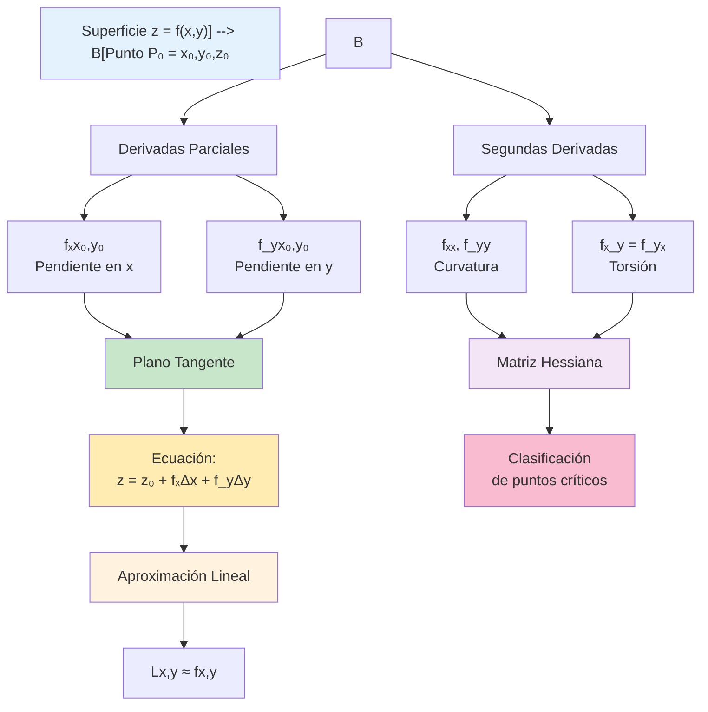

# 🎯 Interpretación Geométrica del Plano Tangente y Aproximación Lineal

## 🌟 Fundamentos Conceptuales

> [!info]- 💡 Introducción al Plano Tangente La **interpretación geométrica del plano tangente** es fundamental para entender cómo las funciones de varias variables se comportan localmente. Mientras que en cálculo de una variable la derivada nos da la **pendiente de la recta tangente**, en ℝ³ las derivadas parciales nos permiten construir un **plano tangente** que aproxima la superficie cerca de un punto.
> 
> **Analogías útiles:**
> 
> - **Física:** Una superficie montañosa y el plano horizontal donde acampas
> - **Cotidiano:** La superficie de una mesa tocando una pelota
> - **Navegación:** El mapa local de una región aproxima la superficie curva de la Tierra
> 
> **Diferencia fundamental:**
> 
> - **1D (ℝ → ℝ):** Recta tangente que aproxima una curva
> - **2D (ℝ² → ℝ):** Plano tangente que aproxima una superficie
> - **3D+ :** Hiperplano tangente (concepto abstracto)
> 
> **Importancia histórica:**
> 
> - **Leonhard Euler (1748):** Primeros estudios sistemáticos de superficies
> - **Joseph-Louis Lagrange (1760):** Desarrollo de cálculo de variaciones
> - **Carl Friedrich Gauss (1827):** Geometría diferencial de superficies
> - **Gregorio Ricci-Curbastro (1890):** Cálculo tensorial y geometría

## 📐 El Plano Tangente a una Superficie

### 🎨 Visualización Geométrica

> [!note]- 🌄 La Superficie y su Plano Tangente **Contexto:**
> 
> Consideremos una superficie definida por una función z = f(x, y) en ℝ³.
> 
> **Elementos clave:**
> 
> 1. **La superficie S:** Conjunto de puntos (x, y, f(x, y))
> 2. **Punto de tangencia P₀:** P₀ = (x₀, y₀, z₀) donde z₀ = f(x₀, y₀)
> 3. **Plano tangente T:** Plano que "toca" la superficie en P₀
> 
> **Intuición geométrica:**
> 
> Imagina una pelota apoyada sobre una superficie irregular:
> 
> - La superficie de la pelota es nuestra función f(x, y)
> - El punto donde toca la mesa es P₀
> - El pequeño círculo de contacto sugiere un plano tangente
> 
> **Propiedades visuales:**
> 
> - El plano tangente es la "mejor aproximación lineal" a la superficie en P₀
> - Cerca de P₀, la superficie y el plano son casi indistinguibles
> - Más lejos de P₀, la aproximación empeora
> 
> **Curvas sobre la superficie:**
> 
> - **Corte con x = x₀:** Curva en el plano YZ, tangente dada por ∂f/∂y
> - **Corte con y = y₀:** Curva en el plano XZ, tangente dada por ∂f/∂x
> - Estas dos rectas tangentes **determinan** el plano tangente

### 📏 Ecuación del Plano Tangente

> [!warning]- 📐 Fórmula Fundamental **Dada una función z = f(x, y) diferenciable en el punto (x₀, y₀):**
> 
> **El plano tangente a la superficie en P₀ = (x₀, y₀, f(x₀, y₀)) tiene ecuación:**
> 
> $$z - z_0 = f_x(x_0, y_0)(x - x_0) + f_y(x_0, y_0)(y - y_0)$$
> 
> O equivalentemente:
> 
> $$z = f(x_0, y_0) + f_x(x_0, y_0)(x - x_0) + f_y(x_0, y_0)(y - y_0)$$
> 
> **Donde:**
> 
> - **f(x₀, y₀)** = valor de la función en el punto (altura)
> - **fₓ(x₀, y₀)** = derivada parcial respecto a x (pendiente en dirección x)
> - **f_y(x₀, y₀)** = derivada parcial respecto a y (pendiente en dirección y)
> - **(x - x₀), (y - y₀)** = desplazamientos desde el punto base
> 
> **Interpretación de los términos:**
> 
> 1. **f(x₀, y₀):** Altura base en el punto de tangencia
> 2. **fₓ(x₀, y₀)(x - x₀):** Cambio debido al desplazamiento en x
> 3. **f_y(x₀, y₀)(y - y₀):** Cambio debido al desplazamiento en y
> 
> **Forma vectorial normal:**
> 
> El vector normal al plano tangente es:
> 
> $$\vec{n} = \langle f_x(x_0, y_0), f_y(x_0, y_0), -1 \rangle$$
> 
> Y la ecuación puede escribirse como:
> 
> $$f_x(x_0, y_0)(x - x_0) + f_y(x_0, y_0)(y - y_0) - (z - z_0) = 0$$

### 🔍 Derivación de la Ecuación

> [!tip]- 🧮 ¿De dónde viene la fórmula? **Método 1: Usando las rectas tangentes**
> 
> **Paso 1 - Curva en dirección x:**
> 
> Fijamos y = y₀ y consideramos z = f(x, y₀)
> 
> La recta tangente a esta curva en x₀ es:
> 
> ```
> z - z₀ = fₓ(x₀, y₀)(x - x₀)
> ```
> 
> Esta recta tiene vector director: **v₁** = ⟨1, 0, fₓ(x₀, y₀)⟩
> 
> **Paso 2 - Curva en dirección y:**
> 
> Fijamos x = x₀ y consideramos z = f(x₀, y)
> 
> La recta tangente a esta curva en y₀ es:
> 
> ```
> z - z₀ = f_y(x₀, y₀)(y - y₀)
> ```
> 
> Esta recta tiene vector director: **v₂** = ⟨0, 1, f_y(x₀, y₀)⟩
> 
> **Paso 3 - El plano contiene ambas rectas:**
> 
> Un plano que pasa por P₀ y contiene **v₁** y **v₂** tiene ecuación:
> 
> El vector normal es:
> 
> ```
> n = v₁ × v₂ = |  i      j      k    |
>                 | 1      0     fₓ    |
>                 | 0      1     f_y   |
>              
>   = ⟨-fₓ, -f_y, 1⟩  o equivalentemente  ⟨fₓ, f_y, -1⟩
> ```
> 
> La ecuación del plano es:
> 
> ```
> fₓ(x - x₀) + f_y(y - y₀) - (z - z₀) = 0
> 
> Despejando z:
> z = z₀ + fₓ(x - x₀) + f_y(y - y₀)
> ```
> 
> **Método 2: Aproximación lineal**
> 
> Si f es diferenciable, cerca de (x₀, y₀):
> 
> ```
> f(x, y) ≈ f(x₀, y₀) + fₓ(x₀, y₀)(x - x₀) + f_y(x₀, y₀)(y - y₀)
> ```
> 
> Esta es precisamente la ecuación del plano tangente.

### 📊 Ejemplos Detallados

> [!example]- 🎯 Casos Resueltos Paso a Paso **Ejemplo 1: Paraboloide simple**
> 
> Encontrar el plano tangente a z = f(x, y) = x² + y² en el punto (1, 2, 5).
> 
> **Solución:**
> 
> ```
> Paso 1: Verificar que el punto está en la superficie
> z₀ = f(1, 2) = 1² + 2² = 1 + 4 = 5 ✓
> 
> Paso 2: Calcular derivadas parciales
> fₓ(x, y) = 2x
> f_y(x, y) = 2y
> 
> Paso 3: Evaluar en (1, 2)
> fₓ(1, 2) = 2(1) = 2
> f_y(1, 2) = 2(2) = 4
> 
> Paso 4: Escribir ecuación del plano tangente
> z - 5 = 2(x - 1) + 4(y - 2)
> z - 5 = 2x - 2 + 4y - 8
> z = 2x + 4y - 5
> 
> Forma estándar:
> 2x + 4y - z = 5
> ```
> 
> **Verificación:** El punto (1, 2, 5) satisface: 2(1) + 4(2) - 5 = 5 ✓
> 
> ---
> 
> **Ejemplo 2: Función con productos**
> 
> Hallar el plano tangente a z = xy² en el punto (2, 1, 2).
> 
> **Solución:**
> 
> ```
> Paso 1: Verificar punto
> z₀ = (2)(1)² = 2 ✓
> 
> Paso 2: Derivadas parciales
> fₓ(x, y) = y²
> f_y(x, y) = 2xy
> 
> Paso 3: Evaluar en (2, 1)
> fₓ(2, 1) = 1² = 1
> f_y(2, 1) = 2(2)(1) = 4
> 
> Paso 4: Ecuación
> z - 2 = 1(x - 2) + 4(y - 1)
> z = x + 4y - 4
> 
> o bien: x + 4y - z = 4
> ```
> 
> ---
> 
> **Ejemplo 3: Función exponencial**
> 
> Encontrar el plano tangente a z = eˣ cos(y) en (0, 0, 1).
> 
> **Solución:**
> 
> ```
> Paso 1: Verificar
> z₀ = e⁰ cos(0) = 1 · 1 = 1 ✓
> 
> Paso 2: Derivadas
> fₓ(x, y) = eˣ cos(y)
> f_y(x, y) = -eˣ sin(y)
> 
> Paso 3: Evaluar en (0, 0)
> fₓ(0, 0) = e⁰ cos(0) = 1
> f_y(0, 0) = -e⁰ sin(0) = 0
> 
> Paso 4: Ecuación
> z - 1 = 1(x - 0) + 0(y - 0)
> z = x + 1
> 
> o bien: x - z = -1
> ```
> 
> **Interpretación:** El plano tangente es vertical en dirección y (pendiente cero en y).
> 
> ---
> 
> **Ejemplo 4: Aplicación práctica**
> 
> Una colina tiene altura h(x, y) = 100 - x² - 2y² metros, donde x, y están en km. Un excursionista está en el punto (2, 1, 93). ¿Cuál es la pendiente del terreno si camina: a) Hacia el este (dirección +x) b) Hacia el norte (dirección +y) c) En dirección (1, 1)
> 
> **Solución:**
> 
> ```
> Verificación: h(2, 1) = 100 - 4 - 2 = 94 (aproximadamente 93)
> 
> Derivadas:
> hₓ(x, y) = -2x  →  hₓ(2, 1) = -4
> h_y(x, y) = -4y  →  h_y(2, 1) = -4
> 
> a) Hacia el este: pendiente = -4 (desciende 4m por cada km)
> b) Hacia el norte: pendiente = -4 (desciende 4m por cada km)
> 
> c) En dirección (1, 1): Necesitamos la derivada direccional
>    Dirección unitaria: u = (1/√2, 1/√2)
>    D_u h = ∇h · u = (-4, -4) · (1/√2, 1/√2)
>          = -4/√2 - 4/√2 = -8/√2 ≈ -5.66
> 
> Plano tangente:
> h = 93 - 4(x - 2) - 4(y - 1)
> h = 93 - 4x + 8 - 4y + 4
> h = -4x - 4y + 105
> ```

## 🎯 Aproximación Lineal (Linealización)

### 📈 Concepto de Aproximación Lineal

> [!success]- 🔍 La Mejor Aproximación Local **Definición:**
> 
> La **aproximación lineal** o **linealización** de f(x, y) cerca del punto (x₀, y₀) es la función lineal L(x, y) dada por:
> 
> $$L(x, y) = f(x_0, y_0) + f_x(x_0, y_0)(x - x_0) + f_y(x_0, y_0)(y - y_0)$$
> 
> **Interpretación:**
> 
> - L(x, y) es la ecuación del plano tangente
> - Cerca de (x₀, y₀): **f(x, y) ≈ L(x, y)**
> - Es la aproximación de primer orden (lineal) de f
> 
> **¿Por qué funciona?**
> 
> Proviene del teorema de Taylor para varias variables:
> 
> ```
> f(x, y) = f(x₀, y₀) + fₓ(x₀, y₀)(x - x₀) + f_y(x₀, y₀)(y - y₀) + términos de orden superior
> 
> Si (x, y) está cerca de (x₀, y₀), los términos de orden superior son despreciables
> ```
> 
> **Notación alternativa:**
> 
> Con Δx = x - x₀ y Δy = y - y₀:
> 
> $$\Delta z \approx f_x(x_0, y_0)\Delta x + f_y(x_0, y_0)\Delta y$$
> 
> **Análogo en 1D:**
> 
> En cálculo de una variable:
> 
> ```
> f(x) ≈ f(x₀) + f'(x₀)(x - x₀)
> ```
> 
> La extensión natural a 2D usa derivadas parciales.

### 🎲 Diferencial Total

> [!warning]- 📐 La Diferencial de una Función **Definición:**
> 
> La **diferencial total** de z = f(x, y) es:
> 
> $$dz = f_x(x, y)dx + f_y(x, y)dy$$
> 
> **Interpretación:**
> 
> - **dx, dy:** Cambios infinitesimales (muy pequeños) en x e y
> - **dz:** Cambio aproximado en z correspondiente
> - Es la versión "diferencial" de la aproximación lineal
> 
> **Relación con la linealización:**
> 
> Evaluando en (x₀, y₀):
> 
> ```
> dz = fₓ(x₀, y₀)dx + f_y(x₀, y₀)dy
> ```
> 
> Si dx = Δx y dy = Δy (cambios pequeños pero finitos):
> 
> ```
> Δz ≈ dz = fₓ(x₀, y₀)Δx + f_y(x₀, y₀)Δy
> ```
> 
> **Forma general:**
> 
> Para una función f(x₁, x₂, ..., xₙ):
> 
> $$df = \frac{\partial f}{\partial x_1}dx_1 + \frac{\partial f}{\partial x_2}dx_2 + \cdots + \frac{\partial f}{\partial x_n}dx_n$$
> 
> O en notación vectorial: $$df = \nabla f \cdot d\vec{r}$$

### 🔢 Ejemplos de Aproximación

> [!example]- 💡 Aplicaciones Prácticas **Ejemplo 1: Estimación simple**
> 
> Usar aproximación lineal para estimar f(2.1, 3.05) si f(x, y) = x²y y conocemos f y sus derivadas en (2, 3).
> 
> **Solución:**
> 
> ```
> Punto base: (x₀, y₀) = (2, 3)
> f(2, 3) = (2)²(3) = 12
> 
> Derivadas parciales:
> fₓ(x, y) = 2xy  →  fₓ(2, 3) = 2(2)(3) = 12
> f_y(x, y) = x²   →  f_y(2, 3) = 4
> 
> Desplazamientos:
> Δx = 2.1 - 2 = 0.1
> Δy = 3.05 - 3 = 0.05
> 
> Aproximación lineal:
> L(2.1, 3.05) = f(2, 3) + fₓ(2, 3)Δx + f_y(2, 3)Δy
>              = 12 + 12(0.1) + 4(0.05)
>              = 12 + 1.2 + 0.2
>              = 13.4
> 
> Valor real:
> f(2.1, 3.05) = (2.1)²(3.05) = 4.41 × 3.05 = 13.4505
> 
> Error: |13.4505 - 13.4| = 0.0505 ≈ 0.37%
> ```
> 
> ---
> 
> **Ejemplo 2: Propagación de errores**
> 
> Una caja rectangular tiene dimensiones x = 10 cm, y = 8 cm, z = 5 cm, medidas con error de ±0.1 cm. Estimar el error máximo en el volumen calculado.
> 
> **Solución:**
> 
> ```
> Volumen: V = xyz
> 
> Derivadas parciales:
> ∂V/∂x = yz
> ∂V/∂y = xz
> ∂V/∂z = xy
> 
> Evaluando en (10, 8, 5):
> ∂V/∂x = (8)(5) = 40
> ∂V/∂y = (10)(5) = 50
> ∂V/∂z = (10)(8) = 80
> 
> Diferencial total:
> dV = 40dx + 50dy + 80dz
> 
> Error máximo (cuando todos los errores se suman):
> |dV| ≤ 40(0.1) + 50(0.1) + 80(0.1)
>      = 4 + 5 + 8
>      = 17 cm³
> 
> Volumen calculado: V = 10 × 8 × 5 = 400 cm³
> 
> Error relativo: 17/400 = 0.0425 = 4.25%
> ```
> 
> ---
> 
> **Ejemplo 3: Resistencia eléctrica**
> 
> Dos resistencias R₁ = 100Ω y R₂ = 200Ω están en paralelo. La resistencia total es:
> 
> R = (R₁R₂)/(R₁ + R₂)
> 
> Si cada resistencia puede variar ±2Ω, estimar la variación máxima en R.
> 
> **Solución:**
> 
> ```
> R(100, 200) = (100)(200)/(100 + 200) = 20000/300 = 66.67Ω
> 
> Derivadas parciales:
> ∂R/∂R₁ = R₂²/(R₁ + R₂)²
> ∂R/∂R₂ = R₁²/(R₁ + R₂)²
> 
> Evaluando:
> ∂R/∂R₁ = (200)²/(300)² = 40000/90000 = 4/9 ≈ 0.444
> ∂R/∂R₂ = (100)²/(300)² = 10000/90000 = 1/9 ≈ 0.111
> 
> Diferencial:
> dR = (4/9)dR₁ + (1/9)dR₂
> 
> Variación máxima:
> |dR| ≤ (4/9)(2) + (1/9)(2)
>      = 8/9 + 2/9
>      = 10/9 ≈ 1.11Ω
> 
> Resultado: R = 66.67 ± 1.11Ω
> ```
> 
> ---
> 
> **Ejemplo 4: Área de un triángulo**
> 
> Un triángulo tiene lados a = 5 m y b = 12 m con ángulo θ = 30°. El área es A = (1/2)ab sin(θ). Si hay errores de ±0.1 m en los lados y ±1° en el ángulo, estimar el error en el área.
> 
> **Solución:**
> 
> ```
> A(5, 12, π/6) = (1/2)(5)(12)sin(π/6) = 30(0.5) = 15 m²
> 
> Derivadas parciales:
> ∂A/∂a = (1/2)b sin(θ)
> ∂A/∂b = (1/2)a sin(θ)
> ∂A/∂θ = (1/2)ab cos(θ)
> 
> Evaluando:
> ∂A/∂a = (1/2)(12)(0.5) = 3
> ∂A/∂b = (1/2)(5)(0.5) = 1.25
> ∂A/∂θ = (1/2)(5)(12)(√3/2) = 30√3/2 ≈ 25.98
> 
> Convertir 1° a radianes: dθ = π/180 ≈ 0.01745 rad
> 
> Error máximo:
> |dA| ≤ 3(0.1) + 1.25(0.1) + 25.98(0.01745)
>      ≈ 0.3 + 0.125 + 0.453
>      ≈ 0.878 m²
> 
> Resultado: A = 15 ± 0.88 m² (error ≈ 5.9%)
> ```

## 🌊 Superficie vs Plano Tangente

### 📊 Comparación Visual

> [!tip]- 👁️ Diferencias y Similitudes **Cerca del punto de tangencia:**
> 
> |Distancia desde P₀|Superficie S|Plano Tangente T|Diferencia|
> |---|---|---|---|
> |0|f(x₀, y₀)|f(x₀, y₀)|0|
> |Muy pequeña|f(x₀ + ε, y₀ + ε)|L(x₀ + ε, y₀ + ε)|≈ ε² (orden 2)|
> |Pequeña|f(x, y)|L(x, y)|Pequeña|
> |Moderada|f(x, y)|L(x, y)|Moderada|
> |Grande|f(x, y)|L(x, y)|Grande|
> 
> **Características clave:**
> 
> 1. **Contacto perfecto en P₀:** S y T coinciden exactamente
> 2. **Misma pendiente en todas direcciones:** Las derivadas direccionales coinciden en P₀
> 3. **Desviación cuadrática:** El error crece con el cuadrado de la distancia
> 
> **Ejemplo visual - Paraboloide:**
> 
> ```
> Superficie: z = x² + y²
> Punto: (0, 0, 0)
> Plano tangente: z = 0 (plano horizontal)
> 
> Comparación:
> En (0.1, 0.1): 
>   Superficie: z = 0.02
>   Plano: z = 0
>   Error: 0.02
> 
> En (0.5, 0.5):
>   Superficie: z = 0.5
>   Plano: z = 0
>   Error: 0.5 (significativo)
> ```

### 🎯 Error de Aproximación

> [!warning]- ⚠️ Cuantificando el Error **Teorema del error:**
> 
> Si f tiene derivadas parciales segundas continuas en una región alrededor de (x₀, y₀), entonces:
> 
> $$E = f(x, y) - L(x, y) = O(|\Delta \vec{r}|^2)$$
> 
> Donde Δ**r** = (x - x₀, y - y₀)
> 
> **Interpretación:**
> 
> - El error es proporcional al **cuadrado** de la distancia
> - Si duplicas la distancia, el error se cuadriplica
> - Notación O grande: error ≤ M||Δ**r**||² para alguna constante M
> 
> **Fórmula más precisa (resto de Taylor):**
> 
> $$E = \frac{1}{2}[f_{xx}(c)(x-x_0)^2 + 2f_{xy}(c)(x-x_0)(y-y_0) + f_{yy}(c)(y-y_0)^2]$$
> 
> para algún punto c entre (x₀, y₀) y (x, y)
> 
> **Criterio práctico:**
> 
> La aproximación lineal es "buena" si:
> 
> ```
> |f(x, y) - L(x, y)| / |f(x, y)| < 0.01  (error < 1%)
> ```
> 
> **Ejemplo numérico:**
> 
> Para f(x, y) = sin(x)cos(y) cerca de (0, 0):
> 
> ```
> f(0, 0) = 0
> fₓ(0, 0) = cos(0)cos(0) = 1
> f_y(0, 0) = -sin(0)sin(0) = 0
> 
> L(x, y) = x
> 
> Tabla de errores:
> (x, y)       | f(x, y)  | L(x, y) | Error    | % Error
> -------------|----------|---------|----------|--------
> (0.1, 0.1)   | 0.0995   | 0.1     | 0.0005   | 0.5%
> (0.5, 0.5)   | 0.4387   | 0.5     | 0.0613   | 14%
> (1.0, 1.0)   | 0.4546   | 1.0     | 0.5454   | 120%
> ```

## 🧮 Derivadas Parciales de Orden Superior

### 🔄 Segundas Derivadas Parciales

> [!note]- 🔢 Derivando Dos Veces **Definición:**
> 
> Para una función z = f(x, y), las **derivadas parciales de segundo orden** son:
> 
> 1. **fₓₓ** = ∂²f/∂x² = ∂/∂x(∂f/∂x) — derivar dos veces respecto a x
>     
> 2. **f_yy** = ∂²f/∂y² = ∂/∂y(∂f/∂y) — derivar dos veces respecto a y
>     
> 3. **fₓ_y** = ∂²f/∂y∂x = ∂/∂y(∂f/∂x) — derivar primero respecto a x, luego a y
>     
> 4. **f_yₓ** = ∂²f/∂x∂y = ∂/∂x(∂f/∂y) — derivar primero respecto a y, luego a x
>     
> 
> **Notaciones equivalentes:**
> 
> ```
> fₓₓ = ∂²f/∂x² => f_yy = ∂²f/∂y² = f_yy fₓ_y = ∂²f/∂y∂x = f_{xy} f_yₓ = ∂²f/∂x∂y = f_{yx}
> 
> ```
> 
> **Interpretación geométrica:**
> 
> - **fₓₓ:** Curvatura de la superficie en dirección x
> - **f_yy:** Curvatura de la superficie en dirección y
> - **fₓ_y, f_yₓ:** Torsión (cuánto se tuerce la superficie)
> 
> **Teorema de Schwarz (igualdad de derivadas mixtas):**
> 
> Si fₓ_y y f_yₓ son continuas, entonces:
> 
> $$f_{xy} = f_{yx}$$
> 
> Es decir, **el orden de derivación no importa** (en funciones suficientemente suaves).
> 

### 📐 Cálculo de Segundas Derivadas

> [!example]- 🎯 Ejemplos Paso a Paso **Ejemplo 1: Función polinomial**
> 
> Calcular todas las segundas derivadas de f(x, y) = x³y² + 2xy³
> 
> **Solución:**
> 
> ```
> Paso 1: Primeras derivadas
> fₓ = ∂/∂x(x³y² + 2xy³) = 3x²y² + 2y³
> f_y = ∂/∂y(x³y² + 2xy³) = 2x³y + 6xy²
> 
> Paso 2: Segundas derivadas puras
> fₓₓ = ∂/∂x(3x²y² + 2y³) = 6xy²
> f_yy = ∂/∂y(2x³y + 6xy²) = 2x³ + 12xy
> 
> Paso 3: Derivadas mixtas
> fₓ_y = ∂/∂y(3x²y² + 2y³) = 6x²y + 6y²
> f_yₓ = ∂/∂x(2x³y + 6xy²) = 6x²y + 6y²
> 
> Verificación: fₓ_y = f_yₓ ✓
> 
> Resumen:
> fₓₓ = 6xy²
> f_yy = 2x³ + 12xy
> fₓ_y = f_yₓ = 6x²y + 6y²
> ```
> 
> ---
> 
> **Ejemplo 2: Función exponencial**
> 
> Para f(x, y) = eˣ⁺²ʸ, hallar fₓₓ, f_yy, fₓ_y
> 
> **Solución:**
> 
> ```
> Paso 1: Primeras derivadas
> fₓ = eˣ⁺²ʸ
> f_y = 2eˣ⁺²ʸ
> 
> Paso 2: Segundas derivadas
> fₓₓ = ∂/∂x(eˣ⁺²ʸ) = eˣ⁺²ʸ
> f_yy = ∂/∂y(2eˣ⁺²ʸ) = 4eˣ⁺²ʸ
> fₓ_y = ∂/∂y(eˣ⁺²ʸ) = 2eˣ⁺²ʸ
> 
> Observación: Todas son múltiplos de la función original
> ```
> 
> ---
> 
> **Ejemplo 3: Función trigonométrica**
> 
> f(x, y) = sin(x) cos(y)
> 
> **Solución:**
> 
> ```
> Primeras derivadas:
> fₓ = cos(x)cos(y)
> f_y = -sin(x)sin(y)
> 
> Segundas derivadas:
> fₓₓ = -sin(x)cos(y) = -f(x, y)
> f_yy = -sin(x)cos(y) = -f(x, y)
> fₓ_y = -cos(x)sin(y)
> 
> Observación: fₓₓ + f_yy = -2f(x, y)
> (Esta función satisface ∇²f = -2f, una ecuación de Helmholtz)
> ```
> 
> ---
> 
> **Ejemplo 4: Verificación del teorema de Schwarz**
> 
> Para f(x, y) = xʸ (con x > 0), verificar que fₓ_y = f_yₓ
> 
> **Solución:**
> 
> ```
> Usando logaritmos: xʸ = eʸˡⁿ⁽ˣ⁾
> 
> Primeras derivadas:
> fₓ = yxʸ⁻¹ = yxʸ/x
> f_y = xʸ ln(x)
> 
> Derivadas mixtas:
> fₓ_y = ∂/∂y(yxʸ/x) = xʸ/x + yxʸln(x)/x = xʸ⁻¹(1 + y ln(x))
> 
> f_yₓ = ∂/∂x(xʸ ln(x)) = yxʸ⁻¹ln(x) + xʸ/x
>      = xʸ⁻¹(y ln(x) + 1) = xʸ⁻¹(1 + y ln(x))
> 
> Resultado: fₓ_y = f_yₓ ✓
> ```

### 🌀 Matriz Hessiana

> [!success]- 🎨 Organizando las Segundas Derivadas **Definición:**
> 
> La **matriz Hessiana** de f(x, y) es la matriz de segundas derivadas:
> 
> $$H = \begin{bmatrix} f_{xx} & f_{xy} \ f_{yx} & f_{yy} \end{bmatrix}$$
> 
> Si se cumple el teorema de Schwarz (fₓ_y = f_yₓ), la matriz es **simétrica**.
> 
> **Interpretación:**
> 
> - Describe la **curvatura** de la superficie en todas direcciones
> - Fundamental para el **test de la segunda derivada** (máximos/mínimos)
> - Generalización de f''(x) en una variable
> 
> **Propiedades importantes:**
> 
> 1. **Determinante:** det(H) = fₓₓf_yy - (fₓ_y)²
>     - Si det(H) > 0: punto crítico no degenerado
>     - Si det(H) < 0: punto silla
>     - Si det(H) = 0: test inconclusivo
> 2. **Traza:** tr(H) = fₓₓ + f_yy = ∇²f (Laplaciano)
>     - Suma de curvaturas principales
> 3. **Valores propios λ₁, λ₂:**
>     - Si λ₁, λ₂ > 0: mínimo local
>     - Si λ₁, λ₂ < 0: máximo local
>     - Si signos opuestos: punto silla
> 
> **Ejemplo:**
> 
> Para f(x, y) = x² - y², en el punto (0, 0):
> 
> ```
> fₓₓ = 2,  f_yy = -2,  fₓ_y = 0
> 
> H = [  2   0 ]
>     [  0  -2 ]
> 
> det(H) = (2)(-2) - 0² = -4 < 0
> 
> Conclusión: (0, 0) es un punto silla
> ```
> 
> **Extensión a n variables:**
> 
> Para f(x₁, ..., xₙ), la Hessiana es una matriz n×n:
> 
> $$H_{ij} = \frac{\partial^2 f}{\partial x_i \partial x_j}$$

## 🎨 Visualización Interactiva



## 🧪 Aplicaciones del Plano Tangente

### 🌍 Aplicaciones en Ciencias

> [!tip]- 🔬 Usos Prácticos **1. Física - Análisis de superficies:**
> 
> - **Óptica:** Superficies reflectantes, el plano tangente determina el ángulo de reflexión
> - **Mecánica:** Fuerzas normales a superficies
> - **Termodinámica:** Gradientes de temperatura en placas
> 
> **Ejemplo:** Un espejo parabólico z = x² + y²
> 
> ```
> En el punto (1, 1, 2):
> Vector normal: n = ⟨fₓ, f_y, -1⟩ = ⟨2, 2, -1⟩
> Este vector indica la dirección de reflexión
> ```
> 
> **2. Ingeniería - Diseño de superficies:**
> 
> - **CAD/CAM:** Aproximación de superficies complejas
> - **Aerodinámica:** Análisis de flujo sobre alas
> - **Arquitectura:** Cálculo de pendientes en techos
> 
> **3. Economía - Análisis marginal:**
> 
> - Producción: Q(L, K) = producción con trabajo L y capital K
> - Plano tangente: Q ≈ Q₀ + (∂Q/∂L)ΔL + (∂Q/∂K)ΔK
> - Predice cambios en producción con pequeños cambios en recursos
> 
> **4. Geología - Modelado de terrenos:**
> 
> - h(x, y) = altura del terreno
> - Plano tangente: aproximación local del terreno
> - Usado en GIS y mapeo topográfico
> 
> **5. Medicina - Propagación de errores:**
> 
> - Dosificación de medicamentos: D(m, a) basado en masa y edad
> - dD estima error en dosis por errores de medición
> - Crítico para seguridad del paciente

### 💼 Problemas Aplicados

> [!example]- 🎯 Casos Reales **Problema 1: Producción industrial**
> 
> Una fábrica produce Q(x, y) = 100x⁰·⁶y⁰·⁴ unidades, donde x = trabajadores, y = horas-máquina. Actualmente x = 50, y = 80.
> 
> a) ¿Cuál es la producción actual? b) Si contratas 2 trabajadores más y añades 3 horas-máquina, estima el cambio en producción.
> 
> **Solución:**
> 
> ```
> a) Q(50, 80) = 100(50)⁰·⁶(80)⁰·⁴ 
>              = 100(10.91)(8.74)
>              ≈ 9535 unidades
> 
> b) Derivadas parciales:
>    Qₓ = 60x⁻⁰·⁴y⁰·⁴
>    Q_y = 40x⁰·⁶y⁻⁰·⁶
>    
>    Evaluando en (50, 80):
>    Qₓ(50, 80) = 60(50)⁻⁰·⁴(80)⁰·⁴ ≈ 114.4
>    Q_y(50, 80) = 40(50)⁰·⁶(80)⁻⁰·⁶ ≈ 47.7
>    
>    Aproximación lineal:
>    ΔQ ≈ Qₓ·Δx + Q_y·Δy
>       = 114.4(2) + 47.7(3)
>       = 228.8 + 143.1
>       ≈ 372 unidades adicionales
> 
> Interpretación:
> - Cada trabajador adicional aporta ≈ 114 unidades
> - Cada hora-máquina adicional aporta ≈ 48 unidades
> ```
> 
> ---
> 
> **Problema 2: Temperatura en una placa**
> 
> Una placa metálica tiene temperatura T(x, y) = 100 - 2x² - y² °C. Un sensor está en (3, 4).
> 
> a) ¿Cuál es la temperatura en el sensor? b) Si el sensor se mueve a (3.1, 3.9), estima la nueva temperatura. c) En qué dirección debería moverse para enfriarse más rápido.
> 
> **Solución:**
> 
> ```
> a) T(3, 4) = 100 - 2(9) - 16 = 100 - 18 - 16 = 66°C
> 
> b) Derivadas:
>    Tₓ = -4x  →  Tₓ(3, 4) = -12
>    T_y = -2y  →  T_y(3, 4) = -8
>    
>    Desplazamiento: Δx = 0.1, Δy = -0.1
>    
>    ΔT ≈ Tₓ·Δx + T_y·Δy
>       = (-12)(0.1) + (-8)(-0.1)
>       = -1.2 + 0.8
>       = -0.4°C
>    
>    Nueva temperatura ≈ 66 - 0.4 = 65.6°C
> 
> c) Gradiente: ∇T = ⟨-12, -8⟩
>    Dirección de mayor descenso: -∇T = ⟨12, 8⟩
>    Normalizado: (12, 8)/√(144 + 64) = (12, 8)/14.42 ≈ (0.83, 0.55)
>    
>    Respuesta: Moverse en dirección (3, 2) normalizada
> ```
> 
> ---
> 
> **Problema 3: Resistencia de un cable**
> 
> La resistencia de un cable es R = ρL/A, donde ρ = resistividad, L = longitud, A = área transversal.
> 
> Para un cable específico: ρ = 1.7×10⁻⁸ Ω·m, L = 100 m, A = 2×10⁻⁶ m²
> 
> Si hay errores: δρ = 0.1×10⁻⁸, δL = 1 m, δA = 0.1×10⁻⁶ m², estimar error en R.
> 
> **Solución:**
> 
> ```
> R(ρ, L, A) = ρL/A
> 
> Valor actual:
> R = (1.7×10⁻⁸)(100)/(2×10⁻⁶) = 0.85 Ω
> 
> Derivadas parciales:
> ∂R/∂ρ = L/A = 100/(2×10⁻⁶) = 5×10⁷
> ∂R/∂L = ρ/A = (1.7×10⁻⁸)/(2×10⁻⁶) = 8.5×10⁻³
> ∂R/∂A = -ρL/A² = -(1.7×10⁻⁸)(100)/(4×10⁻¹²) = -4.25×10⁵
> 
> Diferencial total:
> dR = (∂R/∂ρ)dρ + (∂R/∂L)dL + (∂R/∂A)dA
>    = (5×10⁷)(0.1×10⁻⁸) + (8.5×10⁻³)(1) + (-4.25×10⁵)(0.1×10⁻⁶)
>    = 0.05 + 0.0085 - 0.0425
>    = 0.016 Ω
> 
> Resultado: R = 0.85 ± 0.016 Ω (error ≈ 1.9%)
> ```

## 🎓 Ejercicios Integrales

> [!example]- 💪 Práctica Completa **Nivel 1 - Básico:** 🟢
> 
> 1. Encontrar el plano tangente a z = x² + y² en (1, 2, 5).
> 
> **Solución:**
> 
> ```
> fₓ = 2x  →  fₓ(1, 2) = 2
> f_y = 2y  →  f_y(1, 2) = 4
> 
> Plano: z - 5 = 2(x - 1) + 4(y - 2)
>        z = 2x + 4y - 5
> ```
> 
> 2. Usar aproximación lineal para estimar √(4.1² + 3.9²)
> 
> **Solución:**
> 
> ```
> f(x, y) = √(x² + y²)
> Punto base: (4, 4) donde f = √32 = 4√2 ≈ 5.657
> 
> fₓ = x/√(x² + y²)  →  fₓ(4, 4) = 4/(4√2) = 1/√2
> f_y = y/√(x² + y²)  →  f_y(4, 4) = 1/√2
> 
> L(4.1, 3.9) = 5.657 + (1/√2)(0.1) + (1/√2)(-0.1)
>             = 5.657 + 0.071 - 0.071
>             = 5.657
> 
> (Los cambios se cancelan porque Δx = -Δy)
> ```
> 
> ---
> 
> **Nivel 2 - Intermedio:** 🟡
> 
> 3. Para f(x, y) = eˣʸ, calcular todas las segundas derivadas en (0, 1).
> 
> **Solución:**
> 
> ```
> fₓ = yeˣʸ
> f_y = xeˣʸ
> 
> fₓₓ = y²eˣʸ  →  fₓₓ(0, 1) = 1
> f_yy = x²eˣʸ  →  f_yy(0, 1) = 0
> fₓ_y = eˣʸ + xyeˣʸ  →  fₓ_y(0, 1) = 1
> 
> Matriz Hessiana en (0, 1):
> H = [ 1  1 ]
>     [ 1  0 ]
> 
> det(H) = -1 < 0  →  punto silla
> ```
> 
> 4. Un cono tiene radio r = 5 cm y altura h = 12 cm (ambos con error ±0.2 cm). Estimar el error máximo en el volumen V = (1/3)πr²h.
> 
> **Solución:**
> 
> ```
> V(5, 12) = (1/3)π(25)(12) = 100π cm³
> 
> ∂V/∂r = (2/3)πrh  →  (2/3)π(5)(12) = 40π
> ∂V/∂h = (1/3)πr²  →  (1/3)π(25) = 25π/3
> 
> |dV| ≤ 40π(0.2) + (25π/3)(0.2)
>      = 8π + 5π/3
>      = 29π/3 ≈ 30.4 cm³
> 
> Error relativo: 30.4/(100π) ≈ 9.7%
> ```
> 
> ---
> 
> **Nivel 3 - Avanzado:** 🔴
> 
> 5. Demostrar que f(x, y) = ln(x² + y²) satisface la ecuación de Laplace: ∇²f = fₓₓ + f_yy = 0 para (x, y) ≠ (0, 0).
> 
> **Solución:**
> 
> ```
> fₓ = 2x/(x² + y²)
> f_y = 2y/(x² + y²)
> 
> fₓₓ = [2(x² + y²) - 2x(2x)]/(x² + y²)²
>     = [2x² + 2y² - 4x²]/(x² + y²)²
>     = (2y² - 2x²)/(x² + y²)²
> 
> f_yy = [2(x² + y²) - 2y(2y)]/(x² + y²)²
>      = (2x² - 2y²)/(x² + y²)²
> 
> fₓₓ + f_yy = (2y² - 2x² + 2x² - 2y²)/(x² + y²)²
>            = 0/(x² + y²)²
>            = 0 ✓
> 
> Conclusión: f es armónica
> ```
> 
> 6. **Problema desafiante:** Una superficie S tiene ecuación implícita F(x, y, z) = x² + y² + z² - 25 = 0 (esfera de radio 5).
> 
> a) Encontrar el plano tangente en P = (3, 4, 0). b) ¿A qué distancia del origen está este plano?
> 
> **Solución:**
> 
> ```
> a) Para superficie implícita, el gradiente es normal:
>    ∇F = ⟨2x, 2y, 2z⟩
>    ∇F(3, 4, 0) = ⟨6, 8, 0⟩
>    
>    Plano tangente (forma punto-normal):
>    6(x - 3) + 8(y - 4) + 0(z - 0) = 0
>    6x + 8y = 18 + 32 = 50
>    3x + 4y = 25
> 
> b) Forma normal: 3x + 4y + 0z = 25
>    Distancia del origen al plano:
>    d = |25|/√(9 + 16 + 0) = 25/5 = 5
>    
>    (Coincide con el radio de la esfera, como esperado)
> ```

## 📚 Conceptos Avanzados

### 🌊 Superficies de Nivel y Gradiente

> [!success]- 🎯 Conexión Profunda **Superficies de nivel:**
> 
> Para una función F(x, y, z), una **superficie de nivel** es:
> 
> S: F(x, y, z) = c (constante)
> 
> **Teorema fundamental:**
> 
> El gradiente ∇F es **perpendicular** a la superficie de nivel que pasa por ese punto.
> 
> **Aplicación al plano tangente:**
> 
> Si z = f(x, y), podemos escribir:
> 
> ```
> F(x, y, z) = f(x, y) - z = 0
> 
> ∇F = ⟨fₓ, f_y, -1⟩  (vector normal)
> 
> Plano tangente: ⟨fₓ, f_y, -1⟩ · ⟨x-x₀, y-y₀, z-z₀⟩ = 0
> ```
> 
> **Ejemplo:** Esfera x² + y² + z² = 25
> 
> ```
> F(x, y, z) = x² + y² + z² - 25
> ∇F = ⟨2x, 2y, 2z⟩
> 
> En (3, 4, 0): ∇F = ⟨6, 8, 0⟩
> 
> Este vector apunta radialmente desde el centro,
> perpendicular a la esfera (como esperado)
> ```

### 🎨 Diferenciabilidad

> [!warning]- ⚠️ Condiciones para que Exista el Plano Tangente **Definición formal:**
> 
> f(x, y) es **diferenciable** en (x₀, y₀) si existe un plano tangente tal que:
> 
> $$\lim_{(\Delta x, \Delta y) \to (0, 0)} \frac{|f(x_0+\Delta x, y_0+\Delta y) - L(x_0+\Delta x, y_0+\Delta y)|}{\sqrt{(\Delta x)^2 + (\Delta y)^2}} = 0$$
> 
> **En palabras:** El error relativo tiende a cero más rápido que la distancia.
> 
> **Teorema suficiente:**
> 
> Si fₓ y f_y existen y son **continuas** en una vecindad de (x₀, y₀), entonces f es diferenciable en (x₀, y₀).
> 
> **Contraejemplo:** Existencia de derivadas parciales ≠ diferenciabilidad
> 
> ```
> f(x, y) = { xy/(x² + y²)  si (x,y) ≠ (0,0)
>           { 0              si (x,y) = (0,0)
> 
> En (0, 0):
> - fₓ(0, 0) = 0 (existe)
> - f_y(0, 0) = 0 (existe)
> - Pero f NO es continua en (0, 0)
> - Por lo tanto, NO es diferenciable
> ```
> 
> **Jerarquía de condiciones:**
> 
> ```
> Diferenciable
>     ↓ (implica)
> Continua
>     ↓ (no implica)
> Derivadas parciales existen
> ```

## 💡 Consejos y Errores Comunes

> [!tip]- 🧠 Guía de Estudio **Estrategias de aprendizaje:**
> 
> 1. **Visualización 3D:**
>     - Usar software: GeoGebra 3D, Wolfram Alpha, Desmos 3D
>     - Dibujar múltiples vistas (planta, perfil, corte)
>     - Imaginar "rebanadas" de la superficie
> 2. **Práctica sistemática:**
>     - Empezar con funciones simples (x² + y², xy)
>     - Verificar cálculos con software
>     - Comparar aproximación con valor real
> 3. **Conexiones conceptuales:**
>     - Relacionar con derivadas en 1D
>     - Pensar en términos físicos (altura, pendiente)
>     - Entender el "¿por qué?" antes del "¿cómo?"
> 
> **Errores comunes a evitar:**
> 
> ❌ **Error 1:** Olvidar evaluar las derivadas en el punto
> 
> ```
> Incorrecto: z = z₀ + fₓ(x - x₀)  (fₓ sin evaluar)
> Correcto:   z = z₀ + fₓ(x₀, y₀)(x - x₀)
> ```
> 
> ❌ **Error 2:** Confundir orden en derivadas mixtas
> 
> ```
> fₓ_y = primero x, luego y
> f_yₓ = primero y, luego x
> (Son iguales si continuas, pero orden importa en notación)
> ```
> 
> ❌ **Error 3:** Usar aproximación lejos del punto base
> 
> ```
> El plano tangente solo es bueno CERCA de (x₀, y₀)
> A distancia grande, el error puede ser enorme
> ```
> 
> ❌ **Error 4:** Ignorar unidades en aplicaciones
> 
> ```
> Si x está en metros y y en segundos,
> fₓ tiene unidades de (unidades de z)/metro
> ```
> 
> ❌ **Error 5:** Pensar que derivadas parciales ⇒ diferenciabilidad
> ```
> 
> Se necesita que las derivadas sean CONTINUAS No basta con que existan
> ```

## 📊 Tabla Resumen

> [!example]- 📋 Compendio Visual
> 
> |Concepto|Fórmula/Definición|Ejemplo|Aplicación|
> |---|---|---|---|
> |**Plano tangente**|z = z₀ + fₓ(x-x₀) + f_y(y-y₀)|z = 5 + 2(x-1) + 4(y-2)|Aproximación local|
> |**Vector normal**|**n** = ⟨fₓ, f_y, -1⟩|⟨2, 4, -1⟩|Dirección perpendicular|
> |**Aproximación lineal**|L(x,y) ≈ f(x,y)|L(1.1, 2.1) ≈ f(1.1, 2.1)|Estimaciones rápidas|
> |**Diferencial total**|dz = fₓdx + f_ydy|dz = 2dx + 4dy|Propagación de errores|
> |**Segunda derivada (pura)**|fₓₓ = ∂²f/∂x²|fₓₓ = 2|Curvatura en x|
> |**Derivada mixta**|fₓ_y = ∂²f/∂y∂x|fₓ_y = 0|Torsión de superficie|
> |**Matriz Hessiana**|H = [fₓₓ fₓ_y; f_yₓ f_yy]|H = [2 0; 0 2]|Test segunda derivada|
> |**Error de aproximación**|E = f - L = O(r²)|E ∝ distancia²|Control de calidad|
> |**Teorema de Schwarz**|fₓ_y = f_yₓ (si continuas)|✓ Orden no importa|Simplifica cálculos|
> |**Diferenciabilidad**|Derivadas continuas ⇒ diferenciable|Función suave|Garantiza plano tangente|

## 🔗 Conexiones Conceptuales

> [!quote]- 🌟 Red de Conocimientos **Prerequisites (Prerrequisitos):**
> 
> - [[02 - Vectores en R3]] - Base vectorial
> - [[Derivadas Parciales]] - Herramienta fundamental
> - [[Límites en varias variables]] - Concepto de aproximación
> - [[Continuidad en R²]] - Condición necesaria
> 
> **Temas relacionados:**
> 
> - [[04 - Derivada Direccional y Gradiente]] - Extensión del plano tangente
> - [[05 - Regla de la Cadena]] - Composición de funciones
> - [[06 - Extremos y Optimización]] - Usa la Hessiana
> - [[07 - Multiplicadores de Lagrange]] - Optimización con restricciones
> 
> **Aplicaciones avanzadas:**
> 
> - [[Teorema de Taylor en R²]] - Aproximaciones de orden superior
> - [[Ecuaciones Diferenciales Parciales]] - EDPs sobre superficies
> - [[Geometría Diferencial]] - Curvaturas y formas fundamentales
> - [[Cálculo Variacional]] - Optimización de funcionales
> 
> **Conexiones interdisciplinarias:**
> 
> - [[Mecánica de Fluidos]] - Campos de velocidad
> - [[Termodinámica]] - Funciones de estado
> - [[Economía Matemática]] - Funciones de utilidad
> - [[Aprendizaje Automático]] - Gradiente descendente

---

**Tags:** #plano-tangente #aproximación-lineal #derivadas-parciales #diferencial-total #segundas-derivadas #matriz-hessiana #diferenciabilidad #cálculo-multivariable #R3 #geometría-analítica #análisis-vectorial #aplicaciones #university #matemáticas #análisis-real
