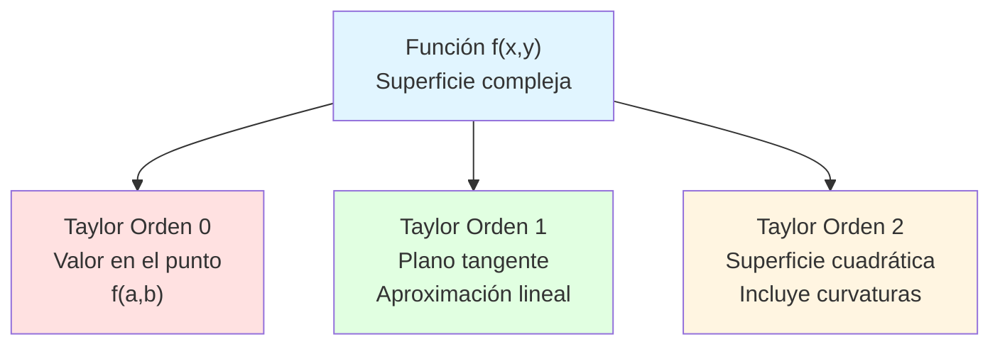
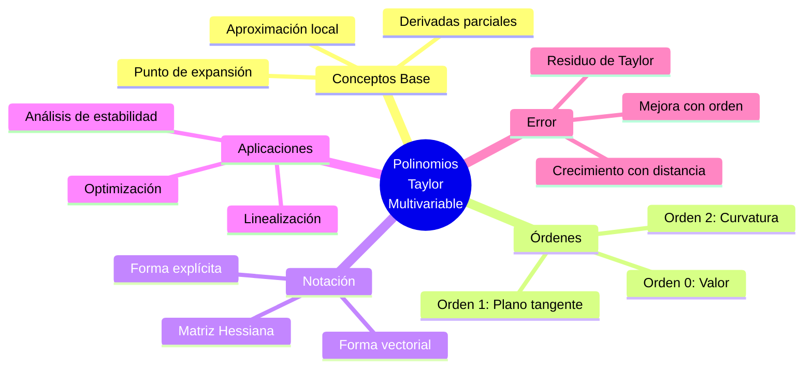

# 📐 Polinomios de Taylor en Varias Variables

## 🎯 Introducción

> [!info]- 💡 ¿Qué son los Polinomios de Taylor en Varias Variables?
> 
> Los **polinomios de Taylor** en varias variables son extensiones del concepto univariado que permiten aproximar funciones de múltiples variables mediante **sumas finitas de términos polinómicos**.
> 
> **Conceptos clave:**
> 
> |Término|Descripción|
> |---|---|
> |**Función multivariable**|f(x, y) o f(x, y, z, ...)|
> |**Punto de expansión**|(a, b) o (a, b, c, ...) donde se centra la aproximación|
> |**Derivadas parciales**|∂f/∂x, ∂f/∂y, ∂²f/∂x², etc.|
> |**Orden del polinomio**|Grado máximo de los términos|
> 
> **Intuición geométrica:**
> 
> Así como en una variable aproximamos una curva con un polinomio, en dos variables aproximamos una **superficie** con un polinomio:
> 
> - Orden 0: Un **plano horizontal** (valor constante)
> - Orden 1: Un **plano inclinado** (tangente)
> - Orden 2: Una **superficie parabólica** (curvatura)

> [!tip]- 🎯 ¿Cuándo Usar Taylor Multivariable?
> 
> **✅ Usa polinomios de Taylor cuando:**
> 
> - Necesitas aproximar funciones complejas localmente
> - Estudias comportamiento cerca de un punto crítico
> - Requieres simplificar cálculos en optimización
> - Analizas estabilidad en sistemas dinámicos
> 
> **❌ No son adecuados cuando:**
> 
> - Necesitas precisión global en todo el dominio
> - La función tiene discontinuidades
> - Estás lejos del punto de expansión
> - Las derivadas no existen o son infinitas

---

## 🗂️ Fórmula General

### 📝 Caso de Dos Variables

> [!example]- 🔨 Polinomio de Taylor de orden n
> 
> Para una función f(x, y) alrededor del punto (a, b):
> 
> **Fórmula completa:**
> 
> $$P_n(x,y) = \sum_{k=0}^{n} \frac{1}{k!} \sum_{j=0}^{k} \binom{k}{j} \frac{\partial^k f}{\partial x^{k-j} \partial y^j}\bigg|_{(a,b)} (x-a)^{k-j}(y-b)^j$$
> 
> **Desglose por órdenes:**
> 
> **Orden 0 (valor en el punto):** $$P_0(x,y) = f(a,b)$$
> 
> **Orden 1 (aproximación lineal - plano tangente):** $$P_1(x,y) = f(a,b) + f_x(a,b)(x-a) + f_y(a,b)(y-b)$$
> 
> **Orden 2 (aproximación cuadrática):** $$\begin{align} P_2(x,y) = f(a,b) &+ f_x(a,b)(x-a) + f_y(a,b)(y-b) \ &+ \frac{1}{2}f_{xx}(a,b)(x-a)^2 \ &+ f_{xy}(a,b)(x-a)(y-b) \ &+ \frac{1}{2}f_{yy}(a,b)(y-b)^2 \end{align}$$
> 
> **Notación de derivadas parciales:**
> 
> - $f_x = \frac{\partial f}{\partial x}$ (primera derivada respecto a x)
> - $f_{xx} = \frac{\partial^2 f}{\partial x^2}$ (segunda derivada respecto a x)
> - $f_{xy} = \frac{\partial^2 f}{\partial x \partial y}$ (derivada mixta)

### 📊 Tabla de Términos por Orden

> [!info]- 📋 Estructura de Términos
> 
> |Orden|Términos|Ejemplo en (x,y)|Interpretación|
> |---|---|---|---|
> |**0**|1 término|f(a,b)|Altura en el punto|
> |**1**|2 términos|+fx·Δx +fy·Δy|Pendiente/dirección|
> |**2**|3 términos|+½fxx·Δx² +fxy·ΔxΔy +½fyy·Δy²|Curvatura|
> |**3**|4 términos|Combinaciones de Δx³, Δx²Δy, ΔxΔy², Δy³|Torsión|
> 
> Donde Δx = (x-a) y Δy = (y-b)

---

## 🛠️ Construcción Paso a Paso

### 📐 Proceso de Cálculo

> [!example]- ✏️ Método para Construir el Polinomio
> 
> **Pasos sistemáticos:**
> 
> 1. **Identificar la función y el punto:**
>     - Función: f(x, y)
>     - Punto de expansión: (a, b)
>     - Orden deseado: n
> 2. **Calcular derivadas parciales:**
>     - Orden 0: f
>     - Orden 1: fx, fy
>     - Orden 2: fxx, fxy, fyy
>     - Orden 3: fxxx, fxxy, fxyy, fyyy
>     - (continuar según el orden)
> 3. **Evaluar en el punto:**
>     - Sustituir (a, b) en cada derivada
> 4. **Ensamblar el polinomio:**
>     - Multiplicar por los incrementos correspondientes
>     - Dividir por los factoriales apropiados
>     - Sumar todos los términos

### 🎯 Ejemplo Completo

> [!example]- 🌟 Aproximación de e^(x+y) en (0,0)
> 
> **Función:** f(x,y) = e^(x+y)
> 
> **Punto:** (a,b) = (0,0)
> 
> **Paso 1: Calcular derivadas**
> 
> Todas las derivadas de e^(x+y) son e^(x+y):
> 
> - f(x,y) = e^(x+y)
> - fx(x,y) = e^(x+y)
> - fy(x,y) = e^(x+y)
> - fxx(x,y) = e^(x+y)
> - fxy(x,y) = e^(x+y)
> - fyy(x,y) = e^(x+y)
> 
> **Paso 2: Evaluar en (0,0)**
> 
> Todas valen: e^(0+0) = 1
> 
> - f(0,0) = 1
> - fx(0,0) = 1
> - fy(0,0) = 1
> - fxx(0,0) = 1
> - fxy(0,0) = 1
> - fyy(0,0) = 1
> 
> **Paso 3: Construir polinomio de orden 2**
> 
> $$\begin{align} P_2(x,y) &= 1 + 1·x + 1·y \ &+ \frac{1}{2}·1·x^2 + 1·xy + \frac{1}{2}·1·y^2 \ &= 1 + x + y + \frac{x^2}{2} + xy + \frac{y^2}{2} \end{align}$$
> 
> **Verificación:**
> 
> |Punto|e^(x+y) exacto|P₂(x,y)|Error|
> |---|---|---|---|
> |(0.1, 0.1)|1.2214|1.22|0.0014|
> |(0.5, 0.5)|2.7183|2.50|0.2183|
> |(1, 1)|7.3891|5.00|2.3891|
> 
> _Nota: El error crece al alejarnos del origen_

> [!example]- 🎨 Aproximación de sen(x)·cos(y) en (0,0)
> 
> **Función:** f(x,y) = sen(x)·cos(y)
> 
> **Derivadas parciales:**
> 
> - f(x,y) = sen(x)·cos(y)
> - fx = cos(x)·cos(y)
> - fy = -sen(x)·sen(y)
> - fxx = -sen(x)·cos(y)
> - fxy = -cos(x)·sen(y)
> - fyy = -sen(x)·cos(y)
> 
> **Evaluación en (0,0):**
> 
> - f(0,0) = sen(0)·cos(0) = 0·1 = 0
> - fx(0,0) = cos(0)·cos(0) = 1·1 = 1
> - fy(0,0) = -sen(0)·sen(0) = 0
> - fxx(0,0) = -sen(0)·cos(0) = 0
> - fxy(0,0) = -cos(0)·sen(0) = 0
> - fyy(0,0) = -sen(0)·cos(0) = 0
> 
> **Polinomio de orden 2:**
> 
> $$P_2(x,y) = 0 + 1·x + 0·y + 0 + 0 + 0 = x$$
> 
> ¡La aproximación de orden 2 es simplemente **x**!
> 
> Para obtener más términos no nulos, necesitaríamos orden 3:
> 
> $$P_3(x,y) = x - \frac{x^3}{6} - \frac{xy^2}{2}$$

---

## 📐 Caso de Tres Variables

### 🌐 Extensión a ℝ³

> [!info]- 🔵 Polinomio de Taylor en f(x,y,z)
> 
> Para tres variables alrededor de (a,b,c):
> 
> **Orden 1:** $$P_1(x,y,z) = f(a,b,c) + f_x·Δx + f_y·Δy + f_z·Δz$$
> 
> **Orden 2:** $$\begin{align} P_2(x,y,z) = f(a,b,c) &+ f_x·Δx + f_y·Δy + f_z·Δz \ &+ \frac{1}{2}f_{xx}·Δx^2 + \frac{1}{2}f_{yy}·Δy^2 + \frac{1}{2}f_{zz}·Δz^2 \ &+ f_{xy}·ΔxΔy + f_{xz}·ΔxΔz + f_{yz}·ΔyΔz \end{align}$$
> 
> Donde:
> 
> - Δx = x - a
> - Δy = y - b
> - Δz = z - c
> 
> **Número de términos:**
> 
> |Orden|Términos en 2D|Términos en 3D|Términos en nD|
> |---|---|---|---|
> |0|1|1|1|
> |1|2|3|n|
> |2|3|6|n(n+1)/2|
> |3|4|10|...|

---

## 🔄 Notación Compacta

### 📊 Forma Vectorial

> [!tip]- 🎯 Notación con Operadores
> 
> **Vector de desplazamiento:** $$\mathbf{h} = \begin{pmatrix} x-a \ y-b \end{pmatrix} = \begin{pmatrix} h_1 \ h_2 \end{pmatrix}$$
> 
> **Gradiente:** $$\nabla f(a,b) = \begin{pmatrix} f_x(a,b) \ f_y(a,b) \end{pmatrix}$$
> 
> **Matriz Hessiana:** $$H_f(a,b) = \begin{pmatrix} f_{xx}(a,b) & f_{xy}(a,b) \ f_{xy}(a,b) & f_{yy}(a,b) \end{pmatrix}$$
> 
> **Polinomio de orden 2 en forma matricial:** $$P_2(\mathbf{x}) = f(\mathbf{a}) + \nabla f(\mathbf{a})^T \mathbf{h} + \frac{1}{2}\mathbf{h}^T H_f(\mathbf{a}) \mathbf{h}$$
> 
> Donde:
> 
> - $\nabla f(\mathbf{a})^T \mathbf{h}$ = término lineal
> - $\mathbf{h}^T H_f(\mathbf{a}) \mathbf{h}$ = término cuadrático

> [!example]- 📐 Ejemplo con Notación Matricial
> 
> Para f(x,y) = x² + xy + 2y² en (1,1):
> 
> **1. Gradiente en (1,1):** $$\nabla f(1,1) = \begin{pmatrix} 2x+y \ x+4y \end{pmatrix}\bigg|_{(1,1)} = \begin{pmatrix} 3 \ 5 \end{pmatrix}$$
> 
> **2. Hessiana en (1,1):** $$H_f(1,1) = \begin{pmatrix} 2 & 1 \ 1 & 4 \end{pmatrix}$$
> 
> **3. Vector desplazamiento:** $$\mathbf{h} = \begin{pmatrix} x-1 \ y-1 \end{pmatrix}$$
> 
> **4. Polinomio de orden 2:** $$\begin{align} P_2(x,y) &= f(1,1) + \begin{pmatrix} 3 & 5 \end{pmatrix} \begin{pmatrix} x-1 \ y-1 \end{pmatrix} \ &+ \frac{1}{2}\begin{pmatrix} x-1 & y-1 \end{pmatrix} \begin{pmatrix} 2 & 1 \ 1 & 4 \end{pmatrix} \begin{pmatrix} x-1 \ y-1 \end{pmatrix} \end{align}$$
> 
> Desarrollando: $$P_2(x,y) = 4 + 3(x-1) + 5(y-1) + (x-1)^2 + (x-1)(y-1) + 2(y-1)^2$$

---

## 🎯 Aplicaciones

### 🔍 Optimización

> [!success]- 📈 Análisis de Puntos Críticos
> 
> **Criterio de la segunda derivada en 2D:**
> 
> En un punto crítico (a,b) donde ∇f(a,b) = 0:
> 
> 1. **Calcular la Hessiana:** $$H = \begin{pmatrix} f_{xx}(a,b) & f_{xy}(a,b) \ f_{xy}(a,b) & f_{yy}(a,b) \end{pmatrix}$$
>     
> 2. **Calcular el determinante:** $$D = f_{xx}·f_{yy} - (f_{xy})^2$$
>     
> 3. **Clasificar:**
>     
> 
> |Condición|Tipo de punto|
> |---|---|
> |D > 0 y fxx > 0|**Mínimo local**|
> |D > 0 y fxx < 0|**Máximo local**|
> |D < 0|**Punto silla**|
> |D = 0|Indeterminado|

> [!example]- 🎲 Ejemplo de Optimización
> 
> **Función:** f(x,y) = x² - 2xy + 3y²
> 
> **Paso 1: Encontrar puntos críticos**
> 
> Derivadas parciales:
> 
> - fx = 2x - 2y = 0
> - fy = -2x + 6y = 0
> 
> Resolviendo: (x,y) = (0,0)
> 
> **Paso 2: Segundas derivadas**
> 
> - fxx = 2
> - fxy = -2
> - fyy = 6
> 
> **Paso 3: Determinante** $$D = (2)(6) - (-2)^2 = 12 - 4 = 8 > 0$$
> 
> Como D > 0 y fxx > 0 → **(0,0) es un mínimo local**
> 
> **Paso 4: Aproximación cuadrática en (0,0)** $$P_2(x,y) = 0 + 0 + 0 + x^2 - 2xy + 3y^2$$
> 
> ¡En este caso el polinomio de Taylor coincide exactamente con f!

### 📊 Linealización de Sistemas

> [!tip]- ⚙️ Aproximación Lineal
> 
> En física e ingeniería, aproximamos sistemas no lineales:
> 
> **Sistema no lineal:** $$\begin{cases} \dot{x} = f(x,y) \ \dot{y} = g(x,y) \end{cases}$$
> 
> **Linealización alrededor de (x₀,y₀):** $$\begin{cases} \dot{x} \approx f(x_0,y_0) + f_x(x_0,y_0)(x-x_0) + f_y(x_0,y_0)(y-y_0) \ \dot{y} \approx g(x_0,y_0) + g_x(x_0,y_0)(x-x_0) + g_y(x_0,y_0)(y-y_0) \end{cases}$$
> 
> **Forma matricial:** $$\begin{pmatrix} \dot{x} \ \dot{y} \end{pmatrix} \approx J(x_0,y_0) \begin{pmatrix} x-x_0 \ y-y_0 \end{pmatrix}$$
> 
> Donde J es la matriz Jacobiana: $$J = \begin{pmatrix} f_x & f_y \ g_x & g_y \end{pmatrix}$$

---

## 🔬 Análisis de Error

### 📏 Residuo de Taylor

> [!warning]- ⚠️ Término de Error
> 
> **Fórmula del residuo (Lagrange):**
> 
> Para un polinomio de orden n, el error está dado por:
> 
> $$R_n(x,y) = f(x,y) - P_n(x,y)$$
> 
> **Cota del error (orden 2):**
> 
> Si existe M tal que todas las terceras derivadas satisfacen |∂³f/∂x^i∂y^j| ≤ M:
> 
> $$|R_2(x,y)| \leq \frac{M}{6}[|x-a|^3 + 3|x-a|^2|y-b| + 3|x-a||y-b|^2 + |y-b|^3]$$
> 
> **Comportamiento del error:**
> 
> - Crece con la distancia al punto de expansión
> - Disminuye con mayor orden del polinomio
> - Depende de las derivadas de la función

> [!example]- 📊 Comparación de Errores
> 
> Para f(x,y) = e^(x+y) en (0,0):
> 
> |Punto|P₁|Error P₁|P₂|Error P₂|
> |---|---|---|---|---|
> |(0.1, 0.1)|1.20|0.021|1.22|0.001|
> |(0.2, 0.2)|1.40|0.092|1.48|0.011|
> |(0.5, 0.5)|2.00|0.718|2.50|0.218|
> 
> _Observación: El error de P₂ es mucho menor que P₁_

---

## ✅ Resumen de Fórmulas Clave

> [!summary]- 📋 Referencia Rápida
> 
> **Polinomio de Taylor orden 1 (2D):** $$P_1(x,y) = f(a,b) + f_x(a,b)(x-a) + f_y(a,b)(y-b)$$
> 
> **Polinomio de Taylor orden 2 (2D):** $$\begin{align} P_2(x,y) = f(a,b) &+ f_x(x-a) + f_y(y-b) \ &+ \frac{1}{2}[f_{xx}(x-a)^2 + 2f_{xy}(x-a)(y-b) + f_{yy}(y-b)^2] \end{align}$$
> 
> **Forma matricial (orden 2):** $$P_2 = f(\mathbf{a}) + \nabla f(\mathbf{a})^T \mathbf{h} + \frac{1}{2}\mathbf{h}^T H \mathbf{h}$$
> 
> **Criterio de optimización:** $$D = f_{xx}·f_{yy} - (f_{xy})^2$$
> 
> | D > 0, fxx > 0 | Mínimo | | D > 0, fxx < 0 | Máximo | | D < 0 | Silla |

---

## 🎓 Ejercicios Propuestos

> [!question]- 💪 Práctica Guiada
> 
> **Ejercicio 1:** Encuentra P₂(x,y) para f(x,y) = x² + y² en (1,1)
> 
> **Ejercicio 2:** Aproxima f(x,y) = ln(1+x+y) en (0,0) hasta orden 2
> 
> **Ejercicio 3:** Clasifica el punto crítico de f(x,y) = x³ - 3xy² en (0,0)
> 
> **Ejercicio 4:** Encuentra el polinomio de Taylor de orden 1 para f(x,y,z) = xyz en (1,1,1)
> 
> **Ejercicio 5:** Estima sen(0.1)·cos(0.1) usando el polinomio de Taylor de orden 2 de f(x,y) = sen(x)·cos(y) en (0,0)

---

## 📊 Resumen Visual

> [!quote]- 💡 Puntos Clave
> 
> - **Aproximación local** = Polinomio simple que imita función compleja
> - **Orden 1** = Plano tangente (mejor aproximación lineal)
> - **Orden 2** = Incluye curvatura (paraboloide)
> - **Hessiana** = Matriz de segundas derivadas
> - **Optimización** = Clasificar puntos críticos con D
> - **Error** = Crece con distancia al centro
> - **Aplicación** = Simplificar problemas no lineales

---

**Tags:** #taylor #multivariable #calculovectorial #derivadasparciales #optimización #hessiana #aproximación #gradiente