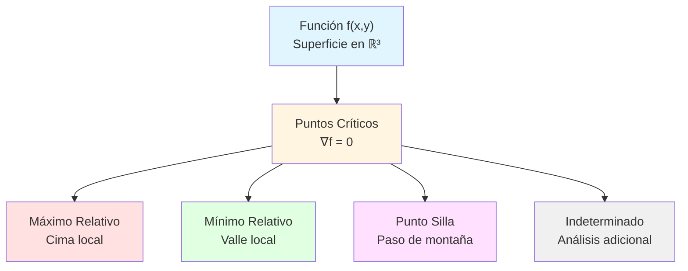
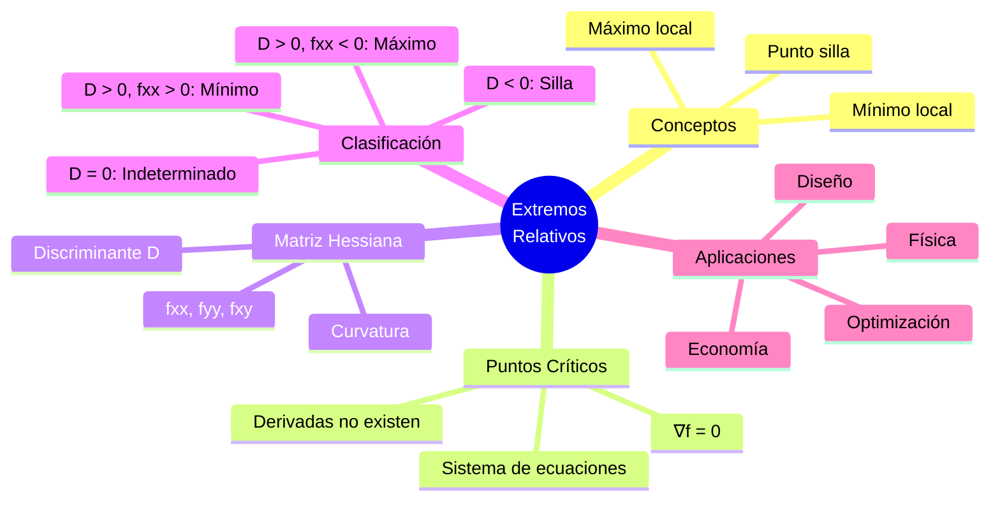

# 🏔️ Extremos Relativos de Funciones Multivariables

## 🎯 Introducción

> [!info]- 💡 ¿Qué son los Extremos Relativos?
> 
> Los **extremos relativos** (o locales) son puntos donde una función alcanza valores máximos o mínimos en comparación con los puntos cercanos. Son fundamentales para optimización y análisis de funciones.
> 
> **Conceptos clave:**
> 
> |Término|Descripción|
> |---|---|
> |**Máximo relativo**|f(a,b) ≥ f(x,y) para todo (x,y) cercano a (a,b)|
> |**Mínimo relativo**|f(a,b) ≤ f(x,y) para todo (x,y) cercano a (a,b)|
> |**Punto crítico**|Punto donde ∇f = 0 o no existe|
> |**Punto silla**|Punto crítico que NO es extremo|
> 
> **Analogía geométrica:**
> 
> Imagina una superficie montañosa:
> 
> - **Máximo relativo** = Cima de una montaña 🏔️
> - **Mínimo relativo** = Fondo de un valle 🏞️
> - **Punto silla** = Paso o puerto de montaña 🛤️ (sube en una dirección, baja en otra)

> [!tip]- 🎯 ¿Por Qué Estudiar Extremos?
> 
> **✅ Aplicaciones prácticas:**
> 
> - **Optimización empresarial**: Maximizar ganancias, minimizar costos
> - **Ingeniería**: Diseño óptimo de estructuras
> - **Física**: Equilibrios y estados de mínima energía
> - **Estadística**: Estimación de parámetros (mínimos cuadrados)
> - **Economía**: Maximización de utilidad
> - **Machine Learning**: Minimización de funciones de pérdida
> 
> **Diferencia clave:**
> 
> |Tipo|Alcance|Ejemplo|
> |---|---|---|
> |**Extremo absoluto**|En todo el dominio|Temperatura más alta del planeta|
> |**Extremo relativo**|En una vecindad|Temperatura más alta de una ciudad|

---

## 🔍 Puntos Críticos

### 📋 Definición

> [!info]- 📐 ¿Qué es un Punto Crítico?
> 
> Un punto **(a, b)** es **crítico** para f(x,y) si:
> 
> **Opción 1: Gradiente nulo** $$\nabla f(a,b) = \mathbf{0}$$
> 
> Es decir: $$\begin{cases} \frac{\partial f}{\partial x}(a,b) = 0 \ \frac{\partial f}{\partial y}(a,b) = 0 \end{cases}$$
> 
> **Opción 2: Derivadas no existen**
> 
> Alguna derivada parcial no existe en (a,b)
> 
> **Interpretación geométrica:**
> 
> En un punto crítico, el **plano tangente** es horizontal (si existe) o no existe.

### 🛠️ Cómo Encontrar Puntos Críticos

> [!example]- ✏️ Procedimiento Estándar
> 
> **Paso 1: Calcular el gradiente** $$\nabla f(x,y) = \left(\frac{\partial f}{\partial x}, \frac{\partial f}{\partial y}\right)$$
> 
> **Paso 2: Igualar a cero** $$\begin{cases} f_x(x,y) = 0 \ f_y(x,y) = 0 \end{cases}$$
> 
> **Paso 3: Resolver el sistema**
> 
> Encontrar todos los pares (x,y) que satisfagan ambas ecuaciones
> 
> **Ejemplo básico:**
> 
> f(x,y) = x² + y² - 2x - 4y + 5
> 
> **Derivadas:**
> 
> - fx = 2x - 2
> - fy = 2y - 4
> 
> **Sistema:** $$\begin{cases} 2x - 2 = 0 \implies x = 1 \ 2y - 4 = 0 \implies y = 2 \end{cases}$$
> 
> **Punto crítico:** (1, 2)

> [!example]- 🎯 Ejemplo con Múltiples Puntos Críticos
> 
> **Función:** f(x,y) = x³ - 3x + y²
> 
> **Paso 1: Derivadas parciales**
> 
> - fx = 3x² - 3
> - fy = 2y
> 
> **Paso 2: Igualar a cero** $$\begin{cases} 3x² - 3 = 0 \ 2y = 0 \end{cases}$$
> 
> **Paso 3: Resolver**
> 
> De la segunda ecuación: y = 0
> 
> De la primera: 3x² = 3 ⟹ x² = 1 ⟹ x = ±1
> 
> **Puntos críticos:** (1, 0) y (-1, 0)

---

## 🎯 Criterio de la Segunda Derivada

### 📊 Matriz Hessiana

> [!info]- 🔢 La Matriz Hessiana
> 
> La **matriz Hessiana** contiene todas las segundas derivadas parciales:
> 
> $$H_f(x,y) = \begin{pmatrix} \frac{\partial^2 f}{\partial x^2} & \frac{\partial^2 f}{\partial x \partial y} \ \frac{\partial^2 f}{\partial y \partial x} & \frac{\partial^2 f}{\partial y^2} \end{pmatrix} = \begin{pmatrix} f_{xx} & f_{xy} \ f_{xy} & f_{yy} \end{pmatrix}$$
> 
> **Propiedades:**
> 
> - Es **simétrica** si f tiene derivadas continuas (fxy = fyx por teorema de Schwarz)
> - Describe la **curvatura** de la superficie
> - Es fundamental para clasificar puntos críticos

### 🔬 Discriminante (Determinante de la Hessiana)

> [!success]- ✅ El Criterio Decisivo
> 
> En un punto crítico (a,b), calculamos:
> 
> $$D(a,b) = \det(H_f(a,b)) = f_{xx}(a,b) \cdot f_{yy}(a,b) - [f_{xy}(a,b)]^2$$
> 
> También escrito como: $$D = f_{xx} \cdot f_{yy} - (f_{xy})^2$$
> 
> **Clasificación del punto crítico (a,b):**
> 
> |Condición|Tipo de extremo|Visualización|
> |---|---|---|
> |**D > 0** y **fxx > 0**|✅ **Mínimo relativo**|Valle (parábola cóncava hacia arriba)|
> |**D > 0** y **fxx < 0**|✅ **Máximo relativo**|Cima (parábola cóncava hacia abajo)|
> |**D < 0**|⚠️ **Punto silla**|Paso de montaña (sube en una dirección, baja en otra)|
> |**D = 0**|❓ **Indeterminado**|Requiere análisis adicional|
> 
> **Nota:** Cuando D > 0, también puedes usar fyy en lugar de fxx para determinar el tipo.

> [!tip]- 💡 Mnemónica del Criterio
> 
> **Recordatorio fácil:**
> 
> 1. **D > 0**: Las dos curvaturas principales tienen el **mismo signo**
>     - Si fxx > 0 → ambas curvaturas positivas → **mínimo** (forma de tazón ∪)
>     - Si fxx < 0 → ambas curvaturas negativas → **máximo** (forma de cúpula ∩)
> 2. **D < 0**: Las curvaturas tienen **signos opuestos**
>     - → **punto silla** (silla de montar 🐴)
> 3. **D = 0**: Las curvaturas están **degeneradas**
>     - → Necesitas métodos alternativos

---

## 🛠️ Procedimiento Completo

### 📋 Pasos para Encontrar y Clasificar Extremos

> [!example]- 🔧 Método Sistemático
> 
> **PASO 1: Encontrar puntos críticos**
> 
> Resolver: $$\begin{cases} f_x(x,y) = 0 \ f_y(x,y) = 0 \end{cases}$$
> 
> **PASO 2: Calcular segundas derivadas**
> 
> Obtener:
> 
> - fxx = ∂²f/∂x²
> - fyy = ∂²f/∂y²
> - fxy = ∂²f/∂x∂y
> 
> **PASO 3: Evaluar la Hessiana en cada punto crítico**
> 
> Para cada punto crítico (a,b): $$D(a,b) = f_{xx}(a,b) \cdot f_{yy}(a,b) - [f_{xy}(a,b)]^2$$
> 
> **PASO 4: Clasificar según el criterio**
> 
> Aplicar la tabla de decisión del discriminante

### 🌟 Ejemplo Completo Desarrollado

> [!example]- 📐 Ejemplo Detallado: f(x,y) = x² + y² - 2x - 4y + 5
> 
> **PASO 1: Puntos críticos**
> 
> Derivadas parciales:
> 
> - fx = 2x - 2
> - fy = 2y - 4
> 
> Sistema: $$\begin{cases} 2x - 2 = 0 \implies x = 1 \ 2y - 4 = 0 \implies y = 2 \end{cases}$$
> 
> **Punto crítico:** (1, 2)
> 
> ---
> 
> **PASO 2: Segundas derivadas**
> 
> - fxx = 2
> - fyy = 2
> - fxy = 0
> 
> ---
> 
> **PASO 3: Discriminante en (1,2)**
> 
> $$D(1,2) = f_{xx} \cdot f_{yy} - (f_{xy})^2 = (2)(2) - (0)^2 = 4$$
> 
> ---
> 
> **PASO 4: Clasificación**
> 
> - D = 4 > 0 ✓
> - fxx = 2 > 0 ✓
> 
> **Conclusión:** ✅ **(1, 2) es un MÍNIMO RELATIVO**
> 
> **Valor en el mínimo:** $$f(1,2) = 1² + 2² - 2(1) - 4(2) + 5 = 1 + 4 - 2 - 8 + 5 = 0$$

> [!example]- 🎨 Ejemplo con Punto Silla: f(x,y) = x² - y²
> 
> **PASO 1: Puntos críticos**
> 
> - fx = 2x = 0 ⟹ x = 0
> - fy = -2y = 0 ⟹ y = 0
> 
> **Punto crítico:** (0, 0)
> 
> ---
> 
> **PASO 2: Segundas derivadas**
> 
> - fxx = 2
> - fyy = -2
> - fxy = 0
> 
> ---
> 
> **PASO 3: Discriminante**
> 
> $$D(0,0) = (2)(-2) - (0)^2 = -4$$
> 
> ---
> 
> **PASO 4: Clasificación**
> 
> - D = -4 < 0 ⚠️
> 
> **Conclusión:** ⚠️ **(0, 0) es un PUNTO SILLA**
> 
> **Interpretación:**
> 
> - En la dirección x: la función sube (parábola x²)
> - En la dirección y: la función baja (parábola -y²)
> - Parece una silla de montar en el origen

> [!example]- 🔥 Ejemplo Complejo: f(x,y) = x³ - 3xy²
> 
> **PASO 1: Puntos críticos**
> 
> Derivadas:
> 
> - fx = 3x² - 3y²
> - fy = -6xy
> 
> Sistema: $$\begin{cases} 3x² - 3y² = 0 \implies x² = y² \ -6xy = 0 \implies x = 0 \text{ o } y = 0 \end{cases}$$
> 
> **Caso 1:** x = 0 ⟹ 0 = y² ⟹ y = 0 **Caso 2:** y = 0 ⟹ x² = 0 ⟹ x = 0
> 
> **Punto crítico único:** (0, 0)
> 
> ---
> 
> **PASO 2: Segundas derivadas**
> 
> - fxx = 6x
> - fyy = -6x
> - fxy = -6y
> 
> ---
> 
> **PASO 3: Evaluar en (0,0)**
> 
> - fxx(0,0) = 0
> - fyy(0,0) = 0
> - fxy(0,0) = 0
> 
> $$D(0,0) = (0)(0) - (0)^2 = 0$$
> 
> ---
> 
> **PASO 4: Clasificación**
> 
> - D = 0 ❓ **INDETERMINADO**
> 
> **Análisis adicional necesario:**
> 
> Evaluemos f en puntos cercanos:
> 
> - f(0.1, 0) = (0.1)³ = 0.001 > 0
> - f(0, 0.1) = 0
> - f(0.1, 0.1) = (0.1)³ - 3(0.1)(0.1)² = 0.001 - 0.003 = -0.002 < 0
> 
> Como hay puntos cercanos con valores mayores Y menores que f(0,0) = 0:
> 
> **Conclusión:** ⚠️ **(0, 0) es un PUNTO SILLA** (confirmado por análisis directo)

---

## 🎯 Casos Especiales

### 🔍 Funciones Cuadráticas

> [!tip]- 📊 Forma Canónica
> 
> Para funciones de la forma: $$f(x,y) = ax² + bxy + cy² + dx + ey + f$$
> 
> **Características:**
> 
> - Tienen **un único punto crítico** (si a ≠ 0 o c ≠ 0)
> - Las segundas derivadas son **constantes**:
>     - fxx = 2a
>     - fyy = 2c
>     - fxy = b
> 
> **Discriminante constante:** $$D = (2a)(2c) - b² = 4ac - b²$$
> 
> **Clasificación inmediata:**
> 
> |Condición|Tipo|
> |---|---|
> |4ac - b² > 0, a > 0|Paraboloide elíptico (mínimo)|
> |4ac - b² > 0, a < 0|Paraboloide elíptico (máximo)|
> |4ac - b² < 0|Paraboloide hiperbólico (silla)|
> |4ac - b² = 0|Degenerado (cilindro parabólico)|

> [!example]- 🎯 Ejemplo Rápido de Cuadrática
> 
> f(x,y) = 2x² + xy + 3y² - 4x - 6y + 10
> 
> Identificar: a = 2, b = 1, c = 3
> 
> **Discriminante:** $$D = 4(2)(3) - 1² = 24 - 1 = 23 > 0$$
> 
> Como D > 0 y a = 2 > 0:
> 
> ✅ **Tiene un único mínimo relativo** (sin necesidad de calcular el punto)

### 🌀 Puntos de Frontera

> [!warning]- ⚠️ Extremos en la Frontera
> 
> **Importante:** El criterio de la segunda derivada solo aplica a **puntos interiores**.
> 
> **Para dominios acotados:**
> 
> Si f está definida en una región cerrada y acotada D:
> 
> 1. **Extremos absolutos** pueden ocurrir en:
>     - Puntos críticos interiores
>     - Puntos de la frontera ∂D
> 2. **Método de análisis:**
>     - Encontrar extremos relativos en el interior
>     - Analizar la frontera por separado (usando multiplicadores de Lagrange o parametrización)
>     - Comparar todos los valores candidatos
> 
> **Ejemplo:**
> 
> f(x,y) = x² + y² en el disco x² + y² ≤ 4
> 
> - **Interior:** Mínimo en (0,0) con f(0,0) = 0
> - **Frontera:** Máximo en cualquier punto (x,y) con x² + y² = 4, donde f = 4

---

## 📐 Extensión a Tres Variables

### 🌐 Funciones f(x,y,z)

> [!info]- 🔵 Generalización a ℝ³
> 
> **Punto crítico en 3D:** $$\nabla f(a,b,c) = \mathbf{0} \iff \begin{cases} f_x(a,b,c) = 0 \ f_y(a,b,c) = 0 \ f_z(a,b,c) = 0 \end{cases}$$
> 
> **Matriz Hessiana 3×3:** $$H_f = \begin{pmatrix} f_{xx} & f_{xy} & f_{xz} \ f_{xy} & f_{yy} & f_{yz} \ f_{xz} & f_{yz} & f_{zz} \end{pmatrix}$$
> 
> **Criterio de clasificación:**
> 
> Se usan los **menores principales** de la Hessiana:
> 
> - D₁ = fxx
> - D₂ = det$\begin{pmatrix} f_{xx} & f_{xy} \ f_{xy} & f_{yy} \end{pmatrix}$ = fxx·fyy - (fxy)²
> - D₃ = det(H) = determinante completo
> 
> |Condición|Tipo|
> |---|---|
> |D₁ > 0, D₂ > 0, D₃ > 0|**Mínimo relativo**|
> |D₁ < 0, D₂ > 0, D₃ < 0|**Máximo relativo**|
> |Signos alternados diferentes|**Punto silla**|

> [!example]- 📊 Ejemplo en 3D
> 
> f(x,y,z) = x² + 2y² + 3z²
> 
> **Punto crítico:**
> 
> - fx = 2x = 0 ⟹ x = 0
> - fy = 4y = 0 ⟹ y = 0
> - fz = 6z = 0 ⟹ z = 0
> 
> Punto: (0,0,0)
> 
> **Hessiana:** $$H = \begin{pmatrix} 2 & 0 & 0 \ 0 & 4 & 0 \ 0 & 0 & 6 \end{pmatrix}$$
> 
> **Menores:**
> 
> - D₁ = 2 > 0
> - D₂ = 2·4 - 0 = 8 > 0
> - D₃ = 2·4·6 = 48 > 0
> 
> ✅ **(0,0,0) es MÍNIMO RELATIVO**

---

## 🎯 Aplicaciones Prácticas

### 💰 Optimización de Beneficios

> [!example]- 📈 Problema de Maximización de Ganancias
> 
> **Contexto:** Una empresa produce dos productos P₁ y P₂.
> 
> **Función de beneficio:** $$B(x,y) = -2x² - 3y² + 4xy + 20x + 30y - 100$$
> 
> Donde:
> 
> - x = cantidad de P₁ (en miles)
> - y = cantidad de P₂ (en miles)
> 
> **Objetivo:** Maximizar B(x,y)
> 
> ---
> 
> **Solución:**
> 
> **Paso 1: Puntos críticos**
> 
> - Bx = -4x + 4y + 20 = 0
> - By = -6y + 4x + 30 = 0
> 
> Sistema: $$\begin{cases} -4x + 4y = -20 \implies -x + y = -5 \ 4x - 6y = -30 \implies 2x - 3y = -15 \end{cases}$$
> 
> De la primera: y = x - 5
> 
> Sustituyendo: 2x - 3(x-5) = -15 $$2x - 3x + 15 = -15$$ $$-x = -30 \implies x = 30$$
> 
> Entonces: y = 30 - 5 = 25
> 
> **Punto crítico:** (30, 25)
> 
> ---
> 
> **Paso 2: Clasificación**
> 
> - Bxx = -4
> - Byy = -6
> - Bxy = 4
> 
> $$D = (-4)(-6) - (4)² = 24 - 16 = 8 > 0$$
> 
> Como D > 0 y Bxx = -4 < 0:
> 
> ✅ **(30, 25) es un MÁXIMO RELATIVO**
> 
> ---
> 
> **Interpretación:**
> 
> - Producir **30,000 unidades de P₁**
> - Producir **25,000 unidades de P₂**
> - Beneficio máximo: B(30,25) = -2(900) - 3(625) + 4(750) + 600 + 750 - 100 = **675 mil dólares**

### 🏗️ Diseño Óptimo

> [!example]- 📦 Minimización de Costos de Material
> 
> **Problema:** Diseñar una caja rectangular abierta (sin tapa) con volumen 32 m³ que minimice el área de material.
> 
> **Variables:**
> 
> - x = largo (m)
> - y = ancho (m)
> - z = alto (m)
> 
> **Restricción:** xyz = 32 ⟹ z = 32/(xy)
> 
> **Función a minimizar (área de material):** $$A(x,y) = xy + 2xz + 2yz = xy + 2x\frac{32}{xy} + 2y\frac{32}{xy} = xy + \frac{64}{y} + \frac{64}{x}$$
> 
> ---
> 
> **Solución:**
> 
> **Derivadas:** $$A_x = y - \frac{64}{x²}$$ $$A_y = x - \frac{64}{y²}$$
> 
> **Sistema:** $$\begin{cases} y = \frac{64}{x²} \ x = \frac{64}{y²} \end{cases}$$
> 
> Sustituyendo la primera en la segunda: $$x = \frac{64}{\left(\frac{64}{x²}\right)²} = \frac{64x⁴}{64²} = \frac{x⁴}{64}$$
> 
> $$64x = x⁴ \implies x³ = 64 \implies x = 4$$
> 
> Entonces: y = 64/16 = 4
> 
> Y: z = 32/(4·4) = 2
> 
> **Verificar que es mínimo:**
> 
> - Axx = 128/x³ = 128/64 = 2
> - Ayy = 128/y³ = 2
> - Axy = 1
> 
> $$D = (2)(2) - (1)² = 3 > 0$$
> 
> Como D > 0 y Axx > 0: ✅ **Es un MÍNIMO**
> 
> **Respuesta:** Caja de 4m × 4m × 2m

---

## ⚠️ Errores Comunes

> [!warning]- 🚫 Errores Frecuentes a Evitar
> 
> **1. Olvidar verificar TODOS los puntos críticos**
> 
> ❌ Incorrecto: Encontrar un punto crítico y asumir que es el único
> 
> ✅ Correcto: Resolver completamente el sistema y verificar todas las soluciones
> 
> ---
> 
> **2. Confundir el signo del criterio**
> 
> ❌ Incorrecto: D > 0 y fxx < 0 ⟹ mínimo
> 
> ✅ Correcto: D > 0 y fxx < 0 ⟹ máximo
> 
> ---
> 
> **3. Ignorar puntos donde las derivadas no existen**
> 
> ❌ Incorrecto: Solo buscar donde ∇f = 0
> 
> ✅ Correcto: También considerar discontinuidades o puntos angulosos
> 
> ---
> 
> **4. Calcular mal el discriminante**
> 
> ❌ Incorrecto: D = fxx + fyy - fxy
> 
> ✅ Correcto: D = fxx · fyy - (fxy)²
> 
> ---
> 
> **5. Asumir que D = 0 significa que no hay extremo**
> 
> ❌ Incorrecto: "D = 0, entonces no es extremo"
> 
> ✅ Correcto: "D = 0 requiere análisis adicional" (podría ser extremo o silla)
> 
> ---
> 
> **6. No verificar el dominio**
> 
> ❌ Incorrecto: Ignorar restricciones del problema
> 
> ✅ Correcto: Verificar que los puntos críticos están en el dominio válido

---

## ✅ Resumen de Fórmulas

> [!summary]- 📋 Referencia Rápida
> 
> **Condición de punto crítico:** $$\nabla f(a,b) = \mathbf{0} \iff \begin{cases} f_x(a,b) = 0 \ f_y(a,b) = 0 \end{cases}$$
> 
> **Matriz Hessiana:** $$H_f = \begin{pmatrix} f_{xx} & f_{xy} \ f_{xy} & f_{yy} \end{pmatrix}$$
> 
> **Discriminante:** $$D = f_{xx} \cdot f_{yy} - (f_{xy})^2$$
> 
> **Criterio de clasificación:**
> 
| Condición             | Clasificación        |
|----------------------|----------------------|
| D > 0, fxx > 0       | ✅ Mínimo relativo   |
| D > 0, fxx < 0       | ✅ Máximo relativo   |
| D < 0                | ⚠️ Punto silla      |
| D = 0                | ❓ Indeterminado     |
> 
> **Procedimiento:**
> 1. Encontrar puntos críticos (∇f = 0)
> 2. Calcular segundas derivadas
> 3. Evaluar D en cada punto crítico
> 4. Clasificar según la tabla

---

## 🎓 Ejercicios Propuestos

> [!question]- 💪 Práctica
> 
> **Ejercicio 1:** Encuentra y clasifica los extremos de f(x,y) = x² + y² + 2x - 4y + 1
> 
> **Ejercicio 2:** Determina los puntos críticos de f(x,y) = xy - x² - y² y clasifícalos
> 
> **Ejercicio 3:** Encuentra el punto más cercano al origen sobre la superficie z = x² + y² - 4x - 6y + 13
> 
> **Ejercicio 4:** Clasifica el punto crítico de f(x,y) = x⁴ + y⁴ - 4xy en (1,1)
> 
> **Ejercicio 5:** Una caja rectangular sin tapa debe tener área superficial de 48 m². Encuentra las dimensiones que maximizan el volumen
> 
> **Ejercicio 6:** Analiza f(x,y) = x³ + y³ - 3xy en busca de extremos relativos

---

## 📊 Resumen Visual

> [!quote]- 💡 Puntos Clave
> 
> - **Punto crítico** = Donde el gradiente se anula o no existe
> - **Hessiana** = Matriz de segundas derivadas (curvatura)
> - **Discriminante D** = Criterio decisivo de clasificación
> - **D > 0** = Mismo signo de curvatura → extremo
> - **D < 0** = Signos opuestos → punto silla
> - **Verificar siempre** = Resolver sistema completo y evaluar todos los candidatos
> - **Aplicación práctica** = Optimización en ciencia e ingeniería

---

**Tags:** #extremos #optimización #calculovectorial #hessiana #puntoscríticos #máximos #mínimos #puntosilla #gradiente #derivadasparciales