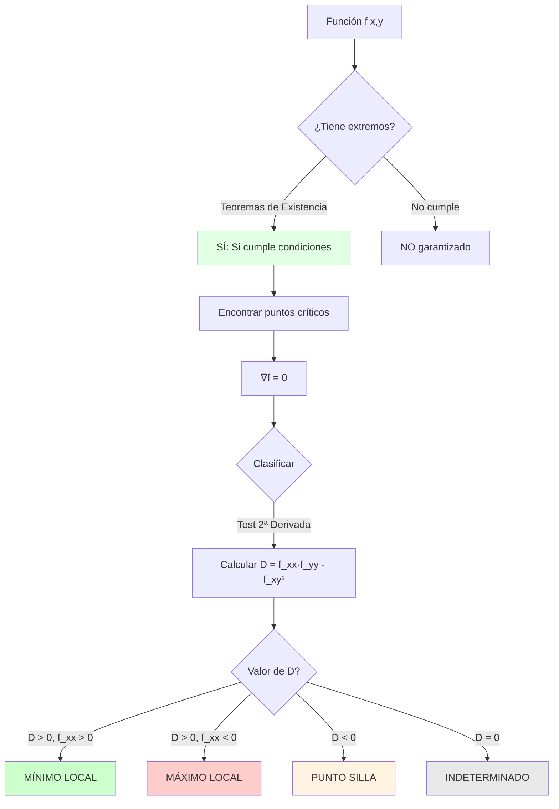

# 📐 Teoremas de Existencia y Clasificación de Extremos

## 🎯 Introducción

> [!info]- 💡 ¿Qué son los Teoremas de Existencia y Clasificación?
> 
> Los **teoremas de existencia** garantizan que una función tiene extremos bajo ciertas condiciones, mientras que los **criterios de clasificación** nos permiten determinar si un punto crítico es máximo, mínimo o punto silla.
> 
> **Analogía práctica:** Imagina buscar el punto más alto en un terreno montañoso:
> 
> - Los **teoremas de existencia** te aseguran que existe una cima (si el terreno es compacto)
> - Los **criterios de clasificación** te dicen si realmente llegaste a la cima o solo a una meseta
> - El **método del discriminante** es como analizar las pendientes alrededor del punto
> 
> **¿Por qué es importante?**
> 
> |Aspecto|Descripción|Ejemplo de Uso|
> |---|---|---|
> |**Optimización**|Encontrar valores óptimos|Maximizar ganancias|
> |**Análisis de funciones**|Caracterizar comportamiento|Estudiar superficies|
> |**Ingeniería**|Diseño óptimo|Minimizar costos de materiales|
> |**Economía**|Equilibrio de mercado|Maximizar utilidad|
> |**Física**|Estados de equilibrio|Energía potencial mínima|



---

## 📚 Teoremas de Existencia

### 🔷 Teorema del Valor Extremo (Weierstrass)

> [!note]- 🎯 Garantía de Existencia
> 
> **Teorema del Valor Extremo:**
> 
> Si $f(x,y)$ es una función **continua** en un conjunto **cerrado y acotado** (compacto) $D \subseteq \mathbb{R}^2$, entonces:
> 
> 1. $f$ alcanza un **valor máximo absoluto** en algún punto de $D$
> 2. $f$ alcanza un **valor mínimo absoluto** en algún punto de $D$
> 
> **Condiciones necesarias:**
> 
> |Condición|Significado|Ejemplo|
> |---|---|---|
> |**Continua**|Sin saltos ni discontinuidades|$f(x,y) = x^2+y^2$ ✓|
> |**Cerrada**|Incluye su frontera|$x^2+y^2 \leq 1$ ✓|
> |**Acotada**|Contenida en un círculo finito|$\|x\|, \|y\| \leq M$ ✓|
> 
> **Ejemplo visual:**
> 
> ```mermaid
> graph LR
>     A[Región D] --> B{¿Cerrada y acotada?}
>     B -->|SÍ| C[Compacta]
>     B -->|NO| D[No compacta]
>     
>     A --> E{¿f continua?}
>     E -->|SÍ| F[Cumple condiciones]
>     E -->|NO| G[No aplica teorema]
>     
>     C --> H{f continua?}
>     F --> H
>     H -->|SÍ| I[✓ EXISTEN extremos absolutos]
>     H -->|NO| J[✗ No garantizado]
>     
>     style I fill:#e1ffe1
>     style J fill:#ffe1e1
> ```
> 
> **Ejemplos:**
> 
> **✓ Aplica el teorema:**
> 
> - $f(x,y) = x^2+y^2$ en $D: x^2+y^2 \leq 4$
> - $f(x,y) = \sin(x)\cos(y)$ en $D: [0,\pi] \times [0,\pi]$
> 
> **✗ NO aplica:**
> 
> - $f(x,y) = x^2+y^2$ en $\mathbb{R}^2$ (no acotada)
> - $f(x,y) = \frac{1}{x^2+y^2}$ en $x^2+y^2 < 1$ (no continua en el origen)
> - $f(x,y) = x^2+y^2$ en $x^2+y^2 < 1$ (no cerrada, falta la frontera)

### 🎨 Localización de Extremos

> [!success]- 📍 Dónde Buscar
> 
> **Teorema de localización:**
> 
> Si $f$ tiene un extremo local en un punto interior de su dominio donde $f$ es diferenciable, entonces ese punto es un **punto crítico**.
> 
> **Los extremos pueden ocurrir en:**
> 
> 1. **Puntos críticos interiores:** $\nabla f = \mathbf{0}$
> 2. **Puntos donde $\nabla f$ no existe**
> 3. **Puntos en la frontera** del dominio
> 
> **Estrategia de búsqueda:**
> 
> ```mermaid
> flowchart TD
>     A[Buscar extremos de f en D] --> B[1. Puntos críticos interiores]
>     B --> C[Resolver ∇f = 0]
>     
>     A --> D[2. Puntos singulares]
>     D --> E[Donde ∇f no existe]
>     
>     A --> F[3. Frontera de D]
>     F --> G[Usar restricciones o<br/>parametrización]
>     
>     C --> H[Clasificar con<br/>test de 2ª derivada]
>     E --> H
>     G --> I[Comparar valores]
>     H --> I
>     
>     I --> J[Extremos absolutos]
>     
>     style A fill:#e1f5ff
>     style H fill:#fff4e1
>     style J fill:#e1ffe1
> ```

---

## 🔍 Clasificación de Puntos Críticos

### 📊 Test de la Segunda Derivada (Criterio del Hessiano)

> [!example]- 🎯 Método Principal
> 
> **Definición del Hessiano:**
> 
> Para $f(x,y)$, la **matriz Hessiana** es:
> 
> $$H(x,y) = \begin{pmatrix} f_{xx} & f_{xy} \ f_{xy} & f_{yy} \end{pmatrix}$$
> 
> **Discriminante (Determinante del Hessiano):**
> 
> $$D(x,y) = \det(H) = f_{xx}f_{yy} - (f_{xy})^2$$
> 
> **Criterio de clasificación en $(a,b)$:**
> 
> |Condición|Clasificación|
> |---|---|
> |$D(a,b) > 0$ y $f_{xx}(a,b) > 0$|**Mínimo local**|
> |$D(a,b) > 0$ y $f_{xx}(a,b) < 0$|**Máximo local**|
> |$D(a,b) < 0$|**Punto silla**|
> |$D(a,b) = 0$|**Indeterminado** (requiere análisis adicional)|
> 
> **Nota:** Cuando $D > 0$, también se puede usar $f_{yy}$ en lugar de $f_{xx}$.
> 
> **Interpretación geométrica:**
> 
> ```mermaid
> graph TD
>     A[Punto crítico a,b] --> B[Calcular D]
>     B --> C{D > 0?}
>     
>     C -->|SÍ| D{f_xx > 0?}
>     D -->|SÍ| E[⬇️ MÍNIMO<br/>Paraboloide hacia arriba]
>     D -->|NO| F[⬆️ MÁXIMO<br/>Paraboloide hacia abajo]
>     
>     C -->|NO D < 0| G[🏔️ PUNTO SILLA<br/>Superficie tipo silla]
>     
>     C -->|D = 0| H[❓ INDETERMINADO<br/>Análisis adicional]
>     
>     style E fill:#ccffcc
>     style F fill:#ffcccc
>     style G fill:#fff4e1
>     style H fill:#e8e8e8
> ```
> 
> **Ejemplo detallado:**
> 
> Sea $f(x,y) = x^3 - 3x + y^2$. Clasificar los puntos críticos.
> 
> **Paso 1: Encontrar puntos críticos**
> 
> $$\nabla f = \langle 3x^2 - 3, 2y \rangle = \langle 0, 0 \rangle$$
> 
> $$3x^2 - 3 = 0 \Rightarrow x^2 = 1 \Rightarrow x = \pm 1$$ $$2y = 0 \Rightarrow y = 0$$
> 
> Puntos críticos: $(1, 0)$ y $(-1, 0)$
> 
> **Paso 2: Calcular segundas derivadas**
> 
> $$f_{xx} = 6x, \quad f_{yy} = 2, \quad f_{xy} = 0$$
> 
> **Paso 3: Discriminante**
> 
> $$D = f_{xx}f_{yy} - (f_{xy})^2 = (6x)(2) - 0^2 = 12x$$
> 
> **En $(1, 0)$:**
> 
> $$D(1,0) = 12(1) = 12 > 0$$ $$f_{xx}(1,0) = 6(1) = 6 > 0$$
> 
> **Conclusión:** $(1,0)$ es un **MÍNIMO LOCAL** ✓
> 
> **En $(-1, 0)$:**
> 
> $$D(-1,0) = 12(-1) = -12 < 0$$
> 
> **Conclusión:** $(-1,0)$ es un **PUNTO SILLA** ✓

### 🎯 Casos Especiales

> [!tip]- ⚠️ Cuando D = 0
> 
> Cuando $D = 0$, el test es **inconcluso**. Se requieren métodos adicionales:
> 
> **Métodos alternativos:**
> 
> 1. **Análisis de curvas de nivel**
> 2. **Desarrollo de Taylor de orden superior**
> 3. **Análisis direccional**
> 4. **Gráfica de la función**
> 
> **Ejemplo:** $f(x,y) = x^4 + y^4$
> 
> En el origen:
> 
> $$f_x = 4x^3 = 0, \quad f_y = 4y^3 = 0$$
> 
> Punto crítico: $(0,0)$
> 
> $$f_{xx} = 12x^2 \Big|_{(0,0)} = 0$$ $$f_{yy} = 12y^2 \Big|_{(0,0)} = 0$$ $$f_{xy} = 0$$
> 
> $$D = 0 \cdot 0 - 0^2 = 0$$ (inconcluso)
> 
> **Análisis directo:**
> 
> Como $f(x,y) = x^4 + y^4 \geq 0$ para todo $(x,y)$ y $f(0,0) = 0$:
> 
> **Conclusión:** $(0,0)$ es un **MÍNIMO GLOBAL** ✓
> 
> (El test falló, pero el análisis directo funciona)

---

## 🧮 Ejemplos Resueltos Completos

### 📝 Ejemplo 1: Paraboloide

> [!example]- 🎪 Función Cuadrática
> 
> Encontrar y clasificar los extremos de:
> 
> $$f(x,y) = x^2 + y^2 - 4x + 6y + 13$$
> 
> **Solución:**
> 
> **Paso 1: Encontrar puntos críticos**
> 
> $$\frac{\partial f}{\partial x} = 2x - 4 = 0 \Rightarrow x = 2$$
> 
> $$\frac{\partial f}{\partial y} = 2y + 6 = 0 \Rightarrow y = -3$$
> 
> Punto crítico: $(2, -3)$
> 
> **Paso 2: Segundas derivadas**
> 
> $$f_{xx} = 2, \quad f_{yy} = 2, \quad f_{xy} = 0$$
> 
> **Paso 3: Discriminante**
> 
> $$D = f_{xx}f_{yy} - (f_{xy})^2 = (2)(2) - 0^2 = 4 > 0$$
> 
> $$f_{xx} = 2 > 0$$
> 
> **Conclusión:** $(2, -3)$ es un **MÍNIMO LOCAL** ✓
> 
> **Paso 4: Valor del mínimo**
> 
> $$f(2,-3) = 4 + 9 - 8 - 18 + 13 = 0$$
> 
> **Verificación por completar cuadrados:**
> 
> $$f(x,y) = (x-2)^2 + (y+3)^2$$
> 
> Claramente $f(x,y) \geq 0$ con mínimo en $(2,-3)$. ✓
> 
> **Respuesta:** Mínimo local (y global) de valor 0 en $(2, -3)$

### 📝 Ejemplo 2: Función con Punto Silla

> [!example]- 🏔️ Superficie Tipo Silla
> 
> Encontrar y clasificar extremos de:
> 
> $$f(x,y) = x^2 - y^2$$
> 
> **Solución:**
> 
> **Paso 1: Puntos críticos**
> 
> $$f_x = 2x = 0 \Rightarrow x = 0$$ $$f_y = -2y = 0 \Rightarrow y = 0$$
> 
> Punto crítico: $(0, 0)$
> 
> **Paso 2: Segundas derivadas**
> 
> $$f_{xx} = 2, \quad f_{yy} = -2, \quad f_{xy} = 0$$
> 
> **Paso 3: Discriminante**
> 
> $$D = (2)(-2) - 0^2 = -4 < 0$$
> 
> **Conclusión:** $(0,0)$ es un **PUNTO SILLA** ✓
> 
> **Interpretación geométrica:**
> 
> - A lo largo de $y=0$: $f(x,0) = x^2$ (parábola hacia arriba → mínimo)
> - A lo largo de $x=0$: $f(0,y) = -y^2$ (parábola hacia abajo → máximo)
> 
> El punto es mínimo en una dirección y máximo en otra: **punto silla**.
> 
> **Respuesta:** Punto silla en $(0, 0)$

### 📝 Ejemplo 3: Múltiples Puntos Críticos

> [!example]- 🎢 Función Compleja
> 
> Encontrar y clasificar extremos de:
> 
> $$f(x,y) = x^3 + y^3 - 3xy$$
> 
> **Solución:**
> 
> **Paso 1: Puntos críticos**
> 
> $$f_x = 3x^2 - 3y = 0 \Rightarrow x^2 = y$$ $$f_y = 3y^2 - 3x = 0 \Rightarrow y^2 = x$$
> 
> Sustituir la primera en la segunda:
> 
> $$(x^2)^2 = x \Rightarrow x^4 = x \Rightarrow x^4 - x = 0$$
> 
> $$x(x^3 - 1) = 0 \Rightarrow x = 0 \text{ o } x = 1$$
> 
> - Si $x = 0$: $y = 0^2 = 0$ → $(0,0)$
> - Si $x = 1$: $y = 1^2 = 1$ → $(1,1)$
> 
> Puntos críticos: $(0,0)$ y $(1,1)$
> 
> **Paso 2: Segundas derivadas**
> 
> $$f_{xx} = 6x, \quad f_{yy} = 6y, \quad f_{xy} = -3$$
> 
> $$D = f_{xx}f_{yy} - (f_{xy})^2 = (6x)(6y) - 9 = 36xy - 9$$
> 
> **En $(0,0)$:**
> 
> $$D(0,0) = 36(0)(0) - 9 = -9 < 0$$
> 
> **Conclusión:** $(0,0)$ es un **PUNTO SILLA** ✓
> 
> **En $(1,1)$:**
> 
> $$D(1,1) = 36(1)(1) - 9 = 27 > 0$$ $$f_{xx}(1,1) = 6(1) = 6 > 0$$
> 
> **Conclusión:** $(1,1)$ es un **MÍNIMO LOCAL** ✓
> 
> **Valor del mínimo:**
> 
> $$f(1,1) = 1 + 1 - 3 = -1$$
> 
> **Respuesta:**
> 
> - Punto silla en $(0,0)$
> - Mínimo local de valor $-1$ en $(1,1)$

---

## 📊 Tabla Resumen de Clasificación

|$D$|$f_{xx}$|Clasificación|Forma geométrica|
|---|---|---|---|
|$> 0$|$> 0$|**Mínimo local**|Paraboloide hacia arriba ⬆️|
|$> 0$|$< 0$|**Máximo local**|Paraboloide hacia abajo ⬇️|
|$< 0$|cualquiera|**Punto silla**|Superficie tipo silla 🏔️|
|$= 0$|cualquiera|**Indeterminado**|Requiere análisis adicional ❓|

---

## ✅ Proceso Sistemático

> [!success]- 📋 Algoritmo Completo
> 
> **Para encontrar y clasificar extremos de $f(x,y)$:**
> 
> ```mermaid
> flowchart TD
>     A[Función f x,y] --> B[1. Calcular ∇f = f_x, f_y]
>     B --> C[2. Resolver ∇f = 0]
>     C --> D[3. Puntos críticos a,b]
>     
>     D --> E[4. Calcular f_xx, f_yy, f_xy]
>     E --> F[5. Calcular D = f_xx·f_yy - f_xy²]
>     
>     F --> G{6. Evaluar D a,b}
>     
>     G -->|D > 0| H{f_xx > 0?}
>     H -->|SÍ| I[✓ MÍNIMO]
>     H -->|NO| J[✓ MÁXIMO]
>     
>     G -->|D < 0| K[✓ PUNTO SILLA]
>     
>     G -->|D = 0| L[❓ INDETERMINADO<br/>Análisis adicional]
>     
>     I --> M[7. Calcular f a,b]
>     J --> M
>     K --> M
>     
>     style A fill:#e1f5ff
>     style D fill:#fff4e1
>     style I fill:#ccffcc
>     style J fill:#ffcccc
>     style K fill:#ffffcc
>     style L fill:#e8e8e8
> ```
> 
> **Checklist:**
> 
> - [ ] Verificar que $f$ es diferenciable
> - [ ] Encontrar todos los puntos críticos
> - [ ] Calcular las segundas derivadas parciales
> - [ ] Evaluar el discriminante en cada punto
> - [ ] Clasificar según el criterio
> - [ ] Calcular los valores de la función
> - [ ] Considerar la frontera si el dominio es acotado

---

## 🎓 Ejercicios Propuestos

> [!example]- 💪 Práctica Progresiva
> 
> **Nivel Básico:**
> 
> 1. $f(x,y) = x^2 + 2y^2 - 4x + 8y + 1$
>     
> 2. $f(x,y) = x^2 - y^2 + 2x - 4y$
>     
> 3. $f(x,y) = xy$
>     
> 
> **Nivel Intermedio:**
> 
> 4. $f(x,y) = x^3 - 12xy + 8y^3$
>     
> 5. $f(x,y) = e^{-(x^2+y^2)}(x^2+2y^2)$
>     
> 6. $f(x,y) = (x^2+y^2)e^{-x^2-y^2}$
>     
> 
> **Nivel Avanzado:**
> 
> 7. $f(x,y) = x^4 + y^4 - 4xy + 1$
>     
> 8. $f(x,y) = \sin x + \sin y + \sin(x+y)$ en $[0,2\pi] \times [0,2\pi]$
>     
> 9. $f(x,y) = (x^2+y^2)^2 - 2(x^2-y^2)$
>     
> 
> **Desafío:**
> 
> 10. Demostrar que si $D=0$ y las derivadas de tercer orden son todas cero, entonces se necesita analizar las derivadas de cuarto orden.

---

## 🔗 Conexión con Próximos Temas

> [!quote]- 🌟 Continuando el Aprendizaje
> 
> **Has dominado:**
> 
> - ✅ Teoremas de existencia de extremos
> - ✅ Criterio de la segunda derivada
> - ✅ Clasificación de puntos críticos
> - ✅ Cálculo del discriminante
> 
> **Próximos pasos:**
> 
> |Tema Actual|Siguiente Tema|Conexión|
> |---|---|---|
> |Extremos sin restricciones|**Multiplicadores de Lagrange**|Con restricciones|
> |Test de segunda derivada|**Optimización con restricciones**|Problemas aplicados|
> |Puntos críticos|**Análisis de frontera**|Extremos absolutos|
> |Clasificación local|**Optimización global**|Máximos y mínimos absolutos|
> 
> **Roadmap:**
> 
> ```mermaid
> graph LR
>     A[Teoremas de<br/>Existencia y<br/>Clasificación] --> B[Multiplicadores<br/>de Lagrange]
>     B --> C[Optimización<br/>Restringida]
>     C --> D[Aplicaciones<br/>Prácticas]
>     
>     A -.-> E[Análisis de<br/>Frontera]
>     E -.-> F[Optimización<br/>Global]
>     
>     style A fill:#e1ffe1
>     style B fill:#fff4e1
>     style C fill:#e1f5ff
>     style D fill:#f0e1ff
> ```

---

**Tags:** #cálculo-multivariable #extremos #teorema-existencia #clasificación #hessiano #discriminante #puntos-críticos #optimización #segunda-derivada #punto-silla