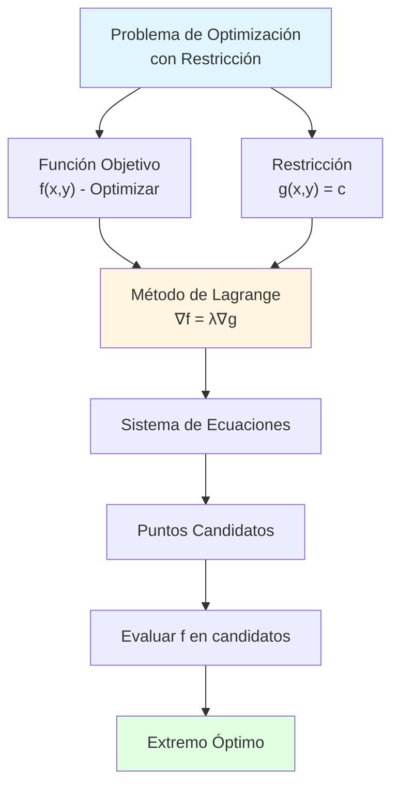
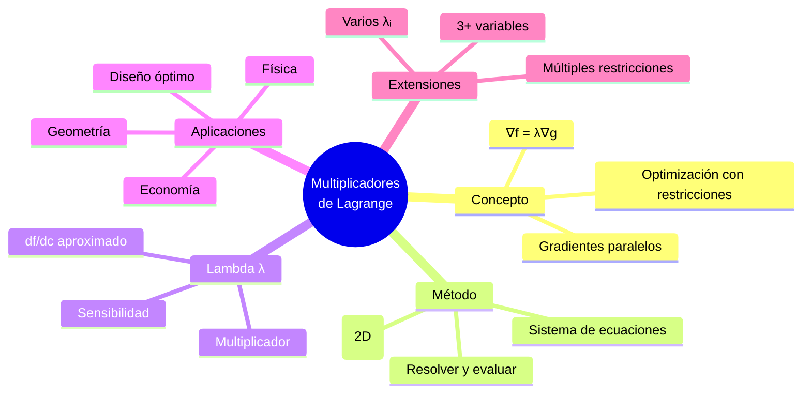

# 🎯 Multiplicadores de Lagrange

## 🎯 Introducción

> [!info]- 💡 ¿Qué son los Multiplicadores de Lagrange?
> 
> Los **multiplicadores de Lagrange** son un método poderoso para encontrar extremos de funciones **sujetas a restricciones**. Resuelven problemas de optimización donde no podemos movernos libremente, sino que debemos permanecer sobre una curva o superficie.
> 
> **Conceptos clave:**
> 
> |Término|Descripción|
> |---|---|
> |**Función objetivo**|f(x,y) o f(x,y,z) - lo que queremos optimizar|
> |**Restricción**|g(x,y) = c - condición que debe cumplirse|
> |**Multiplicador λ (lambda)**|Parámetro auxiliar que relaciona gradientes|
> |**Lagrangiano**|L = f - λ(g - c) - función auxiliar|
> 
> **Problema tipo:**
> 
> ```
> Maximizar/Minimizar: f(x,y)
> Sujeto a: g(x,y) = c
> ```
> 
> **Idea geométrica:**
> 
> En el extremo, el gradiente de f es **paralelo** al gradiente de g: $$\nabla f = \lambda \nabla g$$



> [!tip]- 🎯 ¿Cuándo Usar Multiplicadores de Lagrange?
> 
> **✅ Usa este método cuando:**
> 
> - Tienes una función objetivo f a optimizar
> - Existe una restricción explícita g(x,y) = c
> - La restricción define una curva/superficie
> - No puedes despejar fácilmente una variable
> - Optimización en múltiples dimensiones con restricciones
> 
> **❌ NO uses este método cuando:**
> 
> - No hay restricciones (usa extremos relativos normales)
> - Las restricciones son desigualdades (usa Karush-Kuhn-Tucker)
> - Puedes eliminar variables fácilmente por sustitución
> 
> **Ejemplos de aplicación:**
> 
> - Maximizar producción con presupuesto fijo
> - Minimizar material con volumen/área dados
> - Optimizar diseños con especificaciones
> - Problemas de geometría con restricciones

---

## 🔍 Fundamento Teórico

### 📐 Interpretación Geométrica

> [!info]- 🌊 Curvas de Nivel y Restricciones
> 
> **Idea visual en 2D:**
> 
> Imagina que:
> 
> - Las **curvas de nivel** de f(x,y) son como líneas de altitud en un mapa
> - La **restricción** g(x,y) = c es un camino que debes seguir
> - El **extremo** ocurre donde una curva de nivel es **tangente** al camino
> 
> **En ese punto de tangencia:**
> 
> $$\nabla f \parallel \nabla g$$
> 
> Es decir, los gradientes apuntan en la misma dirección (o direcciones opuestas):
> 
> $$\nabla f = \lambda \nabla g$$
> 
> Donde λ (lambda) es un **escalar** llamado multiplicador de Lagrange.
> 
> **Visualización:**
> 
> ```
> Curvas de nivel de f:  ╭─╮  ╭──╮  ╭───╮
>                       │ │  │  │  │   │
>                       ╰─╯  ╰──╯  ╰───╯
>                       
> Restricción g = c:    ─────────────────
>                       
> Tangencia (extremo):  ╭───╮
>                      │  ─── ← Aquí
>                      ╰───╯
> ```

### 🎯 Teorema de Lagrange

> [!success]- ✅ Teorema Fundamental
> 
> **Enunciado:**
> 
> Sea f(x,y) una función a optimizar sujeta a la restricción g(x,y) = c.
> 
> Si f alcanza un extremo (máximo o mínimo) en un punto (x₀, y₀) sobre la curva g(x,y) = c, y si ∇g(x₀, y₀) ≠ 0, entonces existe un número λ tal que:
> 
> $$\nabla f(x_0, y_0) = \lambda \nabla g(x_0, y_0)$$
> 
> **Equivalentemente:**
> 
> $$\begin{cases} \frac{\partial f}{\partial x} = \lambda \frac{\partial g}{\partial x} \\ \frac{\partial f}{\partial y} = \lambda \frac{\partial g}{\partial y} \\ g(x,y) = c \end{cases}$$
> 
> Este sistema de **3 ecuaciones con 3 incógnitas** (x, y, λ) localiza los candidatos a extremos.

---

## 🗂️ Método de Lagrange

### 📝 Procedimiento Estándar (Dos Variables)

> [!example]- 🔨 Pasos del Método
> 
> **PROBLEMA GENERAL:**
> 
> ```
> Optimizar: f(x,y)
> Sujeto a: g(x,y) = c
> ```
> 
> **PASO 1: Escribir el Lagrangiano**
> 
> $$\mathcal{L}(x,y,\lambda) = f(x,y) - \lambda[g(x,y) - c]$$
> 
> O simplemente trabajar con: $$\nabla f = \lambda \nabla g$$
> 
> ---
> 
> **PASO 2: Plantear el sistema de ecuaciones**
> 
> $$\begin{cases} f_x = \lambda g_x \ f_y = \lambda g_y \ g(x,y) = c \end{cases}$$
> 
> Donde:
> 
> - fx, fy = derivadas parciales de f
> - gx, gy = derivadas parciales de g
> 
> ---
> 
> **PASO 3: Resolver el sistema**
> 
> Encuentra los valores de x, y, λ que satisfacen las tres ecuaciones
> 
> **Técnicas comunes:**
> 
> - División de ecuaciones para eliminar λ
> - Despeje directo si es posible
> - Sustitución de la restricción
> 
> ---
> 
> **PASO 4: Evaluar f en los puntos candidatos**
> 
> Para cada solución (x, y):
> 
> - Calcular f(x,y)
> - Comparar valores
> - Identificar máximo y mínimo
> 
> ---
> 
> **PASO 5: Verificar puntos frontera (si aplica)**
> 
> Si la restricción tiene límites, verificar extremos del dominio

### 🌟 Ejemplo Completo Básico

> [!example]- 📐 Problema Clásico: Rectángulo de Perímetro Fijo
> 
> **Problema:**
> 
> Maximiza el área de un rectángulo con perímetro de 20 metros.
> 
> **Planteamiento:**
> 
> - Variables: x = largo, y = ancho
> - Función objetivo: f(x,y) = xy (área)
> - Restricción: g(x,y) = 2x + 2y = 20
> 
> ---
> 
> **PASO 1: Gradientes**
> 
> $$\nabla f = (y, x)$$ $$\nabla g = (2, 2)$$
> 
> ---
> 
> **PASO 2: Sistema**
> 
> $$\begin{cases} y = 2\lambda \ x = 2\lambda \ 2x + 2y = 20 \end{cases}$$
> 
> ---
> 
> **PASO 3: Resolver**
> 
> De las dos primeras ecuaciones: $$y = 2\lambda \text{ y } x = 2\lambda \implies x = y$$
> 
> Sustituyendo en la restricción: $$2x + 2x = 20 \implies 4x = 20 \implies x = 5$$
> 
> Por lo tanto: y = 5
> 
> ---
> 
> **PASO 4: Evaluar**
> 
> $$f(5,5) = 5 \times 5 = 25 \text{ m}^2$$
> 
> **Conclusión:** ✅ **El rectángulo de área máxima con perímetro 20m es un cuadrado de 5m × 5m**
> 
> (Nota: λ = 5/2 = 2.5, aunque su valor específico no siempre es importante)

> [!example]- 🎨 Ejemplo Detallado: Optimización Geométrica
> 
> **Problema:**
> 
> Encuentra el punto sobre la circunferencia x² + y² = 1 más cercano al punto (3, 0).
> 
> **Planteamiento:**
> 
> - Función objetivo: f(x,y) = (x-3)² + y² (distancia al cuadrado)
> - Restricción: g(x,y) = x² + y² = 1
> 
> _Nota: Minimizamos distancia² en lugar de distancia por simplicidad_
> 
> ---
> 
> **PASO 1: Derivadas parciales**
> 
> **De f:**
> 
> - fx = 2(x-3) = 2x - 6
> - fy = 2y
> 
> **De g:**
> 
> - gx = 2x
> - gy = 2y
> 
> ---
> 
> **PASO 2: Sistema de Lagrange**
> 
> $$\begin{cases} 2x - 6 = \lambda(2x) \ 2y = \lambda(2y) \ x^2 + y^2 = 1 \end{cases}$$
> 
> Simplificando: $$\begin{cases} 2x - 6 = 2\lambda x \ 2y = 2\lambda y \ x^2 + y^2 = 1 \end{cases}$$
> 
> ---
> 
> **PASO 3: Resolver**
> 
> **De la segunda ecuación:** $$2y = 2\lambda y \implies 2y(1 - \lambda) = 0$$
> 
> Casos:
> 
> - **Caso 1:** y = 0
> - **Caso 2:** λ = 1
> 
> **Caso 1: y = 0**
> 
> De la restricción: x² = 1 ⟹ x = ±1
> 
> Puntos: (1, 0) y (-1, 0)
> 
> De la primera ecuación con y = 0:
> 
> - Si x = 1: 2(1) - 6 = 2λ(1) ⟹ -4 = 2λ ⟹ λ = -2 ✓
> - Si x = -1: 2(-1) - 6 = 2λ(-1) ⟹ -8 = -2λ ⟹ λ = 4 ✓
> 
> **Caso 2: λ = 1**
> 
> De la primera ecuación: $$2x - 6 = 2x \implies -6 = 0$$
> 
> Contradicción ✗ (no hay solución)
> 
> ---
> 
> **PASO 4: Evaluar f en los candidatos**
> 
> |Punto|f(x,y) = (x-3)² + y²|
> |---|---|
> |(1, 0)|(1-3)² + 0² = 4|
> |(-1, 0)|(-1-3)² + 0² = 16|
> 
> ---
> 
> **CONCLUSIÓN:**
> 
> - ✅ **Punto más cercano:** (1, 0) con distancia = √4 = 2
> - **Punto más lejano:** (-1, 0) con distancia = √16 = 4

---

## 🎯 Casos con Múltiples Variables

### 🌐 Tres Variables

> [!info]- 🔵 Extensión a f(x,y,z) con restricción g(x,y,z) = c
> 
> **Sistema de Lagrange:**
> 
> $$\begin{cases} f_x = \lambda g_x \\ f_y = \lambda g_y \\ f_z = \lambda g_z \\ g(x,y,z) = c \end{cases}$$
> 
> Son **4 ecuaciones con 4 incógnitas** (x, y, z, λ)

> [!example]- 📦 Ejemplo: Caja con Restricción de Área
> 
> **Problema:**
> 
> Maximiza el volumen de una caja rectangular con área superficial de 64 m².
> 
> **Planteamiento:**
> 
> - Variables: x, y, z (dimensiones)
> - Objetivo: V(x,y,z) = xyz
> - Restricción: 2xy + 2xz + 2yz = 64
> 
> ---
> 
> **Derivadas de V:**
> 
> - Vx = yz
> - Vy = xz
> - Vz = xy
> 
> **Derivadas de g = xy + xz + yz:**
> 
> - gx = y + z
> - gy = x + z
> - gz = x + y
> 
> ---
> 
> **Sistema:**
> 
> $$\begin{cases} yz = \lambda(y + z) \ xz = \lambda(x + z) \ xy = \lambda(x + y) \ xy + xz + yz = 32 \end{cases}$$
> 
> ---
> 
> **Resolver (técnica de simetría):**
> 
> Dividiendo las ecuaciones dos a dos:
> 
> $$\frac{yz}{xz} = \frac{y+z}{x+z} \implies \frac{y}{x} = \frac{y+z}{x+z}$$
> 
> Esto lleva a: y(x+z) = x(y+z) ⟹ yz = xz ⟹ y = x
> 
> Similarmente: z = x
> 
> Por lo tanto: x = y = z
> 
> ---
> 
> **De la restricción:**
> 
> $$x^2 + x^2 + x^2 = 32 \implies 3x^2 = 32 \implies x = \sqrt{\frac{32}{3}} = \frac{4\sqrt{2}}{\sqrt{3}}$$
> 
> ---
> 
> **Volumen máximo:**
> 
> $$V = x^3 = \left(\frac{32}{3}\right)^{3/2} = \frac{64\sqrt{2}}{3\sqrt{3}} \approx 21.33 \text{ m}^3$$
> 
> **Conclusión:** ✅ **La caja óptima es un cubo**

### 🔗 Múltiples Restricciones

> [!info]- 🎯 Dos o Más Restricciones
> 
> **Problema general:**
> 
> ```
> Optimizar: f(x,y,z)
> Sujeto a: g₁(x,y,z) = c₁
>          g₂(x,y,z) = c₂
> ```
> 
> **Sistema extendido:**
> 
> $$\nabla f = \lambda_1 \nabla g_1 + \lambda_2 \nabla g_2$$
> 
> **Componentes:**
> 
> $$\begin{cases} f_x = \lambda_1 g_{1x} + \lambda_2 g_{2x} \ f_y = \lambda_1 g_{1y} + \lambda_2 g_{2y} \ f_z = \lambda_1 g_{1z} + \lambda_2 g_{2z} \ g_1(x,y,z) = c_1 \ g_2(x,y,z) = c_2 \end{cases}$$
> 
> Son **5 ecuaciones con 5 incógnitas** (x, y, z, λ₁, λ₂)

> [!example]- 🌟 Ejemplo: Dos Restricciones
> 
> **Problema:**
> 
> Encuentra el punto más cercano al origen sobre la intersección del plano x + y + z = 1 y el cilindro x² + y² = 1.
> 
> **Planteamiento:**
> 
> - Objetivo: f(x,y,z) = x² + y² + z²
> - Restricción 1: g₁ = x + y + z = 1
> - Restricción 2: g₂ = x² + y² = 1
> 
> ---
> 
> **Gradientes:**
> 
> - ∇f = (2x, 2y, 2z)
> - ∇g₁ = (1, 1, 1)
> - ∇g₂ = (2x, 2y, 0)
> 
> ---
> 
> **Sistema:**
> 
> $$\begin{cases} 2x = \lambda_1 + 2\lambda_2 x \ 2y = \lambda_1 + 2\lambda_2 y \ 2z = \lambda_1 \ x + y + z = 1 \ x^2 + y^2 = 1 \end{cases}$$
> 
> ---
> 
> **De la tercera ecuación:** $$\lambda_1 = 2z$$
> 
> **Restando las dos primeras:** $$2x - 2y = 2\lambda_2(x - y)$$
> 
> Si x ≠ y: 1 = λ₂
> 
> Sustituyendo en la primera: $$2x = 2z + 2x \implies z = 0$$
> 
> De la cuarta ecuación: x + y = 1
> 
> De la quinta: x² + y² = 1
> 
> Resolviendo: (x-y)² = (x+y)² - 4xy = 1 - 4xy
> 
> También: x² + y² = 1 y x + y = 1 ⟹ 2xy = 0 ⟹ xy = 0
> 
> Por simetría y simplificación: x = 1, y = 0, z = 0 o x = 0, y = 1, z = 0
> 
> **Puntos candidatos:** (1, 0, 0) y (0, 1, 0)
> 
> **Distancias:** f(1,0,0) = 1 y f(0,1,0) = 1
> 
> Ambos puntos están a la **misma distancia mínima** del origen.

---

## 🎯 Aplicaciones Prácticas

### 💰 Optimización Económica

> [!example]- 📈 Maximización de Producción con Presupuesto Limitado
> 
> **Problema:**
> 
> Una empresa tiene una función de producción Cobb-Douglas: $$P(L,K) = 20L^{0.6}K^{0.4}$$
> 
> Donde:
> 
> - L = unidades de trabajo
> - K = unidades de capital
> 
> El costo del trabajo es $50 por unidad y del capital $100 por unidad. El presupuesto total es $10,000.
> 
> **¿Cómo maximizar la producción?**
> 
> ---
> 
> **Planteamiento:**
> 
> - Objetivo: Maximizar P(L,K) = 20L^{0.6}K^{0.4}
> - Restricción: 50L + 100K = 10000
> 
> ---
> 
> **Derivadas:**
> 
> $$P_L = 12L^{-0.4}K^{0.4}$$ $$P_K = 8L^{0.6}K^{-0.6}$$
> 
> $$g_L = 50, \quad g_K = 100$$
> 
> ---
> 
> **Sistema:**
> 
> $$\begin{cases} 12L^{-0.4}K^{0.4} = 50\lambda \ 8L^{0.6}K^{-0.6} = 100\lambda \ 50L + 100K = 10000 \end{cases}$$
> 
> ---
> 
> **Dividiendo las dos primeras:**
> 
> $$\frac{12L^{-0.4}K^{0.4}}{8L^{0.6}K^{-0.6}} = \frac{50}{100}$$
> 
> $$\frac{12K}{8L} = \frac{1}{2}$$
> 
> $$\frac{3K}{2L} = \frac{1}{2} \implies 3K = L$$
> 
> ---
> 
> **Sustituyendo en la restricción:**
> 
> $$50(3K) + 100K = 10000$$ $$150K + 100K = 10000$$ $$250K = 10000 \implies K = 40$$
> 
> $$L = 3(40) = 120$$
> 
> ---
> 
> **Producción máxima:**
> 
> $$P(120, 40) = 20(120)^{0.6}(40)^{0.4} \approx 20 \times 19.43 \times 5.28 \approx 2051 \text{ unidades}$$
> 
> **Conclusión:** ✅ **Usar 120 unidades de trabajo y 40 de capital**

### 🏗️ Diseño y Geometría

> [!example]- 📐 Problema de la Lata Óptima
> 
> **Problema:**
> 
> Diseña una lata cilíndrica que contenga 500 cm³ y use la mínima cantidad de material.
> 
> **Planteamiento:**
> 
> - Variables: r = radio, h = altura
> - Volumen: V = πr²h = 500
> - Área (material): A = 2πr² + 2πrh
> 
> ---
> 
> **Objetivo:** Minimizar A(r,h) = 2πr² + 2πrh
> 
> **Restricción:** g(r,h) = πr²h = 500
> 
> ---
> 
> **Derivadas:**
> 
> $$A_r = 4\pi r + 2\pi h$$ $$A_h = 2\pi r$$
> 
> $$g_r = 2\pi rh$$ $$g_h = \pi r^2$$
> 
> ---
> 
> **Sistema:**
> 
> $$\begin{cases} 4\pi r + 2\pi h = \lambda(2\pi rh) \ 2\pi r = \lambda(\pi r^2) \ \pi r^2h = 500 \end{cases}$$
> 
> ---
> 
> **De la segunda ecuación:**
> 
> $$2\pi r = \lambda \pi r^2 \implies 2 = \lambda r \implies \lambda = \frac{2}{r}$$
> 
> ---
> 
> **Sustituyendo en la primera:**
> 
> $$4\pi r + 2\pi h = \frac{2}{r}(2\pi rh)$$ $$4\pi r + 2\pi h = 4\pi h$$ $$4\pi r = 2\pi h$$ $$h = 2r$$
> 
> ---
> 
> **De la restricción:**
> 
> $$\pi r^2(2r) = 500$$ $$2\pi r^3 = 500$$ $$r^3 = \frac{250}{\pi}$$ $$r = \sqrt[3]{\frac{250}{\pi}} \approx 4.3 \text{ cm}$$
> 
> $$h = 2r \approx 8.6 \text{ cm}$$
> 
> **Conclusión:** ✅ **La lata óptima tiene altura igual al diámetro (h = 2r)**

---

## 🔬 Interpretación del Multiplicador λ

### 📊 Significado de Lambda

> [!tip]- 💡 ¿Qué Representa λ?
> 
> El multiplicador λ tiene una **interpretación económica/física** importante:
> 
> $$\lambda \approx \frac{df}{dc}$$
> 
> Es decir, λ representa **cuánto cambia el valor óptimo de f cuando cambiamos ligeramente la restricción c**.
> 
> **En términos económicos:**
> 
> Si estás maximizando beneficios con un presupuesto c:
> 
> - λ = "beneficio marginal del presupuesto"
> - λ = 5 significa: por cada dólar adicional de presupuesto, el beneficio aumenta aproximadamente $5
> 
> **En diseño:**
> 
> Si minimizas material con volumen fijo c:
> 
> - λ indica cuánto material adicional necesitas por unidad adicional de volumen

> [!example]- 📊 Ejemplo de Interpretación
> 
> En el problema de producción anterior:
> 
> - Restricción: 50L + 100K = 10000
> - Si encontramos λ = 0.205
> 
> **Interpretación:**
> 
> "Por cada dólar adicional de presupuesto, la producción aumenta aproximadamente 0.205 unidades"
> 
> Si el presupuesto aumenta a $10,100:
> 
> - Producción esperada ≈ 2051 + 100(0.205) = 2071.5 unidades

---

## ⚠️ Limitaciones y Consideraciones

> [!warning]- 🚫 Advertencias Importantes
> 
> **1. El método encuentra candidatos, no garantiza extremos**
> 
> - Debes **evaluar** los puntos encontrados
> - En algunos casos, el extremo puede estar en la frontera del dominio
> 
> ---
> 
> **2. Puede haber múltiples soluciones**
> 
> - Algunas pueden ser máximos, otras mínimos
> - Compara los valores de f en todos los candidatos
> 
> ---
> 
> **3. Restricciones de desigualdad requieren otro método**
> 
> - Lagrange solo funciona para g(x,y) = c
> - Para g(x,y) ≤ c usa condiciones de Karush-Kuhn-Tucker (KKT)
> 
> ---
> 
> **4. El gradiente de g no debe anularse**
> 
> - Si ∇g = 0 en algún punto de la restricción, el método falla allí
> - Esos puntos deben analizarse por separado
> 
> ---
> 
> **5. Dominios acotados**
> 
> - Si la restricción define una curva cerrada, verifica puntos extremos
> - El extremo global puede no estar en el interior

---

## ✅ Resumen de Fórmulas

> [!summary]- 📋 Referencia Rápida
> 
> **Condición de Lagrange (2 variables):** $$\nabla f = \lambda \nabla g$$
> 
> **Sistema explícito:** $$\begin{cases} f_x = \lambda g_x \ f_y = \lambda g_y \ g(x,y) = c \end{cases}$$
> 
> **Para 3 variables:** $$\begin{cases} f_x = \lambda g_x \ f_y = \lambda g_y \ f_z = \lambda g_z \ g(x,y,z) = c \end{cases}$$
> 
> **Múltiples restricciones:** $$\nabla f = \sum_{i} \lambda_i \nabla g_i$$
> 
> **Procedimiento:**
> 
> 1. Identificar f (objetivo) y g (restricción)
> 2. Calcular gradientes ∇f y ∇g
> 3. Plantear sistema ∇f = λ∇g más restricción
> 4. Resolver para x, y, (z), λ
> 5. Evaluar f en candidatos
> 6. Comparar y seleccionar extremo

---

## 🎓 Ejercicios Propuestos

> [!question]- 💪 Práctica
> 
> **Ejercicio 1:** Maximiza f(x,y) = xy sujeto a x + y = 10
> 
> **Ejercicio 2:** Minimiza f(x,y) = x² + y² sujeto a 3x + 4y = 25
> 
> **Ejercicio 3:** Encuentra los extremos de f(x,y,z) = xyz sobre la esfera x² + y² + z² = 3
> 
> **Ejercicio 4:** Maximiza el volumen de una caja rectangular inscrita en la esfera x² + y² + z² = 4
> 
> **Ejercicio 5:** Una empresa tiene función de utilidad U(x,y) = x^{0.5}y^{0.5} y presupuesto 2x + 3y = 12. Maximiza la utilidad.
> 
> **Ejercicio 6:** Encuentra el punto sobre el plano 2x + y - z = 5 más cercano al origen
> 
> **Ejercicio 7:** Minimiza f(x,y,z) = x² + y² + z² sujeto a x + 2y + 3z = 6 y x - y + z = 0

---

## 📊 Resumen Visual



> [!quote]- 💡 Puntos Clave
> 
> - **Optimización restringida** = Extremos sobre curvas/superficies
> - **Condición clave** = ∇f = λ∇g (gradientes paralelos)
> - **Sistema** = n+1 ecuaciones para n variables
> - **λ (lambda)** = Sensibilidad del óptimo a cambios en la restricción
> - **Evaluar candidatos** = Comparar valores de f
> - **Aplicaciones prácticas** = Economía, ingeniería, diseño
> - **Limitación** = Solo restricciones de igualdad

---

**Tags:** #lagrange #optimización #restricciones #calculovectorial #multiplicadores #gradientes #extremoscondicionados #λ #programaciónmatemática