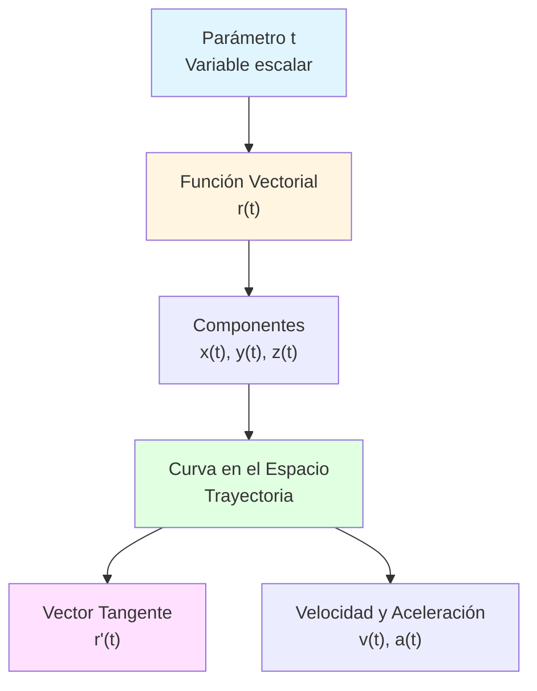
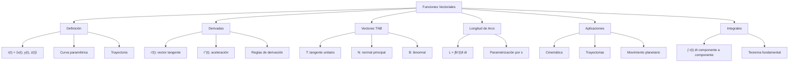

# 🎯 Funciones Vectoriales de Variable Escalar

## 🎯 Introducción

> [!info]- 💡 ¿Qué son las Funciones Vectoriales?
> 
> Una **función vectorial de variable escalar** es una función que asigna a cada valor escalar **t** (usualmente tiempo o parámetro) un vector en el espacio ℝ² o ℝ³.
> 
> **Conceptos clave:**
> 
> |Término|Descripción|
> |---|---|
> |**Parámetro**|Variable escalar t (independiente)|
> |**Función vectorial**|**r**(t) = vector que depende de t|
> |**Componentes**|Funciones escalares que forman el vector|
> |**Curva**|Trayectoria trazada por **r**(t)|
> 
> **Notación:**
> 
> En **ℝ²** (plano): $$\mathbf{r}(t) = \langle x(t), y(t) \rangle = x(t)\mathbf{i} + y(t)\mathbf{j}$$
> 
> En **ℝ³** (espacio): $$\mathbf{r}(t) = \langle x(t), y(t), z(t) \rangle = x(t)\mathbf{i} + y(t)\mathbf{j} + z(t)\mathbf{k}$$
> 
> **Interpretación geométrica:**
> 
> - **t** = parámetro (como el tiempo)
> - **r**(t) = vector posición en el instante t
> - Al variar t, el extremo de **r**(t) traza una **curva** en el espacio

> [!tip]- 🎯 ¿Para Qué Sirven?
> 
> **✅ Aplicaciones principales:**
> 
> - **Física**: Describir trayectorias de partículas y objetos
> - **Cinemática**: Movimiento en el plano y el espacio
> - **Gráficas computacionales**: Curvas paramétricas, animaciones
> - **Ingeniería**: Caminos de robots, trayectorias de proyectiles
> - **Geometría**: Representación paramétrica de curvas
> 
> **Ejemplos cotidianos:**
> 
> - Trayectoria de un proyectil
> - Órbita de un planeta
> - Movimiento de un péndulo
> - Camino de una montaña rusa
> - Vuelo de un dron

---

## 🗂️ Definición Formal

### 📋 Definición

> [!info]- 📐 Definición Matemática
> 
> Una **función vectorial** **r** de una variable escalar t es una función cuyo dominio es un conjunto de números reales y cuyo rango es un conjunto de vectores.
> 
> **Formalmente:**
> 
> $$\mathbf{r}: D \subseteq \mathbb{R} \longrightarrow \mathbb{R}^n$$ $$t \longmapsto \mathbf{r}(t)$$
> 
> **En componentes (ℝ³):**
> 
> $$\mathbf{r}(t) = \langle f(t), g(t), h(t) \rangle$$
> 
> Donde:
> 
> - f(t), g(t), h(t) son **funciones componentes** (escalares)
> - t ∈ D (dominio)
> - **r**(t) ∈ ℝ³
> 
> **Dominio:**
> 
> El dominio de **r**(t) es la intersección de los dominios de sus componentes: $$Dom(\mathbf{r}) = Dom(f) \cap Dom(g) \cap Dom(h)$$

### 🎨 Notaciones Comunes

> [!tip]- 📝 Formas de Escribir Funciones Vectoriales
> 
> **Notación de corchetes angulares:** $$\mathbf{r}(t) = \langle x(t), y(t), z(t) \rangle$$
> 
> **Notación de vectores unitarios:** $$\mathbf{r}(t) = x(t)\mathbf{i} + y(t)\mathbf{j} + z(t)\mathbf{k}$$
> 
> **Notación matricial (columna):** $$\mathbf{r}(t) = \begin{pmatrix} x(t) \ y(t) \ z(t) \end{pmatrix}$$
> 
> **Notación de tupla:** $$\mathbf{r}(t) = (x(t), y(t), z(t))$$
> 
> Todas son equivalentes. En este documento usaremos principalmente la primera.

---

## 🌟 Ejemplos Fundamentales

### 📐 Curvas en el Plano (ℝ²)

> [!example]- ⭕ Círculo
> 
> **Función vectorial:** $$\mathbf{r}(t) = \langle \cos(t), \sin(t) \rangle, \quad t \in [0, 2\pi]$$
> 
> **Componentes:**
> 
> - x(t) = cos(t)
> - y(t) = sin(t)
> 
> **Verificación (es un círculo):** $$x^2 + y^2 = \cos^2(t) + \sin^2(t) = 1$$
> 
> **Características:**
> 
> - Centro: (0, 0)
> - Radio: 1
> - Recorre el círculo en sentido antihorario
> - t = 0: punto (1, 0)
> - t = π/2: punto (0, 1)
> - t = π: punto (-1, 0)
> - t = 2π: regresa a (1, 0)
> 
> **Círculo de radio R centrado en (h, k):** $$\mathbf{r}(t) = \langle h + R\cos(t), k + R\sin(t) \rangle$$

> [!example]- 🌀 Espiral
> 
> **Espiral de Arquímedes:** $$\mathbf{r}(t) = \langle t\cos(t), t\sin(t) \rangle, \quad t \geq 0$$
> 
> **Características:**
> 
> - El radio aumenta linealmente con t
> - Da vueltas alrededor del origen
> - Cada vuelta está más alejada
> 
> **Espiral logarítmica:** $$\mathbf{r}(t) = \langle e^t\cos(t), e^t\sin(t) \rangle$$
> 
> El radio crece exponencialmente

> [!example]- 📈 Parábola
> 
> **Forma paramétrica:** $$\mathbf{r}(t) = \langle t, t^2 \rangle, \quad t \in \mathbb{R}$$
> 
> **Ecuación cartesiana:** $$y = x^2$$
> 
> **Parábola general:** $$\mathbf{r}(t) = \langle t, at^2 + bt + c \rangle$$

### 🌐 Curvas en el Espacio (ℝ³)

> [!example]- 🌪️ Hélice Circular
> 
> **Función vectorial:** $$\mathbf{r}(t) = \langle a\cos(t), a\sin(t), bt \rangle, \quad t \in \mathbb{R}$$
> 
> **Componentes:**
> 
> - x(t) = a cos(t)
> - y(t) = a sin(t)
> - z(t) = bt
> 
> **Interpretación:**
> 
> - Proyección en xy: círculo de radio a
> - z aumenta linealmente (movimiento vertical uniforme)
> - Forma de "resorte" o "escalera de caracol"
> 
> **Parámetros:**
> 
> - a = radio de la hélice
> - b = paso (altura por cada vuelta completa = 2πb)
> 
> **Ejemplo concreto:** $$\mathbf{r}(t) = \langle 2\cos(t), 2\sin(t), t \rangle$$
> 
> Hélice de radio 2, que sube 2π unidades por cada vuelta completa.

> [!example]- 📊 Curva de Intersección
> 
> **Intersección de cilindro y plano:**
> 
> Cilindro: x² + y² = 4 Plano: z = x
> 
> **Parametrización:** $$\mathbf{r}(t) = \langle 2\cos(t), 2\sin(t), 2\cos(t) \rangle$$
> 
> **Verificación:**
> 
> - x² + y² = 4cos²(t) + 4sin²(t) = 4 ✓
> - z = 2cos(t) = x ✓

> [!example]- 🎯 Trayectoria de Proyectil
> 
> **Física: Lanzamiento parabólico**
> 
> Condiciones:
> 
> - Velocidad inicial: v₀
> - Ángulo de lanzamiento: θ
> - Gravedad: g = 9.8 m/s²
> 
> **Función vectorial:** $$\mathbf{r}(t) = \langle (v_0\cos\theta)t, (v_0\sin\theta)t - \frac{1}{2}gt^2 \rangle$$
> 
> **Componentes:**
> 
> - x(t) = (v₀cosθ)t (movimiento horizontal uniforme)
> - y(t) = (v₀sinθ)t - ½gt² (movimiento vertical con gravedad)
> 
> **Ejemplo numérico:**
> 
> v₀ = 20 m/s, θ = 45°, g = 10 m/s²
> 
> $$\mathbf{r}(t) = \langle 10\sqrt{2},t, 10\sqrt{2},t - 5t^2 \rangle$$

---

## 🔬 Límites y Continuidad

### 📊 Límite de una Función Vectorial

> [!info]- 🎯 Definición de Límite
> 
> El límite de **r**(t) cuando t → a existe si y solo si existen los límites de todas sus componentes:
> 
> $$\lim_{t \to a} \mathbf{r}(t) = \left\langle \lim_{t \to a} x(t), \lim_{t \to a} y(t), \lim_{t \to a} z(t) \right\rangle$$
> 
> **Formalmente:**
> 
> $$\lim_{t \to a} \mathbf{r}(t) = \mathbf{L}$$
> 
> si para todo ε > 0, existe δ > 0 tal que:
> 
> $$0 < |t - a| < \delta \implies |\mathbf{r}(t) - \mathbf{L}| < \varepsilon$$

> [!example]- ✏️ Ejemplos de Límites
> 
> **Ejemplo 1:**
> 
> $$\mathbf{r}(t) = \langle t^2, \sin(t), e^t \rangle$$
> 
> $$\lim_{t \to 0} \mathbf{r}(t) = \left\langle \lim_{t \to 0} t^2, \lim_{t \to 0} \sin(t), \lim_{t \to 0} e^t \right\rangle$$ $$= \langle 0, 0, 1 \rangle$$
> 
> ---
> 
> **Ejemplo 2:**
> 
> $$\mathbf{r}(t) = \left\langle \frac{\sin(t)}{t}, t\cos(t), \frac{1-\cos(t)}{t} \right\rangle$$
> 
> $$\lim_{t \to 0} \mathbf{r}(t) = \left\langle 1, 0, 0 \right\rangle$$
> 
> (Usando límites notables: lim(sin t/t) = 1, lim((1-cos t)/t) = 0)

### 🔄 Continuidad

> [!info]- 📐 Función Vectorial Continua
> 
> Una función vectorial **r**(t) es **continua** en t = a si:
> 
> $$\lim_{t \to a} \mathbf{r}(t) = \mathbf{r}(a)$$
> 
> **Equivalentemente:**
> 
> **r**(t) es continua en a si y solo si cada función componente es continua en a.
> 
> **Propiedades:**
> 
> Si **r**(t) y **s**(t) son continuas en a:
> 
> - **r**(t) + **s**(t) es continua
> - k**r**(t) es continua (k escalar)
> - **r**(t) · **s**(t) es continua (producto punto)
> - **r**(t) × **s**(t) es continua (producto cruz)

---

## 📈 Derivadas de Funciones Vectoriales

### 🎯 Definición de Derivada

> [!info]- 📐 Derivada de una Función Vectorial
> 
> La **derivada** de **r**(t) se define como:
> 
> $$\mathbf{r}'(t) = \lim_{h \to 0} \frac{\mathbf{r}(t+h) - \mathbf{r}(t)}{h}$$
> 
> **Cálculo práctico:**
> 
> Se deriva componente por componente:
> 
> $$\mathbf{r}'(t) = \langle x'(t), y'(t), z'(t) \rangle$$
> 
> **Notaciones alternativas:**
> 
> $$\mathbf{r}'(t) = \frac{d\mathbf{r}}{dt} = \dot{\mathbf{r}}(t)$$
> 
> **Interpretación geométrica:**
> 
> - **r**'(t) es un vector **tangente** a la curva en el punto **r**(t)
> - Apunta en la dirección del movimiento
> - Su magnitud representa la rapidez de cambio

> [!example]- ✏️ Ejemplos de Derivadas
> 
> **Ejemplo 1: Círculo**
> 
> $$\mathbf{r}(t) = \langle \cos(t), \sin(t) \rangle$$
> 
> $$\mathbf{r}'(t) = \langle -\sin(t), \cos(t) \rangle$$
> 
> **Verificación de perpendicularidad:** $$\mathbf{r}(t) \cdot \mathbf{r}'(t) = \cos(t)(-\sin(t)) + \sin(t)\cos(t) = 0$$
> 
> El vector posición es perpendicular al vector tangente (propiedad del círculo).
> 
> ---
> 
> **Ejemplo 2: Hélice**
> 
> $$\mathbf{r}(t) = \langle 2\cos(t), 2\sin(t), t \rangle$$
> 
> $$\mathbf{r}'(t) = \langle -2\sin(t), 2\cos(t), 1 \rangle$$
> 
> En t = 0:
> 
> - **r**(0) = ⟨2, 0, 0⟩
> - **r**'(0) = ⟨0, 2, 1⟩ (vector tangente)
> 
> ---
> 
> **Ejemplo 3: Función general**
> 
> $$\mathbf{r}(t) = \langle t^3, e^{2t}, \ln(t+1) \rangle, \quad t > -1$$
> 
> $$\mathbf{r}'(t) = \left\langle 3t^2, 2e^{2t}, \frac{1}{t+1} \right\rangle$$

### 🔧 Reglas de Derivación

> [!success]- ✅ Propiedades de la Derivada
> 
> Sean **r**(t) y **s**(t) funciones vectoriales, c un escalar, y f(t) una función escalar:
> 
> **1. Regla de la suma:** $$\frac{d}{dt}[\mathbf{r}(t) + \mathbf{s}(t)] = \mathbf{r}'(t) + \mathbf{s}'(t)$$
> 
> **2. Regla del múltiplo escalar:** $$\frac{d}{dt}[c\mathbf{r}(t)] = c\mathbf{r}'(t)$$
> 
> **3. Regla del producto por escalar:** $$\frac{d}{dt}[f(t)\mathbf{r}(t)] = f'(t)\mathbf{r}(t) + f(t)\mathbf{r}'(t)$$
> 
> **4. Regla del producto punto:** $$\frac{d}{dt}[\mathbf{r}(t) \cdot \mathbf{s}(t)] = \mathbf{r}'(t) \cdot \mathbf{s}(t) + \mathbf{r}(t) \cdot \mathbf{s}'(t)$$
> 
> **5. Regla del producto cruz:** $$\frac{d}{dt}[\mathbf{r}(t) \times \mathbf{s}(t)] = \mathbf{r}'(t) \times \mathbf{s}(t) + \mathbf{r}(t) \times \mathbf{s}'(t)$$
> 
> **6. Regla de la cadena:** $$\frac{d}{dt}[\mathbf{r}(f(t))] = \mathbf{r}'(f(t)) \cdot f'(t)$$

> [!example]- 🎯 Aplicación de Reglas
> 
> **Ejemplo: Derivada de la norma al cuadrado**
> 
> Sea ‖**r**(t)‖² = **r**(t) · **r**(t)
> 
> Derivando con la regla del producto punto:
> 
> $$\frac{d}{dt}[|\mathbf{r}(t)|^2] = \frac{d}{dt}[\mathbf{r}(t) \cdot \mathbf{r}(t)]$$ $$= \mathbf{r}'(t) \cdot \mathbf{r}(t) + \mathbf{r}(t) \cdot \mathbf{r}'(t)$$ $$= 2\mathbf{r}(t) \cdot \mathbf{r}'(t)$$
> 
> **Consecuencia importante:**
> 
> Si ‖**r**(t)‖ = constante, entonces: $$\mathbf{r}(t) \cdot \mathbf{r}'(t) = 0$$
> 
> Es decir: **r**(t) ⊥ **r**'(t)
> 
> _Esto explica por qué en el círculo el radio es perpendicular a la tangente._

### 🔄 Derivadas de Orden Superior

> [!info]- 📊 Segunda Derivada y Superiores
> 
> **Segunda derivada:**
> 
> $$\mathbf{r}''(t) = \frac{d}{dt}[\mathbf{r}'(t)] = \langle x''(t), y''(t), z''(t) \rangle$$
> 
> **Notaciones:** $$\mathbf{r}''(t) = \frac{d^2\mathbf{r}}{dt^2} = \ddot{\mathbf{r}}(t)$$
> 
> **n-ésima derivada:**
> 
> $$\mathbf{r}^{(n)}(t) = \langle x^{(n)}(t), y^{(n)}(t), z^{(n)}(t) \rangle$$

> [!example]- ✏️ Ejemplo de Derivadas de Orden Superior
> 
> $$\mathbf{r}(t) = \langle t^3, \cos(2t), e^t \rangle$$
> 
> **Primera derivada:** $$\mathbf{r}'(t) = \langle 3t^2, -2\sin(2t), e^t \rangle$$
> 
> **Segunda derivada:** $$\mathbf{r}''(t) = \langle 6t, -4\cos(2t), e^t \rangle$$
> 
> **Tercera derivada:** $$\mathbf{r}'''(t) = \langle 6, 8\sin(2t), e^t \rangle$$

---

## 🎯 Vectores Tangente, Normal y Binormal

### 📐 Vector Tangente Unitario

> [!info]- 🎯 Vector Tangente Unitario T(t)
> 
> El **vector tangente unitario** es la normalización de **r**'(t):
> 
> $$\mathbf{T}(t) = \frac{\mathbf{r}'(t)}{|\mathbf{r}'(t)|}$$
> 
> **Propiedades:**
> 
> - ‖**T**(t)‖ = 1 (es unitario)
> - Tangente a la curva
> - Apunta en la dirección del movimiento
> 
> **Interpretación física:**
> 
> Si **r**(t) es la posición de una partícula, **T**(t) indica la dirección instantánea del movimiento.

> [!example]- ✏️ Cálculo de Vector Tangente Unitario
> 
> **Para la hélice:** $$\mathbf{r}(t) = \langle \cos(t), \sin(t), t \rangle$$
> 
> **Derivada:** $$\mathbf{r}'(t) = \langle -\sin(t), \cos(t), 1 \rangle$$
> 
> **Norma:** $$|\mathbf{r}'(t)| = \sqrt{\sin^2(t) + \cos^2(t) + 1} = \sqrt{2}$$
> 
> **Vector tangente unitario:** $$\mathbf{T}(t) = \frac{1}{\sqrt{2}}\langle -\sin(t), \cos(t), 1 \rangle$$
> 
> En t = 0: $$\mathbf{T}(0) = \frac{1}{\sqrt{2}}\langle 0, 1, 1 \rangle = \left\langle 0, \frac{1}{\sqrt{2}}, \frac{1}{\sqrt{2}} \right\rangle$$

### 🔵 Vector Normal Unitario

> [!info]- 🎯 Vector Normal Principal N(t)
> 
> El **vector normal unitario** mide cómo cambia la dirección de **T**(t):
> 
> $$\mathbf{N}(t) = \frac{\mathbf{T}'(t)}{|\mathbf{T}'(t)|}$$
> 
> **Propiedades:**
> 
> - ‖**N**(t)‖ = 1
> - **T**(t) ⊥ **N**(t) (perpendiculares)
> - Apunta hacia el "centro de curvatura"
> - Indica la dirección en que la curva se está doblando

> [!example]- ✏️ Cálculo de Vector Normal
> 
> **Para el círculo:** $$\mathbf{r}(t) = \langle \cos(t), \sin(t) \rangle$$
> 
> Ya calculamos: $$\mathbf{T}(t) = \frac{1}{1}\langle -\sin(t), \cos(t) \rangle = \langle -\sin(t), \cos(t) \rangle$$
> 
> (Porque ‖**r**'(t)‖ = 1)
> 
> **Derivada de T:** $$\mathbf{T}'(t) = \langle -\cos(t), -\sin(t) \rangle$$
> 
> **Norma:** $$|\mathbf{T}'(t)| = \sqrt{\cos^2(t) + \sin^2(t)} = 1$$
> 
> **Vector normal:** $$\mathbf{N}(t) = \langle -\cos(t), -\sin(t) \rangle$$
> 
> **Observación:** **N**(t) apunta hacia el centro del círculo (origen).

### 🟣 Vector Binormal

> [!info]- 🎯 Vector Binormal B(t)
> 
> El **vector binormal** es perpendicular tanto a **T** como a **N**:
> 
> $$\mathbf{B}(t) = \mathbf{T}(t) \times \mathbf{N}(t)$$
> 
> **Propiedades:**
> 
> - ‖**B**(t)‖ = 1
> - **B** ⊥ **T** y **B** ⊥ **N**
> - Completa un sistema ortonormal {**T**, **N**, **B**}
> - Define el "plano osculador"

> [!tip]- 📊 Triedro de Frenet (Marco Móvil)
> 
> Los tres vectores **T**, **N**, **B** forman el **triedro de Frenet** o **marco móvil** de la curva:
> 
> |Vector|Nombre|Dirección|
> |---|---|---|
> |**T**(t)|Tangente|Dirección del movimiento|
> |**N**(t)|Normal principal|Hacia donde se dobla|
> |**B**(t)|Binormal|Perpendicular al plano de curvatura|
> 
> **Propiedades:**
> 
> - **T** × **N** = **B**
> - **N** × **B** = **T**
> - **B** × **T** = **N**
> - Son mutuamente ortogonales
> - Forman una base ortonormal

---

## 📏 Longitud de Arco

### 🎯 Fórmula de Longitud

> [!info]- 📐 Longitud de una Curva
> 
> La **longitud de arco** de una curva **r**(t) desde t = a hasta t = b es:
> 
> $$L = \int_a^b |\mathbf{r}'(t)| , dt$$
> 
> **En componentes:**
> 
> $$L = \int_a^b \sqrt{[x'(t)]^2 + [y'(t)]^2 + [z'(t)]^2} , dt$$
> 
> **Interpretación:**
> 
> - ‖**r**'(t)‖ = rapidez instantánea
> - Integrar la rapidez da la distancia total recorrida

> [!example]- ✏️ Ejemplos de Longitud de Arco
> 
> **Ejemplo 1: Hélice circular**
> 
> $$\mathbf{r}(t) = \langle a\cos(t), a\sin(t), bt \rangle, \quad t \in [0, 2\pi]$$
> 
> **Derivada:** $$\mathbf{r}'(t) = \langle -a\sin(t), a\cos(t), b \rangle$$
> 
> **Norma:** $$|\mathbf{r}'(t)| = \sqrt{a^2\sin^2(t) + a^2\cos^2(t) + b^2} = \sqrt{a^2 + b^2}$$
> 
> **Longitud:** $$L = \int_0^{2\pi} \sqrt{a^2 + b^2} , dt = 2\pi\sqrt{a^2 + b^2}$$
> 
> ---
> 
> **Ejemplo 2: Segmento de recta**
> 
> $$\mathbf{r}(t) = \langle 1-t, 3t, 2t \rangle, \quad t \in [0, 1]$$
> 
> (Une los puntos (1,0,0) y (0,3,2))
> 
> **Derivada:** $$\mathbf{r}'(t) = \langle -1, 3, 2 \rangle$$
> 
> **Norma:** $$|\mathbf{r}'(t)| = \sqrt{1 + 9 + 4} = \sqrt{14}$$
> 
> **Longitud:** $$L = \int_0^1 \sqrt{14} , dt = \sqrt{14}$$
> (Coincide con la distancia euclidiana entre los puntos)

### 🔄 Parametrización por Longitud de Arco

> [!tip]- 📊 Parámetro Longitud de Arco s
> 
> La **función longitud de arco** desde t = a es:
> 
> $$s(t) = \int_a^t |\mathbf{r}'(u)| , du$$
> 
> **Propiedad fundamental:**
> 
> $$\frac{ds}{dt} = |\mathbf{r}'(t)|$$
> 
> **Reparametrización:**
> 
> Si podemos resolver s = s(t) para obtener t = t(s), entonces:
> 
> $$\mathbf{r}(s) = \mathbf{r}(t(s))$$
> 
> es una parametrización por longitud de arco.
> 
> **Ventaja:**
> 
> Con este parámetro, ‖**r**'(s)‖ = 1 siempre.

---

## 🚀 Aplicaciones en Física

### ⚡ Velocidad y Aceleración

> [!info]- 🎯 Cinemática Vectorial
> 
> Si **r**(t) representa la posición de una partícula:
> 
> **Velocidad:** $$\mathbf{v}(t) = \mathbf{r}'(t) = \frac{d\mathbf{r}}{dt}$$
> 
> **Rapidez:** $$v(t) = |\mathbf{v}(t)| = |\mathbf{r}'(t)|$$
> 
> **Aceleración:** $$\mathbf{a}(t) = \mathbf{v}'(t) = \mathbf{r}''(t) = \frac{d^2\mathbf{r}}{dt^2}$$
> 
> **Magnitud de la aceleración:** $$a(t) = |\mathbf{a}(t)|$$

> [!example]- 🎯 Ejemplo: Movimiento Circular Uniforme
> 
> **Posición:** $$\mathbf{r}(t) = \langle R\cos(\omega t), R\sin(\omega t) \rangle$$
> 
> Donde:
> 
> - R = radio
> - ω = velocidad angular (rad/s)
> 
> **Velocidad:** $$\mathbf{v}(t) = \langle -R\omega\sin(\omega t), R\omega\cos(\omega t) \rangle$$
> 
> **Rapidez:** $$v = |\mathbf{v}| = R\omega$$ (constante)
> 
> **Aceleración:** $$\mathbf{a}(t) = \langle -R\omega^2\cos(\omega t), -R\omega^2\sin(\omega t) \rangle$$ $$= -\omega^2 \mathbf{r}(t)$$
> 
> **Observaciones:**
> 
> - **a** apunta hacia el centro (aceleración centrípeta)
> - Magnitud: ‖**a**‖ = Rω² = v²/R

> [!example]- 🚀 Ejemplo: Proyectil con Resistencia del Aire
> 
> **Ecuación de movimiento:** $$\mathbf{r}''(t) = \langle 0, -g \rangle - k\mathbf{r}'(t)$$
> 
> Donde:
> 
> - g = aceleración de la gravedad
> - k = coeficiente de resistencia del aire
> 
> **Solución (caso simplificado k pequeño):** $$\mathbf{r}(t) = \left\langle v_0\cos(\theta)t, v_0\sin(\theta)t - \frac{1}{2}gt^2 \right\rangle - \text{correcciones por fricción}$$

### 🌍 Movimiento Planetario

> [!tip]- 🪐 Leyes de Kepler
> 
> **Primera Ley (Órbitas Elípticas):**
> 
> Un planeta se mueve en una elipse con el Sol en uno de los focos.
> 
> **Representación vectorial:** $$\mathbf{r}(t) = \left\langle \frac{a(1-e^2)}{1+e\cos\theta}\cos\theta, \frac{a(1-e^2)}{1+e\cos\theta}\sin\theta \right\rangle$$
> 
> Donde:
> 
> - a = semieje mayor
> - e = excentricidad
> - θ = anomalía verdadera
> 
> **Segunda Ley (Áreas Iguales):**
> 
> $$\mathbf{r}(t) \times \mathbf{r}'(t) = \text{constante}$$
> 
> (El momento angular es constante)

---

## 🧮 Integrales de Funciones Vectoriales

### 📊 Integral Indefinida

> [!info]- 📐 Antiderivada Vectorial
> 
> La **integral indefinida** de **r**(t) es:
> 
> $$\int \mathbf{r}(t) , dt = \left\langle \int x(t) , dt, \int y(t) , dt, \int z(t) , dt \right\rangle + \mathbf{C}$$
> 
> Donde **C** = ⟨C₁, C₂, C₃⟩ es un vector constante.
> 
> **Verificación:** $$\frac{d}{dt}\left[\int \mathbf{r}(t) , dt\right] = \mathbf{r}(t)$$

> [!example]- ✏️ Ejemplo de Integral Indefinida
> 
> $$\mathbf{r}(t) = \langle 2t, \cos(t), e^{3t} \rangle$$
> 
> $$\int \mathbf{r}(t) , dt = \left\langle \int 2t , dt, \int \cos(t) , dt, \int e^{3t} , dt \right\rangle$$
> 
> $$= \left\langle t^2 + C_1, \sin(t) + C_2, \frac{1}{3}e^{3t} + C_3 \right\rangle$$
> 
> $$= \left\langle t^2, \sin(t), \frac{1}{3}e^{3t} \right\rangle + \mathbf{C}$$

### 📏 Integral Definida

> [!info]- 📊 Integral Definida Vectorial
> 
> $$\int_a^b \mathbf{r}(t) , dt = \left\langle \int_a^b x(t) , dt, \int_a^b y(t) , dt, \int_a^b z(t) , dt \right\rangle$$
> 
> **Teorema Fundamental del Cálculo (versión vectorial):**
> 
> Si **R**(t) es una antiderivada de **r**(t):
> 
> $$\int_a^b \mathbf{r}(t) , dt = \mathbf{R}(b) - \mathbf{R}(a)$$

> [!example]- ✏️ Ejemplo de Integral Definida
> 
> $$\int_0^{\pi/2} \langle \sin(t), \cos(t), 1 \rangle , dt$$
> 
> $$= \left\langle \int_0^{\pi/2} \sin(t) , dt, \int_0^{\pi/2} \cos(t) , dt, \int_0^{\pi/2} 1 , dt \right\rangle$$
> 
> $$= \langle [-\cos(t)]_0^{\pi/2}, [\sin(t)]_0^{\pi/2}, [t]_0^{\pi/2} \rangle$$
> 
> $$= \left\langle -\cos\left(\frac{\pi}{2}\right) + \cos(0), \sin\left(\frac{\pi}{2}\right) - \sin(0), \frac{\pi}{2} - 0 \right\rangle$$
> 
> $$= \left\langle 0 + 1, 1 - 0, \frac{\pi}{2} \right\rangle = \left\langle 1, 1, \frac{\pi}{2} \right\rangle$$

---

## ✅ Resumen de Fórmulas

> [!summary]- 📋 Referencia Rápida
> 
> **Definición:** $$\mathbf{r}(t) = \langle x(t), y(t), z(t) \rangle$$
> 
> **Derivada:** $$\mathbf{r}'(t) = \langle x'(t), y'(t), z'(t) \rangle$$
> 
> **Vector tangente unitario:** $$\mathbf{T}(t) = \frac{\mathbf{r}'(t)}{|\mathbf{r}'(t)|}$$
> 
> **Vector normal unitario:** $$\mathbf{N}(t) = \frac{\mathbf{T}'(t)}{|\mathbf{T}'(t)|}$$
> 
> **Vector binormal:** $$\mathbf{B}(t) = \mathbf{T}(t) \times \mathbf{N}(t)$$
> 
> **Longitud de arco:** $$L = \int_a^b |\mathbf{r}'(t)| , dt$$
> 
> **Velocidad:** $$\mathbf{v}(t) = \mathbf{r}'(t)$$
> 
> **Aceleración:** $$\mathbf{a}(t) = \mathbf{r}''(t)$$
> 
> **Integral:** $$\int_a^b \mathbf{r}(t) , dt = \langle \int_a^b x(t) , dt, \int_a^b y(t) , dt, \int_a^b z(t) , dt \rangle$$

---

## 🎓 Ejercicios Propuestos

> [!question]- 💪 Práctica
> 
> **Ejercicio 1:** Encuentra **r**'(t) y **r**''(t) para **r**(t) = ⟨t², sin(t), e^t⟩
> 
> **Ejercicio 2:** Calcula el vector tangente unitario de **r**(t) = ⟨3cos(t), 3sin(t), 4t⟩ en t = π/4
> 
> **Ejercicio 3:** Encuentra la longitud de la curva **r**(t) = ⟨t, t², t³⟩ desde t = 0 hasta t = 1
> 
> **Ejercicio 4:** Demuestra que **r**(t) = ⟨cos(t), sin(t), t⟩ tiene rapidez constante solo si calculamos ‖**r**'(t)‖
> 
> **Ejercicio 5:** Para el movimiento **r**(t) = ⟨t³, t²⟩, encuentra la velocidad y aceleración en t = 1
> 
> **Ejercicio 6:** Parametriza el círculo x² + y² = 9 usando funciones vectoriales
> 
> **Ejercicio 7:** Calcula ∫₀^π ⟨cos(t), sin(t), t⟩ dt

---

## 📊 Resumen Visual

> [!quote]- 💡 Puntos Clave
> 
> - **Función vectorial** = Asigna vectores a números reales
> - **Curva** = Trayectoria trazada por r(t)
> - **r'(t)** = Vector tangente (velocidad)
> - **r''(t)** = Aceleración
> - **T, N, B** = Triedro de Frenet (marco móvil)
> - **Longitud** = Integral de la rapidez
> - **Derivar e integrar** = Componente por componente
> - **Aplicación física** = Cinemática y dinámica de partículas

---

**Tags:** #funcionesvectoriales #calculovectorial #curvasparamétricas #derivadas #vectortangente #cinemática #longituddearco #triedrofrenet #velocidad #aceleración