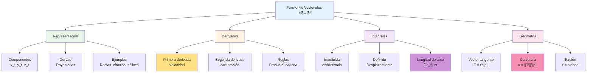

# ➡️ Funciones Vectoriales de Variable Escalar

## 🎯 Fundamentos de Funciones Vectoriales

> [!info]- 💡 Introducción a las Funciones Vectoriales Las **funciones vectoriales de variable escalar** son aplicaciones que asignan a cada valor escalar (típicamente tiempo) un vector en ℝ³. Son fundamentales para describir trayectorias, movimiento de partículas y curvas en el espacio tridimensional.
> 
> **Analogías útiles:**
> 
> - **Física:** Posición de un proyectil en función del tiempo
> - **Animación:** Trayectoria de un personaje en un videojuego
> - **Ingeniería:** Recorrido de un brazo robótico
> - **Naturaleza:** Vuelo de un pájaro o trayectoria de un planeta
> 
> **Diferencia fundamental:**
> 
> - **Función escalar:** f: ℝ → ℝ (ejemplo: f(t) = t²)
> - **Función vectorial:** **r**: ℝ → ℝ³ (ejemplo: **r**(t) = (t, t², t³))
> 
> **Importancia histórica:**
> 
> - **Isaac Newton (1687):** Leyes del movimiento - primera aplicación de funciones vectoriales
> - **Leonhard Euler (1748):** Parametrización de curvas
> - **Carl Friedrich Gauss (1827):** Geometría diferencial de curvas
> - **Bernhard Riemann (1854):** Generalización a espacios curvos

### 📐 Definición Formal

> [!note]- 🌟 Concepto Matemático de Función Vectorial **Definición:**
> 
> Una **función vectorial de variable escalar** es una función que asigna a cada número real t en su dominio un único vector **r**(t) en ℝ³.
> 
> **Notación formal:**
> 
> **r**: D ⊆ ℝ → ℝ³
> 
> t ↦ **r**(t) = (x(t), y(t), z(t))
> 
> **Formas de representación:**
> 
> **1. Forma de componentes:**
> 
> ```
> r(t) = (x(t), y(t), z(t))
> ```
> 
> **2. Forma vectorial con base canónica:**
> 
> ```
> r(t) = x(t)i + y(t)j + z(t)k
> ```
> 
> **3. Forma de vector columna:**
> 
> ```
> r(t) = [x(t)]
>        [y(t)]
>        [z(t)]
> ```
> 
> Donde:
> 
> - **t** ∈ ℝ: variable independiente (parámetro)
> - **x(t), y(t), z(t)**: funciones componentes (funciones coordenadas)
> - **D**: dominio de la función (conjunto de valores válidos de t)
> - **r(t)**: vector posición en el instante t
> 
> **Interpretación geométrica:**
> 
> - El conjunto de todos los puntos **r**(t) forma una **curva** en el espacio ℝ³
> - A medida que t varía, el vector **r**(t) "traza" una trayectoria
> - El parámetro t usualmente representa el tiempo

## 📝 Notación y Representación

### ✏️ Convenciones de Escritura

> [!example]- 📌 Formas Equivalentes de Notación **Para la función vectorial:**
> 
> **1. Notación con flecha/negrita:**
> 
> - **r**(t), **r**⃗(t) - función vectorial
> - **v**(t), **a**(t) - velocidad y aceleración
> 
> **2. Notación de componentes:**
> 
> - **r**(t) = ⟨x(t), y(t), z(t)⟩
> - **r**(t) = (x(t), y(t), z(t))
> 
> **3. Notación con vectores unitarios:**
> 
> - **r**(t) = x(t)**i** + y(t)**j** + z(t)**k**
> 
> **4. Notación compacta:**
> 
> - **r** = **r**(t) cuando el parámetro es claro
> 
> **Ejemplos concretos:**
> 
> Todas estas representan la misma función vectorial:
> 
> ```
> r(t) = (t, t², 2t)
> r(t) = ti + t²j + 2tk
> r(t) = ⟨t, t², 2t⟩
> r(t) = [t, t², 2t]ᵀ
> ```
> 
> **Para derivadas:**
> 
> - **r**'(t) = d**r**/dt = **ṙ**(t)
> - **r**''(t) = d²**r**/dt² = **r̈**(t)

### 🎨 Interpretación Geométrica

> [!tip]- 👁️ Visualización de Curvas Paramétricas **Representación gráfica:**
> 
> Una función vectorial **r**(t) genera una **curva espacial** C donde:
> 
> - **Parámetro t:** "Tiempo" o variable que recorre la curva
> - **Punto inicial:** **r**(t₀) cuando t = t₀
> - **Punto final:** **r**(t₁) cuando t = t₁
> - **Sentido de recorrido:** Dirección en que aumenta t
> 
> **Características importantes:**
> 
> **1. Curva vs función:**
> 
> - **Curva C:** Conjunto de puntos {**r**(t) : t ∈ D}
> - **Función r(t):** Parametrización de la curva (puede haber muchas)
> 
> **2. Vector posición:**
> 
> - Para cada t, **r**(t) es el vector desde el origen hasta el punto de la curva
> - La "punta" del vector traza la curva
> 
> **3. Trayectoria orientada:**
> 
> - La curva tiene dirección (determinada por el aumento de t)
> - **r**(t) y **r**(-t) pueden dar la misma curva en sentidos opuestos
> 
> **4. Curvas en planos:**
> 
> - Si z(t) = 0 para todo t → curva en el plano XY
> - Si x(t) = c (constante) → curva en el plano YZ

## 📊 Dominio y Recorrido

### 🔍 Dominio de una Función Vectorial

> [!warning]- 🔷 Valores Válidos del Parámetro **Definición:**
> 
> El **dominio** D de **r**(t) = (x(t), y(t), z(t)) es el conjunto de todos los valores de t para los cuales las tres funciones componentes están definidas.
> 
> **Cálculo del dominio:**
> 
> D = Dom(x) ∩ Dom(y) ∩ Dom(z)
> 
> (Intersección de los tres dominios)
> 
> **Casos comunes:**
> 
> **1. Funciones polinómicas:**
> 
> - x(t) = t², y(t) = t³, z(t) = 2t
> - Dominio: D = ℝ (todos los reales)
> 
> **2. Funciones con raíces:**
> 
> - x(t) = √t, y(t) = √(4-t²), z(t) = 1
> - Dom(x) = [0, ∞), Dom(y) = [-2, 2], Dom(z) = ℝ
> - D = [0, 2]
> 
> **3. Funciones racionales:**
> 
> - x(t) = 1/t, y(t) = t, z(t) = 1/(t-1)
> - Dom(x) = ℝ{0}, Dom(z) = ℝ{1}
> - D = ℝ{0, 1}
> 
> **4. Funciones trigonométricas:**
> 
> - x(t) = cos(t), y(t) = sin(t), z(t) = t
> - Dominio: D = ℝ
> 
> **5. Funciones logarítmicas:**
> 
> - x(t) = ln(t), y(t) = t², z(t) = √t
> - D = (0, ∞)

### 🎯 Recorrido (Imagen)

> [!note]- 🌐 Conjunto de Vectores Alcanzados **Definición:**
> 
> El **recorrido** o **imagen** de **r**(t) es el conjunto de todos los vectores (puntos) alcanzados:
> 
> Im(**r**) = {**r**(t) : t ∈ D} ⊆ ℝ³
> 
> Geométricamente, es la **curva espacial** generada.
> 
> **Características:**
> 
> - Puede ser una curva abierta o cerrada
> - Puede tener auto-intersecciones
> - Puede ser acotada o no acotada
> - Puede llenar una región (curvas de Peano)
> 
> **Ejemplos:**
> 
> ```
> 1. r(t) = (cos(t), sin(t), 0), t ∈ [0, 2π]
>    Recorrido: Círculo de radio 1 en el plano XY
> 
> 2. r(t) = (t, t², t³), t ∈ ℝ
>    Recorrido: Curva cúbica alabeada (no plana)
> 
> 3. r(t) = (a·cos(t), a·sin(t), bt), t ∈ ℝ
>    Recorrido: Hélice circular de radio a y paso 2πb
> ```

## 📚 Ejemplos Fundamentales de Funciones Vectoriales

### ➡️ Rectas en el Espacio

> [!success]- 📏 Ecuación Vectorial de una Recta **Forma general:**
> 
> Recta que pasa por el punto P₀ = (x₀, y₀, z₀) con dirección **v** = (a, b, c):
> 
> **r**(t) = **r**₀ + t**v**
> 
> **r**(t) = (x₀, y₀, z₀) + t(a, b, c)
> 
> **Forma desarrollada:**
> 
> ```
> r(t) = (x₀ + at, y₀ + bt, z₀ + ct)
> 
> O en componentes:
> x(t) = x₀ + at
> y(t) = y₀ + bt
> z(t) = z₀ + ct
> ```
> 
> **Parámetros:**
> 
> - t ∈ ℝ: parámetro (puede representar tiempo)
> - **r**₀: vector posición del punto inicial
> - **v**: vector director (no nulo)
> 
> **Interpretación:**
> 
> - Cuando t = 0: **r**(0) = **r**₀ (punto inicial)
> - Cuando t > 0: movimiento en dirección de **v**
> - Cuando t < 0: movimiento en dirección opuesta a **v**
> 
> **Ejemplo:**
> 
> Recta que pasa por P₀ = (1, 2, 3) con dirección **v** = (2, -1, 4):
> 
> ```
> r(t) = (1, 2, 3) + t(2, -1, 4)
> r(t) = (1 + 2t, 2 - t, 3 + 4t)
> 
> Verificaciones:
> t = 0: r(0) = (1, 2, 3) ✓
> t = 1: r(1) = (3, 1, 7)
> t = -1: r(-1) = (-1, 3, -1)
> ```

### ⭕ Círculos y Circunferencias

> [!example]- 🔵 Curvas Cerradas Simples **Círculo en el plano XY:**
> 
> Centro en el origen, radio r:
> 
> ```
> r(t) = (r·cos(t), r·sin(t), 0), t ∈ [0, 2π]
> ```
> 
> **Círculo en plano arbitrario:**
> 
> Centro en C = (h, k, l), radio r, en plano XY desplazado:
> 
> ```
> r(t) = (h + r·cos(t), k + r·sin(t), l), t ∈ [0, 2π]
> ```
> 
> **Propiedades:**
> 
> - Curva cerrada: **r**(0) = **r**(2π)
> - Periódica de período 2π
> - Longitud de la curva: L = 2πr
> - ||**r**(t) - C|| = r (distancia constante al centro)
> 
> **Ejemplos:**
> 
> ```
> 1. Círculo unitario en XY:
>    r(t) = (cos(t), sin(t), 0)
> 
> 2. Círculo de radio 3 en plano z = 5:
>    r(t) = (3cos(t), 3sin(t), 5)
> 
> 3. Elipse (generalización):
>    r(t) = (a·cos(t), b·sin(t), 0)
>    donde a ≠ b son los semiejes
> ```

### 🌀 Hélices

> [!tip]- 🎢 Curvas Helicoidales **Hélice circular:**
> 
> Combinación de movimiento circular y vertical:
> 
> ```
> r(t) = (a·cos(t), a·sin(t), bt)
> ```
> 
> **Parámetros:**
> 
> - **a > 0**: radio de la hélice
> - **b**: paso de la hélice (rapidez vertical)
> - **t ∈ ℝ**: parámetro (ángulo en radianes)
> 
> **Características:**
> 
> - Proyección en XY: círculo de radio a
> - Proyección en XZ o YZ: sinusoide
> - Asciende uniformemente en z
> - Cuando t aumenta en 2π, z aumenta en 2πb (una "vuelta completa")
> 
> **Casos especiales:**
> 
> ```
> 1. b = 0: Hélice degenerada (círculo)
>    r(t) = (a·cos(t), a·sin(t), 0)
> 
> 2. b > 0: Hélice ascendente (dextrógira)
>    r(t) = (cos(t), sin(t), t)
> 
> 3. b < 0: Hélice descendente (levógira)
>    r(t) = (cos(t), sin(t), -t)
> 
> 4. Hélice cónica (radio variable):
>    r(t) = (t·cos(t), t·sin(t), t)
> ```
> 
> **Aplicaciones:**
> 
> - ADN (doble hélice)
> - Resortes y muelles
> - Escaleras de caracol
> - Tornillos

### 📈 Curvas Alabeadas

> [!info]- 🎨 Curvas no Planas **Definición:**
> 
> Una curva es **alabeada** si no está contenida en ningún plano. Son verdaderamente tridimensionales.
> 
> **Ejemplos clásicos:**
> 
> **1. Curva cúbica alabeada:**
> 
> ```
> r(t) = (t, t², t³)
> ```
> 
> - No es plana (requiere las 3 dimensiones)
> - Pasa por el origen cuando t = 0
> - Se extiende al infinito en ambas direcciones
> 
> **2. Curva de Viviani:**
> 
> ```
> r(t) = (cos²(t), sin(t)·cos(t), sin(t))
> ```
> 
> - Intersección de esfera y cilindro
> - Curva cerrada y suave
> 
> **3. Curva torsionada:**
> 
> ```
> r(t) = (a·cos(t), b·sin(t), ct)
> ```
> 
> donde a ≠ b (hélice elíptica)
> 
> **Test de planaridad:**
> 
> Una curva **r**(t) es plana si y solo si existe un vector constante **n** tal que:
> 
> ```
> (r(t) - r(t₀)) · n = 0 para todo t
> ```

## 🔄 Derivadas de Funciones Vectoriales

### 📐 Definición de Derivada

> [!warning]- 📊 Velocidad Instantánea **Definición formal:**
> 
> La **derivada** de **r**(t) en t = t₀ es:
> 
> **r**'(t₀) = lim[h→0] [**r**(t₀ + h) - **r**(t₀)] / h
> 
> **Notaciones equivalentes:**
> 
> - **r**'(t) = d**r**/dt = **ṙ**(t)
> - **r**'(t₀) = **r**'|ₜ₌ₜ₀
> 
> **Cálculo por componentes:**
> 
> Si **r**(t) = (x(t), y(t), z(t)), entonces:
> 
> **r**'(t) = (x'(t), y'(t), z'(t)) = (dx/dt, dy/dt, dz/dt)
> 
> **Interpretación geométrica:**
> 
> - **r**'(t) es un vector **tangente** a la curva en el punto **r**(t)
> - Apunta en la dirección del movimiento
> - Su magnitud es la **rapidez** de cambio
> 
> **Interpretación física:**
> 
> - Si t es tiempo, **r**'(t) es el **vector velocidad**
> - Describe qué tan rápido y en qué dirección se mueve la partícula
> 
> **Condición de existencia:**
> 
> - **r** es derivable en t₀ si x'(t₀), y'(t₀), z'(t₀) existen
> - La derivada existe si las tres componentes son derivables

### 📋 Reglas de Derivación

> [!note]- ⚙️ Propiedades de la Derivada Vectorial **Reglas básicas:**
> 
> Sean **u**(t) y **v**(t) funciones vectoriales derivables, k constante, c escalar:
> 
> **1. Linealidad:**
> 
> ```
> d/dt[k·u(t)] = k·u'(t)
> 
> d/dt[u(t) + v(t)] = u'(t) + v'(t)
> 
> d/dt[u(t) - v(t)] = u'(t) - v'(t)
> ```
> 
> **2. Producto por función escalar:**
> 
> ```
> d/dt[c(t)·u(t)] = c'(t)·u(t) + c(t)·u'(t)
> ```
> 
> (Regla del producto)
> 
> **3. Producto punto:**
> 
> ```
> d/dt[u(t) · v(t)] = u'(t)·v(t) + u(t)·v'(t)
> ```
> 
> **4. Producto cruz:**
> 
> ```
> d/dt[u(t) × v(t)] = u'(t)×v(t) + u(t)×v'(t)
> ```
> 
> ⚠️ Cuidado: el orden importa en el producto cruz
> 
> **5. Regla de la cadena:**
> 
> ```
> Si r(t) = s(g(t)), entonces:
> r'(t) = s'(g(t))·g'(t)
> ```
> 
> **6. Magnitud (caso especial):**
> 
> ```
> d/dt[||r(t)||] = r(t)·r'(t) / ||r(t)||
> ```
> 
> (si **r**(t) ≠ **0**)

### 📊 Ejemplos de Derivación

> [!example]- 🎯 Ejercicios Resueltos **Ejemplo 1: Función polinómica**
> 
> ```
> r(t) = (t², 2t, t³ - 1)
> 
> r'(t) = (d/dt[t²], d/dt[2t], d/dt[t³-1])
>       = (2t, 2, 3t²)
> 
> Evaluación en t = 1:
> r'(1) = (2, 2, 3)
> ```
> 
> ---
> 
> **Ejemplo 2: Función trigonométrica**
> 
> ```
> r(t) = (cos(t), sin(t), t²)
> 
> r'(t) = (-sin(t), cos(t), 2t)
> 
> En t = π/2:
> r'(π/2) = (-1, 0, π)
> ```
> 
> ---
> 
> **Ejemplo 3: Hélice**
> 
> ```
> r(t) = (2cos(t), 2sin(t), 3t)
> 
> r'(t) = (-2sin(t), 2cos(t), 3)
> 
> Magnitud (rapidez):
> ||r'(t)|| = √(4sin²(t) + 4cos²(t) + 9)
>          = √(4(sin²(t) + cos²(t)) + 9)
>          = √(4 + 9) = √13
> 
> ¡La rapidez es constante!
> ```
> 
> ---
> 
> **Ejemplo 4: Producto punto**
> 
> ```
> u(t) = (t, t², 1)
> v(t) = (1, 2t, t³)
> 
> Calcular d/dt[u(t)·v(t)]:
> 
> Método 1 (producto primero):
> u(t)·v(t) = t·1 + t²·2t + 1·t³
>           = t + 2t³ + t³
>           = t + 3t³
> d/dt[t + 3t³] = 1 + 9t²
> 
> Método 2 (regla del producto):
> u'(t) = (1, 2t, 0)
> v'(t) = (0, 2, 3t²)
> 
> d/dt[u·v] = u'·v + u·v'
>           = (1,2t,0)·(1,2t,t³) + (t,t²,1)·(0,2,3t²)
>           = (1 + 4t² + 0) + (0 + 2t² + 3t²)
>           = 1 + 4t² + 5t²
>           = 1 + 9t² ✓
> ```

### 🎯 Interpretación Física

> [!success]- 🏃 Cinemática Vectorial **Vector velocidad:**
> 
> **v**(t) = **r**'(t) = (x'(t), y'(t), z'(t))
> 
> - **Dirección:** tangente a la trayectoria
> - **Magnitud:** rapidez v = ||**v**(t)||
> 
> **Vector aceleración:**
> 
> **a**(t) = **v**'(t) = **r**''(t) = (x''(t), y''(t), z''(t))
> 
> - Indica cómo cambia la velocidad
> - Puede cambiar magnitud y/o dirección
> 
> **Componentes de la aceleración:**
> 
> **1. Aceleración tangencial:**
> 
> - Cambia la rapidez (magnitud de velocidad)
> - Paralela a la velocidad
> 
> **2. Aceleración normal (centrípeta):**
> 
> - Cambia la dirección
> - Perpendicular a la velocidad
> 
> **Ejemplo - Proyectil:**
> 
> ```
> Posición: r(t) = (v₀cos(θ)·t, v₀sin(θ)·t - ½gt², 0)
> 
> Velocidad: v(t) = (v₀cos(θ), v₀sin(θ) - gt, 0)
> 
> Aceleración: a(t) = (0, -g, 0)
> 
> Donde:
> - v₀: velocidad inicial
> - θ: ángulo de lanzamiento
> - g: gravedad (≈ 9.8 m/s²)
> ```

## 🔢 Derivadas de Orden Superior

### 📈 Segunda Derivada

> [!note]- 🔄 Aceleración y Concavidad **Definición:**
> 
> **r**''(t) = d²**r**/dt² = (**r**')'(t)
> 
> **Cálculo por componentes:**
> 
> ```
> r''(t) = (x''(t), y''(t), z''(t))
> ```
> 
> **Interpretación física:**
> 
> - En cinemática: **vector aceleración**
> - Mide la tasa de cambio de la velocidad
> 
> **Interpretación geométrica:**
> 
> - Relacionada con la **curvatura** de la trayectoria
> - Indica hacia dónde "dobla" la curva
> 
> **Ejemplo:**
> 
> ```
> r(t) = (t², t³, sin(t))
> r'(t) = (2t, 3t², cos(t))
> r''(t) = (2, 6t, -sin(t))
> 
> En t = 0:
> r(0) = (0, 0, 0) - posición
> r'(0) = (0, 0, 1) - velocidad inicial en dirección z
> r''(0) = (2, 0, 0) - aceleración en dirección x
> ```

### 🎯 Derivadas de Orden n

> [!info]- 📊 Generalización **Notación:**
> 
> **r**⁽ⁿ⁾(t) = dⁿ**r**/dtⁿ
> 
> **Cálculo recursivo:**
> 
> ```
> r⁽ⁿ⁾(t) = (r⁽ⁿ⁻¹⁾)'(t)
> ```
> 
> **Por componentes:**
> 
> ```
> r⁽ⁿ⁾(t) = (x⁽ⁿ⁾(t), y⁽ⁿ⁾(t), z⁽ⁿ⁾(t))
> ```
> 
> **Interpretación física:**
> 
> - n = 1: velocidad
> - n = 2: aceleración
> - n = 3: **jerk** o **tirón** (cambio de aceleración)
> - n = 4: **snap** o **crujido**
> - n ≥ 5: nombres menos comunes
> 
> **Ejemplo:**
> 
> ```
> r(t) = (t⁴, t³, t²)
> r'(t) = (4t³, 3t², 2t)
> r''(t) = (12t², 6t, 2)
> r'''(t) = (24t, 6, 0)
> r⁽⁴⁾(t) = (24, 0, 0)
> r⁽ⁿ⁾(t) = (0, 0, 0) para n ≥ 5
> ```

## ∫ Integrales de Funciones Vectoriales

### 📐 Integral Indefinida

> [!warning]- 🔷 Antiderivada Vectorial **Definición:**
> 
> La **integral indefinida** de **r**(t) es:
> 
> ∫ **r**(t) dt = **R**(t) + **C**
> 
> donde **R**'(t) = **r**(t) y **C** es un vector constante arbitrario.
> 
> **Cálculo por componentes:**
> 
> Si **r**(t) = (x(t), y(t), z(t)), entonces:
> 
> ∫ **r**(t) dt = (∫x(t)dt, ∫y(t)dt, ∫z(t)dt) + **C**
> 
> donde **C** = (C₁, C₂, C₃) es un vector constante.
> 
> **Propiedades:**
> 
> 1. **Linealidad:** ∫ [k·**u**(t) + m·**v**(t)] dt = k∫**u**(t)dt + m∫**v**(t)dt
>     
> 2. **Constante vectorial:** ∫ **c** dt = t**c** + **K** (donde **c** es constante)
>     
> 
> **Ejemplo:**
> 
> ```
> r(t) = (2t, 3t², sin(t))
> 
> ∫r(t)dt = (∫2t dt, ∫3t² dt, ∫sin(t) dt)
>         = (t², t³, -cos(t)) + C
>         = (t² + C₁, t³ + C₂, -cos(t) + C₃)
> ```

### 📊 Integral Definida

> [!success]- 📏 Acumulación Vectorial **Definición:**
> 
> ∫ₐᵇ **r**(t) dt = [**R**(t)]ₐᵇ = **R**(b) - **R**(a)
> 
> donde **R**'(t) = **r**(t)
> 
> **Teorema Fundamental del Cálculo Vectorial:**
> 
> Si **r**(t) es continua en [a, b], entonces:
> 
> ∫ₐᵇ **r**(t) dt = (∫ₐᵇ x(t)dt,'ₐᵇ y(t)dt, ∫ₐᵇ z(t)dt)
> **Propiedades:**
> 
> 1. **Linealidad:** ∫ₐᵇ [k**u**(t) + m**v**(t)] dt = k∫ₐᵇ **u**(t)dt + m∫ₐᵇ **v**(t)dt
>     
> 2. **Aditividad en intervalos:** ∫ₐᶜ **r**(t)dt = ∫ₐᵇ **r**(t)dt + ∫ᵇᶜ **r**(t)dt
>     
> 3. **Cambio de límites:** ∫ₐᵇ **r**(t)dt = -∫ᵇₐ **r**(t)dt
>     
> 
> **Interpretación física:**
> 
> Si **r**'(t) = **v**(t) es la velocidad:
> 
> ```
> ∫ₐᵇ v(t)dt = r(b) - r(a) = desplazamiento total
> ```
> 
> **Ejemplos:**
> 
> ```
> Ejemplo 1:
> r(t) = (t, t², t³)
> 
> ∫₀¹ r(t)dt = (∫₀¹ t dt, ∫₀¹ t² dt, ∫₀¹ t³ dt)
>            = ([t²/2]₀¹, [t³/3]₀¹, [t⁴/4]₀¹)
>            = (1/2, 1/3, 1/4)
> 
> ---
> 
> Ejemplo 2:
> r(t) = (cos(t), sin(t), 1)
> 
> ∫₀^(π/2) r(t)dt = ([sin(t)]₀^(π/2), [-cos(t)]₀^(π/2), [t]₀^(π/2))
>                  = (sin(π/2)-0, -cos(π/2)+1, π/2-0)
>                  = (1, 1, π/2)
> ```

### 🎯 Aplicaciones de la Integral

> [!example]- 🚀 Problemas de Movimiento **Problema típico:**
> 
> Dada la aceleración **a**(t) y condiciones iniciales, encontrar posición **r**(t).
> 
> **Método de solución:**
> 
> 1. Integrar **a**(t) para obtener **v**(t): **v**(t) = ∫**a**(t)dt + **v**₀
>     
> 2. Usar condición inicial **v**(t₀) = **v**₀ para encontrar la constante
>     
> 3. Integrar **v**(t) para obtener **r**(t): **r**(t) = ∫**v**(t)dt + **r**₀
>     
> 4. Usar condición inicial **r**(t₀) = **r**₀
>     
> 
> **Ejemplo completo:**
> 
> ```
> Problema:
> Un objeto tiene aceleración a(t) = (0, 0, -9.8) m/s²
> En t = 0: r₀ = (0, 0, 100) m y v₀ = (50, 30, 0) m/s
> Encontrar r(t).
> 
> Solución:
> 
> Paso 1: Encontrar velocidad
> v(t) = ∫a(t)dt = ∫(0, 0, -9.8)dt
>      = (0, 0, -9.8t) + C
> 
> Condición inicial v(0) = (50, 30, 0):
> (0, 0, 0) + C = (50, 30, 0)
> C = (50, 30, 0)
> 
> Por lo tanto:
> v(t) = (50, 30, -9.8t)
> 
> Paso 2: Encontrar posición
> r(t) = ∫v(t)dt = ∫(50, 30, -9.8t)dt
>      = (50t, 30t, -4.9t²) + D
> 
> Condición inicial r(0) = (0, 0, 100):
> (0, 0, 0) + D = (0, 0, 100)
> D = (0, 0, 100)
> 
> Solución final:
> r(t) = (50t, 30t, 100 - 4.9t²)
> 
> Verificación:
> - r'(t) = (50, 30, -9.8t) = v(t) ✓
> - v'(t) = (0, 0, -9.8) = a(t) ✓
> - r(0) = (0, 0, 100) ✓
> - v(0) = (50, 30, 0) ✓
> ```

## 📏 Longitud de Arco

### 📐 Fórmula de Longitud

> [!warning]- 📊 Distancia a lo Largo de la Curva **Definición:**
> 
> La **longitud de arco** de la curva **r**(t) desde t = a hasta t = b es:
> 
> L = ∫ₐᵇ ||**r**'(t)|| dt
> 
> **Desarrollo de la fórmula:**
> 
> Si **r**(t) = (x(t), y(t), z(t)):
> 
> L = ∫ₐᵇ √[(dx/dt)² + (dy/dt)² + (dz/dt)²] dt
> 
> L = ∫ₐᵇ √[x'(t)² + y'(t)² + z'(t)²] dt
> 
> **Interpretación:**
> 
> - ||**r**'(t)|| es la **rapidez instantánea**
> - La integral acumula las distancias infinitesimales
> - Es la distancia real recorrida (no desplazamiento)
> 
> **Propiedades:**
> 
> - L ≥ 0 siempre
> - L = 0 solo si la curva es un punto
> - L ≥ ||**r**(b) - **r**(a)|| (longitud ≥ desplazamiento)
> - Independiente de la parametrización (propiedad geométrica)

### 📊 Ejemplos de Cálculo

> [!example]- 🎯 Ejercicios de Longitud de Arco **Ejemplo 1: Segmento de recta**
> 
> ```
> r(t) = (1 + 3t, 2 + 4t, 5 + 12t), t ∈ [0, 1]
> 
> r'(t) = (3, 4, 12)
> ||r'(t)|| = √(9 + 16 + 144) = √169 = 13
> 
> L = ∫₀¹ 13 dt = 13t|₀¹ = 13
> 
> Verificación con distancia euclidiana:
> r(0) = (1, 2, 5)
> r(1) = (4, 6, 17)
> d = √[(4-1)² + (6-2)² + (17-5)²]
>   = √(9 + 16 + 144) = √169 = 13 ✓
> ```
> 
> ---
> 
> **Ejemplo 2: Hélice circular**
> 
> ```
> r(t) = (a·cos(t), a·sin(t), bt), t ∈ [0, 2π]
> 
> r'(t) = (-a·sin(t), a·cos(t), b)
> ||r'(t)|| = √(a²sin²(t) + a²cos²(t) + b²)
>          = √(a² + b²)
> 
> L = ∫₀^(2π) √(a² + b²) dt
>   = √(a² + b²) · 2π
>   = 2π√(a² + b²)
> 
> Caso especial (a = 1, b = 1):
> L = 2π√2 ≈ 8.886
> ```
> 
> ---
> 
> **Ejemplo 3: Círculo**
> 
> ```
> r(t) = (R·cos(t), R·sin(t), 0), t ∈ [0, 2π]
> 
> r'(t) = (-R·sin(t), R·cos(t), 0)
> ||r'(t)|| = √(R²sin²(t) + R²cos²(t))
>          = R
> 
> L = ∫₀^(2π) R dt = 2πR
> 
> (Fórmula conocida de la circunferencia) ✓
> ```
> 
> ---
> 
> **Ejemplo 4: Curva más compleja**
> 
> ```
> r(t) = (t², t³/3, t), t ∈ [0, 2]
> 
> r'(t) = (2t, t², 1)
> ||r'(t)|| = √(4t² + t⁴ + 1)
> 
> L = ∫₀² √(t⁴ + 4t² + 1) dt
> 
> Nota: Esta integral requiere técnicas avanzadas
> o métodos numéricos. No todas las longitudes
> tienen forma cerrada simple.
> ```

### 🎯 Parametrización por Longitud de Arco

> [!tip]- 📏 Parámetro Natural **Función longitud de arco:**
> 
> s(t) = ∫ₐᵗ ||**r**'(u)|| du
> 
> Donde s(t) es la longitud desde a hasta t.
> 
> **Parametrización por longitud de arco:**
> 
> Una curva está **parametrizada por longitud de arco** si:
> 
> ||**r**'(s)|| = 1 para todo s
> 
> **Ventajas:**
> 
> - s tiene significado geométrico directo (distancia)
> - Simplifica fórmulas de curvatura
> - ||**r**'(s)|| = 1 → el parámetro es la distancia recorrida
> 
> **Cómo reparametrizar:**
> 
> 1. Calcular s(t) = ∫ₐᵗ ||**r**'(u)|| du
> 2. Invertir para obtener t = t(s)
> 3. Sustituir: **r**(s) = **r**(t(s))
> 
> **Ejemplo:**
> 
> ```
> r(t) = (3cos(t), 3sin(t), 4t)
> 
> r'(t) = (-3sin(t), 3cos(t), 4)
> ||r'(t)|| = √(9 + 16) = 5
> 
> s(t) = ∫₀ᵗ 5 du = 5t
> 
> Inversión: t = s/5
> 
> Reparametrización:
> r(s) = (3cos(s/5), 3sin(s/5), 4s/5)
> 
> Verificación:
> r'(s) = (-3/5·sin(s/5), 3/5·cos(s/5), 4/5)
> ||r'(s)|| = √(9/25 + 16/25) = √(25/25) = 1 ✓
> ```

## 🔄 Curvatura y Torsión

### 📐 Vector Tangente Unitario

> [!note]- ➡️ Dirección de la Curva **Definición:**
> 
> El **vector tangente unitario** es:
> 
> **T**(t) = **r**'(t) / ||**r**'(t)||
> 
> **Propiedades:**
> 
> - ||**T**(t)|| = 1 (es unitario)
> - **T**(t) es tangente a la curva
> - Apunta en la dirección del movimiento
> - Si **r**(t) está parametrizada por longitud de arco: **T**(s) = **r**'(s)
> 
> **Ejemplo:**
> 
> ```
> r(t) = (cos(t), sin(t), t)
> r'(t) = (-sin(t), cos(t), 1)
> ||r'(t)|| = √(sin²(t) + cos²(t) + 1) = √2
> 
> T(t) = (-sin(t)/√2, cos(t)/√2, 1/√2)
> 
> Verificación:
> ||T(t)|| = √(sin²(t)/2 + cos²(t)/2 + 1/2)
>         = √((sin²(t) + cos²(t) + 1)/2)
>         = √(2/2) = 1 ✓
> ```

### 📊 Curvatura

> [!success]- 🌀 Medida de Curvatura **Definición:**
> 
> La **curvatura** κ (kappa) mide qué tan rápido cambia la dirección de la curva:
> 
> κ(t) = ||**T**'(t)|| / ||**r**'(t)||
> 
> **Fórmulas alternativas:**
> 
> **1. Con productos vectoriales:** κ(t) = ||**r**'(t) × **r**''(t)|| / ||**r**'(t)||³
> 
> **2. Parametrización por longitud de arco:** κ(s) = ||**T**'(s)|| = ||**r**''(s)||
> 
> **Radio de curvatura:** ρ = 1/κ (cuando κ ≠ 0)
> 
> **Interpretación:**
> 
> - κ = 0: recta (no curva)
> - κ grande: curva muy pronunciada
> - κ pequeña: curva suave
> - κ constante: círculo (o hélice circular)
> 
> **Ejemplos:**
> 
> ```
> 1. Recta: r(t) = a + tb
>    r'(t) = b (constante)
>    r''(t) = 0
>    κ = ||0|| / ||b||³ = 0 ✓
> 
> 2. Círculo: r(t) = (R·cos(t), R·sin(t), 0)
>    r'(t) = (-R·sin(t), R·cos(t), 0)
>    r''(t) = (-R·cos(t), -R·sin(t), 0)
>    
>    ||r'(t)|| = R
>    r'×r'' = (0, 0, R²)
>    ||r'×r''|| = R²
>    
>    κ = R² / R³ = 1/R
>    
>    ¡La curvatura es el recíproco del radio!
> ```

### 🎯 Vector Normal y Binormal

> [!info]- 📐 Triedro de Frenet-Serret **Vector normal principal:**
> 
> **N**(t) = **T**'(t) / ||**T**'(t)||
> 
> - Perpendicular a **T**
> - Apunta hacia donde "dobla" la curva
> - ||**N**(t)|| = 1
> 
> **Vector binormal:**
> 
> **B**(t) = **T**(t) × **N**(t)
> 
> - Perpendicular a **T** y **N**
> - Completa el sistema ortogonal
> - ||**B**(t)|| = 1
> 
> **Triedro móvil:**
> 
> {**T**, **N**, **B**} forma una base ortonormal móvil a lo largo de la curva.
> 
> **Propiedades:**
> 
> - **T** · **N** = 0
> - **T** · **B** = 0
> - **N** · **B** = 0
> - **T** × **N** = **B**
> - **N** × **B** = **T**
> - **B** × **T** = **N**
> 
> **Fórmulas de Frenet-Serret:**
> 
> ```
> dT/ds = κN
> dN/ds = -κT + τB
> dB/ds = -τN
> ```
> 
> donde τ es la torsión

### 🔄 Torsión

> [!warning]- 🎢 Medida de Alabeo **Definición:**
> 
> La **torsión** τ (tau) mide qué tan rápido la curva se tuerce fuera de su plano osculador:
> 
> τ = -**N** · d**B**/ds
> 
> **Fórmula práctica:**
> 
> τ = (**r**' × **r**'') · **r**''' / ||**r**' × **r**''||²
> 
> **Interpretación:**
> 
> - τ = 0: curva plana (contenida en un plano)
> - τ ≠ 0: curva alabeada (verdaderamente 3D)
> - τ > 0: giro a la derecha
> - τ < 0: giro a la izquierda
> 
> **Ejemplos:**
> 
> ```
> 1. Cualquier curva plana:
>    τ = 0
> 
> 2. Hélice circular: r(t) = (a·cos(t), a·sin(t), bt)
>    r'(t) = (-a·sin(t), a·cos(t), b)
>    r''(t) = (-a·cos(t), -a·sin(t), 0)
>    r'''(t) = (a·sin(t), -a·cos(t), 0)
>    
>    τ = b / (a² + b²)
>    
>    ¡La torsión es constante!
> ```

## 🧮 Ejercicios Integrales

> [!example]- 💪 Práctica Completa **Nivel 1 - Básico:** 🟢
> 
> **1.** Dada **r**(t) = (t², 2t, t³), encontrar:
> 
> - a) **r**'(t)
>     
> - b) **r**''(t)
>     
> - c) ||**r**'(1)||
>     
> 
> > [!success]- Solución Ejercicio 1
> > 
> > ```
> > a) r'(t) = (d/dt[t²], d/dt[2t], d/dt[t³])
> >          = (2t, 2, 3t²)
> > 
> > b) r''(t) = (d/dt[2t], d/dt[2], d/dt[3t²])
> >           = (2, 0, 6t)
> > 
> > c) r'(1) = (2·1, 2, 3·1²) = (2, 2, 3)
> >    ||r'(1)|| = √(2² + 2² + 3²)
> >             = √(4 + 4 + 9)
> >             = √17 ≈ 4.12
> > ```
> 
> ---
> 
> **2.** Para **r**(t) = (cos(t), sin(t), t), calcular:
> 
> - a) El vector tangente unitario **T**(0)
>     
> - b) La longitud de arco de t = 0 a t = 2π
>     
> 
> > [!success]- Solución Ejercicio 2
> > 
> > ```
> > a) Paso 1: Calcular r'(t)
> >    r'(t) = (-sin(t), cos(t), 1)
> >    
> >    Paso 2: Evaluar en t = 0
> >    r'(0) = (-sin(0), cos(0), 1) = (0, 1, 1)
> >    
> >    Paso 3: Calcular magnitud
> >    ||r'(0)|| = √(0² + 1² + 1²) = √2
> >    
> >    Paso 4: Normalizar
> >    T(0) = r'(0)/||r'(0)|| = (0, 1, 1)/√2
> >         = (0, 1/√2, 1/√2)
> >         = (0, √2/2, √2/2)
> > 
> > b) Paso 1: Calcular ||r'(t)||
> >    ||r'(t)|| = √(sin²(t) + cos²(t) + 1)
> >             = √(1 + 1) = √2
> >    
> >    Paso 2: Integrar
> >    L = ∫₀^(2π) √2 dt
> >      = √2 · [t]₀^(2π)
> >      = √2 · 2π
> >      = 2π√2 ≈ 8.89 unidades
> > ```
> 
> ---
> 
> **3.** Evaluar la integral definida: ∫₀¹ (t, t², 2t) dt
> 
> > [!success]- Solución Ejercicio 3
> > 
> > ```
> > Integrar componente por componente:
> > 
> > ∫₀¹ (t, t², 2t) dt = (∫₀¹ t dt, ∫₀¹ t² dt, ∫₀¹ 2t dt)
> > 
> > Primera componente:
> > ∫₀¹ t dt = [t²/2]₀¹ = 1/2 - 0 = 1/2
> > 
> > Segunda componente:
> > ∫₀¹ t² dt = [t³/3]₀¹ = 1/3 - 0 = 1/3
> > 
> > Tercera componente:
> > ∫₀¹ 2t dt = [t²]₀¹ = 1 - 0 = 1
> > 
> > Resultado final:
> > ∫₀¹ (t, t², 2t) dt = (1/2, 1/3, 1)
> > ```
> 
> ---
> 
> **Nivel 2 - Intermedio:** 🟡
> 
> **4.** Un objeto tiene velocidad **v**(t) = (3t², 2t, 1). Si en t = 0 está en el origen, encontrar **r**(t).
> 
> > [!success]- Solución Ejercicio 4
> > 
> > ```
> > Dado: v(t) = (3t², 2t, 1)
> >       r(0) = (0, 0, 0)
> > 
> > Paso 1: Integrar velocidad
> > r(t) = ∫v(t) dt
> >      = (∫3t² dt, ∫2t dt, ∫1 dt) + C
> >      = (t³, t², t) + C
> > 
> > Paso 2: Aplicar condición inicial
> > r(0) = (0, 0, 0)
> > (0³, 0², 0) + C = (0, 0, 0)
> > (0, 0, 0) + C = (0, 0, 0)
> > C = (0, 0, 0)
> > 
> > Solución final:
> > r(t) = (t³, t², t)
> > 
> > Verificación:
> > r'(t) = (3t², 2t, 1) = v(t) ✓
> > r(0) = (0, 0, 0) ✓
> > ```
> 
> ---
> 
> **5.** Calcular la curvatura de **r**(t) = (t, t², 0) en t = 0.
> 
> > [!success]- Solución Ejercicio 5
> > 
> > ```
> > Fórmula: κ = ||r'(t) × r''(t)|| / ||r'(t)||³
> > 
> > Paso 1: Calcular derivadas
> > r(t) = (t, t², 0)
> > r'(t) = (1, 2t, 0)
> > r''(t) = (0, 2, 0)
> > 
> > Paso 2: Evaluar en t = 0
> > r'(0) = (1, 0, 0)
> > r''(0) = (0, 2, 0)
> > 
> > Paso 3: Producto cruz
> > r'(0) × r''(0) = |i  j  k|
> >                  |1  0  0|
> >                  |0  2  0|
> > 
> > = i(0·0 - 0·2) - j(1·0 - 0·0) + k(1·2 - 0·0)
> > = 0i - 0j + 2k
> > = (0, 0, 2)
> > 
> > Paso 4: Magnitudes
> > ||r'(0) × r''(0)|| = ||(0, 0, 2)|| = 2
> > ||r'(0)|| = ||(1, 0, 0)|| = 1
> > ||r'(0)||³ = 1³ = 1
> > 
> > Paso 5: Curvatura
> > κ(0) = 2/1 = 2
> > 
> > Interpretación: Radio de curvatura ρ = 1/κ = 1/2
> > ```
> 
> ---
> 
> **6.** Dada **r**(t) = (2cos(t), 2sin(t), 3t), encontrar:
> 
> - a) La rapidez en cualquier instante
>     
> - b) ¿Es constante la rapidez?
>     
> - c) La longitud de un "ciclo" completo (t ∈ [0, 2π])
>     
> 
> > [!success]- Solución Ejercicio 6
> > 
> > ```
> > a) Paso 1: Derivar
> >    r'(t) = (-2sin(t), 2cos(t), 3)
> >    
> >    Paso 2: Calcular magnitud
> >    ||r'(t)|| = √(4sin²(t) + 4cos²(t) + 9)
> >             = √(4(sin²(t) + cos²(t)) + 9)
> >             = √(4·1 + 9)
> >             = √13
> >    
> >    Rapidez v = √13 ≈ 3.606 unidades/tiempo
> > 
> > b) ¡Sí! La rapidez es constante = √13
> >    (No depende de t)
> >    
> >    Esto significa que la partícula se mueve
> >    con velocidad uniforme a lo largo de la hélice.
> > 
> > c) Longitud de arco:
> >    L = ∫₀^(2π) ||r'(t)|| dt
> >      = ∫₀^(2π) √13 dt
> >      = √13 · [t]₀^(2π)
> >      = √13 · 2π
> >      = 2π√13 ≈ 22.65 unidades
> > ```
> 
> ---
> 
> **Nivel 3 - Avanzado:** 🔴
> 
> **7.** Una partícula se mueve con **r**(t) = (e^t cos(t), e^t sin(t), e^t).
> 
> - a) Probar que la rapidez crece exponencialmente
>     
> - b) Calcular el vector tangente unitario
>     
> - c) Calcular la curvatura
>     
> 
> > [!success]- Solución Ejercicio 7
> > 
> > ```
> > a) Paso 1: Calcular r'(t) usando regla del producto
> >    r'(t) = (d/dt[e^t·cos(t)], d/dt[e^t·sin(t)], d/dt[e^t])
> >    
> >    Primera componente:
> >    d/dt[e^t·cos(t)] = e^t·cos(t) + e^t·(-sin(t))
> >                     = e^t(cos(t) - sin(t))
> >    
> >    Segunda componente:
> >    d/dt[e^t·sin(t)] = e^t·sin(t) + e^t·cos(t)
> >                     = e^t(sin(t) + cos(t))
> >    
> >    Tercera componente:
> >    d/dt[e^t] = e^t
> >    
> >    Por lo tanto:
> >    r'(t) = (e^t(cos(t)-sin(t)), e^t(sin(t)+cos(t)), e^t)
> >    
> >    Paso 2: Calcular ||r'(t)||²
> >    ||r'(t)||² = e^(2t)[(cos(t)-sin(t))² + (sin(t)+cos(t))² + 1]
> >    
> >    Expandir los cuadrados:
> >    (cos-sin)² = cos² - 2cos·sin + sin²
> >    (sin+cos)² = sin² + 2sin·cos + cos²
> >    
> >    Sumar:
> >    (cos-sin)² + (sin+cos)² = cos² + sin² + cos² + sin²
> >                             = 2(cos² + sin²) = 2
> >    
> >    ||r'(t)||² = e^(2t)[2 + 1] = 3e^(2t)
> >    
> >    Paso 3: Rapidez
> >    ||r'(t)|| = √(3e^(2t)) = √3 · e^t
> >    
> >    ¡Crece exponencialmente con razón e^t! ✓
> > 
> > b) Vector tangente unitario:
> >    T(t) = r'(t)/||r'(t)||
> >    
> >    T(t) = (e^t(cos-sin), e^t(sin+cos), e^t) / (√3·e^t)
> >         = ((cos-sin)/√3, (sin+cos)/√3, 1/√3)
> >    
> >    Verificación ||T|| = 1:
> >    ||T||² = [(cos-sin)² + (sin+cos)² + 1]/3
> >          = [2 + 1]/3 = 1 ✓
> > 
> > c) Para curvatura necesitamos r''(t):
> >    
> >    r''(t) = d/dt[r'(t)]
> >    
> >    Primera componente:
> >    d/dt[e^t(cos-sin)] = e^t(cos-sin) + e^t(-sin-cos)
> >                       = e^t(cos-sin-sin-cos)
> >                       = -2e^t·sin(t)
> >    
> >    Segunda componente:
> >    d/dt[e^t(sin+cos)] = e^t(sin+cos) + e^t(cos-sin)
> >                       = e^t(sin+cos+cos-sin)
> >                       = 2e^t·cos(t)
> >    
> >    Tercera componente:
> >    d/dt[e^t] = e^t
> >    
> >    r''(t) = (-2e^t·sin(t), 2e^t·cos(t), e^t)
> >    
> >    Producto cruz r' × r'':
> >    (Cálculo extenso...)
> >    
> >    ||r' × r''|| = √2·e^(2t)
> >    
> >    Curvatura:
> >    κ = ||r' × r''|| / ||r'||³
> >      = (√2·e^(2t)) / (√3·e^t)³
> >      = (√2·e^(2t)) / (3√3·e^(3t))
> >      = √2 / (3√3·e^t)
> >      = √6 / (9·e^t)
> >    
> >    La curvatura decrece exponencialmente.
> > ```
> 
> ---
> 
> **8.** **Problema aplicado:** Un dron debe volar de A = (0, 0, 10) a B = (100, 100, 50) en 10 segundos con velocidad constante.
> 
> - a) Encontrar la función de posición **r**(t)
>     
> - b) Calcular la rapidez del dron
>     
> - c) ¿En qué momento el dron está a altura z = 30 metros?
>     
> - d) Calcular la distancia total recorrida
>     
> 
> > [!success]- Solución Ejercicio 8 - Aplicación Real
> > 
> > ```
> > Datos:
> > - Punto inicial: A = (0, 0, 10)
> > - Punto final: B = (100, 100, 50)
> > - Tiempo total: T = 10 segundos
> > - Velocidad constante (movimiento rectilíneo uniforme)
> > 
> > a) ENCONTRAR r(t):
> >    
> >    Para movimiento rectilíneo con velocidad constante:
> >    r(t) = A + t·(B-A)/T
> >    
> >    Calcular B - A:
> >    B - A = (100, 100, 50) - (0, 0, 10)
> >          = (100, 100, 40)
> >    
> >    Dividir por T = 10:
> >    (B-A)/T = (100, 100, 40)/10 = (10, 10, 4)
> >    
> >    Función de posición:
> >    r(t) = (0, 0, 10) + t(10, 10, 4)
> >    r(t) = (10t, 10t, 10 + 4t), donde t ∈ [0, 10]
> >    
> >    Verificación:
> >    r(0) = (0, 0, 10) = A ✓
> >    r(10) = (100, 100, 50) = B ✓
> > 
> > b) CALCULAR RAPIDEZ:
> >    
> >    v(t) = r'(t) = (10, 10, 4)
> >    
> >    Rapidez (magnitud de velocidad):
> >    ||v|| = √(10² + 10² + 4²)
> >         = √(100 + 100 + 16)
> >         = √216
> >         = √(36·6)
> >         = 6√6 ≈ 14.7 m/s
> >    
> >    La rapidez es constante = 14.7 m/s
> > 
> > c) ALTURA z = 30:
> >    
> >    De r(t) = (10t, 10t, 10 + 4t)
> >    La componente z es: z(t) = 10 + 4t
> >    
> >    Resolver: 10 + 4t = 30
> >              4t = 20
> >              t = 5 segundos
> >    
> >    Posición en ese instante:
> >    r(5) = (10·5, 10·5, 10 + 4·5)
> >         = (50, 50, 30)
> >    
> >    El dron está a 30m de altura cuando ha
> >    recorrido la mitad del trayecto horizontal.
> > 
> > d) DISTANCIA TOTAL:
> >    
> >    Como la velocidad es constante:
> >    L = ∫₀¹⁰ ||r'(t)|| dt
> >      = ∫₀¹⁰ 6√6 dt
> >      = 6√6 · [t]₀¹⁰
> >      = 6√6 · 10
> >      = 60√6 ≈ 146.97 metros
> >    
> >    Alternativamente (distancia euclidiana):
> >    d = ||B - A|| = ||(100, 100, 40)||
> >      = √(100² + 100² + 40²)
> >      = √21600 = 60√6 ≈ 146.97 m ✓
> >    
> >    Ambos métodos coinciden porque la
> >    trayectoria es una línea recta.
> > ```
> 
> ---
> 
> **9.** **Problema de física:** Un proyectil se lanza desde el origen con velocidad inicial **v**₀ = (40, 0, 30) m/s bajo gravedad g = 9.8 m/s².
> 
> - a) Encontrar **r**(t)
>     
> - b) ¿Cuándo alcanza la altura máxima?
>     
> - c) ¿Cuál es esa altura máxima?
>     
> - d) ¿Dónde cae al suelo (z = 0)?
>     
> 
> > [!success]- Solución Ejercicio 9 - Movimiento Parabólico
> > 
> > ```
> > Datos:
> > - r₀ = (0, 0, 0)
> > - v₀ = (40, 0, 30) m/s
> > - a(t) = (0, 0, -9.8) m/s²
> > 
> > a) ENCONTRAR r(t):
> >    
> >    Paso 1: Integrar aceleración para obtener velocidad
> >    v(t) = ∫a(t) dt = (0, 0, -9.8t) + C
> >    
> >    Condición v(0) = v₀:
> >    (0, 0, 0) + C = (40, 0, 30)
> >    C = (40, 0, 30)
> >    
> >    v(t) = (40, 0, 30 - 9.8t)
> >    
> >    Paso 2: Integrar velocidad para obtener posición
> >    r(t) = ∫v(t) dt = (40t, 0, 30t - 4.9t²) + D
> >    
> >    Condición r(0) = (0, 0, 0):
> >    D = (0, 0, 0)
> >    
> >    SOLUCIÓN:
> >    r(t) = (40t, 0, 30t - 4.9t²)
> >    
> >    Componentes:
> >    x(t) = 40t (movimiento horizontal uniforme)
> >    y(t) = 0 (no hay movimiento en dirección y)
> >    z(t) = 30t - 4.9t² (movimiento vertical)
> > 
> > b) TIEMPO DE ALTURA MÁXIMA:
> >    
> >    En la altura máxima: vᵧ = 0
> >    De v(t) = (40, 0, 30 - 9.8t)
> >    
> >    30 - 9.8t = 0
> >    t = 30/9.8 ≈ 3.06 segundos
> > 
> > c) ALTURA MÁXIMA:
> >    
> >    z_max = z(3.06)
> >          = 30(3.06) - 4.9(3.06)²
> >          = 91.8 - 45.9
> >          ≈ 45.9 metros
> >    
> >    Alternativamente (fórmula cinemática):
> >    h_max = v₀ᵧ²/(2g) = 30²/(2·9.8)
> >          = 900/19.6 ≈ 45.9 m ✓
> > 
> > d) PUNTO DE IMPACTO (z = 0):
> >    
> >    Resolver: 30t - 4.9t² = 0
> >              t(30 - 4.9t) = 0
> >    
> >    Soluciones: t = 0 (lanzamiento)
> >                t = 30/4.9 ≈ 6.12 s (impacto)
> >    
> >    Posición de impacto:
> >    r(6.12) = (40·6.12, 0, 0)
> >            = (244.8, 0, 0)
> >    
> >    El proyectil cae a 244.8 metros
> >    horizontalmente del punto de lanzamiento.
> >    
> >    Alcance horizontal = 244.8 m
> >    Tiempo de vuelo = 6.12 s
> > ```
> 
> ---
> 
> **10.** **Desafío:** Demostrar que para cualquier curva con curvatura constante κ > 0 y torsión τ = 0, la curva es un círculo.
> 
> > [!success]- Solución Ejercicio 10 - Demostración Teórica
> > 
> > ```
> > DEMOSTRACIÓN:
> > 
> > Hipótesis:
> > - κ = constante > 0 (curvatura constante)
> > - τ = 0 (torsión nula)
> > 
> > Tesis: La curva es un círculo
> > 
> > Prueba:
> > 
> > 1) τ = 0 implica que la curva es plana
> >    
> >    La torsión mide el alabeo de la curva.
> >    Si τ = 0, la curva está contenida en un plano.
> >    
> >    Sin pérdida de generalidad, sea este el plano XY.
> > 
> > 2) En el plano, la curva se puede escribir como:
> >    r(s) = (x(s), y(s), 0)
> >    (parametrizada por longitud de arco)
> > 
> > 3) La curvatura en 2D es:
> >    κ = |x'y'' - y'x''|
> >    
> >    donde ' denota derivada respecto a s.
> > 
> > 4) Para κ = constante, el radio de curvatura es:
> >    ρ = 1/κ = constante = R
> > 
> > 5) En cada punto, el centro de curvatura está a
> >    distancia R en dirección del vector normal N.
> >    
> >    Si κ es constante, todos los centros de curvatura
> >    coinciden en un punto C.
> > 
> > 6) Por lo tanto:
> >    ||r(s) - C|| = R para todo s
> >    
> >    Esto es la definición de círculo: conjunto de
> >    puntos a distancia constante R de un centro C.
> > 
> > CONCLUSIÓN:
> > Una curva con κ = constante > 0 y τ = 0
> > es necesariamente un círculo de radio R = 1/κ.
> > 
> > ∎ (Quod Erat Demonstrandum)
> > 
> > NOTA: Si permitimos κ = 0, la curva sería una
> > recta (caso degenerado con R = ∞).
> > ```

## 📊 Diagrama de Conceptos



## 📋 Tabla Resumen

> [!note]- 📊 Compendio de Fórmulas
> 
> |Concepto|Notación|Fórmula|Interpretación|
> |---|---|---|---|
> |**Función vectorial**|**r**(t)|(x(t), y(t), z(t))|Curva en el espacio|
> |**Derivada**|**r**'(t)|(x'(t), y'(t), z'(t))|Vector velocidad|
> |**Segunda derivada**|**r**''(t)|(x''(t), y''(t), z''(t))|Vector aceleración|
> |**Rapidez**|v(t)|\|**r**'(t)\|
> |**Integral indefinida**|∫**r**(t)dt|(∫x dt, ∫y dt, ∫z dt)+**C**|Antiderivada|
> |**Integral definida**|∫ₐᵇ**r**(t)dt|(**R**(b)-**R**(a))|Desplazamiento|
> |**Longitud de arco**|L|∫ₐᵇ\|**r**'(t)\|
> |**Vector tangente**|**T**(t)|**r**'(t)/\|**r**'(t)\|
> |**Curvatura**|κ(t)|\|**r**'×**r**''\|
> |**Torsión**|τ(t)|(**r**'×**r**'')·**r**'''/\|**r**'×**r**''\|
> |**Recta**|**r**(t)|**r**₀ + t**v**|Movimiento rectilíneo|
> |**Círculo**|**r**(t)|(R cos(t), R sin(t), c)|Movimiento circular|
> |**Hélice**|**r**(t)|(a cos(t), a sin(t), bt)|Movimiento helicoidal|

## 💡 Consejos de Estudio

> [!tip]- 🧠 Estrategias de Aprendizaje **Para dominar funciones vectoriales:**
> 
> **1. Visualización:**
> 
> - Usar software: GeoGebra 3D, Mathematica, Python (matplotlib)
> - Dibujar las trayectorias a mano
> - Imaginar el movimiento de una partícula
> 
> **2. Práctica sistemática:**
> 
> - Derivar componente por componente
> - Verificar resultados con magnitudes
> - Comprobar casos especiales (t=0, etc.)
> 
> **3. Conexión física:**
> 
> - Pensar en términos de posición, velocidad, aceleración
> - Relacionar con problemas reales
> - Usar unidades físicas
> 
> **Errores comunes a evitar:**
> 
> ❌ **Error 1:** Olvidar el vector constante en integrales indefinidas
> - ∫**r**(t)dt = **R**(t) + **C**, donde **C** es VECTOR
> - **C** = (C₁, C₂, C₃), no un escalar
> 
> ❌ **Error 2:** Confundir rapidez con velocidad
> 
> - Velocidad: **v**(t) = **r**'(t) (vector)
> - Rapidez: v = ||**v**(t)|| (escalar)
> 
> ❌ **Error 3:** Derivar magnitudes incorrectamente
> 
> - d/dt[||**r**(t)||] ≠ ||**r**'(t)|| en general
> - Usar: d/dt[||**r**||] = **r**·**r**'/||**r**||
> 
> ❌ **Error 4:** Confundir longitud con desplazamiento
> 
> - Longitud: ∫||**r**'(t)||dt (siempre ≥ 0, es escalar)
> - Desplazamiento: **r**(b) - **r**(a) (es vector)
> - Longitud ≥ ||desplazamiento|| siempre
> 
> ❌ **Error 5:** No considerar el dominio
> 
> - Siempre verificar dónde están definidas las componentes
> - Intersectar los dominios de x(t), y(t), z(t)
> - Ejemplo: si x(t) = √t, entonces t ≥ 0

## 🔗 Conexiones con el Sistema de Notas

> [!quote]- 🌟 Enlaces Conceptuales
> 
> **Prerequisites (Prerrequisitos):**
> 
> - [[02 - Vectores en ℝ³]] - Base fundamental
> - [[Derivadas]] - Cálculo diferencial
> - [[Integrales]] - Cálculo integral
> - [[Funciones trigonométricas]] - Para curvas periódicas
> - [[Teorema de Pitágoras]] - Para magnitudes
> 
> **Temas relacionados:**
> 
> - [[Cálculo Vectorial]] - Derivadas e integrales vectoriales
> - [[Cinemática]] - Aplicaciones físicas
> - [[Geometría Diferencial]] - Curvatura y torsión avanzadas
> 
> **Temas siguientes:**
> 
> - [[Campos Vectoriales]] - Funciones ℝ³ → ℝ³
> - [[Integrales de Línea]] - Integración sobre curvas
> - [[Superficies Paramétricas]] - Generalización a 2 parámetros
> - [[Ecuaciones Diferenciales Vectoriales]] - Sistemas dinámicos
> 
> **Aplicaciones:**
> 
> - [[Movimiento Curvilíneo]] - Física del movimiento
> - [[Diseño Asistido por Computadora]] - Curvas CAD
> - [[Animación 3D]] - Trayectorias en gráficos
> - [[Mecánica Orbital]] - Satélites y planetas
> - [[Robótica]] - Control de trayectorias

---

**Tags:** #funciones-vectoriales #cálculo-vectorial #derivadas-vectoriales #integrales-vectoriales #curvas-paramétricas #cinemática #longitud-de-arco #curvatura #torsión #movimiento #física #geometría-diferencial #R3 #university #matemáticas