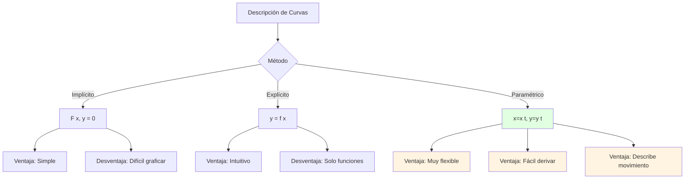

# 📐 Parametrizaciones Clásicas en ℝ² y ℝ³

## 🎯 Introducción

> [!info]- 💡 ¿Qué es una Parametrización?
> 
> Una **parametrización** es una forma de describir una curva o superficie usando uno o más parámetros. En lugar de usar ecuaciones implícitas o explícitas, expresamos cada coordenada como una función de parámetros independientes.
> 
> **Analogía práctica:** Imagina que quieres describir el movimiento de un auto en una carretera:
> 
> - **Forma implícita**: "El auto está en la carretera" (ecuación de la carretera)
> - **Forma paramétrica**: "En el tiempo t, el auto está en la posición (x(t), y(t))" (trayectoria con tiempo)
> 
> **¿Por qué es importante?**
> 
> |Aspecto|Descripción|Ejemplo de Uso|
> |---|---|---|
> |**Visualización**|Facilita graficar curvas complejas|Animaciones, trayectorias|
> |**Cálculo**|Simplifica derivadas e integrales|Longitud de arco, área|
> |**Física**|Describe movimiento natural|Posición vs tiempo|
> |**Diseño**|Base de CAD y gráficos|Curvas Bézier, splines|
> |**Flexibilidad**|Representa curvas no funcionales|Círculos, lazos|



---

## 📊 Fundamentos de Parametrización

### 🔤 Definiciones Básicas

> [!note]- 📝 Conceptos Fundamentales
> 
> **Curva Paramétrica en ℝ²:**
> 
> ```
> r(t) = (x(t), y(t))
> 
> donde:
> • t es el parámetro (usualmente tiempo)
> • x(t), y(t) son funciones continuas
> • t ∈ [a, b] es el dominio
> ```
> 
> **Curva Paramétrica en ℝ³:**
> 
> ```
> r(t) = (x(t), y(t), z(t))
> 
> donde:
> • t es el parámetro
> • x(t), y(t), z(t) son funciones continuas
> • t ∈ [a, b] es el dominio
> ```
> 
> **Propiedades importantes:**
> 
> |Propiedad|Fórmula|Interpretación|
> |---|---|---|
> |**Vector posición**|**r**(t)|Punto en la curva en tiempo t|
> |**Vector velocidad**|**v**(t) = **r**'(t)|Tasa de cambio de posición|
> |**Rapidez**|v(t) = \|**r**'(t)\||Magnitud de la velocidad|
> |**Vector tangente unitario**|**T**(t) = **r**'(t)/\|**r**'(t)\||Dirección de movimiento|
> |**Aceleración**|**a**(t) = **r**''(t)|Cambio en velocidad|
> 
> **Representación visual:**
> 
> ```mermaid
> graph TD
>     A[Curva Paramétrica r t] --> B[Componentes]
>     B --> C[x t: Posición horizontal]
>     B --> D[y t: Posición vertical]
>     B --> E[z t: Posición profundidad]
>     
>     A --> F[Derivadas]
>     F --> G[r' t: Velocidad]
>     F --> H[r'' t: Aceleración]
>     
>     G --> I[Propiedades]
>     I --> J[Magnitud: Rapidez]
>     I --> K[Dirección: Tangente]
>     
>     style A fill:#e1f5ff
>     style I fill:#e1ffe1
> ```

### 🔄 Reparametrización

> [!example]- 🔁 Cambio de Parámetro
> 
> **Concepto:** La misma curva puede tener múltiples parametrizaciones.
> 
> **Ejemplo:** Círculo unitario
> 
> ```
> Parametrización 1:
> r₁(t) = (cos(t), sin(t)),  t ∈ [0, 2π]
> 
> Parametrización 2:
> r₂(t) = (cos(2t), sin(2t)),  t ∈ [0, π]
> 
> Parametrización 3:
> r₃(t) = (cos(t²), sin(t²)),  t ∈ [0, √(2π)]
> ```
> 
> **Todas describen el mismo círculo**, pero a diferentes "velocidades".
> 
> **Comparación:**
> 
> |Parametrización|Rapidez \|r'(t)\||Periodo|Característica|
> |---|---|---|---|
> |r₁(t)|1 (constante)|2π|Velocidad uniforme|
> |r₂(t)|2 (constante)|π|Doble velocidad|
> |r₃(t)|2t (variable)|√(2π)|Acelera con el tiempo|
> 
> **Reparametrización por longitud de arco:**
> 
> La parametrización "natural" usa la distancia recorrida como parámetro:
> 
> ```
> s(t) = ∫₀ᵗ |r'(u)| du  (longitud de arco)
> 
> Entonces r(s) tiene |dr/ds| = 1
> ```
> 
> **Proceso de reparametrización:**
> 
> ```mermaid
> flowchart LR
>     A[Parametrización<br/>original r t] --> B[Calcular<br/>s t = ∫|r' u| du]
>     B --> C[Invertir<br/>t = t s]
>     C --> D[Nueva parametrización<br/>r s = r t s]
>     
>     D --> E[Propiedad:<br/>|dr/ds| = 1]
>     
>     style A fill:#e1f5ff
>     style D fill:#e1ffe1
>     style E fill:#fff4e1
> ```

---

## 🎨 Parametrizaciones Clásicas en ℝ²

### ⭕ Curvas Cerradas

> [!success]- 🔵 1. Círculo
> 
> **Ecuación implícita:** x² + y² = r²
> 
> **Parametrización estándar:**
> 
> ```
> r(t) = (r·cos(t), r·sin(t))
> t ∈ [0, 2π]
> 
> donde r > 0 es el radio
> ```
> 
> **Propiedades:**
> 
> |Propiedad|Cálculo|Valor|
> |---|---|---|
> |**Centro**|—|(0, 0)|
> |**Radio**|—|r|
> |**Velocidad**|r'(t)|(-r·sin(t), r·cos(t))|
> |**Rapidez**|\|r'(t)\||r (constante)|
> |**Perímetro**|∫₀²π r dt|2πr|
> 
> **Variantes importantes:**
> 
> ```
> • Círculo desplazado:
>   r(t) = (h + r·cos(t), k + r·sin(t))
>   Centro: (h, k)
> 
> • Sentido horario:
>   r(t) = (r·cos(-t), r·sin(-t))
>   = (r·cos(t), -r·sin(t))
> 
> • Círculo con velocidad variable:
>   r(t) = (r·cos(t²), r·sin(t²))
> ```
> 
> **Aplicaciones:**
> 
> - Movimiento circular uniforme en física
> - Ruedas y engranajes en ingeniería
> - Órbitas aproximadas en astronomía

> [!success]- 🔶 2. Elipse
> 
> **Ecuación implícita:** x²/a² + y²/b² = 1
> 
> **Parametrización estándar:**
> 
> ```
> r(t) = (a·cos(t), b·sin(t))
> t ∈ [0, 2π]
> 
> donde:
> • a = semieje mayor (horizontal)
> • b = semieje menor (vertical)
> ```
> 
> **Propiedades:**
> 
> |Propiedad|Fórmula|Notas|
> |---|---|---|
> |**Velocidad**|r'(t) = (-a·sin(t), b·cos(t))|Variable|
> |**Rapidez**|\|r'(t)\| = √(a²sin²t + b²cos²t)|No constante|
> |**Perímetro**|≈ π(a + b)·[1 + 3h/(10 + √(4-3h))]|h = (a-b)²/(a+b)²|
> |**Área**|πab|Fórmula exacta|
> 
> **Casos especiales:**
> 
> ```
> • a = b = r → Círculo
> • a > b → Elipse horizontal
> • a < b → Elipse vertical
> • a ≫ b → Elipse muy achatada
> ```
> 
> **Elementos geométricos:**
> 
> ```
> Focos: F₁ = (-c, 0), F₂ = (c, 0)
> donde c = √(a² - b²)  si a > b
> 
> Excentricidad: e = c/a
> • e = 0 → Círculo
> • 0 < e < 1 → Elipse
> ```
> 
> ```mermaid
> graph TD
>     A[Elipse<br/>x²/a² + y²/b² = 1] --> B[Parámetros]
>     B --> C[a: Semieje mayor]
>     B --> D[b: Semieje menor]
>     B --> E[c = √ a²-b²: Distancia focal]
>     
>     A --> F[Propiedades]
>     F --> G[Área = πab]
>     F --> H[Perímetro ≈ fórmula de Ramanujan]
>     F --> I[Excentricidad e = c/a]
>     
>     style A fill:#e1f5ff
>     style F fill:#e1ffe1
> ```

### 📈 Curvas Abiertas

> [!example]- 📏 3. Segmento de Recta
> 
> **Entre dos puntos P₀ = (x₀, y₀) y P₁ = (x₁, y₁):**
> 
> **Parametrización estándar:**
> 
> ```
> r(t) = (1-t)·P₀ + t·P₁
>      = ((1-t)x₀ + tx₁, (1-t)y₀ + ty₁)
> 
> t ∈ [0, 1]
> ```
> 
> **Interpretación:**
> 
> - t = 0 → Punto inicial P₀
> - t = 0.5 → Punto medio
> - t = 1 → Punto final P₁
> 
> **Forma alternativa (vector dirección):**
> 
> ```
> r(t) = P₀ + t·(P₁ - P₀)
>      = P₀ + t·v
> 
> donde v = P₁ - P₀ es el vector dirección
> ```
> 
> **Propiedades:**
> 
> |Propiedad|Valor|
> |---|---|
> |**Velocidad**|r'(t) = P₁ - P₀ = v (constante)|
> |**Rapidez**|\|v\| = distancia entre P₀ y P₁|
> |**Longitud**|∫₀¹ \|v\| dt = \|v\|·1 = \|P₁ - P₀\||
> 
> **Ejemplo numérico:**
> 
> ```
> P₀ = (1, 2), P₁ = (4, 6)
> 
> r(t) = (1 + 3t, 2 + 4t)
> 
> r(0) = (1, 2) ✓
> r(0.5) = (2.5, 4) [punto medio]
> r(1) = (4, 6) ✓
> 
> Longitud = √(3² + 4²) = 5
> ```

> [!example]- 📊 4. Parábola
> 
> **Ecuación explícita:** y = ax² + bx + c
> 
> **Parametrización natural:**
> 
> ```
> r(t) = (t, at² + bt + c)
> t ∈ ℝ (o intervalo específico)
> ```
> 
> **Forma estándar (vértice en origen):**
> 
> ```
> y = ax²  →  r(t) = (t, at²)
> 
> • a > 0: Abre hacia arriba
> • a < 0: Abre hacia abajo
> ```
> 
> **Propiedades:**
> 
> |Propiedad|Fórmula|
> |---|---|
> |**Vértice**|(-b/(2a), c - b²/(4a))|
> |**Velocidad**|r'(t) = (1, 2at + b)|
> |**Rapidez**|\|r'(t)\| = √(1 + (2at + b)²)|
> 
> **Ejemplo - Trayectoria de proyectil:**
> 
> ```
> Un objeto lanzado con velocidad inicial v₀ a ángulo θ:
> 
> x(t) = v₀·cos(θ)·t
> y(t) = v₀·sin(θ)·t - (g/2)·t²
> 
> donde g ≈ 9.8 m/s² (gravedad)
> 
> Eliminando t:
> y = x·tan(θ) - (g/(2v₀²cos²θ))·x²
> 
> → Parábola
> ```
> 
> ```mermaid
> graph TD
>     A[Parábola] --> B[Formas]
>     B --> C[Explícita: y = ax²]
>     B --> D[Paramétrica: t, at²]
>     B --> E[Física: Proyectil]
>     
>     E --> F[x = v₀cos θ·t]
>     E --> G[y = v₀sin θ·t - gt²/2]
>     
>     F --> H[Trayectoria<br/>parabólica]
>     G --> H
>     
>     style A fill:#e1f5ff
>     style H fill:#e1ffe1
> ```

### 🌀 Curvas Especiales

> [!tip]- 🌟 5. Cicloide
> 
> **Definición:** Curva trazada por un punto en el borde de un círculo que rueda sobre una línea recta.
> 
> **Parametrización:**
> 
> ```
> r(t) = (r(t - sin(t)), r(1 - cos(t)))
> 
> donde:
> • r = radio del círculo
> • t = ángulo de rotación
> ```
> 
> **Componentes:**
> 
> ```
> x(t) = r(t - sin(t))
> y(t) = r(1 - cos(t))
> 
> t ∈ [0, 2πn] para n arcos completos
> ```
> 
> **Propiedades notables:**
> 
> |Propiedad|Valor|Significado|
> |---|---|---|
> |**Altura máxima**|2r|Diámetro del círculo|
> |**Longitud de un arco**|8r|Famoso resultado|
> |**Área bajo un arco**|3πr²|Tres veces el área del círculo|
> |**Cúspides**|En t = 2πn|Puntos donde toca la línea|
> 
> **Historia:** La cicloide se llama "la Helena de la geometría" por las disputas que generó entre matemáticos en el siglo XVII.
> 
> **Aplicaciones:**
> 
> - Braquistocrona: Curva de descenso más rápido
> - Tautocrona: Tiempo de descenso independiente del punto inicial
> - Diseño de engranajes
> 
> ```mermaid
> graph LR
>     A[Círculo<br/>radio r] -->|Rueda| B[Punto en borde<br/>traza curva]
>     B --> C[Cicloide]
>     
>     C --> D[Propiedades<br/>especiales]
>     D --> E[Braquistocrona]
>     D --> F[Tautocrona]
>     
>     style C fill:#e1ffe1
>     style D fill:#fff4e1
> ```

> [!tip]- 🎯 6. Espiral de Arquímedes
> 
> **Ecuación polar:** r = aθ
> 
> **Parametrización cartesiana:**
> 
> ```
> r(t) = (at·cos(t), at·sin(t))
> 
> donde:
> • a > 0 es el factor de separación
> • t ≥ 0 es el ángulo en radianes
> ```
> 
> **Propiedades:**
> 
> |Propiedad|Descripción|
> |---|---|
> |**Espaciado**|Espirales separadas por 2πa|
> |**Crecimiento**|Lineal con el ángulo|
> |**Velocidad**|r'(t) = (a(cos(t) - t·sin(t)), a(sin(t) + t·cos(t)))|
> |**Uso**|Surcos de discos, resortes|
> 
> **Variantes de espirales:**
> 
> ```
> • Espiral logarítmica:
>   r(t) = (aeᵇᵗcos(t), aeᵇᵗsin(t))
>   Crece exponencialmente
> 
> • Espiral hiperbólica:
>   r = a/θ (en coordenadas polares)
>   r(t) = (a·cos(t)/t, a·sin(t)/t)
> ```

> [!tip]- 🌸 7. Rosa (Rhodonea)
> 
> **Ecuación polar:** r = a·cos(nθ) o r = a·sin(nθ)
> 
> **Parametrización cartesiana:**
> 
> ```
> r(t) = (a·cos(nt)·cos(t), a·cos(nt)·sin(t))
> 
> donde:
> • a > 0: Tamaño de pétalos
> • n: Número de pétalos (si n impar) o 2n (si n par)
> ```
> 
> **Número de pétalos:**
> 
> |n|Pétalos|Ejemplo|
> |---|---|---|
> |n = 1|1 (círculo)|r = a·cos(θ)|
> |n = 2|4 pétalos|r = a·cos(2θ)|
> |n = 3|3 pétalos|r = a·cos(3θ)|
> |n = 4|8 pétalos|r = a·cos(4θ)|
> |n impar|n pétalos|—|
> |n par|2n pétalos|—|
> 
> **Ejemplo - Rosa de 4 pétalos:**
> 
> ```
> r(t) = cos(2t)·cos(t), cos(2t)·sin(t)
> t ∈ [0, 2π]
> 
> Pétalos en ángulos: 0°, 90°, 180°, 270°
> ```

> [!tip]- ∞ 8. Lemniscata de Bernoulli
> 
> **Ecuación implícita:** (x² + y²)² = a²(x² - y²)
> 
> **Ecuación polar:** r² = a²·cos(2θ)
> 
> **Parametrización:**
> 
> ```
> r(t) = (a·cos(t)/(1 + sin²(t)), a·sin(t)·cos(t)/(1 + sin²(t)))
> 
> t ∈ [0, 2π]
> ```
> 
> **Forma alternativa (más simple):**
> 
> ```
> x(t) = a·√2·cos(t)/(sin²(t) + 1)
> y(t) = a·√2·cos(t)·sin(t)/(sin²(t) + 1)
> ```
> 
> **Propiedades:**
> 
> |Propiedad|Valor|
> |---|---|
> |**Forma**|Símbolo de infinito ∞|
> |**Centro**|(0, 0)|
> |**Ancho máximo**|2a|
> |**Área**|a²|
> 
> **Aplicación:** Representa los puntos cuyo producto de distancias a dos focos es constante.

---

## 🌐 Parametrizaciones Clásicas en ℝ³

### 🔵 Curvas Espaciales Fundamentales

> [!success]- 🌀 1. Hélice Circular
> 
> **Parametrización:**
> 
> ```
> r(t) = (R·cos(t), R·sin(t), ct)
> 
> donde:
> • R > 0: Radio de la hélice
> • c: Paso (altura por cada 2π radianes)
> • t ∈ ℝ o [0, 2πn] para n vueltas
> ```
> 
> **Componentes:**
> 
> ```
> x(t) = R·cos(t)  [movimiento circular en xy]
> y(t) = R·sin(t)  [movimiento circular en xy]
> z(t) = ct        [ascenso lineal]
> ```
> 
> **Propiedades:**
> 
> |Propiedad|Fórmula|Valor|
> |---|---|---|
> |**Velocidad**|r'(t)|(-R·sin(t), R·cos(t), c)|
> |**Rapidez**|\|r'(t)\||√(R² + c²) (constante)|
> |**Curvatura**|κ|R/(R² + c²)|
> |**Torsión**|τ|c/(R² + c²)|
> 
> **Longitud de n vueltas completas:**
> 
> ```
> L = ∫₀²πⁿ √(R² + c²) dt
>   = 2πn·√(R² + c²)
> ```
> 
> **Casos especiales:**
> 
> ```
> • c = 0: Círculo plano (no hélice)
> • R = 0: Línea vertical
> • c = R: Hélice con ángulo 45° respecto al plano xy
> • c ≫ R: Hélice muy empinada (casi vertical)
> • R ≫ c: Hélice muy extendida (casi horizontal)
> ```
> 
> **Aplicaciones:**
> 
> - Resortes y muelles
> - Escaleras de caracol
> - Hélice de ADN
> - Antenas helicoidales
> - Tornillos y roscas
> 
> ```mermaid
> graph TD
>     A[Hélice Circular] --> B[Componente horizontal<br/>Círculo radio R]
>     A --> C[Componente vertical<br/>Ascenso lineal ct]
>     
>     B --> D[Movimiento<br/>circular uniforme]
>     C --> E[Velocidad<br/>vertical constante]
>     
>     D --> F[Curva espacial<br/>no plana]
>     E --> F
>     
>     F --> G[Curvatura ≠ 0<br/>Torsión ≠ 0]
>     
>     style A fill:#e1f5ff
>     style F fill:#e1ffe1
>     style G fill:#fff4e1
> ```

> [!success]- 🎢 2. Curva de Viviani
> 
> **Definición:** Intersección de una esfera con un cilindro tangente.
> 
> **Parametrización:**
> 
> ```
> r(t) = (a·(1 + cos(t)), a·sin(t), 2a·sin(t/2))
> 
> donde a es el radio de la esfera
> t ∈ [0, 4π] para curva completa
> ```
> 
> **Forma alternativa (más común):**
> 
> ```
> r(t) = (a·cos²(t), a·cos(t)·sin(t), a·sin(t))
> t ∈ [0, 2π]
> ```
> 
> **Origen:** Es la intersección de:
> 
> ```
> Esfera: x² + y² + z² = a²
> Cilindro: (x - a/2)² + y² = (a/2)²
> ```
> 
> **Propiedades:**
> 
> |Propiedad|Descripción|
> |---|---|
> |**Forma**|Curva en forma de "8" en el espacio|
> |**Simetría**|Simétrica respecto al plano xz|
> |**Proyección xy**|Círculo de radio a/2|
> |**Proyección xz**|Cardioide|

> [!success]- 🔗 3. Nudo Trébol
> 
> **Parametrización:**
> 
> ```
> r(t) = (sin(t) + 2·sin(2t), cos(t) - 2·cos(2t), -sin(3t))
> 
> t ∈ [0, 2π]
> ```
> 
> **Variante más simple:**
> 
> ```
> r(t) = ((2 + cos(3t))·cos(2t), (2 + cos(3t))·sin(2t), sin(3t))
> ```
> 
> **Propiedades:**
> 
> - Es un nudo verdadero (no se puede desenredar sin cortar)
> - Tiene 3 cruces cuando se proyecta en un plano
> - Es el nudo no trivial más simple
> - Importante en teoría de nudos matemática
> 
> **Aplicaciones en física:** Modela líneas de campo magnético en plasmas.

### 🎨 Superficies Paramétricas Clásicas

> [!note]- 🌍 4. Esfera
> 
> **Ecuación implícita:** x² + y² + z² = R²
> 
> **Parametrización esférica:**
> 
> ```
> r(θ, φ) = (R·sin(φ)·cos(θ), R·sin(φ)·sin(θ), R·cos(φ))
> 
> donde:
> • θ ∈ [0, 2π]: Ángulo azimutal (longitud)
> • φ ∈ [0, π]: Ángulo polar (latitud desde polo norte)
> • R > 0: Radio
> ```
> 
> **Componentes:**
> 
> ```
> x(θ, φ) = R·sin(φ)·cos(θ)
> y(θ, φ) = R·sin(φ)·sin(θ)
> z(θ, φ) = R·cos(φ)
> ```
> 
> **Interpretación de ángulos:**
> 
> |Ángulo|Rango|Significado|Valores especiales|
> |---|---|---|---|
> |θ (theta)|[0, 2π]|Longitud/azimut|θ=0: eje x+; θ=π/2: eje y+|
> |φ (phi)|[0, π]|Latitud desde polo|φ=0: polo norte; φ=π/2: ecuador; φ=π: polo sur|
> 
> **Propiedades geométricas:**
> 
> |Propiedad|Fórmula|
> |---|---|
> |**Área**|4πR²|
> |**Volumen**|(4/3)πR³|
> |**Vector normal**|**n** = (x, y, z)/R|
> 
> **Curvas coordenadas:**
> 
> ```
> • Meridianos (θ constante):
>   Semicírculos del polo norte al polo sur
> 
> • Paralelos (φ constante):
>   Círculos horizontales
>   Radio del paralelo = R·sin(φ)
> ```
> 
> ```mermaid
> graph TD
>     A[Esfera Radio R] --> B[Coordenadas Esféricas]
>     B --> C[θ: Longitud<br/>0 a 2π]
> 	B --> D[φ: Latitud<br/>0 a π]
> 	A --> E[Curvas Coordenadas]
> 	E --> F[Meridianos<br/>θ = const]
> 	E --> G[Paralelos<br/>φ = const]
> 	F --> H[Semicírculos<br/>verticales]
> 	G --> I[Círculos<br/>horizontales]
> 
> style A fill:#e1f5ff
> style B fill:#e1ffe1
> ```

> [!note]- 🥐 5. Toro (Dona)
> 
> **Parametrización:**
> 
> ```
> r(u, v) = ((R + r·cos(v))·cos(u), (R + r·cos(v))·sin(u), r·sin(v))
> 
> donde:
> • R: Radio mayor (del centro al tubo)
> • r: Radio menor (del tubo)
> • u ∈ [0, 2π]: Ángulo alrededor del eje z
> • v ∈ [0, 2π]: Ángulo alrededor del tubo
> • Condición: R > r (toro estándar)
> ```
> 
> **Componentes:**
> 
> ```
> x(u, v) = (R + r·cos(v))·cos(u)
> y(u, v) = (R + r·cos(v))·sin(u)
> z(u, v) = r·sin(v)
> ```
> 
> **Propiedades:**
> 
> |Propiedad|Fórmula|
> |---|---|
> |**Área**|4π²Rr|
> |**Volumen**|2π²Rr²|
> |**Género**|1 (topológicamente)|
> 
> **Tipos de toros:**
> 
> ```
> • R > r: Toro estándar (forma de dona)
> • R = r: Toro cornudo (se toca en el centro)
> • R < r: Toro con auto-intersección
> ```
> 
> **Curvas coordenadas:**
> 
> ```
> • u constante: Círculos pequeños (sección del tubo)
> • v constante: Círculos grandes (alrededor del eje)
> ```
> 
> **Aplicaciones:**
> 
> - Tokamaks (reactores de fusión nuclear)
> - Topología: superficie de género 1
> - Juego del "snake" que envuelve

> [!note]- 🎪 6. Cilindro
> 
> **Ecuación implícita:** x² + y² = R²
> 
> **Parametrización:**
> 
> ```
> r(θ, z) = (R·cos(θ), R·sin(θ), z)
> 
> donde:
> • θ ∈ [0, 2π]: Ángulo alrededor del eje z
> • z ∈ [a, b] o z ∈ ℝ: Altura
> • R > 0: Radio
> ```
> 
> **Propiedades:**
> 
> |Propiedad|Fórmula (altura h)|
> |---|---|
> |**Área lateral**|2πRh|
> |**Área total**|2πR(R + h)|
> |**Volumen**|πR²h|
> 
> **Variantes:**
> 
> ```
> • Cilindro elíptico:
>   r(θ, z) = (a·cos(θ), b·sin(θ), z)
> 
> • Cilindro parabólico:
>   x = u, y = v, z = u²
> ```

> [!note]- 📐 7. Cono
> 
> **Ecuación implícita:** z² = a²(x² + y²)
> 
> **Parametrización:**
> 
> ```
> r(θ, h) = (h·cos(θ), h·sin(θ), a·h)
> 
> donde:
> • θ ∈ [0, 2π]: Ángulo azimutal
> • h ∈ [0, H]: Distancia radial
> • a: Pendiente del cono
> ```
> 
> **Forma alternativa (parámetro z):**
> 
> ```
> r(θ, z) = ((z/a)·cos(θ), (z/a)·sin(θ), z)
> 
> z ∈ [0, H]
> ```
> 
> **Propiedades:**
> 
> |Propiedad|Fórmula|
> |---|---|
> |**Área lateral**|πR√(R² + h²)|
> |**Volumen**|(1/3)πR²h|
> |**Generatriz**|√(R² + h²)|
> 
> donde R = radio de la base, h = altura

> [!note]- 🏔️ 8. Paraboloide
> 
> **Paraboloide Elíptico:** z = x²/a² + y²/b²
> 
> **Parametrización:**
> 
> ```
> r(u, v) = (u, v, u²/a² + v²/b²)
> 
> u, v ∈ ℝ (o región acotada)
> ```
> 
> **Forma polar (paraboloide circular, a = b = 1):**
> 
> ```
> r(r, θ) = (r·cos(θ), r·sin(θ), r²)
> 
> r ∈ [0, R], θ ∈ [0, 2π]
> ```
> 
> **Paraboloide Hiperbólico (silla de montar):** z = x²/a² - y²/b²
> 
> ```
> r(u, v) = (u, v, u²/a² - v²/b²)
> ```
> 
> **Propiedades:**
> 
> - Paraboloide elíptico: todas las secciones horizontales son elipses
> - Paraboloide hiperbólico: superficie reglada (formada por líneas rectas)
> - Aplicación: Antenas parabólicas, reflectores

---

## 🔧 Técnicas de Parametrización

### 📋 Estrategias Generales

> [!tip]- 🎯 Método 1: De Ecuación Implícita a Paramétrica
> 
> **Proceso:**
> 
> ```mermaid
> flowchart TD
>     A[Ecuación Implícita<br/>F x,y = 0 o F x,y,z = 0] --> B{Tipo de curva}
>     
>     B -->|Función| C[Despejar y = f x<br/>Usar x = t]
>     B -->|Cónica| D[Usar coordenadas<br/>apropiadas]
>     B -->|Otro| E[Buscar simetría<br/>o patrón]
>     
>     C --> F[r t = t, f t]
>     D --> G[Círculo: x=R cos t<br/>Elipse: x=a cos t]
>     E --> H[Parametrización<br/>específica]
>     
>     style A fill:#e1f5ff
>     style F fill:#e1ffe1
>     style G fill:#e1ffe1
>     style H fill:#e1ffe1
> ```
> 
> **Ejemplo 1: Círculo**
> 
> ```
> Implícita: x² + y² = 4
> 
> Estrategia: Usar identidad trigonométrica
> cos²(t) + sin²(t) = 1
> 
> Solución:
> x = 2cos(t)
> y = 2sin(t)
> 
> Verificación:
> x² + y² = 4cos²(t) + 4sin²(t) = 4 ✓
> ```
> 
> **Ejemplo 2: Hipérbola**
> 
> ```
> Implícita: x²/a² - y²/b² = 1
> 
> Estrategia: Usar identidad hiperbólica
> cosh²(t) - sinh²(t) = 1
> 
> Solución:
> x = a·cosh(t)
> y = b·sinh(t)
> ```
> 
> **Tabla de identidades útiles:**
> 
> |Ecuación|Identidad|Parametrización|
> |---|---|---|
> |x² + y² = r²|cos² + sin² = 1|(r cos t, r sin t)|
> |x²/a² + y²/b² = 1|cos² + sin² = 1|(a cos t, b sin t)|
> |x²/a² - y²/b² = 1|cosh² - sinh² = 1|(a cosh t, b sinh t)|
> |xy = c|—|(t, c/t)|

> [!tip]- 🔄 Método 2: Parametrización por Proyección
> 
> **Para superficies z = f(x, y):**
> 
> ```
> La parametrización natural es:
> r(u, v) = (u, v, f(u, v))
> 
> donde u, v recorren el dominio de f
> ```
> 
> **Ejemplo: Paraboloide**
> 
> ```
> Superficie: z = x² + y²
> 
> Parametrización cartesiana:
> r(u, v) = (u, v, u² + v²)
> 
> Parametrización polar (más simétrica):
> r(r, θ) = (r·cos(θ), r·sin(θ), r²)
> ```
> 
> **Ejemplo: Plano**
> 
> ```
> Superficie: z = ax + by + c
> 
> Parametrización:
> r(u, v) = (u, v, au + bv + c)
> ```

> [!tip]- 🌐 Método 3: Coordenadas Curvilíneas
> 
> **Sistemas comunes:**
> 
> **1. Coordenadas polares (ℝ²):**
> 
> ```
> x = r·cos(θ)
> y = r·sin(θ)
> 
> Jacobianodet|∂x/∂r  ∂x/∂θ|
>        |∂y/∂r  ∂y/∂θ| = r
> ```
> 
> **2. Coordenadas cilíndricas (ℝ³):**
> 
> ```
> x = ρ·cos(θ)
> y = ρ·sin(θ)
> z = z
> 
> Jacobiano = ρ
> ```
> 
> **3. Coordenadas esféricas (ℝ³):**
> 
> ```
> x = ρ·sin(φ)·cos(θ)
> y = ρ·sin(φ)·sin(θ)
> z = ρ·cos(φ)
> 
> Jacobiano = ρ²·sin(φ)
> ```
> 
> **Cuándo usar cada sistema:**
> 
> |Sistema|Usar para|Ejemplo|
> |---|---|---|
> |**Cartesiano**|Geometría simple|Planos, cubos|
> |**Polar**|Simetría circular (2D)|Círculos, espirales|
> |**Cilíndrico**|Simetría axial|Cilindros, conos|
> |**Esférico**|Simetría radial|Esferas, conos|

### 🎨 Construcción de Parametrizaciones

> [!example]- 🔨 Técnica: Superficies de Revolución
> 
> **Concepto:** Rotar una curva plana alrededor de un eje.
> 
> **Curva generatriz en plano xz:** z = f(x), x ≥ 0
> 
> **Rotación alrededor del eje z:**
> 
> ```
> r(x, θ) = (x·cos(θ), x·sin(θ), f(x))
> 
> θ ∈ [0, 2π]
> x ∈ [a, b]
> ```
> 
> **Ejemplos:**
> 
> **1. Esfera (rotar semicírculo):**
> 
> ```
> Curva: z = √(R² - x²), x ∈ [-R, R]
> 
> Superficie:
> r(x, θ) = (x·cos(θ), x·sin(θ), √(R² - x²))
> 
> (Equivalente a parametrización esférica)
> ```
> 
> **2. Cono (rotar línea):**
> 
> ```
> Curva: z = ax, x ∈ [0, H/a]
> 
> Superficie:
> r(x, θ) = (x·cos(θ), x·sin(θ), ax)
> ```
> 
> **3. Toro (rotar círculo):**
> 
> ```
> Curva en plano xz:
> (x - R)² + z² = r²
> 
> Parametrizar curva:
> x = R + r·cos(v)
> z = r·sin(v)
> 
> Rotar alrededor de eje z:
> r(u, v) = ((R + r·cos(v))·cos(u),
>            (R + r·cos(v))·sin(u),
>            r·sin(v))
> ```

> [!example]- 📐 Técnica: Superficies Regladas
> 
> **Definición:** Superficie generada por líneas rectas.
> 
> **Forma general:**
> 
> ```
> r(u, v) = α(u) + v·β(u)
> 
> donde:
> • α(u): Curva directriz
> • β(u): Vector director (varía con u)
> • v ∈ ℝ: Parámetro a lo largo de la recta
> ```
> 
> **Ejemplo 1: Cilindro**
> 
> ```
> α(u) = (R·cos(u), R·sin(u), 0)  [círculo base]
> β(u) = (0, 0, 1)                [dirección vertical]
> 
> r(u, v) = (R·cos(u), R·sin(u), v)
> ```
> 
> **Ejemplo 2: Cono**
> 
> ```
> α(u) = (0, 0, 0)              [vértice]
> β(u) = (cos(u), sin(u), a)    [dirección variable]
> 
> r(u, v) = (v·cos(u), v·sin(u), av)
> ```
> 
> **Ejemplo 3: Paraboloide Hiperbólico (silla)**
> 
> ```
> Dos familias de líneas rectas:
> 
> Familia 1:
> r(u, v) = (u + v, u - v, 2uv)
> 
> Familia 2:
> r(u, v) = (u - v, u + v, -2uv)
> ```

---

## 🎓 Problemas Resueltos

### 📝 Problema 1: Curva Plana

> [!example]- ✏️ Parametrizar la Astroide
> 
> **Enunciado:** Encuentre una parametrización de la astroide:
> 
> ```
> x^(2/3) + y^(2/3) = a^(2/3)
> ```
> 
> **Solución:**
> 
> **Paso 1: Reconocer la forma**
> 
> Esta ecuación sugiere usar potencias fraccionarias.
> 
> **Paso 2: Proponer parametrización**
> 
> Intentamos:
> 
> ```
> x = a·cos³(t)
> y = a·sin³(t)
> ```
> 
> **Paso 3: Verificar**
> 
> ```
> x^(2/3) = (a·cos³(t))^(2/3)
>         = a^(2/3)·cos²(t)
> 
> y^(2/3) = a^(2/3)·sin²(t)
> 
> Suma:
> x^(2/3) + y^(2/3) = a^(2/3)(cos²(t) + sin²(t))
>                   = a^(2/3) ✓
> ```
> 
> **Respuesta final:**
> 
> ```
> r(t) = (a·cos³(t), a·sin³(t))
> t ∈ [0, 2π]
> ```
> 
> **Propiedades:**
> 
> |Propiedad|Valor|
> |---|---|
> |**Forma**|Estrella de 4 puntas|
> |**Simetría**|Respecto a ambos ejes|
> |**Cúspides**|En (±a, 0) y (0, ±a)|
> |**Longitud**|6a|

### 📝 Problema 2: Curva Espacial

> [!example]- ✏️ Analizar Hélice Cónica
> 
> **Enunciado:** Una partícula se mueve según:
> 
> ```
> r(t) = (t·cos(t), t·sin(t), t)
> t ≥ 0
> ```
> 
> Encuentre: velocidad, rapidez, y la forma de la trayectoria.
> 
> **Paso 1: Calcular velocidad**
> 
> ```
> r'(t) = (cos(t) - t·sin(t), sin(t) + t·cos(t), 1)
> ```
> 
> **Paso 2: Calcular rapidez**
> 
> ```
> |r'(t)| = √[(cos(t) - t·sin(t))² + (sin(t) + t·cos(t))² + 1²]
> 
> Expandiendo:
> = √[cos²(t) - 2t·sin(t)·cos(t) + t²·sin²(t)
>    + sin²(t) + 2t·sin(t)·cos(t) + t²·cos²(t) + 1]
> 
> = √[1 + t² + 1]
> = √(t² + 2)
> ```
> 
> **Paso 3: Identificar la forma**
> 
> - Proyección en xy: espiral de Arquímedes r = t
> - Componente z: ascenso lineal z = t
> - La curva es una **hélice cónica** (el radio aumenta con la altura)
> 
> **Respuestas:**
> 
> ```
> Velocidad: r'(t) = (cos(t) - t·sin(t), sin(t) + t·cos(t), 1)
> Rapidez:   |r'(t)| = √(t² + 2)
> Forma:     Hélice cónica (espiral ascendente con radio creciente)
> ```

### 📝 Problema 3: Superficie

> [!example]- ✏️ Parametrizar Superficie de Revolución
> 
> **Enunciado:** Encuentre una parametrización de la superficie generada al rotar la curva y = e^x (x ≥ 0) alrededor del eje x.
> 
> **Solución:**
> 
> **Paso 1: Identificar curva generatriz**
> 
> ```
> Curva en plano xy: y = e^x, x ≥ 0
> ```
> 
> **Paso 2: Aplicar fórmula de revolución**
> 
> Al rotar alrededor del eje x:
> 
> ```
> x permanece igual: x = u
> y, z forman un círculo de radio e^u
> ```
> 
> **Paso 3: Parametrización**
> 
> ```
> r(u, v) = (u, e^u·cos(v), e^u·sin(v))
> 
> donde:
> • u ≥ 0 (a lo largo del eje x)
> • v ∈ [0, 2π] (ángulo de rotación)
> ```
> 
> **Verificación:**
> 
> ```
> En cualquier plano x = u:
> y² + z² = (e^u·cos(v))² + (e^u·sin(v))²
>         = e^(2u)(cos²(v) + sin²(v))
>         = e^(2u)
> 
> Por lo tanto: √(y² + z²) = e^u ✓
> 
> Que es equivalente a y = e^x cuando z = 0
> ```

---
## 📚 Ejercicios Propuestos

> [!note]- 💪 Problemas para Practicar
> 
> ### Nivel Básico
> 
> **1. Verificación de Parametrización**
> 
> ```
> Verifique que r(t) = (3cos(t), 4sin(t))
> parametriza la elipse x²/9 + y²/16 = 1
> ```
> 
> **2. Longitud de Segmento**
> 
> ```
> Calcule la longitud del segmento de
> r(t) = (1 + 2t, 3 - t, 4 + 3t), t ∈ [0, 1]
> ```
> 
> **3. Círculo en el Espacio**
> 
> ```
> Encuentre una parametrización del círculo:
> • Centro: (1, 2, 3)
> • Radio: 5
> • En el plano z = 3
> ```
> 
> ### Nivel Intermedio
> 
> **4. Curva de Intersección**
> 
> ```
> Parametrice la intersección de:
> • Cilindro: x² + y² = 4
> • Plano: z = x
> ```
> 
> **5. Hélice Elíptica**
> 
> ```
> Encuentre la rapidez de la partícula:
> r(t) = (3cos(t), 4sin(t), 5t)
> ```
> 
> **6. Superficie de Revolución**
> 
> ```
> Parametrice la superficie generada al
> rotar y = x² alrededor del eje y
> ```
> 
> ### Nivel Avanzado
> 
> **7. Curvatura de Hélice**
> 
> ```
> Para r(t) = (a·cos(t), a·sin(t), bt):
> a) Calcule la curvatura κ(t)
> b) Calcule la torsión τ(t)
> c) Muestre que ambas son constantes
> ```
> 
> **8. Lemniscata en 3D**
> 
> ```
> Extienda la lemniscata a 3D creando
> una superficie de revolución alrededor
> del eje x
> ```
> 
> **9. Optimización**
> 
> ```
> Encuentre el punto más cercano al origen
> en la curva r(t) = (t, t², t³)
> ```
> 
> ### Problemas de Aplicación
> 
> **10. Satélite**
> 
> ```
> Un satélite orbita la Tierra en órbita
> elíptica con:
> • Perigeo (mínima distancia): 400 km
> • Apogeo (máxima distancia): 1000 km
> • Radio terrestre: 6371 km
> 
> Parametrice la órbita
> ```
> 
> **11. Montaña Rusa**
> 
> ```
> Diseñe una montaña rusa usando:
> r(t) = (t·cos(t), t·sin(t), -0.1t²)
> 
> Calcule la aceleración máxima para
> verificar seguridad (< 4g)
> ```

---

## 🔗 Conexión con Otros Temas

> [!quote]- 🌟 Mapa Conceptual
> 
> ```mermaid
> mindmap
>   root((Parametrizaciones<br/>Clásicas))
>     Prerrequisitos
>       Trigonometría
>         Identidades
>         Funciones inversas
>       Cálculo
>         Derivadas
>         Integrales
>       Geometría Analítica
>         Cónicas
>         Superficies
>     Técnicas
>       Coordenadas Curvilíneas
>         Polares
>         Cilíndricas
>         Esféricas
>       Transformaciones
>         Rotación
>         Traslación
>         Escalamiento
>     Aplicaciones
>       Física
>         Cinemática
>         Dinámica
>         Campos
>       Ingeniería
>         CAD/CAM
>         Robótica
>         Estructuras
>       Computación
>         Gráficos
>         Animación
>         Simulación
>     Temas Avanzados
>       Geometría Diferencial
>         Curvatura
>         Torsión
>         Frenet-Serret
>       Topología
>         Género
>         Homotopía
>       Análisis Complejo
>         Curvas en ℂ
> ```
> 
> **Progresión del aprendizaje:**
> 
> |Tema Previo|Tema Actual|Tema Siguiente|
> |---|---|---|
> |Funciones vectoriales|**Parametrizaciones clásicas**|Vector tangente y normal|
> |Geometría analítica|**Curvas y superficies**|Intersección de superficies|
> |Coordenadas cartesianas|**Sistemas curvilíneos**|Integrales múltiples|
> |Derivadas|**Velocidad y aceleración**|Curvatura y torsión|

---

## ✅ Resumen y Puntos Clave

> [!success]- 📌 Conceptos Esenciales
> 
> ### Ideas Centrales
> 
> |Concepto|Forma General|Uso Principal|
> |---|---|---|
> |**Curva en ℝ²**|r(t) = (x(t), y(t))|Trayectorias planas|
> |**Curva en ℝ³**|r(t) = (x(t), y(t), z(t))|Trayectorias espaciales|
> |**Superficie**|r(u, v) = (x(u,v), y(u,v), z(u,v))|Objetos 3D|
> 
> ### Parametrizaciones Fundamentales
> 
> ```mermaid
> flowchart LR
>     A[Curvas Básicas] --> B[Círculo<br/>r cos t, r sin t]
>     A --> C[Elipse<br/>a cos t, b sin t]
>     A --> D[Hélice<br/>R cos t, R sin t, ct]
>     
>     E[Superficies Básicas] --> F[Esfera<br/>Coordenadas esféricas]
>     E --> G[Cilindro<br/>R cos θ, R sin θ, z]
>     E --> H[Toro<br/>Revolución de círculo]
>     
>     style A fill:#e1f5ff
>     style E fill:#e1ffe1
> ```
> 
> ### Fórmulas Clave
> 
> |Propiedad|Fórmula|
> |---|---|
> |**Velocidad**|v(t) = r'(t)|
> |**Rapidez**|v(t) = \|r'(t)\||
> |**Longitud**|L = ∫ₐᵇ \|r'(t)\| dt|
> |**Tangente unitario**|T(t) = r'(t)/\|r'(t)\||
> 
> ### Checklist de Parametrización
> 
> - [ ] Identificar el tipo de curva/superficie
> - [ ] Elegir sistema de coordenadas apropiado
> - [ ] Verificar que la parametrización cubre toda la curva
> - [ ] Especificar el dominio de los parámetros
> - [ ] Calcular derivadas si se necesitan propiedades
> - [ ] Verificar casos especiales (puntos singulares)
> 
> ### Errores Comunes
> 
> |Error|Corrección|
> |---|---|
> |Dominio incorrecto|Verificar que t ∈ [a, b] cubre la curva completa|
> |Velocidad cero|Revisar puntos donde r'(t) = 0|
> |Dirección equivocada|Verificar sentido de recorrido|
> |Olvido de dimensión|Curva: 1 parámetro; Superficie: 2 parámetros|

---

**Tags:** #cálculo-vectorial #parametrizaciones #curvas #superficies #geometría-analítica #coordenadas-curvilíneas #aplicaciones #física #ingeniería #gráficos-computacionales
