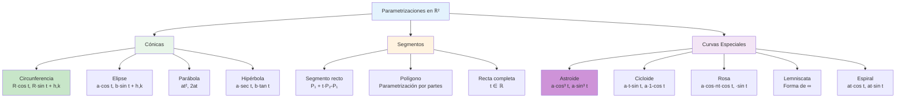

# 📐 Parametrizaciones Clásicas en ℝ²

## 🎯 Fundamentos de Parametrización

> [!info]- 💡 Introducción a las Curvas Parametrizadas Las **parametrizaciones** son una forma de describir curvas en el plano usando un **parámetro** (generalmente **t**) que varía en un intervalo. En lugar de expresar y en función de x (y = f(x)), describimos ambas coordenadas en función de t.
> 
> **Analogías útiles:**
> 
> - **Física:** La trayectoria de una partícula en función del tiempo
> - **Animación:** Los fotogramas de un objeto moviéndose en pantalla
> - **Navegación:** Un GPS registrando tu posición cada segundo
> 
> **Diferencia fundamental:**
> 
> - **Ecuación explícita:** y = x² (una coordenada depende de otra)
> - **Parametrización:** r(t) = (t, t²) (ambas coordenadas dependen de t)
> 
> **Ventajas de parametrizar:**
> 
> - Permite describir curvas que "dan vueltas" (como círculos)
> - Indica la dirección de recorrido (orientación)
> - Facilita el cálculo de velocidad y aceleración
> - Puede representar múltiples valores de y para un mismo x
> 
> **Importancia histórica:**
> 
> - **René Descartes (1637):** Geometría analítica
> - **Isaac Newton (1687):** Ecuaciones paramétricas en mecánica
> - **Leonhard Euler (1748):** Parametrizaciones de curvas especiales
> - **Joseph-Louis Lagrange (1788):** Mecánica analítica parametrizada

### 📝 Definición Formal

> [!note]- 🌟 Concepto Matemático de Parametrización **Definición:**
> 
> Una **parametrización** (o **curva parametrizada**) en ℝ² es una función vectorial:
> 
> **r**: [a, b] → ℝ²
> 
> **r(t) = (x(t), y(t))**
> 
> donde:
> 
> - **t** es el **parámetro** (generalmente representa el tiempo)
> - **[a, b]** es el **dominio** o intervalo de parametrización
> - **x(t)** e **y(t)** son **funciones componentes**
> - La imagen es el **trazo** o **curva** en el plano
> 
> **Notaciones equivalentes:**
> 
> - **r(t) = (x(t), y(t))** (notación de par ordenado)
> - **r(t) = x(t)**i** + y(t)**j** (notación vectorial)
> - **r(t) = ⟨x(t), y(t)⟩** (paréntesis angulares)
> 
> **Componentes de una parametrización:**
> 
> - **Punto inicial:** r(a) = (x(a), y(a))
> - **Punto final:** r(b) = (x(b), y(b))
> - **Orientación:** Dirección de recorrido al aumentar t
> - **Trazo:** Conjunto de todos los puntos {r(t) : t ∈ [a,b]}

### 🎨 Interpretación Geométrica

> [!tip]- 👁️ Visualización de Parametrizaciones **Representación gráfica:**
> 
> Una curva parametrizada se puede visualizar de dos formas:
> 
> **1. Tabla de valores:**
> 
> ```
> t    | x(t) | y(t) | Punto (x,y)
> -----|------|------|-------------
> t₀   | x₀   | y₀   | (x₀, y₀)
> t₁   | x₁   | y₁   | (x₁, y₁)
> t₂   | x₂   | y₂   | (x₂, y₂)
> ...  | ...  | ...  | ...
> ```
> 
> **2. Gráfica en el plano:**
> 
> - Trazar los puntos (x(t), y(t)) para varios valores de t
> - Unir los puntos con una curva suave
> - Indicar con flechas la dirección de orientación
> 
> **Características importantes:**
> 
> **1. Curvas cerradas:**
> 
> - r(a) = r(b): el punto inicial coincide con el final
> - Ejemplo: circunferencias, elipses
> 
> **2. Curvas simples:**
> 
> - No se intersectan a sí mismas
> - r(t₁) ≠ r(t₂) para t₁ ≠ t₂ (excepto posiblemente en los extremos)
> 
> **3. Orientación:**
> 
> - **Antihoraria (positiva):** Sentido contrario a las manecillas del reloj
> - **Horaria (negativa):** Sentido de las manecillas del reloj
> 
> **4. Re-parametrización:**
> 
> - La misma curva puede tener múltiples parametrizaciones
> - Ejemplo: r₁(t) = (cos t, sin t) y r₂(s) = (cos 2s, sin 2s) trazan el mismo círculo

## 🔵 Parametrización de Circunferencias

### ⭕ Circunferencia Centrada en el Origen

> [!example]- 🎯 Caso Fundamental **Circunferencia con centro en (0, 0) y radio R:**
> 
> **r(t) = (R cos t, R sin t), 0 ≤ t ≤ 2π**
> 
> **Características:**
> 
> - **Centro:** O = (0, 0)
> - **Radio:** R
> - **Orientación:** Antihoraria (contrareloj)
> - **Punto inicial:** r(0) = (R, 0) — comienza en el punto más a la derecha
> - **Punto final:** r(2π) = (R, 0) — termina donde comenzó
> 
> **Verificación (ecuación cartesiana):**
> 
> ```
> x = R cos t  →  x² = R² cos² t
> y = R sin t  →  y² = R² sin² t
> 
> Sumando: x² + y² = R²(cos² t + sin² t) = R² ✓
> ```
> 
> **Ejemplo numérico:**
> 
> Circunferencia de radio 3:
> 
> ```
> r(t) = (3 cos t, 3 sin t),  0 ≤ t ≤ 2π
> 
> Algunos puntos:
> t = 0:      r(0) = (3, 0)
> t = π/2:    r(π/2) = (0, 3)
> t = π:      r(π) = (-3, 0)
> t = 3π/2:   r(3π/2) = (0, -3)
> t = 2π:     r(2π) = (3, 0)
> ```

### 🎪 Circunferencia con Centro Arbitrario

> [!warning]- 📍 Fórmula General **Circunferencia con centro en (h, k) y radio R:**
> 
> **r(t) = (R cos t + h, R sin t + k), 0 ≤ t ≤ 2π**
> 
> **Forma vectorial alternativa:** **r(t) = (h, k) + R(cos t, sin t)**
> 
> **Interpretación:**
> 
> - **(h, k):** Vector de traslación (desplazamiento del centro)
> - **R(cos t, sin t):** Circunferencia unitaria escalada por R
> - La parametrización **traslada** el círculo centrado en el origen
> 
> **Propiedades:**
> 
> - **Punto inicial:** r(0) = (R + h, k)
> - **Punto más alto:** r(π/2) = (h, R + k)
> - **Punto más a la izquierda:** r(π) = (-R + h, k)
> - **Punto más bajo:** r(3π/2) = (h, -R + k)
> 
> **Ecuación cartesiana:**
> 
> ```
> x = R cos t + h  →  x - h = R cos t
> y = R sin t + k  →  y - k = R sin t
> 
> Elevando al cuadrado y sumando:
> (x - h)² + (y - k)² = R²  ✓
> ```
> 
> **Ejemplo práctico:**
> 
> Circunferencia con centro en (2, -3) y radio 5:
> 
> ```
> r(t) = (5 cos t + 2, 5 sin t - 3),  0 ≤ t ≤ 2π
> 
> Puntos clave:
> t = 0:      r(0) = (7, -3)     — punto más a la derecha
> t = π/2:    r(π/2) = (2, 2)    — punto más alto
> t = π:      r(π) = (-3, -3)    — punto más a la izquierda
> t = 3π/2:   r(3π/2) = (2, -8)  — punto más bajo
> ```

### 🔄 Variaciones de Orientación y Velocidad

> [!tip]- 🌀 Modificaciones de la Parametrización **1. Orientación horaria:**
> 
> Para recorrer la circunferencia en sentido horario:
> 
> ```
> r(t) = (R cos(-t) + h, R sin(-t) + k)
>      = (R cos t + h, -R sin t + k),  0 ≤ t ≤ 2π
> ```
> 
> O equivalentemente:
> 
> ```
> r(t) = (R cos t + h, R sin t + k),  0 ≤ t ≤ -2π
> ```
> 
> **2. Velocidad angular modificada:**
> 
> Para completar la vuelta en un intervalo [0, b]:
> 
> ```
> r(t) = (R cos(2πt/b) + h, R sin(2πt/b) + k),  0 ≤ t ≤ b
> ```
> 
> **3. Arco de circunferencia:**
> 
> Para recorrer solo parte del círculo (de ángulo α a β):
> 
> ```
> r(t) = (R cos t + h, R sin t + k),  α ≤ t ≤ β
> ```
> 
> **Ejemplo:** Semicircunferencia superior de radio 4 centrada en (1, 2):
> 
> ```
> r(t) = (4 cos t + 1, 4 sin t + 2),  0 ≤ t ≤ π
> ```

## 🥚 Parametrización de Elipses

### 📏 Elipse Centrada en el Origen

> [!success]- 🟢 Caso Base de Elipse **Elipse con centro en (0, 0) y semiejes a, b:**
> 
> **r(t) = (a cos t, b sin t), 0 ≤ t ≤ 2π**
> 
> **Características:**
> 
> - **Centro:** O = (0, 0)
> - **Semieje horizontal (mayor/menor):** a
> - **Semieje vertical (mayor/menor):** b
> - **Orientación:** Antihoraria
> - Si a > b: elipse **horizontal** (más ancha que alta)
> - Si a < b: elipse **vertical** (más alta que ancha)
> - Si a = b: **circunferencia** de radio a
> 
> **Puntos importantes:**
> 
> ```
> t = 0:      r(0) = (a, 0)      — vértice derecho
> t = π/2:    r(π/2) = (0, b)    — vértice superior
> t = π:      r(π) = (-a, 0)     — vértice izquierdo
> t = 3π/2:   r(3π/2) = (0, -b)  — vértice inferior
> ```
> 
> **Ecuación cartesiana:**
> 
> ```
> x = a cos t  →  x/a = cos t  →  (x/a)² = cos² t
> y = b sin t  →  y/b = sin t  →  (y/b)² = sin² t
> 
> Sumando: (x/a)² + (y/b)² = cos² t + sin² t = 1
> 
> Ecuación canónica: x²/a² + y²/b² = 1  ✓
> ```
> 
> **Ejemplo numérico:**
> 
> Elipse con a = 5, b = 3:
> 
> ```
> r(t) = (5 cos t, 3 sin t),  0 ≤ t ≤ 2π
> 
> Puntos:
> t = 0:      (5, 0)
> t = π/4:    (5/√2, 3/√2) ≈ (3.54, 2.12)
> t = π/2:    (0, 3)
> t = π:      (-5, 0)
> ```

### 🎪 Elipse con Centro Arbitrario

> [!warning]- 📍 Fórmula General de Elipse **Elipse con centro en (h, k) y semiejes a, b:**
> 
> **r(t) = (a cos t + h, b sin t + k), 0 ≤ t ≤ 2π**
> 
> **Interpretación:**
> 
> - La elipse centrada en el origen se **traslada** al punto (h, k)
> - **a:** distancia del centro a los vértices horizontales
> - **b:** distancia del centro a los vértices verticales
> 
> **Ecuación cartesiana:**
> 
> ```
> (x - h)²/a² + (y - k)²/b² = 1
> ```
> 
> **Elementos importantes:**
> 
> **Vértices:**
> 
> - Horizontales: (h ± a, k)
> - Verticales: (h, k ± b)
> 
> **Focos (si a > b, elipse horizontal):**
> 
> - c = √(a² - b²)
> - Focos: (h ± c, k)
> 
> **Excentricidad:**
> 
> - e = c/a = √(a² - b²)/a
> - 0 ≤ e < 1 (e = 0 para circunferencia)
> 
> **Ejemplo completo:**
> 
> Elipse con centro en (2, -1), a = 4, b = 3:
> 
> ```
> r(t) = (4 cos t + 2, 3 sin t - 1),  0 ≤ t ≤ 2π
> 
> Vértices:
> - Horizontales: (6, -1) y (-2, -1)
> - Verticales: (2, 2) y (2, -4)
> 
> Focos:
> c = √(16 - 9) = √7 ≈ 2.65
> Focos: (2 + √7, -1) y (2 - √7, -1)
> ```

### 🔁 Elipse Rotada

> [!note]- 🔄 Rotación de Ejes **Elipse rotada un ángulo θ respecto al origen:**
> 
> Para rotar la elipse **r(t) = (a cos t, b sin t)** un ángulo θ:
> 
> **r(t) = (a cos t · cos θ - b sin t · sin θ, a cos t · sin θ + b sin t · cos θ)**
> 
> **Con centro en (h, k):**
> 
> ```
> x(t) = a cos t · cos θ - b sin t · sin θ + h
> y(t) = a cos t · sin θ + b sin t · cos θ + k
> ```
> 
> **Matriz de rotación:**
> 
> ```
> [cos θ  -sin θ] [a cos t]   [h]
> [sin θ   cos θ] [b sin t] + [k]
> ```
> 
> **Ejemplo:** Elipse a = 4, b = 2, rotada 45° (π/4) con centro en (1, 1):
> 
> ```
> r(t) = (4 cos t · cos(π/4) - 2 sin t · sin(π/4) + 1,
>         4 cos t · sin(π/4) + 2 sin t · cos(π/4) + 1)
> 
>      = (4 cos t/√2 - 2 sin t/√2 + 1,
>         4 cos t/√2 + 2 sin t/√2 + 1)
> 
>      = (2√2 cos t - √2 sin t + 1,
>         2√2 cos t + √2 sin t + 1)
> ```

## 📏 Parametrización de Segmentos

### ➡️ Segmento de Recta

> [!example]- 🎯 Línea Recta Parametrizada **Segmento entre los puntos P₁ = (a₁, b₁) y P₂ = (a₂, b₂):**
> 
> **r(t) = (a₁ + (a₂ - a₁)t, b₁ + (b₂ - b₁)t), 0 ≤ t ≤ 1**
> 
> **Forma vectorial:** **r(t) = (1 - t)P₁ + tP₂** **r(t) = P₁ + t(P₂ - P₁)**
> 
> **Interpretación:**
> 
> - En t = 0: r(0) = P₁ (punto inicial)
> - En t = 1: r(1) = P₂ (punto final)
> - En t = 0.5: r(0.5) = punto medio del segmento
> - El parámetro t representa la **fracción** del recorrido
> 
> **Propiedades:**
> 
> - **Velocidad constante:** La partícula se mueve a velocidad uniforme
> - **Trayectoria rectilínea:** La curva es una línea recta
> - **Vector dirección:** **v** = P₂ - P₁ = (a₂ - a₁, b₂ - b₁)
> 
> **Ejemplo numérico:**
> 
> Segmento de A = (1, 2) a B = (5, 6):
> 
> ```
> r(t) = (1 + (5-1)t, 2 + (6-2)t)
>      = (1 + 4t, 2 + 4t),  0 ≤ t ≤ 1
> 
> Puntos intermedios:
> t = 0:    r(0) = (1, 2)      — punto A
> t = 0.25: r(0.25) = (2, 3)   — 25% del camino
> t = 0.5:  r(0.5) = (3, 4)    — punto medio
> t = 0.75: r(0.75) = (4, 5)   — 75% del camino
> t = 1:    r(1) = (5, 6)      — punto B
> ```
> 
> **Verificación del punto medio:**
> 
> ```
> Punto medio = ((a₁+a₂)/2, (b₁+b₂)/2)
>             = ((1+5)/2, (2+6)/2)
>             = (3, 4) = r(0.5) ✓
> ```

### 🔀 Variaciones del Segmento

> [!tip]- 🌈 Modificaciones de Velocidad **1. Recorrido en intervalo [0, L]:**
> 
> ```
> r(t) = (a₁ + (a₂-a₁)t/L, b₁ + (b₂-b₁)t/L),  0 ≤ t ≤ L
> ```
> 
> En este caso, t representa la distancia recorrida.
> 
> **2. Recorrido con velocidad no uniforme:**
> 
> ```
> r(t) = (a₁ + (a₂-a₁)t², b₁ + (b₂-b₁)t²),  0 ≤ t ≤ 1
> ```
> 
> La partícula acelera (comienza lento, termina rápido).
> 
> **3. Recorrido en sentido inverso:**
> 
> ```
> r(t) = (a₂ + (a₁-a₂)t, b₂ + (b₁-b₂)t),  0 ≤ t ≤ 1
> ```
> 
> O equivalentemente:
> 
> ```
> r(t) = (a₁ + (a₂-a₁)(1-t), b₁ + (b₂-b₁)(1-t)),  0 ≤ t ≤ 1
> ```
> 
> **4. Recta completa (extensión infinita):**
> 
> ```
> r(t) = (a₁ + (a₂-a₁)t, b₁ + (b₂-b₁)t),  t ∈ ℝ
> ```
> 
> Para t < 0 o t > 1, el punto está fuera del segmento.

### 🔺 Lados de un Polígono

> [!success]- 🔷 Parametrización por Partes **Triángulo con vértices A, B, C:**
> 
> Parametrización del contorno completo en [0, 3]:
> 
> ```
> r(t) = ⎧ A + (B-A)t           si 0 ≤ t ≤ 1
>        ⎨ B + (C-B)(t-1)       si 1 ≤ t ≤ 2
>        ⎩ C + (A-C)(t-2)       si 2 ≤ t ≤ 3
> ```
> 
> **Ejemplo:**
> 
> Triángulo con A = (0, 0), B = (4, 0), C = (2, 3):
> 
> ```
> r(t) = ⎧ (4t, 0)                      si 0 ≤ t ≤ 1 (lado AB)
>        ⎨ (4-2(t-1), 3(t-1))          si 1 ≤ t ≤ 2 (lado BC)
>        ⎩ (2(3-t), 3(3-t))            si 2 ≤ t ≤ 3 (lado CA)
> ```
> 
> **Cuadrado con vértices en (0,0), (1,0), (1,1), (0,1):**
> 
> ```
> r(t) = ⎧ (t, 0)           si 0 ≤ t ≤ 1
>        ⎨ (1, t-1)         si 1 ≤ t ≤ 2
>        ⎨ (3-t, 1)         si 2 ≤ t ≤ 3
>        ⎩ (0, 4-t)         si 3 ≤ t ≤ 4
> ```

## ⭐ Curvas Especiales

### 🌺 Astroide (Hipocicloide de 4 Puntas)

> [!warning]- 🔶 Curva en Forma de Estrella **Hipocicloide de cuatro puntas (astroide):**
> 
> **r(t) = (a cos³ t, a sin³ t), 0 ≤ t ≤ 2π**
> 
> **Características:**
> 
> - **Nombre:** Del griego "aster" (estrella)
> - Curva con **4 cúspides** (puntas)
> - **Simetría:** Respecto a ambos ejes y al origen
> - Contenida en el cuadrado [-a, a] × [-a, a]
> 
> **Puntos importantes:**
> 
> ```
> t = 0:      r(0) = (a, 0)        — cúspide derecha
> t = π/2:    r(π/2) = (0, a)      — cúspide superior
> t = π:      r(π) = (-a, 0)       — cúspide izquierda
> t = 3π/2:   r(3π/2) = (0, -a)    — cúspide inferior
> ```
> 
> **Ecuación cartesiana:**
> 
> ```
> x = a cos³ t  →  x^(2/3) = a^(2/3) cos² t
> y = a sin³ t  →  y^(2/3) = a^(2/3) sin² t
> 
> Sumando: x^(2/3) + y^(2/3) = a^(2/3)
> ```
> 
> **Propiedades:**
> 
> - **Longitud total:** L = 6a
> - **Área encerrada:** A = (3πa²)/8
> - Las cúspides están en los ejes coordenados
> 
> **Ejemplo con a = 2:**
> 
> ```
> r(t) = (2 cos³ t, 2 sin³ t),  0 ≤ t ≤ 2π
> 
> Algunos puntos:
> t = 0:      (2, 0)
> t = π/4:    (√2/2, √2/2) ≈ (0.71, 0.71)
> t = π/2:    (0, 2)
> t = 3π/4:   (-√2/2, √2/2) ≈ (-0.71, 0.71)
> ```
> 
> **Origen geométrico:**
> 
> Se genera cuando un círculo de radio a/4 rueda **dentro** de un círculo de radio a.

### 🌀 Cicloide

> [!note]- 🎡 Curva de una Rueda que Rueda **Cicloide estándar:**
> 
> **r(t) = (a(t - sin t), a(1 - cos t)), t ∈ ℝ**
> 
> **Características:**
> 
> - Trayectoria de un punto en el borde de una rueda de radio **a** que rueda
> - **Arcos periódicos:** Se repite cada 2πa en x
> - **Altura máxima:** 2a
> - **Puntos de contacto:** y = 0 (cúspides hacia abajo)
> 
> **Propiedades notables:**
> 
> - **Curva tautócrona:** Tiempo de caída es independiente del punto inicial
> - **Curva braquistócrona:** Camino de descenso más rápido bajo gravedad
> - **Longitud de un arco:** L = 8a
> - **Área bajo un arco:** A = 3πa²
> 
> **Ejemplo con a = 1:**
> 
> ```
> r(t) = (t - sin t, 1 - cos t)
> 
> Puntos:
> t = 0:      (0, 0)        — cúspide inicial
> t = π:      (π, 2)        — punto más alto del arco
> t = 2π:     (2π, 0)       — cúspide siguiente
> ```

### 🌸 Rosa de n Pétalos

> [!info]- 🌹 Curvas en Forma de Flor **Rosa con n pétalos (n impar):**
> 
> **r(t) = (a cos(nt) · cos t, a cos(nt) · sin t), 0 ≤ t ≤ π**
> 
> **Rosa con 2n pétalos (n par):**
> 
> **r(t) = (a cos(nt) · cos t, a cos(nt) · sin t), 0 ≤ t ≤ 2π**
> 
> **Forma polar (más simple):**
> 
> r = a cos(nθ) o r = a sin(nθ)
> 
> **Características:**
> 
> - Si n es **impar:** la rosa tiene **n pétalos**
> - Si n es **par:** la rosa tiene **2n pétalos**
> - **a:** longitud máxima de los pétalos
> 
> **Ejemplos:**
> 
> **Rosa de 3 pétalos (n = 3):**
> 
> ```
> Polar: r = a cos(3θ)
> Cartesiana: x = a cos(3t) · cos t
>             y = a cos(3t) · sin t,  0 ≤ t ≤ π
> ```
> 
> **Rosa de 4 pétalos (n = 2):**
> 
> ```
> Polar: r = a cos(2θ)
> Cartesiana: x = a cos(2t) · cos t
>             y = a cos(2t) · sin t,  0 ≤ t ≤ 2π
> ```

### 🌊 Lemniscata de Bernoulli

> [!success]- ∞ Curva en Forma de Ocho **Lemniscata (símbolo de infinito):**
> 
> **r(t) = (a√2 · cos t / (1 + sin² t), a√2 · sin t · cos t / (1 + sin² t))**
> 
> **Forma polar (más simple):**
> 
> r² = a² cos(2θ)
> 
> **Forma paramétrica alternativa:**
> 
> ```
> x(t) = a cos t / (1 + sin² t)
> y(t) = a sin t · cos t / (1 + sin² t),  0 ≤ t ≤ 2π
> ```
> 
> **Características:**
> 
> - **Forma:** Número "8" acostado (∞)
> - **Simetría:** Respecto a ambos ejes
> - **Punto de auto-intersección:** (0, 0)
> - **Longitud total:** L = 2a√2 · E(1/√2) ≈ 5.24a (E es integral elíptica)
> 
> **Propiedades:**
> 
> - Lugar geométrico de puntos cuyo producto de distancias a dos focos fijos es constante
> - Los focos están en (±a/√2, 0)

### 🌀 Espiral de Arquímedes

> [!tip]- 🐚 Curva Espiral Uniforme **Espiral de Arquímedes:**
> 
> **r(t) = (at · cos t, at · sin t), t ≥ 0**
> 
> **Forma polar:**
> 
> r = aθ
> 
> **Características:**
> 
> - **Crecimiento uniforme:** La distancia al origen aumenta linealmente con el ángulo
> - **Espaciado constante:** Cada vuelta aumenta la distancia en 2πa
> - **Centro:** (0, 0)
> - No tiene límite superior (espiral infinita)
> 
> **Ejemplo con a = 1:**
> 
> ```
> r(t) = (t cos t, t sin t),  t ≥ 0
> 
> Puntos:
> t = 0:      (0, 0)
> t = π:      (-π, 0) ≈ (-3.14, 0)
> t = 2π:     (2π, 0) ≈ (6.28, 0)
> t = 3π:     (-3π, 0) ≈ (-9.42, 0)
> ```
> 
> **Aplicaciones:**
> 
> - Surcos de discos de vinilo
> - Brazos espirales de galaxias
> - Crecimiento de conchas marinas

## 🎨 Diagrama de Parametrizaciones



## 📊 Tabla Resumen de Parametrizaciones

> [!example]- 📋 Compendio de Fórmulas
> 
> |Curva|Parametrización|Intervalo|Características|
> |---|---|---|---|
> |**Circunferencia**|r(t) = (R cos t + h, R sin t + k)|[0, 2π]|Radio R, centro (h,k)|
> |**Elipse**|r(t) = (a cos t + h, b sin t + k)|[0, 2π]|Semiejes a, b|
> |**Segmento**|r(t) = P₁ + t(P₂ - P₁)|[0, 1]|De P₁ a P₂|
> |**Astroide**|r(t) = (a cos³ t, a sin³ t)|[0, 2π]|4 cúspides|
> |**Cicloide**|r(t) = a(t - sin t, 1 - cos t)|ℝ|Rueda rodando|
> |**Rosa n-pétalos**|r = a cos(nθ)|Varía|n o 2n pétalos|
> |**Lemniscata**|r² = a² cos(2θ)|[0, 2π]|Forma de ∞|
> |**Espiral Arquímedes**|r(t) = (at cos t, at sin t)|[0, ∞)|Crecimiento uniforme|
> |**Parábola**|r(t) = (t, at²)|ℝ|Eje vertical|
> |**Hipérbola**|r(t) = (a sec t, b tan t)|(-π/2, π/2) ∪ (π/2, 3π/2)|Dos ramas|

## 🧮 Propiedades de Parametrizaciones

### 📐 Cálculo con Curvas Parametrizadas

> [!note]- 🔢 Derivadas y Velocidad **Dada r(t) = (x(t), y(t)):**
> 
> **1. Vector velocidad:**
> 
> ```
> r'(t) = (x'(t), y'(t)) = (dx/dt, dy/dt)
> ```
> 
> - Tangente a la curva en cada punto
> - Apunta en la dirección del movimiento
> 
> **2. Rapidez (magnitud de la velocidad):**
> 
> ```
> ||r'(t)|| = √[(x'(t))² + (y'(t))²]
> ```
> 
> **3. Vector aceleración:**
> 
> ```
> r''(t) = (x''(t), y''(t))
> ```
> 
> **Ejemplo:**
> 
> Circunferencia r(t) = (R cos t, R sin t):
> 
> ```
> Velocidad: r'(t) = (-R sin t, R cos t)
> Rapidez: ||r'(t)|| = √(R² sin² t + R² cos² t) = R
> Aceleración: r''(t) = (-R cos t, -R sin t) = -r(t)
> ```
> 
> La aceleración apunta siempre hacia el centro.

### 📏 Longitud de Arco

> [!warning]- 📐 Fórmula de Longitud **Longitud de la curva r(t) = (x(t), y(t)) de t = a hasta t = b:**
> 
> **L = ∫ₐᵇ ||r'(t)|| dt = ∫ₐᵇ √[(x'(t))² + (y'(t))²] dt**
> 
> **Ejemplos:**
> 
> **1. Segmento de (0,0) a (3,4):**
> 
> ```
> r(t) = (3t, 4t),  0 ≤ t ≤ 1
> r'(t) = (3, 4)
> ||r'(t)|| = √(9 + 16) = 5
> 
> L = ∫₀¹ 5 dt = 5 · 1 = 5  ✓
> ```
> 
> **2. Circunferencia de radio R:**
> 
> ```
> r(t) = (R cos t, R sin t),  0 ≤ t ≤ 2π
> r'(t) = (-R sin t, R cos t)
> ||r'(t)|| = R
> 
> L = ∫₀²π R dt = R · 2π = 2πR  ✓
> ```
> 
> **3. Astroide con a = 1:**
> 
> ```
> r(t) = (cos³ t, sin³ t),  0 ≤ t ≤ 2π
> r'(t) = (-3 cos² t · sin t, 3 sin² t · cos t)
> ||r'(t)|| = 3|cos t · sin t|
> 
> Por simetría, L = 4∫₀^(π/2) 3 cos t · sin t dt = 6
> ```

### 🔄 Re-parametrización

> [!tip]- 🔁 Cambio de Parámetro **Definición:**
> 
> Dos parametrizaciones r₁(t) y r₂(s) describen la **misma curva** si existe una función suave φ tal que:
> 
> **r₁(t) = r₂(φ(t))**
> 
> **Ejemplo:**
> 
> Circunferencia unitaria:
> 
> ```
> r₁(t) = (cos t, sin t),       0 ≤ t ≤ 2π
> r₂(s) = (cos 2s, sin 2s),     0 ≤ s ≤ π
> 
> Con φ(s) = 2s, tenemos r₂(s) = r₁(2s)
> ```
> 
> **Re-parametrización por longitud de arco:**
> 
> Parametrización "natural" donde la rapidez es siempre 1:
> 
> ```
> s(t) = ∫₀ᵗ ||r'(u)|| du
> 
> Luego resolver t = t(s) e invertir para obtener r(s)
> ```

## 💪 Ejercicios Integrales

> [!example]- 🎯 Práctica Completa **Nivel 1 - Básico:** 🟢
> 
> **1.** Parametrizar la circunferencia de radio 5 centrada en (2, -3).
> 
> **Solución:**
> 
> ```
> r(t) = (5 cos t + 2, 5 sin t - 3),  0 ≤ t ≤ 2π
> 
> Verificación en t = π/2:
> r(π/2) = (0 + 2, 5 - 3) = (2, 2)
> Distancia al centro: √[(2-2)² + (2-(-3))²] = 5 ✓
> ```
> 
> **2.** Encontrar la parametrización del segmento de A = (1, 3) a B = (7, -1).
> 
> **Solución:**
> 
> ```
> r(t) = (1, 3) + t[(7, -1) - (1, 3)]
>      = (1, 3) + t(6, -4)
>      = (1 + 6t, 3 - 4t),  0 ≤ t ≤ 1
> 
> Verificación:
> r(0) = (1, 3) = A ✓
> r(1) = (7, -1) = B ✓
> r(0.5) = (4, 1) = punto medio ✓
> ```
> 
> ---
> 
> **Nivel 2 - Intermedio:** 🟡
> 
> **3.** Parametrizar la elipse con ecuación (x-1)²/16 + (y+2)²/9 = 1.
> 
> **Solución:**
> 
> ```
> Centro: (h, k) = (1, -2)
> Semiejes: a = 4, b = 3
> 
> r(t) = (4 cos t + 1, 3 sin t - 2),  0 ≤ t ≤ 2π
> 
> Vértices:
> Horizontales: (5, -2) y (-3, -2)
> Verticales: (1, 1) y (1, -5)
> ```
> 
> **4.** Calcular la longitud de un arco de astroide r(t) = (cos³ t, sin³ t) de t = 0 a t = π/2.
> 
> **Solución:**
> 
> ```
> r'(t) = (-3 cos² t · sin t, 3 sin² t · cos t)
> 
> ||r'(t)|| = √[9 cos⁴ t · sin² t + 9 sin⁴ t · cos² t]
>          = 3|cos t · sin t|√[cos² t + sin² t]
>          = 3 cos t · sin t  (en [0, π/2])
> 
> L = ∫₀^(π/2) 3 cos t · sin t dt
>   = 3/2 ∫₀^(π/2) sin(2t) dt
>   = 3/2 · [-cos(2t)/2]₀^(π/2)
>   = 3/2 · [(-(-1))/2 - (-1)/2]
>   = 3/2 · 1 = 3/2
> ```
> 
> ---
> 
> **Nivel 3 - Avanzado:** 🔴
> 
> **5.** Encontrar la parametrización del triángulo con vértices en (0,0), (3,0), (0,4), recorrido en [0,3].
> 
> **Solución:**
> 
> ```
> r(t) = ⎧ (3t, 0)                    si 0 ≤ t ≤ 1
>        ⎨ (3(2-t), 4(t-1))          si 1 ≤ t ≤ 2
>        ⎩ (0, 4(3-t))               si 2 ≤ t ≤ 3
> 
> Verificación:
> r(0) = (0, 0) ✓
> r(1) = (3, 0) ✓
> r(2) = (0, 4) ✓
> r(3) = (0, 0) ✓  (curva cerrada)
> ```
> 
> **6.** Una partícula se mueve en una elipse x²/25 + y²/16 = 1. En t = 0 está en (5, 0) y completa una vuelta en 10 segundos. Encontrar r(t) y su velocidad.
> 
> **Solución:**
> 
> ```
> Para completar 2π en 10 segundos: ω = 2π/10 = π/5
> 
> r(t) = (5 cos(πt/5), 4 sin(πt/5)),  0 ≤ t ≤ 10
> 
> Velocidad:
> r'(t) = (-5 · π/5 · sin(πt/5), 4 · π/5 · cos(πt/5))
>       = (-π sin(πt/5), 4π/5 · cos(πt/5))
> 
> Rapidez:
> ||r'(t)|| = √[π² sin²(πt/5) + 16π²/25 · cos²(πt/5)]
> 
> En t = 0:
> r(0) = (5, 0) ✓
> r'(0) = (0, 4π/5) ≈ (0, 2.51) m/s
> ```

## 🎓 Consejos de Estudio

> [!tip]- 🧠 Estrategias de Dominio **Para dominar parametrizaciones:**
> 
> **1. Visualización:**
> 
> - Graficar curvas usando software (GeoGebra, Desmos, WolframAlpha)
> - Crear tablas de valores para varios t
> - Dibujar flechas indicando la orientación
> 
> **2. Práctica de cálculos:**
> 
> - Verificar ecuaciones cartesianas desde paramétricas
> - Calcular puntos específicos para diferentes t
> - Encontrar velocidades y aceleraciones
> 
> **3. Reconocimiento de patrones:**
> 
> - Identificar curvas por su forma paramétrica
> - Reconocer modificaciones (traslaciones, rotaciones, escalamientos)
> 
> **Errores comunes a evitar:**
> 
> ❌ **Error 1:** Confundir el intervalo de parametrización
> 
> - Para circunferencia completa: [0, 2π], NO [0, π]
> 
> ❌ **Error 2:** Olvidar la traslación del centro
> 
> - Circunferencia en (h,k): (R cos t + h, R sin t + k)
> - NO simplemente (R cos t, R sin t)
> 
> ❌ **Error 3:** Intercambiar a y b en elipses
> 
> - a es el semieje asociado a cos t
> - b es el semieje asociado a sin t
> 
> ❌ **Error 4:** Confundir orientación
> 
> - (cos t, sin t): antihoraria
> - (cos t, -sin t): horaria
> 
> ❌ **Error 5:** Intervalo incorrecto para segmentos
> 
> - De P₁ a P₂: [0, 1]
> - NO [0, 2π] (eso es para curvas cerradas)
}

## 🔗 Referencias a Otras Notas

> [!quote]- 🌟 Conexiones Conceptuales
> 
> **Fundamentos previos (Prerequisites):**
> 
> - [[01.1 Sistema de Referencia Espacial]] - Base del plano cartesiano ℝ²
> - [[02 - Vectores en R3]] - Notación vectorial y operaciones fundamentales
> - [[Funciones Trigonométricas]] - Seno, coseno y sus propiedades
> - [[Geometría Analítica Básica]] - Ecuaciones de cónicas
> - [[Álgebra Vectorial]] - Suma de vectores y multiplicación escalar
> 
> **Teoría relacionada de cónicas:**
> 
> - [[Circunferencia - Ecuación Cartesiana]] - Forma (x-h)² + (y-k)² = R²
> - [[Elipse - Propiedades]] - Focos, excentricidad, semiejes
> - [[Parábola]] - Parametrización y ecuación canónica
> - [[Hipérbola]] - Dos ramas y asíntotas
> - [[Secciones Cónicas]] - Clasificación general
> 
> **Temas siguientes en cálculo:**
> 
> - [[Derivadas de Funciones Vectoriales]] - Vectores velocidad y aceleración
> - [[Integrales de Línea]] - Trabajo y circulación a lo largo de curvas
> - [[Longitud de Arco]] - Cálculo de distancias en curvas
> - [[Curvatura]] - Medida de "curvamiento" de una curva
> - [[Vector Tangente y Normal]] - Base móvil de Frenet
> 
> **Extensión a tres dimensiones:**
> 
> - [[Parametrizaciones en R3]] - Curvas en el espacio tridimensional
> - [[Hélice Circular]] - Curva espiral ascendente
> - [[Curvas de Nivel]] - Intersección de superficies con planos
> - [[Superficies Paramétricas]] - Extensión a 2 parámetros
> 
> **Aplicaciones en física:**
> 
> - [[Cinemática del Punto]] - Movimiento de partículas
> - [[Movimiento Circular]] - Parametrización y velocidad angular
> - [[Trayectorias de Proyectiles]] - Movimiento parabólico
> - [[Movimiento Armónico Simple]] - Oscilaciones y proyección circular
> - [[Órbitas Planetarias]] - Elipses de Kepler
> 
> **Geometría diferencial:**
> 
> - [[Curvas Regulares]] - Condiciones de suavidad
> - [[Parametrización por Longitud de Arco]] - Parametrización natural
> - [[Teorema Fundamental de Curvas Planas]] - Curvatura determina la curva
> - [[Envolvente de Curvas]] - Familia de curvas paramétricas
> 
> **Curvas especiales avanzadas:**
> 
> - [[Epicicloide]] - Rueda rodando sobre otra rueda (exterior)
> - [[Hipocicloide General]] - n cúspides, generalización del astroide
> - [[Espirales]] - Arquímedes, logarítmica, hiperbólica
> - [[Curvas de Bézier]] - Gráficos computacionales y diseño
> - [[Curvas de Hermite]] - Interpolación con derivadas especificadas
> - [[Splines Cúbicos]] - Curvas suaves por partes
> 
> **Herramientas computacionales:**
> 
> - [[GeoGebra - Curvas Paramétricas]] - Visualización interactiva
> - [[Python - Matplotlib]] - Graficación de curvas con código
> - [[Desmos - Parametrizaciones]] - Calculadora gráfica online
> - [[WolframAlpha]] - Análisis simbólico de curvas
> 
> **Tópicos avanzados:**
> 
> - [[Coordenadas Polares]] - Otra forma de parametrizar curvas
> - [[Transformaciones de Parametrizaciones]] - Re-parametrización y cambios
> - [[Curvas Implícitas vs Paramétricas]] - Ventajas y conversiones
> - [[Teoría de Curvas Algebraicas]] - Estudio abstracto de curvas
> - [[Topología de Curvas]] - Propiedades invariantes

---

**Tags:** #parametrizaciones #curvas-parametrizadas #circunferencia #elipse #segmento #astroide #cicloide #rosa #lemniscata #espiral #geometría-analítica #cálculo-vectorial #curvas-planas #R2 #university #matemáticas #referencias #enlaces-conceptuales