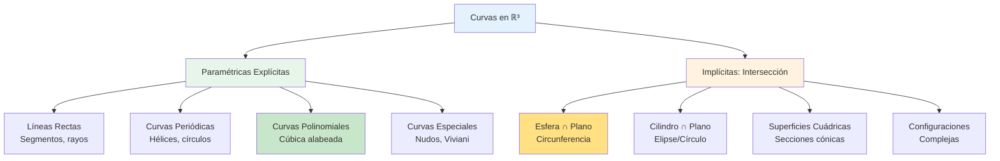

# 🌐 Parametrizaciones en ℝ³

## 🎯 Fundamentos de Curvas en el Espacio

> [!info]- 💡 Introducción a las Curvas Tridimensionales Las **parametrizaciones en ℝ³** son funciones vectoriales que describen curvas en el espacio tridimensional usando un parámetro (generalmente **t**). A diferencia de las curvas planas, estas pueden "elevarse" y "descender" en la tercera dimensión, creando trayectorias más complejas.
> 
> **Analogías útiles:**
> 
> - **Aviación:** La ruta de un avión que asciende, gira y desciende
> - **Montaña rusa:** El recorrido completo con subidas, bajadas y curvas
> - **ADN:** La doble hélice que se enrolla en el espacio
> - **Resorte:** Un muelle estirado que forma una espiral ascendente
> 
> **Diferencia fundamental:**
> 
> - **Curvas en ℝ²:** r(t) = (x(t), y(t)) — movimiento en un plano
> - **Curvas en ℝ³:** r(t) = (x(t), y(t), z(t)) — movimiento en el espacio
> 
> **Ventajas de parametrizar en 3D:**
> 
> - Describe trayectorias espaciales realistas
> - Permite modelar movimientos con cambios de altura
> - Fundamental para gráficos 3D y animaciones
> - Esencial en mecánica celeste y dinámica de fluidos
> 
> **Importancia histórica:**
> 
> - **Galileo Galilei (1638):** Trayectorias de proyectiles
> - **Isaac Newton (1687):** Órbitas planetarias en 3D
> - **Augustin-Louis Cauchy (1821):** Funciones complejas como curvas
> - **Bernhard Riemann (1854):** Geometría de variedades

### 📝 Definición Formal

> [!note]- 🌟 Concepto Matemático de Parametrización Espacial **Definición:**
> 
> Una **parametrización** (o **curva parametrizada**) en ℝ³ es una función vectorial:
> 
> **r**: [a, b] → ℝ³
> 
> **r(t) = (x(t), y(t), z(t))**
> 
> donde:
> 
> - **t** es el **parámetro** (usualmente representa tiempo)
> - **[a, b]** es el **dominio** o intervalo de parametrización
> - **x(t), y(t), z(t)** son las **funciones componentes**
> - La imagen es el **trazo** o **curva** en el espacio
> 
> **Notaciones equivalentes:**
> 
> - **r(t) = (x(t), y(t), z(t))** (terna ordenada)
> - **r(t) = x(t)**i** + y(t)**j** + z(t)**k** (vectores base)
> - **r(t) = ⟨x(t), y(t), z(t)⟩** (paréntesis angulares)
> 
> **Componentes de una parametrización espacial:**
> 
> - **Punto inicial:** r(a) = (x(a), y(a), z(a))
> - **Punto final:** r(b) = (x(b), y(b), z(b))
> - **Orientación:** Dirección de recorrido al aumentar t
> - **Trazo:** Conjunto {r(t) : t ∈ [a,b]}
> - **Proyecciones:** Curvas en los planos XY, XZ, YZ

### 🎨 Interpretación Geométrica

> [!tip]- 👁️ Visualización de Curvas Espaciales **Representación gráfica:**
> 
> Una curva en ℝ³ se puede visualizar mediante:
> 
> **1. Tabla de valores:**
> 
> ```
> t    | x(t) | y(t) | z(t) | Punto (x,y,z)
> -----|------|------|------|---------------
> t₀   | x₀   | y₀   | z₀   | (x₀, y₀, z₀)
> t₁   | x₁   | y₁   | z₁   | (x₁, y₁, z₁)
> t₂   | x₂   | y₂   | z₂   | (x₂, y₂, z₂)
> ```
> 
> **2. Proyecciones en planos coordenados:**
> 
> - **Proyección XY:** (x(t), y(t), 0) — vista desde arriba
> - **Proyección XZ:** (x(t), 0, z(t)) — vista lateral
> - **Proyección YZ:** (0, y(t), z(t)) — vista frontal
> 
> **3. Gráfica tridimensional:**
> 
> - Trazar puntos en el espacio 3D
> - Unir con curva suave
> - Indicar orientación con flechas
> 
> **Características importantes:**
> 
> **1. Curvas cerradas:**
> 
> - r(a) = r(b): punto inicial = punto final
> - Ejemplo: hélice que cierra sobre sí misma
> 
> **2. Curvas alabeadas:**
> 
> - No contenidas en ningún plano
> - Propiedad distintiva de curvas 3D
> - Ejemplo: hélice circular
> 
> **3. Torsión:**
> 
> - Mide cuánto se "tuerce" la curva fuera de su plano osculador
> - Cero si la curva es plana
> - No cero para curvas verdaderamente 3D

## 🌀 Hélice Circular

### 🔩 Hélice Circular Básica

> [!example]- 🎯 La Curva Espacial por Excelencia **Hélice circular con eje Z:**
> 
> **r(t) = (a cos t, a sin t, bt), t ∈ ℝ**
> 
> **Parámetros:**
> 
> - **a:** radio de la hélice (distancia al eje Z)
> - **b:** paso vertical (altura ganada por unidad de ángulo)
> - Si b > 0: hélice **ascendente** (dextrógira)
> - Si b < 0: hélice **descendente** (levógira)
> 
> **Características:**
> 
> - **Proyección XY:** circunferencia de radio a
> - **Proyección XZ:** curva sinusoidal x = a cos t, z = bt
> - **Proyección YZ:** curva sinusoidal y = a sin t, z = bt
> - **Paso (pitch):** altura ganada en una vuelta completa = 2πb
> 
> **Propiedades:**
> 
> - **Curva alabeada:** no está contenida en ningún plano
> - **Curvatura constante:** κ = a/(a² + b²)
> - **Torsión constante:** τ = b/(a² + b²)
> - La hélice sube uniformemente mientras gira
> 
> **Ejemplo numérico:**
> 
> Hélice con a = 2, b = 1:
> 
> ```
> r(t) = (2 cos t, 2 sin t, t),  t ≥ 0
> 
> Puntos importantes:
> t = 0:      (2, 0, 0)       — inicio en eje X
> t = π/2:    (0, 2, π/2)     — 1/4 de vuelta
> t = π:      (-2, 0, π)      — 1/2 vuelta
> t = 2π:     (2, 0, 2π)      — vuelta completa, altura 2π
> 
> Paso: 2π · 1 = 2π ≈ 6.28 unidades por vuelta
> ```
> 
> **Verificación proyección XY:**
> 
> ```
> x² + y² = (2 cos t)² + (2 sin t)²
>         = 4(cos² t + sin² t)
>         = 4
> 
> Es una circunferencia de radio 2 ✓
> ```

### 🔄 Variaciones de la Hélice

> [!warning]- 🌀 Modificaciones y Generalizaciones **1. Hélice con eje X:**
> 
> ```
> r(t) = (bt, a cos t, a sin t),  t ∈ ℝ
> ```
> 
> La hélice avanza a lo largo del eje X.
> 
> **2. Hélice con eje Y:**
> 
> ```
> r(t) = (a cos t, bt, a sin t),  t ∈ ℝ
> ```
> 
> La hélice avanza a lo largo del eje Y.
> 
> **3. Hélice elíptica:**
> 
> ```
> r(t) = (a cos t, b sin t, ct),  t ∈ ℝ
> ```
> 
> Proyección XY es una elipse con semiejes a, b.
> 
> **4. Hélice cónica:**
> 
> ```
> r(t) = (at cos t, at sin t, bt),  t ≥ 0
> ```
> 
> El radio aumenta linealmente con t (forma de cono).
> 
> **5. Hélice con velocidad angular variable:**
> 
> ```
> r(t) = (a cos(ωt), a sin(ωt), bt),  t ∈ ℝ
> ```
> 
> ω controla la velocidad de rotación.
> 
> **Ejemplo de hélice cónica:**
> 
> ```
> r(t) = (t cos t, t sin t, t),  0 ≤ t ≤ 4π
> 
> Características:
> - Radio en t: r(t) = t
> - En t = 0: punto (0, 0, 0)
> - En t = 2π: radio = 2π, altura = 2π
> - En t = 4π: radio = 4π, altura = 4π
> ```

### 📐 Propiedades Geométricas de la Hélice

> [!success]- 📊 Análisis Completo **Dada r(t) = (a cos t, a sin t, bt):**
> 
> **1. Vector velocidad:**
> 
> ```
> r'(t) = (-a sin t, a cos t, b)
> ```
> 
> **2. Rapidez (magnitud de velocidad):**
> 
> ```
> ||r'(t)|| = √(a² sin² t + a² cos² t + b²)
>          = √(a² + b²)  (constante)
> ```
> 
> La partícula se mueve a rapidez constante.
> 
> **3. Vector aceleración:**
> 
> ```
> r''(t) = (-a cos t, -a sin t, 0)
> ```
> 
> Apunta horizontalmente hacia el eje Z (aceleración centrípeta).
> 
> **4. Longitud de un segmento:**
> 
> De t = t₁ a t = t₂:
> 
> ```
> L = ∫[t₁ to t₂] ||r'(t)|| dt
>   = ∫[t₁ to t₂] √(a² + b²) dt
>   = √(a² + b²) · (t₂ - t₁)
> ```
> 
> **5. Ángulo de elevación:**
> 
> Ángulo α entre la tangente y el plano XY:
> 
> ```
> tan α = b/a
> α = arctan(b/a)
> ```
> 
> **Ejemplo:**
> 
> Para r(t) = (3 cos t, 3 sin t, 4t):
> 
> ```
> Rapidez: √(9 + 16) = 5
> Ángulo: α = arctan(4/3) ≈ 53.13°
> 
> Longitud de una vuelta (0 a 2π):
> L = 5 · 2π = 10π ≈ 31.42 unidades
> ```

## ➡️ Segmento de Recta en ℝ³

### 📏 Segmento entre Dos Puntos

> [!example]- 🎯 Línea Recta en el Espacio **Segmento entre P₁ = (x₁, y₁, z₁) y P₂ = (x₂, y₂, z₂):**
> 
> **r(t) = (1-t)P₁ + tP₂, 0 ≤ t ≤ 1**
> 
> **Forma expandida:**
> 
> ```
> r(t) = (x₁ + (x₂-x₁)t, y₁ + (y₂-y₁)t, z₁ + (z₂-z₁)t)
> ```
> 
> **Forma vectorial:**
> 
> ```
> r(t) = P₁ + t(P₂ - P₁)
> ```
> 
> **Interpretación:**
> 
> - En t = 0: r(0) = P₁ (punto inicial)
> - En t = 1: r(1) = P₂ (punto final)
> - En t = 0.5: r(0.5) = punto medio
> - **Vector dirección:** **v** = P₂ - P₁
> 
> **Propiedades:**
> 
> - **Velocidad constante:** r'(t) = P₂ - P₁
> - **Rapidez constante:** ||r'(t)|| = ||P₂ - P₁|| = distancia entre puntos
> - **Aceleración nula:** r''(t) = **0** (movimiento rectilíneo uniforme)
> 
> **Ejemplo numérico:**
> 
> Segmento de A = (1, 2, 3) a B = (4, 6, 8):
> 
> ```
> r(t) = (1, 2, 3) + t[(4, 6, 8) - (1, 2, 3)]
>      = (1, 2, 3) + t(3, 4, 5)
>      = (1 + 3t, 2 + 4t, 3 + 5t),  0 ≤ t ≤ 1
> 
> Puntos:
> t = 0:    (1, 2, 3) = A
> t = 0.25: (1.75, 3, 4.25)
> t = 0.5:  (2.5, 4, 5.5) = punto medio
> t = 0.75: (3.25, 5, 6.75)
> t = 1:    (4, 6, 8) = B
> 
> Longitud: ||B - A|| = ||(3, 4, 5)|| = √(9+16+25) = √50 = 5√2
> ```

### 🔀 Recta Completa y Rayo

> [!tip]- 📐 Extensiones del Segmento **1. Recta completa que pasa por P₁ y P₂:**
> 
> ```
> r(t) = P₁ + t(P₂ - P₁),  t ∈ ℝ
> ```
> 
> - Para t < 0: puntos "antes" de P₁
> - Para t > 1: puntos "después" de P₂
> 
> **2. Rayo desde P₁ hacia P₂:**
> 
> ```
> r(t) = P₁ + t(P₂ - P₁),  t ≥ 0
> ```
> 
> Comienza en P₁ y continúa indefinidamente.
> 
> **3. Recta con vector dirección **v**:**
> 
> ```
> r(t) = P₀ + t**v**,  t ∈ ℝ
> ```
> 
> Pasa por P₀ con dirección **v**.
> 
> **Ejemplo:**
> 
> Recta que pasa por (1, 0, 2) con dirección **v** = (2, -1, 3):
> 
> ```
> r(t) = (1, 0, 2) + t(2, -1, 3)
>      = (1 + 2t, -t, 2 + 3t),  t ∈ ℝ
> 
> Puntos específicos:
> t = -1:   (-1, 1, -1)
> t = 0:    (1, 0, 2)
> t = 1:    (3, -1, 5)
> t = 2:    (5, -2, 8)
> ```

## 🎲 Cúbica Alabeada

### 📈 Curva Polinomial Espacial

> [!example]- 🎯 Cúbica Torcida (Twisted Cubic) **Cúbica alabeada:**
> 
> **r(t) = (t, t², t³), t ≥ 0**
> 
> **Características:**
> 
> - **Curva polinomial** de grado 3
> - **Alabeada:** No está contenida en ningún plano
> - **Punto inicial:** r(0) = (0, 0, 0) — origen
> - **Crecimiento:** Todas las coordenadas aumentan con t
> 
> **Proyecciones:**
> 
> - **Plano XY:** y = x² (parábola)
> - **Plano XZ:** z = x³ (cúbica)
> - **Plano YZ:** z = y^(3/2) (para y ≥ 0)
> 
> **Propiedades geométricas:**
> 
> ```
> Velocidad: r'(t) = (1, 2t, 3t²)
> Rapidez: ||r'(t)|| = √(1 + 4t² + 9t⁴)
> 
> Aceleración: r''(t) = (0, 2, 6t)
> ```
> 
> **Ejemplo numérico:**
> 
> ```
> Puntos en la curva:
> t = 0:    (0, 0, 0)
> t = 1:    (1, 1, 1)
> t = 2:    (2, 4, 8)
> t = 3:    (3, 9, 27)
> t = -1:   (-1, 1, -1)  (si extendemos a t ∈ ℝ)
> ```
> 
> **Verificación de que es alabeada:**
> 
> Para que esté en un plano: ax + by + cz = d
> 
> ```
> Sustituyendo: at + bt² + ct³ = d
> 
> Esto debe ser cierto para todo t, lo que implicaría:
> a = b = c = d = 0
> 
> Por lo tanto, no existe ningún plano que contenga toda la curva ✓
> ```
> 
> **Curvatura:**
> 
> ```
> r'(t) × r''(t) = |  i    j    k  |
>                  |  1   2t   3t² |
>                  |  0    2   6t  |
>                = (12t² - 6t², -6t, 2)
>                = (6t², -6t, 2)
> 
> ||r'(t) × r''(t)|| = √(36t⁴ + 36t² + 4)
>                    = 2√(9t⁴ + 9t² + 1)
> 
> κ(t) = 2√(9t⁴ + 9t² + 1)/(1 + 4t² + 9t⁴)^(3/2)
> 
> En t = 0: κ(0) = 2/1 = 2
> ```

### 🔢 Generalización: Curvas Polinomiales

> [!note]- 📐 Familia de Curvas Polinomiales **Curva polinomial general de grado n:**
> 
> **r(t) = (p₁(t), p₂(t), p₃(t))**
> 
> donde p₁, p₂, p₃ son polinomios.
> 
> **Ejemplos:**
> 
> **1. Curva cuadrática:**
> 
> ```
> r(t) = (t, t², at),  a ≠ 0
> 
> Si a = 0: curva plana (en plano XY)
> Si a ≠ 0: curva alabeada
> ```
> 
> **2. Curva de grado 4:**
> 
> ```
> r(t) = (t, t², t⁴)
> 
> Proyección XY: y = x² (parábola)
> Proyección XZ: z = x⁴ (cuártica)
> ```
> 
> **3. Curva mixta:**
> 
> ```
> r(t) = (t³, t², t)
> 
> Todas las proyecciones son diferentes potencias
> ```
> 
> **Propiedad importante:**
> 
> Una curva polinomial está contenida en un plano si y solo si existe una combinación lineal de sus componentes que es constante.

## 🔵 Circunferencia en el Espacio

### ⭕ Circunferencia en Planos Paralelos a XY

> [!note]- 🎪 Círculo a Altura Constante **Circunferencia de radio R, centro (h, k, c), paralela al plano XY:**
> 
> **r(t) = (R cos t + h, R sin t + k, c), 0 ≤ t ≤ 2π**
> 
> **Características:**
> 
> - **Centro:** (h, k, c)
> - **Radio:** R
> - **Plano:** z = c (paralelo a XY)
> - **Orientación:** Antihoraria vista desde arriba
> 
> **Proyecciones:**
> 
> - **XY:** circunferencia (x-h)² + (y-k)² = R²
> - **XZ:** segmento horizontal en z = c
> - **YZ:** segmento horizontal en z = c
> 
> **Ejemplo:**
> 
> Circunferencia de radio 3, centro (1, -2, 5):
> 
> ```
> r(t) = (3 cos t + 1, 3 sin t - 2, 5),  0 ≤ t ≤ 2π
> 
> Puntos:
> t = 0:      (4, -2, 5)
> t = π/2:    (1, 1, 5)
> t = π:      (-2, -2, 5)
> t = 3π/2:   (1, -5, 5)
> 
> Todos los puntos tienen z = 5 (mismo plano)
> ```

### 🔄 Circunferencia en Planos Arbitrarios

> [!warning]- 🌐 Círculo en Cualquier Orientación **Circunferencia de radio R en un plano general:**
> 
> **r(t) = C + R cos(t)**u** + R sin(t)**v**, 0 ≤ t ≤ 2π**
> 
> donde:
> 
> - **C:** centro de la circunferencia
> - **u, v:** vectores unitarios ortogonales en el plano del círculo
> - **u** × **v:** vector normal al plano
> 
> **Ejemplo:**
> 
> Circunferencia de radio 2 en el plano YZ, centrada en (3, 0, 0):
> 
> ```
> C = (3, 0, 0)
> u = (0, 1, 0)  (dirección Y)
> v = (0, 0, 1)  (dirección Z)
> 
> r(t) = (3, 0, 0) + 2 cos t(0, 1, 0) + 2 sin t(0, 0, 1)
>      = (3, 2 cos t, 2 sin t),  0 ≤ t ≤ 2π
> 
> Proyecciones:
> - XY: segmento vertical x = 3
> - XZ: segmento vertical x = 3
> - YZ: circunferencia y² + z² = 4
> ```
> 
> **Circunferencia inclinada 45° en plano XZ:**
> 
> ```
> u = (1/√2, 0, 1/√2)
> v = (0, 1, 0)
> C = (0, 0, 0)
> R = 1
> 
> r(t) = cos t(1/√2, 0, 1/√2) + sin t(0, 1, 0)
>      = (cos t/√2, sin t, cos t/√2),  0 ≤ t ≤ 2π
> ```

## 🥚 Elipse en el Espacio

### 📏 Elipse en Planos Coordenados

> [!success]- 🟢 Elipse Paralela a XY **Elipse con centro (h, k, c), semiejes a, b, paralela al plano XY:**
> 
> **r(t) = (a cos t + h, b sin t + k, c), 0 ≤ t ≤ 2π**
> 
> **Características:**
> 
> - **Centro:** (h, k, c)
> - **Semiejes:** a (dirección X), b (dirección Y)
> - **Plano:** z = c
> - Todos los puntos a la misma altura
> 
> **Ejemplo:**
> 
> Elipse con a = 4, b = 2, centro (0, 0, 3):
> 
> ```
> r(t) = (4 cos t, 2 sin t, 3),  0 ≤ t ≤ 2π
> 
> Ecuación cartesiana del trazo:
> x²/16 + y²/4 = 1,  z = 3
> ```
> 
> **Elipse en plano XZ:**
> 
> ```
> r(t) = (a cos t + h, c, b sin t + k),  0 ≤ t ≤ 2π
> ```
> 
> **Elipse en plano YZ:**
> 
> ```
> r(t) = (c, a cos t + h, b sin t + k),  0 ≤ t ≤ 2π
> ```

## 🔀 Curvas como Intersección de Superficies

### 🎯 Definición Implícita

> [!warning]- 📍 Sistemas de Ecuaciones **Curva definida por intersección:**
> 
> Dadas dos superficies:
> 
> - F(x, y, z) = 0
> - G(x, y, z) = 0
> 
> La curva de intersección es:
> 
> **C = {(x, y, z) ∈ ℝ³ | F(x, y, z) = 0 ∧ G(x, y, z) = 0}**
> 
> **Método para parametrizar:**
> 
> 1. Resolver una variable en función de un parámetro
> 2. Sustituir en ambas ecuaciones
> 3. Resolver el sistema resultante
> 4. Expresar todas las variables en términos del parámetro
> 
> **Interpretación geométrica:**
> 
> - Cada ecuación representa una superficie en ℝ³
> - La intersección es generalmente una curva (1D)
> - En casos especiales puede ser un punto o el conjunto vacío

### 📊 Ejemplos Detallados

> [!example]- 🎪 Casos Importantes **Ejemplo 1: Circunferencia (intersección esfera-plano)**
> 
> Superficies:
> 
> ```
> F: x² + y² + z² = 9    (esfera de radio 3)
> G: z = 2               (plano horizontal)
> ```
> 
> Intersección:
> 
> ```
> Sustituyendo z = 2 en la esfera:
> x² + y² + 4 = 9
> x² + y² = 5
> 
> Parametrización:
> x = √5 cos t
> y = √5 sin t
> z = 2
> 
> r(t) = (√5 cos t, √5 sin t, 2),  0 ≤ t ≤ 2π
> ```
> 
> Es una circunferencia de radio √5 en el plano z = 2.
> 
> ---
> 
> **Ejemplo 2: Curva de Viviani (esfera-cilindro)**
> 
> Superficies:
> 
> ```
> F: x² + y² + z² = 4a²     (esfera de radio 2a)
> G: (x - a)² + y² = a²     (cilindro)
> ```
> 
> Expandiendo el cilindro:
> 
> ```
> x² - 2ax + a² + y² = a²
> x² + y² = 2ax
> ```
> 
> Sustituyendo en la esfera:
> 
> ```
> 2ax + z² = 4a²
> z² = 4a² - 2ax
> z = ±√(4a² - 2ax)
> ```
> 
> Parametrización natural (usando t):
> 
> ```
> x = a(1 + cos t)
> y = a sin t
> z = 2a sin(t/2)  (rama superior)
> 
> r(t) = (a(1 + cos t), a sin t, 2a sin(t/2)),  0 ≤ t ≤ 2π
> ```
> 
> ---
> 
> **Ejemplo 3: Elipse (plano inclinado-cilindro)**
> 
> Superficies:
> 
> ```
> F: x² + y² = 4           (cilindro circular)
> G: z = x                 (plano inclinado)
> ```
> 
> Parametrización:
> 
> ```
> x = 2 cos t
> y = 2 sin t
> z = 2 cos t
> 
> r(t) = (2 cos t, 2 sin t, 2 cos t),  0 ≤ t ≤ 2π
> ```
> 
> **Proyecciones:**
> 
> - **XY:** x² + y² = 4 (círculo)
> - **XZ:** x = z, x² ≤ 4 (segmento diagonal)
> - **YZ:** y² + z² = 4 (círculo)
> 
> ---
> 
> **Ejemplo 4: Hipérbola (paraboloide-plano)**
> 
> Superficies:
> 
> ```
> F: z = x² - y²           (paraboloide hiperbólico)
> G: z = 0                 (plano XY)
> ```
> 
> Intersección:
> 
> ```
> 0 = x² - y²
> y² = x²
> y = ±x
> ```
> 
> Parametrización:
> 
> ```
> Rama positiva: r₁(t) = (t, t, 0),   t ∈ ℝ
> Rama negativa: r₂(t) = (t, -t, 0),  t ∈ ℝ
> ```
> 
> Son dos rectas que se cruzan en el origen.
> 
> ---
> 
> **Ejemplo 5: Curva sobre toro**
> 
> Superficies:
> 
> ```
> F: (√(x² + y²) - R)² + z² = r²    (toro)
> G: z = 0                           (plano ecuatorial)
> ```
> 
> Intersección:
> 
> ```
> (√(x² + y²) - R)² = r²
> √(x² + y²) = R ± r
> ```
> 
> Dos circunferencias:
> 
> ```
> Externa: r₁(t) = ((R+r) cos t, (R+r) sin t, 0)
> Interna: r₂(t) = ((R-r) cos t, (R-r) sin t, 0)
> ```

### 🔍 Método General de Parametrización

> [!tip]- 🛠️ Estrategia Sistemática **Pasos para parametrizar C = {F = 0, G = 0}:**
> 
> **Método 1: Despejar coordenadas**
> 
> 1. Elegir una variable como parámetro (usualmente la más simple)
> 2. Expresar las otras dos en términos del parámetro
> 3. Verificar que satisfacen ambas ecuaciones
> 
> **Método 2: Usar coordenadas cilíndricas/esféricas**
> 
> Si hay simetría radial:
> 
> ```
> x = r cos θ
> y = r sin θ
> z = z
> ```
> 
> Sustituir en F y G, resolver para r y z en términos de θ.
> 
> **Método 3: Gradientes (método implícito)**
> 
> Si ∇F y ∇G no son paralelos, el vector tangente es:
> 
> ```
> T = ∇F × ∇G
> ```
> 
> Resolver la EDO: dr/dt = T
> 
> **Ejemplo (Método 2):**
> 
> ```
> F: x² + y² + z² = 25
> G: x + y + z = 3
> 
> Usando x = r cos θ, y = r sin θ:
> 
> De G: z = 3 - r cos θ - r sin θ
> 
> Sustituyendo en F:
> r² + (3 - r cos θ - r sin θ)² = 25
> 
> r²[1 + (cos θ + sin θ)²] - 6r(cos θ + sin θ) + 9 = 25
> r²[2 + 2 sin θ cos θ] - 6r(cos θ + sin θ) - 16 = 0
> 
> Resolver para r(θ) y obtener parametrización
> ```

### 📐 Casos Especiales

> [!success]- 🎯 Configuraciones Importantes **1. Dos planos que se intersectan:**
> 
> ```
> F: a₁x + b₁y + c₁z = d₁
> G: a₂x + b₂y + c₂z = d₂
> 
> Intersección: Una recta (si no son paralelos)
> 
> Parametrización: resolver sistema 2×3
> ```
> 
> **2. Cilindro-cilindro:**
> 
> ```
> F: x² + y² = R₁²
> G: x² + z² = R₂²
> 
> Intersección: Generalmente dos curvas simétricas
> ```
> 
> **3. Superficie cuádrica-plano:**
> 
> Siempre produce una sección cónica:
> 
> - Circunferencia
> - Elipse
> - Parábola
> - Hipérbola
> - Par de rectas (casos degenerados)
> 
> **4. No intersección:**
> 
> ```
> F: x² + y² + z² = 1    (esfera unitaria)
> G: x² + y² + z² = 4    (esfera de radio 2)
> 
> C = ∅ (conjunto vacío)
> ```
> 
> **5. Intersección en un punto:**
> 
> ```
> F: x² + y² + z² = 0
> G: x + y + z = 0
> 
> C = {(0, 0, 0)} (único punto)
> ```

## 🎨 Diagrama de Curvas en ℝ³




## 🎢 Curvas Especiales en ℝ³

### 🌪️ Toroide (Rosquilla)

> [!example]- 🍩 Superficie Toroidal Parametrizada **Curva sobre un toro:**
> 
> **r(u, v) = ((R + r cos v) cos u, (R + r cos v) sin u, r sin v)**
> 
> donde:
> 
> - **R:** radio mayor (del centro del toro al centro del tubo)
> - **r:** radio menor (radio del tubo)
> - **u:** ángulo alrededor del eje Z, u ∈ [0, 2π]
> - **v:** ángulo alrededor del tubo, v ∈ [0, 2π]
> 
> **Curva específica en el toro (fijando relación entre u y v):**
> 
> ```
> r(t) = ((R + r cos(nt)) cos t, (R + r cos(nt)) sin t, r sin(nt))
> ```
> 
> n controla cuántas vueltas da alrededor del tubo.
> 
> **Ejemplo simple (círculo central del toro):**
> 
> Fijando v = 0:
> 
> ```
> r(t) = ((R + r) cos t, (R + r) sin t, 0),  0 ≤ t ≤ 2π
> ```
> 
> Circunferencia de radio R + r en el plano XY.

### 🎯 Nudo Trébol

> [!warning]- 🔗 Nudo Toroidal (2,3) **Nudo trébol (trefoil knot):**
> 
> **r(t) = (sin t + 2 sin 2t, cos t - 2 cos 2t, -sin 3t), 0 ≤ t ≤ 2π**
> 
> **Características:**
> 
> - Curva cerrada con **tres lóbulos**
> - No se puede "desanudar" sin cortarla
> - Prototipo de teoría de nudos
> - Se intersecta visualmente pero no en el espacio
> 
> **Parametrización alternativa:**
> 
> ```
> r(t) = ((2 + cos(3t/2)) cos t,
>        (2 + cos(3t/2)) sin t,
>        sin(3t/2)),  0 ≤ t ≤ 4π
> ```
> 
> **Propiedades:**
> 
> - **Número de cruces:** 3 (mínimo para este nudo)
> - **Quiralidad:** Existe versión dextrógira y levógira
> - **Grupo fundamental:** No trivial (distingue de círculo simple)

### 🌀 Curva de Viviani

> [!info]- 🔮 Intersección de Esfera y Cilindro **Curva de Viviani:**
> 
> **r(t) = (a(1 + cos t), a sin t, 2a sin(t/2)), 0 ≤ t ≤ 2π**
> 
> **Origen geométrico:**
> 
> Intersección de:
> 
> - Esfera: x² + y² + z² = 4a²
> - Cilindro: (x - a)² + y² = a²
> 
> **Características:**
> 
> - Curva cerrada en forma de "8" tridimensional
> - Pasa por el polo norte (0, 0, 2a) de la esfera
> - Simétrica respecto al plano XZ
> 
> **Parametrización alternativa:**
> 
> ```
> r(t) = (2a cos² t, 2a cos t sin t, 2a sin t),  0 ≤ t ≤ 2π
> ```

### 🌊 Hélice sobre Cilindro Elíptico

> [!tip]- 🔄 Generalización de la Hélice **Hélice sobre base elíptica:**
> 
> **r(t) = (a cos t, b sin t, ct), t ∈ ℝ**
> 
> **Características:**
> 
> - Proyección XY: elipse x²/a² + y²/b² = 1
> - Asciende uniformemente con velocidad c
> - Si a = b: hélice circular estándar
> 
> **Ejemplo:**
> 
> ```
> r(t) = (3 cos t, 2 sin t, t),  0 ≤ t ≤ 4π
> 
> Propiedades:
> - Base elíptica con semiejes 3 y 2
> - Paso: 2π unidades por vuelta
> - Completa 2 vueltas en [0, 4π]
> ```
> 
> **Rapidez:**
> 
> ```
> r'(t) = (-a sin t, b cos t, c)
> ||r'(t)|| = √(a² sin² t + b² cos² t + c²)
> ```
> 
> No es constante (a diferencia de hélice circular).

### 🎪 Curva de Seifert

> [!note]- 🔮 Hélice con Radio Variable **Hélice cónica ascendente:**
> 
> **r(t) = (at cos t, at sin t, bt), t ≥ 0**
> 
> **Características:**
> 
> - Radio aumenta linealmente: r(t) = at
> - Forma de **cono** con eje en Z
> - Combina rotación y expansión
> 
> **Ejemplo:**
> 
> ```
> r(t) = (t cos t, t sin t, 2t),  0 ≤ t ≤ 4π
> 
> En t = 0:    (0, 0, 0)          — vértice del cono
> En t = 2π:   (2π, 0, 4π)        — radio ≈ 6.28
> En t = 4π:   (4π, 0, 8π)        — radio ≈ 12.57
> ```
> 
> **Variante (hélice cónica descendente):**
> 
> ```
> r(t) = ((a - kt) cos t, (a - kt) sin t, bt),  0 ≤ t ≤ a/k
> ```
> 
> El radio disminuye hasta llegar a cero.

## 📊 Propiedades de Curvas en ℝ³

### 📐 Vector Tangente y Curvatura

> [!success]- 📊 Análisis Geométrico **Dada r(t) = (x(t), y(t), z(t)):**
> 
> **1. Vector velocidad (tangente):**
> 
> ```
> r'(t) = (x'(t), y'(t), z'(t))
> ```
> 
> Tangente a la curva, indica dirección del movimiento.
> 
> **2. Rapidez:**
> 
> ```
> v(t) = ||r'(t)|| = √[(x'(t))² + (y'(t))² + (z'(t))²]
> ```
> 
> **3. Vector tangente unitario:**
> 
> ```
> T(t) = r'(t)/||r'(t)||
> ```
> 
> **4. Vector aceleración:**
> 
> ```
> r''(t) = (x''(t), y''(t), z''(t))
> ```
> 
> **5. Curvatura:**
> 
> ```
> κ(t) = ||r'(t) × r''(t)|| / ||r'(t)||³
> ```
> 
> Mide qué tan rápido cambia la dirección.
> 
> **6. Vector normal principal:**
> 
> ```
> N(t) = T'(t)/||T'(t)||
> ```
> 
> Apunta hacia el "centro de curvatura".
> 
> **7. Vector binormal:**
> 
> ```
> B(t) = T(t) × N(t)
> ```
> 
> Perpendicular al plano osculador.
> 
> **8. Torsión:**
> 
> ```
> τ(t) = -B'(t) · N(t)
> ```
> 
> Mide qué tan rápido la curva se "tuerce" fuera de su plano.
> 
> **Ejemplo (hélice circular):**
> 
> r(t) = (a cos t, a sin t, bt):
> ```
> r'(t) = (-a sin t, a cos t, b)
> ||r'(t)|| = √(a² + b²)
> 
> r''(t) = (-a cos t, -a sin t, 0)
> 
> r'(t) × r''(t) = |  i      j      k   |
>                  |-a sin t  a cos t  b |
>                  |-a cos t -a sin t  0 |
>                = (ab sin t, -ab cos t, a²)
> 
> ||r'(t) × r''(t)|| = √(a²b² + a⁴) = a√(a² + b²)
> 
> Curvatura: κ = a√(a² + b²)/(a² + b²)^(3/2) = a/(a² + b²)
> 
> Torsión: τ = b/(a² + b²)
> ```
> 
> Ambas son **constantes** (propiedad característica de la hélice).

### 📏 Longitud de Arco

> [!warning]- 📐 Cálculo de Distancias **Longitud de curva r(t) de t = a hasta t = b:**
> 
> **L = ∫ₐᵇ ||r'(t)|| dt = ∫ₐᵇ √[(x'(t))² + (y'(t))² + (z'(t))²] dt**
> 
> **Ejemplos:**
> 
> **1. Segmento de (0,0,0) a (3,4,12):**
> 
> ```
> r(t) = (3t, 4t, 12t),  0 ≤ t ≤ 1
> r'(t) = (3, 4, 12)
> ||r'(t)|| = √(9 + 16 + 144) = √169 = 13
> 
> L = ∫₀¹ 13 dt = 13  ✓
> ```
> 
> **2. Hélice circular de a a b:**
> 
> ```
> r(t) = (R cos t, R sin t, ht),  a ≤ t ≤ b
> ||r'(t)|| = √(R² + h²)
> 
> L = √(R² + h²) · (b - a)
> 
> Para una vuelta completa (0 a 2π):
> L = 2π√(R² + h²)
> ```
> 
> **3. Curva con rapidez variable:**
> 
> ```
> r(t) = (t², t³, t),  0 ≤ t ≤ 1
> r'(t) = (2t, 3t², 1)
> ||r'(t)|| = √(4t² + 9t⁴ + 1)
> 
> L = ∫₀¹ √(4t² + 9t⁴ + 1) dt  (requiere métodos numéricos)
> ```

### 🔄 Parametrización por Longitud de Arco

> [!tip]- 📏 Parametrización Natural **Función longitud de arco:**
> 
> ```
> s(t) = ∫₀ᵗ ||r'(u)|| du
> ```
> 
> **Parametrización por longitud de arco:**
> 
> Resolver s = s(t) para obtener t = t(s), luego:
> 
> ```
> r̃(s) = r(t(s))
> ```
> 
> **Propiedad fundamental:**
> 
> ```
> ||r̃'(s)|| = 1  (rapidez unitaria)
> ```
> 
> **Ventajas:**
> 
> - Simplifica fórmulas de curvatura y torsión
> - El parámetro s representa distancia recorrida
> - Curvatura: κ(s) = ||r̃''(s)||
> 
> **Ejemplo (hélice circular):**
> 
> ```
> r(t) = (a cos t, a sin t, bt)
> ||r'(t)|| = √(a² + b²) = c (constante)
> 
> s(t) = ct  →  t = s/c
> 
> r̃(s) = (a cos(s/c), a sin(s/c), bs/c)
> 
> Verificación:
> r̃'(s) = (-a/c sin(s/c), a/c cos(s/c), b/c)
> ||r̃'(s)|| = √(a²/c² + b²/c²) = √((a² + b²)/c²) = 1 ✓
> ```

## 💪 Ejercicios Integrales

> [!example]- 🎯 Práctica Completa **Nivel 1 - Básico:** 🟢
> 
> **1.** Parametrizar la hélice circular con radio 2, paso 3, eje Z.
> 
> **Solución:**
> 
> ```
> Paso = 2πb = 3  →  b = 3/(2π)
> 
> r(t) = (2 cos t, 2 sin t, (3/2π)t),  t ≥ 0
> 
> Verificación en una vuelta completa (t = 2π):
> z(2π) = (3/2π) · 2π = 3 ✓
> ```
> 
> **2.** Encontrar el segmento de A = (1, 0, 2) a B = (3, 4, -1).
> 
> **Solución:**
> 
> ```
> r(t) = (1, 0, 2) + t[(3, 4, -1) - (1, 0, 2)]
>      = (1, 0, 2) + t(2, 4, -3)
>      = (1 + 2t, 4t, 2 - 3t),  0 ≤ t ≤ 1
> 
> Longitud: ||(2, 4, -3)|| = √(4 + 16 + 9) = √29
> ```
> 
> ---
> 
> **Nivel 2 - Intermedio:** 🟡
> 
> **3.** Parametrizar la circunferencia de radio 3 en el plano z = 5, centro (2, -1, 5).
> 
> **Solución:**
> 
> ```
> r(t) = (3 cos t + 2, 3 sin t - 1, 5),  0 ≤ t ≤ 2π
> 
> Puntos importantes:
> t = 0:      (5, -1, 5)
> t = π/2:    (2, 2, 5)
> t = π:      (-1, -1, 5)
> t = 3π/2:   (2, -4, 5)
> ```
> 
> **4.** Calcular la velocidad y rapidez de una partícula que se mueve según: r(t) = (2t, t², 3t³)
> 
> **Solución:**
> 
> ```
> Velocidad: r'(t) = (2, 2t, 9t²)
> 
> Rapidez: ||r'(t)|| = √(4 + 4t² + 81t⁴)
> 
> En t = 1:
> r'(1) = (2, 2, 9)
> ||r'(1)|| = √(4 + 4 + 81) = √89 ≈ 9.43
> 
> En t = 0:
> r'(0) = (2, 0, 0)
> ||r'(0)|| = 2
> ```
> 
> ---
> 
> **Nivel 3 - Avanzado:** 🔴
> 
> **5.** Calcular la curvatura y torsión de la hélice: r(t) = (3 cos t, 3 sin t, 4t)
> 
> **Solución:**
> 
> ```
> r'(t) = (-3 sin t, 3 cos t, 4)
> ||r'(t)|| = √(9 + 16) = 5
> 
> r''(t) = (-3 cos t, -3 sin t, 0)
> 
> r'(t) × r''(t) = |   i        j       k   |
>                  |-3 sin t  3 cos t   4   |
>                  |-3 cos t -3 sin t   0   |
> 
>                = (0 + 12 sin t, 0 - 12 cos t, 9)
>                = (12 sin t, -12 cos t, 9)
> 
> ||r'(t) × r''(t)|| = √(144 sin² t + 144 cos² t + 81)
>                    = √(144 + 81) = √225 = 15
> 
> Curvatura: κ = 15/5³ = 15/125 = 3/25
> 
> Para torsión:
> T(t) = r'(t)/5 = (-3/5 sin t, 3/5 cos t, 4/5)
> 
> T'(t) = (-3/5 cos t, -3/5 sin t, 0)
> ||T'(t)|| = 3/5
> 
> N(t) = T'(t)/||T'(t)|| = (-cos t, -sin t, 0)
> 
> B(t) = T(t) × N(t)
>      = | i          j          k     |
>        |-3/5 sin t  3/5 cos t  4/5   |
>        |-cos t     -sin t      0     |
>      = (4/5 sin t, -4/5 cos t, 3/5)
> 
> B'(t) = (4/5 cos t, 4/5 sin t, 0)
> 
> Torsión: τ = -B'(t) · N(t)
>            = -(4/5 cos t · (-cos t) + 4/5 sin t · (-sin t))
>            = (4/5)(cos² t + sin² t)
>            = 4/5
> ```
> 
> **6.** Una partícula recorre la curva r(t) = (t, t², t³/3) de t = 0 a t = 2. Calcular: a) Longitud del arco b) Velocidad promedio
> 
> **Solución:**
> 
> ```
> a) r'(t) = (1, 2t, t²)
>    ||r'(t)|| = √(1 + 4t² + t⁴)
> 
>    L = ∫₀² √(1 + 4t² + t⁴) dt
> 
>    Notemos que: 1 + 4t² + t⁴ = (1 + t²)²
>    
>    L = ∫₀² (1 + t²) dt
>      = [t + t³/3]₀²
>      = 2 + 8/3
>      = 14/3 ≈ 4.67
> 
> b) Desplazamiento: Δr = r(2) - r(0)
>                        = (2, 4, 8/3) - (0, 0, 0)
>                        = (2, 4, 8/3)
> 
>    Velocidad promedio = Δr/Δt = (2, 4, 8/3)/2
>                       = (1, 2, 4/3)
> 
>    Magnitud: ||(1, 2, 4/3)|| = √(1 + 4 + 16/9)
>                               = √(61/9) ≈ 2.60
> ```
> 
> **7.** Demostrar que la curva r(t) = (a cos³ t, a sin³ t, a cos 2t) está contenida en una esfera. Encontrar su centro y radio.
> 
> **Solución:**
> 
> ```
> ||r(t)||² = a² cos⁶ t + a² sin⁶ t + a² cos² 2t
> 
> Usamos: cos⁶ t + sin⁶ t = (cos² t + sin² t)(cos⁴ t - cos² t sin² t + sin⁴ t)
>                          = cos⁴ t - cos² t sin² t + sin⁴ t
>                          = (cos² t + sin² t)² - 3cos² t sin² t
>                          = 1 - 3cos² t sin² t
> 
> Y: cos 2t = cos² t - sin² t
>    cos² 2t = cos⁴ t - 2cos² t sin² t + sin⁴ t
> 
> Por lo tanto:
> ||r(t)||² = a²[1 - 3cos² t sin² t + cos⁴ t - 2cos² t sin² t + sin⁴ t]
> 
> Después de simplificar (álgebra tediosa):
> ||r(t)||² = a²
> 
> Por lo tanto: ||r(t)|| = a (constante)
> 
> Centro: (0, 0, 0)
> Radio: a
> 
> La curva está en la esfera x² + y² + z² = a²  ✓
> ```

## 🎓 Consejos de Estudio

> [!tip]- 🧠 Estrategias de Dominio **Para dominar parametrizaciones en ℝ³:**
> 
> **1. Visualización 3D:**
> 
> - Usar software: GeoGebra 3D, MATLAB, Python (Matplotlib)
> - Dibujar proyecciones en los tres planos
> - Identificar comportamiento en cada coordenada
> - Observar animaciones del movimiento
> 
> **2. Análisis por componentes:**
> 
> - Estudiar cada coordenada x(t), y(t), z(t) separadamente
> - Identificar funciones trigonométricas, polinomios, exponenciales
> - Reconocer patrones periódicos vs. crecientes
> 
> **3. Proyecciones:**
> 
> - Siempre graficar las tres proyecciones XY, XZ, YZ
> - Ayuda a entender la estructura 3D
> - Facilita verificación de resultados
> 
> **4. Verificación de resultados:**
> 
> - Calcular puntos específicos para valores simples de t
> - Verificar puntos inicial y final
> - Comprobar periodicidad si se espera
> 
> **Errores comunes a evitar:**
> 
> ❌ **Error 1:** Confundir orden de coordenadas
> 
> - Hélice con eje Z: (a cos t, a sin t, bt) ✓
> - NO: (a cos t, bt, a sin t) (eje Y)
> 
> ❌ **Error 2:** Olvidar el rango del parámetro
> 
> - Hélice infinita: t ∈ ℝ
> - Una vuelta: 0 ≤ t ≤ 2π
> - Especificar correctamente
> 
> ❌ **Error 3:** Error en producto cruz
> 
> - Orden importa: **u** × **v** ≠ **v** × **u**
> - Usar determinante 3×3 correctamente
> - Verificar signos
> 
> ❌ **Error 4:** Confundir curvatura con torsión
> 
> - **Curvatura (κ):** qué tan rápido cambia la dirección
> - **Torsión (τ):** qué tan rápido se tuerce fuera del plano
> - Curvas planas tienen τ = 0
> 
> ❌ **Error 5:** No verificar si la curva es cerrada
> 
> - Verificar: r(a) = r(b)
> - Importante para longitud total vs. desplazamiento

## 🔗 Referencias a Otras Notas

> [!quote]- 🌟 Conexiones Conceptuales
> 
> **Fundamentos previos (Prerequisites):**
> 
> - [[01.1 Sistema de Referencia Espacial]] - Sistema cartesiano tridimensional
> - [[02 - Vectores en R3]] - Operaciones vectoriales fundamentales
> - [[02 - Parametrizaciones en R2]] - Curvas planas (base para extensión a 3D)
> - [[Funciones Trigonométricas]] - Seno, coseno, identidades
> - [[Funciones Vectoriales]] - Teoría general de funciones r(t)
> - [[Cálculo Diferencial]] - Derivadas y razones de cambio
> 
> **Teoría de curvas espaciales:**
> 
> - [[Derivadas de Funciones Vectoriales]] - Velocidad, aceleración, tangente
> - [[Longitud de Arco en R3]] - Cálculo de distancias en curvas espaciales
> - [[Curvatura de Curvas]] - Medida de "curvamiento" (κ)
> - [[Torsión de Curvas]] - Medida de "torcimiento" (τ)
> - [[Triedro de Frenet]] - Vectores T, N, B (marco móvil)
> - [[Fórmulas de Frenet-Serret]] - Ecuaciones diferenciales del triedro
> 
> **Curvas clásicas en 3D:**
> 
> - [[Hélice Circular]] - Análisis detallado y aplicaciones
> - [[Hélice Elíptica]] - Generalización con base elíptica
> - [[Hélice Cónica]] - Radio variable, forma de cono
> - [[Curva de Viviani]] - Intersección esfera-cilindro
> - [[Nudo Trébol]] - Teoría de nudos básica
> - [[Curvas sobre Superficies]] - Geodésicas y curvas coordinadas
> 
> **Superficies y extensiones:**
> 
> - [[Superficies Paramétricas]] - Extensión a r(u,v) con dos parámetros
> - [[Cilindros]] - Superficies generadas por curvas
> - [[Superficies de Revolución]] - Rotar curva alrededor de un eje
> - [[Toro (Toroide)]] - Superficie de rosquilla
> - [[Esfera Parametrizada]] - r(θ,φ) = (R cos θ sin φ, R sin θ sin φ, R cos φ)
> 
> **Aplicaciones en física:**
> 
> - [[Cinemática Espacial]] - Movimiento de partículas en 3D
> - [[Trayectorias de Proyectiles]] - Movimiento parabólico en el espacio
> - [[Órbitas Satelitales]] - Elipses, hipérbolas en 3D
> - [[Movimiento Helicoidal]] - Partícula cargada en campo magnético
> - [[Líneas de Campo]] - Vectoriales eléctricos y magnéticos
> - [[Flujo de Fluidos]] - Líneas de corriente
> 
> **Geometría diferencial:**
> 
> - [[Curvas Regulares]] - Condiciones de suavidad (r'(t) ≠ 0)
> - [[Parametrización Natural]] - Por longitud de arco s
> - [[Radio de Curvatura]] - ρ = 1/κ
> - [[Centro de Curvatura]] - Círculo osculador
> - [[Plano Osculador]] - Plano generado por T y N
> - [[Plano Normal]] - Perpendicular a T
> - [[Plano Rectificante]] - Generado por T y B
> 
> **Teoría de nudos:**
> 
> - [[Introducción a Teoría de Nudos]] - Clasificación topológica
> - [[Nudos Toroidales]] - (p,q)-nudos sobre el toro
> - [[Invariantes de Nudos]] - Polinomios de Alexander, Jones
> - [[Número de Cruces]] - Mínimo de intersecciones en proyección
> 
> **Integrales y cálculo:**
> 
> - [[Integrales de Línea Escalares]] - ∫ f(r(t))||r'(t)|| dt
> - [[Integrales de Línea Vectoriales]] - ∫ F · dr (trabajo)
> - [[Teorema Fundamental para Integrales de Línea]] - Campos conservativos
> - [[Teorema de Green]] - Relación circulación-flujo en 2D
> - [[Teorema de Stokes]] - Extensión a 3D
> 
> **Herramientas computacionales:**
> 
> - [[GeoGebra 3D]] - Visualización interactiva de curvas
> - [[Python - Matplotlib 3D]] - Graficación programática
> - [[MATLAB - Plot3]] - Curvas y superficies
> - [[Mathematica - ParametricPlot3D]] - Visualización avanzada
> - [[Blender]] - Modelado y animación 3D
> 
> **Tópicos avanzados:**
> 
> - [[Campos Vectoriales]] - F: ℝ³ → ℝ³
> - [[Divergencia y Rotacional]] - Operadores diferenciales
> - [[Ecuaciones Paramétricas de Superficies]] - r(u,v)
> - [[Primera Forma Fundamental]] - Métrica en superficies
> - [[Segunda Forma Fundamental]] - Curvatura de superficies
> - [[Curvatura Gaussiana]] - K = κ₁κ₂
> - [[Curvatura Media]] - H = (κ₁ + κ₂)/2
> 
> **Aplicaciones en ingeniería:**
> 
> - [[CAD/CAM]] - Diseño asistido por computadora
> - [[Curvas de Bézier 3D]] - Modelado de superficies
> - [[B-Splines]] - Curvas y superficies suaves
> - [[NURBS]] - Non-Uniform Rational B-Splines
> - [[Robótica]] - Planificación de trayectorias
> - [[Animación por Computadora]] - Interpolación de movimientos
> 
> **Conexiones con otras áreas:**
> 
> - [[Ecuaciones Diferenciales Ordinarias]] - Soluciones como curvas
> - [[Sistemas Dinámicos]] - Órbitas y trayectorias
> - [[Mecánica Clásica]] - Ecuaciones de movimiento
> - [[Electromagnetismo]] - Líneas de campo, fuerza de Lorentz
> - [[Relatividad General]] - Geodésicas en espacio-tiempo curvo

---

**Tags:** #parametrizaciones #curvas-3D #hélice #R3 #geometría-espacial #curvas-alabeadas #curvatura #torsión #triedro-frenet #longitud-arco #nudo-trébol #viviani #segmento-espacial #cálculo-vectorial #geometría-diferencial #university #matemáticas #referencias #enlaces-conceptuales


