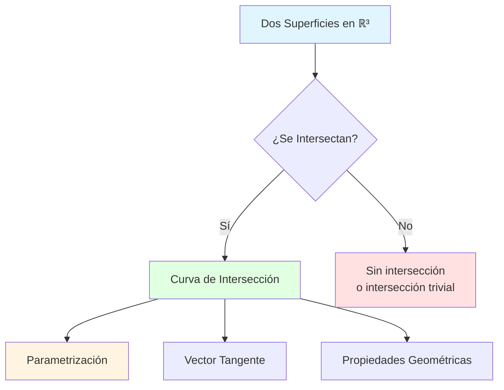

# 📐 Curvas como Intersección de Superficies

## 🎯 Introducción

> [!info]- 💡 ¿Qué es la Intersección de Superficies?
> 
> En el espacio tridimensional **ℝ³**, cuando dos superficies se encuentran, su intersección generalmente forma una **curva espacial**. Este concepto es fundamental en cálculo vectorial y tiene aplicaciones en geometría, física y diseño computacional.
> 
> **Analogía práctica:** Imagina dos hojas de papel que se cruzan en el espacio:
> 
> - **Primera hoja** podría ser horizontal (un plano)
> - **Segunda hoja** podría estar inclinada
> - La **línea donde se tocan** es la curva de intersección
> 
> **¿Por qué es importante?**
> 
> |Aspecto|Descripción|Ejemplo de Uso|
> |---|---|---|
> |**Visualización 3D**|Entender formas complejas|Modelado CAD, gráficos|
> |**Física**|Trayectorias de partículas|Movimiento con restricciones|
> |**Ingeniería**|Intersección de estructuras|Diseño de piezas mecánicas|
> |**Geografía**|Curvas de nivel|Mapas topográficos|
> |**Optimización**|Restricciones múltiples|Programación no lineal|



---

## 📊 Conceptos Fundamentales

### 🌍 Superficies en ℝ³

> [!example]- 📐 Representación de Superficies
> 
> Una **superficie** en ℝ³ puede representarse de varias formas:
> 
> **1. Forma Implícita:** F(x, y, z) = 0
> 
> ```
> Ejemplos:
> • Plano:        x + 2y - z = 5
> • Esfera:       x² + y² + z² = r²
> • Cilindro:     x² + y² = r²
> • Paraboloide:  z = x² + y²
> ```
> 
> **2. Forma Paramétrica:** **r**(u, v) = (x(u,v), y(u,v), z(u,v))
> 
> ```
> Ejemplo - Esfera:
> x = R·cos(u)·sin(v)
> y = R·sin(u)·sin(v)
> z = R·cos(v)
> donde u ∈ [0, 2π], v ∈ [0, π]
> ```
> 
> **3. Forma Explícita:** z = f(x, y)
> 
> ```
> Ejemplos:
> • Plano inclinado:    z = 2x + 3y + 1
> • Paraboloide:        z = x² + y²
> • Silla de montar:    z = x² - y²
> ```
> 
> **Comparación de representaciones:**
> 
> |Forma|Ventajas|Desventajas|Uso Típico|
> |---|---|---|---|
> |**Implícita**|Simple, directa|Difícil parametrizar|Intersecciones|
> |**Paramétrica**|Fácil recorrer|Más variables|Visualización|
> |**Explícita**|Intuitiva|Solo funciones|Gráficas simples|
> 
> **Visualización de tipos de superficies:**
> 
> ```mermaid
> graph LR
>     A[Superficies] --> B[Cuadráticas]
>     A --> C[Cilíndricas]
>     A --> D[De Revolución]
>     
>     B --> E[Esfera<br/>x²+y²+z²=r²]
>     B --> F[Paraboloide<br/>z=x²+y²]
>     B --> G[Hiperboloide<br/>x²+y²-z²=1]
>     
>     C --> H[Cilindro circular<br/>x²+y²=r²]
>     C --> I[Cilindro parabólico<br/>z=x²]
>     
>     D --> J[Toro]
>     D --> K[Cono]
>     
>     style B fill:#e1ffe1
>     style C fill:#fff4e1
>     style D fill:#e1f5ff
> ```

### 🔄 Curvas Espaciales

> [!note]- 📈 Definición y Propiedades
> 
> Una **curva espacial** es una función vectorial:
> 
> **r**(t) = (x(t), y(t), z(t))
> 
> donde t es el parámetro (típicamente el tiempo o longitud de arco).
> 
> **Propiedades fundamentales:**
> 
> |Propiedad|Fórmula|Interpretación|
> |---|---|---|
> |**Vector Tangente**|**T**(t) = **r**'(t) / \|**r**'(t)\||Dirección de movimiento|
> |**Velocidad**|**v**(t) = **r**'(t)|Tasa de cambio de posición|
> |**Rapidez**|v(t) = \|**r**'(t)\||Magnitud de velocidad|
> |**Aceleración**|**a**(t) = **r**''(t)|Cambio en velocidad|
> 
> **Ejemplo de curva espacial:**
> 
> ```
> Hélice circular:
> r(t) = (R·cos(t), R·sin(t), ct)
> 
> donde:
> • R = radio de la hélice
> • c = paso vertical
> • t ∈ [0, 2πn] para n vueltas
> ```
> 
> **Elementos de una curva:**
> 
> ```mermaid
> graph TD
>     A[Curva Espacial r(t)] --> B[Vector Posición]
>     A --> C[Vector Tangente]
>     A --> D[Vector Normal]
>     A --> E[Vector Binormal]
>     
>     B --> F[r(t) = punto en curva]
>     C --> G[T(t) = r'(t)/|r'(t)|]
>     D --> H[N(t) = T'(t)/|T'(t)|]
>     E --> I[B(t) = T(t) × N(t)]
>     
>     G --> J[Triedro de Frenet]
>     H --> J
>     I --> J
>     
>     style A fill:#e1f5ff
>     style J fill:#e1ffe1
> ```

---

## 🔗 Intersección de Dos Superficies

### 📋 Planteamiento del Problema

> [!success]- 🎯 Sistema de Ecuaciones
> 
> Para encontrar la curva de intersección de dos superficies:
> 
> **Sistema:**
> 
> ```
> S₁: F₁(x, y, z) = 0
> S₂: F₂(x, y, z) = 0
> ```
> 
> **Solución:** Los puntos (x, y, z) que satisfacen **ambas** ecuaciones simultáneamente forman la curva de intersección.
> 
> **Proceso de solución:**
> 
> ```mermaid
> flowchart TD
>     A[Dos Superficies<br/>F₁=0, F₂=0] --> B{Tipo de<br/>Superficies?}
>     
>     B -->|Plano + Superficie| C[Método 1:<br/>Sustitución Directa]
>     B -->|Dos Cuadráticas| D[Método 2:<br/>Eliminación de Variable]
>     B -->|Casos Especiales| E[Método 3:<br/>Parametrización]
>     
>     C --> F[Despejar de plano]
>     F --> G[Sustituir en superficie]
>     G --> H[Curva en 2D]
>     H --> I[Reparametrizar a 3D]
>     
>     D --> J[Resolver para una variable]
>     J --> K[Expresar curva]
>     
>     E --> L[Usar simetría]
>     E --> M[Coordenadas especiales]
>     
>     I --> N[Curva de Intersección r(t)]
>     K --> N
>     L --> N
>     M --> N
>     
>     style A fill:#e1f5ff
>     style N fill:#e1ffe1
>     style C fill:#fff4e1
>     style D fill:#ffe1e1
>     style E fill:#f0e1ff
> ```
> 
> **Estrategias generales:**
> 
> |Método|Cuándo Usar|Complejidad|Ventaja|
> |---|---|---|---|
> |**Sustitución**|Una superficie es simple (plano)|⭐⭐ Baja|Directo, algebraico|
> |**Eliminación**|Ambas son polinomiales|⭐⭐⭐ Media|Sistemático|
> |**Paramétrico**|Superficies con simetría|⭐⭐⭐⭐ Alta|Elegante, geométrico|
> |**Numérico**|Casos complicados|⭐⭐⭐⭐⭐ Muy Alta|Universal|

### 🔧 Método 1: Plano Intersecando Superficie

> [!example]- ✂️ Ejemplo: Plano y Esfera
> 
> **Problema:** Encontrar la intersección de:
> 
> ```
> S₁ (Plano):   z = 1
> S₂ (Esfera):  x² + y² + z² = 4
> ```
> 
> **Paso 1: Sustituir**
> 
> Reemplazamos z = 1 en la ecuación de la esfera:
> 
> ```
> x² + y² + (1)² = 4
> x² + y² + 1 = 4
> x² + y² = 3
> ```
> 
> **Paso 2: Interpretar**
> 
> Esta es un **círculo** en el plano z = 1 con radio √3.
> 
> **Paso 3: Parametrizar**
> 
> ```
> x(t) = √3 · cos(t)
> y(t) = √3 · sin(t)
> z(t) = 1
> 
> donde t ∈ [0, 2π]
> ```
> 
> **Vector posición de la curva:**
> 
> ```
> r(t) = (√3·cos(t), √3·sin(t), 1)
> ```
> 
> **Visualización:**
> 
> ```mermaid
> graph TB
>     A[Esfera: x²+y²+z²=4] --> B[Plano: z=1]
>     B --> C[Intersección:<br/>Círculo en z=1]
>     C --> D[Radio: √3]
>     C --> E[Centro: (0,0,1)]
>     
>     F[Parametrización] --> G[x = √3·cos(t)]
>     F --> H[y = √3·sin(t)]
>     F --> I[z = 1]
>     
>     style C fill:#e1ffe1
>     style F fill:#e1f5ff
> ```
> 
> **Propiedades de la curva:**
> 
> |Propiedad|Cálculo|Valor|
> |---|---|---|
> |**Vector tangente**|r'(t)|(-√3·sin(t), √3·cos(t), 0)|
> |**Rapidez**|\|r'(t)\||√3 (constante)|
> |**Longitud**|∫₀²π \|r'(t)\| dt|2π√3|
> 
> **Ejemplo 2: Plano inclinado y cilindro**
> 
> ```
> S₁ (Cilindro):  x² + y² = 1
> S₂ (Plano):     z = x
> ```
> 
> **Solución:**
> 
> De S₁: x² + y² = 1 → Parametrizar: x = cos(t), y = sin(t)
> 
> De S₂: z = x = cos(t)
> 
> **Curva de intersección:**
> 
> ```
> r(t) = (cos(t), sin(t), cos(t))
> t ∈ [0, 2π]
> ```
> 
> Esta es una **elipse alabeada** (elipse que no está en un plano).

### ⚙️ Método 2: Dos Superficies Cuadráticas

> [!tip]- 🔄 Ejemplo: Dos Cilindros
> 
> **Problema:** Intersección de dos cilindros:
> 
> ```
> S₁: x² + y² = 1  (cilindro eje z)
> S₂: x² + z² = 1  (cilindro eje y)
> ```
> 
> **Análisis:**
> 
> De S₁: x² = 1 - y²
> 
> Sustituir en S₂:
> 
> ```
> (1 - y²) + z² = 1
> z² = y²
> z = ±y
> ```
> 
> **Sistema resultante:**
> 
> ```
> x² + y² = 1
> z = ±y
> ```
> 
> **Dos curvas de intersección:**
> 
> **Curva C₁ (z = y):**
> 
> ```
> x = cos(t)
> y = sin(t)
> z = sin(t)
> 
> r₁(t) = (cos(t), sin(t), sin(t))
> ```
> 
> **Curva C₂ (z = -y):**
> 
> ```
> r₂(t) = (cos(t), sin(t), -sin(t))
> ```
> 
> **Visualización de las curvas:**
> 
> ```mermaid
> graph TB
>     A[Cilindro 1<br/>x²+y²=1] --> C[Intersección]
>     B[Cilindro 2<br/>x²+z²=1] --> C
>     
>     C --> D[Curva C₁: z=y]
>     C --> E[Curva C₂: z=-y]
>     
>     D --> F[r₁ = cos t, sin t, sin t]
>     E --> G[r₂ = cos t, sin t, -sin t]
>     
>     F --> H[Dos curvas<br/>simétricas]
>     G --> H
>     
>     style C fill:#e1ffe1
>     style H fill:#fff4e1
> ```
> 
> **Propiedades:**
> 
> |Aspecto|Curva C₁|Curva C₂|
> |---|---|---|
> |**Simetría**|Respecto a plano y=z|Respecto a plano y=-z|
> |**Tangente en t=0**|(0, 1, 1)|(0, 1, -1)|
> |**Puntos extremos**|z_max = 1, z_min = -1|z_max = 1, z_min = -1|

### 🎨 Método 3: Casos Especiales

> [!note]- 🌟 Intersección de Esfera y Cono
> 
> **Problema:**
> 
> ```
> S₁ (Esfera):  x² + y² + z² = 4
> S₂ (Cono):    z² = x² + y²
> ```
> 
> **Paso 1: Sustitución**
> 
> De S₂: z² = x² + y²
> 
> Sustituir en S₁:
> 
> ```
> x² + y² + (x² + y²) = 4
> 2(x² + y²) = 4
> x² + y² = 2
> ```
> 
> **Paso 2: Encontrar z**
> 
> De S₂: z² = x² + y² = 2
> 
> ```
> z = ±√2
> ```
> 
> **Resultado:** Dos círculos
> 
> **Círculo C₁ (z = √2):**
> 
> ```
> x² + y² = 2, z = √2
> 
> Parametrización:
> r₁(t) = (√2·cos(t), √2·sin(t), √2)
> ```
> 
> **Círculo C₂ (z = -√2):**
> 
> ```
> r₂(t) = (√2·cos(t), √2·sin(t), -√2)
> ```
> 
> **Interpretación geométrica:**
> 
> ```mermaid
> graph TD
>     A[Esfera<br/>radio 2] --> B[Cono<br/>z² = x² + y²]
>     B --> C[Intersección:<br/>Dos círculos]
>     
>     C --> D[Círculo superior<br/>z = √2]
>     C --> E[Círculo inferior<br/>z = -√2]
>     
>     D --> F[Radio: √2]
>     E --> G[Radio: √2]
>     
>     F --> H[Simétricos respecto<br/>al plano xy]
>     G --> H
>     
>     style C fill:#e1ffe1
>     style H fill:#fff4e1
> ```

---

## 📐 Vector Tangente y Propiedades

### 🧭 Cálculo del Vector Tangente

> [!success]- ➡️ Derivada de la Curva
> 
> Si la curva está parametrizada como **r**(t) = (x(t), y(t), z(t)), el **vector tangente** es:
> 
> **r**'(t) = (x'(t), y'(t), z'(t))
> 
> **Vector tangente unitario:**
> 
> ```
> T(t) = r'(t) / |r'(t)|
> ```
> 
> **Ejemplo con hélice:**
> 
> ```
> r(t) = (2cos(t), 2sin(t), t)
> 
> r'(t) = (-2sin(t), 2cos(t), 1)
> 
> |r'(t)| = √(4sin²(t) + 4cos²(t) + 1)
>        = √(4 + 1)
>        = √5
> 
> T(t) = 1/√5 · (-2sin(t), 2cos(t), 1)
> ```
> 
> **Tabla de vectores fundamentales:**
> 
> |Vector|Símbolo|Fórmula|Significado|
> |---|---|---|---|
> |**Posición**|**r**(t)|(x(t), y(t), z(t))|Punto en la curva|
> |**Velocidad**|**v**(t)|**r**'(t)|Tasa de cambio|
> |**Tangente unitario**|**T**(t)|**r**'(t)/\|**r**'(t)\||Dirección|
> |**Normal principal**|**N**(t)|**T**'(t)/\|**T**'(t)\||Curvatura|
> |**Binormal**|**B**(t)|**T** × **N**|Perpendicular al plano osculador|
> 
> **Interpretación física:**
> 
> ```mermaid
> graph LR
>     A[Partícula en r(t)] --> B[v(t) = r'(t)]
>     B --> C[Dirección de<br/>movimiento]
>     
>     B --> D[|v(t)|]
>     D --> E[Rapidez]
>     
>     B --> F[T(t) = v(t)/|v(t)|]
>     F --> G[Dirección pura<br/>sin magnitud]
>     
>     style A fill:#e1f5ff
>     style E fill:#e1ffe1
>     style G fill:#fff4e1
> ```

### 📏 Longitud de Arco

> [!example]- 📊 Cálculo de Distancia Recorrida
> 
> La **longitud de arco** desde t = a hasta t = b es:
> 
> ```
> L = ∫ₐᵇ |r'(t)| dt
> ```
> 
> **Ejemplo: Longitud de un círculo**
> 
> ```
> r(t) = (R·cos(t), R·sin(t), h)  [círculo en z = h]
> 
> r'(t) = (-R·sin(t), R·cos(t), 0)
> 
> |r'(t)| = √(R²sin²(t) + R²cos²(t))
>        = R
> 
> L = ∫₀²π R dt = R·t |₀²π = 2πR  ✓
> ```
> 
> **Ejemplo: Longitud de una hélice**
> 
> ```
> r(t) = (cos(t), sin(t), t),  t ∈ [0, 2π]
> 
> r'(t) = (-sin(t), cos(t), 1)
> 
> |r'(t)| = √(sin²(t) + cos²(t) + 1) = √2
> 
> L = ∫₀²π √2 dt = 2π√2
> ```
> 
> **Tabla de longitudes comunes:**
> 
> | Curva | Parametrización | |r'(t)| | Longitud (0 a 2π) | |-------|----------------|---------|-------------------| | **Círculo** | (R·cos t, R·sin t, 0) | R | 2πR | | **Hélice** | (R·cos t, R·sin t, ct) | √(R²+c²) | 2π√(R²+c²) | | **Elipse** | (a·cos t, b·sin t, 0) | Complicado | Integral elíptica |

---

## 🔍 Métodos Numéricos y Computacionales

### 💻 Aproximación Numérica

> [!tip]- 🖥️ Cuando las Soluciones Analíticas Fallan
> 
> Para intersecciones complejas, usamos métodos numéricos:
> 
> **1. Método de Newton-Raphson (multivariable)**
> 
> Para resolver:
> 
> ```
> F₁(x, y, z) = 0
> F₂(x, y, z) = 0
> ```
> 
> **Algoritmo iterativo:**
> 
> ```
> Dado punto inicial (x₀, y₀, z₀)
> 
> Repetir hasta convergencia:
>   - Calcular Jacobiano J
>   - Resolver J·Δ = -F
>   - Actualizar: (x,y,z)nuevo = (x,y,z)viejo + Δ
> ```
> 
> **Flujo del algoritmo:**
> 
> ```mermaid
> flowchart TD
>     A[Punto inicial<br/>x₀, y₀, z₀] --> B[Evaluar F₁ y F₂]
>     B --> C{|F| < ε?}
>     C -->|Sí| D[✅ Solución encontrada]
>     C -->|No| E[Calcular Jacobiano J]
>     E --> F[Resolver J·Δ = -F]
>     F --> G[Actualizar punto]
>     G --> H{Iteraciones<br/>< max?}
>     H -->|Sí| B
>     H -->|No| I[❌ No converge]
>     
>     style D fill:#e1ffe1
>     style I fill:#ffe1e1
>     style E fill:#fff4e1
> ```
> 
> **2. Trazado de curvas (Curve Tracing)**
> 
> **Algoritmo de marcha:**
> 
> ```
> 1. Encontrar un punto inicial en la intersección
> 2. Calcular vector tangente en ese punto
> 3. Avanzar pequeño paso en dirección tangente
> 4. Proyectar de vuelta a las superficies
> 5. Repetir hasta cerrar la curva
> ```
> 
> **Pseudocódigo simplificado:**
> 
> ```python
> # Encontrar punto inicial
> p = encontrar_punto_inicial(S1, S2)
> puntos = [p]
> 
> for i in range(num_pasos):
>     # Vector tangente = grad(S1) × grad(S2)
>     t = calcular_tangente(p, S1, S2)
>     
>     # Avanzar
>     p_nuevo = p + δ * t
>     
>     # Proyectar a superficies
>     p = proyectar(p_nuevo, S1, S2)
>     puntos.append(p)
> 
> return puntos
> ```
> 
> **Ventajas y desventajas:**
> 
> |Método|Ventajas|Desventajas|Uso|
> |---|---|---|---|
> |**Analítico**|Exacto, elegante|Solo casos simples|Cuando es posible|
> |**Newton-Raphson**|Rápida convergencia|Necesita buen punto inicial|Ecuaciones no lineales|
> |**Marcha de curva**|Robusto, visual|Acumulación de error|Visualización|
> |**Eliminación resultante**|Sistemático|Puede ser complejo|Polinomios|

### 🎮 Visualización Interactiva

> [!note]- 🖼️ Herramientas de Visualización
> 
> **Software recomendado:**
> 
> |Herramienta|Tipo|Capacidades|Curva de Aprendizaje|
> |---|---|---|---|
> |**GeoGebra 3D**|Gratis, Web|Interactivo, educativo|⭐⭐ Fácil|
> |**MATLAB**|Comercial|Potente, programable|⭐⭐⭐⭐ Media-Alta|
> |**Python + Matplotlib**|Gratis|Flexible, scripting|⭐⭐⭐ Media|
> |**Mathematica**|Comercial|Simbólico + numérico|⭐⭐⭐⭐ Alta|
> |**Desmos 3D**|Gratis, Web|Simple, intuitivo|⭐ Muy fácil|
> 
> **Ejemplo en Python (conceptual):**
> 
> ```python
> import numpy as np
> import matplotlib.pyplot as plt
> from mpl_toolkits.mplot3d import Axes3D
> 
> # Parametrización de la curva
> t = np.linspace(0, 2*np.pi, 100)
> x = np.sqrt(3) * np.cos(t)
> y = np.sqrt(3) * np.sin(t)
> z = np.ones_like(t)  # z = 1
> 
> # Crear figura 3D
> fig = plt.figure()
> ax = fig.add_subplot(111, projection='3d')
> 
> # Dibujar curva
> ax.plot(x, y, z, 'r-', linewidth=2, label='Intersección')
> 
> # Dibujar esfera (superficie)
> u = np.linspace(0, 2*np.pi, 50)
> v = np.linspace(0, np.pi, 50)
> xs = 2 * np.outer(np.cos(u), np.sin(v))
> ys = 2 * np.outer(np.sin(u), np.sin(v))
> zs = 2 * np.outer(np.ones(np.size(u)), np.cos(v))
> ax.plot_surface(xs, ys, zs, alpha=0.3)
> 
> plt.show()
> ```

---

## 🎯 Aplicaciones Prácticas

### 🏗️ Ingeniería y Diseño

> [!example]- ⚙️ Casos de Uso Real
> 
> **1. Diseño de tuberías**
> 
> Cuando dos tuberías cilíndricas se cruzan, la intersección determina:
> 
> - Forma del corte necesario
> - Soldadura requerida
> - Análisis de tensiones
> 
> ```mermaid
> graph TD
>     A[Tubería 1<br/>Cilindro vertical] --> C[Intersección]
>     B[Tubería 2<br/>Cilindro horizontal] --> C
>     C --> D[Curva de corte]
>     D --> E[Plantilla de fabricación]
>     D --> F[Análisis estructural]
>     
>     style C fill:#e1ffe1
>     style E fill:#fff4e1
> ```
> 
> **2. Aerodinámica**
> 
> - Trayectoria de partículas alrededor de un ala
> - Líneas de corriente intersecando superficies
> - Optimización de formas
> 
> **3. Robótica**
> 
> - Espacio de trabajo de brazos robóticos
> - Evitación de colisiones> - Planificación de trayectorias
> 
> **Tabla de aplicaciones:**
> 
> |Campo|Problema|Superficies Involucradas|
> |---|---|---|
> |**Manufactura**|Corte de piezas|Herramienta + pieza de trabajo|
> |**Civil**|Carreteras en montañas|Terreno + plano de carretera|
> |**Geología**|Estratos rocosos|Capas geológicas|
> |**Óptica**|Refracción|Frente de onda + lente|
> |**Arquitectura**|Intersección de bóvedas|Superficies curvas|

### 🌍 Geografía y Topografía

> [!success]- 🗺️ Curvas de Nivel
> 
> **Concepto:** Una **curva de nivel** es la intersección de:
> 
> - Superficie topográfica: z = f(x, y)
> - Plano horizontal: z = h (altura constante)
> 
> **Ejemplo:**
> 
> ```
> Terreno: z = 100 - x² - y²  (montaña)
> Plano:   z = 75             (altura 75m)
> 
> Intersección:
> 75 = 100 - x² - y²
> x² + y² = 25
> 
> Curva de nivel: Círculo de radio 5
> ```
> 
> **Interpretación:**
> 
> ```mermaid
> graph TB
>     A[Superficie del terreno<br/>z = f x, y] --> B[Familia de planos<br/>z = h₁, h₂, h₃...]
>     B --> C[Curvas de nivel]
>     C --> D[h₁: Cota baja]
>     C --> E[h₂: Cota media]
>     C --> F[h₃: Cota alta]
>     
>     D --> G[Mapa topográfico]
>     E --> G
>     F --> G
>     
>     style C fill:#e1ffe1
>     style G fill:#e1f5ff
> ```
> 
> **Propiedades de curvas de nivel:**
> 
> |Propiedad|Significado|
> |---|---|
> |**Cerradas**|Picos o depresiones|
> |**Espaciado**|Pendiente (juntas = empinado)|
> |**Nunca se cruzan**|Función univaluada|
> |**Perpendiculares al gradiente**|Dirección de máxima pendiente|

---

## 📊 Problemas Resueltos Paso a Paso

### 📝 Problema 1: Plano y Paraboloide

> [!example]- 🎯 Enunciado y Solución Completa
> 
> **Enunciado:** Encuentre la curva de intersección entre:
> 
> ```
> S₁ (Paraboloide): z = x² + y²
> S₂ (Plano):       z = 4
> ```
> 
> **Paso 1: Plantear el sistema**
> 
> ```
> z = x² + y²  ... (1)
> z = 4        ... (2)
> ```
> 
> **Paso 2: Igualar**
> 
> ```
> x² + y² = 4
> ```
> 
> Esta es un círculo de radio 2 en el plano z = 4.
> 
> **Paso 3: Parametrizar**
> 
> ```
> x(t) = 2·cos(t)
> y(t) = 2·sin(t)
> z(t) = 4
> 
> t ∈ [0, 2π]
> ```
> 
> **Paso 4: Vector posición**
> 
> ```
> r(t) = (2cos(t), 2sin(t), 4)
> ```
> 
> **Paso 5: Propiedades**
> 
> Vector tangente:
> 
> ```
> r'(t) = (-2sin(t), 2cos(t), 0)
> ```
> 
> Rapidez:
> 
> ```
> |r'(t)| = √(4sin²(t) + 4cos²(t)) = 2
> ```
> 
> Longitud total:
> 
> ```
> L = ∫₀²π 2 dt = 4π
> ```
> 
> **Visualización:**
> 
> ```mermaid
> graph TB
>     A[Paraboloide<br/>z = x² + y²] --> C[z = 4]
>     B[Plano<br/>z = 4] --> C
>     C --> D[Círculo]
>     D --> E[Centro: 0,0,4]
>     D --> F[Radio: 2]
>     D --> G[Longitud: 4π]
>     
>     style C fill:#e1ffe1
>     style D fill:#fff4e1
> ```

### 📝 Problema 2: Esfera y Cilindro

> [!example]- 🎯 Problema Más Complejo
> 
> **Enunciado:** Encuentre las curvas de intersección entre:
> 
> ```
> S₁ (Esfera):   x² + y² + z² = 9
> S₂ (Cilindro): x² + y² = 4
> ```
> 
> **Paso 1: Sustituir**
> 
> De S₂: x² + y² = 4
> 
> Sustituir en S₁:
> 
> ```
> 4 + z² = 9
> z² = 5
> z = ±√5
> ```
> 
> **Paso 2: Identificar las curvas**
> 
> Dos círculos:
> 
> - C₁: x² + y² = 4, z = √5
> - C₂: x² + y² = 4, z = -√5
> 
> **Paso 3: Parametrizar**
> 
> **Curva C₁:**
> 
> ```
> r₁(t) = (2cos(t), 2sin(t), √5)
> t ∈ [0, 2π]
> ```
> 
> **Curva C₂:**
> 
> ```
> r₂(t) = (2cos(t), 2sin(t), -√5)
> t ∈ [0, 2π]
> ```
> 
> **Paso 4: Análisis geométrico**
> 
> |Propiedad|Valor|
> |---|---|
> |**Radio de círculos**|2|
> |**Separación vertical**|2√5|
> |**Longitud cada curva**|4π|
> |**Simetría**|Respecto a plano xy|
> 
> **Interpretación:**
> 
> ```mermaid
> graph TD
>     A[Esfera radio 3] --> C[Cilindro radio 2]
>     C --> D[2 círculos<br/>paralelos]
>     D --> E[Superior: z = √5]
>     D --> F[Inferior: z = -√5]
>     
>     E --> G[Misma proyección<br/>en plano xy]
>     F --> G
>     
>     style D fill:#e1ffe1
>     style G fill:#fff4e1
> ```
> 
> **Verificación:**
> 
> Para t = 0:
> 
> ```
> r₁(0) = (2, 0, √5)
> 
> Verificar en esfera:
> 2² + 0² + (√5)² = 4 + 5 = 9 ✓
> 
> Verificar en cilindro:
> 2² + 0² = 4 ✓
> ```

### 📝 Problema 3: Dos Paraboloides

> [!example]- 🎯 Caso Avanzado
> 
> **Enunciado:**
> 
> ```
> S₁: z = x² + y²      (paraboloide hacia arriba)
> S₂: z = 8 - x² - y²  (paraboloide hacia abajo)
> ```
> 
> **Paso 1: Igualar**
> 
> ```
> x² + y² = 8 - x² - y²
> 2(x² + y²) = 8
> x² + y² = 4
> ```
> 
> **Paso 2: Encontrar z**
> 
> ```
> z = x² + y² = 4
> ```
> 
> **Paso 3: Curva de intersección**
> 
> Círculo en el plano z = 4:
> 
> ```
> x² + y² = 4
> z = 4
> ```
> 
> **Parametrización:**
> 
> ```
> r(t) = (2cos(t), 2sin(t), 4)
> t ∈ [0, 2π]
> ```
> 
> **Interpretación geométrica:**
> 
> Los dos paraboloides se tocan en un círculo que es:
> 
> - El "borde superior" del paraboloide inferior
> - El "borde inferior" del paraboloide superior
> 
> ```mermaid
> graph TB
>     A[Paraboloide 1<br/>z = x² + y²] --> C[Intersección]
>     B[Paraboloide 2<br/>z = 8 - x² - y²] --> C
>     
>     C --> D[Círculo en z=4]
>     D --> E[Radio: 2]
>     D --> F[Los paraboloides<br/>son simétricos]
>     
>     style C fill:#e1ffe1
>     style F fill:#fff4e1
> ```

---

## 🎓 Ejercicios Propuestos

> [!note]- 💪 Problemas para Practicar
> 
> ### Nivel Básico
> 
> **1. Plano y Esfera**
> 
> ```
> Encuentre la intersección de:
> • Esfera: x² + y² + z² = 16
> • Plano: z = 2
> 
> Respuesta esperada: Círculo de radio...?
> ```
> 
> **2. Dos Planos**
> 
> ```
> Intersección de:
> • Plano 1: x + y + z = 1
> • Plano 2: x - y + 2z = 3
> 
> Respuesta: Recta (parametrizarla)
> ```
> 
> ### Nivel Intermedio
> 
> **3. Cilindro y Esfera**
> 
> ```
> • Cilindro: x² + z² = 1
> • Esfera: x² + y² + z² = 4
> 
> Encuentre las dos curvas de intersección
> ```
> 
> **4. Cono y Plano**
> 
> ```
> • Cono: z² = x² + y²
> • Plano: z = 2
> 
> ¿Qué tipo de curva resulta?
> ```
> 
> ### Nivel Avanzado
> 
> **5. Dos Cilindros Oblicuos**
> 
> ```
> • x² + y² = 1
> • y² + z² = 1
> 
> Encuentre todas las curvas de intersección
> ```
> 
> **6. Hiperboloide y Esfera**
> 
> ```
> • Hiperboloide: x² + y² - z² = 1
> • Esfera: x² + y² + z² = 9
> 
> Analice el número de componentes de la intersección
> ```
> 
> ### Problemas de Aplicación
> 
> **7. Topografía**
> 
> ```
> Una montaña tiene perfil z = 100e^(-(x²+y²)/50)
> Encuentre la curva de nivel a altura z = 50
> ```
> 
> **8. Trayectoria Restringida**
> 
> ```
> Una partícula se mueve sobre:
> • Esfera: x² + y² + z² = 25
> • Plano: x + 2y + 2z = 5
> 
> Encuentre su trayectoria y velocidad si |dr/dt| = 2
> ```

---

## 🔗 Conexión con Otros Temas

> [!quote]- 🌟 Temas Relacionados
> 
> **Diagrama de conceptos:**
> 
> ```mermaid
> mindmap
>   root((Intersección<br/>de Superficies))
>     Prerrequisitos
>       Cálculo Multivariable
>         Derivadas parciales
>         Gradiente
>       Geometría Analítica
>         Ecuaciones de superficies
>         Sistemas de coordenadas
>       Álgebra Lineal
>         Vectores
>         Producto cruz
>     Temas Relacionados
>       Curvas Parametrizadas
>         Vector tangente
>         Curvatura
>         Torsión
>       Superficies Paramétricas
>         Vector normal
>         Área de superficie
>       Integral de Línea
>         Trabajo
>         Circulación
>       Teoremas Integrales
>         Stokes
>         Divergencia
>     Aplicaciones
>       Física
>         Trayectorias
>         Campos
>       Ingeniería
>         CAD/CAM
>         Robótica
>       Computación Gráfica
>         Rendering
>         Colisiones
> ```
> 
> **Progresión del aprendizaje:**
> 
> |Tema Previo|Tema Actual|Tema Siguiente|
> |---|---|---|
> |Superficies cuadráticas|**Intersección de superficies**|Integral de línea|
> |Curvas planas|**Curvas espaciales**|Integral de superficie|
> |Derivadas parciales|**Vector tangente**|Curvatura y torsión|
> |Producto vectorial|**Cálculo de normales**|Teorema de Stokes|
> 
> **Conexiones profundas:**
> 
> ```mermaid
> graph LR
>     A[Intersección] --> B[Gradiente]
>     B --> C[Vector tangente = ∇F₁ × ∇F₂]
>     
>     A --> D[Parametrización]
>     D --> E[Integral de línea]
>     E --> F[Trabajo, Flujo]
>     
>     A --> G[Geometría Diferencial]
>     G --> H[Curvatura]
>     G --> I[Torsión]
>     
>     style A fill:#e1f5ff
>     style C fill:#e1ffe1
>     style E fill:#fff4e1
>     style G fill:#f0e1ff
> ```

---

## 📚 Resumen y Puntos Clave

> [!success]- ✅ Conceptos Fundamentales
> 
> ### Ideas Centrales
> 
> |Concepto|Descripción|Fórmula Clave|
> |---|---|---|
> |**Intersección**|Puntos que satisfacen ambas superficies|F₁ = 0 ∧ F₂ = 0|
> |**Parametrización**|Expresar curva con un parámetro|**r**(t) = (x(t), y(t), z(t))|
> |**Vector tangente**|Dirección de la curva|**T** = **r**'/\|**r**'\||
> |**Longitud de arco**|Distancia recorrida|L = ∫\|**r**'(t)\| dt|
> 
> ### Métodos de Solución
> 
> ```mermaid
> flowchart LR
>     A[Problema de<br/>Intersección] --> B{Tipo?}
>     
>     B -->|Plano + Superficie| C[Sustitución<br/>Directa]
>     B -->|Dos Cuadráticas| D[Eliminación<br/>Variable]
>     B -->|Complicado| E[Método<br/>Numérico]
>     
>     C --> F[Solución<br/>Analítica]
>     D --> F
>     E --> G[Solución<br/>Aproximada]
>     
>     F --> H[Parametrización<br/>Explícita]
>     G --> H
>     
>     style A fill:#e1f5ff
>     style F fill:#e1ffe1
>     style H fill:#fff4e1
> ```
> 
> ### Checklist de Resolución
> 
> - [ ] Identificar las dos superficies (F₁ = 0, F₂ = 0)
> - [ ] Elegir método apropiado (sustitución, eliminación, numérico)
> - [ ] Resolver sistema para encontrar relación entre x, y, z
> - [ ] Parametrizar la curva resultante
> - [ ] Calcular vector tangente r'(t)
> - [ ] Verificar solución sustituyendo en ambas ecuaciones
> - [ ] Analizar propiedades geométricas (si se requiere)
> 
> ### Errores Comunes
> 
> |Error|Corrección|
> |---|---|
> |Olvidar dominio del parámetro|Especificar t ∈ [a, b]|
> |No verificar en ambas superficies|Sustituir en F₁ y F₂|
> |Confundir curva con superficie|Una curva tiene 1 parámetro|
> |Ignorar casos múltiples|Pueden haber varias curvas|

---

**Tags:** #cálculo-vectorial #superficies #intersección #curvas-espaciales #parametrización #vector-tangente #geometría-3d #aplicaciones #mermaid #diagramas