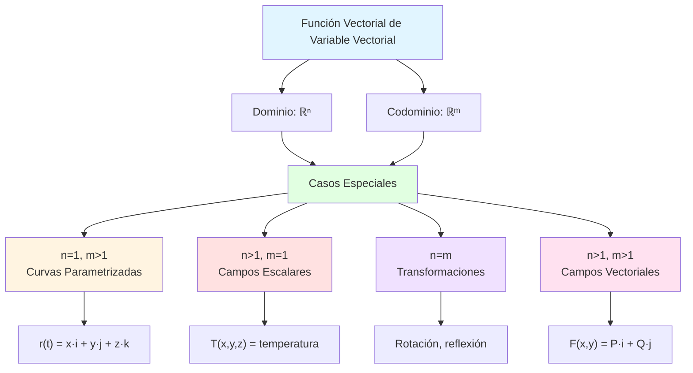

# 📐 Funciones Vectoriales de Variable Vectorial

## 🎯 Introducción

> [!info]- 💡 ¿Qué es una Función Vectorial de Variable Vectorial?
> 
> Una **función vectorial de variable vectorial** es una transformación que toma un vector (o punto) en ℝⁿ y produce otro vector en ℝᵐ. Estas funciones son fundamentales en cálculo multivariable y modelan transformaciones geométricas, campos vectoriales y sistemas dinámicos.
> 
> **Definición formal:**
> 
> ```
> F: ℝⁿ → ℝᵐ
> F(x₁, x₂, ..., xₙ) = (f₁(x₁,...,xₙ), f₂(x₁,...,xₙ), ..., fₘ(x₁,...,xₙ))
> ```
> 
> **Analogía práctica:** Piensa en una función vectorial como una "máquina de transformación":
> 
> - **Entrada:** Un punto o vector (posición, coordenadas)
> - **Proceso:** Reglas de transformación (las funciones componentes)
> - **Salida:** Un nuevo vector (nueva posición, velocidad, fuerza)
> 
> **¿Por qué es importante?**
> 
> |Aspecto|Descripción|Ejemplo de Uso|
> |---|---|---|
> |**Campos Vectoriales**|Asignar vector a cada punto|Campo de velocidades de fluido|
> |**Transformaciones**|Cambiar posición/forma|Rotaciones, escalamientos|
> |**Física**|Modelar fuerzas y campos|Campo gravitatorio, electromagnético|
> |**Ingeniería**|Sistemas dinámicos|Control de robots, aerodinámica|
> |**Economía**|Sistemas multivariables|Modelos de mercado, optimización|



---

## 📊 Conceptos Fundamentales

### 🌟 Definición y Notación

> [!example]- 📝 Formas de Representación
> 
> **Notación Vectorial:**
> 
> ```
> F(x⃗) = F(x₁, x₂, ..., xₙ) = ⟨f₁(x⃗), f₂(x⃗), ..., fₘ(x⃗)⟩
> ```
> 
> **Notación por Componentes:**
> 
> Para **F: ℝ² → ℝ³**:
> 
> ```
> F(x, y) = (f₁(x,y), f₂(x,y), f₃(x,y))
>         = f₁(x,y)·i + f₂(x,y)·j + f₃(x,y)·k
> ```
> 
> **Ejemplos específicos:**
> 
> **1. Campo vectorial en ℝ² → ℝ²:**
> 
> ```
> F(x, y) = ⟨-y, x⟩
> 
> Interpretación: Campo de rotación antihorario
> En punto (1, 0): F(1,0) = ⟨0, 1⟩
> En punto (0, 1): F(0,1) = ⟨-1, 0⟩
> ```
> 
> **2. Transformación ℝ² → ℝ³:**
> 
> ```
> F(u, v) = ⟨u·cos(v), u·sin(v), v⟩
> 
> Interpretación: Parametrización de una superficie (helicoide)
> Dominio: u ∈ [0, R], v ∈ [0, 2π]
> ```
> 
> **3. Campo gravitatorio ℝ³ → ℝ³:**
> 
> ```
> F(x, y, z) = -GM/(x² + y² + z²)^(3/2) · ⟨x, y, z⟩
> 
> Interpretación: Fuerza gravitacional en cada punto
> Magnitud disminuye con cuadrado de distancia
> ```
> 
> **Comparación de representaciones:**
> 
> |Notación|Ventajas|Desventajas|Uso Típico|
> |---|---|---|---|
> |**Vectorial**|Compacta, elegante|Oculta componentes|Teoría general|
> |**Componentes**|Explícita, clara|Puede ser larga|Cálculos prácticos|
> |**Matriz**|Transformaciones lineales|Limitada a casos lineales|Álgebra lineal|

### 🎨 Clasificación de Funciones Vectoriales

> [!note]- 📋 Tipos Según Dimensiones
> 
> ```mermaid
> graph TB
>     A[Funciones Vectoriales] --> B[Por Dimensión]
>     A --> C[Por Linealidad]
>     A --> D[Por Propiedades]
>     
>     B --> E[ℝ → ℝⁿ<br/>Curvas]
>     B --> F[ℝⁿ → ℝ<br/>Campos Escalares]
>     B --> G[ℝⁿ → ℝⁿ<br/>Transformaciones]
>     B --> H[ℝⁿ → ℝᵐ<br/>General]
>     
>     C --> I[Lineales]
>     C --> J[No Lineales]
>     
>     D --> K[Conservativas]
>     D --> L[Solenoidales]
>     D --> M[Irrotacionales]
>     
>     style A fill:#e1f5ff
>     style B fill:#e1ffe1
>     style C fill:#fff4e1
>     style D fill:#ffe1e1
> ```
> 
> **1. Curvas Parametrizadas (ℝ → ℝⁿ):**
> 
> ```
> r(t) = ⟨x(t), y(t), z(t)⟩
> 
> Ejemplo - Hélice:
> r(t) = ⟨cos(t), sin(t), t⟩, t ∈ [0, 4π]
> 
> Características:
> • Un parámetro independiente
> • Traza una curva en el espacio
> • Vector tangente: r'(t)
> ```
> 
> **2. Campos Escalares (ℝⁿ → ℝ):**
> 
> ```
> T(x, y, z) = temperatura en punto (x,y,z)
> 
> Ejemplo - Temperatura:
> T(x, y, z) = 100·e^(-(x² + y² + z²))
> 
> Características:
> • Asigna número a cada punto
> • Superficies de nivel: T(x,y,z) = c
> • Gradiente: ∇T apunta hacia mayor crecimiento
> ```
> 
> **3. Campos Vectoriales (ℝⁿ → ℝⁿ):**
> 
> ```
> F(x, y) = ⟨P(x,y), Q(x,y)⟩
> 
> Ejemplo - Campo de velocidades:
> F(x, y) = ⟨-y, x⟩
> 
> Características:
> • Vector en cada punto del espacio
> • Líneas de campo: soluciones de dr/dt = F(r)
> • Divergencia y rotacional definidos
> ```
> 
> **4. Transformaciones (ℝⁿ → ℝᵐ, general):**
> 
> ```
> F(u, v) = ⟨f₁(u,v), f₂(u,v), f₃(u,v)⟩
> 
> Ejemplo - Parametrización de superficie:
> F(u, v) = ⟨u·cos(v), u·sin(v), u²⟩
> 
> Características:
> • Mapea región de ℝ² a superficie en ℝ³
> • Jacobiano importante para cambios de variable
> • Usado en integrales de superficie
> ```

---

## 🔍 Operaciones con Funciones Vectoriales

### ➕ Operaciones Algebraicas

> [!success]- 🧮 Suma, Resta y Multiplicación por Escalar
> 
> **Definiciones:**
> 
> Sean **F** y **G** funciones vectoriales, y c un escalar:
> 
> **1. Suma:**
> 
> ```
> (F + G)(x⃗) = F(x⃗) + G(x⃗)
>             = ⟨f₁ + g₁, f₂ + g₂, ..., fₙ + gₙ⟩
> ```
> 
> **2. Resta:**
> 
> ```
> (F - G)(x⃗) = F(x⃗) - G(x⃗)
>             = ⟨f₁ - g₁, f₂ - g₂, ..., fₙ - gₙ⟩
> ```
> 
> **3. Multiplicación por escalar:**
> 
> ```
> (c·F)(x⃗) = c·F(x⃗)
>          = ⟨c·f₁, c·f₂, ..., c·fₙ⟩
> ```
> 
> **Ejemplo completo:**
> 
> ```
> F(x, y) = ⟨x², xy⟩
> G(x, y) = ⟨y, x + y⟩
> 
> F + G = ⟨x² + y, xy + x + y⟩
> F - G = ⟨x² - y, xy - x - y⟩
> 3F = ⟨3x², 3xy⟩
> 
> Evaluación en (2, 1):
> F(2,1) = ⟨4, 2⟩
> G(2,1) = ⟨1, 3⟩
> (F + G)(2,1) = ⟨5, 5⟩
> ```
> 
> **Propiedades:**
> 
> |Propiedad|Expresión|
> |---|---|
> |**Conmutativa**|F + G = G + F|
> |**Asociativa**|(F + G) + H = F + (G + H)|
> |**Distributiva**|c(F + G) = cF + cG|
> |**Elemento neutro**|F + 0⃗ = F|

### ✖️ Productos Vectoriales

> [!example]- 🎯 Producto Punto y Producto Cruz
> 
> **1. Producto Punto (Escalar):**
> 
> ```
> F·G = f₁g₁ + f₂g₂ + ... + fₙgₙ
> 
> Resultado: Función escalar (campo escalar)
> ```
> 
> **Ejemplo:**
> 
> ```
> F(x, y) = ⟨x, y²⟩
> G(x, y) = ⟨2x, y⟩
> 
> F·G = x·(2x) + y²·y
>     = 2x² + y³
> 
> Evaluación en (1, 2):
> (F·G)(1, 2) = 2(1)² + (2)³ = 2 + 8 = 10
> ```
> 
> **Aplicación - Trabajo:**
> 
> ```
> Si F es fuerza y dr es desplazamiento:
> Trabajo diferencial: dW = F·dr
> ```
> 
> **2. Producto Cruz (solo en ℝ³):**
> 
> ```
> F × G = |  i    j    k  |
>         | f₁   f₂   f₃ |
>         | g₁   g₂   g₃ |
> 
>       = ⟨f₂g₃ - f₃g₂, f₃g₁ - f₁g₃, f₁g₂ - f₂g₁⟩
> 
> Resultado: Función vectorial perpendicular a F y G
> ```
> 
> **Ejemplo:**
> 
> ```
> F(x, y, z) = ⟨x, y, 0⟩
> G(x, y, z) = ⟨0, y, z⟩
> 
> F × G = |  i   j   k |
>         |  x   y   0 |
>         |  0   y   z |
> 
>       = ⟨yz - 0, 0 - xz, xy - 0⟩
>       = ⟨yz, -xz, xy⟩
> ```
> 
> **Aplicación - Vector normal a superficie:**
> 
> ```
> Si r(u,v) parametriza superficie:
> Vector normal: N = rᵤ × rᵥ
> ```
> 
> **Tabla comparativa:**
> 
> |Producto|Entrada|Salida|Interpretación Geométrica|
> |---|---|---|---|
> |**Punto**|2 vectores|Escalar|Proyección, ángulo|
> |**Cruz**|2 vectores en ℝ³|Vector en ℝ³|Perpendicular, área|

---

## 📐 Derivadas de Funciones Vectoriales

### 🔄 Derivada Parcial

> [!tip]- ∂ Definición y Cálculo
> 
> **Definición:**
> 
> La derivada parcial de **F** respecto a xᵢ es:
> 
> ```
> ∂F/∂xᵢ = ⟨∂f₁/∂xᵢ, ∂f₂/∂xᵢ, ..., ∂fₘ/∂xᵢ⟩
> ```
> 
> Se deriva **cada componente** respecto a la variable, manteniendo las demás constantes.
> 
> **Ejemplo en ℝ² → ℝ²:**
> 
> ```
> F(x, y) = ⟨x²y, e^(xy)⟩
> 
> ∂F/∂x = ⟨∂/∂x(x²y), ∂/∂x(e^(xy))⟩
>       = ⟨2xy, y·e^(xy)⟩
> 
> ∂F/∂y = ⟨∂/∂y(x²y), ∂/∂y(e^(xy))⟩
>       = ⟨x², x·e^(xy)⟩
> ```
> 
> **Evaluación en punto (1, 0):**
> 
> ```
> ∂F/∂x|(1,0) = ⟨2(1)(0), 0·e⁰⟩ = ⟨0, 0⟩
> ∂F/∂y|(1,0) = ⟨1², 1·e⁰⟩ = ⟨1, 1⟩
> ```
> 
> **Ejemplo en ℝ³ → ℝ³:**
> 
> ```
> F(x, y, z) = ⟨xyz, x² + y², sin(z)⟩
> 
> ∂F/∂x = ⟨yz, 2x, 0⟩
> ∂F/∂y = ⟨xz, 2y, 0⟩
> ∂F/∂z = ⟨xy, 0, cos(z)⟩
> ```
> 
> **Interpretación geométrica:**
> 
> ```mermaid
> graph LR
>     A[F(x,y)] --> B[∂F/∂x]
>     A --> C[∂F/∂y]
>     
>     B --> D[Tasa de cambio<br/>en dirección x]
>     C --> E[Tasa de cambio<br/>en dirección y]
>     
>     D --> F[Vector tangente<br/>a curva x]
>     E --> G[Vector tangente<br/>a curva y]
>     
>     style A fill:#e1f5ff
>     style B fill:#e1ffe1
>     style C fill:#fff4e1
> ```

### 🎯 Matriz Jacobiana

> [!success]- 📊 La Derivada Total
> 
> **Definición:**
> 
> Para **F: ℝⁿ → ℝᵐ**, la **matriz Jacobiana** es:
> 
> ```
> JF(x⃗) = [ ∂f₁/∂x₁  ∂f₁/∂x₂  ...  ∂f₁/∂xₙ ]
>          [ ∂f₂/∂x₁  ∂f₂/∂x₂  ...  ∂f₂/∂xₙ ]
>          [    ⋮         ⋮      ⋱      ⋮    ]
>          [ ∂fₘ/∂x₁  ∂fₘ/∂x₂  ...  ∂fₘ/∂xₙ ]
> 
> Dimensión: m × n
> ```
> 
> **Ejemplo 1: F: ℝ² → ℝ²**
> 
> ```
> F(x, y) = ⟨x² - y², 2xy⟩
> 
> JF = [ ∂f₁/∂x  ∂f₁/∂y ]   [ 2x   -2y ]
>      [ ∂f₂/∂x  ∂f₂/∂y ] = [ 2y    2x ]
> 
> En punto (1, 2):
> JF(1,2) = [ 2(1)   -2(2) ]   [  2  -4 ]
>           [ 2(2)    2(1) ] = [  4   2 ]
> ```
> 
> **Ejemplo 2: Coordenadas polares (Transformación ℝ² → ℝ²)**
> 
> ```
> F(r, θ) = ⟨r·cos(θ), r·sin(θ)⟩
> 
> JF = [ ∂x/∂r  ∂x/∂θ ]   [ cos(θ)  -r·sin(θ) ]
>      [ ∂y/∂r  ∂y/∂θ ] = [ sin(θ)   r·cos(θ) ]
> 
> Determinante (Jacobiano):
> det(JF) = r·cos²(θ) + r·sin²(θ) = r
> 
> Uso: En integrales dobles
> ∬ f(x,y) dx dy = ∬ f(r,θ) |det(JF)| dr dθ
>                = ∬ f(r,θ) r dr dθ
> ```
> 
> **Ejemplo 3: F: ℝ³ → ℝ²**
> 
> ```
> F(x, y, z) = ⟨x² + yz, e^z·sin(x)⟩
> 
> JF = [ 2x      z       y      ]
>      [ e^z·cos(x)  0  e^z·sin(x) ]
> 
> Dimensión: 2 × 3
> ```
> 
> **Propiedades importantes:**
> 
> |Propiedad|Significado|Aplicación|
> |---|---|---|
> |**Aproximación lineal**|DF(x⃗₀)·h⃗ ≈ F(x⃗₀+h⃗) - F(x⃗₀)|Estimación local|
> |**Regla de la cadena**|D(G∘F) = DG·DF|Composición|
> |**Jacobiano**|det(JF) cuando m=n|Cambio de variable|
> |**Rango**|rank(JF)|Dimensión imagen|
> 
> **Interpretación geométrica del Jacobiano:**
> 
> ```mermaid
> graph TB
>     A[Matriz Jacobiana JF] --> B[n = m]
>     A --> C[n ≠ m]
>     
>     B --> D[det(JF) = Jacobiano]
>     D --> E[Factor de escala<br/>de volúmenes]
>     
>     C --> F[No hay determinante]
>     F --> G[Transformación<br/>cambia dimensión]
>     
>     E --> H[Aplicación:<br/>Cambio de variable]
>     G --> I[Aplicación:<br/>Parametrizaciones]
>     
>     style A fill:#e1f5ff
>     style D fill:#e1ffe1
>     style E fill:#fff4e1
> ```

### 🌊 Operadores Diferenciales Vectoriales

> [!note]- ∇ Gradiente, Divergencia y Rotacional
> 
> **1. Gradiente (∇f) - De escalar a vector:**
> 
> Para f: ℝⁿ → ℝ:
> 
> ```
> ∇f = ⟨∂f/∂x₁, ∂f/∂x₂, ..., ∂f/∂xₙ⟩
> 
> En ℝ³:
> ∇f = ⟨∂f/∂x, ∂f/∂y, ∂f/∂z⟩ = (∂f/∂x)i + (∂f/∂y)j + (∂f/∂z)k
> ```
> 
> **Ejemplo:**
> 
> ```
> f(x, y, z) = x²y + z³
> 
> ∇f = ⟨2xy, x², 3z²⟩
> 
> En punto (1, 2, 1):
> ∇f(1,2,1) = ⟨4, 1, 3⟩
> 
> Significado: Dirección de máximo crecimiento de f
> ```
> 
> **2. Divergencia (∇·F) - De vector a escalar:**
> 
> Para **F**: ℝⁿ → ℝⁿ:
> 
> ```
> div F = ∇·F = ∂f₁/∂x₁ + ∂f₂/∂x₂ + ... + ∂fₙ/∂xₙ
> 
> En ℝ³:
> div F = ∂P/∂x + ∂Q/∂y + ∂R/∂z
> ```
> 
> **Ejemplo:**
> 
> ```
> F(x, y, z) = ⟨x², xy, z³⟩
> 
> div F = ∂(x²)/∂x + ∂(xy)/∂y + ∂(z³)/∂z
>       = 2x + x + 3z²
>       = 3x + 3z²
> 
> Significado: "Fuente" o "sumidero" en cada punto
> • div F > 0: fuente (flujo sale)
> • div F < 0: sumidero (flujo entra)
> • div F = 0: incompresible
> ```
> 
> **3. Rotacional (∇×F) - De vector a vector (solo ℝ³):**
> 
> ```
> rot F = ∇×F = |   i      j      k   |
>                | ∂/∂x   ∂/∂y   ∂/∂z |
>                |  P      Q      R   |
> 
>              = ⟨∂R/∂y - ∂Q/∂z, ∂P/∂z - ∂R/∂x, ∂Q/∂x - ∂P/∂y⟩
> ```
> 
> **Ejemplo:**
> 
> ```
> F(x, y, z) = ⟨-y, x, 0⟩  (campo de rotación)
> 
> rot F = |   i      j      k   |
>         | ∂/∂x   ∂/∂y   ∂/∂z |
>         |  -y     x      0   |
> 
>       = ⟨0 - 0, 0 - 0, 1 - (-1)⟩
>       = ⟨0, 0, 2⟩
> 
> Significado: Mide rotación del campo
> • rot F = 0⃗: campo irrotacional (conservativo)
> • rot F ≠ 0⃗: hay circulación
> ```
> 
> **Tabla resumen de operadores:**
> 
> |Operador|Entrada|Salida|Notación|Significado Físico|
> |---|---|---|---|---|
> |**Gradiente**|Escalar|Vector|∇f|Dirección máximo crecimiento|
> |**Divergencia**|Vector|Escalar|∇·F|Densidad de flujo|
> |**Rotacional**|Vector (ℝ³)|Vector (ℝ³)|∇×F|Densidad de circulación|
> |**Laplaciano**|Escalar|Escalar|∇²f = ∇·∇f|Difusión, potencial|
> 
> **Identidades vectoriales importantes:**
> 
> ```
> 1. ∇×(∇f) = 0⃗          (rotacional de gradiente es cero)
> 2. ∇·(∇×F) = 0         (divergencia de rotacional es cero)
> 3. ∇×(∇×F) = ∇(∇·F) - ∇²F
> 4. ∇(f·g) = f∇g + g∇f
> 5. ∇·(fF) = f(∇·F) + F·∇f
> ```
> 
> **Diagrama de relaciones:**
> 
> ```mermaid
> graph LR
>     A[Campo Escalar f] -->|∇| B[Campo Vectorial ∇f]
>     B -->|∇×| C[Campo Vectorial ∇×∇f = 0⃗]
>     
>     D[Campo Vectorial F] -->|∇·| E[Campo Escalar ∇·F]
>     D -->|∇×| F[Campo Vectorial ∇×F]
>     F -->|∇·| G[Escalar ∇·∇×F = 0]
>     
>     style A fill:#e1f5ff
>     style D fill:#e1f5ff
>     style C fill:#ffe1e1
>     style G fill:#ffe1e1
> ```

---

## 🎨 Campos Vectoriales

### 🌀 Definición y Visualización

> [!example]- 🎭 Campos Vectoriales en el Plano y Espacio
> 
> **Definición:**
> 
> Un **campo vectorial** asigna un vector a cada punto del espacio.
> 
> ```
> En ℝ²: F(x, y) = ⟨P(x,y), Q(x,y)⟩ = P·i + Q·j
> En ℝ³: F(x, y, z) = ⟨P, Q, R⟩ = P·i + Q·j + R·k
> ```
> 
> **Ejemplos clásicos:**
> 
> **1. Campo radial (hacia afuera):**
> 
> ```
> F(x, y) = ⟨x, y⟩
> 
> En punto (2, 1): F(2,1) = ⟨2, 1⟩
> En punto (-1, 3): F(-1,3) = ⟨-1, 3⟩
> 
> Características:
> • Vectores apuntan radialmente desde origen
> • Magnitud crece con distancia: |F| = √(x² + y²)
> • div F = 2 (fuente en el origen)
> ```
> 
> **2. Campo de rotación:**
> 
> ```
> F(x, y) = ⟨-y, x⟩
> 
> En punto (1, 0): F(1,0) = ⟨0, 1⟩
> En punto (0, 1): F(0,1) = ⟨-1, 0⟩
> 
> Características:
> • Vectores perpendiculares al radio
> • Rotación antihoraria
> • |F| = √(x² + y²) (crece con distancia)
> • div F = 0 (incompresible) • rot F = ⟨0, 0, 2⟩ (rotación constante)
> 
> ```
> 
> **3. Campo gravitatorio (inverso al cuadrado):**
> 
> ```
> 
> F(x, y, z) = -GM/(x² + y² + z²)^(3/2) · ⟨x, y, z⟩
> 
> Características: • Atracción hacia origen • Magnitud ∝ 1/r² • Campo conservativo: rot F = 0⃗
> 
> ```
> 
> **4. Campo de velocidades de fluido:**
> 
> ```
> 
> v(x, y) = ⟨1 - x², -xy⟩
> 
> Representa flujo de líquido: • Primera componente: velocidad horizontal • Segunda componente: velocidad vertical • Líneas de corriente: curvas tangentes al campo
> 
> ````
> 
> **Visualización por tipo:**
> 
> ```mermaid
> graph TB
>     A[Campos Vectoriales] --> B[Por Fuente]
>     A --> C[Por Rotación]
>     A --> D[Por Geometría]
>     
>     B --> E[Fuente<br/>div F > 0]
>     B --> F[Sumidero<br/>div F < 0]
>     B --> G[Incompresible<br/>div F = 0]
>     
>     C --> H[Irrotacional<br/>rot F = 0⃗]
>     C --> I[Con rotación<br/>rot F ≠ 0⃗]
>     
>     D --> J[Radial]
>     D --> K[Circular]
>     D --> L[Uniforme]
>     
>     style A fill:#e1f5ff
>     style E fill:#ffe1e1
>     style F fill:#e1ffe1
>     style G fill:#fff4e1
> ````

### 🛤️ Líneas de Campo

> [!tip]- 📈 Curvas Integrales y Trayectorias
> 
> **Definición:**
> 
> Las **líneas de campo** (o curvas integrales) son curvas tangentes al campo vectorial en cada punto.
> 
> **Ecuación diferencial:**
> 
> ```
> dr/dt = F(r)
> 
> En componentes:
> dx/dt = P(x, y, z)
> dy/dt = Q(x, y, z)
> dz/dt = R(x, y, z)
> 
> O en forma simétrica:
> dx/P = dy/Q = dz/R
> ```
> 
> **Ejemplo 1: Campo radial**
> 
> ```
> F(x, y) = ⟨x, y⟩
> 
> Ecuaciones:
> dx/dt = x  →  x(t) = x₀·eᵗ
> dy/dt = y  →  y(t) = y₀·eᵗ
> 
> Eliminando t:
> y/x = y₀/x₀ = constante
> 
> Líneas de campo: Rectas desde el origen
> ```
> 
> **Ejemplo 2: Campo de rotación**
> 
> ```
> F(x, y) = ⟨-y, x⟩
> 
> Ecuaciones:
> dx/dt = -y
> dy/dt = x
> 
> Derivando: d²x/dt² = -dy/dt = -x
> Solución: x(t) = A·cos(t) + B·sin(t)
>          y(t) = A·sin(t) - B·cos(t)
> 
> Simplificando: x² + y² = A² + B² = constante
> 
> Líneas de campo: Círculos concéntricos
> ```
> 
> **Ejemplo 3: Campo mixto**
> 
> ```
> F(x, y) = ⟨1, x⟩
> 
> dx/dt = 1  →  x = t + c₁
> dy/dt = x  →  dy/dt = t + c₁
> 
> Integrando: y = t²/2 + c₁t + c₂
> 
> Eliminando t: y = (x - c₁)²/2 + c₁(x - c₁) + c₂
>              y = x²/2 + c
> 
> Líneas de campo: Parábolas
> ```
> 
> **Tabla de campos comunes:**
> 
> |Campo F(x,y)|Líneas de Campo|Tipo|
> |---|---|---|
> |⟨x, y⟩|Rectas desde origen|Radial|
> |⟨-y, x⟩|Círculos|Rotacional|
> |⟨1, 0⟩|Rectas horizontales|Uniforme|
> |⟨y, x⟩|Hipérbolas xy = c|Silla|
> |⟨-y, x⟩/(x²+y²)|Espirales|Vórtice|

### ⚡ Campos Conservativos

> [!success]- 🎯 Campos con Función Potencial
> 
> **Definición:**
> 
> Un campo **F** es **conservativo** si existe una función escalar φ tal que:
> 
> ```
> F = ∇φ
> 
> Es decir: F = ⟨∂φ/∂x, ∂φ/∂y, ∂φ/∂z⟩
> ```
> 
> La función φ se llama **función potencial**.
> 
> **Criterio de campo conservativo en ℝ²:**
> 
> ```
> F(x, y) = ⟨P, Q⟩ es conservativo ⟺ ∂P/∂y = ∂Q/∂x
> 
> (En región simplemente conexa)
> ```
> 
> **Criterio en ℝ³:**
> 
> ```
> F es conservativo ⟺ rot F = ∇×F = 0⃗
> 
> Equivalentemente:
> ∂P/∂y = ∂Q/∂x
> ∂P/∂z = ∂R/∂x
> ∂Q/∂z = ∂R/∂y
> ```
> 
> **Ejemplo 1: Verificar si es conservativo**
> 
> ```
> F(x, y) = ⟨2xy + y², x² + 2xy⟩
> 
> P = 2xy + y²  →  ∂P/∂y = 2x + 2y
> Q = x² + 2xy  →  ∂Q/∂x = 2x + 2y
> 
> ∂P/∂y = ∂Q/∂x  ✓
> 
> Por lo tanto, F ES conservativo
> ```
> 
> **Encontrar la función potencial:**
> 
> ```
> Método: Integrar y ajustar
> 
> De F = ∇φ:
> ∂φ/∂x = P = 2xy + y²
> 
> Integrando respecto a x:
> φ(x,y) = ∫(2xy + y²) dx = x²y + xy² + g(y)
> 
> Derivando respecto a y:
> ∂φ/∂y = x² + 2xy + g'(y)
> 
> Igualando con Q:
> x² + 2xy + g'(y) = x² + 2xy
> g'(y) = 0
> g(y) = C
> 
> Función potencial:
> φ(x, y) = x²y + xy² + C
> 
> Verificación:
> ∇φ = ⟨2xy + y², x² + 2xy⟩ = F  ✓
> ```
> 
> **Ejemplo 2: Campo NO conservativo**
> 
> ```
> F(x, y) = ⟨-y, x⟩  (campo de rotación)
> 
> P = -y  →  ∂P/∂y = -1
> Q = x   →  ∂Q/∂x = 1
> 
> ∂P/∂y ≠ ∂Q/∂x
> 
> Por lo tanto, F NO es conservativo
> (tiene rotacional ≠ 0)
> ```
> 
> **Propiedades de campos conservativos:**
> 
> |Propiedad|Implicación|
> |---|---|
> |**Trabajo independiente de trayectoria**|W = φ(B) - φ(A)|
> |**Trabajo en trayectoria cerrada = 0**|∮ F·dr = 0|
> |**Rotacional = 0**|∇×F = 0⃗|
> |**Derivadas cruzadas iguales**|∂Pᵢ/∂xⱼ = ∂Pⱼ/∂xᵢ|
> 
> **Importancia física:**
> 
> ```
> Campos conservativos aparecen en:
> • Gravedad: F = -∇U (U = energía potencial)
> • Electrostática: E = -∇V (V = potencial eléctrico)
> • Elasticidad: F = -∇U (U = energía elástica)
> 
> Conservan energía mecánica total
> ```

---

## 📊 Aplicaciones y Problemas

### 🌡️ Problema 1: Temperatura y Gradiente

> [!example]- 🎯 Campo Escalar de Temperatura
> 
> **Enunciado:**
> 
> La temperatura en una placa metálica está dada por:
> 
> ```
> T(x, y) = 100 - x² - 2y²
> ```
> 
> **a) Encuentre el gradiente de temperatura** **b) ¿En qué dirección aumenta más rápido T en (1, 1)?** **c) ¿Cuál es la tasa máxima de cambio en (1, 1)?** **d) Encuentre la curva de nivel T = 96**
> 
> ---
> 
> **Solución:**
> 
> **a) Gradiente:**
> 
> ```
> ∇T = ⟨∂T/∂x, ∂T/∂y⟩
>    = ⟨-2x, -4y⟩
> 
> En punto (1, 1):
> ∇T(1,1) = ⟨-2, -4⟩
> ```
> 
> **b) Dirección de máximo crecimiento:**
> 
> ```
> Dirección: ∇T(1,1) = ⟨-2, -4⟩
> 
> Vector unitario:
> u = ∇T/|∇T| = ⟨-2, -4⟩/√(4 + 16)
>   = ⟨-2, -4⟩/√20
>   = ⟨-1/√5, -2/√5⟩
> 
> Interpretación: La temperatura aumenta más rápido
> en dirección (-1/√5, -2/√5)
> ```
> 
> **c) Tasa máxima de cambio:**
> 
> ```
> Tasa = |∇T(1,1)| = √((-2)² + (-4)²)
>      = √20
>      = 2√5 ≈ 4.47 °C por unidad de distancia
> ```
> 
> **d) Curva de nivel T = 96:**
> 
> ```
> 100 - x² - 2y² = 96
> x² + 2y² = 4
> 
> Esta es una elipse:
> x²/4 + y²/2 = 1
> 
> Semi-eje en x: a = 2
> Semi-eje en y: b = √2
> 
> Parametrización:
> r(t) = ⟨2cos(t), √2·sin(t)⟩, t ∈ [0, 2π]
> ```
> 
> **Visualización:**
> 
> ```mermaid
> graph TB
>     A[T(x,y) = 100 - x² - 2y²] --> B[Paraboloide<br/>hacia abajo]
>     A --> C[∇T = ⟨-2x, -4y⟩]
>     
>     C --> D[En 1,1:<br/>∇T = ⟨-2, -4⟩]
>     D --> E[Dirección de<br/>máximo aumento]
>     D --> F[Magnitud: 2√5]
>     
>     B --> G[Curvas de nivel:<br/>elipses]
>     G --> H[T = 96:<br/>x²/4 + y²/2 = 1]
>     
>     style A fill:#e1f5ff
>     style C fill:#e1ffe1
>     style H fill:#fff4e1
> ```

### 🌊 Problema 2: Campo de Velocidades

> [!example]- 💨 Flujo de Fluido
> 
> **Enunciado:**
> 
> El campo de velocidades de un fluido está dado por:
> 
> ```
> v(x, y) = ⟨y², 2xy⟩
> ```
> 
> **a) Verifique si el flujo es incompresible** **b) Determine si el campo es conservativo** **c) Encuentre la línea de corriente que pasa por (1, 1)**
> 
> ---
> 
> **Solución:**
> 
> **a) Incompresibilidad:**
> 
> Un flujo es incompresible si div v = 0
> 
> ```
> div v = ∂(y²)/∂x + ∂(2xy)/∂y
>       = 0 + 2x
>       = 2x
> 
> div v = 2x ≠ 0 (excepto en x = 0)
> 
> Conclusión: El flujo NO es incompresible
> • Para x > 0: div v > 0 (expansión)
> • Para x < 0: div v < 0 (compresión)
> ```
> 
> **b) Campo conservativo:**
> 
> ```
> P = y²  →  ∂P/∂y = 2y
> Q = 2xy →  ∂Q/∂x = 2y
> 
> ∂P/∂y = ∂Q/∂x  ✓
> 
> El campo ES conservativo
> 
> Encontrar función potencial φ:
> ∂φ/∂x = y²  →  φ = xy² + g(y)
> ∂φ/∂y = 2xy + g'(y) = 2xy
>         g'(y) = 0
>         g(y) = C
> 
> Función potencial: φ(x, y) = xy² + C
> ```
> 
> **c) Línea de corriente por (1, 1):**
> 
> ```
> Ecuación: dr/dt = v(r)
> 
> dx/dt = y²
> dy/dt = 2xy
> 
> Forma simétrica: dx/y² = dy/(2xy)
> 
> Simplificando: dx/y = dy/(2x)
> 
> 2x dx = y dy
> 
> Integrando: x² = y²/2 + C
> 
> Condición inicial (1, 1):
> 1² = 1²/2 + C
> C = 1/2
> 
> Línea de corriente:
> x² = y²/2 + 1/2
> 2x² - y² = 1
> 
> Esta es una hipérbola
> 
> Verificación alternativa usando φ:
> φ(x, y) = xy² = constante
> En (1, 1): φ = 1·1² = 1
> Línea: xy² = 1
> ```

### ⚡ Problema 3: Campo Electromagnético

> [!example]- 🔌 Campo Eléctrico
> 
> **Enunciado:**
> 
> Una carga puntual Q en el origen crea un campo eléctrico:
> 
> ```
> E(x, y, z) = kQ/(x² + y² + z²)^(3/2) · ⟨x, y, z⟩
> ```
> 
> donde k es una constante.
> 
> **a) Verifique que E es conservativo** **b) Encuentre el potencial eléctrico V** **c) Calcule div E**
> 
> ---
> 
> **Solución:**
> 
> **a) Verificar que es conservativo:**
> 
> Debemos verificar que rot E = 0⃗
> 
> ```
> Sean r = √(x² + y² + z²)
> 
> E = kQ/r³ · ⟨x, y, z⟩
>   = kQ · ⟨x/r³, y/r³, z/r³⟩
> 
> Componentes:
> P = kQx/r³
> Q = kQy/r³  
> R = kQz/r³
> 
> Por simetría y cálculo directo:
> ∂P/∂y = ∂Q/∂x
> ∂P/∂z = ∂R/∂x
> ∂Q/∂z = ∂R/∂y
> 
> Por lo tanto rot E = 0⃗
> E ES conservativo ✓
> ```
> 
> **b) Potencial eléctrico:**
> 
> ```
> E = -∇V  (por convención en física)
> 
> Por forma del campo:
> V(x, y, z) = kQ/r = kQ/√(x² + y² + z²)
> 
> Verificación:
> ∂V/∂x = kQ · ∂/∂x(r⁻¹)
>       = kQ · (-1)r⁻² · ∂r/∂x
>       = -kQ/r² · x/r
>       = -kQx/r³
> 
> -∂V/∂x = kQx/r³ = Eₓ  ✓
> 
> Similarmente para y, z
> 
> Potencial: V(r) = kQ/r
> ```
> 
> **c) Divergencia:**
> 
> ```
> div E = ∂/∂x(kQx/r³) + ∂/∂y(kQy/r³) + ∂/∂z(kQz/r³)
> 
> Usando regla del producto y simetría:
> 
> Para r ≠ 0:
> div E = kQ(3/r³ - 3r·2r/(2r⁵))
>       = kQ(3/r³ - 3/r³)
>       = 0
> 
> Para r = 0:
> div E = 4πkQδ(r)  (distribución delta de Dirac)
> 
> Interpretación:
> • Fuera del origen: div E = 0 (sin fuentes)
> • En el origen: fuente puntual
> 
> Esto es la Ley de Gauss en forma diferencial
> ```

---

## 🎓 Ejercicios Propuestos

> [!note]- 💪 Problemas para Practicar
> 
> ### Nivel Básico
> 
> **1. Evaluación de funciones vectoriales**
> 
> ```
> Dada F(x, y) = ⟨x² - y, 2xy + 1⟩
> 
> a) Calcule F(1, 2)
> b) Calcule F(-1, 0)
> c) Encuentre ∂F/∂x y ∂F/∂y
> d) Evalúe las derivadas en (1, 1)
> ```
> 
> **2. Operaciones básicas**
> 
> ```
> F(x, y) = ⟨x, y²⟩
> G(x, y) = ⟨2y, x⟩
> 
> a) Calcule F + G
> b) Calcule F·G (producto punto)
> c) Calcule 3F - 2G
> ```
> 
> ### Nivel Intermedio
> 
> **3. Matriz Jacobiana**
> 
> ```
> F(x, y, z) = ⟨xy, yz, xz⟩
> 
> a) Encuentre la matriz Jacobiana JF
> b) Evalúe JF en (1, 1, 1)
> c) Calcule det(JF) si es posible
> ```
> 
> **4. Campos conservativos**
> 
> ```
> Determine si los siguientes campos son conservativos.
> Si lo son, encuentre la función potencial:
> 
> a) F(x, y) = ⟨2x + y, x + 2y⟩
> b) F(x, y) = ⟨y·cos(xy), x·cos(xy)⟩
> c) F(x, y) = ⟨e^x·cos(y), -e^x·sin(y)⟩
> ```
> 
> **5. Gradiente y dirección**
> 
> ```
> f(x, y) = x³ - 3xy + y³
> 
> a) Calcule ∇f
> b) Encuentre la dirección de máximo crecimiento en (1, 1)
> c) ¿Cuál es la tasa de cambio en esa dirección?
> d) Encuentre la derivada direccional en dirección ⟨3, 4⟩
> ```
> 
> ### Nivel Avanzado
> 
> **6. Líneas de campo**
> 
> ```
> F(x, y) = ⟨x - y, x + y⟩
> 
> a) Encuentre la ecuación de las líneas de campo
> b) Dibuje el campo vectorial
> c) Determine si es conservativo
> d) Calcule div F y rot F
> ```
> 
> **7. Transformaciones**
> 
> ```
> Considere la transformación:
> F(r, θ) = ⟨r²·cos(θ), r²·sin(θ)⟩
> 
> a) Calcule la matriz Jacobiana
> b) Encuentre el Jacobiano (determinante)
> c) ¿Para qué valores de (r, θ) es F invertible?
> d) Interprete geométricamente
> ```
> 
> **8. Campo de velocidades**
> 
> ```
> v(x, y, z) = ⟨yz, xz, xy⟩
> 
> a) Verifique si el flujo es incompresible
> b) Calcule rot v
> c) ¿Es conservativo?
> d) Encuentre las líneas de corriente
> ```
> 
> ### Problemas de Aplicación
> 
> **9. Conducción de calor**
> 
> ```
> La temperatura en una placa es:
> T(x, y) = 80/(1 + x² + y²)
> 
> a) Encuentre el flujo de calor F = -k∇T
> b) ¿Dónde es máximo el flujo?
> c) Calcule div F
> d) Interprete físicamente
> ```
> 
> **10. Campo magnético**
> 
> ```
> Una corriente en el eje z crea:
> B(x, y, z) = ⟨-y/(x²+y²), x/(x²+y²), 0⟩
> 
> a) Verifique que div B = 0
> b) Calcule rot B
> c) ¿Es conservativo?
> d) Encuentre las líneas de campo
> ```

---

## 🔗 Conexión con Otros Temas

> [!quote]- 🌟 Temas Relacionados y Aplicaciones
> 
> ```mermaid
> mindmap
>   root((Funciones<br/>Vectoriales))
>     Prerrequisitos
>       Cálculo en Una Variable
>         Derivadas
>         Integrales
>       Álgebra Lineal
>         Vectores
>         Matrices
>         Transformaciones
>       Cálculo Multivariable
>         Derivadas parciales
>         Regla de la cadena
>     Conceptos Relacionados
>       Campos Vectoriales
>         Gradiente
>         Divergencia
>         Rotacional
>       Curvas y Superficies
>         Parametrizaciones
>         Vectores tangentes
>         Vectores normales
>       Integrales
>         Línea
>         Superficie
>         Volumen
>     Teoremas Fundamentales
>       Teorema Fundamental del Cálculo
>       Teorema de Green
>       Teorema de Stokes
>       Teorema de Divergencia
>     Aplicaciones
>       Física
>         Mecánica
>         Electromagnetismo
>         Dinámica de fluidos
>       Ingeniería
>         Control
>         Robótica
>         Aerodinámica
>       Computación
>         Gráficos 3D
>         Simulaciones
>         IA/ML
> ```
> 
> **Progresión del aprendizaje:**
> 
> |Tema Previo|Tema Actual|Tema Siguiente|
> |---|---|---|
> |Derivadas parciales|**Matriz Jacobiana**|Regla de la cadena multivariable|
> |Gradiente|**Campos conservativos**|Integrales de línea|
> |Producto vectorial|**Rotacional**|Teorema de Stokes|
> |Derivadas direccionales|**Divergencia**|Teorema de Divergencia|
> |Curvas paramétricas|**Líneas de campo**|Ecuaciones diferenciales|
> 
> **Relaciones profundas:**
> 
> ```mermaid
> graph LR
>     A[Función Vectorial F] --> B[Operadores]
>     
>     B --> C[∇ Gradiente]
>     B --> D[∇· Divergencia]
>     B --> E[∇× Rotacional]
>     
>     C --> F[Campos Conservativos]
>     D --> G[Teorema Divergencia]
>     E --> H[Teorema Stokes]
>     
>     F --> I[Integrales<br/>Independientes]
>     G --> J[Flujo neto]
>     H --> K[Circulación]
>     
>     style A fill:#e1f5ff
>     style B fill:#e1ffe1
>     style F fill:#fff4e1
>     style G fill:#ffe1e1
>     style H fill:#f0e1ff
> ```
> 
> **Aplicaciones interdisciplinarias:**
> 
> |Disciplina|Concepto|Aplicación|
> |---|---|---|
> |**Física**|Campos vectoriales|Fuerzas, campos E&M|
> |**Ingeniería Civil**|Gradiente|Pendientes, drenaje|
> |**Meteorología**|Divergencia|Frentes, presión|
> |**Aerodinámica**|Rotacional|Vórtices, turbulencia|
> |**Economía**|Jacobiano|Elasticidad, sensibilidad|
> |**Aprendizaje Automático**|Gradiente|Descenso de gradiente|
> |**Robótica**|Transformaciones|Cinemática, movimiento|
> |**Gráficos 3D**|Funciones vectoriales|Superficies, iluminación|

---

## 📚 Resumen y Puntos Clave

> [!success]- ✅ Conceptos Fundamentales
> 
> ### Ideas Centrales
> 
> |Concepto|Definición|Fórmula Clave|
> |---|---|---|
> |**Función Vectorial**|Mapeo ℝⁿ → ℝᵐ|F(x⃗) = ⟨f₁(x⃗), ..., fₘ(x⃗)⟩|
> |**Matriz Jacobiana**|Derivada total|JF = [∂fᵢ/∂xⱼ]|
> |**Gradiente**|ℝⁿ → ℝ a vector|∇f = ⟨∂f/∂x₁, ..., ∂f/∂xₙ⟩|
> |**Divergencia**|Vector a escalar|∇·F = Σ ∂fᵢ/∂xᵢ|
> |**Rotacional**|Vector a vector (ℝ³)|∇×F = det([i,j,k; ∂/∂x,∂/∂y,∂/∂z; P,Q,R])|
> |**Campo Conservativo**|rot F = 0⃗|F = ∇φ|
> 
> ### Operadores Diferenciales
> 
> ```mermaid
> flowchart LR
>     A[Campo Escalar f] -->|∇| B[∇f<br/>Vector]
>     B -->|∇·| C[∇·∇f = ∇²f<br/>Laplaciano]
>     D[Campo Vectorial F] -->|∇·| E[∇·F<br/>Escalar]
>     D -->|∇×| F[∇×F<br/>Vector] 
> 	F -->|∇·| G[∇·∇×F = 0<br/>Identidad]
> 	B -->|∇×| H[∇×∇f = 0⃗<br/>Identidad]
> 
> style A fill:#e1f5ff
> style D fill:#e1f5ff
> style C fill:#e1ffe1
> style E fill:#fff4e1
> style F fill:#ffe1e1
> ```
> 
> 
> 
> ### Checklist de Análisis
> 
> Para analizar una función vectorial F:
> 
> - [ ] Identificar dimensiones (ℝⁿ → ℝᵐ)
> - [ ] Calcular derivadas parciales componente por componente
> - [ ] Construir matriz Jacobiana (si n, m pequeños)
> - [ ] Si n = m: calcular Jacobiano (det JF)
> - [ ] Si campo vectorial (n = m):
>   - [ ] Calcular divergencia ∇·F
>   - [ ] Calcular rotacional ∇×F (si n = 3)
>   - [ ] Verificar si es conservativo
>   - [ ] Buscar función potencial si aplica
> - [ ] Interpretar geométrica y físicamente
> 
> ### Errores Comunes
> 
> | Error | Corrección |
> |-------|------------|
> | Confundir gradiente con jacobiano | Gradiente es caso especial (ℝⁿ → ℝ) |
> | Aplicar rotacional en ℝ² | Rotacional solo en ℝ³ (o usar escalar en ℝ²) |
> | Olvidar verificar región simplemente conexa | Para campos conservativos |
> | Calcular divergencia de escalar | Divergencia requiere campo vectorial |
> | Confundir ∇²f con (∇f)² | ∇²f = Laplaciano; (∇f)² = |∇f|² |
> 
> ### Fórmulas Esenciales
> 
> 
> 
> IDENTIDADES VECTORIALES:
> 
> 1. ∇ × (∇f) = 0⃗  
>    (El rotacional de un gradiente es cero)
> 
> 2. ∇ · (∇ × F) = 0  
>    (La divergencia de un rotacional es cero)
> 
> 3. ∇ × (∇ × F) = ∇(∇ · F) − ∇²F  
>    (Identidad vectorial importante)
> 
> 4. ∇(f g) = f ∇g + g ∇f  
>    (Regla del producto para gradiente)
> 
> 5. ∇ · (f F) = f (∇ · F) + F · ∇f  
>    (Regla del producto para divergencia)
> 
> 6. ∇ × (f F) = f (∇ × F) + (∇f) × F  
>    (Regla del producto para rotacional)
> 
> 7. ∇(F · G) = (F · ∇)G + (G · ∇)F  
>              + F × (∇ × G) + G × (∇ × F)  
>    (Gradiente del producto punto)
> 
> 

---

**Tags:** #cálculo-vectorial #funciones-vectoriales #campos-vectoriales #gradiente #divergencia #rotacional #jacobiano #campos-conservativos #operadores-diferenciales #aplicaciones #mermaid


