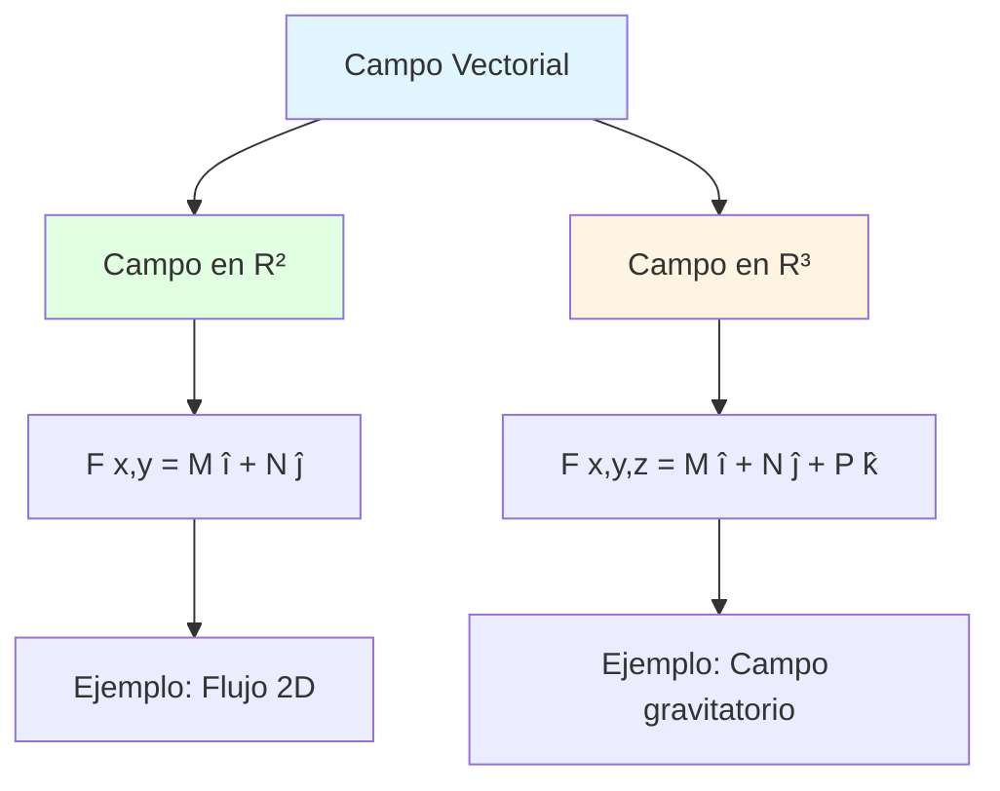
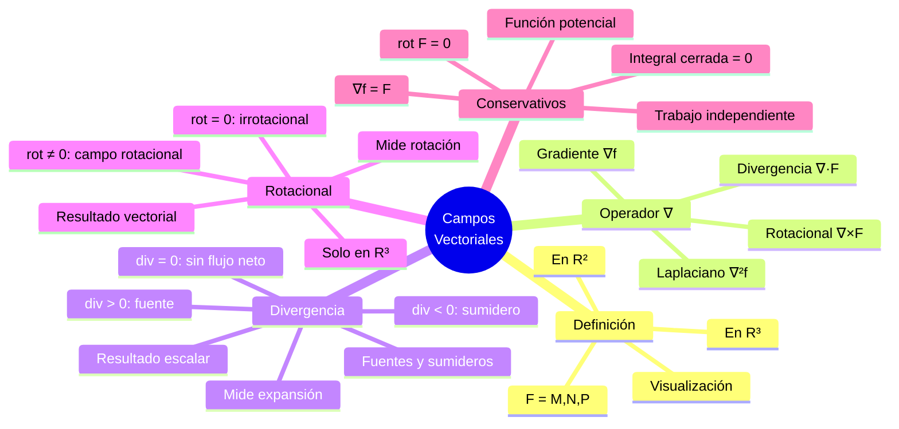
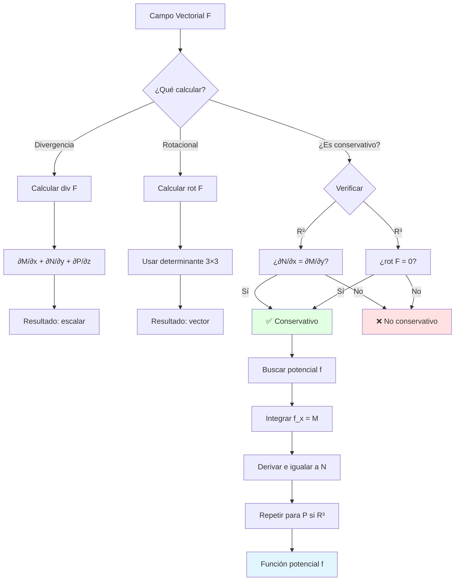

# 🧭 Campos Vectoriales: Divergencia y Rotacional

## 🎯 Introducción

> [!info]- 💡 ¿Qué son los Campos Vectoriales? Un **campo vectorial** es una función que asigna un vector a cada punto del espacio. Es como tener una "flecha" en cada ubicación que indica dirección y magnitud de alguna cantidad física.
> 
> **Analogía práctica:** Imagina el viento en un día tormentoso. En cada punto del espacio hay:
> 
> - Una **dirección** (hacia dónde sopla el viento)
> - Una **magnitud** (qué tan fuerte sopla)
> - Esto define un **campo vectorial de velocidades**
> 
> **Ejemplos del mundo real:**
> 
> |Campo|Descripción|Vector en cada punto|
> |---|---|---|
> |**Campo gravitatorio**|Atracción de la Tierra|Fuerza hacia el centro|
> |**Campo de velocidades**|Flujo de un río|Velocidad del agua|
> |**Campo eléctrico**|Influencia de cargas|Fuerza sobre carga de prueba|
> |**Campo de gradientes**|Temperatura en una habitación|Dirección de mayor cambio|
> |**Campo magnético**|Alrededor de un imán|Fuerza sobre polo norte|



---

## 📐 Definición Formal de Campo Vectorial

### 🔢 Notación y Componentes

> [!example]- 📝 Estructura Matemática
> 
> **Definición en R²:**
> 
> $$\mathbf{F}(x, y) = M(x,y),\hat{\mathbf{i}} + N(x,y),\hat{\mathbf{j}}$$
> 
> donde:
> 
> - $M(x,y)$: componente en dirección $x$
> - $N(x,y)$: componente en dirección $y$
> 
> **Definición en R³:**
> 
> $$\mathbf{F}(x, y, z) = M(x,y,z),\hat{\mathbf{i}} + N(x,y,z),\hat{\mathbf{j}} + P(x,y,z),\hat{\mathbf{k}}$$
> 
> donde:
> 
> - $M(x,y,z)$: componente en dirección $x$
> - $N(x,y,z)$: componente en dirección $y$
> - $P(x,y,z)$: componente en dirección $z$
> 
> **Interpretación visual:**
> 
> ```mermaid
> graph LR
>     A[Punto x,y,z] --> B[Campo F]
>     B --> C[Vector M, N, P]
>     C --> D[Componente M: horizontal]
>     C --> E[Componente N: vertical]
>     C --> F[Componente P: profundidad]
>     
>     style A fill:#e1f5ff
>     style B fill:#fff4e1
>     style C fill:#e1ffe1
> ```
> 
> **Ejemplos concretos:**
> 
> **1. Campo constante:** $$\mathbf{F}(x, y) = 2,\hat{\mathbf{i}} + 3,\hat{\mathbf{j}}$$
> 
> - En todo punto: vector $(2, 3)$
> - Como viento uniforme soplando siempre en la misma dirección
> 
> **2. Campo radial:** $$\mathbf{F}(x, y) = x,\hat{\mathbf{i}} + y,\hat{\mathbf{j}}$$
> 
> - En $(1, 0)$: vector $(1, 0)$ → hacia la derecha
> - En $(0, 1)$: vector $(0, 1)$ → hacia arriba
> - En $(1, 1)$: vector $(1, 1)$ → diagonal
> - Como agua saliendo de un punto central
> 
> **3. Campo rotacional:** $$\mathbf{F}(x, y) = -y,\hat{\mathbf{i}} + x,\hat{\mathbf{j}}$$
> 
> - En $(1, 0)$: vector $(0, 1)$ → hacia arriba
> - En $(0, 1)$: vector $(-1, 0)$ → hacia la izquierda
> - Los vectores "giran" alrededor del origen
> 
> **Comparación visual:**
> 
> |Tipo|Fórmula|Comportamiento|Ejemplo físico|
> |---|---|---|---|
> |**Constante**|$\mathbf{F} = (a, b)$|Mismo vector en todo punto|Gravedad uniforme|
> |**Radial**|$\mathbf{F} = (x, y)$|Se aleja del origen|Campo eléctrico de carga puntual|
> |**Rotacional**|$\mathbf{F} = (-y, x)$|Gira alrededor del origen|Torbellino, vórtice|
> |**Gradiente**|$\mathbf{F} = (y, x)$|Fluye según nivel|Calor de región caliente a fría|

### 🎨 Visualización de Campos

> [!note]- 🖼️ Representación Gráfica
> 
> **Métodos de visualización:**
> 
> ```mermaid
> graph TD
>     A[Campo Vectorial] --> B[Gráfica de flechas]
>     A --> C[Líneas de flujo]
>     A --> D[Mapa de calor magnitud]
>     
>     B --> E[Vector en cada punto<br/>de una malla]
>     C --> F[Curvas tangentes<br/>al campo]
>     D --> G[Color = magnitud<br/>del vector]
>     
>     style A fill:#e1f5ff
>     style B fill:#e1ffe1
>     style C fill:#fff4e1
>     style D fill:#ffe1f5
> ```
> 
> **Ejemplo de campo radial $\mathbf{F}(x,y) = (x, y)$:**
> 
> ```
>     ↗  ↑  ↖
>     →  •  ←     (origen en el centro)
>     ↘  ↓  ↙
> ```
> 
> **Ejemplo de campo rotacional $\mathbf{F}(x,y) = (-y, x)$:**
> 
> ```
>     ↓  ←  ↙
>     →  •  ←     (vectores giran antihorario)
>     ↗  →  ↑
> ```
> 
> **Características importantes:**
> 
> |Característica|Significado|Cómo detectarla|
> |---|---|---|
> |**Magnitud**|Fuerza del campo|Longitud de las flechas|
> |**Dirección**|Hacia dónde apunta|Orientación de las flechas|
> |**Fuentes**|Puntos donde nace el flujo|Flechas saliendo|
> |**Sumideros**|Puntos donde se absorbe|Flechas entrando|
> |**Rotación**|Giro del campo|Flechas en círculos|

---

## ∇ Operador Nabla (Gradiente)

### 🔺 Definición del Operador

> [!tip]- 🎯 El Operador Diferencial Vectorial
> 
> El **operador nabla** ($\nabla$) es un operador diferencial vectorial que se define como:
> 
> **En R²:** $$\nabla = \left(\frac{\partial}{\partial x}, \frac{\partial}{\partial y}\right) = \frac{\partial}{\partial x},\hat{\mathbf{i}} + \frac{\partial}{\partial y},\hat{\mathbf{j}}$$
> 
> **En R³:** $$\nabla = \left(\frac{\partial}{\partial x}, \frac{\partial}{\partial y}, \frac{\partial}{\partial z}\right) = \frac{\partial}{\partial x},\hat{\mathbf{i}} + \frac{\partial}{\partial y},\hat{\mathbf{j}} + \frac{\partial}{\partial z},\hat{\mathbf{k}}$$
> 
> **Interpretación:** Es como un "vector de derivadas parciales"
> 
> **Operaciones fundamentales con ∇:**
> 
> |Operación|Notación|Aplica a|Resultado|Nombre|
> |---|---|---|---|---|
> |**Gradiente**|$\nabla f$|Función escalar|Campo vectorial|grad|
> |**Divergencia**|$\nabla \cdot \mathbf{F}$|Campo vectorial|Función escalar|div|
> |**Rotacional**|$\nabla \times \mathbf{F}$|Campo vectorial|Campo vectorial|rot o curl|
> |**Laplaciano**|$\nabla^2 f$|Función escalar|Función escalar|$\Delta$|
> 
> **Flujo de operaciones:**
> 
> ```mermaid
> graph LR
>     A[Función Escalar f] -->|∇| B[Campo Vectorial ∇f]
>     B -->|∇·| C[Escalar: div ∇f]
>     B -->|∇×| D[Vector: rot ∇f = 0]
>     
>     E[Campo Vectorial F] -->|∇·| F[Escalar: div F]
>     E -->|∇×| G[Vector: rot F]
>     G -->|∇·| H[Escalar: div rot F = 0]
>     
>     style A fill:#e1f5ff
>     style B fill:#e1ffe1
>     style E fill:#fff4e1
> ```
> 
> **Identidades fundamentales:**
> 
> $$\nabla \times (\nabla f) = \mathbf{0} \quad \text{(el rotacional del gradiente es cero)}$$
> 
> $$\nabla \cdot (\nabla \times \mathbf{F}) = 0 \quad \text{(la divergencia del rotacional es cero)}$$
> 
> **Estas propiedades son CRUCIALES para campos conservativos**

---

## 🌊 Divergencia de un Campo Vectorial

### 📊 Concepto Intuitivo

> [!example]- 💧 ¿Qué es la Divergencia?
> 
> La **divergencia** mide cuánto "se expande" o "se contrae" un campo vectorial en un punto. Es una medida del **flujo neto** que sale de un punto infinitesimal.
> 
> **Analogía del agua:**
> 
> |Situación|Divergencia|Interpretación|
> |---|---|---|
> |**Fuente de agua** 💦|div $\mathbf{F} > 0$|El agua **sale** del punto|
> |**Sumidero** 🌀|div $\mathbf{F} < 0$|El agua **entra** al punto|
> |**Flujo constante** ➡️|div $\mathbf{F} = 0$|No se crea ni destruye fluido|
> 
> **Visualización:**
> 
> ```mermaid
> graph TD
>     A[Campo Vectorial] --> B{Divergencia}
>     
>     B -->|div > 0| C[Fuente]
>     B -->|div < 0| D[Sumidero]
>     B -->|div = 0| E[Sin fuente/sumidero]
>     
>     C --> F[Vectores salen<br/>del punto]
>     D --> G[Vectores entran<br/>al punto]
>     E --> H[Flujo equilibrado<br/>entra = sale]
>     
>     style C fill:#ffe1e1
>     style D fill:#e1e1ff
>     style E fill:#e1ffe1
> ```
> 
> **Ejemplos físicos:**
> 
> **1. Campo eléctrico de carga positiva:**
> 
> - Las líneas de campo **divergen** (salen) de la carga
> - $\text{div},\mathbf{E} > 0$ en la ubicación de la carga
> 
> **2. Campo de velocidades con fuente:**
> 
> - Agua brotando de un manantial
> - $\text{div},\mathbf{v} > 0$ en el manantial
> 
> **3. Campo incompresible:**
> 
> - Flujo de agua en tubería cerrada
> - $\text{div},\mathbf{v} = 0$ en todo punto

### 🔢 Definición Matemática

> [!success]- 📐 Fórmulas de Divergencia
> 
> **En R²:**
> 
> Si $\mathbf{F}(x, y) = M(x,y),\hat{\mathbf{i}} + N(x,y),\hat{\mathbf{j}}$, entonces:
> 
> $$\text{div}(\mathbf{F}) = \nabla \cdot \mathbf{F} = \frac{\partial M}{\partial x} + \frac{\partial N}{\partial y}$$
> 
> **En R³:**
> 
> Si $\mathbf{F}(x, y, z) = M,\hat{\mathbf{i}} + N,\hat{\mathbf{j}} + P,\hat{\mathbf{k}}$, entonces:
> 
> $$\text{div}(\mathbf{F}) = \nabla \cdot \mathbf{F} = \frac{\partial M}{\partial x} + \frac{\partial N}{\partial y} + \frac{\partial P}{\partial z}$$
> 
> **Procedimiento de cálculo:**
> 
> ```mermaid
> flowchart LR
>     A[Campo F = M,N,P] --> B[Derivar M<br/>respecto a x]
>     A --> C[Derivar N<br/>respecto a y]
>     A --> D[Derivar P<br/>respecto a z]
>     
>     B --> E[∂M/∂x]
>     C --> F[∂N/∂y]
>     D --> G[∂P/∂z]
>     
>     E --> H[Sumar todo]
>     F --> H
>     G --> H
>     
>     H --> I[div F]
>     
>     style A fill:#e1f5ff
>     style H fill:#fff4e1
>     style I fill:#e1ffe1
> ```
> 
> **Regla nemotécnica:**
> 
> |Componente|Derivar respecto a|
> |---|---|
> |$M$ (coeficiente de $\hat{\mathbf{i}}$)|$x$|
> |$N$ (coeficiente de $\hat{\mathbf{j}}$)|$y$|
> |$P$ (coeficiente de $\hat{\mathbf{k}}$)|$z$|
> 
> **"Cada componente se deriva respecto a su propia variable"**

### 💡 Ejemplos Resueltos

> [!example]- ✏️ Cálculo de Divergencias
> 
> **Ejemplo 1: Campo radial simple**
> 
> $$\mathbf{F}(x, y) = x,\hat{\mathbf{i}} + y,\hat{\mathbf{j}}$$
> 
> **Solución:**
> 
> - $M = x$, entonces $\frac{\partial M}{\partial x} = 1$
> - $N = y$, entonces $\frac{\partial N}{\partial y} = 1$
> 
> $$\text{div}(\mathbf{F}) = 1 + 1 = 2$$
> 
> **Interpretación:** Divergencia **constante positiva** → fuente uniforme en todo punto
> 
> ---
> 
> **Ejemplo 2: Campo rotacional**
> 
> $$\mathbf{F}(x, y) = -y,\hat{\mathbf{i}} + x,\hat{\mathbf{j}}$$
> 
> **Solución:**
> 
> - $M = -y$, entonces $\frac{\partial M}{\partial x} = 0$
> - $N = x$, entonces $\frac{\partial N}{\partial y} = 0$
> 
> $$\text{div}(\mathbf{F}) = 0 + 0 = 0$$
> 
> **Interpretación:** Sin divergencia → el flujo gira pero no se expande
> 
> ---
> 
> **Ejemplo 3: Campo en R³**
> 
> $$\mathbf{F}(x, y, z) = x^2,\hat{\mathbf{i}} + y^2,\hat{\mathbf{j}} + z^2,\hat{\mathbf{k}}$$
> 
> **Solución:**
> 
> - $M = x^2$, entonces $\frac{\partial M}{\partial x} = 2x$
> - $N = y^2$, entonces $\frac{\partial N}{\partial y} = 2y$
> - $P = z^2$, entonces $\frac{\partial P}{\partial z} = 2z$
> 
> $$\text{div}(\mathbf{F}) = 2x + 2y + 2z = 2(x + y + z)$$
> 
> **Interpretación:**
> 
> - En $(1, 1, 1)$: $\text{div}(\mathbf{F}) = 6 > 0$ → fuerte fuente
> - En $(0, 0, 0)$: $\text{div}(\mathbf{F}) = 0$ → sin divergencia
> - En $(-1, -1, -1)$: $\text{div}(\mathbf{F}) = -6 < 0$ → sumidero
> 
> ---
> 
> **Ejemplo 4: Campo del PDF**
> 
> $$\mathbf{F}(x, y, z) = 2xy,\hat{\mathbf{i}} + (x^2 + z^2),\hat{\mathbf{j}} + 2yz,\hat{\mathbf{k}}$$
> 
> **Solución:**
> 
> - $M = 2xy$, entonces $\frac{\partial M}{\partial x} = 2y$
> - $N = x^2 + z^2$, entonces $\frac{\partial N}{\partial y} = 0$
> - $P = 2yz$, entonces $\frac{\partial P}{\partial z} = 2y$
> 
> $$\text{div}(\mathbf{F}) = 2y + 0 + 2y = 4y$$
> 
> **Interpretación:**
> 
> - Si $y > 0$: divergencia positiva → fuente
> - Si $y < 0$: divergencia negativa → sumidero
> - Si $y = 0$: sin divergencia
> 
> **Tabla de resumen:**
> 
> |Campo|Divergencia|Tipo|
> |---|---|---|
> |$(x, y)$|$2$|Fuente constante|
> |$(-y, x)$|$0$|Sin divergencia (rotacional)|
> |$(x^2, y^2, z^2)$|$2(x+y+z)$|Variable|
> |$(2xy, x^2+z^2, 2yz)$|$4y$|Depende de $y$|

---

## 🌀 Rotacional de un Campo Vectorial

### 🎡 Concepto Intuitivo

> [!example]- 🔄 ¿Qué es el Rotacional?
> 
> El **rotacional** mide la tendencia de un campo vectorial a **rotar** o **girar** alrededor de un punto. Es una medida de la "vorticidad" o "circulación" del campo.
> 
> **Analogía del remolino:**
> 
> |Situación|Rotacional|Interpretación|
> |---|---|---|
> |**Remolino** 🌀|$\|\text{rot},\mathbf{F}\| > 0$|El campo **gira**|
> |**Sin rotación** ➡️|rot $\mathbf{F} = \mathbf{0}$|No hay giro|
> |**Sentido antihorario** ↺|Componente $z$ positiva|Giro hacia arriba|
> |**Sentido horario** ↻|Componente $z$ negativa|Giro hacia abajo|
> 
> **Visualización en 2D:**
> 
> ```
> Campo rotacional        Campo sin rotación
>     ↓  ←  ↙                 →  →  →
>     →  •  ←                 →  →  →
>     ↗  →  ↑                 →  →  →
>     
>   rot F ≠ 0               rot F = 0
> ```
> 
> **Experimento mental:** Coloca una pequeña rueda con paletas en el campo
> 
> - Si la rueda **gira**: hay rotacional
> - Si la rueda **no gira** (solo se traslada): rotacional = 0
> 
> ```mermaid
> graph TD
>     A[Campo Vectorial] --> B{Rotacional}
>     
>     B -->|≠ 0| C[Campo rotacional]
>     B -->|= 0| D[Campo irrotacional]
>     
>     C --> E[Hay circulación<br/>local]
>     D --> F[Sin circulación<br/>local]
>     
>     D --> G[Puede ser<br/>conservativo]
>     
>     style C fill:#ffe1e1
>     style D fill:#e1ffe1
>     style G fill:#e1f5ff
> ```
> 
> **Diferencia clave con divergencia:**
> 
> |Propiedad|Divergencia|Rotacional|
> |---|---|---|
> |**Mide**|Expansión/contracción|Rotación|
> |**Resultado**|Escalar|Vector|
> |**Dimensión**|R² y R³|Solo R³|
> |**Interpreta**|Fuentes/sumideros|Giros/vórtices|
> 
> **Ejemplos físicos:**
> 
> **1. Campo magnético alrededor de un cable:**
> 
> - Los vectores giran en círculos
> - $\text{rot},\mathbf{B} \neq \mathbf{0}$ proporcional a la corriente
> 
> **2. Tornado:**
> 
> - El viento gira alrededor del ojo
> - $\text{rot},\mathbf{v}$ es máximo en el ojo
> 
> **3. Campo gravitatorio:**
> 
> - Los vectores apuntan al centro
> - $\text{rot},\mathbf{g} = \mathbf{0}$ (campo conservativo)

### 🔢 Definición Matemática

> [!success]- 📐 Fórmula del Rotacional
> 
> **Solo definido en R³:**
> 
> Si $\mathbf{F}(x, y, z) = M,\hat{\mathbf{i}} + N,\hat{\mathbf{j}} + P,\hat{\mathbf{k}}$, entonces:
> 
> $$\text{rot}(\mathbf{F}) = \nabla \times \mathbf{F} = \begin{vmatrix} \hat{\mathbf{i}} & \hat{\mathbf{j}} & \hat{\mathbf{k}} \ \frac{\partial}{\partial x} & \frac{\partial}{\partial y} & \frac{\partial}{\partial z} \ M & N & P \end{vmatrix}$$
> 
> **Desarrollando el determinante:**
> 
> $$\text{rot}(\mathbf{F}) = \left(\frac{\partial P}{\partial y} - \frac{\partial N}{\partial z}\right)\hat{\mathbf{i}} - \left(\frac{\partial P}{\partial x} - \frac{\partial M}{\partial z}\right)\hat{\mathbf{j}} + \left(\frac{\partial N}{\partial x} - \frac{\partial M}{\partial y}\right)\hat{\mathbf{k}}$$
> 
> **Componentes:**
> 
> $$\text{rot}(\mathbf{F}) = \left(\frac{\partial P}{\partial y} - \frac{\partial N}{\partial z}, -\frac{\partial P}{\partial x} + \frac{\partial M}{\partial z}, \frac{\partial N}{\partial x} - \frac{\partial M}{\partial y}\right)$$
> 
> **Procedimiento de cálculo:**
> 
> ```mermaid
> flowchart TD
>     A[Campo F = M,N,P] --> B[Componente î]
>     A --> C[Componente ĵ]
>     A --> D[Componente k̂]
>     
>     B --> E[∂P/∂y - ∂N/∂z]
>     C --> F[∂M/∂z - ∂P/∂x]
>     D --> G[∂N/∂x - ∂M/∂y]
>     
>     E --> H[Rotacional]
>     F --> H
>     G --> H
>     
>     style A fill:#e1f5ff
>     style H fill:#e1ffe1
> ```
> 
> **Tabla de derivadas cruzadas:**
> 
> |Componente|Derivadas necesarias|Fórmula|
> |---|---|---|
> |**î** (primera)|$\frac{\partial P}{\partial y}$ y $\frac{\partial N}{\partial z}$|$\frac{\partial P}{\partial y} - \frac{\partial N}{\partial z}$|
> |**ĵ** (segunda)|$\frac{\partial M}{\partial z}$ y $\frac{\partial P}{\partial x}$|$\frac{\partial M}{\partial z} - \frac{\partial P}{\partial x}$|
> |**k̂** (tercera)|$\frac{\partial N}{\partial x}$ y $\frac{\partial M}{\partial y}$|$\frac{\partial N}{\partial x} - \frac{\partial M}{\partial y}$|
> 
> **Nota importante:** La componente de $\hat{\mathbf{j}}$ tiene el signo **negativo** adelante
> 
> **Método del determinante:**
> 
> 1. Escribir la matriz 3×3
> 2. Primera fila: vectores unitarios $\hat{\mathbf{i}}, \hat{\mathbf{j}}, \hat{\mathbf{k}}$
> 3. Segunda fila: operadores $\frac{\partial}{\partial x}, \frac{\partial}{\partial y}, \frac{\partial}{\partial z}$
> 4. Tercera fila: componentes $M, N, P$
> 5. Calcular determinante por cofactores de la primera fila

### 💡 Ejemplos Resueltos

> [!example]- ✏️ Cálculo de Rotacionales
> 
> **Ejemplo 1: Campo radial**
> 
> $$\mathbf{F}(x, y, z) = x,\hat{\mathbf{i}} + y,\hat{\mathbf{j}} + z,\hat{\mathbf{k}}$$
> 
> **Solución:**
> 
> - $M = x$, $N = y$, $P = z$
> 
> Componente $\hat{\mathbf{i}}$: $\frac{\partial P}{\partial y} - \frac{\partial N}{\partial z} = \frac{\partial z}{\partial y} - \frac{\partial y}{\partial z} = 0 - 0 = 0$
> 
> Componente $\hat{\mathbf{j}}$: $\frac{\partial M}{\partial z} - \frac{\partial P}{\partial x} = \frac{\partial x}{\partial z} - \frac{\partial z}{\partial x} = 0 - 0 = 0$
> 
> Componente $\hat{\mathbf{k}}$: $\frac{\partial N}{\partial x} - \frac{\partial M}{\partial y} = \frac{\partial y}{\partial x} - \frac{\partial x}{\partial y} = 0 - 0 = 0$
> 
> $$\text{rot}(\mathbf{F}) = (0, 0, 0) = \mathbf{0}$$
> 
> **Interpretación:** Campo radial sin rotación → campo conservativo
> 
> ---
> 
> **Ejemplo 2: Campo rotacional puro**
> 
> $$\mathbf{F}(x, y, z) = -y,\hat{\mathbf{i}} + x,\hat{\mathbf{j}} + 0,\hat{\mathbf{k}}$$
> 
> **Solución:**
> 
> - $M = -y$, $N = x$, $P = 0$
> 
> Componente $\hat{\mathbf{i}}$: $\frac{\partial 0}{\partial y} - \frac{\partial x}{\partial z} = 0 - 0 = 0$
> 
> Componente $\hat{\mathbf{j}}$: $\frac{\partial (-y)}{\partial z} - \frac{\partial 0}{\partial x} = 0 - 0 = 0$
> 
> Componente $\hat{\mathbf{k}}$: $\frac{\partial x}{\partial x} - \frac{\partial (-y)}{\partial y} = 1 - (-1) = 2$
>
> $$\text{rot}(\mathbf{F}) = (0, 0, 2) = 2,\hat{\mathbf{k}}$$
> 
> **Interpretación:**
> 
> - Rotación constante alrededor del eje $z$
> - Sentido antihorario (componente positiva)
> - Magnitud constante $= 2$
> 
> ---
> 
> **Ejemplo 3: Del PDF - Ejercicio 2.1**
> 
> $$\mathbf{F}(x, y, z) = x^2y,\hat{\mathbf{i}} + z,\hat{\mathbf{j}} + xyz,\hat{\mathbf{k}}$$
> 
> **Solución:**
> 
> - $M = x^2y$, $N = z$, $P = xyz$
> 
> **Derivadas necesarias:**
> 
> - $\frac{\partial M}{\partial y} = x^2$
> - $\frac{\partial M}{\partial z} = 0$
> - $\frac{\partial N}{\partial x} = 0$
> - $\frac{\partial N}{\partial z} = 1$
> - $\frac{\partial P}{\partial x} = yz$
> - $\frac{\partial P}{\partial y} = xz$
> 
> **Componentes:**
> 
> $\hat{\mathbf{i}}$: $\frac{\partial P}{\partial y} - \frac{\partial N}{\partial z} = xz - 1$
> 
> $\hat{\mathbf{j}}$: $\frac{\partial M}{\partial z} - \frac{\partial P}{\partial x} = 0 - yz = -yz$
> 
> $\hat{\mathbf{k}}$: $\frac{\partial N}{\partial x} - \frac{\partial M}{\partial y} = 0 - x^2 = -x^2$
> 
> $$\text{rot}(\mathbf{F}) = (xz - 1),\hat{\mathbf{i}} - yz,\hat{\mathbf{j}} - x^2,\hat{\mathbf{k}}$$
> 
> $$\text{rot}(\mathbf{F}) \neq \mathbf{0} \implies \mathbf{F} \text{ NO es conservativo}$$
> 
> ---
> 
> **Ejemplo 4: Del PDF - Ejercicio 2.2**
> 
> $$\mathbf{F}(x, y, z) = 2xy,\hat{\mathbf{i}} + (x^2 + z^2),\hat{\mathbf{j}} + 2yz,\hat{\mathbf{k}}$$
> 
> **Solución:**
> 
> - $M = 2xy$, $N = x^2 + z^2$, $P = 2yz$
> 
> **Derivadas:**
> 
> - $\frac{\partial M}{\partial y} = 2x$
> - $\frac{\partial M}{\partial z} = 0$
> - $\frac{\partial N}{\partial x} = 2x$
> - $\frac{\partial N}{\partial z} = 2z$
> - $\frac{\partial P}{\partial x} = 0$
> - $\frac{\partial P}{\partial y} = 2z$
> 
> **Componentes:**
> 
> $\hat{\mathbf{i}}$: $\frac{\partial P}{\partial y} - \frac{\partial N}{\partial z} = 2z - 2z = 0$
> 
> $\hat{\mathbf{j}}$: $\frac{\partial M}{\partial z} - \frac{\partial P}{\partial x} = 0 - 0 = 0$
> 
> $\hat{\mathbf{k}}$: $\frac{\partial N}{\partial x} - \frac{\partial M}{\partial y} = 2x - 2x = 0$
> 
> $$\text{rot}(\mathbf{F}) = (0, 0, 0) = \mathbf{0}$$
> 
> $$\text{rot}(\mathbf{F}) = \mathbf{0} \implies \mathbf{F} \text{ PUEDE ser conservativo}$$

---

## 🎯 Campos Vectoriales Conservativos

### 🔑 Definición y Criterios

> [!tip]- 🌟 ¿Qué es un Campo Conservativo?
> 
> Un campo vectorial $\mathbf{F}$ es **conservativo** si existe una función escalar $f$ (llamada **función potencial**) tal que:
> 
> $$\mathbf{F} = \nabla f$$
> 
> **Interpretación física:**
> 
> - En un campo conservativo, el trabajo realizado **NO depende del camino**
> - Solo depende de los puntos inicial y final
> - Ejemplos: campo gravitatorio, campo eléctrico estático
> 
> **Propiedades equivalentes:**
> 
> ```mermaid
> graph TD
>     A[Campo Conservativo] <--> B[∇f = F]
>     A <--> C[rot F = 0]
>     A <--> D[∮ F·dr = 0]
>     A <--> E[Trabajo independiente<br/>del camino]
>     
>     style A fill:#e1ffe1
>     style B fill:#e1f5ff
>     style C fill:#fff4e1
>     style D fill:#ffe1f5
>     style E fill:#f5e1ff
> ```
> 
> **Criterios de conservatividad:**
> 
> |Dimensión|Condición necesaria y suficiente|
> |---|---|
> |**R²**|$\frac{\partial N}{\partial x} = \frac{\partial M}{\partial y}$|
> |**R³**|$\nabla \times \mathbf{F} = \mathbf{0}$ (rotacional nulo)|
> 
> **Tabla de verificación:**
> 
> |Si...|Entonces...|
> |---|---|
> |$\text{rot}(\mathbf{F}) = \mathbf{0}$ en dominio simplemente conexo|$\mathbf{F}$ es conservativo|
> |$\mathbf{F}$ es conservativo|$\text{rot}(\mathbf{F}) = \mathbf{0}$|
> |$\mathbf{F}$ es conservativo|Existe función potencial $f$|
> |$\mathbf{F} = \nabla f$|$\int_C \mathbf{F} \cdot d\mathbf{r} = f(\mathbf{b}) - f(\mathbf{a})$|
> 
> **Nota:** "Dominio simplemente conexo" significa sin agujeros (como una esfera sólida, no como un toro)

### 🔍 Verificación en R²

> [!example]- 📋 Teorema para Campos en el Plano
> 
> **Teorema:** Sea $\mathbf{F}(x, y) = M,\hat{\mathbf{i}} + N,\hat{\mathbf{j}}$ un campo vectorial de clase $C^1$ en una bola abierta de $\mathbb{R}^2$. Entonces:
> 
> $$\mathbf{F} \text{ es conservativo} \iff \frac{\partial N}{\partial x} = \frac{\partial M}{\partial y}$$
> 
> **Procedimiento:**
> 
> ```mermaid
> flowchart TD
>     A[Campo F = M,N] --> B[Calcular ∂M/∂y]
>     A --> C[Calcular ∂N/∂x]
>     
>     B --> D{¿Son iguales?}
>     C --> D
>     
>     D -->|Sí| E[✅ ES conservativo]
>     D -->|No| F[❌ NO es conservativo]
>     
>     E --> G[Buscar potencial f]
>     
>     style E fill:#e1ffe1
>     style F fill:#ffe1e1
>     style G fill:#e1f5ff
> ```
> 
> **Ejemplo del PDF:**
> 
> $$\mathbf{F}(x, y) = (2xy^2 - y^3),\hat{\mathbf{i}} + (2x^2y - 3xy^2 + 2y),\hat{\mathbf{j}}$$
> 
> **Verificación:**
> 
> - $M = 2xy^2 - y^3$
> - $N = 2x^2y - 3xy^2 + 2y$
> 
> Calculamos: $$\frac{\partial M}{\partial y} = 4xy - 3y^2$$
> 
> $$\frac{\partial N}{\partial x} = 4xy - 3y^2$$
> 
> $$\frac{\partial M}{\partial y} = \frac{\partial N}{\partial x} \implies \mathbf{F} \text{ ES conservativo} ✅$$
> 
> **Ejemplos adicionales:**
> 
> **1. Campo conservativo:** $$\mathbf{F} = y,\hat{\mathbf{i}} + x,\hat{\mathbf{j}}$$
> 
> - $M = y \implies \frac{\partial M}{\partial y} = 1$
> - $N = x \implies \frac{\partial N}{\partial x} = 1$
> - $1 = 1$ ✅ **Conservativo**
> 
> **2. Campo NO conservativo:** $$\mathbf{F} = -y,\hat{\mathbf{i}} + x,\hat{\mathbf{j}}$$
> 
> - $M = -y \implies \frac{\partial M}{\partial y} = -1$
> - $N = x \implies \frac{\partial N}{\partial x} = 1$
> - $-1 \neq 1$ ❌ **NO conservativo**

### 🔍 Verificación en R³

> [!example]- 📋 Teorema para Campos en el Espacio
> 
> **Teorema:** Sea $\mathbf{F}(x, y, z) = M,\hat{\mathbf{i}} + N,\hat{\mathbf{j}} + P,\hat{\mathbf{k}}$ un campo vectorial de clase $C^1$ en una bola abierta de $\mathbb{R}^3$. Entonces:
> 
> $$\mathbf{F} \text{ es conservativo} \iff \nabla \times \mathbf{F} = \mathbf{0}$$
> 
> **Es decir, todas las componentes del rotacional deben ser cero:**
> 
> $$\begin{cases} \frac{\partial P}{\partial y} - \frac{\partial N}{\partial z} = 0 \[0.3em] \frac{\partial M}{\partial z} - \frac{\partial P}{\partial x} = 0 \[0.3em] \frac{\partial N}{\partial x} - \frac{\partial M}{\partial y} = 0 \end{cases}$$
> 
> **Flujo de verificación:**
> 
> ```mermaid
> flowchart TD
>     A[Campo F en R³] --> B[Calcular rot F]
>     B --> C[Componente î]
>     B --> D[Componente ĵ]
>     B --> E[Componente k̂]
>     
>     C --> F{¿= 0?}
>     D --> G{¿= 0?}
>     E --> H{¿= 0?}
>     
>     F -->|Sí| I[Verificar siguientes]
>     F -->|No| J[❌ NO conservativo]
>     
>     G -->|Sí| I
>     G -->|No| J
>     
>     H -->|Sí| K[✅ ES conservativo]
>     H -->|No| J
>     
>     style K fill:#e1ffe1
>     style J fill:#ffe1e1
> ```
> 
> **Ejemplo del PDF - Campo conservativo:**
> 
> $$\mathbf{F}(x, y, z) = 2xy,\hat{\mathbf{i}} + (x^2 + z^2),\hat{\mathbf{j}} + 2yz,\hat{\mathbf{k}}$$
> 
> Ya calculamos: $\text{rot}(\mathbf{F}) = (0, 0, 0)$
> 
> $$\implies \mathbf{F} \text{ ES conservativo} ✅$$
> 
> **Ejemplo del PDF - Campo NO conservativo:**
> 
> $$\mathbf{F}(x, y, z) = x^2y,\hat{\mathbf{i}} + z,\hat{\mathbf{j}} + xyz,\hat{\mathbf{k}}$$
> 
> Ya calculamos: $\text{rot}(\mathbf{F}) = (xz - 1, -yz, -x^2) \neq \mathbf{0}$
> 
> $$\implies \mathbf{F} \text{ NO es conservativo} ❌$$

---

## 🔎 Encontrar la Función Potencial

### 📝 Método General

> [!success]- 🎯 Procedimiento para Hallar $f$ tal que $\nabla f = \mathbf{F}$
> 
> **Paso 0:** Verificar que $\mathbf{F}$ sea conservativo
> 
> **Para R²:** Si $\mathbf{F} = M,\hat{\mathbf{i}} + N,\hat{\mathbf{j}}$ es conservativo, entonces:
> 
> $$\nabla f = \mathbf{F} \implies \begin{cases} \frac{\partial f}{\partial x} = M \[0.3em] \frac{\partial f}{\partial y} = N \end{cases}$$
> 
> **Para R³:** Si $\mathbf{F} = M,\hat{\mathbf{i}} + N,\hat{\mathbf{j}} + P,\hat{\mathbf{k}}$ es conservativo:
> 
> $$\nabla f = \mathbf{F} \implies \begin{cases} \frac{\partial f}{\partial x} = M \[0.3em] \frac{\partial f}{\partial y} = N \[0.3em] \frac{\partial f}{\partial z} = P \end{cases}$$
> 
> **Algoritmo:**
> 
> ```mermaid
> flowchart TD
>     A[Campo conservativo F] --> B[Integrar f_x = M<br/>respecto a x]
>     B --> C[Obtener f x,y,z<br/>+ función g y,z]
>     C --> D[Derivar f<br/>respecto a y]
>     D --> E[Igualar a N<br/>despejar g_y]
>     E --> F[Integrar g_y<br/>obtener g + h z]
>     F --> G[Derivar f<br/>respecto a z]
>     G --> H[Igualar a P<br/>despejar h']
>     H --> I[Integrar h'<br/>obtener h z]
>     I --> J[Función potencial<br/>f x,y,z + C]
>     
>     style A fill:#e1f5ff
>     style J fill:#e1ffe1
> ```
> 
> **Pasos detallados:**
> 
> 1. **Integrar** $f_x = M$ respecto a $x$
>     - Resultado: $f(x,y,z) = \int M , dx + g(y,z)$
> 2. **Derivar** $f$ respecto a $y$ e igualar a $N$
>     - Despejar $g_y(y,z)$
> 3. **Integrar** $g_y$ respecto a $y$
>     - Resultado: $g(y,z) = \int g_y , dy + h(z)$
> 4. **Derivar** $f$ respecto a $z$ e igualar a $P$
>     - Despejar $h'(z)$
> 5. **Integrar** $h'(z)$
>     - Resultado: $h(z) = \int h' , dz + C$
> 6. **Sustituir** todo en la expresión de $f$

### 💡 Ejemplo Completo del PDF

> [!example]- ✏️ Encontrar Potencial Paso a Paso
> 
> **Problema:** Hallar la función potencial de:
> 
> $$\mathbf{F}(x, y) = (2xy^2 - y^3),\hat{\mathbf{i}} + (2x^2y - 3xy^2 + 2y),\hat{\mathbf{j}}$$
> 
> **Ya verificamos que es conservativo.**
> 
> ---
> 
> **PASO 1:** Integrar $f_x = M$ respecto a $x$
> 
> $$f_x = 2xy^2 - y^3$$
> 
> $$f(x,y) = \int (2xy^2 - y^3) , dx = x^2y^2 - xy^3 + g(y)$$
> 
> donde $g(y)$ es una función solo de $y$ (constante respecto a $x$)
> 
> ---
> 
> **PASO 2:** Derivar $f$ respecto a $y$ e igualar a $N$
> 
> $$\frac{\partial f}{\partial y} = \frac{\partial}{\partial y}(x^2y^2 - xy^3 + g(y))$$
> 
> $$f_y = 2x^2y - 3xy^2 + g'(y)$$
> 
> Igualamos a $N$:
> 
> $$2x^2y - 3xy^2 + g'(y) = 2x^2y - 3xy^2 + 2y$$
> 
> Simplificando:
> 
> $$g'(y) = 2y$$
> 
> ---
> 
> **PASO 3:** Integrar $g'(y)$
> 
> $$g(y) = \int 2y , dy = y^2 + C$$
> 
> ---
> 
> **PASO 4:** Sustituir en $f$
> 
> $$f(x,y) = x^2y^2 - xy^3 + y^2 + C$$
> 
> **Respuesta:** La función potencial es:
> 
> $$\boxed{f(x,y) = x^2y^2 - xy^3 + y^2 + C}$$
> 
> **Verificación:**
> 
> $$\frac{\partial f}{\partial x} = 2xy^2 - y^3 = M ,\checkmark$$
> 
> $$\frac{\partial f}{\partial y} = 2x^2y - 3xy^2 + 2y = N ,\checkmark$$

### 💡 Ejemplo en R³

> [!example]- ✏️ Ejemplo del PDF - Integral de Línea
> 
> **Problema:** Dado el campo:
> 
> $$\mathbf{F}(x, y, z) = (yz + y - 1),\hat{\mathbf{i}} + (xz + x),\hat{\mathbf{j}} + (xy + 3z^2),\hat{\mathbf{k}}$$
> 
> **PASO 0:** Verificar conservatividad (ya hecho en el PDF: $\text{rot}(\mathbf{F}) = \mathbf{0}$)
> 
> ---
> 
> **PASO 1:** Integrar $f_x = M$
> 
> $$f_x = yz + y - 1$$
> 
> $$f(x,y,z) = \int (yz + y - 1) , dx = xyz + xy - x + g(y,z)$$
> 
> ---
> 
> **PASO 2:** Derivar respecto a $y$ e igualar a $N$
> 
> $$f_y = xz + x + g_y(y,z)$$
> 
> Igualar a $N = xz + x$:
> 
> $$xz + x + g_y = xz + x$$
> 
> $$g_y = 0$$
> 
> Por lo tanto: $g(y,z) = h(z)$ (solo depende de $z$)
> 
> ---
> 
> **PASO 3:** Derivar respecto a $z$ e igualar a $P$
> 
> $$f_z = xy + h'(z)$$
> 
> Igualar a $P = xy + 3z^2$:
> 
> $$xy + h'(z) = xy + 3z^2$$
> 
> $$h'(z) = 3z^2$$
> 
> ---
> 
> **PASO 4:** Integrar $h'(z)$
> 
> $$h(z) = \int 3z^2 , dz = z^3 + C$$
> 
> ---
> 
> **PASO 5:** Función potencial completa
> 
> $$\boxed{f(x,y,z) = xyz + xy - x + z^3 + C}$$
> 
> **Verificación:**
> 
> $$\frac{\partial f}{\partial x} = yz + y - 1 = M ,\checkmark$$
> 
> $$\frac{\partial f}{\partial y} = xz + x = N ,\checkmark$$
> 
> $$\frac{\partial f}{\partial z} = xy + 3z^2 = P ,\checkmark$$

---

## 🧮 Propiedades del Operador Nabla

### 📋 Identidades Fundamentales

> [!note]- 🔢 Propiedades Importantes
> 
> Sean $\mathbf{F}$, $\mathbf{G}$ campos vectoriales y $f$, $g$ funciones escalares:
> 
> **1. Linealidad de la divergencia:** $$\text{div}(\mathbf{F} + \mathbf{G}) = \text{div},\mathbf{F} + \text{div},\mathbf{G}$$
> 
> **2. Regla del producto (divergencia):** $$\text{div}(f\mathbf{F}) = f,\text{div},\mathbf{F} + \mathbf{F} \cdot \nabla f$$
> 
> **3. Divergencia del rotacional:** $$\text{div}(\text{rot},\mathbf{F}) = 0$$
> 
> **Interpretación:** "La divergencia del rotacional es siempre cero"
> 
> **4. Linealidad del rotacional:** $$\text{rot}(\mathbf{F} + \mathbf{G}) = \text{rot},\mathbf{F} + \text{rot},\mathbf{G}$$
> 
> **5. Regla del producto (rotacional):** $$\text{rot}(f\mathbf{F}) = f,\text{rot},\mathbf{F} + \nabla f \times \mathbf{F}$$
> 
> **6. Rotacional del gradiente:** $$\text{rot}(\nabla f) = \mathbf{0}$$
> 
> **Interpretación:** "El rotacional del gradiente es siempre cero"
> 
> **7. Laplaciano:** $$\nabla^2(fg) = f\nabla^2 g + g\nabla^2 f + 2(\nabla f \cdot \nabla g)$$
> 
> donde $\nabla^2 = \nabla \cdot \nabla$ (Laplaciano)
> 
> **8. Divergencia de producto vectorial:** $$\text{div}(\mathbf{G} \times \mathbf{F}) = \mathbf{F} \cdot \text{rot},\mathbf{G} - \mathbf{G} \cdot \text{rot},\mathbf{F}$$
> 
> **9. Identidad con gradientes:** $$\text{div}(\nabla f \times \nabla g) = 0$$
> 
> **10. Fórmula de Green (identidad):** $$\text{div}(f\nabla g - g\nabla f) = f\nabla^2 g - g\nabla^2 f$$
> 
> **Tabla resumen de "resultados cero":**
> 
> |Operación|Resultado|Nombre|
> |---|---|---|
> |$\nabla \times (\nabla f)$|$= \mathbf{0}$|Rotacional del gradiente|
> |$\nabla \cdot (\nabla \times \mathbf{F})$|$= 0$|Divergencia del rotacional|
> |$\nabla \cdot (\nabla f \times \nabla g)$|$= 0$|Divergencia de gradientes cruzados|
> 
> **Diagrama de composiciones:**
> 
> ```mermaid
> graph LR
>     A[Función escalar f] -->|∇| B[∇f<br/>gradiente]
>     B -->|∇×| C[0<br/>siempre cero]
>     
>     D[Campo vectorial F] -->|∇×| E[rot F<br/>rotacional]
>     E -->|∇·| F[0<br/>siempre cero]
>     
>     style C fill:#ffe1e1
>     style F fill:#ffe1e1
> ```

---

## 🎓 Ejercicios Guiados

### 📝 Nivel Básico

> [!example]- 💪 Ejercicios de Práctica Inicial
> 
> **Ejercicio 1:** Calcular la divergencia de: $$\mathbf{F}(x, y) = 3x,\hat{\mathbf{i}} + 4y,\hat{\mathbf{j}}$$
> 
> **Solución:**
> 
> - $M = 3x \implies \frac{\partial M}{\partial x} = 3$
> - $N = 4y \implies \frac{\partial N}{\partial y} = 4$
> 
> $$\text{div}(\mathbf{F}) = 3 + 4 = 7$$
> 
> ---
> 
> **Ejercicio 2:** Verificar si es conservativo: $$\mathbf{F}(x, y) = 2x,\hat{\mathbf{i}} + y,\hat{\mathbf{j}}$$
> 
> **Solución:**
> 
> - $M = 2x \implies \frac{\partial M}{\partial y} = 0$
> - $N = y \implies \frac{\partial N}{\partial x} = 0$
> 
> $$0 = 0 \implies \text{ES conservativo} ✅$$
> 
> **Hallar potencial:**
> 
> $$f = \int 2x , dx = x^2 + g(y)$$
> 
> $$f_y = g'(y) = y \implies g(y) = \frac{y^2}{2}$$
> 
> $$f(x,y) = x^2 + \frac{y^2}{2} + C$$
> 
> ---
> 
> **Ejercicio 3:** Calcular el rotacional de: $$\mathbf{F}(x, y, z) = y,\hat{\mathbf{i}} + x^2,\hat{\mathbf{j}} + z,\hat{\mathbf{k}}$$
> 
> **Solución:**
> 
> - $M = y$, $N = x^2$, $P = z$
> 
> Componente $\hat{\mathbf{i}}$: $\frac{\partial z}{\partial y} - \frac{\partial x^2}{\partial z} = 0 - 0 = 0$
> 
> Componente $\hat{\mathbf{j}}$: $\frac{\partial y}{\partial z} - \frac{\partial z}{\partial x} = 0 - 0 = 0$
> 
> Componente $\hat{\mathbf{k}}$: $\frac{\partial x^2}{\partial x} - \frac{\partial y}{\partial y} = 2x - 1$
> 
> $$\text{rot}(\mathbf{F}) = (0, 0, 2x - 1)$$

### 📝 Nivel Intermedio

> [!example]- 💪 Ejercicios del PDF
> 
> **Ejercicio 1 (PDF):** Verificar si es conservativo: $$\mathbf{F}(x, y) = 2x,\hat{\mathbf{i}} + y,\hat{\mathbf{j}}$$
> 
> **Ya resuelto arriba** ✅
> 
> ---
> 
> **Ejercicio 2 (PDF):** Determinar si son conservativos:
> 
> **a)** $\mathbf{F}(x, y, z) = x^2y,\hat{\mathbf{i}} + z,\hat{\mathbf{j}} + xyz,\hat{\mathbf{k}}$
> 
> **Solución:** Ya calculamos $\text{rot}(\mathbf{F}) = (xz-1, -yz, -x^2) \neq \mathbf{0}$
> 
> **NO es conservativo** ❌
> > **b)** $\mathbf{F}(x, y, z) = 2xy,\hat{\mathbf{i}} + (x^2 + z^2),\hat{\mathbf{j}} + 2yz,\hat{\mathbf{k}}$
> 
> **Solución:** Ya calculamos $\text{rot}(\mathbf{F}) = \mathbf{0}$
> 
> **SÍ es conservativo** ✅
> 
> **Hallar potencial:**
> 
> $$f = \int 2xy , dx = x^2y + g(y,z)$$
> 
> $$f_y = x^2 + g_y = x^2 + z^2 \implies g_y = z^2$$
> 
> $$g = \int z^2 , dy = yz^2 + h(z)$$
> 
> $$f_z = 2yz + h'(z) = 2yz \implies h'(z) = 0$$
> 
> $$f(x,y,z) = x^2y + yz^2 + C$$
> 
> ---
> 
> **Ejercicio 3 (PDF):** Estudiar si son conservativos y hallar potencial:
> 
> **a)** $\mathbf{E}(x, y) = (e^xy^2 + 3x^2y),\hat{\mathbf{i}} + (2ye^x + x^3),\hat{\mathbf{j}}$
> 
> **Verificar:**
> 
> - $M = e^xy^2 + 3x^2y$
>     
> - $\frac{\partial M}{\partial y} = 2e^xy + 3x^2$
>     
> - $N = 2ye^x + x^3$
>     
> - $\frac{\partial N}{\partial x} = 2ye^x + 3x^2$
>     
> 
> $$2e^xy + 3x^2 = 2ye^x + 3x^2 \implies \text{Conservativo} ✅$$
> 
> **Potencial:**
> 
> $$f = \int (e^xy^2 + 3x^2y) , dx = e^xy^2 + x^3y + g(y)$$
> 
> $$f_y = 2ye^x + x^3 + g'(y) = 2ye^x + x^3$$
> 
> $$g'(y) = 0 \implies g(y) = C$$
> 
> $$\boxed{f(x,y) = e^xy^2 + x^3y + C}$$
> 
> **b)** $\mathbf{E}(x, y) = \frac{y}{2x^2},\hat{\mathbf{i}} - \frac{2y}{x},\hat{\mathbf{j}}$
> 
> **Verificar:**
> 
> - $M = \frac{y}{2x^2}$
>     
> - $\frac{\partial M}{\partial y} = \frac{1}{2x^2}$
>     
> - $N = -\frac{2y}{x}$
>     
> - $\frac{\partial N}{\partial x} = \frac{2y}{x^2}$
>     
> 
> $$\frac{1}{2x^2} \neq \frac{2y}{x^2} \implies \text{NO conservativo} ❌$$

### 📝 Nivel Avanzado

> [!example]- 💪 Problemas de Aplicación
> 
> **Problema 1:** Demostrar que $\text{div}(\text{rot},\mathbf{F}) = 0$ para cualquier campo $\mathbf{F}$
> 
> **Solución:**
> 
> Sea $\mathbf{F} = M,\hat{\mathbf{i}} + N,\hat{\mathbf{j}} + P,\hat{\mathbf{k}}$
> 
> $$\text{rot}(\mathbf{F}) = \left(\frac{\partial P}{\partial y} - \frac{\partial N}{\partial z}\right)\hat{\mathbf{i}} - \left(\frac{\partial P}{\partial x} - \frac{\partial M}{\partial z}\right)\hat{\mathbf{j}} + \left(\frac{\partial N}{\partial x} - \frac{\partial M}{\partial y}\right)\hat{\mathbf{k}}$$
> 
> Ahora calculamos la divergencia:
> 
> $$\text{div}(\text{rot},\mathbf{F}) = \frac{\partial}{\partial x}\left(\frac{\partial P}{\partial y} - \frac{\partial N}{\partial z}\right) - \frac{\partial}{\partial y}\left(\frac{\partial P}{\partial x} - \frac{\partial M}{\partial z}\right) + \frac{\partial}{\partial z}\left(\frac{\partial N}{\partial x} - \frac{\partial M}{\partial y}\right)$$
> 
> $$= \frac{\partial^2 P}{\partial x \partial y} - \frac{\partial^2 N}{\partial x \partial z} - \frac{\partial^2 P}{\partial y \partial x} + \frac{\partial^2 M}{\partial y \partial z} + \frac{\partial^2 N}{\partial z \partial x} - \frac{\partial^2 M}{\partial z \partial y}$$
> 
> Por el **teorema de Schwarz** (derivadas mixtas conmutan):
> 
> $$\frac{\partial^2 P}{\partial x \partial y} = \frac{\partial^2 P}{\partial y \partial x}$$
> 
> Todos los términos se cancelan:
> 
> $$\text{div}(\text{rot},\mathbf{F}) = 0 \quad \blacksquare$$
> 
> ---
> 
> **Problema 2:** Si $\mathbf{F}$ es conservativo y $C$ es una curva cerrada, demostrar que: $$\oint_C \mathbf{F} \cdot d\mathbf{r} = 0$$
> 
> **Solución:**
> 
> Como $\mathbf{F}$ es conservativo, existe $f$ tal que $\mathbf{F} = \nabla f$
> 
> Para una curva cerrada: punto inicial $= $ punto final $ = \mathbf{a}$
> 
> $$\oint_C \mathbf{F} \cdot d\mathbf{r} = \oint_C \nabla f \cdot d\mathbf{r} = f(\mathbf{a}) - f(\mathbf{a}) = 0 \quad \blacksquare$$

---

## 📊 Resumen Visual Completo

### 🗺️ Mapa Conceptual



### 📋 Tablas de Referencia Rápida

> [!note]- 📊 Guía Rápida de Fórmulas
> 
> **Divergencia:**
> 
> |Dimensión|Fórmula|
> |---|---|
> |R²|$\text{div}(\mathbf{F}) = \frac{\partial M}{\partial x} + \frac{\partial N}{\partial y}$|
> |R³|$\text{div}(\mathbf{F}) = \frac{\partial M}{\partial x} + \frac{\partial N}{\partial y} + \frac{\partial P}{\partial z}$|
> 
> **Rotacional:**
> 
> |Componente|Fórmula|
> |---|---|
> |$\hat{\mathbf{i}}$|$\frac{\partial P}{\partial y} - \frac{\partial N}{\partial z}$|
> |$\hat{\mathbf{j}}$|$\frac{\partial M}{\partial z} - \frac{\partial P}{\partial x}$|
> |$\hat{\mathbf{k}}$|$\frac{\partial N}{\partial x} - \frac{\partial M}{\partial y}$|
> 
> **Criterios de conservatividad:**
> 
> |Dimensión|Condición|
> |---|---|
> |R²|$\frac{\partial N}{\partial x} = \frac{\partial M}{\partial y}$|
> |R³|$\nabla \times \mathbf{F} = \mathbf{0}$|
> 
> **Identidades clave:**
> 
> |Identidad|Valor|
> |---|---|
> |$\nabla \times (\nabla f)$|$\mathbf{0}$|
> |$\nabla \cdot (\nabla \times \mathbf{F})$|$0$|
> |$\nabla \cdot (\nabla f \times \nabla g)$|$0$|

### 🔄 Diagrama de Flujo de Trabajo



---

## 🎯 Aplicaciones y Conexiones

### 🌍 Aplicaciones Físicas

> [!tip]- 🔬 Campos en la Física
> 
> **1. Campo Gravitatorio:**
> 
> $$\mathbf{F} = -\frac{GMm}{r^2},\hat{\mathbf{r}}$$
> 
> - **Divergencia:** Cero excepto en masas (Ley de Gauss)
> - **Rotacional:** Cero (campo conservativo)
> - **Potencial:** $U = -\frac{GMm}{r}$
> 
> **2. Campo Eléctrico:**
> 
> $$\mathbf{E} = -\nabla \phi$$
> 
> - **Divergencia:** Proporcional a densidad de carga ($\nabla \cdot \mathbf{E} = \frac{\rho}{\epsilon_0}$)
> - **Rotacional:** Cero en régimen estático
> - **Potencial:** $\phi$ (potencial eléctrico)
> 
> **3. Campo Magnético:**
> 
> $$\mathbf{B}$$
> 
> - **Divergencia:** Siempre cero ($\nabla \cdot \mathbf{B} = 0$, no hay monopolos)
> - **Rotacional:** Proporcional a corriente (Ley de Ampère)
> - **No es conservativo** (en general)
> 
> **4. Campo de Velocidades de un Fluido:**
> 
> $$\mathbf{v}(x,y,z,t)$$
> 
> - **Divergencia:** Compresibilidad del fluido
>     - $\nabla \cdot \mathbf{v} = 0$ → fluido incompresible
>     - $\nabla \cdot \mathbf{v} > 0$ → expansión
> - **Rotacional:** Vorticidad
>     - $\nabla \times \mathbf{v} = \mathbf{0}$ → flujo irrotacional
>     - $\nabla \times \mathbf{v} \neq \mathbf{0}$ → hay remolinos
> 
> **Tabla comparativa:**
> 
> |Campo|div|rot|Conservativo|
> |---|---|---|---|
> |Gravitatorio|0 (sin masas)|0|✅ Sí|
> |Eléctrico (estático)|$\rho/\epsilon_0$|0|✅ Sí|
> |Magnético|0|$\propto$ corriente|❌ No|
> |Velocidad (incompresible)|0|Variable|Depende|

### 🔗 Conexión con Próximos Temas

> [!quote]- 🌟 Continuando el Aprendizaje
> 
> **Has dominado:**
> 
> - ✅ Definición de campos vectoriales
> - ✅ Cálculo de divergencia
> - ✅ Cálculo de rotacional
> - ✅ Campos conservativos
> - ✅ Función potencial
> 
> **Próximos temas naturales:**
> 
> ```mermaid
> graph LR
>     A[Campos Vectoriales<br/>Divergencia y Rotacional] --> B[Integrales de Línea]
>     B --> C[Teorema Fundamental<br/>de Integrales de Línea]
>     C --> D[Teorema de Green]
>     D --> E[Teorema de Stokes]
>     E --> F[Teorema de la Divergencia]
>     
>     style A fill:#e1ffe1
>     style B fill:#e1f5ff
>     style D fill:#fff4e1
>     style E fill:#ffe1f5
>     style F fill:#f5e1ff
> ```
> 
> **Roadmap de Cálculo Vectorial:**
> 
> |Nivel|Tema|Usa conceptos de|
> |---|---|---|
> |**Actual**|Campos: div y rot|Derivadas parciales|
> |**Siguiente**|Integrales de línea|Campos vectoriales|
> |**Intermedio**|Teorema de Green|div, rot, integrales|
> |**Avanzado**|Teorema de Stokes|Rotacional|
> |**Culminante**|Teorema de la Divergencia|Divergencia|
> 
> **Los teoremas integrales unifican:**
> 
> - Teorema Fundamental del Cálculo
> - Teorema Fundamental de Integrales de Línea
> - Teorema de Green (2D)
> - Teorema de Stokes (3D - rotacional)
> - Teorema de la Divergencia (3D - divergencia)

---

## ✅ Checklist de Dominio

> [!success]- 📝 ¿Dominas el Tema?
> 
> Marca los conceptos que comprendes:
> 
> **Conceptos básicos:**
> 
> - [ ] Puedo explicar qué es un campo vectorial
> - [ ] Sé escribir un campo en notación $\hat{\mathbf{i}}, \hat{\mathbf{j}}, \hat{\mathbf{k}}$
> - [ ] Entiendo el operador nabla $\nabla$
> 
> **Divergencia:**
> 
> - [ ] Sé calcular $\text{div}(\mathbf{F})$ en R²
> - [ ] Sé calcular $\text{div}(\mathbf{F})$ en R³
> - [ ] Puedo interpretar físicamente la divergencia
> - [ ] Identifico fuentes y sumideros
> 
> **Rotacional:**
> 
> - [ ] Sé calcular $\text{rot}(\mathbf{F})$ usando el determinante
> - [ ] Conozco las tres componentes del rotacional
> - [ ] Puedo interpretar físicamente el rotacional
> - [ ] Sé cuándo un campo es irrotacional
> 
> **Campos conservativos:**
> 
> - [ ] Sé verificar si un campo es conservativo en R²
> - [ ] Sé verificar si un campo es conservativo en R³
> - [ ] Puedo encontrar la función potencial
> - [ ] Entiendo el significado de trabajo independiente del camino
> 
> **Identidades:**
> 
> - [ ] Sé que $\nabla \times (\nabla f) = \mathbf{0}$
> - [ ] Sé que $\nabla \cdot (\nabla \times \mathbf{F}) = 0$
> - [ ] Puedo aplicar propiedades del operador nabla
> 
> **Ejercicios:**
> 
> - [ ] Puedo resolver ejercicios de divergencia
> - [ ] Puedo resolver ejercicios de rotacional
> - [ ] Puedo verificar campos conservativos
> - [ ] Puedo hallar funciones potenciales

---

**Tags:** #calculo-vectorial #campos-vectoriales #divergencia #rotacional #operador-nabla #campos-conservativos #funcion-potencial #derivadas-parciales #fisica #ecuaciones-diferenciales