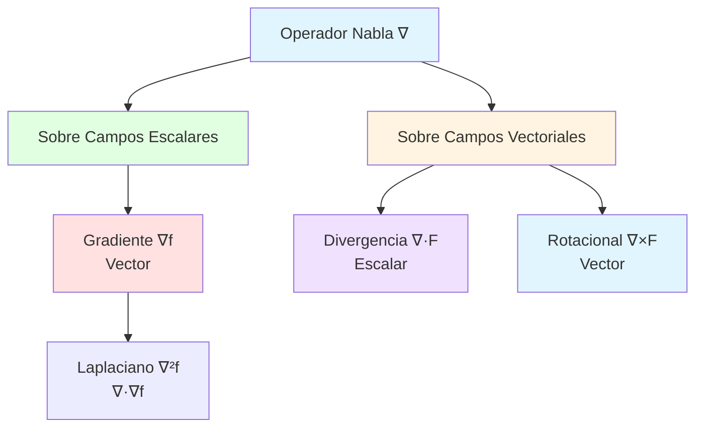

# ∇ Propiedades del Operador Nabla

## 🎯 Introducción

> [!info]- 💡 ¿Qué es el Operador Nabla? El **operador nabla** (∇) es un operador diferencial vectorial fundamental en cálculo vectorial. Actúa como un "vector de derivadas parciales" que se aplica a campos escalares y vectoriales para obtener información sobre cómo cambian en el espacio.
> 
> **Analogía práctica:** Imagina un explorador con tres brújulas especiales:
> 
> - Una mide cambios **hacia el este** (∂/∂x)
> - Otra mide cambios **hacia el norte** (∂/∂y)
> - La tercera mide cambios **hacia arriba** (∂/∂z)
> 
> El operador nabla combina estas tres "mediciones" en una herramienta única que revela cómo varían las magnitudes físicas en todas direcciones.
> 
> **¿Por qué es importante?**
> 
> |Aspecto|Descripción|Ejemplo de Uso|
> |---|---|---|
> |**Gradiente**|Dirección de máximo crecimiento|Temperatura en una habitación|
> |**Divergencia**|Flujo neto que sale de un punto|Expansión de un gas|
> |**Rotacional**|Tendencia a rotar|Vórtices en fluidos|
> |**Laplaciano**|Curvatura del campo|Ecuación del calor|
> |**Operaciones combinadas**|Identidades vectoriales complejas|Electromagnetismo|



---

## 📐 Definición y Notación

### 🔢 Forma del Operador Nabla

> [!example]- 📝 Representación Matemática
> 
> El operador nabla se define como un **vector de operadores de derivadas parciales**:
> 
> **En ℝ³:** $$\nabla = \left(\frac{\partial}{\partial x}, \frac{\partial}{\partial y}, \frac{\partial}{\partial z}\right) = \frac{\partial}{\partial x}\mathbf{i} + \frac{\partial}{\partial y}\mathbf{j} + \frac{\partial}{\partial z}\mathbf{k}$$
> 
> **En ℝ²:** $$\nabla = \left(\frac{\partial}{\partial x}, \frac{\partial}{\partial y}\right) = \frac{\partial}{\partial x}\mathbf{i} + \frac{\partial}{\partial y}\mathbf{j}$$
> 
> **Interpretación componente a componente:**
> 
> |Componente|Símbolo|Significado|Dirección|
> |---|---|---|---|
> |**Primera**|∂/∂x|Tasa de cambio en x|Este-Oeste|
> |**Segunda**|∂/∂y|Tasa de cambio en y|Norte-Sur|
> |**Tercera**|∂/∂z|Tasa de cambio en z|Arriba-Abajo|
> 
> **Naturaleza dual del operador:**
> 
> ```mermaid
> graph LR
>     A[∇ como vector] --> B[Tiene componentes<br/>i, j, k]
>     A --> C[Tiene dirección<br/>y magnitud]
>     
>     D[∇ como operador] --> E[Actúa sobre funciones]
>     D --> F[Produce derivadas]
>     
>     style A fill:#e1ffe1
>     style D fill:#fff4e1
> ```
> 
> **Ejemplo conceptual:**
> 
> ```
> Si f(x,y,z) = x² + y² + z²
> 
> ∇f = (∂f/∂x, ∂f/∂y, ∂f/∂z)
>    = (2x, 2y, 2z)
>    = 2(x, y, z)
>    = 2r̄  (vector posición escalado)
> ```

### 🎨 Operaciones Básicas con Nabla

> [!note]- ⚙️ Tres Operaciones Fundamentales
> 
> **1. Gradiente (∇f) - Sobre campos escalares**
> 
> $$\nabla f = \left(\frac{\partial f}{\partial x}, \frac{\partial f}{\partial y}, \frac{\partial f}{\partial z}\right)$$
> 
> - **Entrada:** Campo escalar f(x,y,z)
> - **Salida:** Campo vectorial
> - **Interpretación:** Vector que apunta en la dirección de máximo crecimiento
> 
> **2. Divergencia (∇·F̄) - Producto punto**
> 
> $$\nabla \cdot \mathbf{F} = \frac{\partial F_x}{\partial x} + \frac{\partial F_y}{\partial y} + \frac{\partial F_z}{\partial z}$$
> 
> - **Entrada:** Campo vectorial F̄(x,y,z)
> - **Salida:** Campo escalar
> - **Interpretación:** Flujo neto que sale de un punto (fuente o sumidero)
> 
> **3. Rotacional (∇×F̄) - Producto cruz**
> 
> $$\nabla \times \mathbf{F} = \begin{vmatrix} \mathbf{i} & \mathbf{j} & \mathbf{k} \ \frac{\partial}{\partial x} & \frac{\partial}{\partial y} & \frac{\partial}{\partial z} \ F_x & F_y & F_z \end{vmatrix}$$
> 
> - **Entrada:** Campo vectorial F̄(x,y,z)
> - **Salida:** Campo vectorial
> - **Interpretación:** Tendencia rotacional del campo
> 
> **Tabla comparativa:**
> 
> |Operación|Notación|Entrada|Salida|Significado Físico|
> |---|---|---|---|---|
> |**Gradiente**|∇f|Escalar|Vector|Dirección de máximo aumento|
> |**Divergencia**|∇·F̄|Vector|Escalar|Expansión/Compresión|
> |**Rotacional**|∇×F̄|Vector|Vector|Circulación/Rotación|
> 
> **Flujo de transformaciones:**
> 
> ```mermaid
> flowchart LR
>     A[Campo Escalar f] -->|∇| B[Campo Vectorial ∇f]
>     B -->|∇·| C[Campo Escalar ∇·∇f]
>     B -->|∇×| D[Campo Vectorial ∇×∇f=0]
>     
>     E[Campo Vectorial F̄] -->|∇·| F[Campo Escalar ∇·F̄]
>     E -->|∇×| G[Campo Vectorial ∇×F̄]
>     G -->|∇·| H[Escalar: ∇·∇×F̄=0]
>     
>     style A fill:#e1ffe1
>     style E fill:#fff4e1
>     style C fill:#ffe1e1
>     style H fill:#ffe1e1
> ```

---

## 🔄 Propiedades Algebraicas

### ➕ Linealidad del Operador

> [!success]- 📊 Propiedades Lineales Fundamentales
> 
> **Propiedad 1: Linealidad del Gradiente**
> 
> Para campos escalares f, g y constantes a, b ∈ ℝ:
> 
> $$\nabla(af + bg) = a\nabla f + b\nabla g$$
> 
> **Demostración:**
> 
> ```
> ∇(af + bg) = (∂(af+bg)/∂x, ∂(af+bg)/∂y, ∂(af+bg)/∂z)
>            = (a∂f/∂x + b∂g/∂x, a∂f/∂y + b∂g/∂y, a∂f/∂z + b∂g/∂z)
>            = a(∂f/∂x, ∂f/∂y, ∂f/∂z) + b(∂g/∂x, ∂g/∂y, ∂g/∂z)
>            = a∇f + b∇g ✓
> ```
> 
> **Ejemplo numérico:**
> 
> ```
> Sea f(x,y) = x² + y²  →  ∇f = (2x, 2y)
> Sea g(x,y) = xy       →  ∇g = (y, x)
> 
> ∇(3f - 2g) = ∇(3x² + 3y² - 2xy)
>            = (6x - 2y, 6y - 2x)
>            = 3(2x, 2y) - 2(y, x)
>            = 3∇f - 2∇g ✓
> ```
> 
> **Propiedad 2: Linealidad de la Divergencia**
> 
> Para campos vectoriales F̄, Ḡ y constantes a, b:
> 
> $$\nabla \cdot (a\mathbf{F} + b\mathbf{G}) = a(\nabla \cdot \mathbf{F}) + b(\nabla \cdot \mathbf{G})$$
> 
> **Propiedad 3: Linealidad del Rotacional**
> 
> $$\nabla \times (a\mathbf{F} + b\mathbf{G}) = a(\nabla \times \mathbf{F}) + b(\nabla \times \mathbf{G})$$
> 
> **Tabla resumen de linealidad:**
> 
> |Operación|Propiedad|Expresión Matemática|
> |---|---|---|
> |**Gradiente**|Lineal|∇(af+bg) = a∇f + b∇g|
> |**Divergencia**|Lineal|∇·(aF̄+bḠ) = a∇·F̄ + b∇·Ḡ|
> |**Rotacional**|Lineal|∇×(aF̄+bḠ) = a∇×F̄ + b∇×Ḡ|
> 
> **Visualización:**
> 
> ```mermaid
> graph TD
>     A[Linealidad de ∇] --> B[Suma]
>     A --> C[Producto por escalar]
>     
>     B --> D[∇f + g = ∇f + ∇g]
>     C --> E[∇cf = c∇f]
>     
>     D --> F[Válido para ∇, ∇·, ∇×]
>     E --> F
>     
>     style A fill:#e1ffe1
>     style F fill:#fff4e1
> ```

### 🎯 Regla del Producto

> [!tip]- 🔨 Reglas de Productos con Nabla
> 
> **Regla 1: Producto de escalar por vector (Gradiente)**
> 
> $$\nabla(f\mathbf{F}) = (\nabla f)\mathbf{F} + f(\nabla \mathbf{F})$$
> 
> Donde ∇F significa aplicar ∇ a cada componente de F̄.
> 
> **Regla 2: Divergencia de un producto**
> 
> $$\nabla \cdot (f\mathbf{F}) = (\nabla f) \cdot \mathbf{F} + f(\nabla \cdot \mathbf{F})$$
> 
> **Demostración detallada:**
> 
> ```
> Sea F̄ = (Fx, Fy, Fz) y f un campo escalar
> 
> ∇·(fF̄) = ∂(fFx)/∂x + ∂(fFy)/∂y + ∂(fFz)/∂z
>        
> Por regla del producto de derivadas:
>        = (∂f/∂x·Fx + f·∂Fx/∂x) + (∂f/∂y·Fy + f·∂Fy/∂y) + (∂f/∂z·Fz + f·∂Fz/∂z)
>        
> Reagrupando:
>        = (∂f/∂x·Fx + ∂f/∂y·Fy + ∂f/∂z·Fz) + f(∂Fx/∂x + ∂Fy/∂y + ∂Fz/∂z)
>        = (∇f)·F̄ + f(∇·F̄) ✓
> ```
> 
> **Regla 3: Rotacional de un producto**
> 
> $$\nabla \times (f\mathbf{F}) = (\nabla f) \times \mathbf{F} + f(\nabla \times \mathbf{F})$$
> 
> **Regla 4: Gradiente de un producto de escalares**
> 
> $$\nabla(fg) = f\nabla g + g\nabla f$$
> 
> **Ejemplo aplicado:**
> 
> ```
> Sea f(x,y,z) = x² + y²
> Sea F̄(x,y,z) = (y, -x, 0)
> 
> Calculemos ∇·(fF̄):
> 
> Método directo:
> fF̄ = (x²+y²)(y, -x, 0) = ((x²+y²)y, -(x²+y²)x, 0)
> ∇·(fF̄) = ∂[(x²+y²)y]/∂x + ∂[-(x²+y²)x]/∂y + 0
>        = 2xy + (-2xy) = 0
> 
> Por la fórmula:
> ∇f = (2x, 2y, 0)
> ∇·F̄ = ∂y/∂x + ∂(-x)/∂y + 0 = 0
> 
> ∇·(fF̄) = (2x,2y,0)·(y,-x,0) + (x²+y²)(0)
>        = 2xy - 2xy + 0 = 0 ✓
> ```
> 
> **Tabla de reglas del producto:**
> 
> |Tipo|Fórmula|Análoga a|
> |---|---|---|
> |**Grad. de producto**|∇(fg) = f∇g + g∇f|(fg)' = f'g + fg'|
> |**Div. de producto**|∇·(fF̄) = (∇f)·F̄ + f(∇·F̄)|(fg)' = f'g + fg'|
> |**Rot. de producto**|∇×(fF̄) = (∇f)×F̄ + f(∇×F̄)|(fg)' = f'g + fg'|
> 
> ```mermaid
> graph TB
>     A[Regla del Producto] --> B[∇ actúa sobre producto]
>     B --> C[Término 1:<br/>∇ en primer factor]
>     B --> D[Término 2:<br/>∇ en segundo factor]
>     
>     C --> E[Mantiene segundo factor]
>     D --> F[Mantiene primer factor]
>     
>     style A fill:#e1f5ff
>     style C fill:#e1ffe1
>     style D fill:#fff4e1
> ```

---

## 🌀 Identidades Vectoriales Fundamentales

### ⭕ Identidades de Composición

> [!warning]- 🎭 Identidades que Siempre se Cumplen
> 
> **Identidad 1: El rotacional del gradiente es CERO**
> 
> $$\nabla \times (\nabla f) = \mathbf{0} \quad \text{para todo campo escalar } f$$
> 
> **Demostración:**
> 
> ```
> Sea f un campo escalar suave (C²)
> 
> ∇f = (∂f/∂x, ∂f/∂y, ∂f/∂z)
> 
> ∇×(∇f) = |  i      j      k   |
>          | ∂/∂x  ∂/∂y  ∂/∂z  |
>          | ∂f/∂x ∂f/∂y ∂f/∂z |
> 
> Componente i:
> ∂(∂f/∂z)/∂y - ∂(∂f/∂y)/∂z = ∂²f/∂y∂z - ∂²f/∂z∂y
> 
> Por teorema de Schwarz (derivadas mixtas iguales):
> = 0
> 
> Similarmente para j y k: todas son 0
> 
> Por lo tanto: ∇×(∇f) = (0, 0, 0) = 0̄ ✓
> ```
> 
> **Interpretación física:**
> 
> - Un campo gradiente **NO tiene circulación**
> - Los campos conservativos son exactamente los gradientes
> - No hay "remolinos" en un campo de alturas
> 
> **Identidad 2: La divergencia del rotacional es CERO**
> 
> $$\nabla \cdot (\nabla \times \mathbf{F}) = 0 \quad \text{para todo campo vectorial } \mathbf{F}$$
> 
> **Demostración:**
> 
> ```
> Sea F̄ = (Fx, Fy, Fz)
> 
> ∇×F̄ = (∂Fz/∂y - ∂Fy/∂z, ∂Fx/∂z - ∂Fz/∂x, ∂Fy/∂x - ∂Fx/∂y)
> 
> ∇·(∇×F̄) = ∂/∂x(∂Fz/∂y - ∂Fy/∂z) + ∂/∂y(∂Fx/∂z - ∂Fz/∂x) + ∂/∂z(∂Fy/∂x - ∂Fx/∂y)
> 
>          = ∂²Fz/∂x∂y - ∂²Fy/∂x∂z + ∂²Fx/∂y∂z - ∂²Fz/∂y∂x + ∂²Fy/∂z∂x - ∂²Fx/∂z∂y
> 
> Agrupando derivadas mixtas iguales:
>          = (∂²Fz/∂x∂y - ∂²Fz/∂y∂x) + (∂²Fx/∂y∂z - ∂²Fx/∂z∂y) + (∂²Fy/∂z∂x - ∂²Fy/∂x∂z)
>          = 0 + 0 + 0 = 0 ✓
> ```
> 
> **Interpretación física:**
> 
> - Un campo rotacional **NO tiene fuentes ni sumideros**
> - El flujo neto de un campo magnético a través de cualquier superficie cerrada es cero
> - Los campos solenoidales son exactamente los rotacionales
> 
> **Diagrama conceptual:**
> 
> ```mermaid
> graph TD
>     A[Campo Escalar f] -->|∇| B[∇f<br/>Vector Conservativo]
>     B -->|∇×| C[∇×∇f = 0̄<br/>SIEMPRE CERO]
>     
>     D[Campo Vectorial F̄] -->|∇×| E[∇×F̄<br/>Vector Solenoidal]
>     E -->|∇·| F[∇·∇×F̄ = 0<br/>SIEMPRE CERO]
>     
>     style C fill:#ffe1e1
>     style F fill:#ffe1e1
>     style B fill:#e1ffe1
>     style E fill:#e1ffe1
> ```
> 
> **Tabla de identidades cero:**
> 
> |Identidad|Expresión|Consecuencia|Interpretación|
> |---|---|---|---|
> |**Rot. de grad.**|∇×(∇f) = 0̄|Campos conservativos no rotan|Sin circulación|
> |**Div. de rot.**|∇·(∇×F̄) = 0|Campos rotacionales sin fuentes|Incompresible|
> 
> **Aplicaciones importantes:**
> 
> 1. **Campos conservativos:** Si ∇×F̄ = 0̄, entonces existe f tal que F̄ = ∇f
> 2. **Campos solenoidales:** Si ∇·F̄ = 0, entonces existe Ḡ tal que F̄ = ∇×Ḡ
> 3. **Electromagnetismo:**
>     - ∇·B̄ = 0 (no hay monopolos magnéticos)
>     - ∇×Ē = -∂B̄/∂t (ley de Faraday)

### 🔀 Identidades con Productos

> [!note]- 🧮 Identidades BAC-CAB y Similares
> 
> **Identidad BAC-CAB (Desarrollo del doble producto cruz)**
> 
> $$\nabla \times (\nabla \times \mathbf{F}) = \nabla(\nabla \cdot \mathbf{F}) - \nabla^2\mathbf{F}$$
> 
> Donde ∇²F̄ = (∇²Fx, ∇²Fy, ∇²Fz) es el Laplaciano vectorial.
> 
> **Nota crucial:** Esta fórmula es análoga a: $$\mathbf{A} \times (\mathbf{B} \times \mathbf{C}) = \mathbf{B}(\mathbf{A} \cdot \mathbf{C}) - \mathbf{C}(\mathbf{A} \cdot \mathbf{B})$$
> 
> **Identidad del gradiente de un producto punto**
> 
> $$\nabla(\mathbf{F} \cdot \mathbf{G}) = (\mathbf{F} \cdot \nabla)\mathbf{G} + (\mathbf{G} \cdot \nabla)\mathbf{F} + \mathbf{F} \times (\nabla \times \mathbf{G}) + \mathbf{G} \times (\nabla \times \mathbf{F})$$
> 
> **Identidad de la divergencia de un producto cruz**
> 
> $$\nabla \cdot (\mathbf{F} \times \mathbf{G}) = \mathbf{G} \cdot (\nabla \times \mathbf{F}) - \mathbf{F} \cdot (\nabla \times \mathbf{G})$$
> 
> **Demostración:**
> 
> ```
> Sea F̄ = (Fx, Fy, Fz), Ḡ = (Gx, Gy, Gz)
> 
> F̄×Ḡ = (FyGz - FzGy, FzGx - FxGz, FxGy - FyGx)
> 
> ∇·(F̄×Ḡ) = ∂/∂x(FyGz - FzGy) + ∂/∂y(FzGx - FxGz) + ∂/∂z(FxGy - FyGx)
> 
> Expandiendo (8 términos):
> = Fy∂Gz/∂x + Gy∂Fz/∂y + ... - Fz∂Gy/∂x - Fx∂Gz/∂y - ...
> 
> Reagrupando inteligentemente:
> = Gx(∂Fz/∂y - ∂Fy/∂z) + Gy(∂Fx/∂z - ∂Fz/∂x) + Gz(∂Fy/∂x - ∂Fx/∂y)
>   - Fx(∂Gz/∂y - ∂Gy/∂z) - Fy(∂Gx/∂z - ∂Gz/∂x) - Fz(∂Gy/∂x - ∂Gx/∂y)
> 
> = Ḡ·(∇×F̄) - F̄·(∇×Ḡ) ✓
> ```
> 
> **Tabla de identidades con productos:**
> 
> |Identidad|Fórmula|Aplicación|
> |---|---|---|
> |**Div. de cruz**|∇·(F̄×Ḡ) = Ḡ·(∇×F̄) - F̄·(∇×Ḡ)|Conservación momento angular|
> |**Rot. de cruz**|∇×(F̄×Ḡ) = F̄(∇·Ḡ) - Ḡ(∇·F̄) + (Ḡ·∇)F̄ - (F̄·∇)Ḡ|Dinámica de fluidos|
> |**BAC-CAB**|∇×(∇×F̄) = ∇(∇·F̄) - ∇²F̄|Ecuaciones de ondas|
> |**Grad. producto**|∇(F̄·Ḡ) = (F̄·∇)Ḡ + (Ḡ·∇)F̄ + F̄×(∇×Ḡ) + Ḡ×(∇×F̄)|Energía cinética|
> 
> ```mermaid
> graph TB
>     A[Identidades con Productos] --> B[Productos Punto]
>     A --> C[Productos Cruz]
>     
>     B --> D[∇·fF̄<br/>∇f·Ḡ]
>     C --> E[∇×fF̄<br/>∇·F̄×Ḡ]
>     
>     D --> F[Fórmula de Leibniz]
>     E --> G[Identidad BAC-CAB]
>     
>     style A fill:#e1f5ff
>     style F fill:#e1ffe1
>     style G fill:#fff4e1
> ```

---

## 🔄 Laplaciano: El Operador ∇²

### 📊 Definición y Propiedades

> [!example]- 🎯 El Operador ∇² (Delta o Laplaciano)
> 
> **Definición:**
> 
> El **Laplaciano** es la divergencia del gradiente:
> 
> $$\nabla^2 f = \nabla \cdot (\nabla f) = \frac{\partial^2 f}{\partial x^2} + \frac{\partial^2 f}{\partial y^2} + \frac{\partial^2 f}{\partial z^2}$$
> 
> **Notaciones alternativas:**
> 
> - ∇²f (notación nabla)
> - Δf (notación delta)
> - ∂²f/∂x² + ∂²f/∂y² + ∂²f/∂z² (forma explícita)
> 
> **Interpretación geométrica:**
> 
> ```
> El Laplaciano mide cuánto difiere el valor de f en un punto
> del promedio de f en sus alrededores inmediatos.
> 
> ∇²f > 0  →  f está en un "valle" (valores cercanos mayores)
> ∇²f < 0  →  f está en una "colina" (valores cercanos menores)
> ∇²f = 0  →  f es armónica (promedio perfecto)
> ```
> 
> **Desarrollo paso a paso:**
> 
> ```
> ∇²f = ∇·(∇f)
>     = ∇·(∂f/∂x, ∂f/∂y, ∂f/∂z)
>     = ∂/∂x(∂f/∂x) + ∂/∂y(∂f/∂y) + ∂/∂z(∂f/∂z)
>     = ∂²f/∂x² + ∂²f/∂y² + ∂²f/∂z²
> ```
> 
> **Ejemplo calculado:**
> 
> ```
> Sea f(x,y,z) = x³ + y³ + z³ + xyz
> 
> Paso 1 - Primeras derivadas:
> ∂f/∂x = 3x² + yz
> ∂f/∂y = 3y² + xz
> ∂f/∂z = 3z² + xy
> 
> Paso 2 - Segundas derivadas:
> ∂²f/∂x² = 6x
> ∂²f/∂y² = 6y
> ∂²f/∂z² = 6z
> 
> Paso 3 - Laplaciano: ∇²f = 6x + 6y + 6z = 6(x + y + z)
> 
> ````
> 
> **Propiedades del Laplaciano:**
> 
> |Propiedad|Expresión|Significado|
> |---|---|---|
> |**Linealidad**|∇²(af+bg) = a∇²f + b∇²g|Operador lineal|
> |**Regla producto**|∇²(fg) = f∇²g + g∇²f + 2(∇f)·(∇g)|Análoga a (fg)''|
> |**Conmutación**|∇²∇f = ∇∇²f|Para funciones suaves|
> |**Cero rot.**|∇×(∇²f∇f) = 0|Siempre conservativo|
> 
> **Ecuaciones importantes que usan ∇²:**
> 
> ```mermaid
> graph TB
>     A[Laplaciano ∇²] --> B[Ecuación de Laplace<br/>∇²φ = 0]
>     A --> C[Ecuación de Poisson<br/>∇²φ = ρ]
>     A --> D[Ecuación del Calor<br/>∂u/∂t = k∇²u]
>     A --> E[Ecuación de Ondas<br/>∂²u/∂t² = c²∇²u]
>     A --> F[Ecuación de Schrödinger<br/>iℏ∂ψ/∂t = -ℏ²/2m∇²ψ + Vψ]
>     
>     style A fill:#e1f5ff
>     style B fill:#e1ffe1
>     style C fill:#fff4e1
>     style D fill:#ffe1e1
>     style E fill:#f0e1ff
> ````

### 🌊 Laplaciano Vectorial

> [!tip]- 🔀 Extensión a Campos Vectoriales
> 
> **Definición del Laplaciano vectorial:**
> 
> Para un campo vectorial F̄ = (Fx, Fy, Fz):
> 
> $$\nabla^2 \mathbf{F} = \left(\nabla^2 F_x, \nabla^2 F_y, \nabla^2 F_z\right)$$
> 
> Es decir, **se aplica el Laplaciano escalar a cada componente**.
> 
> **Identidad fundamental (ya vista):**
> 
> $$\nabla^2 \mathbf{F} = \nabla(\nabla \cdot \mathbf{F}) - \nabla \times (\nabla \times \mathbf{F})$$
> 
> **Demostración de la identidad:**
> 
> ```
> Partimos de la identidad BAC-CAB:
> ∇×(∇×F̄) = ∇(∇·F̄) - ∇²F̄
> 
> Despejando:
> ∇²F̄ = ∇(∇·F̄) - ∇×(∇×F̄) ✓
> 
> Esta relación conecta:
> - Divergencia (∇·F̄) - fuentes/sumideros
> - Rotacional doble (∇×(∇×F̄)) - circulación
> - Laplaciano (∇²F̄) - difusión
> ```
> 
> **Ejemplo calculado:**
> 
> ```
> Sea F̄(x,y,z) = (xy, yz, zx)
> 
> Método 1 - Componente a componente:
> ∇²Fx = ∇²(xy) = ∂²(xy)/∂x² + ∂²(xy)/∂y² + ∂²(xy)/∂z² = 0
> ∇²Fy = ∇²(yz) = 0
> ∇²Fz = ∇²(zx) = 0
> 
> Por lo tanto: ∇²F̄ = (0, 0, 0) = 0̄
> 
> Método 2 - Con la identidad:
> ∇·F̄ = ∂(xy)/∂x + ∂(yz)/∂y + ∂(zx)/∂z = y + z + x
> ∇(∇·F̄) = ∇(x+y+z) = (1, 1, 1)
> 
> ∇×F̄ = (z-y, x-z, y-x)
> ∇×(∇×F̄) = ... = (1, 1, 1)
> 
> ∇²F̄ = (1,1,1) - (1,1,1) = (0,0,0) ✓
> ```
> 
> **Comparación:**
> 
> |Aspecto|Laplaciano Escalar ∇²f|Laplaciano Vectorial ∇²F̄|
> |---|---|---|
> |**Entrada**|Campo escalar|Campo vectorial|
> |**Salida**|Campo escalar|Campo vectorial|
> |**Cálculo**|Suma de segundas derivadas|Componente a componente|
> |**Interpretación**|Curvatura promedio|Difusión vectorial|
> |**Ecuaciones**|Laplace, calor|Navier-Stokes, Maxwell|

---

## 🎓 Conexión con Integrales de Línea

### 🛤️ Teoremas Fundamentales

> [!success]- 🌉 Puente entre Derivadas e Integrales
> 
> **Visión unificada:**
> 
> Las propiedades del operador nabla son **fundamentales** para los teoremas que relacionan integrales de línea, superficie y volumen.
> 
> ```mermaid
> graph TB
>     A[Teorema Fundamental<br/>del Cálculo 1D] --> B[Teorema Fundamental<br/>para Gradientes]
>     A --> C[Teorema de Green]
>     A --> D[Teorema de Stokes]
>     A --> E[Teorema de Gauss]
>     
>     B -.->|∇f| F[Integrales de Línea]
>     C -.->|∇×F̄| F
>     D -.->|∇×F̄| G[Integrales de Superficie]
>     E -.->|∇·F̄| H[Integrales de Volumen]
>     
>     style A fill:#e1f5ff
>     style B fill:#e1ffe1
>     style C fill:#fff4e1
>     style D fill:#ffe1e1
>     style E fill:#f0e1ff
> ```
> 
> **Teorema 1: Fundamental del Cálculo para Gradientes**
> 
> Si F̄ = ∇f (campo conservativo), entonces:
> 
> $$\int_C \mathbf{F} \cdot d\mathbf{r} = \int_C \nabla f \cdot d\mathbf{r} = f(B) - f(A)$$
> 
> Donde A y B son los puntos inicial y final de la curva C.
> 
> **Conexión con la propiedad:**
> 
> - Si ∇×F̄ = 0̄, entonces F̄ = ∇f para algún f
> - Esto garantiza que la integral de línea **solo depende de los extremos**
> - El campo es **conservativo** (independiente del camino)
> 
> **Ejemplo:**
> 
> ```
> Sea F̄(x,y) = (2xy, x²+1) y C cualquier curva de (0,0) a (1,1)
> 
> Verificación: ∇×F̄ en 2D significa ∂Fy/∂x - ∂Fx/∂y
> ∂(x²+1)/∂x - ∂(2xy)/∂y = 2x - 2x = 0 ✓
> 
> Por lo tanto existe f tal que ∇f = F̄
> Encontramos: f(x,y) = x²y + y
> 
> Integral: ∫C F̄·dr̄ = f(1,1) - f(0,0) = (1·1+1) - 0 = 2
> (independiente del camino elegido)
> ```
> 
> **Teorema 2: Condición para campos conservativos**
> 
> Un campo F̄ es conservativo en un dominio simplemente conexo si y solo si:
> 
> $$\nabla \times \mathbf{F} = \mathbf{0}$$
> 
> **Implicaciones prácticas:**
> 
> |Propiedad|Si ∇×F̄ = 0̄|Si ∇×F̄ ≠ 0̄|
> |---|---|---|
> |**Conservativo**|✅ Sí|❌ No|
> |**Función potencial**|✅ Existe f: F̄=∇f|❌ No existe|
> |**Integral de línea**|Independiente del camino|Depende del camino|
> |**Integral cerrada**|∮C F̄·dr̄ = 0|∮C F̄·dr̄ ≠ 0 (general)|
> 
> **Teorema 3: Relación con circulación**
> 
> La circulación de F̄ alrededor de una curva cerrada C está relacionada con el rotacional:
> 
> $$\oint_C \mathbf{F} \cdot d\mathbf{r} = \iint_S (\nabla \times \mathbf{F}) \cdot \mathbf{n} , dS$$
> 
> (Teorema de Stokes - lo verán próximamente)
> 
> **Preparación para integrales de línea:**
> 
> ```mermaid
> flowchart LR
>     A[Campo F̄] --> B{¿∇×F̄ = 0̄?}
>     B -->|Sí| C[Campo Conservativo]
>     B -->|No| D[Campo No Conservativo]
>     
>     C --> E[Buscar f: ∇f = F̄]
>     E --> F[∫C F̄·dr̄ = f(B) - f(A)]
>     
>     D --> G[Parametrizar curva]
>     G --> H[∫C F̄·dr̄ = ∫ab F̄r̄' dt]
>     
>     style C fill:#e1ffe1
>     style D fill:#ffe1e1
>     style F fill:#e1f5ff
> ```

---

## 📋 Tabla Resumen de Propiedades

> [!note]- 📊 Guía de Referencia Rápida
> 
> ### Operaciones Básicas
> 
> |Operación|Notación|Entrada|Salida|Fórmula|
> |---|---|---|---|---|
> |**Gradiente**|∇f|Escalar|Vector|(∂f/∂x, ∂f/∂y, ∂f/∂z)|
> |**Divergencia**|∇·F̄|Vector|Escalar|∂Fx/∂x + ∂Fy/∂y + ∂Fz/∂z|
> |**Rotacional**|∇×F̄|Vector|Vector|det(ī,j̄,k̄; ∂/∂x,∂/∂y,∂/∂z; Fx,Fy,Fz)|
> |**Laplaciano**|∇²f|Escalar|Escalar|∂²f/∂x² + ∂²f/∂y² + ∂²f/∂z²|
> 
> ### Identidades Fundamentales (SIEMPRE ciertas)
> 
> |Identidad|Expresión|Nombre|Interpretación|
> |---|---|---|---|
> |1|∇×(∇f) = 0̄|Rot. del grad.|Gradientes no rotan|
> |2|∇·(∇×F̄) = 0|Div. del rot.|Rotacionales incompresibles|
> |3|∇²f = ∇·(∇f)|Laplaciano|Divergencia del gradiente|
> |4|∇×(∇×F̄) = ∇(∇·F̄) - ∇²F̄|BAC-CAB|Doble rotacional|
> 
> ### Propiedades de Linealidad
> 
> |Operador|Propiedad|
> |---|---|
> |∇(af+bg)|= a∇f + b∇g|
> |∇·(aF̄+bḠ)|= a(∇·F̄) + b(∇·Ḡ)|
> |∇×(aF̄+bḠ)|= a(∇×F̄) + b(∇×Ḡ)|
> |∇²(af+bg)|= a∇²f + b∇²g|
> 
> ### Reglas del Producto
> 
> |Tipo|Fórmula|
> |---|---|
> |Grad. de producto escalar|∇(fg) = f∇g + g∇f|
> |Div. de producto|∇·(fF̄) = (∇f)·F̄ + f(∇·F̄)|
> |Rot. de producto|∇×(fF̄) = (∇f)×F̄ + f(∇×F̄)|
> |Div. de cruz|∇·(F̄×Ḡ) = Ḡ·(∇×F̄) - F̄·(∇×Ḡ)|
> 
> ### Criterios de Campos
> 
> |Campo|Condición|Propiedad|Ejemplo Físico|
> |---|---|---|---|
> |**Conservativo**|∇×F̄ = 0̄|F̄ = ∇f|Campo gravitatorio|
> |**Solenoidal**|∇·F̄ = 0|F̄ = ∇×Ḡ|Campo magnético|
> |**Armónico**|∇²f = 0|Promedio local|Temperatura estable|
> |**Irrotacional**|∇×F̄ = 0̄|Sin circulación|Flujo sin remolinos|

---

## 🎯 Ejercicios Resueltos

> [!example]- 💪 Práctica con Ejemplos Detallados
> 
> **Nivel Básico:**
> 
> **Ejercicio 1: Verificar identidad ∇×(∇f) = 0̄**
> 
> ```
> Sea f(x,y,z) = x²y + yz² + 3z
> 
> Paso 1 - Calcular gradiente:
> ∇f = (∂f/∂x, ∂f/∂y, ∂f/∂z)
>    = (2xy, x² + z², 2yz + 3)
> 
> Paso 2 - Calcular rotacional:
> ∇×(∇f) = | ī    j̄    k̄   |
>          | ∂/∂x ∂/∂y ∂/∂z |
>          | 2xy  x²+z² 2yz+3|
> 
> Componente ī:
> ∂(2yz+3)/∂y - ∂(x²+z²)/∂z = 2z - 2z = 0
> 
> Componente j̄:
> ∂(2xy)/∂z - ∂(2yz+3)/∂x = 0 - 0 = 0
> 
> Componente k̄:
> ∂(x²+z²)/∂x - ∂(2xy)/∂y = 2x - 2x = 0
> 
> Resultado: ∇×(∇f) = (0, 0, 0) = 0̄ ✓
> ```
> 
> **Ejercicio 2: Determinar si un campo es conservativo**
> 
> ```
> Sea F̄(x,y,z) = (y+z, x+z, x+y)
> 
> Para ser conservativo debe cumplir: ∇×F̄ = 0̄
> 
> ∇×F̄ = | ī    j̄    k̄   |
>        | ∂/∂x ∂/∂y ∂/∂z |
>        | y+z  x+z  x+y  |
> 
> Componente ī: ∂(x+y)/∂y - ∂(x+z)/∂z = 1 - 1 = 0 ✓
> Componente j̄: ∂(y+z)/∂z - ∂(x+y)/∂x = 1 - 1 = 0 ✓
> Componente k̄: ∂(x+z)/∂x - ∂(y+z)/∂y = 1 - 1 = 0 ✓
> 
> ∇×F̄ = 0̄, por lo tanto F̄ ES CONSERVATIVO ✓
> 
> Encontrar función potencial f tal que ∇f = F̄:
> ∂f/∂x = y + z  →  f = xy + xz + g(y,z)
> ∂f/∂y = x + z  →  g(y,z) = yz + h(z)
> ∂f/∂z = x + y  →  h(z) = C (constante)
> 
> Función potencial: f(x,y,z) = xy + xz + yz + C
> 
> Verificación: ∇f = (y+z, x+z, x+y) = F̄ ✓
> ```
> 
> **Nivel Intermedio:**
> 
> **Ejercicio 3: Verificar identidad ∇·(∇×F̄) = 0**
> 
> ```
> Sea F̄(x,y,z) = (xz, -yz, xy)
> 
> Paso 1 - Calcular rotacional:
> ∇×F̄ = | ī    j̄    k̄   |
>        | ∂/∂x ∂/∂y ∂/∂z |
>        | xz   -yz  xy   |
> 
> = ī(∂(xy)/∂y - ∂(-yz)/∂z) - j̄(∂(xy)/∂x - ∂(xz)/∂z) + k̄(∂(-yz)/∂x - ∂(xz)/∂y)
> = ī(x - (-y)) - j̄(y - x) + k̄(0 - 0)
> = (x+y, x-y, 0)
> 
> Paso 2 - Calcular divergencia del rotacional:
> ∇·(∇×F̄) = ∂(x+y)/∂x + ∂(x-y)/∂y + ∂(0)/∂z
>          = 1 + (-1) + 0
>          = 0 ✓
> 
> La identidad se cumple.
> ```
> 
> **Ejercicio 4: Aplicar regla del producto**
> 
> ```
> Sean f(x,y,z) = x² + y² y F̄(x,y,z) = (x, y, 0)
> Calcular ∇·(fF̄) de dos maneras.
> 
> Método 1 - Directo:
> fF̄ = (x²+y²)(x, y, 0) = (x³+xy², x²y+y³, 0)
> 
> ∇·(fF̄) = ∂(x³+xy²)/∂x + ∂(x²y+y³)/∂y + 0
>        = (3x²+y²) + (x²+3y²)
>        = 3x² + y² + x² + 3y²
>        = 4x² + 4y²
>        = 4(x²+y²)
> 
> Método 2 - Fórmula del producto:
> ∇·(fF̄) = (∇f)·F̄ + f(∇·F̄)
> 
> ∇f = (2x, 2y, 0)
> (∇f)·F̄ = (2x,2y,0)·(x,y,0) = 2x² + 2y²
> 
> ∇·F̄ = ∂x/∂x + ∂y/∂y + 0 = 1 + 1 = 2
> f(∇·F̄) = (x²+y²)(2) = 2x² + 2y²
> 
> ∇·(fF̄) = 2x² + 2y² + 2x² + 2y² = 4x² + 4y² ✓
> 
> Ambos métodos coinciden.
> ```
> 
> **Nivel Avanzado:**
> 
> **Ejercicio 5: Verificar identidad BAC-CAB**
> 
> ```
> Sea F̄(x,y,z) = (y, -x, z²)
> Verificar: ∇×(∇×F̄) = ∇(∇·F̄) - ∇²F̄
> 
> Paso 1 - Calcular ∇·F̄:
> ∇·F̄ = ∂y/∂x + ∂(-x)/∂y + ∂z²/∂z = 0 + 0 + 2z = 2z
> 
> Paso 2 - Calcular ∇(∇·F̄):
> ∇(2z) = (0, 0, 2)
> 
> Paso 3 - Calcular ∇²F̄ (componente a componente):
> ∇²Fx = ∇²(y) = 0
> ∇²Fy = ∇²(-x) = 0
> ∇²Fz = ∇²(z²) = ∂²(z²)/∂x² + ∂²(z²)/∂y² + ∂²(z²)/∂z² = 0 + 0 + 2 = 2
> 
> ∇²F̄ = (0, 0, 2)
> 
> Paso 4 - Lado derecho:
> ∇(∇·F̄) - ∇²F̄ = (0,0,2) - (0,0,2) = (0,0,0)
> 
> Paso 5 - Calcular lado izquierdo ∇×(∇×F̄):
> Primero ∇×F̄:
> ∇×F̄ = | ī    j̄    k̄   |
>        | ∂/∂x ∂/∂y ∂/∂z |
>        | y    -x   z²   |
> = (0-0, 0-0, -1-1) = (0, 0, -2)
> 
> Ahora ∇×(∇×F̄):
> ∇×(0,0,-2) = | ī    j̄    k̄   |
>               | ∂/∂x ∂/∂y ∂/∂z |
>               | 0    0    -2   |
> = (0-0, 0-0, 0-0) = (0, 0, 0)
> 
> Verificación: (0,0,0) = (0,0,0) ✓
> ```

---

## 🔗 Preparación para Integrales de Línea

> [!quote]- 🌟 Conectando con el Siguiente Tema
> 
> **Has dominado:**
> 
> ```mermaid
> mindmap
>   root((Operador<br/>Nabla))
>     Operaciones
>       Gradiente ∇f
>       Divergencia ∇·F̄
>       Rotacional ∇×F̄
>       Laplaciano ∇²f
>     Identidades
>       ∇×∇f = 0̄
>       ∇·∇×F̄ = 0
>       BAC-CAB
>       Reglas producto
>     Aplicaciones
>       Campos conservativos
>       Campos solenoidales
>       Funciones armónicas
>       Criterios de integrabilidad
> ```
> 
> **Progresión natural del aprendizaje:**
> 
> |Nivel|Tema|Conexión|
> |---|---|---|
> |**Actual**|Propiedades de ∇|Herramientas fundamentales|
> |**Siguiente**|Integrales de línea|Aplicar ∇f = F̄ conservativo|
> |**Después**|Teorema de Green|Relaciona ∇×F̄ con circulación|
> |**Avanzado**|Teorema de Stokes|Generaliza Green a 3D|
> |**Final**|Teorema de Gauss|Relaciona ∇·F̄ con flujo|
> 
> **Conceptos clave para integrales de línea:**
> 
> 1. **Campos conservativos:** Si ∇×F̄ = 0̄, entonces ∫C F̄·dr̄ = f(B) - f(A)
> 2. **Función potencial:** Encontrar f tal que ∇f = F̄
> 3. **Independencia del camino:** Consecuencia de ser conservativo
> 4. **Trabajo y circulación:** Interpretaciones físicas
> 
> **Roadmap de evolución:**
> 
> ```mermaid
> graph LR
>     A[Operador Nabla] --> B[Integrales de Línea]
>     B --> C[Teorema de Green]
>     C --> D[Integrales de Superficie]
>     D --> E[Teorema de Stokes]
>     E --> F[Teorema de Gauss]
>     
>     A -.-> G[Campos Conservativos<br/>∇×F̄=0̄]
>     G -.-> B
>     
>     style A fill:#e1ffe1
>     style B fill:#fff4e1
>     style C fill:#e1f5ff
>     style E fill:#ffe1e1
> ```
> 
> **Preguntas que podrás responder pronto:**
> 
> - ¿Cómo calcular el trabajo realizado por un campo de fuerzas?
> - ¿Cuándo una integral de línea es independiente del camino?
> - ¿Cómo encontrar la función potencial de un campo conservativo?
> - ¿Qué relación hay entre circulación y rotacional?
> 
> **Fórmula más importante para el próximo tema:**
> 
> $$\int_C \mathbf{F} \cdot d\mathbf{r} = f(B) - f(A) \quad \text{si } \mathbf{F} = \nabla f$$
> 
> Esta fórmula es la **generalización del Teorema Fundamental del Cálculo** a varias variables, y se basa completamente en las propiedades de ∇ que acabas de aprender.

---

**Tags:** #calculo-vectorial #nabla #gradiente #divergencia #rotacional #laplaciano #operadores-diferenciales #campos-vectoriales #identidades-vectoriales #integrales-linea #preparacion
