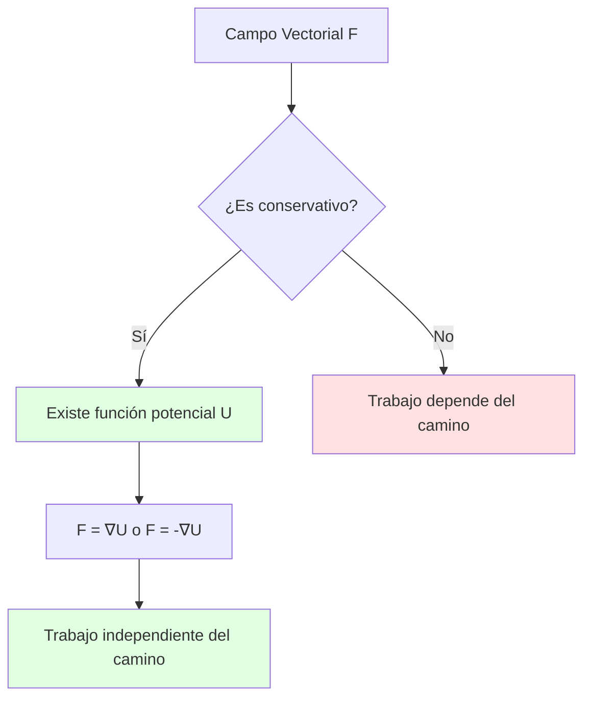
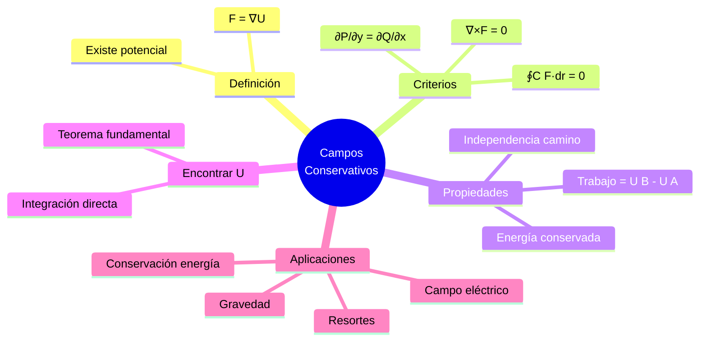
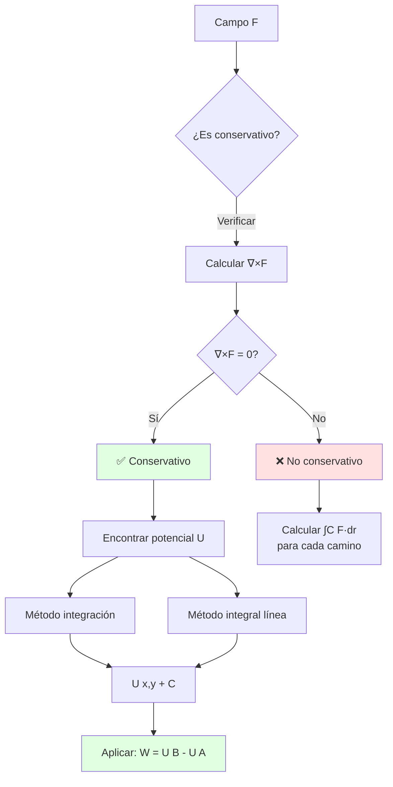
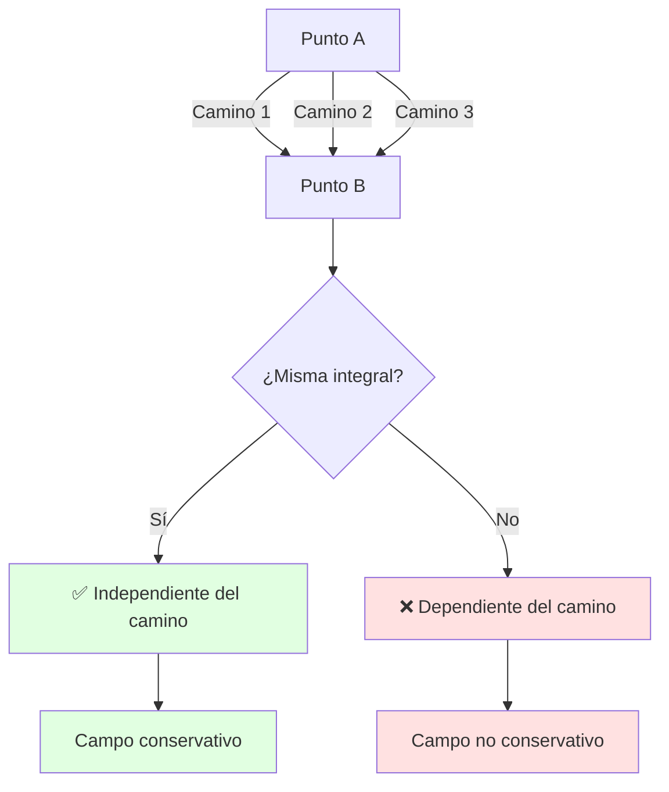
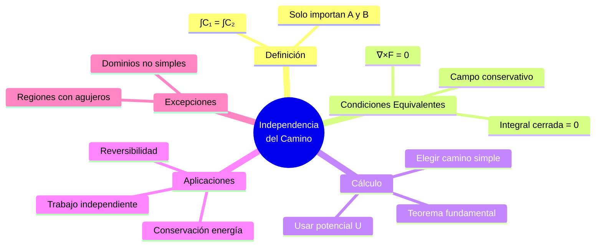
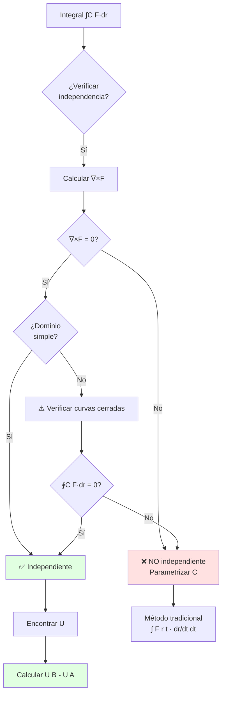
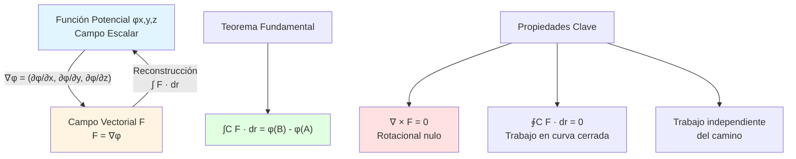

# 🌀 Campos Conservativos

## 🎯 Introducción

> [!info]- 💡 ¿Qué es un Campo Conservativo? Un **campo conservativo** es un campo vectorial especial donde el trabajo realizado al mover un objeto depende únicamente de los puntos inicial y final, no del camino seguido. Es una de las propiedades más importantes en física y matemáticas aplicadas.
> 
> **Analogía práctica:** Imagina caminar por una montaña:
> 
> - **Campo conservativo (gravitatorio):** Subir del valle (100m) a la cima (500m) requiere la misma energía sin importar si vas por el camino corto empinado o el largo serpenteante. Solo importa la diferencia de alturas: 400m.
> - **Campo no conservativo (fricción):** El camino más largo requiere más energía porque hay más fricción. El camino importa.
> 
> **¿Por qué son importantes?**
> 
> |Aspecto|Descripción|Ejemplo de Uso|
> |---|---|---|
> |**Conservación de energía**|La energía total se mantiene|Mecánica clásica|
> |**Independencia del camino**|Trabajo = f(inicio, fin)|Gravedad, campo eléctrico|
> |**Función potencial**|Existe U tal que F = -∇U|Energía potencial|
> |**Integrales simplificadas**|∫C F·dr = U(B) - U(A)|Cálculo eficiente|
> |**Predicción**|Conocer U predice todo el campo|Modelado físico|



---

## 🔍 Definición y Características

### 📐 Definición Formal

> [!example]- 📋 Concepto Matemático Preciso
> 
> **Definición:**
> 
> Un campo vectorial **F** en una región D es **conservativo** si existe una función escalar U (llamada **función potencial**) tal que:
> 
> ```
> F = ∇U    o equivalentemente    F = -∇U
> 
> donde ∇U = (∂U/∂x, ∂U/∂y, ∂U/∂z)
> ```
> 
> **Notación según contexto:**
> 
> |Contexto|Relación|Interpretación|
> |---|---|---|
> |**Matemáticas**|F = ∇U|F es gradiente de U|
> |**Física**|F = -∇U|F es negativo del gradiente|
> |**Potencial gravitatorio**|g = -∇φ|Fuerza apunta hacia menor potencial|
> |**Potencial eléctrico**|E = -∇V|Campo eléctrico|
> 
> **Visualización:**
> 
> ```mermaid
> graph LR
>     A[Función Potencial U x,y,z] --> B[Calcular ∇U]
>     B --> C[Campo Vectorial F]
>     C -.-> D[Curvas de nivel de U]
>     C -.-> E[F perpendicular a curvas]
>     
>     style A fill:#e1f5ff
>     style C fill:#e1ffe1
> ```
> 
> **Ejemplo en ℝ²:**
> 
> ```
> U(x,y) = x² + y²    (función potencial)
> 
> ∇U = (∂U/∂x, ∂U/∂y) = (2x, 2y)
> 
> F(x,y) = (2x, 2y)   (campo conservativo)
> 
> Interpretación: F apunta radialmente hacia afuera
> ```
> 
> **Propiedades clave:**
> 
> ```mermaid
> mindmap
>   root((Campo<br/>Conservativo))
>     Tiene potencial U
>       F = ∇U
>       U única salvo constante
>     Trabajo
>       Independiente del camino
>       ∫C F·dr = U B - U A
>     Integral cerrada
>       ∮C F·dr = 0
>     Rotacional
>       ∇×F = 0
> ```

### 🎨 Interpretación Geométrica

> [!success]- 🗺️ Visualización del Campo y el Potencial
> 
> **Relación entre U y F:**
> 
> ```mermaid
> graph TB
>     subgraph "Función Potencial U(x,y)"
>     A[Superficie z = U x,y]
>     B[Curvas de nivel U = constante]
>     end
>     
>     subgraph "Campo Vectorial F"
>     C[Vectores ∇U]
>     D[Perpendiculares a curvas de nivel]
>     E[Apuntan hacia mayor U]
>     end
>     
>     A --> C
>     B --> D
>     
>     style C fill:#e1ffe1
>     style D fill:#fff4e1
> ```
> 
> **Ejemplo visual - Montaña:**
> 
> ```
> U(x,y) = 100 - (x² + y²)   (colina)
> 
> Curvas de nivel (vista desde arriba):
> 
>         100  ← Cima
>       ⚬ 90
>      ⚬   ⚬ 80
>     ⚬     ⚬ 70
>    ⚬       ⚬ 60
>   
> F = ∇U = (-2x, -2y)
> Apunta hacia la cima (mayor U)
> ```
> 
> **Características geométricas:**
> 
> |Propiedad|Descripción|Visualización|
> |---|---|---|
> |**F ⊥ curvas de nivel**|Campo perpendicular a U=cte|Flechas cruzan círculos|
> |**\|F\| proporcional a pendiente**|Más empinado → \|F\| mayor|Vectores más largos|
> |**F apunta a mayor U**|Dirección de máximo crecimiento|Hacia arriba en montaña|
> |**Líneas de campo**|Caminos de máxima pendiente|Rutas más empinadas|
> 
> **Analogía con mapa topográfico:**
> 
> ```mermaid
> graph LR
>     A[Curvas de nivel] -->|Espaciadas| B[Pendiente suave<br/>Campo débil]
>     A -->|Juntas| C[Pendiente fuerte<br/>Campo intenso]
>     
>     style B fill:#e1ffe1
>     style C fill:#ffe1e1
> ```

### ⚡ Trabajo e Independencia del Camino

> [!note]- 🛣️ Propiedad Fundamental
> 
> **Teorema fundamental de campos conservativos:**
> 
> Si F es conservativo con potencial U, entonces:
> 
> ```
> ∫C F·dr = U(B) - U(A)
> 
> donde:
> • C: cualquier curva de A a B
> • A, B: puntos inicial y final
> ```
> 
> **Visualización del trabajo:**
> 
> ```mermaid
> flowchart LR
>     A["Punto A<br/>U(A)"] -->|Camino 1| B["Punto B<br/>U(B)"]
>     A -->|Camino 2| B
>     A -->|Camino 3| B
>     
>     B --> C["Trabajo = U(B) - U(A)<br/>¡Mismo para todos!"]
>     
>     style C fill:#e1ffe1
> ```
> 
> **Ejemplo calculado:**
> 
> ```
> F(x,y) = (2x, 2y)  con  U(x,y) = x² + y²
> 
> De A(0,0) a B(1,1):
> 
> Camino 1: Línea recta y = x
> Camino 2: Primero (0,0)→(1,0), luego (1,0)→(1,1)
> Camino 3: Parábola y = x²
> 
> Todos dan: U(1,1) - U(0,0) = (1²+1²) - 0 = 2
> ```
> 
> **Consecuencia: Integral en curva cerrada**
> 
> ```
> Si C es cerrada (A = B):
> 
> ∮C F·dr = U(A) - U(A) = 0
> 
> "En un campo conservativo, el trabajo 
>  en un ciclo cerrado es cero"
> ```
> 
> **Tabla comparativa:**
> 
> |Aspecto|Campo Conservativo|Campo No Conservativo|
> |---|---|---|
> |**Trabajo A→B**|U(B) - U(A)|Depende del camino|
> |**Ciclo cerrado**|Siempre 0|Generalmente ≠ 0|
> |**Cálculo**|Evaluar U en extremos|Integrar ∫C F·dr|
> |**Ejemplo físico**|Gravedad|Fricción, campo magnético|

---

## 🧪 Criterios de Conservatividad

### ✓ Test del Rotacional

> [!tip]- 🌀 Condición Necesaria y Suficiente
> 
> **Teorema (en regiones simplemente conexas):**
> 
> ```
> F es conservativo  ⟺  ∇×F = 0
> 
> (rotacional nulo)
> ```
> 
> **Definición del rotacional:**
> 
> **En ℝ²:** F = (P, Q)
> 
> ```
> ∇×F = ∂Q/∂x - ∂P/∂y
> 
> (componente z del rotacional en 3D)
> ```
> 
> **En ℝ³:** F = (P, Q, R)
> 
> ```
> ∇×F = |  i      j      k   |
>       | ∂/∂x  ∂/∂y  ∂/∂z |
>       |  P      Q      R   |
> 
>     = (∂R/∂y - ∂Q/∂z, ∂P/∂z - ∂R/∂x, ∂Q/∂x - ∂P/∂y)
> ```
> 
> **Algoritmo de verificación:**
> 
> ```mermaid
> flowchart TD
>     A[Campo F = P,Q o P,Q,R] --> B[Calcular derivadas parciales]
>     B --> C{En ℝ²?}
>     C -->|Sí| D[∂Q/∂x - ∂P/∂y = 0?]
>     C -->|No ℝ³| E[∇×F = 0,0,0?]
>     D -->|Sí| F[✅ Conservativo]
>     D -->|No| G[❌ No conservativo]
>     E -->|Sí| F
>     E -->|No| G
>     
>     style F fill:#e1ffe1
>     style G fill:#ffe1e1
> ```
> 
> **Ejemplo 1 (ℝ²) - Conservativo:**
> 
> ```
> F(x,y) = (2xy, x² + 1)
>         = (P,  Q)
> 
> Verificar: ∂Q/∂x - ∂P/∂y = ?
> 
> ∂Q/∂x = ∂(x² + 1)/∂x = 2x
> ∂P/∂y = ∂(2xy)/∂y = 2x
> 
> ∇×F = 2x - 2x = 0  ✅ Conservativo
> ```
> 
> **Ejemplo 2 (ℝ²) - NO Conservativo:**
> 
> ```
> F(x,y) = (-y, x)
>         = (P, Q)
> 
> ∂Q/∂x = ∂x/∂x = 1
> ∂P/∂y = ∂(-y)/∂y = -1
> 
> ∇×F = 1 - (-1) = 2 ≠ 0  ❌ No conservativo
> 
> (Este es un campo rotacional)
> ```
> 
> **Ejemplo 3 (ℝ³):**
> 
> ```
> F(x,y,z) = (yz, xz, xy)
>          = (P, Q, R)
> 
> ∇×F = (∂R/∂y - ∂Q/∂z, ∂P/∂z - ∂R/∂x, ∂Q/∂x - ∂P/∂y)
>     = (x - x, y - y, z - z)
>     = (0, 0, 0)  ✅ Conservativo
> ```
> 
> **⚠️ IMPORTANTE: Región simplemente conexa**
> 
> ```mermaid
> graph LR
>     A[Región D] --> B{¿Simplemente conexa?}
>     B -->|Sí<br/>Sin agujeros| C[∇×F = 0 ⟺ Conservativo]
>     B -->|No<br/>Con agujeros| D[∇×F = 0 ⇏ Conservativo]
>     
>     style C fill:#e1ffe1
>     style D fill:#ffe1e1
> ```
> 
> Ejemplo de región NO simplemente conexa: plano sin el origen (anillo)

### 🔎 Test de las Derivadas Parciales

> [!warning]- 📊 Condición Necesaria (más simple)
> 
> **Criterio (en ℝ²):**
> 
> Si F = (P, Q) es conservativo, entonces:
> 
> ```
> ∂P/∂y = ∂Q/∂x
> 
> (derivadas cruzadas iguales)
> ```
> 
> **Relación con rotacional:**
> 
> ```
> ∇×F = ∂Q/∂x - ∂P/∂y = 0
> 
> ⟺  ∂Q/∂x = ∂P/∂y
> ```
> 
> **Algoritmo simplificado:**
> 
> ```mermaid
> flowchart TD
>     A[F = P,Q] --> B[Calcular ∂P/∂y]
>     A --> C[Calcular ∂Q/∂x]
>     B --> D{∂P/∂y = ∂Q/∂x?}
>     C --> D
>     D -->|Sí| E[Puede ser conservativo<br/>verificar dominio]
>     D -->|No| F[❌ Definitivamente<br/>NO conservativo]
>     
>     style E fill:#fff4e1
>     style F fill:#ffe1e1
> ```
> 
> **Ejemplos:**
> 
> **Caso 1: Conservativo**
> 
> ```
> F(x,y) = (3x² + 4y, 4x + 2y)
>         = (P,      Q)
> 
> ∂P/∂y = 4
> ∂Q/∂x = 4
> 
> ∂P/∂y = ∂Q/∂x  ✅ Cumple condición necesaria
> ```
> 
> **Caso 2: NO Conservativo**
> 
> ```
> F(x,y) = (y², 3x)
>         = (P,  Q)
> 
> ∂P/∂y = 2y
> ∂Q/∂x = 3
> 
> 2y ≠ 3  ❌ No es conservativo
> ```
> 
> **Extensión a ℝ³:**
> 
> Para F = (P, Q, R), se deben cumplir **tres condiciones**:
> 
> |Condición|Interpretación|
> |---|---|
> |∂P/∂y = ∂Q/∂x|Consistencia en plano xy|
> |∂P/∂z = ∂R/∂x|Consistencia en plano xz|
> |∂Q/∂z = ∂R/∂y|Consistencia en plano yz|
> 
> Equivalente a ∇×F = (0, 0, 0)

### 🎯 Test de Integral en Curva Cerrada

> [!example]- 🔄 Verificación Práctica
> 
> **Criterio:**
> 
> ```
> F es conservativo  ⟺  ∮C F·dr = 0  
>                        para toda curva cerrada C
> ```
> 
> **Procedimiento:**
> 
> 1. Elegir una curva cerrada simple (círculo, cuadrado)
> 2. Calcular ∮C F·dr
> 3. Si = 0 → posiblemente conservativo
> 4. Si ≠ 0 → definitivamente NO conservativo
> 
> **Ejemplo - Verificación con círculo:**
> 
> ```
> F(x,y) = (-y, x)
> 
> Curva C: círculo x² + y² = 1, sentido antihorario
> Parametrización: r(t) = (cos t, sin t), t ∈ [0, 2π]
> 
> dr/dt = (-sin t, cos t)
> 
> F(r(t)) = (-sin t, cos t)
> 
> ∮C F·dr = ∫₀²π (-sin t, cos t)·(-sin t, cos t) dt
>         = ∫₀²π (sin²t + cos²t) dt
>         = ∫₀²π 1 dt
>         = 2π ≠ 0
> 
> ∴ F NO es conservativo
> ```
> 
> **Visualización:**
> 
> ```mermaid
> graph TB
>     A[Campo F] --> B[Elegir curva cerrada C]
>     B --> C[Calcular ∮C F·dr]
>     C --> D{Resultado?}
>     D -->|= 0| E[Posiblemente conservativo<br/>Verificar con rotacional]
>     D -->|≠ 0| F[❌ NO conservativo<br/>Definitivo]
>     
>     style E fill:#fff4e1
>     style F fill:#ffe1e1
> ```
> 
> **Curvas cerradas comunes para probar:**
> 
> |Curva|Parametrización|Uso|
> |---|---|---|
> |**Círculo**|(R cos t, R sin t)|Simetría radial|
> |**Cuadrado**|Cuatro segmentos|Cálculo simple|
> |**Triángulo**|Tres segmentos|Región triangular|

---

## 🔧 Encontrar la Función Potencial

### 📝 Método de Integración Directa

> [!success]- 🎯 Procedimiento Sistemático
> 
> **Objetivo:** Dado F conservativo, encontrar U tal que F = ∇U
> 
> **Método (en ℝ²):**
> 
> Si F = (P, Q), entonces:
> 
> ```
> ∂U/∂x = P
> ∂U/∂y = Q
> ```
> 
> **Algoritmo paso a paso:**
> 
> ```mermaid
> flowchart TD
>     A[F = P,Q] --> B[Integrar ∂U/∂x = P<br/>respecto a x]
>     B --> C[U = ∫P dx + g y]
>     C --> D[Derivar U respecto a y]
>     D --> E[∂U/∂y = ... + g' y]
>     E --> F[Igualar a Q]
>     F --> G[Encontrar g y]
>     G --> H[U x,y = ... + C]
>     
>     style H fill:#e1ffe1
> ```
> 
> **Ejemplo completo:**
> 
> ```
> F(x,y) = (2xy, x² + 3y²)
>         = (P,   Q)
> 
> Paso 1: Verificar conservatividad
> ∂P/∂y = 2x,  ∂Q/∂x = 2x  ✅ Iguales
> 
> Paso 2: Integrar ∂U/∂x = P
> ∂U/∂x = 2xy
> U = ∫2xy dx = x²y + g(y)
>                     ↑
>              función solo de y
> 
> Paso 3: Derivar respecto a y
> ∂U/∂y = x² + g'(y)
> 
> Paso 4: Igualar a Q
> x² + g'(y) = x² + 3y²
> g'(y) = 3y²
> 
> Paso 5: Integrar g'(y)
> g(y) = ∫3y² dy = y³ + C
> 
> Solución: U(x,y) = x²y + y³ + C
> 
> Verificación:
> ∇U = (2xy, x² + 3y²) = F ✓
> ```
> 
> **Variación del método - Integrar Q primero:**
> 
> ```
> También podemos:
> 1. Integrar ∂U/∂y = Q respecto a y
> 2. U = ∫Q dy + h(x)
> 3. Derivar respecto a x e igualar a P
> 4. Encontrar h(x)
> 
> Resultado: misma U (salvo constante)
> ```
> 
> **Tabla de estrategias:**
> 
> |Situación|Estrategia|
> |---|---|
> |**P más simple**|Integrar P primero|
> |**Q más simple**|Integrar Q primero|
> |**P = f(x) solamente**|Definitivamente integrar P|
> |**Q = f(y) solamente**|Definitivamente integrar Q|

### 🔄 Método en ℝ³

> [!note]- 📐 Extensión a Tres Dimensiones
> 
> **Para F = (P, Q, R):**
> 
> ```
> ∂U/∂x = P
> ∂U/∂y = Q
> ∂U/∂z = R
> ```
> 
> **Procedimiento:**
> 
> ```mermaid
> flowchart TD
>     A[F = P,Q,R] --> B[Integrar ∂U/∂x = P]
>     B --> C[U = ∫P dx + g y,z]
>     C --> D[Derivar ∂U/∂y]
>     D --> E[Igualar a Q<br/>encontrar parte de g]
>     E --> F[Derivar ∂U/∂z]
>     F --> G[Igualar a R<br/>completar g]
>     G --> H[U x,y,z = ... + C]
>     
>     style H fill:#e1ffe1
> ```
> 
> **Ejemplo:**
> 
> ```
> F(x,y,z) = (yz, xz + 2y, xy + 3z²)
>          = (P,  Q,        R)
> 
> Paso 1: Integrar P respecto a x
> U = ∫yz dx = xyz + g(y,z)
> 
> Paso 2: Derivar respecto a y
> ∂U/∂y = xz + ∂g/∂y
> 
> Igualar a Q:
> xz + ∂g/∂y = xz + 2y
> ∂g/∂y = 2y
> g(y,z) = y² + h(z)
> 
> U = xyz + y² + h(z)
> 
> Paso 3: Derivar respecto a z
> ∂U/∂z = xy + h'(z)
> 
> Igualar a R:
> xy + h'(z) = xy + 3z²
> h'(z) = 3z²
> h(z) = z³ + C
> 
> Solución: U(x,y,z) = xyz + y² + z³ + C
> 
> Verificación:
> ∇U = (yz, xz+2y, xy+3z²) = F ✓
> ```

### ⚡ Método del Teorema Fundamental

> [!tip]- 🚀 Cálculo Directo con Integral de Línea
> 
> **Fórmula:**
> 
> ```
> U(x,y) = U(x₀,y₀) + ∫C F·dr
> 
> donde C es cualquier curva de (x₀,y₀) a (x,y)
> ```
> 
> **Estrategia práctica:**
> 
> Elegir camino conveniente (generalmente rectangular):
> 
> ```mermaid
> graph LR
>     A["(x₀,y₀)"] -->|Horizontal| B["(x,y₀)"]
>     B -->|Vertical| C["(x,y)"]
>     
>     style A fill:#e1ffe1
>     style C fill:#ffe1f5
> ```
> 
> **Ejemplo:**
> 
> ```
> F(x,y) = (2x, 2y),  de (0,0) a (x,y)
> 
> Camino:
> C₁: (0,0) → (x,0)  parametrizado: r₁(t) = (t,0), t∈[0,x]
> C₂: (x,0) → (x,y)  parametrizado: r₂(s) = (x,s), s∈[0,y]
> 
> En C₁: F(t,0) = (2t,0), dr₁ = (1,0)dt
> ∫C₁ F·dr = ∫₀ˣ 2t dt = x²
> 
> En C₂: F(x,s) = (2x,2s), dr₂ = (0,1)ds
> ∫C₂ F·dr = ∫₀ʸ 2s ds = y²
> 
> U(x,y) = U(0,0) + x² + y²
> 
> Eligiendo U(0,0) = 0:
> U(x,y) = x² + y² + C
> ```
> 
> **Ventajas y desventajas:**
> 
> |Método|Ventajas|Desventajas|
> |---|---|---|
> |**Integración directa**|Sistemático, algebraico|Más pasos|
> |**Teorema fundamental**|Conceptualmente claro|Requiere parametrizar|
> 
> **Ambos dan el mismo resultado** (salvo constante de integración)

---

## 🔬 Teoremas Relacionados

### 📜 Teorema de Green

> [!note]- 🔄 Conexión entre Integral de Línea y Doble
> 
> **Enunciado:**
> 
> Sea D una región simplemente conexa con frontera C (orientada positivamente):
> 
> ```
> ∮C P dx + Q dy = ∬D (∂Q/∂x - ∂P/∂y) dA
> 
>    ↑                        ↑
> Integral de línea     Integral doble
> ```
> 
> **Interpretación para campos conservativos:**
> 
> ```
> Si F = (P,Q) es conservativo:
> ∂Q/∂x - ∂P/∂y = 0  (rotacional nulo)
> 
> ∴ ∮C F·dr = ∬D 0 dA = 0  ✓
> 
> (confirma integral cerrada = 0)
> ```
> 
> **Visualización:**
> 
> ```mermaid
> graph TB
>     subgraph "Región D"
>     A[Interior D]
>     B[Frontera C]
>     end
>     
>     C[∮C ...] -.-> D[Green]
>     D -.-> E[∬D ...]
>     
>     style D fill:#e1ffe1
> ```
> 
> **Ejemplo:**
> 
> ```
> F = (-y, x), C: círculo x²+y²=1
> 
> Método 1: Integral de línea
> ∮C F·dr = 2π  (calculado antes)
> 
> Método 2: Green
> ∂Q/∂x - ∂P/∂y = 1-(-1) = 2
> 
> ∬D 2 dA = 2×(área de círculo) = 2π ✓
> ```

### 🌀 Teorema de Stokes

> [!tip]- 🎭 Generalización en ℝ³
> 
> **Enunciado:**
> 
> ```
> ∮C F·dr = ∬S (∇×F)·n dS
> 
> Integral      Flujo del rotacional
> de línea      a través de superficie
> ```
> 
> **Para campos conservativos:**
> 
> ```
> Si F conservativo:
> ∇×F = 0
> 
> ∴ ∮C F·dr = ∬S 0·n dS = 0  ✓
> ```
> 
> **Diagrama:**
> 
> ```mermaid
> graph TB
>     A[Superficie S] --> B[Frontera C]
>     C[Campo F] --> D[∇×F]
>     D --> E[Flujo a través de S]
>     B --> F[Circulación en C]
>     E -.->|Stokes| F
>     
>     style F fill:#e1ffe1
> ```
> 
> **Importancia:**
> 
> Conecta propiedades locales (∇×F en puntos) con globales (circulación en curva)

### 📊 Teorema de la Divergencia

> [!example]- 📤 Flujo y Conservación
> 
> **Enunciado:**
> 
> ```
> ∬S F·n dS = ∭V (∇·F) dV
> 
> Flujo saliente    Integral de divergencia
> de superficie     en volumen
> ```
> 
> **Aplicación:**
> 
> Aunque no relacionado directamente con conservatividad, es fundamental para:
> 
> - Leyes de conservación (masa, carga)
> - Ecuaciones de Maxwell
> - Mecánica de fluidos
> 
> **Ley de Gauss (eléctrica):**
> 
> ```
> ∬S E·n dS = Q_encerrada / ε₀
> 
> Flujo eléctrico = carga dentro / permitividad
> ```

---

## 📊 Resumen Visual Completo

### Mapa Conceptual General



> [!success]- Tabla Resumen de Criterios
> 
> 
> |Criterio|Fórmula|Cuándo usar|Limitación|
> |---|---|---|---|
> |**Rotacional**|∇×F = 0|Siempre (regiones simples)|✅ Necesario y suficiente|
> |**Derivadas parciales**|∂P/∂y = ∂Q/∂x|Verificación rápida ℝ²|⚠️ Solo necesario|
> |**Integral cerrada**|∮C F·dr = 0|Verificación experimental|⚠️ Hay que probar todas|
> |**Existe U**|F = ∇U|Definición|⚠️ Hay que encontrar U|
> 

### Diagrama de Flujo: Verificar y Usar



---

## 🎓 Ejercicios Guiados

> [!example]- 💪 Práctica Progresiva
> 
> **Nivel Básico:**
> 
> **1. Verificar conservatividad**
> 
> ```
> F(x,y) = (3x² + y, x + 4y³)
>         = (P,      Q)
> 
> Solución:
> ∂P/∂y = 1
> ∂Q/∂x = 1
> 
> ∂P/∂y = ∂Q/∂x  ✅ Es conservativo
> ```
> 
> **2. Encontrar potencial**
> 
> ```
> F(x,y) = (2x, 3y²)
> 
> Paso 1: Integrar P
> U = ∫2x dx = x² + g(y)
> 
> Paso 2: Derivar y comparar con Q
> ∂U/∂y = g'(y) = 3y²
> g(y) = y³ + C
> 
> Solución: U(x,y) = x² + y³ + C
> 
> Verificación:
> ∇U = (2x, 3y²) = F ✓
> ```
> 
> **Nivel Intermedio:**
> 
> **3. Calcular trabajo**
> 
> ```
> F(x,y) = (2xy, x²), de A(0,0) a B(2,3)
> 
> Paso 1: Verificar conservatividad
> ∂P/∂y = 2x,  ∂Q/∂x = 2x  ✅
> 
> Paso 2: Encontrar U
> U = ∫2xy dx = x²y + g(y)
> ∂U/∂y = x² + g'(y) = x²
> g'(y) = 0 → g(y) = C
> 
> U(x,y) = x²y
> 
> Paso 3: Calcular trabajo
> W = U(2,3) - U(0,0)
>   = (2²)(3) - 0
>   = 12
> 
> ¡Independiente del camino!
> ```
> 
> **4. Campo NO conservativo**
> 
> ```
> F(x,y) = (y², 2x)
> 
> ∂P/∂y = 2y
> ∂Q/∂x = 2
> 
> 2y ≠ 2  ❌ No conservativo
> 
> Verificar con integral cerrada:
> C: círculo unitario
> ∮C F·dr = [cálculo] ≠ 0 ✓ Confirma
> ```
> 
> **Nivel Avanzado:**
> 
> **5. Campo en ℝ³**
> 
> ```
> F(x,y,z) = (y+z, x+z, x+y)
>          = (P,   Q,   R)
> 
> Verificar:
> ∂R/∂y - ∂Q/∂z = 1 - 1 = 0  ✓
> ∂P/∂z - ∂R/∂x = 1 - 1 = 0  ✓
> ∂Q/∂x - ∂P/∂y = 1 - 1 = 0  ✓
> 
> ∇×F = (0,0,0)  ✅ Conservativo
> 
> Encontrar U:
> U = ∫(y+z) dx = xy + xz + g(y,z)
> ∂U/∂y = x + ∂g/∂y = x + z
> ∂g/∂y = z → g = yz + h(z)
> 
> U = xy + xz + yz + h(z)
> ∂U/∂z = x + y + h'(z) = x + y
> h'(z) = 0 → h = C
> 
> Solución: U(x,y,z) = xy + xz + yz + C
> ```
> 
> **6. Aplicación física**
> 
> ```
> Campo gravitatorio en 2D:
> F(x,y) = -GM(x,y)/r³  donde r = √(x²+y²)
> 
> Mostrar que es conservativo y encontrar U.
> 
> Solución:
> P = -GMx/(x²+y²)^(3/2)
> Q = -GMy/(x²+y²)^(3/2)
> 
> [Verificar ∂P/∂y = ∂Q/∂x...]
> 
> U(x,y) = -GM/√(x²+y²) + C
>        = -GM/r + C
> ```

---

## 🔗 Conexión con Próximos Temas

> [!quote]- 🌟 Continuando el Aprendizaje
> 
> **Has dominado:**
> 
> ```mermaid
> mindmap
>   root((Campos<br/>Conservativos))
>     Verificación
>       Rotacional
>       Derivadas parciales
>     Potencial
>       Encontrar U
>       Aplicar U
>     Trabajo
>       Independencia
>       Conservación energía
>     Aplicaciones
>       Física
>       Ingeniería
> ```
> 
> **Progresión natural del aprendizaje:**
> 
> |Nivel|Tema|Por qué es el siguiente paso|
> |---|---|---|
> |**Actual**|Campos Conservativos|Campos especiales|
> |**Siguiente**|Teorema de Green|Conectar línea con área|
> |**Avanzado**|Teorema de Stokes|Generalización 3D|
> |**Integrador**|Teorema de la Divergencia|Flujo y conservación|
> |**Aplicado**|Ecuaciones de Maxwell|Electromagnetismo|
> |**Profesional**|Formas Diferenciales|Framework unificado|
> 
> **Roadmap de evolución:**
> 
> ```mermaid
> graph LR
>     A[Campos Conservativos] --> B[Teorema de Green]
>     B --> C[Teorema de Stokes]
>     C --> D[Teorema de Divergencia]
>     D --> E[Cálculo Vectorial Completo]
>     
>     A -.-> F[Aplicaciones Física]
>     F -.-> G[Mecánica]
>     F -.-> H[Electromagnetismo]
>     F -.-> I[Fluidos]
>     
>     style A fill:#e1ffe1
>     style B fill:#fff4e1
>     style C fill:#e1f5ff
>     style E fill:#ffe1f5
> ```
> 
> **Conceptos clave que siguen:**
> 
> 1. **Teorema de Green:** Relaciona ∮C con ∬D
> 2. **Teorema de Stokes:** Relaciona ∮C con ∬S (∇×F)
> 3. **Teorema de Divergencia:** Relaciona ∬S con ∭V (∇·F)
> 4. **Ecuaciones de Maxwell:** Unifica electricidad y magnetismo
> 5. **Formas Diferenciales:** Generalización abstracta

---

**Tags:** #calculo-vectorial #campos-conservativos #potencial #trabajo #energia #rotacional #teorema-fundamental #fisica #aplicaciones #mermaid #diagramas

# 🛣️ Independencia del Camino

## 🎯 Introducción

> [!info]- 💡 ¿Qué es la Independencia del Camino? La **independencia del camino** es una propiedad fundamental de ciertas integrales de línea donde el valor de la integral depende únicamente de los puntos inicial y final, no de la trayectoria específica seguida entre ellos.
> 
> **Analogía práctica:** Imagina viajar entre dos ciudades:
> 
> - **Con peaje (dependiente del camino):** Si pagas por kilómetro recorrido, la autopista directa cuesta menos que el camino escénico largo. **El camino importa**.
> - **Con tarifa fija (independiente del camino):** Si pagas una tarifa fija por llegar al destino, no importa qué ruta tomes. **Solo importan origen y destino**.
> - **Altitud (independiente del camino):** Subir de 100m a 500m requiere la misma energía potencial sin importar la ruta. **Solo importa la diferencia de altura**.
> 
> **¿Por qué es importante?**
> 
> |Aspecto|Descripción|Ejemplo de Uso|
> |---|---|---|
> |**Simplificación de cálculo**|No necesitas parametrizar curvas complejas|Elegir el camino más simple|
> |**Conservación de energía**|Trabajo independiente del camino|Física conservativa|
> |**Existencia de potencial**|Garantiza función potencial|Encontrar U explícitamente|
> |**Reversibilidad**|Ir y volver suma cero|Ciclos cerrados|
> |**Aplicaciones físicas**|Campos conservativos en naturaleza|Gravedad, campo eléctrico|



---

## 📐 Definición Formal

### 🎯 Concepto Matemático

> [!example]- 📋 Definición Precisa
> 
> **Definición:**
> 
> Sea F un campo vectorial continuo en una región D. La integral de línea ∫C F·dr es **independiente del camino** en D si:
> 
> ```
> Para cualesquiera dos curvas C₁ y C₂ en D 
> con los mismos puntos inicial A y final B:
> 
> ∫C₁ F·dr = ∫C₂ F·dr
> ```
> 
> **Notación:**
> 
> Cuando hay independencia, podemos escribir:
> 
> ```
> ∫C F·dr = ∫A→B F·dr
> 
> (sin especificar el camino C)
> ```
> 
> **Visualización:**
> 
> ```mermaid
> graph TB
>     subgraph "Región D"
>     A["Punto A<br/>(x₀,y₀)"]
>     B["Punto B<br/>(x₁,y₁)"]
>     end
>     
>     A -->|C₁: recta| B
>     A -->|C₂: curva| B
>     A -->|C₃: zigzag| B
>     
>     C["∫C₁ = ∫C₂ = ∫C₃"]
>     
>     style C fill:#e1ffe1
> ```
> 
> **Ejemplo intuitivo:**
> 
> ```
> Campo F(x,y) = (2x, 2y)
> De A(0,0) a B(1,1)
> 
> Camino 1: y = x (diagonal)
> Camino 2: (0,0)→(1,0)→(1,1) (rectangular)
> Camino 3: y = x² (parábola)
> 
> Todos dan: ∫ F·dr = 2
> 
> ✅ Independiente del camino
> ```
> 
> **Tabla de características:**
> 
> |Con independencia|Sin independencia|
> |---|---|
> |∫C₁ F·dr = ∫C₂ F·dr|∫C₁ F·dr ≠ ∫C₂ F·dr|
> |Solo importan A y B|Importa trayectoria completa|
> |Campo conservativo|Campo no conservativo|
> |∇×F = 0|∇×F ≠ 0|

### 🔄 Relación con Curvas Cerradas

> [!note]- ⭕ Consecuencia Importante
> 
> **Teorema:**
> 
> ```
> ∫C F·dr es independiente del camino
> 
> ⟺
> 
> ∮C F·dr = 0  para toda curva cerrada C
> ```
> 
> **Demostración (⟹):**
> 
> ```mermaid
> graph LR
>     A[Punto A] -->|C₁| B[Punto B]
>     B -->|C₂ invertida| A
>     
>     C["Curva cerrada = C₁ + (-C₂)"]
>     
>     style C fill:#fff4e1
> ```
> 
> ```
> Si hay independencia:
> ∫C₁ F·dr = ∫C₂ F·dr
> 
> Curva cerrada C = C₁ ∪ (-C₂):
> ∮C F·dr = ∫C₁ F·dr + ∫₍₋C₂₎ F·dr
>         = ∫C₁ F·dr - ∫C₂ F·dr
>         = 0  ✓
> ```
> 
> **Demostración (⟸):**
> 
> ```
> Si ∮C F·dr = 0 para toda curva cerrada:
> 
> Sean C₁ y C₂ de A a B:
> C = C₁ ∪ (-C₂) es cerrada
> 
> 0 = ∮C F·dr = ∫C₁ F·dr - ∫C₂ F·dr
> 
> ∴ ∫C₁ F·dr = ∫C₂ F·dr  ✓
> ```
> 
> **Interpretación física:**
> 
> ```
> Curva cerrada = ciclo completo
> 
> Si ∮C F·dr = 0:
> • Trabajo en ciclo = 0
> • No se puede extraer energía indefinidamente
> • Sistema conservativo
> ```
> 
> **Ejemplo verificación:**
> 
> ```
> F(x,y) = (-y, x)  (campo rotacional)
> C: círculo x² + y² = 1
> 
> ∮C F·dr = 2π ≠ 0
> 
> ∴ NO hay independencia del camino
> ```

---

## 🔍 Condiciones Equivalentes

### 📊 Teorema de Equivalencia

> [!success]- 🎭 Cuatro Caracterizaciones Equivalentes
> 
> **Teorema fundamental:**
> 
> Para un campo vectorial F continuo en una región D **simplemente conexa**, las siguientes condiciones son **equivalentes**:
> 
> ```mermaid
> graph TB
>     A["(1) Independencia<br/>del camino"]
>     B["(2) ∮C F·dr = 0<br/>para toda C cerrada"]
>     C["(3) F conservativo<br/>F = ∇U"]
>     D["(4) ∇×F = 0"]
>     
>     A <--> B
>     B <--> C
>     C <--> D
>     D <--> A
>     
>     style A fill:#e1ffe1
>     style B fill:#fff4e1
>     style C fill:#e1f5ff
>     style D fill:#ffe1f5
> ```
> 
> **Tabla de equivalencias:**
> 
> |Condición|Enunciado|Cómo verificar|
> |---|---|---|
> |**(1)**|Independencia del camino|Calcular por dos caminos|
> |**(2)**|Integral cerrada = 0|Integrar en círculo|
> |**(3)**|Existe potencial U|Encontrar U tal que F=∇U|
> |**(4)**|Rotacional nulo|Calcular ∇×F|
> 
> **Diagrama de implicaciones:**
> 
> ```mermaid
> flowchart LR
>     A[1 Independencia] -->|implica| B[2 Ciclo = 0]
>     B -->|implica| C["3 ∃U: F=∇U"]
>     C -->|implica| D[4 ∇×F=0]
>     D -->|implica| A
>     
>     style A fill:#e1ffe1
>     style B fill:#fff4e1
>     style C fill:#e1f5ff
>     style D fill:#ffe1f5
> ```
> 
> **⚠️ IMPORTANTE: Región simplemente conexa**
> 
> ```
> Simplemente conexa = sin agujeros
> 
> Ejemplos SÍ simplemente conexos:
> • Todo el plano ℝ²
> • Un disco
> • Un rectángulo
> • Interior de una esfera
> 
> Ejemplos NO simplemente conexos:
> • Plano menos un punto
> • Anillo (disco con agujero)
> • Toro
> ```
> 
> **Contraejemplo clásico (región con agujero):**
> 
> ```
> F(x,y) = (-y/(x²+y²), x/(x²+y²))
> 
> Definido en ℝ² \ {(0,0)}  ← Agujero en origen
> 
> ∇×F = 0 en su dominio ✓
> 
> PERO: ∮C F·dr = 2π ≠ 0
>       (C: círculo alrededor del origen)
> 
> ∴ NO hay independencia
> 
> Razón: región NO simplemente conexa
> ```

### 🧮 Verificación Práctica

> [!tip]- ✅ Estrategia de Verificación
> 
> **Método recomendado según contexto:**
> 
> ```mermaid
> flowchart TD
>     A[Quiero verificar<br/>independencia] --> B{¿Qué tengo?}
>     
>     B -->|"Campo F=(P,Q)"| C[Calcular ∂Q/∂x - ∂P/∂y]
>     B -->|"Curva específica"| D[Calcular ∮C F·dr]
>     B -->|"Contexto físico"| E[Buscar potencial U]
>     
>     C --> F{= 0?}
>     D --> G{= 0?}
>     E --> H{¿Existe U?}
>     
>     F -->|Sí| I[✅ Independiente]
>     F -->|No| J[❌ Dependiente]
>     G -->|Sí| I
>     G -->|No| J
>     H -->|Sí| I
>     H -->|No| J
>     
>     style I fill:#e1ffe1
>     style J fill:#ffe1e1
> ```
> 
> **Algoritmo paso a paso:**
> 
> **Paso 1: Verificar dominio**
> 
> ```
> ¿El dominio D es simplemente conexo?
> • Sí → Continuar
> • No → Cuidado, puede haber excepciones
> ```
> 
> **Paso 2: Calcular rotacional (más fácil)**
> 
> ```
> En ℝ²: ∇×F = ∂Q/∂x - ∂P/∂y
> En ℝ³: ∇×F = (∂R/∂y-∂Q/∂z, ∂P/∂z-∂R/∂x, ∂Q/∂x-∂P/∂y)
> 
> Si = 0 → Independiente ✅
> Si ≠ 0 → Dependiente ❌
> ```
> 
> **Ejemplos de verificación:**
> 
> **Ejemplo 1: Verificación exitosa**
> 
> ```
> F(x,y) = (3x²y, x³ + 2y)
>         = (P,   Q)
> 
> ∂P/∂y = 3x²
> ∂Q/∂x = 3x²
> 
> ∇×F = 3x² - 3x² = 0  ✅
> 
> ∴ Hay independencia del camino
> ```
> 
> **Ejemplo 2: Verificación negativa**
> 
> ```
> F(x,y) = (x², xy)
>         = (P,  Q)
> 
> ∂P/∂y = 0
> ∂Q/∂x = y
> 
> ∇×F = y - 0 = y ≠ 0  ❌
> 
> ∴ NO hay independencia (excepto en y=0)
> ```
> 
> **Ejemplo 3: Verificación en ℝ³**
> 
> ```
> F(x,y,z) = (2xy, x² + z, y)
>          = (P,   Q,      R)
> 
> ∂R/∂y - ∂Q/∂z = 1 - 1 = 0  ✓
> ∂P/∂z - ∂R/∂x = 0 - 0 = 0  ✓
> ∂Q/∂x - ∂P/∂y = 2x - 2x = 0  ✓
> 
> ∇×F = (0,0,0)  ✅
> 
> ∴ Hay independencia del camino
> ```

---

## 🎯 Cálculo de Integrales

### 🚀 Método del Teorema Fundamental

> [!example]- 📐 Uso de la Función Potencial
> 
> **Teorema fundamental para integrales de línea:**
> 
> ```
> Si F = ∇U (campo conservativo), entonces:
> 
> ∫C F·dr = U(B) - U(A)
> 
> donde C va de A a B
> ```
> 
> **Procedimiento:**
> 
> ```mermaid
> flowchart TD
>     A[Verificar F conservativo] --> B[Encontrar potencial U]
>     B --> C[Evaluar U en punto final B]
>     C --> D[Evaluar U en punto inicial A]
>     D --> E[Restar: U B - U A]
>     
>     style E fill:#e1ffe1
> ```
> 
> **Ejemplo completo:**
> 
> ```
> Calcular ∫C F·dr donde F(x,y) = (2x, 2y)
> de A(0,0) a B(3,4)
> 
> Paso 1: Verificar conservatividad
> ∂(2x)/∂y = 0,  ∂(2y)/∂x = 0
> ∇×F = 0 - 0 = 0  ✅ Conservativo
> 
> Paso 2: Encontrar U
> ∂U/∂x = 2x  →  U = x² + g(y)
> ∂U/∂y = g'(y) = 2y  →  g(y) = y²
> 
> U(x,y) = x² + y²
> 
> Paso 3: Aplicar teorema
> ∫C F·dr = U(3,4) - U(0,0)
>         = (3² + 4²) - (0² + 0²)
>         = 9 + 16 - 0
>         = 25
> 
> ¡Solo dos evaluaciones, sin parametrizar!
> ```
> 
> **Ventajas del método:**
> 
> |Ventaja|Descripción|
> |---|---|
> |**Rapidez**|Solo evaluar U en 2 puntos|
> |**Simplicidad**|No parametrizar curvas|
> |**Generalidad**|Sirve para cualquier camino|
> |**Conceptual**|Usa estructura del problema|
> 
> **Comparación con método tradicional:**
> 
> ```
> Método tradicional (sin independencia):
> 1. Parametrizar C: r(t), t ∈ [a,b]
> 2. Calcular dr/dt
> 3. Evaluar F(r(t))
> 4. Calcular F(r(t))·(dr/dt)
> 5. Integrar ∫ₐᵇ F(r(t))·(dr/dt) dt
> 
> Método con independencia:
> 6. Encontrar U
> 7. Calcular U(B) - U(A)
> 
> ¡Mucho más eficiente!
> ```

### 🛤️ Elección del Camino Más Conveniente

> [!tip]- 🎨 Estrategia de Simplificación
> 
> **Idea clave:**
> 
> Cuando hay independencia, podemos elegir **el camino más fácil de parametrizar**.
> 
> **Caminos convenientes:**
> 
> ```mermaid
> graph TB
>     A["De (x₀,y₀) a (x₁,y₁)"]
>     
>     A --> B[Camino 1: Segmentos<br/>horizontales y verticales]
>     A --> C[Camino 2: Línea recta]
>     A --> D[Camino 3: Seguir ejes]
>     
>     B --> E[Más fácil]
>     C --> F[Más corto]
>     D --> G[Más simple]
>     
>     style E fill:#e1ffe1
>     style F fill:#fff4e1
>     style G fill:#e1f5ff
> ```
> 
> **Ejemplo: Caminos rectangulares**
> 
> ```
> F(x,y) = (2xy, x²)
> De (0,0) a (2,3)
> 
> Camino rectangular (más fácil):
> C₁: (0,0) → (2,0)  (horizontal, y=0)
> C₂: (2,0) → (2,3)  (vertical, x=2)
> 
> En C₁: r₁(t) = (t,0), t ∈ [0,2]
>        F(t,0) = (0, t²)
>        dr₁ = (1,0)dt
>        ∫C₁ = ∫₀² 0·1 dt = 0
> 
> En C₂: r₂(s) = (2,s), s ∈ [0,3]
>        F(2,s) = (4s, 4)
>        dr₂ = (0,1)ds
>        ∫C₂ = ∫₀³ 4·1 ds = 12
> 
> Total: ∫C F·dr = 0 + 12 = 12
> ```
> 
> **Tabla de caminos recomendados:**
> 
> |Situación|Camino recomendado|Ventaja|
> |---|---|---|
> |**Campo simple**|Segmentos paralelos a ejes|Componentes se anulan|
> |**Simetría radial**|Línea desde origen|Aprovecha simetría|
> |**Un componente nulo**|Seguir ese eje|Integral = 0 en parte|
> |**Potencial conocido**|¡Cualquiera!|Usar U(B)-U(A)|
> 
> **Estrategia para componentes:**
> 
> ```
> Si F = (P, 0):
> → Elegir camino con dy = 0 (horizontal)
> → Entonces F·dr = P dx (más simple)
> 
> Si F = (0, Q):
> → Elegir camino con dx = 0 (vertical)
> → Entonces F·dr = Q dy (más simple)
> ```

### 📊 Ejemplos Detallados

> [!success]- 💡 Casos Prácticos Resueltos
> 
> **Ejemplo 1: Campo polinomial**
> 
> ```
> F(x,y) = (3x² + 4y, 4x + 6y²)
> De A(-1,0) a B(2,1)
> 
> Solución:
> 
> Verificar conservatividad:
> ∂P/∂y = 4,  ∂Q/∂x = 4  ✅
> 
> Encontrar U:
> U = ∫(3x² + 4y) dx = x³ + 4xy + g(y)
> ∂U/∂y = 4x + g'(y) = 4x + 6y²
> g'(y) = 6y²  →  g(y) = 2y³
> 
> U(x,y) = x³ + 4xy + 2y³
> 
> Calcular:
> ∫C F·dr = U(2,1) - U(-1,0)
>         = (8 + 8 + 2) - (-1 + 0 + 0)
>         = 18 - (-1)
>         = 19
> ```
> 
> **Ejemplo 2: Campo con radicales**
> 
> ```
> F(x,y) = (y/√(xy), x/√(xy))
> De A(1,1) a B(4,4)
> 
> Solución:
> 
> Simplificar:
> F = (y/(xy)^(1/2), x/(xy)^(1/2))
>   = (√(y/x), √(x/y))
> 
> Verificar (más fácil usar potencial):
> Intentar U = k√(xy)
> ∇U = (k·½·√(y/x), k·½·√(x/y))
> 
> Comparar con F: k = 2
> U(x,y) = 2√(xy)
> 
> Calcular:
> ∫C F·dr = U(4,4) - U(1,1)
>         = 2√16 - 2√1
>         = 8 - 2
>         = 6
> ```
> 
> **Ejemplo 3: Campo en ℝ³**
> 
> ```
> F(x,y,z) = (yz, xz, xy)
> De A(0,0,0) a B(1,1,1)
> 
> Solución:
> 
> Verificar ∇×F = 0 (ya verificado antes)
> 
> Encontrar U:
> U = ∫yz dx = xyz + g(y,z)
> ∂U/∂y = xz + ∂g/∂y = xz
> ∂g/∂y = 0  →  g = h(z)
> 
> U = xyz + h(z)
> ∂U/∂z = xy + h'(z) = xy
> h'(z) = 0  →  h = C
> 
> U(x,y,z) = xyz
> 
> Calcular:
> ∫C F·dr = U(1,1,1) - U(0,0,0)
>         = 1 - 0
>         = 1
> ```
> 
> **Ejemplo 4: Eligiendo camino conveniente**
> 
> ```
> F(x,y) = (eˣ + y, x + sin y)
> De (0,0) a (1,π/2)
> 
> Sin potencial (método directo):
> Camino rectangular: (0,0)→(1,0)→(1,π/2)
> 
> C₁: y=0, dy=0, x: 0→1
> ∫C₁ = ∫₀¹ (eˣ + 0) dx = e - 1
> 
> C₂: x=1, dx=0, y: 0→π/2
> ∫C₂ = ∫₀^(π/2) (1 + sin y) dy 
>     = [y - cos y]₀^(π/2)
>     = (π/2 - 0) - (0 - 1)
>     = π/2 + 1
> 
> Total: (e-1) + (π/2+1) = e + π/2
> ```

---

## 🔬 Aplicaciones y Consecuencias

### ⚡ Trabajo y Energía

> [!note]- 💪 Interpretación Física
> 
> **Trabajo realizado por fuerza conservativa:**
> 
> ```
> W = ∫C F·dr = U(A) - U(B) = -ΔU
> 
> Trabajo = Disminución de energía potencial
> ```
> 
> **Principio de conservación:**
> 
> ```mermaid
> graph LR
>     A[Energía Total] --> B[Cinética K]
>     A --> C[Potencial U]
>     
>     D[K + U = E₀]
>     
>     B -.->|ΔK = -ΔU| C
>     
>     style D fill:#e1ffe1
> ```
> 
> **Ejemplo: Objeto cayendo**
> 
> ```
> Campo gravitatorio: F = (0, -mg)
> Potencial: U(y) = mgy
> 
> Cae de altura h₁ a h₂:
> W = U(h₁) - U(h₂) = mg(h₁ - h₂) = mgΔh
> 
> Por conservación de energía:
> ½mv₂² - ½mv₁² = mgΔh
> 
> Si v₁ = 0 (parte del reposo):
> v₂ = √(2gΔh)
> 
> ¡Independiente de la trayectoria!
> ```
> 
> **Tabladel trabajo:**
> 
> |Movimiento|Trabajo|Interpretación|
> |---|---|---|
> |**Subir**|W < 0|Contra el campo, aumenta U|
> |**Bajar**|W > 0|A favor del campo, disminuye U|
> |**Horizontal**|W = 0|Perpendicular al campo|
> |**Ciclo cerrado**|W = 0|Vuelve al inicio|

### 🔄 Reversibilidad

> [!tip]- ↩️ Procesos Reversibles
> 
> **Propiedad:**
> 
> ```
> Si hay independencia del camino:
> 
> Trabajo A→B = -(Trabajo B→A)
> 
> ∫A→B F·dr = -∫B→A F·dr
> ```
> 
> **Visualización:**
> 
> ```mermaid
> graph LR
>     A[Punto A<br/>U A] -->|"Ir: W₁"| B[Punto B<br/>U B]
>     B -->|"Volver: W₂"| A
>     
>     C["W₁ = U(A) - U(B)<br/>W₂ = U(B) - U(A)<br/>W₁ + W₂ = 0"]
>     
>     style C fill:#e1ffe1
> ```
> 
> **Ejemplo:**
> 
> ```
> F(x,y) = (2x, 2y), U(x,y) = x² + y²
> 
> Ir de (0,0) a (1,1):
> W₁ = U(0,0) - U(1,1) = 0 - 2 = -2
> 
> Volver de (1,1) a (0,0):
> W₂ = U(1,1) - U(0,0) = 2 - 0 = 2
> 
> W₁ + W₂ = -2 + 2 = 0 ✓
> 
> "Proceso reversible: energía recuperable"
> ```
> 
> **Contraste con procesos irreversibles:**
> 
> |Proceso|Reversible|Irreversible|
> |---|---|---|
> |**Ejemplo**|Péndulo ideal|Péndulo con fricción|
> |**Energía**|Conservada|Disipada|
> |**Ciclo**|W = 0|W < 0|
> |**Campo**|Conservativo|No conservativo|

### 🎯 Simplificación de Problemas

> [!success]- 🚀 Estrategias Eficientes
> 
> **Ventajas computacionales:**
> 
> ```mermaid
> mindmap
>   root((Independencia<br/>del Camino))
>     Elegir camino simple
>       Segmentos rectos
>       Paralelos a ejes
>     Usar potencial
>       Solo 2 evaluaciones
>       U B - U A
>     Evitar parametrización
>       No calcular dr/dt
>       No integrar
>     Verificar una vez
>       ∇×F = 0
>       Usar siempre
> ```

> **Ejemplo comparativo:**
> 
> **Problema:** ∫C F·dr donde F(x,y) = (2xy, x²) De (0,0) a (2,3) por y = (3/4)x²
> 
> **Método tradicional (sin reconocer independencia):**
> 
> ```
> 1. Parametrizar: r(t) = (t, 3t²/4), t ∈ [0,2]
> 2. dr/dt = (1, 3t/2)
> 3. F(r(t)) = (2t·3t²/4, t²) = (3t³/2, t²)
> 4. F·(dr/dt) = (3t³/2)·1 + t²·(3t/2) = 3t³
> 5. ∫₀² 3t³ dt = [3t⁴/4]₀² = 12
> ```
> 
> **Método con independencia:**
> 
> ```
> 6. Verificar: ∂(x²)/∂x = 2x = ∂(2xy)/∂y ✓
> 7. U(x,y) = x²y
> 8. U(2,3) - U(0,0) = 12 - 0 = 12
> ```
> 
> **Comparación:**
> 
> |Aspecto|Sin independencia|Con independencia|
> |---|---|---|
> |**Pasos**|5 complejos|3 simples|
> |**Cálculos**|Derivadas, producto punto, integral|Derivadas parciales, resta|
> |**Tiempo**|~5 minutos|~1 minuto|
> |**Errores**|Propenso|Menos propenso|

---

## 🧩 Casos Especiales

### 🕳️ Regiones No Simplemente Conexas

> [!warning]- ⚠️ Cuidado con Agujeros
> 
> **Definición:**
> 
> Una región NO es simplemente conexa si tiene "agujeros" o no se puede deformar cualquier curva cerrada a un punto sin salir de la región.
> 
> **Ejemplos visuales:**
> 
> ```mermaid
> graph TB
>     subgraph "Simplemente conexa ✅"
>     A1[Disco completo]
>     A2[Rectángulo]
>     A3[Todo ℝ²]
>     end
>     
>     subgraph "NO simplemente conexa ❌"
>     B1[Anillo agujero]
>     B2[ℝ² \ punto]
>     B3[Toro dona]
>     end
>     
>     style A1 fill:#e1ffe1
>     style A2 fill:#e1ffe1
>     style A3 fill:#e1ffe1
>     style B1 fill:#ffe1e1
>     style B2 fill:#ffe1e1
>     style B3 fill:#ffe1e1
> ```
> 
> **Contraejemplo clásico:**
> 
> ```
> F(x,y) = (-y/(x²+y²), x/(x²+y²))
> 
> Dominio: ℝ² \ {(0,0)}  (plano sin origen)
> 
> Verificar rotacional:
> P = -y/(x²+y²)
> Q = x/(x²+y²)
> 
> ∂Q/∂x - ∂P/∂y = [cálculo tedioso...] = 0
> 
> ∴ ∇×F = 0 en su dominio ✅
> 
> PERO: C = círculo x²+y²=1 (rodea el agujero)
> ∮C F·dr = 2π ≠ 0 ❌
> 
> ¿Por qué? El agujero en (0,0) "rompe" la independencia
> ```
> 
> **Regla práctica:**
> 
> ```mermaid
> flowchart TD
>     A[∇×F = 0] --> B{¿Región simplemente<br/>conexa?}
>     B -->|Sí| C[✅ Independencia<br/>garantizada]
>     B -->|No| D[⚠️ Puede fallar<br/>Verificar curvas cerradas]
>     
>     style C fill:#e1ffe1
>     style D fill:#fff4e1
> ```
> 
> **Tabla de situaciones:**
> 
> |Situación|∇×F = 0|Simplemente conexa|Independencia|
> |---|---|---|---|
> |**Caso 1**|✅|✅|✅ Sí|
> |**Caso 2**|❌|✅|❌ No|
> |**Caso 3**|✅|❌|⚠️ Depende|
> |**Caso 4**|❌|❌|❌ No|

### 🔀 Dependencia Parcial

> [!example]- 📐 Independencia en Subregiones
> 
> **Concepto:**
> 
> Un campo puede tener independencia del camino en ciertas regiones pero no en otras.
> 
> **Ejemplo:**
> 
> ```
> F(x,y) = (y², 2xy)
> 
> ∂(2xy)/∂x = 2y
> ∂(y²)/∂y = 2y
> ∇×F = 0  ✅
> 
> Dominio: Todo ℝ² (simplemente conexo)
> ∴ Hay independencia en TODO ℝ²
> 
> ---
> 
> G(x,y) = (-y/(x²+y²), x/(x²+y²))
> 
> ∇×G = 0 en ℝ²\{(0,0)}
> 
> Región 1: x > 0 (medio plano derecho)
> → Simplemente conexa → Independencia ✅
> 
> Región 2: ℝ²\{(0,0)} (plano completo sin origen)
> → NO simplemente conexa → NO independencia ❌
> ```
> 
> **Criterio por regiones:**
> 
> ```mermaid
> graph TB
>     A[Campo F] --> B[Dividir en regiones]
>     B --> C[Región R₁]
>     B --> D[Región R₂]
>     
>     C --> E{∇×F=0 y<br/>simplemente conexa?}
>     D --> F{∇×F=0 y<br/>simplemente conexa?}
>     
>     E -->|Sí| G[✅ Independencia en R₁]
>     E -->|No| H[❌ No en R₁]
>     F -->|Sí| I[✅ Independencia en R₂]
>     F -->|No| J[❌ No en R₂]
>     
>     style G fill:#e1ffe1
>     style I fill:#e1ffe1
>     style H fill:#ffe1e1
>     style J fill:#ffe1e1
> ```

---

## 📊 Resumen Visual Completo

### Mapa Conceptual General



### Tabla Resumen de Criterios

|Criterio|Condición|Ventaja|Limitación|
|---|---|---|---|
|**Rotacional**|∇×F = 0|✅ Necesario y suficiente|Requiere región simple|
|**Derivadas parciales**|∂P/∂y = ∂Q/∂x|Rápido de verificar|Solo en ℝ²|
|**Integral cerrada**|∮C F·dr = 0|Verificación directa|Todas las curvas|
|**Potencial**|∃U: F=∇U|Cálculo eficiente|Hay que encontrar U|

### Diagrama de Flujo: Resolver Problemas



---

## 🎓 Ejercicios Guiados

> [!example]- 💪 Práctica Progresiva
> 
> **Nivel Básico:**
> 
> **1. Verificar independencia**
> 
> ```
> F(x,y) = (2x + y, x + 2y)
> 
> Solución:
> ∂P/∂y = 1
> ∂Q/∂x = 1
> 
> ∇×F = 1 - 1 = 0  ✅ Independiente
> ```
> 
> **2. Calcular con potencial**
> 
> ```
> F(x,y) = (2x, 3y²)
> De (0,0) a (1,2)
> 
> Encontrar U:
> U = x² + y³
> 
> ∫C F·dr = U(1,2) - U(0,0)
>         = (1 + 8) - 0
>         = 9
> ```
> 
> **Nivel Intermedio:**
> 
> **3. Comparar caminos**
> 
> ```
> F(x,y) = (y, x), de (0,0) a (2,2)
> 
> Camino 1: y = x (diagonal)
> r₁(t) = (t,t), t ∈ [0,2]
> F(r₁) = (t,t), dr₁ = (1,1)dt
> ∫C₁ = ∫₀² 2t dt = 4
> 
> Camino 2: (0,0)→(2,0)→(2,2)
> C₂ₐ: y=0, ∫ = 0
> C₂ᵦ: x=2, ∫ = ∫₀² 2 dy = 4
> Total: 4
> 
> ✅ Mismo resultado (es conservativo)
> ```
> 
> **4. Campo NO independiente**
> 
> ```
> F(x,y) = (x, y²)
> 
> ∂P/∂y = 0
> ∂Q/∂x = 0
> 
> ∇×F = 0  ✅ ¿Independiente?
> 
> Pero esperaeso está mal!
> 
> Recalcular:
> P = x → ∂P/∂y = 0
> Q = y² → ∂Q/∂x = 0
> 
> ∇×F = 0 - 0 = 0  ✅ SÍ es independiente
> 
> Encontrar U:
> U = x²/2 + y³/3
> ```
> 
> **Nivel Avanzado:**
> 
> **5. Región con agujero**
> 
> ```
> F(x,y) = (-y/(x²+y²), x/(x²+y²))
> 
> Dominio: ℝ²\{(0,0)}
> 
> a) Verificar ∇×F = 0 en dominio
> b) Calcular ∮C F·dr para C: x²+y²=1
> 
> Solución:
> a) [Cálculo largo] ∇×F = 0 ✓
> 
> b) Parametrizar: r(t) = (cost, sint)
>    F(r(t)) = (-sint, cost)
>    dr/dt = (-sint, cost)
>    F·(dr/dt) = sin²t + cos²t = 1
>    ∮C = ∫₀^(2π) 1 dt = 2π ≠ 0
> 
> ∴ NO hay independencia (agujero en origen)
> ```
> 
> **6. Aplicación física**
> 
> ```
> Campo gravitatorio 2D:
> F(x,y) = -GM(x,y)/(x²+y²)^(3/2)
> 
> Calcular trabajo de (1,0) a (0,1)
> 
> Solución:
> Es conservativo: U(x,y) = -GM/√(x²+y²)
> 
> W = U(1,0) - U(0,1)
>   = -GM/1 - (-GM/1)
>   = 0
> 
> ¡Trabajo nulo! Misma distancia al origen.
> ```

---

## 🔗 Conexión con Próximos Temas

> [!quote]- 🌟 Continuando el Aprendizaje
> 
> **Has dominado:**
> 
> ```mermaid
> mindmap
>   root((Independencia<br/>del Camino))
>     Verificación
>       Rotacional
>       Integral cerrada
>     Cálculo
>       Potencial
>       Camino simple
>     Condiciones
>       Equivalencias
>       Excepciones
>     Aplicaciones
>       Trabajo
>       Energía
> ```
> 
> **Progresión natural del aprendizaje:**
> 
> |Nivel|Tema|Por qué es el siguiente paso|
> |---|---|---|
> |**Actual**|Independencia del Camino|Integrales de línea especiales|
> |**Siguiente**|Teorema de Green|Relaciona línea con área|
> |**Avanzado**|Teorema de Stokes|Generalización a superficies|
> |**Integrador**|Teoremas Fundamentales|Unifica todo el cálculo vectorial|
> |**Aplicado**|Ecuaciones Diferenciales|Campos de direcciones|
> |**Profesional**|Topología Diferencial|Teoría profunda|
> 
> **Roadmap de evolución:**
> 
> ```mermaid
> graph LR
>     A[Independencia del Camino] --> B[Teorema de Green]
>     B --> C[Teorema de Stokes]
>     C --> D[Teorema de Divergencia]
>     D --> E[Teoremas Integrales]
>     
>     A -.-> F[Aplicaciones]
>     F -.-> G[Mecánica]
>     F -.-> H[Termodinámica]
>     F -.-> I[Electromagnetismo]
>     
>     style A fill:#e1ffe1
>     style B fill:#fff4e1
>     style C fill:#e1f5ff
>     style E fill:#ffe1f5
> ```
> 
> **Conceptos clave que siguen:**
> 
> 1. **Teorema de Green:** ∮C ↔ ∬D (línea a área)
> 2. **Teorema de Stokes:** ∮C ↔ ∬S (∇×F) (línea a superficie)
> 3. **Formas diferenciales:** Generalización abstracta
> 4. **Cohomología:** Estructura topológica profunda
> 5. **Cálculo en variedades:** Geometría diferencial

---

**Tags:** #calculo-vectorial #independencia-camino #integrales-linea #campos-conservativos #teorema-fundamental #trabajo #energia #aplicaciones #mermaid #diagramas

# 🔋 Potenciales y Reconstrucción del Potencial en Cálculo Vectorial

## 🎯 Introducción

> [!info]- 💡 ¿Qué es un Campo Potencial? En **Cálculo Vectorial**, un **campo potencial** (o función potencial) es una función escalar φ cuyo gradiente genera un campo vectorial **F**. Esta relación establece una conexión fundamental entre campos escalares y vectoriales.
> 
> **Analogía práctica:** Imagina una colina con diferentes alturas:
> 
> - El **potencial φ(x,y)** es la altura en cada punto (función escalar)
> - El **campo vectorial ∇φ** son las flechas que apuntan hacia la dirección de máxima pendiente ascendente
> - Una pelota rodando sigue la dirección de **-∇φ** (descenso más pronunciado)
> - **Reconstruir el potencial** es determinar el mapa de alturas conociendo solo las direcciones de pendiente
> 
> **¿Por qué es importante en Cálculo Vectorial?**
> 
> |Aspecto|Descripción|Ejemplo de Uso|
> |---|---|---|
> |**Simplificación**|Reduce 2 o 3 funciones (campo vectorial) a 1 función (potencial)|Campos gravitatorios y eléctricos|
> |**Trabajo e Integrales**|Facilita el cálculo de integrales de línea|Teorema Fundamental para integrales de línea|
> |**Campos Conservativos**|Identifica campos donde la energía se conserva|Física: sistemas mecánicos|
> |**Independencia de camino**|El trabajo no depende de la trayectoria, solo de inicio y fin|Optimización de rutas|
> |**Análisis de flujos**|Caracteriza comportamiento de campos vectoriales|Dinámica de fluidos|



---

## 📐 Campos Vectoriales Conservativos

### 🔍 Definición y Criterios

> [!example]- ⚡ ¿Cuándo un Campo Vectorial tiene Potencial?
> 
> Un **campo vectorial** **F** es **conservativo** (o tiene función potencial) si existe una función escalar φ tal que:
> 
> **F** = ∇φ = grad(φ)
> 
> **Relación Gradiente-Campo:**
> 
> ```
> En ℝ²:
> F(x,y) = P(x,y)î + Q(x,y)ĵ = ∇φ
> 
> Significa:
> P(x,y) = ∂φ/∂x
> Q(x,y) = ∂φ/∂y
> 
> ────────────────────────────────
> 
> En ℝ³:
> F(x,y,z) = P(x,y,z)î + Q(x,y,z)ĵ + R(x,y,z)k̂ = ∇φ
> 
> Significa:
> P(x,y,z) = ∂φ/∂x
> Q(x,y,z) = ∂φ/∂y
> R(x,y,z) = ∂φ/∂z
> ```
> 
> **Criterio de Conservatividad:**
> 
> ```mermaid
> flowchart TD
>     A[Campo Vectorial F] --> B{¿Dominio<br/>simplemente conexo?}
>     B -->|No| C[❌ Test no concluyente<br/>Verificar otros métodos]
>     B -->|Sí| D{En ℝ²:<br/>∂Q/∂x = ∂P/∂y?}
>     B -->|Sí| E{En ℝ³:<br/>∇ × F = 0?}
>     
>     D -->|Sí| F[✅ Es conservativo<br/>Existe potencial φ]
>     D -->|No| G[❌ NO es conservativo<br/>No existe potencial]
>     
>     E -->|Sí| F
>     E -->|No| G
>     
>     F --> H[Reconstruir φ]
>     
>     style F fill:#e1ffe1
>     style G fill:#ffe1e1
>     style B fill:#fff4e1
> ```
> 
> **Test de Conservatividad en ℝ²:**
> 
> Para **F** = P**î** + Q**ĵ**, el campo es conservativo si y solo si:
> 
> $$\frac{\partial Q}{\partial x} = \frac{\partial P}{\partial y}$$
> 
> |Paso|Acción|Resultado|
> |---|---|---|
> |**1**|Identificar P(x,y) y Q(x,y)|Componentes del campo|
> |**2**|Calcular ∂Q/∂x|Derivada parcial de Q respecto a x|
> |**3**|Calcular ∂P/∂y|Derivada parcial de P respecto a y|
> |**4**|Comparar|Si son iguales → conservativo|
> 
> **Ejemplo en ℝ²:**
> 
> ```
> F(x,y) = (2xy + 3)î + (x² - 4y)ĵ
> 
> P(x,y) = 2xy + 3
> Q(x,y) = x² - 4y
> 
> Test:
> ∂Q/∂x = ∂(x² - 4y)/∂x = 2x
> ∂P/∂y = ∂(2xy + 3)/∂y = 2x
> 
> ∂Q/∂x = ∂P/∂y ✅
> 
> Conclusión: F es conservativo, existe φ tal que F = ∇φ
> ```
> 
> **Test de Conservatividad en ℝ³:**
> 
> Para **F** = P**î** + Q**ĵ** + R**k̂**, el campo es conservativo si y solo si:
> 
> $$\nabla \times \mathbf{F} = \mathbf{0}$$
> 
> Es decir, todas las componentes del rotacional son cero:
> 
> $$\begin{cases} \frac{\partial R}{\partial y} - \frac{\partial Q}{\partial z} = 0 \\\[8pt] \frac{\partial P}{\partial z} - \frac{\partial R}{\partial x} = 0 \\\[8pt] \frac{\partial Q}{\partial x} - \frac{\partial P}{\partial y} = 0 \end{cases}$$
> 
> **Interpretación geométrica:**
> 
> ```mermaid
> graph LR
>     A[Rotacional = 0] --> B[No hay circulación]
>     B --> C[Sin remolinos<br/>o vórtices]
>     C --> D[Campo conservativo]
>     
>     E[Rotacional ≠ 0] --> F[Hay circulación]
>     F --> G[Presencia de<br/>vórtices]
>     G --> H[NO conservativo]
>     
>     style D fill:#e1ffe1
>     style H fill:#ffe1e1
> ```

### 🌀 Rotacional y Campos Conservativos

> [!note]- 🔄 El Rotacional como Detector
> 
> El **rotacional** (∇ × **F**) mide la "tendencia a rotar" de un campo vectorial:
> 
> **Definición del Rotacional:**
> 
> $$\nabla \times \mathbf{F} = \begin{vmatrix} \mathbf{i} & \mathbf{j} & \mathbf{k} \ \frac{\partial}{\partial x} & \frac{\partial}{\partial y} & \frac{\partial}{\partial z} \ P & Q & R \end{vmatrix}$$
> 
> $$= \left(\frac{\partial R}{\partial y} - \frac{\partial Q}{\partial z}\right)\mathbf{i} - \left(\frac{\partial R}{\partial x} - \frac{\partial P}{\partial z}\right)\mathbf{j} + \left(\frac{\partial Q}{\partial x} - \frac{\partial P}{\partial y}\right)\mathbf{k}$$
> 
> **Propiedad fundamental:**
> 
> Si **F** = ∇φ (conservativo), entonces:
> 
> $$\nabla \times \mathbf{F} = \nabla \times (\nabla \phi) = \mathbf{0}$$
> 
> **¿Por qué?** El rotacional del gradiente es siempre cero (teorema de Schwarz sobre igualdad de derivadas mixtas).
> 
> **Tabla comparativa:**
> 
> |Campo|Rotacional|Potencial|Interpretación Física|
> |---|---|---|---|
> |**Conservativo**|∇ × **F** = **0**|✅ Existe φ|Sin vórtices, energía conservada|
> |**NO Conservativo**|∇ × **F** ≠ **0**|❌ No existe φ|Con vórtices, energía disipada|
> |**Irrotacional**|∇ × **F** = **0**|✅ Existe φ|Sinónimo de conservativo|
> 
> **Ejemplo visual:**
> 
> ```mermaid
> graph TB
>     subgraph "Campo Conservativo"
>     A1[∇ × F = 0] --> A2[Sin rotación local]
>     A2 --> A3[Líneas de campo<br/>no forman ciclos]
>     end
>     
>     subgraph "Campo NO Conservativo"
>     B1[∇ × F ≠ 0] --> B2[Con rotación local]
>     B2 --> B3[Líneas de campo<br/>forman vórtices]
>     end
>     
>     style A1 fill:#e1ffe1
>     style B1 fill:#ffe1e1
> ```
> 
> **Ejemplo calculado:**
> 
> ```
> Campo: F(x,y,z) = yî + xĵ + 0k̂
> 
> P = y,  Q = x,  R = 0
> 
> Rotacional:
> ∇ × F = (∂R/∂y - ∂Q/∂z)î - (∂R/∂x - ∂P/∂z)ĵ + (∂Q/∂x - ∂P/∂y)k̂
>       = (0 - 0)î - (0 - 0)ĵ + (1 - 1)k̂
>       = 0î + 0ĵ + 0k̂ = 0
> 
> ✅ Es conservativo
> ```

---

## 🔨 Reconstrucción del Potencial

### 📝 Método de Integración Directa (ℝ²)

> [!success]- 🎯 Método Paso a Paso en Dos Dimensiones
> 
> **Dado:** Campo vectorial **F** = P(x,y)**î** + Q(x,y)**ĵ** que es conservativo
> 
> **Objetivo:** Encontrar φ(x,y) tal que **F** = ∇φ
> 
> **Sistema de ecuaciones:**
> 
> $$\begin{cases} \frac{\partial \phi}{\partial x} = P(x,y) & \text{(1)} \\\[8pt] \frac{\partial \phi}{\partial y} = Q(x,y) & \text{(2)} \end{cases}$$
> 
> **Algoritmo de reconstrucción:**
> 
> ```mermaid
> flowchart TD
>     A["Inicio: F = Pî + Qĵ"] --> B["Verificar conservatividad<br/>∂Q/∂x = ∂P/∂y"]
>     B -->|✅| C["Integrar ecuación 1<br/>φ = ∫P dx + g(y)"]
>     B -->|❌| Z[STOP: No existe potencial]
>     
>     C --> D["Derivar resultado<br/>respecto a y"]
>     D --> E["Igualar con ecuación 2<br/>∂φ/∂y = Q"]
>     E --> F["Determinar g'(y)"]
>     F --> G["Integrar g'(y)<br/>para obtener g(y)"]
>     G --> H["φ(x,y) = ∫P dx + g(y)"]
>     H --> I["✅ Potencial encontrado<br/>+ constante C"]
>     
>     style B fill:#fff4e1
>     style C fill:#e1f5ff
>     style I fill:#e1ffe1
>     style Z fill:#ffe1e1
> ```
> 
> **PASO A PASO DETALLADO:**
> 
> |Paso|Acción|Fórmula|Propósito|
> |---|---|---|---|
> |**1**|Integrar P respecto a x|φ = ∫P(x,y) dx + g(y)|g(y) es constante respecto a x|
> |**2**|Derivar parcialmente respecto a y|∂φ/∂y = ∂/∂y[∫P dx] + g'(y)|Aplicar ecuación (2)|
> |**3**|Igualar con Q|∂/∂y[∫P dx] + g'(y) = Q(x,y)|Usar condición del gradiente|
> |**4**|Despejar g'(y)|g'(y) = Q - ∂/∂y[∫P dx]|Debe depender solo de y|
> |**5**|Integrar g'(y)|g(y) = ∫g'(y) dy|Obtener función de y|
> |**6**|Sustituir en φ|φ(x,y) = ∫P dx + g(y) + C|C es constante arbitraria|
> 
> **EJEMPLO COMPLETO:**
> 
> ```
> Dado: F(x,y) = (2xy + 3)î + (x² + 4y³)ĵ
> 
> Paso 0: Verificar conservatividad
> P = 2xy + 3,  Q = x² + 4y³
> ∂Q/∂x = 2x,  ∂P/∂y = 2x  ✅ Iguales → es conservativo
> 
> Paso 1: Integrar P respecto a x
> φ = ∫(2xy + 3) dx = x²y + 3x + g(y)
> 
> Paso 2: Derivar respecto a y
> ∂φ/∂y = x² + g'(y)
> 
> Paso 3: Igualar con Q
> x² + g'(y) = x² + 4y³
> 
> Paso 4: Despejar g'(y)
> g'(y) = 4y³
> 
> Paso 5: Integrar g'(y)
> g(y) = ∫4y³ dy = y⁴
> 
> Paso 6: Potencial final
> φ(x,y) = x²y + 3x + y⁴ + C
> 
> ✅ Verificación:
> ∂φ/∂x = 2xy + 3 = P ✓
> ∂φ/∂y = x² + 4y³ = Q ✓
> ```
> 
> **Método alternativo (integrar Q primero):**
> 
> ```
> Mismo ejemplo, ruta alternativa:
> 
> Paso 1: Integrar Q respecto a y
> φ = ∫(x² + 4y³) dy = x²y + y⁴ + h(x)
> 
> Paso 2: Derivar respecto a x
> ∂φ/∂x = 2xy + h'(x)
> 
> Paso 3: Igualar con P
> 2xy + h'(x) = 2xy + 3
> 
> Paso 4: Despejar h'(x)
> h'(x) = 3
> 
> Paso 5: Integrar h'(x)
> h(x) = ∫3 dx = 3x
> 
> Paso 6: Resultado
> φ(x,y) = x²y + y⁴ + 3x + C
> 
> ✅ Mismo resultado
> ```

### 📐 Método de Integración Directa (ℝ³)

> [!tip]- 🔷 Reconstrucción en Tres Dimensiones
> 
> **Dado:** Campo vectorial **F** = P**î** + Q**ĵ** + R**k̂** conservativo
> 
> **Sistema de ecuaciones:**
> 
> $$\begin{cases} \frac{\partial \phi}{\partial x} = P(x,y,z) \\[8pt] \frac{\partial \phi}{\partial y} = Q(x,y,z) \\[8pt] \frac{\partial \phi}{\partial z} = R(x,y,z) \end{cases}$$
> 
> **Algoritmo extendido:**
> 
> |Paso|Acción|Resultado|
> |---|---|---|
> |**1**|Integrar P respecto a x|φ = ∫P dx + g(y,z)|
> |**2**|Derivar respecto a y, igualar con Q|∂φ/∂y = Q → encontrar ∂g/∂y|
> |**3**|Integrar para actualizar g|g(y,z) = ∫(∂g/∂y) dy + h(z)|
> |**4**|Derivar respecto a z, igualar con R|∂φ/∂z = R → encontrar h'(z)|
> |**5**|Integrar h'(z)|h(z) = ∫h'(z) dz|
> |**6**|Ensamblar potencial completo|φ(x,y,z) = ... + C|
> 
> **EJEMPLO EN ℝ³:**
> 
> ```
> F(x,y,z) = (2xyz)î + (x²z)ĵ + (x²y + 2z)k̂
> 
> Verificar (∇ × F = 0):
> ∂R/∂y = x²,  ∂Q/∂z = x²  ✓
> ∂P/∂z = 2xy,  ∂R/∂x = 2xy  ✓
> ∂Q/∂x = 2xz,  ∂P/∂y = 2xz  ✓
> → Es conservativo
> 
> Paso 1: Integrar P respecto a x
> φ = ∫2xyz dx = x²yz + g(y,z)
> 
> Paso 2: Derivar respecto a y e igualar con Q
> ∂φ/∂y = x²z + ∂g/∂y = x²z
> → ∂g/∂y = 0
> → g no depende de y: g(y,z) = h(z)
> 
> Paso 3: Derivar respecto a z e igualar con R
> ∂φ/∂z = x²y + h'(z) = x²y + 2z
> → h'(z) = 2z
> 
> Paso 4: Integrar h'(z)
> h(z) = ∫2z dz = z²
> 
> Paso 5: Potencial final
> φ(x,y,z) = x²yz + z² + C
> 
> ✅ Verificación:
> ∂φ/∂x = 2xyz = P ✓
> ∂φ/∂y = x²z = Q ✓
> ∂φ/∂z = x²y + 2z = R ✓
> ```

### 🛣️ Método de Integración de Línea

> [!example]- 🎯 Reconstrucción mediante Camino
> 
> **Concepto:** Si **F** es conservativo, el potencial puede calcularse integrando a lo largo de cualquier camino desde un punto de referencia.
> 
> **Fórmula:**
> 
> $$\phi(\mathbf{r}) = \phi(\mathbf{r}_0) + \int_{\mathbf{r}_0}^{\mathbf{r}} \mathbf{F} \cdot d\mathbf{r}$$
> 
> Típicamente se elige φ(**r**₀) = 0, entonces:
> 
> $$\phi(x,y) = \int_{(x_0,y_0)}^{(x,y)} \mathbf{F} \cdot d\mathbf{r}$$
> 
> **Camino típico:** Segmentos paralelos a los ejes
> 
> ```mermaid
> graph LR
>     A["(x₀,y₀)<br/>Origen"] -->|"∫ P dx"| B["(x,y₀)<br/>Horizontal"]
>     B -->|"∫ Q dy"| C["(x,y)<br/>Destino"]
>     
>     style A fill:#e1f5ff
>     style B fill:#fff4e1
>     style C fill:#e1ffe1
> ```
> 
> **Camino en dos etapas (ℝ²):**
> 
> 1. **Horizontal:** (x₀,y₀) → (x,y₀)
>     - Parametrización: **r**(t) = (t, y₀), x₀ ≤ t ≤ x
>     - Contribución: ∫P(t,y₀) dt
> 2. **Vertical:** (x,y₀) → (x,y)
>     - Parametrización: **r**(t) = (x, t), y₀ ≤ t ≤ y
>     - Contribución: ∫Q(x,t) dt
> 
> **Fórmula simplificada:**
> 
> $$\phi(x,y) = \int_{x_0}^{x} P(t,y_0),dt + \int_{y_0}^{y} Q(x,t),dt$$
> 
> **EJEMPLO:**
> 
> ```
> F(x,y) = (2x + y)î + (x + 2y)ĵ
> Punto de referencia: (0,0) con φ(0,0) = 0
> 
> Camino: (0,0) → (x,0) → (x,y)
> 
> Tramo 1: (0,0) → (x,0)
> ∫₀ˣ P(t,0) dt = ∫₀ˣ (2t + 0) dt = [t²]₀ˣ = x²
> 
> Tramo 2: (x,0) → (x,y)
> ∫₀ʸ Q(x,t) dt = ∫₀ʸ (x + 2t) dt = [xt + t²]₀ʸ = xy + y²
> 
> Potencial:
> φ(x,y) = x² + xy + y² + C
> 
> Con C = 0:
> φ(x,y) = x² + xy + y²
> 
> ✅ Verificación:
> ∂φ/∂x = 2x + y = P ✓
> ∂φ/∂y = x + 2y = Q ✓
> ```
> 
> **Ventaja:** No requiere integrar "funciones misteriosas" g(y) o h(x) **Desventaja:** Requiere parametrizar caminos (más trabajo en ℝ³)

---

## 🎯 Teorema Fundamental para Integrales de Línea

### 📜 Enunciado y Significado

> [!note]- 🌟 El Teorema más Importante
> 
> **Teorema Fundamental para Integrales de Línea:**
> 
> Si **F** es un campo vectorial conservativo con potencial φ, y C es una curva suave desde el punto A hasta el punto B, entonces:
> 
> $$\int_C \mathbf{F} \cdot d\mathbf{r} = \phi(B) - \phi(A)$$
> 
> **Interpretación:**
> 
> ```mermaid
> graph LR
>     A["Punto A<br/>φ(A)"] -->|"Cualquier camino C"| B["Punto B<br/>φ(B)"]
>     
>     C[Trabajo = φB - φA] --> D[Independiente<br/>del camino]
>     
>     style A fill:#e1f5ff
>     style B fill:#fff4e1
>     style D fill:#e1ffe1
> ```
> 
> **Consecuencias importantes:**
> 
> |Propiedad|Descripción|Aplicación|
> |---|---|---|
> |**Independencia de camino**|El valor solo depende de inicio y fin|Cálculo simplificado de trabajo|
> |**Curvas cerradas**|∮**F**·d**r** = 0|Conservación de energía|
> |**Simplificación de cálculo**|No parametrizar curvas complejas|Física e ingeniería|
> |**Reversibilidad**|Trabajo de A→B es -trabajo de B→A|Procesos reversibles|
> 
> **Comparación con cálculo de una variable:**
> 
> |Cálculo I|Cálculo Vectorial|
> |---|---|
> |∫ₐᵇ f'(x) dx = f(b) - f(a)|∫C ∇φ · d**r** = φ(B) - φ(A)|
> |f'(x) es la derivada|∇φ es el gradiente|
> |f(x) es la antiderivada|φ es el potencial|
> 
> **Ejemplo de aplicación:**
> 
> ```
> Calcular: ∫C F · dr donde F = (2x + y)î + (x + 2y)ĵ
> Curva C: desde (0,0) hasta (1,1) a lo largo de y = x³
> 
> Método tradicional: Parametrizar C, calcular dr, integrar
> → Complicado
> 
> Método con teorema:
> 1. Verificar que F es conservativo:
>    ∂Q/∂x = 1,  ∂P/∂y = 1  ✓
> 
> 2. Encontrar φ:
>    φ = x² + xy + y² (del ejemplo anterior)
> 
> 3. Evaluar:
>    ∫C F · dr = φ(1,1) - φ(0,0)
>              = (1 + 1 + 1) - (0)
>              = 3
> 
> ✅ Respuesta: 3 (sin parametrizar la curva)
> ```

### 🔄 Trabajo e Independencia de Camino

> [!success]- ⚡ Aplicaciones Físicas
> 
> **Interpretación física:**
> 
> El **trabajo** realizado por una fuerza conservativa **F** al mover un objeto de A a B es:
> 
> $$W = \int_C \mathbf{F} \cdot d\mathbf{r} = \phi(B) - \phi(A)$$
> 
> **Energía potencial:**
> 
> En física, típicamente se define la energía potencial U = -φ, entonces:
> 
> $$W = -[U(B) - U(A)] = U(A) - U(B)$$
> 
> "El trabajo es igual a la disminución de la energía potencial"
> 
> **Ejemplos físicos:**
> 
> |Campo|Fuerza|Potencial|Interpretación|
> |---|---|---|---|
> |**Gravitatorio**|**F** = -mg**k̂**|φ = mgh|Altura gravitacional|
> |**Eléctrico**|**F** = qE|φ = qV|Voltaje eléctrico|
> |**Resorte**|**F** = -kx**î**|φ = ½kx²|Energía elástica|
> |**Gravitatorio general**|**F** = -GMm/r²**r̂**|φ = -GMm/r|Gravedad newtoniana|
> 
> **Conservación de energía:**
> 
> ```mermaid
> graph TD
>     A[Energía Total = Constante] --> B[E = K + U]
>     B --> C[Energía Cinética K]
>     B --> D[Energía Potencial U = -φ]
> 	E[Trabajo de fuerzas<br/>conservativas] --> F["W = -ΔU"]
> 	F --> G[ΔK + ΔU = 0]
> 
> style A fill:#e1ffe1
> style G fill:#e1f5ff
> ```
> 
> ```
> 
> **Ejemplo: Lanzamiento vertical**
> 
> ```
> 
> Campo gravitatorio: F = -mg k̂ Potencial: φ(z) = mgz (tomando φ(0) = 0)
> 
> Objeto lanzado desde z = 0 con velocidad v₀
> 
> Trabajo de 0 a altura h: W = φ(h) - φ(0) = mgh - 0 = mgh
> 
> Conservación de energía: ½mv₀² = ½mv² + mgh
> 
> Altura máxima (v = 0): h_max = v₀²/(2g)
> 
> ✅ El trabajo no depende de la trayectoria (parabólica, vertical, etc.)

---
## 🔍 Ejemplos Resueltos Completos

### 📘 Ejemplo 1: Campo Lineal en ℝ²

> [!example]- 💼 Problema Completo Paso a Paso
> 
> **ENUNCIADO:**
> 
> Dado el campo vectorial **F**(x,y) = (3x² + 4y)**î** + (4x + 6y²)**ĵ**:
> 
> a) Verificar si es conservativo b) Encontrar la función potencial φ c) Calcular ∫C **F**·d**r** desde (0,0) hasta (1,2)
> 
> ---
> 
> **SOLUCIÓN:**
> 
> **Parte (a): Verificar conservatividad**
> 
> ```
> F = Pî + Qĵ donde:
> P(x,y) = 3x² + 4y
> Q(x,y) = 4x + 6y²
> 
> Test: ∂Q/∂x = ∂P/∂y
> 
> ∂Q/∂x = ∂(4x + 6y²)/∂x = 4
> ∂P/∂y = ∂(3x² + 4y)/∂y = 4
> 
> 4 = 4 ✅
> 
> Conclusión: F es conservativo
> ```
> 
> **Parte (b): Encontrar potencial φ**
> 
> ```
> Método: Integración directa
> 
> Paso 1: Integrar P respecto a x
> φ = ∫(3x² + 4y) dx
>   = x³ + 4xy + g(y)
> 
> Paso 2: Derivar respecto a y
> ∂φ/∂y = 4x + g'(y)
> 
> Paso 3: Igualar con Q
> 4x + g'(y) = 4x + 6y²
> g'(y) = 6y²
> 
> Paso 4: Integrar g'(y)
> g(y) = ∫6y² dy = 2y³
> 
> Paso 5: Potencial completo
> φ(x,y) = x³ + 4xy + 2y³ + C
> 
> Tomamos C = 0:
> φ(x,y) = x³ + 4xy + 2y³
> ```
> 
> **Verificación:**
> 
> ```
> ∂φ/∂x = 3x² + 4y = P ✓
> ∂φ/∂y = 4x + 6y² = Q ✓
> ```
> 
> **Parte (c): Calcular integral de línea**
> 
> ```
> Usando teorema fundamental:
> ∫C F · dr = φ(1,2) - φ(0,0)
> 
> φ(1,2) = (1)³ + 4(1)(2) + 2(2)³
>        = 1 + 8 + 16
>        = 25
> 
> φ(0,0) = 0
> 
> ∫C F · dr = 25 - 0 = 25
> ```
> 
> **RESPUESTAS:**
> 
> - a) Sí, es conservativo (∂Q/∂x = ∂P/∂y = 4)
> - b) φ(x,y) = x³ + 4xy + 2y³
> - c) ∫C **F**·d**r** = 25

### 📗 Ejemplo 2: Campo en ℝ³

> [!example]- 🎓 Problema Tridimensional
> 
> **ENUNCIADO:**
> 
> Dado **F**(x,y,z) = (yz)**î** + (xz + 2y)**ĵ** + (xy + 3z²)**k̂**:
> 
> a) Verificar si es conservativo b) Encontrar φ(x,y,z) c) Calcular el trabajo de (0,0,0) a (1,1,1)
> 
> ---
> 
> **SOLUCIÓN:**
> 
> **Parte (a): Verificar ∇ × F = 0**
> 
> ```
> P = yz,  Q = xz + 2y,  R = xy + 3z²
> 
> Componente î:
> ∂R/∂y - ∂Q/∂z = x - x = 0 ✓
> 
> Componente ĵ:
> ∂P/∂z - ∂R/∂x = y - y = 0 ✓
> 
> Componente k̂:
> ∂Q/∂x - ∂P/∂y = z - z = 0 ✓
> 
> ∇ × F = 0 → Es conservativo ✅
> ```
> 
> **Parte (b): Reconstruir potencial**
> 
> ```
> Paso 1: Integrar P respecto a x
> φ = ∫yz dx = xyz + g(y,z)
> 
> Paso 2: Derivar respecto a y, igualar con Q
> ∂φ/∂y = xz + ∂g/∂y = xz + 2y
> ∂g/∂y = 2y
> 
> Integrar: g(y,z) = y² + h(z)
> 
> Entonces: φ = xyz + y² + h(z)
> 
> Paso 3: Derivar respecto a z, igualar con R
> ∂φ/∂z = xy + h'(z) = xy + 3z²
> h'(z) = 3z²
> 
> Integrar: h(z) = z³
> 
> Potencial final:
> φ(x,y,z) = xyz + y² + z³
> ```
> 
> **Verificación completa:**
> 
> ```
> ∂φ/∂x = yz = P ✓
> ∂φ/∂y = xz + 2y = Q ✓
> ∂φ/∂z = xy + 3z² = R ✓
> ```
> 
> **Parte (c): Trabajo**
> 
> ```
> W = φ(1,1,1) - φ(0,0,0)
> 
> φ(1,1,1) = (1)(1)(1) + (1)² + (1)³
>          = 1 + 1 + 1
>          = 3
> 
> φ(0,0,0) = 0
> 
> W = 3 - 0 = 3 unidades
> ```
> 
> **RESPUESTAS:**
> 
> - a) Sí, conservativo (∇ × **F** = **0**)
> - b) φ(x,y,z) = xyz + y² + z³
> - c) Trabajo = 3

### 📙 Ejemplo 3: Campo NO Conservativo

> [!warning]- ❌ Cuando NO Existe Potencial
> 
> **ENUNCIADO:**
> 
> Determinar si **F**(x,y) = (-y)**î** + (x)**ĵ** es conservativo. Si no lo es, calcular ∮C **F**·d**r** donde C es el círculo x² + y² = 1.
> 
> ---
> 
> **SOLUCIÓN:**
> 
> **Verificar conservatividad:**
> 
> ```
> P = -y,  Q = x
> 
> ∂Q/∂x = 1
> ∂P/∂y = -1
> 
> 1 ≠ -1 ❌
> 
> Conclusión: NO es conservativo
> No existe función potencial φ
> ```
> 
> **Interpretación geométrica:**
> 
> ```mermaid
> graph TD
>     A[Campo F = -yî + xĵ] --> B[Campo rotacional]
>     B --> C[Líneas de campo<br/>forman círculos]
>     C --> D[Circulación no nula]
>     D --> E[∮C F · dr ≠ 0]
>     
>     style A fill:#ffe1e1
>     style E fill:#ffe1e1
> ```
> 
> **Cálculo de circulación:**
> 
> ```
> Parametrización del círculo unitario:
> r(t) = cos(t)î + sen(t)ĵ,  0 ≤ t ≤ 2π
> 
> dr/dt = -sen(t)î + cos(t)ĵ
> 
> F(r(t)) = -sen(t)î + cos(t)ĵ
> 
> F · dr/dt = (-sen(t))(-sen(t)) + (cos(t))(cos(t))
>           = sen²(t) + cos²(t)
>           = 1
> 
> ∮C F · dr = ∫₀²π 1 dt = 2π
> ```
> 
> **Conclusión:**
> 
> ∮C **F**·d**r** = 2π ≠ 0
> 
> Esto confirma que **F** NO es conservativo.
> 
> **Significado físico:** Este campo representa rotación pura alrededor del origen.

---

## 🎨 Visualización y Geometría

### 🗺️ Superficies de Nivel y Campos

> [!note]- 🌄 Relación Geométrica
> 
> **Concepto:** Las superficies de nivel del potencial φ y las líneas de campo de **F** = ∇φ están relacionadas geométricamente.
> 
> **Propiedades visuales:**
> 
> |Elemento|Descripción|Propiedad|
> |---|---|---|
> |**Superficies φ = constante**|Curvas de nivel del potencial|Equipotenciales|
> |**Líneas de campo F**|Trayectorias que sigue **F**|Perpendiculares a equipotenciales|
> |**Gradiente ∇φ**|Dirección de máximo crecimiento|Apunta "cuesta arriba"|
> |**Campo -∇φ**|Dirección de máximo descenso|Apunta "cuesta abajo"|
> 
> **Visualización 2D:**
> 
> ```mermaid
> graph TD
>     A[Potencial φx,y] --> B[Superficie 3D]
>     B --> C[Vista superior:<br/>curvas de nivel]
>     
>     C --> D[φ = c₁]
>     C --> E[φ = c₂]
>     C --> F[φ = c₃]
>     
>     G[Campo F = ∇φ] --> H[Vectores perpendiculares<br/>a curvas de nivel]
>     
>     style B fill:#e1f5ff
>     style C fill:#fff4e1
>     style H fill:#e1ffe1
> ```
> 
> **Ejemplo: φ(x,y) = x² + y²**
> 
> ```
> Potencial: φ(x,y) = x² + y²
> 
> Curvas de nivel: x² + y² = c
> → Círculos concéntricos
> 
> Gradiente: ∇φ = 2xî + 2yĵ
> → Vectores radiales hacia afuera
> 
> Propiedad: Los vectores del campo son
> perpendiculares a los círculos
> ```
> 
> **Analogía del paisaje montañoso:**
> 
> - **Curvas de nivel:** Líneas de igual altura en un mapa topográfico
> - **Vectores gradiente:** Direcciones de máxima pendiente
> - **Magnitude |∇φ|:** Qué tan empinada es la pendiente
> - **Agua fluyendo:** Sigue la dirección de -∇φ (descenso)

### 🎯 Interpretación Física

> [!success]- ⚡ Aplicaciones en Física
> 
> **Campos físicos comunes:**
> 
> ```mermaid
> mindmap
>   root((Campos<br/>Conservativos))
>     Gravitatorio
>       φ = mgh altura
>       φ = -GMm/r Newton
>       F = -∇φ atracción
>     Eléctrico
>       φ = kQ/r coulomb
>       V voltaje
>       E = -∇V campo
>     Elástico
>       φ = ½kx² resorte
>       F = -kx ley Hooke
>     Térmico
>       φ = T temperatura
>       Flujo = -k∇T conducción
> ```
> 
> **Tabla de campos físicos:**
> 
> |Campo|Potencial φ|Campo Vectorial F|Ecuación|
> |---|---|---|---|
> |**Gravitatorio<br/>(uniforme)**|φ = mgh|**F** = -mg**k̂**|F = -∇φ|
> |**Gravitatorio<br/>(Newton)**|φ = -GMm/r|**F** = -GMm/r²**r̂**|F = -∇φ|
> |**Eléctrico**|φ = kQ/r<br/>(V voltaje)|**E** = kQ/r²**r̂**|E = -∇V|
> |**Resorte**|φ = ½kx²|**F** = -kx**î**|F = -dφ/dx|
> 
> **Conservación de energía:**
> 
> Para una partícula en campo conservativo:
> 
> $$E_{total} = K + U = \text{constante}$$
> 
> Donde:
> 
> - K = ½mv² (energía cinética)
> - U = -φ (energía potencial)
> 
> ```
> Ejemplo: Péndulo simple
> 
> Potencial: φ(θ) = -mgL cos(θ)
> (tomando φ = 0 en posición horizontal)
> 
> Energía total:
> E = ½m(Lθ̇)² - mgL cos(θ) = constante
> 
> En el punto más bajo (θ = 0):
> E = ½mv₀² - mgL
> 
> En el punto más alto (θ = θ_max, v = 0):
> E = -mgL cos(θ_max)
> 
> Conservación:
> ½mv₀² - mgL = -mgL cos(θ_max)
> → θ_max determinado por v₀
> ```

---

## 🔧 Problemas Especiales

### 🌀 Dominios No Simplemente Conexos

> [!warning]- ⚠️ Casos con "Agujeros"
> 
> **Dominio simplemente conexo:** Región sin "agujeros"
> 
> - Cualquier curva cerrada puede contraerse a un punto
> - Ejemplo: Todo el plano ℝ², un disco, un rectángulo
> 
> **Dominio NO simplemente conexo:** Región con "agujeros"
> 
> - Hay curvas que no pueden contraerse
> - Ejemplo: Plano con el origen eliminado, anillo
> 
> ```mermaid
> graph LR
>     subgraph "Simplemente Conexo"
>     A1[Sin agujeros] --> A2[∇ × F = 0 → conservativo]
>     end
>     
>     subgraph "NO Simplemente Conexo"
>     B1[Con agujeros] --> B2[∇ × F = 0 → ???]
>     B2 --> B3[Puede no ser conservativo]
>     end
>     
>     style A2 fill:#e1ffe1
>     style B3 fill:#ffe1e1
> ```
> 
> **Ejemplo clásico:**
> 
> ```
> Campo: F = (-y/(x²+y²))î + (x/(x²+y²))ĵ
> Dominio: ℝ² \ {(0,0)} (plano sin origen)
> 
> Verificar rotacional:
> P = -y/(x²+y²),  Q = x/(x²+y²)
> 
> ∂Q/∂x = (x²+y²) - x(2x)   =  y² - x²
>         ──────────────────     ─────────
>          (x²+y²)²              (x²+y²)²
> 
> ∂P/∂y = -(x²+y²) + y(2y)  =  y² - x²
>         ──────────────────     ─────────
>          (x²+y²)²              (x²+y²)²
> 
> ∂Q/∂x = ∂P/∂y ✓ → ∇ × F = 0
> 
> PERO: Circulación alrededor del origen:
> ∮ F · dr = 2π ≠ 0
> 
> Conclusión: NO es conservativo en este dominio
> (a pesar de tener rotacional nulo)
> ```
> 
> **Moraleja:**
> 
> - En dominio simplemente conexo: ∇ × **F** = **0** ⟺ conservativo
> - En dominio NO simplemente conexo: ∇ × **F** = **0** ⇏ conservativo

### 🔀 Potenciales Multivaluados

> [!tip]- 🔄 Funciones con Ramas
> 
> **Problema:** En dominios no simplemente conexos, el "potencial" puede ser multivaluado.
> 
> **Ejemplo: Campo angular**
> 
> ```
> F = (-y/(x²+y²))î + (x/(x²+y²))ĵ
> 
> En coordenadas polares: F = (1/r)θ̂
> 
> "Potencial": φ(x,y) = arctan(y/x)
> 
> Problema: arctan es multivaluado
> φ(1,0) = 0, 2π, 4π, -2π, ...
> 
> Al dar una vuelta completa alrededor del origen,
> φ aumenta en 2π (no vuelve al mismo valor)
> ```
> 
> **Solución:** Definir una "rama" del potencial mediante un corte
> 
> ```mermaid
> graph TD
>     A[Dominio con agujero] --> B[Hacer un corte]
>     B --> C[Región simplemente conexa]
>     C --> D[Potencial bien definido<br/>en la región cortada]
>     
>     E[Al cruzar el corte] --> F[φ salta en 2π]
>     
>     style C fill:#e1ffe1
>     style F fill:#fff4e1
> ```

---

## 📊 Tabla Resumen Completa

> [!success]- 📋 Síntesis de Conceptos
> 
> ### Criterios de Conservatividad
> 
> |Dimensión|Test|Condición|Acción si cumple|
> |---|---|---|---|
> |**ℝ²**|Derivadas cruzadas|∂Q/∂x = ∂P/∂y|Reconstruir φ|
> |**ℝ³**|Rotacional|∇ × **F** = **0**|Reconstruir φ|
> |**General**|Integral cerrada|∮C **F**·d**r** = 0|Campo conservativo|
> 
> ### Métodos de Reconstrucción
> 
> |Método|Ventajas|Desventajas|Mejor para|
> |---|---|---|---|
> |**Integración directa**|Sistemático, siempre funciona|Puede ser algebraicamente complejo|Campos polinomiales|
> |**Integración de línea**|Intuitivo, geométrico|Requiere parametrizar|Campos simples|
> |**Inspección**|Rápido si se reconoce|Requiere experiencia|Campos estándar conocidos|
> 
> ### Propiedades Clave
> 
> |Propiedad|Si F es conservativo|Si F NO es conservativo|
> |---|---|---|
> |**Rotacional**|∇ × **F** = **0**|∇ × **F** ≠ **0**|
> |**Existe φ**|Sí, **F** = ∇φ|No|
> |**Trabajo en curva cerrada**|∮ **F**·d**r** = 0|∮ **F**·d**r** ≠ 0|
> |**Independencia de camino**|Sí|No|
> |**Energía**|Se conserva|Se disipa|

---

## 🎯 Ejercicios Propuestos

> [!example]- 💪 Práctica Guiada
> 
> ### Nivel Básico
> 
> **Ejercicio 1:** Verificar si **F** = (2x + 3y)î + (3x + 4y)ĵ es conservativo. Si lo es, encontrar φ.
> 
> <details> <summary>💡 Pista</summary> Calcular ∂Q/∂x y ∂P/∂y. Si son iguales, integrar P respecto a x. </details>
> 
> **Ejercicio 2:** Dado φ(x,y) = x³y² - y³, encontrar **F** = ∇φ.
> 
> <details> <summary>💡 Pista</summary> F = (∂φ/∂x)î + (∂φ/∂y)ĵ </details>
> 
> ### Nivel Intermedio
> 
> **Ejercicio 3:** Para **F** = (yeˣʸ + cos(x))î + (xeˣʸ + 1)ĵ: a) Verificar conservatividad b) Encontrar φ(x,y) c) Calcular ∫C **F**·d**r** de (0,0) a (π,1)
> 
> **Ejercicio 4:** En ℝ³, dado **F** = (2xyz²)î + (x²z²)ĵ + (2x²yz)k̂: a) Calcular ∇ × **F** b) Reconstruir φ(x,y,z)
> 
> ### Nivel Avanzado
> 
> **Ejercicio 5:** Campo eléctrico de carga puntual: **E** = kQ/r² **r̂** donde **r** = x**î** + y**ĵ** + z**k̂**
> 
> Demostrar que φ(x,y,z) = -kQ/r es su potencial.
> 
> **Ejercicio 6:** Demostrar que si **F** y **G** son conservativos con potenciales φ y ψ, entonces a**F** + b**G** es conservativo con potencial aφ + bψ.

---

## 🔗 Conexiones y Extensiones

> [!quote]- 🌟 Relación con Otros Temas
> 
> **Árbol de conceptos:**
> 
> ```mermaid
> mindmap
>   root((Potenciales))
>     Prerequisitos
>       Gradiente
>       Derivadas parciales
>       Integrales de línea
>       Rotacional
>     Temas relacionados
>       Teorema de Green
>       Teorema de Stokes
>       Teorema de Divergencia
>       Superficies de nivel
>     Aplicaciones
>       Física
>         Campos eléctricos
>         Campos gravitatorios
>         Mecánica conservativa
>       Ingeniería
>         Análisis de circuitos
>         Flujos de calor
>         Diseño estructural
>       Matemáticas
>         EDO y EDP
>         Análisis complejo
>         Geometría diferencial
> ```
> 
> **Progresión del aprendizaje:**
> 
> |Nivel|Tema|Conexión|
> |---|---|---|
> |**Previo**|Gradiente|Define cómo φ genera **F**|
> |**Previo**|Integrales de línea|Trabajo y circulación|
> |**Actual**|Potenciales|Reconstrucción de φ|
> |**Siguiente**|Teorema de Green|Relaciona integral de línea con área|
> |**Siguiente**|Teorema de Stokes|Generaliza Green a 3D|
> |**Avanzado**|Formas diferenciales|Generalización abstracta|
> 
> **Teoremas importantes:**
> 
> ```mermaid
> graph TD
>     A[Teorema Fundamental<br/>Cálculo Vectorial] --> B[∫C ∇φ · dr = φB - φA]
>     
>     C[Teorema de Green] --> D[Relaciona circulación<br/>con rotacional]
>     
>     E[Teorema de Stokes] --> F[Generaliza Green<br/>a superficies en ℝ³]
>     
>     G[Teorema de Divergencia] --> H[Relaciona flujo<br/>con divergencia]
>     
>     A -.-> C
>     C -.-> E
>     
>     style A fill:#e1ffe1
>     style C fill:#fff4e1
>     style E fill:#e1f5ff
> ```

---

## 🎓 Puntos Clave para Recordar

> [!success]- ✅ Resumen Ejecutivo
> 
> **Las 10 ideas esenciales:**
> 
> 1. **Definición:** **F** es conservativo si **F** = ∇φ para algún φ
>     
> 2. **Test ℝ²:** Conservativo ⟺ ∂Q/∂x = ∂P/∂y
>     
> 3. **Test ℝ³:** Conservativo ⟺ ∇ × **F** = **0**
>     
> 4. **Reconstrucción:** Integrar componentes y determinar funciones desconocidas
>     
> 5. **Teorema fundamental:** ∫C **F**·d**r** = φ(B) - φ(A)
>     
> 6. **Independencia:** En campo conservativo, trabajo solo depende de inicio/fin
>     
> 7. **Curvas cerradas:** ∮C **F**·d**r** = 0 si y solo si **F** es conservativo
>     
> 8. **Física:** Campos conservativos ⟺ conservación de energía
>     
> 9. **Geometría:** Líneas de campo perpendiculares a equipotenciales
>     
> 10. **Dominio:** Cuidado con regiones no simplemente conexas (con "agujeros")
>     
> 
> **Estrategia de resolución:**
> 
> ```mermaid
> flowchart TD
>     A[Campo Vectorial F] --> B{¿Conservativo?}
>     B -->|Test| C{∂Q/∂x = ∂P/∂y<br/>o ∇×F=0?}
>     C -->|Sí| D[Reconstruir φ]
>     C -->|No| E[Usar integración directa<br/>parametrizar curva]
>     
>     D --> F[Método integración directa]
>     D --> G[Método integral de línea]
>     
>     F --> H[φ encontrado]
>     G --> H
>     
>     H --> I[Usar teorema fundamental<br/>∫ F·dr = φB - φA]
>     
>     style C fill:#fff4e1
>     style H fill:#e1ffe1
>     style E fill:#ffe1e1
> ```

---

**Tags:** #calculovectorial #potenciales #campos #conservativo #gradiente #rotacional #integraldelinea #trabajo #energia #fisica #matematicas #mermaid
