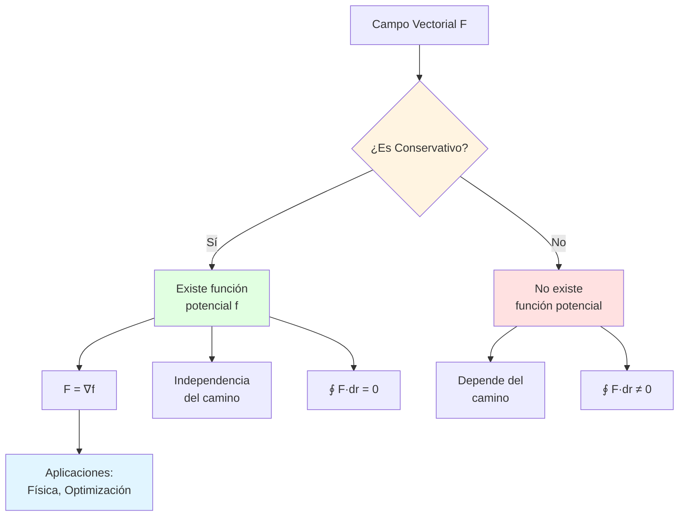

# 🧭 Criterios de Conservatividad en ℝ² y ℝ³

## 🎯 Introducción

> [!info]- 💡 ¿Qué es un Campo Conservativo?
> 
> Un **campo vectorial conservativo** es aquel que puede expresarse como el gradiente de una función escalar (llamada **función potencial**). Esta propiedad tiene implicaciones profundas en física y matemáticas, especialmente relacionadas con la conservación de energía.
> 
> **Analogía práctica:** Imagina una montaña con diferentes caminos hacia la cima:
> 
> - **Campo gravitacional** (conservativo): No importa qué camino tomes, la energía gastada depende solo de la diferencia de altura
> - **Camino directo vs zigzag**: Ambos requieren la misma energía total
> - **Función potencial**: La altura sobre el nivel del mar
> 
> **¿Por qué es importante?**
> 
> |Aspecto|Descripción|Ejemplo de Uso|
> |---|---|---|
> |**Simplificación**|Reduce cálculos complejos|Solo evaluar extremos|
> |**Conservación**|Energía se conserva|Sistemas físicos|
> |**Independencia**|Resultado no depende del camino|Múltiples trayectorias|
> |**Predicción**|Determinar comportamiento futuro|Dinámica de sistemas|
> |**Caracterización**|Identificar propiedades del campo|Análisis cualitativo|



---

## 📐 Definiciones Fundamentales

### 🌊 Campo Vectorial Conservativo

> [!example]- 📋 Definición Formal
> 
> **Definición:**
> 
> Un campo vectorial **F** en un dominio D ⊆ ℝⁿ es **conservativo** si existe una función escalar diferenciable f: D → ℝ tal que:
> 
> ```
> F = ∇f
> ```
> 
> La función f se llama **función potencial** o **potencial escalar** de **F**.
> 
> **En ℝ²:**
> 
> ```
> F(x, y) = ⟨P(x,y), Q(x,y)⟩
> 
> Es conservativo si ∃f tal que:
> P = ∂f/∂x
> Q = ∂f/∂y
> 
> Es decir: F = ∇f = ⟨∂f/∂x, ∂f/∂y⟩
> ```
> 
> **En ℝ³:**
> 
> ```
> F(x, y, z) = ⟨P(x,y,z), Q(x,y,z), R(x,y,z)⟩
> 
> Es conservativo si ∃f tal que:
> P = ∂f/∂x
> Q = ∂f/∂y
> R = ∂f/∂z
> 
> Es decir: F = ∇f = ⟨∂f/∂x, ∂f/∂y, ∂f/∂z⟩
> ```
> 
> **Propiedades equivalentes:**
> 
> ```mermaid
> graph TD
>     A[Campo Conservativo<br/>F = ∇f] --> B[Independencia<br/>del camino]
>     A --> C[∮_C F·dr = 0<br/>para toda C cerrada]
>     A --> D[∫_C F·dr depende<br/>solo de extremos]
>     
>     B <--> C
>     C <--> D
>     D <--> B
>     
>     style A fill:#e1ffe1
>     style B fill:#fff4e1
>     style C fill:#e1f5ff
>     style D fill:#ffe1e1
> ```
> 
> **Ejemplos:**
> 
> |Campo|¿Conservativo?|Función Potencial|
> |---|---|---|
> |**F** = ⟨2x, 2y⟩|✅ Sí|f(x,y) = x² + y²|
> |**F** = ⟨y, x⟩|✅ Sí|f(x,y) = xy|
> |**F** = ⟨-y, x⟩|❌ No|No existe|
> |**F** = ⟨yz, xz, xy⟩|✅ Sí|f(x,y,z) = xyz|

### 🔄 Operadores Diferenciales

> [!note]- 🧮 Gradiente, Rotacional y Divergencia
> 
> **1. Gradiente (∇f)**
> 
> Transforma función escalar → campo vectorial
> 
> ```
> En ℝ²: ∇f = ⟨∂f/∂x, ∂f/∂y⟩
> 
> En ℝ³: ∇f = ⟨∂f/∂x, ∂f/∂y, ∂f/∂z⟩
> ```
> 
> **Interpretación:**
> 
> - Apunta en dirección de máximo crecimiento
> - Magnitud = tasa máxima de cambio
> - Perpendicular a curvas de nivel
> 
> **2. Rotacional (∇ × F) [Solo en ℝ³]**
> 
> Transforma campo vectorial → campo vectorial
> 
> ```
> ∇ × F = |  î      ĵ      k̂   |
>         | ∂/∂x   ∂/∂y   ∂/∂z |
>         |  P      Q      R   |
> 
>       = ⟨∂R/∂y - ∂Q/∂z, ∂P/∂z - ∂R/∂x, ∂Q/∂x - ∂P/∂y⟩
> ```
> 
> **Interpretación:**
> 
> - Mide "tendencia a rotar"
> - Dirección: eje de rotación (regla mano derecha)
> - Magnitud: velocidad angular
> 
> **3. Divergencia (∇·F)**
> 
> Transforma campo vectorial → función escalar
> 
> ```
> En ℝ²: ∇·F = ∂P/∂x + ∂Q/∂y
> 
> En ℝ³: ∇·F = ∂P/∂x + ∂Q/∂y + ∂R/∂z
> ```
> 
> **Interpretación:**
> 
> - Mide "expansión o contracción"
> - Positiva: fuente
> - Negativa: sumidero
> 
> **Relaciones importantes:**
> 
> ```mermaid
> graph LR
>     A[Función Escalar f] -->|∇| B[Campo Vectorial ∇f]
>     B -->|∇×| C[Rotacional<br/>∇ × ∇f = 0]
>     
>     D[Campo Vectorial F] -->|∇×| E[Rotacional ∇ × F]
>     D -->|∇·| F[Divergencia ∇·F]
>     
>     E -->|∇·| G[∇·∇ × F = 0]
>     
>     style C fill:#e1ffe1
>     style G fill:#e1ffe1
> ```
> 
> **Identidades clave:**
> 
> |Identidad|Significado|
> |---|---|
> |∇ × (∇f) = **0**|Rotacional de gradiente es cero|
> |∇·(∇ × **F**) = 0|Divergencia de rotacional es cero|
> |∇·(∇f) = ∇²f|Laplaciano|

---

## ✅ Criterios en ℝ²

### 📏 Criterio de Igualdad de Derivadas Cruzadas

> [!success]- 🎯 Teorema Principal en ℝ²
> 
> **Teorema:**
> 
> Sea **F**(x, y) = ⟨P(x,y), Q(x,y)⟩ un campo vectorial en un dominio D ⊆ ℝ² **simplemente conexo**, donde P y Q tienen derivadas parciales continuas.
> 
> **F** es conservativo si y solo si:
> 
> ```
> ∂P/∂y = ∂Q/∂x
> ```
> 
> **Componentes del teorema:**
> 
> |Requisito|Descripción|Importancia|
> |---|---|---|
> |**Simplemente conexo**|Sin "agujeros"|⭐⭐⭐⭐⭐ Crucial|
> |**Derivadas continuas**|P_y, Q_x existen y continuas|⭐⭐⭐⭐ Muy importante|
> |**Dominio D**|Región donde se aplica|⭐⭐⭐ Importante|
> 
> **Visualización del criterio:**
> 
> ```mermaid
> flowchart TD
>     A[Campo F = ⟨P, Q⟩] --> B{Dominio<br/>simplemente conexo?}
>     B -->|No| C[❌ Criterio no aplica]
>     B -->|Sí| D{Derivadas<br/>continuas?}
>     D -->|No| C
>     D -->|Sí| E[Calcular ∂P/∂y y ∂Q/∂x]
>     
>     E --> F{¿∂P/∂y = ∂Q/∂x?}
>     F -->|Sí| G[✅ F es conservativo]
>     F -->|No| H[❌ F NO es conservativo]
>     
>     style G fill:#e1ffe1
>     style H fill:#ffe1e1
>     style C fill:#ffcccc
> ```
> 
> **Ejemplos paso a paso:**
> 
> **Ejemplo 1: Campo conservativo**
> 
> ```
> F(x, y) = ⟨3x² + 2y, 2x + 6y²⟩
> 
> Paso 1: Identificar componentes
> P(x, y) = 3x² + 2y
> Q(x, y) = 2x + 6y²
> 
> Paso 2: Calcular derivadas
> ∂P/∂y = 2
> ∂Q/∂x = 2
> 
> Paso 3: Comparar
> ∂P/∂y = ∂Q/∂x ✓
> 
> Conclusión: F ES conservativo
> ```
> 
> **Ejemplo 2: Campo NO conservativo**
> 
> ```
> F(x, y) = ⟨-y, 2x⟩
> 
> P(x, y) = -y
> Q(x, y) = 2x
> 
> ∂P/∂y = -1
> ∂Q/∂x = 2
> 
> ∂P/∂y ≠ ∂Q/∂x ✗
> 
> Conclusión: F NO es conservativo
> ```

### 🔍 Demostración del Criterio

> [!tip]- 📐 Idea de la Demostración
> 
> **Dirección (⇒): Si F es conservativo, entonces ∂P/∂y = ∂Q/∂x**
> 
> ```
> Si F = ∇f, entonces:
> P = ∂f/∂x
> Q = ∂f/∂y
> 
> Derivando P respecto a y:
> ∂P/∂y = ∂/∂y(∂f/∂x) = ∂²f/∂y∂x
> 
> Derivando Q respecto a x:
> ∂Q/∂x = ∂/∂x(∂f/∂y) = ∂²f/∂x∂y
> 
> Por teorema de Clairaut (derivadas mixtas iguales):
> ∂²f/∂y∂x = ∂²f/∂x∂y
> 
> Por lo tanto:
> ∂P/∂y = ∂Q/∂x ✓
> ```
> 
> **Dirección (⇐): Si ∂P/∂y = ∂Q/∂x, entonces F es conservativo**
> 
> (Demostración constructiva - encontramos f)
> 
> ```
> Definir:
> f(x, y) = ∫_{x₀}^x P(t, y₀) dt + ∫_{y₀}^y Q(x, s) ds
> 
> Se puede verificar que:
> 1. ∂f/∂x = P
> 2. ∂f/∂y = Q
> 3. Por lo tanto F = ∇f
> ```
> 
> **Diagrama conceptual:**
> 
> ```mermaid
> graph TB
>     A[F = ∇f] -->|Derivar| B[P = ∂f/∂x<br/>Q = ∂f/∂y]
>     B -->|Derivar cruzado| C[∂P/∂y = ∂²f/∂y∂x<br/>∂Q/∂x = ∂²f/∂x∂y]
>     C -->|Clairaut| D[∂P/∂y = ∂Q/∂x]
>     
>     D -.->|Construir| E[Encontrar f tal que<br/>∇f = F]
>     E -.->|Verificar| A
>     
>     style A fill:#e1ffe1
>     style D fill:#fff4e1
> ```

### 🚫 Dominios No Simplemente Conexos

> [!warning]- ⚠️ Casos Especiales
> 
> **¿Qué es un dominio simplemente conexo?**
> 
> Un dominio es **simplemente conexo** si:
> 
> - No tiene "agujeros"
> - Toda curva cerrada puede contraerse a un punto sin salir del dominio
> 
> **Ejemplos:**
> 
> |Dominio|¿Simplemente conexo?|Descripción|
> |---|---|---|
> |ℝ² completo|✅ Sí|Todo el plano|
> |Disco x²+y²<1|✅ Sí|Interior de círculo|
> |ℝ²{(0,0)}|❌ No|Plano sin origen|
> |Anillo 1<x²+y²<4|❌ No|Entre dos círculos|
> |Rectángulo|✅ Sí|Región rectangular|
> 
> **Caso problemático clásico:**
> 
> ```
> Campo: F(x, y) = ⟨-y/(x²+y²), x/(x²+y²)⟩
> 
> Dominio: D = ℝ²\{(0,0)} (plano sin origen)
> 
> Paso 1: Calcular derivadas
> P = -y/(x²+y²)
> Q = x/(x²+y²)
> 
> ∂P/∂y = (y²-x²)/(x²+y²)²
> ∂Q/∂x = (y²-x²)/(x²+y²)²
> 
> ∂P/∂y = ∂Q/∂x ✓ (en D)
> 
> Paso 2: Integral sobre curva cerrada
> Círculo unitario: x² + y² = 1
> ∮_C F·dr = 2π ≠ 0 ✗
> 
> Conclusión: NO es conservativo (dominio NO simplemente conexo)
> ```
> 
> **Visualización:**
> 
> ```mermaid
> graph TD
>     A[Dominio Simplemente Conexo] --> B[Sin agujeros]
>     A --> C[∂P/∂y = ∂Q/∂x]
>     B --> D[⇔ F conservativo]
>     C --> D
>     
>     E[Dominio NO Simplemente Conexo] --> F[Con agujeros]
>     E --> G[∂P/∂y = ∂Q/∂x]
>     F --> H[⇏ F conservativo]
>     G --> H
>     
>     style D fill:#e1ffe1
>     style H fill:#ffe1e1
> ```

---

## ✅ Criterios en ℝ³

### 🌀 Criterio del Rotacional Nulo

> [!success]- 🎯 Teorema Principal en ℝ³
> 
> **Teorema:**
> 
> Sea **F**(x, y, z) = ⟨P, Q, R⟩ un campo vectorial en un dominio D ⊆ ℝ³ **simplemente conexo**, donde P, Q, R tienen derivadas parciales continuas.
> 
> **F** es conservativo si y solo si:
> 
> ```
> ∇ × F = 0
> ```
> 
> **Expandido:**
> 
> ```
> ∂R/∂y - ∂Q/∂z = 0
> ∂P/∂z - ∂R/∂x = 0
> ∂Q/∂x - ∂P/∂y = 0
> ```
> 
> **Forma del rotacional:**
> 
> ```
> ∇ × F = |  î      ĵ      k̂   |
>         | ∂/∂x   ∂/∂y   ∂/∂z |
>         |  P      Q      R   |
> 
>       = î(∂R/∂y - ∂Q/∂z) - ĵ(∂R/∂x - ∂P/∂z) + k̂(∂Q/∂x - ∂P/∂y)
> ```
> 
> **Procedimiento de verificación:**
> 
> ```mermaid
> flowchart TD
>     A[Campo F = ⟨P, Q, R⟩] --> B[Calcular 3 componentes<br/>del rotacional]
>     B --> C[Componente î:<br/>∂R/∂y - ∂Q/∂z]
>     B --> D[Componente ĵ:<br/>∂P/∂z - ∂R/∂x]
>     B --> E[Componente k̂:<br/>∂Q/∂x - ∂P/∂y]
>     
>     C --> F{¿Todas = 0?}
>     D --> F
>     E --> F
>     
>     F -->|Sí| G[✅ F conservativo<br/>∇ × F = 0]
>     F -->|No| H[❌ F NO conservativo<br/>∇ × F ≠ 0]
>     
>     style G fill:#e1ffe1
>     style H fill:#ffe1e1
> ```
> 
> **Ejemplo detallado:**
> 
> ```
> F(x, y, z) = ⟨yz, xz, xy⟩
> 
> Paso 1: Identificar componentes
> P = yz
> Q = xz
> R = xy
> 
> Paso 2: Calcular derivadas parciales
> ∂P/∂y = z,  ∂P/∂z = y
> ∂Q/∂x = z,  ∂Q/∂z = x
> ∂R/∂x = y,  ∂R/∂y = x
> 
> Paso 3: Calcular componentes del rotacional
> Componente î: ∂R/∂y - ∂Q/∂z = x - x = 0 ✓
> Componente ĵ: ∂P/∂z - ∂R/∂x = y - y = 0 ✓
> Componente k̂: ∂Q/∂x - ∂P/∂y = z - z = 0 ✓
> 
> Paso 4: Conclusión
> ∇ × F = ⟨0, 0, 0⟩ = 0
> 
> F ES conservativo
> 
> Función potencial: f(x,y,z) = xyz
> Verificar: ∇f = ⟨yz, xz, xy⟩ = F ✓
> ```

### 📊 Tabla Comparativa ℝ² vs ℝ³

> [!note]- 🔄 Diferencias y Similitudes
> 
> |Aspecto|ℝ²|ℝ³|
> |---|---|---|
> |**Campo**|**F** = ⟨P, Q⟩|**F** = ⟨P, Q, R⟩|
> |**Criterio**|∂P/∂y = ∂Q/∂x|∇ × **F** = **0**|
> |**Condiciones**|1 ecuación|3 ecuaciones|
> |**Rotacional**|Escalar implícito|Vector explícito|
> |**Potencial**|f(x, y)|f(x, y, z)|
> |**Verificaciones**|2 derivadas|6 derivadas|
> |**Complejidad**|⭐⭐ Media|⭐⭐⭐⭐ Alta|
> 
> **Relación entre criterios:**
> 
> ```
> En ℝ²: ∂P/∂y = ∂Q/∂x
> 
> Es equivalente a la componente k̂ del rotacional en ℝ³:
> (∇ × F)·k̂ = ∂Q/∂x - ∂P/∂y = 0
> 
> El criterio de ℝ² es un caso especial de ℝ³
> ```
> 
> **Diagrama de relación:**
> 
> ```mermaid
> graph TB
>     A[Criterio General<br/>∇ × F = 0] --> B[En ℝ³<br/>3 componentes = 0]
>     A --> C[En ℝ² campo plano<br/>P, Q no dependen de z]
>     
>     B --> D[∂R/∂y - ∂Q/∂z = 0]
>     B --> E[∂P/∂z - ∂R/∂x = 0]
>     B --> F[∂Q/∂x - ∂P/∂y = 0]
>     
>     C --> G[R = 0]
>     G --> H[Solo queda:<br/>∂Q/∂x - ∂P/∂y = 0]
>     
>     H --> I[∂P/∂y = ∂Q/∂x<br/>Criterio ℝ²]
>     
>     style A fill:#e1f5ff
>     style I fill:#e1ffe1
> ```

---

## 🔨 Ejemplos Resueltos Detallados

### 📝 Ejemplo 1: Campo Conservativo en ℝ²

> [!example]- ✅ Verificación y Función Potencial
> 
> **Enunciado:**
> 
> Determine si **F**(x, y) = ⟨2xy + y², x² + 2xy + 3⟩ es conservativo. Si lo es, encuentre la función potencial.
> 
> **Solución:**
> 
> **Paso 1: Identificar componentes**
> 
> ```
> P(x, y) = 2xy + y²
> Q(x, y) = x² + 2xy + 3
> ```
> 
> **Paso 2: Verificar criterio**
> 
> ```
> ∂P/∂y = 2x + 2y
> ∂Q/∂x = 2x + 2y
> 
> ∂P/∂y = ∂Q/∂x ✓
> 
> Conclusión: F ES conservativo
> ```
> 
> **Paso 3: Encontrar función potencial**
> 
> Método de integración:
> 
> ```
> Como ∂f/∂x = P:
> f(x, y) = ∫ P dx
>         = ∫ (2xy + y²) dx
>         = x²y + xy² + g(y)
> 
> donde g(y) es función solo de y
> ```
> 
> **Paso 4: Determinar g(y)**
> 
> ```
> ∂f/∂y = x² + 2xy + g'(y)
> 
> Pero también ∂f/∂y = Q = x² + 2xy + 3
> 
> Igualando:
> x² + 2xy + g'(y) = x² + 2xy + 3
> g'(y) = 3
> 
> Integrando:
> g(y) = 3y + C
> ```
> 
> **Paso 5: Función potencial final**
> 
> ```
> f(x, y) = x²y + xy² + 3y + C
> ```
> 
> **Verificación:**
> 
> ```
> ∂f/∂x = 2xy + y² = P ✓
> ∂f/∂y = x² + 2xy + 3 = Q ✓
> 
> Por lo tanto: ∇f = F ✓
> ```
> 
> **Diagrama del proceso:**
> 
> ```mermaid
> flowchart LR
>     A[F = ⟨P, Q⟩] --> B[Verificar<br/>∂P/∂y = ∂Q/∂x]
>     B --> C[✓ Conservativo]
>     C --> D[Integrar P<br/>respecto a x]
>     D --> E[f = x²y + xy² + g y]
>     E --> F[Derivar<br/>respecto a y]
>     F --> G[Igualar con Q]
>     G --> H[Encontrar g y]
>     H --> I[f = x²y + xy² + 3y]
>     
>     style C fill:#e1ffe1
>     style I fill:#fff4e1
> ```

### 📝 Ejemplo 2: Campo NO Conservativo en ℝ²

> [!example]- ❌ Análisis de Campo Rotacional
> 
> **Enunciado:**
> 
> Analice si **F**(x, y) = ⟨-y/(x²+y²), x/(x²+y²)⟩ es conservativo.
> 
> **Solución:**
> 
> **Paso 1: Identificar dominio**
> 
> ```
> F está definido en D = ℝ²\{(0,0)}
> Este dominio NO es simplemente conexo (tiene agujero en origen)
> ```
> 
> **Paso 2: Calcular derivadas**
> 
> ```
> P = -y/(x²+y²)
> Q = x/(x²+y²)
> 
> ∂P/∂y = ∂/∂y[-y/(x²+y²)]
>       = -[(x²+y²) - y·2y]/(x²+y²)²
>       = -(x²+y²-2y²)/(x²+y²)²
>       = -(x²-y²)/(x²+y²)²
> 
> ∂Q/∂x = ∂/∂x[x/(x²+y²)]
>       = [(x²+y²) - x·2x]/(x²+y²)²
>       = (x²+y²-2x²)/(x²+y²)²
>       = (y²-x²)/(x²+y²)²
>       = -(x²-y²)/(x²+y²)²
> 
> ∂P/∂y = ∂Q/∂x ✓ (en D)
> ```
> 
> **Paso 3: ¿Es conservativo?**
> 
> Aunque ∂P/∂y = ∂Q/∂x, el dominio NO es simplemente conexo.
> 
> **Prueba con integral cerrada:**
> 
> ```
> Círculo unitario: x = cos(t), y = sin(t), t ∈ [0, 2π]
> 
> F(cos t, sin t) = ⟨-sin(t), cos(t)⟩
> r'(t) = ⟨-sin(t), cos(t)⟩
> 
> ∮ F·dr = ∫₀²π ⟨-sin(t), cos(t)⟩·⟨-sin(t), cos(t)⟩ dt
>        = ∫₀²π (sin²(t) + cos²(t)) dt
>        = ∫₀²π 1 dt
>        = 2π ≠ 0 ✗
> 
> ```
> 
> **Conclusión:**
> ```
> F NO es conservativo porque:
> 1. El dominio NO es simplemente conexo
> 2. ∮_C F·dr ≠ 0 para alguna curva cerrada
> ```
> 
> **Visualización:**
> 
> ```mermaid
> graph TD
>     A[Campo F] --> B["Dominio D = ℝ²\0,0"]
>     B --> C[❌ NO simplemente conexo]
>     
>     A --> D["∂P/∂y = ∂Q/∂x ✓"]
>     
>     C --> E[Criterio no garantiza<br/>conservatividad]
>     D --> E
>     
>     E --> F[Probar con<br/>curva cerrada]
>     F --> G["∮ F·dr = 2π ≠ 0"]
>     G --> H[❌ NO conservativo]
>     
>     style C fill:#ffe1e1
>     style H fill:#ffcccc
> ```

### 📝 Ejemplo 3: Campo Conservativo en ℝ³

> [!example]- ✅ Verificación con Rotacional
> 
> **Enunciado:**
> 
> Verifique si **F**(x, y, z) = ⟨2xyz, x²z + 1, x²y⟩ es conservativo y encuentre su potencial.
> 
> **Solución:**
> 
> **Paso 1: Identificar componentes**
> ```
> P = 2xyz
> Q = x²z + 1
> R = x²y
> ```
> 
> **Paso 2: Calcular derivadas parciales**
> ```
> ∂P/∂x = 2yz,  ∂P/∂y = 2xz,  ∂P/∂z = 2xy
> ∂Q/∂x = 2xz,  ∂Q/∂y = 0,    ∂Q/∂z = x²
> ∂R/∂x = 2xy,  ∂R/∂y = x²,   ∂R/∂z = 0
> ```
> 
> **Paso 3: Calcular rotacional**
> ```
> Componente î: ∂R/∂y - ∂Q/∂z = x² - x² = 0 ✓
> Componente ĵ: ∂P/∂z - ∂R/∂x = 2xy - 2xy = 0 ✓
> Componente k̂: ∂Q/∂x - ∂P/∂y = 2xz - 2xz = 0 ✓
> 
> ∇ × F = ⟨0, 0, 0⟩ = 0
> 
> F ES conservativo
> ```
> 
> **Paso 4: Encontrar función potencial**
> ```
> Como ∂f/∂x = P:
> f = ∫ 2xyz dx = x²yz + g(y, z)
> 
> Derivar respecto a y:
> ∂f/∂y = x²z + ∂g/∂y
> 
> Igualar con Q:
> x²z + ∂g/∂y = x²z + 1
> ∂g/∂y = 1
> 
> Integrar:
> g(y, z) = y + h(z)
> 
> Entonces:
> f = x²yz + y + h(z)
> 
> Derivar respecto a z:
> ∂f/∂z = x²y + h'(z)
> 
> Igualar con R:
> x²y + h'(z) = x²y
> h'(z) = 0
> h(z) = C
> ```
> 
> **Paso 5: Función potencial final**
> ```
> f(x, y, z) = x²yz + y + C
> ```
> 
> **Verificación:**
> ```
> ∂f/∂x = 2xyz = P ✓
> ∂f/∂y = x²z + 1 = Q ✓
> ∂f/∂z = x²y = R ✓
> 
> ∇f = F ✓
> ```

---

## 🎯 Métodos para Encontrar el Potencial

### 🔧 Método 1: Integración Directa

> [!tip]- 📐 Procedimiento Sistemático
> 
> **Para ℝ²:**
> 
> Dado **F** = ⟨P, Q⟩ conservativo:
> 
> ```
> Paso 1: Integrar P respecto a x
> f(x, y) = ∫ P(x, y) dx + g(y)
> 
> Paso 2: Derivar respecto a y
> ∂f/∂y = [derivada de la integral] + g'(y)
> 
> Paso 3: Igualar con Q
> [resultado paso 2] = Q(x, y)
> 
> Paso 4: Despejar g'(y)
> g'(y) = Q - [derivada de la integral]
> 
> Paso 5: Integrar para obtener g(y)
> g(y) = ∫ g'(y) dy
> 
> Paso 6: Función potencial
> f(x, y) = [resultado paso 1] + g(y)
> ```
> 
> **Para ℝ³:**
> 
> Dado **F** = ⟨P, Q, R⟩ conservativo:
> 
> ```
> Paso 1: Integrar P respecto a x
> f(x, y, z) = ∫ P dx + g(y, z)
> 
> Paso 2: Derivar respecto a y e igualar con Q
> ∂f/∂y = [...] + ∂g/∂y = Q
> Encontrar ∂g/∂y
> 
> Paso 3: Integrar ∂g/∂y respecto a y
> g(y, z) = ∫ ∂g/∂y dy + h(z)
> 
> Paso 4: Derivar respecto a z e igualar con R
> ∂f/∂z = [...] + h'(z) = R
> Encontrar h'(z)
> 
> Paso 5: Integrar h'(z)
> h(z) = ∫ h'(z) dz
> 
> Paso 6: Función potencial completa
> f(x, y, z) = [todo junto]
> ```
> 
> **Diagrama del proceso (ℝ²):**
> 
> ```mermaid
> flowchart TD
>     A[F = ⟨P, Q⟩] --> B[f = ∫P dx + g y]
>     B --> C[∂f/∂y = ... + g' y]
>     C --> D[Igualar con Q]
>     D --> E[Despejar g' y]
>     E --> F[g y = ∫g' y dy]
>     F --> G[f x,y completa]
>     
>     style A fill:#e1f5ff
>     style G fill:#e1ffe1
> ```

### 🔧 Método 2: Integral de Línea

> [!tip]- 🛤️ Método Alternativo
> 
> **Principio:**
> 
> Si **F** es conservativo, podemos calcular f usando:
> 
> ```
> f(x, y) = ∫_{(x₀,y₀)}^{(x,y)} F·dr + f(x₀, y₀)
> ```
> 
> **Camino conveniente (ℝ²):**
> 
> 1. Ir de (x₀, y₀) a (x, y₀) horizontalmente
> 2. Luego de (x, y₀) a (x, y) verticalmente
> 
> ```
> f(x, y) = ∫_{x₀}^x P(t, y₀) dt + ∫_{y₀}^y Q(x, s) ds + C
> ```
> 
> **Ejemplo:**
> 
> ```
> F(x, y) = ⟨2x, 2y⟩
> Punto inicial: (0, 0)
> 
> Segmento 1: (0,0) → (x,0)
> ∫₀ˣ P(t, 0) dt = ∫₀ˣ 2t dt = x²
> 
> Segmento 2: (x,0) → (x,y)
> ∫₀ʸ Q(x, s) ds = ∫₀ʸ 2s ds = y²
> 
> f(x, y) = x² + y²
> ```
> 
> **Visualización del camino:**
> 
> ```mermaid
> graph LR
>     A[x₀, y₀] -->|Horizontal<br/>∫P dt| B[x, y₀]
>     B -->|Vertical<br/>∫Q ds| C[x, y]
>     
>     style A fill:#e1ffe1
>     style C fill:#ffe1e1
> ```

---

## 📊 Tabla Resumen de Criterios

> [!success]- ✅ Resumen Completo
> 
> | Aspecto | ℝ² | ℝ³ |
> |---------|-----|-----|
> | **Campo** | **F** = ⟨P, Q⟩ | **F** = ⟨P, Q, R⟩ |
> | **Criterio necesario** | ∂P/∂y = ∂Q/∂x | ∇ × **F** = **0** |
> | **Criterio suficiente** | + dominio simplemente conexo | + dominio simplemente conexo |
> | **Número de ecuaciones** | 1 | 3 |
> | **Ecuaciones** | ∂P/∂y = ∂Q/∂x | ∂R/∂y=∂Q/∂z<br/>∂P/∂z=∂R/∂x<br/>∂Q/∂x=∂P/∂y |
> | **Potencial** | f(x, y) | f(x, y, z) |
> | **Verificar ∇f=F** | 2 derivadas | 3 derivadas |
> | **Complejidad cálculo** | ⭐⭐ | ⭐⭐⭐⭐ |
> 
> **Condiciones comunes:**
> 
> ```mermaid
> graph TD
>     A[Campo Vectorial F] --> B{Derivadas<br/>continuas?}
>     B -->|No| C[❌ Criterio no aplica]
>     B -->|Sí| D{Dominio<br/>simplemente conexo?}
>     D -->|No| E[⚠️ Criterio no suficiente]
>     D -->|Sí| F{Verifica<br/>criterio?}
>     F -->|No| G[❌ NO conservativo]
>     F -->|Sí| H[✅ ES conservativo]
>     
>     style H fill:#e1ffe1
>     style G fill:#ffe1e1
>     style C fill:#ffcccc
> ```

---

## 🎓 Ejercicios Propuestos

> [!note]- 💪 Problemas para Practicar
> 
> ### Nivel Básico
> 
> **1. Verificación simple en ℝ²**
> ```
> Determine si los siguientes campos son conservativos:
> 
> a) F(x, y) = ⟨3x², 2y⟩
> b) F(x, y) = ⟨y cos(x), sin(x)⟩
> c) F(x, y) = ⟨e^x, e^y⟩
> d) F(x, y) = ⟨2xy, x²⟩
> ```
> 
> **2. Encontrar potencial**
> ```
> Para cada campo conservativo del ejercicio 1,
> encuentre la función potencial f.
> ```
> 
> ### Nivel Intermedio
> 
> **3. Verificación en ℝ³**
> ```
> Determine si son conservativos:
> 
> a) F = ⟨yz, xz + z, xy + y⟩
> b) F = ⟨2x, 3y, 4z⟩
> c) F = ⟨y + z, x + z, x + y⟩
> d) F = ⟨e^x cos(y), -e^x sin(y), 1⟩
> ```
> 
> **4. Potencial en ℝ³**
> ```
> Para F(x,y,z) = ⟨2xyz², x²z² + 1, 2x²yz⟩:
> a) Verifique que es conservativo
> b) Encuentre f(x, y, z)
> c) Calcule ∫_C F·dr de (0,0,0) a (1,2,3)
> ```
> 
> ### Nivel Avanzado
> 
> **5. Dominio no simplemente conexo**
> ```
> Campo: F = ⟨y/(x²+y²), -x/(x²+y²)⟩
> 
> a) Calcule ∂P/∂y y ∂Q/∂x en ℝ²\{(0,0)}
> b) ¿Son iguales?
> c) Calcule ∮_C F·dr donde C es x² + y² = 1
> d) ¿Es conservativo? Explique la aparente contradicción
> ```
> 
> **6. Aplicación física**
> ```
> Campo gravitacional: F = -GMm/r² r̂
> 
> En coordenadas cartesianas:
> F = -GMm/(x²+y²+z²)^(3/2) ⟨x, y, z⟩
> 
> a) Verifique que es conservativo
> b) Encuentre la energía potencial U(x,y,z)
> c) ¿Qué representa físicamente?
> ```
> 
> **7. Problema teórico**
> ```
> Demuestre que si F y G son conservativos con
> potenciales f y g respectivamente, entonces:
> 
> a) αF + βG es conservativo (α, β constantes)
> b) Su potencial es αf + βg
> ```
> 
> **8. Construcción de campo**
> ```
> Diseñe un campo vectorial F en ℝ² tal que:
> a) Sea conservativo en el disco x² + y² < 1
> b) NO sea conservativo en ℝ²\{(0,0)}
> c) Justifique por qué cumple ambas condiciones
> ```

---

## 🔗 Aplicaciones y Conexiones

> [!quote]- 🌟 Relevancia Práctica
> 
> ### Aplicaciones Físicas
> 
> **1. Mecánica Clásica**
> 
> | Fuerza | Conservativa | Potencial |
> |--------|--------------|-----------|
> | Gravitacional | ✅ Sí | U = mgh |
> | Elástica | ✅ Sí | U = ½kx² |
> | Fricción | ❌ No | No existe |
> | Normal | Caso especial | Solo perpendicular |
> 
> **2. Electromagnetismo**
> 
> ```
> Campo eléctrico estático: E = -∇φ
> (φ = potencial eléctrico)
> 
> Campo magnético: B NO es conservativo
> (∇ × B ≠ 0 en general)
> ```
> 
> **3. Termodinámica**
> 
> ```
> Variables de estado → Funciones potenciales
> Procesos reversibles → Campos conservativos
> Entropía → Función potencial
> ```
> 
> ### Conexiones Matemáticas
> 
> ```mermaid
> graph TD
>     A[Campos Conservativos] --> B[TFIL]
>     A --> C[Teorema de Green]
>     A --> D[Teorema de Stokes]
>     
>     B --> E[Simplifica cálculos]
>     C --> F[Relaciona ∂D con D]
>     D --> G[Generaliza Green a ℝ³]
>     
>     A --> H[Ecuaciones diferenciales]
>     H --> I[Soluciones exactas]
>     
>     style A fill:#e1f5ff
>     style B fill:#e1ffe1
>     style C fill:#fff4e1
>     style D fill:#ffe1e1
> ```

---

## 📚 Resumen y Puntos Clave

> [!success]- ✅ Conceptos Esenciales
> 
> ### Ideas Centrales
> 
> 1. **Campo conservativo** ⟺ ∃f tal que **F** = ∇f
> 
> 2. **Criterio ℝ²**: ∂P/∂y = ∂Q/∂x (+ dominio simplemente conexo)
> 
> 3. **Criterio ℝ³**: ∇ × **F** = **0** (+ dominio simplemente conexo)
> 
> 4. **Dominio simplemente conexo** es crucial
> 
> 5. **Métodos** para encontrar f:
>    - Integración directa
>    - Integral de línea
> 
> ### Checklist de Verificación
> 
> - [ ] Identificar dominio (¿simplemente conexo?)
> - [ ] Verificar derivadas continuas
> - [ ] Aplicar criterio apropiado (ℝ² o ℝ³)
> - [ ] Si es conservativo, encontrar f
> - [ ] Verificar que ∇f = **F**
> 
> ### Errores Comunes
> 
> | Error | Corrección |
> |-------|-----------|
> | Ignorar dominio | Siempre verificar si es simplemente conexo |
> | Asumir conservatividad | Siempre verificar criterio |
> | Errores algebraicos | Verificar ∇f = **F** al final |
> | Olvidar constante | Incluir +C en potencial |

---

**Tags:** #cálculo-vectorial #campos-conservativos #criterios #conservatividad #rotacional #gradiente #función-potencial #R2 #R3 #derivadas-cruzadas #teoremas #mermaid #diagramas
```