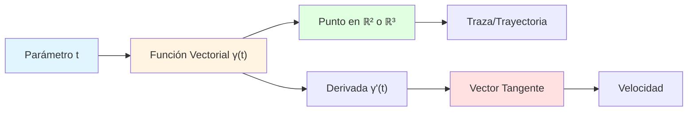
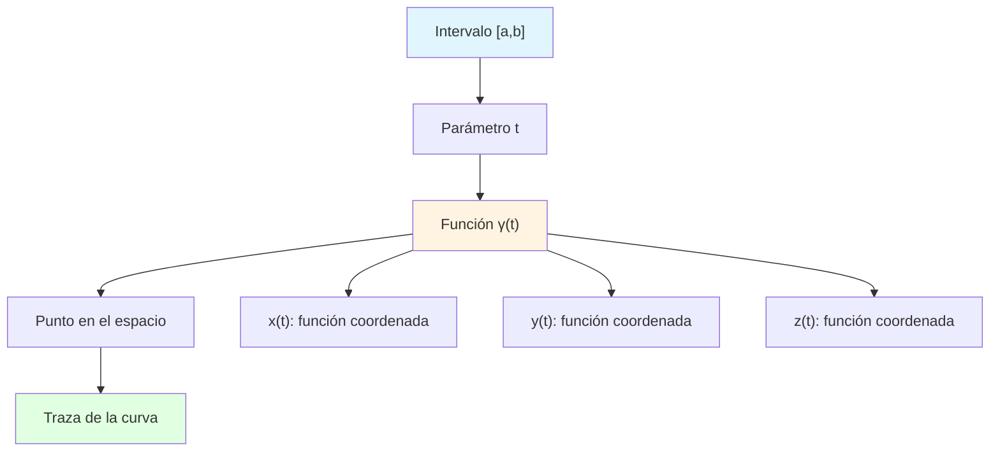
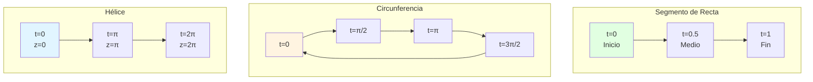
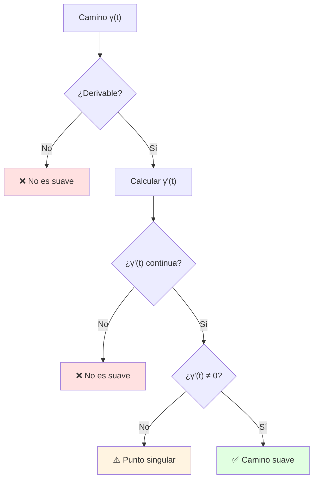
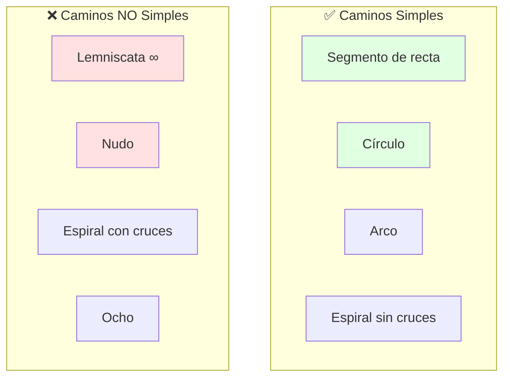
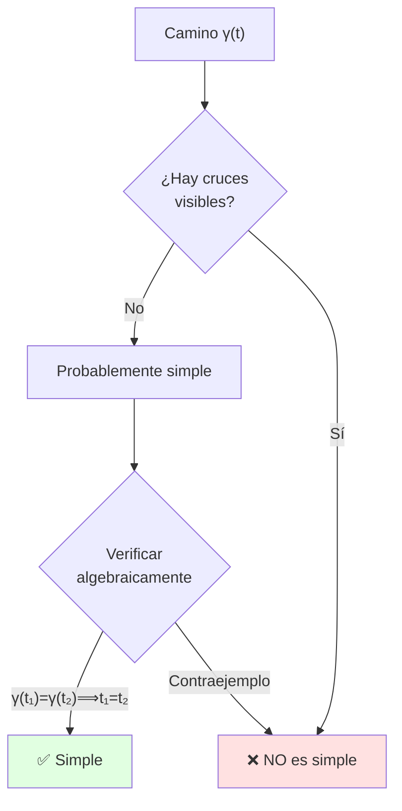
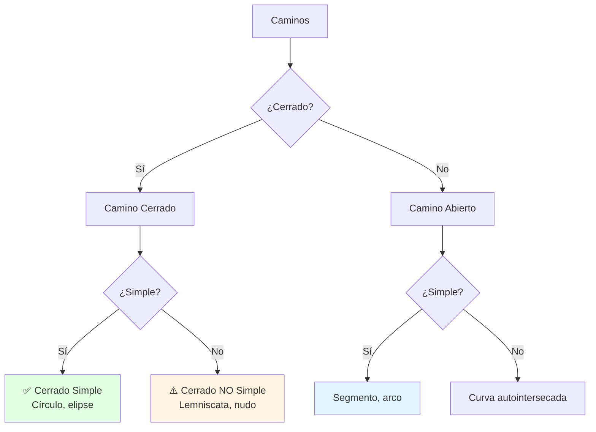
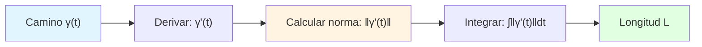
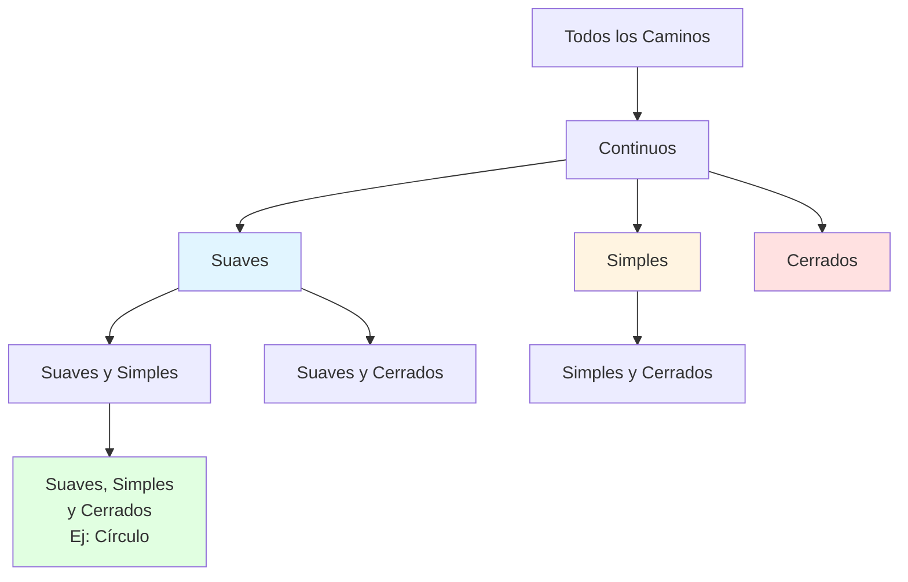

# 🛤️ Caminos Suaves, Simples y Cerrados en Cálculo Vectorial

## 🎯 Introducción

> [!info]- 💡 ¿Qué es un Camino en Cálculo Vectorial? Un **camino** (o curva parametrizada) es una función que describe el movimiento de un punto en el espacio a medida que un parámetro (generalmente el tiempo) varía. Es la representación matemática de una trayectoria.
> 
> **Analogía práctica:** Imagina que eres un dron volando sobre una ciudad:
> 
> - El **camino** es tu ruta de vuelo completa
> - El **parámetro** $t$ es el tiempo transcurrido
> - Tu **posición** en cada instante está dada por coordenadas $(x(t), y(t), z(t))$
> - La **velocidad** indica qué tan rápido y en qué dirección te mueves
> 
> **¿Por qué es importante?**
> 
> |Aspecto|Descripción|Ejemplo de Uso|
> |---|---|---|
> |**Física**|Describir movimiento de partículas|Trayectorias de proyectiles|
> |**Ingeniería**|Diseñar rutas óptimas|Caminos de robots, drones|
> |**Geometría**|Calcular longitudes de curvas|Perímetros, distancias|
> |**Integración**|Integrales de línea|Trabajo, circulación, flujo|
> |**Computación**|Gráficos y animaciones|Movimiento de objetos 3D|



---

## 📐 Definición Formal de Camino

### 🔷 Concepto Fundamental

> [!note]- 📊 Definición Matemática
> 
> **Camino en $\mathbb{R}^n$:**
> 
> Un **camino** (o curva parametrizada) es una función vectorial continua:
> 
> $$\gamma: [a,b] \subset \mathbb{R} \rightarrow \mathbb{R}^n$$
> 
> donde $[a,b]$ es un intervalo cerrado (el dominio del parámetro).
> 
> **Representaciones según dimensión:**
> 
> |Dimensión|Notación|Componentes|
> |---|---|---|
> |**2D (Plano)**|$\gamma(t) = (x(t), y(t))$|Dos funciones coordenadas|
> |**3D (Espacio)**|$\gamma(t) = (x(t), y(t), z(t))$|Tres funciones coordenadas|
> |**nD (General)**|$\gamma(t) = (x_1(t), \ldots, x_n(t))$|n funciones coordenadas|
> 
> **Notación alternativa:**
> 
> $$\gamma(t) = x(t)\mathbf{i} + y(t)\mathbf{j} + z(t)\mathbf{k}$$
> 
> o en forma vectorial:
> 
> $$\gamma(t) = \begin{pmatrix} x(t) \ y(t) \ z(t) \end{pmatrix}$$



### 🎨 Ejemplos Concretos

> [!example]- 🌟 Caminos Básicos
> 
> **1. Segmento de recta en 2D**
> 
> Conecta dos puntos $P = (x_0, y_0)$ y $Q = (x_1, y_1)$:
> 
> $$\gamma(t) = (1-t)P + tQ = \begin{pmatrix} (1-t)x_0 + tx_1 \ (1-t)y_0 + ty_1 \end{pmatrix}, \quad t \in [0,1]$$
> 
> **Ejemplo numérico:** De $(0,0)$ a $(3,4)$:
> 
> $$\gamma(t) = \begin{pmatrix} 3t \ 4t \end{pmatrix}, \quad t \in [0,1]$$
> 
> - En $t=0$: $\gamma(0) = (0,0)$ — punto inicial
> - En $t=0.5$: $\gamma(0.5) = (1.5, 2)$ — punto medio
> - En $t=1$: $\gamma(1) = (3,4)$ — punto final
> 
> ---
> 
> **2. Circunferencia (camino cerrado)**
> 
> Círculo de radio $r$ centrado en el origen:
> 
> $$\gamma(t) = \begin{pmatrix} r\cos(t) \ r\sin(t) \end{pmatrix}, \quad t \in [0, 2\pi]$$
> 
> **Ejemplo:** Radio $r=2$:
> 
> $$\gamma(t) = \begin{pmatrix} 2\cos(t) \ 2\sin(t) \end{pmatrix}$$
> 
> - $\gamma(0) = (2, 0)$ — inicio
> - $\gamma(\pi/2) = (0, 2)$ — arriba
> - $\gamma(\pi) = (-2, 0)$ — izquierda
> - $\gamma(2\pi) = (2, 0)$ — regresa al inicio ✓
> 
> ---
> 
> **3. Hélice circular (3D)**
> 
> Espiral que asciende mientras gira:
> 
> $$\gamma(t) = \begin{pmatrix} r\cos(t) \ r\sin(t) \ ct \end{pmatrix}, \quad t \in [0, 2\pi k]$$
> 
> donde:
> 
> - $r$ = radio de la hélice
> - $c$ = paso (altura por revolución)
> - $k$ = número de vueltas
> 
> **Ejemplo:** $r=1$, $c=1$, una vuelta completa:
> 
> $$\gamma(t) = \begin{pmatrix} \cos(t) \ \sin(t) \ t \end{pmatrix}, \quad t \in [0, 2\pi]$$

**Visualización comparativa:**



---

## 🌊 Caminos Suaves (Diferenciables)

### 📈 Definición de Suavidad

> [!success]- ✨ ¿Qué Significa que un Camino sea Suave?
> 
> Un camino $\gamma: [a,b] \rightarrow \mathbb{R}^n$ es **suave** si:
> 
> 1. **Es diferenciable:** Existe $\gamma'(t)$ para todo $t \in (a,b)$
> 2. **Derivada continua:** $\gamma'(t)$ es una función continua
> 3. **Sin puntos singulares:** $\gamma'(t) \neq \mathbf{0}$ para todo $t$ (condición adicional en algunos contextos)
> 
> **Interpretación geométrica:**
> 
> |Propiedad|Significado Geométrico|Interpretación Física|
> |---|---|---|
> |**$\gamma'(t)$ existe**|Tiene tangente en cada punto|Velocidad definida|
> |**$\gamma'(t)$ continua**|Sin cambios bruscos de dirección|Aceleración finita|
> |**$\gamma'(t) \neq \mathbf{0}$**|Sin detenerse|Velocidad siempre positiva|
> 
> **Cálculo de la derivada:**
> 
> $$\gamma'(t) = \lim_{h \to 0} \frac{\gamma(t+h) - \gamma(t)}{h}$$
> 
> En componentes:
> 
> $$\gamma(t) = \begin{pmatrix} x(t) \ y(t) \ z(t) \end{pmatrix} \quad \Rightarrow \quad \gamma'(t) = \begin{pmatrix} x'(t) \ y'(t) \ z'(t) \end{pmatrix}$$

**Flujo de verificación:**



### 🧮 Ejemplos de Análisis

> [!example]- 🔬 Verificación de Suavidad
> 
> **Ejemplo 1: Circunferencia ✓**
> 
> $$\gamma(t) = \begin{pmatrix} \cos(t) \ \sin(t) \end{pmatrix}$$
> 
> **Paso 1:** Calcular derivada
> 
> $$\gamma'(t) = \begin{pmatrix} -\sin(t) \ \cos(t) \end{pmatrix}$$
> 
> **Paso 2:** Verificar continuidad
> 
> - $-\sin(t)$ y $\cos(t)$ son continuas ✓
> 
> **Paso 3:** Verificar que no se anula
> 
> $$|\gamma'(t)| = \sqrt{\sin^2(t) + \cos^2(t)} = 1 \neq 0 \quad \forall t$$
> 
> **Conclusión:** ✅ Es suave
> 
> ---
> 
> **Ejemplo 2: Cúspide ✗**
> 
> $$\gamma(t) = \begin{pmatrix} t^2 \ t^3 \end{pmatrix}, \quad t \in [-1, 1]$$
> 
> **Paso 1:** Calcular derivada
> 
> $$\gamma'(t) = \begin{pmatrix} 2t \ 3t^2 \end{pmatrix}$$
> 
> **Paso 2:** Evaluar en $t=0$
> 
> $$\gamma'(0) = \begin{pmatrix} 0 \ 0 \end{pmatrix} = \mathbf{0}$$
> 
> **Conclusión:** ❌ No es suave (punto singular en $t=0$)
> 
> **Visualización:**
> 
> - La curva tiene una "punta" aguda en el origen
> - La velocidad se anula momentáneamente
> 
> ---
> 
> **Ejemplo 3: Valor absoluto ✗**
> 
> $$\gamma(t) = \begin{pmatrix} t \ |t| \end{pmatrix}, \quad t \in [-1, 1]$$
> 
> **Análisis:**
> 
> - Para $t > 0$: $\gamma(t) = (t, t)$ → $\gamma'(t) = (1, 1)$
> - Para $t < 0$: $\gamma(t) = (t, -t)$ → $\gamma'(t) = (1, -1)$
> - En $t=0$: La derivada no existe (salto discontinuo)
> 
> **Conclusión:** ❌ No es diferenciable en $t=0$

**Comparación visual:**

|Camino|Gráfica|Derivada|Suavidad|
|---|---|---|---|
|Circunferencia|Curva lisa, circular|Nunca cero|✅ Suave|
|Cúspide|Punta aguda|Se anula|❌ No suave|
|Valor absoluto|Esquina en V|No existe|❌ No suave|

---

## 🔄 Caminos Simples

### 🎯 Definición de Simplicidad

> [!note]- 📍 Camino Simple (Sin Autointersecciones)
> 
> Un camino $\gamma: [a,b] \rightarrow \mathbb{R}^n$ es **simple** si:
> 
> $$\gamma(t_1) = \gamma(t_2) \quad \Rightarrow \quad t_1 = t_2$$
> 
> para todo $t_1, t_2 \in [a,b]$ con $t_1, t_2 \neq a,b$ (excepto posiblemente los extremos).
> 
> **En palabras simples:** El camino **no se cruza a sí mismo**.
> 
> **Tabla de clasificación:**
> 
> |Propiedad|Camino Simple|Camino NO Simple|
> |---|---|---|
> |**Intersecciones**|Solo en extremos (si es cerrado)|Se cruza en puntos interiores|
> |**Inyectividad**|Función inyectiva en $(a,b)$|No inyectiva|
> |**Ejemplo visual**|Círculo, arco|Lemniscata (∞), nudo|



### 🔍 Ejemplos Detallados

> [!example]- 🎨 Análisis de Simplicidad
> 
> **Ejemplo 1: Circunferencia (Simple) ✓**
> 
> $$\gamma(t) = \begin{pmatrix} \cos(t) \ \sin(t) \end{pmatrix}, \quad t \in [0, 2\pi)$$
> 
> **Verificación:**
> 
> Supongamos $\gamma(t_1) = \gamma(t_2)$ con $t_1, t_2 \in [0, 2\pi)$:
> 
> $$\cos(t_1) = \cos(t_2) \quad \text{y} \quad \sin(t_1) = \sin(t_2)$$
> 
> Esto implica $t_1 = t_2$ (en el intervalo dado).
> 
> **Conclusión:** ✅ Es simple
> 
> ---
> 
> **Ejemplo 2: Lemniscata (NO Simple) ✗**
> 
> $$\gamma(t) = \begin{pmatrix} \sin(t) \ \sin(t)\cos(t) \end{pmatrix}, \quad t \in [0, 2\pi]$$
> 
> **Problema:** La curva se cruza a sí misma en el origen:
> 
> - En $t = 0$: $\gamma(0) = (0, 0)$
> - En $t = \pi$: $\gamma(\pi) = (0, 0)$
> 
> **Conclusión:** ❌ No es simple
> 
> ---
> 
> **Ejemplo 3: Segmento recorrido dos veces ✗**
> 
> $$\gamma(t) = \begin{pmatrix} t \ 0 \end{pmatrix}, \quad t \in [0, 2]$$
> 
> seguido de:
> 
> $$\gamma(t) = \begin{pmatrix} 4-t \ 0 \end{pmatrix}, \quad t \in [2, 4]$$
> 
> **Problema:** Recorre el mismo segmento dos veces (ida y vuelta).
> 
> **Conclusión:** ❌ No es simple

**Criterio visual rápido:**



---

## ⭕ Caminos Cerrados

### 🔁 Definición de Camino Cerrado

> [!success]- 🔄 Concepto de Cerradura
> 
> Un camino $\gamma: [a,b] \rightarrow \mathbb{R}^n$ es **cerrado** si:
> 
> $$\gamma(a) = \gamma(b)$$
> 
> Es decir, **el punto final coincide con el punto inicial**.
> 
> **Propiedades importantes:**
> 
> |Aspecto|Descripción|Consecuencia|
> |---|---|---|
> |**Punto inicial = final**|$\gamma(a) = \gamma(b)$|La curva forma un lazo|
> |**Periodicidad**|Puede extenderse periódicamente|$\gamma(t+T) = \gamma(t)$|
> |**Orientación**|Tiene sentido de recorrido|Horario o antihorario|
> |**Integración**|Integrales de línea sobre lazos|Teoremas especiales (Green, Stokes)|
> 
> **Clasificación:**
> 
> ```mermaid
> graph TD
>     A[Camino Cerrado] --> B{¿Simple?}
>     B -->|Sí| C[Cerrado Simple<br/>Ej: círculo]
>     B -->|No| D[Cerrado NO Simple<br/>Ej: lemniscata]
>     
>     C --> E[Divide plano en<br/>interior y exterior]
>     D --> F[Puede autointersectarse]
>     
>     style C fill:#e1ffe1
>     style D fill:#fff4e1
> ```

### 📊 Ejemplos y Clasificación

> [!example]- 🌀 Tipos de Caminos Cerrados
> 
> **1. Círculo (Cerrado y Simple) ✓✓**
> 
> $$\gamma(t) = \begin{pmatrix} \cos(t) \ \sin(t) \end{pmatrix}, \quad t \in [0, 2\pi]$$
> 
> - $\gamma(0) = (1, 0)$
> - $\gamma(2\pi) = (1, 0)$ → **Cerrado** ✓
> - No hay autointersecciones → **Simple** ✓
> 
> ---
> 
> **2. Elipse (Cerrado y Simple) ✓✓**
> 
> $$\gamma(t) = \begin{pmatrix} a\cos(t) \ b\sin(t) \end{pmatrix}, \quad t \in [0, 2\pi]$$
> 
> donde $a$ y $b$ son los semiejes.
> 
> ---
> 
> **3. Lemniscata (Cerrado pero NO Simple) ✓✗**
> 
> $$\gamma(t) = \begin{pmatrix} \cos(t) \ \sin(t)\cos(t) \end{pmatrix}, \quad t \in [0, 2\pi]$$
> 
> - **Cerrado:** $\gamma(0) = \gamma(2\pi) = (1, 0)$ ✓
> - **NO Simple:** Se cruza en el origen ✗
> 
> ---
> 
> **4. Espiral NO cerrada ✗**
> 
> $$\gamma(t) = \begin{pmatrix} e^{-t}\cos(t) \ e^{-t}\sin(t) \end{pmatrix}, \quad t \in [0, 2\pi]$$
> 
> - $\gamma(0) = (1, 0)$
> - $\gamma(2\pi) = (e^{-2\pi}, 0) \approx (0.0019, 0)$
> - $\gamma(0) \neq \gamma(2\pi)$ → **NO cerrado** ✗
> 
> ---
> 
> **Tabla resumen:**
> 
> |Camino|Cerrado|Simple|Clasificación|
> |---|---|---|---|
> |Círculo|✅|✅|Ideal|
> |Elipse|✅|✅|Ideal|
> |Lemniscata (∞)|✅|❌|Cerrado con intersección|
> |Espiral convergente|❌|✅|Simple pero abierto|
> |Nudo trebol|✅|❌|Cerrado complejo|



---

## 🧮 Propiedades Geométricas

### 📏 Longitud de Arco

> [!info]- 📐 Cálculo de la Longitud
> 
> La **longitud de arco** de un camino suave $\gamma: [a,b] \rightarrow \mathbb{R}^n$ es:
> 
> $$L = \int_a^b |\gamma'(t)| , dt$$
> 
> donde $|\gamma'(t)|$ es la norma (magnitud) del vector velocidad.
> 
> **En componentes:**
> 
> $$|\gamma'(t)| = \sqrt{(x'(t))^2 + (y'(t))^2 + (z'(t))^2}$$
> 
> **Interpretación física:**
> 
> - $\gamma'(t)$ = vector velocidad
> - $|\gamma'(t)|$ = rapidez (velocidad escalar)
> - $\int |\gamma'(t)| dt$ = distancia total recorrida
> 
> **Fórmulas específicas:**
> 
> |Dimensión|Fórmula de longitud|
> |---|---|
> |**2D**|$L = \int_a^b \sqrt{(x'(t))^2 + (y'(t))^2} , dt$|
> |**3D**|$L = \int_a^b \sqrt{(x'(t))^2 + (y'(t))^2 + (z'(t))^2} , dt$|

**Proceso de cálculo:**



### 🔢 Ejemplos de Cálculo

> [!example]- 📝 Longitudes de Caminos Específicos
> 
> **Ejemplo 1: Longitud de un círculo**
> 
> $$\gamma(t) = \begin{pmatrix} r\cos(t) \ r\sin(t) \end{pmatrix}, \quad t \in [0, 2\pi]$$
> 
> **Paso 1:** Derivar
> 
> $$\gamma'(t) = \begin{pmatrix} -r\sin(t) \ r\cos(t) \end{pmatrix}$$
> 
> **Paso 2:** Calcular norma
> 
> $$|\gamma'(t)| = \sqrt{r^2\sin^2(t) + r^2\cos^2(t)} = \sqrt{r^2} = r$$
> 
> **Paso 3:** Integrar
> 
> $$L = \int_0^{2\pi} r , dt = r \cdot 2\pi = 2\pi r$$
> 
> **Resultado:** La longitud es el perímetro conocido ✓
> 
> ---
> 
> **Ejemplo 2: Hélice circular**
> 
> $$\gamma(t) = \begin{pmatrix} \cos(t) \ \sin(t) \ t \end{pmatrix}, \quad t \in [0, 2\pi]$$
> 
> **Derivada:**
> 
> $$\gamma'(t) = \begin{pmatrix} -\sin(t) \ \cos(t) \ 1 \end{pmatrix}$$
> 
> **Norma:**
> 
> $$|\gamma'(t)| = \sqrt{\sin^2(t) + \cos^2(t) + 1} = \sqrt{2}$$
> 
> **Longitud:**
> 
> $$L = \int_0^{2\pi} \sqrt{2} , dt = \sqrt{2} \cdot 2\pi = 2\sqrt{2}\pi$$
> 
> ---
> 
> **Ejemplo 3: Parábola**
> 
> $$\gamma(t) = \begin{pmatrix} t \ t^2 \end{pmatrix}, \quad t \in [0, 1]$$
> 
> **Derivada:**
> 
> $$\gamma'(t) = \begin{pmatrix} 1 \ 2t \end{pmatrix}$$
> 
> **Norma:**
> 
> $$|\gamma'(t)| = \sqrt{1 + 4t^2}$$
> 
> **Longitud:**
> 
> $$L = \int_0^1 \sqrt{1 + 4t^2} , dt$$
> 
> Esta integral requiere sustitución trigonométrica o tablas:
> 
> $$L = \frac{1}{4}\left[\sqrt{5} + \ln(2 + \sqrt{5})\right] \approx 1.479$$

---

## 🎯 Tabla Resumen Completa

> [!quote]- 📋 Clasificación General de Caminos
> 
> |Propiedad|Definición|Ejemplo ✅|Contraejemplo ❌|
> |---|---|---|---|
> |**Suave**|Derivable y $\gamma'$ continua|Círculo|Cúspide $\gamma(t)=(t^2,t^3)$|
> |**Simple**|Sin autointersecciones|Arco|Lemniscata|
> |**Cerrado**|$\gamma(a) = \gamma(b)$|Círculo|Segmento de recta|
> |**Cerrado Simple**|Cerrado + Simple|Elipse|Lemniscata|
> |**Suave por tramos** | Finitas discontinuidades en $\gamma'$ | Cuadrado | Función escalón |

**Diagrama de Venn:**



---
## 📚 Teoremas Importantes

> [!note]- 🎓 Resultados Fundamentales
> 
> **1. Teorema de Reparametrización**
> 
> Dos caminos $\gamma_1$ y $\gamma_2$ describen la **misma traza** si existe una función continua y sobreyectiva $\phi: [c,d] \to [a,b]$ tal que:
> 
> $$\gamma_2(s) = \gamma_1(\phi(s))$$
> 
> **Ejemplo:**
> 
> - $\gamma_1(t) = (\cos t, \sin t)$, $t \in [0, 2\pi]$
> - $\gamma_2(s) = (\cos 2s, \sin 2s)$, $s \in [0, \pi]$
> 
> Ambos describen el mismo círculo, pero a diferente velocidad.
> 
> ---
> 
> **2. Parametrización por Longitud de Arco**
> 
> Todo camino suave admite una reparametrización donde $|\gamma'(s)| = 1$:
> 
> $$s(t) = \int_a^t |\gamma'(u)| , du$$
> 
> Esta es la **parametrización natural** (velocidad constante unitaria).
> 
> ---
> 
> **3. Teorema de Jordan (Informal)**
> 
> Todo camino **cerrado simple** en $\mathbb{R}^2$ divide el plano en:
> 
> - Una región **interior** (acotada)
> - Una región **exterior** (no acotada)
> 
> **Consecuencia:** Define orientación (sentido positivo = antihorario).

---

## 🎓 Ejercicios Guiados

> [!example]- 💪 Práctica Progresiva
> 
> **Nivel Básico:**
> 
> **1. Verificar si es cerrado**
> 
> $$\gamma(t) = \begin{pmatrix} \sin(2t) \ \cos(2t) \end{pmatrix}, \quad t \in [0, \pi]$$
> 
> **Solución:**
> 
> - $\gamma(0) = (0, 1)$
> - $\gamma(\pi) = (0, 1)$
> - **Conclusión:** ✅ Es cerrado
> 
> ---
> 
> **2. Calcular la derivada**
> 
> $$\gamma(t) = (t^2 - 1, 2t, t^3)$$
> 
> **Solución:**
> 
> $$\gamma'(t) = (2t, 2, 3t^2)$$
> 
> ---
> 
> **Nivel Intermedio:**
> 
> **3. Longitud de un segmento**
> 
> $$\gamma(t) = (1-t)(2,3) + t(5,7), \quad t \in [0,1]$$
> 
> **Solución:**
> 
> $$\gamma(t) = (2+3t, 3+4t)$$ $$\gamma'(t) = (3, 4)$$ $$|\gamma'(t)| = 5$$ $$L = \int_0^1 5 , dt = 5$$
> 
> ---
> 
> **4. Verificar si es simple**
> 
> $$\gamma(t) = (\cos(t), \sin(2t)), \quad t \in [0, 2\pi]$$
> 
> **Análisis:** La curva se autointersecta (figura de ocho).
> 
> **Conclusión:** ❌ No es simple
> 
> ---
> 
> **Nivel Avanzado:**
> 
> **5. Parametrización por longitud de arco**
> 
> Dado $\gamma(t) = (3\cos t, 3\sin t, 4t)$, encontrar parametrización por longitud de arco.
> 
> **Solución:**
> 
> $$\gamma'(t) = (-3\sin t, 3\cos t, 4)$$ $$|\gamma'(t)| = \sqrt{9 + 16} = 5$$ $$s(t) = 5t$$ $$t(s) = s/5$$
> 
> **Reparametrización:**
> 
> $$\tilde{\gamma}(s) = \left(3\cos\frac{s}{5}, 3\sin\frac{s}{5}, \frac{4s}{5}\right)$$

---

## 🔗 Conexión con Próximos Temas

> [!quote]- 🌟 Continuando el Aprendizaje
> 
> **Has dominado:**
> 
> ```mermaid
> mindmap
>   root((Caminos))
>     Definiciones
>       Parametrización
>       Traza vs Camino
>     Clasificación
>       Suaves
>       Simples
>       Cerrados
>     Cálculos
>       Derivadas
>       Longitud de arco
>     Aplicaciones
>       Física
>       Ingeniería
> ```
> 
> **Próximos pasos:**
> 
> |Nivel|Tema|Por qué es el siguiente paso|
> |---|---|---|
> |**Actual**|Caminos básicos|Fundamento de curvas|
> |**Siguiente**|Integrales de línea|Integrar sobre caminos|
> |**Avanzado**|Campos vectoriales|Trabajo, flujo, circulación|
> |**Teoremas**|Green, Stokes, Gauss|Conectar integrales|
> |**Aplicado**|Ecuaciones diferenciales|Trayectorias de sistemas dinámicos|
> 
> **Roadmap de evolución:**
> 
> ```mermaid
> graph LR
>     A[Caminos] --> B[Integrales de Línea]
>     B --> C[Campos Vectoriales]
>     C --> D[Teorema de Green]
>     D --> E[Teorema de Stokes]
>     E --> F[Teorema de Gauss]
>     
>     A -.-> G[Superficies]
>     G -.-> H[Integrales de Superficie]
>     
>     style A fill:#e1ffe1
>     style B fill:#fff4e1
>     style D fill:#e1f5ff
> ```

---

**Tags:** #calculo-vectorial #caminos #curvas #parametrizacion #geometria-diferencial #integrales-de-linea #fisica #ingenieria #mermaid #matematicas