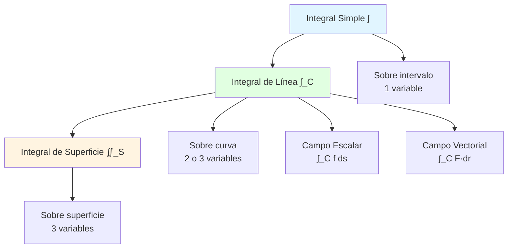
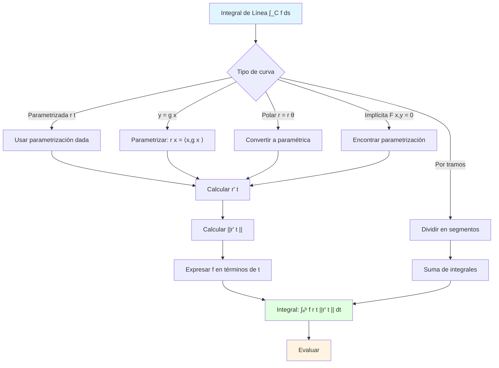

# 📏 Integrales de Línea Escalares

## 🎯 Introducción

> [!info]- 💡 ¿Qué es una Integral de Línea Escalar? La **integral de línea escalar** es una extensión de la integral definida que permite integrar funciones a lo largo de curvas en el plano o el espacio. Mientras que las integrales definidas integran sobre intervalos rectos y las integrales dobles sobre regiones planas, **las integrales de línea integran sobre trayectorias curvas**.
> 
> **Analogía práctica:** Imagina que necesitas calcular el costo total de pintar una cerca curva:
> 
> - **Integral simple (1D):** Costo de pintar una cerca recta
> - **Integral de línea:** Costo de pintar una cerca que sigue una curva
> - El costo por unidad de longitud puede variar (función f(x,y))
> - Debes considerar cada pequeño segmento de la curva (elemento de arco ds)
> 
> **¿Por qué son importantes?**
> 
> |Aspecto|Descripción|Ejemplo de Uso|
> |---|---|---|
> |**Masa de alambre**|Calcular masa de alambre con densidad variable|Cables, alambres compuestos|
> |**Trabajo**|Trabajo realizado al mover un objeto sobre una trayectoria|Física, ingeniería|
> |**Área de superficie**|Superficie de valla o cortina sobre curva|Construcción, diseño|
> |**Promedio sobre curva**|Valor promedio de función sobre trayectoria|Temperatura a lo largo de un camino|
> |**Centro de masa**|Centro de masa de alambre curvo|Diseño estructural|
> |**Longitud de arco**|Longitud de curvas complejas|Geometría, cartografía|



---

## 📐 Conceptos Fundamentales

### 🎨 Curvas Parametrizadas

> [!example]- 📍 Representación de Curvas
> 
> **Definición:**
> 
> Una **curva parametrizada** en el plano o espacio es una función vectorial:
> 
> $$\mathbf{r}(t) = \begin{cases} \langle x(t), y(t) \rangle & \text{en } \mathbb{R}^2 \ \langle x(t), y(t), z(t) \rangle & \text{en } \mathbb{R}^3 \end{cases}$$
> 
> donde $t \in [a,b]$ es el **parámetro**.
> 
> **Componentes:**
> 
> - $\mathbf{r}(t)$: Vector posición
> - $x(t), y(t), z(t)$: Funciones coordenadas
> - $[a,b]$: Intervalo paramétrico
> - $C$: Curva trazada (imagen de $\mathbf{r}$)
> 
> **Visualización:**
> 
> ```
> Curva en el plano:
> 
>      y
>      │      ●───────● r(b)
>      │    ╱   C    
>      │  ╱      
>      │╱ 
>      ●───────────── x
>     r(a)
>     
> Parametrización: r(t) = ⟨x(t), y(t)⟩
> Cuando t varía de a a b, el punto se mueve sobre C
> ```
> 
> **Ejemplos básicos:**
> 
> |Curva|Parametrización|Intervalo|Descripción|
> |---|---|---|---|
> |**Segmento**|$\mathbf{r}(t) = (1-t)\mathbf{a} + t\mathbf{b}$|$[0,1]$|De punto a a punto b|
> |**Círculo**|$\mathbf{r}(t) = \langle R\cos t, R\sin t \rangle$|$[0,2\pi]$|Radio R, centro origen|
> |**Hélice**|$\mathbf{r}(t) = \langle a\cos t, a\sin t, bt \rangle$|$[0,2\pi]$|Espiral en 3D|
> |**Parábola**|$\mathbf{r}(t) = \langle t, t^2 \rangle$|$[a,b]$|y = x²|
> |**Elipse**|$\mathbf{r}(t) = \langle a\cos t, b\sin t \rangle$|$[0,2\pi]$|Semiejes a, b|
> 
> **Ejemplo detallado:**
> 
> ```
> Parametrizar el semicírculo superior de radio 2 de izquierda a derecha
> 
> Curva: x² + y² = 4, y ≥ 0, desde (-2,0) hasta (2,0)
> 
> Parametrización:
> r(t) = ⟨2cos t, 2sin t⟩, t ∈ [0,π]
> 
> Verificación:
> - En t=0: r(0) = ⟨2,0⟩ ✗ (queremos (-2,0))
> 
> Corregir (recorrer en sentido contrario):
> r(t) = ⟨2cos(π-t), 2sin(π-t)⟩
>      = ⟨-2cos t, 2sin t⟩, t ∈ [0,π]
> 
> Verificación:
> - t=0: r(0) = ⟨-2,0⟩ ✓
> - t=π: r(π) = ⟨2,0⟩ ✓
> - x² + y² = 4cos²t + 4sin²t = 4 ✓
> ```
> 
> **Propiedades importantes:**
> 
> ```mermaid
> graph TB
>     A[Curva C] --> B{Propiedades}
>     
>     B --> C[Orientación]
>     B --> D[Suavidad]
>     B --> E[Cerrada vs Abierta]
>     
>     C --> F[Dirección del recorrido<br/>según t crece]
>     D --> G[r'(t) continua<br/>y no nula]
>     E --> H[r(a) = r(b)?]
>     
>     style A fill:#e1f5ff
>     style C fill:#fff4e1
>     style D fill:#e1ffe1
> ```

### 📏 Longitud de Arco

> [!note]- 📐 Elemento Diferencial de Arco
> 
> **Vector tangente:**
> 
> La derivada de $\mathbf{r}(t)$ es el **vector tangente**:
> 
> $$\mathbf{r}'(t) = \frac{d\mathbf{r}}{dt} = \left\langle \frac{dx}{dt}, \frac{dy}{dt}, \frac{dz}{dt} \right\rangle$$
> 
> **Elemento de arco:**
> 
> El elemento diferencial de longitud de arco es:
> 
> $$ds = |\mathbf{r}'(t)| , dt = \sqrt{\left(\frac{dx}{dt}\right)^2 + \left(\frac{dy}{dt}\right)^2 + \left(\frac{dz}{dt}\right)^2} , dt$$
> 
> Para curvas en el plano:
> 
> $$ds = \sqrt{\left(\frac{dx}{dt}\right)^2 + \left(\frac{dy}{dt}\right)^2} , dt$$
> 
> **Interpretación geométrica:**
> 
> ```
> Elemento de arco:
> 
>     r(t+Δt) ●
>            ╱│
>        Δs╱ │Δr
>         ╱  │
>        ●───┘
>      r(t)
>      
> Cuando Δt → 0:
> Δs ≈ ||Δr|| = ||r'(t)|| Δt
> 
> Por tanto: ds = ||r'(t)|| dt
> ```
> 
> **Longitud total de la curva:**
> 
> $$L = \int_C ds = \int_a^b |\mathbf{r}'(t)| , dt$$
> 
> **Fórmulas específicas:**
> 
> |Tipo de curva|Fórmula de ds|
> |---|---|
> |**Plano, param. general**|$ds = \sqrt{(x'(t))^2 + (y'(t))^2} , dt$|
> |**Plano, y=f(x)**|$ds = \sqrt{1 + (f'(x))^2} , dx$|
> |**Plano, polar r=r(θ)**|$ds = \sqrt{r^2 + (r')^2} , d\theta$|
> |**Espacio, param. general**|$ds = \sqrt{(x')^2 + (y')^2 + (z')^2} , dt$|
> 
> **Ejemplos de cálculo:**
> 
> ```
> Ejemplo 1: Longitud de círculo
> r(t) = ⟨R cos t, R sin t⟩, t ∈ [0,2π]
> 
> r'(t) = ⟨-R sin t, R cos t⟩
> ||r'(t)|| = √(R²sin²t + R²cos²t) = √R² = R
> 
> L = ∫₀²π R dt = R[t]₀²π = 2πR ✓
> 
> ---
> 
> Ejemplo 2: Longitud de hélice
> r(t) = ⟨a cos t, a sin t, bt⟩, t ∈ [0,2π]
> 
> r'(t) = ⟨-a sin t, a cos t, b⟩
> ||r'(t)|| = √(a²sin²t + a²cos²t + b²) = √(a² + b²)
> 
> L = ∫₀²π √(a² + b²) dt = 2π√(a² + b²)
> 
> ---
> 
> Ejemplo 3: Curva dada por y=f(x)
> Curva: y = x², x ∈ [0,1]
> 
> Parametrización: r(x) = ⟨x, x²⟩
> ds = √(1 + (dy/dx)²) dx = √(1 + 4x²) dx
> 
> L = ∫₀¹ √(1 + 4x²) dx
> 
> [Sustitución u = 2x, du = 2dx]
> = (1/2)∫₀² √(1 + u²) du
> = (1/2)[u√(1+u²)/2 + (1/2)ln|u + √(1+u²)|]₀²
> = (1/4)[2√5 + ln(2 + √5)]
> ≈ 1.478
> ```

### 🎯 Definición de Integral de Línea Escalar

> [!success]- 📊 Construcción e Interpretación
> 
> **Definición formal:**
> 
> Sea $f(x,y,z)$ una función escalar continua definida sobre una curva suave $C$ parametrizada por $\mathbf{r}(t)$, $t \in [a,b]$. La **integral de línea de f sobre C** es:
> 
> $$\int_C f , ds = \int_a^b f(\mathbf{r}(t)) , |\mathbf{r}'(t)| , dt$$
> 
> **Forma expandida en el plano:**
> 
> $$\int_C f(x,y) , ds = \int_a^b f(x(t), y(t)) \sqrt{\left(\frac{dx}{dt}\right)^2 + \left(\frac{dy}{dt}\right)^2} , dt$$
> 
> **Forma expandida en el espacio:**
> 
> $$\int_C f(x,y,z) , ds = \int_a^b f(x(t), y(t), z(t)) \sqrt{\left(\frac{dx}{dt}\right)^2 + \left(\frac{dy}{dt}\right)^2 + \left(\frac{dz}{dt}\right)^2} , dt$$
> 
> **Construcción intuitiva:**
> 
> ```
> Idea: Sumar f(x,y) · (pequeño arco)
> 
>     C: ●─────●─────●─────●
>        f₁·Δs₁ f₂·Δs₂ f₃·Δs₃
>        
> Suma de Riemann: Σ f(xᵢ,yᵢ) · Δsᵢ
> 
> Límite cuando Δsᵢ → 0: ∫_C f ds
> ```
> 
> **Interpretaciones físicas:**
> 
> |Contexto|f(x,y,z) representa|∫_C f ds calcula|
> |---|---|---|
> |**Masa de alambre**|Densidad lineal ρ(x,y,z)|Masa total|
> |**Costo**|Costo por unidad de longitud|Costo total|
> |**Temperatura**|Temperatura T(x,y,z)|Promedio: (∫_C T ds)/L|
> |**Pintura**|Grosor por unidad|Área de pintura|
> |**f = 1**|Constante 1|Longitud de C|
> 
> **Propiedades:**
> 
> ```mermaid
> graph TB
>     A[Propiedades de ∫_C f ds] --> B[Linealidad]
>     A --> C[Aditividad]
>     A --> D[Independencia<br/>de parametrización]
>     
>     B --> E[∫_C αf+βg ds =<br/>α∫_C f ds + β∫_C g ds]
>     C --> F[∫_C f ds = ∫_C₁ f ds + ∫_C₂ f ds<br/>si C = C₁ ∪ C₂]
>     D --> G[El valor no depende<br/>de cómo parametricemos C]
>     
>     style A fill:#e1f5ff
>     style D fill:#e1ffe1
> ```
> 
> **Independencia de la parametrización:**
> 
> ```
> Teorema: Si r₁(t) y r₂(u) parametrizan la misma curva C
> con la misma orientación, entonces:
> 
> ∫_a^b f(r₁(t)) ||r₁'(t)|| dt = ∫_c^d f(r₂(u)) ||r₂'(u)|| du
> 
> Ejemplo:
> Círculo unitario puede parametrizarse como:
> 
> r₁(t) = ⟨cos t, sin t⟩, t ∈ [0,2π]
> r₂(u) = ⟨cos 2u, sin 2u⟩, u ∈ [0,π]
> 
> Ambas dan la misma integral de línea (con orientación correcta)
> ```

---

## 🔧 Técnicas de Cálculo

### 📝 Método General de Evaluación

> [!tip]- 🎓 Proceso Paso a Paso
> 
> **Algoritmo general:**
> 
> ```mermaid
> flowchart TD
>     A[Problema: ∫_C f ds] --> B[Paso 1: Parametrizar C]
>     B --> C[r(t), t ∈ [a,b]]
>     C --> D[Paso 2: Calcular r'(t)]
>     D --> E[Paso 3: Calcular ||r'(t)||]
>     E --> F[Paso 4: Expresar f en<br/>términos de t]
>     F --> G[Paso 5: Plantear integral<br/>∫ₐᵇ f(r(t))||r'(t)|| dt]
>     G --> H[Paso 6: Evaluar integral]
>     
>     style A fill:#e1f5ff
>     style G fill:#e1ffe1
>     style H fill:#fff4e1
> ```
> 
> **Checklist de pasos:**
> 
> 1. ✅ **Parametrizar la curva C**
>     - Identificar tipo de curva
>     - Elegir parámetro apropiado
>     - Verificar orientación
>     - Determinar intervalo [a,b]
> 2. ✅ **Calcular derivada r'(t)**
>     - Derivar cada componente
>     - Simplificar si es posible
> 3. ✅ **Calcular norma ||r'(t)||**
>     - Usar fórmula del elemento de arco
>     - Simplificar radicales
> 4. ✅ **Sustituir en f**
>     - Reemplazar x, y, z por x(t), y(t), z(t)
>     - Simplificar la expresión
> 5. ✅ **Evaluar integral resultante**
>     - Usar técnicas estándar
>     - Verificar límites
> 
> **Plantilla de trabajo:**
> 
> ```
> Problema: Calcular ∫_C f ds donde...
> 
> Paso 1 - Parametrización:
> r(t) = ⟨ _____, _____, _____ ⟩
> t ∈ [___, ___]
> 
> Paso 2 - Derivada:
> r'(t) = ⟨ _____, _____, _____ ⟩
> 
> Paso 3 - Norma:
> ||r'(t)|| = √(_____)² + (_____)² + (_____)²
>          = _____
> 
> Paso 4 - Función en términos de t:
> f(r(t)) = _____
> 
> Paso 5 - Integral:
> ∫_C f ds = ∫ₐᵇ (_____)(_____) dt
>          = ∫ₐᵇ _____ dt
> 
> Paso 6 - Evaluación:
> = [_____]ₐᵇ
> = _____
> ```

### 💡 Ejemplos Resueltos Detallados

> [!example]- 🎯 Casos Fundamentales
> 
> **Ejemplo 1: Segmento de recta**
> 
> ```
> Calcular ∫_C xy ds donde C es el segmento de (0,0) a (2,4)
> 
> Paso 1 - Parametrización:
> r(t) = (1-t)⟨0,0⟩ + t⟨2,4⟩ = ⟨2t, 4t⟩
> t ∈ [0,1]
> 
> Verificación:
> t=0: r(0) = ⟨0,0⟩ ✓
> t=1: r(1) = ⟨2,4⟩ ✓
> 
> Paso 2 - Derivada:
> r'(t) = ⟨2, 4⟩
> 
> Paso 3 - Norma:
> ||r'(t)|| = √(4 + 16) = √20 = 2√5
> 
> Paso 4 - Función:
> f(x,y) = xy
> f(r(t)) = (2t)(4t) = 8t²
> 
> Paso 5 - Integral:
> ∫_C xy ds = ∫₀¹ 8t² · 2√5 dt
>           = 16√5 ∫₀¹ t² dt
>           = 16√5 [t³/3]₀¹
>           = 16√5/3
> 
> Respuesta: 16√5/3 ≈ 11.93
> ```
> 
> **Ejemplo 2: Arco de círculo**
> 
> ```
> Calcular ∫_C (x² + y²) ds donde C es el semicírculo superior
> de radio 3 de izquierda a derecha
> 
> Paso 1 - Parametrización:
> r(t) = ⟨-3cos t, 3sin t⟩, t ∈ [0,π]
> 
> Verificación:
> t=0: r(0) = ⟨-3,0⟩ ✓
> t=π: r(π) = ⟨3,0⟩ ✓
> 
> Paso 2 - Derivada:
> r'(t) = ⟨3sin t, 3cos t⟩
> 
> Paso 3 - Norma:
> ||r'(t)|| = √(9sin²t + 9cos²t) = 3
> 
> Paso 4 - Función:
> x² + y² = 9cos²t + 9sin²t = 9
> 
> Paso 5 - Integral:
> ∫_C (x²+y²) ds = ∫₀π 9 · 3 dt
>                = 27∫₀π dt
>                = 27[t]₀π
>                = 27π
> 
> Respuesta: 27π ≈ 84.82
> ```
> 
> **Ejemplo 3: Curva dada explícitamente**
> 
> ```
> Calcular ∫_C y ds donde C es la curva y = x² de (0,0) a (2,4)
> 
> Método 1 - Parametrización natural (x como parámetro):
> 
> r(x) = ⟨x, x²⟩, x ∈ [0,2]
> 
> r'(x) = ⟨1, 2x⟩
> ||r'(x)|| = √(1 + 4x²)
> 
> f(x,y) = y → f(r(x)) = x²
> 
> ∫_C y ds = ∫₀² x² √(1 + 4x²) dx
> 
> Sustitución: u = 1 + 4x², du = 8x dx
> Cuando x=0: u=1; cuando x=2: u=17
> 
> También necesitamos x² = (u-1)/4
> 
> = ∫₁¹⁷ ((u-1)/4) · √u · (du/(8x))
> 
> [Este enfoque se complica, mejor usar otro método]
> 
> Método 2 - Parametrización con t:
> 
> r(t) = ⟨t, t²⟩, t ∈ [0,2]
> r'(t) = ⟨1, 2t⟩
> ||r'(t)|| = √(1 + 4t²)
> 
> f(r(t)) = t²
> 
> ∫_C y ds = ∫₀² t² √(1 + 4t²) dt
> 
> Sustitución trigonométrica: 2t = tan θ
> t = (tan θ)/2, dt = (sec²θ/2) dθ
> √(1 + 4t²) = sec θ
> 
> Cuando t=0: θ=0
> Cuando t=2: θ=arctan(4)
> 
> = ∫₀^arctan(4) (tan²θ/4) · sec θ · (sec²θ/2) dθ
> = (1/8) ∫₀^arctan(4) tan²θ sec³θ dθ
> 
> [Integral compleja, resultado numérico ≈ 8.35]
> ```
> 
> **Ejemplo 4: Hélice en 3D**
> 
> ```
> Calcular ∫_C z ds donde C es la hélice
> r(t) = ⟨2cos t, 2sin t, 3t⟩, t ∈ [0,2π]
> 
> Paso 1 - Ya tenemos parametrización
> 
> Paso 2 - Derivada:
> r'(t) = ⟨-2sin t, 2cos t, 3⟩
> 
> Paso 3 - Norma:
> ||r'(t)|| = √(4sin²t + 4cos²t + 9)
>          = √(4 + 9) = √13
> 
> Paso 4 - Función:
> f(x,y,z) = z
> f(r(t)) = 3t
> 
> Paso 5 - Integral:
> ∫_C z ds = ∫₀²π 3t · √13 dt
>          = 3√13 ∫₀²π t dt
>          = 3√13 [t²/2]₀²π
>          = 3√13 · 2π²
>          = 6π²√13
> 
> Respuesta: 6π²√13 ≈ 213.3
> ```

### 🔄 Curvas Definidas por Tramos

> [!warning]- ✂️ Curvas No Suaves
> 
> **Concepto:**
> 
> Si la curva C consiste en varios segmentos suaves C₁, C₂, ..., Cₙ:
> 
> $$\int_C f , ds = \int_{C_1} f , ds + \int_{C_2} f , ds + \cdots + \int_{C_n} f , ds$$
> 
> **Proceso:**
> 
> ```mermaid
> flowchart TD
>     A[Curva C por tramos] --> B[Identificar segmentos<br/>C₁, C₂, ..., Cₙ]
>     B --> C[Parametrizar cada<br/>segmento]
>     C --> D[Calcular ∫_Cᵢ f ds<br/>para cada i]
>     D --> E[Sumar todos<br/>los resultados]
>     
>     style A fill:#e1f5ff
>     style E fill:#e1ffe1
> ```
> 
> **Ejemplo completo:**
> 
> ```
> Calcular ∫_C x ds donde C es el triángulo con vértices
> (0,0), (1,0), (0,1) recorrido en sentido antihorario
> 
> C = C₁ ∪ C₂ ∪ C₃
> 
> Segmento C₁: de (0,0) a (1,0)
> r₁(t) = ⟨t, 0⟩, t ∈ [0,1]
> r₁'(t) = ⟨1, 0⟩
> ||r₁'(t)|| = 1
> f(r₁(t)) = t
> 
> ∫_C₁ x ds = ∫₀¹ t · 1 dt = [t²/2]₀¹ = 1/2
> 
> Segmento C₂: de (1,0) a (0,1)
> r₂(t) = (1-t)⟨1,0⟩ + t⟨0,1⟩ = ⟨1-t, t⟩, t ∈ [0,1]
> r₂'(t) = ⟨-1, 1⟩
> ||r₂'(t)|| = √2
> f(r₂(t)) = 1-t
> 
> ∫_C₂ x ds = ∫₀¹ (1-t)√2 dt
>           = √2 [t - t²/2]₀¹
>           = √2 (1 - 1/2)
>           = √2/2
> 
> Segmento C₃: de (0,1) a (0,0)
> r₃(t) = ⟨0, 1-t⟩, t ∈ [0,1]
> r₃'(t) = ⟨0, -1⟩
> ||r₃'(t)|| = 1
> f(r₃(t)) = 0
> 
> ∫_C₃ x ds = ∫₀¹ 0 · 1 dt = 0
> 
> Total:
> ∫_C x ds = 1/2 + √2/2 + 0 = (1 + √2)/2 ≈ 1.207
> ```
> 
> **Estrategia para esquinas:**
> 
> |Situación|Acción|
> |---|---|
> |Esquina en punto P|Dividir curva en P|
> |Cada lado es suave|Parametrizar por separado |

> | Verificar continuidad | r₁(b) = r₂(a) en unión | | Cálculo | Sumar integrales |

---

## 🎨 Aplicaciones Físicas

### ⚖️ Masa y Centro de Masa de Alambre

> [!success]- 🔩 Propiedades de Alambres Curvos
> 
> **Densidad lineal:**
> 
> Si ρ(x,y,z) es la densidad (masa por unidad de longitud) en el punto (x,y,z):
> 
> |Propiedad|Fórmula|Unidades|
> |---|---|---|
> |**Masa total**|$m = \int_C \rho(x,y,z) , ds$|kg (o g)|
> |**Momento respecto al plano yz**|$M_{yz} = \int_C x \cdot \rho , ds$|kg·m|
> |**Momento respecto al plano xz**|$M_{xz} = \int_C y \cdot \rho , ds$|kg·m|
> |**Momento respecto al plano xy**|$M_{xy} = \int_C z \cdot \rho , ds$|kg·m|
> |**Centro de masa**|$(\bar{x}, \bar{y}, \bar{z}) = \left(\frac{M_{yz}}{m}, \frac{M_{xz}}{m}, \frac{M_{xy}}{m}\right)$|m|
> 
> **En el plano (2D):**
> 
> $$\bar{x} = \frac{1}{m}\int_C x\rho , ds, \quad \bar{y} = \frac{1}{m}\int_C y\rho , ds$$
> 
> **Interpretación:**
> 
> - **Masa:** Total del material del alambre
> - **Momentos:** Miden distribución de masa respecto a planos
> - **Centro de masa:** Punto de equilibrio del alambre
> 
> **Ejemplo completo:**
> 
> ```
> Un alambre tiene forma de semicírculo x² + y² = 4, y ≥ 0
> con densidad ρ(x,y) = y. Encontrar masa y centro de masa.
> 
> Paso 1 - Parametrización:
> r(t) = ⟨2cos t, 2sin t⟩, t ∈ [0,π]
> r'(t) = ⟨-2sin t, 2cos t⟩
> ||r'(t)|| = 2
> 
> Paso 2 - Masa:
> ρ(r(t)) = 2sin t
> 
> m = ∫_C y ds = ∫₀π 2sin t · 2 dt
>   = 4∫₀π sin t dt
>   = 4[-cos t]₀π
>   = 4(1 - (-1))
>   = 8
> 
> Paso 3 - Momento M_yz (respecto al eje y):
> M_yz = ∫_C x · ρ ds = ∫₀π 2cos t · 2sin t · 2 dt
>      = 8∫₀π cos t sin t dt
>      = 8∫₀π (1/2)sin(2t) dt
>      = 4[-cos(2t)/2]₀π
>      = -2[cos(2π) - cos(0)]
>      = -2[1 - 1] = 0
> 
> Paso 4 - Momento M_xz (respecto al eje x):
> M_xz = ∫_C y · ρ ds = ∫₀π 2sin t · 2sin t · 2 dt
>      = 8∫₀π sin²t dt
>      = 8∫₀π (1 - cos(2t))/2 dt
>      = 4∫₀π (1 - cos(2t)) dt
>      = 4[t - sin(2t)/2]₀π
>      = 4π
> 
> Paso 5 - Centro de masa:
> x̄ = M_yz/m = 0/8 = 0
> ȳ = M_xz/m = 4π/8 = π/2 ≈ 1.571
> 
> Centro de masa: (0, π/2)
> 
> Interpretación: Por simetría, x̄ = 0 (sobre el eje y)
> ```
> 
> **Caso especial - densidad constante:**
> 
> ```
> Si ρ(x,y,z) = k (constante):
> 
> m = k · L (longitud de C)
> 
> x̄ = ∫_C x ds / L  (centroide geométrico)
> ȳ = ∫_C y ds / L
> z̄ = ∫_C z ds / L
> 
> El centro de masa coincide con el centroide geométrico
> ```

### 📊 Valor Promedio sobre una Curva

> [!tip]- 📈 Promedio de Función sobre Trayectoria
> 
> **Definición:**
> 
> El **valor promedio** de una función f sobre una curva C es:
> 
> $$f_{\text{prom}} = \frac{1}{L} \int_C f , ds$$
> 
> donde $L = \int_C ds$ es la longitud de C.
> 
> **Interpretación:**
> 
> - Similar al promedio en cálculo de una variable
> - Representa el valor "típico" de f a lo largo de C
> - Si f es temperatura, da temperatura promedio sobre la trayectoria
> 
> **Ejemplo:**
> 
> ```
> Encontrar la temperatura promedio a lo largo del segmento
> de recta de (0,0) a (2,2) si T(x,y) = x² + y²
> 
> Paso 1 - Parametrización:
> r(t) = ⟨2t, 2t⟩, t ∈ [0,1]
> r'(t) = ⟨2, 2⟩
> ||r'(t)|| = 2√2
> 
> Paso 2 - Longitud:
> L = ∫₀¹ 2√2 dt = 2√2
> 
> Paso 3 - Integral:
> T(r(t)) = 4t² + 4t² = 8t²
> 
> ∫_C T ds = ∫₀¹ 8t² · 2√2 dt
>          = 16√2 ∫₀¹ t² dt
>          = 16√2 [t³/3]₀¹
>          = 16√2/3
> 
> Paso 4 - Promedio:
> T_prom = (16√2/3)/(2√2) = 16/(3·2) = 8/3 ≈ 2.667
> 
> Temperatura promedio: 8/3 ≈ 2.67°
> ```

### 🏗️ Área de Superficie Lateral

> [!example]- 🎪 Superficie Generada por Revolución
> 
> **Concepto:**
> 
> Si una curva C en el plano xy se gira alrededor del eje x (o y), genera una superficie de revolución.
> 
> **Fórmulas:**
> 
> |Revolución alrededor|Fórmula de área|
> |---|---|
> |**Eje x**|$A = \int_C 2\pi y , ds$|
> |**Eje y**|$A = \int_C 2\pi x , ds$|
> 
> **Interpretación:**
> 
> - En cada punto, el elemento ds barre un anillo
> - Radio del anillo: distancia al eje
> - Circunferencia: 2π × (distancia al eje)
> - Área del anillo: circunferencia × ds
> 
> **Ejemplo:**
> 
> ```
> Encontrar el área de superficie generada al girar
> y = √x, 0 ≤ x ≤ 4 alrededor del eje x
> 
> Paso 1 - Parametrización:
> r(x) = ⟨x, √x⟩, x ∈ [0,4]
> 
> Paso 2 - Elemento de arco:
> r'(x) = ⟨1, 1/(2√x)⟩
> ||r'(x)|| = √(1 + 1/(4x)) = √((4x + 1)/(4x))
> 
> ds = √(1 + 1/(4x)) dx
> 
> Paso 3 - Área:
> A = ∫_C 2πy ds
>   = ∫₀⁴ 2π√x · √((4x+1)/(4x)) dx
>   = 2π ∫₀⁴ √x · √(4x+1)/(2√x) dx
>   = π ∫₀⁴ √(4x+1) dx
> 
> Sustitución: u = 4x+1, du = 4dx
> Cuando x=0: u=1; cuando x=4: u=17
> 
>   = π ∫₁¹⁷ √u · (du/4)
>   = (π/4) · [2u^(3/2)/3]₁¹⁷
>   = (π/6)[17^(3/2) - 1]
>   = (π/6)[17√17 - 1]
>   ≈ 36.18
> 
> Área de superficie: (π/6)(17√17 - 1) ≈ 36.18 unidades²
> ```

---

## 🔄 Casos Especiales y Técnicas

### 📐 Curvas en Coordenadas Polares

> [!note]- 🌀 Integración en Polares
> 
> **Conversión:**
> 
> Si la curva está dada en polares como $r = r(\theta)$:
> 
> $$\begin{cases} x = r(\theta)\cos\theta \ y = r(\theta)\sin\theta \end{cases}$$
> 
> **Elemento de arco:**
> 
> $$ds = \sqrt{r^2 + \left(\frac{dr}{d\theta}\right)^2} , d\theta$$
> 
> **Demostración:**
> 
> ```
> r(θ) = ⟨r(θ)cos θ, r(θ)sin θ⟩
> 
> dr/dθ = ⟨r'cos θ - r sin θ, r'sin θ + r cos θ⟩
> 
> ||dr/dθ||² = (r'cos θ - r sin θ)² + (r'sin θ + r cos θ)²
>            = r'²cos²θ - 2rr'cos θ sin θ + r²sin²θ
>              + r'²sin²θ + 2rr'sin θ cos θ + r²cos²θ
>            = r'²(cos²θ + sin²θ) + r²(sin²θ + cos²θ)
>            = r'² + r²
> 
> Por tanto: ds = √(r² + (r')²) dθ
> ```
> 
> **Ejemplo:**
> 
> ```
> Calcular la longitud de la cardioide r = 1 + cos θ
> 
> r'(θ) = -sin θ
> 
> ds = √((1 + cos θ)² + sin²θ) dθ
>    = √(1 + 2cos θ + cos²θ + sin²θ) dθ
>    = √(2 + 2cos θ) dθ
>    = √(2(1 + cos θ)) dθ
> 
> Identidad: 1 + cos θ = 2cos²(θ/2)
> 
> ds = √(4cos²(θ/2)) dθ = 2|cos(θ/2)| dθ
> 
> Para θ ∈ [0,2π], cos(θ/2) ≥ 0 en [0,π]
> 
> L = ∫₀²π 2cos(θ/2) dθ
>   = 2 · 2[sin(θ/2)]₀²π
>   = 4[sin π - sin 0]
>   = 4[0 - 0]
> 
> Espera, esto es incorrecto. Dividamos:
> 
> L = ∫₀π 2cos(θ/2) dθ + ∫π²π 2|cos(θ/2)| dθ
> 
> En [π,2π], θ/2 ∈ [π/2,π], entonces cos(θ/2) ≤ 0
> 
> L = ∫₀π 2cos(θ/2) dθ + ∫π²π -2cos(θ/2) dθ
>   = 4[sin(θ/2)]₀π - 4[sin(θ/2)]π²π
>   = 4[1 - 0] - 4[0 - 1]
>   = 4 + 4 = 8
> 
> Longitud de cardioide: 8 unidades
> ```

### 🔀 Curvas Definidas Implícitamente

> [!warning]- ⚙️ Cuando F(x,y) = 0
> 
> **Estrategia:**
> 
> Si la curva está dada implícitamente por F(x,y) = 0:
> 
> 1. **Parametrizar usando variable apropiada**
>     - Despejar y = y(x) si es posible
>     - O despejar x = x(y)
>     - O usar parámetro auxiliar (como θ)
> 2. **Usar diferenciación implícita**
>     - Para encontrar dy/dx si usamos x como parámetro
>     - $ds = \sqrt{1 + (dy/dx)^2} , dx$
> 
> **Ejemplo:**
> 
> ```
> Calcular ∫_C xy ds donde C es el arco de elipse
> x²/4 + y²/9 = 1 en el primer cuadrante
> 
> Solución - parametrización estándar de elipse:
> 
> x = 2cos t, y = 3sin t, t ∈ [0,π/2]
> 
> r'(t) = ⟨-2sin t, 3cos t⟩
> ||r'(t)|| = √(4sin²t + 9cos²t)
> 
> f(r(t)) = (2cos t)(3sin t) = 6cos t sin t = 3sin(2t)
> 
> ∫_C xy ds = ∫₀^(π/2) 3sin(2t) √(4sin²t + 9cos²t) dt
> 
> [Esta integral no tiene forma cerrada simple, se resuelve numéricamente]
> ```

---

## 📊 Resumen Visual Completo

### Diagrama de Flujo General



> [!note]- 📋 Tablas de Referencia Rápida
> 
> ### Fórmulas de Elemento de Arco
> 
> |Tipo de curva|ds|
> |---|---|
> |**Param. general (plano)**|$\sqrt{(dx/dt)^2 + (dy/dt)^2} , dt$|
> |**Param. general (espacio)**|$\sqrt{(dx/dt)^2 + (dy/dt)^2 + (dz/dt)^2} , dt$|
> |**y = f(x)**|$\sqrt{1 + (dy/dx)^2} , dx$|
> |**x = g(y)**|$\sqrt{1 + (dx/dy)^2} , dy$|
> |**Polar r = r(θ)**|$\sqrt{r^2 + (dr/d\theta)^2} , d\theta$|
> 
> ### Aplicaciones Principales
> 
> |Aplicación|Fórmula|
> |---|---|
> |**Longitud**|$L = \int_C ds$|
> |**Masa**|$m = \int_C \rho , ds$|
> |**Centro de masa (x̄)**|$\bar{x} = \frac{1}{m}\int_C x\rho , ds$|
> |**Centro de masa (ȳ)**|$\bar{y} = \frac{1}{m}\int_C y\rho , ds$|
> |**Valor promedio**|$f_{prom} = \frac{1}{L}\int_C f , ds$|
> |**Sup. revolución (eje x)**|$A = \int_C 2\pi y , ds$|
> |**Sup. revolución (eje y)**|$A = \int_C 2\pi x , ds$|
> 
> ### Checklist de Resolución
> 
> - [ ] Identificar la curva C y sus límites
> - [ ] Elegir parametrización apropiada r(t), t ∈ [a,b]
> - [ ] Calcular r'(t)
> - [ ] Calcular ||r'(t)|| y simplificar
> - [ ] Expresar f en términos del parámetro
> - [ ] Plantear integral ∫ₐᵇ f(r(t))||r'(t)|| dt
> - [ ] Evaluar usando técnicas de integración
> - [ ] Verificar unidades y coherencia del resultado

---

## 🎓 Ejercicios Progresivos

> [!example]- 💪 Práctica con Soluciones Detalladas
> 
> **Nivel Básico:**
> 
> **Ejercicio 1: Segmento de recta simple**
> 
> ```
> Calcular ∫_C (x + y) ds donde C es el segmento de (1,0) a (0,1)
> 
> Solución:
> r(t) = (1-t)⟨1,0⟩ + t⟨0,1⟩ = ⟨1-t, t⟩, t ∈ [0,1]
> 
> r'(t) = ⟨-1, 1⟩
> ||r'(t)|| = √2
> 
> f(r(t)) = (1-t) + t = 1
> 
> ∫_C (x+y) ds = ∫₀¹ 1 · √2 dt = √2
> 
> Respuesta: √2 ≈ 1.414
> ```
> 
> **Ejercicio 2: Arco de circunferencia**
> 
> ```
> Calcular ∫_C ds (longitud) donde C es el cuarto de círculo
> x² + y² = 9 en el primer cuadrante
> 
> Solución:
> r(t) = ⟨3cos t, 3sin t⟩, t ∈ [0,π/2]
> 
> r'(t) = ⟨-3sin t, 3cos t⟩
> ||r'(t)|| = 3
> 
> L = ∫_C ds = ∫₀^(π/2) 3 dt = 3π/2
> 
> Respuesta: 3π/2 ≈ 4.712
> ```
> 
> **Nivel Intermedio:**
> 
> **Ejercicio 3: Masa de alambre**
> 
> ```
> Un alambre tiene forma de semicírculo x² + y² = 16, y ≥ 0
> con densidad ρ(x,y) = x² + y². Calcular su masa.
> 
> Solución:
> r(t) = ⟨4cos t, 4sin t⟩, t ∈ [0,π]
> r'(t) = ⟨-4sin t, 4cos t⟩
> ||r'(t)|| = 4
> 
> ρ(r(t)) = 16cos²t + 16sin²t = 16
> 
> m = ∫_C ρ ds = ∫₀π 16 · 4 dt
>   = 64∫₀π dt
>   = 64π
> 
> Masa: 64π ≈ 201.06 unidades
> ```
> 
> **Ejercicio 4: Integral sobre curva explícita**
> 
> ```
> Calcular ∫_C x²y ds donde C es y = x³ de (0,0) a (1,1)
> 
> Solución:
> r(x) = ⟨x, x³⟩, x ∈ [0,1]
> r'(x) = ⟨1, 3x²⟩
> ||r'(x)|| = √(1 + 9x⁴)
> 
> f(r(x)) = x² · x³ = x⁵
> 
> ∫_C x²y ds = ∫₀¹ x⁵√(1 + 9x⁴) dx
> 
> Sustitución: u = 1 + 9x⁴, du = 36x³ dx
> x⁵ dx = x² · x³ dx = ((u-1)/9) · (du/36)
> 
> Cuando x=0: u=1; cuando x=1: u=10
> 
> = ∫₁¹⁰ ((u-1)/9) · √u · (1/36x³) du
> 
> [Requiere volver a x, integral compleja]
> 
> Resultado numérico ≈ 0.643
> ```
> 
> **Nivel Avanzado:**
> 
> **Ejercicio 5: Centro de masa de hélice**
> 
> ```
> Encontrar el centro de masa de la hélice
> r(t) = ⟨cos t, sin t, t⟩, t ∈ [0,2π]
> con densidad constante ρ = 1
> 
> Solución:
> 
> Paso 1 - Longitud (= masa con ρ=1):
> r'(t) = ⟨-sin t, cos t, 1⟩
> ||r'(t)|| = √(sin²t + cos²t + 1) = √2
> 
> m = L = ∫₀²π √2 dt = 2π√2
> 
> Paso 2 - Momentos:
> M_yz = ∫_C x ds = ∫₀²π cos t · √2 dt
>      = √2[sin t]₀²π = 0
> 
> M_xz = ∫_C y ds = ∫₀²π sin t · √2 dt
>      = √2[-cos t]₀²π
>      = √2[(-1) - (-1)] = 0
> 
> M_xy = ∫_C z ds = ∫₀²π t · √2 dt
>      = √2[t²/2]₀²π
>      = √2 · 2π²
>      = 2π²√2
> 
> Paso 3 - Centro de masa:
> x̄ = 0/(2π√2) = 0
> ȳ = 0/(2π√2) = 0
> z̄ = (2π²√2)/(2π√2) = π
> 
> Centro de masa: (0, 0, π)
> 
> Interpretación: La hélice es simétrica en x,y
> Su centro está a mitad de altura: z̄ = 2π/2 = π ✓
> ```
> 
> **Ejercicio 6: Curva por tramos**
> 
> ```
> Calcular ∫_C y² ds donde C es la frontera del cuadrado
> [0,1] × [0,1] recorrido en sentido antihorario
> 
> Solución:
> C = C₁ ∪ C₂ ∪ C₃ ∪ C₄
> 
> C₁: y = 0, x: 0 → 1
> r₁(t) = ⟨t, 0⟩, t ∈ [0,1]
> ||r₁'(t)|| = 1
> ∫_C₁ y² ds = ∫₀¹ 0 dt = 0
> 
> C₂: x = 1, y: 0 → 1
> r₂(t) = ⟨1, t⟩, t ∈ [0,1]
> ||r₂'(t)|| = 1
> ∫_C₂ y² ds = ∫₀¹ t² dt = 1/3
> 
> C₃: y = 1, x: 1 → 0
> r₃(t) = ⟨1-t, 1⟩, t ∈ [0,1]
> ||r₃'(t)|| = 1
> ∫_C₃ y² ds = ∫₀¹ 1 dt = 1
> 
> C₄: x = 0, y: 1 → 0
> r₄(t) = ⟨0, 1-t⟩, t ∈ [0,1]
> ||r₄'(t)|| = 1
> ∫_C₄ y² ds = ∫₀¹ (1-t)² dt
>            = ∫₀¹ (1 - 2t + t²) dt
>            = [t - t² + t³/3]₀¹
>            = 1 - 1 + 1/3 = 1/3
> 
> Total: ∫_C y² ds = 0 + 1/3 + 1 + 1/3 = 5/3
> ```

---

## 🔗 Conexión con Próximos Temas

> [!quote]- 🌟 Continuando el Aprendizaje
> 
> **Has dominado:**
> 
> ```mermaid
> mindmap
>   root((Integrales de<br/>Línea Escalares))
>     Conceptos
>       Curvas parametrizadas
>       Elemento de arco ds
>       Definición formal
>     Cálculo
>       Parametrización
>       Evaluación
>       Curvas por tramos
>     Aplicaciones
>       Longitud
>       Masa
>       Centro de masa
>       Superficie
>     Casos especiales
>       Polares
>       Implícitas
>       Explícitas
> ```
> 
> **Progresión natural:**
> 
> |Nivel|Tema|Conexión|
> |---|---|---|
> |**Actual**|Integrales de línea escalares|Integración sobre curvas|
> |**Siguiente**|Integrales de línea vectoriales|Trabajo y circulación|
> |**Avanzado**|Teorema de Green|Relaciona línea con doble|
> |**Campos**|Campos conservativos|Independencia de trayectoria|
> |**Superficies**|Integrales de superficie|Extensión a 2D en 3D|
> 
> **Roadmap:**
> 
> ```mermaid
> graph LR
>     A[Integrales de<br/>Línea Escalares] --> B[Integrales de<br/>Línea Vectoriales]
>     B --> C[Campos<br/>Conservativos]
>     B --> D[Teorema de Green]
>     C --> E[Teorema de Stokes]
>     D --> E
>     E --> F[Teorema de Gauss]
>     
>     style A fill:#e1ffe1
>     style B fill:#fff4e1
>     style D fill:#e1f5ff
> ```
> 
> **Conceptos clave para lo que sigue:**
> 
> 1. **Parametrización:** Esencial para todos los tipos de integrales de línea
> 2. **Campo vectorial:** Próximo paso natural después de campos escalares
> 3. **Orientación:** Crucial para integrales vectoriales
> 4. **Independencia de trayectoria:** Concepto fundamental en campos conservativos

---

**Tags:** #calculo-vectorial #integrales-linea #escalares #parametrizacion #longitud-arco #masa-alambre #centro-masa #superficie-revolucion #coordenadas-polares #aplicaciones-fisicas