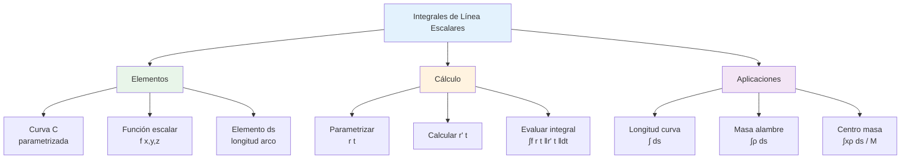

# ∫ Integrales de Línea Escalares

## 🎯 Fundamentos de Integrales de Línea

> [!info]- 💡 Introducción a las Integrales de Línea Escalares Las **integrales de línea escalares** permiten integrar una función escalar a lo largo de una curva en el espacio. A diferencia de las integrales ordinarias que se calculan sobre intervalos rectos, estas integrales se calculan sobre trayectorias curvas en ℝ² o ℝ³.
> 
> **Analogías útiles:**
> 
> - **Física:** Calcular la masa total de un alambre cuya densidad varía a lo largo de su longitud
> - **Ingeniería:** Determinar el trabajo realizado por un campo de fuerzas variable a lo largo de una trayectoria
> - **Geometría:** Calcular el área de una "cortina" que cuelga de una curva
> 
> **Diferencia fundamental:**
> 
> - **Integral ordinaria:** ∫ₐᵇ f(x) dx - integra sobre un intervalo [a,b] en ℝ
> - **Integral de línea:** ∫_C f(x,y,z) ds - integra sobre una curva C en ℝ² o ℝ³
> 
> **Importancia histórica:**
> 
> - **Augustin-Louis Cauchy (1823):** Desarrollo de integrales de línea complejas
> - **Bernhard Riemann (1851):** Generalización de integrales
> - **George Green (1828):** Aplicaciones en física matemática
> - **Carl Friedrich Gauss (1813):** Teoremas de integración vectorial

### 📐 Definición Formal

> [!note]- 🌟 Concepto Matemático de Integral de Línea Escalar **Definición:**
> 
> Sea f(x,y,z) una función escalar continua definida en una curva suave C en ℝ³, parametrizada por:
> 
> **r**(t) = (x(t), y(t), z(t)), donde t ∈ [a,b]
> 
> La **integral de línea escalar** de f sobre C se define como:
> 
> **∫_C f(x,y,z) ds = ∫ₐᵇ f(x(t), y(t), z(t)) ||r'(t)|| dt**
> 
> Donde:
> 
> - **ds** = elemento diferencial de longitud de arco
> - **||r'(t)||** = √[(dx/dt)² + (dy/dt)² + (dz/dt)²] = magnitud del vector velocidad
> - **f(x(t), y(t), z(t))** = función evaluada en la curva parametrizada
> 
> **En ℝ² (caso bidimensional):**
> 
> **∫_C f(x,y) ds = ∫ₐᵇ f(x(t), y(t)) √[(dx/dt)² + (dy/dt)²] dt**
> 
> **Interpretación geométrica:**
> 
> - Si f(x,y,z) ≥ 0, la integral representa el área de la "cortina" cuya base es C y cuya altura en cada punto es f
> - Si f representa densidad lineal, la integral da la masa total

## 🔧 Elementos Diferencial de Arco

### 📏 Elemento ds

> [!warning]- 📐 Diferencial de Longitud de Arco **Definición:**
> 
> El **elemento diferencial de arco ds** representa una longitud infinitesimal a lo largo de la curva C.
> 
> **Fórmula fundamental:**
> 
> Para una curva parametrizada **r**(t) = (x(t), y(t), z(t)):
> 
> **ds = ||r'(t)|| dt = √[(dx/dt)² + (dy/dt)² + (dz/dt)²] dt**
> 
> **Formas equivalentes:**
> 
> 1. **En términos de derivadas:**
>     - ds = √[x'(t)² + y'(t)² + z'(t)²] dt
> 2. **En ℝ² con y = g(x):**
>     - ds = √[1 + (dy/dx)²] dx
> 3. **En coordenadas polares r = r(θ):**
>     - ds = √[r² + (dr/dθ)²] dθ
> 
> **Propiedades importantes:**
> 
> - ds ≥ 0 siempre (es una longitud)
> - ∫_C ds = longitud de la curva C
> - Es independiente de la parametrización (invariante bajo reparametrización)

### 🎨 Visualización de ds

> [!tip]- 👁️ Interpretación Geométrica **Significado intuitivo:**
> 
> Imagina dividir la curva C en pequeños segmentos. Cada segmento tiene una longitud aproximada Δs. Cuando estos segmentos se hacen infinitesimalmente pequeños, obtenemos ds.
> 
> **Aproximación discreta:**
> 
> ```
> Curva C dividida en n partes:
> Longitud total ≈ Σᵢ₌₁ⁿ √[(Δxᵢ)² + (Δyᵢ)² + (Δzᵢ)²]
> 
> En el límite n → ∞:
> Longitud = ∫_C ds
> ```
> 
> **Relación con el teorema de Pitágoras:**
> 
> En un pequeño intervalo [t, t+dt]:
> 
> - Cambio en x: dx = x'(t)dt
> - Cambio en y: dy = y'(t)dt
> - Cambio en z: dz = z'(t)dt
> 
> Por Pitágoras 3D: ds² = dx² + dy² + dz² ds = √[dx² + dy² + dz²]

## 📝 Parametrización de Curvas

### 🔄 Concepto de Parametrización

> [!success]- 🎯 Representación de Curvas **Definición:**
> 
> Una **parametrización** de una curva C es una función vectorial que describe la posición en la curva en función de un parámetro t:
> 
> **r**(t) = (x(t), y(t), z(t)), t ∈ [a,b]
> 
> **Características de una buena parametrización:**
> 
> 1. **Continuidad:** x(t), y(t), z(t) son funciones continuas
> 2. **Diferenciabilidad:** Las derivadas x'(t), y'(t), z'(t) existen
> 3. **Suavidad:** **r'**(t) es continua
> 4. **No degenerada:** **r'**(t) ≠ **0** (excepto quizás en puntos aislados)
> 
> **Parametrizaciones comunes:**
> 
> **1. Segmento de recta de A a B:**
> 
> ```
> r(t) = A + t(B - A) = (1-t)A + tB,  t ∈ [0,1]
> ```
> 
> **2. Circunferencia de radio R:**
> 
> ```
> r(t) = (R cos t, R sin t),  t ∈ [0, 2π]
> r(t) = (R cos t, R sin t, 0),  t ∈ [0, 2π] (en 3D)
> ```
> 
> **3. Hélice circular:**
> 
> ```
> r(t) = (R cos t, R sin t, ct),  t ∈ [a,b]
> ```
> 
> **4. Parábola y = x²:**
> 
> ```
> r(t) = (t, t²),  t ∈ [a,b]
> ```

### 🔀 Reparametrización

> [!note]- 🔄 Cambio de Parámetro **Definición:**
> 
> Una **reparametrización** es un cambio de parámetro que describe la misma curva geométrica.
> 
> Si **r**(t), t ∈ [a,b] es una parametrización de C, entonces **r̃**(u) = **r**(φ(u)), u ∈ [c,d] es otra parametrización si:
> 
> - φ: [c,d] → [a,b] es una función diferenciable
> - φ(c) = a y φ(d) = b
> - φ'(u) > 0 (preserva orientación) o φ'(u) < 0 (invierte orientación)
> 
> **Propiedad fundamental:**
> 
> Las integrales de línea escalares son **independientes de la parametrización** (siempre que preserve la orientación):
> 
> ∫_C f ds es el mismo sin importar cómo parametricemos C
> 
> **Ejemplo:**
> 
> ```
> Semicircunferencia superior de radio 1:
> 
> Parametrización 1: r₁(t) = (cos t, sin t), t ∈ [0,π]
> Parametrización 2: r₂(u) = (u, √(1-u²)), u ∈ [-1,1]
> 
> Ambas describen la misma curva y dan el mismo valor
> para cualquier integral de línea escalar
> ```

## 🧮 Cálculo de Integrales de Línea

### 📋 Procedimiento Paso a Paso

> [!example]- 🎯 Método de Cálculo **Pasos para calcular ∫_C f(x,y,z) ds:**
> 
> **Paso 1: Parametrizar la curva**
> 
> - Encontrar **r**(t) = (x(t), y(t), z(t)), t ∈ [a,b]
> - Identificar el intervalo [a,b]
> 
> **Paso 2: Calcular el vector derivada**
> 
> - **r'**(t) = (x'(t), y'(t), z'(t))
> 
> **Paso 3: Calcular ||r'(t)||**
> 
> - ||**r'**(t)|| = √[x'(t)² + y'(t)² + z'(t)²]
> 
> **Paso 4: Sustituir en f**
> 
> - f(x(t), y(t), z(t))
> 
> **Paso 5: Evaluar la integral**
> 
> - ∫ₐᵇ f(x(t), y(t), z(t)) · ||**r'**(t)|| dt
> 
> **Plantilla de trabajo:**
> 
> ```
> Dado: ∫_C f(x,y,z) ds
> 
> 1. r(t) = _______________
> 2. r'(t) = _______________
> 3. ||r'(t)|| = _______________
> 4. f(r(t)) = _______________
> 5. Integral = ∫ₐᵇ _______________ dt
> 6. Resultado = _______________
> ```

### 📊 Ejemplos Detallados

> [!example]- 💪 Casos Prácticos Resueltos **Ejemplo 1: Integral sobre un segmento de recta**
> 
> Calcular ∫_C xy ds donde C es el segmento de (0,0) a (1,1)
> 
> **Solución:**
> 
> ```
> Paso 1: Parametrización
> r(t) = (t, t), t ∈ [0,1]
> (Recta y = x desde origen hasta (1,1))
> 
> Paso 2: Derivada
> r'(t) = (1, 1)
> 
> Paso 3: Norma
> ||r'(t)|| = √(1² + 1²) = √2
> 
> Paso 4: Sustituir en f
> f(x(t), y(t)) = xy = t·t = t²
> 
> Paso 5: Integral
> ∫₀¹ t² · √2 dt = √2 ∫₀¹ t² dt
>                = √2 [t³/3]₀¹
>                = √2 · 1/3
>                = √2/3
> ```
> 
> ---
> 
> **Ejemplo 2: Integral sobre una circunferencia**
> 
> Calcular ∫_C (x² + y²) ds donde C es la circunferencia x² + y² = 4
> 
> **Solución:**
> 
> ```
> Paso 1: Parametrización
> r(t) = (2cos t, 2sin t), t ∈ [0, 2π]
> (Circunferencia de radio 2)
> 
> Paso 2: Derivada
> r'(t) = (-2sin t, 2cos t)
> 
> Paso 3: Norma
> ||r'(t)|| = √[4sin²t + 4cos²t]
>          = √[4(sin²t + cos²t)]
>          = √4 = 2
> 
> Paso 4: Sustituir en f
> x² + y² = 4cos²t + 4sin²t = 4
> 
> Paso 5: Integral
> ∫₀²π 4 · 2 dt = 8 ∫₀²π dt
>               = 8[t]₀²π
>               = 8 · 2π
>               = 16π
> ```
> 
> ---
> 
> **Ejemplo 3: Integral sobre una parábola**
> 
> Calcular ∫_C y ds donde C es y = x² desde (0,0) hasta (2,4)
> 
> **Solución:**
> 
> ```
> Paso 1: Parametrización
> r(t) = (t, t²), t ∈ [0,2]
> 
> Paso 2: Derivada
> r'(t) = (1, 2t)
> 
> Paso 3: Norma
> ||r'(t)|| = √(1 + 4t²)
> 
> Paso 4: Sustituir en f
> f(x(t), y(t)) = y = t²
> 
> Paso 5: Integral
> ∫₀² t² √(1 + 4t²) dt
> 
> Sustitución: u = 1 + 4t², du = 8t dt
> Cuando t = 0: u = 1
> Cuando t = 2: u = 17
> 
> = (1/8) ∫₁¹⁷ (u-1)/4 · √u du
> = (1/32) ∫₁¹⁷ (u^(3/2) - u^(1/2)) du
> = (1/32)[2u^(5/2)/5 - 2u^(3/2)/3]₁¹⁷
> = (1/32)[2(17)^(5/2)/5 - 2(17)^(3/2)/3 - 2/5 + 2/3]
> ≈ 8.35
> ```
> 
> ---
> 
> **Ejemplo 4: Integral sobre una hélice**
> 
> Calcular ∫_C z ds donde C es la hélice r(t) = (cos t, sin t, t) con t ∈ [0, 2π]
> 
> **Solución:**
> 
> ```
> Paso 1: Parametrización (dada)
> r(t) = (cos t, sin t, t), t ∈ [0, 2π]
> 
> Paso 2: Derivada
> r'(t) = (-sin t, cos t, 1)
> 
> Paso 3: Norma
> ||r'(t)|| = √(sin²t + cos²t + 1)
>          = √(1 + 1)
>          = √2
> 
> Paso 4: Sustituir en f
> f(x(t), y(t), z(t)) = z = t
> 
> Paso 5: Integral
> ∫₀²π t · √2 dt = √2 ∫₀²π t dt
>                = √2 [t²/2]₀²π
>                = √2 · (2π)²/2
>                = √2 · 2π²
>                = 2π²√2
> ```

## 🎯 Casos Especiales

### 📏 Longitud de Arco

> [!tip]- 📐 Cálculo de Longitud **Caso especial: f(x,y,z) = 1**
> 
> Cuando integramos la función constante 1, obtenemos la **longitud de la curva**:
> 
> **L = ∫_C 1 ds = ∫ₐᵇ ||r'(t)|| dt**
> 
> **Fórmulas útiles:**
> 
> **En ℝ²:**
> 
> ```
> L = ∫ₐᵇ √[x'(t)² + y'(t)²] dt
> ```
> 
> **En ℝ³:**
> 
> ```
> L = ∫ₐᵇ √[x'(t)² + y'(t)² + z'(t)²] dt
> ```
> 
> **Para y = f(x) desde x = a hasta x = b:**
> 
> ```
> L = ∫ₐᵇ √[1 + (f'(x))²] dx
> ```
> 
> **Ejemplo:**
> 
> ```
> Longitud de circunferencia de radio R:
> r(t) = (R cos t, R sin t), t ∈ [0, 2π]
> r'(t) = (-R sin t, R cos t)
> ||r'(t)|| = R
> 
> L = ∫₀²π R dt = R[t]₀²π = 2πR ✓
> ```

### 🏋️ Masa de un Alambre

> [!success]- ⚖️ Aplicación Física **Problema tipo:**
> 
> Un alambre tiene forma de curva C y densidad lineal ρ(x,y,z) (masa por unidad de longitud). Calcular la masa total.
> 
> **Fórmula:**
> 
> **M = ∫_C ρ(x,y,z) ds**
> 
> **Ejemplo:**
> 
> ```
> Alambre en forma de semicircunferencia de radio 2
> con densidad ρ(x,y) = x² + y²
> 
> Parametrización:
> r(t) = (2cos t, 2sin t), t ∈ [0,π]
> 
> ||r'(t)|| = 2
> ρ(r(t)) = 4cos²t + 4sin²t = 4
> 
> M = ∫₀π 4 · 2 dt = 8π gramos
> ```
> 
> **Centro de masa:**
> 
> Si conocemos la masa M y la densidad ρ, las coordenadas del centro de masa son:
> 
> ```
> x̄ = (1/M) ∫_C x·ρ(x,y,z) ds
> ȳ = (1/M) ∫_C y·ρ(x,y,z) ds
> z̄ = (1/M) ∫_C z·ρ(x,y,z) ds
> ```

### 🌡️ Valor Promedio sobre una Curva

> [!note]- 📊 Promedio de una Función **Definición:**
> 
> El **valor promedio** de f(x,y,z) sobre la curva C es:
> 
> **f̄ = (1/L) ∫_C f(x,y,z) ds**
> 
> Donde L = longitud de C = ∫_C ds
> 
> **Interpretación:**
> 
> - Promedio ponderado de f a lo largo de C
> - Análogo al promedio ∫f(x)dx/(b-a) en 1D
> 
> **Ejemplo:**
> 
> ```
> Temperatura promedio T(x,y) = x + y
> a lo largo del segmento de (0,0) a (1,1)
> 
> r(t) = (t,t), t ∈ [0,1]
> ||r'(t)|| = √2
> 
> L = ∫₀¹ √2 dt = √2
> 
> ∫_C T ds = ∫₀¹ 2t · √2 dt = √2[t²]₀¹ = √2
> 
> T̄ = √2/√2 = 1
> ```

## 🔗 Propiedades de las Integrales de Línea

### ➕ Linealidad

> [!note]- 📐 Propiedades Algebraicas **1. Linealidad respecto a la función:**
> 
> ```
> ∫_C [αf(x,y,z) + βg(x,y,z)] ds = α∫_C f ds + β∫_C g ds
> ```
> 
> Donde α, β son constantes
> 
> **2. Aditividad respecto a la curva:**
> 
> Si C = C₁ ∪ C₂ (C está formada por C₁ seguida de C₂):
> 
> ```
> ∫_C f ds = ∫_{C₁} f ds + ∫_{C₂} f ds
> ```
> 
> **3. Independencia de la orientación:**
> 
> Para integrales escalares:
> 
> ```
> ∫_C f ds = ∫_{-C} f ds
> ```
> 
> (No importa en qué dirección recorremos C)
> 
> **4. Acotación:**
> 
> Si |f(x,y,z)| ≤ M en C:
> 
> ```
> |∫_C f ds| ≤ M · L
> ```
> 
> Donde L es la longitud de C

### 🔄 Invarianza bajo Parametrización

> [!warning]- ⚙️ Independencia del Parámetro **Teorema fundamental:**
> 
> El valor de ∫_C f ds **no depende** de cómo parametricemos la curva C, siempre que:
> 
> - La parametrización sea suave
> - Preserve la orientación (para escalares esto no importa)
> 
> **Por qué funciona:**
> 
> Si φ: [c,d] → [a,b] es un cambio de parámetro con u = φ(t):
> 
> ```
> ds = ||r'(t)|| dt = ||r'(φ(u))|| · |φ'(u)| du
> ```
> 
> La derivada de la cadena garantiza que el resultado sea el mismo.
> 
> **Ejemplo:**
> 
> ```
> C: segmento de (0,0) a (1,1)
> 
> Parametrización 1: r₁(t) = (t,t), t ∈ [0,1]
> ||r₁'|| = √2
> 
> Parametrización 2: r₂(u) = (u²,u²), u ∈ [0,1]
> ||r₂'|| = 2u√2
> 
> Para f(x,y) = xy:
> Ambas dan el mismo resultado (verificar como ejercicio)
> ```

## 🎨 Curvas Cerradas

### 🔄 Notación y Propiedades

> [!info]- ⭕ Curvas que se Cierran **Definición:**
> 
> Una curva C es **cerrada** si su punto inicial coincide con su punto final: **r**(a) = **r**(b)
> 
> **Notación especial:**
> 
> ```
> ∮_C f ds    (integral sobre curva cerrada)
> ```
> 
> **Ejemplos comunes:**
> 
> - Circunferencia
> - Elipse
> - Triángulo (curva cerrada no suave)
> - Cualquier polígono
> 
> **Propiedades:**
> 
> 1. Para curvas cerradas, la longitud total es el perímetro
> 2. El punto inicial/final puede elegirse arbitrariamente
> 3. Puede recorrerse en sentido horario o antihorario
> 
> **Ejemplo:**
> 
> ```
> Circunferencia x² + y² = R²
> r(t) = (R cos t, R sin t), t ∈ [0, 2π]
> 
> ∮_C 1 ds = 2πR (perímetro)
> ```

### 🌀 Orientación

> [!tip]- ↻ Sentido de Recorrido **Convenciones:**
> 
> **En ℝ²:**
> 
> - **Orientación positiva (antihoraria):** sentido contrario a las agujas del reloj
> - **Orientación negativa (horaria):** sentido de las agujas del reloj
> 
> **En ℝ³:**
> 
> - Depende del contexto y del vector normal a la superficie
> - Regla de la mano derecha
> 
> **Para integrales escalares:** La orientación **no afecta el resultado**:
> 
> ```
> ∫_C f ds = ∫_{-C} f ds
> ```
> 
> **Para integrales vectoriales** (que veremos después): La orientación **sí importa**:
> 
> ```
> ∫_C F·dr = -∫_{-C} F·dr
> ```

## 📚 Aplicaciones

### 🔬 En Física

> [!success]- ⚡ Aplicaciones Físicas **1. Trabajo realizado por una fuerza variable:**
> 
> Si una fuerza de magnitud f(x,y,z) actúa a lo largo de una curva C:
> 
> ```
> W = ∫_C f(x,y,z) ds
> ```
> 
> **2. Masa total de un alambre:**
> 
> Con densidad lineal ρ(x,y,z):
> 
> ```
> M = ∫_C ρ(x,y,z) ds
> ```
> 
> **3. Momento de inercia:**
> 
> Respecto a un eje:
> 
> ```
> I = ∫_C r²(x,y,z) ρ(x,y,z) ds
> ```
> 
> Donde r(x,y,z) es la distancia al eje
> 
> **4. Flujo de calor:**
> 
> A lo largo de una varilla con temperatura T(x,y,z):
> 
> ```
> Q = ∫_C kT(x,y,z) ds
> ```
> 
> Donde k es conductividad térmica
> 
> **Ejemplo completo:**
> 
> ```
> Alambre semicircular de radio 2 metros
> Densidad: ρ(x,y) = 2 + x kg/m
> 
> r(t) = (2cos t, 2sin t), t ∈ [0,π]
> ||r'(t)|| = 2
> 
> M = ∫₀π (2 + 2cos t) · 2 dt
>   = 2∫₀π (2 + 2cos t) dt
>   = 2[2t + 2sin t]₀π
>   = 2(2π) = 4π kg
> ```

### 📊 En Geometría

> [!note]- 📐 Aplicaciones Geométricas **1. Área de superficie lateral:**
> 
> Superficie generada al mover una curva C en el plano xy de altura f(x,y) ≥ 0:
> 
> ```
> A = ∫_C f(x,y) ds
> ```
> 
> **2. Perímetro:**
> 
> ```
> P = ∫_C 1 ds
> ```
> 
> **3. Coordenadas del centroide:**
> 
> Para una curva de longitud L:
> 
> ```
> x̄ = (1/L) ∫_C x ds
> ȳ = (1/L) ∫_C y ds
> z̄ = (1/L) ∫_C z ds
> ```
> 
> **Ejemplo:**
> 
> ```
> Centroide de semicircunferencia superior de radio R
> r(t) = (R cos t, R sin t), t ∈ [0,π]
> L = πR
> 
> Por simetría: x̄ = 0
> 
> ȳ = (1/πR) ∫₀π R sin t · R dt
>   = (R/π) ∫₀π sin t dt
>   = (R/π)[-cos t]₀π
>   = (R/π)[1-(-1)]
>   = 2R/π
> ```

## 🧩 Ejercicios Integrales

> [!example]- 💪 Práctica Completa **Nivel 1 - Básico:** 🟢
> 
> **1.** Calcular ∫_C y ds donde C es el segmento de (0,0) a (2,4)
> 
> **Solución:**
> 
> ```
> r(t) = (2t, 4t), t ∈ [0,1]
> r'(t) = (2, 4)
> ||r'(t)|| = √(4+16) = 2√5
> 
> f(r(t)) = y = 4t
> 
> ∫₀¹ 4t · 2√5 dt = 8√5 ∫₀¹ t dt
>                 = 8√5 [t²/2]₀¹
>                 = 4√5
> ```
> 
> **2.**Calcular la longitud de C: r(t) = (3cos t, 3sin t), t ∈ [0,π/2]
> **Solución:**
> 
> ```
> r'(t) = (-3sin t, 3cos t)
> ||r'(t)|| = 3
> 
> L = ∫₀^(π/2) 3 dt = 3[t]₀^(π/2) = 3π/2
> ```
> 
> ---
> 
> **Nivel 2 - Intermedio:** 🟡
> 
> **3.** Calcular ∫_C (x² + y²) ds donde C es el triángulo con vértices (0,0), (1,0), (0,1), recorrido en sentido antihorario
> 
> **Solución:**
> 
> ```
> Dividir en tres segmentos:
> 
> C₁: de (0,0) a (1,0)
> r₁(t) = (t, 0), t ∈ [0,1]
> ||r₁'|| = 1
> ∫_{C₁} = ∫₀¹ t² · 1 dt = 1/3
> 
> C₂: de (1,0) a (0,1)
> r₂(t) = (1-t, t), t ∈ [0,1]
> ||r₂'|| = √2
> ∫_{C₂} = ∫₀¹ [(1-t)² + t²]√2 dt
>        = √2 ∫₀¹ (1-2t+2t²) dt
>        = √2[t - t² + 2t³/3]₀¹
>        = √2/3
> 
> C₃: de (0,1) a (0,0)
> r₃(t) = (0, 1-t), t ∈ [0,1]
> ||r₃'|| = 1
> ∫_{C₃} = ∫₀¹ (1-t)² dt = 1/3
> 
> Total = 1/3 + √2/3 + 1/3 = (2 + √2)/3
> ```
> 
> **4.** Un alambre tiene forma y = √x desde x=0 hasta x=4, con densidad ρ(x,y) = x. Calcular su masa.
> 
> **Solución:**
> 
> ```
> r(t) = (t, √t), t ∈ [0,4]
> r'(t) = (1, 1/(2√t))
> ||r'(t)|| = √(1 + 1/(4t)) = √(4t+1)/(2√t)
> 
> M = ∫₀⁴ t · √(4t+1)/(2√t) dt
>   = (1/2) ∫₀⁴ √t · √(4t+1) dt
>   = (1/2) ∫₀⁴ √(4t²+t) dt
> 
> Usar sustitución u = 4t+1:
> M = (1/32) ∫₁¹⁷ (u-1)√u du
>   = ... ≈ 8.67
> ```
> 
> ---
> 
> **Nivel 3 - Avanzado:** 🔴
> 
> **5.** Calcular ∫_C xyz ds donde C es la hélice r(t) = (2cos t, 2sin t, 3t) desde t=0 hasta t=2π
> 
> **Solución:**
> 
> ```
> r'(t) = (-2sin t, 2cos t, 3)
> ||r'(t)|| = √(4sin²t + 4cos²t + 9) = √13
> 
> xyz = (2cos t)(2sin t)(3t) = 12t sin t cos t
>     = 6t sin(2t)
> 
> ∫₀²π 6t sin(2t) · √13 dt = 6√13 ∫₀²π t sin(2t) dt
> 
> Por partes: u = t, dv = sin(2t)dt
> ∫₀²π t sin(2t) dt = [-t cos(2t)/2]₀²π + (1/2)∫₀²π cos(2t) dt
>                   = -π + 0
>                   = -π
> 
> Resultado = 6√13(-π) = -6π√13
> ```
> 
> **6.** Encontrar el centroide de la cardioide r = 1 + cos θ en coordenadas polares
> 
> **Solución:** (Ejercicio desafiante - requiere parametrización en cartesianas y cálculo cuidadoso)

## 🔗 Comparación con Otros Tipos de Integrales

> [!info]- 📊 Tabla Comparativa
> 
> |Tipo de Integral|Dominio|Notación|Elemento|Aplicación|
> |---|---|---|---|---|
> |**Integral simple**|Intervalo [a,b]|∫ₐᵇ f(x) dx|dx|Área bajo curva|
> |**Integral doble**|Región R en ℝ²|∬_R f(x,y) dA|dA = dx dy|Volumen, masa|
> |**Integral triple**|Región V en ℝ³|∭_V f(x,y,z) dV|dV = dx dy dz|Masa, carga|
> |**Integral de línea escalar**|Curva C|∫_C f ds|ds|Masa alambre, longitud|
> |**Integral de línea vectorial**|Curva C orientada|∫_C **F**·d**r**|d**r**|Trabajo, circulación|
> |**Integral de superficie**|Superficie S|∬_S f dS|dS|Flujo, área|

## 💡 Consejos y Errores Comunes

> [!tip]- 🧠 Estrategias de Aprendizaje **Para dominar integrales de línea:**
> 
> **1. Visualización:**
> 
> - Dibujar siempre la curva en un sistema de coordenadas
> - Imaginar "caminando" a lo largo de la curva
> - Usar software: GeoGebra, Mathematica, Desmos 3D
> 
> **2. Parametrización:**
> 
> - Practicar múltiples parametrizaciones de la misma curva
> - Verificar que r(a) y r(b) corresponden a los extremos correctos
> - Comprobar que r'(t) ≠ 0 en el interior
> 
> **3. Cálculo sistemático:**
> 
> - Seguir siempre los 5 pasos del procedimiento
> - Verificar unidades (si es problema aplicado)
> - Comprobar casos límite
> 
> **Errores comunes a evitar:**
> 
> ❌ **Error 1:** Olvidar calcular ||r'(t)||
> 
> ```
> Incorrecto: ∫ₐᵇ f(r(t)) dt
> Correcto:   ∫ₐᵇ f(r(t)) ||r'(t)|| dt
> ```
> 
> ❌ **Error 2:** Confundir ds con dt
> 
> ```
> ds ≠ dt en general
> ds = ||r'(t)|| dt
> ```
> 
> ❌ **Error 3:** Usar límites incorrectos
> 
> ```
> Si r(t) va de A a B, verificar:
> r(a) = A  y  r(b) = B
> ```
> 
> ❌ **Error 4:** Olvidar la raíz cuadrada en ||r'(t)||
> 
> ```
> ||r'(t)|| = √[x'² + y'² + z'²]  ✓
> ||r'(t)|| = x'² + y'² + z'²      ❌
> ```
> 
> ❌ **Error 5:** No simplificar antes de integrar
> 
> ```
> Simplificar x² + y² = R² en circunferencia
> antes de intentar integrar expresiones complicadas
> ```

## 🎨 Diagrama Conceptual



## 📖 Fórmulas Clave - Resumen

> [!warning]- 📋 Compendio Esencial
> 
> **Definición básica:**
> 
> ```
> ∫_C f(x,y,z) ds = ∫ₐᵇ f(r(t)) ||r'(t)|| dt
> ```
> 
> **Elemento diferencial:**
> 
> ```
> ds = ||r'(t)|| dt = √[x'(t)² + y'(t)² + z'(t)²] dt
> ```
> 
> **En ℝ²:**
> 
> ```
> ∫_C f(x,y) ds = ∫ₐᵇ f(x(t), y(t)) √[x'² + y'²] dt
> ```
> 
> **Longitud de arco:**
> 
> ```
> L = ∫_C ds = ∫ₐᵇ ||r'(t)|| dt
> ```
> 
> **Masa de alambre:**
> 
> ```
> M = ∫_C ρ(x,y,z) ds
> ```
> 
> **Centro de masa:**
> 
> ```
> x̄ = (1/M) ∫_C x·ρ ds
> ȳ = (1/M) ∫_C y·ρ ds
> z̄ = (1/M) ∫_C z·ρ ds
> ```
> 
> **Valor promedio:**
> 
> ```
> f̄ = (1/L) ∫_C f ds
> ```
> 
> **Para y = g(x):**
> 
> ```
> ds = √[1 + (dy/dx)²] dx
> ```

## 🔗 Conexiones con el Sistema de Notas

> [!quote]- 🌟 Enlaces Conceptuales
> 
> **Prerequisites (Prerrequisitos):**
> 
> - [[02 - Vectores en ℝ³]] - Base fundamental de vectores y operaciones
> - [[01.3 - Distancia en el Espacio]] - Concepto de distancia euclidiana
> - [[01.4 - Rectas en ℝ³]] - Ecuaciones paramétricas de curvas lineales
> - [[Cálculo Diferencial]] - Derivadas y regla de la cadena
> - [[Cálculo Integral]] - Técnicas de integración básicas
> - [[Funciones de Varias Variables]] - Funciones f(x,y,z)
> 
> **Conceptos relacionados directamente:**
> 
> - [[Parametrización de Curvas]] - Representación vectorial de trayectorias
> - [[Longitud de Arco]] - Medición de distancias sobre curvas
> - [[Vector Tangente]] - r'(t) como dirección tangente
> - [[Curvas Suaves]] - Condiciones de diferenciabilidad
> - [[Reparametrización]] - Cambios de parámetro
> 
> **Temas siguientes:**
> 
> - [[02 - Integrales de Línea Vectoriales]] - ∫_C **F**·d**r**, trabajo y circulación
> - [[03 - Campos Vectoriales]] - Funciones vectoriales del espacio
> - [[04 - Teorema de Green]] - Relación integral de línea-integral doble
> - [[05 - Integrales de Superficie]] - Extensión a superficies 2D en ℝ³
> - [[06 - Teorema de Stokes]] - Generalización del teorema de Green
> - [[07 - Teorema de la Divergencia]] - Relación superficie-volumen
> 
> **Aplicaciones y extensiones:**
> 
> - [[Trabajo Mecánico]] - W = ∫_C F·dr en física
> - [[Centro de Masa]] - Aplicaciones de momentos
> - [[Momento de Inercia]] - I = ∫_C r²ρ ds
> - [[Coordenadas Curvilíneas]] - Sistemas de coordenadas no cartesianos
> - [[Curvas en el Espacio]] - Geometría diferencial
> - [[Ecuaciones Paramétricas]] - Representación de movimiento
> 
> **Teoría avanzada:**
> 
> - [[Formas Diferenciales]] - Generalización abstracta
> - [[Teorema Fundamental de Integrales de Línea]] - Campos conservativos
> - [[Independencia del Camino]] - Cuando ∫_C F·dr no depende de C
> - [[Función Potencial]] - Primitivas de campos vectoriales
> - [[Geometría Diferencial]] - Estudio profundo de curvas
> - [[Cálculo de Variaciones]] - Optimización de integrales
> 
> **Aplicaciones interdisciplinarias:**
> 
> - [[Mecánica Clásica]] - Trabajo, energía, trayectorias
> - [[Electromagnetismo]] - Ley de Faraday, circulación de campos
> - [[Termodinámica]] - Trabajo en procesos termodinámicos
> - [[Ecuaciones Diferenciales]] - Soluciones como curvas integrales
> - [[Computación Gráfica]] - Rendering de curvas y superficies
> - [[Robótica]] - Planificación de trayectorias
> 
> **Conexiones con álgebra:**
> 
> - [[Espacios Vectoriales]] - ℝ³ como espacio vectorial
> - [[Producto Punto]] - Para integrales vectoriales
> - [[Norma de un Vector]] - ||r'(t)|| en el elemento ds
> - [[Bases Ortonormales]] - Vectores **i**, **j**, **k**
> 
> **Herramientas computacionales:**
> 
> - [[Python - NumPy]] - Cálculo numérico de integrales
> - [[MATLAB - Integración]] - Funciones integral() y ode45()
> - [[Mathematica - Integrate]] - Cálculo simbólico
> - [[GeoGebra 3D]] - Visualización de curvas paramétricas

## 🎓 Notas Pedagógicas

> [!tip]- 📚 Estrategias de Enseñanza y Aprendizaje
> 
> **Progresión conceptual sugerida:**
> 
> 1. **Semana 1:** Parametrización de curvas simples (rectas, círculos)
> 2. **Semana 2:** Cálculo de longitudes de arco
> 3. **Semana 3:** Integrales de línea con funciones constantes
> 4. **Semana 4:** Integrales con funciones variables, aplicaciones físicas
> 5. **Semana 5:** Problemas complejos y curvas en ℝ³
> 
> **Conceptos previos necesarios:**
> 
> - Derivadas e integrales de funciones de una variable
> - Vectores y operaciones vectoriales básicas
> - Trigonometría (para parametrizaciones circulares)
> - Teorema de Pitágoras en 2D y 3D
> 
> **Dificultades comunes de los estudiantes:**
> 
> 1. **Confusión entre punto y vector**
>     - Solución: Usar notación consistente, contextualizar
> 2. **Olvidar el factor ||r'(t)||**
>     - Solución: Enfatizar que ds ≠ dt, usar checklist
> 3. **Dificultad para parametrizar curvas**
>     - Solución: Practicar con curvas estándar primero
> 4. **Confusión con límites de integración**
>     - Solución: Siempre verificar r(a) y r(b)
> 5. **No simplificar expresiones antes de integrar**
>     - Solución: Enseñar a reconocer identidades útiles
> 
> **Actividades recomendadas:**
> 
> - Usar software para visualizar curvas y sus parametrizaciones
> - Calcular longitudes de objetos físicos del aula
> - Problemas de aplicación del mundo real
> - Verificar respuestas con diferentes parametrizaciones

## 📊 Comparación: Integral de Línea vs Integral Ordinaria

> [!note]- 🔄 Diferencias Fundamentales
> 
> |Aspecto|Integral Ordinaria|Integral de Línea Escalar|
> |---|---|---|
> |**Dominio**|Intervalo [a,b] ⊂ ℝ|Curva C ⊂ ℝ² o ℝ³|
> |**Función**|f(x): ℝ → ℝ|f(x,y,z): ℝ³ → ℝ|
> |**Notación**|∫ₐᵇ f(x) dx|∫_C f(x,y,z) ds|
> |**Elemento**|dx (longitud)|ds (arco)|
> |**Parametrización**|x ∈ [a,b] directa|r(t), t ∈ [a,b] necesaria|
> |**Dimensión**|1D|Curva en 2D o 3D|
> |**Interpretación**|Área bajo curva|Área de "cortina" sobre C|
> |**Cálculo**|∫ₐᵇ f(x) dx|∫ₐᵇ f(r(t))·|
> |**Independencia**|N/A|Independiente de parametrización|
> 
> **Ejemplo comparativo:**
> 
> **Integral ordinaria:**
> 
> ```
> ∫₀¹ x² dx = [x³/3]₀¹ = 1/3
> ```
> 
> **Integral de línea sobre y = x²:**
> 
> ```
> C: r(t) = (t, t²), t ∈ [0,1]
> ∫_C y ds = ∫₀¹ t² · √(1 + 4t²) dt ≠ 1/3
> ```
> 
> La diferencia está en el factor √(1 + 4t²) que representa cómo la curva se "estira" respecto al eje x.

## 🔬 Extensiones y Generalizaciones

> [!info]- 🚀 Temas Avanzados
> 
> **1. Integrales de línea complejas:**
> 
> - Funciones f: ℂ → ℂ sobre curvas en el plano complejo
> - Teorema de Cauchy: ∮_C f(z) dz = 0 para funciones analíticas
> - Fórmula integral de Cauchy
> 
> **2. Integrales de línea en variedades:**
> 
> - Curvas sobre superficies (variedades 1D en variedades 2D)
> - Métricas riemannianas
> - Geodésicas como curvas de longitud mínima
> 
> **3. Formas diferenciales:**
> 
> - 1-formas: ω = f₁dx + f₂dy + f₃dz
> - Integral: ∫_C ω
> - Derivada exterior y cohomología de De Rham
> 
> **4. Cálculo de variaciones:**
> 
> - Problema: encontrar curva que minimiza ∫_C f ds
> - Ecuaciones de Euler-Lagrange
> - Geodésicas y brachistócronas
> 
> **5. Teoría de la medida:**
> 
> - Medida de Hausdorff en curvas
> - Integrales respecto a medidas generales
> - Curvas fractales
> 
> **6. Análisis funcional:**
> 
> - Espacios de curvas
> - Longitud como funcional
> - Espacios de Sobolev de curvas

## 🌐 Recursos Adicionales

> [!success]- 📚 Material Complementario
> 
> **Libros recomendados:**
> 
> 1. _Calculus_ - James Stewart (Capítulo 16)
> 2. _Vector Calculus_ - Marsden & Tromba
> 3. _Multivariable Calculus_ - Ron Larson
> 4. _Div, Grad, Curl and All That_ - H.M. Schey
> 
> **Videos y cursos online:**
> 
> - Khan Academy: Cálculo Multivariable
> - MIT OpenCourseWare: 18.02 Multivariable Calculus
> - 3Blue1Brown: Essence of Calculus
> - Paul's Online Math Notes
> 
> **Software útil:**
> 
> - **Wolfram Alpha:** Cálculo simbólico de integrales
> - **GeoGebra 3D:** Visualización interactiva
> - **MATLAB/Octave:** Cálculo numérico
> - **Python (SymPy):** Cálculo simbólico gratuito
> - **Desmos 3D:** Graficar curvas paramétricas
> 
> **Ejercicios adicionales:**
> 
> - Stewart Calculus Problem Sets
> - MIT OCW Problem Sets
> - Paul's Online Math Notes Practice Problems
> - Schaum's Outline: Vector Analysis

---

**Tags:** #integrales-de-línea #cálculo-vectorial #parametrización #longitud-arco #curvas #elemento-diferencial #masa-alambre #centro-masa #aplicaciones-físicas #cálculo-multivariable #university #matemáticas #análisis-vectorial #geometría-diferencial