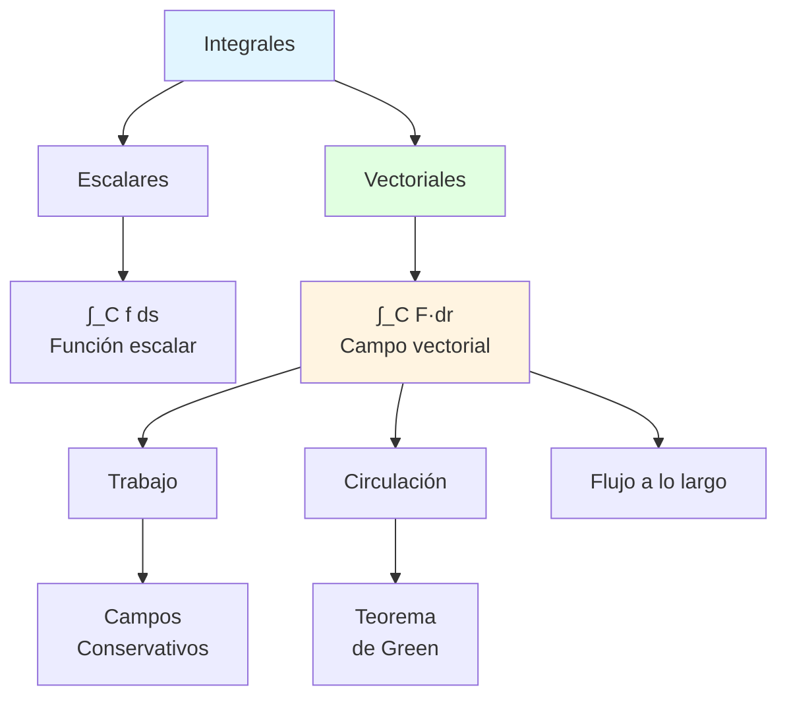
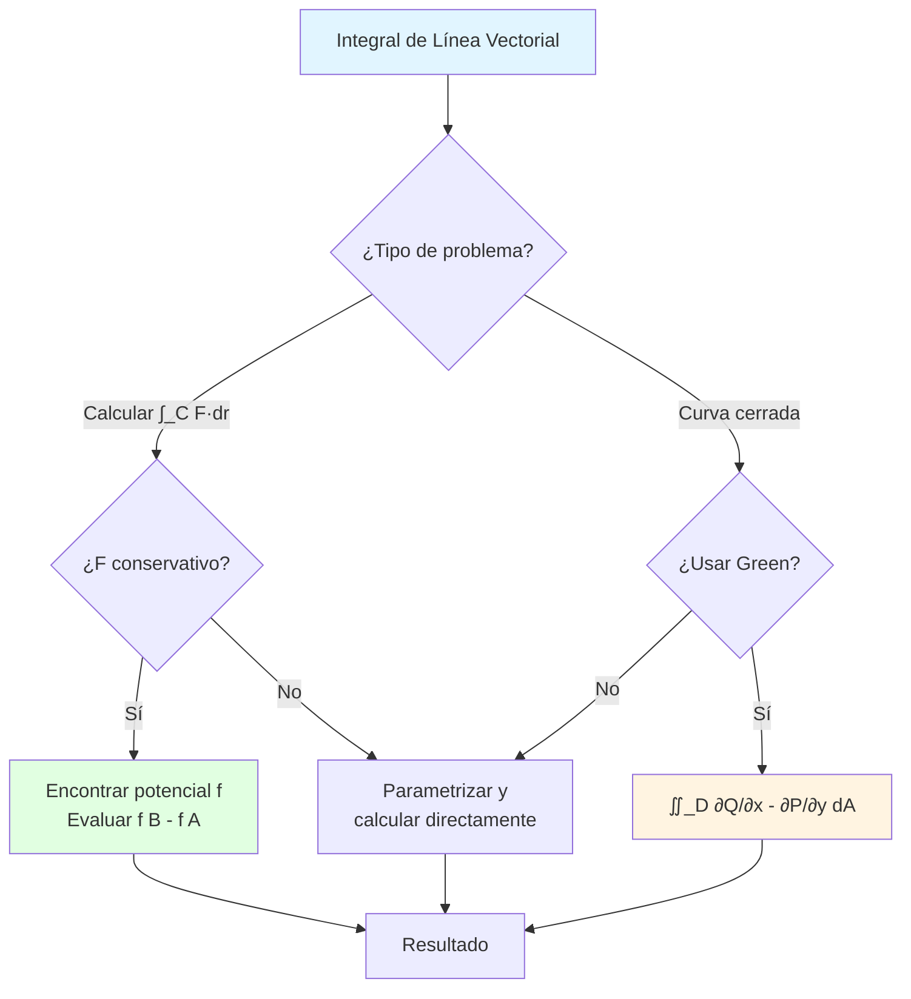

# 🧭 Integrales de Línea Vectoriales

## 🎯 Introducción

> [!info]- 💡 ¿Qué es una Integral de Línea Vectorial? La **integral de línea vectorial** (o integral de flujo a lo largo de una curva) mide la acumulación del efecto de un **campo vectorial** a lo largo de una trayectoria. Mientras que las integrales de línea escalares integran funciones sobre curvas, **las integrales vectoriales miden cómo un campo vectorial "empuja" o "jala" a lo largo de una curva**.
> 
> **Analogía práctica:** Imagina caminar contra el viento a lo largo de un sendero:
> 
> - **Campo vectorial:** El viento (tiene dirección y magnitud en cada punto)
> - **Curva:** Tu trayectoria
> - **Integral vectorial:** Trabajo total que realizas contra el viento
> - Si caminas en dirección del viento: trabajo negativo (te ayuda)
> - Si caminas contra el viento: trabajo positivo (te resiste)
> 
> **¿Por qué son importantes?**
> 
> |Aspecto|Descripción|Ejemplo de Uso|
> |---|---|---|
> |**Trabajo**|Trabajo realizado por una fuerza variable|Física, ingeniería mecánica|
> |**Circulación**|Tendencia a rotar alrededor de una curva|Fluidos, aerodinámica|
> |**Flujo**|Cantidad que fluye a través de curva|Campos magnéticos, corrientes|
> |**Energía potencial**|Diferencia de potencial entre puntos|Campos conservativos|
> |**Campos conservativos**|Independencia de trayectoria|Física fundamental|
> |**Teorema de Green**|Relaciona integral de línea con doble|Matemáticas aplicadas|



---

## 📐 Conceptos Fundamentales

### 🎨 Campos Vectoriales

> [!example]- 📍 Definición y Representación
> 
> **Definición:**
> 
> Un **campo vectorial** asigna un vector a cada punto del espacio:
> 
> $$\mathbf{F}(x,y,z) = \begin{cases} \langle P(x,y), Q(x,y) \rangle & \text{en } \mathbb{R}^2 \ \langle P(x,y,z), Q(x,y,z), R(x,y,z) \rangle & \text{en } \mathbb{R}^3 \end{cases}$$
> 
> **Notaciones comunes:**
> 
> - $\mathbf{F} = P\mathbf{i} + Q\mathbf{j} + R\mathbf{k}$
> - $\mathbf{F} = \langle P, Q, R \rangle$
> - Componentes: $P$, $Q$, $R$ son funciones escalares
> 
> **Visualización en el plano:**
> 
> ```
> Campo vectorial F(x,y) = ⟨-y, x⟩
> 
>     ↑  ↗  →
>     ↖  •  ↗
>     ←  ↙  ↓
>     
> En cada punto, hay un vector
> Conjunto de vectores forma el "campo"
> ```
> 
> **Ejemplos fundamentales:**
> 
> |Campo|Fórmula|Descripción|Aplicación|
> |---|---|---|---|
> |**Campo radial**|$\mathbf{F} = \langle x, y \rangle$|Apunta desde origen|Gravedad, fuerzas centrales|
> |**Campo rotacional**|$\mathbf{F} = \langle -y, x \rangle$|Rota alrededor del origen|Rotación, vórtices|
> |**Campo gravitacional**|$\mathbf{F} = -\frac{GMm}{r^3}\mathbf{r}$|Ley de gravitación|Astronomía, física|
> |**Campo eléctrico**|$\mathbf{E} = \frac{q}{4\pi\epsilon_0 r^3}\mathbf{r}$|Ley de Coulomb|Electromagnetismo|
> |**Campo de velocidades**|$\mathbf{v}(x,y)$|Velocidad de fluido|Dinámica de fluidos|
> |**Campo gradiente**|$\nabla f = \langle f_x, f_y, f_z \rangle$|Dirección de máximo crecimiento|Optimización|
> 
> **Ejemplos detallados:**
> 
> ```
> Ejemplo 1: Campo radial unitario
> F(x,y) = ⟨x,y⟩/√(x²+y²) = r̂
> 
> Magnitud: ||F|| = 1 en todo punto
> Dirección: Apunta radialmente hacia afuera
> 
> ---
> 
> Ejemplo 2: Campo de gravedad
> F(x,y,z) = -GM⟨x,y,z⟩/(x²+y²+z²)^(3/2)
> 
> Dirección: Hacia el origen
> Magnitud: Decrece con distancia² (ley inversa del cuadrado)
> 
> ---
> 
> Ejemplo 3: Campo gradiente
> f(x,y) = x² + y²
> ∇f = ⟨2x, 2y⟩
> 
> Apunta hacia afuera del origen
> Perpendicular a curvas de nivel (círculos)
> ```
> 
> **Propiedades visuales:**
> 
> ```mermaid
> graph TB
>     A[Campo Vectorial F] --> B{Clasificación}
>     
>     B --> C[Por fuente]
>     B --> D[Por rotación]
>     
>     C --> E[Divergencia ≠ 0<br/>Fuentes/sumideros]
>     C --> F[Divergencia = 0<br/>Incompresible]
>     
>     D --> G[Rotacional ≠ 0<br/>Rota]
>     D --> H[Rotacional = 0<br/>Conservativo]
>     
>     style A fill:#e1f5ff
>     style H fill:#e1ffe1
> ```

### 🎯 Producto Punto y Vector Tangente

> [!note]- 📐 Conceptos Geométricos Clave
> 
> **Vector tangente a la curva:**
> 
> Si $\mathbf{r}(t)$ parametriza la curva $C$, el **vector tangente** es:
> 
> $$\mathbf{r}'(t) = \left\langle \frac{dx}{dt}, \frac{dy}{dt}, \frac{dz}{dt} \right\rangle$$
> 
> **Vector tangente unitario:**
> 
> $$\mathbf{T}(t) = \frac{\mathbf{r}'(t)}{|\mathbf{r}'(t)|}$$
> 
> **Componente tangencial del campo:**
> 
> El **producto punto** $\mathbf{F} \cdot \mathbf{T}$ mide cuánto de $\mathbf{F}$ apunta en la dirección tangente:
> 
> $$\mathbf{F} \cdot \mathbf{T} = |\mathbf{F}| |\mathbf{T}| \cos\theta = |\mathbf{F}| \cos\theta$$
> 
> donde $\theta$ es el ángulo entre $\mathbf{F}$ y $\mathbf{T}$.
> 
> **Interpretación geométrica:**
> 
> ```
> Situaciones:
> 
> 1) F paralelo a T (θ=0°):
>        F →→→
>    ───────────→ C
>    F·T = ||F|| (máximo, positivo)
>    
> 2) F perpendicular a T (θ=90°):
>        ↑ F
>    ───────────→ C
>    F·T = 0 (sin contribución)
>    
> 3) F opuesto a T (θ=180°):
>        ←←← F
>    ───────────→ C
>    F·T = -||F|| (mínimo, negativo)
>    
> 4) F en ángulo θ:
>         ↗ F
>    ───────────→ C
>    F·T = ||F||cos(θ) (proyección)
> ```
> 
> **Diferencial de desplazamiento:**
> 
> El **vector diferencial** $d\mathbf{r}$ representa un desplazamiento infinitesimal:
> 
> $$d\mathbf{r} = \mathbf{r}'(t) , dt = \langle dx, dy, dz \rangle$$
> 
> Relación con elemento de arco:
> 
> $$d\mathbf{r} = \mathbf{T} , ds$$
> 
> **Producto punto en componentes:**
> 
> $$\mathbf{F} \cdot d\mathbf{r} = \langle P, Q, R \rangle \cdot \langle dx, dy, dz \rangle = P , dx + Q , dy + R , dz$$
> 
> **Tabla de formas equivalentes:**
> 
> |Expresión|Significado|
> |---|---|
> |$\mathbf{F} \cdot d\mathbf{r}$|Forma vectorial|
> |$\mathbf{F} \cdot \mathbf{T} , ds$|Usando vector tangente unitario|
> |$P , dx + Q , dy + R , dz$|Forma diferencial|
> |$\mathbf{F}(\mathbf{r}(t)) \cdot \mathbf{r}'(t) , dt$|Forma parametrizada|

### ✨ Definición de Integral de Línea Vectorial

> [!success]- 📊 Construcción e Interpretación
> 
> **Definición formal:**
> 
> Sea $\mathbf{F}$ un campo vectorial continuo y $C$ una curva suave parametrizada por $\mathbf{r}(t)$, $t \in [a,b]$. La **integral de línea de $\mathbf{F}$ sobre $C$** es:
> 
> $$\int_C \mathbf{F} \cdot d\mathbf{r} = \int_a^b \mathbf{F}(\mathbf{r}(t)) \cdot \mathbf{r}'(t) , dt$$
> 
> **Formas equivalentes:**
> 
> $$\begin{align} \int_C \mathbf{F} \cdot d\mathbf{r} &= \int_C \mathbf{F} \cdot \mathbf{T} , ds \ &= \int_C P , dx + Q , dy + R , dz \ &= \int_a^b \langle P, Q, R \rangle \cdot \langle x'(t), y'(t), z'(t) \rangle , dt \end{align}$$
> 
> **En el plano:**
> 
> $$\int_C \mathbf{F} \cdot d\mathbf{r} = \int_a^b [P(x(t), y(t)) x'(t) + Q(x(t), y(t)) y'(t)] , dt$$
> 
> **En el espacio:**
> 
> $$\int_C \mathbf{F} \cdot d\mathbf{r} = \int_a^b [P x'(t) + Q y'(t) + R z'(t)] , dt$$
> 
> **Construcción intuitiva:**
> 
> ```
> Suma de Riemann:
> 
> C: ●──→──●──→──●──→──● 
>    F₁·Δr₁ F₂·Δr₂ F₃·Δr₃
>    
> Σ F(rᵢ)·Δrᵢ → ∫_C F·dr cuando Δrᵢ → 0
> ```
> 
> **Interpretaciones físicas:**
> 
> |Contexto|$\mathbf{F}$ representa|$\int_C \mathbf{F} \cdot d\mathbf{r}$ calcula|
> |---|---|---|
> |**Mecánica**|Fuerza $\mathbf{F}$|Trabajo realizado al mover objeto por $C$|
> |**Fluidos**|Velocidad $\mathbf{v}$|Circulación del fluido alrededor de $C$|
> |**Eléctrico**|Campo $\mathbf{E}$|Diferencia de potencial (voltaje)|
> |**Conservativo**|$\nabla f$|Cambio en función potencial: $f(B) - f(A)$|
> 
> **Propiedades fundamentales:**
> 
> 1. **Linealidad:** $$\int_C (a\mathbf{F} + b\mathbf{G}) \cdot d\mathbf{r} = a\int_C \mathbf{F} \cdot d\mathbf{r} + b\int_C \mathbf{G} \cdot d\mathbf{r}$$
>     
> 2. **Aditividad:** $$\int_C \mathbf{F} \cdot d\mathbf{r} = \int_{C_1} \mathbf{F} \cdot d\mathbf{r} + \int_{C_2} \mathbf{F} \cdot d\mathbf{r}$$ si $C = C_1 \cup C_2$
>     
> 3. **Reversión de orientación:** $$\int_{-C} \mathbf{F} \cdot d\mathbf{r} = -\int_C \mathbf{F} \cdot d\mathbf{r}$$ donde $-C$ es $C$ con orientación opuesta
>     
> 
> **¡IMPORTANTE!** La integral vectorial **SÍ depende de la orientación** de la curva (a diferencia de la integral escalar).
> 
> ```mermaid
> graph TB
>     A[∫_C F·dr] --> B{Propiedades}
>     
>     B --> C[Depende de<br/>orientación]
>     B --> D[Linealidad]
>     B --> E[Aditividad]
>     
>     C --> F["∫_{-C} = -∫_C"]
>     D --> G["∫_C αF+βG = α∫_C F + β∫_C G"]
>     E --> H["∫_C = ∫_{C₁} + ∫_{C₂}"]
>     
>     style A fill:#e1f5ff
>     style C fill:#fff4e1
> ```

---

## 🔧 Técnicas de Cálculo

### 📝 Método General de Evaluación

> [!tip]- 🎓 Proceso Paso a Paso
> 
> **Algoritmo general:**
> 
> ```mermaid
> flowchart TD
>     A[Problema: ∫_C F·dr] --> B[Paso 1: Identificar F = ⟨P,Q,R⟩]
>     B --> C[Paso 2: Parametrizar C<br/>r t , t ∈ [a,b]]
>     C --> D[Paso 3: Calcular r' t]
>     D --> E[Paso 4: Expresar P,Q,R<br/>en términos de t]
>     E --> F[Paso 5: Calcular F r t ·r' t]
>     F --> G[Paso 6: Integrar<br/>∫ₐᵇ F·r' dt]
>     
>     style A fill:#e1f5ff
>     style F fill:#e1ffe1
>     style G fill:#fff4e1
> ```
> 
> **Checklist de pasos:**
> 
> 1. ✅ **Identificar el campo vectorial**
>     - Escribir $\mathbf{F} = \langle P, Q, R \rangle$
>     - Verificar componentes
> 2. ✅ **Parametrizar la curva C**
>     - Elegir parámetro apropiado
>     - Verificar orientación (crucial!)
>     - Determinar intervalo [a,b]
> 3. ✅ **Calcular derivada r'(t)**
>     - Derivar cada componente
>     - Este es $d\mathbf{r}/dt$
> 4. ✅ **Sustituir en F**
>     - Reemplazar x, y, z por x(t), y(t), z(t)
>     - Obtener $\mathbf{F}(\mathbf{r}(t))$
> 5. ✅ **Producto punto**
>     - Calcular $\mathbf{F}(\mathbf{r}(t)) \cdot \mathbf{r}'(t)$
>     - Simplificar expresión
> 6. ✅ **Evaluar integral**
>     - $\int_a^b [\text{expresión del paso 5}] , dt$
>     - Usar técnicas estándar
> 
> **Plantilla de trabajo:**
> 
> ```
> Problema: Calcular ∫_C F·dr donde...
> 
> Paso 1 - Campo vectorial:
> F(x,y,z) = ⟨ P(x,y,z), Q(x,y,z), R(x,y,z) ⟩
>          = ⟨ _____, _____, _____ ⟩
> 
> Paso 2 - Parametrización:
> r(t) = ⟨ _____, _____, _____ ⟩
> t ∈ [___, ___]
> Orientación: ✓
> 
> Paso 3 - Derivada:
> r'(t) = ⟨ _____, _____, _____ ⟩
> 
> Paso 4 - Campo en términos de t:
> F(r(t)) = ⟨ _____, _____, _____ ⟩
> 
> Paso 5 - Producto punto:
> F(r(t))·r'(t) = (___)(_____) + (___)(_____) + (___)(_____)
>                = _____
> 
> Paso 6 - Integral:
> ∫_C F·dr = ∫ₐᵇ _____ dt
>          = [_____]ₐᵇ
>          = _____
> ```

### 💡 Ejemplos Resueltos Detallados

> [!example]- 🎯 Casos Fundamentales
> 
> **Ejemplo 1: Trabajo a lo largo de segmento**
> 
> ```
> Calcular ∫_C F·dr donde F(x,y) = ⟨y, x⟩ y C es el segmento
> de (0,0) a (2,4)
> 
> Paso 1 - Campo:
> F = ⟨y, x⟩ → P = y, Q = x
> 
> Paso 2 - Parametrización:
> r(t) = ⟨2t, 4t⟩, t ∈ [0,1]
> 
> Verificación:
> t=0: r(0) = ⟨0,0⟩ ✓
> t=1: r(1) = ⟨2,4⟩ ✓
> 
> Paso 3 - Derivada:
> r'(t) = ⟨2, 4⟩
> 
> Paso 4 - Campo en términos de t:
> F(r(t)) = ⟨y(t), x(t)⟩ = ⟨4t, 2t⟩
> 
> Paso 5 - Producto punto:
> F·r' = ⟨4t, 2t⟩·⟨2, 4⟩
>      = (4t)(2) + (2t)(4)
>      = 8t + 8t = 16t
> 
> Paso 6 - Integral:
> ∫_C F·dr = ∫₀¹ 16t dt
>          = [8t²]₀¹
>          = 8
> 
> Trabajo: 8 unidades
> ```
> 
> **Ejemplo 2: Integral alrededor de círculo**
> 
> ```
> Calcular ∫_C F·dr donde F(x,y) = ⟨-y, x⟩ y C es el círculo
> x² + y² = 4 recorrido en sentido antihorario
> 
> Paso 1 - Campo:
> F = ⟨-y, x⟩ (campo rotacional)
> 
> Paso 2 - Parametrización:
> r(t) = ⟨2cos t, 2sin t⟩, t ∈ [0,2π]
> (sentido antihorario: t crece)
> 
> Paso 3 - Derivada:
> r'(t) = ⟨-2sin t, 2cos t⟩
> 
> Paso 4 - Campo en términos de t:
> F(r(t)) = ⟨-2sin t, 2cos t⟩
> 
> Paso 5 - Producto punto:
> F·r' = ⟨-2sin t, 2cos t⟩·⟨-2sin t, 2cos t⟩
>      = (-2sin t)(-2sin t) + (2cos t)(2cos t)
>      = 4sin²t + 4cos²t
>      = 4
> 
> Paso 6 - Integral:
> ∫_C F·dr = ∫₀²π 4 dt
>          = 4[t]₀²π
>          = 8π
> 
> Circulación: 8π ≈ 25.13
> 
> Nota: Este campo rota alrededor del origen,
> por eso la circulación es positiva y constante.
> ```
> 
> **Ejemplo 3: Trabajo contra campo gravitacional**
> 
> ```
> Calcular el trabajo para mover una partícula desde (1,0)
> hasta (0,1) a lo largo del cuarto de círculo x² + y² = 1
> bajo el campo F(x,y) = ⟨x, y⟩/(x²+y²)
> 
> Paso 1 - Campo (radial unitario):
> F = ⟨x, y⟩/(x²+y²) = ⟨x, y⟩ en el círculo unitario
> 
> Paso 2 - Parametrización:
> r(t) = ⟨cos t, sin t⟩, t ∈ [0, π/2]
> 
> Verificación:
> t=0: r(0) = ⟨1,0⟩ ✓
> t=π/2: r(π/2) = ⟨0,1⟩ ✓
> 
> Paso 3 - Derivada:
> r'(t) = ⟨-sin t, cos t⟩
> 
> Paso 4 - Campo en términos de t:
> En x²+y²=1: F(r(t)) = ⟨cos t, sin t⟩
> 
> Paso 5 - Producto punto:
> F·r' = ⟨cos t, sin t⟩·⟨-sin t, cos t⟩
>      = -cos t sin t + sin t cos t
>      = 0
> 
> Paso 6 - Integral:
> ∫_C F·dr = ∫₀^(π/2) 0 dt = 0
> 
> Trabajo: 0
> 
> Interpretación: El campo radial es perpendicular
> a la trayectoria circular en todo punto.
> F·T = 0 en todo momento, por tanto W = 0.
> ```
> 
> **Ejemplo 4: Hélice en 3D**
> 
> ```
> Calcular ∫_C F·dr donde F(x,y,z) = ⟨y, -x, z⟩ y C es
> la hélice r(t) = ⟨cos t, sin t, t⟩, t ∈ [0,2π]
> 
> Paso 1 - Campo:
> F = ⟨y, -x, z⟩ → P = y, Q = -x, R = z
> 
> Paso 2 - Ya tenemos parametrización
> 
> Paso 3 - Derivada:
> r'(t) = ⟨-sin t, cos t, 1⟩
> 
> Paso 4 - Campo en términos de t:
> F(r(t)) = ⟨sin t, -cos t, t⟩
> 
> Paso 5 - Producto punto:
> F·r' = ⟨sin t, -cos t, t⟩·⟨-sin t, cos t, 1⟩
>      = (sin t)(-sin t) + (-cos t)(cos t) + (t)(1)
>      = -sin²t - cos²t + t
>      = -1 + t
>      = t - 1
> 
> Paso 6 - Integral:
> ∫_C F·dr = ∫₀²π (t-1) dt
>          = [t²/2 - t]₀²π
>          = 2π² - 2π
>          = 2π(π - 1)
>          ≈ 13.48
> ```
> 
> **Ejemplo 5: Forma diferencial**
> 
> ```
> Evaluar ∫_C y dx + x dy donde C es la parábola y = x²
> desde (0,0) hasta (2,4)
> 
> Método - forma diferencial:
> P = y, Q = x
> F = ⟨y, x⟩
> 
> Parametrización natural:
> x = t, y = t², t ∈ [0,2]
> dx = dt, dy = 2t dt
> 
> ∫_C y dx + x dy = ∫₀² t²·dt + t·2t dt
>                 = ∫₀² (t² + 2t²) dt
>                 = ∫₀² 3t² dt
>                 = [t³]₀²
>                 = 8
> 
> Alternativamente (forma vectorial):
> r(t) = ⟨t, t²⟩
> r'(t) = ⟨1, 2t⟩
> F(r(t)) = ⟨t², t⟩
> 
> F·r' = t²·1 + t·2t = t² + 2t² = 3t²
> 
> ∫₀² 3t² dt = 8 ✓
> ```

### 🔄 Reversión de Orientación

> [!warning]- ↔️ Importancia de la Dirección
> 
> **Teorema:**
> 
> Si $-C$ denota la curva $C$ con orientación opuesta:
> 
> $$\int_{-C} \mathbf{F} \cdot d\mathbf{r} = -\int_C \mathbf{F} \cdot d\mathbf{r}$$
> 
> **Razón matemática:**
> 
> ```
> Si C: r(t), t ∈ [a,b]
> Entonces -C: r(a+b-t), t ∈ [a,b]
> 
> dr/dt cambia de signo
> → Integral cambia de signo
> ```
> 
> **Interpretación física:**
> 
> - **Trabajo:** Invertir dirección invierte signo del trabajo
> - Si caminas "cuesta arriba": trabajo positivo
> - Si regresas "cuesta abajo": trabajo negativo (de misma magnitud)
> 
> **Ejemplo:**
> 
> ```
> F(x,y) = ⟨x, y⟩
> 
> C₁: de (0,0) a (1,0) → r₁(t) = ⟨t,0⟩, t ∈ [0,1]
> C₂: de (1,0) a (0,0) → r₂(t) = ⟨1-t,0⟩, t ∈ [0,1]
> 
> Para C₁:
> r₁'(t) = ⟨1,0⟩
> F(r₁(t)) = ⟨t,0⟩
> F·r₁' = t
> ∫_C₁ F·dr = ∫₀¹ t dt = 1/2
> 
> Para C₂ (C₂ = -C₁):
> r₂'(t) = ⟨-1,0⟩

> F(r₂(t)) = ⟨1-t,0⟩ F·r₂' = -(1-t) ∫_C₂ F·dr = ∫₀¹ -(1-t) dt = -[t - t²/2]₀¹ = -1/2
> 
> Verificación: ∫_C₂ = -∫_C₁ ✓
> 
> ```
> 
> **Aplicación práctica:**
> 
> | Situación | Implicación |
> |-----------|-------------|
> | Curva cerrada C | $\oint_C \mathbf{F} \cdot d\mathbf{r}$ tiene signo definido |
> | Ida y vuelta por mismo camino | $\int_{C} + \int_{-C} = 0$ |
> | Campo conservativo | Integral independiente de dirección entre puntos |
> ```

---

## 🌟 Campos Conservativos

### 🎯 Definición y Caracterización

> [!success]- ⚡ Campos Especiales
> 
> **Definición:**
> 
> Un campo vectorial $\mathbf{F}$ es **conservativo** si existe una función escalar $f$ tal que:
> 
> $$\mathbf{F} = \nabla f$$
> 
> La función $f$ se llama **función potencial** de $\mathbf{F}$.
> 
> **Gradiente:**
> 
> $$\nabla f = \left\langle \frac{\partial f}{\partial x}, \frac{\partial f}{\partial y}, \frac{\partial f}{\partial z} \right\rangle$$
> 
> Por tanto, si $\mathbf{F} = \langle P, Q, R \rangle$ es conservativo:
> 
> $$P = \frac{\partial f}{\partial x}, \quad Q = \frac{\partial f}{\partial y}, \quad R = \frac{\partial f}{\partial z}$$
> 
> **Propiedad fundamental (Independencia de trayectoria):**
> 
> Si $\mathbf{F}$ es conservativo con potencial $f$:
> 
> $$\int_C \mathbf{F} \cdot d\mathbf{r} = f(B) - f(A)$$
> 
> donde $A$ y $B$ son los puntos inicial y final de $C$.
> 
> **¡CRUCIAL!** El valor de la integral depende **solo de los puntos extremos**, no de la trayectoria.
> 
> ```
> Visualización:
> 
>     B ●
>      ╱│╲
>    C₁│ │C₃
>    ╱ │C₂╲
>   ●───────● A
>   
> Si F es conservativo:
> ∫_C₁ F·dr = ∫_C₂ F·dr = ∫_C₃ F·dr = f(B) - f(A)
> ```
> 
> **Consecuencia para curvas cerradas:**
> 
> $$\oint_C \mathbf{F} \cdot d\mathbf{r} = 0$$
> 
> para cualquier curva cerrada $C$.
> 
> **Ejemplos de campos conservativos:**
> 
> |Campo $\mathbf{F}$|Potencial $f$|Aplicación|
> |---|---|---|
> |$\langle 2x, 2y \rangle$|$f = x^2 + y^2$|Campo radial|
> |$\langle y, x \rangle$|$f = xy$|Simple|
> |$\langle e^x\cos y, -e^x\sin y \rangle$|$f = e^x\cos y$|Armónico|
> |Campo gravitacional|Potencial gravitacional|Física|
> |Campo eléctrico|Potencial eléctrico|Electromagnetismo|
> 
> **Campos NO conservativos:**
> 
> |Campo $\mathbf{F}$|Razón|
> |---|---|
> |$\langle -y, x \rangle$|Rotacional (circula)|
> |$\langle y^2, 2xy+1 \rangle$|No cumple criterio|
> |Campo magnético|Tiene circulación|

### 🔍 Criterio de Campo Conservativo

> [!tip]- ✅ ¿Cómo Verificar si es Conservativo?
> 
> **Teorema (Criterio necesario):**
> 
> Si $\mathbf{F} = \langle P, Q, R \rangle$ es conservativo en una región simplemente conexa, entonces:
> 
> **En 2D:** $$\frac{\partial P}{\partial y} = \frac{\partial Q}{\partial x}$$
> 
> **En 3D:** $$\frac{\partial P}{\partial y} = \frac{\partial Q}{\partial x}, \quad \frac{\partial P}{\partial z} = \frac{\partial R}{\partial x}, \quad \frac{\partial Q}{\partial z} = \frac{\partial R}{\partial y}$$
> 
> Equivalentemente: $\nabla \times \mathbf{F} = \mathbf{0}$ (rotacional nulo)
> 
> **Proceso de verificación:**
> 
> ```mermaid
> flowchart TD
>     A[Campo F = ⟨P,Q,R⟩] --> B{Calcular derivadas<br/>parciales cruzadas}
>     B --> C{¿Se cumplen<br/>las igualdades?}
>     C -->|Sí| D[Posiblemente conservativo]
>     C -->|No| E[NO conservativo]
>     D --> F{¿Región simplemente<br/>conexa?}
>     F -->|Sí| G[ES conservativo]
>     F -->|No| H[Verificar más]
>     
>     style G fill:#e1ffe1
>     style E fill:#ffe1e1
> ```
> 
> **Región simplemente conexa:** Una región sin "huecos" (toda curva cerrada puede contraerse a un punto).
> 
> **Ejemplos de verificación:**
> 
> ```
> Ejemplo 1: F(x,y) = ⟨2x+y, x+2y⟩
> 
> P = 2x+y → ∂P/∂y = 1
> Q = x+2y → ∂Q/∂x = 1
> 
> ∂P/∂y = ∂Q/∂x ✓
> 
> ES conservativo (en todo ℝ²)
> 
> ---
> 
> Ejemplo 2: F(x,y) = ⟨-y, x⟩
> 
> P = -y → ∂P/∂y = -1
> Q = x → ∂Q/∂x = 1
> 
> ∂P/∂y ≠ ∂Q/∂x ✗
> 
> NO es conservativo
> 
> ---
> 
> Ejemplo 3: F(x,y,z) = ⟨yz, xz, xy⟩
> 
> P = yz → ∂P/∂y = z, ∂P/∂z = y
> Q = xz → ∂Q/∂x = z, ∂Q/∂z = x
> R = xy → ∂R/∂x = y, ∂R/∂y = x
> 
> Verificar:
> ∂P/∂y = z = ∂Q/∂x ✓
> ∂P/∂z = y = ∂R/∂x ✓
> ∂Q/∂z = x = ∂R/∂y ✓
> 
> ES conservativo
> ```

### 🔨 Encontrar la Función Potencial

> [!example]- 🎯 Método de Integración
> 
> **Proceso para encontrar $f$ tal que $\nabla f = \mathbf{F}$:**
> 
> **Método 1 - Integración directa (2D):**
> 
> Dado $\mathbf{F} = \langle P, Q \rangle$ conservativo:
> 
> 1. Integrar $P$ respecto a $x$: $$f(x,y) = \int P(x,y) , dx + g(y)$$ donde $g(y)$ es una función de $y$ solamente
>     
> 2. Derivar respecto a $y$ e igualar a $Q$: $$\frac{\partial f}{\partial y} = Q$$
>     
> 3. Resolver para encontrar $g(y)$
>     
> 4. Escribir $f(x,y)$ completa
>     
> 
> **Ejemplo completo:**
> 
> ```
> Encontrar f tal que ∇f = F donde F(x,y) = ⟨2xy + 3, x² + 1⟩
> 
> Paso 1 - Verificar que es conservativo:
> P = 2xy + 3 → ∂P/∂y = 2x
> Q = x² + 1 → ∂Q/∂x = 2x
> ∂P/∂y = ∂Q/∂x ✓
> 
> Paso 2 - Integrar P respecto a x:
> f = ∫(2xy + 3) dx
>   = x²y + 3x + g(y)
> 
> Paso 3 - Derivar respecto a y:
> ∂f/∂y = x² + g'(y)
> 
> Igualar a Q:
> x² + g'(y) = x² + 1
> g'(y) = 1
> 
> Paso 4 - Integrar para encontrar g:
> g(y) = ∫1 dy = y + C
> 
> Paso 5 - Función potencial:
> f(x,y) = x²y + 3x + y + C
> 
> (Usualmente tomamos C = 0)
> 
> Verificación:
> ∇f = ⟨2xy + 3, x² + 1⟩ = F ✓
> ```
> 
> **Método 2 - Integración por camino:**
> 
> ```
> f(x,y) = ∫_{(x₀,y₀)}^{(x,y)} F·dr
> 
> usando cualquier camino conveniente desde (x₀,y₀) hasta (x,y)
> 
> Camino típico: (x₀,y₀) → (x,y₀) → (x,y)
> 
> f(x,y) = ∫_{x₀}^x P(t,y₀) dt + ∫_{y₀}^y Q(x,s) ds
> ```
> 
> **Ejemplo en 3D:**
> 
> ```
> Encontrar f tal que ∇f = F donde F = ⟨yz, xz, xy⟩
> 
> Paso 1 - Integrar P respecto a x:
> f = ∫yz dx = xyz + g(y,z)
> 
> Paso 2 - Derivar respecto a y:
> ∂f/∂y = xz + ∂g/∂y
> 
> Igualar a Q:
> xz + ∂g/∂y = xz
> ∂g/∂y = 0
> 
> Entonces g no depende de y: g = g(z)
> 
> Paso 3 - Derivar f respecto a z:
> ∂f/∂z = xy + g'(z)
> 
> Igualar a R:
> xy + g'(z) = xy
> g'(z) = 0
> g(z) = C
> 
> Paso 4 - Función potencial:
> f(x,y,z) = xyz + C
> 
> Verificación:
> ∇f = ⟨yz, xz, xy⟩ = F ✓
> ```

### 📐 Teorema Fundamental para Integrales de Línea

> [!note]- 🎓 Análogo del TFC
> 
> **Teorema Fundamental para Integrales de Línea:**
> 
> Si $\mathbf{F} = \nabla f$ es un campo conservativo y $C$ es una curva suave desde el punto $A$ hasta el punto $B$:
> 
> $$\int_C \mathbf{F} \cdot d\mathbf{r} = f(B) - f(A)$$
> 
> **Analogía con cálculo de una variable:**
> 
> |Cálculo 1D|Cálculo Vectorial|
> |---|---|
> |$F = f'$|$\mathbf{F} = \nabla f$|
> |$\int_a^b f'(x) , dx = f(b) - f(a)$|$\int_C \nabla f \cdot d\mathbf{r} = f(B) - f(A)$|
> 
> **Consecuencias:**
> 
> 1. **Independencia de trayectoria:** Solo importan puntos inicial y final
> 2. **Curvas cerradas:** $\oint_C \mathbf{F} \cdot d\mathbf{r} = f(A) - f(A) = 0$
> 3. **Cálculo simplificado:** No necesitas parametrizar, solo evaluar $f$
> 
> **Ejemplo de aplicación:**
> 
> ```
> Calcular ∫_C F·dr donde F = ⟨2xy+3, x²+1⟩ y C es
> cualquier curva desde (0,0) hasta (2,1)
> 
> Solución:
> 
> Paso 1 - Ya sabemos que F es conservativo con:
> f(x,y) = x²y + 3x + y
> 
> Paso 2 - Evaluar en puntos extremos:
> A = (0,0): f(0,0) = 0
> B = (2,1): f(2,1) = 4(1) + 6 + 1 = 11
> 
> Paso 3 - Aplicar teorema:
> ∫_C F·dr = f(2,1) - f(0,0) = 11 - 0 = 11
> 
> Respuesta: 11 (independiente del camino!)
> 
> Verificación con camino específico:
> Camino: (0,0) → (2,0) → (2,1)
> 
> Segmento 1: r₁(t) = ⟨t,0⟩, t ∈ [0,2]
> r₁'(t) = ⟨1,0⟩
> F(r₁(t)) = ⟨3, t²+1⟩
> ∫ F·dr = ∫₀² 3 dt = 6
> 
> Segmento 2: r₂(t) = ⟨2,t⟩, t ∈ [0,1]
> r₂'(t) = ⟨0,1⟩
> F(r₂(t)) = ⟨4t+3, 5⟩
> ∫ F·dr = ∫₀¹ 5 dt = 5
> 
> Total: 6 + 5 = 11 ✓
> ```

---

## 🎨 Teorema de Green

### 🌊 Enunciado y Significado

> [!success]- 🔄 Conectando Línea con Doble
> 
> **Teorema de Green:**
> 
> Sea $C$ una curva cerrada simple, suave a trozos, orientada positivamente (sentido antihorario) que encierra una región $D$ en el plano. Si $\mathbf{F} = \langle P, Q \rangle$ tiene derivadas parciales continuas en $D$:
> 
> $$\oint_C P , dx + Q , dy = \iint_D \left(\frac{\partial Q}{\partial x} - \frac{\partial P}{\partial y}\right) dA$$
> 
> O en notación vectorial:
> 
> $$\oint_C \mathbf{F} \cdot d\mathbf{r} = \iint_D \left(\frac{\partial Q}{\partial x} - \frac{\partial P}{\partial y}\right) dA$$
> 
> **Componentes:**
> 
> - $C$: Frontera de $D$ (curva cerrada, orientación antihoraria positiva)
> - $D$: Región encerrada por $C$
> - $\frac{\partial Q}{\partial x} - \frac{\partial P}{\partial y}$: "Rotacional 2D" o circulación microscópica
> 
> **Interpretación física:**
> 
> ```
> Visualización:
> 
>        C (antihorario)
>     ┌─────────────┐
>     │      D      │ 
>     │   (región)  │
>     │             │
>     └─────────────┘
>     
> Circulación alrededor de C = 
> Suma de rotaciones microscópicas en D
> ```
> 
> **Significado:**
> 
> |Aspecto|Descripción|
> |---|---|
> |**Lado izquierdo**|Circulación total alrededor de frontera|
> |**Lado derecho**|Suma de rotaciones infinitesimales en interior|
> |**Conexión**|Lo "global" (frontera) = suma de lo "local" (interior)|
> 
> **Forma de circulación:**
> 
> $$\oint_C \mathbf{F} \cdot d\mathbf{r} = \iint_D (\nabla \times \mathbf{F}) \cdot \mathbf{k} , dA$$
> 
> donde $\nabla \times \mathbf{F} = \left(\frac{\partial Q}{\partial x} - \frac{\partial P}{\partial y}\right)\mathbf{k}$ en 2D.

### 💡 Aplicaciones del Teorema de Green

> [!example]- 🎯 Uso Práctico
> 
> **Aplicación 1: Simplificar integrales de línea**
> 
> ```
> Calcular ∮_C (x² + y) dx + (x - y²) dy donde C es
> el círculo x² + y² = 4 orientado antihorariamente
> 
> Método directo (difícil):
> Parametrizar círculo y calcular integral...
> 
> Método con Green (fácil):
> 
> P = x² + y, Q = x - y²
> ∂Q/∂x = 1
> ∂P/∂y = 1
> 
> ∮_C F·dr = ∬_D (1 - 1) dA = ∬_D 0 dA = 0
> 
> Respuesta: 0
> 
> (¡Mucho más simple!)
> ```
> 
> **Aplicación 2: Calcular área usando integral de línea**
> 
> **Fórmula del área:**
> 
> $$A = \frac{1}{2}\oint_C x , dy - y , dx = \oint_C x , dy = -\oint_C y , dx$$
> 
> **Demostración:**
> 
> ```
> Usar Green con P = -y, Q = x:
> 
> ∂Q/∂x - ∂P/∂y = 1 - (-1) = 2
> 
> ∮_C (-y dx + x dy) = ∬_D 2 dA = 2·Área(D)
> 
> Por tanto: Área = (1/2)∮_C (x dy - y dx)
> ```
> 
> **Ejemplo:**
> 
> ```
> Calcular el área encerrada por la elipse x²/a² + y²/b² = 1
> 
> Parametrización: x = a cos t, y = b sin t, t ∈ [0,2π]
> dx = -a sin t dt, dy = b cos t dt
> 
> A = (1/2)∮_C (x dy - y dx)
>   = (1/2)∫₀²π [(a cos t)(b cos t) - (b sin t)(-a sin t)] dt
>   = (1/2)∫₀²π [ab cos²t + ab sin²t] dt
>   = (1/2)∫₀²π ab dt
>   = (ab/2)[t]₀²π
>   = πab
> 
> Área de elipse: πab ✓
> ```
> 
> **Aplicación 3: Verificar si campo es conservativo**
> 
> ```
> Si F es conservativo en región simplemente conexa D:
> 
> ∂Q/∂x - ∂P/∂y = 0 en toda D
> 
> Por Green: ∮_C F·dr = ∬_D 0 dA = 0
> 
> para toda curva cerrada C en D.
> ```

### 🔨 Ejemplos Detallados con Green

> [!example]- 📊 Casos Completos
> 
> **Ejemplo 1: Integral alrededor de triángulo**
> 
> ```
> Calcular ∮_C (x² - y²) dx + 2xy dy donde C es el triángulo
> con vértices (0,0), (2,0), (0,2) orientado antihorariamente
> 
> Método con Green:
> 
> P = x² - y², Q = 2xy
> ∂Q/∂x = 2y
> ∂P/∂y = -2y
> 
> ∂Q/∂x - ∂P/∂y = 2y - (-2y) = 4y
> 
> Región D: triángulo
> 0 ≤ x ≤ 2, 0 ≤ y ≤ 2-x
> 
> ∮_C F·dr = ∬_D 4y dA
>          = ∫₀² ∫₀^(2-x) 4y dy dx
>          = ∫₀² [2y²]₀^(2-x) dx
>          = ∫₀² 2(2-x)² dx
>          = 2∫₀² (4 - 4x + x²) dx
>          = 2[4x - 2x² + x³/3]₀²
>          = 2[8 - 8 + 8/3]
>          = 16/3
> 
> Respuesta: 16/3 ≈ 5.33
> ```
> 
> **Ejemplo 2: Anillo (región con hueco)**
> 
> ```
> Calcular ∮_C F·dr donde F = ⟨-y/(x²+y²), x/(x²+y²)⟩
> y C₁ es x² + y² = 4 (antihorario), C₂ es x² + y² = 1 (horario)
> 
> Nota: Campo no definido en (0,0)
> 
> Verificar si es conservativo:
> P = -y/(x²+y²)
> Q = x/(x²+y²)
> 
> ∂P/∂y = -(x²+y²) - (-y)(2y) / (x²+y²)²
>       = -(x²+y²) + 2y² / (x²+y²)²
>       = (y² - x²) / (x²+y²)²
> 
> ∂Q/∂x = (x²+y²) - x(2x) / (x²+y²)²
>       = (y² - x²) / (x²+y²)²
> 
> ∂P/∂y = ∂Q/∂x en región D (anillo)
> 
> Por Green en región anillo:
> ∮_C₁ F·dr - ∮_C₂ F·dr = ∬_D 0 dA = 0
> 
> Por tanto: ∮_C₁ F·dr = ∮_C₂ F·dr
> 
> Calcular sobre C₂ (más simple):
> r(t) = ⟨cos t, sin t⟩, t ∈ [0,2π]
> r'(t) = ⟨-sin t, cos t⟩
> 
> F(r(t)) = ⟨-sin t, cos t⟩
> F·r' = sin²t + cos²t = 1
> 
> ∮_C₂ F·dr = ∫₀²π 1 dt = 2π
> 
> Respuesta: ∮_C₁ F·dr = 2π
> ```
> 
> **Ejemplo 3: Área con Green**
> 
> ```
> Calcular área dentro de astroide x^(2/3) + y^(2/3) = a^(2/3)
> 
> Parametrización: x = a cos³t, y = a sin³t, t ∈ [0,2π]
> 
> dx = -3a cos²t sin t dt
> dy = 3a sin²t cos t dt
> 
> A = (1/2)∮_C (x dy - y dx)
>   = (1/2)∫₀²π [(a cos³t)(3a sin²t cos t) 
>                - (a sin³t)(-3a cos²t sin t)] dt
>   = (1/2)∫₀²π [3a² cos⁴t sin²t + 3a² sin⁴t cos²t] dt
>   = (3a²/2)∫₀²π cos²t sin²t(cos²t + sin²t) dt
>   = (3a²/2)∫₀²π cos²t sin²t dt
>   = (3a²/2)∫₀²π (sin(2t)/2)² dt
>   = (3a²/8)∫₀²π sin²(2t) dt
>   = (3a²/8)∫₀²π (1 - cos(4t))/2 dt
>   = (3a²/16)[t - sin(4t)/4]₀²π
>   = (3a²/16)(2π)
>   = 3πa²/8
> 
> Área: 3πa²/8
> ```

---

## 📊 Resumen Visual Completo

### Diagrama de Flujo General



> [!note]- 📋 Tablas de Referencia Rápida
> 
> ### Fórmulas Principales
> 
> |Concepto|Fórmula|
> |---|---|
> |**Integral vectorial**|$\int_C \mathbf{F} \cdot d\mathbf{r} = \int_a^b \mathbf{F}(\mathbf{r}(t)) \cdot \mathbf{r}'(t) , dt$|
> |**Forma diferencial**|$\int_C P , dx + Q , dy + R , dz$|
> |**Trabajo**|$W = \int_C \mathbf{F} \cdot d\mathbf{r}$|
> |**Circulación**|$\oint_C \mathbf{F} \cdot \mathbf{T} , ds$|
> |**Reversión**|$\int_{-C} \mathbf{F} \cdot d\mathbf{r} = -\int_C \mathbf{F} \cdot d\mathbf{r}$|
> 
> ### Campos Conservativos
> 
> |Propiedad|Descripción|
> |---|---|
> |**Definición**|$\mathbf{F} = \nabla f$ para alguna $f$|
> |**Criterio (2D)**|$\frac{\partial P}{\partial y} = \frac{\partial Q}{\partial x}$|
> |**Teorema fundamental**|$\int_C \nabla f \cdot d\mathbf{r} = f(B) - f(A)$|
> |**Curvas cerradas**|$\oint_C \mathbf{F} \cdot d\mathbf{r} = 0$|
> |**Independencia**|Integral solo depende de puntos extremos|
> 
> ### Teorema de Green
> 
> |Forma|Fórmula|
> |---|---|
> |**Circulación**|$\oint_C P , dx + Q , dy = \iint_D \left(\frac{\partial Q}{\partial x} - \frac{\partial P}{\partial y}\right) dA$|
> |**Área**|$A = \frac{1}{2}\oint_C x , dy - y , dx$|
> |**Condición**|$C$ cerrada, simple, orientada antihorariamente |
> ### Checklist de Resolución
> 
> **Para calcular ∫_C F·dr:**
> 
> - [ ] Identificar F = ⟨P,Q,R⟩
> - [ ] ¿Es F conservativo? (verificar ∂P/∂y = ∂Q/∂x)
> - [ ] Si es conservativo: encontrar f, evaluar f(B) - f(A)
> - [ ] Si no: parametrizar C como r(t)
> - [ ] Calcular r'(t)
> - [ ] Evaluar F(r(t))·r'(t)
> - [ ] Integrar de a a b
> 
> **Para usar Green:**
> 
> - [ ] Verificar que C es cerrada y simple
> - [ ] Verificar orientación (antihoraria = positiva)
> - [ ] Calcular ∂Q/∂x - ∂P/∂y
> - [ ] Plantear integral doble sobre D
> - [ ] Evaluar integral doble

---

## 🎓 Ejercicios Progresivos

> [!example]- 💪 Práctica con Soluciones Detalladas
> 
> **Nivel Básico:**
> 
> **Ejercicio 1: Trabajo simple**
> 
> ```
> Calcular ∫_C F·dr donde F(x,y) = ⟨x, y⟩ y C es
> el segmento de (0,0) a (3,4)
> 
> Solución:
> r(t) = ⟨3t, 4t⟩, t ∈ [0,1]
> r'(t) = ⟨3, 4⟩
> F(r(t)) = ⟨3t, 4t⟩
> 
> F·r' = (3t)(3) + (4t)(4) = 9t + 16t = 25t
> 
> ∫_C F·dr = ∫₀¹ 25t dt = [25t²/2]₀¹ = 25/2
> 
> Respuesta: 25/2 = 12.5
> ```
> 
> **Ejercicio 2: Verificar conservativo**
> 
> ```
> Determinar si F(x,y) = ⟨2x + y², 2xy + 1⟩ es conservativo
> 
> Solución:
> P = 2x + y² → ∂P/∂y = 2y
> Q = 2xy + 1 → ∂Q/∂x = 2y
> 
> ∂P/∂y = ∂Q/∂x ✓
> 
> ES conservativo
> ```
> 
> **Nivel Intermedio:**
> 
> **Ejercicio 3: Campo conservativo**
> 
> ```
> Sea F(x,y) = ⟨3x² + 6xy², 6x²y + 4y³⟩
> 
> a) Verificar que es conservativo
> b) Encontrar función potencial
> c) Calcular ∫_C F·dr desde (0,0) hasta (1,2)
> 
> Solución:
> 
> a) Verificación:
> P = 3x² + 6xy² → ∂P/∂y = 12xy
> Q = 6x²y + 4y³ → ∂Q/∂x = 12xy
> ∂P/∂y = ∂Q/∂x ✓ ES conservativo
> 
> b) Encontrar f:
> f = ∫P dx = ∫(3x² + 6xy²) dx
>   = x³ + 3x²y² + g(y)
> 
> ∂f/∂y = 6x²y + g'(y) = Q = 6x²y + 4y³
> g'(y) = 4y³
> g(y) = y⁴ + C
> 
> f(x,y) = x³ + 3x²y² + y⁴
> 
> c) Integral:
> ∫_C F·dr = f(1,2) - f(0,0)
>          = (1 + 12 + 16) - 0
>          = 29
> 
> Respuesta: 29
> ```
> 
> **Ejercicio 4: Teorema de Green**
> 
> ```
> Usar Green para calcular ∮_C (x² - y) dx + (x + y²) dy
> donde C es el cuadrado [0,1] × [0,1] antihorario
> 
> Solución:
> P = x² - y, Q = x + y²
> ∂Q/∂x = 1
> ∂P/∂y = -1
> 
> ∮_C F·dr = ∬_D (1 - (-1)) dA
>          = ∬_D 2 dA
>          = 2 · Área(D)
>          = 2 · 1
>          = 2
> 
> Respuesta: 2
> ```
> 
> **Nivel Avanzado:**
> 
> **Ejercicio 5: Trabajo en 3D**
> 
> ```
> Calcular el trabajo realizado por F(x,y,z) = ⟨yz, xz, xy⟩
> al mover partícula a lo largo de la hélice
> r(t) = ⟨cos t, sin t, t⟩ desde t=0 hasta t=2π
> 
> Solución:
> 
> Verificar si es conservativo:
> P = yz, Q = xz, R = xy
> ∂P/∂y = z = ∂Q/∂x ✓
> ∂P/∂z = y = ∂R/∂x ✓
> ∂Q/∂z = x = ∂R/∂y ✓
> 
> ES conservativo
> 
> Encontrar potencial:
> f = ∫yz dx = xyz + g(y,z)
> ∂f/∂y = xz + ∂g/∂y = xz → g no depende de y
> ∂f/∂z = xy + g'(z) = xy → g' = 0
> 
> f(x,y,z) = xyz
> 
> Evaluar:
> A = r(0) = (1,0,0): f(A) = 0
> B = r(2π) = (1,0,2π): f(B) = 0
> 
> W = f(B) - f(A) = 0 - 0 = 0
> 
> Respuesta: 0
> 
> Interpretación: Curva cerrada en proyección xy,
> campo conservativo → trabajo nulo
> ```
> 
> **Ejercicio 6: Green con anillo**
> 
> ```
> Calcular ∮_C (-y dx + x dy)/(x²+y²) donde C es
> x² + y² = 4 orientada antihorariamente
> 
> Solución:
> 
> P = -y/(x²+y²), Q = x/(x²+y²)
> 
> Verificar: ∂P/∂y = ∂Q/∂x (fuera del origen)
> 
> Campo no definido en (0,0), pero (0,0) está dentro de C.
> No podemos usar Green directamente.
> 
> Método: Parametrizar
> r(t) = ⟨2cos t, 2sin t⟩, t ∈ [0,2π]
> r'(t) = ⟨-2sin t, 2cos t⟩
> 
> F(r(t)) = ⟨-sin t, cos t⟩
> 
> F·r' = (-sin t)(-2sin t) + (cos t)(2cos t)
>      = 2sin²t + 2cos²t = 2
> 
> ∮_C F·dr = ∫₀²π 2 dt = 4π
> 
> Respuesta: 4π ≈ 12.57
> 
> Nota: Este campo tiene circulación no nula
> alrededor del origen (singularidad)
> ```

---

## 🔗 Conexión con Próximos Temas

> [!quote]- 🌟 Continuando el Aprendizaje
> 
> **Has dominado:**
> 
> ```mermaid
> mindmap
>   root((Integrales de<br/>Línea Vectoriales))
>     Conceptos
>       Campos vectoriales
>       Producto punto
>       dr vs ds
>     Cálculo
>       Parametrización
>       F·r'
>       Evaluación
>     Conservativos
>       Criterio
>       Potencial
>       TFC línea
>     Green
>       Circulación
>       Área
>       Aplicaciones
> ```
> 
> **Progresión natural:**
> 
> |Nivel|Tema|Conexión|
> |---|---|---|
> |**Actual**|Integrales línea vectoriales|Trabajo y circulación|
> |**Siguiente**|Rotacional y divergencia|Operadores diferenciales|
> |**Avanzado**|Integrales de superficie|Extensión a 2D en 3D|
> |**Teoremas**|Stokes y Gauss|Generalización de Green|
> |**Aplicado**|Ecuaciones de Maxwell|Electromagnetismo|
> 
> **Roadmap:**
> 
> ```mermaid
> graph LR
>     A[Integrales<br/>Línea Vectoriales] --> B[Rotacional<br/>∇×F]
>     A --> C[Divergencia<br/>∇·F]
>     
>     B --> D[Teorema<br/>de Stokes]
>     C --> E[Teorema<br/>de Gauss]
>     
>     D --> F[Integrales<br/>de Superficie]
>     E --> F
>     
>     F --> G[Teoremas<br/>Fundamentales]
>     
>     style A fill:#e1ffe1
>     style D fill:#fff4e1
>     style E fill:#e1f5ff
> ```
> 
> **Conceptos clave para lo que sigue:**
> 
> 1. **Campos conservativos:** Base para teoría de potenciales
> 2. **Teorema de Green:** Caso especial 2D de Stokes
> 3. **Circulación:** Concepto central en rotacional
> 4. **Independencia de trayectoria:** Fundamental en física

---

**Tags:** #calculo-vectorial #integrales-linea-vectoriales #campos-vectoriales #trabajo #circulacion #campos-conservativos #funcion-potencial #teorema-green #independencia-trayectoria #rotacional
