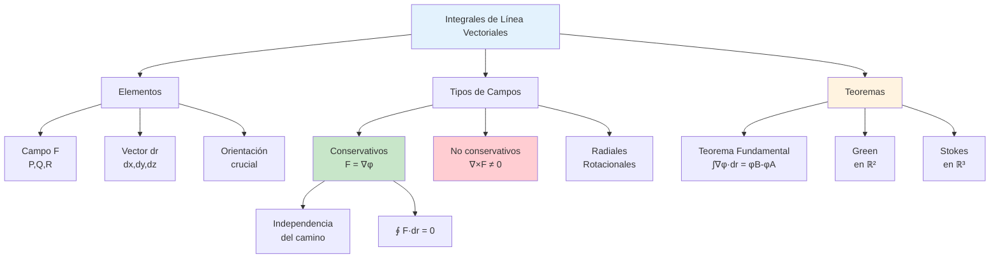

# 🧭 Integrales de Línea Vectoriales

## 🎯 Fundamentos de Integrales de Línea Vectoriales

> [!info]- 💡 Introducción a las Integrales de Línea Vectoriales Las **integrales de línea vectoriales** permiten integrar un campo vectorial a lo largo de una curva orientada en el espacio. A diferencia de las integrales de línea escalares que usan ds, estas integrales usan el vector diferencial **d**r** y calculan el "producto" del campo con la dirección de la curva.
> 
> **Analogías útiles:**
> 
> - **Física:** Trabajo realizado por una fuerza variable a lo largo de una trayectoria curva
> - **Fluidos:** Circulación de un fluido alrededor de una curva cerrada
> - **Electromagnetismo:** Fuerza electromotriz en un conductor en movimiento
> - **Ingeniería:** Bombeo de fluido a través de una tubería curva
> 
> **Diferencia fundamental:**
> 
> - **Integral escalar:** ∫_C f(x,y,z) ds - suma valores escalares ponderados por longitud
> - **Integral vectorial:** ∫_C **F**·d**r** - suma componentes del campo en dirección tangente
> 
> **Importancia histórica:**
> 
> - **Isaac Newton (1687):** Trabajo y fuerza en _Principia Mathematica_
> - **George Green (1828):** Teorema de Green para circulación
> - **George Stokes (1854):** Teorema de Stokes generalizado
> - **Hermann von Helmholtz (1858):** Circulación en fluidos
> - **James Clerk Maxwell (1861):** Campos electromagnéticos

### 📐 Definición Formal

> [!note]- 🌟 Concepto Matemático de Integral de Línea Vectorial **Definición:**
> 
> Sea **F**(x,y,z) = (P, Q, R) un campo vectorial continuo definido en una curva suave orientada C, parametrizada por:
> 
> **r**(t) = (x(t), y(t), z(t)), donde t ∈ [a,b]
> 
> La **integral de línea vectorial** (o **integral de trabajo**) de **F** sobre C se define como:
> 
> **∫_C F·dr = ∫ₐᵇ F(r(t))·r'(t) dt**
> 
> **Formas equivalentes:**
> 
> **1. Notación con producto punto:**
> 
> ```
> ∫_C F·dr = ∫ₐᵇ [P(r(t))x'(t) + Q(r(t))y'(t) + R(r(t))z'(t)] dt
> ```
> 
> **2. Notación diferencial:**
> 
> ```
> ∫_C F·dr = ∫_C P dx + Q dy + R dz
> ```
> 
> **3. Notación con vector tangente unitario:**
> 
> ```
> ∫_C F·dr = ∫_C (F·T) ds
> ```
> 
> Donde **T** = **r'**(t)/||**r'**(t)|| es el vector tangente unitario
> 
> **Componentes:**
> 
> - **P(x,y,z):** componente del campo en dirección x
> - **Q(x,y,z):** componente del campo en dirección y
> - **R(x,y,z):** componente del campo en dirección z
> - **dr** = (**dx**, **dy**, **dz**) = **r'**(t)dt
> 
> **Interpretación física:** Si **F** representa una fuerza, ∫_C **F**·d**r** representa el trabajo realizado por **F** al mover un objeto a lo largo de C.

### 🔄 Diferencia: Escalar vs Vectorial

> [!warning]- ⚖️ Comparación Fundamental
> 
> |Aspecto|Integral Escalar|Integral Vectorial|
> |---|---|---|
> |**Función**|f(x,y,z) escalar|**F**(x,y,z) vectorial|
> |**Notación**|∫_C f ds|∫_C **F**·d**r**|
> |**Elemento**|ds (longitud)|d**r** (vector)|
> |**Operación**|Multiplicación|Producto punto|
> |**Fórmula**|∫ f(r(t))·‖r'(t)‖ dt|∫ **F**(r(t))·**r'**(t) dt|
> |**Orientación**|Independiente|**Dependiente**|
> |**Interpretación**|Área de cortina|Trabajo, circulación|
> |**Resultado**|Siempre positivo (si f≥0)|Puede ser negativo|
> 
> **Ejemplo comparativo:**
> 
> ```
> C: segmento de (0,0) a (1,1)
> r(t) = (t,t), t ∈ [0,1]
> r'(t) = (1,1)
> 
> Escalar: f(x,y) = xy
> ∫_C f ds = ∫₀¹ t²·√2 dt = √2/3
> 
> Vectorial: F(x,y) = (y, x)
> ∫_C F·dr = ∫₀¹ (t,t)·(1,1) dt = ∫₀¹ 2t dt = 1
> 
> Resultados diferentes porque miden cosas diferentes
> ```

## 🧮 Elemento Diferencial d**r**

### 📏 Vector Diferencial

> [!success]- 🎯 Componentes de d**r** **Definición:**
> 
> El **elemento diferencial vectorial d**r**** representa un desplazamiento infinitesimal a lo largo de la curva C.
> 
> **Expresión fundamental:**
> 
> Para una curva parametrizada **r**(t) = (x(t), y(t), z(t)):
> 
> **dr = r'(t) dt = (dx, dy, dz) = (x'(t)dt, y'(t)dt, z'(t)dt)**
> 
> **Componentes:**
> 
> - **dx** = x'(t) dt - cambio en x
> - **dy** = y'(t) dt - cambio en y
> - **dz** = z'(t) dt - cambio en z
> 
> **Propiedades importantes:**
> 
> 1. **Es un vector:** Tiene magnitud y dirección
> 2. **Tangente a C:** Apunta en la dirección de movimiento
> 3. **Magnitud:** ||d**r**|| = ||**r'**(t)|| dt = ds
> 4. **Orientación:** Depende del sentido de recorrido de C
> 
> **Relación con ds:**
> 
> ```
> dr = T · ds
> ```
> 
> Donde **T** es el vector tangente unitario
> 
> **En diferentes contextos:**
> 
> **ℝ²:** d**r** = (dx, dy) = (x'(t)dt, y'(t)dt)
> 
> **ℝ³:** d**r** = (dx, dy, dz) = (x'(t)dt, y'(t)dt, z'(t)dt)

### 🔄 Dependencia de la Orientación

> [!warning]- ⚠️ Importancia Crucial del Sentido **A diferencia de las integrales escalares, las vectoriales SÍ dependen de la orientación:**
> 
> **Propiedad fundamental:**
> 
> ```
> ∫_C F·dr = -∫_{-C} F·dr
> ```
> 
> Donde -C representa la curva C recorrida en sentido opuesto.
> 
> **¿Por qué?**
> 
> Al invertir la orientación:
> 
> - **r'**(t) cambia de signo → -**r'**(t)
> - d**r** cambia de signo → -d**r**
> - El producto punto cambia de signo
> 
> **Ejemplo:**
> 
> ```
> F(x,y) = (y, -x)
> C: circunferencia x² + y² = 1
> 
> Sentido antihorario:
> r(t) = (cos t, sin t), t ∈ [0, 2π]
> ∫_C F·dr = 2π
> 
> Sentido horario:
> r(t) = (cos(-t), sin(-t)), t ∈ [0, 2π]
> ∫_{-C} F·dr = -2π
> ```
> 
> **Convención de orientación:**
> 
> - **Curvas cerradas en ℝ²:** Sentido antihorario (positivo)
> - **Superficies cerradas en ℝ³:** Normal hacia afuera
> - **Siempre especificar:** El sentido de recorrido

## 🔧 Cálculo de Integrales Vectoriales

### 📋 Procedimiento Paso a Paso

> [!example]- 🎯 Método de Cálculo **Pasos para calcular ∫_C F·dr:**
> 
> **Paso 1: Identificar el campo vectorial**
> 
> - **F**(x,y,z) = (P(x,y,z), Q(x,y,z), R(x,y,z))
> 
> **Paso 2: Parametrizar la curva**
> 
> - Encontrar **r**(t) = (x(t), y(t), z(t)), t ∈ [a,b]
> - Verificar orientación correcta
> 
> **Paso 3: Calcular r'(t)**
> 
> - **r'**(t) = (x'(t), y'(t), z'(t))
> 
> **Paso 4: Sustituir en F**
> 
> - **F**(r(t)) = (P(x(t),y(t),z(t)), Q(x(t),y(t),z(t)), R(x(t),y(t),z(t)))
> 
> **Paso 5: Calcular producto punto**
> 
> - **F**(r(t))·**r'**(t) = P·x'(t) + Q·y'(t) + R·z'(t)
> 
> **Paso 6: Integrar**
> 
> - ∫ₐᵇ [**F**(r(t))·**r'**(t)] dt
> 
> **Plantilla de trabajo:**
> 
> ```
> Dado: ∫_C F·dr donde F = (P, Q, R)
> 
> 1. r(t) = _______________
> 2. r'(t) = _______________
> 3. F(r(t)) = _______________
> 4. F·r' = _______________
> 5. Integral = ∫ₐᵇ _______________ dt
> 6. Resultado = _______________
> ```

### 📊 Ejemplos Detallados

> [!example]- 💪 Casos Prácticos Resueltos **Ejemplo 1: Trabajo sobre un segmento de recta**
> 
> Calcular ∫_C **F**·d**r** donde **F**(x,y) = (x², y) y C es el segmento de (0,0) a (2,4)
> 
> **Solución:**
> 
> ```
> Paso 1: F = (x², y)
> 
> Paso 2: Parametrización
> r(t) = (2t, 4t), t ∈ [0,1]
> (Recta de A a B: r(t) = A + t(B-A))
> 
> Paso 3: Derivada
> r'(t) = (2, 4)
> 
> Paso 4: Sustituir en F
> F(r(t)) = ((2t)², 4t) = (4t², 4t)
> 
> Paso 5: Producto punto
> F·r' = (4t², 4t)·(2, 4)
>      = 4t²·2 + 4t·4
>      = 8t² + 16t
> 
> Paso 6: Integrar
> ∫₀¹ (8t² + 16t) dt = [8t³/3 + 8t²]₀¹
>                    = 8/3 + 8
>                    = 32/3
> ```
> 
> ---
> 
> **Ejemplo 2: Circulación alrededor de una circunferencia**
> 
> Calcular ∫_C **F**·d**r** donde **F**(x,y) = (-y, x) y C es x² + y² = 1 (sentido antihorario)
> 
> **Solución:**
> 
> ```
> Paso 1: F = (-y, x)
> 
> Paso 2: Parametrización
> r(t) = (cos t, sin t), t ∈ [0, 2π]
> 
> Paso 3: Derivada
> r'(t) = (-sin t, cos t)
> 
> Paso 4: Sustituir en F
> F(r(t)) = (-sin t, cos t)
> 
> Paso 5: Producto punto
> F·r' = (-sin t, cos t)·(-sin t, cos t)
>      = sin²t + cos²t
>      = 1
> 
> Paso 6: Integrar
> ∫₀²π 1 dt = [t]₀²π = 2π
> ```
> 
> **Interpretación:** Circulación positiva (fluido gira en sentido antihorario)
> 
> ---
> 
> **Ejemplo 3: Trabajo sobre una hélice**
> 
> Calcular ∫_C **F**·d**r** donde **F**(x,y,z) = (y, -x, z) y C: **r**(t) = (cos t, sin t, t), t ∈ [0, 2π]
> 
> **Solución:**
> 
> ```
> Paso 1: F = (y, -x, z)
> 
> Paso 2: Parametrización (dada)
> r(t) = (cos t, sin t, t)
> 
> Paso 3: Derivada
> r'(t) = (-sin t, cos t, 1)
> 
> Paso 4: Sustituir en F
> F(r(t)) = (sin t, -cos t, t)
> 
> Paso 5: Producto punto
> F·r' = (sin t)(-sin t) + (-cos t)(cos t) + t·1
>      = -sin²t - cos²t + t
>      = -1 + t
> 
> Paso 6: Integrar
> ∫₀²π (-1 + t) dt = [-t + t²/2]₀²π
>                  = -2π + 2π²
>                  = 2π(π - 1)
> ```
> 
> ---
> 
> **Ejemplo 4: Curva por partes**
> 
> Calcular ∫_C **F**·d**r** donde **F**(x,y) = (x+y, x-y) y C es el triángulo con vértices (0,0), (1,0), (0,1) (sentido antihorario)
> 
> **Solución:**
> 
> ```
> Dividir en tres segmentos:
> 
> C₁: de (0,0) a (1,0)
> r₁(t) = (t, 0), t ∈ [0,1]
> r₁'(t) = (1, 0)
> F(r₁(t)) = (t, t)
> F·r₁' = t·1 + t·0 = t
> ∫_{C₁} = ∫₀¹ t dt = 1/2
> 
> C₂: de (1,0) a (0,1)
> r₂(t) = (1-t, t), t ∈ [0,1]
> r₂'(t) = (-1, 1)
> F(r₂(t)) = (1-t+t, 1-t-t) = (1, 1-2t)
> F·r₂' = 1·(-1) + (1-2t)·1 = -2t
> ∫_{C₂} = ∫₀¹ (-2t) dt = -1
> 
> C₃: de (0,1) a (0,0)
> r₃(t) = (0, 1-t), t ∈ [0,1]
> r₃'(t) = (0, -1)
> F(r₃(t)) = (1-t, t-1)
> F·r₃' = 0 + (t-1)·(-1) = 1-t
> ∫_{C₃} = ∫₀¹ (1-t) dt = 1/2
> 
> Total = 1/2 + (-1) + 1/2 = 0
> ```

## ⚡ Trabajo Mecánico

### 🔨 Definición Física

> [!success]- 💪 Trabajo Realizado por una Fuerza **Concepto físico:**
> 
> El **trabajo** es la energía transferida por una fuerza al mover un objeto a lo largo de una trayectoria.
> 
> **Fórmula fundamental:**
> 
> Si **F**(x,y,z) es un campo de fuerzas y C es la trayectoria:
> 
> **W = ∫_C F·dr**
> 
> **Unidades:**
> 
> - SI: Joules (J) = Newton·metro (N·m)
> - CGS: ergios = dina·cm
> - Imperial: foot-pound (ft·lb)
> 
> **Interpretación:**
> 
> - **W > 0:** La fuerza ayuda al movimiento (hace trabajo positivo)
> - **W = 0:** La fuerza es perpendicular al movimiento
> - **W < 0:** La fuerza se opone al movimiento (absorbe energía)
> 
> **Casos especiales:**
> 
> **1. Fuerza constante:**
> 
> ```
> Si F es constante: W = F·(B - A)
> ```
> 
> **2. Fuerza variable en línea recta:**
> 
> ```
> W = ∫ₐᵇ F(x)·dx
> ```
> 
> **3. Fuerza gravitatoria:**
> 
> ```
> F = -mg k
> W = -mg(z₂ - z₁)
> ```
> 
> Solo depende de la altura, no de la trayectoria

### 🎯 Ejemplos de Trabajo

> [!example]- 🏋️ Aplicaciones Físicas **Ejemplo 1: Trabajo contra la gravedad**
> 
> Un objeto de 5 kg se mueve desde (0,0,0) hasta (3,4,10) metros. Calcular el trabajo contra la gravedad.
> 
> **Solución:**
> 
> ```
> Fuerza gravitatoria: F = (0, 0, -mg) = (0, 0, -49) N
> (g = 9.8 m/s²)
> 
> Para cualquier trayectoria:
> W = -F·Δr = -(0,0,-49)·(3,4,10)
>   = 49·10 = 490 J
> 
> El trabajo es independiente de la trayectoria
> ```
> 
> **Ejemplo 2: Trabajo de una fuerza radial**
> 
> **F**(x,y) = (x, y) empuja un objeto a lo largo de C: r(t) = (cos t, sin t), t ∈ [0, π]
> 
> **Solución:**
> 
> ```
> r'(t) = (-sin t, cos t)
> F(r(t)) = (cos t, sin t)
> 
> F·r' = cos t·(-sin t) + sin t·cos t
>      = -sin t cos t + sin t cos t
>      = 0
> 
> W = ∫₀π 0 dt = 0
> ```
> 
> **Interpretación:** Fuerza radial es perpendicular al movimiento circular
> 
> ---
> 
> **Ejemplo 3: Trabajo en campo no conservativo**
> 
> **F**(x,y) = (y², 2xy), calcular trabajo de (0,0) a (1,1):
> 
> - Por C₁: recta y = x
> - Por C₂: parábola y = x²
> 
> **C₁:** y = x
> 
> ```
> r(t) = (t, t), t ∈ [0,1]
> r'(t) = (1, 1)
> F(r(t)) = (t², 2t²)
> F·r' = t² + 2t² = 3t²
> W₁ = ∫₀¹ 3t² dt = 1
> ```
> 
> **C₂:** y = x²
> 
> ```
> r(t) = (t, t²), t ∈ [0,1]
> r'(t) = (1, 2t)
> F(r(t)) = (t⁴, 2t³)
> F·r' = t⁴ + 4t⁴ = 5t⁴
> W₂ = ∫₀¹ 5t⁴ dt = 1
> ```
> 
> **¡Sorpresa!** W₁ = W₂ = 1 (veremos por qué en campos conservativos)

## 🌊 Circulación y Flujo

### 🔄 Circulación

> [!note]- 🌀 Circulación de un Campo **Definición:**
> 
> La **circulación** de un campo vectorial **F** alrededor de una curva cerrada C es:
> 
> **Circ_C(F) = ∮_C F·dr**
> 
> **Interpretación física:**
> 
> - Mide la tendencia del campo a "circular" alrededor de C
> - En fluidos: rotación del fluido alrededor de C
> - En electromagnetismo: trabajo por unidad de carga en un circuito
> 
> **Propiedades:**
> 
> - **Circ > 0:** Circulación en sentido positivo (antihorario)
> - **Circ = 0:** No hay circulación neta
> - **Circ < 0:** Circulación en sentido negativo (horario)
> 
> **Ejemplo:**
> 
> ```
> Campo rotacional: F(x,y) = (-y, x)
> Circunferencia unitaria C (antihoraria)
> 
> ∮_C F·dr = 2π > 0  (circulación positiva)
> 
> Campo radial: F(x,y) = (x, y)
> Misma circunferencia C
> 
> ∮_C F·dr = 0  (sin circulación)
> ```
> 
> **Relación con el rotacional:** Por el Teorema de Stokes:
> 
> ```
> ∮_C F·dr = ∬_R (∇×F)·n dA
> ```
> 
> La circulación está relacionada con el rotacional del campo

### 💨 Flujo a Través de una Curva (en ℝ²)

> [!tip]- 🌊 Flujo Perpendicular **Definición (solo en ℝ²):**
> 
> El **flujo** de **F**(x,y) = (P, Q) a través de una curva C en el plano es:
> 
> **Flujo = ∫_C F·n ds = ∫_C -Q dx + P dy**
> 
> Donde **n** es el vector normal unitario a C (perpendicular a la derecha)
> 
> **Vector normal:** Si **T** = (dx/ds, dy/ds) es tangente, entonces:
> 
> ```
> n = (dy/ds, -dx/ds)
> ```
> 
> **Interpretación:**
> 
> - Mide cuánto del campo atraviesa la curva
> - Positivo: flujo en dirección de **n**
> - Negativo: flujo en dirección opuesta
> 
> **Relación con circulación:**
> 
> ```
> Flujo de F a través de C = Circulación de F⊥ alrededor de C
> donde F⊥ = (-Q, P)
> ```
> 
> **Ejemplo:**
> 
> ```
> F(x,y) = (x, y)  (campo radial saliente)
> C: circunferencia x² + y² = 1
> 
> Flujo = ∮_C x dy - y dx
> 
> r(t) = (cos t, sin t), t ∈ [0, 2π]
> x dy - y dx = cos t·cos t dt - sin t·(-sin t dt)
>             = (cos²t + sin²t) dt = dt
> 
> Flujo = ∫₀²π dt = 2π > 0
> 
> Flujo positivo (sale de la circunferencia)
> ```

## ⭐ Campos Vectoriales Conservativos

### 🎯 Definición y Propiedades

> [!warning]- 🔑 Campos Especiales **Definición:**
> 
> Un campo vectorial **F** es **conservativo** si existe una función escalar φ (llamada **función potencial**) tal que:
> 
> **F = ∇φ**
> 
> Es decir:
> 
> ```
> F = (P, Q, R) = (∂φ/∂x, ∂φ/∂y, ∂φ/∂z)
> ```
> 
> **Nombres alternativos:**
> 
> - Campo gradiente
> - Campo irrotacional (cuando ∇×**F** = **0**)
> - Campo de potencial
> 
> **Propiedades fundamentales:**
> 
> **1. Independencia del camino:**
> 
> ```
> ∫_C F·dr depende solo de los extremos de C
> ```
> 
> **2. Trabajo en curvas cerradas:**
> 
> ```
> ∮_C F·dr = 0  para toda curva cerrada C
> ```
> 
> **3. Condición necesaria (en dominios simplemente conexos):**
> 
> ```
> ∇×F = 0  (rotacional cero)
> ```
> 
> **4. En ℝ²:** Si **F** = (P, Q):
> 
> ```
> ∂P/∂y = ∂Q/∂x  (condición de integrabilidad)
> ```
> 
> **5. En ℝ³:** Si **F** = (P, Q, R):
> 
> ```
> ∂P/∂y = ∂Q/∂x
> ∂P/∂z = ∂R/∂x
> ∂Q/∂z = ∂R/∂y
> ```

### 🧮 Verificación de Conservatividad

> [!example]- 🔍 Cómo Verificar **Método en ℝ²:**
> 
> Dado **F**(x,y) = (P(x,y), Q(x,y))
> 
> **Paso 1:** Verificar si ∂P/∂y = ∂Q/∂x
> 
> **Paso 2:** Si sí, encontrar φ tal que:
> 
> - ∂φ/∂x = P
> - ∂φ/∂y = Q
> 
> **Ejemplo 1:** **F**(x,y) = (2xy, x²)
> 
> **Solución:**
> 
> ```
> P = 2xy,  Q = x²
> 
> ∂P/∂y = 2x
> ∂Q/∂x = 2x
> 
> ∂P/∂y = ∂Q/∂x ✓  → Es conservativo
> 
> Encontrar φ:
> ∂φ/∂x = 2xy  →  φ = x²y + g(y)
> ∂φ/∂y = x² + g'(y) = x²  →  g'(y) = 0  →  g(y) = C
> 
> φ(x,y) = x²y + C
> 
> Verificación: ∇φ = (2xy, x²) = F ✓
> ```
> 
> **Ejemplo 2:** **F**(x,y) = (y, -x)
> 
> **Solución:**
> 
> ```
> P = y,  Q = -x
> 
> ∂P/∂y = 1
> ∂Q/∂x = -1
> 
> ∂P/∂y ≠ ∂Q/∂x  → NO es conservativo
> 
> (Campo rotacional puro)
> ```
> 
> ---
> 
> **Método en ℝ³:**
> 
> Dado **F**(x,y,z) = (P, Q, R)
> 
> **Calcular el rotacional:**
> 
> ```
> ∇×F = |  i      j      k   |
>       | ∂/∂x   ∂/∂y   ∂/∂z |
>       |  P      Q      R   |
> 
>     = (∂R/∂y - ∂Q/∂z, ∂P/∂z - ∂R/∂x, ∂Q/∂x - ∂P/∂y)
> ```
> 
> Si ∇×**F** = **0**, entonces **F** es conservativo
> 
> **Ejemplo:** **F**(x,y,z) = (yz, xz, xy)
> 
> **Solución:**
> 
> ```
> P = yz,  Q = xz,  R = xy
> 
> ∂R/∂y - ∂Q/∂z = x - x = 0 ✓
> ∂P/∂z - ∂R/∂x = y - y = 0 ✓ ∂Q/∂x - ∂P/∂y = z - z = 0 ✓
> 
> ∇×F = 0 → Es conservativo
> 
> Función potencial: ∂φ/∂x = yz → φ = xyz + g(y,z) ∂φ/∂y = xz + ∂g/∂y = xz → g(y,z) = h(z) ∂φ/∂z = xy + h'(z) = xy → h(z) = C
> 
> φ(x,y,z) = xyz + C
> ```

## 📐 Teorema Fundamental para Integrales de Línea

### 🌟 Enunciado del Teorema

> [!success]- 🎓 Teorema Fundamental **Teorema:**
> 
> Si **F** es un campo vectorial conservativo con función potencial φ, y C es una curva suave que va de A hasta B, entonces:
> 
> **∫_C F·dr = φ(B) - φ(A)**
> 
> **Analogía con cálculo de una variable:**
> 
> ```
> ∫ₐᵇ f'(x) dx = f(b) - f(a)
> 
> Se generaliza a:
> 
> ∫_C ∇φ·dr = φ(final) - φ(inicial)
> ```
> 
> **Consecuencias:**
> 
> **1. Independencia del camino:** El valor de la integral depende solo de los puntos inicial y final, no de la trayectoria.
> 
> **2. Circulación cero:** Para cualquier curva cerrada C:
> 
> ```
> ∮_C F·dr = φ(A) - φ(A) = 0
> ```
> 
> **3. Cálculo simplificado:** No necesitamos parametrizar la curva, solo evaluar φ en los extremos.
> 
> **Demostración (idea):**
> 
> ```
> ∫_C F·dr = ∫_C ∇φ·dr
>          = ∫ₐᵇ ∇φ(r(t))·r'(t) dt
>          = ∫ₐᵇ dφ/dt dt    (regla de la cadena)
>          = [φ(r(t))]ₐᵇ
>          = φ(r(b)) - φ(r(a))
>          = φ(B) - φ(A)
> ```

### 🎯 Aplicaciones del Teorema

> [!example]- 💡 Ejemplos de Uso **Ejemplo 1: Cálculo directo**
> 
> Calcular ∫_C **F**·d**r** donde **F**(x,y) = (2xy, x²) desde (0,0) hasta (1,2) por cualquier camino.
> 
> **Solución:**
> 
> ```
> Paso 1: Verificar conservatividad
> P = 2xy,  Q = x²
> ∂P/∂y = 2x = ∂Q/∂x ✓
> 
> Paso 2: Encontrar φ
> Ya calculamos: φ(x,y) = x²y
> 
> Paso 3: Aplicar el teorema
> ∫_C F·dr = φ(1,2) - φ(0,0)
>          = 1²·2 - 0
>          = 2
> 
> Sin importar qué camino tomemos, el resultado es 2
> ```
> 
> ---
> 
> **Ejemplo 2: Comparación de caminos**
> 
> **F**(x,y,z) = (yz, xz, xy), de A=(0,0,0) a B=(1,1,1)
> 
> **Camino 1:** Recta directa **Camino 2:** (0,0,0)→(1,0,0)→(1,1,0)→(1,1,1) **Camino 3:** Parábola arbitraria
> 
> **Solución:**
> 
> ```
> Ya sabemos que F es conservativo con φ = xyz
> 
> Para CUALQUIER camino:
> ∫_C F·dr = φ(1,1,1) - φ(0,0,0)
>          = 1·1·1 - 0
>          = 1
> 
> Todos los caminos dan el mismo resultado
> ```
> 
> ---
> 
> **Ejemplo 3: Energía potencial**
> 
> Campo gravitatorio: **F** = -mg**k** = (0, 0, -mg)
> 
> **Solución:**
> 
> ```
> Verificar conservatividad:
> ∇×F = 0 ✓
> 
> Función potencial:
> ∂φ/∂z = -mg  →  φ = -mgz + C
> 
> Tomando C = 0:
> φ(x,y,z) = -mgz  (energía potencial gravitatoria)
> 
> Trabajo de z₁ a z₂:
> W = φ(z₂) - φ(z₁) = -mg(z₂ - z₁)
> 
> Si z₂ > z₁: W < 0 (trabajo contra la gravedad)
> Si z₂ < z₁: W > 0 (gravedad hace trabajo)
> ```

## 🔗 Propiedades de las Integrales Vectoriales

### ➕ Linealidad y Aditividad

> [!note]- 📐 Propiedades Algebraicas **1. Linealidad respecto al campo:**
> 
> ```
> ∫_C (αF + βG)·dr = α∫_C F·dr + β∫_C G·dr
> ```
> 
> **2. Aditividad respecto a la curva:** Si C = C₁ ∪ C₂:
> 
> ```
> ∫_C F·dr = ∫_{C₁} F·dr + ∫_{C₂} F·dr
> ```
> 
> **3. Inversión de orientación:**
> 
> ```
> ∫_C F·dr = -∫_{-C} F·dr
> ```
> 
> **4. Acotación:** Si ||**F**|| ≤ M en C:
> 
> ```
> |∫_C F·dr| ≤ M·L
> ```
> 
> Donde L es la longitud de C
> 
> **Ejemplos:**
> 
> ```
> Si F = (x,y) y G = (y,-x):
> 
> ∫_C (2F + 3G)·dr = 2∫_C F·dr + 3∫_C G·dr
> 
> Si C va de A a B pasando por P:
> ∫_C F·dr = ∫_{A→P} F·dr + ∫_{P→B} F·dr
> ```

### 🔄 Comparación de Métodos

> [!tip]- ⚖️ Cuándo Usar Cada Método
> 
> |Situación|Método Recomendado|
> |---|---|
> |**F es conservativo**|Usar φ(B) - φ(A)|
> |**Curva muy complicada**|Verificar si F es conservativo primero|
> |**Curva cerrada y F conservativo**|Resultado = 0 inmediato|
> |**F no conservativo**|Parametrizar y calcular integral|
> |**Múltiples caminos**|Si F conservativo, todos dan igual|
> |**Campo en ℝ²**|Verificar ∂P/∂y = ∂Q/∂x|
> |**Campo en ℝ³**|Calcular ∇×F|
> 
> **Estrategia general:**
> 
> **Paso 1:** ¿El campo es conservativo?
> 
> - SÍ → Encontrar φ y usar φ(B) - φ(A)
> - NO → Parametrizar y calcular
> 
> **Paso 2:** ¿La curva es cerrada?
> 
> - SÍ y F conservativo → Resultado = 0
> - SÍ y F no conservativo → Calcular (puede ≠ 0)
> 
> **Paso 3:** ¿Hay múltiples caminos?
> 
> - F conservativo → Elegir el más simple
> - F no conservativo → Cada camino da diferente resultado

## 🎨 Visualización de Campos

### 🌐 Tipos de Campos Vectoriales

> [!info]- 🎭 Clasificación Visual **1. Campo radial:**
> 
> ```
> F(x,y) = (x, y)
> ```
> 
> - Vectores apuntan hacia afuera del origen
> - Magnitud crece con distancia
> - Conservativo: φ = (x² + y²)/2
> 
> **2. Campo rotacional:**
> 
> ```
> F(x,y) = (-y, x)
> ```
> 
> - Vectores tangentes a círculos
> - Circulación no cero
> - NO conservativo
> 
> **3. Campo uniforme:**
> 
> ```
> F(x,y) = (a, b)  (constantes)
> ```
> 
> - Todos los vectores iguales
> - Conservativo: φ = ax + by
> 
> **4. Campo gravitatorio:**
> 
> ```
> F = -GMm/r² · r̂
> ```
> 
> - Apunta hacia centro
> - Conservativo: φ = -GMm/r
> 
> **5. Campo de vórtice:**
> 
> ```
> F(x,y) = (-y/(x²+y²), x/(x²+y²))
> ```
> 
> - Rotación alrededor del origen
> - ∇×F = 0 excepto en origen
> - Conservativo en regiones sin el origen

## 🧩 Ejercicios Integrales

> [!example]- 💪 Práctica Completa **Nivel 1 - Básico:** 🟢
> 
> **1.** Calcular ∫_C **F**·d**r** donde **F**(x,y) = (3, 2) y C es cualquier curva de (0,0) a (2,3)
> 
> **Solución:**
> 
> ```
> F es constante → conservativo
> ∂P/∂y = 0 = ∂Q/∂x ✓
> 
> φ(x,y) = 3x + 2y
> 
> ∫_C F·dr = φ(2,3) - φ(0,0)
>          = 6 + 6 - 0
>          = 12
> ```
> 
> **2.** Calcular ∫_C (x dx + y dy) donde C: **r**(t) = (cos t, sin t), t ∈ [0, π]
> 
> **Solución:**
> 
> ```
> F = (x, y)
> r'(t) = (-sin t, cos t)
> 
> F·r' = cos t·(-sin t) + sin t·cos t = 0
> 
> ∫_C F·dr = ∫₀π 0 dt = 0
> 
> Alternativamente: F = ∇((x²+y²)/2)
> φ(-1,0) - φ(1,0) = 1/2 - 1/2 = 0
> ```
> 
> ---
> 
> **Nivel 2 - Intermedio:** 🟡
> 
> **3.** Verificar si **F**(x,y) = (2xy + y², x² + 2xy - 1) es conservativo. Si lo es, encontrar φ.
> 
> **Solución:**
> 
> ```
> P = 2xy + y²,  Q = x² + 2xy - 1
> 
> ∂P/∂y = 2x + 2y
> ∂Q/∂x = 2x + 2y
> 
> ∂P/∂y = ∂Q/∂x ✓ → Es conservativo
> 
> Encontrar φ:
> ∂φ/∂x = 2xy + y²
> φ = x²y + xy² + g(y)
> 
> ∂φ/∂y = x² + 2xy + g'(y) = x² + 2xy - 1
> g'(y) = -1
> g(y) = -y
> 
> φ(x,y) = x²y + xy² - y + C
> ```
> 
> **4.** Calcular ∫_C **F**·d**r** donde **F**(x,y) = (y², 2xy) desde (0,1) hasta (1,2)
> 
> - Por C₁: recta
> - Por C₂: parábola y = x + 1
> 
> **Solución:**
> 
> ```
> Verificar conservatividad:
> ∂P/∂y = 2y = ∂Q/∂x ✓
> 
> φ(x,y) = xy² (verificar)
> 
> Por cualquier camino:
> ∫_C F·dr = φ(1,2) - φ(0,1)
>          = 1·4 - 0·1
>          = 4
> ```
> 
> ---
> 
> **Nivel 3 - Avanzado:** 🔴
> 
> **5.** Calcular ∮_C **F**·d**r** donde **F**(x,y) = (-y/(x²+y²), x/(x²+y²)) y C es x² + y² = 4 (antihoraria)
> 
> **Solución:**
> 
> ```
> Este es el campo de vórtice
> 
> r(t) = (2cos t, 2sin t), t ∈ [0, 2π]
> r'(t) = (-2sin t, 2cos t)
> 
> F(r(t)) = (-2sin t/4, 2cos t/4) = (-sin t/2, cos t/2)
> 
> F·r' = (-sin t/2)(-2sin t) + (cos t/2)(2cos t)
>      = sin²t + cos²t
>      = 1
> 
> ∮_C F·dr = ∫₀²π 1 dt = 2π
> 
> Nota: F no es conservativo en regiones que contengan
> el origen (∇×F ≠ 0 en el origen)
> ```
> 
> **6.** Campo **F**(x,y,z) = (y²z³, 2xyz³, 3xy²z²)
> 
> - Verificar si es conservativo
> - Encontrar φ si existe
> - Calcular trabajo de (0,0,0) a (1,1,1)
> 
> **Solución:**
> 
> ```
> Calcular ∇×F:
> 
> ∂R/∂y - ∂Q/∂z = 6xyz² - 6xyz² = 0 ✓
> ∂P/∂z - ∂R/∂x = 3y²z² - 3y²z² = 0 ✓
> ∂Q/∂x - ∂P/∂y = 2yz³ - 2yz³ = 0 ✓
> 
> Es conservativo ✓
> 
> Encontrar φ:
> ∂φ/∂x = y²z³  →  φ = xy²z³ + g(y,z)
> ∂φ/∂y = 2xyz³ + ∂g/∂y = 2xyz³  →  g(y,z) = h(z)
> ∂φ/∂z = 3xy²z² + h'(z) = 3xy²z²  →  h(z) = C
> 
> φ(x,y,z) = xy²z³
> 
> Trabajo = φ(1,1,1) - φ(0,0,0) = 1 - 0 = 1
> ```

## 🔗 Conexiones con el Sistema de Notas

> [!quote]- 🌟 Enlaces Conceptuales
> 
> **Prerequisites (Prerrequisitos):**
> 
> - [[01 - Integrales de Línea Escalares]] - Base de integrales sobre curvas
> - [[02 - Vectores en ℝ³]] - Operaciones vectoriales, producto punto
> - [[Campos Vectoriales]] - Funciones **F**: ℝⁿ → ℝⁿ
> - [[Producto Punto]] - **F**·d**r** = componente tangencial
> - [[Parametrización de Curvas]] - Representación **r**(t)
> - [[Derivadas Parciales]] - Para verificar conservatividad
> - [[Gradiente]] - ∇φ = **F** en campos conservativos
> 
> **Conceptos relacionados directamente:**
> 
> - [[Función Potencial]] - φ tal que **F** = ∇φ
> - [[Campos Conservativos]] - Independencia del camino
> - [[Rotacional]] - ∇×**F**, condición necesaria
> - [[Trabajo Mecánico]] - W = ∫_C **F**·d**r**
> - [[Circulación]] - ∮_C **F**·d**r** en curvas cerradas
> - [[Vector Tangente]] - **T** = **r'**/||**r'**||
> - [[Orientación de Curvas]] - Importancia del sentido
> 
> **Teoremas fundamentales:**
> 
> - [[Teorema Fundamental de Integrales de Línea]] - ∫_C ∇φ·d**r** = φ(B) - φ(A)
> - [[Teorema de Green]] - Relaciona ∮_C con ∬_R en ℝ²
> - [[Teorema de Stokes]] - Relaciona ∮_C con ∬_S (rotacional)
> - [[Teorema de la Divergencia]] - Gauss, para integrales de superficie
> 
> **Temas siguientes:**
> 
> - [[03 - Teorema de Green]] - Caso especial en ℝ²
> - [[04 - Campos Conservativos y Potenciales]] - Teoría completa
> - [[05 - Integrales de Superficie]] - Extensión a 2D en ℝ³
> - [[06 - Teorema de Stokes]] - Generalización de Green
> - [[07 - Divergencia y Teorema de Gauss]] - Flujo a través de superficies
> - [[08 - Formas Diferenciales]] - Formalización abstracta
> 
> **Aplicaciones físicas:**
> 
> - [[Trabajo y Energía]] - Conservación de energía mecánica
> - [[Energía Potencial]] - φ(x,y,z) en campos conservativos
> - [[Ley de Faraday]] - Fuerza electromotriz = -dΦ_B/dt
> - [[Flujo de Fluidos]] - Ecuaciones de Navier-Stokes
> - [[Campo Gravitatorio]] - **F** = -∇φ, φ = -GM/r
> - [[Campo Eléctrico]] - **E** = -∇V (potencial eléctrico)
> - [[Flujo Magnético]] - ∮_C **B**·d**r** (Ley de Ampère)
> 
> **Conceptos matemáticos avanzados:**
> 
> - [[Dominios Simplemente Conexos]] - Para garantizar conservatividad
> - [[Exactitud de Formas Diferenciales]] - Generalización
> - [[Cohomología de De Rham]] - Teoría topológica
> - [[Geometría Diferencial]] - Curvas y campos en variedades
> - [[Teorema de Poincaré]] - Formas cerradas localmente exactas
> - [[Índice de una Curva]] - Winding number
> 
> **Herramientas de cálculo:**
> 
> - [[Rotacional (Curl)]] - ∇×**F** para verificar conservatividad
> - [[Divergencia]] - ∇·**F** para Teorema de Gauss
> - [[Operador Nabla]] - ∇ = (∂/∂x, ∂/∂y, ∂/∂z)
> - [[Laplaciano]] - ∇²φ = ∇·(∇φ)
> - [[Identidades Vectoriales]] - Relaciones entre ∇, ×, ·
> 
> **Métodos numéricos:**
> 
> - [[Integración Numérica de Curvas]] - Aproximaciones discretas
> - [[Método de Simpson Vectorial]] - Cálculo aproximado
> - [[Diferencias Finitas]] - Para calcular gradientes
> - [[Python - SciPy]] - Funciones integrate.quad_vec
> - [[MATLAB - Line Integrals]] - Implementaciones
> 
> **Aplicaciones interdisciplinarias:**
> 
> - [[Mecánica Analítica]] - Lagrangianos y Hamiltonianos
> - [[Electrodinámica]] - Ecuaciones de Maxwell
> - [[Termodinámica]] - Funciones de estado y procesos
> - [[Mecánica de Fluidos]] - Circulación y vorticidad
> - [[Teoría de Control]] - Campos vectoriales en sistemas dinámicos
> - [[Computación Gráfica]] - Campos de velocidad, animación
> - [[Robótica]] - Planificación de trayectorias con fuerzas
> 
> **Conexiones con física:**
> 
> - [[Primera Ley de la Termodinámica]] - dU = δQ - δW
> - [[Conservación de Energía Mecánica]] - Campos conservativos
> - [[Potenciales Centrales]] - Fuerzas que dependen solo de r
> - [[Principio de Mínima Acción]] - Calculus of variations
> - [[Ecuaciones de Hamilton]] - Sistemas conservativos
> 
> **Temas relacionados en análisis:**
> 
> - [[Teorema de Fubini]] - Cambio de orden en integrales
> - [[Cambio de Variables]] - Jacobiano en integrales múltiples
> - [[Medida de Lebesgue]] - Teoría de la medida
> - [[01 - Integrales Impropias]] - Cuando dominios no son acotados

## 💡 Consejos de Estudio y Errores Comunes

> [!tip]- 🧠 Estrategias de Aprendizaje **Para dominar integrales vectoriales:**
> 
> **1. Comprensión conceptual:**
> 
> - Entender la diferencia entre ds y d**r**
> - Visualizar campos vectoriales (usar software)
> - Comprender el significado físico (trabajo, circulación)
> - Distinguir cuándo importa la orientación
> 
> **2. Verificación de conservatividad:**
> 
> - SIEMPRE verificar primero si F es conservativo
> - Memorizar condiciones: ∂P/∂y = ∂Q/∂x (en ℝ²)
> - Practicar cálculo de rotacional
> - Encontrar funciones potenciales sistemáticamente
> 
> **3. Estrategia de cálculo:**
> 
> - Checklist: ¿Conservativo? → Usar φ
> - Si no: parametrizar cuidadosamente
> - Verificar orientación
> - Comprobar límites de integración
> 
> **4. Casos especiales:**
> 
> - Reconocer campos conservativos comunes
> - Campos radiales, uniformes, gravitatorios
> - Identificar simetrías que simplifican cálculos
> 
> **Errores comunes a evitar:**
> 
> ❌ **Error 1:** Confundir ∫_C f ds con ∫_C **F**·d**r**
> 
> ```
> ∫_C f ds usa ||r'|| (escalar, siempre positivo)
> ∫_C F·dr usa F·r' (producto punto, puede ser negativo)
> ```
> 
> ❌ **Error 2:** Olvidar que la orientación importa
> 
> ```
> ∫_C F·dr = -∫_{-C} F·dr
> 
> SIEMPRE especificar dirección de recorrido
> ```
> 
> ❌ **Error 3:** Asumir que todo campo es conservativo
> 
> ```
> Verificar SIEMPRE: ∂P/∂y = ∂Q/∂x (ℝ²)
> o ∇×F = 0 (ℝ³)
> ```
> 
> ❌ **Error 4:** Calcular integral cuando F es conservativo
> 
> ```
> Si F = ∇φ: usar φ(B) - φ(A) directamente
> No parametrizar innecesariamente
> ```
> 
> ❌ **Error 5:** Confundir componentes en producto punto
> 
> ```
> F·r' = P·x'(t) + Q·y'(t) + R·z'(t)
> 
> NO es: P·x(t) + Q·y(t) + R·z(t)
> ```
> 
> ❌ **Error 6:** Errores en derivadas parciales
> 
> ```
> Al verificar conservatividad:
> ∂(xy²)/∂y = 2xy ✓
> ∂(x²y)/∂x = 2xy ✓
> 
> NO confundir x con y
> ```
> 
> ❌ **Error 7:** Ignorar el dominio
> 
> ```
> F(x,y) = (-y/(x²+y²), x/(x²+y²))
> 
> No está definido en (0,0)
> Puede ser conservativo fuera del origen pero no globalmente
> ```

## 📊 Tabla Resumen Comparativa

> [!example]- 📋 Compendio Completo
> 
> |Concepto|Integral Escalar|Integral Vectorial|
> |---|---|---|
> |**Notación**|∫_C f ds|∫_C **F**·d**r**|
> |**Función**|f: ℝⁿ → ℝ|**F**: ℝⁿ → ℝⁿ|
> |**Elemento**|ds = ‖**r'**‖dt|d**r** = **r'**dt|
> |**Fórmula**|∫ f(r(t))·‖r'‖ dt|∫ **F**(r(t))·**r'**(t) dt|
> |**Operación**|Multiplicación escalar|Producto punto|
> |**Resultado**|Escalar ≥ 0 (si f≥0)|Escalar (cualquier signo)|
> |**Orientación**|Independiente|**Dependiente**|
> |**Interpretación**|Masa, longitud, área|Trabajo, circulación|
> |**Curva cerrada**|Perímetro si f=1|Circulación (puede ≠ 0)|
> |**Campo conservativo**|N/A|= φ(B) - φ(A)|
> 
> **Fórmulas clave:**
> 
> |Concepto|Fórmula|Condición|
> |---|---|---|
> |**Trabajo**|W = ∫_C **F**·d**r**|**F** = fuerza|
> |**Circulación**|Γ = ∮_C **F**·d**r**|Curva cerrada|
> |**Conservativo (ℝ²)**|∂P/∂y = ∂Q/∂x|En dominio simple|
> |**Conservativo (ℝ³)**|∇×**F** = **0**|En dominio simple|
> |**Teorema fund.**|∫_C ∇φ·d**r** = φ(B)-φ(A)|**F** conservativo|
> |**Independencia camino**|∫_{C₁} = ∫_{C₂}|Mismos extremos, **F** conservativo|

## 🎨 Diagrama Conceptual



---

**Tags:** #integrales-de-línea-vectoriales #campos-vectoriales #trabajo-mecánico #circulación #campos-conservativos #función-potencial #teorema-fundamental #rotacional #independencia-camino #cálculo-vectorial #física-matemática #university #matemáticas #análisis-vectorial
