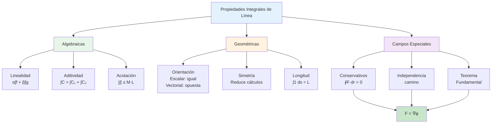

# 🔧 Propiedades de las Integrales de Línea

## 🎯 Fundamentos de las Propiedades

> [!info]- 💡 Introducción a las Propiedades Las **propiedades de las integrales de línea** son reglas algebraicas y geométricas que nos permiten simplificar cálculos, descomponer problemas complejos y entender mejor el comportamiento de estas integrales. Estas propiedades se dividen en dos categorías: propiedades compartidas por integrales escalares y vectoriales, y propiedades exclusivas de cada tipo.
> 
> **Importancia:**
> 
> - **Simplificación:** Reducir cálculos complejos a casos más simples
> - **Verificación:** Comprobar resultados mediante propiedades conocidas
> - **Teoría:** Base para teoremas fundamentales (Green, Stokes, Divergencia)
> - **Aplicaciones:** Optimizar cálculos en física e ingeniería
> 
> **Analogía:** Así como las propiedades de las integrales ordinarias (∫(f+g) = ∫f + ∫g) simplifican cálculos, las propiedades de integrales de línea nos ayudan a trabajar con curvas y campos complejos de manera sistemática.
> 
> **Clasificación:**
> 
> 1. **Propiedades algebraicas:** Linealidad, aditividad
> 2. **Propiedades geométricas:** Orientación, concatenación de curvas
> 3. **Propiedades de acotación:** Desigualdades útiles
> 4. **Propiedades especiales:** Campos conservativos, simetrías

## ➕ Propiedades Algebraicas

### 📐 Linealidad

> [!success]- ✨ Propiedad Fundamental **Para integrales de línea escalares:**
> 
> Si f y g son funciones escalares y α, β son constantes reales:
> 
> **∫_C [αf(x,y,z) + βg(x,y,z)] ds = α∫_C f ds + β∫_C g ds**
> 
> **Para integrales de línea vectoriales:**
> 
> Si **F** y **G** son campos vectoriales y α, β son constantes:
> 
> **∫_C [αF + βG]·dr = α∫_C F·dr + β∫_C G·dr**
> 
> **Demostración (caso vectorial):**
> 
> ```
> ∫_C [αF + βG]·dr = ∫ₐᵇ [αF(r(t)) + βG(r(t))]·r'(t) dt
>                   = ∫ₐᵇ [αF(r(t))·r'(t) + βG(r(t))·r'(t)] dt
>                   = α∫ₐᵇ F(r(t))·r'(t) dt + β∫ₐᵇ G(r(t))·r'(t) dt
>                   = α∫_C F·dr + β∫_C G·dr
> ```
> 
> **Casos especiales:**
> 
> **1. Multiplicación por constante:**
> 
> ```
> ∫_C kf ds = k∫_C f ds
> ∫_C kF·dr = k∫_C F·dr
> ```
> 
> **2. Suma de funciones:**
> 
> ```
> ∫_C (f + g) ds = ∫_C f ds + ∫_C g ds
> ∫_C (F + G)·dr = ∫_C F·dr + ∫_C G·dr
> ```
> 
> **3. Resta de funciones:**
> 
> ```
> ∫_C (f - g) ds = ∫_C f ds - ∫_C g ds
> ∫_C (F - G)·dr = ∫_C F·dr - ∫_C G·dr
> ```

### 🎯 Ejemplos de Linealidad

> [!example]- 💡 Aplicaciones Prácticas **Ejemplo 1: Linealidad escalar**
> 
> Calcular ∫_C (3x + 2y) ds donde C: **r**(t) = (t, t²), t ∈ [0,1]
> 
> **Solución usando linealidad:**
> 
> ```
> ∫_C (3x + 2y) ds = 3∫_C x ds + 2∫_C y ds
> 
> ||r'(t)|| = √(1 + 4t²)
> 
> ∫_C x ds = ∫₀¹ t√(1 + 4t²) dt
> ∫_C y ds = ∫₀¹ t²√(1 + 4t²) dt
> 
> Resultado final = 3·(primera) + 2·(segunda)
> ```
> 
> ---
> 
> **Ejemplo 2: Linealidad vectorial**
> 
> **F**(x,y) = (2x, 3y), **G**(x,y) = (y, -x) C: segmento de (0,0) a (1,1)
> 
> Calcular ∫_C (2**F** - **G**)·d**r**
> 
> **Solución:**
> 
> ```
> ∫_C (2F - G)·dr = 2∫_C F·dr - ∫_C G·dr
> 
> Parametrización: r(t) = (t, t), t ∈ [0,1]
> r'(t) = (1, 1)
> 
> Para F:
> F(r(t)) = (2t, 3t)
> F·r' = 2t + 3t = 5t
> ∫_C F·dr = ∫₀¹ 5t dt = 5/2
> 
> Para G:
> G(r(t)) = (t, -t)
> G·r' = t - t = 0
> ∫_C G·dr = 0
> 
> Resultado = 2(5/2) - 0 = 5
> ```
> 
> ---
> 
> **Ejemplo 3: Combinación lineal compleja**
> 
> Si se sabe que:
> 
> - ∫_C f ds = 5
> - ∫_C g ds = 3
> - ∫_C h ds = -2
> 
> Calcular ∫_C (2f - 3g + 4h) ds
> 
> **Solución:**
> 
> ```
> ∫_C (2f - 3g + 4h) ds = 2∫_C f ds - 3∫_C g ds + 4∫_C h ds
>                        = 2(5) - 3(3) + 4(-2)
>                        = 10 - 9 - 8
>                        = -7
> ```

## 🔗 Aditividad Respecto a la Curva

### 📏 Descomposición de Curvas

> [!warning]- 🧩 Partición de Trayectorias **Propiedad de aditividad:**
> 
> Si una curva C se puede dividir en subcurvas C₁, C₂, ..., Cₙ que se conectan extremo con extremo:
> 
> **C = C₁ ∪ C₂ ∪ ... ∪ Cₙ**
> 
> Entonces:
> 
> **Para integrales escalares:**
> 
> ```
> ∫_C f ds = ∫_{C₁} f ds + ∫_{C₂} f ds + ... + ∫_{Cₙ} f ds
> ```
> 
> **Para integrales vectoriales:**
> 
> ```
> ∫_C F·dr = ∫_{C₁} F·dr + ∫_{C₂} F·dr + ... + ∫_{Cₙ} F·dr
> ```
> 
> **Condiciones:**
> 
> 1. El punto final de Cᵢ debe ser el punto inicial de Cᵢ₊₁
> 2. Las curvas deben tener la orientación correcta
> 3. Solo puede haber intersección en los extremos
> 
> **Interpretación geométrica:**
> 
> - Recorrer C de una vez es equivalente a recorrer cada pedazo consecutivamente
> - El trabajo total es la suma de trabajos parciales
> 
> **Utilidad:**
> 
> - Simplificar curvas complicadas
> - Integrar sobre regiones no suaves (con esquinas)
> - Aplicar diferentes métodos a diferentes segmentos

### 🎨 Ejemplos de Aditividad

> [!example]- 🔨 Casos Prácticos **Ejemplo 1: Triángulo descompuesto**
> 
> Calcular ∫_C x² ds donde C es el triángulo con vértices A=(0,0), B=(1,0), C=(0,1)
> 
> **Solución:**
> 
> ```
> Descomponer en tres segmentos:
> C = C₁ ∪ C₂ ∪ C₃
> 
> C₁: de A a B
> r₁(t) = (t, 0), t ∈ [0,1]
> ||r₁'|| = 1
> ∫_{C₁} x² ds = ∫₀¹ t² dt = 1/3
> 
> C₂: de B a C
> r₂(t) = (1-t, t), t ∈ [0,1]
> ||r₂'|| = √2
> ∫_{C₂} x² ds = ∫₀¹ (1-t)²√2 dt = √2/3
> 
> C₃: de C a A
> r₃(t) = (0, 1-t), t ∈ [0,1]
> ||r₃'|| = 1
> ∫_{C₃} x² ds = ∫₀¹ 0 dt = 0
> 
> Total = 1/3 + √2/3 + 0 = (1 + √2)/3
> ```
> 
> ---
> 
> **Ejemplo 2: Curva con esquina**
> 
> **F**(x,y) = (y, x), calcular ∫_C **F**·d**r** donde C es una "L" de (0,0) a (2,0) a (2,3)
> 
> **Solución:**
> 
> ```
> C = C₁ ∪ C₂
> 
> C₁: segmento horizontal
> r₁(t) = (t, 0), t ∈ [0,2]
> r₁'(t) = (1, 0)
> F(r₁(t)) = (0, t)
> F·r₁' = 0
> ∫_{C₁} = 0
> 
> C₂: segmento vertical
> r₂(t) = (2, t), t ∈ [0,3]
> r₂'(t) = (0, 1)
> F(r₂(t)) = (t, 2)
> F·r₂' = 2
> ∫_{C₂} = ∫₀³ 2 dt = 6
> 
> Total = 0 + 6 = 6
> ```
> 
> ---
> 
> **Ejemplo 3: Semicírculo más diámetro**
> 
> C: semicírculo superior de radio R más el diámetro (formando un camino cerrado)
> 
> **Solución conceptual:**
> 
> ```
> C = C_semicírculo ∪ C_diámetro
> 
> Si F es conservativo:
> ∮_C F·dr = ∫_{C_semi} F·dr + ∫_{C_diám} F·dr = 0
> 
> Por lo tanto:
> ∫_{C_semi} F·dr = -∫_{C_diám} F·dr
> ```

## 🔄 Inversión de Orientación

### ↔️ Cambio de Sentido

> [!note]- 🔀 Efecto de Invertir la Curva **Notación:**
> 
> - **C:** curva con orientación original
> - **-C:** misma curva con orientación opuesta
> 
> **Para integrales escalares:**
> 
> **∫_C f ds = ∫_{-C} f ds**
> 
> La orientación **NO afecta** integrales escalares
> 
> **Para integrales vectoriales:**
> 
> **∫_C F·dr = -∫_{-C} F·dr**
> 
> La orientación **SÍ afecta** integrales vectoriales (cambia el signo)
> 
> **¿Por qué esta diferencia?**
> 
> **Integrales escalares:**
> 
> ```
> ds = ||r'(t)|| dt
> Si invertimos: t → -s, entonces r'(-s) = -r'(t)
> Pero: ||r'(-s)|| = ||-r'(t)|| = ||r'(t)||
> El signo se cancela en la norma
> ```
> 
> **Integrales vectoriales:**
> 
> ```
> F·dr = F·r'(t) dt
> Si invertimos: r'(-s) = -r'(t)
> Entonces: F·(-r'(t)) = -F·r'(t)
> El signo NO se cancela en el producto punto
> ```
> 
> **Interpretación física:**
> 
> - **Masa de alambre:** No depende de cómo lo recorremos (escalar)
> - **Trabajo:** Depende de la dirección del movimiento (vectorial)

### 🎯 Ejemplos de Inversión

> [!example]- 🔄 Aplicaciones **Ejemplo 1: Verificación de independencia (escalar)**
> 
> **f**(x,y) = x + y, C: de (0,0) a (1,1) por y = x
> 
> **Solución:**
> 
> ```
> Orientación 1: r(t) = (t, t), t ∈ [0,1]
> ||r'|| = √2
> ∫_C f ds = ∫₀¹ 2t√2 dt = √2
> 
> Orientación 2: r(s) = (1-s, 1-s), s ∈ [0,1]
> ||r'|| = √2
> ∫_{-C} f ds = ∫₀¹ 2(1-s)√2 ds = √2
> 
> ∫_C f ds = ∫_{-C} f ds ✓
> ```
> 
> ---
> 
> **Ejemplo 2: Cambio de signo (vectorial)**
> 
> **F**(x,y) = (y, -x), C: circunferencia unitaria
> 
> **Solución:**
> 
> ```
> Antihoraria: r(t) = (cos t, sin t), t ∈ [0, 2π]
> r'(t) = (-sin t, cos t)
> F(r(t)) = (sin t, -cos t)
> F·r' = -sin²t - cos²t = -1
> ∫_C F·dr = ∫₀²π (-1) dt = -2π
> 
> Horaria: r(s) = (cos(-s), sin(-s)), s ∈ [0, 2π]
> Equivalente a invertir orientación
> ∫_{-C} F·dr = -(-2π) = 2π
> 
> ∫_C F·dr = -∫_{-C} F·dr ✓
> ```
> 
> ---
> 
> **Ejemplo 3: Aplicación práctica**
> 
> Sabemos que ∫_C **F**·d**r** = 5 donde C va de A a B. ¿Cuánto vale ∫_C **F**·d**r** si C va de B a A?
> 
> **Solución:**
> 
> ```
> La curva de B a A es -C (orientación opuesta)
> 
> ∫_{B→A} F·dr = ∫_{-C} F·dr = -∫_C F·dr = -5
> ```

## 📊 Propiedades de Acotación

### 📏 Desigualdades Fundamentales

> [!warning]- 📐 Cotas para Integrales **1. Desigualdad triangular para escalares:**
> 
> Si f(x,y,z) ≥ 0 en C y L es la longitud de C:
> 
> **0 ≤ ∫_C f ds ≤ (máx f en C) · L**
> 
> **2. Desigualdad triangular para vectoriales:**
> 
> Si ||**F**|| ≤ M en C y L es la longitud de C:
> 
> **|∫_C F·dr| ≤ M · L**
> 
> **3. Desigualdad con valor absoluto:**
> 
> ```
> |∫_C f ds| ≤ ∫_C |f| ds
> |∫_C F·dr| ≤ ∫_C ||F|| ds
> ```
> 
> **4. Propiedad de monotonía (escalares):**
> 
> Si f(x,y,z) ≤ g(x,y,z) en C:
> 
> ```
> ∫_C f ds ≤ ∫_C g ds
> ```
> 
> **Demostración (desigualdad vectorial):**
> 
> ```
> |∫_C F·dr| = |∫ₐᵇ F(r(t))·r'(t) dt|
>            ≤ ∫ₐᵇ |F(r(t))·r'(t)| dt    (desig. triangular)
>            ≤ ∫ₐᵇ ||F(r(t))|| · ||r'(t)|| dt    (Cauchy-Schwarz)
>            ≤ M ∫ₐᵇ ||r'(t)|| dt
>            = M · L
> ```

### 🎯 Ejemplos de Acotación

> [!example]- 🔢 Estimaciones Útiles **Ejemplo 1: Cota superior simple**
> 
> Estimar ∫_C (x² + y²) ds donde C es el cuadrado de lado 2 centrado en el origen
> 
> **Solución:**
> 
> ```
> En C: 0 ≤ x² + y² ≤ (√2)² + (√2)² = 4
> (Los vértices están a distancia √2 + √2 = 2√2... corrección:)
> Vértices en (±1, ±1), entonces x² + y² ≤ 1 + 1 = 2
> 
> Longitud del cuadrado: L = 4 · 2 = 8
> 
> Cota superior: ∫_C (x² + y²) ds ≤ 2 · 8 = 16
> 
> Cota inferior: ∫_C (x² + y²) ds ≥ 0 · 8 = 0
> ```
> 
> ---
> 
> **Ejemplo 2: Estimación de trabajo**
> 
> Un objeto se mueve a lo largo de C: **r**(t) = (cos t, sin t, t), t ∈ [0, 2π] Bajo el campo **F**(x,y,z) = (x, y, z) donde ||**F**|| ≤ 3
> 
> Estimar |∫_C **F**·d**r**|
> 
> **Solución:**
> 
> ```
> Longitud de C:
> r'(t) = (-sin t, cos t, 1)
> ||r'(t)|| = √(sin²t + cos²t + 1) = √2
> L = ∫₀²π √2 dt = 2π√2
> 
> Acotación:
> |∫_C F·dr| ≤ 3 · 2π√2 = 6π√2 ≈ 26.66
> ```
> 
> ---
> 
> **Ejemplo 3: Comparación de funciones**
> 
> Si 1 ≤ f(x,y) ≤ 5 en C y la longitud de C es 10, acotar ∫_C f ds
> 
> **Solución:**
> 
> ```
> Por monotonía:
> ∫_C 1 ds ≤ ∫_C f ds ≤ ∫_C 5 ds
> 
> 1·10 ≤ ∫_C f ds ≤ 5·10
> 
> 10 ≤ ∫_C f ds ≤ 50
> ```

## 🌟 Propiedades de Campos Conservativos

### 🔑 Independencia del Camino

> [!success]- 🎯 Propiedad Crucial **Teorema:**
> 
> Si **F** es un campo vectorial conservativo en una región D, entonces para cualesquiera dos puntos A y B en D, y para cualesquiera dos curvas C₁ y C₂ que vayan de A a B (ambas contenidas en D):
> 
> **∫_{C₁} F·dr = ∫_{C₂} F·dr**
> 
> El valor de la integral depende **solo de los puntos extremos**, no de la trayectoria.
> 
> **Equivalencias:**
> 
> Las siguientes afirmaciones son equivalentes (en un dominio simplemente conexo):
> 
> 1. **F** es conservativo (existe φ tal que **F** = ∇φ)
> 2. ∫_C **F**·d**r** es independiente del camino
> 3. ∮_C **F**·d**r** = 0 para toda curva cerrada C
> 4. ∇×**F** = **0** (rotacional cero)
> 
> **Demostración de 1 → 2:**
> 
> ```
> Si F = ∇φ, entonces por el teorema fundamental:
> ∫_{C₁} F·dr = φ(B) - φ(A)
> ∫_{C₂} F·dr = φ(B) - φ(A)
> 
> Por lo tanto: ∫_{C₁} F·dr = ∫_{C₂} F·dr
> ```
> 
> **Consecuencia práctica:**
> 
> Para campos conservativos, podemos elegir **el camino más conveniente** para calcular la integral.

### 🎨 Ejemplos de Independencia

> [!example]- 🌈 Aplicaciones **Ejemplo 1: Verificación directa**
> 
> **F**(x,y) = (2xy, x²), de (0,0) a (1,1)
> 
> **Camino 1:** Recta y = x **Camino 2:** Parábola y = x² **Camino 3:** Quebrada (0,0)→(1,0)→(1,1)
> 
> **Solución:**
> 
> ```
> Verificar conservatividad:
> ∂P/∂y = 2x = ∂Q/∂x ✓
> F = ∇(x²y)
> 
> Por teorema fundamental:
> ∫_C F·dr = x²y|(1,1) - x²y|(0,0) = 1 - 0 = 1
> 
> Para TODOS los caminos: ∫_C F·dr = 1
> 
> Verificación explícita (Camino 1):
> r(t) = (t, t), t ∈ [0,1]
> r'(t) = (1, 1)
> F(r(t)) = (2t², t²)
> F·r' = 2t² + t² = 3t²
> ∫₀¹ 3t² dt = 1 ✓
> ```
> 
> ---
> 
> **Ejemplo 2: Elección inteligente de camino**
> 
> **F**(x,y,z) = (yz, xz, xy), de (0,0,0) a (1,2,3)
> 
> **Solución:**
> 
> ```
> Verificar: F = ∇(xyz) ✓
> 
> En lugar de parametrizar una curva complicada,
> usar el teorema fundamental:
> 
> ∫_C F·dr = xyz|(1,2,3) - xyz|(0,0,0)
>          = 6 - 0
>          = 6
> 
> ¡No importa qué camino tomemos!
> ```
> 
> ---
> 
> **Ejemplo 3: Campo NO conservativo**
> 
> **F**(x,y) = (-y, x), de (1,0) a (-1,0)
> 
> **Camino 1:** Semicírculo superior **Camino 2:** Semicírculo inferior
> 
> **Solución:**
> 
> ```
> Verificar conservatividad:
> ∂P/∂y = -1 ≠ 1 = ∂Q/∂x
> NO es conservativo
> 
> Camino 1 (superior):
> r₁(t) = (cos t, sin t), t ∈ [0, π]
> ∫_{C₁} F·dr = π
> 
> Camino 2 (inferior):
> r₂(t) = (cos t, sin t), t ∈ [π, 2π]
> (equivalente a t ∈ [0, π] con sin negativo)
> ∫_{C₂} F·dr = -π
> 
> ∫_{C₁} ≠ ∫_{C₂} (¡depende del camino!)
> ```

## 🔄 Curvas Cerradas

### ⭕ Circulación en Curvas Cerradas

> [!info]- 🌀 Propiedades Especiales **Definición:**
> 
> Una curva C es **cerrada** si su punto inicial coincide con su punto final. Notación: ∮_C (en lugar de ∫_C)
> 
> **Propiedades para campos conservativos:**
> 
> **1. Circulación cero:**
> 
> ```
> Si F es conservativo: ∮_C F·dr = 0  para toda curva cerrada C
> ```
> 
> **Demostración:**
> 
> ```
> Si F = ∇φ y C va de A de vuelta a A:
> ∮_C F·dr = φ(A) - φ(A) = 0
> ```
> 
> **2. Prueba de conservatividad:**
> 
> Si encontramos UNA curva cerrada C tal que ∮_C **F**·d**r** ≠ 0, entonces **F** NO es conservativo.
> 
> **Para campos NO conservativos:**
> 
> ```
> ∮_C F·dr puede ser ≠ 0
> ```
> 
> Este valor se llama **circulación** de **F** alrededor de C
> 
> **Interpretación física:**
> 
> - **Circulación = 0:** Sin rotación neta
> - **Circulación > 0:** Rotación en sentido positivo (antihorario)
> - **Circulación < 0:** Rotación en sentido negativo (horario)
> 
> **Relación con el Teorema de Green:**
> 
> En ℝ² para curva cerrada simple C:
> 
> ```
> ∮_C P dx + Q dy = ∬_R (∂Q/∂x - ∂P/∂y) dA
> ```

### 🎯 Ejemplos con Curvas Cerradas

> [!example]- 🔄 Aplicaciones **Ejemplo 1: Campo conservativo**
> 
> **F**(x,y) = (2x, 2y), C: circunferencia x² + y² = 1
> 
> **Solución:**
> 
> ```
> Verificar conservatividad:
> ∂P/∂y = 0 = ∂Q/∂x ✓
> F = ∇(x² + y²)
> 
> Por lo tanto:
> ∮_C F·dr = 0
> 
> (Sin necesidad de calcular explícitamente)
> ```
> 
> ---
> 
> **Ejemplo 2: Campo rotacional**
> 
> **F**(x,y) = (-y, x), C: circunferencia x² + y² = R²
> 
> **Solución:**
> 
> ```
> Verificar:
> ∂P/∂y = -1 ≠ 1 = ∂Q/∂x
> NO conservativo
> 
> Parametrización:
> r(t) = (R cos t, R sin t), t ∈ [0, 2π]
> r'(t) = (-R sin t, R cos t)
> 
> F(r(t)) = (-R sin t, R cos t)
> F·r' = R sin²t + R cos²t = R
> 
> ∮_C F·dr = ∫₀²π R dt = 2πR ≠ 0
> 
> Circulación positiva (campo gira antihorario)
> ```
> 
> ---
> 
> **Ejemplo 3: Verificación de no conservatividad**
> 
> **F**(x,y) = (x² - y, x + y²), ¿es conservativo?
> 
> **Solución:**
> 
> ```
> Método 1: Verificar ∂P/∂y = ∂Q/∂x
> ∂P/∂y = -1
> ∂Q/∂x = 1
> -1 ≠ 1 → NO conservativo
> 
> Método2: Encontrar curva cerrada con circulación ≠ 0
> Tomar C: circunferencia unitaria
> 
> Si calculamos ∮_C F·dr ≠ 0, confirmamos que NO es conservativo
>  ```

## 🔬 Propiedades de Simetría

### 🪞 Simetrías Geométricas

> [!tip]- ✨ Simplificación por Simetría **1. Simetría respecto al eje x:**
> 
> Si la curva C es simétrica respecto al eje x y:
> 
> - f(x, -y) = -f(x, y), entonces: ∫_C f ds = 0
> - f(x, -y) = f(x, y), entonces: ∫_C f ds = 2∫_{C⁺} f ds
> 
> donde C⁺ es la mitad superior
> 
> **2. Simetría respecto al eje y:**
> 
> Si la curva C es simétrica respecto al eje y y:
> 
> - f(-x, y) = -f(x, y), entonces: ∫_C f ds = 0
> - f(-x, y) = f(x, y), entonces: ∫_C f ds = 2∫_{C_der} f ds
> 
> **3. Simetría respecto al origen:**
> 
> Si C es simétrica respecto al origen y:
> 
> - f(-x, -y) = -f(x, y), entonces: ∫_C f ds = 0
> - f(-x, -y) = f(x, y), entonces: ∫_C f ds = 2∫_{C_parcial} f ds
> 
> **Para campos vectoriales:**
> 
> Las mismas ideas aplican componente por componente
> 
> **Utilidad:**
> 
> - Reducir cálculos a la mitad (o menos)
> - Identificar integrales que valen cero sin calcular
> - Verificar resultados

### 🎨 Ejemplos de Simetría

> [!example]- 🔮 Aplicaciones **Ejemplo 1: Integral que se anula**
> 
> Calcular ∫_C y ds donde C es la circunferencia x² + y² = 1
> 
> **Solución:**
> 
> ```
> C es simétrica respecto al eje x
> f(x,y) = y
> f(x,-y) = -y = -f(x,y)
> 
> Función impar en y, curva simétrica
> 
> ∫_C y ds = 0
> 
> (La parte superior cancela con la inferior)
> ```
> 
> ---
> 
> **Ejemplo 2: Reducción a la mitad**
> 
> Calcular ∫_C x² ds donde C es la circunferencia x² + y² = 4
> 
> **Solución:**
> 
> ```
> C es simétrica respecto al eje y
> f(x,y) = x²
> f(-x,y) = (-x)² = x² = f(x,y)
> 
> Función par en x, curva simétrica
> 
> ∫_C x² ds = 2∫_{C_der} x² ds
> 
> Solo necesitamos integrar sobre el semicírculo derecho
> ```
> 
> ---
> 
> **Ejemplo 3: Campo vectorial simétrico**
> 
> **F**(x,y) = (x³, y³), C: cuadrado [-a,a] × [-a,a]
> 
> **Solución:**
> 
> ```
> C es simétrico respecto a ambos ejes
> 
> Componente P = x³:
> P(-x,y) = -x³ = -P(x,y) (impar en x)
> En segmentos verticales, dx = 0, no contribuye
> En segmentos horizontales simétricos,
> las contribuciones se cancelan
> 
> Componente Q = y³:
> Q(x,-y) = -y³ = -Q(x,y) (impar en y)
> Análogamente se cancela
> 
> ∮_C F·dr = 0
> ```

## 📐 Propiedades Métricas

### 📏 Relación con la Longitud

> [!note]- 📊 Conexión con Geometría **1. Integral de la función constante:**
> 
> ```
> ∫_C 1 ds = L
> ```
> 
> donde L es la longitud de la curva C
> 
> **2. Desigualdad de Cauchy-Schwarz:**
> 
> ```
> (∫_C f·g ds)² ≤ (∫_C f² ds)(∫_C g² ds)
> ```
> 
> **3. Norma L² en la curva:**
> 
> ```
> ||f||_L² = √(∫_C f² ds)
> ```
> 
> **4. Valor medio:**
> 
> ```
> f̄ = (1/L)∫_C f ds
> ```
> 
> Es el promedio de f a lo largo de C
> 
> **5. Para campos vectoriales:**
> 
> ```
> ∫_C F·T ds = ∫_C F·dr
> ```
> 
> donde **T** es el vector tangente unitario

## 🧩 Tabla Resumen de Propiedades

> [!example]- 📋 Compendio Completo
> 
> |Propiedad|Integral Escalar|Integral Vectorial|Notas|
> |---|---|---|---|
> |**Linealidad**|∫_C (αf+βg) ds = α∫f ds + β∫g ds|∫_C (α**F**+β**G**)·d**r** = α∫**F**·d**r** + β∫**G**·d**r**|Siempre válida|
> |**Aditividad curva**|∫_C = ∫_{C₁} + ∫_{C₂}|∫_C = ∫_{C₁} + ∫_{C₂}|Si C = C₁∪C₂|
> |**Inversión orientación**|∫_C = ∫_{-C}|∫_C = -∫_{-C}|¡Diferente!|
> |**Acotación**|\|∫f ds\| ≤ M·L|\|∫**F**·d**r**\| ≤ M·L|M = máximo|
> |**Curva cerrada (conserv.)**|N/A|∮**F**·d**r** = 0|Solo si **F** = ∇φ|
> |**Independencia camino**|N/A|∫_{C₁} = ∫_{C₂}|Solo conservativos|
> |**Longitud**|∫_C 1 ds = L|N/A|Definición de L|
> |**Simetría impar**|∫_C f ds = 0|∫_C **F**·d**r** = 0|Si función y curva apropiadas|
> |**Simetría par**|∫_C f ds = 2∫_{C/2} f ds|Similar|Si función y curva apropiadas|

## 🎨 Diagrama Conceptual



## 🔗 Conexiones con el Sistema de Notas

> [!quote]- 🌟 Enlaces Conceptuales
> 
> **Prerequisites (Prerrequisitos):**
> 
> - [[01 - Integrales de Línea Escalares]] - Base de integrales escalares
> - [[02 - Integrales de Línea Vectoriales]] - Base de integrales vectoriales
> - [[02 - Vectores en ℝ³]] - Producto punto, normas
> - [[Campos Vectoriales]] - Definición de **F**
> - [[Campos Conservativos]] - Concepto de ∇φ
> - [[Rotacional]] - Condición ∇×**F** = **0**
> 
> **Teoremas relacionados:**
> 
> - [[Teorema Fundamental de Integrales de Línea]] - ∫∇φ·d**r** = φ(B)-φ(A)
> - [[Teorema de Green]] - Relaciona ∮ con ∬
> - [[Teorema de Stokes]] - Versión 3D de Green
> - [[Teorema de la Divergencia]] - Para integrales de superficie
> - [[Desigualdad de Cauchy-Schwarz]] - Acotaciones
> - [[Teorema del Valor Medio]] - Para integrales
> 
> **Conceptos avanzados:**
> 
> - [[Dominios Simplemente Conexos]] - Para conservatividad global
> - [[Función Potencial]] - φ tal que **F** = ∇φ
> - [[Circulación y Vorticidad]] - Física de fluidos
> - [[Formas Diferenciales]] - Generalización abstracta
> - [[Cohomología]] - Topología algebraica
> - [[Homología]] - Ciclos y fronteras
> 
> **Aplicaciones:**
> 
> - [[Trabajo y Energía]] - W = ∫**F**·d**r**
> - [[Conservación de Energía]] - Campos conservativos
> - [[Leyes de Conservación]] - Física matemática
> - [[Ecuaciones de Maxwell]] - Electromagnetismo
> - [[Mecánica de Fluidos]] - Circulación
> - [[Optimización en Variedades]] - Cálculo de variaciones
> 
> **Herramientas matemáticas:**
> 
> - [[Desigualdades Integrales]] - Acotaciones útiles
> - [[Cambio de Variables]] - Reparametrización
> - [[Simetrías en Física]] - Teorema de Noether
> - [[Análisis Funcional]] - Espacios de funciones
> - [[Medida e Integración]] - Teoría avanzada
> 
> **Métodos computacionales:**
> 
> - [[Python - SymPy]] - Cálculo simbólico
> - [[MATLAB - Symbolic Math]] - Verificación de propiedades
> - [[Mathematica]] - Simplificación por simetría
> - [[NumPy]] - Cálculos numéricos

## 💡 Consejos de Estudio y Errores Comunes

> [!tip]- 🧠 Estrategias de Aprendizaje **Para dominar las propiedades:**
> 
> **1. Crear una tabla de referencia:**
> 
> - Listar todas las propiedades
> - Indicar cuándo aplican (escalar/vectorial)
> - Incluir ejemplos breves
> 
> **2. Practicar identificación:**
> 
> - Antes de calcular, preguntarse: ¿Hay alguna propiedad que simplifique esto?
> - ¿Es el campo conservativo?
> - ¿Hay simetría?
> - ¿Puedo descomponer la curva?
> 
> **3. Verificación:**
> 
> - Usar propiedades para verificar cálculos
> - Si ∮**F**·d**r** ≠ 0 y creías que **F** era conservativo, revisar
> 
> **4. Construir intuición:**
> 
> - Dibujar campos y curvas
> - Visualizar qué significan las propiedades
> - Relacionar con física
> 
> **Errores comunes a evitar:**
> 
> ❌ **Error 1:** Confundir orientación en escalares y vectoriales
> 
> ```
> Escalar: ∫_C f ds = ∫_{-C} f ds ✓
> Vectorial: ∫_C F·dr = ∫_{-C} F·dr ✗
> 
> Correcto: ∫_C F·dr = -∫_{-C} F·dr
> ```
> 
> ❌ **Error 2:** Asumir independencia del camino
> 
> ```
> Solo vale si F es conservativo
> SIEMPRE verificar: ∇×F = 0
> ```
> 
> ❌ **Error 3:** Olvidar verificar el dominio
> 
> ```
> F(x,y) = (-y/(x²+y²), x/(x²+y²))
> Parece conservativo (∇×F = 0 fuera del origen)
> Pero ∮_C F·dr = 2π ≠ 0 si C rodea el origen
> No es conservativo en dominios con "agujeros"
> ```
> 
> ❌ **Error 4:** Mal uso de simetría
> 
> ```
> No basta que la curva sea simétrica
> La función TAMBIÉN debe tener la simetría apropiada
> ```
> 
> ❌ **Error 5:** Sumar integrales incorrectamente
> 
> ```
> Si C = C₁ ∪ C₂:
> ∫_C = ∫_{C₁} + ∫_{C₂} ✓
> 
> Pero cuidado con orientaciones:
> El final de C₁ debe ser el inicio de C₂
> ```
> 
> ❌ **Error 6:** Aplicar acotación incorrectamente
> 
> ```
> |∫_C F·dr| ≤ M·L es una desigualdad
> No implica que ∫_C F·dr = M·L
> Es solo una cota superior
> ```

## 🧩 Ejercicios Integrales

> [!example]- 💪 Práctica Completa **Nivel 1 - Básico:** 🟢
> 
> **1.** Si ∫_{C₁} f ds = 3 y ∫_{C₂} f ds = 5, calcular ∫_{C₁∪C₂} f ds (asumiendo conexión correcta)
> 
> **Solución:**
> 
> ```
> Por aditividad:
> ∫_{C₁∪C₂} f ds = ∫_{C₁} f ds + ∫_{C₂} f ds
>                 = 3 + 5
>                 = 8
> ```
> 
> **2.** Si ∫_C **F**·d**r** = 7 de A a B, ¿cuánto vale de B a A?
> 
> **Solución:**
> 
> ```
> Por inversión de orientación (vectorial):
> ∫_{B→A} F·dr = -∫_{A→B} F·dr = -7
> ```
> 
> ---
> 
> **Nivel 2 - Intermedio:** 🟡
> 
> **3.** **F**(x,y) = (y², 2xy). Verificar si ∮_C **F**·d**r** = 0 para cualquier curva cerrada C.
> 
> **Solución:**
> 
> ```
> Verificar conservatividad:
> P = y², Q = 2xy
> ∂P/∂y = 2y = ∂Q/∂x ✓
> 
> F es conservativo (F = ∇(xy²))
> 
> Por lo tanto: ∮_C F·dr = 0 para TODA curva cerrada
> ```
> 
> **4.** Calcular ∫_C xy ds donde C es la circunferencia x² + y² = 1
> 
> **Solución por simetría:**
> 
> ```
> C es simétrica respecto a ambos ejes
> f(x,y) = xy
> 
> f(-x,y) = -xy = -f(x,y)  (impar en x)
> f(x,-y) = -xy = -f(x,y)  (impar en y)
> 
> Por simetría: ∫_C xy ds = 0
> 
> (Las regiones opuestas se cancelan)
> ```
> 
> ---
> 
> **Nivel 3 - Avanzado:** 🔴
> 
> **5.** **F**(x,y) = (-y/(x²+y²), x/(x²+y²)), C: circunferencia x² + y² = 4
> 
> a) ¿Es **F** conservativo en ℝ²{(0,0)}? b) Calcular ∮_C **F**·d**r** c) ¿Contradice esto la conservatividad?
> 
> **Solución:**
> 
> ```
> a) Calcular ∇×F:
>    ∂Q/∂x - ∂P/∂y = ...cálculos... = 0
>    
>    ∇×F = 0 en ℝ²\{(0,0)} ✓
>    
> b) Parametrización:
>    r(t) = (2cos t, 2sin t), t ∈ [0,2π]
>    r'(t) = (-2sin t, 2cos t)
>    
>    F(r(t)) = (-sin t/2, cos t/2)
>    F·r' = sin²t + cos²t = 1
>    
>    ∮_C F·dr = ∫₀²π 1 dt = 2π ≠ 0
>    
> c) NO contradice. El dominio de F tiene un "agujero"
>    en el origen. No es simplemente conexo.
>    F es localmente conservativo pero no globalmente.
>    Este es el campo de vórtice clásico.
> ```
> 
> **6.** Demostrar que si ||**F**|| ≤ 3 en una curva C de longitud 5, entonces |∫_C **F**·d**r**| ≤ 15
> 
> **Solución:**
> 
> ```
> Por la desigualdad de acotación:
> |∫_C F·dr| ≤ (máx ||F||) · L
>            ≤ 3 · 5
>            = 15
> 
> Demostración detallada:
> |∫_C F·dr| = |∫ₐᵇ F(r(t))·r'(t) dt|
>            ≤ ∫ₐᵇ |F(r(t))·r'(t)| dt
>            ≤ ∫ₐᵇ ||F(r(t))|| ||r'(t)|| dt
>            ≤ 3∫ₐᵇ ||r'(t)|| dt
>            = 3L
>            = 15
> ```

---

**Tags:** #propiedades-integrales #linealidad #aditividad #orientación #acotación #campos-conservativos #independencia-camino #simetría #curvas-cerradas #circulación #cálculo-vectorial #teoremas-fundamentales #university #matemáticas #análisis-vectorial
