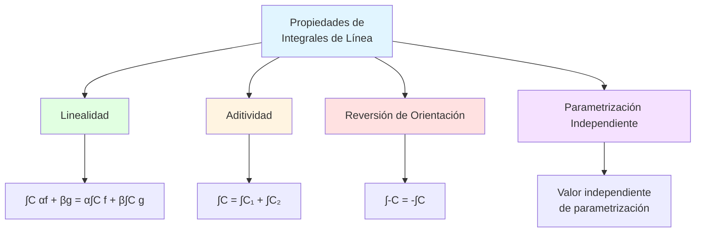
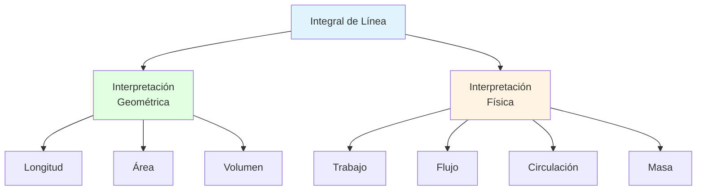

# 📐 Propiedades de las Integrales de Línea

## 🎯 Introducción

> [!info]- 💡 ¿Por qué estudiar las propiedades? Las **propiedades de las integrales de línea** son herramientas fundamentales que simplifican cálculos complejos y revelan conexiones profundas entre geometría, física y matemáticas.
> 
> **Analogía práctica:** Imagina que necesitas calcular el trabajo realizado al mover un objeto por diferentes caminos:
> 
> - **Sin propiedades:** Recalcular cada integral desde cero
> - **Con propiedades:** Reutilizar cálculos, descomponer caminos complejos, predecir resultados
> 
> **¿Por qué son importantes?**
> 
> |Aspecto|Descripción|Beneficio|
> |---|---|---|
> |**Eficiencia**|Simplificar cálculos complejos|Ahorro de tiempo y esfuerzo|
> |**Flexibilidad**|Dividir caminos complicados|Resolver problemas complejos|
> |**Predicción**|Determinar resultados sin calcular|Insight matemático|
> |**Independencia**|Identificar cuándo el camino no importa|Campos conservativos|
> |**Reversibilidad**|Relacionar caminos opuestos|Simetría física|



---

## 🔢 Propiedades Fundamentales

### ➕ Propiedad 1: Linealidad

> [!success]- 📊 Combinación Lineal de Funciones
> 
> **Enunciado:**
> 
> Para funciones escalares $f$ y $g$, y constantes $\alpha, \beta \in \mathbb{R}$:
> 
> $$\int_C [\alpha f(x,y) + \beta g(x,y)] , ds = \alpha \int_C f(x,y) , ds + \beta \int_C g(x,y) , ds$$
> 
> Para campos vectoriales $\mathbf{F}$ y $\mathbf{G}$:
> 
> $$\int_C [\alpha \mathbf{F} + \beta \mathbf{G}] \cdot d\mathbf{r} = \alpha \int_C \mathbf{F} \cdot d\mathbf{r} + \beta \int_C \mathbf{G} \cdot d\mathbf{r}$$
> 
> **Interpretación física:**
> 
> Si dos fuerzas $\mathbf{F}_1$ y $\mathbf{F}_2$ actúan simultáneamente, el trabajo total es la suma de los trabajos individuales.
> 
> **Ejemplo resuelto:**
> 
> ```
> Calcular ∫C (3xy + 2y²) ds donde C es el segmento de (0,0) a (1,1)
> 
> Paso 1 - Aplicar linealidad:
> ∫C (3xy + 2y²) ds = 3∫C xy ds + 2∫C y² ds
> 
> Paso 2 - Parametrizar C:
> r(t) = (t, t), 0 ≤ t ≤ 1
> |r'(t)| = √(1² + 1²) = √2
> 
> Paso 3 - Calcular primera integral:
> ∫C xy ds = ∫₀¹ t·t·√2 dt
>          = √2 ∫₀¹ t² dt
>          = √2 [t³/3]₀¹
>          = √2/3
> 
> Paso 4 - Calcular segunda integral:
> ∫C y² ds = ∫₀¹ t²·√2 dt
>          = √2/3
> 
> Paso 5 - Combinar resultados:
> ∫C (3xy + 2y²) ds = 3(√2/3) + 2(√2/3)
>                   = √2 + 2√2/3
>                   = 5√2/3
> 
> Resultado: 5√2/3 ≈ 2.357
> ```
> 
> **Aplicación a campos vectoriales:**
> 
> ```
> Si F = (2x, y) y G = (y, x), calcular ∫C (F + 2G)·dr
> sobre el círculo unitario orientado positivamente
> 
> Por linealidad:
> ∫C (F + 2G)·dr = ∫C F·dr + 2∫C G·dr
> 
> F + 2G = (2x, y) + 2(y, x) = (2x + 2y, y + 2x)
> 
> [Continuar con parametrización y cálculo...]
> ```
> 
> **Tabla de casos comunes:**
> 
> |Expresión|Simplificación|
> |---|---|
> |∫C (f + g) ds|∫C f ds + ∫C g ds|
> |∫C kf ds (k constante)|k∫C f ds|
> |∫C (F + G)·dr|∫C F·dr + ∫C G·dr|
> |∫C kF·dr (k constante)|k∫C F·dr|

### ➗ Propiedad 2: Aditividad Respecto al Camino

> [!note]- 🔗 Descomposición de Curvas
> 
> **Enunciado:**
> 
> Si la curva $C$ se puede descomponer en curvas $C_1, C_2, \ldots, C_n$ unidas extremo con extremo:
> 
> $$\int_C f , ds = \int_{C_1} f , ds + \int_{C_2} f , ds + \cdots + \int_{C_n} f , ds$$
> 
> $$\int_C \mathbf{F} \cdot d\mathbf{r} = \int_{C_1} \mathbf{F} \cdot d\mathbf{r} + \int_{C_2} \mathbf{F} \cdot d\mathbf{r} + \cdots + \int_{C_n} \mathbf{F} \cdot d\mathbf{r}$$
> 
> **Requisito importante:** El punto final de $C_i$ debe ser el punto inicial de $C_{i+1}$.
> 
> **Visualización:**
> 
> ```
> Curva C completa:
>      C₂ 
>     ╱  ╲
>    ╱    ╲
> A •──────• B
>    C₁    
> 
> ∫C = ∫C₁ + ∫C₂
> 
> Donde:
> - C₁: segmento de A a B
> - C₂: arco semicircular de B a A
> ```
> 
> **Ejemplo resuelto:**
> 
> ```
> Calcular ∫C xy ds donde C es el borde del triángulo con 
> vértices (0,0), (2,0), (0,1), recorrido en sentido antihorario
> 
> Paso 1 - Descomponer en tres segmentos:
> C = C₁ + C₂ + C₃
> 
> C₁: de (0,0) a (2,0) → segmento horizontal
> C₂: de (2,0) a (0,1) → segmento inclinado
> C₃: de (0,1) a (0,0) → segmento vertical
> 
> Paso 2 - Calcular ∫C₁:
> Parametrización: r₁(t) = (t, 0), 0 ≤ t ≤ 2
> |r₁'(t)| = 1
> 
> ∫C₁ xy ds = ∫₀² t·0·1 dt = 0
> 
> Paso 3 - Calcular ∫C₂:
> Parametrización: r₂(t) = (2-2t, t), 0 ≤ t ≤ 1
> r₂'(t) = (-2, 1)
> |r₂'(t)| = √(4+1) = √5
> 
> ∫C₂ xy ds = ∫₀¹ (2-2t)·t·√5 dt
>           = √5 ∫₀¹ (2t - 2t²) dt
>           = √5 [t² - 2t³/3]₀¹
>           = √5 (1 - 2/3)
>           = √5/3
> 
> Paso 4 - Calcular ∫C₃:
> Parametrización: r₃(t) = (0, 1-t), 0 ≤ t ≤ 1
> |r₃'(t)| = 1
> 
> ∫C₃ xy ds = ∫₀¹ 0·(1-t)·1 dt = 0
> 
> Paso 5 - Sumar:
> ∫C xy ds = 0 + √5/3 + 0 = √5/3 ≈ 0.745
> ```
> 
> **Estrategia de descomposición:**
> 
> ```mermaid
> flowchart TD
>     A[Curva compleja C] --> B{¿Se puede dividir<br/>en segmentos simples?}
>     B -->|Sí| C[Identificar puntos<br/>de división]
>     C --> D[Parametrizar cada<br/>segmento Cᵢ]
>     D --> E[Calcular ∫Cᵢ<br/>para cada segmento]
>     E --> F[Sumar todos<br/>los resultados]
>     
>     B -->|No| G[Buscar parametrización<br/>directa de C]
>     
>     style C fill:#e1ffe1
>     style F fill:#e1f5ff
> ```
> 
> **Aplicación a polígonos:**
> 
> Para un polígono de $n$ lados:
> 
> $$\oint_C \mathbf{F} \cdot d\mathbf{r} = \sum_{i=1}^{n} \int_{C_i} \mathbf{F} \cdot d\mathbf{r}$$
> 
> donde cada $C_i$ es un lado del polígono.

### 🔄 Propiedad 3: Reversión de Orientación

> [!warning]- ↩️ Cambio de Dirección
> 
> **Enunciado:**
> 
> Si $-C$ denota la curva $C$ recorrida en dirección opuesta:
> 
> $$\int_{-C} f(x,y) , ds = \int_C f(x,y) , ds$$
> 
> $$\int_{-C} \mathbf{F} \cdot d\mathbf{r} = -\int_C \mathbf{F} \cdot d\mathbf{r}$$
> 
> **Diferencia crucial:**
> 
> |Tipo de Integral|Efecto de Reversión|
> |---|---|
> |**Escalar (ds)**|Sin cambio de signo|
> |**Vectorial (dr)**|Cambio de signo|
> 
> **¿Por qué esta diferencia?**
> 
> - **Integral escalar:** Mide "cantidad total" independiente de dirección (longitud, masa)
> - **Integral vectorial:** Mide "flujo neto" que depende de dirección (trabajo, circulación)
> 
> **Visualización:**
> 
> ```
> Integral escalar (masa de alambre):
> C:  A ────→ B     -C: A ←──── B
>     masa = m          masa = m
> 
> Integral vectorial (trabajo):
> C:  A ────→ B     -C: A ←──── B
>     W = W₀            W = -W₀
> 
> Si el campo ayuda en C, se opone en -C
> ```
> 
> **Ejemplo resuelto:**
> 
> ```
> Sea C la curva de (0,0) a (1,1) a lo largo de y = x²
> F = (y, -x)
> 
> Calcular ∫C F·dr y ∫-C F·dr
> 
> Paso 1 - Parametrización de C:
> r(t) = (t, t²), 0 ≤ t ≤ 1
> r'(t) = (1, 2t)
> F(r(t)) = (t², -t)
> 
> Paso 2 - Calcular ∫C F·dr:
> ∫C F·dr = ∫₀¹ (t², -t)·(1, 2t) dt
>         = ∫₀¹ (t² - 2t²) dt
>         = ∫₀¹ -t² dt
>         = [-t³/3]₀¹
>         = -1/3
> 
> Paso 3 - Calcular ∫-C F·dr:
> Método 1 (usando propiedad):
> ∫-C F·dr = -∫C F·dr = -(-1/3) = 1/3
> 
> Método 2 (verificación directa):
> Parametrización de -C: r(t) = (1-t, (1-t)²), 0 ≤ t ≤ 1
> r'(t) = (-1, -2(1-t))
> F(r(t)) = ((1-t)², -(1-t))
> 
> ∫-C F·dr = ∫₀¹ ((1-t)², -(1-t))·(-1, -2(1-t)) dt
>          = ∫₀¹ [-(1-t)² + 2(1-t)²] dt
>          = ∫₀¹ (1-t)² dt
>          = [-(1-t)³/3]₀¹
>          = 1/3 ✓
> ```
> 
> **Aplicación a curvas cerradas:**
> 
> Para una curva cerrada $C$ orientada positivamente:
> 
> $$\oint_C \mathbf{F} \cdot d\mathbf{r} = -\oint_{-C} \mathbf{F} \cdot d\mathbf{r}$$
> 
> ```
> Círculo orientado:
> 
>      ↑
>    ←   →  Positivo (antihorario)
>      ↓
> 
>      ↓
>    →   ←  Negativo (horario)
>      ↑
> ```

### 📏 Propiedad 4: Independencia de Parametrización

> [!tip]- 🔀 Libertad de Parametrización
> 
> **Enunciado:**
> 
> El valor de una integral de línea **no depende** de la parametrización elegida, siempre que:
> 
> 1. La parametrización sea suave
> 2. Preserve la orientación de la curva
> 
> **Teorema formal:**
> 
> Si $\mathbf{r}_1(t)$ y $\mathbf{r}_2(s)$ son dos parametrizaciones de la misma curva orientada $C$:
> 
> $$\int_C f , ds = \int_{a}^{b} f(\mathbf{r}_1(t)) |\mathbf{r}_1'(t)| , dt = \int_{c}^{d} f(\mathbf{r}_2(s)) |\mathbf{r}_2'(s)| , ds$$
> 
> **Ejemplo demostrativo:**
> 
> ```
> Calcular ∫C y ds sobre el segmento de (0,0) a (2,4)
> usando tres parametrizaciones diferentes
> 
> Parametrización 1: r₁(t) = (t, 2t), 0 ≤ t ≤ 2
> |r₁'(t)| = √(1 + 4) = √5
> 
> ∫C y ds = ∫₀² 2t·√5 dt
>         = 2√5 [t²/2]₀²
>         = 2√5 · 2
>         = 4√5
> 
> Parametrización 2: r₂(s) = (2s, 4s), 0 ≤ s ≤ 1
> |r₂'(s)| = √(4 + 16) = √20 = 2√5
> 
> ∫C y ds = ∫₀¹ 4s·2√5 ds
>         = 8√5 [s²/2]₀¹
>         = 4√5 ✓
> 
> Parametrización 3: r₃(u) = (2u², 4u²), 0 ≤ u ≤ 1
> r₃'(u) = (4u, 8u)
> |r₃'(u)| = √(16u² + 64u²) = √(80u²) = 4√5·u
> 
> ∫C y ds = ∫₀¹ 4u²·4√5·u du
>         = 16√5 ∫₀¹ u³ du
>         = 16√5 [u⁴/4]₀¹
>         = 4√5 ✓
> 
> Conclusión: Las tres parametrizaciones dan el mismo resultado
> ```
> 
> **Cuidado con la orientación:**
> 
> ```
> Parametrización que INVIERTE orientación:
> 
> Original: r₁(t) = (t, t²), 0 ≤ t ≤ 1  (de (0,0) a (1,1))
> Inversa:  r₂(s) = (1-s, (1-s)²), 0 ≤ s ≤ 1  (de (1,1) a (0,0))
> 
> Para integrales vectoriales:
> ∫C F·dr usando r₁ = -∫C F·dr usando r₂
> 
> Para integrales escalares:
> ∫C f ds usando r₁ = ∫C f ds usando r₂
> ```
> 
> **Tabla de verificación:**
> 
> |Aspecto|Debe cumplir|
> |---|---|
> |Misma curva geométrica|✓|
> |Misma orientación|✓|
> |Mismos puntos inicial/final|✓|
> |Misma velocidad|✗ No importa|
> |Misma parametrización temporal|✗ No importa|

---

## 🔄 Propiedades Especiales para Campos Vectoriales

### 🎯 Campos Conservativos

> [!success]- ⚡ Independencia del Camino
> 
> **Definición:**
> 
> Un campo vectorial $\mathbf{F}$ es **conservativo** si existe una función escalar $f$ tal que:
> 
> $$\mathbf{F} = \nabla f$$
> 
> donde $f$ se llama **función potencial** o **potencial escalar**.
> 
> **Propiedad fundamental:**
> 
> Para campos conservativos, la integral de línea **depende solo de los puntos inicial y final**, no del camino:
> 
> $$\int_C \mathbf{F} \cdot d\mathbf{r} = f(B) - f(A)$$
> 
> donde $A$ es el punto inicial y $B$ el punto final de $C$.
> 
> **Consecuencias importantes:**
> 
> 1. **Independencia del camino:** Si $C_1$ y $C_2$ tienen los mismos extremos: $$\int_{C_1} \mathbf{F} \cdot d\mathbf{r} = \int_{C_2} \mathbf{F} \cdot d\mathbf{r}$$
>     
> 2. **Integrales sobre curvas cerradas:** $$\oint_C \mathbf{F} \cdot d\mathbf{r} = 0$$
>     
> 3. **Teorema Fundamental para Integrales de Línea:** $$\int_C \nabla f \cdot d\mathbf{r} = f(\mathbf{r}(b)) - f(\mathbf{r}(a))$$
>     
> 
> **Criterio de conservatividad (en dominios simplemente conexos):**
> 
> Para $\mathbf{F} = (P, Q)$ en $\mathbb{R}^2$:
> 
> $$\mathbf{F} \text{ es conservativo} \iff \frac{\partial P}{\partial y} = \frac{\partial Q}{\partial x}$$
> 
> **Ejemplo resuelto:**
> 
> ```
> Verificar si F = (2xy + 3, x² - 1) es conservativo y calcular
> ∫C F·dr desde (0,0) hasta (2,3) por cualquier camino
> 
> Paso 1 - Verificar criterio:
> P = 2xy + 3,  Q = x² - 1
> ∂P/∂y = 2x
> ∂Q/∂x = 2x
> 
> ∂P/∂y = ∂Q/∂x ✓ → F es conservativo
> 
> Paso 2 - Encontrar función potencial f:
> ∇f = F
> ∂f/∂x = 2xy + 3
> 
> Integrar respecto a x:
> f = ∫(2xy + 3)dx = x²y + 3x + g(y)
> 
> Paso 3 - Determinar g(y):
> ∂f/∂y = x² + g'(y) = x² - 1
> g'(y) = -1
> g(y) = -y + C
> 
> f(x,y) = x²y + 3x - y + C
> 
> Paso 4 - Aplicar teorema fundamental:
> ∫C F·dr = f(2,3) - f(0,0)
>         = [4·3 + 6 - 3] - [0]
>         = 12 + 6 - 3
>         = 15
> 
> Resultado: 15 (sin importar el camino elegido)
> ```
> 
> **Comparación con campos no conservativos:**
> 
> |Propiedad|Campo Conservativo|Campo No Conservativo|
> |---|---|---|
> |Depende del camino|✗ No|✓ Sí|
> |Integral cerrada|Siempre 0|Generalmente ≠ 0|
> |Función potencial|✓ Existe|✗ No existe|
> |∂P/∂y vs ∂Q/∂x|Iguales|Diferentes|
> |Trabajo|Recuperable|Hay disipación|
> 
> **Interpretación física:**
> 
> ```
> Campo gravitatorio (conservativo):
>     • El trabajo para ir de A a B es el mismo
>       sin importar la ruta
>     • Subir y bajar una montaña: trabajo neto = 0
> 
> Campo de fricción (no conservativo):
>     • El trabajo depende de la longitud del camino
>     • Camino más largo → más trabajo perdido
>     • Dar una vuelta completa: trabajo ≠ 0
> ```

### 🌊 Circulación y Flujo

> [!example]- 🔄 Conceptos Vectoriales Importantes
> 
> **Circulación:**
> 
> La **circulación** de un campo vectorial $\mathbf{F}$ alrededor de una curva cerrada $C$ es:
> 
> $$\text{Circulación} = \oint_C \mathbf{F} \cdot d\mathbf{r} = \oint_C \mathbf{F} \cdot \mathbf{T} , ds$$
> 
> donde $\mathbf{T}$ es el vector tangente unitario.
> 
> **Interpretación:** Mide la "tendencia a circular" del campo alrededor de $C$.
> 
> **Propiedades de la circulación:**
> 
> 1. Si $\mathbf{F}$ es conservativo: $\oint_C \mathbf{F} \cdot d\mathbf{r} = 0$
>     
> 2. Circulación > 0: El campo tiende a circular en dirección de $C$
>     
> 3. Circulación < 0: El campo tiende a circular opuesto a $C$
>     
> 4. Circulación = 0: No hay tendencia neta a circular
>     
> 
> **Ejemplo:**
> 
> ```
> Calcular la circulación de F = (-y, x) alrededor del
> círculo unitario x² + y² = 1 orientado antihorario
> 
> Paso 1 - Parametrizar círculo:
> r(t) = (cos t, sin t), 0 ≤ t ≤ 2π
> r'(t) = (-sin t, cos t)
> 
> Paso 2 - Evaluar F sobre C:
> F(r(t)) = (-sin t, cos t)
> 
> Paso 3 - Calcular circulación:
> ∮C F·dr = ∫₀²π (-sin t, cos t)·(-sin t, cos t) dt
>         = ∫₀²π (sin²t + cos²t) dt
>         = ∫₀²π 1 dt
>         = 2π
> 
> Interpretación: El campo rota fuertemente en sentido antihorario
> ```
> 
> **Flujo a través de una curva:**
> 
> Para una curva plana $C$, el **flujo** de $\mathbf{F} = (P, Q)$ a través de $C$ es:
> 
> $$\text{Flujo} = \int_C \mathbf{F} \cdot \mathbf{n} , ds = \int_C -Q , dx + P , dy$$
> 
> donde $\mathbf{n}$ es el vector normal unitario.
> 
> **Relación con circulación:**
> 
> Si $\mathbf{F} = (P, Q)$ y $\mathbf{F}^{\perp} = (-Q, P)$:
> 
> $$\text{Flujo de } \mathbf{F} = \text{Circulación de } \mathbf{F}^{\perp}$$
> 
> ```mermaid
> graph TB
>     A[Campo Vectorial F] --> B[Circulación]
>     A --> C[Flujo]
>     
>     B --> D[∮C F·T ds<br/>Componente tangencial]
>     C --> E[∮C F·n ds<br/>Componente normal]
>     
>     D --> F[Rotación alrededor de C]
>     E --> G[Atravesamiento de C]
>     
>     style B fill:#e1ffe1
>     style C fill:#e1f5ff
> ```

---

## 📊 Tabla Resumen de Propiedades

> [!note]- 📋 Referencia Rápida
> 
> ### Propiedades Algebraicas
> 
> |Propiedad|Fórmula|Aplicación|
> |---|---|---|
> |**Linealidad**|∫C (αf + βg) ds = α∫C f ds + β∫C g ds|Separar integrales complejas|
> |**Aditividad**|∫C = ∫C₁ + ∫C₂|Dividir caminos complicados|
> |**Homogeneidad**|∫C kf ds = k∫C f ds|Factorizar constantes|
> 
> ### Propiedades de Orientación
> 
> |Tipo|Reversión -C|
> |---|---|
> |**Escalar**|∫-C f ds = ∫C f ds|
> |**Vectorial**|∫-C F·dr = -∫C F·dr|
> 
> ### Propiedades para Campos Conservativos
> 
> |Propiedad|Condición|Resultado|
> |---|---|---|
> |**Independencia**|F = ∇f|∫C F·dr = f(B) - f(A)|
> |**Curva cerrada**|F conservativo|∮C F·dr = 0|
> |**Criterio 2D**|Simplemente conexo|∂P/∂y = ∂Q/∂x|

---

## 🎨 Ejemplos Integradores

> [!example]- 💪 Problemas Compuestos
> 
> **Ejemplo 1: Usando múltiples propiedades**
> ```
> Calcular ∫C (3x² + 2y) ds + ∫-C (x² - y) ds
> donde C es el segmento de (0,0) a (1,2)
> 
> 
> Paso 1 - Aplicar reversión y linealidad:
> ∫C (3x² + 2y) ds + ∫-C (x² - y) ds
> = ∫C (3x² + 2y) ds + ∫C (x² - y) ds  [reversión para escalar]
> = ∫C [(3x² + 2y) + (x² - y)] ds      [linealidad]
> = ∫C (4x² + y) ds
> 
> Paso 2 - Parametrizar:
> r(t) = (t, 2t), 0 ≤ t ≤ 1
> |r'(t)| = √5
> 
> Paso 3 - Calcular:
> ∫C (4x² + y) ds = ∫₀¹ (4t² + 2t)√5 dt
>                 = √5 ∫₀¹ (4t² + 2t) dt
>                 = √5 [4t³/3 + t²]₀¹
>                 = √5 (4/3 + 1)
>                 = 7√5/3
> ```
> 
> **Ejemplo 2: Campo conservativo**
> 
> ```
> Sea F = (yeˣʸ + cos x, xeˣʸ). Calcular ∫C F·dr desde
> (0,0) hasta (π,1) por tres caminos diferentes
> 
> Paso 1 - Verificar si es conservativo:
> P = yeˣʸ + cos x,  Q = xeˣʸ
> ∂P/∂y = eˣʸ + xyeˣʸ
> ∂Q/∂x = eˣʸ + xyeˣʸ
> 
> ∂P/∂y = ∂Q/∂x ✓ → F es conservativo
> 
> Paso 2 - Encontrar potencial:
> ∂f/∂x = yeˣʸ + cos x
> f = ∫(yeˣʸ + cos x)dx = eˣʸ + sin x + g(y)
> 
> ∂f/∂y = xeˣʸ + g'(y) = xeˣʸ
> g'(y) = 0 → g(y) = C
> 
> f(x,y) = eˣʸ + sin x
> 
> Paso 3 - Aplicar teorema fundamental:
> ∫C F·dr = f(π,1) - f(0,0)
>         = (eπ + sin π) - (e⁰ + sin 0)
>         = eπ - 1
> 
> Conclusión: El resultado es eπ - 1 para cualquier camino
> ```

---

# 🌟 Interpretaciones Geométricas y Físicas

## 🎯 Introducción

> [!info]- 💡 Conectando Matemáticas con la Realidad Las integrales de línea no son solo objetos matemáticos abstractos: tienen **significados geométricos y físicos profundos** que nos ayudan a entender fenómenos del mundo real.
> 
> **¿Por qué son importantes estas interpretaciones?**
> 
> |Perspectiva|Beneficio|Ejemplo|
> |---|---|---|
> |**Geométrica**|Visualización e intuición|Longitud de curvas, áreas|
> |**Física**|Modelado de fenómenos reales|Trabajo, flujo, circulación|
> |**Ingeniería**|Diseño y optimización|Cables, fluidos, campos|
> |**Conceptual**|Comprensión profunda|Conexión entre teoría y práctica|



---

## 📐 Interpretaciones Geométricas

### 📏 Longitud de Curvas

> [!success]- 📊 Cálculo de Longitud de Arco
> 
> **Fórmula fundamental:**
> 
> La longitud de una curva $C$ parametrizada por $\mathbf{r}(t)$, $a \leq t \leq b$, es:
> 
> $$L = \int_C ds = \int_C 1 , ds = \int_a^b |\mathbf{r}'(t)| , dt$$
> 
> **Interpretación:** La integral escalar con $f(x,y) = 1$ mide la longitud total de la curva.
> 
> **En coordenadas:**
> 
> Para $\mathbf{r}(t) = (x(t), y(t))$:
> 
> $$L = \int_a^b \sqrt{\left(\frac{dx}{dt}\right)^2 + \left(\frac{dy}{dt}\right)^2} , dt$$
> 
> Para $\mathbf{r}(t) = (x(t), y(t), z(t))$ en 3D:
> 
> $$L = \int_a^b \sqrt{\left(\frac{dx}{dt}\right)^2 + \left(\frac{dy}{dt}\right)^2 + \left(\frac{dz}{dt}\right)^2} , dt$$
> 
> **Ejemplo 1: Circunferencia**
> 
> ```
> Calcular la longitud del círculo x² + y² = r²
> 
> Parametrización: r(t) = (r cos t, r sin t), 0 ≤ t ≤ 2π
> r'(t) = (-r sin t, r cos t)
> |r'(t)| = √(r²sin²t + r²cos²t) = r
> 
> L = ∫₀²π r dt = r[t]₀²π = 2πr ✓
> 
> Resultado conocido: perímetro = 2πr
> ```
> 
> **Ejemplo 2: Hélice circular**
> 
> ```
> Calcular la longitud de una vuelta de la hélice
> r(t) = (a cos t, a sin t, bt), 0 ≤ t ≤ 2π
> 
> r'(t) = (-a sin t, a cos t, b)
> |r'(t)| = √(a²sin²t + a²cos²t + b²)
>        = √(a² + b²)
> 
> L = ∫₀²π √(a² + b²) dt
>   = √(a² + b²) · 2π
> 
> Interpretación: 
> - Si b = 0: hélice se colapsa en círculo, L = 2πa
> - Si a = 0: hélice es línea vertical, L = 2πb
> - En general: longitud mayor que la circunferencia base
> ```
> 
> **Visualización:**
> 
> ```
> Aproximación de longitud por segmentos:
> 
>         •─────•
>        ╱       ╲
>       •    C    •
>        ╲       ╱
>         •─────•
> 
> L ≈ Σ|rᵢ - rᵢ₋₁|
> 
> Límite cuando segmentos → ∞: L = ∫C ds
> ```
> 
> **Ejemplo 3: Curva en forma explícita**
> 
> ```
> Calcular la longitud de y = x² desde x = 0 hasta x = 2
> 
> Parametrización natural: r(t) = (t, t²), 0 ≤ t ≤ 2
> r'(t) = (1, 2t)
> |r'(t)| = √(1 + 4t²)
> 
> L = ∫₀² √(1 + 4t²) dt
> 
> Sustitución: u = 2t, du = 2dt
> Cuando t = 0: u = 0; cuando t = 2: u = 4
> 
> L = (1/2)∫₀⁴ √(1 + u²) du
> 
> [Usar tabla o sustitución trigonométrica]
> = (1/2)[u√(1+u²)/2 + (1/2)ln|u + √(1+u²)|]₀⁴
> = (1/2)[2√17 + (1/2)ln(4 + √17)]
> ≈ 4.647
> ```
> 
> **Fórmula alternativa para y = f(x):**
> 
> $$L = \int_a^b \sqrt{1 + \left(\frac{dy}{dx}\right)^2} , dx$$

### 📦 Área de Superficies

> [!note]- 🎨 Área de Superficie de Revolución
> 
> **Concepto:** Cuando una curva gira alrededor de un eje, genera una superficie. Las integrales de línea permiten calcular su área.
> 
> **Fórmula general:**
> 
> Área de la superficie generada al rotar $C$ alrededor del eje $x$:
> 
> $$A = \int_C 2\pi y , ds = \int_a^b 2\pi y(t) \cdot |\mathbf{r}'(t)| , dt$$
> 
> Área de la superficie generada al rotar $C$ alrededor del eje $y$:
> 
> $$A = \int_C 2\pi x , ds = \int_a^b 2\pi x(t) \cdot |\mathbf{r}'(t)| , dt$$
> 
> **Interpretación geométrica:**
> 
> ```
> Superficie de revolución:
> 
>           |        Rotar y = f(x)
>           |        alrededor de eje x
>       •••••••••
>     ••    |    ••
>    •      |      •
>   •       |       •
>    •      |      •
>     ••    |    ••
>       •••••••••
>           |
>    ────────────────> x
>    a              b
> 
> Cada punto (x, y) genera un círculo
> de radio y y circunferencia 2πy
> ```
> 
> **Ejemplo 1: Esfera**
> 
> ```
> Calcular el área de la esfera generada al rotar
> el semicírculo x² + y² = r², y ≥ 0 alrededor del eje x
> 
> Parametrización: r(t) = (r cos t, r sin t), 0 ≤ t ≤ π
> |r'(t)| = r
> y(t) = r sin t
> 
> A = ∫₀π 2π(r sin t) · r dt
>   = 2πr² ∫₀π sin t dt
>   = 2πr² [-cos t]₀π
>   = 2πr² [(-cos π) - (-cos 0)]
>   = 2πr² [1 + 1]
>   = 4πr²
> 
> Resultado: área de esfera = 4πr² ✓
> ```
> 
> **Ejemplo 2: Cono**
> 
> ```
> Área lateral del cono generado al rotar y = x desde
> x = 0 hasta x = h alrededor del eje x
> 
> Parametrización: r(t) = (t, t), 0 ≤ t ≤ h
> r'(t) = (1, 1)
> |r'(t)| = √2
> y(t) = t
> 
> A = ∫₀ʰ 2πt · √2 dt
>   = 2π√2 ∫₀ʰ t dt
>   = 2π√2 [t²/2]₀ʰ
>   = π√2 h²
> 
> Si el radio de la base es r = h:
> A = π√2 r² = πr√2 r
> 
> Longitud de generatriz: l = √(h² + r²) = r√2
> Área = πrl ✓
> ```

### 🌊 Área Bajo una Curva en el Espacio

> [!tip]- 📈 Área de Cortinas
> 
> **Concepto:** El área de la "cortina" que cuelga de una curva $C$ en el plano $xy$ hasta el plano $z = 0$.
> 
> **Fórmula:**
> 
> Para una curva $C$ a altura $z = f(x, y)$:
> 
> $$A = \int_C f(x,y) , ds$$
> 
> **Visualización:**
> 
> ```
> Vista lateral:
> 
>    z
>    │     C: curva en el espacio
>    │    ╱‾╲
>    │   ╱   ╲___
>    │  ╱         ╲
>    │ ╱    Área   ╲
>    │╱_____________╲
>    └───────────────> xy
> 
> La "cortina" cae verticalmente desde C
> ```
> 
> **Ejemplo:**
> 
> ```
> Calcular el área de la cortina bajo la curva
> C: r(t) = (cos t, sin t, 2 + cos t), 0 ≤ t ≤ 2π
> desde C hasta el plano xy (z = 0)
> 
> Altura en cada punto: z(t) = 2 + cos t
> r'(t) = (-sin t, cos t, -sin t)
> |r'(t)| = √(sin²t + cos²t + sin²t) = √(1 + sin²t)
> 
> A = ∫₀²π (2 + cos t)√(1 + sin²t) dt
> 
> [Esta integral requiere métodos numéricos]
> A ≈ 17.8
> ```

---

## ⚛️ Interpretaciones Físicas

### 💼 Trabajo Realizado por una Fuerza

> [!success]- ⚡ Trabajo a lo Largo de un Camino
> 
> **Concepto fundamental:**
> 
> El **trabajo** realizado por un campo de fuerza $\mathbf{F}$ al mover un objeto a lo largo de una curva $C$ es:
> 
> $$W = \int_C \mathbf{F} \cdot d\mathbf{r} = \int_C \mathbf{F} \cdot \mathbf{T} , ds$$
> 
> donde $\mathbf{T}$ es el vector tangente unitario.
> 
> **Interpretación física:**
> 
> - Solo la componente de $\mathbf{F}$ **en la dirección del movimiento** realiza trabajo
> - Fuerza perpendicular al movimiento: trabajo = 0
> - Trabajo positivo: la fuerza ayuda al movimiento
> - Trabajo negativo: la fuerza se opone al movimiento
> 
> **Visualización:**
> 
> ```
> Fuerza y movimiento:
> 
>      F
>      ↗       
>     ╱  θ    dr
>    ╱   →────→
> 
> Trabajo elemental: dW = F·dr = |F||dr|cos θ
> 
> θ = 0°:   Fuerza ayuda completamente (W > 0)
> θ = 90°:  Fuerza perpendicular (W = 0)
> θ = 180°: Fuerza se opone completamente (W < 0)
> ```
> 
> **Ejemplo 1: Fuerza constante**
> 
> ```
> Un objeto se mueve de (0,0) a (3,4) bajo la fuerza
> constante F = (2, 1). Calcular el trabajo.
> 
> Camino rectilíneo: r(t) = (3t, 4t), 0 ≤ t ≤ 1
> r'(t) = (3, 4)
> F(r(t)) = (2, 1) [constante]
> 
> W = ∫₀¹ (2, 1)·(3, 4) dt
>   = ∫₀¹ (6 + 4) dt
>   = 10∫₀¹ dt
>   = 10
> 
> Verificación (fuerza constante):
> W = F·Δr = (2, 1)·(3, 4) = 10 ✓
> ```
> 
> **Ejemplo 2: Campo gravitatorio**
> 
> ```
> Trabajo para elevar un objeto de masa m desde el suelo
> hasta altura h, a lo largo de cualquier camino vertical
> 
> Fuerza gravitatoria: F = (0, -mg)
> Desplazamiento: dr = (0, dy)
> 
> W = ∫C (0, -mg)·(0, dy)
>   = ∫₀ʰ (-mg) dy
>   = -mg[y]₀ʰ
>   = -mgh
> 
> Interpretación:
> - Trabajo negativo: la gravedad se opone
> - El trabajo que NOSOTROS hacemos es +mgh
> - Independiente del camino (campo conservativo)
> ```
> 
> **Ejemplo 3: Fuerza variable**
> 
> ```
> Calcular el trabajo para mover una partícula en el campo
> F = (x², xy) desde (0,0) hasta (1,1) a lo largo de y = x²
> 
> Parametrización: r(t) = (t, t²), 0 ≤ t ≤ 1
> r'(t) = (1, 2t)
> F(r(t)) = (t², t·t²) = (t², t³)
> 
> W = ∫₀¹ (t², t³)·(1, 2t) dt
>   = ∫₀¹ (t² + 2t⁴) dt
>   = [t³/3 + 2t⁵/5]₀¹
>   = 1/3 + 2/5
>   = 5/15 + 6/15
>   = 11/15
> ```
> 
> **Trabajo en campos conservativos:**
> 
> Para $\mathbf{F} = -\nabla U$ (campo conservativo):
> 
> $$W = -\int_C \nabla U \cdot d\mathbf{r} = -(U(B) - U(A)) = U(A) - U(B)$$
> 
> **Principio de conservación de energía:**
> 
> $$W = \Delta KE = KE_{\text{final}} - KE_{\text{inicial}}$$

### 🌊 Flujo a Través de una Curva

> [!example]- 💨 Flujo de un Campo Vectorial
> 
> **Concepto:**
> 
> El **flujo** de un campo vectorial $\mathbf{F}$ a través de una curva $C$ mide cuánto "atraviesa" el campo la curva.
> 
> **Fórmula (2D):**
> 
> Para una curva plana con vector normal $\mathbf{n}$:
> 
> $$\text{Flujo} = \int_C \mathbf{F} \cdot \mathbf{n} , ds$$
> 
> Si $\mathbf{F} = (P, Q)$ y $C$ está parametrizada por $\mathbf{r}(t) = (x(t), y(t))$:
> 
> $$\text{Flujo} = \int_C \mathbf{F} \cdot \mathbf{n} , ds = \int_a^b [P(x(t), y(t)) \cdot y'(t) - Q(x(t), y(t)) \cdot x'(t)] , dt$$
> 
> O equivalentemente:
> 
> $$\text{Flujo} = \int_C -Q , dx + P , dy$$
> 
> **Interpretación física:**
> 
> - **Positivo:** Flujo neto en dirección de $\mathbf{n}$
> - **Negativo:** Flujo neto en dirección opuesta a $\mathbf{n}$
> - **Cero:** Flujo equilibrado o tangencial
> 
> **Visualización:**
> 
> ```
> Flujo a través de una curva:
> 
>   →  →  →  ↗  ↗
>   →  →  → ↗ ↗ ↗
>   ────C────────  (curva orientada)
>      ↘  ↘  ↘
>       ↘  ↘  ↘
> 
> Campo F "atravesando" la curva C
> Normal n apunta hacia arriba
> ```
> 
> **Ejemplo 1: Campo uniforme**
> 
> ```
> Calcular el flujo de F = (2, 3) a través del segmento
> de (0,0) a (1,0), con normal apuntando hacia arriba
> 
> Parametrización: r(t) = (t, 0), 0 ≤ t ≤ 1
> r'(t) = (1, 0)
> Normal hacia arriba: n = (0, 1)
> |r'(t)| = 1
> 
> Flujo = ∫₀¹ (2, 3)·(0, 1) · 1 dt
>       = ∫₀¹ 3 dt
>       = 3
> 
> Interpretación: 3 unidades de "fluido" atraviesan
> el segmento por unidad de tiempo
> ```
> 
> **Ejemplo 2: Campo radial**
> 
> ```
> Flujo de F = (x, y) hacia afuera del círculo unitario
> 
> Parametrización: r(t) = (cos t, sin t), 0 ≤ t ≤ 2π
> Normal exterior: n = (cos t, sin t)
> |r'(t)| = 1
> F(r(t)) = (cos t, sin t)
> 
> Flujo = ∫₀²π (cos t, sin t)·(cos t, sin t) · 1 dt
>       = ∫₀²π (cos²t + sin²t) dt
>       = ∫₀²π 1 dt
>       = 2π
> 
> Interpretación: Expansión uniforme desde el origen
> ```
> 
> **Relación con circulación:**
> 
> ```
> Si F = (P, Q), entonces:
> 
> Flujo de F a través de C = Circulación de F⊥ alrededor de C
> 
> donde F⊥ = (-Q, P) es el campo rotado 90°
> ```

### 🔄 Circulación

> [!warning]- 🌀 Tendencia a Circular
> 
> **Concepto:**
> 
> La **circulación** de un campo vectorial $\mathbf{F}$ alrededor de una curva cerrada $C$ es:
> 
> $$\Gamma = \oint_C \mathbf{F} \cdot d\mathbf{r}$$
> 
> **Interpretación física:**
> 
> Mide la "tendencia del campo a circular" alrededor de $C$. Aplicaciones:
> 
> - **Dinámica de fluidos:** Vorticidad
> - **Electromagnetismo:** Ley de Ampère
> - **Meteorología:** Ciclones y anticiclones
> 
> **Teorema de Green (conexión):**
> 
> Para una región $D$ encerrada por $C$ orientada positivamente:
> 
> $$\oint_C \mathbf{F} \cdot d\mathbf{r} = \iint_D \left(\frac{\partial Q}{\partial x} - \frac{\partial P}{\partial y}\right) dA$$
> 
> **Ejemplo 1: Vórtice**
> 
> ```
> Campo de vórtice: F = (-y/(x²+y²), x/(x²+y²))
> 
> Circulación alrededor del círculo x² + y² = r²:
> 
> Parametrización: r(t) = (r cos t, r sin t), 0 ≤ t ≤ 2π
> r'(t) = (-r sin t, r cos t)
> 
> F(r(t)) = (-r sin t/r², r cos t/r²)
>         = (-sin t/r, cos t/r)
> 
> Γ = ∫₀²π (-sin t/r, cos t/r)·(-r sin t, r cos t) dt
>   = ∫₀²π (sin²t + cos²t) dt
>   = ∫₀²π 1 dt
>   = 2π
> 
> Resultado: 2π independiente del radio r
> (singularidad en origen)
> ```
> 
> **Ejemplo 2: Campo conservativo**
> 
> ```
> Para F = ∇f (campo conservativo):
> 
> ∮C F·dr = ∮C ∇f·dr = f(A) - f(A) = 0
> 
> donde A es cualquier punto (C es cerrada)
> 
> Conclusión: Campos conservativos tienen circulación cero
> ```
> 
> **Interpretación por el Teorema de Green:**
> 
> ```
> Circulación = ∬D (rotacional·k) dA
> 
> - Rotacional positivo: circulación antihoraria
> - Rotacional negativo: circulación horaria
> - Rotacional cero: campo irrotacional (conservativo)
> ```

### ⚖️ Masa y Centro de Masa

> [!tip]- 🎯 Propiedades de Alambres
> 
> **Masa de un alambre:**
> 
> Si un alambre tiene forma de curva $C$ con densidad lineal $\rho(x, y)$ (masa por unidad de longitud):
> 
> $$m = \int_C \rho(x,y) , ds$$
> 
> **Centro de masa:**
> 
> Las coordenadas del centro de masa son:
> 
> $$\bar{x} = \frac{1}{m}\int_C x \rho(x,y) , ds$$
> 
> $$\bar{y} = \frac{1}{m}\int_C y \rho(x,y) , ds$$
> 
> En 3D:
> 
> $$\bar{z} = \frac{1}{m}\int_C z \rho(x,y,z) , ds$$
> 
> **Momento de inercia:**
> 
> Respecto al eje $z$:
> 
> $$I_z = \int_C (x^2 + y^2) \rho(x,y) , ds$$
> 
> **Ejemplo completo:**
> 
> ```
> Un alambre semicircular de radio 3 tiene densidad
> ρ(x,y) = y (mayor densidad en la parte superior)
> 
> Encontrar: a) Masa total
>           b) Centro de masa
> 
> Paso 1 - Parametrizar semicírculo:
> r(t) = (3 cos t, 3 sin t), 0 ≤ t ≤ π
> |r'(t)| = 3
> ρ(r(t)) = 3 sin t
> 
> Paso 2 - Calcular masa:
> m = ∫₀π 3 sin t · 3 dt
>   = 9 ∫₀π sin t dt
>   = 9[-cos t]₀π
>   = 9[1 - (-1)]
>   = 18
> 
> Paso 3 - Calcular x̄:
> x̄ = (1/18)∫₀π (3 cos t)(3 sin t) · 3 dt
>   = (1/18) · 27 ∫₀π cos t sin t dt
>   = (3/2) ∫₀π sin(2t) dt
>   = (3/2)[-cos(2t)/2]₀π
>   = 0
> 
> (Por simetría respecto al eje y)
> 
> Paso 4 - Calcular ȳ:
> ȳ = (1/18)∫₀π (3 sin t)(3 sin t) · 3 dt
>   = (1/18) · 27 ∫₀π sin²t dt
>   = (3/2) ∫₀π (1 - cos 2t)/2 dt
>   = (3/4)[t - sin(2t)/2]₀π
>   = (3/4)π
> 
> Centro de masa: (0, 3π/4) ≈ (0, 2.356)
> 
> Interpretación: El centro de masa está más arriba
> que el centroide geométrico (0, 6/π ≈ 1.91) debido
> a la mayor densidad en la parte superior
> ```

---

## 📊 Tabla Resumen de Interpretaciones

> [!note]- 📋 Referencia Rápida
> 
> ### Interpretaciones Geométricas
> 
> |Integral|Interpretación|Fórmula|
> |---|---|---|
> |∫C ds|Longitud de C|∫ₐᵇ \|r'(t)\| dt|
> |∫C y ds|Área de superficie (revolución eje x)|∫ₐᵇ 2πy(t)\|r'(t)\| dt|
> |∫C f ds|Área de "cortina" bajo f|∫C f(x,y) ds|
> 
> ### Interpretaciones Físicas
> 
> |Integral|Significado Físico|Unidades|Aplicación|
> |---|---|---|---|
> |∫C F·dr|Trabajo|Joules|Mecánica|
> |∫C F·T ds|Trabajo|Joules|Fuerzas variables|
> |∫C F·n ds|Flujo|kg/s, m³/s|Fluidos|
> |∮C F·dr|Circulación|m²/s|Vorticidad|
> |∫C ρ ds|Masa|kg|Alambres|
> |∫C xρ ds / m|Centro de masa|m|Equilibrio|

---

## 🎨 Ejemplos Integradores

> [!example]- 💪 Problemas Compuestos
> 
> **Ejemplo 1: Trabajo con análisis energético**
> 
> ```
> Una partícula de 2 kg se mueve en el campo de fuerza
> F = (-y, x) desde (1,0) hasta (0,1) por el arco
> de círculo x² + y² = 1 en el primer cuadrante.
> 
> a) Calcular el trabajo realizado
> b) Si la partícula parte del reposo, ¿cuál es su
>    velocidad final?
> 
> Solución parte a:
> Parametrización: r(t) = (cos t, sin t), 0 ≤ t ≤ π/2
> r'(t) = (-sin t, cos t)
> F(r(t)) = (-sin t, cos t)
> 
> W = ∫₀^(π/2) (-sin t, cos t)·(-sin t, cos t) dt
>   = ∫₀^(π/2) (sin²t + cos²t) dt
>   = ∫₀^(π/2) 1 dt
>   = π/2 J
> 
> Solución parte b:
> Teorema trabajo-energía: W = ΔKE = ½mv² - 0
> π/2 = ½(2)v²
> v² = π/2
> v = √(π/2) ≈ 1.25 m/s
> ```
> 
> **Ejemplo 2: Alambre con densidad variable**
> 
> ```
> Un alambre tiene forma de cardioide r = 1 + cos θ
> (coordenadas polares) con densidad ρ = r.
> 
> Encontrar su masa total.
> 
> Parametrización cartesiana:
> x = r cos θ = (1 + cos θ) cos θ
> y = r sin θ = (1 + cos θ) sin θ
> 0 ≤ θ ≤ 2π
> 
> Elemento de longitud en polares:
> ds = √(r² + (dr/dθ)²) dθ
> 
> r = 1 + cos θ
> dr/dθ = -sin θ
> 
> ds = √((1+cos θ)² + sin²θ) dθ
>    = √(1 + 2cos θ + cos²θ + sin²θ) dθ
>    = √(2 + 2cos θ) dθ
>    = √(2(1 + cos θ)) dθ
>    = √2 √(1 + cos θ) dθ
> 
> Densidad: ρ = r = 1 + cos θ
> 
> m = ∫₀^(2π) (1 + cos θ) · √2 √(1 + cos θ) dθ
>   = √2 ∫₀^(2π) (1 + cos θ)^(3/2) dθ
> 
> Usando identidad: 1 + cos θ = 2cos²(θ/2)
> 
> m = √2 ∫₀^(2π) (2cos²(θ/2))^(3/2) dθ
>   = √2 · 2^(3/2) ∫₀^(2π) |cos(θ/2)|³ dθ
>   = 4 ∫₀^(2π) |cos(θ/2)|³ dθ
> 
> Por simetría (4 cuadrantes):
> m = 4 · 4 ∫₀^(π/2) cos³u du  [u = θ/2]
>   = 16 ∫₀^(π/2) cos u(1 - sin²u) du
>   = 16[sin u - sin³u/3]₀^(π/2)
>   = 16(1 - 1/3)
>   = 32/3
> ```
> 
> **Ejemplo 3: Flujo a través de frontera**
> 
> ```
> Calcular el flujo del campo F = (x², y) hacia afuera
> del cuadrado con vértices (±1, ±1)
> 
> Descomponer en 4 lados:
> 
> Lado 1 (derecha): x = 1, -1 ≤ y ≤ 1
> Normal exterior: n = (1, 0)
> r(t) = (1, t), -1 ≤ t ≤ 1
> |r'(t)| = 1
> 
> Flujo₁ = ∫₋₁¹ (1, t)·(1, 0) · 1 dt
>        = ∫₋₁¹ 1 dt = 2
> 
> Lado 2 (arriba): -1 ≤ x ≤ 1, y = 1
> Normal exterior: n = (0, 1)
> r(t) = (t, 1), -1 ≤ t ≤ 1
> 
> Flujo₂ = ∫₋₁¹ (t², 1)·(0, 1) · 1 dt
>        = ∫₋₁¹ 1 dt = 2
> 
> Lado 3 (izquierda): x = -1, -1 ≤ y ≤ 1
> Normal exterior: n = (-1, 0)
> r(t) = (-1, -t), -1 ≤ t ≤ 1
> 
> Flujo₃ = ∫₋₁¹ (1, -t)·(-1, 0) · 1 dt
>        = ∫₋₁¹ -1 dt = -2
> 
> Lado 4 (abajo): -1 ≤ x ≤ 1, y = -1
> Normal exterior: n = (0, -1)
> r(t) = (-t, -1), -1 ≤ t ≤ 1
> 
> Flujo₄ = ∫₋₁¹ (t², -1)·(0, -1) · 1 dt
>        = ∫₋₁¹ 1 dt = 2
> 
> Flujo total = 2 + 2 - 2 + 2 = 4
> ```

---

## 🔗 Conexión con Teoremas Importantes

> [!quote]- 🌟 Visión de Conjunto
> 
> **Teorema Fundamental para Integrales de Línea:**
> 
> Si $\mathbf{F} = \nabla f$ es un campo conservativo:
> 
> $$\int_C \nabla f \cdot d\mathbf{r} = f(B) - f(A)$$
> 
> **Teorema de Green (2D):**
> 
> Relaciona circulación con integral doble:
> 
> $$\oint_C \mathbf{F} \cdot d\mathbf{r} = \iint_D \left(\frac{\partial Q}{\partial x} - \frac{\partial P}{\partial y}\right) dA$$
> 
> **Teorema de Stokes (3D):**
> 
> Generalización de Green a superficies:
> 
> $$\oint_C \mathbf{F} \cdot d\mathbf{r} = \iint_S (\nabla \times \mathbf{F}) \cdot d\mathbf{S}$$
> 
> **Progresión conceptual:**
> 
> ```mermaid
> graph TB
>     A[Integral de Línea] --> B[Teorema Fundamental]
>     A --> C[Teorema de Green]
>     C --> D[Teorema de Stokes]
>     D --> E[Teorema de Gauss]
>     
>     B --> F[Campos Conservativos]
>     C --> G[Relación Curva-Región]
>     D --> H[Relación Curva-Superficie]
>     E --> I[Relación Superficie-Volumen]
>     
>     style A fill:#e1f5ff
>     style C fill:#e1ffe1
>     style D fill:#fff4e1
> ```

---

**Tags:** #calculo-vectorial #integrales-linea #propiedades #trabajo #flujo #circulacion #masa #centro-masa #interpretaciones #geometria #fisica #campos-conservativos #teorema-green