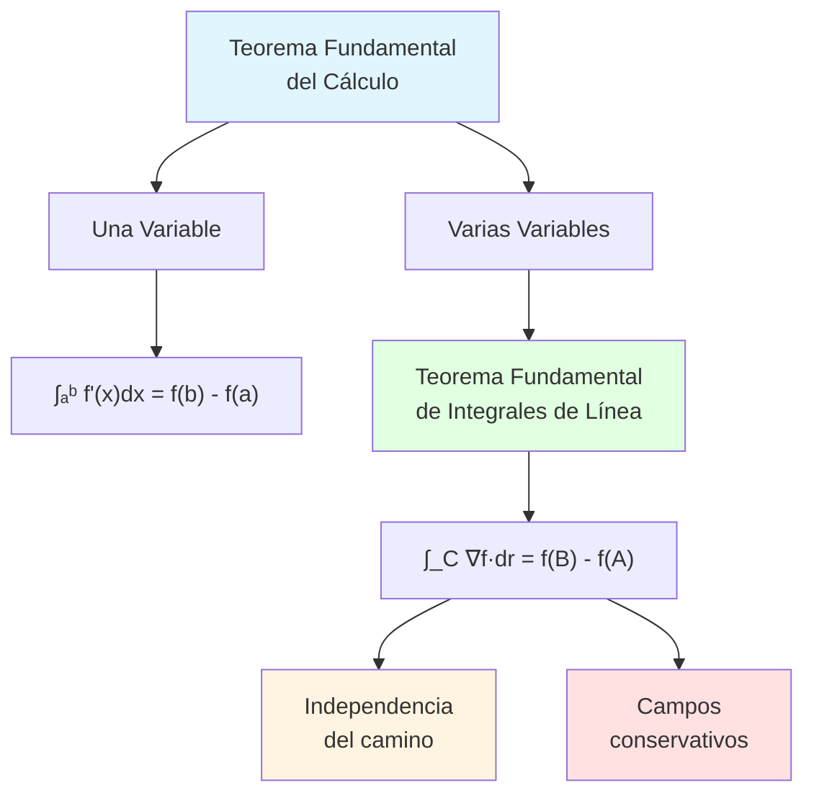

# 🌀 Teorema Fundamental de las Integrales de Línea

## 🎯 Introducción

> [!info]- 💡 ¿Qué es el Teorema Fundamental de las Integrales de Línea?
> 
> El **Teorema Fundamental de las Integrales de Línea** (TFIL) es la extensión natural del Teorema Fundamental del Cálculo a campos vectoriales. Establece que bajo ciertas condiciones, la integral de línea de un campo vectorial depende **únicamente** de los puntos inicial y final, no del camino tomado.
> 
> **Analogía práctica:** Imagina escalar una montaña:
> 
> - **Campo gravitacional** (conservativo): La energía gastada depende solo de la diferencia de altura, no del camino
> - **Camino directo vs serpenteante**: Ambos requieren la misma energía total
> - **Función potencial**: La altura misma es la "función potencial"
> 
> **¿Por qué es importante?**
> 
> |Aspecto|Descripción|Ejemplo de Uso|
> |---|---|---|
> |**Simplificación**|Evita cálculos complejos|Evaluar solo en extremos|
> |**Independencia**|Resultado no depende del camino|Campos conservativos|
> |**Física**|Conservación de energía|Fuerzas conservativas|
> |**Optimización**|Encontrar caminos óptimos|Menor trabajo|
> |**Criterios**|Determinar si campo es conservativo|Prueba del rotacional|



---

## 📐 Conceptos Fundamentales

### 🧭 Campos Vectoriales

> [!example]- 🌊 Definición y Tipos
> 
> Un **campo vectorial** en ℝ² o ℝ³ asigna un vector a cada punto del espacio.
> 
> **Notación:**
> 
> ```
> ℝ²: F(x, y) = P(x,y)î + Q(x,y)ĵ = ⟨P, Q⟩
> 
> ℝ³: F(x, y, z) = P(x,y,z)î + Q(x,y,z)ĵ + R(x,y,z)k̂ = ⟨P, Q, R⟩
> ```
> 
> **Ejemplos físicos:**
> 
> |Campo|Fórmula|Interpretación|
> |---|---|---|
> |**Gravitacional**|**F** = -GMm/r² **r̂**|Atracción hacia masa|
> |**Eléctrico**|**E** = kQ/r² **r̂**|Fuerza sobre carga|
> |**Velocidad fluido**|**v**(x,y)|Dirección y rapidez|
> |**Gradiente**|∇f = ⟨∂f/∂x, ∂f/∂y, ∂f/∂z⟩|Máximo crecimiento|
> |**Fuerza constante**|**F** = ⟨a, b, c⟩|Magnitud fija|
> 
> **Clasificación de campos:**
> 
> ```mermaid
> graph TD
>     A[Campos Vectoriales] --> B[Conservativos]
>     A --> C[No Conservativos]
>     
>     B --> D[∃ función potencial f<br/>F = ∇f]
>     B --> E[Rotacional = 0<br/>∇ × F = 0]
>     B --> F[Independencia<br/>del camino]
>     
>     C --> G[Ejemplo: Fricción]
>     C --> H[Ejemplo: Magnético]
>     C --> I[Depende del camino]
>     
>     style B fill:#e1ffe1
>     style C fill:#ffe1e1
>     style D fill:#fff4e1
> ```
> 
> **Ejemplos concretos:**
> 
> ```
> 1. Campo conservativo:
>    F(x, y) = ⟨2xy, x²⟩
>    Potencial: f(x,y) = x²y
>    Verificar: ∇f = ⟨2xy, x²⟩ ✓
> 
> 2. Campo NO conservativo:
>    F(x, y) = ⟨-y, x⟩  (rotacional)
>    ∇ × F ≠ 0
>    No existe función potencial
> 
> 3. Campo radial:
>    F(x, y) = ⟨x, y⟩/√(x²+y²)
>    Apunta desde el origen
> ```

## 🎓 El Teorema Fundamental

### 📜 Enunciado del Teorema

> [!success]- 🏆 Teorema Fundamental de las Integrales de Línea
> 
> **Enunciado formal:**
> 
> Sea **F** un campo vectorial conservativo en un dominio D, y sea f una función potencial tal que **F** = ∇f. Si C es una curva suave que va del punto A al punto B, entonces:
> 
> ```
> ∫_C F·dr = f(B) - f(A)
> ```
> 
> **Componentes del teorema:**
> 
> |Elemento|Descripción|Requisito|
> |---|---|---|
> |**F conservativo**|Existe función potencial f|∇ × **F** = **0**|
> |**f potencial**|**F** = ∇f|Derivadas parciales|
> |**Curva C**|Camino de A a B|Suave por partes|
> |**Dominio D**|Región conexa|Simplemente conexa|
> 
> **Comparación con cálculo de una variable:**
> 
> ```mermaid
> graph LR
>     A[Una Variable] --> B[∫ₐᵇ f' x dx]
>     B --> C[f b - f a]
>     
>     D[Varias Variables] --> E[∫_C ∇f·dr]
>     E --> F[f B - f A]
>     
>     C --> G[Mismo Principio:<br/>Antiderivada en extremos]
>     F --> G
>     
>     style A fill:#e1f5ff
>     style D fill:#e1f5ff
>     style G fill:#e1ffe1
> ```
> 
> **Condiciones necesarias:**
> 
> ```
> 1. F debe ser conservativo (F = ∇f)
> 2. f debe existir y ser diferenciable
> 3. C debe estar en el dominio de F
> 4. El dominio debe ser conexo
> ```
> 
> **Implicaciones:**
> 
> ```mermaid
> graph TD
>     A[F = ∇f] --> B[∫_C F·dr = f B - f A]
>     B --> C[Independencia<br/>del camino]
>     B --> D[∫ cerrada = 0]
>     B --> E[Simplificación<br/>cálculos]
>     
>     C --> F[Todos los caminos<br/>de A a B dan igual]
>     D --> G[Curvas cerradas<br/>resultado cero]
>     E --> H[Solo evaluar<br/>en extremos]
>     
>     style B fill:#e1ffe1
>     style C fill:#fff4e1
>     style D fill:#ffe1e1
> ```

### 🔍 Demostración (Esquemática)

> [!tip]- 📐 Idea de la Demostración
> 
> **Para curva parametrizada r(t), t ∈ [a, b]:**
> 
> ```
> ∫_C F·dr = ∫_C ∇f·dr
> 
>          = ∫ₐᵇ ∇f(r(t))·r'(t) dt
>          
>          = ∫ₐᵇ d/dt[f(r(t))] dt    [Regla de la cadena]
>          
>          = f(r(b)) - f(r(a))      [TFC una variable]
>          
>          = f(B) - f(A)
> ```
> 
> **Paso clave - Regla de la cadena:**
> 
> ```
> d/dt[f(r(t))] = ∇f(r(t))·r'(t)
> 
> En componentes (ℝ²):
> d/dt[f(x(t), y(t))] = ∂f/∂x · dx/dt + ∂f/∂y · dy/dt
>                      = ⟨∂f/∂x, ∂f/∂y⟩·⟨dx/dt, dy/dt⟩
>                      = ∇f·r'
> ```
> 
> **Diagrama conceptual:**
> 
> ```mermaid
> flowchart TD
>     A[∫_C ∇f·dr] --> B["Parametrizar:<br/>r t, t ∈ [a,b]"]
>     B --> C["∫ₐᵇ ∇f r t ·r' t dt"]
>     C --> D["Regla cadena:<br/>d/dt[f r t "]
>     D --> E["∫ₐᵇ d/dt[f r t ] dt"]
>     E --> F[TFC una variable]
>     F --> G[f r b - f r a]
>     G --> H[f B - f A]
>     
>     style A fill:#e1f5ff
>     style D fill:#fff4e1
>     style H fill:#e1ffe1
> ```

---

## 🔑 Campos Conservativos

### ✅ Criterios para Campos Conservativos

> [!example]- 🧪 Pruebas de Conservatividad
> 
> **Criterio 1: Rotacional nulo (ℝ³)**
> 
> Un campo **F** = ⟨P, Q, R⟩ es conservativo si:
> 
> ```
> ∇ × F = 0
> 
> Es decir:
> ∂R/∂y - ∂Q/∂z = 0
> ∂P/∂z - ∂R/∂x = 0
> ∂Q/∂x - ∂P/∂y = 0
> ```
> 
> **Criterio 2: Condición de integrabilidad (ℝ²)**
> 
> Para **F** = ⟨P, Q⟩:
> 
> ```
> ∂P/∂y = ∂Q/∂x
> ```
> 
> **Criterio 3: Integral de curva cerrada**
> 
> ```
> ∫_C F·dr = 0  para toda curva cerrada C
> ```
> 
> **Criterio 4: Independencia del camino**
> 
> ```
> ∫_{C₁} F·dr = ∫_{C₂} F·dr
> 
> para cualesquiera C₁, C₂ con mismos extremos
> ```
> 
> **Tabla de equivalencias:**
> 
> |Condición|Implica|En dominio|
> |---|---|---|
> |**F = ∇f**|∇ × **F** = **0**|Simplemente conexo|
> |**∇ × F = 0**|∃f: **F** = ∇f|Simplemente conexo|
> |**Indep. camino**|∫ cerrada = 0|Cualquiera|
> |**∫ cerrada = 0**|**F** conservativo|Simplemente conexo|
> 
> **Diagrama de implicaciones:**
> 
> ```mermaid
> graph TD
>     A[F = ∇f<br/>Existe potencial] --> B[∇ × F = 0<br/>Rotacional nulo]
>     B --> C[Independencia<br/>del camino]
>     C --> D[∫ cerrada = 0]
>     
>     D -.->|Dominio<br/>simplemente<br/>conexo| A
>     
>     style A fill:#e1ffe1
>     style B fill:#fff4e1
>     style C fill:#e1f5ff
>     style D fill:#ffe1e1
> ```
> 
> **Ejemplo de verificación:**
> 
> ```
> Campo: F(x, y) = ⟨2xy + y², x² + 2xy⟩
> 
> Paso 1: Identificar componentes
> P(x, y) = 2xy + y²
> Q(x, y) = x² + 2xy
> 
> Paso 2: Calcular derivadas
> ∂P/∂y = 2x + 2y
> ∂Q/∂x = 2x + 2y
> 
> Paso 3: Comparar
> ∂P/∂y = ∂Q/∂x  ✓
> 
> Conclusión: F es conservativo
> ```

### 🔨 Encontrar la Función Potencial

> [!tip]- 🎯 Métodos para Hallar f
> 
> **Método 1: Integración directa (ℝ²)**
> 
> Dado **F** = ⟨P, Q⟩ conservativo, encontrar f tal que:
> 
> ```
> ∂f/∂x = P
> ∂f/∂y = Q
> ```
> 
> **Algoritmo paso a paso:**
> 
> ```
> 1. Integrar P respecto a x:
>    f(x, y) = ∫ P(x, y) dx + g(y)
>    
> 2. Derivar respecto a y:
>    ∂f/∂y = ∂/∂y[∫ P dx] + g'(y)
>    
> 3. Igualar con Q:
>    ∂/∂y[∫ P dx] + g'(y) = Q(x, y)
>    
> 4. Despejar g'(y):
>    g'(y) = Q - ∂/∂y[∫ P dx]
>    
> 5. Integrar para obtener g(y)
> 
> 6. Función potencial:
>    f(x, y) = ∫ P dx + g(y)
> ```
> 
> **Ejemplo completo:**
> 
> ```
> F(x, y) = ⟨2xy, x² + 3⟩
> 
> Paso 1: Verificar conservatividad
> ∂P/∂y = 2x
> ∂Q/∂x = 2x  ✓ Es conservativo
> 
> Paso 2: Integrar P respecto a x
> f = ∫ 2xy dx = x²y + g(y)
> 
> Paso 3: Derivar respecto a y
> ∂f/∂y = x² + g'(y)
> 
> Paso 4: Igualar con Q
> x² + g'(y) = x² + 3
> g'(y) = 3
> 
> Paso 5: Integrar
> g(y) = 3y + C
> 
> Paso 6: Solución
> f(x, y) = x²y + 3y + C
> 
> Verificación:
> ∇f = ⟨2xy, x² + 3⟩ = F ✓
> ```
> 
> **Método 2: Integral de línea (cualquier camino)**
> 
> ```
> f(x, y) = ∫_{(x₀,y₀)}^{(x,y)} F·dr + f(x₀, y₀)
> 
> Camino sugerido (más simple):
> 1. De (x₀, y₀) a (x, y₀) → horizontal
> 2. De (x, y₀) a (x, y)   → vertical
> ```
> 
> **Ejemplo con integral de línea:**
> 
> ```
> F(x, y) = ⟨2x, 2y⟩
> Punto inicial: (0, 0)
> 
> Segmento 1: (0,0) a (x,0)
> r₁(t) = ⟨t, 0⟩, t ∈ [0, x]
> F(r₁) = ⟨2t, 0⟩, r₁' = ⟨1, 0⟩
> ∫ F·dr₁ = ∫₀ˣ 2t dt = x²
> 
> Segmento 2: (x,0) a (x,y)
> r₂(s) = ⟨x, s⟩, s ∈ [0, y]
> F(r₂) = ⟨2x, 2s⟩, r₂' = ⟨0, 1⟩
> ∫ F·dr₂ = ∫₀ʸ 2s ds = y²
> 
> Función potencial:
> f(x, y) = x² + y²
> ```
> 
> **Diagrama del proceso:**
> 
> ```mermaid
> flowchart TD
>     A[Campo F = ⟨P, Q⟩] --> B{¿Es conservativo?}
>     B -->|No| C[❌ No existe<br/>función potencial]
>     B -->|Sí| D[Método 1:<br/>Integración]
>     B -->|Sí| E[Método 2:<br/>Integral de línea]
>     
>     D --> F[f = ∫P dx + g y]
>     F --> G[Determinar g y]
>     
>     E --> H[Elegir camino simple]
>     H --> I[Calcular integral]
>     
>     G --> J[✅ Función potencial f]
>     I --> J
>     
>     style B fill:#fff4e1
>     style J fill:#e1ffe1
>     style C fill:#ffe1e1
> ```

---

## 📊 Problemas Resueltos

### 📝 Problema 1: Verificación y Cálculo

> [!example]- 🎯 Ejemplo Completo en ℝ²
> 
> **Enunciado:** Considere el campo **F**(x, y) = ⟨3x² + 2y, 2x + 4y³⟩.
> 
> a) Verifique que F es conservativo b) Encuentre la función potencial f c) Calcule ∫_C **F**·d**r** donde C va de (0, 0) a (2, 1)
> 
> **Solución:**
> 
> **Parte a) Verificar conservatividad**
> 
> ```
> P(x, y) = 3x² + 2y
> Q(x, y) = 2x + 4y³
> 
> Calcular derivadas:
> ∂P/∂y = 2
> ∂Q/∂x = 2
> 
> ∂P/∂y = ∂Q/∂x ✓
> 
> Conclusión: F es conservativo
> ```
> 
> **Parte b) Encontrar función potencial**
> 
> ```
> Paso 1: Integrar P respecto a x
> f(x, y) = ∫ (3x² + 2y) dx
>         = x³ + 2xy + g(y)
> 
> Paso 2: Derivar respecto a y
> ∂f/∂y = 2x + g'(y)
> 
> Paso 3: Igualar con Q
> 2x + g'(y) = 2x + 4y³
> g'(y) = 4y³
> 
> Paso 4: Integrar
> g(y) = ∫ 4y³ dy = y⁴ + C
> 
> Paso 5: Función potencial
> f(x, y) = x³ + 2xy + y⁴
> 
> Verificación:
> ∇f = ⟨3x², 2x + 4y³⟩ ✓
> Espera... falta el 2y en la primera componente!
> 
> Corrección: Tomar g(y) correctamente
> ∂f/∂y debe incluir el término 2x
> g(y) = y⁴
> 
> Respuesta correcta:
> f(x, y) = x³ + 2xy + y⁴ + C
> ```
> 
> **Parte c) Aplicar TFIL**
> 
> ```
> ∫_C F·dr = f(B) - f(A)
>          = f(2, 1) - f(0, 0)
>          = [2³ + 2(2)(1) + 1⁴] - [0]
>          = [8 + 4 + 1] - 0
>          = 13
> ```
> 
> **Resumen visual:**
> 
> ```mermaid
> graph TB
>     A[F = ⟨3x²+2y, 2x+4y³⟩] --> B[Verificar:<br/>∂P/∂y = ∂Q/∂x]
>     B --> C[✓ Conservativo]
>     C --> D[Hallar f:<br/>x³ + 2xy + y⁴]
>     D --> E[Aplicar TFIL]
>     E --> F[f 2,1 - f 0,0 = 13]
>     
>     style C fill:#e1ffe1
>     style F fill:#fff4e1
> ```

### 📝 Problema 2: Comparación de Caminos

> [!example]- 🛤️ Independencia del Camino
> 
> **Enunciado:** Para **F**(x, y) = ⟨y, x⟩, calcule ∫_C **F**·d**r** para:
> 
> - C₁: Segmento recto de (0, 0) a (1, 1)
> - C₂: Parábola y = x² de (0, 0) a (1, 1)
> 
> **Solución:**
> 
> **Paso 1: Verificar si es conservativo**
> 
> ```
> P(x, y) = y
> Q(x, y) = x
> 
> ∂P/∂y = 1
> ∂Q/∂x = 1
> 
> ∂P/∂y = ∂Q/∂x ✓ Es conservativo
> ```
> 
> **Paso 2: Encontrar función potencial**
> 
> ```
> f = ∫ y dx = xy + g(y)
> 
> ∂f/∂y = x + g'(y) = x
> g'(y) = 0
> g(y) = C
> 
> f(x, y) = xy
> ```
> 
> **Paso 3: Usar TFIL (más rápido)**
> 
> ```
> ∫_C₁ F·dr = f(1, 1) - f(0, 0)
>            = (1)(1) - 0
>            = 1
> 
> ∫_C₂ F·dr = f(1, 1) - f(0, 0)
>            = 1
> 
> Mismo resultado! ✓
> ```
> 
> **Paso 4: Verificación directa (opcional)**
> 
> **Para C₁:**
> 
> ```
> r(t) = ⟨t, t⟩, t ∈ [0, 1]
> r'(t) = ⟨1, 1⟩
> F(r(t)) = ⟨t, t⟩
> 
> ∫ F·dr = ∫₀¹ ⟨t,t⟩·⟨1,1⟩ dt
>        = ∫₀¹ 2t dt
>        = t² |₀¹ = 1 ✓
> ```
> 
> **Para C₂:**
> 
> ```
> r(t) = ⟨t, t²⟩, t ∈ [0, 1]
> r'(t) = ⟨1, 2t⟩
> F(r(t)) = ⟨t², t⟩
> 
> ∫ F·dr = ∫₀¹ ⟨t²,t⟩·⟨1,2t⟩ dt
>        = ∫₀¹ (t² + 2t²) dt
>        = ∫₀¹ 3t² dt
>        = t³ |₀¹ = 1 ✓
> ```
> 
> **Comparación:**
> 
> |Método|Tiempo|Complejidad|Resultado|
> |---|---|---|---|
> |**TFIL**|30 seg|Muy simple|1|
> |**Integral C₁**|2 min|Media|1|
> |**Integral C₂**|3 min|Media|1|

### 📝 Problema 3: Campo NO Conservativo

> [!example]- ❌ Cuando NO Aplica el Teorema
> 
> **Enunciado:** Para **F**(x, y) = ⟨-y, x⟩, calcule ∫_C **F**·d**r** donde:
> 
> - C₁: Semicírculo superior de radio 1, de (-1, 0) a (1, 0)
> - C₂: Segmento recto de (-1, 0) a(1, 0)
> **Solución:**
> 
> **Paso 1: Verificar conservatividad**
> 
> ```
> P(x, y) = -y
> Q(x, y) = x
> 
> ∂P/∂y = -1
> ∂Q/∂x = 1
> 
> ∂P/∂y ≠ ∂Q/∂x ✗ NO es conservativo
> 
> No podemos usar TFIL
> ```
> 
> **Paso 2: Calcular integral en C₁**
> 
> ```
> Semicírculo: r(t) = ⟨cos(t), sin(t)⟩, t ∈ [π, 0]
> r'(t) = ⟨-sin(t), cos(t)⟩
> F(r(t)) = ⟨-sin(t), cos(t)⟩
> 
> ∫_C₁ F·dr = ∫_π⁰ ⟨-sin(t), cos(t)⟩·⟨-sin(t), cos(t)⟩ dt
>           = ∫_π⁰ (sin²(t) + cos²(t)) dt
>           = ∫_π⁰ 1 dt
>           = -π
> ```
> 
> **Paso 3: Calcular integral en C₂**
> 
> ```
> Segmento: r(t) = ⟨t, 0⟩, t ∈ [-1, 1]
> r'(t) = ⟨1, 0⟩
> F(r(t)) = ⟨0, t⟩
> 
> ∫_C₂ F·dr = ∫₋₁¹ ⟨0, t⟩·⟨1, 0⟩ dt
>           = ∫₋₁¹ 0 dt
>           = 0
> ```
> 
> **Conclusión:**
> 
> ```
> ∫_C₁ F·dr = -π ≠ 0 = ∫_C₂ F·dr
> 
> Los resultados son diferentes!
> Esto confirma que F NO es conservativo
> ```
> 
> **Interpretación geométrica:**
> 
> ```mermaid
> graph TD
>     A[F = ⟨-y, x⟩<br/>Campo rotacional] --> B[NO conservativo]
>     B --> C[Depende del camino]
>     C --> D[C₁: semicírculo<br/>∫ = -π]
>     C --> E[C₂: segmento<br/>∫ = 0]
>     
>     D --> F[❌ Resultados<br/>diferentes]
>     E --> F
>     
>     style B fill:#ffe1e1
>     style F fill:#ffcccc
> ```

---

## 🌟 Aplicaciones Físicas

### ⚡ Trabajo y Energía

> [!success]- 💪 Fuerzas Conservativas
> 
> **Definición física:**
> 
> El **trabajo** realizado por una fuerza **F** al mover un objeto a lo largo de C es:
> 
> ```
> W = ∫_C F·dr
> ```
> 
> **Para fuerzas conservativas:**
> 
> ```
> F = -∇U  (U = energía potencial)
> 
> W = ∫_C F·dr = -∫_C ∇U·dr
>   = -(U(B) - U(A))
>   = U(A) - U(B)
>   = -ΔU
> ```
> 
> **Principio de conservación de energía:**
> 
> ```
> E_total = K + U = constante
> 
> donde:
> K = energía cinética = ½mv²
> U = energía potencial
> 
> W = ΔK = -ΔU
> ```
> 
> **Ejemplos de fuerzas conservativas:**
> 
> |Fuerza|Campo|Potencial U|Trabajo|
> |---|---|---|---|
> |**Gravitacional**|**F** = -mg**k̂**|U = mgh|W = -mgΔh|
> |**Elástica**|**F** = -k**r**|U = ½kx²|W = -½k(x₂² - x₁²)|
> |**Eléctrica**|**F** = qE|U = qφ|W = q(φ₁ - φ₂)|
> |**Gravitacional (general)**|**F** = -GMm/r² **r̂**|U = -GMm/r|W = GMm(1/r₂ - 1/r₁)|
> 
> **Ejemplo: Levantar un objeto**
> 
> ```
> Fuerza gravitacional: F = -mg k̂ = ⟨0, 0, -mg⟩
> Potencial: U(z) = mgz
> 
> Camino: De z = 0 a z = h
> 
> Método 1 (TFIL):
> W = U(0) - U(h) = 0 - mgh = -mgh
> 
> Método 2 (Integral directa):
> W = ∫₀ʰ ⟨0, 0, -mg⟩·⟨0, 0, 1⟩ dz
>   = ∫₀ʰ -mg dz
>   = -mgh ✓
> 
> Interpretación:
> Trabajo negativo → fuerza opuesta al movimiento
> ```
> 
> **Diagrama energético:**
> 
> ```mermaid
> graph LR
>     A[Estado inicial<br/>z=0, U=0] --> B[Aplicar fuerza]
>     B --> C[Estado final<br/>z=h, U=mgh]
>     
>     D[Trabajo W = -mgh] --> E[ΔU = +mgh]
>     E --> F[W = -ΔU ✓]
>     
>     style A fill:#e1ffe1
>     style C fill:#ffe1e1
>     style F fill:#fff4e1
> ```

### 🌡️ Campos de Temperatura

> [!note]- 🔥 Gradiente Térmico
> 
> **Flujo de calor:**
> 
> El flujo de calor sigue la ley de Fourier:
> 
> ```
> q = -k∇T
> 
> donde:
> q = flujo de calor
> k = conductividad térmica
> T = temperatura
> ```
> 
> **Trabajo para mover partícula en campo de temperatura:**
> 
> Si T(x, y, z) es la temperatura, y una partícula se mueve de A a B:
> 
> ```
> Cambio de temperatura:
> ΔT = T(B) - T(A) = ∫_C ∇T·dr
> 
> Independiente del camino!
> ```
> 
> **Ejemplo:**
> 
> ```
> Temperatura: T(x, y) = 100 - x² - y²
> 
> Gradiente: ∇T = ⟨-2x, -2y⟩
> 
> Camino: De (0, 0) a (3, 4)
> 
> ΔT = T(3, 4) - T(0, 0)
>    = [100 - 9 - 16] - 100
>    = -25°C
> 
> La temperatura disminuye 25°C
> ```

---

## 🔄 Curvas Cerradas y Circulación

### 🔁 Integrales Sobre Curvas Cerradas

> [!tip]- ⭕ Teorema para Curvas Cerradas
> 
> **Proposición:**
> 
> Si **F** es conservativo, entonces para cualquier curva cerrada C:
> 
> ```
> ∮_C F·dr = 0
> ```
> 
> **Demostración:**
> 
> ```
> Si F = ∇f, y C es cerrada (A = B):
> 
> ∮_C F·dr = f(B) - f(A)
>          = f(A) - f(A)
>          = 0
> ```
> 
> **Recíproco (en dominios simplemente conexos):**
> 
> ```
> Si ∮_C F·dr = 0 para toda curva cerrada C
> ⟹ F es conservativo
> ```
> 
> **Circulación:**
> 
> La integral sobre curva cerrada se llama **circulación**:
> 
> ```
> Γ = ∮_C F·dr
> 
> Mide tendencia del campo a "rotar"
> ```
> 
> **Interpretación:**
> 
> ```mermaid
> graph TD
>     A[Curva Cerrada C] --> B{Campo F}
>     B -->|Conservativo| C[∮ F·dr = 0<br/>Sin circulación]
>     B -->|NO conservativo| D[∮ F·dr ≠ 0<br/>Hay circulación]
>     
>     C --> E[Ejemplo:<br/>Gravitacional]
>     D --> F[Ejemplo:<br/>Magnético]
>     
>     style C fill:#e1ffe1
>     style D fill:#ffe1e1
> ```
> 
> **Ejemplo: Campo radial**
> 
> ```
> F(x, y) = ⟨x, y⟩ (conservativo)
> 
> Círculo: x² + y² = 1
> r(t) = ⟨cos(t), sin(t)⟩, t ∈ [0, 2π]
> 
> Método 1 (TFIL):
> ∮ F·dr = 0 (porque F es conservativo)
> 
> Método 2 (Verificación directa):
> F(r(t)) = ⟨cos(t), sin(t)⟩
> r'(t) = ⟨-sin(t), cos(t)⟩
> 
> F·r' = cos(t)·(-sin(t)) + sin(t)·cos(t) = 0
> 
> ∮ F·dr = ∫₀²π 0 dt = 0 ✓
> ```
> 
> **Ejemplo: Campo rotacional**
> 
> ```
> F(x, y) = ⟨-y, x⟩ (NO conservativo)
> 
> Círculo unitario:
> ∮ F·dr = ∫₀²π ⟨-sin(t), cos(t)⟩·⟨-sin(t), cos(t)⟩ dt
>        = ∫₀²π (sin²(t) + cos²(t)) dt
>        = ∫₀²π 1 dt
>        = 2π ≠ 0
> 
> Confirma que F NO es conservativo
> ```

### 🌀 Relación con el Rotacional

> [!example]- 🔄 Conexión con el Teorema de Green
> 
> **Teorema de Green (preliminar):**
> 
> Para región D en ℝ² con frontera C:
> 
> ```
> ∮_C P dx + Q dy = ∬_D (∂Q/∂x - ∂P/∂y) dA
> ```
> 
> **Interpretación para campos conservativos:**
> 
> ```
> Si F = ⟨P, Q⟩ es conservativo:
> ∂P/∂y = ∂Q/∂x
> 
> ⟹ ∂Q/∂x - ∂P/∂y = 0
> 
> ⟹ ∮_C F·dr = ∬_D 0 dA = 0
> ```
> 
> **Rotacional en 2D:**
> 
> ```
> rot(F) = ∂Q/∂x - ∂P/∂y
> 
> Campo conservativo ⟺ rot(F) = 0
> ```
> 
> **En 3D:**
> 
> ```
> ∇ × F = |  î    ĵ    k̂  |
>         | ∂/∂x ∂/∂y ∂/∂z|
>         |  P    Q    R  |
> 
> F conservativo ⟺ ∇ × F = 0
> ```

---

## 🎯 Estrategias de Resolución

### 📋 Guía Práctica

> [!success]- ✅ Checklist de Resolución
> 
> **Paso 1: Identificar el problema**
> 
> ```
> ¿Qué se pide?
> □ Verificar si campo es conservativo
> □ Encontrar función potencial
> □ Calcular integral de línea
> □ Comparar diferentes caminos
> ```
> 
> **Paso 2: Verificar conservatividad**
> 
> ```
> En ℝ²: ¿∂P/∂y = ∂Q/∂x?
> En ℝ³: ¿∇ × F = 0?
> 
> □ Sí → Continuar con TFIL
> □ No → Usar método directo
> ```
> 
> **Paso 3: Si es conservativo**
> 
> ```
> □ Encontrar función potencial f
> □ Evaluar f en puntos inicial y final
> □ Calcular f(B) - f(A)
> ```
> 
> **Paso 4: Si NO es conservativo**
> 
> ```
> □ Parametrizar la curva C
> □ Calcular r'(t)
> □ Sustituir en F(r(t))
> □ Calcular F·r'
> □ Integrar ∫ₐᵇ F(r(t))·r'(t) dt
> ```
> 
> **Diagrama de decisión:**
> 
> ```mermaid
> flowchart TD
>     A[Problema de<br/>integral de línea] --> B{¿Campo<br/>conservativo?}
>     
>     B -->|Verificar| C{¿∂P/∂y = ∂Q/∂x?}
>     C -->|Sí| D[✅ Conservativo]
>     C -->|No| E[❌ NO conservativo]
>     
>     D --> F[Hallar potencial f]
>     F --> G[Aplicar TFIL:<br/>f B - f A]
>     G --> H[✅ Solución<br/>rápida]
>     
>     E --> I[Parametrizar C]
>     I --> J[Calcular integral<br/>directamente]
>     J --> K[✅ Solución<br/>trabajosa]
>     
>     style D fill:#e1ffe1
>     style E fill:#ffe1e1
>     style H fill:#ccffcc
>     style K fill:#ffcccc
> ```

### 🚫 Errores Comunes

> [!warning]- ⚠️ Pitfalls a Evitar
> 
> **Error 1: Asumir conservatividad sin verificar**
> 
> ```
> ❌ MAL:
> "F parece simple, debe ser conservativo"
> Aplicar TFIL directamente
> 
> ✅ BIEN:
> Siempre verificar: ∂P/∂y = ∂Q/∂x
> ```
> 
> **Error 2: Confundir orden de sustracción**
> 
> ```
> ❌ MAL:
> ∫_C F·dr = f(A) - f(B)
> 
> ✅ BIEN:
> ∫_C F·dr = f(B) - f(A)
> (Punto final menos punto inicial)
> ```
> 
> **Error 3: Olvidar dominio simplemente conexo**
> 
> ```
> Campo: F = ⟨-y/(x²+y²), x/(x²+y²)⟩
> 
> ∂P/∂y = ∂Q/∂x ✓ en dominio sin origen
> 
> Pero ∮ F·dr = 2π ≠ 0 alrededor del origen
> 
> Razón: Dominio NO es simplemente conexo
> (tiene un "agujero" en el origen)
> ```
> 
> **Error 4: Errores algebraicos al encontrar f**
> 
> ```
> ❌ MAL:
> Integrar mal una componente
> No incluir g(y) o g(x)
> 
> ✅ BIEN:
> Verificar siempre: ∇f = F
> ```
> 
> **Error 5: Confundir signos en física**
> 
> ```
> Fuerza conservativa: F = -∇U
> 
> ❌ MAL: F = ∇U
> ✅ BIEN: F = -∇U
> 
> Trabajo: W = -ΔU = -(U(B) - U(A))
> ```
> 
> **Tabla de verificaciones:**
> 
> |Aspecto|Verificación|¿Cómo?|
> |---|---|---|
> |**Conservatividad**|∂P/∂y = ∂Q/∂x|Calcular ambas derivadas|
> |**Potencial**|∇f = **F**|Derivar f y comparar|
> |**Dominio**|Simplemente conexo|Sin agujeros|
> |**Orientación**|Dirección de C|De A a B|
> |**Unidades**|Dimensionalmente correcto|Física|

---

## 📚 Ejercicios Propuestos

> [!note]- 💪 Problemas para Practicar
> 
> ### Nivel Básico
> 
> **1. Verificación simple**
> 
> ```
> Determine si los siguientes campos son conservativos:
> 
> a) F(x, y) = ⟨2x, 2y⟩
> b) F(x, y) = ⟨y, -x⟩
> c) F(x, y) = ⟨e^x cos(y), -e^x sin(y)⟩
> ```
> 
> **2. Función potencial**
> 
> ```
> Para F(x, y) = ⟨6xy, 3x² + 4y⟩:
> a) Verifique que es conservativo
> b) Encuentre la función potencial f
> c) Calcule ∫_C F·dr de (0,0) a (2,3)
> ```
> 
> ### Nivel Intermedio
> 
> **3. Comparación de caminos**
> 
> ```
> Para F(x, y) = ⟨2x + y, x + 2y⟩:
> a) Verifique conservatividad
> b) Calcule ∫_C F·dr por dos caminos diferentes
>    de (0,0) a (1,1)
> c) Verifique que dan el mismo resultado
> ```
> 
> **4. Campo en 3D**
> 
> ```
> F(x,y,z) = ⟨yz, xz, xy⟩
> 
> a) Verifique que ∇ × F = 0
> b) Encuentre función potencial
> c) Calcule trabajo de (0,0,0) a (1,2,3)
> ```
> 
> ### Nivel Avanzado
> 
> **5. Curva cerrada**
> 
> ```
> Para F(x, y) = ⟨x²y, xy²⟩:
> a) ¿Es conservativo?
> b) Calcule ∮_C F·dr donde C es x² + y² = 4
> c) Interprete el resultado
> ```
> 
> **6. Aplicación física**
> 
> ```
> Una partícula se mueve en el campo de fuerza
> F(x,y) = ⟨2x/(x²+y²)^(3/2), 2y/(x²+y²)^(3/2)⟩
> 
> a) ¿Es conservativo?
> b) Encuentre la energía potencial
> c) Calcule trabajo de (1,0) a (0,2)
> ```
> 
> **7. Problema teórico**
> 
> ```
> Demuestre que si F y G son conservativos,
> entonces αF + βG también es conservativo
> (α, β constantes)
> ```
> 
> **8. Dominio con agujero**
> 
> ```
> Campo: F = ⟨-y/(x²+y²), x/(x²+y²)⟩
> 
> a) Verifique ∂P/∂y = ∂Q/∂x en ℝ²\{(0,0)}
> b) Calcule ∮_C F·dr donde C es x² + y² = 1
> c) Explique por qué ∮ ≠ 0 si "parece" conservativo
> ```

---

## 🔗 Conexión con Teoremas Posteriores

> [!quote]- 🌟 Temas Relacionados
> 
> **Jerarquía de teoremas fundamentales:**
> 
> ```mermaid
> graph TD
>     A[Teorema Fundamental<br/>del Cálculo] --> B[TFIL<br/>Integrales de Línea]
>     B --> C[Teorema de Green<br/>ℝ²]
>     C --> D[Teorema de Stokes<br/>ℝ³]
>     D --> E[Teorema de la Divergencia<br/>ℝ³]
>     
>     B --> F[Campos<br/>Conservativos]
>     C --> G[Rotacional<br/>en 2D]
>     D --> H[Rotacional<br/>en 3D]
>     E --> I[Divergencia]
>     
>     style A fill:#e1f5ff
>     style B fill:#e1ffe1
>     style C fill:#fff4e1
>     style D fill:#ffe1e1
>     style E fill:#f0e1ff
> ```
> 
> **Progresión del aprendizaje:**
> 
> |Tema|Dimensión|Relaciona|Aplicación|
> |---|---|---|---|
> |**TFIL**|Curva en ℝⁿ|Extremos de curva|Trabajo, energía|
> |**Green**|Región en ℝ²|Frontera ↔ Interior|Área, flujo|
> |**Stokes**|Superficie en ℝ³|Frontera ↔ Superficie|Circulación|
> |**Divergencia**|Volumen en ℝ³|Frontera ↔ Volumen|Flujo neto|
> 
> **Conexiones conceptuales:**
> 
> ```
> TFIL dice:
> ∫_C ∇f·dr = f(B) - f(A)
> 
> Green generaliza:
> ∮_C F·dr = ∬_D (∂Q/∂x - ∂P/∂y) dA
> 
> Stokes generaliza Green:
> ∮_C F·dr = ∬_S (∇×F)·dS
> 
> Divergencia (forma diferente):
> ∬_S F·dS = ∭_V (∇·F) dV
> ```

---

## 📊 Resumen Visual Completo

> [!success]- ✅ Mapa Conceptual Final
> 
> ```mermaid
> mindmap
>   root((TFIL))
>     Condiciones
>       Campo conservativo
>         F = ∇f
>         ∇ × F = 0
>       Dominio conexo
>         Sin agujeros
>         Simplemente conexo
>     Fórmula Principal
>       ∫_C F·dr = f B - f A
>       Independencia camino
>       Curva cerrada = 0
>     Hallar Potencial
>       Integración directa
>       Integral de línea
>       Verificar ∇f = F
>     Aplicaciones
>       Física
>         Trabajo
>         Energía
>       Optimización
>         Menor camino
>       Ingeniería
>         Diseño
>     Extensiones
>       Teorema Green
>       Teorema Stokes
>       Divergencia
> ```
> 
> **Fórmulas clave:**
> 
> |Concepto|Fórmula|Condición|
> |---|---|---|
> |**TFIL**|∫_C ∇f·dr = f(B) - f(A)|F = ∇f|
> |**Conservativo (2D)**|∂P/∂y = ∂Q/∂x|Necesaria y suficiente*|
> |**Conservativo (3D)**|∇ × **F** = **0**|Necesaria y suficiente*|
> |**Potencial**|**F** = ∇f|f existe|
> |**Curva cerrada**|∮_C **F**·d**r** = 0|F conservativo|
> |**Trabajo**|W = f(A) - f(B)|Fuerza conservativa|
> 
> *En dominio simplemente conexo

---

**Tags:** #cálculo-vectorial #integral-de-línea #teorema-fundamental #campos-conservativos #función-potencial #trabajo #energía #gradiente #rotacional #independencia-camino #mermaid #diagramas