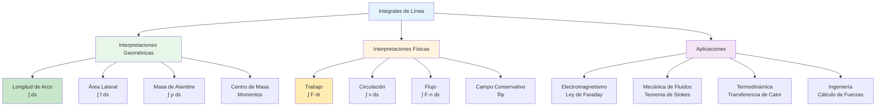

# 🎨 Interpretaciones Geométricas y Físicas

## 🎯 Introducción Conceptual

> [!info]- 💡 Visión General de las Interpretaciones
> Las **integrales de línea** no son solo construcciones matemáticas abstractas, sino herramientas poderosas con significados geométricos y físicos profundos. Cada tipo de integral de línea responde a preguntas específicas sobre:
> 
> **Perspectiva Geométrica:**
> - **¿Cuánto mide?** → Longitud de curvas
> - **¿Cuánto pesa?** → Masa de alambres
> - **¿Dónde se equilibra?** → Centro de masa
> - **¿Qué área cubre?** → Superficies laterales
> 
> **Perspectiva Física:**
> - **¿Cuánta energía se consume?** → Trabajo mecánico
> - **¿Cómo fluye?** → Circulación de fluidos
> - **¿Qué atraviesa?** → Flujo a través de curvas
> - **¿Es conservativo?** → Independencia del camino
> 
> **Importancia Histórica:**
> - **Isaac Newton (1665-1687):** Desarrollo del cálculo, leyes del movimiento
> - **Gottfried Leibniz (1684):** Notación integral moderna
> - **Joseph-Louis Lagrange (1788):** Mecánica analítica
> - **Carl Friedrich Gauss (1813):** Teorema de la divergencia
> - **George Green (1828):** Teorema de Green
> - **William Thomson (Lord Kelvin, 1850):** Teorema de Stokes
> - **Michael Faraday (1831):** Ley de inducción electromagnética
> 
> **Conexión entre tipos:**
> ```
> Integral Escalar (∫ f ds) → Propiedades geométricas (masa, longitud)
> Integral Vectorial (∫ F·dr) → Propiedades dinámicas (trabajo, flujo)
> ```

## 📏 Interpretaciones Geométricas

### 📐 Longitud de Arco

> [!note]- 📏 La Medida Fundamental de una Curva
> **Concepto:**
> 
> La **longitud de arco** es la distancia total recorrida a lo largo de una curva C.
> 
> **Fórmula fundamental:**
> 
> $$L = \int_C ds = \int_a^b ||r'(t)|| \, dt = \int_a^b \sqrt{\left(\frac{dx}{dt}\right)^2 + \left(\frac{dy}{dt}\right)^2 + \left(\frac{dz}{dt}\right)^2} \, dt$$
> 
> **Interpretación geométrica:**
> 
> - **ds** es el elemento diferencial de longitud
> - Sumamos infinitos segmentos infinitesimales
> - Es como "estirar" la curva hasta hacerla recta y medirla
> 
> **Analogías útiles:**
> - 📏 **Cinta métrica flexible:** Medir el contorno de un objeto irregular
> - 🧵 **Hilo sobre curva:** Longitud del hilo que sigue perfectamente la curva
> - 🛣️ **Carretera sinuosa:** Distancia real vs distancia en línea recta
> 
> **Propiedades:**
> 1. **No negativa:** L ≥ 0, con L = 0 solo si C es un punto
> 2. **Aditiva:** Si C = C₁ ∪ C₂, entonces L(C) = L(C₁) + L(C₂)
> 3. **Invariante bajo reparametrización:** No depende de cómo recorramos C
> 4. **Cota inferior:** L ≥ ||r(b) - r(a)|| (desigualdad del camino más corto)

### 📊 Ejemplos Detallados de Longitud

> [!example]- 🎯 Cálculos Concretos
> **Ejemplo 1: Circunferencia** ⭕
> 
> Verificar que la longitud de una circunferencia de radio R es 2πR.
> 
> **Parametrización:**
> ```
> r(t) = (R cos t, R sin t, 0),  t ∈ [0, 2π]
> 
> r'(t) = (-R sin t, R cos t, 0)
> ||r'(t)|| = √(R²sin²t + R²cos²t + 0²)
>          = √(R²(sin²t + cos²t))
>          = √(R²) = R
> 
> L = ∫₀²π R dt = R·t|₀²π = 2πR ✓
> ```
> 
> **Interpretación:** La velocidad de recorrido es constante (R unidades por radián).
> 
> ---
> 
> **Ejemplo 2: Hélice cilíndrica** 🌀
> 
> Calcular la longitud de una vuelta completa de la hélice:
> 
> ```
> r(t) = (a cos t, a sin t, bt),  t ∈ [0, 2π]
> ```
> 
> donde a es el radio y b controla la altura por vuelta.
> 
> **Solución:**
> ```
> r'(t) = (-a sin t, a cos t, b)
> ||r'(t)|| = √(a²sin²t + a²cos²t + b²)
>          = √(a² + b²)
> 
> L = ∫₀²π √(a² + b²) dt = 2π√(a² + b²)
> ```
> 
> **Interpretación física:**
> - Si b = 0 → L = 2πa (circunferencia plana)
> - Si a = 0 → L = 2πb (línea vertical)
> - El término √(a² + b²) es como la hipotenusa de un triángulo rectángulo
> 
> ---
> 
> **Ejemplo 3: Segmento de parábola** 📈
> 
> Longitud de y = x² desde x = 0 hasta x = 1.
> 
> **Parametrización:**
> ```
> r(t) = (t, t², 0),  t ∈ [0, 1]
> 
> r'(t) = (1, 2t, 0)
> ||r'(t)|| = √(1 + 4t²)
> 
> L = ∫₀¹ √(1 + 4t²) dt
> ```
> 
> **Sustitución:** u = 2t, du = 2dt
> ```
> L = (1/2)∫₀² √(1 + u²) du
>   = (1/2)[u√(1+u²)/2 + (1/2)ln|u + √(1+u²)|]₀²
>   = (1/2)[√5 + (1/2)ln(2 + √5)]
>   ≈ 1.478 unidades
> ```
> 
> **Comparación:** La distancia en línea recta es √2 ≈ 1.414, menor que la longitud de la curva.

### 🏗️ Área de Superficie Lateral

> [!success]- 📐 Superficies Generadas por Curvas
> **Concepto:**
> 
> Cuando una curva C en el plano xy se "levanta" según una función f(x,y,z), genera una **superficie lateral**.
> 
> **Fórmula del área:**
> 
> $$A = \int_C f(x, y, z) \, ds$$
> 
> **Interpretaciones:**
> 
> **1. Cerca variable:**
> - Imagina una valla que sigue la curva C
> - La altura de la valla en cada punto es f(x,y,z)
> - El área es la cantidad de material necesario
> 
> **2. Cortina suspendida:**
> - Una tela colgada sobre un alambre curvo
> - La tela cae hasta una altura variable f
> - El área total de la cortina
> 
> **3. Superficie de revolución:**
> - Si C rota alrededor de un eje
> - f representa el radio de rotación
> - A = 2π∫ r ds (fórmula de Pappus)
> 
> **Casos especiales:**
> 
> - **f = 1:** Área de "franja" con altura unitaria → igual a la longitud L
> - **f = constante k:** Área = k·L (escala proporcional)
> - **f = distancia al eje:** Área de superficie de revolución

### 📦 Masa y Densidad de Alambre

> [!warning]- ⚖️ Distribución de Masa a lo Largo de una Curva
> **Concepto físico:**
> 
> Un **alambre** tiene forma de curva C y densidad lineal ρ(x,y,z) (masa por unidad de longitud).
> 
> **Fórmula de la masa total:**
> 
> $$M = \int_C \rho(x, y, z) \, ds$$
> 
> **Interpretación:**
> 
> - **ds:** pedacito de longitud del alambre
> - **ρ(x,y,z)·ds:** masa de ese pedacito
> - **∫:** suma de todas las masas infinitesimales
> 
> **Tipos de densidad:**
> 
> **1. Densidad constante:** ρ = ρ₀
> ```
> M = ∫_C ρ₀ ds = ρ₀ · L
> ```
> Masa proporcional a la longitud (alambre homogéneo)
> 
> **2. Densidad variable:**
> ```
> ρ(x,y,z) = 1 + x² + y²  (aumenta con la distancia al eje z)
> ρ(x,y,z) = e^(-z)        (decae exponencialmente con la altura)
> ```
> 
> **3. Densidad por tramos:**
> ```
> ρ(x,y,z) = { ρ₁  si x < 0
>            { ρ₂  si x ≥ 0
> ```
> 
> **Ejemplo detallado:**
> 
> Un alambre semicircular de radio R tiene densidad ρ = k(1 + y), donde k es constante.
> 
> ```
> Curva: r(t) = (R cos t, R sin t, 0), t ∈ [0, π]
> Densidad: ρ = k(1 + R sin t)
> ||r'(t)|| = R
> 
> M = ∫₀π k(1 + R sin t) · R dt
>   = kR ∫₀π (1 + R sin t) dt
>   = kR [t - R cos t]₀π
>   = kR [π - R(-1) - (0 - R)]
>   = kR [π + 2R]
>   = kR(π + 2R)
> ```

### 🎯 Centro de Masa de un Alambre

> [!tip]- ⚖️ Punto de Equilibrio
> **Concepto:**
> 
> El **centro de masa** es el punto donde podríamos "balancear" el alambre perfectamente.
> 
> **Fórmulas de coordenadas:**
> 
> $$\bar{x} = \frac{1}{M} \int_C x \rho(x,y,z) \, ds$$
> 
> $$\bar{y} = \frac{1}{M} \int_C y \rho(x,y,z) \, ds$$
> 
> $$\bar{z} = \frac{1}{M} \int_C z \rho(x,y,z) \, ds$$
> 
> donde M es la masa total.
> 
> **Interpretación física:**
> 
> - **Numerador:** Momento de la masa respecto al plano coordenado
> - **Denominador:** Masa total (normalización)
> - **Resultado:** Promedio ponderado de posiciones
> 
> **Propiedades:**
> 
> 1. **Simetría:** Si la curva y densidad son simétricas respecto a un eje, el CM está en ese eje
> 2. **Extremos:** El CM no necesariamente está sobre la curva
> 3. **Linealidad:** CM de unión de alambres se calcula por suma ponderada
> 
> **Analogía útil:** 🎪
> - Equilibrista con barra desequilibrada
> - El punto de apoyo debe estar en el CM para mantener equilibrio
> 
> **Ejemplo: Semicircunferencia homogénea**
> 
> ```
> Curva: r(t) = (R cos t, R sin t, 0), t ∈ [0, π]
> Densidad: ρ = ρ₀ (constante)
> 
> Masa: M = ρ₀πR
> 
> Por simetría: x̄ = 0
> 
> ȳ = (1/M) ∫₀π (R sin t) · ρ₀ · R dt
>   = (ρ₀R/ρ₀πR) ∫₀π R sin t dt
>   = (R/π) [-R cos t]₀π
>   = (R/π) · 2R
>   = 2R/π ≈ 0.637R
> 
> z̄ = 0 (curva en plano xy)
> 
> Centro de masa: (0, 2R/π, 0)
> ```

## ⚡ Interpretaciones Físicas

### 💪 Trabajo Mecánico

> [!warning]- 🔧 Energía Transferida por una Fuerza
> **Concepto fundamental:**
> 
> El **trabajo** W es la energía transferida cuando una fuerza **F** mueve un objeto a lo largo de una curva C.
> 
> **Fórmula del trabajo:**
> 
> $$W = \int_C \mathbf{F} \cdot d\mathbf{r} = \int_a^b \mathbf{F}(\mathbf{r}(t)) \cdot \mathbf{r}'(t) \, dt$$
> 
> **Interpretación física profunda:**
> 
> **1. Componente tangencial:**
> - Solo la componente de **F** paralela al movimiento realiza trabajo
> - **F**·**T** donde **T** = **r'**/||**r'**|| es el vector tangente unitario
> - Fuerza perpendicular al movimiento → trabajo nulo
> 
> **2. Producto punto:**
> - **F**·d**r** = ||**F**|| ||d**r**|| cos θ
> - θ es el ángulo entre fuerza y desplazamiento
> - Si θ = 0° → trabajo máximo (fuerza alineada)
> - Si θ = 90° → trabajo cero (fuerza perpendicular)
> - Si θ = 180° → trabajo negativo (fuerza opuesta)
> 
> **3. Acumulación de energía:**
> ```
> dW = F · dr  →  trabajo infinitesimal
> W = ∫ dW    →  trabajo total (suma continua)
> ```
> 
> **Analogías útiles:**
> 
> - 🚗 **Empujar un auto:** Trabajo = fuerza × distancia × cos(ángulo)
> - 🎢 **Montaña rusa:** Trabajo de la gravedad (positivo bajando, negativo subiendo)
> - 🏋️ **Levantar peso:** Trabajo contra la gravedad
> - 🌊 **Remar contra corriente:** Trabajo para avanzar
> 
> **Unidades:**
> - SI: Newton·metro = Joule (J)
> - CGS: dina·centímetro = ergio
> - Imperial: libra-fuerza·pie

### 📊 Ejemplos de Trabajo

> [!example]- 🎯 Cálculos Físicos Detallados
> **Ejemplo 1: Trabajo gravitacional** 🌍
> 
> Calcular el trabajo realizado por la gravedad al mover una masa m desde A = (0, 0, h) hasta B = (L, 0, 0) a lo largo de un plano inclinado.
> 
> ```
> Fuerza gravitacional: F = (0, 0, -mg)
> Curva (línea recta): r(t) = (Lt, 0, h(1-t)), t ∈ [0, 1]
> r'(t) = (L, 0, -h)
> 
> F · r'(t) = (0, 0, -mg) · (L, 0, -h)
>          = 0 + 0 + (-mg)(-h)
>          = mgh
> 
> W = ∫₀¹ mgh dt = mgh
> ```
> 
> **Interpretación:**
> - Trabajo positivo (W > 0) → la gravedad ayuda al movimiento
> - No depende del camino, solo de la altura inicial y final
> - Principio de conservación de energía: W = ΔEₚ = mg(h₁ - h₂)
> 
> ---
> 
> **Ejemplo 2: Campo de fuerza radial** ⚡
> 
> Un campo de fuerza **F** = (x, y, 0) actúa sobre una partícula que se mueve por el círculo x² + y² = 1 desde (1, 0) hasta (0, 1).
> 
> ```
> Parametrización: r(t) = (cos t, sin t, 0), t ∈ [0, π/2]
> r'(t) = (-sin t, cos t, 0)
> F(r(t)) = (cos t, sin t, 0)
> 
> F · r'(t) = (cos t)(-sin t) + (sin t)(cos t) + 0
>          = -sin t cos t + sin t cos t
>          = 0
> 
> W = ∫₀^(π/2) 0 dt = 0
> ```
> 
> **Interpretación:**
> - La fuerza siempre apunta radialmente hacia afuera
> - El movimiento es tangencial (perpendicular al radio)
> - Fuerza ⊥ desplazamiento → W = 0
> 
> ---
> 
> **Ejemplo 3: Trabajo en hélice** 🌀
> 
> Fuerza **F** = (y, -x, z) actúa sobre partícula en hélice r(t) = (cos t, sin t, t) desde t = 0 hasta t = 2π.
> 
> ```
> r'(t) = (-sin t, cos t, 1)
> F(r(t)) = (sin t, -cos t, t)
> 
> F · r'(t) = (sin t)(-sin t) + (-cos t)(cos t) + t·1
>          = -sin²t - cos²t + t
>          = -1 + t
> 
> W = ∫₀²π (-1 + t) dt
>   = [-t + t²/2]₀²π
>   = -2π + 2π²
>   = 2π(π - 1)
>   ≈ 13.48 J (si unidades en joules)
> ```

### 🌊 Circulación de un Campo Vectorial

> [!success]- 🔄 Flujo Rotacional
> **Concepto:**
> 
> La **circulación** Γ mide la tendencia de un campo vectorial **F** a "girar" alrededor de una curva cerrada C.
> 
> **Fórmula:**
> 
> $$\Gamma = \oint_C \mathbf{F} \cdot d\mathbf{r}$$
> 
> El símbolo ∮ indica integral sobre curva cerrada.
> 
> **Interpretaciones físicas:**
> 
> **1. Mecánica de fluidos:** 💨
> - **F** = **v** (campo de velocidad de un fluido)
> - Γ > 0: rotación en sentido antihorario
> - Γ < 0: rotación en sentido horario
> - Γ = 0: flujo irrotacional (sin vórtices)
> 
> **2. Electromagnetismo:** ⚡
> - **F** = **E** (campo eléctrico)
> - Γ = ∮ **E**·d**r** relacionado con flujo magnético (Ley de Faraday)
> 
> **3. Vorticidad:** 🌀
> - Mide la "rotación local" del fluido
> - Relacionado con el rotacional: ∇ × **F**
> 
> **Teorema de Stokes:**
> 
> $$\oint_C \mathbf{F} \cdot d\mathbf{r} = \iint_S (\nabla \times \mathbf{F}) \cdot \mathbf{n} \, dS$$
> 
> Conecta circulación con rotacional sobre superficie S con frontera C.
> 
> **Ejemplos conceptuales:**
> 
> ```
> Campo rotacional: F = (-y, x, 0)
> Círculo unitario en sentido antihorario
> 
> Γ = ∮ F · dr = 2π (circulación positiva)
> 
> Campo radial: F = (x, y, 0)
> Cualquier curva cerrada
> 
> Γ = ∮ F · dr = 0 (sin circulación)
> ```

### 🌬️ Flujo a través de una Curva

> [!info]- ➡️ Cantidad que Atraviesa
> **Concepto:**
> 
> El **flujo** Φ mide cuánto de un campo vectorial **F** "atraviesa" una curva C.
> 
> **Fórmula (curva plana):**
> 
> $$\Phi = \int_C \mathbf{F} \cdot \mathbf{n} \, ds$$
> 
> donde **n** es el vector normal unitario a C (perpendicular).
> 
> **Relación con circulación:**
> 
> Para curva plana en el plano xy:
> - **Vector tangente:** **T** = (dx/ds, dy/ds)
> - **Vector normal:** **n** = (dy/ds, -dx/ds) o (-dy/ds, dx/ds)
> 
> ```
> Circulación: ∫ F · T ds  (componente tangencial)
> Flujo:       ∫ F · n ds  (componente normal)
> ```
> 
> **Interpretaciones:**
> 
> **1. Flujo de fluido:** 🌊
> - **F** = ρ**v** (densidad × velocidad)
> - Φ = masa que atraviesa C por unidad de tiempo
> 
> **2. Campo eléctrico:** ⚡
> - **F** = **E**
> - Φ relacionado con carga encerrada (Ley de Gauss)
> 
> **3. Flujo térmico:** 🔥
> - **F** = -k∇T (ley de Fourier)
> - Φ = calor transferido por conducción
> 
> **Ejemplo visual:**
> 
> ```
> Curva C: frontera de una región R
> Campo F: vector velocidad de agua
> 
> Φ > 0: neto sale más de lo que entra (fuente)
> Φ < 0: neto entra más de lo que sale (sumidero)
> Φ = 0: equilibrio (incompresible)
> ```
> 
> **Teorema de Green (relación divergencia-flujo):**
> 
> $$\oint_C \mathbf{F} \cdot \mathbf{n} \, ds = \iint_R (\nabla \cdot \mathbf{F}) \, dA$$

### 🔋 Campos Conservativos e Independencia del Camino

> [!note]- 🎯 Energía Potencial y Trabajo
> **Definición:**
> 
> Un campo vectorial **F** es **conservativo** si existe una función escalar φ (potencial) tal que:
> 
> $$\mathbf{F} = \nabla \phi = \left(\frac{\partial \phi}{\partial x}, \frac{\partial \phi}{\partial y}, \frac{\partial \phi}{\partial z}\right)$$
> 
> **Teorema Fundamental (análogo al TCF):**
> 
> Si **F** = ∇φ, entonces:
> 
> $$\int_C \mathbf{F} \cdot d\mathbf{r} = \phi(B) - \phi(A)$$
> 
> donde A y B son los puntos inicial y final de C.
> 
> **Consecuencias importantes:**
> 
> **1. Independencia del camino:**
> - El trabajo solo depende de los puntos inicial y final
> - NO depende de la trayectoria específica entre ellos
> - Todos los caminos de A a B dan el mismo resultado
> 
> **2. Trabajo en curva cerrada:**
> 
> $$\oint_C \mathbf{F} \cdot d\mathbf{r} = 0$$
> 
> para cualquier curva cerrada C.
> 
> **3. Conservación de energía:**
> - φ se interpreta como energía potencial
> - W = -Δφ (trabajo = pérdida de energía potencial)
> 
> **Condición necesaria y suficiente:**
> 
> En dominio simplemente conexo (sin huecos), **F** es conservativo si y solo si:
> 
> $$\nabla \times \mathbf{F} = \mathbf{0}$$
> 
> (rotacional nulo)
> 
> **Ejemplos físicos:**
> 
> **1. Gravedad:** ⬇️
> ```
> F = (0, 0, -mg)
> φ = mgz
> F = -∇φ  (signo negativo por convención)
> ```
> 
> **2. Fuerza elástica:** 🔧
> ```
> F = -kx (ley de Hooke)
> φ = (1/2)kx²
> ```
> 
> **3. Fuerza eléctrica:** ⚡
> ```
> F = kqQ/r² r̂
> φ = kqQ/r
> ```
> 
> **No conservativos:**
> 
> - **Fricción:** disipa energía
> - **Fuerza magnética:** siempre perpendicular al movimiento
> - **Campos rotacionales:** ∇ × **F** ≠ 0

### 🧮 Cálculo de Potencial

> [!example]- 🔍 Encontrar la Función Potencial
> **Método general:**
> 
> Dado **F** = (P, Q, R), verificar que es conservativo, luego encontrar φ tal que:
> 
> ```
> ∂φ/∂x = P
> ∂φ/∂y = Q
> ∂φ/∂z = R
> ```
> 
> **Ejemplo detallado:**
> 
> Verificar si **F** = (2xy + z², x² + 2z, 2xz + 2y) es conservativo y hallar φ.
> 
> **Paso 1: Verificar rotacional**
> ```
> ∇ × F = | i    j    k   |
>         | ∂/∂x ∂/∂y ∂/∂z |
>         | 2xy+z² x²+2z 2xz+2y |
> 
> Componente i: ∂/∂y(2xz+2y) - ∂/∂z(x²+2z) = 2 - 2 = 0
> Componente j: ∂/∂z(2xy+z²) - ∂/∂x(2xz+2y) = 2z - 2z = 0
> Componente k: ∂/∂x(x²+2z) - ∂/∂y(2xy+z²) = 2x - 2x = 0
> 
> ∇ × F = 0  →  F es conservativo ✓
> ```
> 
> **Paso 2: Integrar primera componente**
> ```
> ∂φ/∂x = 2xy + z²
> φ = ∫(2xy + z²)dx = x²y + xz² + g(y,z)
> ```
> 
> **Paso 3: Derivar respecto a y y comparar**
> ```
> ∂φ/∂y = x² + ∂g/∂y = Q = x² + 2z
> ∂g/∂y = 2z
> g(y,z) = ∫2z dy = 2yz + h(z)
> ```
> 
> **Paso 4: Derivar respecto a z y comparar**
> ```
> φ = x²y + xz² + 2yz + h(z)
> ∂φ/∂z = 2xz + 2y + h'(z) = R = 2xz + 2y
> h'(z) = 0  →  h(z) = C (constante)
> ```
> 
> **Solución:**
> ```
> φ(x,y,z) = x²y + xz² + 2yz + C
> 
> Verificación:
> ∇φ = (2xy + z², x² + 2z, 2xz + 2y) = F ✓
> ```
> 
> **Cálculo de trabajo usando φ:**
> ```
> De A = (1, 0, 0) a B = (2, 1, 1):> W = φ(B) - φ(A)
>   = [4·1 + 2·1 + 2·1] - [1·0 + 1·0 + 0]
>   = 8 - 0 = 8 unidades
> ```

## 🎨 Diagrama Conceptual


## 🧩 Relación entre Diferentes Integrales

### 📊 Tabla Comparativa

> [!note]- 📋 Tipos de Integrales de Línea
> 
> | Tipo | Notación | Interpretación Geométrica | Interpretación Física | Depende del camino? |
> |------|----------|---------------------------|------------------------|---------------------|
> | **Longitud** | ∫_C ds | Longitud de la curva | Distancia recorrida | No |
> | **Escalar** | ∫_C f ds | Área lateral | Masa de alambre | No (la curva) |
> | **Vectorial tangente** | ∫_C **F**·d**r** | Suma ponderada tangencial | Trabajo mecánico | Sí* |
> | **Vectorial normal** | ∫_C **F**·**n** ds | Suma ponderada normal | Flujo a través | Sí* |
> | **Circulación** | ∮_C **F**·d**r** | Integral cerrada tangencial | Tendencia rotacional | N/A |
> 
> *Solo depende del camino si el campo NO es conservativo

### 🔄 Transformaciones entre Integrales

> [!example]- 🔀 Conversiones Útiles
> **1. De vectorial a escalar:**
> 
> $$\int_C \mathbf{F} \cdot d\mathbf{r} = \int_C \mathbf{F} \cdot \mathbf{T} \, ds$$
> 
> donde **T** = d**r**/ds es el vector tangente unitario.
> 
> **2. Componente normal vs tangente:**
> 
> Para curva plana con **n** ⊥ **T**:
> 
> ```
> F·T = componente tangencial
> F·n = componente normal
> 
> ||F||² = (F·T)² + (F·n)²  (Pitágoras)
> ```
> 
> **3. Green relaciona línea con área:**
> 
> $$\oint_C (P \, dx + Q \, dy) = \iint_R \left(\frac{\partial Q}{\partial x} - \frac{\partial P}{\partial y}\right) dA$$
> 
> **4. Stokes relaciona línea con superficie:**
> 
> $$\oint_C \mathbf{F} \cdot d\mathbf{r} = \iint_S (\nabla \times \mathbf{F}) \cdot \mathbf{n} \, dS$$
> 
> **Ejemplo de conversión:**
> 
> ```
> Dado: ∫_C (x² + y²) ds  (escalar)
> 
> Parametrización: r(t) = (cos t, sin t), t ∈ [0, 2π]
> ||r'(t)|| = 1
> f(r(t)) = cos²t + sin²t = 1
> 
> Resultado: ∫₀²π 1·1 dt = 2π
> 
> Alternativa vectorial:
> F = (x, y), T = r'/||r'||
> ∫_C F·T ds = ∫_C (x dx/ds + y dy/ds) ds
> ```

## 🎓 Estrategias de Resolución

### 🧮 Método General

> [!tip]- 📝 Pasos Sistemáticos
> **Para integrales de línea escalares ∫_C f ds:**
> 
> 1. **Parametrizar** la curva: **r**(t), t ∈ [a, b]
> 2. **Calcular** ||**r**'(t)||
> 3. **Expresar** f en términos de t: f(**r**(t))
> 4. **Evaluar**: ∫ₐᵇ f(**r**(t)) ||**r**'(t)|| dt
> 
> **Para integrales de línea vectoriales ∫_C **F**·d**r**:**
> 
> 1. **Parametrizar** la curva: **r**(t), t ∈ [a, b]
> 2. **Calcular** **r**'(t)
> 3. **Expresar** **F** en términos de t: **F**(**r**(t))
> 4. **Producto punto**: **F**(**r**(t)) · **r**'(t)
> 5. **Evaluar**: ∫ₐᵇ [**F**(**r**(t)) · **r**'(t)] dt
> 
> **Verificación de conservatividad (si aplica):**
> 
> 6. **Calcular** ∇ × **F**
> 7. **Si** ∇ × **F** = **0**, buscar potencial φ
> 8. **Usar** Teorema Fundamental: ∫_C **F**·d**r** = φ(B) - φ(A)
> 
> **Casos especiales:**
> 
> - **Curva cerrada en campo conservativo:** Resultado = 0
> - **Curva simétrica:** Aprovechar simetría para simplificar
> - **Curva por tramos:** Sumar integrales de cada segmento

### ❌ Errores Comunes y Cómo Evitarlos

> [!warning]- ⚠️ Trampas Frecuentes
> **Error 1: Olvidar ||r'(t)|| en integral escalar**
> 
> ❌ Incorrecto:
> ```
> ∫_C f ds = ∫ₐᵇ f(r(t)) dt
> ```
> 
> ✓ Correcto:
> ```
> ∫_C f ds = ∫ₐᵇ f(r(t)) ||r'(t)|| dt
> ```
> 
> ---
> 
> **Error 2: Usar ||F·r'|| en lugar de F·r'**
> 
> ❌ Incorrecto:
> ```
> ∫_C F·dr = ∫ₐᵇ ||F(r(t)) · r'(t)|| dt
> ```
> 
> ✓ Correcto:
> ```
> ∫_C F·dr = ∫ₐᵇ F(r(t)) · r'(t) dt  (escalar, no magnitud)
> ```
> 
> ---
> 
> **Error 3: Dirección de la curva**
> 
> ⚠️ Atención:
> ```
> ∫_C F·dr = -∫_{-C} F·dr
> 
> La orientación importa para integrales vectoriales
> ```
> 
> ---
> 
> **Error 4: Asumir conservatividad sin verificar**
> 
> ❌ Peligro:
> ```
> "F parece simple, debe ser conservativo"
> ```
> 
> ✓ Siempre verificar:
> ```
> Calcular ∇ × F explícitamente
> O verificar ∂P/∂y = ∂Q/∂x (en 2D)
> ```
> 
> ---
> 
> **Error 5: Confundir ds con dr**
> 
> 📌 Diferencia:
> ```
> ds = ||r'(t)|| dt  (elemento de longitud, escalar)
> dr = r'(t) dt      (elemento vectorial)
> ```

## 💪 Ejercicios Integrales

> [!example]- 🎯 Problemas Resueltos Paso a Paso
> **Nivel 1 - Básico:** 🟢
> 
> **Ejercicio 1:** Calcular el trabajo realizado por **F** = (y, x) al mover una partícula a lo largo del segmento de (0,0) a (1,1).
> 
> ```
> Solución:
> 
> Parametrización: r(t) = (t, t), t ∈ [0, 1]
> r'(t) = (1, 1)
> F(r(t)) = (t, t)
> 
> F · r' = (t, t) · (1, 1) = t + t = 2t
> 
> W = ∫₀¹ 2t dt = [t²]₀¹ = 1
> ```
> 
> ---
> 
> **Nivel 2 - Intermedio:** 🟡
> 
> **Ejercicio 2:** Verificar si **F** = (2x + y, x + 2z, 2y) es conservativo. Si lo es, calcular el trabajo de A = (0,0,0) a B = (1,1,1).
> 
> ```
> Solución:
> 
> Paso 1: Calcular rotacional
> ∇ × F = | i    j    k   |
>         | ∂/∂x ∂/∂y ∂/∂z |
>         | 2x+y  x+2z  2y  |
> 
> Componente i: ∂(2y)/∂y - ∂(x+2z)/∂z = 2 - 2 = 0
> Componente j: ∂(2x+y)/∂z - ∂(2y)/∂x = 0 - 0 = 0
> Componente k: ∂(x+2z)/∂x - ∂(2x+y)/∂y = 1 - 1 = 0
> 
> ∇ × F = 0  →  F es conservativo ✓
> 
> Paso 2: Encontrar potencial φ
> ∂φ/∂x = 2x + y  →  φ = x² + xy + g(y,z)
> ∂φ/∂y = x + ∂g/∂y = x + 2z  →  ∂g/∂y = 2z  →  g = 2yz + h(z)
> ∂φ/∂z = 2y + h'(z) = 2y  →  h'(z) = 0  →  h = C
> 
> φ(x,y,z) = x² + xy + 2yz
> 
> Paso 3: Aplicar Teorema Fundamental
> W = φ(1,1,1) - φ(0,0,0)
>   = [1 + 1 + 2] - [0]
>   = 4
> ```
> 
> ---
> 
> **Nivel 3 - Avanzado:** 🔴
> 
> **Ejercicio 3:** Calcular la circulación de **F** = (-y, x, z²) alrededor del círculo x² + y² = 4, z = 3, orientado antihorario visto desde arriba.
> 
> ```
> Solución:
> 
> Método 1: Directo
> 
> Parametrización: r(t) = (2cos t, 2sin t, 3), t ∈ [0, 2π]
> r'(t) = (-2sin t, 2cos t, 0)
> F(r(t)) = (-2sin t, 2cos t, 9)
> 
> F · r' = (-2sin t)(-2sin t) + (2cos t)(2cos t) + 9·0
>        = 4sin²t + 4cos²t
>        = 4
> 
> Γ = ∫₀²π 4 dt = 8π
> 
> Método 2: Teorema de Stokes
> 
> ∇ × F = | i    j    k   |
>         | ∂/∂x ∂/∂y ∂/∂z |
>         | -y    x    z²  |
> 
> = (0, 0, 2)
> 
> Superficie S: disco x² + y² ≤ 4, z = 3
> Normal: n = (0, 0, 1)
> 
> Γ = ∬_S (∇ × F) · n dS
>   = ∬_S 2 dA
>   = 2 · (área del disco)
>   = 2 · π(2²)
>   = 8π ✓
> ```
> 
> ---
> 
> **Ejercicio 4 - Aplicación:** Un alambre tiene forma de semicircunferencia x² + y² = 9, y ≥ 0, z = 0 con densidad ρ(x,y) = k(3 + y) donde k es constante. Hallar su masa y centro de masa.
> 
> ```
> Solución:
> 
> Parametrización: r(t) = (3cos t, 3sin t, 0), t ∈ [0, π]
> ||r'(t)|| = 3
> ρ(r(t)) = k(3 + 3sin t)
> 
> Masa total:
> M = ∫₀π k(3 + 3sin t) · 3 dt
>   = 3k ∫₀π (3 + 3sin t) dt
>   = 3k [3t - 3cos t]₀π
>   = 3k [3π + 3 - (-3)]
>   = 3k(3π + 6)
>   = 9k(π + 2)
> 
> Coordenada x̄:
> M·x̄ = ∫₀π (3cos t) · k(3 + 3sin t) · 3 dt
>     = 9k ∫₀π (3cos t + 3cos t sin t) dt
>     = 9k [3sin t + (3/2)sin²t]₀π
>     = 9k [0 + 0] = 0
> 
> Por simetría: x̄ = 0 ✓
> 
> Coordenada ȳ:
> M·ȳ = ∫₀π (3sin t) · k(3 + 3sin t) · 3 dt
>     = 9k ∫₀π (3sin t + 3sin²t) dt
>     = 9k ∫₀π [3sin t + 3(1-cos 2t)/2] dt
>     = 9k [-3cos t + (3/2)t - (3/4)sin 2t]₀π
>     = 9k [3 + 3π/2 - (-3)]
>     = 9k(6 + 3π/2)
> 
> ȳ = [9k(6 + 3π/2)] / [9k(π + 2)]
>   = (6 + 3π/2) / (π + 2)
>   = (12 + 3π) / (2π + 4)
>   ≈ 1.8 unidades
> 
> z̄ = 0 (curva en plano xy)
> 
> Centro de masa: (0, (12+3π)/(2π+4), 0)
> ```

## 📖 Referencias Conceptuales

> [!quote]- 🌟 Enlaces con Otras Notas
> 
> **Fundamentos previos:**
> - [[01 - Sistema de Referencia Espacial]] - Base del espacio ℝ³
> - [[02 - Vectores en R3]] - Operaciones vectoriales fundamentales
> - [[03 - Parametrización de Curvas]] - Representación de trayectorias
> - [[Integrales de Línea - Definición]] - Conceptos básicos de integración en curvas
> 
> **Conceptos relacionados:**
> - [[Producto Punto]] - Trabajo y proyecciones vectoriales
> - [[Producto Cruz]] - Rotacional y momento angular
> - [[Campos Vectoriales]] - Funciones vectoriales del espacio
> - [[Derivadas Parciales]] - Gradiente y operadores diferenciales
> 
> **Teoremas fundamentales:**
> - [[Teorema Fundamental para Integrales de Línea]] - Campos conservativos
> - [[Teorema de Green]] - Relación circulación-divergencia (2D)
> - [[Teorema de Stokes]] - Relación circulación-rotacional (3D)
> - [[Teorema de la Divergencia]] - Flujo a través de superficies cerradas
> 
> **Aplicaciones físicas:**
> - [[Trabajo y Energía]] - Mecánica clásica
> - [[Ley de Faraday]] - Inducción electromagnética
> - [[Ecuaciones de Maxwell]] - Electromagnetismo completo
> - [[Mecánica de Fluidos]] - Circulación y vorticidad
> - [[Termodinámica]] - Procesos y ciclos
> 
> **Temas avanzados:**
> - [[Integrales de Superficie]] - Generalización a 2D
> - [[Formas Diferenciales]] - Formalismo matemático abstracto
> - [[Teoría de Gauge]] - Física de partículas
> - [[Topología Algebraica]] - Propiedades globales de espacios
> 
> **Aplicaciones computacionales:**
> - [[Análisis por Elementos Finitos]] - Simulación numérica
> - [[Computación Gráfica 3D]] - Renderizado y física
> - [[Optimización de Trayectorias]] - Robótica e IA
> - [[Simulación de Fluidos]] - Dinámica computacional

---

**Tags:** #integrales-de-línea #interpretaciones-geométricas #interpretaciones-físicas #trabajo-mecánico #circulación #flujo #campos-conservativos #energía-potencial #longitud-de-arco #centro-de-masa #electromagnetismo #mecánica-de-fluidos #termodinámica #teorema-de-stokes #teorema-de-green #aplicaciones-físicas #cálculo-vectorial #university #matemáticas #física
