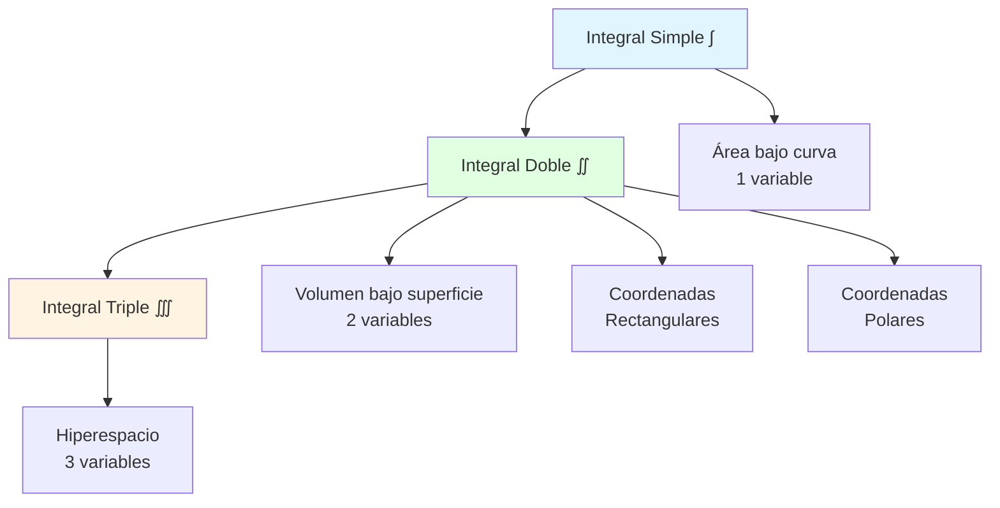
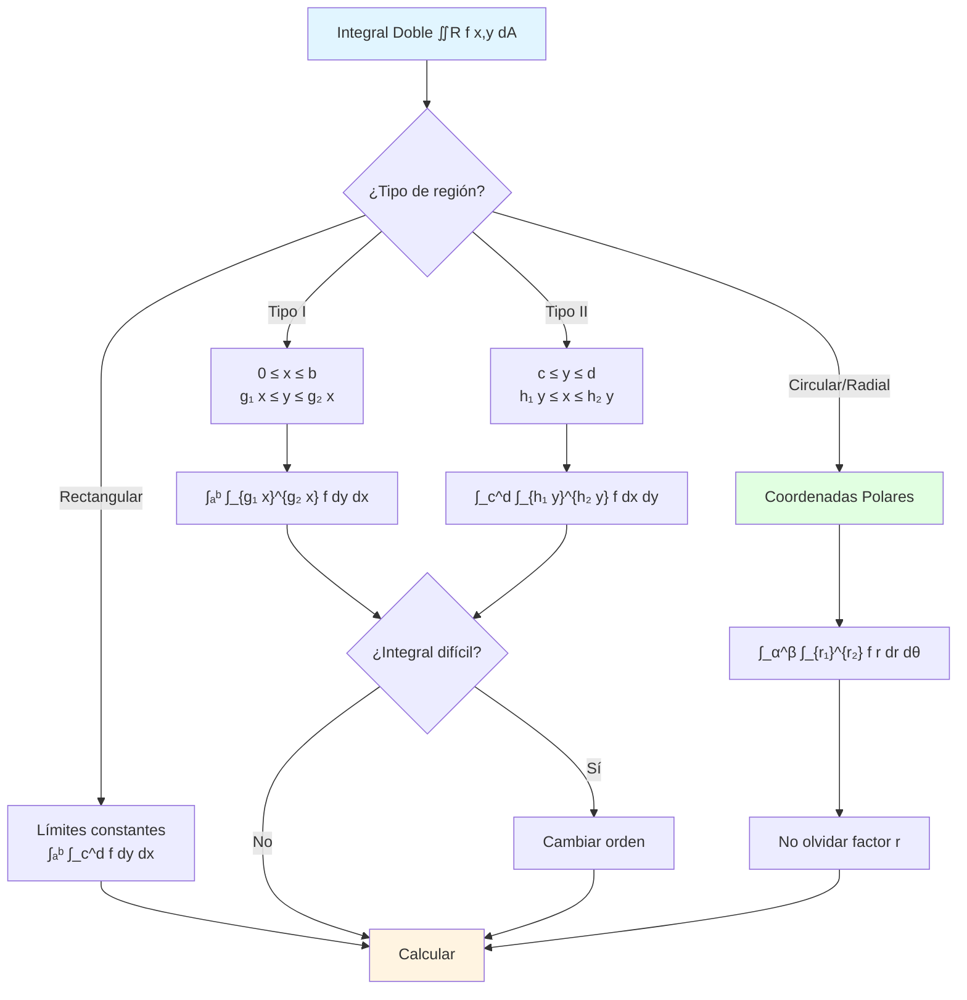

# 📐 Integrales Dobles

## 🎯 Introducción

> [!info]- 💡 ¿Qué es una Integral Doble? La **integral doble** es una extensión natural de la integral definida a funciones de dos variables. Mientras que una integral simple calcula áreas bajo curvas, una **integral doble calcula volúmenes bajo superficies** o el valor acumulado de una función sobre una región bidimensional.
> 
> **Analogía práctica:** Imagina que necesitas calcular la cantidad total de lluvia caída sobre una ciudad:
> 
> - **Integral simple (1D):** Cantidad de lluvia a lo largo de una calle
> - **Integral doble (2D):** Cantidad total de lluvia sobre toda el área de la ciudad
> - La lluvia puede variar de un punto a otro (función f(x,y))
> - Debes considerar cada pequeña región de la ciudad (elemento de área dA)
> 
> **¿Por qué son importantes?**
> 
> |Aspecto|Descripción|Ejemplo de Uso|
> |---|---|---|
> |**Volúmenes**|Calcular volumen bajo superficies|Tanques, recipientes irregulares|
> |**Masa**|Calcular masa de láminas con densidad variable|Materiales compuestos|
> |**Probabilidad**|Funciones de densidad en 2D|Distribuciones conjuntas|
> |**Trabajo**|Trabajo sobre áreas|Campos de fuerza en 2D|
> |**Promedios**|Valores promedio en regiones|Temperatura promedio en una región|
> |**Centro de masa**|Ubicación del centro de gravedad|Diseño estructural|



---

## 📊 Conceptos Fundamentales

### 🔢 Definición de Integral Doble

> [!example]- 📝 Construcción de la Integral Doble
> 
> **Idea intuitiva:**
> 
> Para calcular el volumen bajo una superficie z = f(x,y) sobre una región R:
> 
> 1. **Dividir** la región R en pequeños rectángulos ΔAᵢ
> 2. **Aproximar** el volumen sobre cada rectángulo: f(xᵢ,yᵢ)·ΔAᵢ
> 3. **Sumar** todas las contribuciones: Σf(xᵢ,yᵢ)·ΔAᵢ
> 4. **Tomar el límite** cuando ΔAᵢ → 0
> 
> **Definición formal:**
> 
> $$\iint_R f(x,y)\, dA\lim_{n \to \infty} \sum_{i=1}^{n} f(x_i^{*},\, y_i^{*})\, \Delta A_i$$
> 
> Donde:
> 
> - R es la región de integración
> - f(x,y) es la función a integrar
> - dA = dx dy (o dy dx) es el elemento de área
> - (xᵢ*, yᵢ*) es un punto en el i-ésimo rectángulo
> 
> **Visualización del proceso:**
> 
> ```mermaid
> flowchart TD
>     A[Región R en el plano xy] --> B[Dividir en rectángulos]
>     B --> C[n = 4 rectángulos]
>     C --> D[n = 16 rectángulos]
>     D --> E[n = 64 rectángulos]
>     E --> F[n → ∞]
>     F --> G[Integral Doble ∬R f dA]
>     
>     style A fill:#e1f5ff
>     style G fill:#e1ffe1
> ```
> 
> **Interpretaciones:**
> 
> |Contexto|f(x,y) representa|∬R f(x,y) dA calcula|
> |---|---|---|
> |**Geométrico**|Altura z|Volumen bajo superficie|
> |**Físico (densidad)**|Densidad ρ(x,y)|Masa total|
> |**Probabilidad**|Densidad de probabilidad|Probabilidad en región|
> |**Constante f=1**|1|Área de región R|
> |**Promedio**|Valor de función|Valor promedio: ∬f dA / Área(R)|
> 
> **Notaciones equivalentes:**
> 
> $$\iint_R f(x,y) , dA = \iint_R f(x,y) , dx,dy = \iint_R f(x,y) , dy,dx$$
> 
> El orden (dx dy vs dy dx) depende de cómo iteremos la integral.

### 📏 Teorema de Fubini

> [!note]- 🔄 Conversión a Integrales Iteradas
> 
> **Teorema de Fubini:**
> 
> Si f(x,y) es continua sobre la región rectangular R = [a,b] × [c,d], entonces:
> 
> $$\iint_R f(x,y) , dA = \int_a^b \int_c^d f(x,y) , dy , dx = \int_c^d \int_a^b f(x,y) , dx , dy$$
> 
> **Significado:** Podemos calcular la integral doble como **dos integrales simples consecutivas**.
> 
> **Proceso de integración iterada:**
> 
> ```mermaid
> graph LR
>     A[∬R f x,y dA] --> B{Elegir orden}
>     
>     B -->|dx dy| C[∫c→d ∫a→b f dx dy]
>     B -->|dy dx| D[∫a→b ∫c→d f dy dx]
>     
>     C --> E[Primero integrar<br/>respecto a x]
>     E --> F[Luego integrar<br/>respecto a y]
>     
>     D --> G[Primero integrar<br/>respecto a y]
>     G --> H[Luego integrar<br/>respecto a x]
>     
>     style A fill:#e1f5ff
>     style E fill:#e1ffe1
>     style G fill:#fff4e1
> ```
> 
> **Ejemplo ilustrativo:**
> 
> ```
> Calcular ∬R (x + y) dA donde R = [0,2] × [0,1]
> 
> Método 1: dy dx
> ∬R (x+y) dA = ∫₀² ∫₀¹ (x+y) dy dx
> 
> Paso 1 - Integral interna (respecto a y, x es constante):
> ∫₀¹ (x+y) dy = [xy + y²/2]₀¹ = x(1) + 1²/2 - 0 = x + 1/2
> 
> Paso 2 - Integral externa (respecto a x):
> ∫₀² (x + 1/2) dx = [x²/2 + x/2]₀² = 4/2 + 2/2 = 2 + 1 = 3
> 
> Método 2: dx dy
> ∬R (x+y) dA = ∫₀¹ ∫₀² (x+y) dx dy
> 
> Paso 1 - Integral interna (respecto a x, y es constante):
> ∫₀² (x+y) dx = [x²/2 + xy]₀² = 4/2 + 2y = 2 + 2y
> 
> Paso 2 - Integral externa (respecto a y):
> ∫₀¹ (2 + 2y) dy = [2y + y²]₀¹ = 2 + 1 = 3
> 
> Resultado: 3 (mismo con ambos órdenes) ✓
> ```
> 
> **Reglas para leer límites:**
> 
> |Notación|Se lee|Orden de integración|
> |---|---|---|
> |∫ₐᵇ ∫_c^d f dy dx|"Integrar de c a d respecto a y, luego de a a b respecto a x"|Primero y, luego x|
> |∫_c^d ∫ₐᵇ f dx dy|"Integrar de a a b respecto a x, luego de c a d respecto a y"|Primero x, luego y|
> 
> **Visualización de límites constantes:**
> 
> ```
> R = [0,2] × [0,1]
> 
>      y
>      1 ┌─────────┐
>        │    R    │
>      0 └─────────┘
>        0         2    x
> 
> dy dx: Para cada x fijo en [0,2], y va de 0 a 1
> dx dy: Para cada y fijo en [0,1], x va de 0 a 2
> ```

---

## 🗺️ Regiones de Integración

### 📐 Regiones Tipo I (verticalmente simples)

> [!success]- 📊 Regiones entre dos funciones de x
> 
> **Definición:**
> 
> Una región R es **Tipo I** si puede describirse como:
> 
> $$R = {(x,y) : a \leq x \leq b, , g_1(x) \leq y \leq g_2(x)}$$
> 
> Es decir:
> 
> - x varía entre constantes a y b
> - Para cada x fijo, y varía entre dos funciones g₁(x) y g₂(x)
> 
> **Fórmula de integración:**
> 
> $$\iint_R f(x,y) , dA = \int_a^b \int_{g_1(x)}^{g_2(x)} f(x,y) , dy , dx$$
> 
> **Características visuales:**
> 
> - Las líneas verticales atraviesan la región entrando y saliendo una vez
> - Los límites superior e inferior son funciones de x
> - Se integra primero respecto a y (dy), luego respecto a x (dx)
> 
> ```
> Ejemplo visual de Región Tipo I:
> 
>      y
>      │     g₂(x) (curva superior)
>      │      ╱‾‾‾╲
>      │     ╱  R  ╲
>      │    ╱_______╲
>      │   g₁(x) (curva inferior)
>      └───────────────── x
>          a         b
> 
> Para x fijo: línea vertical de g₁(x) a g₂(x)
> ```
> 
> **Ejemplo resuelto:**
> 
> ```
> Calcular ∬R xy dA donde R está limitada por:
> - x = 0, x = 2
> - y = x², y = 2x
> 
> Paso 1 - Identificar región:
> Intersección: x² = 2x → x² - 2x = 0 → x(x-2) = 0 → x=0, x=2
> 
> Para x ∈ [0,2]: x² ≤ 2x (parábola debajo de recta)
> Región Tipo I: 0 ≤ x ≤ 2, x² ≤ y ≤ 2x
> 
> Paso 2 - Plantear integral:
> ∬R xy dA = ∫₀² ∫ₓ²^(2x) xy dy dx
> 
> Paso 3 - Integral interna (respecto a y):
> ∫ₓ²^(2x) xy dy = x ∫ₓ²^(2x) y dy
>                 = x [y²/2]ₓ²^(2x)
>                 = x [(2x)²/2 - (x²)²/2]
>                 = x [4x²/2 - x⁴/2]
>                 = x [2x² - x⁴/2]
>                 = 2x³ - x⁵/2
> 
> Paso 4 - Integral externa (respecto a x):
> ∫₀² (2x³ - x⁵/2) dx = [2x⁴/4 - x⁶/12]₀²
>                      = [x⁴/2 - x⁶/12]₀²
>                      = 2⁴/2 - 2⁶/12
>                      = 8 - 64/12
>                      = 8 - 16/3
>                      = 24/3 - 16/3
>                      = 8/3
> 
> Resultado: ∬R xy dA = 8/3
> ```
> 
> **Proceso de determinación:**
> 
> ```mermaid
> flowchart TD
>     A[Región R] --> B{¿Líneas verticales<br/>entran y salen<br/>una vez?}
>     B -->|Sí| C[Región Tipo I]
>     B -->|No| D[Tipo II o dividir]
>     
>     C --> E["Identificar a y b<br/>límites de x"]
>     E --> F["Identificar g₁ x y g₂ x<br/>límites de y"]
>     F --> G["∫ₐᵇ ∫_{g₁ x}^{g₂ x} f dy dx"]
>     
>     style C fill:#e1ffe1
>     style G fill:#e1f5ff
> ```

### 📏 Regiones Tipo II (horizontalmente simples)

> [!tip]- 📈 Regiones entre dos funciones de y
> 
> **Definición:**
> 
> Una región R es **Tipo II** si puede describirse como:
> 
> $$R = {(x,y) : c \leq y \leq d, , h_1(y) \leq x \leq h_2(y)}$$
> 
> Es decir:
> 
> - y varía entre constantes c y d
> - Para cada y fijo, x varía entre dos funciones h₁(y) y h₂(y)
> 
> **Fórmula de integración:**
> 
> $$\iint_R f(x,y) , dA = \int_c^d \int_{h_1(y)}^{h_2(y)} f(x,y) , dx , dy$$
> 
> **Características visuales:**
> 
> - Las líneas horizontales atraviesan la región entrando y saliendo una vez
> - Los límites izquierdo y derecho son funciones de y
> - Se integra primero respecto a x (dx), luego respecto a y (dy)
> 
> ```
> Ejemplo visual de Región Tipo II:
> 
>      y
>      d ─────────────
>      │   ╱│      │╲
>      │  ╱ │   R  │ ╲
>      │ ╱  │      │  ╲
>      c ────│──────│────
>      │   h₁(y)  h₂(y)
>      └─────────────── x
> 
> Para y fijo: línea horizontal de h₁(y) a h₂(y)
> ```
> 
> **Ejemplo resuelto:**
> 
> ```
> Calcular ∬R x² dA donde R está limitada por:
> - y = 0, y = 1
> - x = y, x = y+2
> 
> Paso 1 - Identificar región:
> Región Tipo II: 0 ≤ y ≤ 1, y ≤ x ≤ y+2
> 
> Paso 2 - Plantear integral:
> ∬R x² dA = ∫₀¹ ∫_y^(y+2) x² dx dy
> 
> Paso 3 - Integral interna (respecto a x):
> ∫_y^(y+2) x² dx = [x³/3]_y^(y+2)
>                  = (y+2)³/3 - y³/3
>                  = [(y³+6y²+12y+8) - y³]/3
>                  = (6y²+12y+8)/3
> 
> Paso 4 - Integral externa (respecto a y):
> ∫₀¹ (6y²+12y+8)/3 dy = (1/3)∫₀¹ (6y²+12y+8) dy
>                       = (1/3)[2y³ + 6y² + 8y]₀¹
>                       = (1/3)[2 + 6 + 8]
>                       = (1/3)(16)
>                       = 16/3
> 
> Resultado: ∬R x² dA = 16/3
> ```
> 
> **Comparación Tipo I vs Tipo II:**
> 
> |Aspecto|Tipo I|Tipo II|
> |---|---|---|
> |**Variable externa**|x (límites constantes)|y (límites constantes)|
> |**Variable interna**|y (límites funciones de x)|x (límites funciones de y)|
> |**Orden integral**|dy dx|dx dy|
> |**Líneas auxiliares**|Verticales atraviesan una vez|Horizontales atraviesan una vez|
> |**Notación**|a ≤ x ≤ b, g₁(x) ≤ y ≤ g₂(x)|c ≤ y ≤ d, h₁(y) ≤ x ≤ h₂(y)|

### 🔄 Cambio de Orden de Integración

> [!warning]- 🔀 Conversión entre Tipo I y Tipo II
> 
> **¿Cuándo cambiar el orden?**
> 
> - La integral interna es **imposible o muy difícil** de calcular
> - Los límites de integración son complicados en un orden
> - Por conveniencia computacional
> 
> **Proceso de cambio:**
> 
> ```mermaid
> flowchart TD
>     A[Integral dada] --> B[Dibujar región R]
>     B --> C[Identificar tipo actual]
>     C --> D[Redescribir región<br/>en otro tipo]
>     D --> E[Reescribir límites]
>     E --> F[Plantear nueva integral]
>     
>     style B fill:#fff4e1
>     style D fill:#e1ffe1
> ```
> 
> **Ejemplo completo:**
> 
> ```
> Cambiar el orden de: ∫₀² ∫ₓ²⁴ f(x,y) dy dx
> 
> Paso 1 - Interpretar límites actuales (Tipo I):
> 0 ≤ x ≤ 2
> x² ≤ y ≤ 4
> 
> Paso 2 - Dibujar región:
>      y
>      4 ─────────┐
>      │    R    │
>      │       ╱ │
>      │     ╱   │
>      0 ──╱─────┘
>        0       2    x
> 
> Límites: y = x² (parábola), y = 4, x = 0, x = 2
> 
> Paso 3 - Describir como Tipo II:
> y varía de 0 a 4
> Para cada y fijo, x varía de la parábola al borde derecho
> 
> De y = x² obtenemos: x = √y
> Límites de x: 0 ≤ x ≤ √y cuando 0 ≤ y ≤ 4
> 
> PERO CUIDADO: Para y ∈ [4, 4], x llega hasta 2, no √y
> 
> Corregir: Parábola hasta y = 4 cuando x = 2
> Para 0 ≤ y ≤ 4: x va de 0 a √y
> 
> Paso 4 - Nueva integral (Tipo II):
> ∫₀⁴ ∫₀^(√y) f(x,y) dx dy
> 
> Verificación:
> Original: ∫₀² ∫ₓ²⁴ f dy dx  →  Tipo I
> Nueva:    ∫₀⁴ ∫₀^√y f dx dy  →  Tipo II
> ```
> 
> **Ejemplo donde el cambio es necesario:**
> 
> ```
> Calcular: ∫₀¹ ∫ᵧ¹ e^(x²) dx dy
> 
> Problema: ∫ e^(x²) dx no tiene antiderivada elemental!
> 
> Solución: Cambiar orden
> 
> Paso 1 - Región actual (Tipo II):
> 0 ≤ y ≤ 1
> y ≤ x ≤ 1
> 
> Región: triángulo con vértices (0,0), (1,0), (1,1)
> 
> Paso 2 - Redescribir como Tipo I:
> 0 ≤ x ≤ 1
> 0 ≤ y ≤ x
> 
> Paso 3 - Nueva integral:
> ∫₀¹ ∫₀ˣ e^(x²) dy dx
> 
> Paso 4 - Resolver:
> ∫₀¹ ∫₀ˣ e^(x²) dy dx = ∫₀¹ e^(x²)[y]₀ˣ dx
>                       = ∫₀¹ x·e^(x²) dx
> 
> Sustitución: u = x², du = 2x dx
> = (1/2)∫₀¹ e^u du = (1/2)[e^u]₀¹ = (1/2)(e¹ - e⁰) = (e-1)/2
> 
> Resultado: (e-1)/2 ≈ 0.859
> ```
> 
> **Tabla de estrategias:**
> 
> |Situación|Acción|
> |---|---|
> |∫ e^(x²) respecto a x|Cambiar orden para integrar respecto a y primero|
> |∫ e^(y²) respecto a y|Cambiar orden para integrar respecto a x primero|
> |Límites complicados|Cambiar al orden que simplifique límites|
> |Funciones trigonométricas anidadas|Probar ambos órdenes|

---

## 🎨 Aplicaciones de Integrales Dobles

### 📦 Cálculo de Volúmenes

> [!example]- 🏔️ Volumen bajo una Superficie
> 
> **Interpretación geométrica:**
> 
> Si f(x,y) ≥ 0 sobre la región R, entonces:
> 
> $$V = \iint_R f(x,y) , dA$$
> 
> representa el **volumen del sólido** entre el plano xy y la superficie z = f(x,y).
> 
> ```
> Visualización:
> 
>         z
>         │      Superficie z = f(x,y)
>         │       ╱╲╱╲
>         │     ╱      ╲
>         │   ╱   V     ╲
>         │ ╱____________╲
>         └────────────────── y
>        ╱     Región R
>       ╱
>      x
> 
> V = volumen del sólido sombreado
> ```
> 
> **Ejemplo 1: Volumen bajo un plano**
> 
> ```
> Calcular el volumen bajo z = 4 - 2x - y sobre R = [0,1] × [0,2]
> 
> V = ∬R (4 - 2x - y) dA
>   = ∫₀¹ ∫₀² (4 - 2x - y) dy dx
> 
> Integral interna:
> ∫₀² (4 - 2x - y) dy = [4y - 2xy - y²/2]₀²
>                      = 8 - 4x - 2
>                      = 6 - 4x
> 
> Integral externa:
> ∫₀¹ (6 - 4x) dx = [6x - 2x²]₀¹
>                  = 6 - 2
>                  = 4
> 
> Volumen: V = 4 unidades cúbicas
> ```
> 
> **Ejemplo 2: Volumen bajo un paraboloide**
> 
> ```
> Calcular el volumen bajo z = 4 - x² - y² sobre la región
> R = {(x,y) : x² + y² ≤ 4}
> 
> Nota: Esta región es circular, mejor usar coordenadas polares
> (lo veremos en la próxima sección)
> 
> Solución en rectangulares (más difícil):
> Región Tipo I: -2 ≤ x ≤ 2, -√(4-x²) ≤ y ≤ √(4-x²)
> 
> V = ∫₋₂² ∫₋√(4-x²)^√(4-x²) (4 - x² - y²) dy dx
> 
> Esta integral es compleja en rectangulares.
> En polares será mucho más simple: V = 8π
> ```
> 
> **Volumen entre dos superficies:**
> 
> Si f(x,y) ≥ g(x,y) sobre R:
> 
> $$V = \iint_R [f(x,y) - g(x,y)] , dA$$
> 
> ```
> Ejemplo: Volumen entre z = x² + y² y z = 8 - x² - y²
> sobre R = {(x,y) : x² + y² ≤ 2}
> 
> Intersección: x² + y² = 8 - x² - y²
>               2(x² + y²) = 8
>               x² + y² = 4  (pero R limita a x²+y²≤2)
> 
> V = ∬R [(8-x²-y²) - (x²+y²)] dA
>   = ∬R (8 - 2x² - 2y²) dA
> 
> [Continuar con coordenadas polares para simplificar]
> ```

### ⚖️ Masa y Centro de Masa

> [!success]- 🎯 Propiedades Físicas de Láminas
> 
> **Densidad superficial:**
> 
> Si ρ(x,y) es la densidad (masa por unidad de área) en el punto (x,y):
> 
> |Propiedad|Fórmula|Unidades|
> |---|---|---|
> |**Masa total**|m = ∬R ρ(x,y) dA|kg (o g)|
> |**Momento respecto a x**|Mₓ = ∬R y·ρ(x,y) dA|kg·m|
> |**Momento respecto a y**|Mᵧ = ∬R x·ρ(x,y) dA|kg·m|
> |**Centro de masa**|x̄ = Mᵧ/m, ȳ = Mₓ/m|m|
> 
> **Interpretación:**
> 
> - **Masa:** Suma de todas las pequeñas masas ρ(x,y)·dA
> - **Momentos:** Miden la "tendencia a rotar" alrededor de un eje
> - **Centro de masa:** Punto de equilibrio perfecto
> 
> ```mermaid
> graph TB
>     A[Lámina con densidad ρ x,y] --> B[Calcular masa m]
>     B --> C[Calcular momentos Mₓ, Mᵧ]
>     C --> D[Centro de masa x̄,ȳ]
>     
>     B --> E[∬R ρ dA]
>     C --> F[∬R y·ρ dA, ∬R x·ρ dA]
>     D --> G[ x̄,ȳ = Mᵧ/m, Mₓ/m]
>     
>     style A fill:#e1f5ff
>     style D fill:#e1ffe1
> ```
> 
> **Ejemplo completo:**
> 
> ```
> Una lámina triangular tiene vértices (0,0), (2,0), (0,4) y
> densidad ρ(x,y) = x + y. Encontrar:
> a) Masa total
> b) Centro de masa
> 
> Paso 1 - Describir región:
> Región Tipo I: 0 ≤ x ≤ 2, 0 ≤ y ≤ 4-2x
> (línea de (2,0) a (0,4) tiene ecuación y = 4-2x)
> 
> Paso 2 - Calcular masa:
> m = ∬R (x+y) dA = ∫₀² ∫₀^(4-2x) (x+y) dy dx = ∫₀² [xy + y²/2]₀^(4-2x) dx
> = ∫₀² [x(4-2x) + (4-2x)²/2] dx = ∫₀² [4x - 2x² + (16-16x+4x²)/2] dx 
> = ∫₀² [4x - 2x² + 8 - 8x + 2x²] dx = ∫₀² (8 - 4x) dx = [8x - 2x²]₀² = 16 - 8 = 8
> 
> Masa: m = 8 unidades
> 
> Paso 3 - Calcular Mᵧ: Mᵧ = ∬R x(x+y) dA = ∫₀² ∫₀^(4-2x) x(x+y) dy dx
> 
> = ∫₀² ∫₀^(4-2x) (x²+xy) dy dx = ∫₀² [x²y + xy²/2]₀^(4-2x) dx = ∫₀² [x²(4-2x) + x(4-2x)²/2] dx = ∫₀² [4x² - 2x³ + x(16-16x+4x²)/2] dx = ∫₀² [4x² - 2x³ + 8x - 8x² + 2x³] dx = ∫₀² (8x - 4x²) dx = [4x² - 4x³/3]₀² = 16 - 32/3 = 48/3 - 32/3 = 16/3
> 
> Paso 4 - Calcular Mₓ: Mₓ = ∬R y(x+y) dA = ∫₀² ∫₀^(4-2x) y(x+y) dy dx
> 
> = ∫₀² ∫₀^(4-2x) (xy+y²) dy dx = ∫₀² [xy²/2 + y³/3]₀^(4-2x) dx = ∫₀² [x(4-2x)²/2 + (4-2x)³/3] dx
> 
> [Cálculo extenso...] = 32/3
> 
> Paso 5 - Centro de masa: x̄ = Mᵧ/m = (16/3)/8 = 16/24 = 2/3 ȳ = Mₓ/m = (32/3)/8 = 32/24 = 4/3
> 
> Centro de masa: (2/3, 4/3)
> 
> ```
> 
> **Caso especial - densidad constante:**
> 
> Si ρ(x,y) = k (constante):
> 
> ```
> 
> m = k·Área(R)
> 
> x̄ = ∬R x dA / Área(R) (centroide geométrico) ȳ = ∬R y dA / Área(R)
> 
> El centro de masa coincide con el centroide geométrico
> ```

### 📊 Área de una Región

> [!tip]- 📏 Cálculo de Áreas con Integrales Dobles
> 
> **Fórmula fundamental:**
> 
> Si queremos calcular el área de una región R:
> 
> $$\text{Área}(R) = \iint_R 1 , dA = \iint_R dA$$
> 
> **Ejemplo 1: Área de región triangular**
> 
> ```
> Región: triángulo con vértices (0,0), (3,0), (0,2)
> 
> Región Tipo I: 0 ≤ x ≤ 3, 0 ≤ y ≤ 2-2x/3
> 
> Área = ∫₀³ ∫₀^(2-2x/3) dy dx
>      = ∫₀³ [y]₀^(2-2x/3) dx
>      = ∫₀³ (2-2x/3) dx
>      = [2x - x²/3]₀³
>      = 6 - 3 = 3
> 
> Verificación con fórmula geométrica:
> Área = (base × altura)/2 = (3 × 2)/2 = 3 ✓
> ```
> 
> **Ejemplo 2: Área entre curvas**
> 
> ```
> Región entre y = x² y y = √x para 0 ≤ x ≤ 1
> 
> Intersección: x² = √x → x⁴ = x → x⁴-x = 0
>                      → x(x³-1) = 0 → x=0, x=1
> 
> Para x ∈ [0,1]: x² ≤ √x
> 
> Área = ∫₀¹ ∫ₓ²^√x dy dx
>      = ∫₀¹ [y]ₓ²^√x dx
>      = ∫₀¹ (√x - x²) dx
>      = ∫₀¹ (x^(1/2) - x²) dx
>      = [2x^(3/2)/3 - x³/3]₀¹
>      = 2/3 - 1/3 = 1/3
> 
> Área: 1/3 unidades cuadradas
> ```

---

## 🔄 Coordenadas Polares

### 🎪 Cambio a Coordenadas Polares

> [!warning]- 🌀 Transformación de Coordenadas
> 
> **Relaciones fundamentales:**
> 
> $$\begin{cases} x = r\cos\theta \ y = r\sin\theta \end{cases} \quad \text{y} \quad \begin{cases} r = \sqrt{x^2 + y^2} \ \theta = \arctan(y/x) \end{cases}$$
> 
> **Elemento de área:**
> 
> $$dA = dx,dy = r,dr,d\theta$$
> 
> **¡IMPORTANTE!** No olvides el factor **r** en el elemento de área.
> 
> **Fórmula de integral doble en polares:**
> 
> $$\iint_R f(x,y) , dA = \int_\alpha^\beta \int_{r_1(\theta)}^{r_2(\theta)} f(r\cos\theta, r\sin\theta) \cdot r , dr , d\theta$$
> 
> **¿Por qué aparece el factor r?**
> 
> ```
> Geometría del elemento de área:
> 
>         Δθ
>      ┌─────┐ ← arco = r·Δθ
>   r  │     │
>      └─────┘
>        Δr
> 
> Área ≈ (lado radial) × (lado angular)
>      ≈ Δr × (r·Δθ)
>      = r·Δr·Δθ
> 
> En el límite: dA = r dr dθ
> ```
> 
> **Cuándo usar coordenadas polares:**
> 
> |Situación|Usar Polares|
> |---|---|
> |Región circular o anular|✅ Sí|
> |Región en sector circular|✅ Sí|
> |Función con x²+y²|✅ Sí|
> |Función con √(x²+y²)|✅ Sí|
> |Región rectangular|❌ No (usar rectangulares)|
> |Función sin simetría circular|❌ Probablemente no|
> 
> ```mermaid
> graph TB
>     A[¿Qué sistema usar?] --> B{¿Región circular<br/>o función con x²+y²?}
>     B -->|Sí| C[Coordenadas Polares]
>     B -->|No| D[Coordenadas Rectangulares]
>     
>     C --> E[dA = r dr dθ]
>     D --> F[dA = dx dy]
>     
>     style C fill:#e1ffe1
>     style D fill:#fff4e1
> ```

### 🎯 Ejemplos en Coordenadas Polares

> [!example]- 🔄 Aplicaciones Prácticas
> 
> **Ejemplo 1: Disco completo**
> 
> ```
> Calcular ∬R (x²+y²) dA donde R = {(x,y) : x²+y² ≤ 4}
> 
> En polares:
> - Región: 0 ≤ r ≤ 2, 0 ≤ θ ≤ 2π
> - x²+y² = r²
> - dA = r dr dθ
> 
> ∬R (x²+y²) dA = ∫₀^(2π) ∫₀² r² · r dr dθ
>                = ∫₀^(2π) ∫₀² r³ dr dθ
> 
> Integral interna:
> ∫₀² r³ dr = [r⁴/4]₀² = 16/4 = 4
> 
> Integral externa:
> ∫₀^(2π) 4 dθ = 4[θ]₀^(2π) = 8π
> 
> Resultado: 8π
> ```
> 
> **Ejemplo 2: Sector circular**
> 
> ```
> Calcular ∬R e^(-(x²+y²)) dA donde R es el sector:
> x²+y² ≤ 1, 0 ≤ θ ≤ π/2
> 
> En polares:
> - Región: 0 ≤ r ≤ 1, 0 ≤ θ ≤ π/2
> - e^(-(x²+y²)) = e^(-r²)
> 
> ∬R e^(-(x²+y²)) dA = ∫₀^(π/2) ∫₀¹ e^(-r²) · r dr dθ
> 
> Integral interna (sustitución u = -r², du = -2r dr):
> ∫₀¹ r·e^(-r²) dr = -1/2 ∫₀¹ e^(-r²) (-2r dr)
>                   = -1/2 [e^(-r²)]₀¹
>                   = -1/2 (e^(-1) - 1)
>                   = (1 - e^(-1))/2
> 
> Integral externa:
> ∫₀^(π/2) (1 - e^(-1))/2 dθ = (1 - e^(-1))/2 · [θ]₀^(π/2)
>                             = (1 - e^(-1))/2 · π/2
>                             = π(1 - e^(-1))/4
> 
> Resultado: π(1 - 1/e)/4 ≈ 0.497
> ```
> 
> **Ejemplo 3: Anillo (región anular)**
> 
> ```
> Calcular el volumen bajo z = √(x²+y²) sobre la región
> 1 ≤ x²+y² ≤ 4
> 
> En polares:
> - Región: 1 ≤ r ≤ 2, 0 ≤ θ ≤ 2π
> - √(x²+y²) = r
> 
> V = ∬R √(x²+y²) dA = ∫₀^(2π) ∫₁² r · r dr dθ
>                     = ∫₀^(2π) ∫₁² r² dr dθ
> 
> Integral interna:
> ∫₁² r² dr = [r³/3]₁² = 8/3 - 1/3 = 7/3
> 
> Integral externa:
> ∫₀^(2π) 7/3 dθ = 7/3 · 2π = 14π/3
> 
> Volumen: 14π/3 unidades cúbicas
> ```
> 
> **Ejemplo 4: Región con límites variables**
> 
> ```
> Calcular ∬R xy dA donde R es la región en el primer cuadrante
> limitada por x²+y² = 2x
> 
> Paso 1 - Convertir límite a polares:
> x²+y² = 2x
> r² = 2r cos θ
> r = 2 cos θ
> 
> Paso 2 - Determinar rango de θ:
> Primer cuadrante: 0 ≤ θ ≤ π/2
> Pero r = 2cosθ ≥ 0 solo cuando -π/2 ≤ θ ≤ π/2
> En primer cuadrante: 0 ≤ θ ≤ π/2
> 
> Región: 0 ≤ r ≤ 2cosθ, 0 ≤ θ ≤ π/2
> 
> Paso 3 - Convertir función:
> xy = (r cosθ)(r sinθ) = r² cosθ sinθ
> 
> Paso 4 - Integrar:
> ∬R xy dA = ∫₀^(π/2) ∫₀^(2cosθ) r² cosθ sinθ · r dr dθ
>          = ∫₀^(π/2) ∫₀^(2cosθ) r³ cosθ sinθ dr dθ
>          = ∫₀^(π/2) cosθ sinθ [r⁴/4]₀^(2cosθ) dθ
>          = ∫₀^(π/2) cosθ sinθ · 16cos⁴θ/4 dθ
>          = 4∫₀^(π/2) cos⁵θ sinθ dθ
> 
> Sustitución: u = cosθ, du = -sinθ dθ
> Cuando θ=0: u=1; cuando θ=π/2: u=0
> 
>          = -4∫₁⁰ u⁵ du = 4∫₀¹ u⁵ du
>          = 4[u⁶/6]₀¹ = 4/6 = 2/3
> 
> Resultado: 2/3
> ```

---

## 📊 Resumen Visual Completo

### Diagrama de Flujo General



> [!note]- 📋 Tablas de Referencia Rápida
> 
> ### Tipos de Regiones
> 
> |Tipo|Descripción|Límites|Orden|
> |---|---|---|---|
> |**Rectangular**|a ≤ x ≤ b, c ≤ y ≤ d|Constantes|Cualquiera|
> |**Tipo I**|Verticalmente simple|x constante, y función de x|dy dx|
> |**Tipo II**|Horizontalmente simple|y constante, x función de y|dx dy|
> |**Polar**|Circular/radial|r, θ|r dr dθ|
> 
> ### Fórmulas de Aplicaciones
> 
> |Aplicación|Fórmula|
> |---|---|
> |**Área**|A = ∬R dA|
> |**Volumen**|V = ∬R f(x,y) dA|
> |**Masa**|m = ∬R ρ(x,y) dA|
> |**Momento x**|Mₓ = ∬R y·ρ(x,y) dA|
> |**Momento y**|Mᵧ = ∬R x·ρ(x,y) dA|
> |**Centro de masa**|(x̄,ȳ) = (Mᵧ/m, Mₓ/m)|
> 
> ### Conversión de Coordenadas
> 
> |De Rectangulares a Polares|De Polares a Rectangulares|
> |---|---|
> |r = √(x²+y²)|x = r cos θ|
> |θ = arctan(y/x)|y = r sin θ|
> |dA = r dr dθ|dA = dx dy|

---

## 🎓 Ejercicios Progresivos

> [!example]- 💪 Práctica con Soluciones Detalladas
> 
> **Nivel Básico:**
> 
> **Ejercicio 1: Región rectangular**
> 
> ```
> Calcular ∬R (2x + 3y) dA donde R = [0,2] × [1,3]
> 
> Solución:
> ∬R (2x+3y) dA = ∫₀² ∫₁³ (2x+3y) dy dx
> 
> Integral interna:
> ∫₁³ (2x+3y) dy = [2xy + 3y²/2]₁³
>                 = (6x + 27/2) - (2x + 3/2)
>                 = 4x + 12
> 
> Integral externa:
> ∫₀² (4x+12) dx = [2x² + 12x]₀²
>                 = 8 + 24 = 32
> 
> Respuesta: 32
> ```
> 
> **Ejercicio 2: Tipo I simple**
> 
> ```
> Calcular ∬R x dA donde R está limitada por y = 0, y = x, x = 1
> 
> Solución:
> Región Tipo I: 0 ≤ x ≤ 1, 0 ≤ y ≤ x
> 
> ∬R x dA = ∫₀¹ ∫₀ˣ x dy dx
>         = ∫₀¹ x[y]₀ˣ dx
>         = ∫₀¹ x² dx
>         = [x³/3]₀¹
>         = 1/3
> 
> Respuesta: 1/3
> ```
> 
> **Nivel Intermedio:**
> 
> **Ejercicio 3: Cambio de orden**
> 
> ```
> Evaluar ∫₀¹ ∫ᵧ¹ x²e^(x³) dx dy cambiando el orden
> 
> Paso 1 - Región actual (Tipo II):
> 0 ≤ y ≤ 1, y ≤ x ≤ 1
> Triángulo: (0,0), (1,0), (1,1)
> 
> Paso 2 - Cambiar a Tipo I:
> 0 ≤ x ≤ 1, 0 ≤ y ≤ x
> 
> Paso 3 - Nueva integral:
> ∫₀¹ ∫₀ˣ x²e^(x³) dy dx = ∫₀¹ x²e^(x³)[y]₀ˣ dx
>                         = ∫₀¹ x³e^(x³) dx
> 
> Paso 4 - Sustitución (u = x³, du = 3x² dx):
> = (1/3)∫₀¹ e^u du = (1/3)[e^u]₀¹
> = (1/3)(e - 1)
> 
> Respuesta: (e-1)/3
> ```
> 
> **Ejercicio 4: Volumen bajo superficie**
> 
> ```
> Calcular el volumen del sólido limitado por z = 9-x²-y²
> y el plano xy (z = 0)
> 
> Solución:
> Región R: 9-x²-y² = 0 → x²+y² = 9 (círculo radio 3)
> 
> Usar coordenadas polares:
> 0 ≤ r ≤ 3, 0 ≤ θ ≤ 2π
> 
> V = ∬R (9-x²-y²) dA
>   = ∫₀^(2π) ∫₀³ (9-r²)·r dr dθ
>   = ∫₀^(2π) ∫₀³ (9r-r³) dr dθ
>   = ∫₀^(2π) [9r²/2 - r⁴/4]₀³ dθ
>   = ∫₀^(2π) (81/2 - 81/4) dθ
>   = ∫₀^(2π) 81/4 dθ
>   = 81/4 · 2π
>   = 81π/2
> 
> Volumen: 81π/2 unidades cúbicas
> ```
> 
> **Nivel Avanzado:**
> 
> **Ejercicio 5: Centro de masa**
> 
> ```
> Encontrar el centro de masa de la región semicircular
> x²+y² ≤ 4, y ≥ 0 con densidad ρ(x,y) = y
> 
> Solución en polares:
> 0 ≤ r ≤ 2, 0 ≤ θ ≤ π
> ρ = y = r sin θ
> 
> Paso 1 - Masa:
> m = ∬R y dA = ∫₀^π ∫₀² r sinθ · r dr dθ
>   = ∫₀^π ∫₀² r² sinθ dr dθ
>   = ∫₀^π sinθ [r³/3]₀² dθ
>   = ∫₀^π 8sinθ/3 dθ
>   = 8/3 [-cosθ]₀^π
>   = 8/3 (1-(-1)) = 16/3
> 
> Paso 2 - Momento Mᵧ:
> Mᵧ = ∬R x·y dA = ∫₀^π ∫₀² r cosθ · r sinθ · r dr dθ
>    = ∫₀^π ∫₀² r³ cosθ sinθ dr dθ
>    = ∫₀^π cosθ sinθ [r⁴/4]₀² dθ
>    = 4∫₀^π cosθ sinθ dθ
>    = 4∫₀^π (1/2)sin(2θ) dθ
>    = 2[-cos(2θ)/2]₀^π
>    = -[cos(2π) - cos(0)] = -(1-1) = 0
> 
> Paso 3 - Momento Mₓ:
> Mₓ = ∬R y·y dA = ∫₀^π ∫₀² r sinθ · r sinθ · r dr dθ
>    = ∫₀^π ∫₀² r³ sin²θ dr dθ
>    = ∫₀^π sin²θ [r⁴/4]₀² dθ
>    = 4∫₀^π sin²θ dθ
>    = 4∫₀^π (1-cos2θ)/2 dθ
>    = 2∫₀^π (1-cos2θ) dθ
>    = 2[θ - sin(2θ)/2]₀^π
>    = 2π
> 
> Paso 4 - Centro de masa:
> x̄ = Mᵧ/m = 0/(16/3) = 0
> ȳ = Mₓ/m = 2π/(16/3) = 6π/16 = 3π/8
> 
> Centro de masa: (0, 3π/8) ≈ (0, 1.178)
> ```

---

## 🔗 Conexión con Próximos Temas

> [!quote]- 🌟 Continuando el Aprendizaje
> 
> **Has dominado:**
> 
> ```mermaid
> mindmap
>   root((Integrales<br/>Dobles))
>     Conceptos
>       Definición
>       Teorema de Fubini
>       Elemento de área
>     Regiones
>       Tipo I
>       Tipo II
>       Cambio de orden
>     Coordenadas
>       Rectangulares
>       Polares
>       Factor r
>     Aplicaciones
>       Volúmenes
>       Masa
>       Centro de masa
>       Área
> ```
> 
> **Progresión natural:**
> 
> |Nivel|Tema|Conexión|
> |---|---|---|
> |**Actual**|Integrales dobles|Base para 3D|
> |**Siguiente**|Integrales triples|Extensión a 3 dimensiones|
> |**Avanzado**|Integrales de superficie|Integración sobre superficies curvas|
> |**Teoremas**|Teorema de Gauss|Relaciona triple con superficie|
> |**Aplicado**|Campos vectoriales|Flujo y circulación|
> 
> **Roadmap:**
> 
> ```mermaid
> graph LR
>     A[Integrales Dobles] --> B[Integrales Triples]
>     B --> C[Coordenadas Cilíndricas]
>     B --> D[Coordenadas Esféricas]
>     C --> E[Integrales de Superficie]
>     D --> E
>     E --> F[Teorema de Stokes]
>     E --> G[Teorema de Gauss]
>     
>     style A fill:#e1ffe1
>     style B fill:#fff4e1
>     style E fill:#e1f5ff
> ```
> 
> **Conceptos clave para lo que sigue:**
> 
> 1. **Integrales iteradas:** Base para integrales triples
> 2. **Cambio de coordenadas:** Esencial para cilíndricas y esféricas
> 3. **Jacobiano:** Generaliza el factor "r" de polares
> 4. **Aplicaciones físicas:** Masa, centro de masa se extienden a 3D

---

**Tags:** #calculo-vectorial #integrales-dobles #fubini #coordenadas-polares #volumen #masa #centro-de-masa #regiones-tipo-I #regiones-tipo-II #cambio-orden #aplicaciones
