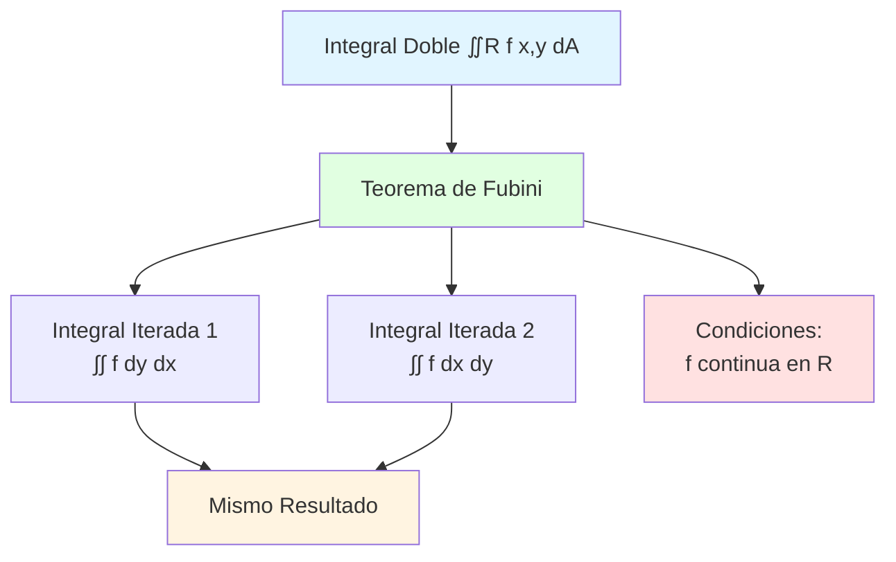

# 📐 Teorema de Fubini

## 🎯 Introducción

> [!info]- 💡 ¿Qué es el Teorema de Fubini? El **Teorema de Fubini** es uno de los resultados fundamentales en cálculo multivariable. Establece las condiciones bajo las cuales una **integral doble** (o múltiple) puede calcularse como **integrales iteradas** (sucesivas integrales simples), y garantiza que el resultado es **independiente del orden de integración**.
> 
> **Analogía práctica:** Imagina que necesitas contar todas las personas en un estadio:
> 
> - **Método 1:** Contar fila por fila (primero todas las personas de la fila 1, luego la fila 2, etc.)
> - **Método 2:** Contar columna por columna (primero todas las personas de la columna A, luego la B, etc.)
> - **Teorema de Fubini:** Garantiza que ambos métodos dan el **mismo resultado total**
> 
> **¿Por qué es importante?**
> 
> |Aspecto|Importancia|Beneficio Práctico|
> |---|---|---|
> |**Computacional**|Convierte problemas 2D en dos problemas 1D|Simplifica cálculos enormemente|
> |**Flexibilidad**|Permite elegir el orden más conveniente|Una integral puede ser más fácil que otra|
> |**Teórico**|Conecta integrales múltiples con iteradas|Base para dimensiones superiores|
> |**Verificación**|Permite comprobar resultados|Calcular por dos caminos diferentes|
> |**Generalización**|Se extiende a integrales triples, n-ples|Aplicable en cualquier dimensión|



---

## 📚 Enunciado del Teorema

### 📜 Versión para Regiones Rectangulares

> [!example]- 📦 Caso Más Simple
> 
> **Teorema de Fubini (Regiones Rectangulares):**
> 
> Sea f(x,y) una función **continua** en el rectángulo R = [a,b] × [c,d]. Entonces:
> 
> $$\iint_R f(x,y) , dA = \int_a^b \int_c^d f(x,y) , dy , dx = \int_c^d \int_a^b f(x,y) , dx , dy$$
> 
> **Componentes del teorema:**
> 
> |Elemento|Significado|Importancia|
> |---|---|---|
> |**∬R f dA**|Integral doble sobre región|Concepto límite de suma de Riemann|
> |**∫∫ dy dx**|Integrar primero y, luego x|Orden de integración 1|
> |**∫∫ dx dy**|Integrar primero x, luego y|Orden de integración 2|
> |**Igualdad**|Ambos dan el mismo valor|Independencia del orden|
> |**f continua**|Hipótesis crucial|Garantiza existencia|
> 
> **Visualización del proceso:**
> 
> ```mermaid
> flowchart LR
>     A[∬R f x,y dA] --> B{Fubini}
>     
>     B --> C[Orden 1: dy dx]
>     B --> D[Orden 2: dx dy]
>     
>     C --> E[∫ₐᵇ ... dx]
>     E --> F[∫_c^d f dy primero]
>     F --> G[Resultado R₁]
>     
>     D --> H[∫_c^d ... dy]
>     H --> I[∫ₐᵇ f dx primero]
>     I --> J[Resultado R₂]
>     
>     G --> K[R₁ = R₂]
>     J --> K
>     
>     style A fill:#e1f5ff
>     style B fill:#e1ffe1
>     style K fill:#fff4e1
> ```
> 
> **Interpretación geométrica:**
> 
> ```
> Región R = [a,b] × [c,d]
> 
>      y
>      d ┌─────────┐
>        │    R    │
>        │         │
>      c └─────────┘
>        a         b    x
> 
> Orden dy dx: 
> - Para cada x ∈ [a,b] fijo
> - Integrar f(x,y) desde y=c hasta y=d
> - Luego integrar el resultado de x=a hasta x=b
> 
> Orden dx dy:
> - Para cada y ∈ [c,d] fijo
> - Integrar f(x,y) desde x=a hasta x=b
> - Luego integrar el resultado de y=c hasta y=d
> ```
> 
> **Ejemplo numérico simple:**
> 
> ```
> Verificar Fubini para f(x,y) = xy en R = [0,2] × [0,3]
> 
> Orden 1 (dy dx):
> ∫₀² ∫₀³ xy dy dx
> 
> Paso 1: ∫₀³ xy dy = x[y²/2]₀³ = x(9/2) = 9x/2
> Paso 2: ∫₀² 9x/2 dx = 9/2[x²/2]₀² = 9/2 · 2 = 9
> 
> Orden 2 (dx dy):
> ∫₀³ ∫₀² xy dx dy
> 
> Paso 1: ∫₀² xy dx = y[x²/2]₀² = y(2) = 2y
> Paso 2: ∫₀³ 2y dy = 2[y²/2]₀³ = 9
> 
> Resultado: 9 = 9 ✓
> Fubini verificado
> ```

### 🗺️ Versión para Regiones Generales

> [!note]- 🌐 Extensión a Regiones No Rectangulares
> 
> **Teorema de Fubini (Regiones Tipo I):**
> 
> Sea R una región **Tipo I**: $$R = {(x,y) : a \leq x \leq b, , g_1(x) \leq y \leq g_2(x)}$$
> 
> Si f es continua en R, entonces:
> 
> $$\iint_R f(x,y) , dA = \int_a^b \int_{g_1(x)}^{g_2(x)} f(x,y) , dy , dx$$
> 
> **Teorema de Fubini (Regiones Tipo II):**
> 
> Sea R una región **Tipo II**: $$R = {(x,y) : c \leq y \leq d, , h_1(y) \leq x \leq h_2(y)}$$
> 
> Si f es continua en R, entonces:
> 
> $$\iint_R f(x,y) , dA = \int_c^d \int_{h_1(y)}^{h_2(y)} f(x,y) , dx , dy$$
> 
> **Tabla comparativa:**
> 
> |Tipo|Descripción Límites|Integral Iterada|Cuándo usar|
> |---|---|---|---|
> |**Rectangular**|Todos constantes|Cualquier orden|Región rectangular|
> |**Tipo I**|x constante, y función de x|dy dx obligatorio|Líneas verticales atraviesan una vez|
> |**Tipo II**|y constante, x función de y|dx dy obligatorio|Líneas horizontales atraviesan una vez|
> 
> **Diagrama conceptual:**
> 
> ```mermaid
> graph TD
>     A[Región R] --> B{¿Tipo de región?}
>     
>     B -->|Rectangular| C[Límites constantes]
>     B -->|Tipo I| D[y depende de x]
>     B -->|Tipo II| E[x depende de y]
>     
>     C --> F[Cualquier orden<br/>dy dx o dx dy]
>     D --> G[Solo dy dx<br/>g₁ x ≤ y ≤ g₂ x]
>     E --> H[Solo dx dy<br/>h₁ y ≤ x ≤ h₂ y]
>     
>     style B fill:#e1f5ff
>     style F fill:#e1ffe1
>     style G fill:#fff4e1
>     style H fill:#ffe1e1
> ```
> 
> **Ejemplo Tipo I:**
> 
> ```
> Región: 0 ≤ x ≤ 1, x² ≤ y ≤ x
> 
>      y
>      1     y = x
>        \   ╱│
>         \ ╱ │
>          ╳  │ R
>         ╱ ╲ │
>        ╱   \│
>      0 ────╲┘
>        0    1    x
>           y = x²
> 
> Fubini para Tipo I:
> ∬R f(x,y) dA = ∫₀¹ ∫ₓ²ˣ f(x,y) dy dx
> 
> NO se puede escribir fácilmente como dx dy
> (requeriría dividir en dos regiones)
> ```
> 
> **Ejemplo Tipo II:**
> 
> ```
> Región: 0 ≤ y ≤ 1, y ≤ x ≤ √y
> 
>      y
>      1 ┐
>        │╲  x = √y
>      R │ ╲
>        │  ╲
>      0 └───╲
>        0    1    x
>          x = y
> 
> Fubini para Tipo II:
> ∬R f(x,y) dA = ∫₀¹ ∫ᵧ^√y f(x,y) dx dy
> ```

---

## 🔍 Hipótesis y Condiciones

### ✅ Condiciones de Validez

> [!warning]- ⚠️ Cuándo Aplica el Teorema
> 
> **Condiciones necesarias:**
> 
> 1. **Continuidad de f:**
>     - f(x,y) debe ser **continua** en toda la región R
>     - O al menos continua excepto en un conjunto de medida cero
> 2. **Región medible:**
>     - R debe ser una región **acotada** (no infinita)
>     - R debe tener **frontera regular** (no patológica)
> 3. **Integrabilidad:**
>     - ∬R |f(x,y)| dA debe ser **finita** (convergente)
> 
> **Tabla de validez:**
> 
> |Situación|¿Aplica Fubini?|Observaciones|
> |---|---|---|
> |f continua, R acotada|✅ Sí|Caso estándar|
> |f con discontinuidades aisladas|✅ Sí (generalmente)|Puntos no afectan integral|
> |f con discontinuidades en curva|⚠️ Depende|Analizar cuidadosamente|
> |R no acotada (región infinita)|❌ No directamente|Versión extendida del teorema|
> |∬|f|= ∞ (no integrable)|
> |f discontinua en todo R|❌ No|No cumple hipótesis|
> 
> **Ejemplo donde Fubini funciona:**
> 
> ```
> f(x,y) = x² + y², R = [0,1] × [0,1]
> 
> ✓ f es continua en R (polinomio)
> ✓ R es acotada (cuadrado unitario)
> ✓ ∬R |f| dA < ∞ (f ≥ 0 y acotada)
> 
> Fubini aplica ✓
> 
> ∫₀¹ ∫₀¹ (x²+y²) dy dx = ∫₀¹ ∫₀¹ (x²+y²) dx dy
> ```
> 
> **Ejemplo donde Fubini NO aplica directamente:**
> 
> ```
> f(x,y) = 1/(xy), R = (0,1] × (0,1]
> 
> Problema: f → ∞ cuando x → 0 o y → 0
> 
> ∬R |f| dA = ∬R 1/(xy) dA = ?
> 
> ∫₀¹ ∫₀¹ 1/(xy) dy dx = ∫₀¹ [ln(y)/x]₀¹ dx
>                       = ∫₀¹ ∞ dx  (diverge)
> 
> La integral NO existe, Fubini no aplica ✗
> ```
> 
> **Condición de integrabilidad absoluta:**
> 
> ```mermaid
> flowchart TD
>     A[Función f x,y] --> B{¿f continua?}
>     B -->|No| C[❌ Fubini no aplica<br/>sin más análisis]
>     B -->|Sí| D{¿R acotada?}
>     D -->|No| E[Verificar<br/>∬ f  dA < ∞]
>     D -->|Sí| F[✅ Fubini aplica]
>     E --> G{¿Convergente?}
>     G -->|Sí| H[✅ Fubini generalizado]
>     G -->|No| I[❌ No aplica]
>     
>     style F fill:#e1ffe1
>     style H fill:#e1ffe1
>     style C fill:#ffe1e1
>     style I fill:#ffe1e1
> ```

### 🎭 Casos Especiales

> [!tip]- 🔬 Situaciones Particulares
> 
> **Caso 1: Funciones separables**
> 
> Si f(x,y) = g(x)·h(y) (producto de funciones independientes):
> 
> $$\iint_R g(x)h(y) , dA = \left(\int_a^b g(x) , dx\right) \cdot \left(\int_c^d h(y) , dy\right)$$
> 
> ```
> Ejemplo: f(x,y) = x²y en R = [0,1] × [0,2]
> 
> Método directo:
> ∫₀¹ ∫₀² x²y dy dx = ∫₀¹ x²[y²/2]₀² dx
>                    = ∫₀¹ 2x² dx = 2/3
> 
> Método separable:
> = (∫₀¹ x² dx) · (∫₀² y dy)
> = [x³/3]₀¹ · [y²/2]₀²
> = (1/3) · (2)
> = 2/3 ✓
> 
> ¡Mucho más rápido!
> ```
> 
> **Caso 2: Función constante**
> 
> Si f(x,y) = c (constante):
> 
> $$\iint_R c , dA = c \cdot \text{Área}(R)$$
> 
> ```
> Ejemplo: ∬R 5 dA donde R = [0,2] × [0,3]
> 
> = 5 · (2·3) = 5 · 6 = 30
> 
> Verificación:
> ∫₀² ∫₀³ 5 dy dx = ∫₀² 5[y]₀³ dx = ∫₀² 15 dx = 30 ✓
> ```
> 
> **Caso 3: Función solo de x o solo de y**
> 
> Si f(x,y) = g(x) (no depende de y):
> 
> $$\iint_R g(x) , dA = \int_a^b g(x) \cdot [g_2(x) - g_1(x)] , dx$$
> 
> ```
> Ejemplo: ∬R x dA donde R: 0 ≤ x ≤ 1, 0 ≤ y ≤ x²
> 
> ∫₀¹ ∫₀^(x²) x dy dx = ∫₀¹ x[y]₀^(x²) dx
>                      = ∫₀¹ x³ dx
>                      = 1/4
> ```
> 
> **Caso 4: Simetría**
> 
> Si f(x,y) = -f(-x,y) (impar en x) y R es simétrica respecto al eje y:
> 
> $$\iint_R f(x,y) , dA = 0$$
> 
> ```
> Ejemplo: f(x,y) = x³y, R = [-1,1] × [0,1]
> 
> Por simetría impar en x:
> ∬R x³y dA = 0
> 
> (La contribución de x < 0 cancela la de x > 0)
> ```
> 
> **Tabla de casos especiales:**
> 
> |Caso|Forma de f|Simplificación|
> |---|---|---|
> |**Separable**|g(x)·h(y)|∫g dx · ∫h dy|
> |**Constante**|c|c · Área(R)|
> |**Solo x**|g(x)|∫g(x)·Δy(x) dx|
> |**Solo y**|h(y)|∫h(y)·Δx(y) dy|
> |**Impar + simetría**|f(-x,y) = -f(x,y)|= 0|

---

## 🔄 Cambio de Orden de Integración

### 🎯 Estrategia y Metodología

> [!success]- 🔀 Proceso Sistemático
> 
> **¿Cuándo cambiar el orden?**
> 
> 1. **La integral interna es imposible:** ∫ e^(x²) dx no tiene forma cerrada
> 2. **La integral es muy complicada:** En un orden pero simple en el otro
> 3. **Los límites son inconvenientes:** Funciones complicadas
> 4. **Verificación:** Para comprobar un resultado
> 
> **Algoritmo de cambio de orden:**
> 
> ```mermaid
> flowchart TD
>     A[Integral iterada dada] --> B[Paso 1: Interpretar límites]
>     B --> C[Paso 2: Dibujar región R]
>     C --> D[Paso 3: Identificar tipo actual]
>     D --> E[Paso 4: Redescribir en otro tipo]
>     E --> F[Paso 5: Escribir nuevos límites]
>     F --> G[Paso 6: Verificar coherencia]
>     G --> H[Nueva integral]
>     
>     style A fill:#e1f5ff
>     style C fill:#fff4e1
>     style H fill:#e1ffe1
> ```
> 
> **Ejemplo detallado paso a paso:**
> 
> ```
> Cambiar el orden: ∫₀² ∫ₓ²⁴ f(x,y) dy dx
> 
> PASO 1 - Interpretar límites actuales:
> Límite externo: 0 ≤ x ≤ 2
> Límite interno: x² ≤ y ≤ 4
> 
> Esto es TIPO I (dy dx)
> 
> PASO 2 - Dibujar la región:
>      y
>      4 ┌─────────┐
>        │    R    │
>        │       ╱ │
>        │     ╱   │
>        │   ╱     │
>      0 ╱─────────┘
>        0         2    x
>      Curva: y = x²
> 
> Fronteras:
> - Inferior: y = x² (parábola)
> - Superior: y = 4 (horizontal)
> - Izquierda: x = 0
> - Derecha: x = 2
> 
> PASO 3 - Identificar intersecciones:
> Parábola y = x² corta y = 4 cuando:
> x² = 4 → x = 2 (en el rango [0,2])
> 
> Parábola pasa por (0,0) y (2,4)
> 
> PASO 4 - Redescribir como TIPO II:
> y varía de 0 a 4
> 
> Para cada y fijo:
> - Borde izquierdo: De y = x² obtenemos x = √y
> - Borde derecho: x = 2
> 
> Pero CUIDADO:
> - Cuando 0 ≤ y ≤ 0: No hay región (bajo la parábola)
> - Cuando 0 ≤ y ≤ 4: 0 ≤ x ≤ √y... NO! 
> 
> CORRECCIÓN: Para 0 ≤ y ≤ 4:
> La parábola x² = y da x = √y (rama positiva)
> Entonces: √y ≤ x ≤ 2
> 
> Espera, verificar:
> - En y = 0: √0 = 0, x va de 0 a 2 ✓
> - En y = 4: √4 = 2, x va de 2 a 2 (punto) ✓
> 
> PASO 5 - Nuevos límites (TIPO II):
> 0 ≤ y ≤ 4
> √y ≤ x ≤ 2
> 
> PASO 6 - Nueva integral:
> ∫₀⁴ ∫√y² f(x,y) dx dy
> 
> VERIFICACIÓN:
> Original: x de 0 a 2, y de x² a 4
> Nueva: y de 0 a 4, x de √y a 2
> 
> Punto (1, 2):
> Original: x=1 ∈ [0,2]✓, y=2 ∈ [1²,4]=[1,4]✓
> Nueva: y=2 ∈ [0,4]✓, x=1 ∈ [√2,2]=[1.41..,2]... ✗
> 
> ERROR! Revisar...
> 
> CORRECCIÓN FINAL:
> Mirando el dibujo más cuidadosamente:
> Para 0 ≤ y ≤ 4:
> - x mínimo es cuando estamos en la parábola: x = √y
> - x máximo es 2
> 
> ∫₀⁴ ∫√y² f dx dy ✓
> ```

### 📝 Ejemplos Resueltos Completos

> [!example]- 💡 Aplicaciones Prácticas
> 
> **Ejemplo 1: Integral imposible que se vuelve posible**
> 
> ```
> Evaluar: ∫₀¹ ∫ᵧ¹ e^(x²) dx dy
> 
> Problema: ∫ e^(x²) dx NO tiene antiderivada elemental
> 
> Solución: Cambiar orden
> 
> Paso 1 - Región actual (Tipo II):
> 0 ≤ y ≤ 1
> y ≤ x ≤ 1
> 
>      y
>      1 ┌───┐
>        │╲ R│
>        │ ╲ │
>      0 └──╲┘
>        0   1   x
> 
> Triángulo: (0,0), (1,0), (1,1)
> 
> Paso 2 - Cambiar a Tipo I:
> 0 ≤ x ≤ 1
> 0 ≤ y ≤ x
> 
> Paso 3 - Nueva integral:
> ∫₀¹ ∫₀ˣ e^(x²) dy dx
> 
> Paso 4 - Resolver:
> = ∫₀¹ e^(x²)[y]₀ˣ dx
> = ∫₀¹ x·e^(x²) dx
> 
> Sustitución: u = x², du = 2x dx
> Cuando x=0: u=0; cuando x=1: u=1
> 
> = (1/2)∫₀¹ e^u du
> = (1/2)[e^u]₀¹
> = (1/2)(e - 1)
> = (e-1)/2
> 
> Respuesta: (e-1)/2 ≈ 0.859
> ```
> 
> **Ejemplo 2: Simplificación de límites**
> 
> ```
> Cambiar orden: ∫₀¹ ∫₀^(1-x) (x+y) dy dx
> 
> Paso 1 - Región actual (Tipo I):
> 0 ≤ x ≤ 1
> 0 ≤ y ≤ 1-x
> 
>      y
>      1 ┐
>        │╲
>      R │ ╲
>        │  ╲
>      0 └───╲
>        0    1   x
>      Línea: y = 1-x
> 
> Triángulo: (0,0), (1,0), (0,1)
> 
> Paso 2 - Cambiar a Tipo II:
> De y = 1-x obtenemos x = 1-y
> 
> 0 ≤ y ≤ 1
> 0 ≤ x ≤ 1-y
> 
> Paso 3 - Nueva integral:
> ∫₀¹ ∫₀^(1-y) (x+y) dx dy
> 
> Comparación de dificultad:
> 
> Original (dy dx):
> ∫₀¹ ∫₀^(1-x) (x+y) dy dx
> = ∫₀¹ [xy + y²/2]₀^(1-x) dx
> = ∫₀¹ [x(1-x) + (1-x)²/2] dx
> = ∫₀¹ [x - x² + (1-2x+x²)/2] dx
> = ∫₀¹ [x - x² + 1/2 - x + x²/2] dx
> = ∫₀¹ [1/2 - x²/2] dx
> = [x/2 - x³/6]₀¹ = 1/2 - 1/6 = 1/3
> 
> Nueva (dx dy):
> ∫₀¹ ∫₀^(1-y) (x+y) dx dy
> = ∫₀¹ [x²/2 + xy]₀^(1-y) dy
> = ∫₀¹ [(1-y)²/2 + y(1-y)] dy
> = ∫₀¹ [(1-2y+y²)/2 + y - y²] dy
> = ∫₀¹ [1/2 - y + y²/2 + y - y²] dy
> = ∫₀¹ [1/2 - y²/2] dy
> = [y/2 - y³/6]₀¹ = 1/2 - 1/6 = 1/3 ✓
> 
> Ambas dan 1/3, pero ninguna es "más fácil"
> ```
> 
> **Ejemplo 3: Región compleja**
> 
> ```
> Cambiar orden: ∫₀^(π/2) ∫ₓ^(π/2) sin(y)/y dy dx
> 
> Paso 1 - Región actual (Tipo I):
> 0 ≤ x ≤ π/2
> x ≤ y ≤ π/2
> 
>      y
>    π/2 ┌───┐
>        │╲ R│
>        │ ╲ │
>      0 └──╲┘
>        0 π/2  x
>      Línea: y = x
> 
> Paso 2 - Cambiar a Tipo II:
> 0 ≤ y ≤ π/2
> 0 ≤ x ≤ y
> 
> Paso 3 - Nueva integral:
> ∫₀^(π/2) ∫₀^y sin(y)/y dx dy
> 
> Paso 4 - Resolver (ahora es fácil):
> = ∫₀^(π/2) sin(y)/y [x]₀^y dy
> = ∫₀^(π/2) sin(y)/y · y dy
> = ∫₀^(π/2) sin(y) dy = [-cos(y)]₀^(π/2) = -cos(π/2) + cos(0) = 0 + 1 = 1
> 
> Respuesta: 1
> ```
> Nota: En el orden original, ∫ sin(y)/y dy no tiene forma elemental simple, pero al cambiar orden se simplifica completamente!

---

## 🎨 Aplicaciones del Teorema

### 📊 Cálculo Eficiente

> [!tip]- ⚡ Estrategias de Optimización
> 
> **Principio 1: Elegir el orden más simple**
> 
> |Situación|Orden Recomendado|Razón|
> |---|---|---|
> |Integral interna imposible|Cambiar orden|Buscar una que sea posible|
> |Límites complicados|El que simplifique|Menos funciones anidadas|
> |Función separable g(x)h(y)|Cualquiera|Producto de integrales|
> |Simetría presente|Explotar simetría|Puede reducir cálculos|
> 
> **Ejemplo de optimización:**
> 
> ```
> Calcular: ∬R x²e^y dA donde R = [0,1] × [0,2]
> 
> Nota: f(x,y) = x²·e^y es SEPARABLE
> 
> Método estándar:
> ∫₀¹ ∫₀² x²e^y dy dx
> = ∫₀¹ x²[e^y]₀² dx
> = ∫₀¹ x²(e² - 1) dx
> = (e² - 1)[x³/3]₀¹
> = (e² - 1)/3
> 
> Método separable (más rápido):
> = (∫₀¹ x² dx) · (∫₀² e^y dy)
> = [x³/3]₀¹ · [e^y]₀²
> = (1/3) · (e² - 1)
> = (e² - 1)/3 ✓
> 
> ¡Menos pasos!
> ```
> 
> **Estrategia de decisión:**
> 
> ```mermaid
> flowchart TD
>     A[Integral doble ∬R f dA] --> B{¿f separable?}
>     B -->|Sí: f=g x ·h y| C[Producto de integrales<br/>más rápido]
>     B -->|No| D{¿Región rectangular?}
>     
>     D -->|Sí| E{¿Un orden más fácil?}
>     D -->|No| F[Usar el orden<br/>que dicte el tipo]
>     
>     E -->|Sí| G[Elegir ese orden]
>     E -->|Similar| H[Usar cualquiera]
>     
>     style C fill:#e1ffe1
>     style G fill:#e1ffe1
>     style H fill:#fff4e1
> ```

### 🔬 Verificación de Resultados

> [!success]- ✅ Usar Fubini para Comprobar
> 
> **Técnica de doble verificación:**
> 
> 1. Calcular la integral en un orden
> 2. Calcular la integral en el otro orden
> 3. Verificar que ambos resultados coinciden
> 
> ```
> Verificar: ∬R (2x+y) dA donde R = [0,1] × [0,2]
> 
> Orden 1 (dy dx):
> ∫₀¹ ∫₀² (2x+y) dy dx
> = ∫₀¹ [2xy + y²/2]₀² dx
> = ∫₀¹ (4x + 2) dx
> = [2x² + 2x]₀¹
> = 2 + 2 = 4
> 
> Orden 2 (dx dy):
> ∫₀² ∫₀¹ (2x+y) dx dy
> = ∫₀² [x² + xy]₀¹ dy
> = ∫₀² (1 + y) dy
> = [y + y²/2]₀²
> = 2 + 2 = 4 ✓
> 
> Coinciden, resultado verificado
> ```
> 
> **Detección de errores:**
> 
> ```
> Si los dos órdenes dan resultados DIFERENTES:
> 
> Posibles causas:
> 4. Error aritmético en uno de los cálculos
> 5. Error en los límites de integración
> 6. Error en la descripción de la región
> 7. La función NO cumple hipótesis de Fubini
> 
> Acción: Revisar cuidadosamente ambos cálculos
> ```

---

## 🌐 Extensión a Dimensiones Superiores

### 📦 Teorema de Fubini para Integrales Triples

> [!note]- 🎲 Generalización a 3D
> 
> **Enunciado para integrales triples:**
> 
> Sea f(x,y,z) continua en la región $$W = [a,b] \times [c,d] \times [p,q]$$
> 
> Entonces la integral triple puede calcularse como **6 integrales iteradas diferentes**:
> 
> $$\iiint_W f(x,y,z) , dV = \int_a^b \int_c^d \int_p^q f , dz , dy , dx$$
> 
> Y este resultado es igual para **cualquiera de los 6 órdenes posibles**:
> 
> |Orden|Notación|
> |---|---|
> |1|dz dy dx|
> |2|dz dx dy|
> |3|dy dz dx|
> |4|dy dx dz|
> |5|dx dz dy|
> |6|dx dy dz|
> 
> **Ejemplo simple:**
> 
> ```
> ∭W xyz dV donde W = [0,1] × [0,1] × [0,1]
> 
> Función separable: xyz = x·y·z
> 
> Método rápido:
> = (∫₀¹ x dx) · (∫₀¹ y dy) · (∫₀¹ z dz)
> = [x²/2]₀¹ · [y²/2]₀¹ · [z²/2]₀¹
> = (1/2) · (1/2) · (1/2)
> = 1/8
> 
> Verificación con un orden:
> ∫₀¹ ∫₀¹ ∫₀¹ xyz dz dy dx
> = ∫₀¹ ∫₀¹ xy[z²/2]₀¹ dy dx
> = ∫₀¹ ∫₀¹ xy/2 dy dx
> = ∫₀¹ x/2[y²/2]₀¹ dx
> = ∫₀¹ x/4 dx
> = [x²/8]₀¹ = 1/8 ✓
> ```
> 
> **Árbol de posibilidades:**
> 
> ```mermaid
> graph TB
>     A[Triple ∭ f dV] --> B[Primera variable]
>     
>     B --> C[dx primero]
>     B --> D[dy primero]
>     B --> E[dz primero]
>     
>     C --> F[dy dz / dz dy]
>     D --> G[dx dz / dz dx]
>     E --> H[dx dy / dy dx]
>     
>     F --> I[6 órdenes<br/>todos equivalentes]
>     G --> I
>     H --> I
>     
>     style A fill:#e1f5ff
>     style I fill:#e1ffe1
> ```

### 🔄 Teorema General (n dimensiones)

> [!warning]- 🌌 Versión Abstracta
> 
> **Teorema de Fubini (Versión General):**
> 
> Sea f: ℝⁿ → ℝ una función **integrable** sobre una región R ⊂ ℝⁿ.
> 
> Entonces la integral múltiple puede calcularse como integrales iteradas en **cualquier orden**, y todas dan el mismo resultado.
> 
> **Notación:**
> 
> $$\int_R f(x_1, x_2, \ldots, x_n) , dx_1 dx_2 \cdots dx_n$$
> 
> puede calcularse integrando las variables en cualquier orden.
> 
> **Número de órdenes posibles:**
> 
> |Dimensión|Variables|Órdenes posibles|
> |---|---|---|
> |2D|x, y|2! = 2|
> |3D|x, y, z|3! = 6|
> |4D|x, y, z, w|4! = 24|
> |nD|x₁, ..., xₙ|n!|
> 
> **Importancia teórica:**
> 
> - Fundamental en teoría de la medida
> - Base para análisis funcional
> - Permite definir integrales en espacios abstractos
> - Conexión con probabilidad (teorema de Fubini-Tonelli)

---

## 📋 Resumen y Comparaciones

> [!note]- 📊 Tabla Maestra de Referencia
> 
> ### Versiones del Teorema
> 
> |Versión|Región|Condiciones|Resultado|
> |---|---|---|---|
> |**Rectangular**|[a,b]×[c,d]|f continua|∬ = ∫∫ dy dx = ∫∫ dx dy|
> |**Tipo I**|g₁(x) ≤ y ≤ g₂(x)|f continua|∬ = ∫∫ dy dx|
> |**Tipo II**|h₁(y) ≤ x ≤ h₂(y)|f continua|∬ = ∫∫ dx dy|
> |**Polar**|Región circular|f continua|∬ = ∫∫ r dr dθ|
> |**Triple**|Caja 3D|f continua|∭ = 6 órdenes posibles|
> 
> ### Cuándo Usar Cada Técnica
> 
> |Situación|Acción|Herramienta|
> |---|---|---|
> |Región rectangular|Cualquier orden|Fubini directo|
> |Integral imposible|Cambiar orden|Fubini + redibujar|
> |Función separable|Producto integrales|Simplificación|
> |Límites complicados|Cambiar orden|Redescripción región|
> |Verificar resultado|Ambos órdenes|Doble cálculo|
> |Región circular|Coordenadas polares|Transformación|
> 
> ### Errores Comunes
> 
> |Error|Descripción|Cómo Evitarlo|
> |---|---|---|
> |Olvidar constantes|Al integrar, perder constantes multiplicativas|Llevarlas fuera de integrales internas|
> |Límites incorrectos|Mal interpretados al cambiar orden|Dibujar siempre la región|
> |Olvidar factor r|En coordenadas polares: dA = r dr dθ|Memorizar: siempre hay r|
> |Función separable no identificada|Calcular la "forma larga"|Buscar productos f=g(x)h(y)|
> |No verificar continuidad|Aplicar Fubini sin verificar hipótesis|Checar que f sea continua|

---

## 🎓 Ejercicios Desafiantes

> [!example]- 🏆 Problemas Avanzados
> 
> **Ejercicio 1: Combinación de técnicas**
> 
> ```
> Evaluar: ∫₀¹ ∫ₓ¹ e^(y²) dy dx
> 
> Análisis:
> - Orden actual: dy dx
> - Problema: ∫ e^(y²) dy no tiene forma elemental
> - Solución: Cambiar a dx dy
> 
> Región actual: 0 ≤ x ≤ 1, x ≤ y ≤ 1
> Región nueva: 0 ≤ y ≤ 1, 0 ≤ x ≤ y
> 
> Nueva integral:
> ∫₀¹ ∫₀^y e^(y²) dx dy
> = ∫₀¹ e^(y²)[x]₀^y dy
> = ∫₀¹ y·e^(y²) dy
> 
> Sustitución: u = y², du = 2y dy
> = (1/2)∫₀¹ e^u du
> = (1/2)[e^u]₀¹
> = (1/2)(e - 1)
> = (e-1)/2
> 
> Respuesta: (e-1)/2
> ```
> 
> **Ejercicio 2: Región compleja**
> 
> ```
> Evaluar: ∬R xy dA donde R está limitada por
> y = x², y = 2x, x = 0, x = 2
> 
> Paso 1 - Análisis de región:
> Intersección: x² = 2x → x(x-2) = 0 → x=0, x=2
> 
> Para x ∈ [0,2]:
> - En x=0: ambas dan y=0
> - En x=1: x²=1, 2x=2, entonces x² < 2x
> - En x=2: x²=4, 2x=4, se encuentran
> 
> Región Tipo I: 0 ≤ x ≤ 2, x² ≤ y ≤ 2x
> 
> Paso 2 - Plantear integral:
> ∬R xy dA = ∫₀² ∫ₓ²^(2x) xy dy dx
> 
> Paso 3 - Resolver:
> = ∫₀² x ∫ₓ²^(2x) y dy dx
> = ∫₀² x [y²/2]ₓ²^(2x) dx
> = ∫₀² x [(2x)²/2 - (x²)²/2] dx
> = ∫₀² x [2x² - x⁴/2] dx
> = ∫₀² (2x³ - x⁵/2) dx
> = [x⁴/2 - x⁶/12]₀²
> = 16/2 - 64/12
> = 8 - 16/3
> = 24/3 - 16/3
> = 8/3
> 
> Respuesta: 8/3
> ```
> 
> **Ejercicio 3: Aplicación física**
> 
> ```
> Una lámina tiene forma de región R = {(x,y): 0 ≤ x ≤ 1, 0 ≤ y ≤ x²}
> con densidad ρ(x,y) = x + y. Encontrar la masa total.
> 
> Masa = ∬R ρ(x,y) dA = ∬R (x+y) dA
> 
> Región Tipo I: 0 ≤ x ≤ 1, 0 ≤ y ≤ x²
> 
> m = ∫₀¹ ∫₀^(x²) (x+y) dy dx
>   = ∫₀¹ [xy + y²/2]₀^(x²) dx
>   = ∫₀¹ [x·x² + (x²)²/2] dx
>   = ∫₀¹ [x³ + x⁴/2] dx
>   = [x⁴/4 + x⁵/10]₀¹
>   = 1/4 + 1/10
>   = 5/20 + 2/20
>   = 7/20
> 
> Masa total: 7/20 unidades
> ```
> 
> **Ejercicio 4: Simetría**
> 
> ```
> Evaluar: ∬R x³y dA donde R = [-1,1] × [-1,1]
> 
> Análisis de simetría:
> - f(x,y) = x³y
> - f(-x,y) = (-x)³y = -x³y = -f(x,y) (impar en x)
> - R es simétrica respecto al eje y
> 
> Por simetría: ∬R x³y dA = 0
> 
> Verificación directa:
> ∫₋₁¹ ∫₋₁¹ x³y dy dx
> = ∫₋₁¹ x³ [y²/2]₋₁¹ dx
> = ∫₋₁¹ x³ · 0 dx
> = 0 ✓
> 
> (También f es impar en y, así que también por eso es 0)
> ```

---

## 🔗 Conexión con Temas Avanzados

> [!quote]- 🌟 Hacia el Futuro del Aprendizaje
> 
> **Has dominado:**
> 
> ```mermaid
> mindmap
>   root((Teorema de<br/>Fubini))
>     Versiones
>       Rectangular
>       Tipo I y II
>       Triple
>       General
>     Técnicas
>       Cambio orden
>       Simplificación
>       Verificación
>     Aplicaciones
>       Cálculo eficiente
>       Regiones complejas
>       Funciones separables
> ```
> 
> **Progresión:**
> 
> |Nivel|Tema|Usa Fubini para|
> |---|---|---|
> |**Actual**|Teorema de Fubini|Calcular integrales dobles|
> |**Siguiente**|Cambio de variables|Transformar integrales (Jacobiano)|
> |**Coordenadas**|Cilíndricas/Esféricas|Integrales triples con Fubini|
> |**Teoremas**|Green, Stokes, Gauss|Reducir dimensión de integrales|
> |**Avanzado**|Teoría de la medida|Fundamentos rigurosos|
> 
> **Roadmap:**
> 
> ```mermaid
> graph LR
>     A[Teorema de Fubini] --> B[Cambio de Variables]
>     B --> C[Jacobiano]
>     C --> D[Coordenadas Curvilíneas]
>     D --> E[Integrales de Superficie]
>     E --> F[Teoremas Integrales]
>     
>     A -.-> G[Base para todo<br/>cálculo múltiple]
>     
>     style A fill:#e1ffe1
>     style F fill:#e1f5ff
> ```
> 
> **Conceptos que construyen sobre Fubini:**
> 
> 1. **Jacobiano:** Generaliza el "factor r" de polares para cualquier transformación
> 2. **Coordenadas cilíndricas:** Fubini en 3D con dV = r dz dr dθ
> 3. **Coordenadas esféricas:** Fubini con dV = ρ² sin φ dρ dθ dφ
> 4. **Teorema de Tonelli:** Versión para funciones no negativas
> 5. **Integral de Lebesgue:** Fundamento riguroso de Fubini

---

**Tags:** #calculo-vectorial #teorema-fubini #integrales-iteradas #cambio-orden #integrales-dobles #integrales-triples #optimizacion #verificacion #fundamentos
