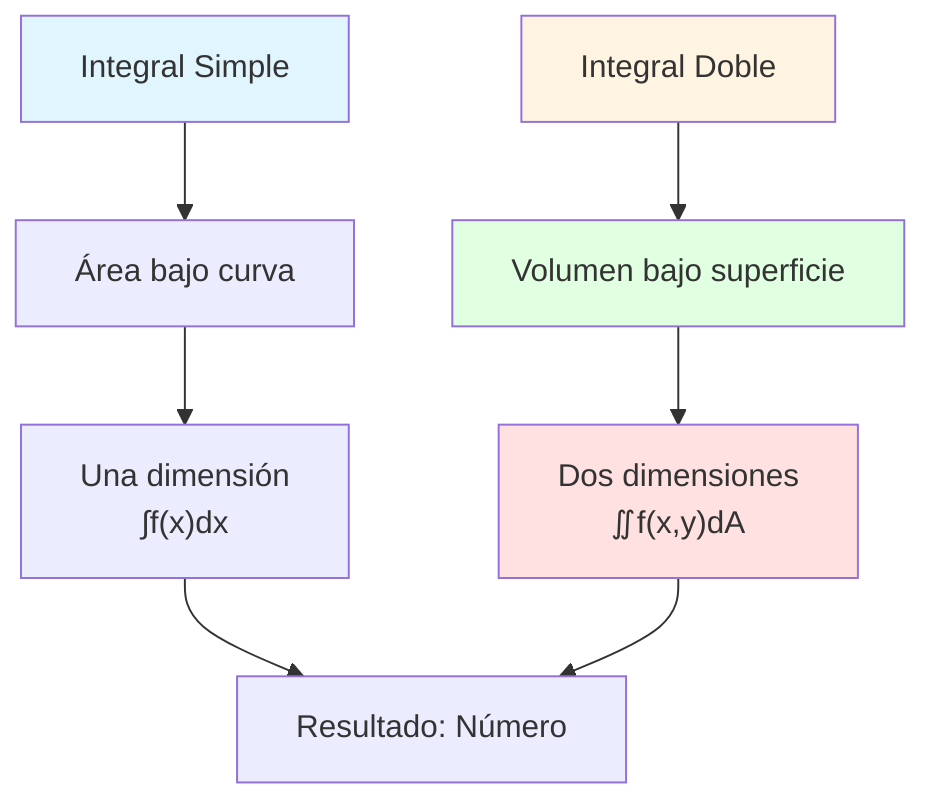
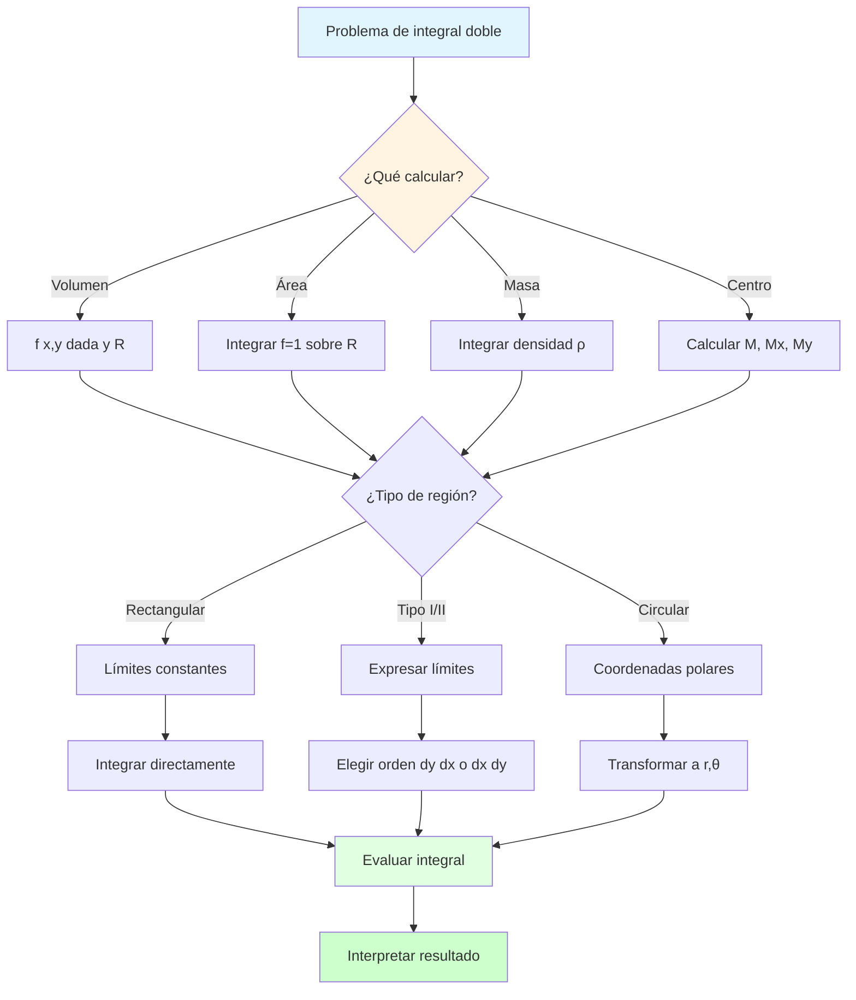

# 📐 Interpretación Geométrica de la Integral Doble

## 🎯 Introducción

> [!info]- 💡 ¿Qué es la Integral Doble? La **integral doble** es una extensión natural de la integral simple que nos permite calcular volúmenes, áreas y otras magnitudes en el espacio bidimensional. Mientras la integral simple calcula el área bajo una curva, la integral doble calcula el **volumen bajo una superficie**.
> 
> **Analogía práctica:** Imagina que eres un arquitecto calculando el volumen de agua que puede contener una piscina de fondo irregular. La integral doble te permite:
> 
> - **Calcular volúmenes** bajo superficies curvas
> - **Determinar áreas** de regiones planas
> - **Encontrar masas** de láminas con densidad variable
> - **Calcular centroides** y momentos de inercia
> 
> **¿Por qué es importante?**
> 
> |Aspecto|Descripción|Ejemplo de Uso|
> |---|---|---|
> |**Volúmenes**|Calcular espacio tridimensional|Capacidad de recipientes, excavaciones|
> |**Áreas**|Medir regiones planas|Terrenos irregulares, superficies|
> |**Física**|Masa, centro de masa, inercia|Ingeniería estructural, mecánica|
> |**Probabilidad**|Funciones de densidad conjunta|Estadística, ciencia de datos|
> |**Economía**|Producción, costos acumulados|Optimización de recursos|



---

## 🔷 De la Integral Simple a la Doble

### 📊 Repaso: Integral Simple

> [!example]- 📏 Concepto de Área bajo una Curva
> 
> La **integral simple** calcula el área entre una función $f(x)$ y el eje $x$ en un intervalo $[a, b]$.
> 
> **Notación:** $$\int_a^b f(x),dx$$
> 
> **Interpretación geométrica:**
> 
> ```mermaid
> graph TD
>     A["Función f(x)"] --> B[Dividir en rectángulos]
>     B --> C["Sumar áreas: Σf(xi)Δx"]
>     C --> D[Límite cuando Δx→0]
>     D --> E["Área exacta: ∫f(x)dx"]
>     
>     style A fill:#e1f5ff
>     style C fill:#fff4e1
>     style E fill:#e1ffe1
> ```
> 
> **Ejemplo visual:**
> 
> Para $f(x) = x^2$ en $[0, 2]$:
> 
> |Paso|Descripción|Fórmula|
> |---|---|---|
> |**1. Particionar**|Dividir $[0,2]$ en $n$ subintervalos|$\Delta x = \frac{2}{n}$|
> |**2. Aproximar**|Rectángulos de altura $f(x_i)$|$\sum_{i=1}^n f(x_i)\Delta x$|
> |**3. Límite**|Hacer $n \to \infty$|$\lim_{n\to\infty} \sum_{i=1}^n f(x_i)\Delta x$|
> |**4. Resultado**|Integral definida|$\int_0^2 x^2,dx = \frac{8}{3}$|
> 
> **Clave conceptual:**
> 
> - **Sumar infinitas áreas infinitesimales** = Área total
> - $dx$ representa un "pedacito" infinitesimal de ancho

### 🎲 Extensión a Dos Dimensiones

> [!note]- 🌐 Construcción de la Integral Doble
> 
> La integral doble extiende este concepto a funciones de dos variables $f(x,y)$ sobre una región $R$ en el plano $xy$.
> 
> **Notación:** $$\iint_R f(x,y),dA = \iint_R f(x,y),dx,dy$$
> 
> **Proceso conceptual:**
> 
> ```mermaid
> flowchart TD
>     A[Región R en plano xy] --> B[Dividir en pequeños<br/>rectángulos ΔxΔy]
>     B --> C["Altura de cada<br/>prisma: f(xi, yi)"]
>     C --> D["Volumen parcial:<br/>f(xi,yi)·ΔxΔy"]
>     D --> E["Sumar todos:<br/>ΣΣf(xi,yi)ΔxΔy"]
>     E --> F[Límite Δx,Δy→0]
>     F --> G["Volumen exacto:<br/>∬f(x,y)dA"]
>     
>     style A fill:#e1f5ff
>     style C fill:#fff4e1
>     style E fill:#ffe1e1
>     style G fill:#e1ffe1
> ```
> 
> **Comparación dimensional:**
> 
> |Característica|Integral Simple|Integral Doble|
> |---|---|---|
> |**Dominio**|Intervalo $[a,b]$ (1D)|Región $R$ (2D)|
> |**Función**|$f(x)$|$f(x,y)$|
> |**Elemento**|$dx$ (ancho)|$dA = dx,dy$ (área)|
> |**Suma**|$\sum f(x_i)\Delta x$|$\sum\sum f(x_i,y_j)\Delta x\Delta y$|
> |**Resultado**|Área (2D)|Volumen (3D)|
> |**Notación**|$\int_a^b f(x),dx$|$\iint_R f(x,y),dA$|
> 
> **Visualización del proceso:**
> 
> Imagina una superficie $z = f(x,y)$ sobre una región $R$:
> 
> 1. **Dividimos $R$** en una cuadrícula de $m \times n$ rectángulos
> 2. **Cada rectángulo** tiene área $\Delta A = \Delta x \cdot \Delta y$
> 3. **Altura del prisma** en $(x_i, y_j)$ es $f(x_i, y_j)$
> 4. **Volumen del prisma** es $f(x_i, y_j) \cdot \Delta x \cdot \Delta y$
> 5. **Suma de Riemann**: $\sum_{i=1}^m \sum_{j=1}^n f(x_i, y_j)\Delta x\Delta y$
> 6. **Límite**: Cuando $\Delta x, \Delta y \to 0$ obtenemos la integral doble

---

## 📦 Interpretación Geométrica Principal

### 🏔️ Volumen bajo una Superficie

> [!success]- 📐 Concepto Central de Volumen
> 
> **Definición geométrica:**
> 
> Si $f(x,y) \geq 0$ sobre una región $R$, entonces:
> 
> $$\iint_R f(x,y),dA = \text{Volumen del sólido entre } z=f(x,y) \text{ y el plano } xy$$
> 
> **Elementos del sólido:**
> 
> ```mermaid
> graph TD
>     A[Sólido en 3D] --> B[Base: Región R<br/>en plano xy]
>     A --> C["Techo: Superficie<br/>z = f(x,y)"]
>     A --> D[Paredes laterales:<br/>perpendiculares a xy]
>     
>     B --> E[Área = ∬R dA]
>     C --> F["Altura variable:<br/>z = f(x,y)"]
>     D --> G[Delimitan el volumen]
>     
>     style A fill:#e1ffe1
>     style B fill:#e1f5ff
>     style C fill:#fff4e1
> ```
> 
> **Ejemplo concreto: Paraboloide**
> 
> Consideremos $f(x,y) = 4 - x^2 - y^2$ sobre $R = {(x,y) : x^2 + y^2 \leq 1}$
> 
> |Componente|Descripción|Fórmula/Característica|
> |---|---|---|
> |**Base $R$**|Círculo unitario|$x^2 + y^2 \leq 1$|
> |**Superficie**|Paraboloide invertido|$z = 4 - x^2 - y^2$|
> |**Altura máxima**|En el origen $(0,0)$|$z = 4$|
> |**Altura mínima**|En el borde del círculo|$z = 3$|
> |**Volumen**|Integral doble|$\iint_R (4-x^2-y^2),dA$|
> 
> **Proceso de cálculo visual:**
> 
> ```mermaid
> flowchart LR
>     A[Región R:<br/>círculo unitario] --> B[Función altura:<br/>z=4-x²-y²]
>     B --> C["Elemento de volumen:<br/>dV = f(x,y)·dA"]
>     C --> D["Sumar sobre R:<br/>∬R f(x,y)dA"]
>     D --> E[Resultado:<br/>V = 7π/2]
>     
>     style A fill:#e1f5ff
>     style C fill:#fff4e1
>     style E fill:#e1ffe1
> ```
> 
> **Interpretación física:**
> 
> - Imagina que $z = f(x,y)$ representa la altura del techo de un edificio
> - La región $R$ es el terreno (planta del edificio)
> - El volumen es el espacio interior del edificio

### ⚖️ Casos Especiales del Signo

> [!warning]- ➕➖ Función con Valores Positivos y Negativos
> 
> **Regla general:**
> 
> $$\iint_R f(x,y),dA = V_+ - V_-$$
> 
> Donde:
> 
> - $V_+$ = Volumen donde $f(x,y) > 0$ (sobre el plano $xy$)
> - $V_-$ = Volumen donde $f(x,y) < 0$ (bajo el plano $xy$)
> 
> **Casos según el signo:**
> 
> |Condición|Interpretación|Resultado|
> |---|---|---|
> |$f(x,y) > 0$ en toda $R$|Todo el sólido sobre $xy$|$\iint_R f(x,y),dA = V_+$|
> |$f(x,y) < 0$ en toda $R$|Todo el sólido bajo $xy$|$\iint_R f(x,y),dA = -V_-$|
> |$f(x,y)$ cambia de signo|Parte sobre, parte bajo|$\iint_R f(x,y),dA = V_+ - V_-$|
> 
> **Ejemplo: Plano inclinado**
> 
> Consideremos $f(x,y) = x + y - 1$ sobre $R = [0,2] \times [0,2]$
> 
> ```mermaid
> graph TD
>     A[Plano z = x+y-1] --> B{¿Dónde z=0?}
>     B --> C[Línea: x+y=1]
>     C --> D[Región sobre xy:<br/>x+y > 1]
>     C --> E[Región bajo xy:<br/>x+y < 1]
>     
>     D --> F[Contribución positiva]
>     E --> G[Contribución negativa]
>     
>     F --> H[∬ = V+ - V-]
>     G --> H
>     
>     style C fill:#fff4e1
>     style F fill:#e1ffe1
>     style G fill:#ffe1e1
> ```
> 
> **División de la región:**
> 
> - **Sobre el plano xy** ($z > 0$): triángulo donde $x + y > 1$
> - **Bajo el plano xy** ($z < 0$): triángulo donde $x + y < 1$
> - La integral da el **volumen neto** (diferencia)
> 
> **Para obtener volumen total:** $$\text{Volumen total} = \iint_R |f(x,y)|,dA$$

---

## 📍 Región de Integración

### 🗺️ Tipos de Regiones

> [!note]- 🔲 Clasificación de Regiones Planas
> 
> **1. Regiones Rectangulares (Tipo I y II simultáneo)**
> 
> Son las más simples: $R = [a,b] \times [c,d]$
> 
> $$\iint_R f(x,y),dA = \int_a^b \int_c^d f(x,y),dy,dx$$
> 
> |Característica|Descripción|Ejemplo|
> |---|---|---|
> |**Forma**|Rectángulo con lados paralelos a ejes|$[0,2] \times [1,3]$|
> |**Límites**|Constantes en ambas direcciones|$0 \leq x \leq 2$, $1 \leq y \leq 3$|
> |**Orden**|Intercambiable sin cambios|$\int_0^2\int_1^3 = \int_1^3\int_0^2$|
> |**Cálculo**|Más directo|Dos integrales simples|
> 
> **2. Regiones Tipo I (verticalmente simple)**
> 
> ```mermaid
> graph TD
>     A[Región Tipo I] --> B[Límites en x:<br/>constantes]
>     A --> C[Límites en y:<br/>funciones de x]
>     
>     B --> D[a ≤ x ≤ b]
>     C --> E["g₁(x) ≤ y ≤ g₂(x)"]
>     
>     D --> F["∫ₐᵇ∫_{g₁(x)}^{g₂(x)} f(x,y)dydx"]
>     E --> F
>     
>     style A fill:#e1f5ff
>     style F fill:#e1ffe1
> ```
> 
> **Características:**
> 
> - **Proyección en eje $x$**: intervalo $[a,b]$
> - **Para cada $x$ fijo**: $y$ varía entre dos funciones
> - **Curvas delimitadoras**: $y = g_1(x)$ (inferior) y $y = g_2(x)$ (superior)
> 
> **Fórmula:** $$\iint_R f(x,y),dA = \int_a^b \left[\int_{g_1(x)}^{g_2(x)} f(x,y),dy\right]dx$$
> 
> **Ejemplo:** Región entre $y = x^2$ y $y = 2x$ para $0 \leq x \leq 2$
> 
> - Límites externos: $0 \leq x \leq 2$
> - Límites internos: $x^2 \leq y \leq 2x$
> - Integral: $\int_0^2 \int_{x^2}^{2x} f(x,y),dy,dx$
> 
> **3. Regiones Tipo II (horizontalmente simple)**
> 
> ```mermaid
> graph TD
>     A[Región Tipo II] --> B[Límites en y:<br/>constantes]
>     A --> C[Límites en x:<br/>funciones de y]
>     
>     B --> D[c ≤ y ≤ d]
>     C --> E["h₁(y) ≤ x ≤ h₂(y)"]
>     
>     D --> F["∫_c^d∫_{h₁(y)}^{h₂(y)} f(x,y)dxdy"]
>     E --> F
>     
>     style A fill:#fff4e1
>     style F fill:#e1ffe1
> ```
> 
> **Características:**
> 
> - **Proyección en eje $y$**: intervalo $[c,d]$
> - **Para cada $y$ fijo**: $x$ varía entre dos funciones
> - **Curvas delimitadoras**: $x = h_1(y)$ (izquierda) y $x = h_2(y)$ (derecha)
> 
> **Fórmula:** $$\iint_R f(x,y),dA = \int_c^d \left[\int_{h_1(y)}^{h_2(y)} f(x,y),dx\right]dy$$
> 
> **Comparación Tipo I vs Tipo II:**
> 
> |Aspecto|Tipo I|Tipo II|
> |---|---|---|
> |**Barrido**|Vertical (↕)|Horizontal (↔)|
> |**Orden**|$dy,dx$|$dx,dy$|
> |**$x$ limitado por**|Constantes|Funciones de $y$|
> |**$y$ limitado por**|Funciones de $x$|Constantes|
> |**Cuándo usar**|Fácil expresar $y$ en términos de $x$|Fácil expresar $x$ en términos de $y$|

### 🔄 Cambio de Orden de Integración

> [!tip]- ↔️ Reescribir Integrales Iteradas
> 
> **¿Por qué cambiar el orden?**
> 
> |Motivo|Explicación|Ejemplo|
> |---|---|---|
> |**Simplificar integral**|Una integral puede ser imposible en un orden|$\int e^{y^2}dy$ vs $\int e^{y^2}dx$|
> |**Cambiar región**|Mejor descripción de límites|Circular mejor en polares|
> |**Facilitar cálculo**|Integral más simple en otro orden|Funciones que se cancelan|
> 
> **Proceso de cambio:**
> 
> ```mermaid
> flowchart TD
>     A["Integral dada:<br/>∫∫f(x,y)dydx"] --> B[Identificar región R]
>     B --> C[Graficar región]
>     C --> D[Redibujar límites]
>     D --> E{¿Nuevo tipo?}
>     E -->|Tipo I→II| F[Expresar x en términos de y]
>     E -->|Tipo II→I| G[Expresar y en términos de x]
>     F --> H["Nueva integral:<br/>∫∫f(x,y)dxdy"]
>     G --> H
>     
>     style C fill:#fff4e1
>     style H fill:#e1ffe1
> ```
> 
> **Ejemplo paso a paso:**
> 
> **Dada:** $\int_0^1 \int_{x^2}^x f(x,y),dy,dx$
> 
> **Paso 1: Identificar región**
> 
> - $0 \leq x \leq 1$
> - $x^2 \leq y \leq x$
> - Tipo I (límites de $y$ dependen de $x$)
> 
> **Paso 2: Graficar**
> 
> - Curva inferior: $y = x^2$ (parábola)
> - Curva superior: $y = x$ (recta)
> - Intersecciones: $(0,0)$ y $(1,1)$
> 
> **Paso 3: Expresar como Tipo II**
> 
> - Proyección en $y$: $0 \leq y \leq 1$
> - Para $y$ fijo, ¿entre qué valores varía $x$?
>     - De $y = x^2 \Rightarrow x = \sqrt{y}$ (izquierda)
>     - Hasta $y = x \Rightarrow x = y$ (derecha)
> - Límites: $\sqrt{y} \leq x \leq y$
> 
> **Paso 4: Nueva integral** $$\int_0^1 \int_{\sqrt{y}}^y f(x,y),dx,dy$$
> 
> **Verificación:**
> 
> |Orden original|Orden cambiado|
> |---|---|
> |$\int_0^1 \int_{x^2}^x ,dy,dx$|$\int_0^1 \int_{\sqrt{y}}^y ,dx,dy$|
> |Área = $\int_0^1 (x - x^2)dx = \frac{1}{6}$|Área = $\int_0^1 (y - \sqrt{y})dy = \frac{1}{6}$ ✅|

---

## 🎨 Aplicaciones Geométricas

### 📏 Cálculo de Áreas

> [!example]- 🗺️ Área de Regiones Planas
> 
> **Principio fundamental:**
> 
> Cuando $f(x,y) = 1$, la integral doble da el **área de la región** $R$:
> 
> $$\text{Área}(R) = \iint_R 1,dA = \iint_R dA$$
> 
> **¿Por qué funciona?**
> 
> ```mermaid
> graph LR
>     A["Volumen = base × altura"] --> B["V = Área(R) × 1"]
>     B --> C["∬R 1·dA = Área(R)"]
>     
>     style A fill:#e1f5ff
>     style C fill:#e1ffe1
> ```
> 
> **Aplicaciones:**
> 
> |Tipo de Región|Descripción|Fórmula|
> |---|---|---|
> |**Región simple**|Entre dos curvas|$\int_a^b \int_{g_1(x)}^{g_2(x)} dy,dx$|
> |**Región polar**|Circular o sectorial|$\int_{\theta_1}^{\theta_2} \int_{r_1(\theta)}^{r_2(\theta)} r,dr,d\theta$|
> |**Región irregular**|Delimitada por múltiples curvas|Dividir en subregiones|
> 
> **Ejemplo 1: Área entre parábola y recta**
> 
> Encontrar el área de $R$ limitada por $y = x^2$ y $y = 4$.
> 
> **Solución:**
> 
> - Intersecciones: $x^2 = 4 \Rightarrow x = \pm 2$
> - Región Tipo I: $-2 \leq x \leq 2$, $x^2 \leq y \leq 4$
> 
> $$\text{Área} = \int_{-2}^2 \int_{x^2}^4 1,dy,dx = \int_{-2}^2 (4-x^2),dx = \frac{32}{3}$$
> 
> **Ejemplo 2: Área de un círculo**
> 
> Región: $R = {(x,y) : x^2 + y^2 \leq a^2}$
> 
> **Coordenadas polares:** $$\text{Área} = \int_0^{2\pi} \int_0^a r,dr,d\theta = \int_0^{2\pi} \frac{a^2}{2},d\theta = \pi a^2$$ ✅
> 
> **Estrategia de resolución:**
> 
> ```mermaid
> flowchart TD
>     A[Problema: calcular área] --> B{¿Región simple?}
>     B -->|Sí| C[Integrar f=1 directamente]
>     B -->|No| D[Dividir en subregiones]
>     
>     C --> E{¿Coordenadas?}
>     E -->|Cartesianas| F[∬R dxdy]
>     E -->|Polares| G[∬R r·drdθ]
>     
>     D --> H[Sumar áreas parciales]
>     
>     F --> I[Resultado numérico]
>     G --> I
>     H --> I
>     
>     style C fill:#e1ffe1
>     style I fill:#fff4e1
> ```

### 🏋️ Masa y Centro de Masa

> [!success]- ⚖️ Propiedades Físicas de Láminas
> 
> **Concepto de lámina:** Una lámina es una placa delgada en el plano $xy$ con **densidad variable** $\rho(x,y)$.
> 
> **Fórmulas fundamentales:**
> 
> |Propiedad|Fórmula|Interpretación|
> |---|---|---|
> |**Masa total**|$M = \iint_R \rho(x,y),dA$|Suma de densidades infinitesimales|
> |**Momento respecto a $x$**|$M_x = \iint_R y\rho(x,y),dA$|"Peso" × distancia al eje $x$|
> |**Momento respecto a $y$**|$M_y = \iint_R x\rho(x,y),dA$|"Peso" × distancia al eje $y$|
> |**Centro de masa**|$(\bar{x}, \bar{y}) = \left(\frac{M_y}{M}, \frac{M_x}{M}\right)$|Punto de equilibrio|
> 
> **Proceso de cálculo:**
> 
> ```mermaid
> flowchart TD
>     A["Lámina con densidad ρ(x,y)"] --> B[Calcular masa:<br/>M = ∬ρdA]
>     B --> C[Calcular momentos:<br/>Mx, My]
>     C --> D[Centro de masa:<br/>x̄ = My/M<br/>ȳ = Mx/M]
>     
>     D --> E{Verificar}
>     E -->|Simetría| F[Centro en eje<br/>de simetría]
>     E -->|Densidad uniforme| G[Coincide con<br/>centroide geométrico]
>     
>     style B fill:#e1f5ff
>     style D fill:#e1ffe1
> ```
> 
> **Ejemplo: Lámina triangular**
> 
> Lámina en forma de triángulo con vértices $(0,0)$, $(1,0)$, $(0,1)$ y densidad $\rho(x,y) = x + y$.
> 
> **Región:** $R = {(x,y) : 0 \leq x \leq 1, 0 \leq y \leq 1-x}$
> 
> **Cálculos:**
> 
> 1. **Masa:** $$M = \int_0^1 \int_0^{1-x} (x+y),dy,dx = \frac{1}{3}$$
>     
> 2. **Momento respecto a $x$:** $$M_x = \int_0^1 \int_0^{1-x} y(x+y),dy,dx = \frac{1}{6}$$
>     
> 3. **Momento respecto a $y$:** $$M_y = \int_0^1 \int_0^{1-x} x(x+y),dy,dx = \frac{1}{6}$$
>     
> 4. **Centro de masa:** $$(\bar{x}, \bar{y}) = \left(\frac{1/6}{1/3}, \frac{1/6}{1/3}\right) = \left(\frac{1}{2}, \frac{1}{2}\right)$$
>     
> 
> **Casos especiales:**
> 
> |Condición|Simplificación|Ejemplo|
> |---|---|---|
> |**Densidad uniforme** $\rho = k$|Centro de masa = centroide geométrico|Láminas homogéneas|
> |**Simetría en $x$**|$\bar{x}$ en eje de simetría|$M_y = 0$|
> |**Simetría en $y$**|$\bar{y}$ en eje de simetría|$M_x = 0$|
> |**Ambas simetrías**|Centro en origen|Círculo, cuadrado centrado|

### 📊 Valor Promedio

> [!tip]- 📈 Promedio de una Función sobre una Región
> 
> **Definición:**
> 
> El **valor promedio** de $f(x,y)$ sobre la región $R$ es:
> 
> $$f_{\text{prom}} = \frac{1}{\text{Área}(R)} \iint_R f(x,y),dA$$
> 
> **Analogía:** Es como calcular la **altura promedio** de una superficie irregular.
> 
> **Interpretación geométrica:**
> 
> ```mermaid
> graph TB
> A["Volumen bajo superficie<br/>V = ∬f(x,y)dA"] --> B[Dividir entre área base<br/>A = ∬dA]
> B --> C[Altura promedio<br/>h = V/A]
> C --> D[Prisma equivalente:<br/>mismo volumen]
> 
> style A fill:#e1f5ff
> style C fill:#e1ffe1
> style D fill:#fff4e1
> ```
> 
> 
> 
> **Fórmula expandida:**
> 
> $$f_{\text{prom}} = \frac{\iint_R f(x,y)\,dA}{\iint_R 1\,dA}$$
> 
> **Aplicaciones:**
> 
> | Contexto | $f(x,y)$ representa | Promedio significa |
> |----------|---------------------|---------------------|
> | **Temperatura** | Temperatura en placa | Temperatura media |
> | **Densidad** | Densidad de población | Densidad promedio |
> | **Altitud** | Elevación del terreno | Altitud media |
> | **Probabilidad** | Función de densidad | Valor esperado |
> 
> **Ejemplo: Temperatura promedio**
> 
> La temperatura en una placa rectangular $R = [0,2] \times [0,3]$ es:
> $$T(x,y) = 100 - 2x^2 - y^2$$
> 
> **Cálculo:**
> 
> 1. **Área de $R$:**
> $$A = 2 \times 3 = 6$$
> 
> 2. **Integral de temperatura:**
> $$\int_0^2 \int_0^3 (100-2x^2-y^2)\,dy\,dx = 100(6) - 2\left(\frac{8}{3}\right)(3) - (2)(9) = 566$$
> 
> 3. **Temperatura promedio:**
> $$T_{\text{prom}} = \frac{566}{6} = \frac{283}{3} \approx 94.33°$$
> 
> **Propiedades:**
> 
> - Si $f(x,y) = c$ (constante), entonces $f_{\text{prom}} = c$
> - $\min(f) \leq f_{\text{prom}} \leq \max(f)$ en $R$
> - El promedio es único para cada región y función
> 

---

## 🔄 Coordenadas Polares

### 🎯 Transformación de Coordenadas

> [!info]- 🌀 De Cartesianas a Polares
> 
> **Relaciones fundamentales:**
> 
> |Cartesianas → Polares|Polares → Cartesianas|
> |---|---|
> |$r = \sqrt{x^2 + y^2}$|$x = r\cos\theta$|
> |$\theta = \arctan\left(\frac{y}{x}\right)$|$y = r\sin\theta$|
> 
> **Elemento de área:**
> 
> $$dA = dx,dy \quad \Rightarrow \quad dA = r,dr,d\theta$$
> 
> **¿Por qué aparece $r$?**
> 
> ```mermaid
> graph TD
>     A[Rectángulo en cartesianas:<br/>Δx × Δy] --> B[Sector en polares:<br/>Δr × rΔθ]
>     
>     B --> C[Área sector ≈ r·Δr·Δθ]
>     C --> D[En límite:<br/>dA = r·dr·dθ]
>     
>     style A fill:#e1f5ff
>     style D fill:#e1ffe1
> ```
> 
> **Fórmula de transformación:**
> 
> $$\iint_R f(x,y),dx,dy = \iint_S f(r\cos\theta, r\sin\theta),r,dr,d\theta$$
> 
> Donde $S$ es la región $R$ descrita en coordenadas polares.
> 
> **Cuándo usar polares:**
> 
> |Situación|Ejemplo|Ventaja|
> |---|---|---|
> |**Regiones circulares**|$x^2+y^2 \leq a^2$|Se vuelve $r \leq a$|
> |**Funciones con $x^2+y^2$**|$f(x,y) = e^{-(x^2+y^2)}$|Se simplifica a $f(r) = e^{-r^2}$|
> |**Simetría radial**|Anillos, sectores|Límites constantes|
> |**Intersecciones complejas**|Círculos, pétalos|Geometría natural|
> 
> **Límites típicos en polares:**
> 
> |Región|Descripción|Límites|
> |---|---|---|
> |**Círculo completo**|Radio $a$|$0 \leq r \leq a$, $0 \leq \theta \leq 2\pi$|
> |**Semicírculo superior**|Radio $a$, $y \geq 0$|$0 \leq r \leq a$, $0 \leq \theta \leq \pi$|
> |**Sector circular**|Ángulo $\alpha$|$0 \leq r \leq a$, $0 \leq \theta \leq \alpha$|
> |**Anillo**|Entre radios $a$ y $b$|$a \leq r \leq b$, $0 \leq \theta \leq 2\pi$|
> |**Cardioide**|$r = 1+\cos\theta$|$0 \leq r \leq 1+\cos\theta$, $0 \leq \theta \leq 2\pi$|

### 🌐 Ejemplos de Conversión

> [!example]- 🔄 Problemas Resueltos en Polares
> 
> **Ejemplo 1: Círculo unitario**
> 
> Calcular $\iint_R (x^2+y^2),dA$ donde $R: x^2+y^2 \leq 1$.
> 
> **Método cartesiano (complicado):** $$\int_{-1}^1 \int_{-\sqrt{1-x^2}}^{\sqrt{1-x^2}} (x^2+y^2),dy,dx$$
> 
> **Método polar (simple):**
> 
> - Región: $0 \leq r \leq 1$, $0 \leq \theta \leq 2\pi$
> - Función: $x^2+y^2 = r^2$
> 
> $$\int_0^{2\pi} \int_0^1 r^2 \cdot r,dr,d\theta = \int_0^{2\pi} \int_0^1 r^3,dr,d\theta$$ $$= \int_0^{2\pi} \frac{1}{4},d\theta = \frac{\pi}{2}$$
> 
> **Ejemplo 2: Sector circular**
> 
> Área del sector en el primer cuadrante de $x^2+y^2 = 4$.
> 
> **Configuración:**
> 
> - Radio: $r = 2$
> - Ángulo: $0 \leq \theta \leq \frac{\pi}{2}$
> 
> $$\text{Área} = \int_0^{\pi/2} \int_0^2 r,dr,d\theta = \int_0^{\pi/2} 2,d\theta = \pi$$
> 
> **Ejemplo 3: Anillo**
> 
> Masa de anillo $1 \leq x^2+y^2 \leq 4$ con densidad $\rho(x,y) = \frac{1}{\sqrt{x^2+y^2}}$.
> 
> **En polares:**
> 
> - Región: $1 \leq r \leq 2$, $0 \leq \theta \leq 2\pi$
> - Densidad: $\rho(r,\theta) = \frac{1}{r}$
> 
> $$M = \int_0^{2\pi} \int_1^2 \frac{1}{r} \cdot r,dr,d\theta = \int_0^{2\pi} \int_1^2 1,dr,d\theta$$ $$= \int_0^{2\pi} 1,d\theta = 2\pi$$
> 
> **Comparación de eficiencia:**
> 
> |Problema|Cartesianas|Polares|Ganancia|
> |---|---|---|---|
> |Círculo $x^2+y^2=a^2$|Límites con raíces|$r=a$ constante|⭐⭐⭐|
> |Función $x^2+y^2$|Permanece igual|Simplifica a $r^2$|⭐⭐|
> |Sector angular|Difícil describir|Natural con $\theta$|⭐⭐⭐|
> |Rectángulo|Natural|Complicado|❌|

---

## 📊 Visualización y Comprensión

### 🎨 Sólidos Comunes

> [!note]- 🏔️ Geometrías Típicas
> 
> **1. Prisma recto**
> 
> Función: $f(x,y) = h$ (constante) Base: Cualquier región $R$
> 
> $$V = \iint_R h,dA = h \cdot \text{Área}(R)$$
> 
> **Características:**
> 
> - Techo plano horizontal
> - Volumen = altura × área base
> - Ejemplo: edificio de un piso
> 
> **2. Paraboloide**
> 
> Función: $f(x,y) = a - bx^2 - cy^2$ con $a,b,c > 0$ Base: Generalmente circular
> 
> **Propiedades:**
> 
> - Simetría radial si $b = c$
> - Máximo en el origen
> - Forma de "tazón" invertido
> 
> **3. Plano inclinado**
> 
> Función: $f(x,y) = ax + by + c$
> 
> $$V = \iint_R (ax+by+c),dA$$
> 
> **Características:**
> 
> - Superficie plana inclinada
> - Puede tener partes sobre y bajo $xy$
> - Volumen neto (con signo)
> 
> **4. Cono**
> 
> Función: $f(x,y) = h\left(1 - \frac{\sqrt{x^2+y^2}}{a}\right)$ sobre disco $x^2+y^2 \leq a^2$
> 
> **En polares:** $$f(r,\theta) = h\left(1 - \frac{r}{a}\right), \quad 0 \leq r \leq a$$
> 
> $$V = \int_0^{2\pi} \int_0^a h\left(1-\frac{r}{a}\right)r,dr,d\theta = \frac{\pi a^2 h}{3}$$
> 
> **Comparación visual:**
> 
> ```mermaid
> graph TD
>     A[Sólidos bajo superficies] --> B[Prisma<br/>f = constante]
>     A --> C[Paraboloide<br/>f = a-bx²-cy²]
>     A --> D[Plano inclinado<br/>f = ax+by+c]
>     A --> E["Cono<br/>f = h(1-r/a)"]
>     
>     B --> F[Volumen simple]
>     C --> G[Curvatura suave]
>     D --> H[Lineal]
>     E --> I[Vértice puntiagudo]
>     
>     style B fill:#e1ffe1
>     style C fill:#e1f5ff
>     style D fill:#fff4e1
>     style E fill:#ffe1e1
> ```

### 🔍 Estrategias de Visualización

> [!tip]- 👁️ Cómo "Ver" la Integral Doble
> 
> **Proceso mental en 6 pasos:**
> 
> ```mermaid
> flowchart TD
>     A["Identificar región R<br/>en plano xy"] --> B["Graficar R<br/>vista superior"]
>     B --> C["Determinar función<br/>z = f(x,y)"]
>     C --> D["Imaginar superficie<br/>en 3D"]
>     D --> E["Visualizar sólido<br/>entre superficie y R"]
>     E --> F["Volumen del sólido<br/>= valor de integral"]
>     
>     style A fill:#e1f5ff
>     style D fill:#fff4e1
>     style F fill:#e1ffe1
> ```
> 
> **Técnicas de visualización:**
> 
> |Técnica|Descripción|Útil para|
> |---|---|---|
> |**Curvas de nivel**|Dibujar $f(x,y) = k$ para varios $k$|Ver topografía de superficie|
> |**Secciones transversales**|Fijar $x$ o $y$ y graficar $f$|Entender forma en cortes|
> |**Proyecciones**|Ver región $R$ desde arriba|Determinar límites|
> |**Simetría**|Identificar ejes de simetría|Simplificar cálculos|
> |**Puntos críticos**|Encontrar máximos/mínimos|Ubicar alturas extremas|
> 
> **Checklist de comprensión:**
> 
> - [ ] ¿Puedo describir la región $R$ con palabras?
> - [ ] ¿Puedo graficar $R$ en el plano $xy$?
> - [ ] ¿Entiendo qué representa $f(x,y)$ físicamente?
> - [ ] ¿Puedo identificar dónde $f$ es positiva/negativa?
> - [ ] ¿Visualizo el sólido tridimensional?
> - [ ] ¿Puedo explicar el resultado numéricamente?

---

## 🎯 Resumen Visual Completo

### 📋 Diagrama Conceptual Global

```mermaid
flowchart TD
    A((Integral Doble))

    A --> A1[Definición]
        A1 --> A11[Volumen bajo superficie]
        A1 --> A12[Suma de Riemann 2D]
        A1 --> A13[Límite Δx, Δy → 0]

    A --> A2[Notación]
        A2 --> A21["∬_R f(x,y) dA"]
        A2 --> A22["dx dy o dy dx"]
        A2 --> A23[Elemento dA]

    A --> A3[Región R]
        A3 --> A31["Tipo I (vertical)"]
        A3 --> A32["Tipo II (horizontal)"]
        A3 --> A33[Rectangular]
        A3 --> A34["Polar (r, θ)"]

    A --> A4[Aplicaciones]
        A4 --> A41[Volumen]
        A4 --> A42["Área (f = 1)"]
        A4 --> A43["Masa: ∬ ρ dA"]
        A4 --> A44[Centro de masa]
        A4 --> A45[Valor promedio]

    A --> A5[Coordenadas]
        A5 --> A51["Cartesianas (x, y)"]
        A5 --> A52["Polares (r, θ)"]
        A5 --> A53["dA = r · dr · dθ"]

    A --> A6[Interpretación]
        A6 --> A61[Geométrica: volumen]
        A6 --> A62[Física: masa y centro]
        A6 --> A63[Probabilística: valor esperado]

```



### 📊 Tabla Maestra de Fórmulas

> [!success]- 🎓 Referencia Rápida
> 
> |Concepto|Fórmula|Condiciones|
> |---|---|---|
> |**Definición**|$\iint_R f(x,y),dA$|$f$ integrable en $R$|
> |**Volumen**|$V = \iint_R f(x,y),dA$|$f(x,y) \geq 0$|
> |**Volumen neto**|$V = V_+ - V_-$|$f$ cambia de signo|
> |**Área**|$A = \iint_R 1,dA$|Cualquier región $R$|
> |**Tipo I**|$\int_a^b \int_{g_1(x)}^{g_2(x)} f,dy,dx$|$a \leq x \leq b$|
> |**Tipo II**|$\int_c^d \int_{h_1(y)}^{h_2(y)} f,dx,dy$|$c \leq y \leq d$|
> |**Polares**|$\int_{\theta_1}^{\theta_2} \int_{r_1}^{r_2} f(r,\theta)r,dr,d\theta$|$dA = r,dr,d\theta$|
> |**Masa**|$M = \iint_R \rho(x,y),dA$|$\rho$ = densidad|
> |**Momento-x**|$M_x = \iint_R y\rho(x,y),dA$|Respecto a eje $x$|
> |**Momento-y**|$M_y = \iint_R x\rho(x,y),dA$|Respecto a eje $y$|
> |**Centro de masa**|$(\bar{x},\bar{y}) = \left(\frac{M_y}{M}, \frac{M_x}{M}\right)$|Punto de equilibrio|
> |**Valor promedio**|$f_{\text{prom}} = \frac{1}{A(R)}\iint_R f,dA$|$A(R)$ = área de $R$|

### 🔄 Flujo de Resolución



---

## 💪 Ejercicios Guiados

> [!example]- 🎯 Problemas Resueltos Paso a Paso
> 
> **Nivel Básico:**
> 
> **Ejercicio 1: Volumen bajo plano**
> 
> Calcular el volumen del sólido bajo $z = 4-x-y$ sobre $R = [0,2] \times [0,3]$.
> 
> **Solución:**
> 
> ```
> V = ∫₀² ∫₀³ (4-x-y) dy dx
>   = ∫₀² [4y - xy - y²/2]₀³ dx
>   = ∫₀² (12 - 3x - 9/2) dx
>   = ∫₀² (15/2 - 3x) dx
>   = [15x/2 - 3x²/2]₀²
>   = 15 - 6 = 9
> ```
> 
> **Ejercicio 2: Área entre curvas**
> 
> Encontrar el área de la región limitada por $y = x^2$ y $y = \sqrt{x}$.
> 
> **Solución:**
> 
> - Intersecciones: $x^2 = \sqrt{x} \Rightarrow x^4 = x \Rightarrow x = 0, 1$
> - Región: $0 \leq x \leq 1$, $x^2 \leq y \leq \sqrt{x}$
> 
> ```
> A = ∫₀¹ ∫_{x²}^{√x} 1 dy dx
>   = ∫₀¹ (√x - x²) dx
>   = [2x^{3/2}/3 - x³/3]₀¹
>   = 2/3 - 1/3 = 1/3
> ```
> 
> **Nivel Intermedio:**
> 
> **Ejercicio 3: Cambio de orden**
> 
> Reescribir $\int_0^1 \int_y^1 f(x,y),dx,dy$ cambiando el orden.
> 
> **Solución:**
> 
> - Región original: $0 \leq y \leq 1$, $y \leq x \leq 1$ (Tipo II)
> - Graficar: triángulo con vértices $(0,0)$, $(1,0)$, $(1,1)$
> - Tipo I: $0 \leq x \leq 1$, $0 \leq y \leq x$
> - Nueva integral: $\int_0^1 \int_0^x f(x,y),dy,dx$
> 
> **Ejercicio 4: Centro de masa**
> 
> Lámina semicircular $x^2+y^2 \leq a^2$, $y \geq 0$ con densidad $\rho = ky$.
> 
> **Solución en polares:**
> 
> - Región: $0 \leq r \leq a$, $0 \leq \theta \leq \pi$
> - Densidad: $\rho = kr\sin\theta$
> 
> ```
> M = ∫₀^π ∫₀^a (kr sin θ)r dr dθ
>   = k ∫₀^π sin θ [r³/3]₀^a dθ
>   = ka³/3 [-cos θ]₀^π = 2ka³/3
> 
> Por simetría: x̄ = 0
> 
> My = 0 (por simetría)
> 
> Mx = ∫₀^π ∫₀^a (r sin θ)(kr sin θ)r dr dθ
>    = k ∫₀^π sin² θ [r⁴/4]₀^a dθ
>    = ka⁴/4 ∫₀^π (1-cos 2θ)/2 dθ
>    = ka⁴/8 · π
> 
> ȳ = Mx/M = (ka⁴π/8)/(2ka³/3) = 3πa/16
> ```
> 
> **Centro de masa:** $(0, \frac{3\pi a}{16})$

---

## 🔗 Conexión con Próximos Temas

> [!quote]- 🌟 Continuando el Aprendizaje
> 
> **Has dominado:**
> 
> ```mermaid
> mindmap
>   root((Integral<br/>Doble))
>     Fundamentos
>       Concepto de volumen
>       Suma de Riemann 2D
>       Límite de aproximación
>     Regiones
>       Tipo I y II
>       Cambio de orden
>       Coordenadas polares
>     Aplicaciones
>       Volúmenes
>       Áreas
>       Masa y centro
>       Valores promedio
>     Técnicas
>       Integración iterada
>       Transformación de coordenadas
>       Interpretación geométrica
> ```
> 
> **Progresión natural del aprendizaje:**
> 
> |Nivel|Tema|Por qué es el siguiente paso|
> |---|---|---|
> |**Actual**|Integral doble en $\mathbb{R}^2$|Fundamento bidimensional|
> |**Siguiente**|Integral triple en $\mathbb{R}^3$|Extensión a tres dimensiones|
> |**Avanzado**|Teorema de Fubini|Justificación teórica|
> |**Cambio de variables**|Jacobiano y transformaciones|Generalizaralizar coordenadas|
> |**Integrales de línea**|Integración sobre curvas|Preparar para Green|
> |**Teoremas vectoriales**|Green, Stokes, Gauss|Unificar conceptos|
> 
> **Roadmap de evolución:**
> 
> ```mermaid
> graph LR
>     A[Integral Doble] --> B[Integral Triple]
>     A --> C[Coordenadas generales]
>     B --> D[Teorema de Divergencia]
>     C --> E[Jacobiano]
>     E --> F[Cambio de variables general]
>     A --> G[Integrales de línea]
>     G --> H[Teorema de Green]
>     H --> I[Teorema de Stokes]
>     D --> I
>     
>     style A fill:#e1ffe1
>     style B fill:#fff4e1
>     style H fill:#e1f5ff
> ```
> 
> **Conceptos clave para el futuro:**
> 
> - **Jacobiano**: Generalización del factor $r$ en polares
> - **Teorema de Fubini**: Condiciones para separar integrales
> - **Coordenadas curvilíneas**: Cilíndricas, esféricas
> - **Integrales de superficie**: Flujo a través de superficies
> - **Teoremas fundamentales**: Conectan diferentes tipos de integrales

---

**Tags:** #cálculo-vectorial #integral-doble #volumen #área #coordenadas-polares #centro-de-masa #aplicaciones-geométricas #interpretación-geométrica #regiones-de-integración #mermaid #diagramas
