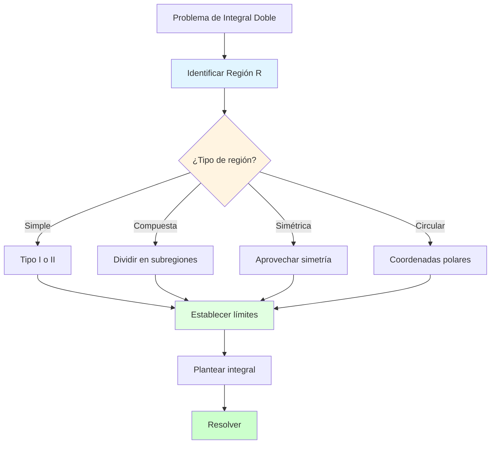
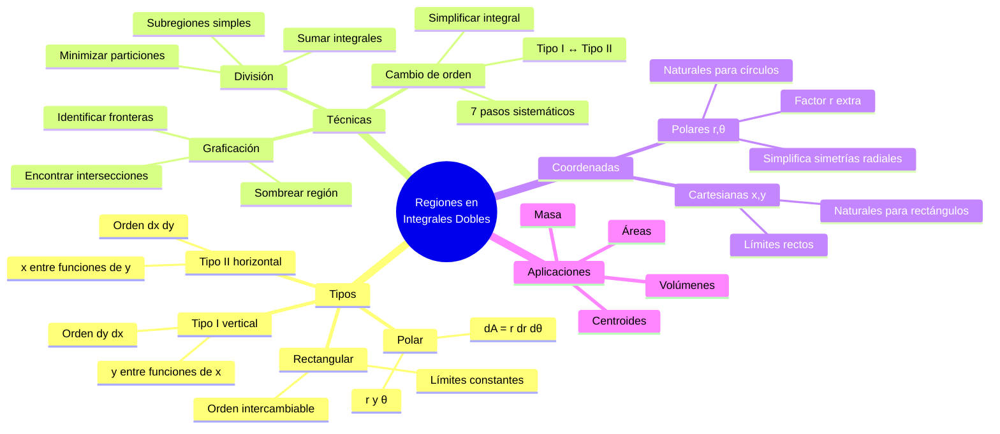
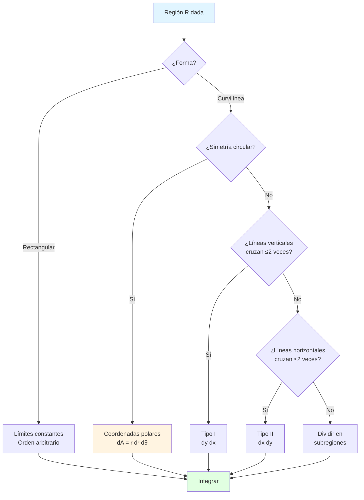

# 🗺️ Regiones en Integrales Dobles

## 🎯 Introducción

> [!info]- 💡 ¿Qué es una Región de Integración? La **región de integración** es el dominio bidimensional sobre el cual calculamos la integral doble. Entender y describir correctamente estas regiones es fundamental para establecer los límites de integración correctos.
> 
> **Analogía práctica:** Imagina que eres un topógrafo midiendo el volumen de tierra en un terreno. La región de integración es el **límite del terreno en el mapa** (vista desde arriba), mientras que la función integrada representa la elevación en cada punto.
> 
> **¿Por qué es crucial dominar las regiones?**
> 
> |Aspecto|Importancia|Consecuencia si falla|
> |---|---|---|
> |**Límites correctos**|Define qué parte integramos|Resultado incorrecto|
> |**Orden de integración**|Facilita o complica el cálculo|Integral imposible de resolver|
> |**Visualización**|Comprensión del problema|Errores conceptuales|
> |**Sistema de coordenadas**|Simplifica expresiones|Cálculos innecesariamente complejos|
> |**Descomposición**|Divide problemas complejos|Problema intratable|



---

## 📐 Clasificación de Regiones

### 🔷 Regiones Rectangulares

> [!example]- 📦 Regiones Tipo Rectangular
> 
> **Definición:**
> 
> Una región rectangular $R$ tiene la forma: $$R = {(x,y) : a \leq x \leq b, , c \leq y \leq d}$$
> 
> También escrito como: $R = [a,b] \times [c,d]$
> 
> **Características principales:**
> 
> |Propiedad|Descripción|Ventaja|
> |---|---|---|
> |**Límites constantes**|Todos son números fijos|Fácil de integrar|
> |**Orden intercambiable**|$\int\int = \int\int$ sin cambios|Flexibilidad total|
> |**Forma visual**|Rectángulo con lados paralelos a ejes|Fácil de graficar|
> |**Área**|$A = (b-a)(d-c)$|Cálculo inmediato|
> 
> **Notación de la integral:**
> 
> $$\iint_R f(x,y),dA = \int_a^b \int_c^d f(x,y),dy,dx = \int_c^d \int_a^b f(x,y),dx,dy$$
> 
> **Visualización:**
> 
> ```mermaid
> graph TD
>     A[Región Rectangular R] --> B[Vértices]
>     B --> C["(a,c) esquina inferior izq."]
>     B --> D["(b,c) esquina inferior der."]
>     B --> E["(a,d) esquina superior izq."]
>     B --> F["(b,d) esquina superior der."]
>     
>     A --> G[Lados]
>     G --> H["x = a (izquierdo)"]
>     G --> I["x = b (derecho)"]
>     G --> J["y = c (inferior)"]
>     G --> K["y = d (superior)"]
>     
>     style A fill:#e1ffe1
>     style B fill:#e1f5ff
>     style G fill:#fff4e1
> ```
> 
> **Ejemplo 1: Integral sobre cuadrado**
> 
> Calcular $\iint_R xy,dA$ donde $R = [0,2] \times [0,2]$.
> 
> **Solución (orden $dy,dx$):**
> 
> ```
> ∬R xy dA = ∫₀² ∫₀² xy dy dx
>          = ∫₀² x [y²/2]₀² dx
>          = ∫₀² x(2) dx
>          = ∫₀² 2x dx
>          = [x²]₀² = 4
> ```
> 
> **Solución (orden $dx,dy$):**
> 
> ```
> ∬R xy dA = ∫₀² ∫₀² xy dx dy
>          = ∫₀² y [x²/2]₀² dy
>          = ∫₀² y(2) dy
>          = ∫₀² 2y dy
>          = [y²]₀² = 4 ✓
> ```
> 
> **Ejemplo 2: Temperatura promedio**
> 
> La temperatura en una placa $R = [0,3] \times [0,2]$ es $T(x,y) = 100 - x^2 - 2y^2$.
> 
> **Temperatura promedio:**
> 
> ```
> Área = 3 × 2 = 6
> 
> T_prom = (1/6) ∫₀³ ∫₀² (100 - x² - 2y²) dy dx
>        = (1/6) ∫₀³ [100y - x²y - 2y³/3]₀² dx
>        = (1/6) ∫₀³ (200 - 2x² - 16/3) dx
>        = (1/6) ∫₀³ (584/3 - 2x²) dx
>        = (1/6) [584x/3 - 2x³/3]₀³
>        = (1/6)(584 - 18) = 94.33°
> ```
> 
> **Cuándo usar regiones rectangulares:**
> 
> - Problemas en coordenadas cartesianas naturales
> - Cuando no hay dependencia entre límites de $x$ e $y$
> - Situaciones prácticas: placas, pantallas, áreas urbanas cuadriculadas

### 🔺 Regiones Tipo I (Verticalmente Simples)

> [!note]- ⬆️ Regiones Delimitadas por Funciones de $x$
> 
> **Definición:**
> 
> Una región es **Tipo I** si puede describirse como: $$R = {(x,y) : a \leq x \leq b, , g_1(x) \leq y \leq g_2(x)}$$
> 
> **Características:**
> 
> |Elemento|Descripción|Rol|
> |---|---|---|
> |**$x$ fijo**|Barre verticalmente|Variable exterior|
> |**Límites en $x$**|Constantes $a$ y $b$|Proyección en eje $x$|
> |**Límites en $y$**|Funciones $g_1(x)$, $g_2(x)$|Dependen de $x$|
> |**Curva inferior**|$y = g_1(x)$|Frontera de abajo|
> |**Curva superior**|$y = g_2(x)$|Frontera de arriba|
> 
> **Integral iterada:**
> 
> $$\iint_R f(x,y),dA = \int_a^b \int_{g_1(x)}^{g_2(x)} f(x,y),dy,dx$$
> 
> **Orden de integración: $dy,dx$**
> 
> 1. Primero integramos respecto a $y$ (moviéndonos verticalmente)
> 2. Luego integramos respecto a $x$ (barriendo horizontalmente)
> 
> **Proceso de visualización:**
> 
> ```mermaid
> flowchart TD
>     A[Fijar x = x₀] --> B[Trazar línea vertical]
>     B --> C[Intersecta y = g₁ x₀ ]
>     B --> D[Intersecta y = g₂ x₀ ]
>     C --> E[Integrar de g₁ x₀  a g₂ x₀ ]
>     D --> E
>     E --> F[Variar x de a a b]
>     F --> G[Resultado final]
>     
>     style A fill:#e1f5ff
>     style E fill:#fff4e1
>     style G fill:#e1ffe1
> ```
> 
> **Ejemplo 1: Región parabólica**
> 
> $R$ limitada por $y = x^2$ y $y = 4$.
> 
> **Análisis:**
> 
> - Intersecciones: $x^2 = 4 \Rightarrow x = \pm 2$
> - Límites en $x$: $-2 \leq x \leq 2$
> - Para cada $x$: $x^2 \leq y \leq 4$
> - **Tipo I** ✓
> 
> **Descripción:** $$R = {(x,y) : -2 \leq x \leq 2, , x^2 \leq y \leq 4}$$
> 
> **Área de la región:**
> 
> ```
> A = ∫₋₂² ∫_{x²}⁴ 1 dy dx
>   = ∫₋₂² [y]_{x²}⁴ dx
>   = ∫₋₂² (4 - x²) dx
>   = [4x - x³/3]₋₂²
>   = (8 - 8/3) - (-8 + 8/3)
>   = 16 - 16/3 = 32/3
> ```
> 
> **Ejemplo 2: Entre dos parábolas**
> 
> $R$ entre $y = x^2$ y $y = 2x - x^2$.
> 
> **Análisis:**
> 
> - Intersecciones: $x^2 = 2x - x^2$
>     - $2x^2 - 2x = 0$
>     - $2x(x-1) = 0$
>     - $x = 0$ o $x = 1$
> - Para $0 \leq x \leq 1$: $x^2 \leq 2x - x^2$
> - Límites: $x^2 \leq y \leq 2x - x^2$
> 
> **Integral:**
> 
> ```
> A = ∫₀¹ ∫_{x²}^{2x-x²} 1 dy dx
>   = ∫₀¹ (2x - x² - x²) dx
>   = ∫₀¹ (2x - 2x²) dx
>   = [x² - 2x³/3]₀¹
>   = 1 - 2/3 = 1/3
> ```
> 
> **Identificación visual de Tipo I:**
> 
> |Pregunta|Si es Tipo I|
> |---|---|
> |¿Las líneas verticales cruzan la región máximo 2 veces?|✅ Sí|
> |¿Puedo expresar fronteras como $y = g(x)$?|✅ Sí|
> |¿La proyección en eje $x$ es un intervalo?|✅ Sí|
> |¿Hay "salientes" hacia arriba/abajo?|❌ No|

### 🔻 Regiones Tipo II (Horizontalmente Simples)

> [!note]- ↔️ Regiones Delimitadas por Funciones de $y$
> 
> **Definición:**
> 
> Una región es **Tipo II** si puede describirse como: $$R = {(x,y) : c \leq y \leq d, , h_1(y) \leq x \leq h_2(y)}$$
> 
> **Características:**
> 
> |Elemento|Descripción|Rol|
> |---|---|---|
> |**$y$ fijo**|Barre horizontalmente|Variable exterior|
> |**Límites en $y$**|Constantes $c$ y $d$|Proyección en eje $y$|
> |**Límites en $x$**|Funciones $h_1(y)$, $h_2(y)$|Dependen de $y$|
> |**Curva izquierda**|$x = h_1(y)$|Frontera izquierda|
> |**Curva derecha**|$x = h_2(y)$|Frontera derecha|
> 
> **Integral iterada:**
> 
> $$\iint_R f(x,y),dA = \int_c^d \int_{h_1(y)}^{h_2(y)} f(x,y),dx,dy$$
> 
> **Orden de integración: $dx,dy$**
> 
> 1. Primero integramos respecto a $x$ (moviéndonos horizontalmente)
> 2. Luego integramos respecto a $y$ (barriendo verticalmente)
> 
> **Proceso de visualización:**
> 
> ```mermaid
> flowchart TD
>     A[Fijar y = y₀] --> B[Trazar línea horizontal]
>     B --> C[Intersecta x = h₁ y₀ ]
>     B --> D[Intersecta x = h₂ y₀ ]
>     C --> E[Integrar de h₁ y₀  a h₂ y₀ ]
>     D --> E
>     E --> F[Variar y de c a d]
>     F --> G[Resultado final]
>     
>     style A fill:#fff4e1
>     style E fill:#e1f5ff
>     style G fill:#e1ffe1
> ```
> 
> **Ejemplo 1: Región con parábola horizontal**
> 
> $R$ limitada por $x = y^2$ y $x = 4$.
> 
> **Análisis:**
> 
> - Intersecciones: $y^2 = 4 \Rightarrow y = \pm 2$
> - Límites en $y$: $-2 \leq y \leq 2$
> - Para cada $y$: $y^2 \leq x \leq 4$
> - **Tipo II** ✓
> 
> **Descripción:** $$R = {(x,y) : -2 \leq y \leq 2, , y^2 \leq x \leq 4}$$
> 
> **Área:**
> 
> ```
> A = ∫₋₂² ∫_{y²}⁴ 1 dx dy
>   = ∫₋₂² [x]_{y²}⁴ dy
>   = ∫₋₂² (4 - y²) dy
>   = [4y - y³/3]₋₂²
>   = 32/3
> ```
> 
> **Ejemplo 2: Entre curva y eje**
> 
> $R$ entre $x = \sqrt{y}$ y $x = 0$ para $0 \leq y \leq 4$.
> 
> **Integral:**
> 
> ```
> A = ∫₀⁴ ∫₀^{√y} 1 dx dy
>   = ∫₀⁴ √y dy
>   = [2y^{3/2}/3]₀⁴
>   = 2(8)/3 = 16/3
> ```
> 
> **Comparación Tipo I vs Tipo II:**
> 
> ```mermaid
> graph TD
>     A[Región R] --> B{¿Cómo describir?}
>     
>     B -->|Verticalmente| C[Tipo I]
>     B -->|Horizontalmente| D[Tipo II]
>     
>     C --> E[Límites: y = g x ]
>     C --> F[Orden: dy dx]
>     C --> G[Proyección en eje x]
>     
>     D --> H[Límites: x = h y ]
>     D --> I[Orden: dx dy]
>     D --> J[Proyección en eje y]
>     
>     style C fill:#e1ffe1
>     style D fill:#fff4e1
> ```
> 
> **Identificación visual de Tipo II:**
> 
> |Pregunta|Si es Tipo II|
> |---|---|
> |¿Las líneas horizontales cruzan la región máximo 2 veces?|✅ Sí|
> |¿Puedo expresar fronteras como $x = h(y)$?|✅ Sí|
> |¿La proyección en eje $y$ es un intervalo?|✅ Sí|
> |¿Hay "salientes" hacia izquierda/derecha?|❌ No|

---

## 🔄 Cambio de Orden de Integración

### 🔀 Estrategia de Conversión

> [!tip]- ↔️ De Tipo I a Tipo II y Viceversa
> 
> **¿Por qué cambiar el orden?**
> 
> |Razón|Ejemplo|Beneficio|
> |---|---|---|
> |**Integral imposible**|$\int e^{y^2} dy$ no tiene antiderivada elemental|Puede simplificarse|
> |**Límites complicados**|Múltiples subregiones en un orden|Una sola en otro orden|
> |**Simetría**|Aprovechar propiedades de la función|Cálculo más directo|
> |**Preferencia computacional**|Algunas integrales son más fáciles|Reducir trabajo|
> 
> **Proceso sistemático en 7 pasos:**
> 
> ```mermaid
> flowchart TD
>     A[1: Integral dada] --> B[2: Extraer límites]
>     B --> C[3: Identificar región R]
>     C --> D[4: Graficar R]
>     D --> E[5: Determinar nuevo tipo]
>     E --> F[6: Expresar nuevos límites]
>     F --> G[7: Escribir nueva integral]
>     
>     style A fill:#e1f5ff
>     style D fill:#fff4e1
>     style G fill:#e1ffe1
> ```
> 
> **Ejemplo detallado paso a paso:**
> 
> **Dada:** $\displaystyle\int_0^2 \int_{x^2/4}^{1} f(x,y),dy,dx$
> 
> **Paso 1: Extraer límites**
> 
> - Límites externos: $0 \leq x \leq 2$
> - Límites internos: $\frac{x^2}{4} \leq y \leq 1$
> 
> **Paso 2: Identificar región**
> 
> - Tipo I actual
> - Frontera inferior: $y = \frac{x^2}{4}$ (parábola)
> - Frontera superior: $y = 1$ (recta horizontal)
> 
> **Paso 3: Graficar**
> 
> - Parábola $y = \frac{x^2}{4}$ pasa por $(0,0)$ y $(2,1)$
> - Recta $y = 1$
> - Región entre ambas curvas
> 
> **Paso 4: Convertir a Tipo II**
> 
> - Proyección en eje $y$: $0 \leq y \leq 1$
> - Para $y$ fijo, ¿qué valores toma $x$?
>     - De la parábola: $y = \frac{x^2}{4} \Rightarrow x = 2\sqrt{y}$
>     - Límite izquierdo: $x = 0$
>     - Límite derecho: $x = 2\sqrt{y}$
> 
> **Paso 5: Nueva integral** $$\int_0^1 \int_0^{2\sqrt{y}} f(x,y),dx,dy$$
> 
> **Verificación:** Calcular área con ambas
> 
> ```
> Orden original:
> A = ∫₀² ∫_{x²/4}¹ 1 dy dx = ∫₀² (1 - x²/4) dx = 2/3
> 
> Orden cambiado:
> A = ∫₀¹ ∫₀^{2√y} 1 dx dy = ∫₀¹ 2√y dy = 2/3 ✓
> ```

### 🎯 Casos Especiales

> [!warning]- ⚠️ Regiones que Requieren División
> 
> **Regiones No Simples:**
> 
> Algunas regiones NO son ni Tipo I ni Tipo II sin dividirse.
> 
> **Señales de alerta:**
> 
> - Líneas verticales cruzan más de 2 veces
> - Líneas horizontales cruzan más de 2 veces
> - Fronteras "cambian de función" a mitad de camino
> 
> **Estrategia: Dividir en subregiones**
> 
> ```mermaid
> graph TD
>     A[Región compleja] --> B{¿Simple?}
>     B -->|No| C[Dividir en subregiones]
>     C --> D[R = R₁ ∪ R₂ ∪ ... ∪ Rₙ]
>     D --> E[Cada Rᵢ es simple]
>     E --> F[∬R f dA = ∬R₁ f + ∬R₂ f + ...]
>     
>     style C fill:#ffe1e1
>     style F fill:#e1ffe1
> ```
> 
> **Ejemplo: Región en forma de "cruz"**
> 
> $R$ formada por:
> 
> - Rectángulo horizontal: $-2 \leq x \leq 2$, $0 \leq y \leq 1$
> - Rectángulo vertical: $-1 \leq x \leq 1$, $0 \leq y \leq 3$
> 
> **Como Tipo I (3 subregiones):**
> 
> - $R_1$: $-2 \leq x \leq -1$, $0 \leq y \leq 1$
> - $R_2$: $-1 \leq x \leq 1$, $0 \leq y \leq 3$
> - $R_3$: $1 \leq x \leq 2$, $0 \leq y \leq 1$
> 
> $$\iint_R f,dA = \int_{-2}^{-1}\int_0^1 f,dy,dx + \int_{-1}^1\int_0^3 f,dy,dx + \int_1^2\int_0^1 f,dy,dx$$
> 
> **Como Tipo II (2 subregiones):**
> 
> - $R_1$: $0 \leq y \leq 1$, $-2 \leq x \leq 2$
> - $R_2$: $1 < y \leq 3$, $-1 \leq x \leq 1$
> 
> $$\iint_R f,dA = \int_0^1\int_{-2}^2 f,dx,dy + \int_1^3\int_{-1}^1 f,dx,dy$$
> 
> **Mejor opción:** Tipo II (menos subregiones)
> 
> **Ejemplo 2: Región triangular con "muesca"**
> 
> Triángulo con vértices $(0,0)$, $(4,0)$, $(4,4)$ menos el cuadrado $[1,2]\times[1,2]$.
> 
> **División necesaria:** 3-4 subregiones dependiendo del orden
> 
> **Principio general:** Elegir el orden que minimice el número de subregiones.

---

## 🎨 Técnicas de Graficación

### 📊 Herramientas Visuales

> [!success]- 🎯 Estrategias para Dibujar Regiones
> 
> **Proceso de graficación en 6 pasos:**
> 
> ```mermaid
> flowchart TD
>     A[Descripción de región] --> B[Identificar curvas frontera]
>     B --> C[Encontrar intersecciones]
>     C --> D[Graficar curvas individualmente]
>     D --> E[Determinar región interior]
>     E --> F[Sombrear región R]
>     F --> G[Verificar con puntos de prueba]
>     
>     style A fill:#e1f5ff
>     style E fill:#fff4e1
>     style F fill:#e1ffe1
> ```
> 
> **Técnica 1: Tabla de valores**
> 
> Para curvas complicadas, crear tabla:
> 
> |$x$|$y = f(x)$|Punto $(x,y)$|
> |---|---|---|
> |$-2$|$4$|$(-2, 4)$|
> |$-1$|$1$|$(-1, 1)$|
> |$0$|$0$|$(0, 0)$|
> |$1$|$1$|$(1, 1)$|
> |$2$|$4$|$(2, 4)$|
> 
> **Técnica 2: Reconocimiento de curvas estándar**
> 
> |Ecuación|Tipo de curva|Características|
> |---|---|---|
> |$y = ax^2 + bx + c$|Parábola vertical|Eje vertical|
> |$x = ay^2 + by + c$|Parábola horizontal|Eje horizontal|
> |$x^2 + y^2 = r^2$|Círculo|Centro en origen|
> |$(x-h)^2 + (y-k)^2 = r^2$|Círculo|Centro en $(h,k)$|
> |$y = mx + b$|Recta|Pendiente $m$|
> |$x = a$|Recta vertical|Paralela a eje $y$|
> |$y = b$|Recta horizontal|Paralela a eje $x$|
> |$\frac{x^2}{a^2} + \frac{y^2}{b^2} = 1$|Elipse|Centro en origen|
> 
> **Técnica 3: Análisis de desigualdades**
> 
> Para determinar qué lado de una curva:
> 
> |Desigualdad|Región|Ejemplo|
> |---|---|---|
> |$y > f(x)$|Arriba de la curva|$y > x^2$|
> |$y < f(x)$|Abajo de la curva|$y < 2x + 1$|
> |$x > g(y)$|Derecha de la curva|$x > y^2$|
> |$x < g(y)$|Izquierda de la curva|$x < \sqrt{y}$|
> 
> **Punto de prueba:** Elegir un punto y verificar si satisface la desigualdad.
> 
> **Ejemplo:** Para $y < x^2$, probar $(0, -1)$:
> 
> - $-1 < 0^2 = 0$ ✓ (verdadero)
> - Entonces $(0, -1)$ está en la región
> 
> **Técnica 4: Simetría**
> 
> ```mermaid
> graph TD
>     A[Buscar simetrías] --> B{¿Tipo?}
>     
>     B -->|Respecto a eje x| C[Si x,y  en R<br/>entonces  x,-y  en R]
>     B -->|Respecto a eje y| D[Si x,y  en R<br/>entonces  -x,y  en R]
>     B -->|Respecto al origen| E[Si x,y  en R<br/>entonces  -x,-y  en R]
>     
>     C --> F[Graficar mitad<br/>reflejar sobre eje x]
>     D --> G[Graficar mitad<br/>reflejar sobre eje y]
>     E --> H[Graficar cuadrante<br/>rotar 180°]
>     
>     style A fill:#e1f5ff
>     style F fill:#e1ffe1
>     style G fill:#e1ffe1
>     style H fill:#e1ffe1
> ```
> 
> **Ejemplo con simetría:**
> 
> Región: $x^2 + y^2 \leq 4$, $x \geq 0$
> 
> - Simétrica respecto al eje $x$
> - Graficar semicírculo superior, reflejar para obtener inferior
> - Tomar solo parte derecha ($x \geq 0$)

### 🔍 Casos Prácticos Detallados

> [!example]- 📝 Ejemplos Completos de Graficación
> 
> **Ejemplo 1: Entre parábola y recta**
> 
> **Región:** $y \geq x^2 - 2$ y $y \leq 2x$
> 
> **Paso 1: Graficar cada curva**
> 
> - $y = x^2 - 2$ (parábola, vértice en $(0,-2)$)
> - $y = 2x$ (recta por el origen, pendiente 2)
> 
> **Paso 2: Encontrar intersecciones** $$x^2 - 2 = 2x$$ $$x^2 - 2x - 2 = 0$$ $$x = \frac{2 \pm \sqrt{4 + 8}}{2} = \frac{2 \pm 2\sqrt{3}}{2} = 1 \pm \sqrt{3}$$
> 
> Puntos: $(1-\sqrt{3}, 2-2\sqrt{3})$ y $(1+\sqrt{3}, 2+2\sqrt{3})$
> 
> **Paso 3: Determinar región**
> 
> - Arriba de parábola: $y \geq x^2 - 2$
> - Abajo de recta: $y \leq 2x$
> - Región entre ambas curvas
> 
> **Ejemplo 2: Región circular con restricción**
> 
> **Región:** $x^2 + y^2 \leq 9$ y $y \geq x$
> 
> **Paso 1: Identificar componentes**
> 
> - Círculo de radio 3 centrado en origen
> - Arriba de la recta $y = x$
> 
> **Paso 2: Intersecciones** $$x^2 + x^2 = 9 \Rightarrow 2x^2 = 9 \Rightarrow x = \pm\frac{3}{\sqrt{2}}$$
> 
> Puntos: $\left(\frac{3}{\sqrt{2}}, \frac{3}{\sqrt{2}}\right)$ y $\left(-\frac{3}{\sqrt{2}}, -\frac{3}{\sqrt{2}}\right)$
> 
> **Paso 3: Descripción**
> 
> - Porción del círculo por encima de $y = x$
> - Aproximadamente semicírculo superior izquierdo
> 
> **Como Tipo I (complicado):** Requiere dividir en dos partes
> 
> **Como Tipo II (más simple):** $$R = \left\{(x,y) : -3 \leq y \leq 3, , \max{y, -\sqrt{9-y^2}} \leq x \leq \sqrt{9-y^2}\right\}$$
> 
> **Mejor opción:** Coordenadas polares
> 
> - $0 \leq r \leq 3$
> - $\frac{\pi}{4} \leq \theta \leq \frac{5\pi}{4}$ (región donde $y \geq x$) \

---

## 🌀 Regiones en Coordenadas Polares

### 🎯 Descripción Polar de Regiones

> [!info]- 🔄 Regiones Naturales en Polares
> 
> **Forma general:** $$R = {(r,\theta) : \alpha \leq \theta \leq \beta, , r_1(\theta) \leq r \leq r_2(\theta)}$$
> 
> **Elemento de área:** $$dA = r,dr,d\theta$$
> 
> **Integral doble:** $$\iint_R f(x,y),dA = \int_\alpha^\beta \int_{r_1(\theta)}^{r_2(\theta)} f(r\cos\theta, r\sin\theta), r,dr,d\theta$$
> 
> **Tipos de regiones polares:**
> 
> |Tipo|Descripción|Límites|Ejemplo|
> |---|---|---|---|
> |**Círculo completo**|Radio constante|$0 \leq r \leq a$, $0 \leq \theta \leq 2\pi$|Disco unitario|
> |**Anillo**|Entre dos radios|$a \leq r \leq b$, $0 \leq \theta \leq 2\pi$|Corona circular|
> |**Sector**|Porción de círculo|$0 \leq r \leq a$, $\alpha \leq \theta \leq \beta$|Rebanada de pastel|
> |**Pétalo**|$r = f(\theta)$|$0 \leq r \leq f(\theta)$, $\alpha \leq \theta \leq \beta$|Rosa polar|
> |**Cardioide**|$r = a(1 \pm \cos\theta)$|$0 \leq r \leq a(1+\cos\theta)$, $0 \leq \theta \leq 2\pi$|Corazón|
> |**Espiral**|$r = a\theta$|...|Espiral de Arquímedes|
> 
> **Cuándo usar coordenadas polares:**
> 
> ```mermaid
> graph TD
>     A[¿Usar polares?] --> B{Características}
>     
>     B -->|Simetría circular| C[✅ Usar polares]
>     B -->|Ecuación con x²+y²| C
>     B -->|Frontera r = f θ | C
>     B -->|Región rectangular| D[❌ Usar cartesianas]
>     B -->|Fronteras y = f x | D
>     
>     style C fill:#e1ffe1
>     style D fill:#ffe1e1
> ```

### 📐 Ejemplos de Regiones Polares

> [!example]- 🌟 Casos Típicos en Polares
> 
> **Ejemplo 1: Semicírculo**
> 
> Semicírculo superior de radio 2.
> 
> **Descripción:**
> 
> - $0 \leq r \leq 2$
> - $0 \leq \theta \leq \pi$
> 
> **Área:**
> 
> ```
> A = ∫₀^π ∫₀² r dr dθ
>   = ∫₀^π [r²/2]₀² dθ
>   = ∫₀^π 2 dθ
>   = 2π
> ```
> 
> **Ejemplo 2: Región entre círculos**
> 
> Anillo: $1 \leq x^2 + y^2 \leq 4$
> 
> **En polares:**
> 
> - $1 \leq r \leq 2$
> - $0 \leq \theta \leq 2\pi$
> 
> **Área:**
> 
> ```
> A = ∫₀^{2π} ∫₁² r dr dθ
>   = ∫₀^{2π} [r²/2]₁² dθ
>   = ∫₀^{2π} 3/2 dθ
>   = 3π
> ```
> 
> **Ejemplo 3: Cardioide**
> 
> Región: $r = 1 + \cos\theta$
> 
> **Descripción completa:**
> 
> - $0 \leq r \leq 1 + \cos\theta$
> - $0 \leq \theta \leq 2\pi$
> 
> **Área:**
> 
> ```
> A = ∫₀^{2π} ∫₀^{1+cosθ} r dr dθ
>   = ∫₀^{2π} [(1+cosθ)²/2] dθ
>   = (1/2) ∫₀^{2π} (1 + 2cosθ + cos²θ) dθ
>   = (1/2) ∫₀^{2π} (3/2 + 2cosθ + cos2θ/2) dθ
>   = (1/2)[3θ/2 + 2sinθ + sin2θ/4]₀^{2π}
>   = 3π/2
> ```
> 
> **Ejemplo 4: Pétalo de rosa**
> 
> Un pétalo de $r = 2\sin(3\theta)$.
> 
> **Análisis:**
> 
> - Un pétalo completo: $0 \leq \theta \leq \pi/3$
> - Límite en $r$: $0 \leq r \leq 2\sin(3\theta)$
> 
> **Área de un pétalo:**
> 
> ```
> A = ∫₀^{π/3} ∫₀^{2sin3θ} r dr dθ
>   = ∫₀^{π/3} [r²/2]₀^{2sin3θ} dθ
>   = ∫₀^{π/3} 2sin²(3θ) dθ
>   = ∫₀^{π/3} (1 - cos6θ) dθ
>   = [θ - sin6θ/6]₀^{π/3}
>   = π/3
> ```
> 
> **Conversión cartesiana ↔ polar:**
> 
> |Cartesiana|Polar|
> |---|---|
> |$x^2 + y^2 = 4$|$r = 2$|
> |$x^2 + y^2 = 2x$|$r = 2\cos\theta$|
> |$x^2 + y^2 = 3y$|$r = 3\sin\theta$|
> |$y = x$|$\theta = \pi/4$|
> |$x = 3$|$r\cos\theta = 3$|
> |$y = -2$|$r\sin\theta = -2$|

---

## 🎓 Estrategias de Resolución

### 🗺️ Algoritmo General

> [!tip]- 🧭 Guía Paso a Paso para Cualquier Región
> 
> **Proceso completo:**
> 
> ```mermaid
> flowchart TD
>     A[Problema] --> B[Leer enunciado]
>     B --> C[Identificar región R]
>     C --> D{¿Cómo está dada R?}
>     
>     D -->|Desigualdades| E[Graficar fronteras]
>     D -->|Límites de integral| F[Extraer información]
>     D -->|Descripción verbal| G[Traducir a matemáticas]
>     
>     E --> H[Dibujar región]
>     F --> H
>     G --> H
>     
>     H --> I{¿Sistema de coordenadas?}
>     
>     I -->|Cartesianas| J{¿Tipo I o II?}
>     I -->|Polares| K[Expresar en r,θ]
>     I -->|Ambos posibles| L[Comparar complejidad]
>     
>     J -->|Tipo I| M[Límites: a≤x≤b, g₁ x ≤y≤g₂ x ]
>     J -->|Tipo II| N[Límites: c≤y≤d, h₁ y ≤x≤h₂ y ]
>     J -->|Ninguno| O[Dividir en subregiones]
>     
>     K --> P[Límites: α≤θ≤β, r₁ θ ≤r≤r₂ θ ]
>     L --> Q[Elegir más simple]
>     
>     M --> R[Plantear integral]
>     N --> R
>     O --> R
>     P --> R
>     Q --> R
>     
>     R --> S[Resolver]
>     S --> T[Verificar resultado]
>     
>     style H fill:#e1f5ff
>     style R fill:#e1ffe1
>     style T fill:#ccffcc
> ```
> 
> **Checklist de decisión:**
> 
> |Pregunta|Acción|
> |---|---|
> |¿La región involucra círculos?|Considerar polares|
> |¿Hay términos $x^2 + y^2$?|Polares probablemente simplifican|
> |¿Fronteras son $y = f(x)$?|Tipo I natural|
> |¿Fronteras son $x = g(y)$?|Tipo II natural|
> |¿Región rectangular?|Cualquier orden funciona|
> |¿Líneas cruzan >2 veces?|Dividir en subregiones|
> |¿Hay simetría?|Aprovechar para reducir trabajo|

### ⚡ Optimización de Cálculos

> [!success]- 🚀 Trucos para Resolver Más Rápido
> 
> **1. Aprovechamejor simetría**
> 
> Si $f(x,y) = f(-x,y)$ y $R$ es simétrica respecto al eje $y$: $$\iint_R f(x,y),dA = 2\iint_{R^+} f(x,y),dA$$ donde $R^+$ es la mitad derecha de $R$.
> 
> **Ejemplo:** $\iint_R x^2y,dA$ sobre círculo $x^2+y^2 \leq 1$
> 
> **Análisis:**
> 
> - $f(x,y) = x^2y$ es impar en $y$
> - $R$ simétrica respecto a eje $x$
> - Por simetría: $\iint_R x^2y,dA = 0$
> 
> **2. Funciones constantes**
> 
> Si $f(x,y) = k$ (constante): $$\iint_R k,dA = k \cdot \text{Área}(R)$$
> 
> No necesitas integrar, solo calcular el área.
> 
> **3. Producto de funciones separables**
> 
> Si $f(x,y) = g(x)h(y)$ sobre rectángulo $(a,b) \times (c,d)$: $$\iint_R g(x)h(y),dA = \left(\int_a^b g(x),dx\right)\left(\int_c^d h(y),dy\right)$$
> 
> **Ejemplo:** $\iint_R e^x\sin y,dA$ sobre $(0,1) \times (0,\pi)$
> 
> ```
> (∫₀¹ eˣ dx)(∫₀^π sin y dy)
= (eˣ]₀¹)(-cos y]₀^π)
= (e-1)(2)
= 2(e-1)
> ```
> 
> **4. Cambio de variable inteligente**
> 
> Para regiones inclinadas, considerar rotación de ejes.
> 
> **5. Uso de propiedades**
> 
> |Propiedad|Fórmula|
> |---|---|
> |Linealidad|$\iint_R (af + bg),dA = a\iint_R f,dA + b\iint_R g,dA$|
> |Aditividad|$\iint_{R_1\cup R_2} f,dA = \iint_{R_1} f,dA + \iint_{R_2} f,dA$|
> |Comparación|Si $f \leq g$ en $R$, entonces $\iint_R f,dA \leq \iint_R g,dA$|

---

## 📊 Resumen Visual Completo

### 🗺️ Mapa Conceptual



### 📋 Tabla Comparativa Final

> [!note]- 📊 Resumen de Características
> 
> |Tipo de Región|Descripción Matemática|Orden Integral|Cuándo Usar|Dificultad|
> |---|---|---|---|---|
> |**Rectangular**|$[a,b] \times [c,d]$|Cualquiera|Límites independientes|⭐|
> |**Tipo I**|$a \leq x \leq b$, $g_1(x) \leq y \leq g_2(x)$|$dy,dx$|Fronteras $y=f(x)$|⭐⭐|
> |**Tipo II**|$c \leq y \leq d$, $h_1(y) \leq x \leq h_2(y)$|$dx,dy$|Fronteras $x=g(y)$|⭐⭐|
> |**Polar simple**|$0 \leq r \leq a$, $\alpha \leq \theta \leq \beta$|$r,dr,d\theta$|Círculos, sectores|⭐⭐|
> |**Polar general**|$r_1(\theta) \leq r \leq r_2(\theta)$|$r,dr,d\theta$|Curvas polares|⭐⭐⭐|
> |**Compuesta**|Unión de subregiones|Múltiples|Regiones complejas|⭐⭐⭐⭐|

### 🔄 Diagrama de Flujo de Decisión



---

## 💪 Ejercicios Progresivos

> [!example]- 🎯 Práctica Graduada
> 
> **Nivel 1: Identificación**
> 
> Para cada región, determinar si es Tipo I, Tipo II, ambos, o requiere división:
> 
> 1. $R = [1,3] \times [2,5]$
>     - **Respuesta:** Ambos (rectangular)
> 2. $R$: $0 \leq x \leq 2$, $x^2 \leq y \leq 4$
>     - **Respuesta:** Tipo I
> 3. $R$: $1 \leq y \leq 4$, $\sqrt{y} \leq x \leq y$
>     - **Respuesta:** Tipo II
> 4. $R$: Interior de $x^2 + y^2 = 4$ y exterior de $x^2 + y^2 = 1$
>     - **Respuesta:** Mejor en polares (anillo)
> 
> **Nivel 2: Cambio de orden**
> 
> **Ejercicio 1:** Cambiar el orden de $\displaystyle\int_0^4 \int_0^{\sqrt{x}} f(x,y),dy,dx$
> 
> **Solución:**
> 
> - Región actual: $0 \leq x \leq 4$, $0 \leq y \leq \sqrt{x}$
> - Curva: $y = \sqrt{x} \Rightarrow x = y^2$
> - Proyección en $y$: $0 \leq y \leq 2$
> - Para $y$ fijo: $y^2 \leq x \leq 4$
> - **Nueva integral:** $\displaystyle\int_0^2 \int_{y^2}^4 f(x,y),dx,dy$
> 
> **Ejercicio 2:** Cambiar el orden de $\displaystyle\int_0^1 \int_{3y}^3 f(x,y),dx,dy$
> 
> **Solución:**
> 
> - Región actual: $0 \leq y \leq 1$, $3y \leq x \leq 3$
> - Curva: $x = 3y \Rightarrow y = x/3$
> - Proyección en $x$: $0 \leq x \leq 3$
> - Para $x$ fijo: $0 \leq y \leq x/3$
> - **Nueva integral:** $\displaystyle\int_0^3 \int_0^{x/3} f(x,y),dy,dx$
> 
> **Nivel 3: Cálculo completo**
> 
> **Ejercicio 3:** Calcular área de región limitada por $y = x$, $y = x^2$
> 
> **Solución:**
> 
> - Intersecciones: $x = x^2 \Rightarrow x(x-1) = 0 \Rightarrow x = 0, 1$
> - Región: $0 \leq x \leq 1$, $x^2 \leq y \leq x$
> 
> ```
> A = ∫₀¹ ∫_{x²}^x 1 dy dx
>   = ∫₀¹ (x - x²) dx
>   = [x²/2 - x³/3]₀¹
>   = 1/2 - 1/3 = 1/6
> ```
> 
> **Ejercicio 4:** Calcular $\iint_R xy,dA$ donde $R$ es el triángulo con vértices $(0,0)$, $(2,0)$, $(1,1)$
> 
> **Análisis:**
> 
> - Lado 1: de $(0,0)$ a $(2,0)$ → $y = 0$
> - Lado 2: de $(0,0)$ a $(1,1)$ → $y = x$
> - Lado 3: de $(2,0)$ a $(1,1)$ → $y = -x + 2$
> 
> **Como Tipo I (2 subregiones):**
> 
> - $R_1$: $0 \leq x \leq 1$, $0 \leq y \leq x$
> - $R_2$: $1 \leq x \leq 2$, $0 \leq y \leq -x+2$
> 
> ```
> ∬R xy dA = ∫₀¹ ∫₀^x xy dy dx + ∫₁² ∫₀^{-x+2} xy dy dx
>          = ∫₀¹ x[y²/2]₀^x dx + ∫₁² x[y²/2]₀^{-x+2} dx
>          = ∫₀¹ x³/2 dx + ∫₁² x(-x+2)²/2 dx
>          = [x⁴/8]₀¹ + (1/2)∫₁² x(x²-4x+4) dx
>          = 1/8 + (1/2)∫₁² (x³-4x²+4x) dx
>          = 1/8 + (1/2)[x⁴/4-4x³/3+2x²]₁²
>          = 1/8 + (1/2)[(4-32/3+8) - (1/4-4/3+2)]
>          = 1/8 + (1/2)[4/3 - 11/12]
>          = 1/8 + 5/24 = 1/3
> ```

---

## 🔗 Conexión con Próximos Temas

> [!quote]- 🌟 Hacia Adelante en el Aprendizaje
> 
> **Dominaste:**
> 
> - ✅ Clasificación de regiones (Rectangular, I, II, Polar)
> - ✅ Graficación y visualización de regiones
> - ✅ Cambio de orden de integración
> - ✅ Selección óptima de coordenadas
> - ✅ División en subregiones
> 
> **Lo siguiente:**
> 
> ```mermaid
> graph LR
>     A[Regiones 2D] --> B[Cambio de variables general]
>     B --> C[Jacobiano]
>     A --> D[Regiones 3D]
>     D --> E[Integrales triples]
>     E --> F[Coordenadas cilíndricas]
>     E --> G[Coordenadas esféricas]
>     C --> H[Transformaciones generales]
>     
>     style A fill:#e1ffe1
>     style C fill:#fff4e1
>     style E fill:#e1f5ff
> ```
> 
> **Progresión natural:**
> 
> |Nivel|Tema|Conexión|
> |---|---|---|
> |**Actual**|Regiones en integrales dobles|Fundamento geométrico|
> |**Siguiente**|Jacobiano y cambio de variables|Generalizar transformaciones|
> |**Avanzado**|Integrales triples|Extensión a 3D|
> |**Especializado**|Coordenadas curvilíneas generales|Sistemas personalizados|
> |**Unificador**|Teorema de Fubini|Base teórica rigurosa|

---

**Tags:** #cálculo-vectorial #regiones #integral-doble #tipo-i #tipo-ii #coordenadas-polares #cambio-de-orden #graficación #límites-de-integración #geometría-analítica #mermaid #diagramas