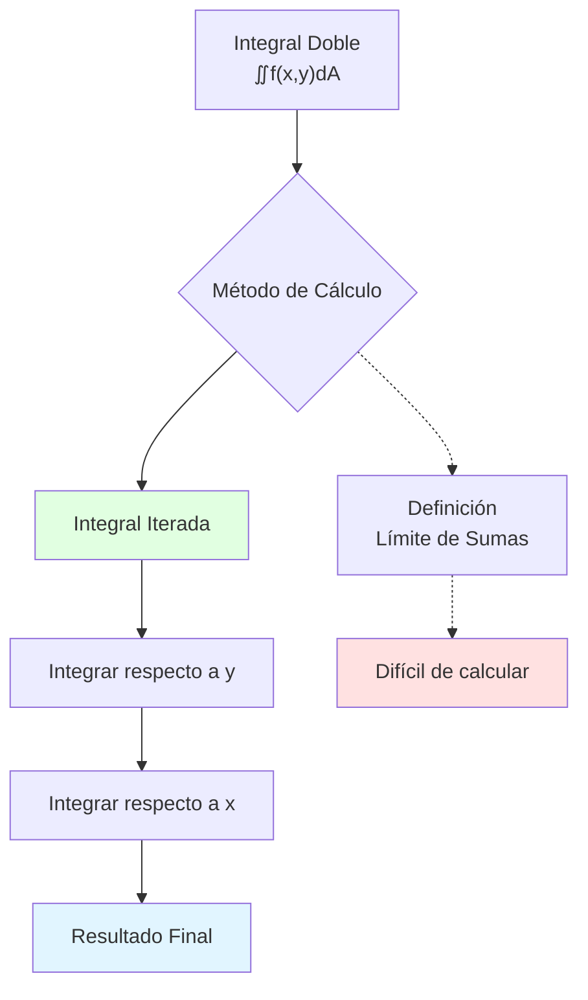
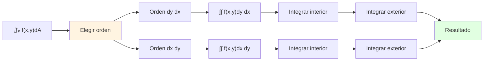

# 🔢 Integrales Iteradas en Integrales Dobles

## 🎯 Introducción

> [!info]- 💡 ¿Qué es una Integral Iterada? Una **integral iterada** es el proceso de calcular una integral múltiple evaluándola como una secuencia de integrales simples, una dentro de otra. Es la herramienta fundamental para calcular integrales dobles y triples en la práctica.
> 
> **Analogía práctica:** Imagina que necesitas contar personas en un estadio rectangular:
> 
> - **Método directo (integral doble):** Contar todas las personas simultáneamente
> - **Método iterado:**
>     1. Contar personas en cada fila (primera integral)
>     2. Sumar los totales de todas las filas (segunda integral)
> 
> **¿Por qué es importante?**
> 
> |Aspecto|Descripción|Ejemplo de Uso|
> |---|---|---|
> |**Cálculo práctico**|Reduce integrales múltiples a simples|Volúmenes, áreas|
> |**Teorema de Fubini**|Justificación matemática|Condiciones de aplicación|
> |**Geometría**|Calcular áreas y volúmenes|Sólidos bajo superficies|
> |**Física**|Masa, centro de masa, momentos|Distribuciones continuas|
> |**Probabilidad**|Funciones de densidad conjunta|Variables aleatorias múltiples|



---

## 📐 Fundamentos de Integrales Dobles

### 🔷 Definición Geométrica

> [!note]- 📊 Concepto de Integral Doble
> 
> La **integral doble** de una función $f(x,y)$ sobre una región $R$ se denota:
> 
> $$\iint_R f(x,y) , dA$$
> 
> donde $dA$ representa el elemento de área infinitesimal.
> 
> **Interpretación geométrica:**
> 
> |Si $f(x,y)$|La integral representa|
> |---|---|
> |$f(x,y) \geq 0$|**Volumen** bajo la superficie $z=f(x,y)$ sobre la región $R$|
> |$f(x,y)$ general|Volumen algebraico (positivo - negativo)|
> |$f(x,y) = 1$|**Área** de la región $R$|
> |$f(x,y) = \rho(x,y)$|**Masa** total si $\rho$ es densidad|
> 
> **Visualización:**
> 
> ```mermaid
> graph TD
>     A[Superficie z = f(x,y)] --> B[Región R en el plano xy]
>     B --> C[Dividir en rectángulos pequeños]
>     C --> D[Altura: f(xᵢ,yⱼ)]
>     D --> E[Volumen parcial: f(xᵢ,yⱼ)·ΔA]
>     E --> F[Suma de Riemann]
>     F --> G[Límite cuando ΔA→0]
>     G --> H[∬f(x,y)dA]
>     
>     style A fill:#e1f5ff
>     style H fill:#e1ffe1
> ```
> 
> **Definición formal (Suma de Riemann):**
> 
> $$\iint_R f(x,y) , dA = \lim_{\substack{\Delta x \to 0 \ \Delta y \to 0}} \sum_{i=1}^{m} \sum_{j=1}^{n} f(x_i^_, y_j^_) \Delta x \Delta y$$

### 🎨 Elementos de Área

> [!success]- 📏 Notaciones para el Elemento de Área
> 
> El elemento de área $dA$ puede escribirse de varias formas:
> 
> |Notación|Significado|Uso|
> |---|---|---|
> |$dA$|Elemento de área genérico|Notación compacta|
> |$dx , dy$|Orden: primero $y$, luego $x$|Coordenadas rectangulares|
> |$dy , dx$|Orden: primero $x$, luego $y$|Coordenadas rectangulares|
> |$r , dr , d\theta$|Coordenadas polares|Regiones circulares|
> 
> **Relación fundamental:**
> 
> $$dA = dx , dy = dy , dx$$
> 
> **Visualización del elemento:**
> 
> ```
>     y
>     ↑
>     |  dy
>     |  ┌─────┐
>     |  │  dA │
>     |  └─────┘
>     |    dx
>     └────────→ x
> ```

---

## 🔄 Teorema de Fubini

### 📜 Enunciado del Teorema

> [!important]- 🎓 Teorema de Fubini
> 
> **Enunciado:**
> 
> Si $f(x,y)$ es continua en una región rectangular $R = [a,b] \times [c,d]$, entonces:
> 
> $$\iint_R f(x,y) , dA = \int_a^b \int_c^d f(x,y) , dy , dx = \int_c^d \int_a^b f(x,y) , dx , dy$$
> 
> **En palabras:** La integral doble puede calcularse como una integral iterada en cualquier orden.
> 
> **Condiciones necesarias:**
> 
> |Condición|Importancia|
> |---|---|
> |$f$ continua en $R$|Garantiza existencia de la integral|
> |$R$ es medible|La región tiene área bien definida|
> |Integral iterada existe|Cada integral simple converge|
> 
> **Casos especiales:**
> 
> ```mermaid
> graph TB
>     A[Teorema de Fubini] --> B[Región Rectangular]
>     A --> C[Región Tipo I]
>     A --> D[Región Tipo II]
>     
>     B --> E[Límites constantes<br/>ambas integrales]
>     C --> F[Límites de y<br/>dependen de x]
>     D --> G[Límites de x<br/>dependen de y]
>     
>     style B fill:#e1ffe1
>     style C fill:#fff4e1
>     style D fill:#e1f5ff
> ```

### 🔍 Interpretación Geométrica

> [!example]- 🎨 Visualización del Teorema
> 
> **Método 1: Integrar primero en $y$**
> 
> $$\int_a^b \left[ \int_c^d f(x,y) , dy \right] dx$$
> 
> **Interpretación:**
> 
> 1. Para cada $x$ fijo, $\int_c^d f(x,y) , dy$ calcula el área de una "rebanada" perpendicular al eje $x$
> 2. Luego integramos estas áreas de $x=a$ hasta $x=b$
> 
> ```
>     z                           z
>     ↑                           ↑
>     |  Superficie              |  Rebanada en x₀
>     |  z=f(x,y)                |     ↓
>     |                          |   ┌─────┐
>     └────→ y                   |   │/////│
>          ↗                     |   └─────┘
>         x                      └────→ y
> ```
> 
> **Método 2: Integrar primero en $x$**
> 
> $$\int_c^d \left[ \int_a^b f(x,y) , dx \right] dy$$
> 
> **Interpretación:**
> 
> 1. Para cada $y$ fijo, $\int_a^b f(x,y) , dx$ calcula el área de una "rebanada" perpendicular al eje $y$
> 2. Luego integramos estas áreas de $y=c$ hasta $y=d$

---

## 📦 Regiones Rectangulares

### 🟦 Caso Más Simple

> [!success]- ✨ Integrales sobre Rectángulos
> 
> Para una región rectangular $R = [a,b] \times [c,d]$:
> 
> $$\iint_R f(x,y) , dA = \int_a^b \int_c^d f(x,y) , dy , dx$$
> 
> **Características:**
> 
> |Propiedad|Descripción|
> |---|---|
> |**Límites constantes**|Todos los límites son números fijos|
> |**Orden intercambiable**|Podemos integrar en cualquier orden|
> |**Cálculo directo**|No hay dependencias entre variables|
> 
> **Región rectangular:**
> 
> ```
>     y
>     ↑
>   d |  ┌─────────────┐
>     |  │             │
>     |  │      R      │
>     |  │             │
>   c |  └─────────────┘
>     └──┴─────────────┴──→ x
>        a             b
> ```

### 🧮 Ejemplos Resueltos

> [!example]- 📝 Cálculos en Rectángulos
> 
> **Ejemplo 1: Función simple**
> 
> Calcular $\displaystyle \iint_R xy , dA$ donde $R = [0,2] \times [0,3]$
> 
> **Solución (orden $dy , dx$):**
> 
> $$\int_0^2 \int_0^3 xy , dy , dx$$
> 
> **Paso 1:** Integrar respecto a $y$ (tratando $x$ como constante)
> 
> $$\int_0^3 xy , dy = x \int_0^3 y , dy = x \left[ \frac{y^2}{2} \right]_0^3 = x \cdot \frac{9}{2} = \frac{9x}{2}$$
> 
> **Paso 2:** Integrar respecto a $x$
> 
> $$\int_0^2 \frac{9x}{2} , dx = \frac{9}{2} \int_0^2 x , dx = \frac{9}{2} \left[ \frac{x^2}{2} \right]_0^2 = \frac{9}{2} \cdot 2 = 9$$
> 
> **Verificación (orden $dx , dy$):**
> 
> $$\int_0^3 \int_0^2 xy , dx , dy = \int_0^3 \left[ \frac{x^2y}{2} \right]_0^2 dy = \int_0^3 2y , dy = \left[ y^2 \right]_0^3 = 9$$ ✓
> 
> ---
> 
> **Ejemplo 2: Función exponencial**
> 
> Calcular $\displaystyle \iint_R e^{x+y} , dA$ donde $R = [0,1] \times [0,1]$
> 
> **Solución:**
> 
> $$\int_0^1 \int_0^1 e^{x+y} , dy , dx = \int_0^1 \int_0^1 e^x \cdot e^y , dy , dx$$
> 
> **Paso 1:** Integrar respecto a $y$
> 
> $$\int_0^1 e^x \cdot e^y , dy = e^x \left[ e^y \right]_0^1 = e^x(e - 1)$$
> 
> **Paso 2:** Integrar respecto a $x$
> 
> $$\int_0^1 e^x(e-1) , dx = (e-1) \left[ e^x \right]_0^1 = (e-1)(e-1) = (e-1)^2$$
> 
> ---
> 
> **Ejemplo 3: Área de un rectángulo**
> 
> Verificar que $\displaystyle \iint_R 1 , dA = (b-a)(d-c)$
> 
> $$\int_a^b \int_c^d 1 , dy , dx = \int_a^b [y]_c^d , dx = \int_a^b (d-c) , dx = (d-c)[x]_a^b = (b-a)(d-c)$$ ✓



---

## 🎭 Regiones Tipo I

### 📊 Definición y Características

> [!note]- 📐 Región Tipo I
> 
> Una región $R$ es de **Tipo I** si puede describirse como:
> 
> $$R = {(x,y) : a \leq x \leq b, , g_1(x) \leq y \leq g_2(x)}$$
> 
> **Características:**
> 
> |Aspecto|Descripción|
> |---|---|
> |**Variable exterior**|$x$ (límites constantes)|
> |**Variable interior**|$y$ (límites dependen de $x$)|
> |**Visualización**|La región está entre dos curvas $y = g_1(x)$ y $y = g_2(x)$|
> |**Cortes verticales**|Líneas verticales intersectan la región en un intervalo|
> 
> **Fórmula de la integral iterada:**
> 
> $$\iint_R f(x,y) , dA = \int_a^b \int_{g_1(x)}^{g_2(x)} f(x,y) , dy , dx$$
> 
> **Representación gráfica:**
> 
> ```
>     y
>     ↑
>     |     y = g₂(x)
>     |    ╱‾‾‾‾‾‾╲
>     |   │   R    │
>     |    ╲______╱
>     |     y = g₁(x)
>     └──┴────────┴──→ x
>        a        b
> 
>     Cortes verticales (x fijo):
>     cada línea vertical
>     va de g₁(x) hasta g₂(x)
> ```

### 🔢 Ejemplos Tipo I

> [!example]- 🎯 Cálculos en Regiones Tipo I
> 
> **Ejemplo 1: Región triangular**
> 
> Calcular $\displaystyle \iint_R xy , dA$ donde $R$ es el triángulo con vértices $(0,0)$, $(1,0)$, $(1,1)$
> 
> **Paso 1: Describir la región**
> 
> ```
>     y
>     ↑
>   1 |      ●(1,1)
>     |     ╱│
>     |    ╱ │
>     |   ╱  │
>     |  ╱   │
>   0 |●────●───→ x
>     0     1
> ```
> 
> - Límites de $x$: $0 \leq x \leq 1$
> - Para $x$ fijo: $0 \leq y \leq x$ (debajo de la recta $y=x$)
> 
> **Región Tipo I:**
> 
> $$R = {(x,y) : 0 \leq x \leq 1, , 0 \leq y \leq x}$$
> 
> **Paso 2: Plantear la integral**
> 
> $$\iint_R xy , dA = \int_0^1 \int_0^x xy , dy , dx$$
> 
> **Paso 3: Integrar respecto a $y$**
> 
> $$\int_0^x xy , dy = x \int_0^x y , dy = x \left[ \frac{y^2}{2} \right]_0^x = x \cdot \frac{x^2}{2} = \frac{x^3}{2}$$
> 
> **Paso 4: Integrar respecto a $x$**
> 
> $$\int_0^1 \frac{x^3}{2} , dx = \frac{1}{2} \left[ \frac{x^4}{4} \right]_0^1 = \frac{1}{8}$$
> 
> ---
> 
> **Ejemplo 2: Región parabólica**
> 
> Calcular $\displaystyle \iint_R y , dA$ donde $R$ está acotada por $y=x^2$ y $y=2x$
> 
> **Paso 1: Encontrar intersecciones**
> 
> $$x^2 = 2x \quad \Rightarrow \quad x^2 - 2x = 0 \quad \Rightarrow \quad x(x-2) = 0$$
> 
> Puntos: $(0,0)$ y $(2,4)$
> 
> ```
>     y
>     ↑
>   4 |        y=2x
>     |       ╱●
>     |      ╱ │╲
>     |     ╱  │ ╲ y=x²
>     |    ╱   │  ╲
>     |   ╱ R  │   ╲
>   0 | ●─────┴────╲──→ x
>     0           2
> ```
> 
> **Paso 2: Describir como Tipo I**
> 
> - $0 \leq x \leq 2$
> - $x^2 \leq y \leq 2x$
> 
> **Paso 3: Calcular**
> 
> $$\int_0^2 \int_{x^2}^{2x} y , dy , dx = \int_0^2 \left[ \frac{y^2}{2} \right]_{x^2}^{2x} dx$$
> 
> $$= \int_0^2 \left( \frac{(2x)^2}{2} - \frac{(x^2)^2}{2} \right) dx = \int_0^2 \left( 2x^2 - \frac{x^4}{2} \right) dx$$
> 
> $$= \left[ \frac{2x^3}{3} - \frac{x^5}{10} \right]_0^2 = \frac{16}{3} - \frac{32}{10} = \frac{160-96}{30} = \frac{64}{30} = \frac{32}{15}$$

---

## 🎪 Regiones Tipo II

### 📊 Definición y Características

> [!note]- 📐 Región Tipo II
> 
> Una región $R$ es de **Tipo II** si puede describirse como:
> 
> $$R = {(x,y) : c \leq y \leq d, , h_1(y) \leq x \leq h_2(y)}$$
> 
> **Características:**
> 
> |Aspecto|Descripción|
> |---|---|
> |**Variable exterior**|$y$ (límites constantes)|
> |**Variable interior**|$x$ (límites dependen de $y$)|
> |**Visualización**|La región está entre dos curvas $x = h_1(y)$ y $x = h_2(y)$|
> |**Cortes horizontales**|Líneas horizontales intersectan la región en un intervalo|
> 
> **Fórmula de la integral iterada:**
> 
> $$\iint_R f(x,y) , dA = \int_c^d \int_{h_1(y)}^{h_2(y)} f(x,y) , dx , dy$$
> 
> **Representación gráfica:**
> 
> ```
>     y
>     ↑
>   d |  ┌────────────┐
>     |  │            │
>     |  │     R      │
>     |  │            │
>   c |  └────────────┘
>     └──┴────────────┴──→ x
>      h₁(y)        h₂(y)
> 
>     Cortes horizontales (y fijo):
>     cada línea horizontal
>     va de h₁(y) hasta h₂(y)
> ```

### 🔢 Ejemplos Tipo II

> [!example]- 🎯 Cálculos en Regiones Tipo II
> 
> **Ejemplo 1: La misma región triangular del Ejemplo 1 anterior**
> 
> Triángulo con vértices $(0,0)$, $(1,0)$, $(1,1)$
> 
> **Como Tipo II:**
> 
> ```
>     y
>     ↑
>   1 |      ●
>     |      │╲
>     |      │ ╲
>     |      │  ╲
>     |      │   ╲
>   0 |●────────●──→ x
>     0          1
> ```
> 
> - Límites de $y$: $0 \leq y \leq 1$
> - Para $y$ fijo: $y \leq x \leq 1$ (desde la recta $x=y$ hasta $x=1$)
> 
> **Región Tipo II:**
> 
> $$R = {(x,y) : 0 \leq y \leq 1, , y \leq x \leq 1}$$
> 
> **Integral:**
> 
> $$\iint_R xy , dA = \int_0^1 \int_y^1 xy , dx , dy$$
> 
> **Integrar respecto a $x$:**
> 
> $$\int_y^1 xy , dx = y \int_y^1 x , dx = y \left[ \frac{x^2}{2} \right]_y^1 = y \left( \frac{1}{2} - \frac{y^2}{2} \right) = \frac{y - y^3}{2}$$
> 
> **Integrar respecto a $y$:**
> 
> $$\int_0^1 \frac{y - y^3}{2} , dy = \frac{1}{2} \left[ \frac{y^2}{2} - \frac{y^4}{4} \right]_0^1 = \frac{1}{2} \left( \frac{1}{2} - \frac{1}{4} \right) = \frac{1}{8}$$ ✓
> 
> ---
> 
> **Ejemplo 2: Región entre parábola y recta**
> 
> Calcular $\displaystyle \iint_R x , dA$ donde $R$ está acotada por $x=y^2$ y $x=4$
> 
> ```
>     y
>     ↑
>   2 |    x=4
>     |     │
>     |     │╲
>     |     │ ╲ x=y²
>     |     │  R
>   0 |─────┼───────→ x
>     |     │  ╱
>     |     │╱
>  -2 |     │
>     0     4
> ```
> 
> **Como Tipo II:**
> 
> - Límites de $y$: $-2 \leq y \leq 2$ (de $y^2=4$)
> - Para $y$ fijo: $y^2 \leq x \leq 4$
> 
> **Integral:**
> 
> $$\int_{-2}^{2} \int_{y^2}^{4} x , dx , dy$$
> 
> **Integrar respecto a $x$:**
> 
> $$\int_{y^2}^{4} x , dx = \left[ \frac{x^2}{2} \right]_{y^2}^{4} = \frac{16}{2} - \frac{y^4}{2} = 8 - \frac{y^4}{2}$$
> 
> **Integrar respecto a $y$:**
> 
> $$\int_{-2}^{2} \left( 8 - \frac{y^4}{2} \right) dy = \left[ 8y - \frac{y^5}{10} \right]_{-2}^{2}$$
> 
> $$= \left( 16 - \frac{32}{10} \right) - \left( -16 + \frac{32}{10} \right) = 32 - \frac{64}{10} = \frac{256}{10} = \frac{128}{5}$$

---

## 🔄 Cambio de Orden de Integración

### 🎯 ¿Cuándo y Por Qué Cambiar?

> [!tip]- 🔀 Motivación para Cambiar el Orden
> 
> **Razones para cambiar el orden:**
> 
> |Razón|Ejemplo|
> |---|---|
> |**Integral interior no elemental**|$\displaystyle \int e^{x^2} dx$ no tiene forma cerrada|
> |**Simplificación**|Un orden puede ser mucho más fácil|
> |**Límites complicados**|Un orden tiene límites más simples|
> |**Estrategia de resolución**|A veces un orden sugiere sustituciones|
> 
> **Proceso de cambio:**
> 
> ```mermaid
> flowchart TD
>     A[Integral dada<br/>en un orden] --> B[Identificar región R]
>     B --> C[Graficar región]
>     C --> D[Encontrar límites<br/>en otro orden]
>     D --> E[Reescribir integral]
>     E --> F[Evaluar]
>     
>     style C fill:#fff4e1
>     style E fill:#e1ffe1
> ```

### 📝 Metodología Paso a Paso

> [!example]- 🔧 Proceso Completo de Cambio
> 
> **Ejemplo: Cambiar orden de integración**
> 
> Dada: $\displaystyle \int_0^1 \int_x^1 f(x,y) , dy , dx$
> 
> **Paso 1: Identificar la región**
> 
> Límites actuales:
> 
> - $0 \leq x \leq 1$
> - $x \leq y \leq 1$ (para cada $x$)
> 
> **Paso 2: Graficar la región**
> 
> ```
>     y
>     ↑
>   1 |●─────●
>     |│╲    │
>     | │ ╲  │
>     | │  ╲ │
>     | │  R╲│
>   0 |●─────●──→ x
>     0     1
> ```
> 
> La región es el triángulo sobre la diagonal.
> 
> **Paso 3: Encontrar nuevos límites**
> 
> Para Tipo II (integrar primero en $x$):
> 
> - $0 \leq y \leq 1$
> - Para $y$ fijo: $0 \leq x \leq y$
> 
> **Paso 4: Reescribir**
> 
> $$\int_0^1 \int_0^y f(x,y) , dx , dy$$
> 
> ---
> 
> **Ejemplo numérico completo:**
> 
> Evaluar: $\displaystyle \int_0^1 \int_x^1 e^{y^2} , dy , dx$
> 
> **Problema:** $\displaystyle \int e^{y^2} dy$ no tiene antiderivada elemental ❌
> 
> **Solución: Cambiar orden**
> 
> Región: $0 \leq x \leq 1$, $x \leq y \leq 1$
> 
> Nuevo orden: $\displaystyle \int_0^1 \int_0^y e^{y^2} , dx , dy$
> 
> **Ahora podemos calcular:**
> 
> $$\int_0^1 \int_0^y e^{y^2} , dx , dy = \int_0^1 e^{y^2} [x]_0^y , dy = \int_0^1y e^{y^2} , dy$$
> **Esta integral SÍ se puede calcular:**
> 
> Sustitución: $u = y^2$, $du = 2y , dy$
> 
> $$\int_0^1 y e^{y^2} , dy = \frac{1}{2} \int_0^1 e^u , du = \frac{1}{2} [e^u]_0^1 = \frac{e-1}{2}$$ ✓

---

## 🎨 Casos Especiales y Técnicas

### 🔷 Funciones Separables

> [!success]- ✨ Cuando $f(x,y) = g(x) \cdot h(y)$
> 
> Si la función es **separable**, la integral se factoriza:
> 
> $$\iint_R g(x) h(y) , dA = \left( \int_a^b g(x) , dx \right) \left( \int_c^d h(y) , dy \right)$$
> 
> **Condición:** La región debe ser rectangular.
> 
> **Ventaja:** Reduce una integral doble a producto de dos integrales simples.
> 
> **Ejemplo:**
> 
> $$\int_0^1 \int_0^2 x^2 e^y , dy , dx = \left( \int_0^1 x^2 , dx \right) \left( \int_0^2 e^y , dy \right)$$
> 
> $$= \left[ \frac{x^3}{3} \right]_0^1 \cdot \left[ e^y \right]_0^2 = \frac{1}{3} \cdot (e^2 - 1) = \frac{e^2-1}{3}$$

### 🎪 Simetría

> [!tip]- 🔄 Aprovechar la Simetría de la Región
> 
> **Tipos de simetría:**
> 
> |Tipo|Condición|Consecuencia|
> |---|---|---|
> |**Par en $x$**|$f(-x,y) = f(x,y)$ y región simétrica|$\displaystyle \int_{-a}^{a} = 2\int_0^a$|
> |**Impar en $x$**|$f(-x,y) = -f(x,y)$ y región simétrica|$\displaystyle \int_{-a}^{a} = 0$|
> |**Rotacional**|Región circular|Usar coordenadas polares|
> 
> **Ejemplo:**
> 
> $$\iint_R x^3 y , dA$$
> 
> donde $R = [-1,1] \times [-1,1]$
> 
> Como $x^3$ es impar y la región es simétrica respecto al eje $y$:
> 
> $$\iint_R x^3 y , dA = 0$$

---

## 📊 Aplicaciones Geométricas

### 📏 Área de una Región

> [!note]- 📐 Cálculo de Áreas
> 
> El **área** de una región $R$ es:
> 
> $$A(R) = \iint_R 1 , dA$$
> 
> **Ejemplos:**
> 
> **1. Área de un círculo de radio $r$:**
> 
> $$A = \int_{-r}^{r} \int_{-\sqrt{r^2-x^2}}^{\sqrt{r^2-x^2}} 1 , dy , dx = \pi r^2$$
> 
> **2. Área entre curvas:**
> 
> Región entre $y = x^2$ y $y = x$ en $[0,1]$:
> 
> $$A = \int_0^1 \int_{x^2}^{x} 1 , dy , dx = \int_0^1 (x - x^2) , dx = \left[ \frac{x^2}{2} - \frac{x^3}{3} \right]_0^1 = \frac{1}{6}$$

### 📦 Volumen bajo una Superficie

> [!example]- 🏔️ Cálculo de Volúmenes
> 
> El **volumen** bajo $z = f(x,y) \geq 0$ sobre región $R$ es:
> 
> $$V = \iint_R f(x,y) , dA$$
> 
> **Ejemplo: Volumen bajo un paraboloide**
> 
> Calcular el volumen bajo $z = 4 - x^2 - y^2$ sobre el cuadrado $[0,1] \times [0,1]$
> 
> $$V = \int_0^1 \int_0^1 (4 - x^2 - y^2) , dy , dx$$
> 
> **Integrar respecto a $y$:**
> 
> $$\int_0^1 (4 - x^2 - y^2) , dy = \left[ 4y - x^2 y - \frac{y^3}{3} \right]_0^1 = 4 - x^2 - \frac{1}{3}$$
> 
> **Integrar respecto a $x$:**
> 
> $$\int_0^1 \left( 4 - x^2 - \frac{1}{3} \right) dx = \int_0^1 \left( \frac{11}{3} - x^2 \right) dx$$
> 
> $$= \left[ \frac{11x}{3} - \frac{x^3}{3} \right]_0^1 = \frac{11}{3} - \frac{1}{3} = \frac{10}{3}$$

---

## 🎓 Estrategias de Resolución

> [!tip]- 🧩 Guía para Resolver Integrales Dobles
> 
> **Checklist de decisiones:**
> 
> ```mermaid
> flowchart TD
>     A[Integral doble dada] --> B{¿Región<br/>rectangular?}
>     B -->|Sí| C[Límites constantes<br/>Cualquier orden]
>     B -->|No| D{¿Qué tipo<br/>de región?}
>     
>     D --> E[Tipo I:<br/>límites de y<br/>dependen de x]
>     D --> F[Tipo II:<br/>límites de x<br/>dependen de y]
>     
>     E --> G{¿Integral<br/>factible?}
>     F --> H{¿Integral<br/>factible?}
>     
>     G -->|No| I[Cambiar a Tipo II]
>     H -->|No| J[Cambiar a Tipo I]
>     
>     G -->|Sí| K[Calcular]
>     H -->|Sí| K
>     I --> K
>     J --> K
>     
>     style C fill:#e1ffe1
>     style K fill:#e1f5ff
> ```
> 
> **Pasos sistemáticos:**
> 
> 1. **Identificar región:** Graficar o describir $R$
> 2. **Elegir orden:** Considerar facilidad de integración
> 3. **Establecer límites:** Cuidado con dependencias
> 4. **Integrar interior:** Tratar otras variables como constantes
> 5. **Integrar exterior:** Obtener resultado final
> 6. **Verificar:** Unidades, signos, simetrías

---

## 📚 Tabla Resumen Completa

> [!quote]- 📋 Guía Rápida de Integrales Iteradas
> 
> |Concepto|Tipo I|Tipo II|Rectangular|
> |---|---|---|---|
> |**Orden**|$dy , dx$|$dx , dy$|Ambos|
> |**Límites externos**|$a \leq x \leq b$|$c \leq y \leq d$|Ambos constantes|
> |**Límites internos**|$g_1(x) \leq y \leq g_2(x)$|$h_1(y) \leq x \leq h_2(y)$|Constantes|
> |**Cortes**|Verticales|Horizontales|Ambos|
> |**Integral**|$\displaystyle \int_a^b \int_{g_1(x)}^{g_2(x)} f , dy , dx$|$\displaystyle \int_c^d \int_{h_1(y)}^{h_2(y)} f , dx , dy$|$\displaystyle \int_a^b \int_c^d f , dy , dx$|
> 
> **Funciones comunes y sus antiderivadas:**
> 
> |Función|Antiderivada respecto a $x$|Antiderivada respecto a $y$|
> |---|---|---|
> |$xy$|$\frac{x^2 y}{2}$|$\frac{x y^2}{2}$|
> |$x^2 + y^2$|$\frac{x^3}{3} + xy^2$|$x^2 y + \frac{y^3}{3}$|
> |$e^{x+y}$|$e^{x+y}$|$e^{x+y}$|
> |$\sin(x)\cos(y)$|$-\cos(x)\cos(y)$|$\sin(x)\sin(y)$|

---

## 🎓 Ejercicios Progresivos

> [!example]- 💪 Práctica Guiada
> 
> **Nivel Básico:**
> 
> **1. Integral en rectángulo**
> 
> Evaluar: $\displaystyle \int_0^2 \int_0^3 (x + 2y) , dy , dx$
> 
> **Solución:**
> 
> $$\int_0^2 \left[ xy + y^2 \right]_0^3 dx = \int_0^2 (3x + 9) , dx = \left[ \frac{3x^2}{2} + 9x \right]_0^2 = 6 + 18 = 24$$
> 
> ---
> 
> **2. Área de triángulo**
> 
> Calcular el área de la región acotada por $y=0$, $x=0$, $y=2-x$
> 
> **Solución:**
> 
> $$A = \int_0^2 \int_0^{2-x} 1 , dy , dx = \int_0^2 (2-x) , dx = \left[ 2x - \frac{x^2}{2} \right]_0^2 = 4 - 2 = 2$$
> 
> ---
> 
> **Nivel Intermedio:**
> 
> **3. Cambio de orden**
> 
> Cambiar el orden: $\displaystyle \int_0^4 \int_{\sqrt{x}}^{2} f(x,y) , dy , dx$
> 
> **Solución:**
> 
> Región: $0 \leq x \leq 4$, $\sqrt{x} \leq y \leq 2$
> 
> De $y = \sqrt{x}$ tenemos $x = y^2$
> 
> Nuevo orden: $\displaystyle \int_0^2 \int_0^{y^2} f(x,y) , dx , dy$
> 
> ---
> 
> **4. Volumen bajo paraboloide**
> 
> Hallar el volumen bajo $z = 9 - x^2 - y^2$ sobre $R = [-1,1] \times [-1,1]$
> 
> **Solución:**
> 
> Por simetría y separabilidad:
> 
> $$V = \int_{-1}^{1} \int_{-1}^{1} (9 - x^2 - y^2) , dy , dx$$
> 
> $$= \int_{-1}^{1} (9 - x^2) \cdot 2 , dx + \int_{-1}^{1} \left( -\int_{-1}^{1} y^2 , dy \right) dx$$
> 
> $$= 2\left[ 9x - \frac{x^3}{3} \right]_{-1}^{1} - 2\left[ \frac{y^3}{3} \right]_{-1}^{1} \cdot 2$$
> 
> $$= 2\left( 18 - \frac{2}{3} \right) - 2 \cdot \frac{2}{3} \cdot 2 = \frac{100}{3} - \frac{8}{3} = \frac{92}{3}$$
> 
> ---
> 
> **Nivel Avanzado:**
> 
> **5. Integral con cambio obligatorio**
> 
> Evaluar: $\displaystyle \int_0^1 \int_y^1 \sin(x^2) , dx , dy$
> 
> **Solución:**
> 
> La integral $\int \sin(x^2) dx$ no es elemental.
> 
> Cambiar orden: $\displaystyle \int_0^1 \int_0^x \sin(x^2) , dy , dx$
> 
> $$= \int_0^1 \sin(x^2) \cdot x , dx$$
> 
> Sustitución $u = x^2$, $du = 2x , dx$:
> 
> $$= \frac{1}{2} \int_0^1 \sin(u) , du = \frac{1}{2} [-\cos(u)]_0^1 = \frac{1 - \cos(1)}{2}$$

---

## 🔗 Conexión con Próximos Temas

> [!quote]- 🌟 Continuando el Aprendizaje
> 
> **Has dominado:**
> 
> ```mermaid
> mindmap
>   root((Integrales<br/>Iteradas))
>     Fundamentos
>       Teorema de Fubini
>       Orden de integración
>       Elementos de área
>     Regiones
>       Tipo I
>       Tipo II
>       Rectangulares
>     Técnicas
>       Cambio de orden
>       Separabilidad
>       Simetría
>     Aplicaciones
>       Áreas
>       Volúmenes
>       Física
> ```
> 
> **Próximos pasos:**
> 
> |Nivel|Tema|Por qué es el siguiente paso|
> |---|---|---|
> |**Actual**|Integrales iteradas|Base de cálculo múltiple|
> |**Siguiente**|Coordenadas polares|Simplificar regiones circulares|
> |**Avanzado**|Integrales triples|Extensión a 3D|
> |**Transformaciones**|Jacobiano|Cambios generales de variable|
> |**Aplicaciones**|Centro de masa, momentos|Física y geometría|
> |**Teoremas**|Green, divergencia|Conectar integrales múltiples|
> 
> **Roadmap de evolución:**
> 
> ```mermaid
> graph LR
>     A[Integrales Iteradas] --> B[Coordenadas Polares]
>     B --> C[Integrales Triples]
>     C --> D[Cambios de Variable<br/>Jacobiano]
>     D --> E[Integrales de Línea]
>     E --> F[Teorema de Green]
>     
>     A -.-> G[Aplicaciones Físicas]
>     G -.-> H[Centro de Masa]
>     H -.-> I[Momentos de Inercia]
>     
>     style A fill:#e1ffe1
>     style B fill:#fff4e1
>     style D fill:#e1f5ff
> ```

---

**Tags:** #calculo-vectorial #integrales-dobles #integrales-iteradas #fubini #regiones-tipo-I #regiones-tipo-II #volumen #area #cambio-de-orden #mermaid #matematicas