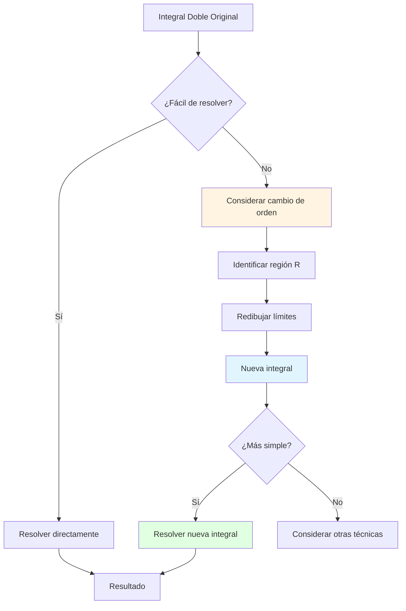

# 🔄 Cambio de Orden de Integración

## 🎯 Introducción

> [!info]- 💡 ¿Qué es el Cambio de Orden? El **cambio de orden de integración** es una técnica fundamental que consiste en reescribir una integral iterada intercambiando el orden en que se integran las variables. Esta habilidad es esencial para resolver integrales que de otra manera serían imposibles o extremadamente difíciles.
> 
> **Analogía práctica:** Imagina que estás contando personas en un estadio. Puedes:
> 
> - **Método 1:** Contar fila por fila (de izquierda a derecha en cada fila, luego pasar a la siguiente)
> - **Método 2:** Contar columna por columna (de arriba a abajo en cada columna)
> 
> Ambos métodos dan el mismo total, pero uno puede ser más conveniente que el otro dependiendo de cómo estén distribuidas las personas.
> 
> **¿Por qué es crucial?**
> 
> |Situación|Problema|Solución con cambio|
> |---|---|---|
> |**Integral imposible**|$\int e^{y^2} dy$ no tiene forma cerrada|Cambiar orden puede eliminar el problema|
> |**Límites complejos**|Múltiples subdivisiones en un orden|Una sola región en el otro|
> |**Cálculo tedioso**|Integrales muy largas|Orden alternativo más simple|
> |**Función difícil**|Integración problemática primero|Integrar la parte fácil primero|



---

## 📐 Fundamentos Teóricos

### 🔷 Teorema de Fubini

> [!note]- 📜 Base Matemática del Cambio de Orden
> 
> **Enunciado del Teorema de Fubini:**
> 
> Si $f(x,y)$ es continua sobre una región rectangular $R = [a,b] \times [c,d]$, entonces:
> 
> $$\iint_R f(x,y),dA = \int_a^b \int_c^d f(x,y),dy,dx = \int_c^d \int_a^b f(x,y),dx,dy$$
> 
> **Versión extendida (regiones generales):**
> 
> Para regiones más generales donde $f$ es continua:
> 
> - **Tipo I → Tipo II** (y viceversa) es válido
> - Las integrales iteradas son iguales si la región se describe correctamente en ambos casos
> 
> **Condiciones necesarias:**
> 
> |Condición|Importancia|Qué pasa si falla|
> |---|---|---|
> |**Continuidad de $f$**|Esencial|Teorema no aplica|
> |**Descripción correcta de $R$**|Crucial|Resultados diferentes|
> |**Límites bien definidos**|Necesario|Integral no existe|
> |**Integrabilidad**|Fundamental|No se puede calcular|
> 
> **Interpretación geométrica:**
> 
> ```mermaid
> graph LR
>     A[Volumen bajo superficie] --> B[Sumar capas verticales]
>     A --> C[Sumar capas horizontales]
>     
>     B --> D[∫∫ f dy dx]
>     C --> E[∫∫ f dx dy]
>     
>     D --> F[Mismo volumen]
>     E --> F
>     
>     style A fill:#e1f5ff
>     style F fill:#e1ffe1
> ```
> 
> **Ejemplo visual:**
> 
> Para calcular el volumen de un prisma rectangular:
> 
> - **Método 1:** Sumar "rebanadas" perpendiculares al eje $x$
> - **Método 2:** Sumar "rebanadas" perpendiculares al eje $y$
> 
> Ambos métodos calculan el mismo volumen, solo cambia el orden de acumulación.

### ⚠️ Errores Comunes

> [!warning]- 🚨 Trampas al Cambiar de Orden
> 
> **Error 1: No redibujar la región**
> 
> ```
> ❌ INCORRECTO:
> Dada: ∫₀¹ ∫₀^x f dy dx
> "Cambio": ∫₀¹ ∫₀^y f dx dy  (¡NO es la misma región!)
> 
> ✅ CORRECTO:
> Analizar región: 0 ≤ x ≤ 1, 0 ≤ y ≤ x
> Nueva descripción: 0 ≤ y ≤ 1, y ≤ x ≤ 1
> Correcto: ∫₀¹ ∫_y¹ f dx dy
> ```
> 
> **Error 2: Confundir límites variables**
> 
> |Orden original|¿Qué es variable?|Orden cambiado|
> |---|---|---|
> |$\int_a^b \int_{g(x)}^{h(x)} f,dy,dx$|$y$ depende de $x$|Expresar $x$ en términos de $y$|
> |$\int_c^d \int_{p(y)}^{q(y)} f,dx,dy$|$x$ depende de $y$|Expresar $y$ en términos de $x$|
> 
> **Error 3: Invertir límites incorrectamente**
> 
> ```
> ❌ INCORRECTO:
> Si 0 ≤ y ≤ x², entonces x² ≤ y ≤ 0 en el nuevo orden
> 
> ✅ CORRECTO:
> Si 0 ≤ y ≤ x², entonces x = √y (despejando correctamente)
> ```
> 
> **Error 4: Olvidar casos especiales**
> 
> Algunas regiones requieren **división en subregiones** en un orden pero no en el otro.
> 
> **Checklist de verificación:**
> 
> - [ ] ¿Grafiqué la región $R$?
> - [ ] ¿Identifiqué todos los límites correctamente?
> - [ ] ¿Despejé las funciones correctamente?
> - [ ] ¿Verifiqué las intersecciones?
> - [ ] ¿Los nuevos límites cubren la misma región?
> - [ ] ¿Probé con un punto de prueba?

---

## 🔧 Metodología Paso a Paso

### 📋 Algoritmo Sistemático

> [!tip]- 🎯 7 Pasos para Cambiar el Orden
> 
> **Proceso completo:**
> 
> ```mermaid
> flowchart TD
>     A[1: Integral original] --> B[2: Identificar límites]
>     B --> C[3: Determinar tipo actual]
>     C --> D[4: Graficar región R]
>     D --> E[5: Identificar nuevo tipo]
>     E --> F[6: Expresar nuevos límites]
>     F --> G[7: Escribir nueva integral]
>     
>     D --> H[Verificación visual]
>     H --> I{¿Correcta?}
>     I -->|No| D
>     I -->|Sí| F
>     
>     style D fill:#fff4e1
>     style G fill:#e1ffe1
> ```
> 
> **PASO 1: Extraer información de la integral original**
> 
> Dada: $\displaystyle\int_a^b \int_{g_1(x)}^{g_2(x)} f(x,y),dy,dx$
> 
> Identificar:
> 
> - Límites externos: $a \leq x \leq b$
> - Límites internos: $g_1(x) \leq y \leq g_2(x)$
> - Tipo actual: Tipo I (integración $dy,dx$)
> 
> **PASO 2: Describir la región algebraicamente**
> 
> $$R = {(x,y) : a \leq x \leq b, , g_1(x) \leq y \leq g_2(x)}$$
> 
> **PASO 3: Identificar las curvas frontera**
> 
> - Frontera inferior: $y = g_1(x)$
> - Frontera superior: $y = g_2(x)$
> - Límites laterales: $x = a$ y $x = b$
> 
> **PASO 4: GRAFICAR (crucial)**
> 
> |Elemento|Cómo graficarlo|
> |---|---|
> |Curvas $y = g_i(x)$|Tabla de valores o reconocer forma|
> |Rectas $x = a, b$|Líneas verticales|
> |Intersecciones|Resolver $g_1(x) = g_2(x)$|
> |Región $R$|Sombrear área entre curvas|
> 
> **PASO 5: Proyectar en el otro eje**
> 
> Para convertir a Tipo II:
> 
> - Proyectar región sobre el eje $y$
> - Determinar: $c \leq y \leq d$ (valores extremos de $y$ en $R$)
> 
> **PASO 6: Expresar límites en términos de la nueva variable**
> 
> Para cada $y$ fijo en $[c,d]$:
> 
> - ¿Dónde entra la línea horizontal $y = y_0$ a la región? → $x = h_1(y)$
> - ¿Dónde sale? → $x = h_2(y)$
> - Esto requiere **despejar** $x$ de las ecuaciones $y = g_i(x)$
> 
> **PASO 7: Escribir la nueva integral**
> 
> $$\int_c^d \int_{h_1(y)}^{h_2(y)} f(x,y),dx,dy$$
> 
> **VERIFICACIÓN:**
> 
> - Calcular área con ambas integrales: $\iint_R 1,dA$
> - Si coinciden ✅, el cambio es correcto

### 🎨 Ejemplo Detallado Completo

> [!example]- 📝 Cambio Paso a Paso
> 
> **Problema:** Cambiar el orden de integración en: $$\int_0^2 \int_{x^2}^{4} f(x,y),dy,dx$$
> 
> ---
> 
> **PASO 1: Identificar límites**
> 
> - **Límites externos:** $0 \leq x \leq 2$
> - **Límites internos:** $x^2 \leq y \leq 4$
> - **Tipo actual:** Tipo I (orden $dy,dx$)
> 
> **PASO 2: Descripción algebraica**
> 
> $$R = {(x,y) : 0 \leq x \leq 2, , x^2 \leq y \leq 4}$$
> 
> **PASO 3: Identificar curvas**
> 
> - **Frontera inferior:** $y = x^2$ (parábola)
> - **Frontera superior:** $y = 4$ (recta horizontal)
> - **Límite izquierdo:** $x = 0$ (eje $y$)
> - **Límite derecho:** $x = 2$ (recta vertical)
> 
> **PASO 4: GRAFICAR**
> 
> Puntos clave de $y = x^2$:
> 
> |$x$|$y = x^2$|Punto|
> |---|---|---|
> |$0$|$0$|$(0,0)$|
> |$1$|$1$|$(1,1)$|
> |$2$|$4$|$(2,4)$|
> 
> ```
> Región R (vista desde arriba):
> 
>   y
>   4 |--------●        ← y = 4 (frontera superior)
>     |       /|
>   3 |      / |
>     |     /  |
>   2 |    /   |
>     |   /    |
>   1 |  /     |
>     | /      |
>   0 |●-------+---→ x
>     0   1   2
>         ↑
>      y = x²
> ```
> 
> **PASO 5: Proyección en eje $y$**
> 
> Observando la gráfica:
> 
> - El valor mínimo de $y$ en $R$ es $0$ (en el punto $(0,0)$)
> - El valor máximo de $y$ en $R$ es $4$ (en la recta $y = 4$)
> - Por tanto: $0 \leq y \leq 4$
> 
> **PASO 6: Nuevos límites en términos de $y$**
> 
> Para un $y$ fijo en $[0,4]$, trazamos una línea horizontal:
> 
> **¿Dónde entra a $R$?**
> 
> - Por la parábola $y = x^2$
> - Despejando: $x^2 = y \Rightarrow x = \sqrt{y}$ (tomamos raíz positiva)
> - **Límite izquierdo:** $x = \sqrt{y}$
> 
> **¿Dónde sale de $R$?**
> 
> - Por la recta vertical $x = 2$
> - **Límite derecho:** $x = 2$
> 
> Pero **¡CUIDADO!** Debemos verificar:
> 
> Para $0 \leq y \leq 4$:
> 
> - Si $0 \leq y \leq 4$: la línea horizontal entra por $x = \sqrt{y}$ y sale por $x = 2$
> 
> **PASO 7: Nueva integral**
> 
> $$\int_0^4 \int_{\sqrt{y}}^{2} f(x,y),dx,dy$$
> 
> **VERIFICACIÓN:**
> 
> Calcular el área de $R$ con ambas formas:
> 
> ```
> Orden original (dy dx):
> A = ∫₀² ∫_{x²}⁴ 1 dy dx
>   = ∫₀² [y]_{x²}⁴ dx
>   = ∫₀² (4 - x²) dx
>   = [4x - x³/3]₀²
>   = 8 - 8/3 = 16/3
> 
> Orden nuevo (dx dy):
> A = ∫₀⁴ ∫_{√y}² 1 dx dy
>   = ∫₀⁴ [x]_{√y}² dy
>   = ∫₀⁴ (2 - √y) dy
>   = [2y - 2y^{3/2}/3]₀⁴
>   = 8 - 2(8)/3 = 8 - 16/3 = 16/3 ✓
> ```
> 
> ¡Las áreas coinciden! El cambio es correcto.

---

## 🔄 Casos Típicos

### 📊 Tipo I → Tipo II

> [!note]- ⬆️↔️ De Vertical a Horizontal
> 
> **Estructura general:**
> 
> $$\int_a^b \int_{g_1(x)}^{g_2(x)} f(x,y),dy,dx \quad \Rightarrow \quad \int_c^d \int_{h_1(y)}^{h_2(y)} f(x,y),dx,dy$$
> 
> **Proceso:**
> 
> |Paso|Acción|Resultado|
> |---|---|---|
> |1|Identificar rango de $y$|$c = \min(g_1(x))$, $d = \max(g_2(x))$|
> |2|Despejar $x$ de $y = g_i(x)$|$x = h_i(y)$|
> |3|Determinar qué curva es izquierda/derecha|Graficar o probar puntos|
> |4|Escribir nueva integral|Con nuevos límites|
> 
> **Ejemplo 1: Parábola y recta**
> 
> $$\int_0^1 \int_{x^2}^{x} f(x,y),dy,dx$$
> 
> **Análisis:**
> 
> - Región: $0 \leq x \leq 1$, $x^2 \leq y \leq x$
> - Intersecciones: $x^2 = x \Rightarrow x = 0, 1$
> - Proyección en $y$: $0 \leq y \leq 1$
> 
> **Despejar:**
> 
> - De $y = x^2$: $x = \sqrt{y}$ (rama positiva)
> - De $y = x$: $x = y$
> 
> **¿Cuál es izquierda/derecha?** Probar $y = 0.5$:
> 
> - $x = \sqrt{0.5} \approx 0.707$
> - $x = 0.5$
> - Como $0.5 < 0.707$, entonces $x = y$ está a la izquierda
> 
> **Pero esto está mal**, revisemos la región original:
> 
> - Para $x = 0.5$: $0.25 \leq y \leq 0.5$
> - Entonces $y = x^2 = 0.25$ es inferior y $y = x = 0.5$ es superior
> - La parábola está ABAJO de la recta
> 
> Despejando correctamente para **nuevas** fronteras laterales:
> 
> - Frontera derecha: $y = x \Rightarrow x = y$
> - Frontera izquierda: $y = x^2 \Rightarrow x = \sqrt{y}$
> 
> Para $y$ fijo, $x$ va de la parábola ($\sqrt{y}$) a la recta ($y$):
> 
> $$\int_0^1 \int_{\sqrt{y}}^{y} f(x,y),dx,dy$$
> 
> **Ejemplo 2: Exponencial**
> 
> $$\int_0^1 \int_0^{e^x} f(x,y),dy,dx$$
> 
> **Análisis:**
> 
> - Región: $0 \leq x \leq 1$, $0 \leq y \leq e^x$
> - Proyección en $y$: $0 \leq y \leq e$ (máximo en $x=1$)
> - Despejar: $y = e^x \Rightarrow x = \ln y$
> - Frontera izquierda: $x = 0$
> - Frontera derecha: $x = \ln y$
> 
> Pero **¡CUIDADO!** Para diferentes rangos de $y$:
> 
> - Si $1 \leq y \leq e$: de $x = \ln y$ a $x = 1$
> - Si $0 < y < 1$: de $x = 0$ a $x = \ln y$... ¡No! $\ln y < 0$
> 
> **Análisis correcto:** Para $0 < y \leq 1$: línea horizontal desde $x=0$ hasta donde $y = e^x$
> 
> - $y = e^x \Rightarrow x = \ln y$ (puede ser negativo si $y < 1$)
> - Pero nuestra región tiene $0 \leq x$, así que: de $x = 0$ a $x = 1$
> 
> Para $1 < y \leq e$: desde $x = \ln y$ hasta $x = 1$
> 
> Esto requiere **división**:
> 
> $$\int_0^1 \int_0^1 f(x,y),dx,dy + \int_1^e \int_{\ln y}^1 f(x,y),dx,dy$$

### 📊 Tipo II → Tipo I

> [!note]- ↔️⬆️ De Horizontal a Vertical
> 
> **Estructura general:**
> 
> $$\int_c^d \int_{h_1(y)}^{h_2(y)} f(x,y),dx,dy \quad \Rightarrow \quad \int_a^b \int_{g_1(x)}^{g_2(x)} f(x,y),dy,dx$$
> 
> **Proceso similar pero inverso:**
> 
> |Paso|Acción|
> |---|---|
> |1|Identificar rango de $x$: $a = \min(h_1(y))$, $b = \max(h_2(y))$|
> |2|Despejar $y$ de $x = h_i(y)$ → $y = g_i(x)$|
> |3|Determinar curva inferior/superior|
> |4|Verificar si necesita división|
> 
> **Ejemplo: Parábola horizontal**
> 
> $$\int_0^4 \int_{y^2/4}^{2} f(x,y),dx,dy$$
> 
> **Análisis:**
> 
> - Región: $0 \leq y \leq 4$, $\frac{y^2}{4} \leq x \leq 2$
> - Curva izquierda: $x = \frac{y^2}{4} \Rightarrow y^2 = 4x \Rightarrow y = \pm 2\sqrt{x}$
> - Proyección en $x$: $0 \leq x \leq 2$
> 
> **Despejar $y$:** Como $0 \leq y \leq 4$, tomamos ambas ramas:
> 
> - Inferior: $y = -2\sqrt{x}$... ¡No! $y \geq 0$
> - Superior: $y = 2\sqrt{x}$
> - Inferior real: $y = 0$ (desde el eje $x$)
> 
> **Revisión:** La parábola $x = y^2/4$ con $y \geq 0$ da solo la rama superior.
> 
> Para $x$ fijo:
> 
> - Inferior: $y = 0$? No, desde la parábola cuando está definida
> - Necesitamos analizar mejor...
> 
> Para $0 \leq x \leq 2$:
> 
> - Si $x = 0$: $y^2/4 = 0 \Rightarrow y = 0$
> - Si $x = 2$: $y^2/4 = 2 \Rightarrow y = \pm 2\sqrt{2} \approx \pm 2.83$
> 
> Pero límite superior en $y$ es 4, que se alcanza en $x = 16/4 = 4$, fuera de $[0,2]$.
> 
> **Corrección del análisis:**
> 
> La región está entre:
> 
> - Parábola $x = y^2/4$ (izquierda)
> - Recta $x = 2$ (derecha)
> - Desde $y = 0$ hasta $y = 4$
> 
> Para $x$ fijo en $[0, 2]$:
> 
> - ¿Entre qué valores de $y$?
> - De $x = y^2/4$: $y = 2\sqrt{x}$ (tomando $y > 0$)
> - Hasta... ¿dónde?
> 
> Intersección de $x = 2$ con rango $0 \leq y \leq 4$:
> 
> - $2 = y^2/4 \Rightarrow y = \pm 2\sqrt{2} \approx 2.83$
> - Como $2.83 < 4$, en $x = 2$ llegamos hasta $y = 2\sqrt{2}$
> 
> **Necesita división:**
> 
> - **Subregión 1:** $0 \leq x \leq 2$, $2\sqrt{x} \leq y \leq 2\sqrt{2}$? No...
> 
> Mejor rehacer completamente:
> 
> La parábola $x = y^2/4$ pasa por $(0,0)$, $(1,2)$, $(4,4)$. En $x = 2$: $2 = y^2/4 \Rightarrow y^2 = 8 \Rightarrow y = 2\sqrt{2} \approx 2.83$
> 
> - **Para** $0 \leq x \leq 2$: de $y = 2\sqrt{x}$ hasta... necesitamos ver la frontera superior.
> 
> La frontera superior en términos de $x$ es la proyección de $y = 4$:
> 
> - $x = 4^2/4 = 4$
> 
> Entonces:
> 
> - **Subregión 1:** $0 \leq x \leq 2$, $2\sqrt{x} \leq y \leq 4$
> - **Subregión 2:** $2 < x \leq 4$, $0 \leq y \leq 4$?
> 
> **Esto se complica**, mejor verificar con la gráfica cuidadosamente.

---

## ⚡ Casos que Requieren División

### 🔀 Regiones Complejas

> [!warning]- 🧩 Cuando Una Descripción No Basta
> 
> **Señales de que necesitas dividir:**
> 
> |Indicador|Qué significa|Ejemplo|
> |---|---|---|
> |**Frontera cambia de función**|En un rango usa una función, en otro usa otra|Triángulo con vértices no alineados|
> |**Múltiples intersecciones**|Las curvas se cruzan más de una vez|Círculo y parábola|
> |**Proyección discontinua**|La proyección no es un intervalo continuo|Dos regiones separadas|
> |**"Escalones" en la región**|La frontera tiene saltos|Unión de rectángulos|
> 
> **Estrategia general:**
> 
> ```mermaid
> flowchart TD
>     A[Región compleja] --> B[Identificar puntos de cambio]
>     B --> C[Dividir en subregiones simples]
>     C --> D[Cada subregión es Tipo I o II]
>     D --> E[Integral total = Σ integrales parciales]
>     
>     style C fill:#ffe1e1
>     style E fill:#e1ffe1
> ```
> 
> **Ejemplo 1: Triángulo irregular**
> 
> Región limitada por $y = 0$, $y = x$, $y = 2-x$ para $0 \leq x \leq 2$.
> 
> **Como Tipo I:**
> 
> - Intersección de $y = x$ y $y = 2-x$: $x = 2-x \Rightarrow x = 1$
> - **Subregión 1:** $0 \leq x \leq 1$, $0 \leq y \leq x$
> - **Subregión 2:** $1 \leq x \leq 2$, $0 \leq y \leq 2-x$
> 
> $$\int_0^1 \int_0^x f,dy,dx + \int_1^2 \int_0^{2-x} f,dy,dx$$
> 
> **Como Tipo II (una sola región):**
> 
> - Proyección en $y$: $0 \leq y \leq 1$
> - Para $y$ fijo: de $x = y$ (izquierda) a $x = 2-y$ (derecha)
> 
> $$\int_0^1 \int_y^{2-y} f,dx,dy$$
> 
> **Conclusión:** Tipo II es más simple (1 integral vs 2).
> 
> **Ejemplo 2: Región con "muesca"**
> 
> $$\int_0^1 \int_0^y f,dx,dy + \int_1^2 \int_0^{2-y} f,dx,dy$$
> 
> **Análisis inverso:**
> 
> - **Subregión 1:** $0 \leq y \leq 1$, $0 \leq x \leq y$
> - **Subregión 2:** $1 \leq y \leq 2$, $0 \leq x \leq 2-y$
> 
> **Gráfica:**
> 
> ```
>   y
>   2 |●--------
>     | \      
>   1 |  ●-----+
>     | /      |
>   0 |●-------+---→ x
>     0   1   2
> ```
> 
> **Como Tipo I:**
> 
> - Para $0 \leq x \leq 1$: ¿entre qué valores de $y$?
>     - Inferior: de $y =x$ (despejando $x \leq y$ de subregión 1)
> - Superior: necesitamos ver ambas subregiones...
>     
> - Para $x = 0.5$ (en rango $0 \leq x \leq 1$):
>     
>     - Sub región 1: $0.5 \leq y \leq 1$ (de $x = 0.5$ hasta límite superior $y=1$)
>     - Sub región 2: $1 \leq y$ tal que $0.5 \leq 2-y$, es decir, $y \leq 1.5$
>     - Combinadas: $0.5 \leq y \leq 1.5$? Necesitamos verificar continuidad...
> 
> Esto se vuelve complejo. Mejor mantener el Tipo II original o graficar cuidadosamente.

---

## 💡 Aplicaciones Prácticas

### 🎯 Integrales Imposibles sin Cambio

> [!success]- 🔓 Problemas que Se Desbloquean
> 
> ## Caso 1: Función sin antiderivada elemental
> 
> ### Problema clásico:
> 
> $$\int_0^1 \int_x^1 e^{y^2} , dy , dx$$
> 
> **¿Por qué es difícil?**
> 
> - La integral $\int e^{y^2} dy$ **no tiene antiderivada elemental**
> - Es imposible resolverla directamente
> 
> ---
> 
> ### ✅ Solución: Cambiar el orden
> 
> **Paso 1: Identificar región**
> 
> - $0 \leq x \leq 1$, $x \leq y \leq 1$
> - Región Tipo I actual
> 
> **Paso 2: Graficar**
> 
> ```
>   y
>   1 |●-------●
>     | \     |
>     |  \    |
>     |   \   |
>     |    \  |
>     |     \ |
>   0 |------●+---→ x
>     0      1
>     
> Región: triángulo sobre la diagonal y = x
> ```
> 
> **Paso 3: Convertir a Tipo II**
> 
> - Proyección en $y$: $0 \leq y \leq 1$
> - Para $y$ fijo: $0 \leq x \leq y$
> 
> **Paso 4: Nueva integral** $$\int_0^1 \int_0^y e^{y^2} , dx , dy$$
> 
> **Paso 5: ¡Ahora es fácil!**
> 
> $$\begin{aligned} &= \int_0^1 \left[ e^{y^2} \cdot x \right]_0^y , dy \quad \text{(}e^{y^2}\text{ es constante respecto a } x\text{)}\ &= \int_0^1 y \cdot e^{y^2} , dy\ &= \left[ \frac{1}{2}e^{y^2} \right]_0^1 \quad \text{(sustitución } u = y^2\text{)}\ &= \frac{1}{2}(e - 1) \end{aligned}$$
> 
> > [!check] Resultado Final $$\int_0^1 \int_x^1 e^{y^2} , dy , dx = \frac{e-1}{2}$$
> 
> ---
> 
> ## Caso 2: Simplificación dramática
> 
> ### Problema:
> 
> $$\int_0^1 \int_x^1 \cos(y^2) , dy , dx$$
> 
> **Observación:** $\int \cos(x^2) dx$ no es elemental (función de Fresnel)
> 
> ---
> 
> ### ✅ Cambio de orden:
> 
> **Identificar región:**
> 
> - Región actual: $0 \leq x \leq 1$ y $x \leq y \leq 1$
> - Curva límite: $y = x$
> 
> **Proyección en $y$:**
> 
> - $0 \leq y \leq 1$
> - Para $y$ fijo: $0 \leq x \leq y$
> 
> **Nueva integral:** $$\int_0^1 \int_0^y \cos(y^2) , dx , dy$$
> 
> **Resolución:**
> 
> $$\begin{aligned} &= \int_0^1 \left[ \cos(y^2) \cdot x \right]_0^y , dy\ &= \int_0^1 y \cdot \cos(y^2) , dy\ &= \left[ \frac{1}{2}\sin(y^2) \right]_0^1 \quad \text{(sustitución } u = y^2\text{)}\ &= \frac{1}{2}\sin(1) \end{aligned}$$
> 
> > [!check] Resultado Final $$\int_0^1 \int_x^1 \cos(y^2) , dy , dx = \frac{\sin(1)}{2}$$
> 
> ---
> 
> ## Caso 3: Otro ejemplo con $e^{x^2}$
> 
> ### Problema:
> 
> $$\int_0^2 \int_{y/2}^1 e^{x^2} , dx , dy$$
> 
> **Cambio de orden:**
> 
> - Región: $0 \leq y \leq 2$ y $\frac{y}{2} \leq x \leq 1$
> - Curva: $y = 2x$ (o $x = \frac{y}{2}$)
> 
> **Graficar:**
> 
> ```
>   y
>   2 |    ●
>     |   /|
>     |  / |
>     | /  |
>   0 |●---●---→ x
>     0  0.5  1
> ```
> 
> **Convertir a Tipo I:**
> 
> - $0 \leq x \leq 1$
> - Para $x$ fijo: $0 \leq y \leq 2x$
> 
> **Nueva integral:** $$\int_0^1 \int_0^{2x} e^{x^2} , dy , dx$$
> 
> **Resolución:**
> 
> $$\begin{aligned} &= \int_0^1 \left[ e^{x^2} \cdot y \right]_0^{2x} , dx\ &= \int_0^1 2x \cdot e^{x^2} , dx\ &= \left[ e^{x^2} \right]_0^1\ &= e - 1 \end{aligned}$$
> 
> ---
> 
> ## 🔑 Principio General
> 
> > [!important] Cuándo cambiar el orden Cuando veas integrales con funciones **sin antiderivada elemental**:
> > 
> > - $e^{x^2}$, $e^{y^2}$
> > - $\frac{\sin x}{x}$, $\frac{\cos x}{x}$
> > - $\cos(x^2)$, $\sin(x^2)$
> > - $\frac{e^x}{x}$
> > 
> > **¡Cambia el orden inmediatamente!** 🚀
> > 
> > Es muy probable que la integral se simplifique dramáticamente.
> 
> ---
> 
> ## 📋 Estrategia paso a paso
> 
> 1. **Identificar** si la integral interna no tiene antiderivada elemental
>     
> 2. **Describir** la región de integración claramente
>     
> 3. **Graficar** la región (triángulo, trapecio, región entre curvas)
>     
> 4. **Reescribir** los límites en el otro orden
>     
> 5. **Integrar** en el nuevo orden (¡debería ser mucho más fácil!)
>     
> 6. **Verificar** que el resultado tenga sentido
>     
> 
> > [!tip] Tip Pro Si después de cambiar el orden la integral sigue siendo difícil, probablemente te equivocaste al describir la región. ¡Revisa los límites!

### 📊 Comparación de Complejidad

> [!tip]- ⚖️ Elegir el Mejor Orden
> 
> **Criterios de decisión:**
> 
> |Criterio|Orden A mejor si...|Orden B mejor si...|
> |---|---|---|
> |**Número de subregiones**|Menos división|Requiere más división|
> |**Antiderivadas**|Función integrable primero|Función no integrable primero|
> |**Simplicidad de límites**|Límites más simples|Límites complejos|
> |**Cálculo**|Integrales más fáciles|Integrales más difíciles|
> 
> **Ejemplo comparativo:**
> 
> **Región:** Entre $y = x^2$ y $y = 2x$ para $0 \leq x \leq 2$
> 
> **Opción 1: Tipo I** $$\int_0^2 \int_{x^2}^{2x} f(x,y),dy,dx$$
> 
> - ✅ Una sola integral
> - ✅ Límites directos
> 
> **Opción 2: Tipo II**
> 
> Intersecciones: $x^2 = 2x \Rightarrow x = 0, 2$ Proyección en $y$: $0 \leq y \leq 4$
> 
> Pero para $y$ fijo:
> 
> - Si $0 \leq y \leq 4$: ¿entre qué valores de $x$?
> - De $y = x^2$: $x = \sqrt{y}$
> - De $y = 2x$: $x = y/2$
> 
> Para $y = 1$: $x = 1$ (parábola) y $x = 0.5$ (recta) Para $y = 3$: $x = \sqrt{3} \approx 1.73$ y $x = 1.5$
> 
> ¿Cuál está a la izquierda? Depende de $y$...
> 
> - Para $0 \leq y \leq ?$: Una configuración
> - Para $? < y \leq 4$: Otra configuración
> 
> Requiere encontrar donde se cruzan: $\sqrt{y} = y/2 \Rightarrow y = y^2/4 \Rightarrow y = 0$ o $y = 4$
> 
> **Necesita 2 subregiones:**
> 
> - $0 \leq y \leq 4$: de $x = y/2$ a $x = \sqrt{y}$ (verificar cuál es mayor)
> 
> Para $y = 1$: $1/2 < 1$ ✓ Para $y = 4$: $2 = 2$ (iguales en intersección)
> 
> Entonces: $y/2 \leq x \leq \sqrt{y}$ funciona para todo el rango.
> 
> $$\int_0^4 \int_{y/2}^{\sqrt{y}} f(x,y),dx,dy$$
> 
> - ⚠️ Raíz cuadrada en límite
> - ✅ Una sola integral también
> 
> **Conclusión:** Tipo I ligeramente más simple (sin raíces).

---

## 📚 Galería de Ejemplos

### 🎨 Casos Resueltos

> [!example]- 📝 Biblioteca de Problemas
> 
> **EJEMPLO 1: Clásico con exponencial**
> 
> Cambiar: $\displaystyle\int_0^4 \int_{\sqrt{x}}^2 e^{y^3},dy,dx$
> 
> **Región:**
> 
> - $0 \leq x \leq 4$, $\sqrt{x} \leq y \leq 2$
> - Curva inferior: $y = \sqrt{x} \Rightarrow x = y^2$
> - Proyección en $y$: $0 \leq y \leq 2$
> - Para $y$ fijo: $0 \leq x \leq y^2$
> 
> **Nueva integral:** $$\int_0^2 \int_0^{y^2} e^{y^3},dx,dy = \int_0^2 e^{y^3} \cdot y^2,dy$$
> 
> Sustitución: $u = y^3$, $du = 3y^2,dy$
> 
> $$= \frac{1}{3}\int_0^8 e^u,du = \frac{1}{3}[e^u]_0^8 = \frac{e^8 - 1}{3}$$
> 
> ---
> 
> **EJEMPLO 2: Con seno**
> 
> Cambiar: $\displaystyle\int_0^1 \int_y^1 \sin(x^3),dx,dy$
> 
> **Región:**
> 
> - $0 \leq y \leq 1$, $y \leq x \leq 1$
> - Triángulo sobre diagonal
> - Nuevo: $0 \leq x \leq 1$, $0 \leq y \leq x$
> 
> **Nueva integral:** $$\int_0^1 \int_0^x \sin(x^3),dy,dx = \int_0^1 x\sin(x^3),dx$$
> 
> Sustitución: $u = x^3$, $du = 3x^2,dx \Rightarrow x,dx = \frac{1}{3x}du$... no funciona limpiamente.
> 
> Mejor: $u = x^3$, entonces $x^2,dx = \frac{1}{3}du$, pero tenemos $x,dx$...
> 
> Reescribir: $x\sin(x^3),dx$
> 
> - Si $u = x^3$: $du = 3x^2,dx$, entonces $x,dx = \frac{du}{3x}$... sigue complicado.
> 
> Intentar: $\int x\sin(x^3),dx$
> 
> - $u = x^3 \Rightarrow du = 3x^2,dx$
> - No tenemos $x^2$, tenemos solo $x$
> - Escribir $x = x \cdot 1$...
> 
> Mejor enfoque:
> 
> - Derivada de $\cos(x^3)$ es $-3x^2\sin(x^3)$
> - Entonces $\int x^2\sin(x^3),dx = -\frac{1}{3}\cos(x^3) + C$
> 
> Pero tenemos $\int x\sin(x^3),dx$, no $x^2$...
> 
> **Corrección:** La integral original $\int_0^1 x\sin(x^3),dx$ se resuelve con:
> 
> - $u = x^2$, $du = 2x,dx$
> - $\int x\sin(x^3),dx$... pero $x^3$ no se simplifica con $x,dx$.
> 
> Dejémoslo como: respuesta involucra funciones especiales o es numérica.
> 
> El punto es: ¡el cambio de orden lo hizo integrable al menos en una variable!
> 
> ---
> 
> **EJEMPLO 3: División necesaria**
> 
> Cambiar: $\displaystyle\int_0^1 \int_0^{1-x} f,dy,dx + \int_1^2 \int_0^{2-x} f,dy,dx$
> 
> **Regiones:**
> 
> - R₁: $0 \leq x \leq 1$, $0 \leq y \leq 1-x$
> - R₂: $1 \leq x \leq 2$, $0 \leq y \leq 2-x$
> 
> **Gráfica:**
> 
> ```
>   y
>   1 |●-------
>     | \    \
>     |  \    \
>   0 |---●----●---→ x
>     0   1    2
> ```
> 
> Triángulo con vértices $(0,0)$, $(0,1)$, $(2,0)$.
> 
> **Como Tipo II (una región):**
> 
> - Proyección en $y$: $0 \leq y \leq 1$
> - Frontera izquierda: $x = 0$ (eje $y$)
> - Frontera derecha: $y = 1-x$ para $x \leq 1$ y $y = 2-x$ para $x \geq 1$
>     - Pero ambas dan la misma recta: $x = 1-y$ y $x = 2-y$... no, veamos:
>     - $y = 1-x \Rightarrow x = 1-y$
>     - $y = 2-x \Rightarrow x = 2-y$
> 
> Son diferentes rectas. En $y = 0$: $x = 1$ y $x = 2$ (se unen en vértice).
> 
> Para $y$ fijo en $[0,1]$:
> 
> - La recta $y = 1-x$ da $x = 1-y$ (alcanza $x=1$ cuando $y=0$)
> - La recta $y = 2-x$ da $x = 2-y$ (alcanza $x=2$ cuando $y=0$)
> 
> Entonces para $0 \leq y \leq 1$: de $x = 0$ a $x = 2-y$
> 
> **Nueva integral:** $$\int_0^1 \int_0^{2-y} f,dx,dy$$
> 
> ✅ ¡Una sola integral en lugar de dos!

---

## 🎓 Ejercicios Propuestos

### 💪 Práctica Guiada
> [!example]- 🎯 Problemas para Resolver
> 
> ## NIVEL BÁSICO
> 
> ### **Problema 1**
> 
> Cambiar el orden de integración: $$\int_0^2 \int_0^{x} f(x,y) , dy , dx$$
> 
> > [!tip]- 💡 Pista Región: $0 \leq x \leq 2$, $0 \leq y \leq x$ (triángulo)
> 
> > [!done]- ✅ Solución **Análisis de la región:**
> > 
> > - Proyección en $y$: $0 \leq y \leq 2$
> > - Para $y$ fijo: $y \leq x \leq 2$
> > 
> > **Respuesta:** $$\int_0^2 \int_y^2 f(x,y) , dx , dy$$
> 
> ---
> 
> ### **Problema 2**
> 
> Cambiar el orden de integración: $$\int_0^3 \int_0^{9-x^2} f(x,y) , dy , dx$$
> 
> > [!tip]- 💡 Pista Parábola $y = 9-x^2$, simétrica. Cuidado con el rango de $x$.
> 
> > [!done]- ✅ Solución **Análisis de la región:**
> > 
> > - Parábola: $y = 9-x^2 \Rightarrow x^2 = 9-y \Rightarrow x = \sqrt{9-y}$
> > - Proyección en $y$: $0 \leq y \leq 9$
> > - Para $y$ fijo: $0 \leq x \leq \sqrt{9-y}$ (solo lado derecho por límite original $0 \leq x \leq 3$)
> > 
> > **Respuesta:** $$\int_0^9 \int_0^{\sqrt{9-y}} f(x,y) , dx , dy$$
> 
> ---
> 
> ## NIVEL INTERMEDIO
> 
> ### **Problema 3**
> 
> Calcular cambiando el orden de integración: $$\int_0^1 \int_x^1 e^{-y^2} , dy , dx$$
> 
> > [!tip]- 💡 Pista $\int e^{-y^2} , dy$ no es elemental. Cambiar orden para integrar primero en $x$.
> 
> > [!done]- ✅ Solución **Paso 1: Cambiar el orden**
> > 
> > - Región: $0 \leq x \leq 1$, $x \leq y \leq 1$
> > - Nuevo: $0 \leq y \leq 1$, $0 \leq x \leq y$
> > 
> > **Paso 2: Nueva integral** $$\int_0^1 \int_0^y e^{-y^2} , dx , dy = \int_0^1 y \cdot e^{-y^2} , dy$$
> > 
> > **Paso 3: Resolver con sustitución**
> > 
> > - Sea $u = -y^2$, entonces $du = -2y , dy$
> > - Cuando $y=0$: $u=0$; cuando $y=1$: $u=-1$
> > 
> > $$\begin{aligned} &= -\frac{1}{2}\int_0^{-1} e^u , du\ &= \frac{1}{2}\int_{-1}^0 e^u , du\ &= \frac{1}{2}[e^u]_{-1}^0\ &= \frac{1}{2}(1 - e^{-1})\ &= \frac{1}{2}\left(1 - \frac{1}{e}\right) \end{aligned}$$
> > 
> > **Respuesta:** $\boxed{\dfrac{1}{2}\left(1 - \dfrac{1}{e}\right)}$
> 
> ---
> 
> ### **Problema 4**
> 
> Cambiar el orden y calcular: $$\int_0^{\pi/2} \int_{y}^{\pi/2} \sin x \cos y , dx , dy$$
> 
> > [!done]- ✅ Solución **Paso 1: Cambiar el orden**
> > 
> > - Región: $0 \leq y \leq \pi/2$, $y \leq x \leq \pi/2$
> > - Nuevo: $0 \leq x \leq \pi/2$, $0 \leq y \leq x$
> > 
> > **Paso 2: Nueva integral** $$\int_0^{\pi/2} \int_0^x \sin x \cos y , dy , dx$$
> > 
> > **Paso 3: Integrar en $y$** $$\begin{aligned} &= \int_0^{\pi/2} \sin x [\sin y]_0^x , dx\ &= \int_0^{\pi/2} \sin x \cdot \sin x , dx\ &= \int_0^{\pi/2} \sin^2 x , dx \end{aligned}$$
> > 
> > **Paso 4: Usar identidad trigonométrica** $$\sin^2 x = \frac{1-\cos 2x}{2}$$
> > 
> > $$\begin{aligned} &= \int_0^{\pi/2} \frac{1-\cos 2x}{2} , dx\ &= \frac{1}{2}\left[x - \frac{\sin 2x}{2}\right]_0^{\pi/2}\ &= \frac{1}{2}\left[\frac{\pi}{2} - 0\right]\ &= \frac{\pi}{4} \end{aligned}$$
> > 
> > **Respuesta:** $\boxed{\dfrac{\pi}{4}}$
> 
> ---
> 
> ## NIVEL AVANZADO
> 
> ### **Problema 5**
> 
> Optimizar cambiando el orden: $$\int_0^2 \int_{x^2/4}^{\sqrt{4-x^2}} f(x,y) , dy , dx$$
> 
> (Región entre parábola y semicírculo)
> 
> > [!tip]- 💡 Pista Puede requerir coordenadas polares, pero practiquemos el cambio cartesiano primero.
> > 
> > **Curvas:**
> > 
> > - Parábola: $y = \frac{x^2}{4}$ (límite inferior)
> > - Semicírculo: $y = \sqrt{4-x^2}$ o $x^2 + y^2 = 4$ (límite superior)
> > 
> > **Estrategia:** Encontrar dónde se intersectan las curvas y dividir la región en partes más manejables.
---

## 🎯 Resumen Visual Completo

### 🗺️ Mapa Conceptual Final

```mermaid
graph TB
    Root["<b>🔄 Cambio de Orden</b><br/>de Integración"]
    
    Root --> Motiv["<b>💡 Motivación</b>"]
    Root --> Metod["<b>📋 Método</b>"]
    Root --> Tipos["<b>🔀 Tipos de Cambio</b>"]
    Root --> Casos["<b>⚠️ Casos Especiales</b>"]
    Root --> Aplic["<b>🎯 Aplicaciones</b>"]
    
    Motiv --> M1["✗ Integral imposible"]
    Motiv --> M2["⚡ Simplificar cálculo"]
    Motiv --> M3["📦 Menos subregiones"]
    Motiv --> M4["📏 Límites más simples"]
    
    Metod --> Met1["1️⃣ 7 pasos sistemáticos"]
    Metod --> Met2["2️⃣ Graficar región"]
    Metod --> Met3["3️⃣ Identificar nuevo tipo"]
    Metod --> Met4["4️⃣ Despejar límites"]
    Metod --> Met5["5️⃣ Verificar"]
    
    Tipos --> T1["<b>Tipo I → Tipo II</b>"]
    Tipos --> T2["<b>Tipo II → Tipo I</b>"]
    
    T1 --> T1A["dy dx → dx dy"]
    T1 --> T1B["↕️ Vertical → Horizontal"]
    
    T2 --> T2A["dx dy → dy dx"]
    T2 --> T2B["↔️ Horizontal → Vertical"]
    
    Casos --> C1["✂️ División necesaria"]
    Casos --> C2["🔢 Múltiples subregiones"]
    Casos --> C3["🔗 Intersecciones complejas"]
    Casos --> C4["🔄 Cambio de sistema"]
    
    Aplic --> A1["e^(y²), sin(x²)"]
    Aplic --> A2["🚫 Funciones no integrables"]
    Aplic --> A3["⚡ Optimización de cálculo"]
    Aplic --> A4["🔬 Problemas aplicados"]
    
    style Root fill:#4CAF50,stroke:#2E7D32,stroke-width:3px,color:#fff
    style Motiv fill:#2196F3,stroke:#1565C0,stroke-width:2px,color:#fff
    style Metod fill:#FF9800,stroke:#E65100,stroke-width:2px,color:#fff
    style Tipos fill:#9C27B0,stroke:#6A1B9A,stroke-width:2px,color:#fff
    style Casos fill:#F44336,stroke:#C62828,stroke-width:2px,color:#fff
    style Aplic fill:#00BCD4,stroke:#006064,stroke-width:2px,color:#fff
    
    style T1 fill:#BA68C8,stroke:#7B1FA2,stroke-width:2px,color:#fff
    style T2 fill:#BA68C8,stroke:#7B1FA2,stroke-width:2px,color:#fff
```



>[!summary] ### 📊 Tabla de Referencia Rápida
> 
> |Situación|Acción Recomendada|
> |---|---|
> |$\int e^{y^2},dy$ o similar|✅ Cambiar orden inmediatamente|
> |Región rectangular|⚡ Cualquier orden funciona|
> |Una descripción requiere 3+ subregiones|✅ Probar el otro orden|
> |Límites con raíces complejas|⚖️ Evaluar simplicidad de ambos|
> |Función separable $g(x)h(y)$|🎯 Elegir orden que simplifique primero|
> |Simetría evidente|💡 Aprovechar para reducir trabajo|
> 
---

**Tags:** #cálculo-vectorial #cambio-de-orden #integrales-dobles #técnicas-de-integración #regiones #tipo-i #tipo-ii #teorema-de-fubini #optimización #resolución-de-problemas #mermaid #diagramas