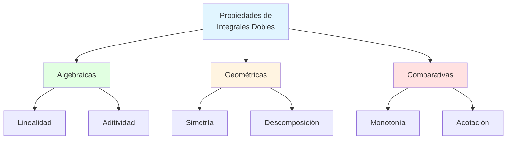
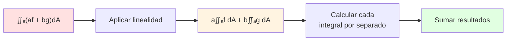
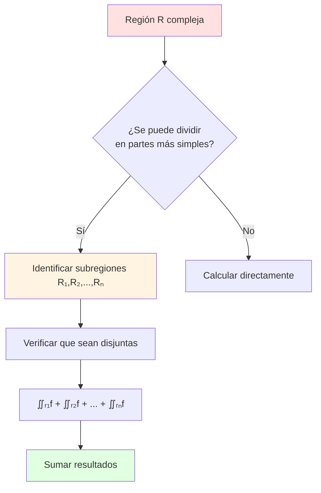
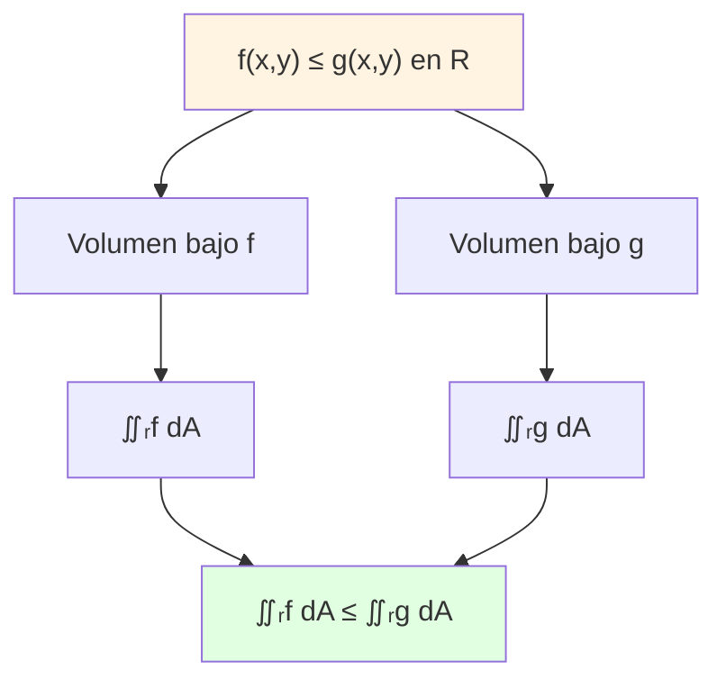
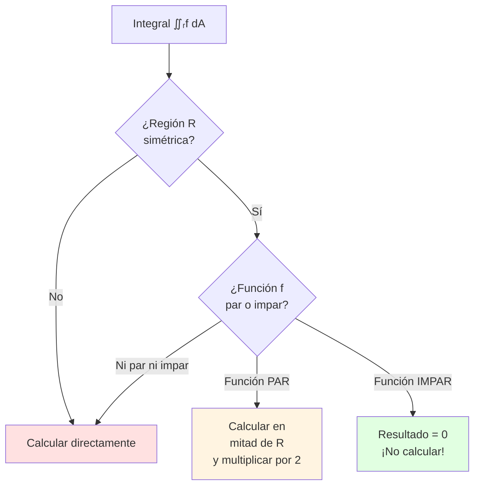

# 🎯 Propiedades de las Integrales Dobles

## 🎯 Introducción

> [!info]- 💡 ¿Qué son las Propiedades de las Integrales Dobles? Las **propiedades de las integrales dobles** son reglas algebraicas y geométricas que nos permiten simplificar cálculos, descomponer problemas complejos y relacionar integrales con las características de las funciones y regiones involucradas.
> 
> **Analogía práctica:** Imagina que necesitas calcular el peso total de objetos en un almacén:
> 
> - **Linealidad:** El peso de dos objetos juntos = suma de pesos individuales
> - **Aditividad:** Dividir el almacén en secciones y sumar
> - **Monotonía:** Si un objeto pesa más que otro, su peso total es mayor
> - **Acotación:** Podemos estimar límites superior e inferior del peso total
> 
> **¿Por qué son importantes?**
> 
> |Aspecto|Descripción|Ejemplo de Uso|
> |---|---|---|
> |**Simplificación**|Reducir integrales complejas|Separar regiones|
> |**Estimación**|Acotar valores sin calcular|Análisis numérico|
> |**Comparación**|Relacionar diferentes integrales|Desigualdades|
> |**Optimización**|Elegir mejor método de cálculo|Simetría, separabilidad|
> |**Teoría**|Demostrar teoremas generales|Convergencia, existencia|



---

## 📐 Propiedades Algebraicas Fundamentales

### ➕ Linealidad

> [!success]- ✨ Propiedad de Linealidad
> 
> La integral doble es un **operador lineal**, lo que significa que satisface dos propiedades fundamentales:
> 
> **1. Homogeneidad (multiplicación por constante):**
> 
> $$\iint_R c \cdot f(x,y) , dA = c \cdot \iint_R f(x,y) , dA$$
> 
> donde $c$ es una constante.
> 
> **2. Aditividad de funciones:**
> 
> $$\iint_R [f(x,y) + g(x,y)] , dA = \iint_R f(x,y) , dA + \iint_R g(x,y) , dA$$
> 
> **Combinando ambas (linealidad completa):**
> 
> $$\iint_R [af(x,y) + bg(x,y)] , dA = a\iint_R f(x,y) , dA + b\iint_R g(x,y) , dA$$
> 
> **Tabla de aplicaciones:**
> 
> |Propiedad|Fórmula|Uso Práctico|
> |---|---|---|
> |**Constante fuera**|$\displaystyle \iint_R 3f , dA = 3\iint_R f , dA$|Simplificar coeficientes|
> |**Suma de funciones**|$\displaystyle \iint_R (f+g) , dA = \iint_R f , dA + \iint_R g , dA$|Separar términos|
> |**Combinación lineal**|$\displaystyle \iint_R (2f-5g) , dA = 2\iint_R f , dA - 5\iint_R g , dA$|Descomponer expresiones|

**Flujo de aplicación:**



### 🎯 Ejemplos de Linealidad

> [!example]- 📝 Aplicaciones Prácticas
> 
> **Ejemplo 1: Constante multiplicativa**
> 
> Calcular: $\displaystyle \iint_R 6xy , dA$ donde $R = [0,1] \times [0,1]$
> 
> **Solución:**
> 
> $$\iint_R 6xy , dA = 6 \iint_R xy , dA = 6 \int_0^1 \int_0^1 xy , dy , dx$$
> 
> $$= 6 \int_0^1 \left[ \frac{xy^2}{2} \right]_0^1 dx = 6 \int_0^1 \frac{x}{2} , dx = 3 \left[ \frac{x^2}{2} \right]_0^1 = \frac{3}{2}$$
> 
> ---
> 
> **Ejemplo 2: Suma de funciones**
> 
> Calcular: $\displaystyle \iint_R (x^2 + y^2) , dA$ donde $R = [0,1] \times [0,1]$
> 
> **Solución:**
> 
> $$\iint_R (x^2 + y^2) , dA = \iint_R x^2 , dA + \iint_R y^2 , dA$$
> 
> Por simetría, ambas integrales son iguales:
> 
> $$\iint_R x^2 , dA = \int_0^1 \int_0^1 x^2 , dy , dx = \int_0^1 x^2 , dx = \frac{1}{3}$$
> 
> $$\therefore \iint_R (x^2 + y^2) , dA = \frac{1}{3} + \frac{1}{3} = \frac{2}{3}$$
> 
> ---
> 
> **Ejemplo 3: Combinación lineal**
> 
> Si $\displaystyle \iint_R f , dA = 5$ y $\displaystyle \iint_R g , dA = -2$, calcular:
> 
> $$\iint_R (3f - 4g + 7) , dA$$
> 
> **Solución:**
> 
> $$\iint_R (3f - 4g + 7) , dA = 3\iint_R f , dA - 4\iint_R g , dA + 7\iint_R 1 , dA$$
> 
> Si el área de $R$ es $A(R)$:
> 
> $$= 3(5) - 4(-2) + 7 \cdot A(R) = 15 + 8 + 7A(R) = 23 + 7A(R)$$

---

## 🧩 Aditividad Respecto a la Región

### 📦 Descomposición de Regiones

> [!note]- 🔄 Propiedad de Aditividad de Dominio
> 
> Si una región $R$ se puede descomponer en subregiones **disjuntas** $R_1, R_2, \ldots, R_n$ (que no se solapan excepto posiblemente en sus fronteras), entonces:
> 
> $$\iint_R f(x,y) , dA = \sum_{i=1}^{n} \iint_{R_i} f(x,y) , dA$$
> 
> **Condición importante:** $R = R_1 \cup R_2 \cup \cdots \cup R_n$ y $R_i \cap R_j = \emptyset$ (o frontera) para $i \neq j$
> 
> **Representación visual:**
> 
> ```
>     ┌─────────────┐
>     │      R₁     │
>     ├─────────────┤  ∬ᵣf dA = ∬ᵣ₁f dA + ∬ᵣ₂f dA + ∬ᵣ₃f dA
>     │      R₂     │
>     ├─────────────┤
>     │      R₃     │
>     └─────────────┘
> ```
> 
> **Casos de uso:**
> 
> |Situación|Ventaja|Ejemplo|
> |---|---|---|
> |**Límites complicados**|Simplificar en regiones más manejables|Región en forma de L|
> |**Funciones diferentes**|Función definida por partes|$f(x,y)$ cambia en subregiones|
> |**Cálculo numérico**|Dividir para aproximación|Método de Monte Carlo|
> |**Simetría**|Calcular una parte y multiplicar|Regiones simétricas|

**Proceso de descomposición:**



### 🎨 Ejemplos de Aditividad

> [!example]- 🔧 Descomposición en Práctica
> 
> **Ejemplo 1: Región en forma de L**
> 
> Calcular $\displaystyle \iint_R xy , dA$ donde $R$ es:
> 
> ```
>     y
>     ↑
>   2 | ┌───┬───┐
>     | │ R₂│   │
>   1 | ├───┤   │
>     | │ R₁│   │
>   0 | └───┴───┴──→ x
>     0   1   2
> ```
> 
> **Descomposición:**
> 
> - $R_1 = [0,1] \times [0,1]$
> - $R_2 = [0,2] \times [1,2]$
> 
> $$\iint_R xy , dA = \iint_{R_1} xy , dA + \iint_{R_2} xy , dA$$
> 
> **Calcular $R_1$:**
> 
> $$\iint_{R_1} xy , dA = \int_0^1 \int_0^1 xy , dy , dx = \frac{1}{4}$$
> 
> **Calcular $R_2$:**
> 
> $$\iint_{R_2} xy , dA = \int_0^2 \int_1^2 xy , dy , dx = \int_0^2 x\left[\frac{y^2}{2}\right]_1^2 dx$$
> 
> $$= \int_0^2 x\left(\frac{4}{2} - \frac{1}{2}\right) dx = \int_0^2 \frac{3x}{2} , dx = \frac{3}{2} \cdot 2 = 3$$
> 
> **Total:**
> 
> $$\iint_R xy , dA = \frac{1}{4} + 3 = \frac{13}{4}$$
> 
> ---
> 
> **Ejemplo 2: Función definida por partes**
> 
> $$f(x,y) = \begin{cases} x + y & \text{si } 0 \leq x \leq 1, , 0 \leq y \leq 1 \ x - y & \text{si } 1 < x \leq 2, , 0 \leq y \leq 1 \end{cases}$$
> 
> Calcular $\displaystyle \iint_R f(x,y) , dA$ donde $R = [0,2] \times [0,1]$
> 
> **Solución:**
> 
> $$\iint_R f , dA = \iint_{R_1} (x+y) , dA + \iint_{R_2} (x-y) , dA$$
> 
> donde $R_1 = [0,1] \times [0,1]$ y $R_2 = [1,2] \times [0,1]$
> 
> ---
> 
> **Ejemplo 3: Simetría y aditividad**
> 
> Calcular $\displaystyle \iint_R x^3 , dA$ donde $R = [-1,1] \times [0,1]$
> 
> **Solución por simetría:**
> 
> Dividir en $R_1 = [-1,0] \times [0,1]$ y $R_2 = [0,1] \times [0,1]$
> 
> Como $x^3$ es impar:
> 
> $$\iint_{R_1} x^3 , dA = -\iint_{R_2} x^3 , dA$$
> 
> $$\therefore \iint_R x^3 , dA = 0$$

---

## ⚖️ Propiedades de Comparación

### 📊 Monotonía

> [!important]- 📈 Propiedad de Monotonía
> 
> Si $f(x,y) \leq g(x,y)$ para todo $(x,y) \in R$, entonces:
> 
> $$\iint_R f(x,y) , dA \leq \iint_R g(x,y) , dA$$
> 
> **Casos especiales importantes:**
> 
> |Condición|Conclusión|
> |---|---|
> |$f(x,y) \geq 0$ en $R$|$\displaystyle \iint_R f , dA \geq 0$|
> |$f(x,y) \leq 0$ en $R$|$\displaystyle \iint_R f , dA \leq 0$|
> |$f(x,y) = 0$ en $R$|$\displaystyle \iint_R f , dA = 0$|
> |$m \leq f(x,y) \leq M$|$\displaystyle m \cdot A(R) \leq \iint_R f , dA \leq M \cdot A(R)$|
> 
> **Interpretación geométrica:**
> 
> Si una superficie está siempre por encima de otra, su volumen asociado es mayor.



### 🎯 Desigualdades y Acotación

> [!success]- 📏 Teorema de Acotación
> 
> Si $m \leq f(x,y) \leq M$ para todo $(x,y) \in R$, entonces:
> 
> $$m \cdot A(R) \leq \iint_R f(x,y) , dA \leq M \cdot A(R)$$
> 
> donde $A(R)$ es el área de la región $R$.
> 
> **Consecuencia (Teorema del Valor Medio):**
> 
> Si $f$ es continua en $R$, existe un punto $(x_0, y_0) \in R$ tal que:
> 
> $$\iint_R f(x,y) , dA = f(x_0, y_0) \cdot A(R)$$
> 
> Es decir, $f(x_0, y_0)$ es el **valor promedio** de $f$ sobre $R$.
> 
> **Fórmula del valor promedio:**
> 
> $$f_{prom} = \frac{1}{A(R)} \iint_R f(x,y) , dA$$

### 📝 Ejemplos de Comparación

> [!example]- 🔍 Estimaciones y Desigualdades
> 
> **Ejemplo 1: Acotar sin calcular**
> 
> Estimar $\displaystyle \iint_R e^{-(x^2+y^2)} , dA$ donde $R = [0,1] \times [0,1]$
> 
> **Solución:**
> 
> En $R$: $0 \leq x^2 + y^2 \leq 2$
> 
> Por lo tanto: $e^{-2} \leq e^{-(x^2+y^2)} \leq e^0 = 1$
> 
> Usando acotación:
> 
> $$e^{-2} \cdot 1 \leq \iint_R e^{-(x^2+y^2)} , dA \leq 1 \cdot 1$$
> 
> $$\boxed{e^{-2} \leq \iint_R e^{-(x^2+y^2)} , dA \leq 1}$$
> 
> Aproximadamente: $0.135 \leq \text{Integral} \leq 1$
> 
> ---
> 
> **Ejemplo 2: Comparar integrales**
> 
> Comparar $\displaystyle I_1 = \iint_R xy , dA$ y $\displaystyle I_2 = \iint_R x^2y^2 , dA$ donde $R = [0,1] \times [0,1]$
> 
> **Análisis:**
> 
> En $R$: $0 \leq x \leq 1$ y $0 \leq y \leq 1$
> 
> Por lo tanto: $xy \geq x^2y^2$ (ya que $xy \geq (xy)^2$ cuando $0 \leq xy \leq 1$)
> 
> **Conclusión:** $I_1 \geq I_2$
> 
> **Verificación:**
> 
> - $I_1 = \frac{1}{4}$
> - $I_2 = \frac{1}{9}$
> - Efectivamente: $\frac{1}{4} > \frac{1}{9}$ ✓
> 
> ---
> 
> **Ejemplo 3: Valor promedio**
> 
> Calcular el valor promedio de $f(x,y) = x^2 + y^2$ sobre $R = [0,1] \times [0,1]$
> 
> **Solución:**
> 
> $$A(R) = 1$$
> 
> $$\iint_R (x^2 + y^2) , dA = \frac{2}{3}$$ (del ejemplo anterior)
> 
> $$f_{prom} = \frac{1}{1} \cdot \frac{2}{3} = \frac{2}{3}$$

---

## 🔄 Propiedades de Simetría

### 🪞 Simetría Respecto a Ejes

> [!tip]- ✨ Aprovechando la Simetría
> 
> **Simetría respecto al eje $y$ (simetría par/impar en $x$):**
> 
> Si $R$ es simétrica respecto al eje $y$ (es decir, $(x,y) \in R \Rightarrow (-x,y) \in R$):
> 
> |Condición de $f$|Resultado|
> |---|---|
> |$f(-x,y) = f(x,y)$ (par en $x$)|$\displaystyle \iint_R f , dA = 2\iint_{R^+} f , dA$|
> |$f(-x,y) = -f(x,y)$ (impar en $x$)|$\displaystyle \iint_R f , dA = 0$|
> 
> donde $R^+$ es la mitad derecha de $R$ (donde $x \geq 0$).
> 
> **Simetría respecto al eje $x$:**
> 
> Si $R$ es simétrica respecto al eje $x$:
> 
> |Condición de $f$|Resultado|
> |---|---|
> |$f(x,-y) = f(x,y)$ (par en $y$)|$\displaystyle \iint_R f , dA = 2\iint_{R^+} f , dA$|
> |$f(x,-y) = -f(x,y)$ (impar en $y$)|$\displaystyle \iint_R f , dA = 0$|
> 
> **Simetría respecto al origen:**
> 
> Si $R$ es simétrica respecto al origen y $f(-x,-y) = -f(x,y)$:
> 
> $$\iint_R f(x,y) , dA = 0$$

**Diagrama de decisión:**



### 📐 Ejemplos de Simetría

> [!example]- 🎨 Aplicaciones de Simetría
> 
> **Ejemplo 1: Función impar, resultado cero**
> 
> Calcular $\displaystyle \iint_R x^3y , dA$ donde $R = [-1,1] \times [-1,1]$
> 
> **Análisis:**
> 
> - Región simétrica respecto a ambos ejes
> - $f(x,y) = x^3y$
> - $f(-x,y) = (-x)^3y = -x^3y = -f(x,y)$ → impar en $x$
> 
> **Conclusión:** $\displaystyle \iint_R x^3y , dA = 0$ ✓
> 
> ---
> 
> **Ejemplo 2: Función par, calcular mitad**
> 
> Calcular $\displaystyle \iint_R (x^2 + y^2) , dA$ donde $R = [-2,2] \times [-1,1]$
> 
> **Análisis:**
> 
> - Región simétrica respecto a ambos ejes
> - $f(x,y) = x^2 + y^2$
> - $f(-x,y) = x^2 + y^2 = f(x,y)$ → par en $x$
> - $f(x,-y) = x^2 + y^2 = f(x,y)$ → par en $y$
> 
> **Estrategia:**
> 
> $$\iint_R (x^2+y^2) , dA = 4 \iint_{R_1} (x^2+y^2) , dA$$
> 
> donde $R_1 = [0,2] \times [0,1]$ (primer cuadrante)
> 
> $$= 4\int_0^2 \int_0^1 (x^2+y^2) , dy , dx = 4\int_0^2 \left[x^2y + \frac{y^3}{3}\right]_0^1 dx$$
> 
> $$= 4\int_0^2 \left(x^2 + \frac{1}{3}\right) dx = 4\left[\frac{x^3}{3} + \frac{x}{3}\right]_0^2$$
> 
> $$= 4\left(\frac{8}{3} + \frac{2}{3}\right) = 4 \cdot \frac{10}{3} = \frac{40}{3}$$
> 
> ---
> 
> **Ejemplo 3: Simetría circular**
> 
> Calcular $\displaystyle \iint_R xy , dA$ donde $R$ es el círculo $x^2 + y^2 \leq 1$
> 
> **Análisis:**
> 
> - Región simétrica respecto a ambos ejes
> - $f(x,y) = xy$
> - Impar en ambas variables
> 
> **Por simetría respecto a $x$:**
> 
> $$\iint_R xy , dA = 0$$
> 
> (No necesitamos calcular nada) ✓

---

## 📦 Propiedades Especiales

### 🎯 Valor Absoluto

> [!note]- 📊 Desigualdad del Valor Absoluto
> 
> Para cualquier función integrable $f$:
> 
> $$\left| \iint_R f(x,y) , dA \right| \leq \iint_R |f(x,y)| , dA$$
> 
> **Interpretación:**
> 
> El valor absoluto de una integral es menor o igual que la integral del valor absoluto.
> 
> **Caso de igualdad:**
> 
> La igualdad se cumple si y solo si $f$ mantiene signo constante en $R$ (es decir, $f \geq 0$ o $f \leq 0$ en toda la región).
> 
> **Aplicación:** Útil para estimaciones y análisis de convergencia.

### ⚡ Funciones Separables

> [!success]- ✨ Caso Especial: Separabilidad
> 
> Si $f(x,y) = g(x) \cdot h(y)$ y $R = [a,b] \times [c,d]$ es rectangular:
> 
> $$\iint_R g(x)h(y) , dA = \left(\int_a^b g(x) , dx\right) \left(\int_c^d h(y) , dy\right)$$
> 
> **Ventaja:** Reduce una integral doble a producto de integrales simples.
> 
> **Ejemplo:**
> 
> $$\iint_R e^x \sin(y) , dA = \left(\int_0^1 e^x , dx\right) \left(\int_0^\pi \sin(y) , dy\right)$$
> 
> $$= [e^x]_0^1 \cdot [-\cos(y)]_0^\pi = (e-1) \cdot 2 = 2(e-1)$$

---

## 📊 Tabla Resumen de Propiedades

> [!quote]- 📋 Guía Rápida de Propiedades
> 
> |Propiedad|Fórmula|Condiciones|
> |---|---|---|
> |**Linealidad**|$\displaystyle \iint_R (af+bg) = a\iint_R f + b\iint_R g$|Siempre|
> |**Aditividad**|$\displaystyle \iint_R f = \iint_{R_1} f + \iint_{R_2} f$|$R = R_1 \cup R_2$, disjuntas|
> |**Monotonía**|$f \leq g \Rightarrow \displaystyle \iint_R f \leq \iint_R g$|Siempre|
> |**Acotación**|$\displaystyle m \cdot A(R) \leq \iint_R f \leq M \cdot A(R)$|$m \leq f \leq M$ en $R$|
> |**Simetría (impar)**|$\displaystyle \iint_R f = 0$|$R$ simétrica, $f$ impar|
> |**Simetría (par)**|$\displaystyle \iint_R f = 2\iint_{R^+} f$|$R$ simétrica, $f$ par|
> |**Valor absoluto**|$\displaystyle \left|\iint_R f\right|
> |**Separabilidad**|$\displaystyle \iint_R gh = \left(\int g\right)\left(\int h\right)$|$f=g(x)h(y)$, $R$ rectangular|

---
## 🎓 Estrategias de Aplicación

> [!tip]- 🧩 Guía para Usar Propiedades Eficientemente
> 
> **Checklist de optimización:**
> 
> ```mermaid
> flowchart TD
>     A[Integral doble dada] --> B{¿Hay simetría?}
>     B -->|Sí, función impar| C[Resultado = 0<br/>¡FIN!]
>     B -->|Sí, función par| D[Calcular mitad<br/>y multiplicar]
>     B -->|No| E{¿Función separable?}
>     
>     E -->|Sí| F[Factorizar en<br/>producto de integrales]
>     E -->|No| G{¿Región compleja?}
>     
>     G -->|Sí| H[Descomponer<br/>en subregiones]
>     G -->|No| I{¿Solo estimación?}
>     
>     I -->|Sí| J[Usar acotación<br/>m·A ≤ I ≤ M·A]
>     I -->|No| K[Calcular directamente]
>     
>     style C fill:#e1ffe1
>     style F fill:#fff4e1
>     style J fill:#e1f5ff
> ```
> 
> **Orden de prioridad:**
> 
> 1. **Verificar simetría** → Puede reducir trabajo a la mitad o anular la integral
> 2. **Buscar separabilidad** → Convierte integral doble en producto
> 3. **Descomponer región** → Simplifica límites complicados
> 4. **Aplicar linealidad** → Separa términos complejos
> 5. **Usar acotación** → Para estimaciones rápidas

---

## 🎓 Ejercicios Guiados

> [!example]- 💪 Práctica Progresiva
> 
> **Nivel Básico:**
> 
> **1. Aplicar linealidad**
> 
> Si $\displaystyle \iint_R f = 3$ y $\displaystyle \iint_R g = -1$, calcular:
> 
> $$\iint_R (2f - 3g + 5) , dA$$
> 
> donde $A(R) = 4$
> 
> **Solución:**
> 
> $$= 2\iint_R f - 3\iint_R g + 5\iint_R 1 , dA$$ $$= 2(3) - 3(-1) + 5(4) = 6 + 3 + 20 = 29$$
> 
> ---
> 
> **2. Usar simetría**
> 
> Evaluar $\displaystyle \iint_R x^5 y^3 , dA$ donde $R = [-2,2] \times [-1,1]$
> 
> **Solución:**
> 
> - Región simétrica respecto a ambos ejes
> - $f(x,y) = x^5y^3$ es impar en ambas variables
> 
> **Respuesta:** $0$ (sin cálculos)
> 
> ---
> 
> **Nivel Intermedio:**
> 
> **3. Acotar integral**
> 
> Estimar $\displaystyle \iint_R \cos(x^2 + y^2) , dA$ donde $R = [0,1] \times [0,1]$
> 
> **Solución:**
> 
> En $R$: $0 \leq x^2 + y^2 \leq 2$
> 
> Por lo tanto: $\cos(2) \leq \cos(x^2 + y^2) \leq \cos(0) = 1$
> 
> $$\cos(2) \cdot 1 \leq \iint_R \cos(x^2+y^2) , dA \leq 1 \cdot 1$$
> 
> $$-0.416 \lesssim \text{Integral} \leq 1$$
> 
> ---
> 
> **4. Descomponer región**
> 
> Calcular $\displaystyle \iint_R x , dA$ donde $R$ es la región:
> 
> ```
>     y
>   2 | ┌─────┐
>   1 | │ R₂  │
>     | ├───┐ │
>     | │R₁ │ │
>   0 | └───┴─┘
>     0 1   2  x
> ```
> 
> **Solución:**
> 
> - $R_1 = [0,1] \times [0,1]$
> - $R_2 = [0,2] \times [1,2]$
> 
> $$\iint_{R_1} x , dA = \int_0^1 \int_0^1 x , dy , dx = \int_0^1 x , dx = \frac{1}{2}$$
> 
> $$\iint_{R_2} x , dA = \int_0^2 \int_1^2 x , dy , dx = \int_0^2 x , dx = 2$$
> 
> **Total:** $\frac{1}{2} + 2 = \frac{5}{2}$
> 
> ---
> 
> **Nivel Avanzado:**
> 
> **5. Combinar varias propiedades**
> 
> Calcular $\displaystyle \iint_R (x^2 - xy^3) , dA$ donde $R = [-1,1] \times [-1,1]$
> 
> **Solución:**
> 
> $$\iint_R (x^2 - xy^3) , dA = \iint_R x^2 , dA - \iint_R xy^3 , dA$$
> 
> **Primera integral (función par):**
> 
> $$\iint_R x^2 , dA = 4\int_0^1 \int_0^1 x^2 , dy , dx = 4 \cdot \frac{1}{3} = \frac{4}{3}$$
> 
> **Segunda integral (función impar en $x$):**
> 
> $$\iint_R xy^3 , dA = 0$$
> 
> **Resultado final:** $\frac{4}{3} - 0 = \frac{4}{3}$

---

## 🔗 Conexión con Próximos Temas

> [!quote]- 🌟 Continuando el Aprendizaje
> 
> **Has dominado:**
> 
> ```mermaid
> mindmap
>   root((Propiedades de<br/>Integrales Dobles))
>     Algebraicas
>       Linealidad
>       Aditividad
>     Comparación
>       Monotonía
>       Acotación
>       Valor medio
>     Simetría
>       Par/Impar
>       Regiones simétricas
>     Especiales
>       Separabilidad
>       Valor absoluto
> ```
> 
> **Próximos pasos:**
> 
> |Nivel|Tema|Por qué es el siguiente paso|
> |---|---|---|
> |**Actual**|Propiedades fundamentales|Base teórica|
> |**Siguiente**|Cambio a coordenadas polares|Aplicar propiedades en nuevo sistema|
> |**Avanzado**|Integrales triples|Extensión de propiedades a 3D|
> |**Aplicaciones**|Centro de masa, momentos|Usar linealidad y aditividad|
> |**Teoremas**|Teorema de Green|Relacionar integrales dobles y de línea|
> 
> **Roadmap de evolución:**
> 
> ```mermaid
> graph LR
>     A[Propiedades] --> B[Coord. Polares]
>     B --> C[Aplicaciones Físicas]
>     C --> D[Centro de Masa]
>     D --> E[Momentos de Inercia]
>     
>     A --> F[Int. Triples]
>     F --> G[Coord. Cilíndricas]
>     G --> H[Coord. Esféricas]
>     
>     A -.-> I[Teorema de Green]
>     I -.-> J[Teorema de Stokes]
>     
>     style A fill:#e1ffe1
>     style B fill:#fff4e1
>     style F fill:#e1f5ff
> ```

---

**Tags:** #calculo-vectorial #integrales-dobles #propiedades #linealidad #aditividad #simetria #monotonia #acotacion #valor-medio #mermaid #matematicas