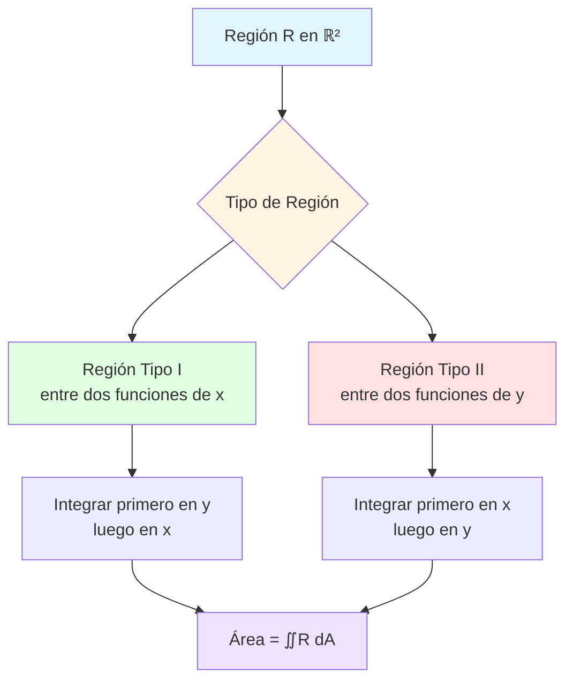

# 📐 Aplicaciones de la Integral Doble: Área de una Región en ℝ²

## 🎯 Introducción

> [!info]- 💡 ¿Qué es el Área mediante Integral Doble?
> 
> La **integral doble** es una herramienta fundamental del cálculo multivariable que permite calcular el **área de regiones planas** en el plano ℝ². Es la extensión natural de la integral simple al espacio bidimensional.
> 
> **Analogía práctica:** Imagina que quieres calcular el área de un terreno irregular:
> 
> - **Método tradicional:** Dividir en figuras geométricas simples (triángulos, rectángulos)
> - **Método con integrales:** Dividir en infinitos rectángulos infinitesimales y sumarlos
> 
> **¿Por qué es importante?**
> 
> |Aspecto|Descripción|Ejemplo de Uso|
> |---|---|---|
> |**Geometría**|Calcular áreas de regiones complejas|Terrenos, figuras no regulares|
> |**Física**|Determinar masas, centros de masa|Placas con densidad variable|
> |**Ingeniería**|Analizar superficies y volúmenes|Diseño de estructuras|
> |**Probabilidad**|Calcular probabilidades continuas|Distribuciones bivariadas|
> |**Computación**|Gráficos por computadora|Render de superficies|



---

## 📊 Conceptos Fundamentales

### 🔷 Definición de Integral Doble para Área

> [!example]- 📐 Fórmula General del Área
> 
> El **área de una región R** en el plano xy se calcula mediante:
> 
> $$A = \iint_R dA = \iint_R dx,dy$$
> 
> **Interpretación:**
> 
> - $dA$: Elemento diferencial de área (un rectángulo infinitesimal)
> - $dx,dy$: Base × Altura del rectángulo diferencial
> - La integral "suma" todos estos rectángulos sobre la región R
> 
> **Visualización geométrica:**
> 
> ```mermaid
> graph LR
>     A[Región R] --> B[Dividir en<br/>rectángulos]
>     B --> C[Cada rectángulo<br/>área = Δx·Δy]
>     C --> D[Límite cuando<br/>Δx,Δy → 0]
>     D --> E[Integral doble<br/>∬R dA]
>     
>     style A fill:#e1f5ff
>     style C fill:#fff4e1
>     style E fill:#e1ffe1
> ```
> 
> **Propiedades fundamentales:**
> 
> |Propiedad|Expresión|Significado|
> |---|---|---|
> |**Linealidad**|$\iint_R (f+g),dA = \iint_R f,dA + \iint_R g,dA$|La integral es lineal|
> |**Constante**|$\iint_R c,dA = c \cdot A(R)$|Constante sale fuera|
> |**Aditividad**|$\iint_{R_1 \cup R_2} dA = \iint_{R_1} dA + \iint_{R_2} dA$|Suma de regiones|
> |**Positividad**|Si $R$ tiene área, entonces $\iint_R dA > 0$|El área es positiva|

---

## 🎨 Tipos de Regiones

### 📍 Región Tipo I (Regular respecto a x)

> [!success]- 🔼 Región entre dos funciones de x
> 
> Una región es **Tipo I** si puede describirse como:
> 
> $$R = {(x,y) \mid a \leq x \leq b, , g_1(x) \leq y \leq g_2(x)}$$
> 
> **Características:**
> 
> - Los límites en $x$ son constantes: $[a, b]$
> - Los límites en $y$ son funciones de $x$: $g_1(x)$ y $g_2(x)$
> - Se integra **primero en y, luego en x**
> 
> **Fórmula del área:**
> 
> $$A = \int_a^b \int_{g_1(x)}^{g_2(x)} dy,dx = \int_a^b [g_2(x) - g_1(x)],dx$$
> 
> **Representación visual:**
> 
> ```
>      y
>      ↑
>      │     y = g₂(x)
>      │    ╱‾‾‾‾‾╲
>      │   ╱ Región ╲
>      │  ╱   Tipo I  ╲
>      │ ╱_____________╲
>      │     y = g₁(x)
>      └────────────────→ x
>         a           b
> ```
> 
> **Ejemplo 1: Región triangular**
> 
> Calcular el área de la región limitada por:
> 
> - $y = 0$ (eje x)
> - $y = x$
> - $x = 2$
> 
> **Solución:**
> 
> ```
> 1. Identificar límites:
>    • x: de 0 a 2
>    • y: de 0 a x
> 
> 2. Plantear la integral:
>    A = ∫₀² ∫₀ˣ dy dx
> 
> 3. Resolver primero en y:
>    ∫₀ˣ dy = [y]₀ˣ = x - 0 = x
> 
> 4. Resolver en x:
>    A = ∫₀² x dx = [x²/2]₀² = 4/2 - 0 = 2
> ```
> 
> **Resultado:** $A = 2$ unidades cuadradas
> 
> **Ejemplo 2: Región parabólica**
> 
> Área entre $y = x²$ y $y = 4$:
> 
> ```
> 1. Encontrar intersecciones:
>    x² = 4 → x = ±2
> 
> 2. Límites:
>    • x: de -2 a 2
>    • y: de x² a 4
> 
> 3. Integral:
>    A = ∫₋₂² ∫ₓ²⁴ dy dx
>      = ∫₋₂² (4 - x²) dx
>      = [4x - x³/3]₋₂²
>      = (8 - 8/3) - (-8 + 8/3)
>      = 16 - 16/3 = 32/3
> ```
> 
> **Resultado:** $A = \frac{32}{3}$ unidades cuadradas

### 📍 Región Tipo II (Regular respecto a y)

> [!success]- 🔽 Región entre dos funciones de y
> 
> Una región es **Tipo II** si puede describirse como:
> 
> $$R = {(x,y) \mid c \leq y \leq d, , h_1(y) \leq x \leq h_2(y)}$$
> 
> **Características:**
> 
> - Los límites en $y$ son constantes: $[c, d]$
> - Los límites en $x$ son funciones de $y$: $h_1(y)$ y $h_2(y)$
> - Se integra **primero en x, luego en y**
> 
> **Fórmula del área:**
> 
> $$A = \int_c^d \int_{h_1(y)}^{h_2(y)} dx,dy = \int_c^d [h_2(y) - h_1(y)],dy$$
> 
> **Representación visual:**
> 
> ```
>      y
>      ↑ d ─────────────────
>      │        │  R  │
>      │        │egión│
>      │        │Tipo │
>      │        │ II  │
>      │ c ─────│─────│─────
>      └────────┴─────┴────→ x
>           x=h₁(y)  x=h₂(y)
> ```
> 
> **Ejemplo 3: Región entre parábola y recta**
> 
> Área entre $x = y²$ y $x = 2y$:
> 
> ```
> 1. Intersecciones:
>    y² = 2y → y² - 2y = 0
>    y(y - 2) = 0 → y = 0, y = 2
> 
> 2. Límites:
>    • y: de 0 a 2
>    • x: de y² a 2y
> 
> 3. Integral:
>    A = ∫₀² ∫_{y²}^{2y} dx dy
>      = ∫₀² (2y - y²) dy
>      = [y² - y³/3]₀²
>      = 4 - 8/3 = 4/3
> ```
> 
> **Resultado:** $A = \frac{4}{3}$ unidades cuadradas

---

## 🔄 Cambio de Orden de Integración

> [!tip]- ↔️ Convertir entre Tipo I y Tipo II
> 
> Algunas regiones pueden expresarse de **ambas formas**. Cambiar el orden puede:
> 
> - Simplificar la integral
> - Hacer posible una integración que era muy compleja
> - Evitar integrales que no tienen forma cerrada
> 
> **Proceso de conversión:**
> 
> ```mermaid
> flowchart LR
>     A[Región R<br/>Tipo I] --> B{¿Complicada?}
>     B -->|Sí| C[Graficar región]
>     C --> D[Identificar límites<br/>para Tipo II]
>     D --> E[Reescribir como<br/>Tipo II]
>     B -->|No| F[Calcular como<br/>Tipo I]
>     
>     style A fill:#e1ffe1
>     style C fill:#fff4e1
>     style E fill:#ffe1e1
>     style F fill:#e1f5ff
> ```
> 
> **Ejemplo 4: Cambio de orden**
> 
> Calcular: $\int_0^2 \int_0^{x^2} dy,dx$
> 
> **Como Tipo I (dado):**
> 
> ```
> • x: de 0 a 2
> • y: de 0 a x²
> 
> Región: entre y=0 y y=x², con 0≤x≤2
> ```
> 
> **Convertir a Tipo II:**
> 
> ```
> 1. Despejar x de y = x²:
>    x = √y
> 
> 2. Límites:
>    • y: de 0 a 4 (cuando x=2)
>    • x: de √y a 2
> 
> 3. Nueva integral:
>    ∫₀⁴ ∫_{√y}² dx dy
> ```
> 
> **Calcular ambas formas:**
> 
> |Tipo I|Tipo II|
> |---|---|
> |$\int_0^2 x^2,dx$|$\int_0^4 (2-\sqrt{y}),dy$|
> |$= \frac{8}{3}$|$= \frac{8}{3}$ ✓|

---

## 🎯 Estrategias de Resolución

### 📋 Metodología paso a paso

> [!note]- 🔧 Procedimiento general
> 
> **Paso 1: Graficar la región**
> 
> - Identificar todas las curvas involucradas
> - Encontrar puntos de intersección
> - Sombrear la región R
> 
> **Paso 2: Determinar el tipo de región**
> 
> |Pregunta|Si respuesta es SÍ|Tipo|
> |---|---|---|
> |¿Límites de x son constantes?|y varía con x|Tipo I|
> |¿Límites de y son constantes?|x varía con y|Tipo II|
> |¿Ambos varían?|Dividir región|Ambos|
> 
> **Paso 3: Establecer límites**
> 
> ```
> Tipo I:
>   • Límite inferior x: a (constante)
>   • Límite superior x: b (constante)
>   • Límite inferior y: g₁(x) (función)
>   • Límite superior y: g₂(x) (función)
> 
> Tipo II:
>   • Límite inferior y: c (constante)
>   • Límite superior y: d (constante)
>   • Límite inferior x: h₁(y) (función)
>   • Límite superior x: h₂(y) (función)
> ```
> 
> **Paso 4: Plantear y resolver**
> 
> ```
> 1. Escribir la integral iterada
> 2. Resolver integral interior
> 3. Resolver integral exterior
> 4. Verificar resultado (debe ser positivo)
> ```
> 
> **Diagrama de flujo completo:**
> 
> ```mermaid
> flowchart TD
>     A[Inicio] --> B[Graficar región R]
>     B --> C[Encontrar intersecciones]
>     C --> D{¿Tipo I o II?}
>     D -->|Tipo I| E[Límites: x constante<br/>y función de x]
>     D -->|Tipo II| F[Límites: y constante<br/>x función de y]
>     D -->|Ambos| G[Dividir región]
>     E --> H[Plantear ∫∫ dy dx]
>     F --> I[Plantear ∫∫ dx dy]
>     G --> J[Suma de integrales]
>     H --> K[Resolver]
>     I --> K
>     J --> K
>     K --> L{¿Resultado positivo?}
>     L -->|Sí| M[✅ Área correcta]
>     L -->|No| N[❌ Revisar límites]
>     
>     style A fill:#e1f5ff
>     style D fill:#fff4e1
>     style M fill:#e1ffe1
>     style N fill:#ffe1e1
> ```

---

## 💻 Ejemplos Resueltos Completos

> [!example]- 🎓 Problema 1: Región triangular
> 
> **Enunciado:** Calcular el área de la región limitada por $y = x$, $y = 2x$, y $x = 3$.
> 
> **Solución paso a paso:**
> 
> ```
> 1. GRAFICAR:
>    • y = x (recta, pasa por origen, pendiente 1)
>    • y = 2x (recta, pasa por origen, pendiente 2)
>    • x = 3 (recta vertical)
> 
> 2. INTERSECCIONES:
>    • y = x con x = 3: punto (3, 3)
>    • y = 2x con x = 3: punto (3, 6)
>    • Región: triángulo
> 
> 3. IDENTIFICAR TIPO:
>    ✓ Tipo I (x constante de 0 a 3, y varía)
> 
> 4. LÍMITES:
>    • x: de 0 a 3
>    • y: de x a 2x
> 
> 5. PLANTEAR:
>    A = ∫₀³ ∫ₓ²ˣ dy dx
> 
> 6. RESOLVER:
>    Paso 1: ∫ₓ²ˣ dy = [y]ₓ²ˣ = 2x - x = x
>    
>    Paso 2: ∫₀³ x dx = [x²/2]₀³ = 9/2
> 
> 7. VERIFICAR:
>    Base = 3, altura = 3
>    Área triángulo = (3×3)/2 = 4.5 ✓
> ```
> 
> **Respuesta:** $A = \frac{9}{2}$ unidades cuadradas

> [!example]- 🎓 Problema 2: Región entre parábola y recta
> 
> **Enunciado:** Calcular el área entre $y = x^2 - 4$ y $y = 2x - 1$.
> 
> **Solución:**
> 
> ```
> 8. INTERSECCIONES:
>    x² - 4 = 2x - 1
>    x² - 2x - 3 = 0
>    (x-3)(x+1) = 0
>    x = -1, x = 3
> 
> 9. ¿CUÁL ESTÁ ARRIBA?
>    En x = 0: 
>    • y = 0² - 4 = -4 (parábola)
>    • y = 2(0) - 1 = -1 (recta)
>    → Recta está arriba
> 
> 10. TIPO I:
>    • x: de -1 a 3
>    • y: de x²-4 a 2x-1
> 
> 11. ÁREA:
>    A = ∫₋₁³ [(2x-1) - (x²-4)] dx
>      = ∫₋₁³ (-x² + 2x + 3) dx
>      = [-x³/3 + x² + 3x]₋₁³
>      = (-9 + 9 + 9) - (1/3 + 1 - 3)
>      = 9 - (-5/3)
>      = 9 + 5/3 = 32/3
> ```
> 
> **Respuesta:** $A = \frac{32}{3}$ unidades cuadradas

> [!example]- 🎓 Problema 3: Región entre dos parábolas
> 
> **Enunciado:** Área entre $x = y²$ y $y = x²$.
> 
> **Solución:**
> 
> ```
> 12. INTERSECCIONES:
>    y = x² y x = y²
>    Sustituir: y = (y²)²= y⁴
>    y⁴ - y = 0
>    y(y³ - 1) = 0
>    y = 0, y = 1
>    
>    Puntos: (0,0) y (1,1)
> 
> 13. ANALIZAR:
>    • x = y² es parábola abierta a la derecha
>    • y = x² es parábola abierta hacia arriba
>    • Entre (0,0) y (1,1), x=y² está a la derecha
> 
> 14. ESCOGER ORDEN:
>    Tipo II (más simple):
>    • y: de 0 a 1
>    • x: de y² a √y
> 
> 15. INTEGRAL:
>    A = ∫₀¹ (√y - y²) dy
>      = [2y³/²/3 - y³/3]₀¹
>      = 2/3 - 1/3
>      = 1/3
> ```
> 
> **Respuesta:** $A = \frac{1}{3}$ unidades cuadradas

---

## 📊 Resumen de Fórmulas

> [!success]- 📐 Tabla de referencia rápida
> 
> |Tipo|Descripción|Fórmula|Orden de integración|
> |---|---|---|---|
> |**Tipo I**|y entre funciones de x|$\int_a^b \int_{g_1(x)}^{g_2(x)} dy,dx$|Primero y, luego x|
> |**Tipo II**|x entre funciones de y|$\int_c^d \int_{h_1(y)}^{h_2(y)} dx,dy$|Primero x, luego y|
> |**Rectangular**|Límites constantes|$\int_a^b \int_c^d dy,dx = (b-a)(d-c)$|Cualquier orden|
> 
> **Checklist de resolución:**
> 
> ```mermaid
> graph TD
>     A[✓ Graficar región] --> B[✓ Encontrar intersecciones]
>     B --> C[✓ Determinar tipo]
>     C --> D[✓ Establecer límites]
>     D --> E[✓ Plantear integral]
>     E --> F[✓ Resolver interior]
>     F --> G[✓ Resolver exterior]
>     G --> H[✓ Verificar resultado]
>     
>     style A fill:#e1ffe1
>     style D fill:#fff4e1
>     style H fill:#e1f5ff
> ```

---

## 🎯 Ejercicios Propuestos

> [!question]- 💪 Practica tus habilidades
> 
> **Nivel Básico:**
> 
> 1. Área del rectángulo con vértices (0,0), (3,0), (3,2), (0,2)
> 2. Área del triángulo con vértices (0,0), (4,0), (4,4)
> 3. Área entre $y=0$, $y=x$, $x=1$
> 
> **Nivel Intermedio:**
> 
> 4. Área entre $y=x²$ y $y=x$
> 5. Área entre $y=\sin x$ y $y=\cos x$ en $[0, \pi/4]$
> 6. Área entre $x=y²-1$ y $x=1-y²$
> 
> **Nivel Avanzado:**
> 
> 7. Área encerrada por $x²+y²=4$ (círculo)
> 8. Área entre $y=e^x$, $y=1$, $x=0$, $x=1$
> 9. Área del elipse $\frac{x²}{a²}+\frac{y²}{b²}=1$
> 
> **Respuestas:**
> 
> |Ejercicio|Respuesta|
> |---|---|
> |1|$6$ u²|
> |2|$8$ u²|
> |3|$\frac{1}{2}$ u²|
> |4|$\frac{1}{6}$ u²|
> |5|$\sqrt{2}-1$ u²|
> |6|$\frac{8}{3}$ u²|
> |7|$4\pi$ u²|
> |8|$e-1$ u²|
> |9|$\pi ab$ u²|

---

## 🔗 Conexión con Otros Temas

> [!quote]- 🌟 Aplicaciones y extensiones
> 
> **Progresión del aprendizaje:**
> 
> ```mermaid
> graph LR
>     A[Área en ℝ²] --> B[Volumen en ℝ³]
>     B --> C[Integrales triples]
>     A --> D[Centro de masa]
>     A --> E[Momento de inercia]
>     B --> F[Coordenadas cilíndricas]
>     B --> G[Coordenadas esféricas]
>     
>     style A fill:#e1ffe1
>     style B fill:#fff4e1
>     style C fill:#e1f5ff
> ```
> 
> **Próximos temas:**
> 
> |Tema|Relación|Aplicación|
> |---|---|---|
> |**Integrales dobles con función**|$\iint_R f(x,y),dA$|Volumen bajo superficie|
> |**Coordenadas polares**|$\iint_R r,dr,d\theta$|Regiones circulares|
> |**Cambio de variable**|Jacobiano|Simplificar integrales|
> |**Integrales de superficie**|Flujo de campos|Física y electromagnetismo|

---

**Tags:** #cálculo #integral-doble #área #multivariable #región-tipo-I #región-tipo-II #geometría #aplicaciones #matemáticas #mermaid