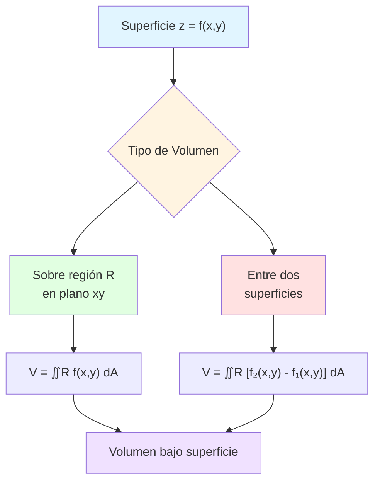

# 📦 Volumen bajo una Superficie

## 🎯 Introducción

> [!info]- 💡 ¿Qué es el Volumen bajo una Superficie?
> 
> La **integral doble** no solo calcula áreas planas, sino que también permite determinar el **volumen de sólidos** limitados por superficies en el espacio tridimensional ℝ³.
> 
> **Analogía práctica:** Imagina que quieres calcular cuánta agua puede contener una piscina con fondo irregular:
> 
> - **La superficie superior:** Nivel del agua (plano z = altura)
> - **La superficie inferior:** Fondo de la piscina (z = f(x,y))
> - **El volumen:** Espacio entre ambas superficies
> 
> **¿Por qué es importante?**
> 
> |Aspecto|Descripción|Ejemplo de Uso|
> |---|---|---|
> |**Ingeniería Civil**|Calcular volumen de excavaciones|Movimiento de tierras|
> |**Arquitectura**|Diseño de estructuras complejas|Domos, techos curvos|
> |**Física**|Determinar masa de objetos 3D|Densidad variable|
> |**Manufactura**|Volumen de piezas irregulares|Control de calidad|
> |**Geografía**|Calcular volúmenes de lagos, montañas|Topografía|



---

## 📐 Fundamentos Teóricos

### 🔷 Definición de Volumen mediante Integral Doble

> [!example]- 📊 Concepto Fundamental
> 
> **Definición formal:**
> 
> El **volumen del sólido** limitado superiormente por la superficie $z = f(x,y)$, inferiormente por el plano xy (z = 0), y lateralmente por la región R en el plano xy es:
> 
> $$V = \iint_R f(x,y),dA$$
> 
> donde $f(x,y) \geq 0$ sobre R.
> 
> **Interpretación geométrica:**
> 
> ```
>          z
>          ↑
>          │     Superficie z=f(x,y)
>          │        ╱‾‾‾╲
>          │       ╱     ╲
>          │      ╱ SÓLIDO╲
>          │     ╱_________╲
>          │    └───────────┘ Región R
>          └──────────────────→ y
>         ╱
>        ╱ x
> ```
> 
> **Elementos clave:**
> 
> |Componente|Símbolo|Significado|
> |---|---|---|
> |**Función altura**|$z = f(x,y)$|Altura de la superficie en cada punto|
> |**Región base**|$R$|Proyección del sólido en el plano xy|
> |**Elemento de volumen**|$dV = f(x,y),dA$|"Prisma" infinitesimal|
> |**Base del prisma**|$dA = dx,dy$|Área infinitesimal|
> |**Altura del prisma**|$f(x,y)$|Valor de la función|
> 
> **Visualización del elemento diferencial:**
> 
> ```mermaid
> graph TD
>     A[Punto x,y en R] --> B[Elemento dA = dx·dy]
>     B --> C[Altura f x,y]
>     C --> D["Volumen dV = f(x,y)·dA"]
>     D --> E[Sumar todos los dV<br/>∬R f x,y dA]
>     
>     style A fill:#e1f5ff
>     style D fill:#fff4e1
>     style E fill:#e1ffe1
> ```

### 🎨 Interpretación Física

> [!note]- 🌊 Analogía del Agua
> 
> **Caso 1: Volumen de agua en un recipiente**
> 
> Si $f(x,y)$ representa la **profundidad** del agua en cada punto (x,y):
> 
> $$V_{\text{agua}} = \iint_R f(x,y),dA$$
> 
> **Ejemplo visual:**
> 
> ```
> Vista superior (plano xy):
>     y
>     ↑
>   4 │ ┌───────────┐
>     │ │           │
>   2 │ │  Región R │
>     │ │  (piscina)│
>   0 └─┴───────────┴──→ x
>     0   2       6
> 
> Profundidad: f(x,y) = 4 - x²/9 - y²/4
> ```
> 
> **Propiedades del volumen:**
> 
> |Propiedad|Expresión|Significado|
> |---|---|---|
> |**No negatividad**|$f(x,y) \geq 0 \Rightarrow V \geq 0$|Volumen siempre positivo|
> |**Linealidad**|$V(cf) = c \cdot V(f)$|Constante escala el volumen|
> |**Aditividad**|$V(f+g) = V(f) + V(g)$|Suma de funciones|
> |**Volumen cero**|$f(x,y) = 0 \Rightarrow V = 0$|Función nula|

---

## 🔢 Cálculo de Volúmenes

### 📍 Volumen sobre Región Tipo I

> [!success]- 🔼 Integración en coordenadas cartesianas
> 
> **Configuración:**
> 
> - Superficie: $z = f(x,y)$
> - Región: $R = {(x,y) \mid a \leq x \leq b, , g_1(x) \leq y \leq g_2(x)}$
> 
> **Fórmula:**
> 
> $$V = \int_a^b \int_{g_1(x)}^{g_2(x)} f(x,y),dy,dx$$
> 
> **Proceso de integración:**
> 
> ```
> Paso 1: Integrar respecto a y (fijar x)
>         → Obtener función de x
> 
> Paso 2: Integrar respecto a x
>         → Obtener número (volumen)
> ```
> 
> **Ejemplo 1: Paraboloide sobre rectángulo**
> 
> Calcular el volumen del sólido bajo $z = 4 - x^2 - y^2$ sobre $R = [0,1] \times [0,1]$.
> 
> **Solución completa:**
> 
> ```
> 1. IDENTIFICAR:
>    • Superficie: z = 4 - x² - y²
>    • Región: 0 ≤ x ≤ 1, 0 ≤ y ≤ 1
>    • Tipo: Región rectangular (Tipo I)
> 
> 2. PLANTEAR:
>    V = ∫₀¹ ∫₀¹ (4 - x² - y²) dy dx
> 
> 3. RESOLVER INTEGRAL INTERNA (en y):
>    ∫₀¹ (4 - x² - y²) dy 
>    = [4y - x²y - y³/3]₀¹
>    = (4 - x² - 1/3) - 0
>    = 11/3 - x²
> 
> 4. RESOLVER INTEGRAL EXTERNA (en x):
>    V = ∫₀¹ (11/3 - x²) dx
>      = [11x/3 - x³/3]₀¹
>      = 11/3 - 1/3
>      = 10/3
> ```
> 
> **Respuesta:** $V = \frac{10}{3}$ unidades cúbicas
> 
> **Ejemplo 2: Plano inclinado**
> 
> Volumen bajo $z = 2x + y$ sobre la región triangular con vértices (0,0), (2,0), (2,4).
> 
> **Solución:**
> 
> ```
> 1. REGIÓN (Tipo I):
>    • x: de 0 a 2
>    • y: de 0 a 2x (recta que une (0,0) con (2,4))
> 
> 2. INTEGRAL:
>    V = ∫₀² ∫₀²ˣ (2x + y) dy dx
> 
> 3. INTEGRAR EN y:
>    ∫₀²ˣ (2x + y) dy = [2xy + y²/2]₀²ˣ
>                     = 2x(2x) + (2x)²/2
>                     = 4x² + 2x²
>                     = 6x²
> 
> 4. INTEGRAR EN x:
>    V = ∫₀² 6x² dx = [2x³]₀² = 16
> ```
> 
> **Respuesta:** $V = 16$ unidades cúbicas

### 📍 Volumen sobre Región Tipo II

> [!success]- 🔽 Orden alternativo de integración
> 
> **Configuración:**
> 
> - Superficie: $z = f(x,y)$
> - Región: $R = {(x,y) \mid c \leq y \leq d, , h_1(y) \leq x \leq h_2(y)}$
> 
> **Fórmula:**
> 
> $$V = \int_c^d \int_{h_1(y)}^{h_2(y)} f(x,y),dx,dy$$
> 
> **Ejemplo 3: Superficie cuadrática**
> 
> Volumen bajo $z = xy$ sobre la región limitada por $y = x$ y $y = x^2$ con $0 \leq x \leq 1$.
> 
> **Solución (Tipo I - más natural aquí):**
> 
> ```
> 1. ANÁLISIS:
>    • Intersecciones: x = x² → x = 0, x = 1
>    • Para 0 < x < 1: x² < x (parábola debajo de recta)
> 
> 2. LÍMITES (Tipo I):
>    • x: de 0 a 1
>    • y: de x² a x
> 
> 3. INTEGRAL:
>    V = ∫₀¹ ∫ₓ²ˣ xy dy dx
> 
> 4. INTEGRAR EN y:
>    ∫ₓ²ˣ xy dy = x[y²/2]ₓ²ˣ
>               = x(x²/2 - x⁴/2)
>               = x³/2 - x⁵/2
> 
> 5. INTEGRAR EN x:
>    V = ∫₀¹ (x³/2 - x⁵/2) dx
>      = [x⁴/8 - x⁶/12]₀¹
>      = 1/8 - 1/12
>      = 3/24 - 2/24
>      = 1/24
> ```
> 
> **Respuesta:** $V = \frac{1}{24}$ unidades cúbicas

---

## 🔄 Volumen entre Dos Superficies

> [!tip]- 📏 Diferencia de Alturas
> 
> **Concepto:**
> 
> El volumen entre dos superficies $z = f_2(x,y)$ (superior) y $z = f_1(x,y)$ (inferior) sobre la región R es:
> 
> $$V = \iint_R [f_2(x,y) - f_1(x,y)],dA$$
> 
> donde $f_2(x,y) \geq f_1(x,y)$ en R.
> 
> **Visualización:**
> 
> ```
>          z
>          ↑
>          │   Superficie superior z=f₂(x,y)
>          │      ╱‾‾‾‾‾╲
>          │     ╱       ╲
>          │    ╱ VOLUMEN ╲
>          │   ╱___________╲
>          │  ╱             ╲ Superficie inferior z=f₁(x,y)
>          │ └───────────────┘
>          └──────────────────→ y
>         ╱ Región R
>        x
> ```
> 
> **Casos especiales:**
> 
> |Caso|Superficie inferior|Fórmula|
> |---|---|---|
> |**Sobre plano xy**|$f_1(x,y) = 0$|$V = \iint_R f_2(x,y),dA$|
> |**Bajo plano z = k**|$f_2(x,y) = k$|$V = \iint_R [k - f_1(x,y)],dA$|
> |**Entre dos curvas**|Ambas no planas|$V = \iint_R [f_2 - f_1],dA$|
> 
> **Ejemplo 4: Entre paraboloide y plano**
> 
> Volumen entre $z = 8 - x^2 - y^2$ (paraboloide) y $z = x^2 + y^2$ (cono) sobre la región donde se intersectan.
> 
> **Solución:**
> 
> ```
> 1. ENCONTRAR INTERSECCIÓN:
>    8 - x² - y² = x² + y²
>    8 = 2x² + 2y²
>    x² + y² = 4
>    
>    → Región: círculo de radio 2
> 
> 2. VERIFICAR CUÁL ESTÁ ARRIBA:
>    En (0,0): 
>    • Paraboloide: z = 8
>    • Cono: z = 0
>    → Paraboloide arriba
> 
> 3. DIFERENCIA DE FUNCIONES:
>    f₂ - f₁ = (8 - x² - y²) - (x² + y²)
>            = 8 - 2x² - 2y²
> 
> 4. CAMBIAR A POLARES (más fácil):
>    x² + y² = r²
>    Región: 0 ≤ r ≤ 2, 0 ≤ θ ≤ 2π
> 
> 5. INTEGRAL EN POLARES:
>    V = ∫₀²ᵖ ∫₀² (8 - 2r²)·r dr dθ
> 
> 6. INTEGRAR EN r:
>    ∫₀² (8r - 2r³) dr = [4r² - r⁴/2]₀²
>                      = 16 - 8 = 8
> 
> 7. INTEGRAR EN θ:
>    V = ∫₀²ᵖ 8 dθ = 8[θ]₀²ᵖ = 16π
> ```
> 
> **Respuesta:** $V = 16\pi$ unidades cúbicas

---

## 🎯 Estrategias de Resolución

### 📋 Metodología Sistemática

> [!note]- 🔧 Guía paso a paso
> 
> **FASE 1: ANÁLISIS PRELIMINAR**
> 
> ```mermaid
> flowchart TD
>     A[Leer problema] --> B[Identificar superficie z=fx,y]
>     B --> C[Identificar región R]
>     C --> D{¿Una o dos superficies?}
>     D -->|Una| E[V = ∬ f dA]
>     D -->|Dos| F[V = ∬ f₂-f₁ dA]
>     
>     style A fill:#e1f5ff
>     style D fill:#fff4e1
>     style E fill:#e1ffe1
>     style F fill:#ffe1e1
> ```
> 
> **FASE 2: CONFIGURACIÓN DE LA REGIÓN**
> 
> |Paso|Acción|Herramientas|
> |---|---|---|
> |1|Graficar región R|Papel, software|
> |2|Encontrar límites|Intersecciones|
> |3|Decidir orden|Tipo I vs Tipo II|
> |4|Considerar simetría|Simplificaciones|
> 
> **FASE 3: INTEGRACIÓN**
> 
> ```
> 1. Plantear integral iterada
>    ↓
> 2. Resolver integral interna
>    ↓
> 3. Simplificar resultado
>    ↓
> 4. Resolver integral externa
>    ↓
> 5. Evaluar y simplificar
> ```
> 
> **Checklist de verificación:**
> 
> - [ ] ¿El resultado es positivo?
> - [ ] ¿Las unidades son correctas? (longitud³)
> - [ ] ¿Tiene sentido físicamente?
> - [ ] ¿Se pueden verificar casos especiales?

### 🔍 Casos Especiales

> [!tip]- ⚡ Simplificaciones comunes
> 
> **1. Simetría**
> 
> |Tipo de simetría|Simplificación|Ejemplo|
> |---|---|---|
> |**Respecto a x**|$V = 2\int\int_{R/2}$|Paraboloide sobre [-a,a]×[-b,b]|
> |**Respecto a y**|$V = 2\int\int_{R/2}$|Similar|
> |**Radial**|Usar coordenadas polares|Círculos, anillos|
> |**Función par**|Integrar [0,a] y duplicar|$f(-x) = f(x)$|
> 
> **Ejemplo de simetría:**
> 
> Volumen bajo $z = 9 - x^2 - y^2$ sobre $x^2 + y^2 \leq 9$.
> 
> ```
> Por simetría radial → coordenadas polares
> 
> V = ∫₀²ᵖ ∫₀³ (9 - r²)·r dr dθ
>   = 2π ∫₀³ (9r - r³) dr
>   = 2π [9r²/2 - r⁴/4]₀³
>   = 2π (81/2 - 81/4)
>   = 2π · 81/4
>   = 81π/2
> ```
> 
> **2. Funciones separables**
> 
> Si $f(x,y) = g(x) \cdot h(y)$ sobre rectángulo $[a,b] \times [c,d]$:
> 
> $$V = \left(\int_a^b g(x),dx\right) \cdot \left(\int_c^d h(y),dy\right)$$
> 
> **Ejemplo:**
> 
> $z = x^2y$ sobre $[0,2] \times [0,3]$:
> 
> ```
> V = (∫₀² x² dx)(∫₀³ y dy)
>   = [x³/3]₀² · [y²/2]₀³
>   = (8/3) · (9/2)
>   = 12
> ```

---

## 💻 Ejemplos Avanzados

> [!example]- 🎓 Problema 5: Pirámide truncada
> 
> **Enunciado:** Calcular el volumen del sólido bajo el plano $z = 4 - x - y$ sobre la región triangular con vértices (0,0), (4,0), (0,4).
> 
> **Solución completa:**
> 
> ```
> 1. GRAFICAR REGIÓN:
>    Triángulo con:
>    • Vértices: (0,0), (4,0), (0,4)
>    • Hipotenusa: x + y = 4
> 
> 2. TIPO I:
>    • x: de 0 a 4
>    • y: de 0 a 4-x
> 
> 3. PLANTEAR:
>    V = ∫₀⁴ ∫₀⁴⁻ˣ (4 - x - y) dy dx
> 
> 4. INTEGRAL INTERNA:
>    ∫₀⁴⁻ˣ (4 - x - y) dy 
>    = [(4-x)y - y²/2]₀⁴⁻ˣ
>    = (4-x)(4-x) - (4-x)²/2
>    = (4-x)² - (4-x)²/2
>    = (4-x)²/2
> 
> 5. INTEGRAL EXTERNA:
>    V = ∫₀⁴ (4-x)²/2 dx
>    
>    Sustitución: u = 4-x, du = -dx
>    Cuando x=0: u=4; x=4: u=0
>    
>    V = -½ ∫₄⁰ u² du = ½ ∫₀⁴ u² du
>      = ½ [u³/3]₀⁴
>      = ½ · 64/3
>      = 32/3
> 
> 6. VERIFICACIÓN:
>    Volumen pirámide = (1/3)·Base·Altura
>    Base = ½·4·4 = 8
>    Altura promedio ≈ 2
>    V ≈ (1/3)·8·2 ≈ 5.33 ✓
> ```
> 
> **Respuesta:** $V = \frac{32}{3}$ unidades cúbicas

> [!example]- 🎓 Problema 6: Sólido de revolución
> 
> **Enunciado:** Volumen del sólido generado por $z = \sqrt{1-x^2}$ sobre $-1 \leq x \leq 1$, $-\sqrt{1-x^2} \leq y \leq \sqrt{1-x^2}$.
> 
> **Solución (coordenadas polares recomendadas):**
> 
> ```
> 1. RECONOCER GEOMETRÍA:
>    • Región: semicírculo de radio 1
>    • Superficie: semicircunferencia
>    • Sólido: hemisferio
> 
> 2. COORDENADAS POLARES:
>    x = r cos θ
>    y = r sen θ
>    z = √(1-x²) = √(1-r²cos²θ)
>    
>    Región: 0 ≤ r ≤ 1, 0 ≤ θ ≤ 2π
> 
> 3. SIMPLIFICACIÓN:
>    Para hemisferio superior de radio 1:
>    z = √(1 - x² - y²) = √(1 - r²)
> 
> 4. INTEGRAL:
>    V = ∫₀²ᵖ ∫₀¹ √(1-r²)·r dr dθ
> 
> 5. INTEGRAR EN r (sustitución):
>    u = 1-r², du = -2r dr
>    
>    ∫₀¹ r√(1-r²) dr = -½∫₁⁰ √u du
>                     = ½∫₀¹ u^(1/2) du
>                     = ½[2u^(3/2)/3]₀¹
>                     = ½·(2/3)
>                     = 1/3
> 
> 6. INTEGRAR EN θ:
>    V = ∫₀²ᵖ (1/3) dθ = (1/3)·2π = 2π/3
> 
> 7. VERIFICAR (hemisferio):
>    V_hemisferio = (2/3)πr³ = (2/3)π(1)³ = 2π/3 ✓
> ```
> 
> **Respuesta:** $V = \frac{2\pi}{3}$ unidades cúbicas

> [!example]- 🎓 Problema 7: Volumen complejo
> 
> **Enunciado:** Volumen entre $z = x^2 + y^2$ y $z = 2 - x^2 - y^2$.
> 
> **Solución:**
> 
> ```
> 8. INTERSECCIÓN:
>    x² + y² = 2 - x² - y²
>    2x² + 2y² = 2
>    x² + y² = 1
>    
>    → Círculo de radio 1
> 
> 9. VERIFICAR POSICIONES:
>    En (0,0):
>    • Cono: z = 0
>    • Paraboloide invertido: z = 2
>    → Paraboloide arriba
> 
> 10. DIFERENCIA:
>    f₂ - f₁ = (2 - x² - y²) - (x² + y²)
>            = 2 - 2x² - 2y²
>            = 2 - 2r² (en polares)
> 
> 11. LÍMITES POLARES:
>    • r: de 0 a 1
>    • θ: de 0 a 2π
> 
> 12. INTEGRAL:
>    V = ∫₀²ᵖ ∫₀¹ (2 - 2r²)·r dr dθ
>      = ∫₀²ᵖ ∫₀¹ (2r - 2r³) dr dθ
> 
> 13. INTEGRAR EN r:
>    ∫₀¹ (2r - 2r³) dr = [r² - r⁴/2]₀¹
>                      = 1 - 1/2 = 1/2
> 
> 14. INTEGRAR EN θ:
>    V = ∫₀²ᵖ (1/2) dθ = (1/2)·2π = π
> ```
> 
> **Respuesta:** $V = \pi$ unidades cúbicas

---

## 🌟 Coordenadas Polares

> [!success]- 🔄 Cambio de coordenadas para regiones circulares
> 
> **Cuándo usar polares:**
> 
> |Situación|Indicador|Ventaja|
> |---|---|---|
> |**Región circular**|$x^2 + y^2 = r^2$|Límites constantes|
> |**Función con $x^2+y^2$**|$f(x,y) = g(x^2+y^2)$|Simplifica función|
> |**Simetría radial**|Simétrica respecto al origen|Reduce complejidad|
> |**Sectores circulares**|Porciones de círculo|Límites naturales|
> 
> **Transformación:**
> 
> $$\begin{cases} x = r\cos\theta \ y = r\sin\theta \ dA = r,dr,d\theta \end{cases}$$
> 
> **⚠️ Factor importante:** El jacobiano $r$ es **CRUCIAL**.
> 
> **Fórmula en polares:**
> 
> $$V = \int_{\alpha}^{\beta} \int_{r_1(\theta)}^{r_2(\theta)} f(r\cos\theta, r\sin\theta) \cdot r,dr,d\theta$$
> 
> **Ejemplo 8: Cono sobre círculo**
> 
> Volumen bajo $z = \sqrt{x^2 + y^2}$ sobre $x^2 + y^2 \leq 4$.
> 
> ```
> 1. EXPRESAR EN POLARES:
>    z = √(x² + y²) = √r² = r
>    Región: 0 ≤ r ≤ 2, 0 ≤ θ ≤ 2π
> 
> 2. INTEGRAL:
>    V = ∫₀²ᵖ ∫₀² r·r dr dθ
>      = ∫₀²ᵖ ∫₀² r² dr dθ
> 
> 3. INTEGRAR EN r:
>    ∫₀² r² dr = [r³/3]₀² = 8/3
> 
> 4. INTEGRAR EN θ:
>    V = ∫₀²ᵖ (8/3) dθ = (8/3)·2π = 16π/3
> 
> 5. VERIFICAR (cono):
>    V_cono = (1/3)πr²h = (1/3)π(2²)(2) = 8π/3
>   ```
> 
> 
¡Error! Revisar...
> El cono tiene h=r en el borde, no h=2 V_cono = (1/3)π(2²)(2) = 8π/3 ✗
> 
> Cálculo correcto: Por integral: 16π/3 ✓
> 
> ```
> 
> **Tabla de conversiones útiles:**
> 
> | Cartesiana | Polar | Observación |
> |------------|-------|-------------|
> | $x^2 + y^2$ | $r^2$ | Simplifica mucho |
> | $x^2 + y^2 = a^2$ | $r = a$ | Círculo |
> | $x^2 + y^2 \leq a^2$ | $0 \leq r \leq a$ | Disco |
> | $y = x$ | $\theta = \pi/4$ | Recta |
> | $x = 0$ | $\theta = \pi/2$ | Eje y |
> ```

---

## 📊 Resumen y Fórmulas Clave

> [!success]- 📐 Tabla de referencia rápida
> 
> **Fórmulas fundamentales:**
> 
> |Caso|Fórmula|Cuándo usar|
> |---|---|---|
> |**Una superficie**|$V = \iint_R f(x,y),dA$|Volumen bajo z=f(x,y)|
> |**Dos superficies**|$V = \iint_R [f_2-f_1],dA$|Entre dos funciones|
> |**Cartesianas (I)**|$\int_a^b \int_{g_1}^{g_2} f,dy,dx$|Región Tipo I|
> |**Cartesianas (II)**|$\int_c^d \int_{h_1}^{h_2} f,dx,dy$|Región Tipo II|
> |**Polares**|$\int_\alpha^\beta \int_{r_1}^{r_2} f \cdot r,dr,d\theta$|Simetría circular|
> 
> **Diagrama de decisión:**
> 
> ```mermaid
> flowchart TD
>     A[Problema de volumen] --> B{¿Tipo de región?}
>     B -->|Circular/Radial| C[Coordenadas polares]
>     B -->|Rectangular| D[Cartesianas]
>     B -->|Irregular| E{¿Qué orden?}
>     
>     C --> F[V = ∬ f·r dr dθ]
>     D --> G[V = ∬ f dx dy]
>     E -->|Tipo I| H[V = ∫∫ f dy dx]
>     E -->|Tipo II| I[V = ∫∫ f dx dy]
>     
>     style A fill:#e1f5ff
>     style B fill:#fff4e1
>     style C fill:#e1ffe1
>     style F fill:#f0e1ff
> ```

---

## 🎯 Ejercicios Propuestos

> [!question]- 💪 Practica con estos problemas
> 
> **Nivel Básico:**
> 
> 1. Volumen bajo $z = 6 - 2x - 3y$ sobre $R = [0,1] \times [0,1]$
> 2. Volumen bajo $z = x + y$ sobre el triángulo (0,0), (2,0), (0,2)
> 3. Volumen del prisma bajo $z = 4$ sobre $R = [0,3] \times [0,2]$
> 
> **Nivel Intermedio:**
> 
> 4. Volumen bajo $z = 4 - x^2$ sobre $R = [-2,2] \times [0,3]$
> 5. Volumen entre $z = 1 + x + y$ y $z = 2$ sobre $[0,1] \times [0,1]$
> 6. Volumen bajo $z = xy$ sobre la región limitada por $y=x$ y $y=x^2$
> 
> **Nivel Avanzado:**
> 
> 7. Volumen bajo $z = \sqrt{1-x^2-y^2}$ sobre $x^2+y^2 \leq 1$ (hemisferio)
> 8. Volumen entre $z = x^2+y^2$ y $z = 4$ sobre $x^2+y^2 \leq 4$
> 9. Volumen del sólido común a los cilindros $x^2+y^2=1$ y $x^2+z^2=1$
> 
> **Soluciones:**
> 
> |Ejercicio|Respuesta|Método recomendado|
> |---|---|---|
> |1|$3/2$ u³|Directo|
> |2|$4$ u³|Tipo I|
> |3|$24$ u³|Prisma rectangular|
> |4|$64$ u³|Simetría en x|
> |5|$1/2$ u³|Diferencia de superficies|
> |6|$1/24$ u³|Tipo I|
> |7|$2\pi/3$ u³|Polares|
> |8|$8\pi$ u³|Polares|
> |9|$16/3$ u³|Simetría|

---

## 🔗 Aplicaciones Prácticas

> [!quote]- 🌍 Usos en el mundo real
> 
> **1. Ingeniería Civil:**
> 
> ```
> Cálculo de volumen de excavación:
> • Superficie original: z₁ = f₁(x,y)
> • Superficie excavada: z₂ = f₂(x,y)
> • Volumen removido: V = ∬R [f₁-f₂] dA
> ```
> 
> **2. Arquitectura:**
> 
> ```
> Diseño de domos y techos curvos:
> • Superficie del domo: z = h·√(1-x²/a²-y²/b²)
> • Calcular materiales necesarios
> • Optimizar costos
> ```
> 
> **3. Manufactura:**
> 
> ```
> Control de calidad de piezas:
> • Escaneo 3D → superficie z=f(x,y)
> • Comparar con diseño ideal
> • Detectar defectos por diferencia de volumen
> ```
> 
> **Progresión del aprendizaje:**
> 
> ```mermaid
> graph LR
>     A[Volumen bajo<br/>superficie] --> B[Integrales<br/>triples]
>     B --> C[Coordenadas<br/>cilíndricas]
>     C --> D[Coordenadas<br/>esféricas]
>     A --> E[Centro de<br/>masa]
>     A --> F[Momento de<br/>inercia]
>     
>     style A fill:#e1ffe1
>     style B fill:#fff4e1
>     style C fill:#e1f5ff
>     style E fill:#f0e1ff
> ```

---

**Tags:** #cálculo #integral-doble #volumen #superficie #coordenadas-polares #sólidos #aplicaciones #geometría #multivariable #mermaid