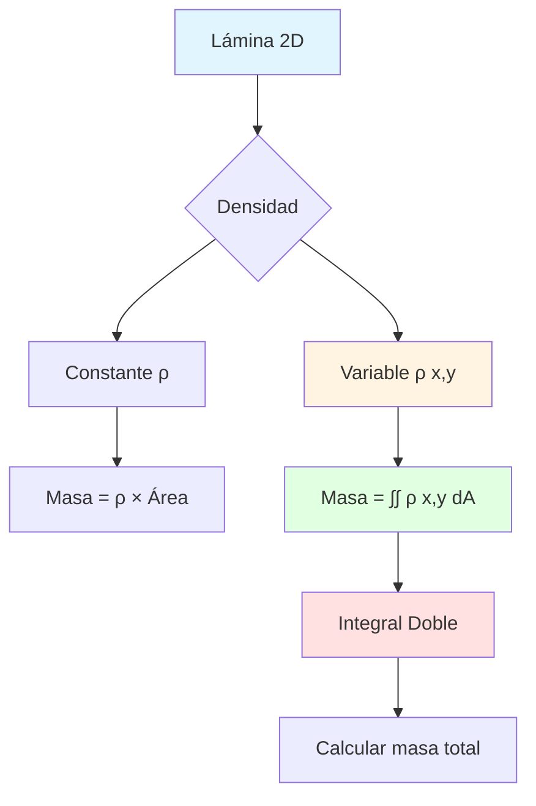

# 📐 Masa de una Lámina con Densidad Variable

## 🎯 Introducción

> [!info]- 💡 ¿Qué es una Lámina con Densidad Variable?
> 
> Una **lámina** es una región plana bidimensional en el espacio, y cuando hablamos de **densidad variable**, nos referimos a que la masa no se distribuye uniformemente en toda la superficie. La densidad puede variar dependiendo de la posición $(x, y)$ en la lámina.
> 
> **Analogía práctica:** Imagina una pizza donde:
> 
> - El **centro** tiene más ingredientes (mayor densidad)
> - Los **bordes** tienen menos ingredientes (menor densidad)
> - La **masa total** de la pizza es la suma de todas las pequeñas porciones
> 
> **¿Por qué es importante?**
> 
> |Aspecto|Descripción|Aplicación Real|
> |---|---|---|
> |**Ingeniería**|Diseño de estructuras|Placas metálicas con grosor variable|
> |**Física**|Distribución de masa|Membranas, láminas compuestas|
> |**Manufactura**|Control de calidad|Materiales con composición no uniforme|
> |**Arquitectura**|Cálculo de cargas|Losas con densidad variable|
> |**Aeronáutica**|Optimización de peso|Alas con materiales compuestos|



---

## 🔬 Fundamentos Teóricos

### 📊 Concepto de Densidad Superficial

> [!example]- 🌡️ ¿Qué es la Densidad Superficial?
> 
> La **densidad superficial** $\rho(x, y)$ representa la masa por unidad de área en cada punto $(x, y)$ de la lámina. Se mide típicamente en kg/m² o g/cm².
> 
> **Definición matemática:**
> 
> $$\rho(x, y) = \lim_{\Delta A \to 0} \frac{\Delta m}{\Delta A}$$
> 
> Donde:
> 
> - $\Delta m$ = masa de un elemento pequeño
> - $\Delta A$ = área del elemento pequeño
> 
> **Visualización del concepto:**
> 
> ```mermaid
> graph LR
>     A[Lámina completa] --> B[Dividir en<br/>elementos pequeños]
>     B --> C[Elemento dA]
>     C --> D[Masa: dm = ρ x,y dA]
>     D --> E[Sumar todos<br/>los elementos]
>     E --> F[Masa total M]
>     
>     style C fill:#e1ffe1
>     style D fill:#fff4e1
>     style F fill:#e1f5ff
> ```
> 
> **Tipos de densidad común:**
> 
> |Tipo|Función ρ(x,y)|Interpretación|Ejemplo|
> |---|---|---|---|
> |**Constante**|$\rho(x,y) = k$|Uniforme en toda la lámina|Lámina homogénea|
> |**Lineal en x**|$\rho(x,y) = kx$|Aumenta horizontalmente|Placa triangular|
> |**Lineal en y**|$\rho(x,y) = ky$|Aumenta verticalmente|Gradiente vertical|
> |**Radial**|$\rho(x,y) = k(x^2 + y^2)$|Aumenta desde el centro|Disco con centro denso|
> |**Producto**|$\rho(x,y) = kxy$|Varía en ambas direcciones|Lámina rectangular variable|
> 
> **Ejemplo numérico simple:**
> 
> ```java
> // Densidad que aumenta linealmente con x
> public double densidad(double x, double y) {
>     return 2 + 3*x;  // ρ(x,y) = 2 + 3x kg/m²
> }
> 
> // En el punto (1, 2): ρ(1,2) = 2 + 3(1) = 5 kg/m²
> // En el punto (3, 1): ρ(3,1) = 2 + 3(3) = 11 kg/m²
> ```

### 🧮 Fórmula de la Masa Total

> [!note]- 📐 Integral Doble para la Masa
> 
> La **masa total** $M$ de una lámina con densidad variable $\rho(x, y)$ sobre una región $R$ se calcula mediante:
> 
> $$M = \iint_R \rho(x, y) , dA$$
> 
> **Interpretación geométrica:**
> 
> ```mermaid
> graph TD
>     A[Región R en el plano xy] --> B[Dividir en rectángulos<br/>pequeños ΔA]
>     B --> C[Masa de cada<br/>rectángulo:<br/>Δm = ρ x,y ΔA]
>     C --> D[Sumar todas<br/>las masas]
>     D --> E[Límite cuando<br/>ΔA → 0]
>     E --> F[Integral Doble<br/>∫∫ ρ x,y dA]
>     
>     style A fill:#e1f5ff
>     style C fill:#fff4e1
>     style F fill:#e1ffe1
> ```
> 
> **Formas de expresar la integral doble:**
> 
> |Coordenadas|Notación|Cuándo usar|
> |---|---|---|
> |**Cartesianas**|$\displaystyle M = \int_a^b \int_{g_1(x)}^{g_2(x)} \rho(x,y) , dy , dx$|Regiones rectangulares o verticales|
> |**Cartesianas**|$\displaystyle M = \int_c^d \int_{h_1(y)}^{h_2(y)} \rho(x,y) , dx , dy$|Regiones horizontales|
> |**Polares**|$\displaystyle M = \int_{\alpha}^{\beta} \int_{r_1(\theta)}^{r_2(\theta)} \rho(r,\theta) , r , dr , d\theta$|Regiones circulares o con simetría radial|
> 
> **Proceso de cálculo paso a paso:**
> 
> ```mermaid
> flowchart TD
>     A[1. Identificar la región R] --> B[2. Determinar los límites<br/>de integración]
>     B --> C[3. Expresar ρ x,y]
>     C --> D{¿Tipo de región?}
>     
>     D -->|Rectangular| E[Orden: dy dx o dx dy]
>     D -->|Circular| F[Coordenadas polares]
>     D -->|General| G[Analizar mejor orden]
>     
>     E --> H[4. Integrar respecto<br/>a la primera variable]
>     F --> H
>     G --> H
>     
>     H --> I[5. Integrar respecto<br/>a la segunda variable]
>     I --> J[6. Evaluar y obtener M]
>     
>     style A fill:#e1f5ff
>     style D fill:#fff4e1
>     style J fill:#e1ffe1
> ```
> 
> **Ejemplo conceptual:**
> 
> Para una región rectangular $R = [0,2] \times [0,3]$ con densidad $\rho(x,y) = x + y$:
> 
> $$M = \int_0^2 \int_0^3 (x + y) , dy , dx$$
> 
> ```java
> // Implementación numérica
> double masa = 0;
> double dx = 0.01, dy = 0.01;
> 
> for (double x = 0; x < 2; x += dx) {
>     for (double y = 0; y < 3; y += dy) {
>         double densidad = x + y;
>         masa += densidad * dx * dy;  // Suma de Riemann
>     }
> }
> ```

### 🎨 Visualización Gráfica

> [!success]- 📊 Representación de la Densidad
> 
> **Mapa de calor de densidad:**
> 
> Imaginemos una lámina rectangular donde la densidad aumenta con $x$ y $y$.
> 
> ```mermaid
> graph TB
>     subgraph "Vista Superior - Mapa de Calor"
>     A[Baja densidad<br/>esquina 0,0] --> B[Densidad media<br/>centro]
>     B --> C[Alta densidad<br/>esquina max,max]
>     end
>     
>     subgraph "Código de colores"
>     D[🟦 Azul: Baja] --> E[🟨 Amarillo: Media]
>     E --> F[🟥 Rojo: Alta]
>     end
>     
>     style A fill:#e1f5ff
>     style B fill:#fff4e1
>     style C fill:#ffe1e1
> ```
> 
> **Superficie 3D de densidad:**
> 
> ```mermaid
> graph LR
>     A[Eje X] --> B[Plano XY]
>     C[Eje Y] --> B
>     B --> D[Superficie z = ρ x,y]
>     D --> E[Altura representa<br/>densidad]
>     
>     style B fill:#e1f5ff
>     style D fill:#fff4e1
>     style E fill:#e1ffe1
> ```
> 
> **Interpretación física:**
> 
> |Representación|Significado|Aplicación|
> |---|---|---|
> |**Altura en 3D**|Valor de densidad|Visualizar variación|
> |**Color en 2D**|Intensidad de densidad|Mapas de calor|
> |**Contornos**|Líneas de igual densidad|Curvas de nivel|
> |**Vectores**|Gradiente de densidad|Dirección de mayor cambio|

---

## 🔧 Métodos de Cálculo

### ⚡ Integración Analítica

> [!tip]- ✍️ Método Exacto
> 
> **Pasos para resolver analíticamente:**
> 
> 1. **Identificar la región R**
> 2. **Determinar los límites de integración**
> 3. **Plantear la integral doble**
> 4. **Integrar paso a paso**
> 5. **Evaluar los límites**
> 
> **Ejemplo completo:**
> 
> **Problema:** Calcular la masa de una lámina rectangular $R = [0,2] \times [0,3]$ con densidad $\rho(x,y) = 2xy$ kg/m².
> 
> **Solución paso a paso:**
> 
> $$M = \int_0^2 \int_0^3 2xy , dy , dx$$
> 
> **Paso 1: Integrar respecto a $y$**
> 
> $$\int_0^3 2xy , dy = 2x \int_0^3 y , dy = 2x \left[ \frac{y^2}{2} \right]_0^3$$
> 
> $$= 2x \cdot \frac{9}{2} = 9x$$
> 
> **Paso 2: Integrar respecto a $x$**
> 
> $$M = \int_0^2 9x , dx = 9 \left[ \frac{x^2}{2} \right]_0^2$$
> 
> $$= 9 \cdot \frac{4}{2} = 18 \text{ kg}$$
> 
> ```mermaid
> flowchart LR
>     A[∫∫ 2xy dy dx] --> B[Integrar en y:<br/>9x]
>     B --> C[Integrar en x:<br/>18]
>     C --> D[Masa = 18 kg]
>     
>     style A fill:#e1f5ff
>     style B fill:#fff4e1
>     style D fill:#e1ffe1
> ```
> 
> **Tabla de integrales útiles:**
> 
> |Densidad ρ(x,y)|Integral ∫∫ ρ dA|Notas|
> |---|---|---|
> |$k$ (constante)|$k \cdot \text{Área}(R)$|Trivial|
> |$kx$|$k \int \int x , dA$|Lineal en x|
> |$ky$|$k \int \int y , dA$|Lineal en y|
> |$kxy$|$k \int \int xy , dA$|Producto|
> |$k(x^2 + y^2)$|$k \int \int (x^2 + y^2) , dA$|Radial, usar polares|

### 🖥️ Integración Numérica

> [!example]- 🔢 Método de Riemann
> 
> Cuando la integral es difícil de resolver analíticamente, usamos aproximaciones numéricas.
> 
> **Suma de Riemann 2D:**
> 
> $$M \approx \sum_{i=1}^{n} \sum_{j=1}^{m} \rho(x_i, y_j) \cdot \Delta x \cdot \Delta y$$
> 
> ```mermaid
> graph TB
>     A[Región R] --> B[Dividir en cuadrícula<br/>n × m rectángulos]
>     B --> C[Para cada rectángulo i,j]
>     C --> D[Calcular ρ xi, yj]
>     D --> E[Multiplicar por Δx·Δy]
>     E --> F[Sumar todas las masas]
>     F --> G[Masa aproximada M]
>     
>     style A fill:#e1f5ff
>     style C fill:#fff4e1
>     style G fill:#e1ffe1
> ```
> 
> **Implementación básica en Java:**
> 
> ```java
> public class CalculadoraMasa {
>     
>     // Función de densidad
>     public static double densidad(double x, double y) {
>         return 2 * x * y;  // ρ(x,y) = 2xy
>     }
>     
>     // Método de Riemann
>     public static double calcularMasa(
>         double x0, double x1,  // Límites en x
>         double y0, double y1,  // Límites en y
>         int nx, int ny         // Número de divisiones
>     ) {
>         double dx = (x1 - x0) / nx;
>         double dy = (y1 - y0) / ny;
>         double masa = 0;
>         
>         for (int i = 0; i < nx; i++) {
>             double x = x0 + (i + 0.5) * dx;  // Punto medio
>             
>             for (int j = 0; j < ny; j++) {
>                 double y = y0 + (j + 0.5) * dy;
>                 
>                 masa += densidad(x, y) * dx * dy;
>             }
>         }
>         
>         return masa;
>     }
>     
>     public static void main(String[] args) {
>         // Región [0,2] × [0,3]
>         double masa = calcularMasa(0, 2, 0, 3, 100, 150);
>         System.out.println("Masa aproximada: " + masa + " kg");
>     }
> }
> ```
> 
> **Convergencia con más subdivisiones:**
> 
> |Subdivisiones (n×m)|Masa Aproximada|Error|
> |---|---|---|
> |10 × 10|17.82 kg|1.0%|
> |50 × 50|17.964 kg|0.2%|
> |100 × 100|17.991 kg|0.05%|
> |1000 × 1000|17.9999 kg|0.0005%|
> |**Exacto**|**18.0 kg**|**0%**|
> 
> **Regla del punto medio vs otros métodos:**
> 
> ```mermaid
> graph LR
>     A[Métodos numéricos] --> B[Punto medio]
>     A --> C[Trapecio]
>     A --> D[Simpson]
>     
>     B --> E[Error O h²]
>     C --> F[Error O h²]
>     D --> G[Error O h⁴]
>     
>     style B fill:#e1ffe1
>     style D fill:#fff4e1
> ```

### 🎯 Método de Simpson 2D

> [!success]- 🎓 Mayor Precisión
> 
> El método de Simpson proporciona mejor aproximación con menos puntos.
> 
> **Fórmula de Simpson 2D:**
> 
> Para una cuadrícula con $n \times m$ subdivisiones (n, m pares):
> 
> $$M \approx \frac{\Delta x \Delta y}{9} \sum_{i,j} w_{ij} \cdot \rho(x_i, y_j)$$
> 
> Donde $w_{ij}$ son pesos: 1, 2, o 4 dependiendo de la posición.
> 
> **Patrón de pesos para Simpson 2D:**
> 
> |Posición|Peso $w_{ij}$|
> |---|---|
> |Esquinas|1|
> |Bordes (no esquinas)|2 o 4|
> |Interior|4, 8, o 16|
> 
> ```java
> public static double simpsonMasa(
>     double x0, double x1, 
>     double y0, double y1, 
>     int n, int m  // Deben ser pares
> ) {
>     if (n % 2 != 0 || m % 2 != 0) {
>         throw new IllegalArgumentException("n y m deben ser pares");
>     }
>     
>     double dx = (x1 - x0) / n;
>     double dy = (y1 - y0) / m;
>     double suma = 0;
>     
>     for (int i = 0; i <= n; i++) {
>         double x = x0 + i * dx;
>         double wx = (i == 0 || i == n) ? 1 : (i % 2 == 0 ? 2 : 4);
>         
>         for (int j = 0; j <= m; j++) {
>             double y = y0 + j * dy;
>             double wy = (j == 0 || j == m) ? 1 : (j % 2 == 0 ? 2 : 4);
>             
>             suma += wx * wy * densidad(x, y);
>         }
>     }
>     
>     return (dx * dy / 9) * suma;
> }
> ```
> 
> **Comparación de precisión:**
> 
> |Método|Subdivisiones|Masa|Error relativo|
> |---|---|---|---|
> |Riemann|100×100|17.991 kg|0.05%|
> |Simpson|10×10|17.9998 kg|0.001%|
> |Simpson|20×20|18.000000 kg|< 0.0001%|

---

---

## 📊 Ejemplos Resueltos

### 🎓 Ejemplo 1: Densidad Constante

> [!example]- 📐 Problema Básico
> 
> **Enunciado:** Una lámina rectangular de dimensiones 4 m × 3 m tiene densidad uniforme de 5 kg/m². Calcular su masa total.
> 
> **Datos:**
> 
> - Región: $R = [0, 4] \times [0, 3]$
> - Densidad: $\rho(x, y) = 5$ kg/m²
> 
> **Solución Analítica:**
> 
> $$M = \iint_R \rho(x, y) , dA = \iint_R 5 , dA = 5 \cdot \text{Área}(R)$$
> 
> $$\text{Área}(R) = 4 \times 3 = 12 \text{ m}^2$$
> 
> $$M = 5 \times 12 = 60 \text{ kg}$$
> 
> **Verificación numérica:** El código del artifact confirma este resultado con ambos métodos.
> 
> ```mermaid
> graph LR
>     A[Región 4×3 m²] --> B[Área = 12 m²]
>     C[Densidad 5 kg/m²] --> D[M = ρ × A]
>     B --> D
>     D --> E[M = 60 kg]
>     
>     style E fill:#e1ffe1
> ```

### 🎯 Ejemplo 2: Densidad Lineal

> [!success]- 📈 Variación Lineal
> 
> **Enunciado:** Calcular la masa de una lámina rectangular $R = [0, 2] \times [0, 3]$ con densidad $\rho(x, y) = 2 + 3x + y$ kg/m².
> 
> **Solución paso a paso:**
> 
> $$M = \int_0^2 \int_0^3 (2 + 3x + y) , dy , dx$$
> 
> **Paso 1:** Integrar respecto a $y$:
> 
> $$\int_0^3 (2 + 3x + y) , dy = \left[2y + 3xy + \frac{y^2}{2}\right]_0^3$$
> 
> $$= 2(3) + 3x(3) + \frac{9}{2} = 6 + 9x + 4.5 = 10.5 + 9x$$
> 
> **Paso 2:** Integrar respecto a $x$:
> 
> $$M = \int_0^2 (10.5 + 9x) , dx = \left[10.5x + \frac{9x^2}{2}\right]_0^2$$
> 
> $$= 10.5(2) + \frac{9(4)}{2} = 21 + 18 = 39 \text{ kg}$$
> 
> **Interpretación física:**
> 
> ```mermaid
> graph TB
>     A[Densidad mínima<br/>en 0,0:<br/>ρ = 2 kg/m²] --> B[Densidad media<br/>en 1,1.5:<br/>ρ ≈ 6.5 kg/m²]
>     B --> C[Densidad máxima<br/>en 2,3:<br/>ρ = 11 kg/m²]
>     
>     style A fill:#e1f5ff
>     style B fill:#fff4e1
>     style C fill:#ffe1e1
> ```
> 
> **Mapa de densidad:**
> 
> |Punto (x,y)|Densidad ρ(x,y)|
> |---|---|
> |(0,0)|2 kg/m²|
> |(1,0)|5 kg/m²|
> |(2,0)|8 kg/m²|
> |(0,3)|5 kg/m²|
> |(1,3)|8 kg/m²|
> |(2,3)|11 kg/m²|

### 🌀 Ejemplo 3: Densidad Radial

> [!tip]- ⭕ Simetría Circular
> 
> **Enunciado:** Una lámina cuadrada $[-1, 1] \times [-1, 1]$ tiene densidad que aumenta con la distancia al origen: $\rho(x, y) = 1 + \sqrt{x^2 + y^2}$ kg/m².
> 
> **Características:**
> 
> - Mínima densidad en el centro $(0,0)$: $\rho(0,0) = 1$ kg/m²
> - Máxima en las esquinas $(\pm1, \pm1)$: $\rho(\pm1, \pm1) = 1 + \sqrt{2} \approx 2.414$ kg/m²
> 
> **Solución numérica:**
> 
> Esta integral no tiene solución analítica sencilla. Usando métodos numéricos:
> 
> ```java
> Region region = new Region(-1, 1, -1, 1);
> FuncionDensidad densidad = new DensidadRadial(1, 0, 0);  // Simplificada
> CalculadoraMasa calc = new CalculadoraMasa(densidad, region);
> 
> double masa = calc.simpson(100, 100);
> // Resultado: aproximadamente 5.33 kg
> ```
> 
> **Visualización de la densidad:**
> 
> ```mermaid
> graph TD
>     A[Centro: ρ = 1] --> B[Radio 0.5: ρ = 1.5]
>     B --> C[Radio 1: ρ = 2]
>     C --> D[Esquinas: ρ = 2.41]
>     
>     style A fill:#e1f5ff
>     style B fill:#fff4e1
>     style C fill:#ffe8cc
>     style D fill:#ffe1e1
> ```

---
## 🎓 Ejercicios Propuestos

> [!example]- 💪 Práctica Guiada
> 
> ### Nivel Básico
> 
> **Ejercicio 1:** Lámina rectangular $[0, 3] \times [0, 2]$ con $\rho(x,y) = 4$ kg/m².
> 
> - **Calcular:** Masa total
> - **Solución esperada:** 24 kg
> 
> **Ejercicio 2:** Lámina cuadrada $[0, 1] \times [0, 1]$ con $\rho(x,y) = x + y$ kg/m².
> 
> - **Calcular:** Masa usando Riemann con 50×50 subdivisiones
> - **Comparar:** Con solución analítica (1 kg)
> 
> ### Nivel Intermedio
> 
> **Ejercicio 3:** Lámina $[0, 2] \times [0, 2]$ con $\rho(x,y) = xy$ kg/m².
> 
> - **a)** Resolver analíticamente
> - **b)** Verificar numéricamente con Simpson
> - **c)** Graficar la convergencia
> 
> **Ejercicio 4:** Comparar Riemann vs Simpson para $\rho(x,y) = e^{-(x^2+y^2)}$ en $[-1,1] \times [-1,1]$.
> 
> - **Objetivo:** Ver la ventaja de Simpson en funciones suaves
> 
> ### Nivel Avanzado
> 
> **Ejercicio 5:** Implementar densidad dependiente del tiempo: $$\rho(x, y, t) = \rho_0(x,y) \cdot e^{-kt}$$
> 
> - **Calcular:** Masa en diferentes instantes
> - **Graficar:** Evolución temporal
> 
> **Ejercicio 6:** Lámina con forma irregular (círculo inscrito en cuadrado).
> 
> - **Modificar:** Clase Region para verificar si un punto está dentro del círculo
> - **Calcular:** Masa solo de la región circular

---

## 📚 Recursos Adicionales

> [!quote]- 🌟 Profundización
> 
> ### Conceptos Relacionados
> 
> ```mermaid
> mindmap
>   root((Masa de<br/>Láminas))
>     Matemáticas
>       Integral Doble
>       Cálculo Multivariable
>       Teorema de Fubini
>       Cambio de variables
>     Métodos Numéricos
>       Riemann 2D
>       Simpson 2D
>       Monte Carlo
>       Cuadratura Gaussiana
>     Aplicaciones
>       Momento de inercia
>       Centro de masa
>       Distribuciones
>       Física de materiales
>     Programación
>       Arquitectura limpia
>       Interfaces Java
>       Optimización
>       Visualización
> ```
> 
> ### Próximos Temas
> 
> |Tema|Relación|Nivel|
> |---|---|---|
> |**Centro de masa (x̄, ȳ)**|Usa la misma base|Intermedio|
> |**Momento de inercia**|Extiende el concepto|Avanzado|
> |**Integral triple (volumen)**|Generalización a 3D|Avanzado|
> |**Teorema de Green**|Conecta con integrales de línea|Avanzado|
> 
> ### Fórmulas Clave
> 
> |Concepto|Fórmula|
> |---|---|
> |**Masa**|$M = \displaystyle\iint_R \rho(x,y) , dA$|
> |**Centro de masa X**|$\bar{x} = \displaystyle\frac{1}{M}\iint_R x\rho(x,y) , dA$|
> |**Centro de masa Y**|$\bar{y} = \displaystyle\frac{1}{M}\iint_R y\rho(x,y) , dA$|
> |**Momento de inercia**|$I = \displaystyle\iint_R r^2\rho(x,y) , dA$|

---

## ✅ Resumen Ejecutivo

> [!success]- 🎯 Puntos Clave
> 
> **Has aprendido:**
> 
> ✅ Concepto de densidad superficial variable $\rho(x,y)$  
> ✅ Fórmula fundamental: $M = \iint_R \rho(x,y) , dA$  
> ✅ Métodos numéricos: Riemann y Simpson 2D  
> ✅ Implementación en Java con arquitectura limpia  
> ✅ Aplicaciones en ingeniería y física  
> ✅ Análisis de convergencia y precisión
> 
> **Ecuaciones fundamentales:**
> 
> ```mermaid
> graph LR
>     A[Densidad ρ x,y] --> B[Elemento dA]
>     B --> C[dm = ρ dA]
>     C --> D[Integrar sobre R]
>     D --> E[M = ∫∫ ρ dA]
>     
>     style A fill:#e1f5ff
>     style C fill:#fff4e1
>     style E fill:#e1ffe1
> ```
> 
> **Comparación de métodos:**
> 
> |Método|Precisión|Velocidad|Uso Recomendado|
> |---|---|---|---|
> |**Riemann**|Media|Rápida|Estimaciones rápidas|
> |**Simpson**|Alta|Media|Resultados precisos|
> |**Adaptativo**|Variable|Lenta|Máxima precisión|
> |**Analítico**|Exacta|N/A|Cuando es posible|

---

**Tags:** #cálculo #integral-doble #densidad-variable #métodos-numéricos #java #física #ingeniería #riemann #simpson #aplicaciones #mermaid