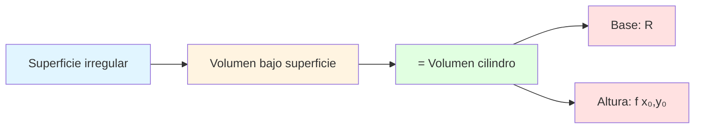
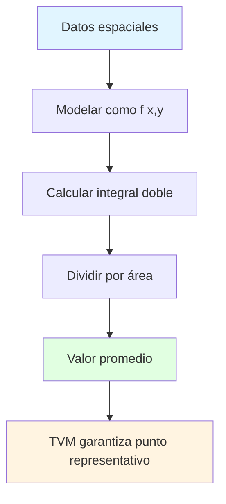
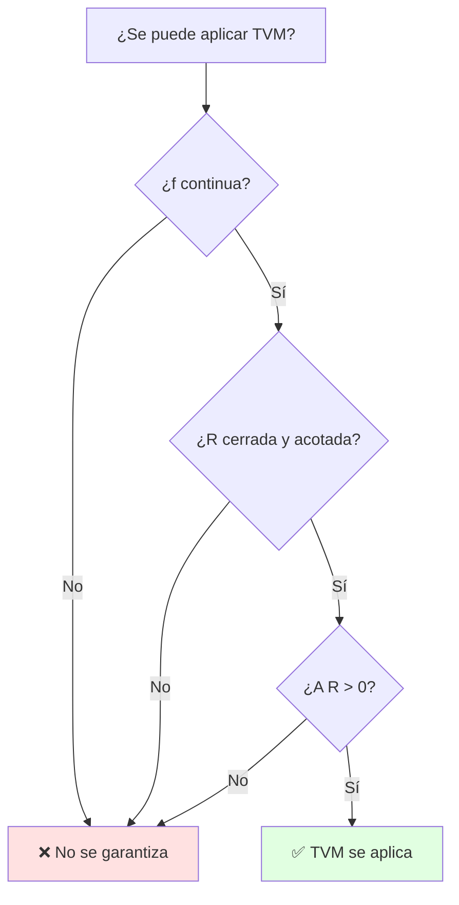
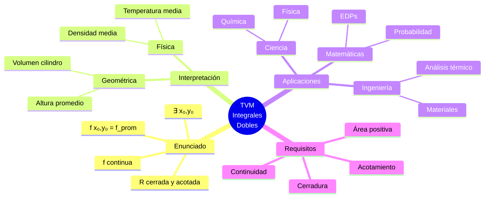

# 📐 Teorema del Valor Medio para Integrales Dobles

## 🎯 Introducción

> [!info]- 💡 ¿Qué es el Teorema del Valor Medio para Integrales Dobles?
> 
> El **Teorema del Valor Medio para Integrales Dobles** es una extensión natural del teorema del valor medio para integrales simples. Establece que para una función continua sobre una región, existe al menos un punto donde el valor de la función es igual al promedio de todos sus valores sobre esa región.
> 
> **Analogía práctica:** Imagina una superficie montañosa irregular sobre una región plana. El teorema nos dice que existe al menos un punto en esa superficie cuya altura es exactamente igual a la altura promedio de toda la montaña. Es como encontrar un "punto representativo" que captura el comportamiento promedio de toda la superficie.
> 
> **¿Por qué es importante?**
> 
> | Aspecto | Descripción | Ejemplo de Uso |
> |---------|-------------|----------------|
> | **Estimación** | Permite aproximar integrales complejas | Cálculo de promedios en física |
> | **Existencia** | Garantiza la existencia de puntos críticos | Teoría de optimización |
> | **Simplificación** | Reduce problemas bidimensionales | Análisis de distribuciones |
> | **Aplicación práctica** | Base para métodos numéricos | Análisis de datos espaciales |
> | **Conexión teórica** | Une conceptos de una y varias variables | Fundamento del análisis real |

```mermaid
graph LR
    A["Función f(x,y)"] --> B{Región R}
    B --> C[Integrar sobre R]
    C --> D[Calcular área de R]
    D --> E[Valor promedio]
    E --> F["∃ punto (x₀,y₀)"]
    F --> G["f(x₀,y₀) = promedio"]
    
    style A fill:#e1f5ff
    style B fill:#fff4e1
    style E fill:#e1ffe1
    style F fill:#ffe1e1
    style G fill:#f0e1ff
````

---

## 📋 Enunciado del Teorema

> [!example]- ⚡ Formulación Matemática
> 
> **Teorema del Valor Medio para Integrales Dobles:**
> 
> Sea $f(x,y)$ una función **continua** en una región cerrada y acotada $R$ del plano. Entonces existe al menos un punto $(x_0, y_0) \in R$ tal que:
> 
> $$\iint_R f(x,y) , dA = f(x_0, y_0) \cdot A(R)$$
> 
> donde $A(R)$ es el área de la región $R$.
> 
> **Equivalentemente, el valor promedio:**
> 
> $$f(x_0, y_0) = \frac{1}{A(R)} \iint_R f(x,y) , dA = f_{prom}$$
> 
> **Componentes del teorema:**
> 
> |Elemento|Símbolo|Significado|Requisito|
> |---|---|---|---|
> |**Función**|$f(x,y)$|Función de dos variables|Debe ser continua|
> |**Región**|$R$|Dominio de integración|Cerrada y acotada|
> |**Integral doble**|$\iint_R f(x,y) , dA$|Volumen bajo la superficie|Debe existir|
> |**Área**|$A(R)$|Área de la región|$A(R) > 0$|
> |**Punto especial**|$(x_0, y_0)$|Punto del valor medio|Existe en $R$|
> |**Valor promedio**|$f_{prom}$|Altura promedio|$f(x_0, y_0)$|

```mermaid
graph TD
    A[Hipótesis] --> B[f continua en R]
    A --> C[R cerrada y acotada]
    B --> D[Conclusión]
    C --> D
    D --> E[∃ x₀,y₀ en R]
    E --> F[f x₀,y₀ = 1/A R · ∬ f dA]
    
    style A fill:#fff4e1
    style B fill:#e1ffe1
    style C fill:#e1ffe1
    style D fill:#e1f5ff
    style E fill:#ffe1e1
    style F fill:#f0e1ff
```

---

## 🎨 Interpretación Geométrica

### 📊 Visualización del Concepto

> [!note]- 🌄 Significado Visual
> 
> **Interpretación como volumen:**
> 
> La integral doble $\iint_R f(x,y) , dA$ representa el **volumen** bajo la superficie $z = f(x,y)$ sobre la región $R$.
> 
> El teorema establece que este volumen es igual a:
> 
> - Un **cilindro** (o prisma) con base $R$
> - Altura constante $f(x_0, y_0)$
> 
> **Visualización:**
> 
> ```
>        z
>        ↑
>        |     Superficie z=f(x,y)
>        |        /\
>        |       /  \
>        |      /    \
>        |_____/______\_____ Altura f(x₀,y₀)
>        |    |        |
>        |    |   R    |
>        |____|________|____→ y
>       /
>      /
>     ↙ x
> ```
> 
> **Comparación visual:**
> 
> |Concepto|Representación|Significado|
> |---|---|---|
> |**Volumen real**|Sólido irregular bajo $f(x,y)$|$\iint_R f(x,y) , dA$|
> |**Volumen equivalente**|Cilindro de altura constante|$f(x_0, y_0) \cdot A(R)$|
> |**Punto medio**|$(x_0, y_0)$ en $R$|Donde ocurre la altura promedio|
> |**Altura promedio**|$f_{prom} = \frac{1}{A(R)} \iint_R f(x,y) , dA$|Altura del cilindro equivalente|



### 🔍 Interpretación Física

> [!success]- ⚙️ Significado en Aplicaciones
> 
> **En diferentes contextos:**
> 
> |Contexto|$f(x,y)$ representa|Valor promedio representa|
> |---|---|---|
> |**Temperatura**|Temperatura en punto $(x,y)$|Temperatura promedio en región|
> |**Densidad**|Densidad en punto $(x,y)$|Densidad promedio|
> |**Altura**|Elevación del terreno|Altura promedio del terreno|
> |**Presión**|Presión en punto $(x,y)$|Presión promedio|
> |**Concentración**|Concentración de sustancia|Concentración promedio|
> 
> **Ejemplo físico:**
> 
> Si $f(x,y)$ representa la temperatura en una placa metálica, el teorema garantiza que existe al menos un punto donde la temperatura es exactamente igual a la temperatura promedio de toda la placa.

---

## 🌳 Relación con Otros Teoremas

> [!tip]- 🔗 Conexiones Importantes
> 
> **1. Teorema del Valor Medio para Integrales (una variable):**
> 
> Para función continua $f(x)$ en $[a,b]$, existe $c \in [a,b]$ tal que:
> 
> $$\int_a^b f(x) , dx = f(c) \cdot (b-a)$$
> 
> **2. Extensión a integrales dobles:**
> 
> ```mermaid
> graph TD
>     A[TVM una variable] --> B[TVM integrales dobles]
>     B --> C[TVM integrales triples]
>     A --> D[Intervalo a,b]
>     B --> E[Región R en ℝ²]
>     C --> F[Región Ω en ℝ³]
>     
>     style A fill:#e1ffe1
>     style B fill:#fff4e1
>     style C fill:#e1f5ff
> ```
> 
> **Comparación:**
> 
> |Aspecto|TVM (1 variable)|TVM (Integrales dobles)|
> |---|---|---|
> |**Dominio**|Intervalo $[a,b]$|Región $R \subset \mathbb{R}^2$|
> |**Función**|$f(x)$|$f(x,y)$|
> |**Medida**|Longitud $b-a$|Área $A(R)$|
> |**Punto**|$c \in [a,b]$|$(x_0, y_0) \in R$|
> |**Fórmula**|$\int_a^b f = f(c)(b-a)$|$\iint_R f , dA = f(x_0,y_0) \cdot A(R)$|

---

## 💡 Ejemplos Resueltos

> [!example]- 📝 Ejemplo 1: Región Rectangular
> 
> **Problema:**
> 
> Sea $f(x,y) = x + y$ sobre la región rectangular $R = [0,2] \times [0,1]$.
> 
> Encontrar: a) El valor promedio de $f$ sobre $R$ b) Un punto $(x_0, y_0)$ que satisfaga el teorema
> 
> **Solución:**
> 
> **Paso 1: Calcular el área de $R$**
> 
> $$A(R) = (2-0)(1-0) = 2$$
> 
> **Paso 2: Calcular la integral doble**
> 
> $$\iint_R (x+y) , dA = \int_0^2 \int_0^1 (x+y) , dy , dx$$
> 
> Integrando respecto a $y$:
> 
> $$= \int_0^2 \left[xy + \frac{y^2}{2}\right]_0^1 dx = \int_0^2 \left(x + \frac{1}{2}\right) dx$$
> 
> Integrando respecto a $x$:
> 
> $$= \left[\frac{x^2}{2} + \frac{x}{2}\right]_0^2 = 2 + 1 = 3$$
> 
> **Paso 3: Calcular el valor promedio**
> 
> $$f_{prom} = \frac{1}{A(R)} \iint_R f(x,y) , dA = \frac{3}{2} = 1.5$$
> 
> **Paso 4: Encontrar $(x_0, y_0)$**
> 
> Necesitamos $f(x_0, y_0) = x_0 + y_0 = 1.5$ donde $(x_0, y_0) \in R$.
> 
> Hay infinitos puntos que satisfacen esto. Por ejemplo:
> 
> - $(x_0, y_0) = (1, 0.5)$ ✓
> - $(x_0, y_0) = (0.5, 1)$ ✓
> - $(x_0, y_0) = (1.5, 0)$ ✓
> 
> **Respuesta:**
> 
> - Valor promedio: $f_{prom} = 1.5$
> - Un punto válido: $(1, 0.5)$

> [!example]- 📝 Ejemplo 2: Región Circular
> 
> **Problema:**
> 
> Sea $f(x,y) = 4$ (función constante) sobre el disco $R: x^2 + y^2 \leq 1$.
> 
> Verificar el teorema del valor medio.
> 
> **Solución:**
> 
> **Paso 1: Área del disco**
> 
> $$A(R) = \pi r^2 = \pi(1)^2 = \pi$$
> 
> **Paso 2: Integral doble**
> 
> $$\iint_R 4 , dA = 4 \iint_R dA = 4 \cdot A(R) = 4\pi$$
> 
> **Paso 3: Valor promedio**
> 
> $$f_{prom} = \frac{4\pi}{\pi} = 4$$
> 
> **Paso 4: Verificación**
> 
> Como $f(x,y) = 4$ es constante, **cualquier punto** $(x_0, y_0) \in R$ satisface:
> 
> $$f(x_0, y_0) = 4 = f_{prom}$$
> 
> ✅ El teorema se verifica trivialmente para funciones constantes.

> [!example]- 📝 Ejemplo 3: Región Triangular
> 
> **Problema:**
> 
> Sea $f(x,y) = xy$ sobre la región triangular $R$ con vértices $(0,0)$, $(2,0)$, $(0,2)$.
> 
> Encontrar el valor promedio.
> 
> **Solución:**
> 
> **Paso 1: Descripción de la región**
> 
> La región está delimitada por:
> 
> - $x \geq 0$
> - $y \geq 0$
> - $x + y \leq 2$
> 
> **Paso 2: Área del triángulo**
> 
> $$A(R) = \frac{1}{2} \cdot base \cdot altura = \frac{1}{2} \cdot 2 \cdot 2 = 2$$
> 
> **Paso 3: Integral doble**
> 
> $$\iint_R xy , dA = \int_0^2 \int_0^{2-x} xy , dy , dx$$
> 
> Integrando respecto a $y$:
> 
> $$= \int_0^2 x \left[\frac{y^2}{2}\right]_0^{2-x} dx = \int_0^2 x \cdot \frac{(2-x)^2}{2} , dx$$
> 
> $$= \frac{1}{2} \int_0^2 x(4 - 4x + x^2) , dx = \frac{1}{2} \int_0^2 (4x - 4x^2 + x^3) , dx$$
> 
> $$= \frac{1}{2} \left[2x^2 - \frac{4x^3}{3} + \frac{x^4}{4}\right]_0^2$$
> 
> $$= \frac{1}{2} \left(8 - \frac{32}{3} + 4\right) = \frac{1}{2} \cdot \frac{4}{3} = \frac{2}{3}$$
> 
> **Paso 4: Valor promedio**
> 
> $$f_{prom} = \frac{2/3}{2} = \frac{1}{3}$$
> 
> **Respuesta:** El valor promedio de $xy$ sobre el triángulo es $\boxed{\frac{1}{3}}$

---

## 🚀 Aplicaciones Prácticas

> [!success]- 🌍 Aplicaciones en Ciencia e Ingeniería
> 
> **1. Cálculo de promedios físicos**
> 
> |Aplicación|Función $f(x,y)$|Interpretación del promedio|
> |---|---|---|
> |**Temperatura media**|Temperatura en placa|Temperatura uniforme equivalente|
> |**Densidad promedio**|Densidad de material|Densidad homogénea equivalente|
> |**Presión media**|Presión atmosférica|Presión uniforme en región|
> |**Altura promedio**|Elevación del terreno|Nivel medio del mar equivalente|
> |**Iluminación media**|Intensidad lumínica|Iluminación uniforme equivalente|
> 
> **2. Ejemplo de aplicación: Temperatura en placa**
> 
> Una placa metálica rectangular $[0,10] \times [0,5]$ cm tiene distribución de temperatura:
> 
> $$T(x,y) = 100 - x^2 - y^2 \text{ °C}$$
> 
> **Cálculo de temperatura promedio:**
> 
> - Área: $A = 10 \times 5 = 50$ cm²
> - Integral: $\iint_R (100 - x^2 - y^2) , dA$
> - Temperatura promedio: $T_{prom} = \frac{1}{50} \iint_R T(x,y) , dA$
> 
> **3. Análisis estadístico espacial**
> 
> - **Densidad poblacional promedio** en una ciudad
> - **Concentración media** de contaminantes en un lago
> - **Precipitación promedio** en una región geográfica



> [!tip]- 🔬 Aplicaciones Avanzadas
> 
> **1. Teoría de probabilidad**
> 
> Si $f(x,y)$ es una función de densidad de probabilidad sobre $R$:
> 
> $$\iint_R f(x,y) , dA = 1$$
> 
> El valor promedio de cualquier función $g(x,y)$ es:
> 
> $$E[g] = \iint_R g(x,y) f(x,y) , dA$$
> 
> **2. Análisis numérico**
> 
> Base para métodos de:
> 
> - **Integración numérica** (reglas de cuadratura)
> - **Aproximación de funciones**
> - **Estimación de errores**
> 
> **3. Ecuaciones diferenciales parciales**
> 
> - Estimación de soluciones promedio
> - Principio del máximo
> - Regularidad de soluciones

---

## ⚠️ Condiciones y Limitaciones

> [!warning]- 🔍 Requisitos del Teorema
> 
> **Condiciones necesarias:**
> 
> |Condición|Importancia|Consecuencia si no se cumple|
> |---|---|---|
> |**Continuidad de $f$**|✅ Esencial|El teorema puede fallar|
> |**Región cerrada**|✅ Esencial|No se garantiza mínimo/máximo|
> |**Región acotada**|✅ Esencial|El área puede ser infinita|
> |**$A(R) > 0$**|✅ Esencial|División por cero|
> 
> **Ejemplos de fallos:**
> 
> **1. Función discontinua:**
> 
> ```
> f(x,y) = {  1  si x² + y² < 1
>          {  5  si x² + y² = 1
> ```
> 
> Sobre el disco unitario, hay discontinuidad en la frontera.
> 
> **2. Región no acotada:**
> 
> $R = {(x,y) : x \geq 0, y \geq 0}$ (primer cuadrante completo)
> 
> El área es infinita: $A(R) = \infty$
> 
> **3. Región degenerada:**
> 
> $R = {(x,y) : y = 0, 0 \leq x \leq 1}$ (un segmento de línea)
> 
> El área es cero: $A(R) = 0$



---

## 🎯 Demostración del Teorema

> [!note]- 📚 Idea de la Demostración
> 
> **Esquema general:**
> 
> **1. Usar teorema del valor extremo:**
> 
> Como $f$ es continua en $R$ (cerrada y acotada), existen $m$ y $M$ tales que:
> 
> $$m \leq f(x,y) \leq M \quad \forall (x,y) \in R$$
> 
> **2. Integrar la desigualdad:**
> 
> $$\iint_R m , dA \leq \iint_R f(x,y) , dA \leq \iint_R M , dA$$
> 
> $$m \cdot A(R) \leq \iint_R f(x,y) , dA \leq M \cdot A(R)$$
> 
> **3. Dividir por $A(R)$:**
> 
> $$m \leq \frac{1}{A(R)} \iint_R f(x,y) , dA \leq M$$
> 
> **4. Teorema del valor intermedio:**
> 
> Como $f$ es continua y $f_{prom}$ está entre $m$ y $M$, existe $(x_0, y_0) \in R$ tal que:
> 
> $$f(x_0, y_0) = f_{prom} = \frac{1}{A(R)} \iint_R f(x,y) , dA$$
> 
> **Flujo de la demostración:**
> 
> ```mermaid
> graph TD
>     A[f continua en R] --> B[Teorema valor extremo]
>     B --> C[m ≤ f ≤ M]
>     C --> D[Integrar desigualdad]
>     D --> E[m·A R ≤ ∬f dA ≤ M·A R]
>     E --> F[Dividir por A R]
>     F --> G[m ≤ f_prom ≤ M]
>     G --> H[Valor intermedio]
>     H --> I[∃ x₀,y₀: f x₀,y₀ = f_prom]
>     
>     style A fill:#e1f5ff
>     style B fill:#fff4e1
>     style H fill:#e1ffe1
>     style I fill:#ffe1e1
> ```

---

## 📊 Resumen Visual Completo

### Mapa Conceptual



### Tabla Resumen

|Aspecto|Descripción|Fórmula/Condición|
|---|---|---|
|**Teorema**|Valor promedio alcanzado|$\iint_R f , dA = f(x_0,y_0) \cdot A(R)$|
|**Hipótesis**|Función continua|$f: R \to \mathbb{R}$ continua|
|**Dominio**|Región cerrada y acotada|$R \subset \mathbb{R}^2$|
|**Conclusión**|Existencia de punto medio|$\exists (x_0,y_0) \in R$|
|**Valor promedio**|Promedio de $f$ sobre $R$|$f_{prom} = \frac{1}{A(R)} \iint_R f , dA$|
|**Interpretación**|Altura del cilindro equivalente|Volumen mismo que bajo $f$|

---

## 🎓 Ejercicios Propuestos

> [!example]- 💪 Práctica Guiada
> 
> **Nivel Básico:**
> 
> **1. Función lineal en rectángulo**
> 
> Calcular el valor promedio de $f(x,y) = 2x + 3y$ sobre $R = [0,1] \times [0,1]$.
> 
> **Pista:** Área = 1, integrar por Fubini.
> 
> ---
> 
> **2. Función cuadrática**
> 
> Encontrar $f_{prom}$ de $f(x,y) = x^2 + y^2$ sobre el cuadrado $[-1,1] \times [-1,1]$.
> 
> **Pista:** Usar simetría.
> 
> ---
> 
> **Nivel Intermedio:**
> 
> **3. Región circular**
> 
> Sea $f(x,y) = \sqrt{1 - x^2 - y^2}$ sobre el disco $x^2 + y^2 \leq 1$.
> 
> a) Calcular el valor promedio b) Interpretar geométricamente
> 
> **Pista:** Esta es una semiesfera. El volumen es conocido.
> 
> ---
> 
> **4. Temperatura en placa**
> 
> Una placa triangular con vértices $(0,0)$, $(1,0)$, $(0,1)$ tiene temperatura:
> 
> $$T(x,y) = 100(1 - x - y)$$
> 
> Encontrar la temperatura promedio.
> 
> ---
> 
> **Nivel Avanzado:**
> 
> **5. Demostración**
> 
> Probar que si $f(x,y) \geq 0$ sobre $R$ y $\iint_R f , dA = 0$, entonces $f(x,y) = 0$ en todo $R$.
> 
> **Pista:** Usar contradicción y el TVM.
> 
> ---
> 
> **6. Generalización**
> 
> Si $f$ y $g$ son continuas en $R$ con $A(R) > 0$, demostrar que existe $(x_0, y_0) \in R$ tal que:
> 
> $$\frac{\iint_R f , dA}{\iint_R g , dA} = \frac{f(x_0, y_0)}{g(x_0, y_0)}$$
> 
> cuando $g(x,y) > 0$ en $R$.

---

## 🔗 Conexión con Próximos Temas

> [!quote]- 🌟 Continuando el Aprendizaje
> 
> **Has dominado:**
> 
> - ✅ Concepto de valor promedio en 2D
> - ✅ Teorema del valor medio para integrales dobles
> - ✅ Interpretaciones geométricas y físicas
> - ✅ Aplicaciones prácticas
> 
> **Progresión natural:**
> 
> |Nivel|Tema|Conexión|
> |---|---|---|
> |**Actual**|TVM Integrales Dobles|Fundamento teórico|
> |**Siguiente**|Cambio de variables|Simplificar integrales|
> |**Avanzado**|Coordenadas polares/cilíndricas|Regiones circulares|
> |**Aplicado**|Integrales de superficie|Extensión a 3D|
> |**Teórico**|Teorema de Green|Relación con integrales de línea|
> |**Profesional**|Teorema de la divergencia|Generalización a ℝ³|


---

**Tags:** #cálculo #integrales-dobles #teorema-valor-medio #análisis-matemático #aplicaciones #geometría 