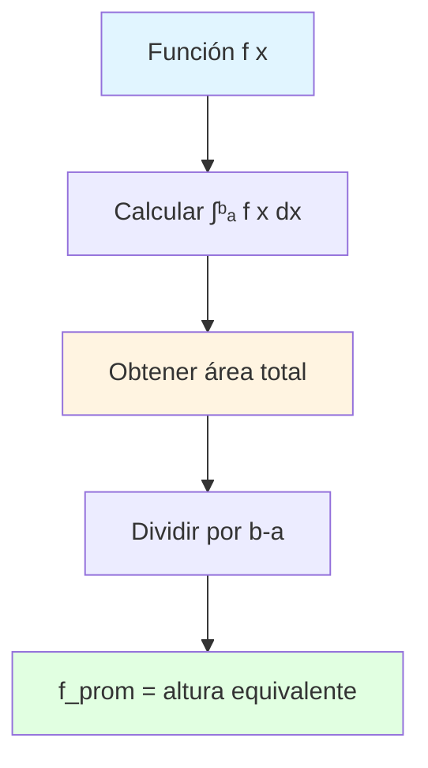
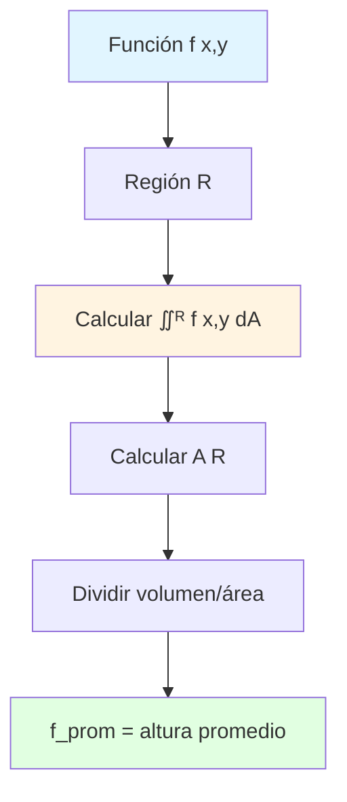
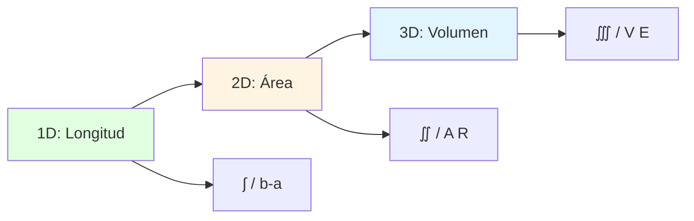
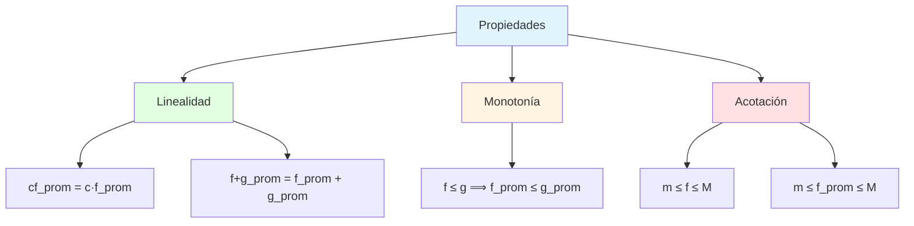
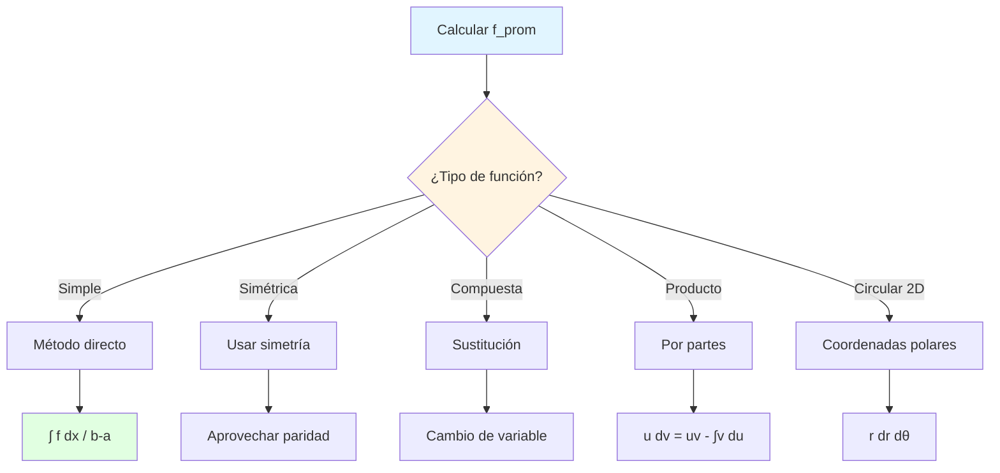
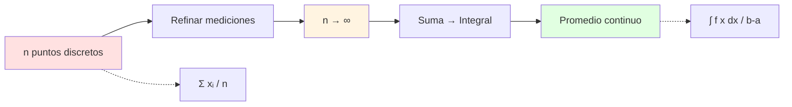
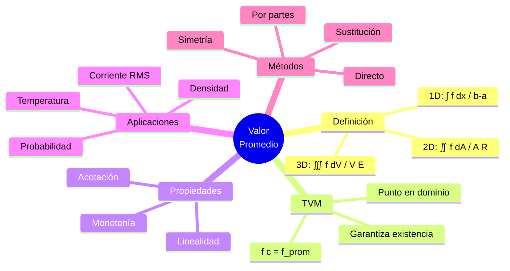
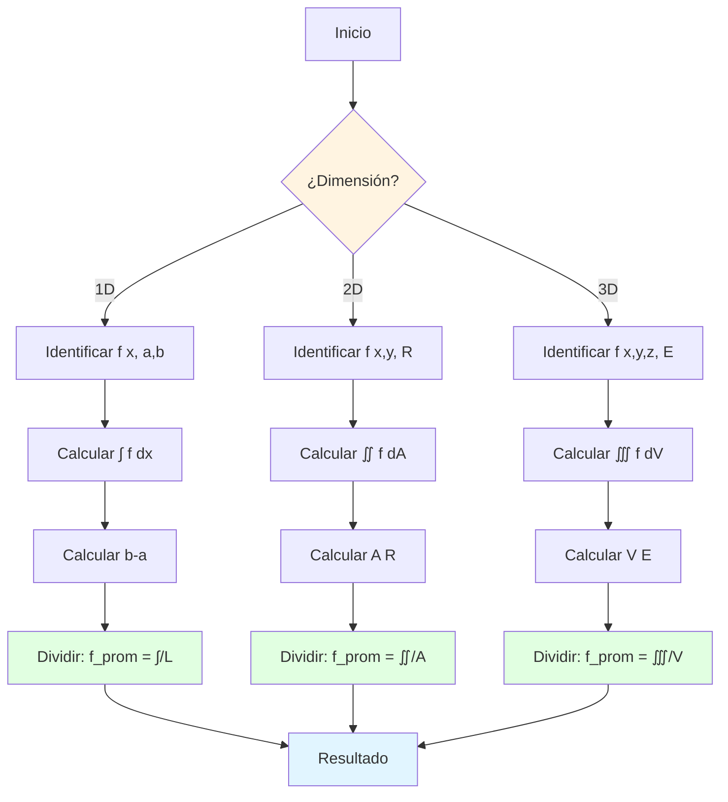
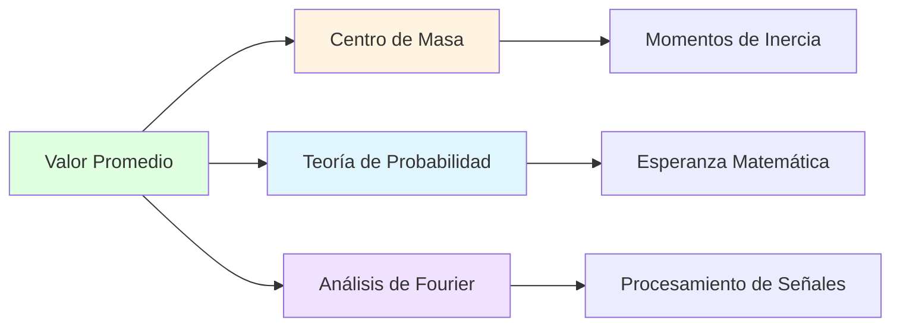
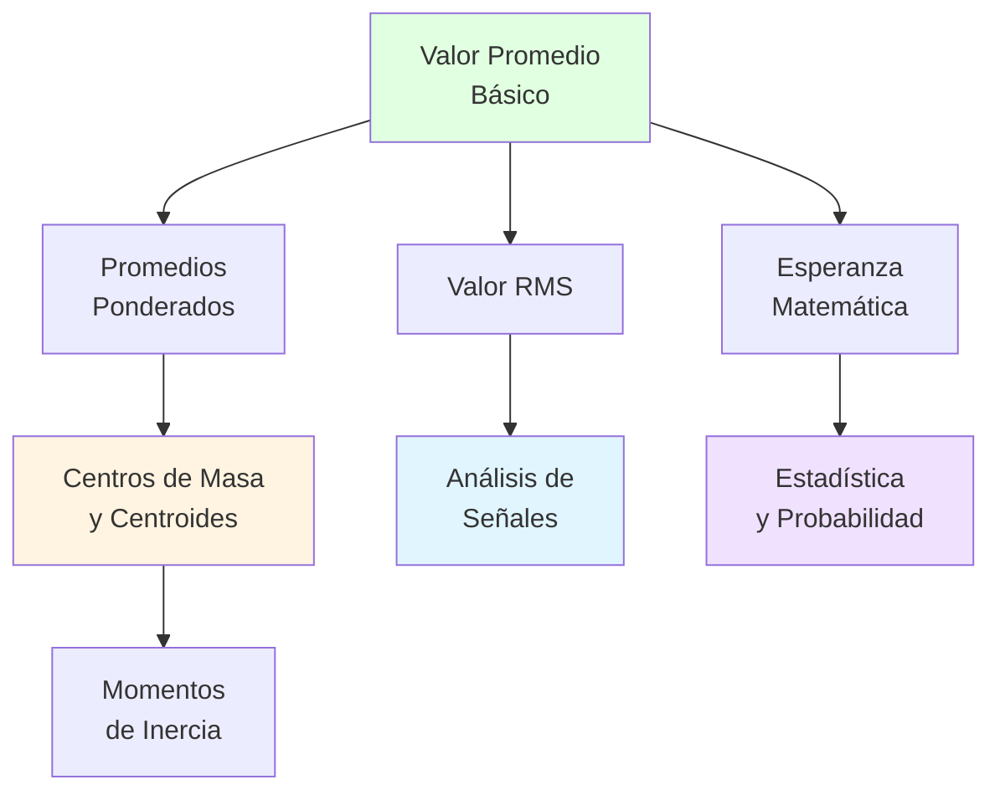

# 📊 Valor Promedio de una Función

## 🎯 Introducción

> [!info]- 💡 ¿Qué es el Valor Promedio de una Función?
> 
> El **valor promedio de una función** es un concepto fundamental que extiende la idea intuitiva de "promedio" desde conjuntos finitos de datos hasta funciones continuas sobre regiones. Representa un valor único que caracteriza el comportamiento global de una función sobre un dominio determinado.
> 
> **Analogía práctica:** Imagina que mides la temperatura de una habitación cada segundo durante una hora. El promedio aritmético te da una idea de la temperatura "típica". El valor promedio de una función de temperatura continua $T(t)$ hace lo mismo, pero considerando **todos** los instantes posibles, no solo mediciones discretas.
> 
> **¿Por qué es importante?**
> 
> |Aspecto|Descripción|Ejemplo de Uso|
> |---|---|---|
> |**Síntesis de información**|Resume el comportamiento global|Temperatura promedio diaria|
> |**Comparación**|Permite comparar funciones diferentes|Eficiencia promedio de motores|
> |**Predicción**|Base para modelos estadísticos|Consumo promedio de energía|
> |**Optimización**|Identificar desviaciones del promedio|Control de calidad|
> |**Análisis físico**|Calcular cantidades conservadas|Valor RMS en electricidad|


---

## 📐 Definición Formal

### 📏 Valor Promedio en Una Variable

> [!example]- 📖 Definición Matemática (1D)
> 
> **Valor promedio de una función de una variable:**
> 
> Sea $f(x)$ una función **integrable** en el intervalo $[a, b]$. El **valor promedio** de $f$ sobre $[a,b]$ se define como:
> 
> $$f_{prom} = \frac{1}{b-a} \int_a^b f(x) , dx$$
> 
> **Componentes:**
> 
> |Elemento|Símbolo|Significado|Unidades|
> |---|---|---|---|
> |**Función**|$f(x)$|Función a promediar|Depende del contexto|
> |**Intervalo**|$[a,b]$|Dominio de integración|Mismas que $x$|
> |**Longitud**|$b - a$|Medida del intervalo|Mismas que $x$|
> |**Integral**|$\int_a^b f(x) , dx$|Área bajo la curva|$[f] \times [x]$|
> |**Promedio**|$f_{prom}$|Valor característico|Mismas que $f(x)$|
> 
> **Interpretación geométrica:**
> 
> El valor promedio $f_{prom}$ es la **altura** del rectángulo que tiene:
> 
> - **Base:** $[a, b]$ (longitud $b-a$)
> - **Área:** Igual al área bajo la curva $y = f(x)$
> 
> ```
>     y
>     ↑
>     |     Curva y=f(x)
>     |       /\    /\
>     |      /  \  /  \
>     |─────────────────── f_prom (altura constante)
>     |    |           |
>     |____|___________|____→ x
>          a           b
>          
>     Área bajo curva = Área rectángulo
>     ∫ᵇₐ f(x)dx = f_prom · (b-a)
> ```



> [!note]- 🔍 Deducción Intuitiva
> 
> **Del promedio discreto al continuo:**
> 
> **Caso discreto (n valores):**
> 
> $$\text{Promedio} = \frac{x_1 + x_2 + \cdots + x_n}{n} = \frac{1}{n} \sum_{i=1}^n x_i$$
> 
> **Caso continuo (infinitos valores):**
> 
> Dividimos $[a,b]$ en $n$ subintervalos de longitud $\Delta x = \frac{b-a}{n}$:
> 
> $$\text{Promedio} \approx \frac{1}{n} \sum_{i=1}^n f(x_i) = \frac{1}{n} \sum_{i=1}^n f(x_i) \cdot \frac{n}{b-a} \cdot \frac{b-a}{n}$$
> 
> $$= \frac{1}{b-a} \sum_{i=1}^n f(x_i) \Delta x$$
> 
> Tomando el límite cuando $n \to \infty$:
> 
> $$f_{prom} = \lim_{n \to \infty} \frac{1}{b-a} \sum_{i=1}^n f(x_i) \Delta x = \frac{1}{b-a} \int_a^b f(x) , dx$$
> 
> **Transición:**
> 
> ```mermaid
> graph LR
>     A[Promedio discreto<br/>suma finita] --> B[Refinar partición<br/>n → ∞]
>     B --> C[Suma de Riemann<br/>∑ f xᵢ Δx]
>     C --> D[Integral definida<br/>∫ f x dx]
>     D --> E[Valor promedio<br/>1/b-a · ∫]
>     
>     style A fill:#ffe1e1
>     style C fill:#fff4e1
>     style E fill:#e1ffe1
> ```

### 🌐 Valor Promedio en Dos Variables

> [!example]- 🗺️ Definición Matemática (2D)
> 
> **Valor promedio de una función de dos variables:**
> 
> Sea $f(x,y)$ una función **integrable** sobre una región $R$ del plano. El **valor promedio** de $f$ sobre $R$ se define como:
> 
> $$f_{prom} = \frac{1}{A(R)} \iint_R f(x,y) , dA$$
> 
> donde $A(R)$ es el **área** de la región $R$.
> 
> **Componentes:**
> 
> |Elemento|Símbolo|Significado|Observación|
> |---|---|---|---|
> |**Función**|$f(x,y)$|Función bidimensional|Puede ser temperatura, densidad, etc.|
> |**Región**|$R$|Dominio en $\mathbb{R}^2$|Generalmente cerrada y acotada|
> |**Área**|$A(R)$|Medida de la región|$A(R) = \iint_R dA$|
> |**Integral doble**|$\iint_R f(x,y) , dA$|Volumen bajo superficie|Suma continua de valores|
> |**Promedio**|$f_{prom}$|Altura promedio|Número real único|
> 
> **Interpretación geométrica:**
> 
> El valor promedio $f_{prom}$ es la **altura** del sólido cilíndrico que tiene:
> 
> - **Base:** Región $R$
> - **Volumen:** Igual al volumen bajo la superficie $z = f(x,y)$
> 
> ```
>     z
>     ↑
>     |    Superficie z=f(x,y)
>     |      /\  /\
>     |     /  \/  \
>     |────────────── f_prom
>     |   |      |
>     |   |  R   |
>     |___|______|___→ y
>        /
>       /
>      ↙ x
> ```



### 📦 Valor Promedio en Tres Variables

> [!example]- 🎲 Definición Matemática (3D)
> 
> **Valor promedio de una función de tres variables:**
> 
> Sea $f(x,y,z)$ una función **integrable** sobre una región sólida $E$ en el espacio. El **valor promedio** de $f$ sobre $E$ se define como:
> 
> $$f_{prom} = \frac{1}{V(E)} \iiint_E f(x,y,z) , dV$$
> 
> donde $V(E)$ es el **volumen** de la región $E$.
> 
> **Comparación de dimensiones:**
> 
> |Dimensión|Función|Dominio|Medida|Integral|Fórmula Promedio|
> |---|---|---|---|---|---|
> |**1D**|$f(x)$|$[a,b]$|Longitud $b-a$|$\int_a^b f , dx$|$\frac{1}{b-a} \int_a^b f , dx$|
> |**2D**|$f(x,y)$|Región $R$|Área $A(R)$|$\iint_R f , dA$|$\frac{1}{A(R)} \iint_R f , dA$|
> |**3D**|$f(x,y,z)$|Sólido $E$|Volumen $V(E)$|$\iiint_E f , dV$|$\frac{1}{V(E)} \iiint_E f , dV$|



---

## 🔗 Relación con el Teorema del Valor Medio

> [!tip]- 🎯 Conexión Fundamental
> 
> El **Teorema del Valor Medio para Integrales** establece que el valor promedio se alcanza en al menos un punto del dominio.
> 
> **Teorema (una variable):**
> 
> Si $f$ es continua en $[a,b]$, entonces existe $c \in [a,b]$ tal que:
> 
> $$f(c) = f_{prom} = \frac{1}{b-a} \int_a^b f(x) , dx$$
> 
> **Equivalentemente:**
> 
> $$\int_a^b f(x) , dx = f(c) \cdot (b-a)$$
> 
> **Interpretación:**
> 
> - El valor promedio **no es solo un número abstracto**
> - Es un valor que la función **realmente alcanza** en algún punto
> - Existe al menos un punto donde $f$ toma su valor promedio
> 
> **Visualización:**
> 
> ```mermaid
> graph TD
>     A[f continua en a,b] --> B[Calcular f_prom]
>     B --> C[TVM garantiza]
>     C --> D[∃ c ∈ a,b]
>     D --> E[f c = f_prom]
>     
>     style A fill:#e1f5ff
>     style C fill:#fff4e1
>     style E fill:#e1ffe1
> ```
> 
> **Extensión a dos variables:**
> 
> Si $f(x,y)$ es continua en región cerrada y acotada $R$:
> 
> $$\exists (x_0, y_0) \in R: \quad f(x_0, y_0) = f_{prom} = \frac{1}{A(R)} \iint_R f(x,y) , dA$$
> 
> **Comparación:**
> 
> |Aspecto|Sin TVM|Con TVM|
> |---|---|---|
> |**Promedio**|Solo un número calculado|Valor alcanzado por $f$|
> |**Existencia**|No garantizada|✅ Garantizada|
> |**Punto**|Desconocido|✅ Existe $c$ o $(x_0, y_0)$|
> |**Interpretación**|Abstracta|Concreta y geométrica|

---

## 💡 Ejemplos Resueltos (Una Variable)

> [!example]- 📝 Ejemplo 1: Función Lineal
> 
> **Problema:**
> 
> Calcular el valor promedio de $f(x) = 2x + 1$ en el intervalo $[0, 3]$.
> 
> **Solución:**
> 
> **Paso 1: Identificar componentes**
> 
> - Función: $f(x) = 2x + 1$
> - Intervalo: $[a, b] = [0, 3]$
> - Longitud: $b - a = 3 - 0 = 3$
> 
> **Paso 2: Calcular la integral**
> 
> $$\int_0^3 (2x + 1) , dx = \left[x^2 + x\right]_0^3 = (9 + 3) - (0 + 0) = 12$$
> 
> **Paso 3: Calcular el valor promedio**
> 
> $$f_{prom} = \frac{1}{3} \cdot 12 = 4$$
> 
> **Verificación con TVM:**
> 
> Buscamos $c \in [0,3]$ tal que $f(c) = 4$:
> 
> $$2c + 1 = 4 \implies 2c = 3 \implies c = \frac{3}{2} = 1.5$$
> 
> Como $1.5 \in [0, 3]$, el TVM se verifica. ✅
> 
> **Interpretación geométrica:**
> 
> El rectángulo con base $[0,3]$ y altura $4$ tiene la misma área que la región bajo $f(x) = 2x + 1$.
> 
> $$\text{Área bajo } f = 12 = 4 \times 3 = f_{prom} \times (b-a)$$
> 
> **Respuesta:** $f_{prom} = 4$ alcanzado en $c = 1.5$

> [!example]- 📝 Ejemplo 2: Función Cuadrática
> 
> **Problema:**
> 
> Encontrar el valor promedio de $f(x) = x^2$ en $[-1, 2]$.
> 
> **Solución:**
> 
> **Paso 1: Datos**
> 
> - $f(x) = x^2$
> - $[a, b] = [-1, 2]$
> - Longitud: $2 - (-1) = 3$
> 
> **Paso 2: Integral**
> 
> $$\int_{-1}^2 x^2 , dx = \left[\frac{x^3}{3}\right]_{-1}^2 = \frac{8}{3} - \frac{-1}{3} = \frac{8 + 1}{3} = \frac{9}{3} = 3$$
> 
> **Paso 3: Promedio**
> 
> $$f_{prom} = \frac{1}{3} \cdot 3 = 1$$
> 
> **Verificación:**
> 
> Buscamos $c$ donde $c^2 = 1$:
> 
> $$c = \pm 1$$
> 
> Ambos valores están en $[-1, 2]$:
> 
> - $c_1 = -1$ ✅
> - $c_2 = 1$ ✅
> 
> El TVM no garantiza unicidad, ¡puede haber múltiples puntos!
> 
> **Respuesta:** $f_{prom} = 1$, alcanzado en $c = -1$ y $c = 1$

> [!example]- 📝 Ejemplo 3: Función Trigonométrica
> 
> **Problema:**
> 
> Calcular el valor promedio de $f(x) = \sin(x)$ en $[0, \pi]$.
> 
> **Solución:**
> 
> **Paso 1: Setup**
> 
> - $f(x) = \sin(x)$
> - $[a, b] = [0, \pi]$
> - Longitud: $\pi - 0 = \pi$
> 
> **Paso 2: Integral**
> 
> $$\int_0^\pi \sin(x) , dx = \left[-\cos(x)\right]_0^\pi = -\cos(\pi) - (-\cos(0))$$
> 
> $$= -(-1) - (-1) = 1 + 1 = 2$$
> 
> **Paso 3: Promedio**
> 
> $$f_{prom} = \frac{1}{\pi} \cdot 2 = \frac{2}{\pi} \approx 0.6366$$
> 
> **Interpretación física:**
> 
> Si $\sin(x)$ representa una señal sinusoidal en medio período, su valor promedio es $\frac{2}{\pi}$.
> 
> **Verificación:**
> 
> Buscamos $c \in [0, \pi]$ donde $\sin(c) = \frac{2}{\pi}$:
> 
> $$c = \arcsin\left(\frac{2}{\pi}\right) \approx 0.69 \text{ radianes} \approx 39.5°$$
> 
> Como $0.69 \in [0, \pi]$, el TVM se verifica. ✅
> 
> **Respuesta:** $f_{prom} = \frac{2}{\pi}$

> [!example]- 📝 Ejemplo 4: Función Exponencial
> 
> **Problema:**
> 
> Determinar el valor promedio de $f(x) = e^x$ en $[0, 1]$.
> 
> **Solución:**
> 
> **Paso 1: Componentes**
> 
> - $f(x) = e^x$
> - $[a, b] = [0, 1]$
> - Longitud: $1$
> 
> **Paso 2: Integral**
> 
> $$\int_0^1 e^x , dx = \left[e^x\right]_0^1 = e^1 - e^0 = e - 1$$
> 
> **Paso 3: Promedio**
> 
> $$f_{prom} = \frac{1}{1} \cdot (e - 1) = e - 1 \approx 1.718$$
> 
> **Verificación:**
> 
> Buscamos $c$ donde $e^c = e - 1$:
> 
> $$c = \ln(e - 1) \approx \ln(1.718) \approx 0.541$$
> 
> Como $0.541 \in [0, 1]$, el TVM se verifica. ✅
> 
> **Respuesta:** $f_{prom} = e - 1$

---

## 🌍 Ejemplos Resueltos (Dos Variables)

> [!example]- 📝 Ejemplo 5: Región Rectangular
> 
> **Problema:**
> 
> Calcular el valor promedio de $f(x,y) = xy$ sobre el rectángulo $R = [0, 2] \times [0, 3]$.
> 
> **Solución:**
> 
> **Paso 1: Área de la región**
> 
> $$A(R) = 2 \times 3 = 6$$
> 
> **Paso 2: Integral doble**
> 
> $$\iint_R xy , dA = \int_0^2 \int_0^3 xy , dy , dx$$
> 
> Integrando respecto a $y$:
> 
> $$= \int_0^2 x \left[\frac{y^2}{2}\right]_0^3 dx = \int_0^2 x \cdot \frac{9}{2} , dx = \frac{9}{2} \int_0^2 x , dx$$
> 
> $$= \frac{9}{2} \left[\frac{x^2}{2}\right]_0^2 = \frac{9}{2} \cdot 2 = 9$$
> 
> **Paso 3: Valor promedio**
> 
> $$f_{prom} = \frac{9}{6} = \frac{3}{2} = 1.5$$
> 
> **Verificación con TVM:**
> 
> Buscamos $(x_0, y_0) \in R$ donde $x_0 y_0 = 1.5$.
> 
> Hay infinitas soluciones, por ejemplo:
> 
> - $(1, 1.5)$ ✅
> - $(1.5, 1)$ ✅
> - $(0.75, 2)$ ✅
> 
> **Respuesta:** $f_{prom} = 1.5$

> [!example]- 📝 Ejemplo 6: Región Triangular
> 
> **Problema:**
> 
> Encontrar el valor promedio de $f(x,y) = x + y$ sobre el triángulo con vértices $(0,0)$, $(1,0)$, $(0,1)$.
> 
> **Solución:**
> 
> **Paso 1: Descripción de la región**
> 
> El triángulo está delimitado por:
> 
> - $x \geq 0$
> - $y \geq 0$
> - $x + y \leq 1$
> 
> **Paso 2: Área del triángulo**
> 
> $$A(R) = \frac{1}{2} \cdot 1 \cdot 1 = \frac{1}{2}$$
> 
> **Paso 3: Integral doble**
> 
> $$\iint_R (x + y) , dA = \int_0^1 \int_0^{1-x} (x + y) , dy , dx$$
> 
> Integrando respecto a $y$:
> 
> $$= \int_0^1 \left[xy + \frac{y^2}{2}\right]_0^{1-x} dx = \int_0^1 \left(x(1-x) + \frac{(1-x)^2}{2}\right) dx$$
> 
> $$= \int_0^1 \left(x - x^2 + \frac{1 - 2x + x^2}{2}\right) dx$$
> 
> $$= \int_0^1 \left(x - x^2 + \frac{1}{2} - x + \frac{x^2}{2}\right) dx = \int_0^1 \left(\frac{1}{2} - \frac{x^2}{2}\right) dx$$
> 
> $$= \left[\frac{x}{2} - \frac{x^3}{6}\right]_0^1 = \frac{1}{2} - \frac{1}{6} = \frac{3 - 1}{6} = \frac{2}{6} = \frac{1}{3}$$
> 
> **Paso 4: Valor promedio**
> 
> $$f_{prom} = \frac{1/3}{1/2} = \frac{1}{3} \cdot \frac{2}{1} = \frac{2}{3}$$
> 
> **Respuesta:** $f_{prom} = \frac{2}{3}$

> [!example]- 📝 Ejemplo 7: Región Circular
> 
> **Problema:**
> 
> Calcular el valor promedio de $f(x,y) = x^2 + y^2$ sobre el disco $x^2 + y^2 \leq 1$.
> 
> **Solución:**
> 
> **Paso 1: Área del disco**
> 
> $$A(R) = \pi r^2 = \pi(1)^2 = \pi$$
> 
> **Paso 2: Convertir a coordenadas polares**
> 
> - $x = r\cos\theta$, $y = r\sin\theta$
> - $x^2 + y^2 = r^2$
> - $dA = r , dr , d\theta$
> - Límites: $0 \leq r \leq 1$, $0 \leq \theta \leq 2\pi$
> 
> **Paso 3: Integral en polares**
> 
> $$\iint_R (x^2 + y^2) , dA = \int_0^{2\pi} \int_0^1 r^2 \cdot r , dr , d\theta$$
> 
> $$= \int_0^{2\pi} \int_0^1 r^3 , dr , d\theta = \int_0^{2\pi} \left[\frac{r^4}{4}\right]_0^1 d\theta$$
> 
> $$= \int_0^{2\pi} \frac{1}{4} , d\theta = \frac{1}{4} \cdot 2\pi = \frac{\pi}{2}$$
> 
> **Paso 4: Valor promedio**
> 
> $$f_{prom} = \frac{\pi/2}{\pi} = \frac{1}{2}$$
> 
> **Interpretación:**
> 
> La distancia cuadrática promedio desde el origen hasta puntos del disco unitario es $\frac{1}{2}$.
> 
> **Respuesta:** $f_{prom} = \frac{1}{2}$

---

## 🚀 Aplicaciones Prácticas

> [!success]- 🌡️ Aplicación 1: Temperatura Promedio
> 
> **Problema real:**
> 
> Una varilla metálica de 10 cm de longitud tiene distribución de temperatura:
> 
> $$T(x) = 100 - 0.5x^2 \quad \text{°C}$$
> 
> donde $x$ es la distancia en cm desde un extremo.
> 
> **Calcular la temperatura promedio:**
> 
> $$T_{prom} = \frac{1}{10-0} \int_0^{10} (100 - 0.5x^2) , dx$$
> 
> $$= \frac{1}{10} \left[100x - \frac{0.5x^3}{3}\right]_0^{10}$$
> 
> $$= \frac{1}{10} \left(1000 - \frac{500}{3}\right) = \frac{1}{10} \cdot \frac{3000 - 500}{3}$$
> 
> $$= \frac{2500}{30} = \frac{250}{3} \approx 83.33 \text{ °C}$$
> 
> **Interpretación:**
> 
> Aunque la temperatura varía de 100°C (en $x=0$) a 50°C (en $x=10$), la temperatura promedio es aproximadamente 83.33°C.

> [!success]- ⚡ Aplicación 2: Valor RMS (Root Mean Square)
> 
> **Concepto:**
> 
> El **valor eficaz** o **RMS** de una función periódica es crucial en electricidad.
> 
> Para una corriente alterna $I(t) = I_0 \sin(\omega t)$:
> 
> $$I_{RMS} = \sqrt{\frac{1}{T} \int_0^T I^2(t) , dt}$$
> 
> donde $T = \frac{2\pi}{\omega}$ es el período.
> 
> **Cálculo:**
> 
> $$I_{RMS} = \sqrt{\frac{1}{T} \int_0^T I_0^2 \sin^2(\omega t) , dt}$$
> 
> Usando $\sin^2(x) = \frac{1 - \cos(2x)}{2}$:
> 
> $$= I_0 \sqrt{\frac{1}{T} \int_0^T \frac{1 - \cos(2\omega t)}{2} , dt}$$
> 
> $$= I_0 \sqrt{\frac{1}{T} \cdot \frac{T}{2}} = \frac{I_0}{\sqrt{2}}$$
> 
> **Resultaconocido:**

> Para corriente alterna con amplitud $I_0 = 170$ A:
> 
> $$I_{RMS} = \frac{170}{\sqrt{2}} \approx 120 \text{ A}$$
> 
> **Interpretación:**
> 
> El valor RMS es la corriente continua equivalente que produciría la misma potencia disipada.

> [!success]- 🌾 Aplicación 3: Densidad Poblacional
> 
> **Problema:**
> 
> Una ciudad circular tiene densidad poblacional (personas/km²):
> 
> $$\rho(r) = 5000 e^{-0.1r}$$
> 
> donde $r$ es la distancia en km desde el centro. La ciudad tiene radio 10 km.
> 
> **Calcular densidad promedio:**
> 
> Usando coordenadas polares ($0 \leq r \leq 10$, $0 \leq \theta \leq 2\pi$):
> 
> $$\rho_{prom} = \frac{1}{\pi(10)^2} \int_0^{2\pi} \int_0^{10} 5000 e^{-0.1r} \cdot r , dr , d\theta$$
> 
> $$= \frac{1}{100\pi} \cdot 2\pi \int_0^{10} 5000r e^{-0.1r} , dr$$
> 
> $$= \frac{100}{1} \int_0^{10} r e^{-0.1r} , dr$$
> 
> Usando integración por partes:
> 
> $$\approx 100 \cdot 63.21 = 6321 \text{ personas/km²}$$
> 
> **Interpretación:**
> 
> Aunque la densidad varía desde 5000 en el centro hasta ~1839 en el borde, la densidad promedio es aproximadamente 6321 personas/km².

> [!success]- 🏔️ Aplicación 4: Altura Promedio del Terreno
> 
> **Problema:**
> 
> Una región montañosa cuadrada de 1 km × 1 km tiene elevación:
> 
> $$h(x,y) = 500 + 200\sin(\pi x)\sin(\pi y) \quad \text{metros}$$
> 
> **Calcular altura promedio:**
> 
> $$h_{prom} = \frac{1}{1 \times 1} \int_0^1 \int_0^1 [500 + 200\sin(\pi x)\sin(\pi y)] , dy , dx$$
> 
> $$= \int_0^1 \int_0^1 500 , dy , dx + 200 \int_0^1 \sin(\pi x) , dx \int_0^1 \sin(\pi y) , dy$$
> 
> Primera integral: $$\int_0^1 \int_0^1 500 , dy , dx = 500$$
> 
> Segunda integral: $$\int_0^1 \sin(\pi x) , dx = \left[-\frac{\cos(\pi x)}{\pi}\right]_0^1 = \frac{2}{\pi}$$
> 
> Por simetría, ambas integrales son iguales:
> 
> $$h_{prom} = 500 + 200 \cdot \frac{2}{\pi} \cdot \frac{2}{\pi} = 500 + \frac{800}{\pi^2} \approx 500 + 81.06 = 581.06 \text{ m}$$
> 
> **Respuesta:** La altura promedio es aproximadamente 581 metros.

---

## 📊 Propiedades del Valor Promedio

> [!note]- 🔧 Propiedades Algebraicas
> 
> Sean $f$ y $g$ funciones integrables en $[a,b]$, y $c$ una constante:
> 
> **1. Linealidad:**
> 
> $$(cf)_{prom} = c \cdot f_{prom}$$
> 
> $$(f + g)_{prom} = f_{prom} + g_{prom}$$
> 
> **Demostración de la primera:**
> 
> $$(cf)_{prom} = \frac{1}{b-a} \int_a^b cf(x) , dx = \frac{c}{b-a} \int_a^b f(x) , dx = c \cdot f_{prom}$$
> 
> ---
> 
> **2. Monotonía:**
> 
> Si $f(x) \leq g(x)$ para todo $x \in [a,b]$, entonces:
> 
> $$f_{prom} \leq g_{prom}$$
> 
> ---
> 
> **3. Acotación:**
> 
> Si $m \leq f(x) \leq M$ para todo $x \in [a,b]$, entonces:
> 
> $$m \leq f_{prom} \leq M$$
> 
> **Demostración:**
> 
> $$m \leq f(x) \leq M$$
> 
> Integrando:
> 
> $$\int_a^b m , dx \leq \int_a^b f(x) , dx \leq \int_a^b M , dx$$
> 
> $$m(b-a) \leq \int_a^b f(x) , dx \leq M(b-a)$$
> 
> Dividiendo por $b-a$:
> 
> $$m \leq f_{prom} \leq M$$
> 
> ---
> 
> **4. Función constante:**
> 
> Si $f(x) = c$ para todo $x \in [a,b]$, entonces:
> 
> $$f_{prom} = c$$
> 
> **Verificación:**
> 
> $$f_{prom} = \frac{1}{b-a} \int_a^b c , dx = \frac{c(b-a)}{b-a} = c$$
> 
> ---
> 
> **Tabla resumen:**
> 
> |Propiedad|Fórmula|Significado|
> |---|---|---|
> |**Escalamiento**|$(cf)_{prom} = c \cdot f_{prom}$|El promedio escala linealmente|
> |**Aditividad**|$(f+g)_{prom} = f_{prom} + g_{prom}$|El promedio de sumas es suma de promedios|
> |**Monotonía**|$f \leq g \Rightarrow f_{prom} \leq g_{prom}$|Orden se preserva|
> |**Acotación**|$m \leq f \leq M \Rightarrow m \leq f_{prom} \leq M$|Promedio entre extremos|



---

## ⚙️ Métodos de Cálculo

> [!tip]- 🔢 Estrategias para Calcular Promedios
> 
> **Método 1: Directo (para funciones simples)**
> 
> ```
> 1. Identificar f(x) y [a,b]
> 2. Calcular ∫ᵇₐ f(x) dx
> 3. Dividir por (b-a)
> ```
> 
> **Ejemplo:**
> 
> $f(x) = 3x^2$ en $[0, 2]$
> 
> $$f_{prom} = \frac{1}{2} \int_0^2 3x^2 , dx = \frac{1}{2} \cdot [x^3]_0^2 = \frac{8}{2} = 4$$
> 
> ---
> 
> **Método 2: Simetría (cuando aplicable)**
> 
> Si $f$ es **par** en $[-a, a]$:
> 
> $$f_{prom} = \frac{1}{2a} \int_{-a}^a f(x) , dx = \frac{1}{2a} \cdot 2\int_0^a f(x) , dx = \frac{1}{a} \int_0^a f(x) , dx$$
> 
> **Ejemplo:**
> 
> $f(x) = x^2$ en $[-2, 2]$ (función par):
> 
> $$f_{prom} = \frac{1}{2} \int_0^2 x^2 , dx = \frac{1}{2} \cdot \frac{8}{3} = \frac{4}{3}$$
> 
> Si $f$ es **impar** en $[-a, a]$:
> 
> $$f_{prom} = 0$$
> 
> ---
> 
> **Método 3: Sustitución (funciones compuestas)**
> 
> **Ejemplo:**
> 
> $f(x) = x\sqrt{1+x^2}$ en $[0, 1]$
> 
> Sustitución: $u = 1 + x^2$, $du = 2x , dx$
> 
> $$f_{prom} = \int_0^1 x\sqrt{1+x^2} , dx = \frac{1}{2}\int_1^2 \sqrt{u} , du = \frac{1}{2} \cdot \frac{2}{3}[u^{3/2}]_1^2$$
> 
> ---
> 
> **Método 4: Integración por partes**
> 
> **Ejemplo:**
> 
> $f(x) = x\ln(x)$ en $[1, e]$
> 
> $$f_{prom} = \frac{1}{e-1} \int_1^e x\ln(x) , dx$$
> 
> Usando $\int x\ln(x) , dx = \frac{x^2\ln(x)}{2} - \frac{x^2}{4} + C$
> 
> ---
> 
> **Método 5: Coordenadas polares (2D con simetría circular)**
> 
> Para $f(x,y)$ que depende solo de $r = \sqrt{x^2 + y^2}$:
> 
> $$f_{prom} = \frac{1}{\pi R^2} \int_0^{2\pi} \int_0^R f(r) \cdot r , dr , d\theta = \frac{2}{R^2} \int_0^R r f(r) , dr$$



---

## 🎓 Ejercicios Propuestos

> [!example]- 💪 Práctica Guiada
> 
> **Nivel Básico:**
> 
> **1. Funciones polinomiales**
> 
> Calcular el valor promedio de:
> 
> a) $f(x) = 3x - 2$ en $[1, 5]$
> 
> b) $f(x) = x^3$ en $[0, 2]$
> 
> c) $f(x) = 4 - x^2$ en $[-2, 2]$
> 
> **Pista:** Para (c), usar simetría.
> 
> ---
> 
> **2. Funciones trigonométricas**
> 
> Encontrar el valor promedio de:
> 
> a) $f(x) = \cos(x)$ en $[0, \pi]$
> 
> b) $f(x) = \sin^2(x)$ en $[0, \pi]$
> 
> **Pista:** Para (b), usar identidad $\sin^2(x) = \frac{1-\cos(2x)}{2}$
> 
> ---
> 
> **Nivel Intermedio:**
> 
> **3. Funciones exponenciales**
> 
> a) Calcular valor promedio de $f(x) = e^{-x}$ en $[0, 2]$
> 
> b) Encontrar $f_{prom}$ de $f(x) = xe^x$ en $[0, 1]$
> 
> **Pista:** Para (b), usar integración por partes.
> 
> ---
> 
> **4. Dos variables - Rectángulo**
> 
> Calcular el valor promedio de $f(x,y) = x^2 + 2y$ sobre $R = [0,1] \times [0,2]$.
> 
> **Pista:** Separar en dos integrales.
> 
> ---
> 
> **5. Dos variables - Triángulo**
> 
> Encontrar $f_{prom}$ de $f(x,y) = y$ sobre el triángulo con vértices $(0,0)$, $(2,0)$, $(0,3)$.
> 
> **Pista:** Área del triángulo = 3.
> 
> ---
> 
> **Nivel Avanzado:**
> 
> **6. Región circular**
> 
> Calcular el valor promedio de $f(x,y) = xy$ sobre el disco $x^2 + y^2 \leq 4$.
> 
> **Pista:** Usar coordenadas polares. Note que $xy = r^2\cos\theta\sin\theta$.
> 
> ---
> 
> **7. Aplicación física**
> 
> Una corriente eléctrica varía según $I(t) = 10\sin(60\pi t)$ amperes.
> 
> a) Calcular el valor promedio en un período $T = \frac{1}{30}$ segundos
> 
> b) Calcular el valor RMS
> 
> **Pista:** El promedio de $\sin$ en un período es cero.
> 
> ---
> 
> **8. Temperatura en placa**
> 
> Una placa semicircular de radio 1 tiene temperatura:
> 
> $$T(r, \theta) = 100(1 - r^2)$$
> 
> donde $0 \leq r \leq 1$ y $0 \leq \theta \leq \pi$.
> 
> Encontrar la temperatura promedio.
> 
> **Pista:** Área del semicírculo = $\frac{\pi}{2}$.
> 
> ---
> 
> **9. Demostración**
> 
> Demostrar que para funciones continuas $f$ y $g$ en $[a,b]$:
> 
> $$(fg)_{prom} \neq f_{prom} \cdot g_{prom}$$
> 
> en general. Dar un contraejemplo.
> 
> **Pista:** Probar con $f(x) = g(x) = x$ en $[0,1]$.
> 
> ---
> 
> **10. Optimización**
> 
> Encontrar el valor de $c$ tal que la función $f(x) = cx^2$ tenga valor promedio 4 en $[0, 2]$.

---

## 📈 Comparación: Promedio Discreto vs Continuo

> [!note]- 🔄 Transición de Discreto a Continuo
> 
> **Tabla comparativa:**
> 
> |Aspecto|Promedio Discreto|Promedio Continuo|
> |---|---|---|
> |**Datos**|Finitos: $x_1, x_2, \ldots, x_n$|Infinitos: $f(x)$ en $[a,b]$|
> |**Fórmula**|$\bar{x} = \frac{1}{n}\sum_{i=1}^n x_i$|$f_{prom} = \frac{1}{b-a}\int_a^b f(x) , dx$|
> |**Operación**|Suma finita|Integral (suma infinita)|
> |**División**|Cantidad de datos $n$|Longitud del intervalo $b-a$|
> |**Aplicación**|Mediciones, muestras|Funciones continuas|
> |**Interpretación**|Centro de masa de puntos|Altura del rectángulo equivalente|
> 
> **Ejemplo de transición:**
> 
> Medir temperatura cada hora durante 24 horas vs. temperatura continua $T(t)$.
> 
> **Discreto:** $$T_{prom} = \frac{T_0 + T_1 + \cdots + T_{23}}{24}$$
> 
> **Continuo:** $$T_{prom} = \frac{1}{24} \int_0^{24} T(t) , dt$$
> 
> **Límite:**
> 
> Si medimos cada $\Delta t$ horas:
> 
> $$\frac{1}{24}\sum_{i=0}^{n-1} T(t_i) \Delta t \xrightarrow[\Delta t \to 0]{} \frac{1}{24}\int_0^{24} T(t) , dt$$



---

## 🔬 Aplicaciones Avanzadas

> [!success]- 🎯 Aplicaciones en Matemáticas Avanzadas
> 
> **1. Teoría de Probabilidad**
> 
> Para una variable aleatoria continua $X$ con función de densidad $f(x)$:
> 
> $$E[X] = \int_{-\infty}^{\infty} x f(x) , dx$$
> 
> El **valor esperado** es una forma de valor promedio ponderado.
> 
> ---
> 
> **2. Análisis de Fourier**
> 
> Los coeficientes de Fourier son promedios ponderados:
> 
> $$a_n = \frac{1}{\pi} \int_{-\pi}^{\pi} f(x) \cos(nx) , dx$$
> 
> ---
> 
> **3. Ecuaciones Diferenciales**
> 
> El **método de promedios** aproxima soluciones de EDOs:
> 
> $$\dot{x} = \epsilon f(x, t)$$
> 
> reemplazando $f$ por su promedio temporal.
> 
> ---
> 
> **4. Mecánica Cuántica**
> 
> El valor esperado de un observable $\hat{A}$:
> 
> $$\langle A \rangle = \int \psi^*(x) \hat{A} \psi(x) , dx$$
> 
> ---
> 
> **5. Termodinámica Estadística**
> 
> Promedios de ensemble:
> 
> $$\langle E \rangle = \int E \cdot P(E) , dE$$
> 
> donde $P(E)$ es la distribución de probabilidad de energía.

---

## 📊 Resumen Visual Completo

### Mapa Conceptual



### Tabla Resumen Dimensional

|Dimensión|Función|Dominio|Medida|Fórmula Promedio|
|---|---|---|---|---|
|**1D**|$f(x)$|$[a,b]$|Longitud $L = b-a$|$\displaystyle \frac{1}{L}\int_a^b f , dx$|
|**2D**|$f(x,y)$|Región $R$|Área $A(R)$|$\displaystyle \frac{1}{A(R)}\iint_R f , dA$|
|**3D**|$f(x,y,z)$|Sólido $E$|Volumen $V(E)$|$\displaystyle \frac{1}{V(E)}\iiint_E f , dV$|

### Diagrama de Flujo para Cálculo



---

## 🔗 Conexión con Próximos Temas

> [!quote]- 🌟 Continuando el Aprendizaje
> 
> **Has dominado:**
> 
> - ✅ Concepto de valor promedio
> - ✅ Cálculo en una y varias variables
> - ✅ Teorema del valor medio
> - ✅ Aplicaciones prácticas
> - ✅ Propiedades algebraicas
> 
> **Progresión natural del aprendizaje:**
> 
> |Nivel|Tema|Conexión|
> |---|---|---|
> |**Actual**|Valor Promedio|Fundamento estadístico|
> |**Siguiente**|Centro de Masa|Promedio ponderado|
> |**Relacionado**|Momentos de Inercia|Promedios de segundo orden|
> |**Aplicado**|Transformada de Fourier|Promedios de funciones periódicas|
> |**Teórico**|Teoría de la Medida|Generalización abstracta|
> |**Avanzado**|Análisis Funcional|Espacios de Hilbert|



**Roadmap de evolución:**



---

**Tags:** #cálculo #integrales #valor-promedio #teorema-valor-medio #aplicaciones #una-variable #varias-variables #estadística #física #mermaid #diagramas