# 🔄 Transformaciones entre Sistemas de Coordenadas

## 🎯 Introducción

> [!info]- 💡 ¿Qué son las Transformaciones de Coordenadas?
> 
> Las **transformaciones de coordenadas** son funciones matemáticas que permiten expresar la posición de un punto usando diferentes sistemas de referencia. Cada sistema tiene ventajas particulares según la geometría del problema.
> 
> **Analogía práctica:** Imagina dar direcciones a tu casa. Puedes usar:
> 
> - **Coordenadas cartesianas:** "3 km al este, 4 km al norte desde la plaza"
> - **Coordenadas polares:** "5 km en dirección noreste (53°) desde la plaza"
> - **Coordenadas geográficas:** "Latitud 0°, Longitud 78°W"
> 
> Todas describen el **mismo punto**, pero usando diferentes referencias. La transformación permite convertir entre estos sistemas.
> 
> **¿Por qué son importantes?**
> 
> |Aspecto|Descripción|Ejemplo de Uso|
> |---|---|---|
> |**Simplificación**|Algunos problemas son más fáciles en ciertos sistemas|Círculos en polares vs cartesianas|
> |**Simetría**|Explotar la geometría natural del problema|Esferas en coordenadas esféricas|
> |**Cálculo**|Facilitar integrales y derivadas|Integrales dobles/triples|
> |**Física**|Sistemas naturales según fuerzas|Movimiento circular, gravitación|
> |**Ingeniería**|Diseño y análisis|Robótica, navegación, gráficos 3D|

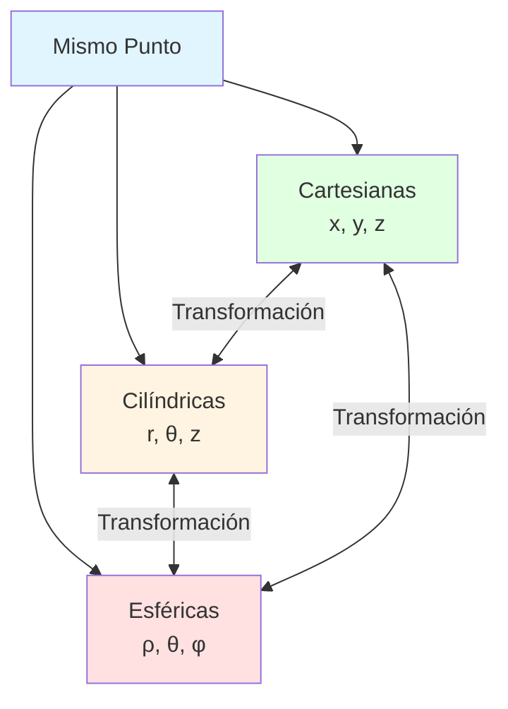

---

## 📐 Sistemas de Coordenadas Principales

### 📊 Sistema Cartesiano (Rectangular)

> [!example]- 📖 Coordenadas Cartesianas
> 
> **Definición:**
> 
> El sistema **cartesiano** o **rectangular** describe un punto mediante distancias perpendiculares desde ejes ortogonales.
> 
> **En 2D:**
> 
> - **Ejes:** $x$ (horizontal), $y$ (vertical)
> - **Punto:** $P(x, y)$
> - **Origen:** $O(0, 0)$
> 
> **En 3D:**
> 
> - **Ejes:** $x$, $y$, $z$ (mutuamente perpendiculares)
> - **Punto:** $P(x, y, z)$
> - **Origen:** $O(0, 0, 0)$
> 
> **Características:**
> 
> |Propiedad|Descripción|Rango|
> |---|---|---|
> |**$x$**|Distancia horizontal|$(-\infty, \infty)$|
> |**$y$**|Distancia vertical|$(-\infty, \infty)$|
> |**$z$**|Altura (en 3D)|$(-\infty, \infty)$|
> 
> **Ventajas:**
> 
> - Intuitivo y familiar
> - Ideal para geometría rectangular
> - Fácil visualización
> 
> **Desventajas:**
> 
> - Complicado para geometría circular/esférica
> - Integrales complejas en regiones curvas
> 
> **Representación visual:**
> 
> ```
>      z ↑
>        |
>        |    P(x,y,z)
>        |   •
>        |  /|
>        | / |
>        |/  |
>    ----O---+---→ y
>       /|   |
>      / |   |
>     ↙  |   |
>    x   |___| proyección en xy
> ```

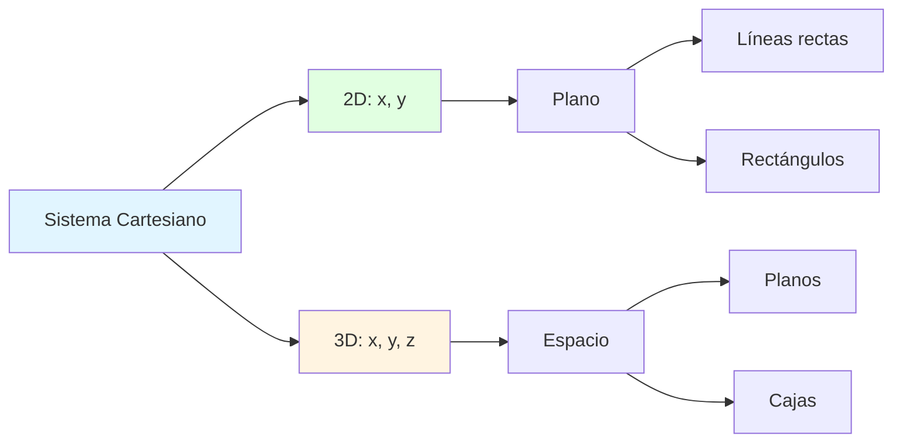

### ⭕ Sistema Polar (2D)

> [!example]- 🎯 Coordenadas Polares
> 
> **Definición:**
> 
> El sistema **polar** describe un punto mediante:
> 
> - **$r$:** Distancia desde el origen (radio)
> - **$\theta$:** Ángulo desde el eje positivo $x$ (argumento)
> 
> **Notación:** $P(r, \theta)$
> 
> **Características:**
> 
> |Coordenada|Símbolo|Descripción|Rango|
> |---|---|---|---|
> |**Radio**|$r$|Distancia al origen|$r \geq 0$|
> |**Ángulo**|$\theta$|Ángulo desde eje $x$|$0 \leq \theta < 2\pi$ (o $-\pi \leq \theta \leq \pi$)|
> 
> **Representación geométrica:**
> 
> ```
>      y
>      ↑
>      |    • P(r,θ)
>      |   /|
>      |  / |
>    r | /  | r·sin(θ)
>      |/ θ |
>  ----O----+----→ x
>          r·cos(θ)
> ```
> 
> **Ventajas:**
> 
> - Natural para círculos y espirales
> - Simplifica problemas con simetría radial
> - Ideal para rotaciones
> 
> **Desventajas:**
> 
> - No único (mismo punto, múltiples $\theta$)
> - Menos intuitivo que cartesianas
> 
> **Ejemplos de curvas simples en polares:**
> 
> |Curva|Ecuación Cartesiana|Ecuación Polar|
> |---|---|---|
> |**Círculo (radio $a$)**|$x^2 + y^2 = a^2$|$r = a$|
> |**Línea desde origen**|$y = mx$|$\theta = \arctan(m)$|
> |**Espiral de Arquímedes**|Complicada|$r = a\theta$|
> |**Cardioide**|Muy complicada|$r = a(1 + \cos\theta)$|

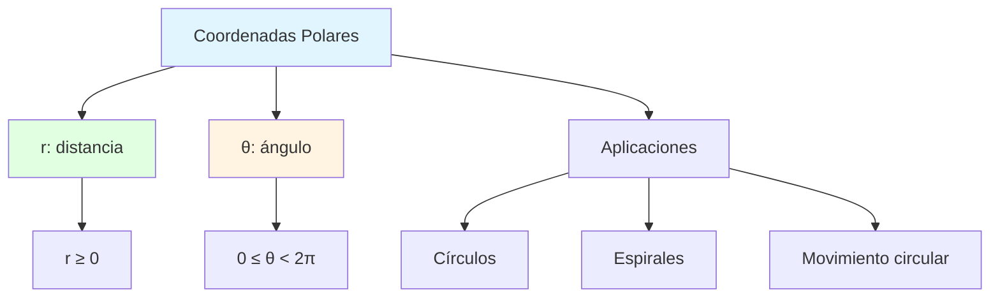

### 🔵 Sistema Cilíndrico (3D)

> [!example]- 🛢️ Coordenadas Cilíndricas
> 
> **Definición:**
> 
> Las coordenadas **cilíndricas** extienden las polares a 3D agregando altura:
> 
> - **$r$:** Distancia radial desde el eje $z$
> - **$\theta$:** Ángulo en el plano $xy$
> - **$z$:** Altura (igual que en cartesianas)
> 
> **Notación:** $P(r, \theta, z)$
> 
> **Características:**
> 
> |Coordenada|Descripción|Rango|
> |---|---|---|
> |**$r$**|Radio en plano $xy$|$r \geq 0$|
> |**$\theta$**|Ángulo desde eje $x$|$0 \leq \theta < 2\pi$|
> |**$z$**|Altura vertical|$(-\infty, \infty)$|
> 
> **Visualización:**
> 
> ```
>      z ↑
>        |
>        |    • P(r,θ,z)
>        |   /|
>        |  / | z
>        | /  |
>    ----O----+---→ y
>       /  θ /
>      /    /
>     ↙    / r
>    x    •
>      proyección
> ```
> 
> **Superficies simples en cilíndricas:**
> 
> |Superficie|Ecuación Cartesiana|Ecuación Cilíndrica|
> |---|---|---|
> |**Cilindro (radio $a$)**|$x^2 + y^2 = a^2$|$r = a$|
> |**Plano vertical**|$ax + by = c$|Complicada|
> |**Plano horizontal**|$z = c$|$z = c$|
> |**Paraboloide**|$z = x^2 + y^2$|$z = r^2$|
> 
> **Ventajas:**
> 
> - Natural para cilindros y simetría axial
> - Simplifica integrales en regiones cilíndricas
> - Común en ingeniería (tuberías, cables)
> 
> **Desventajas:**
> 
> - No simplifica esferas
> - Puede complicar planos inclinados

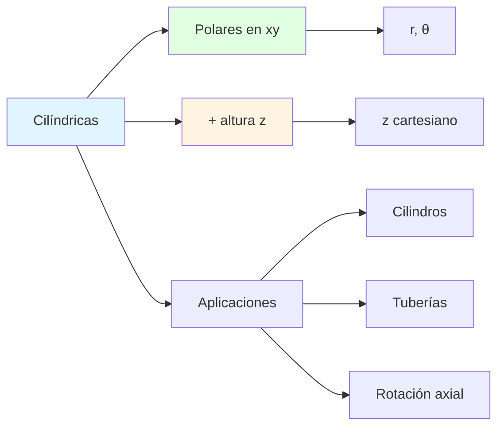

### 🌐 Sistema Esférico (3D)

> [!example]- 🪐 Coordenadas Esféricas
> 
> **Definición:**
> 
> Las coordenadas **esféricas** describen un punto mediante:
> 
> - **$\rho$ (rho):** Distancia desde el origen
> - **$\theta$ (theta):** Ángulo azimutal en plano $xy$ (igual que cilíndricas)
> - **$\phi$ (phi):** Ángulo polar desde eje $z$ positivo
> 
> **Notación:** $P(\rho, \theta, \phi)$
> 
> **⚠️ ADVERTENCIA - Convenciones:**
> 
> Existen **dos convenciones** principales:
> 
> |Convención|Ángulo desde|Usado en|
> |---|---|---|
> |**Matemáticas**|$\phi$ desde eje $z$|Este curso|
> |**Física**|$\theta$ desde eje $z$|Algunos textos|
> 
> **En este documento usamos la convención matemática.**
> 
> **Características:**
> 
> |Coordenada|Descripción|Rango|
> |---|---|---|
> |**$\rho$**|Distancia al origen|$\rho \geq 0$|
> |**$\theta$**|Ángulo azimutal|$0 \leq \theta < 2\pi$|
> |**$\phi$**|Ángulo polar|$0 \leq \phi \leq \pi$|
> 
> **Visualización:**
> 
> ```
>      z ↑
>        |
>        |    • P(ρ,θ,φ)
>        |   /
>        |  / ρ
>        | / 
>      φ |/
>    ----O--------→ y
>       /  θ
>      /
>     ↙
>    x
>    
>    φ = 0: polo norte (eje z+)
>    φ = π/2: ecuador (plano xy)
>    φ = π: polo sur (eje z-)
> ```
> 
> **Superficies simples en esféricas:**
> 
> |Superficie|Ecuación Cartesiana|Ecuación Esférica|
> |---|---|---|
> |**Esfera (radio $a$)**|$x^2 + y^2 + z^2 = a^2$|$\rho = a$|
> |**Cono (desde $z$)**|$z^2 = x^2 + y^2$|$\phi = \pi/4$|
> |**Plano horizontal**|$z = c$|$\rho\cos\phi = c$|
> |**Semiplano vertical**|$y = 0, x \geq 0$|$\theta = 0$|
> 
> **Ventajas:**
> 
> - Natural para esferas
> - Ideal para física (gravitación, electromagnetismo)
> - Simplifica problemas con simetría esférica
> 
> **Desventajas:**
> 
> - Menos intuitivo
> - Cálculos más complejos
> - Cuidado con singularidades ($\phi = 0, \pi$)

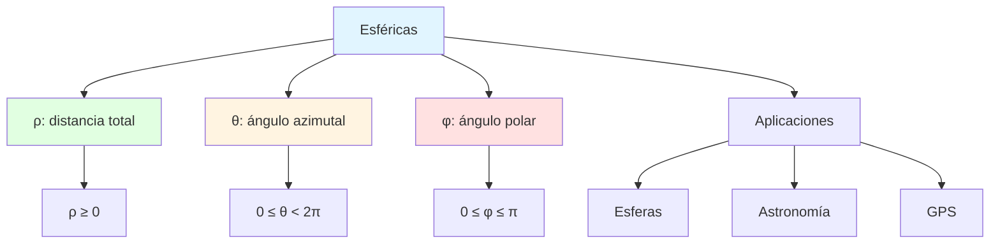

---

## 🔄 Fórmulas de Transformación

### 📐 Cartesianas ↔ Polares (2D)

> [!tip]- 🔀 Conversión 2D
> 
> **De Polares a Cartesianas:**
> 
> $$\boxed{\begin{cases} x = r\cos\theta \ y = r\sin\theta \end{cases}}$$
> 
> **De Cartesianas a Polares:**
> 
> $$\boxed{\begin{cases} r = \sqrt{x^2 + y^2} \ \theta = \arctan\left(\frac{y}{x}\right) \text{ (con ajustes por cuadrante)} \end{cases}}$$
> 
> **⚠️ Cuidado con $\theta$:**
> 
> La función $\arctan$ solo da valores en $(-\pi/2, \pi/2)$. Usar la función `atan2(y, x)` que considera el cuadrante:
> 
> |Cuadrante|Condición|Cálculo de $\theta$|
> |---|---|---|
> |**I**|$x > 0, y > 0$|$\theta = \arctan(y/x)$|
> |**II**|$x < 0, y > 0$|$\theta = \pi + \arctan(y/x)$|
> |**III**|$x < 0, y < 0$|$\theta = \pi + \arctan(y/x)$|
> |**IV**|$x > 0, y < 0$|$\theta = 2\pi + \arctan(y/x)$|
> 
> **Relaciones útiles:**
> 
> $$x^2 + y^2 = r^2$$
> 
> $$\tan\theta = \frac{y}{x} \quad (x \neq 0)$$

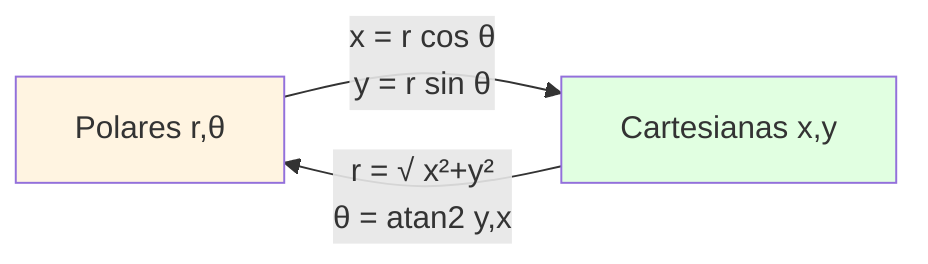

> [!example]- 📝 Ejemplo: Polar → Cartesiana
> 
> **Convertir** $P(r, \theta) = (5, \pi/3)$ **a cartesianas.**
> 
> **Solución:**
> 
> $$x = 5\cos\left(\frac{\pi}{3}\right) = 5 \cdot \frac{1}{2} = 2.5$$
> 
> $$y = 5\sin\left(\frac{\pi}{3}\right) = 5 \cdot \frac{\sqrt{3}}{2} = \frac{5\sqrt{3}}{2} \approx 4.33$$
> 
> **Respuesta:** $P(x, y) = (2.5, 4.33)$

> [!example]- 📝 Ejemplo: Cartesiana → Polar
> 
> **Convertir** $P(x, y) = (-3, 3)$ **a polares.**
> 
> **Solución:**
> 
> $$r = \sqrt{(-3)^2 + 3^2} = \sqrt{9 + 9} = \sqrt{18} = 3\sqrt{2} \approx 4.24$$
> 
> Para $\theta$, punto en cuadrante II:
> 
> $$\theta = \pi + \arctan\left(\frac{3}{-3}\right) = \pi + \arctan(-1) = \pi - \frac{\pi}{4} = \frac{3\pi}{4}$$
> 
> **Respuesta:** $P(r, \theta) = (3\sqrt{2}, 3\pi/4)$

### 🔵 Cartesianas ↔ Cilíndricas (3D)

> [!tip]- 🔀 Conversión Cilíndrica
> 
> **De Cilíndricas a Cartesianas:**
> 
> $$\boxed{\begin{cases} x = r\cos\theta \ y = r\sin\theta \ z = z \end{cases}}$$
> 
> **De Cartesianas a Cilíndricas:**
> 
> $$\boxed{\begin{cases} r = \sqrt{x^2 + y^2} \ \theta = \arctan\left(\frac{y}{x}\right) \text{ (atan2)} \ z = z \end{cases}}$$
> 
> **Observaciones:**
> 
> - La coordenada $z$ **no cambia**
> - En el plano $xy$, es exactamente la transformación polar
> - $r$ es la distancia al **eje $z$**, no al origen
> 
> **Relaciones:**
> 
> $$x^2 + y^2 = r^2$$
> 
> $$x^2 + y^2 + z^2 = r^2 + z^2$$

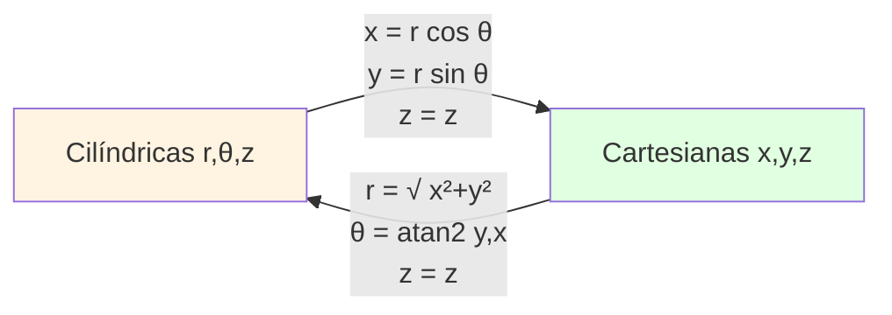

> [!example]- 📝 Ejemplo: Cilíndrica → Cartesiana
> 
> **Convertir** $P(r, \theta, z) = (4, \pi/6, 3)$ **a cartesianas.**
> 
> **Solución:**
> 
> $$x = 4\cos\left(\frac{\pi}{6}\right) = 4 \cdot \frac{\sqrt{3}}{2} = 2\sqrt{3} \approx 3.46$$
> 
> $$y = 4\sin\left(\frac{\pi}{6}\right) = 4 \cdot \frac{1}{2} = 2$$
> 
> $$z = 3$$
> 
> **Respuesta:** $P(x, y, z) = (2\sqrt{3}, 2, 3)$

> [!example]- 📝 Ejemplo: Cartesiana → Cilíndrica
> 
> **Convertir** $P(x, y, z) = (1, -1, 5)$ **a cilíndricas.**
> 
> **Solución:**
> 
> $$r = \sqrt{1^2 + (-1)^2} = \sqrt{2} \approx 1.41$$
> 
> Cuadrante IV ($x > 0, y < 0$):
> 
> $$\theta = \arctan\left(\frac{-1}{1}\right) = -\frac{\pi}{4}$$
> 
> O equivalentemente: $\theta = \frac{7\pi}{4}$
> 
> $$z = 5$$
> 
> **Respuesta:** $P(r, \theta, z) = (\sqrt{2}, 7\pi/4, 5)$

### 🌐 Cartesianas ↔ Esféricas (3D)

> [!tip]- 🔀 Conversión Esférica
> 
> **De Esféricas a Cartesianas:**
> 
> $$\boxed{\begin{cases} x = \rho\sin\phi\cos\theta \ y = \rho\sin\phi\sin\theta \ z = \rho\cos\phi \end{cases}}$$
> 
> **Mnemotecnia:**
> 
> - $z$ solo depende de $\phi$ (ángulo polar)
> - $x, y$ tienen factor $\sin\phi$ (proyección al plano $xy$)
> 
> **De Cartesianas a Esféricas:**
> 
> $$\boxed{\begin{cases} \rho = \sqrt{x^2 + y^2 + z^2} \ \theta = \arctan\left(\frac{y}{x}\right) \text{ (atan2)} \ \phi = \arccos\left(\frac{z}{\rho}\right) = \arctan\left(\frac{\sqrt{x^2+y^2}}{z}\right) \end{cases}}$$
> 
> **Relaciones fundamentales:**
> 
> $$\rho^2 = x^2 + y^2 + z^2$$
> 
> $$\tan\theta = \frac{y}{x}$$
> 
> $$\cos\phi = \frac{z}{\rho}$$
> 
> **Casos especiales:**
> 
> |Condición|Valor de $\phi$|Significado|
> |---|---|---|
> |$z > 0, x^2+y^2 = 0$|$\phi = 0$|Eje $z$ positivo|
> |$z = 0$|$\phi = \pi/2$|Plano $xy$|
> |$z < 0, x^2+y^2 = 0$|$\phi = \pi$|Eje $z$ negativo|

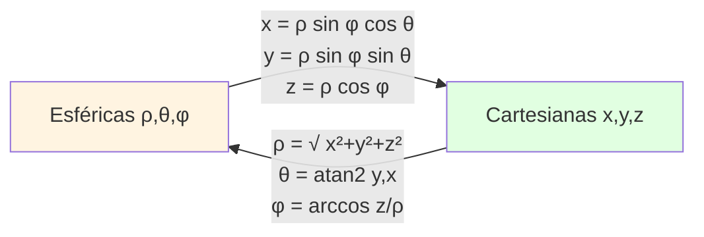

> [!example]- 📝 Ejemplo: Esférica → Cartesiana
> 
> **Convertir** $P(\rho, \theta, \phi) = (6, \pi/4, \pi/3)$ **a cartesianas.**
> 
> **Solución:**
> 
> $$x = 6\sin\left(\frac{\pi}{3}\right)\cos\left(\frac{\pi}{4}\right) = 6 \cdot \frac{\sqrt{3}}{2} \cdot \frac{\sqrt{2}}{2} = \frac{6\sqrt{6}}{4} = \frac{3\sqrt{6}}{2} \approx 3.67$$
> 
> $$y = 6\sin\left(\frac{\pi}{3}\right)\sin\left(\frac{\pi}{4}\right) = 6 \cdot \frac{\sqrt{3}}{2} \cdot \frac{\sqrt{2}}{2} = \frac{3\sqrt{6}}{2} \approx 3.67$$
> 
> $$z = 6\cos\left(\frac{\pi}{3}\right) = 6 \cdot \frac{1}{2} = 3$$
> 
> **Respuesta:** $P(x, y, z) = (3\sqrt{6}/2, 3\sqrt{6}/2, 3)$

> [!example]- 📝 Ejemplo: Cartesiana → Esférica
> 
> **Convertir** $P(x, y, z) = (0, 0, -5)$ **a esféricas.**
> 
> **Solución:**
> 
> $$\rho = \sqrt{0^2 + 0^2 + (-5)^2} = 5$$
> 
> $$\phi = \arccos\left(\frac{-5}{5}\right) = \arccos(-1) = \pi$$
> 
> $\theta$ es **indeterminado** (cualquier valor, típicamente se usa $\theta = 0$)
> 
> **Respuesta:** $P(\rho, \theta, \phi) = (5, 0, \pi)$

### 🔄 Cilíndricas ↔ Esféricas (3D)

> [!tip]- 🔀 Conversión Cilíndrica-Esférica
> 
> **De Esféricas a Cilíndricas:**
> 
> $$\boxed{\begin{cases} r = \rho\sin\phi \ \theta = \theta \ z = \rho\cos\phi \end{cases}}$$
> 
> **De Cilíndricas a Esféricas:**
> 
> $$\boxed{\begin{cases} \rho = \sqrt{r^2 + z^2} \ \theta = \theta \ \phi = \arctan\left(\frac{r}{z}\right) = \arccos\left(\frac{z}{\sqrt{r^2+z^2}}\right) \end{cases}}$$
> 
> **Observaciones:**
> 
> - El ángulo $\theta$ **no cambia** (mismo significado)
> - $r$ (cilíndrica) = proyección de $\rho$ en plano $xy$
> - Relación: $\rho^2 = r^2 + z^2$ (Pitágoras)

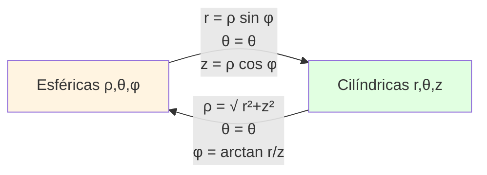

---

## 📊 Tabla Resumen de Transformaciones

> [!note]- 🗂️ Resumen Completo
> 
> **Transformaciones directas (hacia cartesianas):**
> 
> |Desde|Coordenadas|Fórmulas a Cartesianas|
> |---|---|---|
> |**Polares**|$(r, \theta)$|$x = r\cos\theta$ <br/> $y = r\sin\theta$|
> |**Cilíndricas**|$(r, \theta, z)$|$x = r\cos\theta$ <br/> $y = r\sin\theta$ <br/> $z = z$|
> |**Esféricas**|$(\rho, \theta, \phi)$|$x = \rho\sin\phi\cos\theta$ <br/> $y = \rho\sin\phi\sin\theta$ <br/> $z = \rho\cos\phi$|
> 
> **Transformaciones inversas (desde cartesianas):**
> 
> |Hacia|Coordenadas|Fórmulas desde Cartesianas|
> |---|---|---|
> |**Polares**|$(r, \theta)$|$r = \sqrt{x^2 + y^2}$ <br/> $\theta = \text{atan2}(y, x)$|
> |**Cilíndricas**|$(r, \theta, z)$|$r = \sqrt{x^2 + y^2}$ <br/> $\theta = \text{atan2}(y, x)$ <br/> $z = z$|
> |**Esféricas**|$(\rho, \theta, \phi)$|$\rho = \sqrt{x^2 + y^2 + z^2}$ <br/> $\theta = \text{atan2}(y, x)$ <br/> $\phi = \arccos(z/\rho)$|

---

## 🎨 Aplicaciones y Selección del Sistema

> [!success]- 🎯 ¿Cuándo usar cada sistema?
> **Criterios de selección:**
> 
> |Sistema|Usar cuando...|Ejemplos|
> |---|---|---|
> |**Cartesiano**|• Geometría rectangular <br/> • Ejes alineados <br/> • Sin simetría especial|• Cajas <br/> • Edificios <br/> • Grillas|
> |**Polar**|• Círculos, anillos <br/> • Rotaciones 2D <br/> • Simetría radial|• Discos <br/> • Espirales <br/> • Movimiento circular|
> |**Cilíndrico**|• Cilindros, tubos <br/> • Simetría axial <br/> • Rotación + altura|• Tuberías <br/> • Cables <br/> • Tornados|
> |**Esférico**|• Esferas <br/> • Simetría esférica <br/> • Punto central|• Planetas <br/> • Átomos <br/> • Campos centrales|

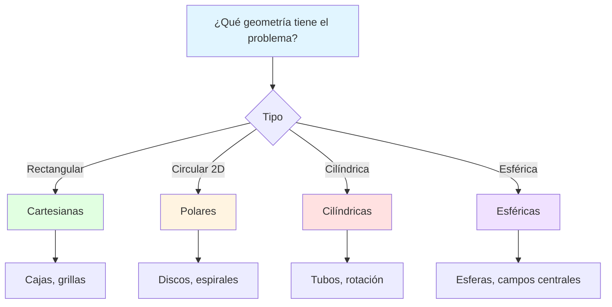

> [!example]- 📝 Ejemplos de Aplicación
> 
> **1. Integrar sobre un disco:**
> 
> Región: $x^2 + y^2 \leq 4$
> 
> **Cartesianas (complicado):** $$\int_{-2}^2 \int_{-\sqrt{4-x^2}}^{\sqrt{4-x^2}} f(x,y) , dy , dx$$
> 
> **Polares (simple):** $$\int_0^{2\pi} \int_0^2 f(r\cos\theta, r\sin\theta) \cdot r , dr , d\theta$$
> 
> ✅ **Conclusión:** Usar polares
> 
> ---
> 
> **2. Integrar sobre un cilindro:**
> 
> Región: $x^2 + y^2 \leq 9$, $0 \leq z \leq 5$
> 
> **Cilíndricas (simple):** $$\int_0^{2\pi} \int_0^3 \int_0^5 f(r,\theta,z) \cdot r , dz , dr , d\theta$$
> 
> ✅ **Conclusión:** Usar cilíndricas
> 
> ---
> 
> **3. Integrar sobre una esfera:**
> 
> Región: $x^2 + y^2 + z^2 \leq 16$
> 
> **Esféricas (simple):** $$\int_0^{2\pi} \int_0^\pi \int_0^4 f(\rho,\theta,\phi) \cdot \rho^2\sin\phi , d\rho , d\phi , d\theta$$
> 
> ✅ **Conclusión:** Usar esféricas

---

## 🧮 Elementos Diferenciales (Jacobiano)

> [!warning]- ⚠️ Factor de Volumen/Área
> 
> Al transformar coordenadas en integrales, el **elemento diferencial** cambia:
> 
> **2D:**
> 
> |Sistema|Elemento de área|
> |---|---|
> |**Cartesiano**|$dA = dx , dy$|
> |**Polar**|$dA = r , dr , d\theta$|
> 
> **3D:**
> 
> |Sistema|Elemento de volumen|
> |---|---|
> |**Cartesiano**|$dV = dx , dy , dz$|
> |**Cilíndrico**|$dV = r , dr , d\theta , dz$|
> |**Esférico**|$dV = \rho^2\sin\phi , d\rho , d\theta , d\phi$|
> 
> **⚠️ ¡NO OLVIDAR EL JACOBIANO!**
> 
> - **Polares:** Factor $r$
> - **Cilíndricas:** Factor $r$
> - **Esféricas:** Factor $\rho^2\sin\phi$
> 
> **Deducción del Jacobiano (polar):**
> 
> El Jacobiano es el determinante:
> 
> $$J = \begin{vmatrix} \frac{\partial x}{\partial r} & \frac{\partial x}{\partial \theta} \ \frac{\partial y}{\partial r} & \frac{\partial y}{\partial \theta} \end{vmatrix} = \begin{vmatrix} \cos\theta & -r\sin\theta \ \sin\theta & r\cos\theta \end{vmatrix}$$
> 
> $$= r\cos^2\theta + r\sin^2\theta = r$$
> 
> Por tanto: $dx , dy = r , dr , d\theta$

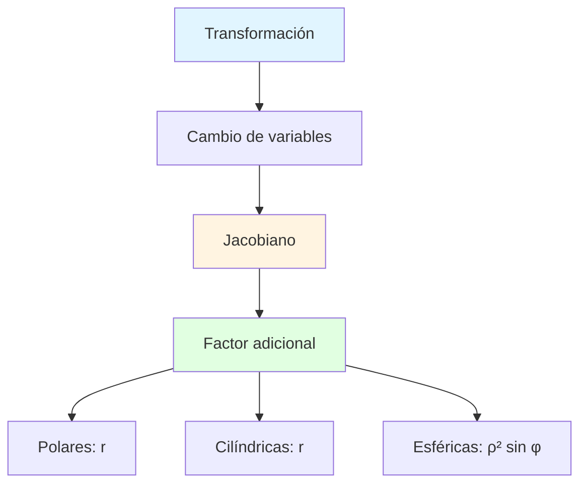

---

## 💡 Ejemplos Completos de Transformación

> [!example]- 📝 Ejemplo 1: Ecuación de Círculo
> 
> **Transformar** $x^2 + y^2 = 25$ **a polares.**
> 
> **Solución:**
> 
> Sustituir $x = r\cos\theta$ y $y = r\sin\theta$:
> 
> $$(r\cos\theta)^2 + (r\sin\theta)^2 = 25$$
> 
> $$r^2\cos^2\theta + r^2\sin^2\theta = 25$$
> 
> $$r^2(\cos^2\theta + \sin^2\theta) = 25$$
> 
> $$r^2 = 25$$
> 
> $$r = 5$$
> 
> **Respuesta:** $r = 5$ (mucho más simple!)

> [!example]- 📝 Ejemplo 2: Cilindro en Esféricas
> 
> **Transformar** $x^2 + y^2 = 16$ **a esféricas.**
> 
> **Solución:**
> 
> Sabemos que:
> 
> - $x = \rho\sin\phi\cos\theta$
> - $y = \rho\sin\phi\sin\theta$
> 
> Entonces:
> 
> $$(\rho\sin\phi\cos\theta)^2 + (\rho\sin\phi\sin\theta)^2 = 16$$
> 
> $$\rho^2\sin^2\phi\cos^2\theta + \rho^2\sin^2\phi\sin^2\theta = 16$$
> 
> $$\rho^2\sin^2\phi(\cos^2\theta + \sin^2\theta) = 16$$
> 
> $$\rho^2\sin^2\phi = 16$$
> 
> $$\rho\sin\phi = 4$$
> 
> **Respuesta:** $\rho\sin\phi = 4$

> [!example]- 📝 Ejemplo 3: Cono en Cilíndricas
> 
> **Transformar** $z = \sqrt{x^2 + y^2}$ **a cilíndricas.**
> 
> **Solución:**
> 
> En cilíndricas: $r = \sqrt{x^2 + y^2}$
> 
> Por tanto:
> 
> $$z = r$$
> 
> **Respuesta:** $z = r$ (extremadamente simple!)
> 
> **Interpretación:** Un cono con ángulo de 45° desde el eje $z$.

> [!example]- 📝 Ejemplo 4: Esfera en Cilíndricas
> 
> **Transformar** $x^2 + y^2 + z^2 = 36$ **a cilíndricas.**
> 
> **Solución:**
> 
> En cilíndricas: $x^2 + y^2 = r^2$
> 
> $$r^2 + z^2 = 36$$
> 
> **Respuesta:** $r^2 + z^2 = 36$
> 
> **Nota:** La esfera NO se simplifica tanto en cilíndricas. Sería mejor usar esféricas: $\rho = 6$

---

## 🎓 Ejercicios Propuestos

> [!example]- 💪 Práctica de Transformaciones
> 
> **Nivel Básico:**
> 
> **1. Conversiones directas**
> 
> a) Convertir $(r, \theta) = (3, \pi/6)$ a cartesianas
> 
> b) Convertir $(x, y) = (4, 4)$ a polares
> 
> c) Convertir $(r, \theta, z) = (2, \pi/4, 5)$ a cartesianas
> 
> d) Convertir $(\rho, \theta, \phi) = (10, 0, \pi/2)$ a cartesianas
> 
> ---
> 
> **2. Ecuaciones simples**
> 
> Transformar a polares:
> 
> a) $x^2 + y^2 = 9$
> 
> b) $x = 3$
> 
> c) $y = x$
> 
> d) $(x-2)^2 + y^2 = 4$
> 
> **Pista:** Para (d), expandir primero.
> 
> ---
> 
> **Nivel Intermedio:**
> 
> **3. Superficies en 3D**
> 
> Transformar a cilíndricas:
> 
> a) $x^2 + y^2 = 2z$
> 
> b) $x^2 + y^2 + z^2 = 25$
> 
> c) $z = x^2 + y^2$
> 
> ---
> 
> **4. A esféricas**
> 
> Transformar a esféricas:
> 
> a) $x^2 + y^2 + z^2 = 100$
> 
> b) $z = \sqrt{x^2 + y^2}$ (cono)
> 
> c) $z = 5$
> 
> **Pista:** Para (c), usar $z = \rho\cos\phi$
> 
> ---
> 
> **Nivel Avanzado:**
> 
> **5. Conversiones múltiples**
> 
> a) Convertir $(1, 1, \sqrt{2})$ cartesianas a cilíndricas y luego a esféricas
> 
> b) Verificar que el resultado es consistente convirtiéndolo directamente
> 
> ---
> 
> **6. Integrales**
> 
> Configurar (no evaluar) las siguientes integrales en el sistema más apropiado:
> 
> a) $\iiint_E dV$ donde $E$ es la esfera $x^2 + y^2 + z^2 \leq 9$
> 
> b) $\iiint_E dV$ donde $E$ es el cilindro $x^2 + y^2 \leq 4$, $0 \leq z \leq 3$
> 
> c) $\iint_R dA$ donde $R$ es el disco $x^2 + y^2 \leq 1$
> 
> ---
> 
> **7. Ecuaciones complejas**
> 
> Simplificar en el sistema apropiado:
> 
> a) $x^2 + y^2 = 4x$ (polar)
> 
> b) $x^2 + y^2 + z^2 = 4z$ (esférica)
> 
> **Pista:** Completar el cuadrado primero.
> 
> ---
> 
> **8. Aplicación física**
> 
> Un campo eléctrico tiene simetría esférica desde el origen. ¿Qué sistema de coordenadas es más apropiado? Justificar.

---

## 📊 Resumen Visual Completo

### Mapa Conceptual

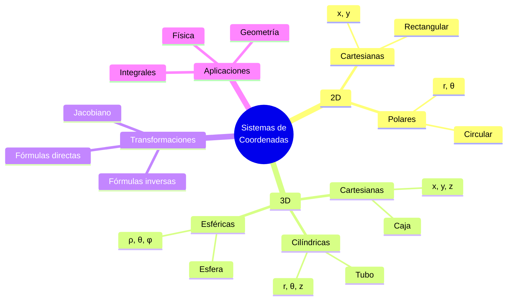

### Tabla Comparativa Completa

|Aspecto|Cartesianas|Polares/Cilíndricas|Esféricas|
|---|---|---|---|
|**Dimensión**|2D/3D|2D/3D|3D solamente|
|**Variables**|$(x,y)$ o $(x,y,z)$|$(r,\theta)$ o $(r,\theta,z)$|$(\rho,\theta,\phi)$|
|**Rangos**|$-\infty$ a $\infty$|$r \geq 0$, $0 \leq \theta < 2\pi$|$\rho \geq 0$, $0 \leq \phi \leq \pi$|
|**Mejor para**|Rectángulos, cajas|Círculos, cilindros|Esferas|
|**Jacobiano**|$1$|$r$|$\rho^2\sin\phi$|
|**Complejidad**|Simple conceptualmente|Intermedia|Más compleja|

### Diagrama de Flujo de Selección

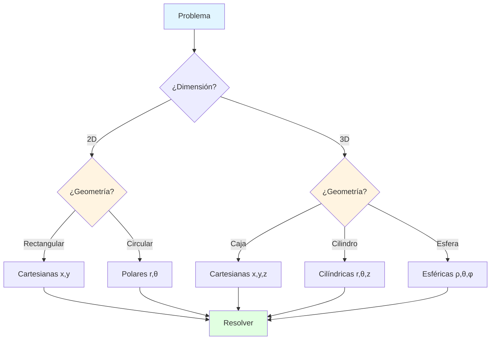

---

## 🔗 Conexión con Próximos Temas

> [!quote]- 🌟 Continuando el Aprendizaje
> 
> **Has dominado:**
> 
> - ✅ Tres sistemas principales de coordenadas
> - ✅ Transformaciones entre sistemas
> - ✅ Selección del sistema apropiado
> - ✅ Elementos diferenciales (Jacobianos)
> 
> **Progresión natural:**
> 
> |Nivel|Tema|Conexión|
> |---|---|---|
> |**Actual**|Transformaciones de Coordenadas|Base fundamental|
> |**Siguiente**|Integrales en Polares|Aplicar transformaciones|
> |**Avanzado**|Integrales Triples|Cilíndricas y esféricas|
> |**Aplicado**|Cambio de Variables General|Jacobiano completo|
> |**Teórico**|Geometría Diferencial|Sistemas curvos generales|
> |**Profesional**|Análisis Vectorial|Gradiente, divergencia, rotor|

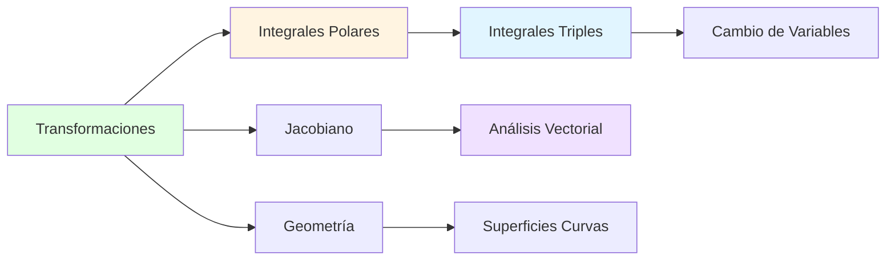

**Aplicaciones futuras:**

- **Integrales dobles/triples:** Simplificación mediante coordenadas apropiadas
- **Ecuaciones diferenciales:** Separación de variables en diferentes sistemas
- **Física:** Leyes de conservación en simetría natural
- **Computación gráfica:** Rotaciones y proyecciones 3D
- **Robótica:** Cinemática de brazos robóticos

---

**Tags:** #cálculo #coordenadas #transformaciones #polares #cilíndricas #esféricas #jacobiano #cambio-variables #geometría #mermaid #diagramas