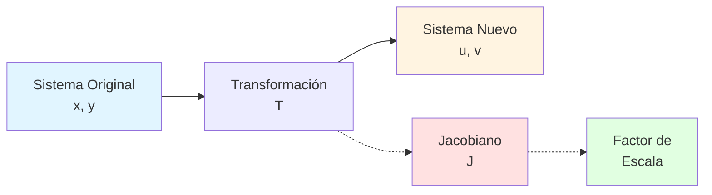
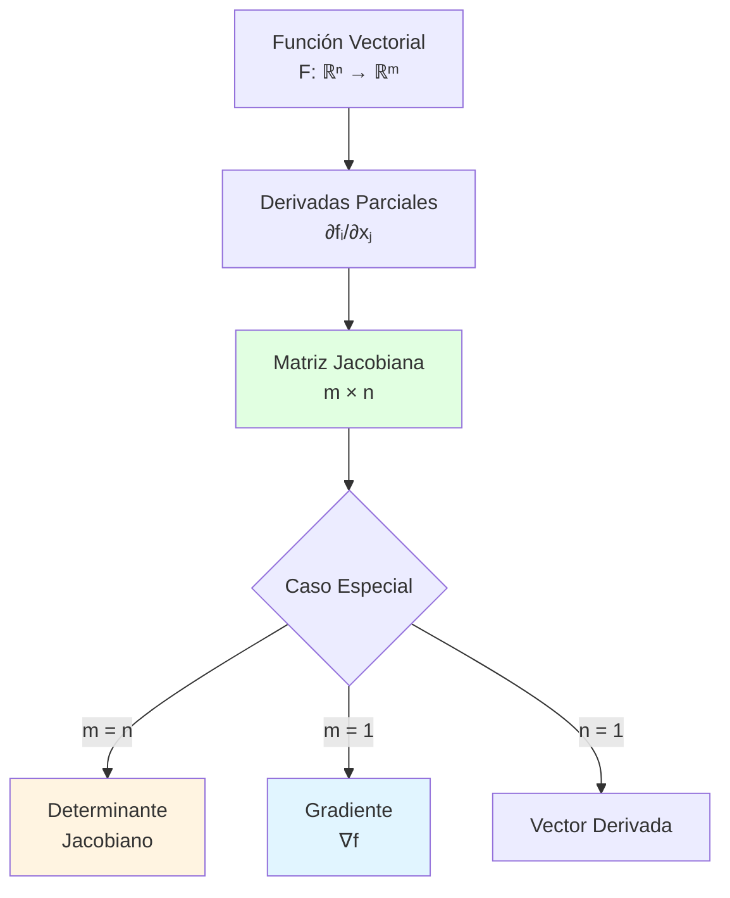
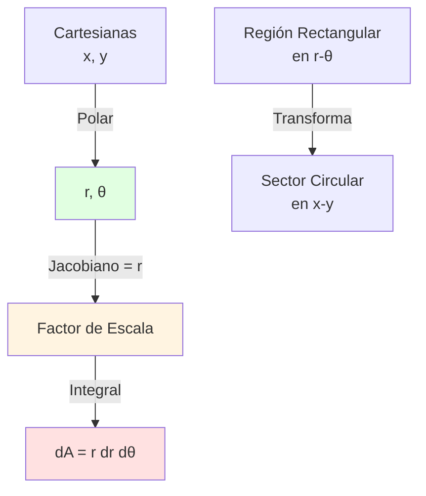
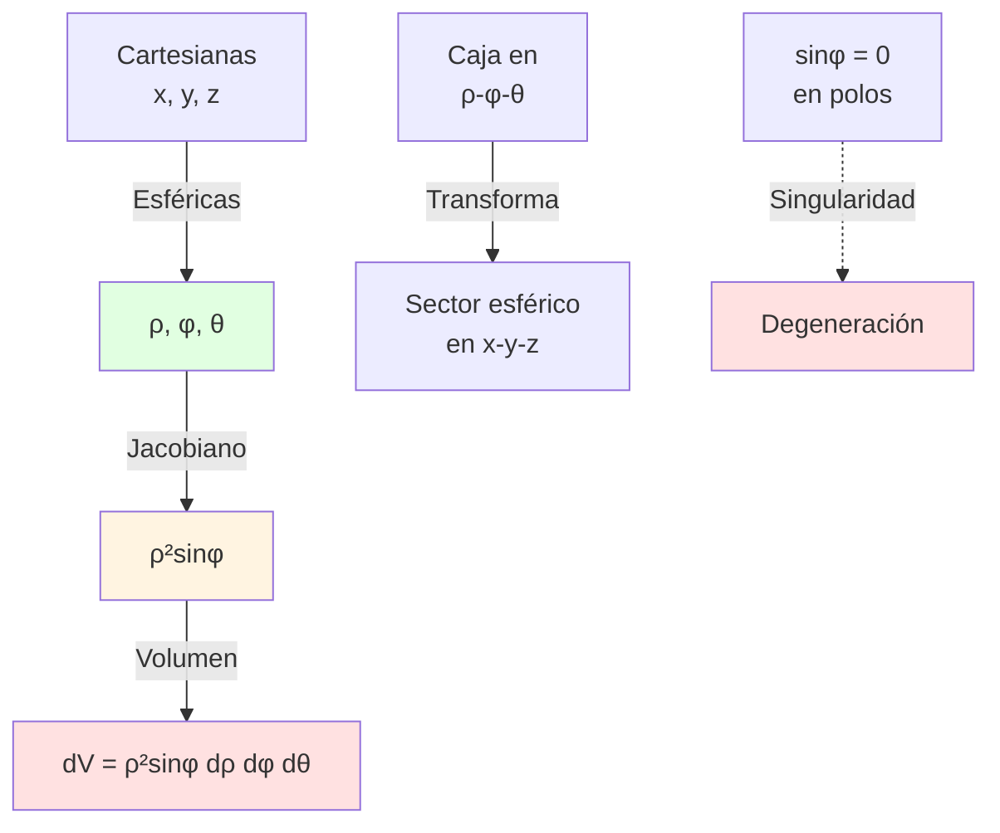
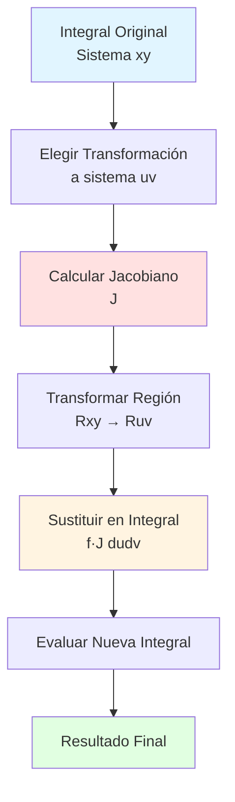
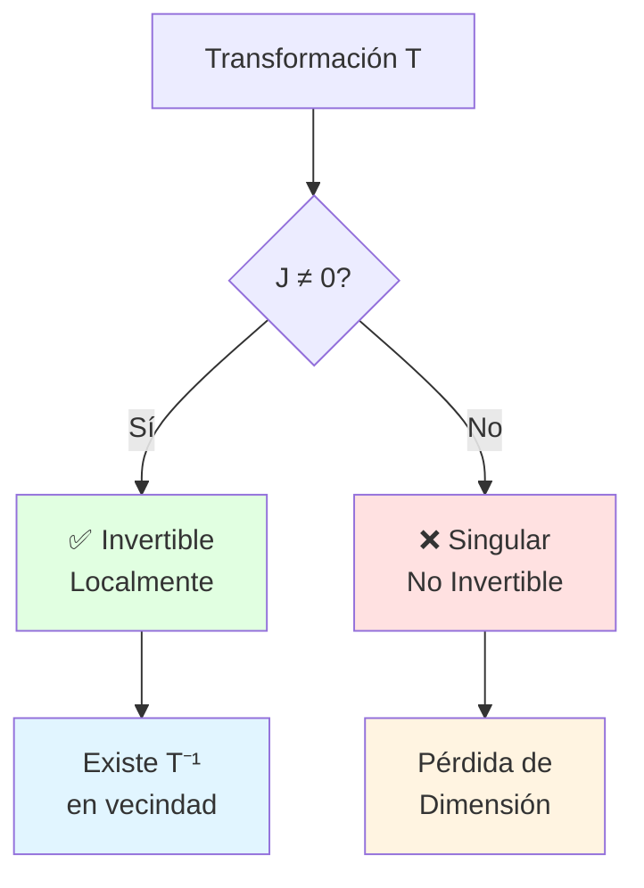
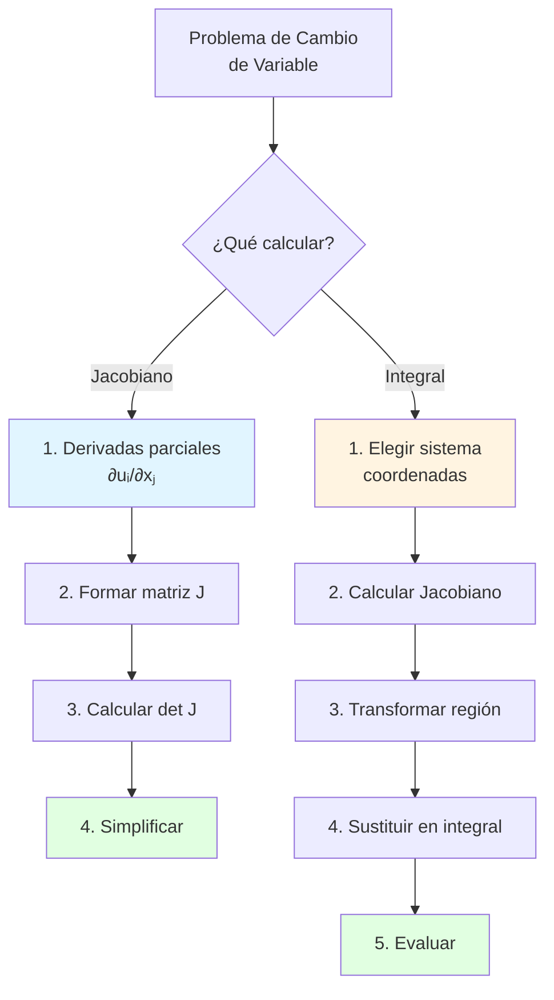
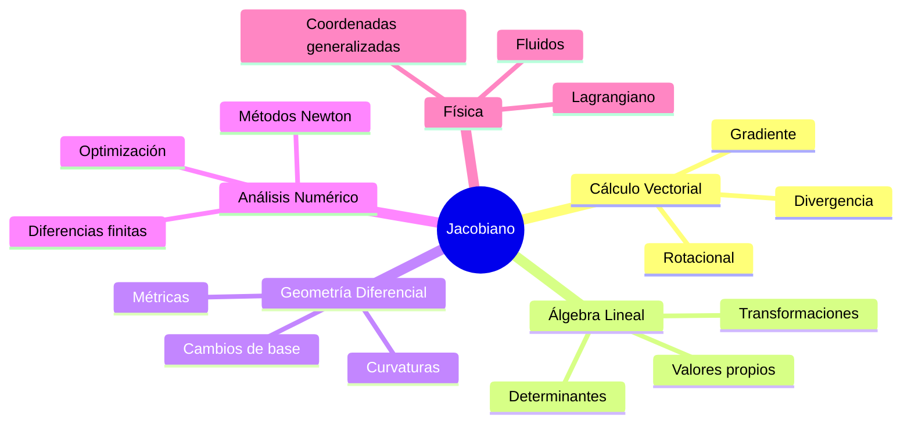

# 🔄 Jacobiano de la Transformación

## 🎯 Introducción

> [!info]- 💡 ¿Qué es el Jacobiano de una Transformación?
> 
> El **Jacobiano** es una herramienta fundamental del cálculo multivariable que mide cómo una transformación de coordenadas "distorsiona" o "escala" volúmenes, áreas o longitudes en el espacio. Es la generalización multidimensional del concepto de derivada.
> 
> **Analogía práctica:** Imagina que estás transformando una imagen:
> 
> - **Traslación:** Mover la imagen sin cambiar su tamaño → Jacobiano = 1
> - **Escalado:** Hacer la imagen 2x más grande → Jacobiano = 4 (en 2D)
> - **Rotación:** Girar la imagen → Jacobiano = 1 (preserva área)
> - **Transformación no lineal:** Distorsionar la imagen → Jacobiano varía en cada punto
> 
> **¿Por qué es importante?**
> 
> |Aspecto|Descripción|Ejemplo de Uso|
> |---|---|---|
> |**Cambio de variables**|Transforma integrales complejas en simples|Coordenadas polares, esféricas|
> |**Factor de escala**|Cuantifica la distorsión local|Análisis de deformaciones|
> |**Teorema del cambio**|Relaciona integrales en diferentes sistemas|Física, ingeniería|
> |**Análisis de sensibilidad**|Cómo cambian las salidas con las entradas|Optimización, control|
> |**Invertibilidad**|Determina si la transformación es reversible|Ecuaciones no lineales|



---

## 📐 Definición Matemática

### 🔢 Matriz Jacobiana

> [!example]- 📊 Construcción de la Matriz
> 
> Para una transformación $T: \mathbb{R}^n \to \mathbb{R}^m$ definida por:
> 
> $$\begin{cases} u_1 = f_1(x_1, x_2, \ldots, x_n) \ u_2 = f_2(x_1, x_2, \ldots, x_n) \ \vdots \ u_m = f_m(x_1, x_2, \ldots, x_n) \end{cases}$$
> 
> La **matriz Jacobiana** es:
> 
> $$J = \begin{bmatrix} \frac{\partial u_1}{\partial x_1} & \frac{\partial u_1}{\partial x_2} & \cdots & \frac{\partial u_1}{\partial x_n} \ \frac{\partial u_2}{\partial x_1} & \frac{\partial u_2}{\partial x_2} & \cdots & \frac{\partial u_2}{\partial x_n} \ \vdots & \vdots & \ddots & \vdots \ \frac{\partial u_m}{\partial x_1} & \frac{\partial u_m}{\partial x_2} & \cdots & \frac{\partial u_m}{\partial x_n} \end{bmatrix}$$
> 
> **Notaciones comunes:**
> 
> |Notación|Significado|Uso|
> |---|---|---|
> |$J_T$|Jacobiano de T|General|
> |$\frac{\partial(u_1, \ldots, u_m)}{\partial(x_1, \ldots, x_n)}$|Notación de Leibniz|Cálculo|
> |$Df$|Diferencial de f|Análisis|
> |$J(x_0)$|Jacobiano evaluado en $x_0$|Punto específico|



### 🎲 Determinante Jacobiano

> [!note]- 🔍 El Jacobiano Escalar
> 
> Cuando $n = m$ (misma dimensión entrada/salida), el **determinante Jacobiano** es:
> 
> $$|J| = \det(J) = \left|\frac{\partial(u_1, \ldots, u_n)}{\partial(x_1, \ldots, x_n)}\right|$$
> 
> **Interpretación geométrica:**
> 
> |Valor de \|J\||Significado|Efecto|
> |---|---|---|
> |\|J\| > 1|Expansión|La transformación agranda volúmenes|
> |\|J\| = 1|Isometría|Preserva volúmenes (rotación, traslación)|
> |0 < \|J\| < 1|Contracción|La transformación reduce volúmenes|
> |\|J\| = 0|Degeneración|Pérdida de dimensión (no invertible)|
> |\|J\| < 0|Orientación|Invierte orientación (reflexión)|
> 
> **Ejemplo visual 2D:**
> 
> ```mermaid
> graph LR
>     A[Cuadrado<br/>Área = 1] -->|J = 2| B[Rectángulo<br/>Área = 2]
>     A -->|J = 0.5| C[Rectángulo<br/>Área = 0.5]
>     A -->|J = 1| D[Cuadrado Rotado<br/>Área = 1]
>     A -->|J = 0| E[Línea<br/>Área = 0]
>     
>     style A fill:#e1f5ff
>     style B fill:#ffe1e1
>     style C fill:#fff4e1
>     style D fill:#e1ffe1
>     style E fill:#f0e1ff
> ```

---

## 🌍 Ejemplos Fundamentales

### 📍 Coordenadas Polares (2D)

> [!success]- 🔄 Transformación Polar
> 
> **Transformación:** $$\begin{cases} x = r\cos\theta \ y = r\sin\theta \end{cases}$$
> 
> **Matriz Jacobiana:**
> 
> $$J = \begin{bmatrix} \frac{\partial x}{\partial r} & \frac{\partial x}{\partial \theta} \ \frac{\partial y}{\partial r} & \frac{\partial y}{\partial \theta} \end{bmatrix} = \begin{bmatrix} \cos\theta & -r\sin\theta \ \sin\theta & r\cos\theta \end{bmatrix}$$
> 
> **Determinante Jacobiano:**
> 
> $$|J| = \begin{vmatrix} \cos\theta & -r\sin\theta \ \sin\theta & r\cos\theta \end{vmatrix} = r\cos^2\theta + r\sin^2\theta = r$$
> 
> **Cálculo paso a paso:**
> 
> 1. **Derivadas parciales:**
>     - $\frac{\partial x}{\partial r} = \cos\theta$
>     - $\frac{\partial x}{\partial \theta} = -r\sin\theta$
>     - $\frac{\partial y}{\partial r} = \sin\theta$
>     - $\frac{\partial y}{\partial \theta} = r\cos\theta$
> 2. **Determinante:** $$|J| = (\cos\theta)(r\cos\theta) - (-r\sin\theta)(\sin\theta)$$ $$= r\cos^2\theta + r\sin^2\theta = r(\cos^2\theta + \sin^2\theta) = r$$
> 
> **Interpretación:**
> 
> - El factor $r$ indica que la distorsión aumenta linealmente con la distancia al origen
> - Cerca del origen ($r \to 0$), el área se contrae
> - Lejos del origen ($r$ grande), el área se expande



### 🌐 Coordenadas Esféricas (3D)

> [!example]- 🎯 Transformación Esférica
> 
> **Transformación:** $$\begin{cases} x = \rho\sin\phi\cos\theta \ y = \rho\sin\phi\sin\theta \ z = \rho\cos\phi \end{cases}$$
> 
> Donde:
> 
> - $\rho \geq 0$ : distancia radial
> - $0 \leq \phi \leq \pi$ : ángulo polar (desde eje z)
> - $0 \leq \theta < 2\pi$ : ángulo azimutal (en plano xy)
> 
> **Matriz Jacobiana (3×3):**
> 
> $$J = \begin{bmatrix} \sin\phi\cos\theta & \rho\cos\phi\cos\theta & -\rho\sin\phi\sin\theta \ \sin\phi\sin\theta & \rho\cos\phi\sin\theta & \rho\sin\phi\cos\theta \ \cos\phi & -\rho\sin\phi & 0 \end{bmatrix}$$
> 
> **Determinante Jacobiano:**
> 
> $$|J| = \rho^2\sin\phi$$
> 
> **Demostración del determinante:**
> 
> Expandiendo por la tercera fila:
> 
> $$|J| = \cos\phi \begin{vmatrix} \rho\cos\phi\cos\theta & -\rho\sin\phi\sin\theta \ \rho\cos\phi\sin\theta & \rho\sin\phi\cos\theta \end{vmatrix} - (-\rho\sin\phi) \begin{vmatrix} \sin\phi\cos\theta & -\rho\sin\phi\sin\theta \ \sin\phi\sin\theta & \rho\sin\phi\cos\theta \end{vmatrix}$$
> 
> Después de operar (usando identidades trigonométricas):
> 
> $$|J| = \rho^2\sin\phi(\cos^2\phi + \sin^2\phi)(\cos^2\theta + \sin^2\theta) = \rho^2\sin\phi$$
> 
> **Interpretación geométrica:**
> 
> |Factor|Significado|
> |---|---|
> |$\rho^2$|Área de la esfera crece cuadráticamente|
> |$\sin\phi$|Distorsión angular (0 en polos, máxima en ecuador)|
> |$dV = \rho^2\sin\phi, d\rho, d\phi, d\theta$|Elemento de volumen|



### 🔶 Coordenadas Cilíndricas (3D)

> [!tip]- 🥫 Transformación Cilíndrica
> 
> **Transformación:** $$\begin{cases} x = r\cos\theta \ y = r\sin\theta \ z = z \end{cases}$$
> 
> **Matriz Jacobiana:**
> 
> $$J = \begin{bmatrix} \cos\theta & -r\sin\theta & 0 \ \sin\theta & r\cos\theta & 0 \ 0 & 0 & 1 \end{bmatrix}$$
> 
> **Determinante:**
> 
> Expandiendo por la tercera fila:
> 
> $$|J| = 1 \cdot \begin{vmatrix} \cos\theta & -r\sin\theta \ \sin\theta & r\cos\theta \end{vmatrix} = r$$
> 
> **Comparación de sistemas:**
> 
> |Sistema|Jacobiano|Elemento de Volumen|Uso típico|
> |---|---|---|---|
> |**Cartesiano**|1|$dx,dy,dz$|Geometría rectangular|
> |**Cilíndrico**|$r$|$r,dr,d\theta,dz$|Simetría axial|
> |**Esférico**|$\rho^2\sin\phi$|$\rho^2\sin\phi,d\rho,d\phi,d\theta$|Simetría radial|

---

## 🔧 Aplicaciones del Jacobiano

### 📏 Cambio de Variables en Integrales

> [!success]- ∫∫∫ Teorema del Cambio de Variable
> 
> **Teorema fundamental:**
> 
> Si $T: R_{uv} \to R_{xy}$ es una transformación con Jacobiano $J$, entonces:
> 
> $$\iint_{R_{xy}} f(x,y),dx,dy = \iint_{R_{uv}} f(x(u,v), y(u,v)) \cdot |J|,du,dv$$
> 
> **Paso a paso:**
> 
> 1. **Definir transformación:** Expresar $x, y$ en términos de $u, v$
> 2. **Calcular Jacobiano:** Formar matriz y calcular determinante
> 3. **Transformar región:** Determinar $R_{uv}$ correspondiente a $R_{xy}$
> 4. **Sustituir función:** Expresar $f(x,y)$ en términos de $u, v$
> 5. **Integrar:** Evaluar la nueva integral con el factor $|J|$
> 
> **Ejemplo completo:**
> 
> Calcular $\iint_R e^{x^2+y^2},dx,dy$ donde $R$ es el disco $x^2 + y^2 \leq 1$
> 
> **Solución:**
> 
> 6. **Transformación:** Polares $$x = r\cos\theta, \quad y = r\sin\theta$$
>     
> 7. **Jacobiano:** $|J| = r$
>     
> 8. **Nueva región:** $$R_{r\theta}: 0 \leq r \leq 1, \quad 0 \leq \theta \leq 2\pi$$
>     
> 9. **Función transformada:** $$e^{x^2+y^2} = e^{r^2}$$
>     
> 10. **Integral:** $$\iint_R e^{x^2+y^2},dx,dy = \int_0^{2\pi}\int_0^1 e^{r^2} \cdot r,dr,d\theta$$
>     
>     $$= 2\pi \int_0^1 re^{r^2},dr = 2\pi \left[\frac{e^{r^2}}{2}\right]_0^1 = \pi(e - 1)$$
>     



### 🎯 Análisis de Sensibilidad

> [!note]- 📊 Estudio de Variaciones
> 
> El Jacobiano mide cómo cambios pequeños en las entradas afectan las salidas.
> 
> **Linealización local:**
> 
> Para $\mathbf{y} = f(\mathbf{x})$, cerca de $\mathbf{x}_0$:
> 
> $$\Delta \mathbf{y} \approx J(\mathbf{x}_0) \cdot \Delta \mathbf{x}$$
> 
> **Ejemplo en ingeniería:**
> 
> Conversión de coordenadas de un robot:
> 
> $$\begin{cases} x = L_1\cos\theta_1 + L_2\cos(\theta_1 + \theta_2) \ y = L_1\sin\theta_1 + L_2\sin(\theta_1 + \theta_2) \end{cases}$$
> 
> El Jacobiano $\frac{\partial(x,y)}{\partial(\theta_1, \theta_2)}$ indica:
> 
> - Cómo errores en ángulos $\theta_i$ se propagan a posición $(x,y)$
> - Configuraciones singulares (donde $|J| = 0$)
> - Direcciones de máxima/mínima sensibilidad

### 🔍 Invertibilidad de Transformaciones

> [!warning]- ⚡ Teorema de la Función Inversa
> 
> **Condición de invertibilidad:**
> 
> Una transformación $T: \mathbb{R}^n \to \mathbb{R}^n$ es **localmente invertible** cerca de $\mathbf{x}_0$ si:
> 
> $$|J(\mathbf{x}_0)| \neq 0$$
> 
> **Interpretación:**
> 
> |Condición|Significado|Consecuencia|
> |---|---|---|
> |$\|J\| \neq 0$|No degenerada|✅ Invertible localmente|
> |$\|J\| = 0$|Degenerada|❌ Pérdida de información|
> |$\|J\| > 0$|Preserva orientación|Transformación directa|
> |$\|J\| < 0$|Invierte orientación|Reflexión incluida|
> 
> **Ejemplo de singularidad:**
> 
> En coordenadas esféricas, $|J| = \rho^2\sin\phi$:
> 
> - En los **polos** ($\phi = 0$ o $\phi = \pi$): $|J| = 0$ → No invertible
> - En el **origen** ($\rho = 0$): $|J| = 0$ → Singularidad
> - Resto del espacio: $|J| > 0$ → Invertible



---
## 📊 Casos Especiales Importantes

### 🔄 Transformaciones Afines

> [!note]- 📐 Jacobiano Constante
> 
> Para transformaciones **afines** (lineales + traslación):
> 
> $$\mathbf{y} = A\mathbf{x} + \mathbf{b}$$
> 
> El Jacobiano es simplemente la matriz $A$:
> 
> $$J = A \quad \text{(constante en todo el dominio)}$$
> 
> **Ejemplos:**
> 
> |Transformación|Matriz A|Jacobiano|
> |---|---|---|
> |Escalado $(2x, 3y)$|$\begin{bmatrix}2&0\0&3\end{bmatrix}$|$\|J\| = 6$|
> |Rotación $\theta$|$\begin{bmatrix}\cos\theta & -\sin\theta\\sin\theta & \cos\theta\end{bmatrix}$|$\|J\| = 1$|
> |Reflexión en x|$\begin{bmatrix}1&0\0&-1\end{bmatrix}$|$\|J\| = -1$|
> |Cizalladura|$\begin{bmatrix}1&k\0&1\end{bmatrix}$|$\|J\| = 1$|

### 🌀 Composición de Transformaciones

> [!tip]- 🔗 Regla de la Cadena Multivariable
> 
> Para $\mathbf{z} = g(\mathbf{y})$ y $\mathbf{y} = f(\mathbf{x})$:
> 
> $$J_{g \circ f} = J_g \cdot J_f$$
> 
> **Ejemplo:**
> 
> 1. Primero polar: $(x,y) = (r\cos\theta, r\sin\theta)$
> 2. Luego escalado: $(u,v) = (2x, 3y)$
> 
> $$J_{\text{total}} = \begin{bmatrix}2&0\0&3\end{bmatrix} \cdot \begin{bmatrix}\cos\theta & -r\sin\theta\\sin\\end{bmatrix} = \begin{bmatrix}2\cos\theta & -2r\sin\theta\3\sin\theta & 3r\cos\theta\end{bmatrix}$$
> $$|J_{\text{total}}| = 6r$$

---

## 🎓 Resumen y Referencia Rápida

### 📋 Tabla de Fórmulas Clave

|Sistema|Transformación|Jacobiano|Elemento Diferencial|
|---|---|---|---|
|**Polar (2D)**|$x=r\cos\theta$<br/>$y=r\sin\theta$|$r$|$r,dr,d\theta$|
|**Cilíndrico (3D)**|$x=r\cos\theta$<br/>$y=r\sin\theta$<br/>$z=z$|$r$|$r,dr,d\theta,dz$|
|**Esférico (3D)**|$x=\rho\sin\phi\cos\theta$<br/>$y=\rho\sin\phi\sin\theta$<br/>$z=\rho\cos\phi$|$\rho^2\sin\phi$|$\rho^2\sin\phi,d\rho,d\phi,d\theta$|

### 🔍 Checklist de Cálculo



### ⚠️ Errores Comunes

> [!warning]- 🚫 Evitar Estos Errores
> 
> |Error|Corrección|
> |---|---|
> |❌ Olvidar el valor absoluto $\|J\|$ en integrales|✅ Siempre usar $\|J\|$ (nunca negativo)|
> |❌ Confundir filas y columnas en J|✅ Fila i = función i, Columna j = variable j|
> |❌ No transformar los límites de integración|✅ Convertir la región completa|
> |❌ Usar J cuando J=0 (singularidad)|✅ Verificar invertibilidad primero|
> |❌ Olvidar multiplicar por J en la integral|✅ Siempre incluir el factor de escala|

---

## 🔗 Conexiones Matemáticas



---

**Tags:** #matemáticas #cálculo #jacobiano #transformaciones #coordenadas #integrales #análisis-multivariable #geometría-diferencial