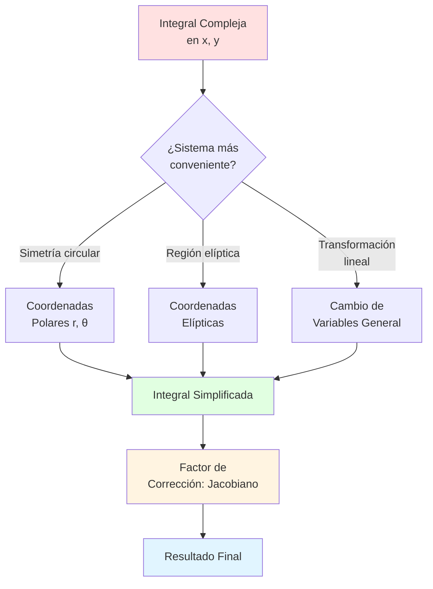
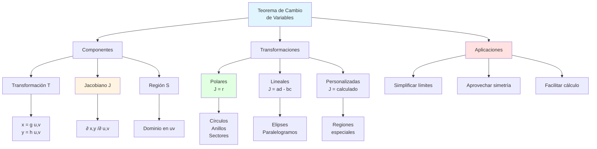

# 📐 Teorema de Cambio de Variables 

## 🎯 Introducción

> [!info]- 💡 ¿Qué es el Cambio de Variables? El **Teorema de Cambio de Variables** (también llamado **transformación de coordenadas**) es una técnica fundamental en cálculo multivariable que permite simplificar integrales dobles complejas mediante la transformación del dominio de integración a un sistema de coordenadas más conveniente.
> 
> **Analogía práctica:** Imagina que necesitas calcular el área de un terreno circular. Puedes intentar hacerlo con coordenadas rectangulares (x, y), dividiendo el círculo en pequeños rectángulos, o usar coordenadas polares (r, θ) donde el círculo se describe naturalmente. El segundo enfoque es mucho más simple.
> 
> **¿Por qué es importante?**
> 
> |Aspecto|Descripción|Ejemplo de Uso|
> |---|---|---|
> |**Simplificación**|Transforma regiones complejas en simples|Círculos → Rectángulos|
> |**Límites claros**|Los límites de integración son más sencillos|Elipses, sectores circulares|
> |**Simetría natural**|Aprovecha la geometría del problema|Objetos con simetría radial|
> |**Cálculo eficiente**|Reduce la complejidad computacional|Integrales múltiples complejas|
> |**Modelado físico**|Representa mejor ciertos fenómenos|Campos gravitacionales, ondas|



---

## 📊 Concepto Fundamental

### 🔄 Transformaciones de Coordenadas

> [!example]- 🌀 ¿Qué es una Transformación?
> 
> Una **transformación de coordenadas** es una función que mapea puntos de un sistema de coordenadas a otro. Matemáticamente, es una función vectorial:
> 
> **Forma general:**
> 
> ```
> T: R² → R²
> (u, v) ↦ (x, y)
> 
> donde:
> x = x(u, v)
> y = y(u, v)
> ```
> 
> **Interpretación geométrica:**
> 
> ```mermaid
> graph LR
>     A[Región S<br/>en plano uv] -->|Transformación T| B[Región R<br/>en plano xy]
>     
>     A -.->|u = constante| C[Líneas verticales]
>     A -.->|v = constante| D[Líneas horizontales]
>     
>     B -.->|x = x u,v| E[Curvas en xy]
>     B -.->|y = y u,v| F[Curvas en xy]
>     
>     style A fill:#e1f5ff
>     style B fill:#e1ffe1
> ```
> 
> **Ejemplos de transformaciones comunes:**
> 
> |Transformación|De (u,v) a (x,y)|Uso típico|
> |---|---|---|
> |**Polares**|x = r cos(θ)<br/>y = r sen(θ)|Círculos, sectores circulares|
> |**Lineal**|x = au + bv<br/>y = cu + dv|Elipses, paralelogramos|
> |**Escalado**|x = au<br/>y = bv|Cambio de escala|
> |**Rotación**|x = u cos(α) - v sen(α)<br/>y = u sen(α) + v cos(α)|Regiones rotadas|
> 
> **Visualización de coordenadas polares:**
> 
> ```mermaid
> graph TD
>     subgraph "Plano uv (r, θ)"
>     A[Rectángulo<br/>0 ≤ r ≤ R<br/>0 ≤ θ ≤ 2π]
>     end
>     
>     subgraph "Plano xy"
>     B[Círculo<br/>x² + y² ≤ R²]
>     end
>     
>     A -->|x = r cos θ<br/>y = r sen θ| B
>     
>     style A fill:#fff4e1
>     style B fill:#e1ffe1
> ```

### 📐 El Jacobiano

> [!note]- 🎲 Factor de Corrección de Área
> 
> El **Jacobiano** es el factor que corrige cómo se distorsionan las áreas (o volúmenes) bajo una transformación. Mide la "tasa de cambio de área" local.
> 
> **Definición formal:**
> 
> Para una transformación T: (u,v) → (x,y), el Jacobiano es el determinante de la matriz de derivadas parciales:
> 
> ```
> ∂(x,y)     │ ∂x/∂u   ∂x/∂v │
> ────── = │                │ = ∂x/∂u · ∂y/∂v - ∂x/∂v · ∂y/∂u
> ∂(u,v)     │ ∂y/∂u   ∂y/∂v │
> ```
> 
> **Interpretación geométrica:**
> 
> |Concepto|Significado|
> |---|---|
> |**\|J\| > 1**|La transformación **expande** áreas|
> |**\|J\| < 1**|La transformación **contrae** áreas|
> |**\|J\| = 1**|La transformación **preserva** áreas|
> |**J = 0**|La transformación es **degenerada** (no invertible)|
> 
> **Flujo conceptual:**
> 
> ```mermaid
> flowchart TD
>     A[Elemento diferencial<br/>du dv en S] --> B[Transformación T]
>     B --> C{Jacobiano J}
>     C -->|J > 1| D[Área expandida<br/>|J| du dv]
>     C -->|J < 1| E[Área contraída<br/>|J| du dv]
>     C -->|J = 1| F[Área preservada<br/>du dv]
>     
>     D --> G[Elemento en R]
>     E --> G
>     F --> G
>     
>     style A fill:#e1f5ff
>     style C fill:#fff4e1
>     style G fill:#e1ffe1
> ```
> 
> **Cálculo del Jacobiano - Ejemplos:**
> 
> **Ejemplo 1: Coordenadas polares**
> 
> ```
> x = r cos(θ)    →   ∂x/∂r = cos(θ),  ∂x/∂θ = -r sen(θ)
> y = r sen(θ)    →   ∂y/∂r = sen(θ),  ∂y/∂θ = r cos(θ)
> 
> J = │ cos(θ)   -r sen(θ) │
>     │ sen(θ)    r cos(θ) │
>     
> J = r cos²(θ) + r sen²(θ) = r
> ```
> 
> **Ejemplo 2: Transformación lineal**
> 
> ```
> x = 2u + v      →   ∂x/∂u = 2,  ∂x/∂v = 1
> y = u - 3v      →   ∂y/∂u = 1,  ∂y/∂v = -3
> 
> J = │  2   1 │
>     │  1  -3 │
>     
> J = 2(-3) - 1(1) = -7
> |J| = 7
> ```
> 
> **Tabla de Jacobianos comunes:**
> 
> |Transformación|Jacobiano|
> |---|---|
> |Polares: x = r cos(θ), y = r sen(θ)|r|
> |Cilíndricas: x = r cos(θ), y = r sen(θ), z = z|r|
> |Esféricas: x = ρ sen(φ)cos(θ), y = ρ sen(φ)sen(θ), z = ρ cos(φ)|ρ² sen(φ)|
> |Escalado: x = au, y = bv|ab|
> |General lineal: x = au + bv, y = cu + dv|ad - bc|

---

## 🔬 Teorema de Cambio de Variables

### 📜 Enunciado Formal

> [!success]- 📋 Teorema Principal
> 
> Sea T: S → R una transformación uno a uno desde una región S en el plano uv hacia una región R en el plano xy, dada por:
> 
> ```
> x = g(u, v)
> y = h(u, v)
> ```
> 
> donde g y h tienen derivadas parciales continuas. Si f es continua en R y el Jacobiano ∂(x,y)/∂(u,v) es no nulo en S, entonces:
> 
> ```
> ∬_R f(x,y) dA = ∬_S f(g(u,v), h(u,v)) |∂(x,y)/∂(u,v)| du dv
> ```
> 
> **Componentes del teorema:**
> 
> ```mermaid
> graph TD
>     A[Integral Original<br/>∬_R f x,y dA] --> B[Cambio de Variables]
>     
>     B --> C[Función transformada<br/>f g u,v , h u,v]
>     B --> D[Jacobiano<br/>|∂ x,y /∂ u,v|]
>     B --> E[Nuevos diferenciales<br/>du dv]
>     B --> F[Nueva región<br/>S en plano uv]
>     
>     C --> G[Integral Transformada<br/>∬_S ... |J| du dv]
>     D --> G
>     E --> G
>     F --> G
>     
>     style A fill:#ffe1e1
>     style G fill:#e1ffe1
>     style D fill:#fff4e1
> ```
> 
> **Condiciones del teorema:**
> 
> |Condición|Significado|Importancia|
> |---|---|---|
> |**T es uno a uno**|Cada punto en R viene de exactamente un punto en S|Evita contar áreas múltiples veces|
> |**g, h tienen derivadas continuas**|La transformación es suave|Garantiza existencia del Jacobiano|
> |**J ≠ 0 en S**|Transformación no degenerada|La transformación es localmente invertible|
> |**f continua en R**|La función a integrar es bien comportada|Garantiza existencia de la integral|
> 
> **Interpretación visual:**
> 
> ```mermaid
> graph LR
>     subgraph "Paso 1: Región Original"
>     A[Región R complicada<br/>en plano xy]
>     end
>     
>     subgraph "Paso 2: Transformación"
>     B[Mapeo T<br/>con Jacobiano J]
>     end
>     
>     subgraph "Paso 3: Región Transformada"
>     C[Región S simple<br/>en plano uv]
>     end
>     
>     A -->|Difícil de integrar| B
>     B -->|Simplifica| C
>     C -->|Integral con |J|| D[Resultado]
>     
>     style A fill:#ffe1e1
>     style C fill:#e1ffe1
>     style D fill:#e1f5ff
> ```

### 🎯 Aplicación Práctica del Teorema

> [!tip]- 🛠️ Procedimiento Paso a Paso
> 
> **Algoritmo general:**
> 
> ```mermaid
> flowchart TD
>     A[Inicio: Integral ∬_R f x,y dA] --> B[Paso 1:<br/>Identificar transformación adecuada]
>     
>     B --> C{¿Tipo de región?}
>     C -->|Circular| D[Usar polares]
>     C -->|Elíptica| E[Usar escalado]
>     C -->|Otra| F[Definir T personalizada]
>     
>     D --> G[Paso 2:<br/>Escribir x u,v , y u,v]
>     E --> G
>     F --> G
>     
>     G --> H[Paso 3:<br/>Calcular Jacobiano]
>     
>     H --> I[Paso 4:<br/>Determinar región S]
>     
>     I --> J[Paso 5:<br/>Sustituir en integral]
>     
>     J --> K[Paso 6:<br/>Integrar respecto a u, v]
>     
>     K --> L[Resultado Final]
>     
>     style A fill:#e1f5ff
>     style H fill:#fff4e1
>     style L fill:#e1ffe1
> ```
> 
> **Tabla de decisión para elegir transformación:**
> 
> |Forma de R|Ecuación característica|Transformación recomendada|
> |---|---|---|
> |**Círculo**|x² + y² ≤ a²|Polares: x = r cos(θ), y = r sen(θ)|
> |**Anillo**|a² ≤ x² + y² ≤ b²|Polares: x = r cos(θ), y = r sen(θ)|
> |**Sector circular**|x² + y² ≤ a², α ≤ θ ≤ β|Polares con límites en θ|
> |**Elipse**|(x/a)² + (y/b)² ≤ 1|Escalado: x = au, y = bv|
> |**Paralelogramo**|Vértices dados|Transformación lineal|
> |**Región entre curvas**|y = f(x) y y = g(x)|Según forma de f, g|
> 
> **Ejemplo detallado:**
> 
> **Problema:** Calcular ∬_R (x² + y²) dA donde R es el círculo x² + y² ≤ 4
> 
> **Solución paso a paso:**
> 
> ```
> Paso 1: Identificar transformación
> R es circular → usar coordenadas polares
> 
> Paso 2: Definir transformación
> x = r cos(θ)
> y = r sen(θ)
> 
> Paso 3: Calcular Jacobiano
> ∂x/∂r = cos(θ),   ∂x/∂θ = -r sen(θ)
> ∂y/∂r = sen(θ),   ∂y/∂θ = r cos(θ)
> 
> J = r cos²(θ) + r sen²(θ) = r
> 
> Paso 4: Determinar región S
> x² + y² ≤ 4  →  r² ≤ 4  →  0 ≤ r ≤ 2
> Círculo completo  →  0 ≤ θ ≤ 2π
> 
> Paso 5: Sustituir
> x² + y² = r²
> dA = r dr dθ
> 
> ∬_R (x² + y²) dA = ∫₀^(2π) ∫₀² r² · r dr dθ
>                   = ∫₀^(2π) ∫₀² r³ dr dθ
> 
> Paso 6: Integrar
> = ∫₀^(2π) [r⁴/4]₀² dθ
> = ∫₀^(2π) 4 dθ
> = 4[θ]₀^(2π)
> = 8π
> ```
> 
> **Visualización del proceso:**
> 
> ```mermaid
> graph TB
>     subgraph "Plano xy"
>     A[Círculo<br/>x² + y² ≤ 4]
>     end
>     
>     subgraph "Transformación"
>     B[Coordenadas Polares<br/>J = r]
>     end
>     
>     subgraph "Plano r-θ"
>     C[Rectángulo<br/>0 ≤ r ≤ 2<br/>0 ≤ θ ≤ 2π]
>     end
>     
>     A -->|Complejo| B
>     B -->|Simplifica| C
>     C -->|Integrar r³| D[Resultado: 8π]
>     
>     style A fill:#ffe1e1
>     style C fill:#e1ffe1
>     style D fill:#e1f5ff
> ```

---

## 🌟 Coordenadas Polares

### 🔵 Definición y Propiedades

> [!info]- 📐 Sistema Polar
> 
> Las **coordenadas polares** (r, θ) describen puntos en el plano mediante:
> 
> - **r**: distancia al origen (radio)
> - **θ**: ángulo respecto al eje x positivo (ángulo polar)
> 
> **Relación con coordenadas cartesianas:**
> 
> ```
> De polares a cartesianas:        De cartesianas a polares:
> x = r cos(θ)                     r = √(x² + y²)
> y = r sen(θ)                     θ = arctan(y/x)
> ```
> 
> **Representación visual:**
> 
> ```mermaid
> graph TD
>     A[Punto P x,y = r,θ] --> B[Componente x<br/>x = r cos θ]
>     A --> C[Componente y<br/>y = r sen θ]
>     
>     B --> D[Proyección sobre eje x]
>     C --> E[Proyección sobre eje y]
>     
>     F[Origen O] -.->|distancia r| A
>     G[Eje x positivo] -.->|ángulo θ| A
>     
>     style A fill:#e1f5ff
>     style F fill:#fff4e1
>     style G fill:#fff4e1
> ```
> 
> **Propiedades clave:**
> 
> |Propiedad|Valor|Significado|
> |---|---|---|
> |**Rango de r**|r ≥ 0|Distancia siempre positiva|
> |**Rango de θ**|0 ≤ θ < 2π (o -π < θ ≤ π)|Ángulo puede dar vuelta completa|
> |**Origen**|r = 0, θ arbitrario|Cualquier θ representa el origen|
> |**No unicidad**|(r, θ) = (r, θ + 2πn)|Mismo punto, diferentes coordenadas|
> 
> **Curvas especiales en polares:**
> 
> |Curva|Ecuación polar|Ecuación cartesiana|
> |---|---|---|
> |Círculo centrado en origen|r = a|x² + y² = a²|
> |Círculo desplazado|r = 2a cos(θ)|(x-a)² + y² = a²|
> |Recta vertical|θ = α (constante)|y = x tan(α)|
> |Espiral de Arquímedes|r = aθ|x² + y² = a²(arctan(y/x))²|
> |Cardioide|r = a(1 + cos(θ))|Compleja en cartesianas|
> |Rosa de n pétalos|r = a cos(nθ)|Muy compleja en cartesianas|

### ⚙️ Jacobiano en Coordenadas Polares

> [!example]- 🎲 Cálculo del Factor de Corrección
> 
> **Derivación del Jacobiano:**
> 
> ```
> Transformación:
> x = r cos(θ)
> y = r sen(θ)
> 
> Derivadas parciales:
> ∂x/∂r = cos(θ)        ∂x/∂θ = -r sen(θ)
> ∂y/∂r = sen(θ)        ∂y/∂θ = r cos(θ)
> 
> Jacobiano:
> ∂(x,y)     │ cos(θ)   -r sen(θ) │
> ────── = │                    │
> ∂(r,θ)     │ sen(θ)    r cos(θ) │
> 
>          = cos(θ) · r cos(θ) - (-r sen(θ)) · sen(θ)
>          = r cos²(θ) + r sen²(θ)
>          = r(cos²(θ) + sen²(θ))
>          = r · 1
>          = r
> ```
> 
> **Interpretación geométrica del factor r:**
> 
> ```mermaid
> graph TD
>     A[Elemento rectangular<br/>dr × dθ en plano r-θ] --> B{Transformación<br/>a xy}
>     
>     B --> C[Lado radial:<br/>dr permanece dr]
>     B --> D[Lado angular:<br/>dθ se convierte en r dθ]
>     
>     C --> E[Elemento en xy:<br/>dr × r dθ]
>     D --> E
>     
>     E --> F[Área = r dr dθ]
>     
>     style A fill:#fff4e1
>     style E fill:#e1ffe1
>     style F fill:#e1f5ff
> ```
> 
> **¿Por qué el factor r?**
> 
> |Concepto|Explicación|
> |---|---|
> |**dr**|Cambio infinitesimal en dirección radial → mismo en ambos sistemas|
> |**dθ**|Cambio angular → en xy se convierte en arco de longitud r·dθ|
> |**Área**|Rectángulo dr × (r·dθ) = r dr dθ|
> |**r crece**|A mayor distancia del origen, mismo dθ barre más área|
> 
> **Fórmula de integración en polares:**
> 
> ```
> ∬_R f(x,y) dA = ∬_S f(r cos(θ), r sen(θ)) r dr dθ
> ```
> 
> donde S es la región R descrita en coordenadas polares.
> 
> **Casos típicos de límites:**
> 
> |Tipo de región|Límites de r|Límites de θ|
> |---|---|---|
> |Círculo completo|0 ≤ r ≤ a|0 ≤ θ ≤ 2π|
> |Semicírculo superior|0 ≤ r ≤ a|0 ≤ θ ≤ π|
> |Cuarto de círculo (primer cuadrante)|0 ≤ r ≤ a|0 ≤ θ ≤ π/2|
> |Anillo|a ≤ r ≤ b|0 ≤ θ ≤ 2π|
> |Sector circular|0 ≤ r ≤ a|α ≤ θ ≤ β|

### 🎯 Cuándo Usar Coordenadas Polares

> [!tip]- ✅ Criterios de Selección
> 
> **Señales de que polares simplifican el problema:**
> 
> ```mermaid
> flowchart TD
>     A[Integral ∬_R f x,y dA] --> B{¿Qué características tiene?}
>     
>     B -->|Región circular| C[✅ Usar Polares]
>     B -->|Función con x²+y²| D[✅ Usar Polares]
>     B -->|Simetría radial| E[✅ Usar Polares]
>     B -->|Límites complejos en xy| F{¿Simples en polares?}
>     
>     F -->|Sí| C
>     F -->|No| G[❌ Mantener cartesianas]
>     
>     C --> H[Convertir a<br/>∬_S ... r dr dθ]
>     
>     style C fill:#e1ffe1
>     style G fill:#ffe1e1
>     style H fill:#e1f5ff
> ```
> 
> **Lista de verificación:**
> 
> |Característica|¿Usar polares?|Ejemplo|
> |---|---|---|
> |Región es un círculo|✅ Sí|x² + y² ≤ 9|
> |Región es una elipse|❌ No (usar escalado)|(x/a)² + (y/b)² ≤ 1|
> |Región es un anillo|✅ Sí|1 ≤ x² + y² ≤ 4|
> |Región es un sector|✅ Sí|x² + y² ≤ 4, y ≥ 0, x ≥ 0|
> |Función tiene √(x²+y²)|✅ Sí (se convierte en r)|f(x,y) = √(x²+y²)|
> |Función tiene x²+y²|✅ Sí (se convierte en r²)|f(x,y) = e^(-(x²+y²))|
> |Función tiene arctan(y/x)|✅ Sí (se convierte en θ)|f(x,y) = arctan(y/x)|
> |Límites en x, y son constantes|❌ No|0 ≤ x ≤ 1, 0 ≤ y ≤ 1|
> 
> **Ejemplos comparativos:**
> 
> **Ejemplo 1: Favorable a polares**
> 
> ```
> Problema: ∬_R √(x² + y²) dA, R: x² + y² ≤ 4
> 
> En cartesianas:
> ∫₋₂² ∫₋√(4-x²)^√(4-x²) √(x² + y²) dy dx  ← MUY COMPLEJO
> 
> En polares:
> ∫₀^(2π) ∫₀² r · r dr dθ = ∫₀^(2π) ∫₀² r² dr dθ  ← SIMPLE
> ```
> 
> **Ejemplo 2: Desfavorable a polares**
> 
> ```
> Problema: ∬_R xy dA, R: [0,1] × [0,1]
> 
> En cartesianas:
> ∫₀¹ ∫₀¹ xy dy dx  ← YA ES SIMPLE
> 
> En polares:
> Límites complicados y función r²cos(θ)sen(θ)  ← INNECESARIO
> ```

---

## 🔄 Otras Transformaciones Comunes

### 📏 Transformaciones Lineales

> [!note]- 🔀 Cambios de Variables Lineales
> 
> Una **transformación lineal** tiene la forma:
> 
> ```
> x = au + bv
> y = cu + dv
> ```
> 
> donde a, b, c, d son constantes.
> 
> **Jacobiano de transformación lineal:**
> 
> ```
> ∂(x,y)     │ a   b │
> ────── = │       │ = ad - bc
> ∂(u,v)     │ c   d │
> ```
> 
> **Casos especiales importantes:**
> 
> |Transformación|Forma|Jacobiano|Uso|
> |---|---|---|---|
> |**Escalado**|x = au, y = bv|ab|Elipses → círculos|
> |**Rotación**|x = u cos(α) - v sen(α)<br/>y = u sen(α) + v cos(α)|1|Rotar región|
> |**Cizalladura**|x = u + kv, y = v|1|Paralelogramos|
> |**Reflexión**|x = -u, y = v|-1|Simetría|
> 
> **Transformación para elipses:**
> 
> ```mermaid
> graph LR
>     subgraph "Plano xy"
>     A[Elipse<br/> x/a ² + y/b ² ≤ 1]
>     end
>     
>     subgraph "Transformación"
>     B[x = au<br/>y = bv<br/>J = ab]
>     end
>     
>     subgraph "Plano uv"
>     C[Círculo<br/>u² + v² ≤ 1]
>     end
>     
>     A -->|Complicado| B
>     B -->|Simplifica| C
>     
>     style A fill:#ffe1e1
> 
> style C fill:#e1ffe1
> ```
> 
> 
> 
> **Ejemplo: Integral sobre elipse**
> ```
> 
> Problema: ∬_R dA, donde R: (x/3)² + (y/2)² ≤ 1
> 
> Transformación: x = 3u → u = x/3 y = 2v → v = y/2
> 
> Jacobiano: J = │ 3 0 │ = 6 │ 0 2 │
> 
> Región S en uv: u² + v² ≤ 1 (círculo unitario)
> 
> Integral transformada: ∬_R dA = ∬_S |6| du dv = 6 · ∬_S du dv = 6 · (Área del círculo unitario) = 6π
> ```

### 🎨 Transformaciones Personalizadas

> [!example]- 🛠️ Diseñar Transformaciones a Medida
> 
> **Estrategia para crear transformaciones:**
> 
> ```mermaid
> flowchart TD
>     A[Analizar región R] --> B{¿Qué simplificaría R?}
>     
>     B --> C[Identificar bordes<br/>de la región]
>     C --> D[Hacer que bordes<br/>sean u o v constantes]
>     
>     D --> E[Proponer<br/>x = g u,v<br/>y = h u,v]
>     
>     E --> F[Verificar que R<br/>se vuelve rectangular]
>     
>     F --> G{¿Funciona?}
>     G -->|No| E
>     G -->|Sí| H[Calcular Jacobiano]
>     
>     H --> I[Aplicar transformación]
>     
>     style A fill:#e1f5ff
>     style E fill:#fff4e1
>     style I fill:#e1ffe1
> ```
> 
> **Ejemplo: Región entre parábolas**
> 
> ```
> Problema: R limitada por y = x², y = 2x²
> 
> Observación: Ambos bordes son de la forma y = kx²
> 
> Propuesta de transformación:
> Sea u = y/x² (razón entre y y x²)
>     v = x
> 
> Entonces:
> y = ux²
> x = v
> 
> Despejando para la transformación:
> x = v
> y = uv²
> 
> Jacobiano:
> ∂x/∂u = 0,    ∂x/∂v = 1
> ∂y/∂u = v²,   ∂y/∂v = 2uv
> 
> J = │ 0   1  │ = -v²
>     │ v²  2uv│
> 
> |J| = v²
> 
> Región S:
> y = x²  →  uv² = v²  →  u = 1
> y = 2x² →  uv² = 2v² →  u = 2
> 
> S: 1 ≤ u ≤ 2, a ≤ v ≤ b (donde a, b son límites en x)
> ```
> 
> **Plantilla para regiones acotadas por curvas:**
> 
> |Tipo de curvas|Sugerencia de transformación|
> |---|---|
> |y = ax², y = bx²|u = y/x², v = x|
> |y = a√x, y = b√x|u = y/√x, v = x|
> |y = ae^x, y = be^x|u = ye^(-x), v = x|
> |x² - y² = a, x² - y² = b|u = x² - y², v = xy|
> |xy = a, xy = b|u = xy, v = x/y|

---

## 📊 Estrategias de Resolución

### 🗺️ Mapa Mental de Decisiones

> [!tip]- 🧭 Guía Completa para Elegir Método
> 
> ```mermaid
> flowchart TD
>     A[Integral Doble<br/>∬_R f x,y dA] --> B{¿Forma de R?}
>     
>     B -->|Rectangular| C[Coordenadas<br/>Cartesianas]
>     B -->|Circular/Anular| D[Coordenadas<br/>Polares]
>     B -->|Elíptica| E[Escalado<br/>x=au, y=bv]
>     B -->|Entre curvas| F[Transformación<br/>personalizada]
>     
>     C --> G{¿f x,y simple?}
>     G -->|Sí| H[Integrar directamente]
>     G -->|No| I[Considerar cambio]
>     
>     D --> J[Convertir a polares<br/>J = r]
>     E --> K[Jacobiano J = ab]
>     F --> L[Diseñar T<br/>calcular J]
>     
>     J --> M[Establecer límites<br/>en r, θ]
>     K --> N[Región → círculo]
>     L --> O[Simplificar límites]
>     
>     M --> P[Integrar]
>     N --> P
>     O --> P
>     H --> P
>     
>     P --> Q[Resultado]
>     
>     style A fill:#e1f5ff
>     style D fill:#e1ffe1
>     style E fill:#fff4e1
>     style F fill:#ffe1e1
>     style Q fill:#e1f5ff
> ```
> 
> **Tabla de decisión rápida:**
> 
> |Si la región R es...|Y la función f(x,y) tiene...|Entonces usa...|
> |---|---|---|
> |Círculo o anillo|x² + y²|Polares (r se simplifica)|
> |Círculo o anillo|Cualquier función|Polares (límites simples)|
> |Elipse|(x/a)² + (y/b)²|Escalado a círculo|
> |Sector circular|Ángulos específicos|Polares con límites en θ|
> |Rectángulo|Función simple|Cartesianas|
> |Entre parábolas|y/x² o similar|Transformación u = y/x²|
> |Entre hipérbolas|xy o x²-y²|Transformación con producto|
> |Paralelogramo|Lineal|Transformación lineal|

### 📋 Checklist de Resolución

> [!success]- ✅ Pasos Sistemáticos
> 
> **Protocolo completo:**
> 
> ```mermaid
> flowchart TD
>     A[1. Analizar región R] --> B[2. Identificar simetrías]
>     B --> C[3. Elegir transformación T]
>     C --> D[4. Escribir x u,v, y u,v]
>     D --> E[5. Calcular Jacobiano]
>     E --> F[6. Determinar región S]
>     F --> G[7. Transformar f x,y]
>     G --> H[8. Establecer límites]
>     H --> I[9. Integrar en orden]
>     I --> J[10. Verificar resultado]
>     
>     K[⚠️ Verificar J ≠ 0] -.-> E
>     L[⚠️ Dibujar S] -.-> F
>     M[⚠️ Revisar unidades] -.-> J
>     
>     style A fill:#e1f5ff
>     style E fill:#fff4e1
>     style I fill:#ffe1e1
>     style J fill:#e1ffe1
> ```
> 
> **Checklist detallado:**
> 
> |#|Paso|Preguntas clave|Errores comunes|
> |---|---|---|---|
> |1|**Analizar R**|¿Qué forma tiene? ¿Ecuaciones de los bordes?|Confundir límites|
> |2|**Simetrías**|¿Radial? ¿Reflectiva?|No aprovechar simetrías|
> |3|**Elegir T**|¿Simplifica R? ¿Simplifica f?|Elegir T complicada|
> |4|**Escribir T**|¿Formato correcto? ¿Derivable?|Invertir u y v|
> |5|**Jacobiano**|¿Calculado correctamente? ¿|J|
> |6|**Región S**|¿Límites claros? ¿Rectangular?|Límites incorrectos|
> |7|**Transformar f**|¿Todas las x, y reemplazadas?|Dejar x o y sin cambiar|
> |8|**Límites**|¿Orden correcto? ¿Constantes vs variables?|Invertir orden|
> |9|**Integrar**|¿Interior primero? ¿Límites correctos?|Errores de cálculo|
> |10|**Verificar**|¿Unidades correctas? ¿Sentido físico?|No revisar|
> 
> **Ejemplo completo aplicando el checklist:**
> 
> ```
> Problema: ∬_R e^(-(x²+y²)) dA, R: x² + y² ≤ 1
> 
> ✅ 1. Analizar R: Círculo unitario
> ✅ 2. Simetrías: Radial (favorable a polares)
> ✅ 3. Elegir T: Coordenadas polares
> ✅ 4. Escribir T: x = r cos(θ), y = r sen(θ)
> ✅ 5. Jacobiano: J = r
> ✅ 6. Región S: 0 ≤ r ≤ 1, 0 ≤ θ ≤ 2π (rectángulo en r-θ)
> ✅ 7. Transformar f: e^(-(x²+y²)) = e^(-r²)
> ✅ 8. Límites: Interior r: 0→1, Exterior θ: 0→2π
> ✅ 9. Integrar:
>       ∫₀^(2π) ∫₀¹ e^(-r²) r dr dθ
>       = ∫₀^(2π) [-½e^(-r²)]₀¹ dθ
>       = ∫₀^(2π) ½(1 - e^(-1)) dθ
>       = π(1 - e^(-1))
> ✅ 10. Verificar: 
>       - Resultado positivo ✓
>       - Menor que área del círculo (π) ✓
>       - Unidades correctas ✓
> ```

---

## 🎓 Ejemplos Resueltos

### 📝 Ejemplo 1: Coordenadas Polares Básico

> [!example]- 🎯 Área de Círculo
> 
> **Problema:** Calcular el área del círculo x² + y² ≤ 9
> 
> **Solución detallada:**
> 
> ```
> Paso 1: Identificar que es favorable a polares
> - Región circular
> - Ecuación tiene x² + y²
> 
> Paso 2: Transformación a polares
> x = r cos(θ)
> y = r sen(θ)
> 
> Paso 3: Jacobiano
> J = r
> 
> Paso 4: Región S
> x² + y² ≤ 9  →  r² ≤ 9  →  0 ≤ r ≤ 3
> Círculo completo  →  0 ≤ θ ≤ 2π
> 
> Paso 5: Integral del área (f = 1)
> A = ∬_R dA = ∬_S r dr dθ
>   = ∫₀^(2π) ∫₀³ r dr dθ
> 
> Paso 6: Integrar respecto a r
> ∫₀³ r dr = [r²/2]₀³ = 9/2
> 
> Paso 7: Integrar respecto a θ
> ∫₀^(2π) (9/2) dθ = (9/2)[θ]₀^(2π) = 9π
> 
> Resultado: A = 9π
> ```
> 
> **Visualización:**
> 
> ```mermaid
> graph TD
>     A[Círculo en xy<br/>x² + y² ≤ 9] -->|Polares| B[Rectángulo en r-θ<br/>0 ≤ r ≤ 3<br/>0 ≤ θ ≤ 2π]
>     
>     B --> C[Integrar r<br/>∫₀³ r dr = 9/2]
>     C --> D[Integrar θ<br/>∫₀^2π 9/2 dθ = 9π]
>     
>     style A fill:#ffe1e1
>     style B fill:#e1ffe1
>     style D fill:#e1f5ff
> ```

### 📝 Ejemplo 2: Función con x² + y²

> [!example]- 🎯 Integral con Exponencial
> 
> **Problema:** Calcular ∬_R e^√(x²+y²) dA donde R: 0 ≤ x² + y² ≤ 4, x ≥ 0, y ≥ 0
> 
> **Solución:**
> 
> ```
> Paso 1: Análisis
> - Región: cuarto de anillo (primer cuadrante)
> - Función: tiene √(x² + y²) → se simplifica a r en polares
> 
> Paso 2: Transformación
> x = r cos(θ)
> y = r sen(θ)
> J = r
> 
> Paso 3: Región S
> 0 ≤ x² + y² ≤ 4  →  0 ≤ r² ≤ 4  →  0 ≤ r ≤ 2
> x ≥ 0, y ≥ 0  →  primer cuadrante  →  0 ≤ θ ≤ π/2
> 
> Paso 4: Transformar función
> √(x² + y²) = r
> f(x,y) = e^√(x²+y²) = e^r
> 
> Paso 5: Integral transformada
> ∬_R e^√(x²+y²) dA = ∫₀^(π/2) ∫₀² e^r · r dr dθ
> 
> Paso 6: Integrar por partes respecto a r
> ∫ r e^r dr: 
> u = r → du = dr
> dv = e^r dr → v = e^r
> 
> ∫ r e^r dr = r e^r - ∫ e^r dr = r e^r - e^r = e^r(r - 1)
> 
> [e^r(r - 1)]₀² = e²(2 - 1) - e⁰(0 - 1) = e² - (-1) = e² + 1
> 
> Paso 7: Integrar respecto a θ
> ∫₀^(π/2) (e² + 1) dθ = (e² + 1)[θ]₀^(π/2) = (π/2)(e² + 1)
> 
> Resultado: (π/2)(e² + 1)
> ```

### 📝 Ejemplo 3: Transformación a Elipse

> [!example]- 🎯 Integral sobre Elipse
> 
> **Problema:** Calcular ∬_R (x² + y²) dA donde R: (x/2)² + (y/3)² ≤ 1
> 
> **Solución:**
> 
> ```
> Paso 1: Identificar que R es elipse
> (x/2)² + (y/3)² ≤ 1
> Semi-ejes: a = 2, b = 3
> 
> Paso 2: Transformación para convertir a círculo
> x = 2u  (escalado por a)
> y = 3v  (escalado por b)
> 
> Paso 3: Calcular Jacobiano
> ∂x/∂u = 2,  ∂x/∂v = 0
> ∂y/∂u = 0,  ∂y/∂v = 3
> 
> J = │ 2  0 │ = 6
>     │ 0  3 │
> 
> Paso 4: Región S
> (x/2)² + (y/3)² ≤ 1  →  u² + v² ≤ 1
> (círculo unitario)
> 
> Paso 5: Transformar función
> x² + y² = (2u)² + (3v)² = 4u² + 9v²
> 
> Paso 6: Integral transformada
> ∬_R (x² + y²) dA = ∬_S (4u² + 9v²) · 6 du dv
>                   = 6 ∬_S (4u² + 9v²) du dv
> 
> Paso 7: Usar polares en S (u² + v² ≤ 1)
> u = ρ cos(φ)
> v = ρ sen(φ)
> J_polar = ρ
> 
> 0 ≤ ρ ≤ 1, 0 ≤ φ ≤ 2π
> 
> 4u² + 9v² = 4ρ²cos²(φ) + 9ρ²sen²(φ)
>           = ρ²(4cos²(φ) + 9sen²(φ))
> 
> Paso 8: Integrar
> = 6 ∫₀^(2π) ∫₀¹ ρ²(4cos²(φ) + 9sen²(φ)) ρ dρ dφ
> = 6 ∫₀^(2π) ∫₀¹ ρ³(4cos²(φ) + 9sen²(φ)) dρ dφ
> 
> = 6 ∫₀^(2π) [ρ⁴/4]₀¹ (4cos²(φ) + 9sen²(φ)) dφ
> = (6/4) ∫₀^(2π) (4cos²(φ) + 9sen²(φ)) dφ
> 
> Usando: ∫₀^(2π) cos²(φ) dφ = π, ∫₀^(2π) sen²(φ) dφ = π
> 
> = (3/2)(4π + 9π) = (3/2)(13π) = 39π/2
> 
> Resultado: 39π/2
> ```

---

## ⚠️ Errores Comunes y Soluciones

### 🚫 Errores Frecuentes

> [!warning]- ❌ Equivocaciones Típicas
> 
> **Tabla de errores:**
> 
> |Error|Descripción|Ejemplo incorrecto|Corrección|
> |---|---|---|---|
> |**Olvidar Jacobiano**|No multiplicar por \|J\||∫∫ f(r,θ) dr dθ|∫∫ f(r,θ) r dr dθ|
> |**Jacobiano sin valor absoluto**|Usar J en lugar de \|J\||Integral con J = -2|Usar \|J\| = 2|
> |**Límites incorrectos**|No transformar correctamente los límites|Usar límites de xy en uv|Recalcular límites en S|
> |**Invertir orden**|dr dθ cuando debería ser dθ dr|Límites inconsistentes|Verificar qué variable es interior|
> |**No sustituir función**|Dejar f(x,y) sin cambiar|f(x,y) con variables r,θ|f(g(u,v), h(u,v))|
> |**Confundir rangos de θ**|Usar 0 a π para círculo completo|∫₀^π ... dθ|∫₀^(2π) ... dθ|
> |**Signo del Jacobiano**|No considerar orientación|J negativo sin \||Siempre usar \|J\||
> 
> **Ejemplo de error común:**
> 
> ```
> ❌ INCORRECTO:
> ∬_R √(x² + y²) dA = ∫₀^(2π) ∫₀² r dr dθ
>                                    ↑
>                              Falta el Jacobiano r
> 
> ✅ CORRECTO:
> ∬_R √(x² + y²) dA = ∫₀^(2π) ∫₀² r · r dr dθ = ∫₀^(2π) ∫₀² r² dr dθ
>                                      ↑
>                              Jacobiano incluido
> ```
> 
> **Diagrama de verificación:**
> 
> ```mermaid
> flowchart TD
>     A[Antes de integrar] --> B{¿Incluí |J|?}
>     B -->|No| C[❌ ERROR<br/>Resultado incorrecto]
>     B -->|Sí| D{¿Límites correctos?}
>     
>     D -->|No| E[❌ ERROR<br/>Región incorrecta]
>     D -->|Sí| F{¿f transformada?}
>     
>     F -->|No| G[❌ ERROR<br/>Función incorrecta]
>     F -->|Sí| H[✅ Correcto<br/>Proceder]
>     
>     style C fill:#ffe1e1
>     style E fill:#ffe1e1
>     style G fill:#ffe1e1
>     style H fill:#e1ffe1
> ```

### ✅ Buenas Prácticas

> [!success]- 🏆 Recomendaciones Profesionales
> 
> **Lista de verificación:**
> 
> ```mermaid
> graph TD
>     A[Inicio] --> B[✓ Dibujar región R]
>     B --> C[✓ Identificar simetrías]
>     C --> D[✓ Elegir T apropiada]
>     D --> E[✓ Calcular J correctamente]
>     E --> F[✓ Dibujar región S]
>     F --> G[✓ Escribir integral completa]
>     G --> H[✓ Verificar límites]
>     H --> I[✓ Integrar cuidadosamente]
>     I --> J[✓ Verificar dimensiones]
>     
>     style A fill:#e1f5ff
>     style E fill:#fff4e1
>     style J fill:#e1ffe1
> ```
> 
> **Principios fundamentales:**
> 
> |Principio|Descripción|Beneficio|
> |---|---|---|
> |**Visualizar**|Siempre dibujar R y S|Evita errores en límites|
> |**Verificar dimensiones**|Resultado debe tener unidades correctas|Detecta errores de Jacobiano|
> |**Casos límite**|Probar con casos simples conocidos|Valida el enfoque|
> |**Simetría**|Aprovechar simetrías para simplificar|Reduce trabajo|
> |**Orden lógico**|Interior a exterior en límites|Evita confusiones|
> |**Doble verificación**|Revisar cada paso antes de continuar|Ahorra tiempo|
> 
> **Estrategia de verificación:**
> 
> ```
> 1. ¿El Jacobiano tiene sentido?
>    - Para polares: J = r (crece con radio)
>    - Para escalado: J = ab (producto de factores)
>    - Siempre positivo: usar |J|
> 
> 2. ¿Los límites son consistentes?
>    - Variables constantes en límites externos
>    - Variables dependientes en límites internos
>    - Rango completo de la región
> 
> 3. ¿La función está completamente transformada?
>    - No deben quedar x o y
>    - Todas reemplazadas por funciones de u, v
> 
> 4. ¿El resultado tiene sentido?
>    - Áreas positivas
>    - Órdenes de magnitud razonables
>    - Casos especiales verificables
> ```

---

## 🎯 Ejercicios Propuestos

### 📚 Nivel Básico

> [!example]- 💪 Práctica Inicial
> 
> **Ejercicio 1:** Calcular el área del círculo x² + y² ≤ 16 usando coordenadas polares
> 
> **Ejercicio 2:** Evaluar ∬_R (x² + y²) dA donde R: x² + y² ≤ 1
> 
> **Ejercicio 3:** Calcular ∬_R dA donde R es el sector 0 ≤ r ≤ 3, 0 ≤ θ ≤ π/4
> 
> **Ejercicio 4:** Encontrar el área de la elipse (x/4)² + (y/3)² ≤ 1
> 
> **Ejercicio 5:** Evaluar ∬_R √(x² + y²) dA donde R: x² + y² ≤ 9, primer cuadrante

### 📚 Nivel Intermedio

> [!example]- 💪 Desafíos Intermedios
> 
> **Ejercicio 6:** Calcular ∬_R e^(-(x²+y²)) dA donde R: x² + y² ≤ 4
> 
> **Ejercicio 7:** Evaluar ∬_R xy dA donde R: (x/2)² + (y/3)² ≤ 1
> 
> **Ejercicio 8:** Calcular el volumen bajo z = √(x² + y²) sobre R: 1 ≤ x² + y² ≤ 4
> 
> **Ejercicio 9:** Evaluar ∬_R (x² - y²) dA donde R: x² + y² ≤ 1
> 
> **Ejercicio 10:** Calcular ∬_R sen(x² + y²) dA donde R: x² + y² ≤ π

### 📚 Nivel Avanzado

> [!example]- 💪 Problemas Desafiantes
> 
> **Ejercicio 11:** Usar cambio de variables u = x + y, v = x - y para calcular ∬_R e^(x+y) dA donde R es el cuadrado con vértices (0,0), (1,1), (0,2), (-1,1)
> 
> **Ejercicio 12:** Calcular ∬_R √(x² + y² + 1) dA donde R: x² + y² ≤ 4, x ≥ 0
> 
> **Ejercicio 13:** Evaluar ∬_R ln(x² + y²) dA donde R: 1 ≤ x² + y² ≤ e²
> 
> **Ejercicio 14:** Usar transformación apropiada para calcular ∬_R xy dA donde R está limitada por xy = 1, xy = 2, y = x, y = 2x
> 
> **Ejercicio 15:** Calcular la integral doble de f(x,y) = (x² + y²)^(3/2) sobre la región R: x² + y² ≤ 1, y ≥ 0

---

## 🔗 Conexión con Próximos Temas

> [!quote]- 🌟 Continuando el Aprendizaje
> 
> **Has dominado:**
> 
> ```mermaid
> mindmap
>   root((Cambio de<br/>Variables))
>     Concepto
>       Transformaciones
>       Jacobiano
>       Regiones
>     Polares
>       Definición
>       J = r
>       Aplicaciones
>     Otras
>       Lineales
>       Escalado
>       Personalizadas
>     Estrategias
>       Cuándo usar
>       Cómo elegir
>       Verificación
> ```
> 
> **Progresión natural:**
> 
> |Nivel|Tema|Por qué es el siguiente paso|
> |---|---|---|
> |**Actual**|Cambio de variables (2D)|Base para dimensiones superiores|
> |**Siguiente**|Integrales triples|Extensión natural a 3D|
> |**Coordenadas**|Cilíndricas y esféricas|Polares en 3D|
> |**Aplicaciones**|Centros de masa, momentos|Uso práctico de integrales múltiples|
> |**Avanzado**|Integrales de línea y superficie|Teoremas fundamentales|
> |**Superior**|Teoremas de Green, Stokes, Gauss|Unificación del cálculo vectorial|
> 
> **Roadmap conceptual:**
> 
> ```mermaid
> graph LR
>     A[Integrales Dobles<br/>Cartesianas] --> B[Cambio de Variables<br/>2D]
>     B --> C[IntegralesTriples<br/>Cartesianas]
> C --> D[Coordenadas<br/>Cilíndricas]
> C --> E[Coordenadas<br/>Esféricas]
> 
> D --> F[Aplicaciones<br/>Físicas]
> E --> F
> 
> F --> G[Campos<br/>Vectoriales]
> G --> H[Teoremas<br/>Fundamentales]
> 
> style B fill:#e1ffe1
> style C fill:#fff4e1
> style F fill:#e1f5ff
> style H fill:#ffe1e1
> ```
> 
> ```
> 
> **Aplicaciones futuras:**
> 
> - **Física:** Cálculo de masas, centros de gravedad, momentos de inercia
> - **Ingeniería:** Distribuciones de esfuerzos, flujos de calor
> - **Probabilidad:** Distribuciones bivariadas, esperanzas
> - **Geometría:** Áreas, volúmenes de regiones complejas
> - **Análisis Numérico:** Métodos de integración computacional
> ```

---

## 📊 Resumen Visual

### 🗺️ Mapa Conceptual Completo



### 📋 Tabla Resumen

> [!success]- 📊 Referencia Rápida
> 
> **Transformaciones comunes:**
> 
> |Nombre|Fórmulas|Jacobiano|Cuándo usar|
> |---|---|---|---|
> |**Polares**|x = r cos(θ)<br/>y = r sen(θ)|r|Círculos, anillos, simetría radial|
> |**Escalado**|x = au<br/>y = bv|ab|Elipses → círculos|
> |**Rotación**|x = u cos(α) - v sen(α)<br/>y = u sen(α) + v cos(α)|1|Rotar región|
> |**General lineal**|x = au + bv<br/>y = cu + dv|ad - bc|Paralelogramos|
> 
> **Fórmula del teorema:**
> 
> ```
> ∬_R f(x,y) dA = ∬_S f(g(u,v), h(u,v)) |J| du dv
> 
> donde: J = ∂(x,y)/∂(u,v) = ∂x/∂u · ∂y/∂v - ∂x/∂v · ∂y/∂u
> ```
> 
> **Checklist rápido:**
> 
> - [ ] ¿Elegí la transformación correcta?
> - [ ] ¿Calculé el Jacobiano correctamente?
> - [ ] ¿Usé el valor absoluto |J|?
> - [ ] ¿Transformé correctamente la región S?
> - [ ] ¿Sustituí completamente f(x,y)?
> - [ ] ¿Los límites son correctos?
> - [ ] ¿El resultado tiene sentido físicamente?

---

**Tags:** #calculo-vectorial #integrales-dobles #cambio-de-variables #jacobiano #coordenadas-polares #transformaciones #mermaid #diagramas
